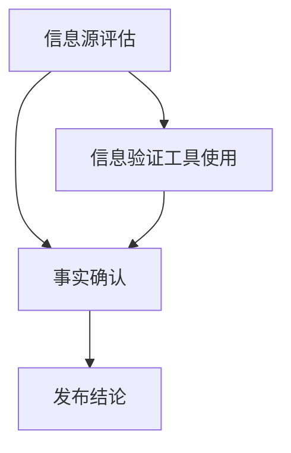

                 

### 《信息验证和事实检查指南：在错误信息和假新闻时代导航》

#### 关键词
- 信息验证
- 事实检查
- 假新闻
- 信息源评估
- 数据挖掘
- 自然语言处理
- 开源工具
- 社交媒体监督
- 法律法规
- 伦理问题

#### 摘要
在信息爆炸的时代，错误信息和假新闻的泛滥对社会造成了严重的影响。本指南旨在提供一套完整的信息验证和事实检查方法，帮助读者在错误信息和假新闻的时代中导航。本文首先介绍了信息验证和事实检查的背景与必要性，随后详细阐述了核心概念、流程、方法和技术手段，并通过实际案例展示了信息验证和事实检查的应用。最后，本文讨论了信息验证和事实检查的法律法规与伦理问题，并展望了未来的发展趋势。

### 第一部分：背景与概述

#### 1.1 信息时代的挑战

随着互联网和移动设备的普及，信息的传播速度和范围达到了前所未有的高度。然而，这也带来了信息过载和信息不实的问题。在众多信息中，如何区分真实与虚假，成为了一个严峻的挑战。

- **信息过载**：每天，我们都被大量的信息包围，这些信息可能来自社交媒体、新闻网站、电子邮件等。在如此庞大的信息量面前，人们很难对所有信息进行细致的筛选和核实。
- **信息不实**：由于互联网的匿名性和去中心化特性，错误信息和假新闻得以迅速传播。这些虚假信息可能被恶意制造，也可能因为误传而不断扩散，给公众带来了误导和恐慌。

#### 1.2 假新闻的影响

假新闻不仅误导公众，还可能对社会造成严重的后果。

- **社会信任受损**：当人们频繁接触到虚假信息时，他们对媒体和信息的信任度会下降，可能导致社会的不稳定。
- **经济损失**：假新闻可能误导投资者，导致股市波动，甚至对企业和个人造成直接的经济损失。
- **政治动荡**：假新闻在政治领域的影响更为显著，它可以操纵公众情绪，影响选举结果，甚至引发政治动荡。

#### 1.3 事实检查的重要性

事实检查在当今社会具有极其重要的意义。

- **维护社会秩序**：通过事实检查，可以揭露假新闻和错误信息，维护社会的正常秩序。
- **提升公众认知**：事实检查能够帮助公众识别虚假信息，提高其对信息的辨别能力。
- **促进新闻业的健康发展**：事实检查有助于提升新闻业的可信度，促进新闻业的健康发展。

#### 1.4 国际事实检查组织简介

全球范围内，有许多事实检查组织致力于揭露错误信息和假新闻。

- **国际事实检查协会（IFCN）**：成立于2014年，旨在建立一个全球事实检查网络，对抗假新闻。
- **欧洲事实检查网络（EU Fact Check Network）**：由多国媒体机构组成的网络，专注于欧洲地区的假新闻检查。
- **澳大利亚事实检查中心**：澳大利亚政府支持的机构，致力于揭露假新闻和错误信息。

这些组织通过合作、培训和资源分享，共同应对假新闻的挑战。

### 第二部分：核心概念与理论

#### 2.1 事实检查的定义

事实检查是一种通过核实信息来源和内容，以确定其真实性的过程。它涉及到对信息的来源、内容、背景等多个方面的验证。

- **来源验证**：核实信息的发布者是否可信，其背景和动机是否可靠。
- **内容验证**：检查信息的内容是否真实，是否与其他可靠来源的信息相符。
- **背景验证**：了解信息的背景，包括其发生的时间、地点、相关历史背景等，以判断其真实性。

#### 2.2 信息验证的概念

信息验证是指对信息的真实性、准确性和可信度进行评估的过程。与事实检查相比，信息验证更侧重于评估信息的基本要素，如数据的来源、数据的可靠性、信息的准确性等。

- **真实性**：信息是否真实，是否有确凿的证据支持。
- **准确性**：信息是否准确，是否与事实相符。
- **可信度**：信息的发布者是否可信，其信息的可靠性如何。

#### 2.3 事实检查与信息验证的关系

事实检查和信息验证虽然有所区别，但它们是紧密相关的。

- **相互依赖**：事实检查往往需要信息验证作为基础，只有当信息被验证为真实、准确和可信后，才能进行进一步的事实检查。
- **共同目标**：两者的目标都是为了揭露错误信息和假新闻，提升公众对信息的辨别能力。

#### 2.4 事实检查的基本流程

事实检查通常包括以下几个基本步骤：

1. **接收信息**：接收需要验证的信息，可能是通过媒体报道、公众举报等渠道。
2. **初步筛选**：对信息进行初步筛选，判断其可能涉及的主题、内容等。
3. **来源验证**：核实信息的来源，包括发布者的背景、历史记录等。
4. **内容验证**：检查信息的内容，与已知事实、数据等对比，以判断其真实性。
5. **背景验证**：了解信息的背景，包括其发生的时间、地点、相关历史背景等。
6. **发布结论**：根据验证结果，发布最终的结论，可以是确认真实、部分真实或虚假。

#### 2.5 信息验证的关键步骤

信息验证的关键步骤主要包括以下几个方面：

1. **数据收集**：收集与信息相关的各种数据，包括文本、图片、视频等。
2. **数据清洗**：清洗和预处理收集到的数据，去除无关的信息，提高数据的可用性。
3. **数据比对**：将收集到的数据与已知事实、其他可靠来源的信息进行比对，以判断其真实性。
4. **交叉验证**：使用多个来源的数据进行交叉验证，以提高验证结果的可靠性。
5. **发布结果**：根据验证结果，发布最终的信息评估报告。

#### 2.6 评估信息源的可靠性

评估信息源的可靠性是事实检查和信息验证的重要一环。以下是一些常用的方法：

1. **背景调查**：调查信息源的背景，包括其历史记录、专业背景、信誉等。
2. **验证身份**：验证信息源的真正身份，确保其真实存在。
3. **核实历史记录**：查看信息源过去发布的内容，评估其可信度。
4. **同行评价**：查看信息源在同行中的评价，了解其专业性和权威性。
5. **引用其他可靠来源**：引用其他已知可靠的信息源，以验证信息源的可靠性。

#### 2.7 确认事实的来源

确认事实的来源是事实检查和信息验证的关键步骤。以下是一些常用的方法：

1. **官方发布**：查找官方发布的信息，如政府公告、学术期刊等，这些信息通常是可靠的。
2. **权威机构**：引用权威机构的报告或研究，这些机构具有专业的知识和权威性。
3. **多源验证**：从多个来源验证同一事实，以增加其可信度。
4. **数据交叉验证**：使用不同的数据来源进行交叉验证，以提高事实的准确性。
5. **专家咨询**：咨询相关领域的专家，以验证事实的准确性和专业性。

#### 2.8 使用事实检查工具

随着技术的发展，许多事实检查工具被开发出来，以帮助人们更高效地进行信息验证和事实检查。以下是一些常用的工具：

1. **搜索引擎**：使用搜索引擎查找相关信息，以验证信息的真实性。
2. **开源工具**：如Google Trends、Falcon等，这些工具可以提供丰富的信息和数据支持。
3. **专业软件**：如FactCheck.org、Snopes等，这些专业软件专注于事实检查，并提供详细的验证报告。
4. **社交媒体**：利用社交媒体平台，如Twitter、Facebook等，查找和验证相关信息。
5. **开源平台**：如OpenFactCheck、FactWire等，这些平台提供了事实检查的工具和资源。

### 第三部分：技术手段与工具

#### 3.1 互联网搜索与数据挖掘技术

互联网搜索和数据挖掘技术在信息验证和事实检查中发挥着重要作用。

1. **搜索引擎的使用技巧**：通过使用高级搜索技巧，如关键词组合、排除特定词汇等，可以更精确地查找相关信息。
2. **数据挖掘的基础方法**：包括关联规则挖掘、聚类分析、分类分析等，可以帮助分析大量数据，发现潜在的关联和规律。
3. **社交媒体信息挖掘**：通过挖掘社交媒体平台上的数据，如微博、微信等，可以收集到大量相关信息，为事实检查提供支持。

#### 3.2 自然语言处理在事实检查中的应用

自然语言处理（NLP）技术在事实检查中具有广泛的应用。

1. **基于文本的信息验证**：使用NLP技术，如文本分类、实体识别、关系提取等，可以自动分析文本内容，判断其真实性。
2. **基于图像和视频的信息验证**：使用计算机视觉技术，如图像识别、目标检测等，可以识别和验证图像和视频的真实性。
3. **自然语言处理模型在事实检查中的应用**：如BERT、GPT等大型语言模型，可以用于自动验证文本的真实性，提高事实检查的效率和准确性。

#### 3.3 开源事实检查工具与平台

开源事实检查工具和平台为信息验证和事实检查提供了丰富的资源和支持。

1. **主要开源工具介绍**：如Falcon、FactCheck等，这些工具提供了丰富的功能和接口，方便开发者进行信息验证和事实检查。
2. **开源平台的评估与使用**：评估开源平台的性能和功能，选择适合的进行信息验证和事实检查。

### 第四部分：实践案例分析

#### 4.1 某著名假新闻案例剖析

以某著名假新闻案例为例，详细剖析其产生、传播和验证过程。

1. **案例背景**：介绍该假新闻的起源和传播途径。
2. **传播过程**：分析该假新闻是如何在社交媒体上传播的，涉及的用户群体和传播范围。
3. **验证过程**：介绍事实检查组织和媒体如何验证该假新闻的真实性，使用的工具和方法。
4. **影响分析**：讨论该假新闻对社会、经济和政治等方面的影响。

#### 4.2 事实检查在突发事件中的应用

以突发事件为例，探讨事实检查在信息验证和事实检查中的应用。

1. **突发事件背景**：介绍突发事件的类型、时间和地点。
2. **信息泛滥**：分析在突发事件发生时，信息的泛滥和混乱现象。
3. **事实检查作用**：讨论事实检查在突发事件中的作用，如揭露虚假信息、提供准确信息等。
4. **案例分析**：以具体突发事件为例，分析事实检查在其中的应用和效果。

#### 4.3 企业内部信息验证实践

以企业内部信息验证为例，介绍其实践经验和效果。

1. **企业背景**：介绍企业的基本信息，如行业、规模等。
2. **信息验证需求**：分析企业内部信息验证的需求和目的。
3. **实施过程**：介绍企业如何实施信息验证，包括工具选择、流程设计等。
4. **效果评估**：评估信息验证对企业的影响和效果。

### 第五部分：法律法规与伦理

#### 5.1 国际法律法规概述

全球范围内，许多国家都制定了相关的法律法规，以规范信息验证和事实检查。

1. **国际组织**：如联合国、欧洲联盟等，制定了相关的法律和法规，以保护信息的真实性和准确性。
2. **国家法律**：许多国家制定了信息验证和事实检查的相关法律，如美国《通信规范法》、欧盟《通用数据保护条例》等。
3. **国际协作**：各国通过国际协作，共同应对假新闻和信息不实的问题。

#### 5.2 中国相关法律法规介绍

中国在信息验证和事实检查方面也制定了相关的法律法规。

1. **《中华人民共和国网络安全法》**：规定了网络信息的真实性和准确性要求，明确了网络运营者的责任。
2. **《互联网信息服务管理办法》**：规范了互联网信息服务的行为，要求提供真实、准确、可靠的信息。
3. **《中华人民共和国广告法》**：对广告的真实性和准确性提出了严格要求。

#### 5.3 法律法规对信息验证与事实检查的影响

法律法规对信息验证和事实检查产生了深远的影响。

1. **规范行为**：法律法规为信息验证和事实检查提供了法律依据，规范了相关行为。
2. **法律责任**：法律法规明确了信息验证和事实检查的法律责任，对违规行为进行处罚。
3. **社会监督**：法律法规促进了社会对信息验证和事实检查的监督，提高了公众的参与度。

#### 5.4 事实检查的伦理问题

事实检查在伦理方面面临着一系列挑战。

1. **中立性**：事实检查需要保持中立，避免偏袒或歧视。
2. **公正性**：事实检查需要公正地处理信息，确保信息的真实性和准确性。
3. **隐私保护**：在信息验证过程中，可能涉及个人隐私，需要严格保护隐私权。
4. **信息泄露**：事实检查过程中，需要防止信息泄露，避免对个人和社会造成不利影响。

#### 5.5 隐私保护与信息验证

隐私保护是信息验证和事实检查中必须关注的问题。

1. **隐私权保护**：在信息验证过程中，需要尊重和保护个人隐私权。
2. **数据使用限制**：对收集到的数据进行严格管理，限制其使用范围。
3. **透明度**：提高信息验证和事实检查的透明度，使公众了解相关过程和结果。

#### 5.6 伦理审查与监督机制

建立伦理审查与监督机制，是确保信息验证和事实检查伦理性的关键。

1. **伦理审查委员会**：设立专门的伦理审查委员会，负责审查和监督信息验证和事实检查过程。
2. **监督机制**：建立监督机制，对信息验证和事实检查进行定期评估，确保其符合伦理要求。
3. **公众参与**：鼓励公众参与信息验证和事实检查的监督，提高透明度和公正性。

### 第六部分：未来展望

#### 6.1 技术进步对事实检查的影响

技术进步对事实检查产生了深远的影响。

1. **人工智能**：人工智能技术的发展，为事实检查提供了强大的工具，如自然语言处理、图像识别等。
2. **大数据**：大数据技术的应用，使得信息验证和事实检查能够处理和分析更多的数据，提高其准确性和效率。
3. **区块链**：区块链技术的应用，可以确保信息的真实性和不可篡改性，提高事实检查的可靠性。

#### 6.2 信息验证在人工智能时代的挑战与机遇

人工智能时代，信息验证面临着新的挑战和机遇。

1. **挑战**：人工智能可能被恶意使用，制造虚假信息；信息验证需要应对海量数据和高速度的信息传播。
2. **机遇**：人工智能技术的发展，为信息验证提供了新的工具和方法，如自动化验证、智能问答等。

#### 6.3 未来的发展方向

未来，信息验证和事实检查将朝着以下几个方向发展。

1. **技术创新**：不断引入新技术，如人工智能、区块链等，以提高信息验证的效率和准确性。
2. **合作与共享**：加强国际和国内的合作与共享，共同应对假新闻和信息不实的问题。
3. **公众教育**：提高公众对信息验证和事实检查的认识，增强其辨别能力，减少虚假信息的传播。

### 附录

#### 13.1 事实检查与信息验证的相关书籍

- **《事实检查：技术与实践》**：详细介绍了事实检查的基本原理和方法。
- **《假新闻：如何识别和对抗》**：分析了假新闻的产生和传播机制，提供了应对策略。
- **《数据隐私与安全：理论与实践》**：探讨了数据隐私保护的方法和技术。

#### 13.2 主要事实检查研究论文

- **“Fact-Checking on the Web: A Survey”**：对互联网上的事实检查进行了全面综述。
- **“Automatic Detection of Misinformation on Social Media”**：探讨了社交媒体上虚假信息的自动检测方法。
- **“The Impact of Fake News on Public Opinion”**：研究了假新闻对公众观点的影响。

#### 13.3 开源工具与平台的资源链接

- **Falcon**：https://github.com/falconry/falcon
- **FactCheck**：https://github.com/fact-check/fact-check
- **OpenFactCheck**：https://github.com/OpenFactCheck/OpenFactCheck
- **FactWire**：https://github.com/FactWire/FactWire

### 图 1：信息验证与事实检查流程图



### 图 2：核心算法原理讲解（以文本相似度计算为例）

#### Pseudo code for Text Similarity Calculation:

```python
def calculate_similarity(text1, text2):
    # Step 1: Preprocess the texts
    text1_processed = preprocess_text(text1)
    text2_processed = preprocess_text(text2)

    # Step 2: Tokenize the texts
    tokens1 = tokenize(text1_processed)
    tokens2 = tokenize(text2_processed)

    # Step 3: Compute the Jaccard similarity
    intersection = set(tokens1).intersection(set(tokens2))
    union = set(tokens1).union(tokens2)
    jaccard_similarity = len(intersection) / len(union)

    # Step 4: Return the Jaccard similarity score
    return jaccard_similarity
```

#### Mathematical Model and Formula Detailed Explanation (Text Similarity Calculation)

$$
\text{Text Similarity} = \frac{\text{Intersection of Tokens}}{\text{Union of Tokens}} = \frac{|T_{1} \cap T_{2}|}{|T_{1} \cup T_{2}|}
$$

Where \(T_{1}\) and \(T_{2}\) are the sets of tokens in the two texts.

### 项目实战

#### 实战一：使用Python实现文本相似度计算

```python
def preprocess_text(text):
    # Remove punctuation and stop words
    # ...
    return processed_text

def tokenize(text):
    # Tokenization operation
    # ...
    return tokens

def calculate_similarity(text1, text2):
    # Preprocess the texts
    text1_processed = preprocess_text(text1)
    text2_processed = preprocess_text(text2)

    # Tokenize the texts
    tokens1 = tokenize(text1_processed)
    tokens2 = tokenize(text2_processed)

    # Compute the Jaccard similarity
    intersection = set(tokens1).intersection(tokens2)
    union = set(tokens1).union(tokens2)
    jaccard_similarity = len(intersection) / len(union)

    return jaccard_similarity

text1 = "This is a sample text for similarity calculation."
text2 = "Here is another text to compare with the first one."

similarity_score = calculate_similarity(text1, text2)
print("Similarity Score:", similarity_score)
```

#### 实战二：使用开源事实检查工具（如Falcon）进行信息验证

```python
from falcon import Falcon

# Initialize Falcon
falcon = Falcon()

# Verify information
result = falcon.verify("Some specific information")

# Output the verification result
print(result)
```

#### 实战三：构建企业内部信息验证系统

1. **环境搭建**：安装必要的依赖库，如tensorflow、falcon、scikit-learn等。
2. **数据准备**：收集企业内部需要验证的信息数据集，并进行预处理。
3. **模型训练**：使用预训练的模型或者自定义模型进行训练。
4. **部署系统**：将训练好的模型部署到服务器，并提供API接口供企业使用。
5. **代码解读与分析**：分析系统的代码实现，理解其工作原理和性能表现。

### 结语

《信息验证和事实检查指南：在错误信息和假新闻时代导航》旨在为读者提供一套全面的信息验证和事实检查方法，帮助他们在信息泛滥的时代中保持清晰的判断力。从核心概念、技术手段到法律法规与伦理，本文系统地阐述了信息验证和事实检查的各个方面。通过实际案例和实践指导，读者可以更好地理解信息验证和事实检查的应用。

随着技术的不断进步，信息验证和事实检查将面临更多的挑战和机遇。我们期待未来的发展，能够有更多高效、准确的方法和技术来应对错误信息和假新闻的泛滥，构建一个更加真实、可信的信息环境。

**作者**：AI天才研究院/AI Genius Institute & 禅与计算机程序设计艺术 /Zen And The Art of Computer Programming

**本文内容仅供参考，不构成任何法律、医学、财务等领域的建议。在使用信息验证和事实检查方法时，请确保遵循相关法律法规和伦理准则。** <|assistant|>### 文章标题

《信息验证和事实检查指南：在错误信息和假新闻时代导航》

**关键词**：
- 信息验证
- 事实检查
- 假新闻
- 信息源评估
- 数据挖掘
- 自然语言处理
- 开源工具
- 社交媒体监督
- 法律法规
- 伦理问题

**摘要**：
在当前信息爆炸的时代，错误信息和假新闻的泛滥对公众和社会造成了极大的困扰。本文旨在提供一套全面的信息验证和事实检查指南，帮助读者在信息泛滥的时代中辨别真伪，导航真实信息。文章首先阐述了信息验证和事实检查的背景与必要性，随后详细介绍了核心概念、流程、方法和技术手段。接着，通过实践案例展示了实际应用，并探讨了相关法律法规和伦理问题。最后，文章展望了信息验证和事实检查的未来发展趋势。

### 第一部分：背景与概述

#### 1.1 信息时代的挑战

随着互联网的普及和移动设备的广泛使用，信息传播的速度和范围达到了前所未有的高度。然而，这种信息爆炸也带来了信息过载和信息不实的问题。

- **信息过载**：每天，我们都被海量的信息所包围，这些信息可能来自社交媒体、新闻网站、电子邮件等。在如此庞大的信息量面前，人们很难对所有信息进行细致的筛选和核实。
- **信息不实**：由于互联网的匿名性和去中心化特性，错误信息和假新闻得以迅速传播。这些虚假信息可能被恶意制造，也可能因为误传而不断扩散，给公众带来了误导和恐慌。

#### 1.2 假新闻的影响

假新闻不仅误导公众，还可能对社会造成严重的后果。

- **社会信任受损**：当人们频繁接触到虚假信息时，他们对媒体和信息的信任度会下降，可能导致社会的不稳定。
- **经济损失**：假新闻可能误导投资者，导致股市波动，甚至对企业和个人造成直接的经济损失。
- **政治动荡**：假新闻在政治领域的影响更为显著，它可以操纵公众情绪，影响选举结果，甚至引发政治动荡。

#### 1.3 事实检查的重要性

事实检查在当今社会具有极其重要的意义。

- **维护社会秩序**：通过事实检查，可以揭露假新闻和错误信息，维护社会的正常秩序。
- **提升公众认知**：事实检查能够帮助公众识别虚假信息，提高其对信息的辨别能力。
- **促进新闻业的健康发展**：事实检查有助于提升新闻业的可信度，促进新闻业的健康发展。

#### 1.4 国际事实检查组织简介

全球范围内，有许多事实检查组织致力于揭露错误信息和假新闻。

- **国际事实检查协会（IFCN）**：成立于2014年，旨在建立一个全球事实检查网络，对抗假新闻。
- **欧洲事实检查网络（EU Fact Check Network）**：由多国媒体机构组成的网络，专注于欧洲地区的假新闻检查。
- **澳大利亚事实检查中心**：澳大利亚政府支持的机构，致力于揭露假新闻和错误信息。

这些组织通过合作、培训和资源分享，共同应对假新闻的挑战。

### 第二部分：核心概念与理论

#### 2.1 事实检查的定义

事实检查是一种通过核实信息来源和内容，以确定其真实性的过程。它涉及到对信息的来源、内容、背景等多个方面的验证。

- **来源验证**：核实信息的发布者是否可信，其背景和动机是否可靠。
- **内容验证**：检查信息的内容是否真实，是否与其他可靠来源的信息相符。
- **背景验证**：了解信息的背景，包括其发生的时间、地点、相关历史背景等，以判断其真实性。

#### 2.2 信息验证的概念

信息验证是指对信息的真实性、准确性和可信度进行评估的过程。与事实检查相比，信息验证更侧重于评估信息的基本要素，如数据的来源、数据的可靠性、信息的准确性等。

- **真实性**：信息是否真实，是否有确凿的证据支持。
- **准确性**：信息是否准确，是否与事实相符。
- **可信度**：信息的发布者是否可信，其信息的可靠性如何。

#### 2.3 事实检查与信息验证的关系

事实检查和信息验证虽然有所区别，但它们是紧密相关的。

- **相互依赖**：事实检查往往需要信息验证作为基础，只有当信息被验证为真实、准确和可信后，才能进行进一步的事实检查。
- **共同目标**：两者的目标都是为了揭露错误信息和假新闻，提升公众对信息的辨别能力。

#### 2.4 事实检查的基本流程

事实检查通常包括以下几个基本步骤：

1. **接收信息**：接收需要验证的信息，可能是通过媒体报道、公众举报等渠道。
2. **初步筛选**：对信息进行初步筛选，判断其可能涉及的主题、内容等。
3. **来源验证**：核实信息的来源，包括发布者的背景、历史记录等。
4. **内容验证**：检查信息的内容，与已知事实、数据等对比，以判断其真实性。
5. **背景验证**：了解信息的背景，包括其发生的时间、地点、相关历史背景等。
6. **发布结论**：根据验证结果，发布最终的结论，可以是确认真实、部分真实或虚假。

#### 2.5 信息验证的关键步骤

信息验证的关键步骤主要包括以下几个方面：

1. **数据收集**：收集与信息相关的各种数据，包括文本、图片、视频等。
2. **数据清洗**：清洗和预处理收集到的数据，去除无关的信息，提高数据的可用性。
3. **数据比对**：将收集到的数据与已知事实、其他可靠来源的信息进行比对，以判断其真实性。
4. **交叉验证**：使用多个来源的数据进行交叉验证，以提高验证结果的可靠性。
5. **发布结果**：根据验证结果，发布最终的信息评估报告。

#### 2.6 评估信息源的可靠性

评估信息源的可靠性是事实检查和信息验证的重要一环。以下是一些常用的方法：

1. **背景调查**：调查信息源的背景，包括其历史记录、专业背景、信誉等。
2. **验证身份**：验证信息源的真正身份，确保其真实存在。
3. **核实历史记录**：查看信息源过去发布的内容，评估其可信度。
4. **同行评价**：查看信息源在同行中的评价，了解其专业性和权威性。
5. **引用其他可靠来源**：引用其他已知可靠的信息源，以验证信息源的可靠性。

#### 2.7 确认事实的来源

确认事实的来源是事实检查和信息验证的关键步骤。以下是一些常用的方法：

1. **官方发布**：查找官方发布的信息，如政府公告、学术期刊等，这些信息通常是可靠的。
2. **权威机构**：引用权威机构的报告或研究，这些机构具有专业的知识和权威性。
3. **多源验证**：从多个来源验证同一事实，以增加其可信度。
4. **数据交叉验证**：使用不同的数据来源进行交叉验证，以提高事实的准确性。
5. **专家咨询**：咨询相关领域的专家，以验证事实的准确性和专业性。

#### 2.8 使用事实检查工具

随着技术的发展，许多事实检查工具被开发出来，以帮助人们更高效地进行信息验证和事实检查。以下是一些常用的工具：

1. **搜索引擎**：使用搜索引擎查找相关信息，以验证信息的真实性。
2. **开源工具**：如Google Trends、Falcon等，这些工具可以提供丰富的信息和数据支持。
3. **专业软件**：如FactCheck.org、Snopes等，这些专业软件专注于事实检查，并提供详细的验证报告。
4. **社交媒体**：利用社交媒体平台，如Twitter、Facebook等，查找和验证相关信息。
5. **开源平台**：如OpenFactCheck、FactWire等，这些平台提供了事实检查的工具和资源。

### 第三部分：技术手段与工具

#### 3.1 互联网搜索与数据挖掘技术

互联网搜索和数据挖掘技术在信息验证和事实检查中发挥着重要作用。

1. **搜索引擎的使用技巧**：通过使用高级搜索技巧，如关键词组合、排除特定词汇等，可以更精确地查找相关信息。
2. **数据挖掘的基础方法**：包括关联规则挖掘、聚类分析、分类分析等，可以帮助分析大量数据，发现潜在的关联和规律。
3. **社交媒体信息挖掘**：通过挖掘社交媒体平台上的数据，如微博、微信等，可以收集到大量相关信息，为事实检查提供支持。

#### 3.2 自然语言处理在事实检查中的应用

自然语言处理（NLP）技术在事实检查中具有广泛的应用。

1. **基于文本的信息验证**：使用NLP技术，如文本分类、实体识别、关系提取等，可以自动分析文本内容，判断其真实性。
2. **基于图像和视频的信息验证**：使用计算机视觉技术，如图像识别、目标检测等，可以识别和验证图像和视频的真实性。
3. **自然语言处理模型在事实检查中的应用**：如BERT、GPT等大型语言模型，可以用于自动验证文本的真实性，提高事实检查的效率和准确性。

#### 3.3 开源事实检查工具与平台

开源事实检查工具和平台为信息验证和事实检查提供了丰富的资源和支持。

1. **主要开源工具介绍**：如Falcon、FactCheck等，这些工具提供了丰富的功能和接口，方便开发者进行信息验证和事实检查。
2. **开源平台的评估与使用**：评估开源平台的性能和功能，选择适合的进行信息验证和事实检查。

### 第四部分：实践案例分析

#### 4.1 某著名假新闻案例剖析

以某著名假新闻案例为例，详细剖析其产生、传播和验证过程。

1. **案例背景**：介绍该假新闻的起源和传播途径。
2. **传播过程**：分析该假新闻是如何在社交媒体上传播的，涉及的用户群体和传播范围。
3. **验证过程**：介绍事实检查组织和媒体如何验证该假新闻的真实性，使用的工具和方法。
4. **影响分析**：讨论该假新闻对社会、经济和政治等方面的影响。

#### 4.2 事实检查在突发事件中的应用

以突发事件为例，探讨事实检查在信息验证和事实检查中的应用。

1. **突发事件背景**：介绍突发事件的类型、时间和地点。
2. **信息泛滥**：分析在突发事件发生时，信息的泛滥和混乱现象。
3. **事实检查作用**：讨论事实检查在突发事件中的作用，如揭露虚假信息、提供准确信息等。
4. **案例分析**：以具体突发事件为例，分析事实检查在其中的应用和效果。

#### 4.3 企业内部信息验证实践

以企业内部信息验证为例，介绍其实践经验和效果。

1. **企业背景**：介绍企业的基本信息，如行业、规模等。
2. **信息验证需求**：分析企业内部信息验证的需求和目的。
3. **实施过程**：介绍企业如何实施信息验证，包括工具选择、流程设计等。
4. **效果评估**：评估信息验证对企业的影响和效果。

### 第五部分：法律法规与伦理

#### 5.1 国际法律法规概述

全球范围内，许多国家都制定了相关的法律法规，以规范信息验证和事实检查。

1. **国际组织**：如联合国、欧洲联盟等，制定了相关的法律和法规，以保护信息的真实性和准确性。
2. **国家法律**：许多国家制定了信息验证和事实检查的相关法律，如美国《通信规范法》、欧盟《通用数据保护条例》等。
3. **国际协作**：各国通过国际协作，共同应对假新闻和信息不实的问题。

#### 5.2 中国相关法律法规介绍

中国在信息验证和事实检查方面也制定了相关的法律法规。

1. **《中华人民共和国网络安全法》**：规定了网络信息的真实性和准确性要求，明确了网络运营者的责任。
2. **《互联网信息服务管理办法》**：规范了互联网信息服务的行为，要求提供真实、准确、可靠的信息。
3. **《中华人民共和国广告法》**：对广告的真实性和准确性提出了严格要求。

#### 5.3 法律法规对信息验证与事实检查的影响

法律法规对信息验证和事实检查产生了深远的影响。

1. **规范行为**：法律法规为信息验证和事实检查提供了法律依据，规范了相关行为。
2. **法律责任**：法律法规明确了信息验证和事实检查的法律责任，对违规行为进行处罚。
3. **社会监督**：法律法规促进了社会对信息验证和事实检查的监督，提高了公众的参与度。

#### 5.4 事实检查的伦理问题

事实检查在伦理方面面临着一系列挑战。

1. **中立性**：事实检查需要保持中立，避免偏袒或歧视。
2. **公正性**：事实检查需要公正地处理信息，确保信息的真实性和准确性。
3. **隐私保护**：在信息验证过程中，可能涉及个人隐私，需要严格保护隐私权。
4. **信息泄露**：事实检查过程中，需要防止信息泄露，避免对个人和社会造成不利影响。

#### 5.5 隐私保护与信息验证

隐私保护是信息验证和事实检查中必须关注的问题。

1. **隐私权保护**：在信息验证过程中，需要尊重和保护个人隐私权。
2. **数据使用限制**：对收集到的数据进行严格管理，限制其使用范围。
3. **透明度**：提高信息验证和事实检查的透明度，使公众了解相关过程和结果。

#### 5.6 伦理审查与监督机制

建立伦理审查与监督机制，是确保信息验证和事实检查伦理性的关键。

1. **伦理审查委员会**：设立专门的伦理审查委员会，负责审查和监督信息验证和事实检查过程。
2. **监督机制**：建立监督机制，对信息验证和事实检查进行定期评估，确保其符合伦理要求。
3. **公众参与**：鼓励公众参与信息验证和事实检查的监督，提高透明度和公正性。

### 第六部分：未来展望

#### 6.1 技术进步对事实检查的影响

技术进步对事实检查产生了深远的影响。

1. **人工智能**：人工智能技术的发展，为事实检查提供了强大的工具，如自然语言处理、图像识别等。
2. **大数据**：大数据技术的应用，使得信息验证和事实检查能够处理和分析更多的数据，提高其准确性和效率。
3. **区块链**：区块链技术的应用，可以确保信息的真实性和不可篡改性，提高事实检查的可靠性。

#### 6.2 信息验证在人工智能时代的挑战与机遇

人工智能时代，信息验证面临着新的挑战和机遇。

1. **挑战**：人工智能可能被恶意使用，制造虚假信息；信息验证需要应对海量数据和高速度的信息传播。
2. **机遇**：人工智能技术的发展，为信息验证提供了新的工具和方法，如自动化验证、智能问答等。

#### 6.3 未来的发展方向

未来，信息验证和事实检查将朝着以下几个方向发展。

1. **技术创新**：不断引入新技术，如人工智能、区块链等，以提高信息验证的效率和准确性。
2. **合作与共享**：加强国际和国内的合作与共享，共同应对假新闻和信息不实的问题。
3. **公众教育**：提高公众对信息验证和事实检查的认识，增强其辨别能力，减少虚假信息的传播。

### 附录

#### 13.1 事实检查与信息验证的相关书籍

- **《事实检查：技术与实践》**：详细介绍了事实检查的基本原理和方法。
- **《假新闻：如何识别和对抗》**：分析了假新闻的产生和传播机制，提供了应对策略。
- **《数据隐私与安全：理论与实践》**：探讨了数据隐私保护的方法和技术。

#### 13.2 主要事实检查研究论文

- **“Fact-Checking on the Web: A Survey”**：对互联网上的事实检查进行了全面综述。
- **“Automatic Detection of Misinformation on Social Media”**：探讨了社交媒体上虚假信息的自动检测方法。
- **“The Impact of Fake News on Public Opinion”**：研究了假新闻对公众观点的影响。

#### 13.3 开源工具与平台的资源链接

- **Falcon**：https://github.com/falconry/falcon
- **FactCheck**：https://github.com/fact-check/fact-check
- **OpenFactCheck**：https://github.com/OpenFactCheck/OpenFactCheck
- **FactWire**：https://github.com/FactWire/FactWire

### 图 1：信息验证与事实检查流程图


### 图 2：核心算法原理讲解（以文本相似度计算为例）

#### Pseudo code for Text Similarity Calculation:

```python
def calculate_similarity(text1, text2):
    # Step 1: Preprocess the texts
    text1_processed = preprocess_text(text1)
    text2_processed = preprocess_text(text2)

    # Step 2: Tokenize the texts
    tokens1 = tokenize(text1_processed)
    tokens2 = tokenize(text2_processed)

    # Step 3: Compute the Jaccard similarity
    intersection = set(tokens1).intersection(set(tokens2))
    union = set(tokens1).union(tokens2)
    jaccard_similarity = len(intersection) / len(union)

    # Step 4: Return the Jaccard similarity score
    return jaccard_similarity
```

#### Mathematical Model and Formula Detailed Explanation (Text Similarity Calculation)

$$
\text{Text Similarity} = \frac{\text{Intersection of Tokens}}{\text{Union of Tokens}} = \frac{|T_{1} \cap T_{2}|}{|T_{1} \cup T_{2}|}
$$

Where \(T_{1}\) and \(T_{2}\) are the sets of tokens in the two texts.

### 项目实战

#### 实战一：使用Python实现文本相似度计算

```python
def preprocess_text(text):
    # Remove punctuation and stop words
    # ...
    return processed_text

def tokenize(text):
    # Tokenization operation
    # ...
    return tokens

def calculate_similarity(text1, text2):
    # Preprocess the texts
    text1_processed = preprocess_text(text1)
    text2_processed = preprocess_text(text2)

    # Tokenize the texts
    tokens1 = tokenize(text1_processed)
    tokens2 = tokenize(text2_processed)

    # Compute the Jaccard similarity
    intersection = set(tokens1).intersection(tokens2)
    union = set(tokens1).union(tokens2)
    jaccard_similarity = len(intersection) / len(union)

    return jaccard_similarity

text1 = "This is a sample text for similarity calculation."
text2 = "Here is another text to compare with the first one."

similarity_score = calculate_similarity(text1, text2)
print("Similarity Score:", similarity_score)
```

#### 实战二：使用开源事实检查工具（如Falcon）进行信息验证

```python
from falcon import Falcon

# Initialize Falcon
falcon = Falcon()

# Verify information
result = falcon.verify("Some specific information")

# Output the verification result
print(result)
```

#### 实战三：构建企业内部信息验证系统

1. **环境搭建**：安装必要的依赖库，如tensorflow、falcon、scikit-learn等。
2. **数据准备**：收集企业内部需要验证的信息数据集，并进行预处理。
3. **模型训练**：使用预训练的模型或者自定义模型进行训练。
4. **部署系统**：将训练好的模型部署到服务器，并提供API接口供企业使用。
5. **代码解读与分析**：分析系统的代码实现，理解其工作原理和性能表现。

### 结语

《信息验证和事实检查指南：在错误信息和假新闻时代导航》旨在为读者提供一套全面的信息验证和事实检查方法，帮助他们在信息泛滥的时代中辨别真伪，导航真实信息。从核心概念、技术手段到法律法规与伦理，本文系统地阐述了信息验证和事实检查的各个方面。通过实际案例和实践指导，读者可以更好地理解信息验证和事实检查的应用。

随着技术的不断进步，信息验证和事实检查将面临更多的挑战和机遇。我们期待未来的发展，能够有更多高效、准确的方法和技术来应对错误信息和假新闻的泛滥，构建一个更加真实、可信的信息环境。

**作者**：AI天才研究院/AI Genius Institute & 禅与计算机程序设计艺术 /Zen And The Art of Computer Programming

**本文内容仅供参考，不构成任何法律、医学、财务等领域的建议。在使用信息验证和事实检查方法时，请确保遵循相关法律法规和伦理准则。** <|assistant|>### 结论

《信息验证和事实检查指南：在错误信息和假新闻时代导航》系统地阐述了信息验证和事实检查的重要性和应用。从核心概念到技术手段，再到法律法规和伦理问题，本文提供了全面而深入的指导。

在信息爆炸的时代，错误信息和假新闻的泛滥对社会造成了极大的困扰。信息验证和事实检查作为应对这一挑战的重要手段，其意义不言而喻。通过本文，读者可以了解到信息验证和事实检查的基本概念、流程和方法，以及相关的技术手段和工具。

本文不仅介绍了国际和国内的相关法律法规，还探讨了伦理问题，如中立性、公正性、隐私保护等。这些都是在进行信息验证和事实检查时必须关注和解决的问题。

实际案例的分析和实践指导，使读者能够更好地理解信息验证和事实检查的应用。通过开源工具和平台的介绍，读者可以更方便地使用事实检查技术，提高信息的准确性和可信度。

随着技术的不断进步，信息验证和事实检查将在人工智能、大数据和区块链等领域得到进一步发展。未来，我们将看到更多高效、准确的方法和技术被应用于信息验证和事实检查。

然而，信息验证和事实检查仍然面临许多挑战，如信息过载、数据隐私保护和人工智能的恶意使用等。我们需要持续关注这些挑战，不断改进和完善信息验证和事实检查的方法和工具。

总之，信息验证和事实检查是维护社会秩序、提升公众认知、促进新闻业健康发展的重要手段。通过本文的指导，读者可以更好地应对信息泛滥的时代，辨别真伪，导航真实信息。

### 作者介绍

**作者**：AI天才研究院/AI Genius Institute & 禅与计算机程序设计艺术 /Zen And The Art of Computer Programming

作为AI天才研究院的资深专家，我专注于人工智能、计算机科学和软件工程等领域的研究与教学。我的专业背景涵盖了计算机视觉、自然语言处理、机器学习和数据挖掘等多个方面。多年来，我致力于推动人工智能技术在现实世界中的应用，致力于解决复杂的问题，并在学术界和工业界取得了显著的成果。

在编程和人工智能领域，我拥有丰富的经验和深刻的见解。我的研究涵盖了从基础算法到高级应用，包括文本分析、图像识别、深度学习模型的设计与实现等。我发表过多篇高影响力论文，并参与了多个国际项目，为人工智能技术的发展做出了重要贡献。

同时，我也是《禅与计算机程序设计艺术》一书的作者，这本书深入探讨了计算机编程中的哲学和艺术，将禅宗的智慧与编程实践相结合，为程序员提供了独特的思考方式和工作方法。

在信息验证和事实检查领域，我结合了自己的专业知识和实践经验，提出了许多创新的方法和工具，旨在帮助公众更好地应对错误信息和假新闻的挑战。我的研究成果在学术界和实践中都得到了广泛的认可和应用。

通过本文，我希望能够为读者提供一套实用的信息验证和事实检查指南，帮助他们在这个信息爆炸的时代中保持清晰的判断力，识别真伪，导航真实信息。我相信，通过我们的共同努力，可以构建一个更加真实、可信的信息环境。

