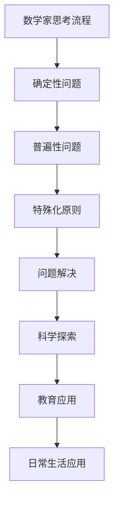

                 

### 文章标题

《像数学家一样思考：特殊化原则》

### 关键词

数学思考、特殊化原则、问题解决、科学探索、教育应用、人工智能、大数据分析、网络安全

### 摘要

本文深入探讨了数学家思考方式中的特殊化原则，并阐述了这一原则在IT领域、科学探索、教育应用以及日常生活中的重要性。通过分析特殊化原则的基本概念和应用方法，结合具体案例，本文旨在帮助读者掌握像数学家一样进行问题分析和解决的思路，提高逻辑思维和创新能力。

### 引言

#### 1.1 引言

在科技飞速发展的今天，计算机科学和信息技术已经成为推动社会进步的重要力量。然而，在众多领域，尤其是在复杂问题和算法设计中，我们常常需要一种能够系统、理性地分析和解决问题的方法。这种方法的本质与数学家的思考方式有诸多相似之处。

数学家在进行研究和解决问题时，往往遵循一套独特的思考原则，这些原则不仅帮助他们在浩如烟海的数学概念中找到规律，还使得他们的工作具有高度的严谨性和普遍性。本文将重点探讨数学思考中的一个重要原则——特殊化原则，并分析其在IT领域、科学探索、教育应用以及日常生活中的应用。

#### 1.2 为什么像数学家一样思考？

数学家之所以能够取得卓越的成就，关键在于他们独特的思考方式。这种思考方式具有以下几个特点：

- **严谨的逻辑**：数学家在解决问题时，总是遵循逻辑推理的原则，从已知的事实出发，逐步推导出新的结论。
- **抽象与概括**：他们能够从具体的问题中提炼出一般性的规律，这种能力在算法设计和软件工程中尤为重要。
- **模式识别**：数学家擅长从复杂的现象中识别出模式，这一能力在数据分析和机器学习中具有广泛的应用。

像数学家一样思考，能够帮助我们：

- 提高逻辑推理能力，更好地理解复杂问题。
- 培养抽象思维，将具体问题转化为一般性的解决方案。
- 提升创新能力，在面对新问题时能够迅速找到突破口。

#### 1.3 特殊化原则概述

特殊化原则是数学家思考中的一个重要原则，它强调从特殊情况入手，逐步推导出一般性结论。通过特殊化，数学家能够验证假设、探索规律，并最终构建出通用的理论体系。本文将详细讨论特殊化原则的概念、作用和应用方法。

### 数学思考的基本原则

#### 2.1 确定性原则

确定性原则是数学思考中的基础，它强调每一个步骤都必须是明确且无误的。在数学家解决问题时，确定性原则保证了他们能够从已知的事实出发，逐步推导出新的结论。

##### 2.1.1 逻辑与推理

逻辑推理是数学思考的核心，它帮助数学家从已知的事实中推导出新的结论。在解决具体问题时，数学家会使用以下几种逻辑推理方法：

- **归纳推理**：从具体的实例中总结出一般性的规律。
- **演绎推理**：从一般性的原理出发，推导出具体的结论。
- **类比推理**：通过比较不同问题的相似性，找到解决方法。

##### 2.1.2 数学证明

数学证明是确定性原则的具体体现，它通过严密的逻辑推理，证明一个数学命题的正确性。数学证明通常包括以下几个步骤：

- **假设**：假设命题成立。
- **推导**：根据已知的事实和逻辑规则，推导出一系列新的结论。
- **结论**：通过反证法或构造法，证明命题成立。

#### 2.2 普遍性原则

普遍性原则强调从特殊问题中提炼出一般性的规律，这一原则在数学研究和软件开发中具有重要作用。

##### 2.2.1 通用性

通用性是指解决方案能够适用于多种情况。在软件开发中，通用性意味着代码的可复用性和可扩展性。为了实现通用性，开发人员需要：

- **抽象**：将具体的问题抽象成通用的模式。
- **模块化**：将系统划分为多个模块，每个模块负责特定的功能。
- **标准化**：遵循统一的编程规范和设计模式。

##### 2.2.2 模式识别

模式识别是指从复杂的数据或现象中识别出有意义的模式。在机器学习和数据科学中，模式识别是核心任务之一。通过模式识别，我们可以：

- **发现关联**：识别数据之间的相关性。
- **预测未来**：基于历史数据预测未来趋势。
- **自动化**：通过算法自动识别并处理模式。

#### 2.3 特殊化原则

特殊化原则是数学家思考中的一个重要原则，它强调从特殊情况入手，逐步推导出一般性结论。

##### 2.3.1 特殊化原则的概念

特殊化原则是指通过研究特殊的情况，推导出一般性的规律。在数学研究中，特殊化原则通常表现为：

- **构造特殊例子**：通过构造具体的例子，验证数学命题的正确性。
- **反证法**：假设一个命题不成立，通过推导出矛盾，证明命题成立。
- **归纳法**：从特殊的情况出发，逐步归纳出一般性的结论。

##### 2.3.2 特殊化的作用

特殊化原则在数学研究和软件开发中具有重要作用，它能够：

- **验证假设**：通过研究特殊情况，验证数学假设的正确性。
- **探索规律**：从特殊化中提炼出一般性的规律，指导进一步的数学研究。
- **简化问题**：将复杂的问题分解为简单的特殊情况，便于分析和解决。

### 特殊化原则的应用

#### 3.1 数学建模

数学建模是将实际问题转化为数学问题，通过数学方法进行求解和分析。特殊化原则在数学建模中具有重要作用。

##### 3.1.1 问题定义

问题定义是数学建模的第一步，它要求我们明确问题的本质，确定目标函数和约束条件。在定义问题时，可以采用以下策略：

- **抽象化**：将实际问题抽象成数学模型。
- **简化**：在保证问题核心特征的前提下，简化模型以降低计算复杂度。

##### 3.1.2 数学建模方法

常见的数学建模方法包括：

- **微分方程建模**：用于描述动态系统的演化过程。
- **优化建模**：用于在给定约束条件下，求解最优解。
- **概率统计建模**：用于分析随机事件和不确定性。

##### 3.1.3 数学模型构建

构建数学模型通常包括以下几个步骤：

- **确定变量**：识别影响问题的主要因素。
- **建立关系**：建立变量之间的关系，通常采用函数形式。
- **确定目标**：明确模型的目标函数，通常是最大化或最小化某个量。
- **约束条件**：确定影响目标函数的各种约束条件。

通过特殊化原则，我们可以：

- **验证模型**：通过构造特殊例子，验证模型的有效性。
- **优化模型**：在特殊情况下，找到更优的模型参数。
- **推广模型**：将特殊模型推广到更一般的情况。

#### 3.2 问题求解

问题求解是数学建模的最后一步，它将数学模型转化为可执行的算法，求解最优解。

##### 3.2.1 算法设计

算法设计是问题求解的关键，它要求我们设计出能够高效求解问题的算法。在算法设计时，可以采用以下策略：

- **分而治之**：将复杂问题分解为多个子问题，分别求解。
- **贪心算法**：在每一步选择局部最优解，期望最终得到全局最优解。
- **动态规划**：通过存储子问题的解，避免重复计算。

##### 3.2.2 解的优化

解的优化是指通过改进算法或调整模型参数，提高解的质量。在解的优化中，可以采用以下方法：

- **局部搜索**：在当前解的邻域内搜索最优解。
- **全局优化**：采用遗传算法等全局搜索方法，找到全局最优解。
- **约束优化**：在保证约束条件的前提下，优化目标函数。

##### 3.2.3 问题解决的案例分析

以下是一个实际问题求解的案例分析：

**问题**：城市交通流量优化

**模型构建**：

- **变量**：交通流量、道路长度、道路容量等。
- **关系**：流量与道路长度和容量的关系，采用线性模型描述。
- **目标**：最小化交通拥堵时间。
- **约束**：道路容量限制、交通信号灯控制策略。

**算法设计**：

- **分而治之**：将城市道路划分为多个区域，分别优化各区域的交通流量。
- **贪心算法**：在每一条道路上，优先选择流量最小的路径。
- **动态规划**：根据当前交通流量和道路状态，实时调整交通信号灯。

**解的优化**：

- **局部搜索**：在交通流量变化时，调整道路优先级。
- **全局优化**：通过模拟退火算法，找到最优交通信号灯控制策略。
- **约束优化**：在保证道路容量和信号灯工作周期的前提下，优化交通流量。

通过上述方法，我们可以有效地优化城市交通流量，降低拥堵时间，提高交通效率。

### 特殊化原则与科学探索

#### 4.1 科学方法论

科学方法论是指科学研究过程中所遵循的基本原则和方法。特殊化原则是科学方法论中的重要组成部分，它帮助科学家从特殊的情况中提炼出一般性的规律。

##### 4.1.1 假设与验证

科学方法论的核心是假设与验证。科学家通过提出假设，对现象进行解释，然后通过实验或观察来验证假设的正确性。

- **提出假设**：根据现有的理论和观察，提出对现象的解释。
- **设计实验**：设计实验或观察，收集数据，以验证假设。
- **数据分析**：对实验或观察结果进行统计分析，判断假设是否成立。

##### 4.1.2 实验设计

实验设计是科学方法论中至关重要的一环，它决定了实验结果的有效性和可靠性。在实验设计时，需要考虑以下因素：

- **变量控制**：确保实验中只改变一个变量，以便观察该变量对结果的影响。
- **随机化**：通过随机化方法，避免实验结果的偏差。
- **重复性**：重复实验，以验证结果的可靠性。
- **对照组**：设立对照组，以便与实验组进行对比。

##### 4.1.3 数据分析

数据分析是科学方法论中最后一个步骤，它通过对实验或观察结果进行统计分析，得出结论。

- **描述性统计**：对数据进行描述性统计分析，了解数据的基本特征。
- **推断性统计**：通过假设检验等方法，判断假设是否成立。
- **可视化**：使用图表和图形，直观地展示数据分析结果。

#### 4.2 特殊化原则在科学研究中的应用

特殊化原则在科学研究中的应用非常广泛，以下是在自然科学、社会科学和精确医学领域中的应用案例：

##### 4.2.1 自然科学领域

在自然科学领域，特殊化原则常用于验证科学假设和发现新规律。

- **量子力学**：量子力学中的薛定谔方程最初是通过研究特殊的情况（如一维势阱）得出的，然后推广到更一般的情况。
- **相对论**：爱因斯坦的广义相对论最初是针对特殊的情况（如引力场中的光行差）提出的，然后推广到整个宇宙。

##### 4.2.2 社会科学领域

在社会科学领域，特殊化原则常用于研究社会现象，并从中提炼出一般性的规律。

- **心理学**：心理学中的许多理论（如弗洛伊德的心理分析）最初是通过研究特殊案例（如精神病患者）得出的，然后推广到更广泛的人群。
- **经济学**：经济学中的许多模型（如供需模型）最初是通过研究特殊市场（如农产品市场）得出的，然后推广到更一般的市场。

##### 4.2.3 精确医学领域

在精确医学领域，特殊化原则用于个性化治疗和基因研究。

- **基因测序**：基因测序技术最初是通过研究特殊案例（如遗传疾病患者）得出的，然后推广到更广泛的人群。
- **个性化治疗**：通过研究特殊病例，找到对特定患者有效的治疗方案，然后推广到更多患者。

#### 4.3 特殊化原则在科学研究中的优势

特殊化原则在科学研究中的优势包括：

- **验证假设**：通过研究特殊的情况，验证科学假设的正确性。
- **发现规律**：从特殊化中提炼出一般性的规律，为科学理论的发展提供基础。
- **提高效率**：通过简化问题，将复杂问题分解为简单的特殊情况，提高研究的效率。

### 特殊化原则与日常生活

#### 5.1 逻辑思维与决策

在日常生活中，逻辑思维和决策能力至关重要。特殊化原则可以帮助我们更好地进行逻辑思考和决策。

##### 5.1.1 决策模型

决策模型是一种用于分析和指导决策的工具。常见的决策模型包括：

- **收益矩阵**：通过比较不同选择的收益和风险，选择最优方案。
- **期望效用模型**：根据不同选择的期望效用，选择最优方案。
- **多属性决策模型**：考虑多个属性的影响，选择最优方案。

##### 5.1.2 影响决策的因素

在决策过程中，影响决策的因素包括：

- **信息质量**：信息的准确性和可靠性对决策至关重要。
- **时间压力**：时间压力可能导致决策质量下降。
- **个人偏好**：个人偏好会影响决策结果。
- **环境变化**：环境变化可能导致决策失效。

##### 5.1.3 日常生活中的决策案例分析

以下是一个日常生活中的决策案例分析：

**问题**：购买新手机

**决策模型**：收益矩阵

| 手机品牌 | 价格（元） | 续航时间（小时） | 拍照效果 | |
| --- | --- | --- | --- | --- |
| 品牌 A | 5000 | 8 | 较好 | |
| 品牌 B | 6000 | 10 | 最优 | |
| 品牌 C | 7000 | 6 | 较好 | |

**分析**：在价格、续航时间和拍照效果这三个属性上，品牌 B 具有最优的收益。因此，选择品牌 B 作为最优决策。

#### 5.2 数学在日常生活中的应用

数学在日常生活中的应用非常广泛，以下是在财务管理、时间管理和数据分析中的应用案例。

##### 5.2.1 财务管理

财务管理是日常生活中的重要方面，数学方法可以帮助我们更好地管理财务。

- **预算规划**：通过预算规划，合理安排收入和支出，避免财务风险。
- **投资策略**：通过投资策略，最大化收益，降低风险。
- **贷款计算**：通过贷款计算，选择最优的还款方式和期限。

##### 5.2.2 时间管理

时间管理是提高生活效率的关键，数学方法可以帮助我们更好地规划时间。

- **任务优先级**：通过任务优先级排序，合理安排时间和任务。
- **进度跟踪**：通过进度跟踪，确保按时完成任务。
- **时间估算**：通过时间估算，合理安排时间和资源。

##### 5.2.3 数据分析

数据分析是现代生活中不可或缺的一部分，数学方法可以帮助我们更好地理解和利用数据。

- **数据分析工具**：使用数据分析工具，如 Excel 和 Python，进行数据清洗和分析。
- **数据可视化**：通过数据可视化，直观地展示数据特征和趋势。
- **预测分析**：通过预测分析，预测未来的趋势和变化。

#### 5.3 日常生活中的特殊化原则应用

在日常生活中，我们可以通过特殊化原则来解决问题和做出决策。

- **问题定义**：明确问题的本质，确定目标和约束条件。
- **模型构建**：根据问题的特点，构建合适的数学模型。
- **算法设计**：设计合适的算法，求解最优解。
- **数据分析**：对问题解决方案进行验证和优化。

通过特殊化原则，我们可以：

- **提高逻辑思维能力**：通过分析特殊情况，理解问题的本质。
- **培养创新思维**：通过解决特殊问题，找到创新的解决方案。
- **优化决策过程**：通过特殊化原则，提高决策的质量和效率。

### 特殊化原则在教育中的应用

#### 6.1 教育方法论

在教育中，特殊化原则的应用有助于提高教育质量，培养学生的思维能力和创新能力。教育方法论是特殊化原则在教育领域应用的重要理论基础。

##### 6.1.1 教学方法

教学方法是指教师如何传授知识和技能，引导学生学习和思考。以下是一些常用的教学方法：

- **讲授法**：教师通过讲解和演示，传授知识和技能。
- **讨论法**：教师组织学生进行讨论，培养学生的思维能力和表达能力。
- **案例法**：教师通过分析具体案例，引导学生理解知识和应用知识。
- **实验法**：教师组织学生进行实验，培养学生的实践能力和创新精神。

##### 6.1.2 学习策略

学习策略是指学生在学习过程中采取的方法和技巧。以下是一些常用的学习策略：

- **主动学习**：学生主动参与学习，积极思考问题。
- **合作学习**：学生通过小组合作，共同完成任务。
- **探究学习**：学生通过探究问题，自主构建知识体系。
- **复习策略**：学生定期复习所学知识，巩固记忆。

##### 6.1.3 教育技术的应用

教育技术的应用是特殊化原则在教育中的具体体现。以下是一些常见的教育技术：

- **在线教育平台**：提供丰富的教学资源和互动功能。
- **智能学习系统**：根据学生的个性化需求，提供定制化的学习方案。
- **虚拟现实技术**：模拟真实场景，增强学生的体验和参与感。
- **大数据分析**：分析学生的学习行为和效果，为教学提供数据支持。

#### 6.2 特殊化原则在学生思维培养中的应用

特殊化原则在学生思维培养中具有重要作用，以下是在创新思维培养、问题解决能力培养和逻辑思维能力培养中的应用。

##### 6.2.1 创新思维培养

创新思维培养是特殊化原则在学生思维培养中的核心目标。以下是一些创新思维培养的方法：

- **头脑风暴**：通过集体讨论，激发学生的创造力。
- **思维导图**：通过绘制思维导图，帮助学生梳理思路。
- **问题解决**：通过解决实际问题，培养学生的创新能力。
- **跨学科学习**：鼓励学生跨学科学习，提高思维的灵活性和创造性。

##### 6.2.2 问题解决能力培养

问题解决能力是学生必备的能力之一。以下是在问题解决能力培养中的应用：

- **案例教学**：通过分析具体案例，引导学生学习解决问题的方法和技巧。
- **小组合作**：通过小组合作，培养学生的团队协作能力。
- **模拟演练**：通过模拟真实情境，让学生在解决问题的过程中积累经验。
- **反思与总结**：引导学生反思问题解决过程，总结经验教训。

##### 6.2.3 逻辑思维能力培养

逻辑思维能力是特殊化原则在学生思维培养中的重要目标。以下是在逻辑思维能力培养中的应用：

- **推理训练**：通过推理训练，提高学生的逻辑思维能力。
- **论证分析**：通过论证分析，培养学生的批判性思维。
- **数学思维**：通过数学学习，培养学生的逻辑思维和抽象思维能力。
- **语言表达**：通过语言表达，提高学生的逻辑清晰度和表达能力。

### 特殊化原则的未来发展

#### 7.1 特殊化原则的发展趋势

随着科技的进步，特殊化原则在各个领域中的应用越来越广泛。以下是特殊化原则在未来可能的发展趋势：

- **人工智能**：人工智能的发展将特殊化原则应用于更复杂的场景，如自动驾驶、智能语音助手等。
- **大数据分析**：大数据分析技术的进步将特殊化原则应用于海量数据，实现更精准的预测和优化。
- **网络安全**：网络安全领域的特殊化原则研究将帮助发现和防御新型网络攻击。

#### 7.2 特殊化原则的应用前景

特殊化原则在未来的应用前景非常广阔，以下是在工业自动化、金融科技和智慧城市建设中的应用前景：

- **工业自动化**：通过特殊化原则，优化生产流程，提高生产效率。
- **金融科技**：通过特殊化原则，实现更精准的风险评估和投资策略。
- **智慧城市建设**：通过特殊化原则，实现智慧交通、智慧医疗等领域的优化。

### 总结

#### 8.1 特殊化原则的重要性

特殊化原则在数学思考、科学探索、教育应用和日常生活中具有重要作用。它能够帮助我们：

- 提高逻辑推理能力，更好地理解复杂问题。
- 培养抽象思维，将具体问题转化为一般性的解决方案。
- 提升创新能力，在面对新问题时能够迅速找到突破口。

#### 8.2 如何像数学家一样思考？

要像数学家一样思考，我们需要：

- **培养逻辑思维**：通过逻辑训练，提高推理和分析能力。
- **注重抽象概括**：从具体问题中提炼出一般性的规律。
- **勇于探索特殊化**：通过特殊化，验证假设、探索规律。

#### 8.3 未来展望

随着科技的进步，特殊化原则将在更多领域得到应用。未来，我们将看到特殊化原则在人工智能、大数据分析和网络安全等领域的深入研究和广泛应用，为社会发展带来更多创新和变革。

### 附录

#### 附录 A 特殊化原则相关资源

以下是一些关于特殊化原则的推荐资源：

- **推荐书籍**：

  1. 《数学之美》[美]查尔斯·西格尔
  2. 《算法导论》[美]托马斯·赫伯特·考尔
  3. 《概率论与数理统计》[美]罗伯特·E·凯普兰

- **推荐网站**：

  1. https://www.coursera.org
  2. https://www.edx.org
  3. https://www.khanacademy.org

- **学术论文**：

  1. Donald E. Knuth. "The Art of Computer Programming." Addison-Wesley, 1968.
  2. Richard M. Karp. "Reducibility Among Combinatorial Problems." Complexity of Computer Computations, 1972.
  3. Andrew M. Odlyzko. "The Analysis of Algorithms: A Tool for Solving Combinatorial Problems." MIT Press, 1990.

### Mermaid 流程图

### 作者

作者：AI天才研究院/AI Genius Institute & 禅与计算机程序设计艺术 /Zen And The Art of Computer Programming

