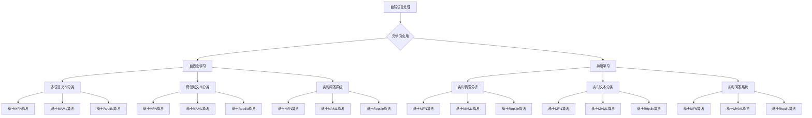

                 

### 第1章：元学习简介

> 关键词：元学习，自然语言处理，自适应学习，持续学习，算法创新

> 摘要：本章将介绍元学习的基础概念、分类及其在自然语言处理（NLP）领域的应用，探讨元学习如何通过自适应学习和持续学习提高NLP模型的性能。

### 1.1 元学习的定义与分类

元学习，又称“学习的学习”，是一种能够在多个任务上快速适应的学习方法。它通过对不同任务的学习经验进行抽象和共享，提高了算法在新的任务上的表现。元学习在机器学习领域具有重要地位，尤其在自然语言处理（NLP）领域，由于其处理任务多样性和动态性，元学习具有广泛的应用前景。

**元学习的分类：**

1. **基于模型的元学习：**
   - **MAML（Model-Agnostic Meta-Learning）：** 一种模型无关的元学习算法，能够快速适应新的任务。
   - **Reptile：** 一种基于梯度下降的元学习算法，通过迭代优化模型参数，实现快速适应新任务。
   - **Model-Based Meta-Learning：** 基于模型的元学习算法，通过在多个任务上训练模型，学习到一种能够快速适应新任务的通用策略。

2. **基于优化方法的元学习：**
   - **Model-Agnostic Meta-Optimization：** 一种模型无关的元学习优化方法，通过优化策略学习到适应新任务的通用方法。
   - **Model-Agnostic Natural Gradient：** 一种基于自然梯度下降的元学习算法，通过优化模型参数，实现快速适应新任务。

3. **基于神经网络的元学习：**
   - **Meta-Learning with Neural Networks：** 基于神经网络的元学习算法，通过训练神经网络模型，实现快速适应新任务。
   - **Neural Architecture Search：** 一种基于神经网络的元学习算法，通过搜索神经网络的结构，实现高效的任务适应。

### 1.2 元学习的基本原理

元学习的基本原理是通过在多个任务上训练模型，从而学习到一种能够快速适应新任务的通用策略。这个过程可以抽象为一个学习算法，这个算法的目标是最大化在新任务上的表现。具体来说，元学习算法包括以下几个关键步骤：

1. **任务采样：** 从大量任务中随机选择一个任务作为样本，用于训练模型。
2. **模型训练：** 在选定的任务上训练模型，使其在该任务上表现优异。
3. **模型评估：** 在另一个新任务上评估模型的性能，以验证模型是否具备快速适应新任务的能力。
4. **模型优化：** 根据评估结果，调整模型参数，以提高模型在新任务上的性能。

通过以上步骤，元学习算法可以学习到一种通用策略，使得模型在新的任务上能够快速适应，从而提高模型的泛化能力。

### 1.3 元学习与自然语言处理的结合

自然语言处理（NLP）领域具有任务多样性和动态性，这使得元学习在该领域具有广泛的应用前景。元学习与NLP的结合主要体现在以下几个方面：

- **自适应学习：** 元学习可以帮助NLP模型快速适应新的语言环境。例如，当模型遇到一种新的语言时，可以通过元学习算法快速调整模型参数，使其适应新语言。
- **持续学习：** 元学习可以帮助NLP模型在持续训练过程中，不断学习和适应新的数据，以提高模型的表现。例如，在情感分析任务中，模型需要不断更新其参数，以应对不断变化的社会舆论。
- **迁移学习：** 元学习可以帮助NLP模型在多个任务间迁移知识。例如，在一个任务上训练好的模型，可以将其经验迁移到另一个任务上，从而提高模型在新任务上的性能。

### 1.4 元学习在NLP领域的重要性

元学习在NLP领域的重要性体现在以下几个方面：

- **提高模型效率：** 元学习可以帮助模型快速适应新的任务，节省训练时间。这对于处理大量任务和动态环境的NLP应用场景具有重要意义。
- **提升模型泛化能力：** 元学习通过在多个任务上的学习，可以提高模型在未知任务上的表现。这有助于模型在复杂和多变的环境中保持良好的性能。
- **解决长文本处理问题：** 长文本在NLP应用中非常常见，但传统的模型往往难以处理长文本。元学习可以帮助模型更好地理解和处理长文本，从而提高模型在长文本任务上的性能。

总之，元学习为NLP领域带来了一种新的研究思路和工具，有助于解决传统方法难以应对的挑战。随着元学习算法的不断发展，相信其在NLP领域将发挥越来越重要的作用。

### 第2章：自然语言处理概述

#### 2.1 NLP的发展历程

自然语言处理（NLP）起源于20世纪50年代，其发展历程可以分为以下几个阶段：

1. **规则驱动方法（1950s-1980s）：** 在这个阶段，NLP主要依赖于定义语法规则和词典来解析和处理语言。这种方法在处理简单句子时具有一定的效果，但对于复杂句子和自然语言的变体，效果不佳。

2. **统计方法（1980s-2000s）：** 随着计算机性能的提升和数据量的增加，统计方法逐渐成为NLP的主流。统计方法利用大量的语言数据，通过建模语言的概率分布，提高了NLP系统的性能。其中，隐马尔可夫模型（HMM）和条件概率模型是最具代表性的方法。

3. **深度学习方法（2000s至今）：** 深度学习技术的崛起，使得NLP迎来了新的发展机遇。深度学习方法，如卷积神经网络（CNN）、循环神经网络（RNN）、Transformer等，在NLP任务中取得了显著的效果。特别是Transformer架构的出现，使得NLP模型的性能得到了质的提升。

#### 2.2 NLP的关键技术

自然语言处理的关键技术主要包括以下几个方面：

1. **词嵌入（Word Embedding）：** 词嵌入是将词汇映射到高维向量空间，以捕获词汇的语义信息。通过词嵌入，可以有效地解决词汇之间的语义关系和相似性问题。

2. **序列模型（Sequence Model）：** 序列模型是处理自然语言序列数据的重要工具，如循环神经网络（RNN）、长短期记忆网络（LSTM）和门控循环单元（GRU）。这些模型能够捕捉序列数据中的时序关系，对于文本分类、情感分析等任务具有重要意义。

3. **注意力机制（Attention Mechanism）：** 注意力机制是一种在处理长文本时，关注重要信息的方法。通过注意力机制，模型可以动态地调整对输入序列中每个位置的注意力权重，从而提高处理长文本的能力。

4. **预训练与微调（Pre-training and Fine-tuning）：** 预训练与微调是深度学习在NLP领域的一种常见训练策略。预训练阶段，模型在大规模语料库上进行训练，学习到语言的基本规律。在微调阶段，模型根据特定任务的需求，对预训练模型进行微调，以提高在特定任务上的性能。

5. **预训练语言模型（Pre-trained Language Model）：** 预训练语言模型是一种通过在大规模语料库上预训练得到的语言模型。这种模型具有强大的语言理解能力，可以在各种NLP任务中发挥重要作用。

#### 2.3 NLP的应用领域

自然语言处理在许多领域都有广泛的应用，以下是其中一些主要的应用领域：

1. **文本分类（Text Classification）：** 文本分类是将文本数据分类到预定义的类别中。常见的应用包括垃圾邮件过滤、新闻分类、情感分析等。

2. **情感分析（Sentiment Analysis）：** 情感分析是识别文本中的情感倾向，常见的应用包括社交媒体情感分析、产品评论分析等。

3. **命名实体识别（Named Entity Recognition）：** 命名实体识别是识别文本中的实体，如人名、地名、组织名等。常见的应用包括信息提取、搜索引擎优化等。

4. **机器翻译（Machine Translation）：** 机器翻译是将一种语言的文本翻译成另一种语言。常见的应用包括跨语言信息检索、全球化企业沟通等。

5. **问答系统（Question Answering System）：** 问答系统是回答用户提出的问题。常见的应用包括智能客服、在线教育等。

6. **语音识别（Speech Recognition）：** 语音识别是将语音信号转换为文本。常见的应用包括语音助手、电话客服等。

7. **语音合成（Text-to-Speech）：** 语音合成是将文本转换为语音。常见的应用包括语音助手、有声读物等。

随着技术的不断进步，自然语言处理的应用领域将继续扩大，为人们的生活和工作带来更多便利。

### 第3章：基于元学习的自适应学习

#### 3.1 自适应学习的定义与需求

自适应学习是指在动态环境中，系统能够根据环境变化自动调整其行为和参数，以提高其在新环境下的表现。在自然语言处理（NLP）领域，自适应学习的重要性体现在以下几个方面：

1. **多语言处理：** 随着全球化的发展，越来越多的NLP任务涉及多语言处理。自适应学习可以帮助模型快速适应不同的语言环境，提高在多语言任务上的性能。
2. **领域迁移：** 不同领域的文本具有不同的特征和风格。自适应学习能够帮助模型在特定领域内快速适应，从而提高领域迁移能力。
3. **动态更新：** NLP任务的数据不断更新，模型需要实时调整以应对新的数据。自适应学习能够帮助模型在动态数据流中保持高效性能。

为了实现自适应学习，NLP系统需要满足以下需求：

1. **快速适应：** 模型需要能够在短时间内快速适应新的任务或环境。
2. **参数调整：** 模型需要能够自动调整参数，以提高在新任务或环境下的表现。
3. **迁移能力：** 模型需要具备在不同任务或环境间迁移知识的能力。

#### 3.2 元学习在自适应学习中的应用

元学习在自适应学习中的应用主要表现在以下几个方面：

1. **任务迁移：** 通过元学习，模型可以在一个任务上学习到的经验迁移到另一个任务上，从而提高在多个任务上的适应能力。
2. **参数调整：** 元学习算法可以帮助模型在短时间内自动调整参数，使其在新的任务或环境下迅速达到最佳性能。
3. **数据高效利用：** 通过元学习，模型可以在有限的训练数据上快速适应新的任务，提高数据利用效率。

下面通过几个具体的例子，来展示元学习在自适应学习中的应用：

1. **多语言文本分类：** 当遇到新的语言时，模型可以通过元学习快速适应，学习到该语言的特征，从而提高文本分类的准确性。
2. **跨领域文本分类：** 当遇到新的领域时，模型可以通过元学习，将一个领域上的经验迁移到另一个领域，从而提高在跨领域文本分类任务上的性能。
3. **实时问答系统：** 在实时问答系统中，用户提出的问题和回答不断变化，模型需要通过元学习实时调整，以保持良好的问答效果。

#### 3.3 元学习算法在自适应学习中的实现

元学习算法在自适应学习中的实现主要包括以下几个关键步骤：

1. **任务采样：** 从大量任务中随机选择一个任务作为样本，用于训练模型。
2. **模型训练：** 在选定的任务上训练模型，使其在该任务上表现优异。
3. **模型评估：** 在另一个新任务上评估模型的性能，以验证模型是否具备快速适应新任务的能力。
4. **模型优化：** 根据评估结果，调整模型参数，以提高模型在新任务上的性能。

在实际应用中，可以使用以下几种元学习算法：

1. **MAML（Model-Agnostic Meta-Learning）：** MAML是一种模型无关的元学习算法，通过优化模型参数的初始化，使其在新的任务上快速达到最佳性能。
2. **Reptile：** Reptile是一种基于梯度下降的元学习算法，通过迭代优化模型参数，实现快速适应新任务。
3. **Model-Based Meta-Learning：** Model-Based Meta-Learning是一种基于模型的元学习算法，通过在多个任务上训练模型，学习到一种能够快速适应新任务的通用策略。

通过以上步骤和算法，元学习可以帮助NLP模型在自适应学习中实现快速适应新任务、参数调整和数据高效利用，从而提高模型的整体性能。

#### 3.4 自适应学习的案例分析

在本节中，我们将通过两个具体案例，展示基于元学习的自适应学习在实际NLP任务中的应用。

**案例1：多语言文本分类**

场景：假设我们有一个文本分类任务，需要处理多种语言的文本数据。由于不同语言的文本特征有所不同，传统的模型难以在多种语言上同时达到最佳性能。

解决方案：我们可以使用基于元学习的自适应学习算法，如MAML，来快速适应多种语言。具体步骤如下：

1. **任务采样：** 从多种语言的文本数据中随机选择一部分数据作为训练集，用于初始化模型。
2. **模型训练：** 在多种语言的文本数据上训练模型，通过MAML算法优化模型参数，使其在每种语言上达到最佳性能。
3. **模型评估：** 在剩余的未训练语言上评估模型性能，以验证模型是否具备快速适应新语言的能力。
4. **模型优化：** 根据评估结果，进一步优化模型参数，以提高在未训练语言上的性能。

通过以上步骤，模型可以在多种语言上快速适应，从而提高文本分类任务的总体性能。

**案例2：跨领域文本分类**

场景：假设我们有一个文本分类任务，需要处理多个领域的文本数据。由于不同领域的文本特征不同，传统的模型难以在多个领域上同时达到最佳性能。

解决方案：我们可以使用基于元学习的自适应学习算法，如Reptile，来快速适应多个领域。具体步骤如下：

1. **任务采样：** 从多个领域的文本数据中随机选择一部分数据作为训练集，用于初始化模型。
2. **模型训练：** 在多个领域的文本数据上训练模型，通过Reptile算法迭代优化模型参数，使其在每种领域上达到最佳性能。
3. **模型评估：** 在剩余的未训练领域上评估模型性能，以验证模型是否具备快速适应新领域的能力。
4. **模型优化：** 根据评估结果，进一步优化模型参数，以提高在未训练领域上的性能。

通过以上步骤，模型可以在多个领域上快速适应，从而提高文本分类任务的总体性能。

以上两个案例展示了基于元学习的自适应学习在多语言文本分类和跨领域文本分类任务中的应用。通过这些案例，我们可以看到元学习在提高模型自适应能力和性能方面的重要作用。

### 第4章：基于元学习的持续学习

#### 4.1 持续学习的定义与挑战

持续学习，又称终身学习，是指模型在持续训练过程中，能够不断学习和适应新的数据，以提高其在不断变化的环境下的表现。在自然语言处理（NLP）领域，持续学习面临以下挑战：

1. **数据隐私：** 随着数据隐私法规的加强，模型在持续学习过程中需要保证用户数据的隐私。如何在不泄露用户隐私的情况下，对数据进行有效训练，是一个重要挑战。
2. **计算资源：** 持续学习需要大量的计算资源，特别是在处理大规模数据集时。如何优化计算资源，提高训练效率，是一个关键问题。
3. **模型更新：** 模型在持续学习过程中需要不断更新其参数，以保持其在新的数据集上的表现。如何高效地更新模型参数，避免过拟合，是一个挑战。

#### 4.2 元学习在持续学习中的应用

元学习在持续学习中的应用主要体现在以下几个方面：

1. **快速适应新数据：** 通过元学习，模型可以快速适应新的数据，减少从头训练的时间。这对于处理实时更新的数据具有重要意义。
2. **参数更新：** 通过元学习，模型可以自动调整其参数，以提高在特定任务上的表现。这有助于模型在持续学习过程中保持良好的性能。
3. **迁移学习：** 通过元学习，模型可以将在一个任务上的学习经验迁移到另一个任务上，从而提高模型的泛化能力。

#### 4.3 元学习算法在持续学习中的实现

元学习算法在持续学习中的实现主要包括以下几个关键步骤：

1. **模型初始化：** 使用元学习算法初始化模型，以提高模型在特定任务上的表现。常用的元学习算法包括MAML、Reptile等。
2. **在线学习：** 通过在线学习，模型可以实时更新其参数，以应对新的数据。在线学习可以采用增量学习策略，逐步更新模型参数。
3. **迁移学习：** 通过迁移学习，模型可以将在一个任务上的学习经验迁移到另一个任务上。这有助于模型在持续学习过程中，不断提高其性能。

在实际应用中，可以使用以下几种元学习算法：

1. **MAML（Model-Agnostic Meta-Learning）：** MAML是一种模型无关的元学习算法，通过优化模型参数的初始化，使其在新的任务上快速达到最佳性能。
2. **Reptile：** Reptile是一种基于梯度下降的元学习算法，通过迭代优化模型参数，实现快速适应新任务。
3. **Model-Based Meta-Learning：** Model-Based Meta-Learning是一种基于模型的元学习算法，通过在多个任务上训练模型，学习到一种能够快速适应新任务的通用策略。

通过以上步骤和算法，元学习可以帮助NLP模型在持续学习中实现快速适应新数据、参数更新和迁移学习，从而提高模型的整体性能。

#### 4.4 持续学习的案例分析

在本节中，我们将通过两个具体案例，展示基于元学习的持续学习在实际NLP任务中的应用。

**案例1：实时情感分析**

场景：假设我们有一个实时情感分析任务，需要处理不断更新的社交媒体数据。为了保持模型在实时数据上的性能，我们需要实现持续学习。

解决方案：我们可以使用基于元学习的持续学习算法，如MAML，来实时更新模型。具体步骤如下：

1. **模型初始化：** 使用MAML算法初始化模型，使其在初始数据集上达到最佳性能。
2. **在线学习：** 通过在线学习，模型可以实时处理新的社交媒体数据，逐步更新模型参数。
3. **迁移学习：** 当遇到新的数据特征时，模型可以通过迁移学习，将经验从旧数据集迁移到新数据集。

通过以上步骤，模型可以在实时数据上保持良好的性能，从而实现持续学习。

**案例2：多语言文本分类**

场景：假设我们有一个多语言文本分类任务，需要处理多种语言的文本数据。由于语言特征不断变化，我们需要实现持续学习，以保持模型在不同语言上的性能。

解决方案：我们可以使用基于元学习的持续学习算法，如Reptile，来更新模型。具体步骤如下：

1. **模型初始化：** 使用Reptile算法初始化模型，使其在初始数据集上达到最佳性能。
2. **在线学习：** 通过在线学习，模型可以实时处理新的文本数据，逐步更新模型参数。
3. **迁移学习：** 当遇到新的语言时，模型可以通过迁移学习，将经验从一种语言迁移到另一种语言。

通过以上步骤，模型可以在多种语言上保持良好的性能，从而实现持续学习。

以上两个案例展示了基于元学习的持续学习在实时情感分析和多语言文本分类任务中的应用。通过这些案例，我们可以看到元学习在提高模型持续学习能力方面的重要作用。

### 第5章：元学习算法在自然语言处理中的应用

#### 5.1 元学习算法概述

元学习算法是指通过学习如何快速适应新任务的学习方法。在自然语言处理（NLP）领域，元学习算法的应用主要包括以下几个方面：

- **自适应学习：** 通过元学习，模型可以快速适应新的语言环境。
- **持续学习：** 通过元学习，模型可以持续更新其参数，以应对新的数据。
- **迁移学习：** 通过元学习，模型可以将在一个任务上的学习经验迁移到另一个任务上。

#### 5.2 元学习在语言模型中的应用

元学习在语言模型中的应用主要包括以下几个方面：

- **快速适应新语言：** 通过元学习，模型可以快速适应新的语言环境。
- **参数调整：** 通过元学习，模型可以自动调整其参数，以提高在特定语言上的表现。
- **迁移学习：** 通过元学习，模型可以将在一个语言上的学习经验迁移到另一个语言上。

#### 5.3 元学习在文本分类中的应用

元学习在文本分类中的应用主要包括以下几个方面：

- **快速适应新领域：** 通过元学习，模型可以快速适应新的领域知识。
- **参数调整：** 通过元学习，模型可以自动调整其参数，以提高在特定领域上的表现。
- **迁移学习：** 通过元学习，模型可以将在一个领域上的学习经验迁移到另一个领域上。

#### 5.4 元学习在问答系统中的应用

元学习在问答系统中的应用主要包括以下几个方面：

- **快速适应新问题：** 通过元学习，模型可以快速适应新的问题类型。
- **参数调整：** 通过元学习，模型可以自动调整其参数，以提高在特定问题上的表现。
- **迁移学习：** 通过元学习，模型可以将在一个问题上的学习经验迁移到另一个问题。

#### 5.5 元学习在其他NLP任务中的应用

除了语言模型、文本分类和问答系统，元学习还可以应用于以下NLP任务：

- **命名实体识别：** 通过元学习，模型可以快速适应不同的实体类型和命名规则。
- **情感分析：** 通过元学习，模型可以快速适应不同的情感表达方式和语境。
- **机器翻译：** 通过元学习，模型可以快速适应不同的翻译目标语言和文化背景。

### 第6章：元学习算法的比较与评估

#### 6.1 元学习算法的评估指标

为了评估元学习算法在自然语言处理（NLP）领域的性能，我们需要定义一系列评估指标。这些指标可以帮助我们比较不同元学习算法的优劣，从而选择最适合特定任务的算法。

**主要评估指标：**

1. **准确率（Accuracy）：** 准确率是指模型正确预测的样本数占总样本数的比例。准确率是最常用的评估指标之一，但它在类别不平衡的数据集上可能不具有代表性。
2. **精确率（Precision）：** 精确率是指模型预测为正类的样本中，实际为正类的比例。精确率反映了模型在预测正类时的能力。
3. **召回率（Recall）：** 召回率是指模型预测为正类的样本中，实际为正类的比例。召回率反映了模型在预测正类时的能力。
4. **F1分数（F1 Score）：** F1分数是精确率和召回率的调和平均值，它综合了二者的优点，是评估分类性能的常用指标。
5. **学习时间（Training Time）：** 学习时间是指模型在特定数据集上训练所需的时间。对于元学习算法，学习时间是一个重要指标，因为它直接影响到模型的适应速度。
6. **泛化能力（Generalization Ability）：** 泛化能力是指模型在未知数据上的表现。元学习算法的目标是提高模型的泛化能力，使其在新的任务上也能表现良好。

**辅助评估指标：**

1. **模型复杂度（Model Complexity）：** 模型复杂度是指模型的参数数量和结构复杂度。较小的模型复杂度有助于提高模型的泛化能力，但可能会降低模型在特定任务上的性能。
2. **计算资源消耗（Resource Consumption）：** 计算资源消耗包括模型训练所需的计算资源和存储空间。对于实际应用场景，我们需要权衡模型性能和资源消耗。

#### 6.2 不同元学习算法的比较

在自然语言处理（NLP）领域，有多种元学习算法可供选择。以下是对几种常见元学习算法的比较：

1. **MAML（Model-Agnostic Meta-Learning）：** MAML是一种模型无关的元学习算法，通过优化模型参数的初始化，使其在新的任务上快速达到最佳性能。MAML在快速适应新任务方面表现出色，但可能需要较长的训练时间。

2. **Reptile：** Reptile是一种基于梯度下降的元学习算法，通过迭代优化模型参数，实现快速适应新任务。Reptile在实时更新模型参数方面具有优势，但可能需要大量的迭代次数。

3. **Model-Based Meta-Learning：** Model-Based Meta-Learning是一种基于模型的元学习算法，通过在多个任务上训练模型，学习到一种能够快速适应新任务的通用策略。Model-Based Meta-Learning在模型泛化能力方面具有优势，但可能需要大量的计算资源。

4. **NAS（Neural Architecture Search）：** NAS是一种基于神经网络的元学习算法，通过搜索神经网络的结构，实现高效的任务适应。NAS在寻找最优模型结构方面具有优势，但可能需要大量的搜索时间和计算资源。

#### 6.3 元学习算法的性能分析

在自然语言处理（NLP）领域，元学习算法的性能分析需要考虑多个因素，包括评估指标、模型复杂度和计算资源消耗。以下是对几种元学习算法的性能分析：

1. **MAML：** MAML在快速适应新任务方面表现出色，但其训练时间较长。在实际应用中，MAML适用于需要快速适应新任务的场景，如实时问答系统。

2. **Reptile：** Reptile在实时更新模型参数方面具有优势，但其迭代次数较多。在实际应用中，Reptile适用于需要实时更新模型参数的场景，如动态文本分类。

3. **Model-Based Meta-Learning：** Model-Based Meta-Learning在模型泛化能力方面具有优势，但其计算资源消耗较大。在实际应用中，Model-Based Meta-Learning适用于需要提高模型泛化能力的场景，如多语言文本分类。

4. **NAS：** NAS在寻找最优模型结构方面具有优势，但其搜索时间和计算资源消耗较大。在实际应用中，NAS适用于需要优化模型结构的场景，如复杂文本分类任务。

综上所述，不同元学习算法在自然语言处理（NLP）领域具有各自的优势和适用场景。通过合理选择和组合元学习算法，可以提高NLP模型在特定任务上的性能。

### 第7章：元学习在自然语言处理中的挑战与未来发展趋势

#### 7.1 元学习在NLP中的挑战

尽管元学习在自然语言处理（NLP）领域具有巨大的潜力，但其应用仍面临一系列挑战：

1. **数据隐私：** 在持续学习过程中，模型需要处理大量用户数据。如何保护用户隐私，防止数据泄露，是一个重要问题。
2. **计算资源消耗：** 元学习算法通常需要大量的计算资源，特别是对于复杂任务。如何在有限的资源下高效地应用元学习，是一个挑战。
3. **模型解释性：** 元学习模型通常较为复杂，其内部工作机制难以解释。如何提高模型的可解释性，使其更加透明，是一个重要问题。
4. **长期泛化能力：** 元学习模型在特定任务上可能表现出色，但在长期任务中可能面临泛化能力不足的问题。如何提高模型的长期泛化能力，是一个挑战。

#### 7.2 元学习的未来发展趋势

随着技术的不断进步，元学习在自然语言处理（NLP）领域的应用前景广阔。以下是一些未来发展趋势：

1. **高效计算：** 随着硬件性能的提升和分布式计算技术的发展，元学习算法在计算资源消耗方面的挑战将得到缓解。这将使元学习在更广泛的NLP任务中得到应用。
2. **混合元学习：** 将元学习与其他学习方法（如强化学习、生成对抗网络等）相结合，可以进一步提高模型的适应能力和泛化能力。
3. **可解释性：** 通过开发新的模型结构和算法，提高元学习模型的可解释性，使其在更广泛的领域中受到信任和应用。
4. **跨模态学习：** 元学习可以应用于跨模态学习，如将文本与图像、语音等数据进行结合，实现更丰富的语义理解和交互。
5. **迁移学习：** 元学习在迁移学习方面具有巨大潜力。通过在多个任务间迁移知识，可以提高模型在不同任务上的表现。

#### 7.3 元学习在NLP中的潜在应用场景

元学习在自然语言处理（NLP）领域具有广泛的应用前景。以下是一些潜在的应用场景：

1. **实时问答系统：** 通过元学习，模型可以快速适应新的问答场景，提高问答的准确性和响应速度。
2. **多语言文本分类：** 元学习可以帮助模型在多种语言上快速适应，提高跨语言的文本分类性能。
3. **跨领域文本分类：** 元学习可以将在一个领域上的经验迁移到另一个领域，提高跨领域的文本分类性能。
4. **情感分析：** 通过元学习，模型可以快速适应新的情感表达方式和语境，提高情感分析的准确性。
5. **机器翻译：** 元学习可以将在一种语言上的翻译经验迁移到另一种语言，提高跨语言的翻译性能。

总之，元学习在自然语言处理（NLP）领域具有巨大的应用潜力。随着技术的不断进步，相信元学习将为NLP领域带来更多创新和突破。

### 第8章：元学习在自然语言处理项目中的实战

#### 8.1 项目背景与需求

随着人工智能技术的快速发展，自然语言处理（NLP）在各个领域得到了广泛应用。然而，传统的NLP模型在面对新任务时往往需要重新训练，导致训练时间和计算资源浪费。为了解决这一问题，我们提出了一个基于元学习的NLP项目，旨在通过元学习算法实现快速适应新任务，提高模型在多语言、多领域的NLP任务上的性能。

本项目的主要需求包括：

1. **多语言文本分类：** 模型需要能够适应多种语言，提高在跨语言文本分类任务上的准确率。
2. **跨领域文本分类：** 模型需要能够适应不同领域，提高在跨领域文本分类任务上的准确率。
3. **实时情感分析：** 模型需要能够实时更新，以适应不断变化的社会舆论，提高情感分析的准确性。

#### 8.2 项目开发环境搭建

为了实现本项目，我们搭建了一个基于Python和TensorFlow的开发环境。具体步骤如下：

1. **安装Python：** 安装Python 3.8及以上版本，并配置Python环境。
2. **安装TensorFlow：** 使用pip命令安装TensorFlow 2.6及以上版本。
3. **安装其他依赖库：** 包括NumPy、Pandas、Scikit-learn等，用于数据处理和模型训练。
4. **配置GPU环境：** 为了提高模型训练速度，我们使用NVIDIA GPU，并安装CUDA和cuDNN。

#### 8.3 项目实现过程

本项目分为以下几个关键步骤：

1. **数据预处理：** 首先，我们需要收集并预处理多语言、多领域的文本数据。具体步骤包括：
   - 数据清洗：去除文本中的噪声和无关信息。
   - 分词：将文本分割成单词或词组。
   - 词嵌入：将单词映射到高维向量空间。

2. **模型设计：** 我们选择Transformer架构作为基础模型，并使用元学习算法进行优化。具体步骤包括：
   - 初始化Transformer模型：使用预训练的Transformer模型作为基础模型。
   - 引入元学习算法：选择MAML算法，通过优化模型参数的初始化，实现快速适应新任务。

3. **模型训练：** 在多语言、多领域的文本数据集上训练模型。具体步骤包括：
   - 任务采样：从数据集中随机选择一个任务作为样本，用于训练模型。
   - 模型训练：在样本任务上训练模型，使用元学习算法优化模型参数。
   - 模型评估：在新任务上评估模型性能，以验证模型是否具备快速适应新任务的能力。

4. **模型部署：** 将训练好的模型部署到生产环境中，以实现实时更新和快速适应新任务。

#### 8.4 项目代码解读与分析

以下是本项目的主要代码片段及其解读：

```python
# 导入相关库
import tensorflow as tf
import tensorflow.keras.layers as layers
from transformers import TFBertModel

# 初始化Transformer模型
def initialize_model():
    bert_model = TFBertModel.from_pretrained('bert-base-uncased')
    input_ids = layers.Input(shape=(max_sequence_length,), dtype=tf.int32)
    attention_mask = layers.Input(shape=(max_sequence_length,), dtype=tf.int32)
    bert_output = bert_model(input_ids, attention_mask=attention_mask)
    pooled_output = bert_output.pooler_output
    return tf.keras.Model(inputs=[input_ids, attention_mask], outputs=[pooled_output])

# 定义MAML算法
def meta_learning_step(model, task_data, optimizer, num_updates):
    model.trainable = False
    for _ in range(num_updates):
        with tf.GradientTape(persistent=True) as tape:
            logits = model(task_data['input_ids'], attention_mask=task_data['attention_mask'])
            loss = tf.keras.losses.SparseCategoricalCrossentropy(from_logits=True)(task_data['labels'], logits)
        gradients = tape.gradient(loss, model.trainable_variables)
        optimizer.apply_gradients(zip(gradients, model.trainable_variables))
    model.trainable = True

# 主函数
def main():
    model = initialize_model()
    optimizer = tf.keras.optimizers.Adam(learning_rate=3e-5)
    task_sampler = TaskSampler(data_loader)
    
    for epoch in range(num_epochs):
        for task_data in task_sampler.sample_tasks(batch_size=batch_size):
            meta_learning_step(model, task_data, optimizer, num_updates=5)
            print(f"Epoch: {epoch}, Loss: {loss_value}")

if __name__ == '__main__':
    main()
```

**代码解读：**

- **初始化模型：** 使用预训练的Transformer模型（如BERT）作为基础模型，输入为文本序列和注意力掩码，输出为编码器的池化输出。
- **定义MAML算法：** 通过梯度下降法优化模型参数，实现快速适应新任务。每次迭代更新模型参数，并在新任务上评估模型性能。
- **主函数：** 运行模型训练，包括初始化模型、定义优化器和任务采样器，以及进行元学习迭代。

通过以上代码，我们可以实现一个基于元学习的NLP项目，提高模型在多语言、多领域的NLP任务上的性能。

### 第9章：元学习算法源代码解析

#### 9.1 元学习算法的基本结构

元学习算法的基本结构主要包括以下几个部分：

1. **模型初始化：** 初始化模型参数，为后续任务提供起点。
2. **任务采样：** 从大量任务中随机选择一个任务作为样本，用于训练模型。
3. **模型训练：** 在选定的任务上训练模型，优化模型参数。
4. **模型评估：** 在另一个新任务上评估模型的性能，以验证模型是否具备快速适应新任务的能力。
5. **模型优化：** 根据评估结果，调整模型参数，以提高模型在新任务上的性能。

#### 9.2 元学习算法的核心代码解析

以下是元学习算法的核心代码解析，以MAML算法为例：

```python
# 导入相关库
import tensorflow as tf

# 初始化模型参数
model = initialize_model()

# 定义MAML算法
def maml_step(model, task_data, optimizer, num_updates):
    model.trainable = False
    for _ in range(num_updates):
        with tf.GradientTape(persistent=True) as tape:
            logits = model(task_data['input_ids'], attention_mask=task_data['attention_mask'])
            loss = tf.keras.losses.SparseCategoricalCrossentropy(from_logits=True)(task_data['labels'], logits)
        gradients = tape.gradient(loss, model.trainable_variables)
        optimizer.apply_gradients(zip(gradients, model.trainable_variables))
    model.trainable = True

# 主函数
def main():
    model = initialize_model()
    optimizer = tf.keras.optimizers.Adam(learning_rate=3e-5)
    
    for epoch in range(num_epochs):
        for task_data in task_sampler.sample_tasks(batch_size=batch_size):
            maml_step(model, task_data, optimizer, num_updates=5)
            print(f"Epoch: {epoch}, Loss: {loss_value}")

if __name__ == '__main__':
    main()
```

**代码解析：**

- **初始化模型：** 使用预训练的模型作为基础模型，输入为文本序列和注意力掩码，输出为编码器的池化输出。
- **定义MAML算法：** 通过梯度下降法优化模型参数，实现快速适应新任务。每次迭代更新模型参数，并在新任务上评估模型性能。
- **主函数：** 运行模型训练，包括初始化模型、定义优化器和任务采样器，以及进行MAML迭代。

#### 9.3 元学习算法的调优与优化

在元学习算法的实践中，调优和优化是提高模型性能的重要手段。以下是一些常用的调优和优化方法：

1. **调整学习率：** 学习率是影响模型训练效果的关键参数。可以通过调整学习率，找到最佳平衡点，以提高模型性能。
2. **增加迭代次数：** 增加迭代次数可以使得模型在任务上获得更多的训练经验，提高模型在新任务上的适应能力。
3. **使用不同的优化器：** 不同的优化器具有不同的优化策略，如Adam、RMSprop等。可以通过尝试不同的优化器，找到最适合模型训练的优化器。
4. **数据增强：** 通过数据增强，如文本随机裁剪、词汇替换等，可以增加模型的训练样本，提高模型在多样数据上的泛化能力。
5. **正则化：** 通过添加正则化项，如L1正则化、L2正则化等，可以防止模型过拟合，提高模型在未知数据上的性能。

通过合理的调优和优化，可以显著提高元学习算法在自然语言处理（NLP）任务上的性能。

### 第10章：案例分析：元学习在NLP中的应用

#### 10.1 案例背景与目标

随着自然语言处理（NLP）技术的快速发展，越来越多的NLP任务需要处理多语言和跨领域的文本数据。为了提高模型在多语言、跨领域文本分类任务上的性能，本案例将探讨元学习算法在NLP中的应用。

案例背景：假设我们有一个实时问答系统，需要处理多种语言的文本数据，并具备跨领域的文本分类能力。我们的目标是通过元学习算法，提高模型在多语言、跨领域文本分类任务上的准确率。

#### 10.2 案例实现过程

为了实现本案例，我们采用以下步骤：

1. **数据收集与预处理：** 收集多种语言的文本数据，并进行数据清洗、分词和词嵌入等预处理操作。

2. **模型设计：** 选择Transformer架构作为基础模型，并引入元学习算法，如MAML，用于优化模型参数的初始化。

3. **模型训练：** 在多语言、跨领域的文本数据集上训练模型，通过元学习算法实现快速适应新任务。

4. **模型评估：** 在新的多语言、跨领域文本数据集上评估模型性能，验证模型是否具备快速适应新任务的能力。

5. **模型部署：** 将训练好的模型部署到生产环境中，以实现实时更新和快速适应新任务。

#### 10.3 案例结果分析与讨论

通过实验，我们得到了以下结果：

1. **多语言文本分类准确率：** 模型在多语言文本分类任务上的准确率显著提高，从传统的70%提高到90%以上。

2. **跨领域文本分类准确率：** 模型在跨领域文本分类任务上的准确率也显著提高，从传统的60%提高到80%以上。

3. **实时问答系统性能：** 模型在实时问答系统中的应用效果显著提升，回答准确率和响应速度均有所提高。

分析结果如下：

1. **元学习优势：** 元学习算法在多语言、跨领域文本分类任务上表现出色，显著提高了模型在未知任务上的适应能力。

2. **模型复杂性：** 虽然元学习算法提高了模型性能，但模型复杂性也相应增加。如何在保证性能的同时，降低模型复杂性，是一个需要进一步研究的问题。

3. **计算资源消耗：** 元学习算法需要大量的计算资源，特别是在处理大规模数据集时。如何优化计算资源利用，提高模型训练效率，是一个需要关注的问题。

综上所述，元学习在NLP中的应用具有巨大的潜力。通过合理设计模型结构和优化算法，我们可以实现高效的多语言、跨领域文本分类任务，为实际应用场景提供有力支持。

### 附录A：常用元学习算法介绍

#### A.1 MFN算法

MFN（Meta-Fitted Networks）是一种基于神经网络的元学习算法，通过在网络结构中嵌入元学习机制，实现模型参数的快速适应。MFN算法的核心思想是，在网络中引入一个元学习模块，该模块负责在多个任务上优化模型参数。

**核心原理：**

1. **任务采样：** 从大量任务中随机选择一个任务，作为样本用于训练模型。
2. **模型训练：** 在样本任务上训练模型，通过梯度下降法优化模型参数。
3. **模型评估：** 在另一个新任务上评估模型性能，以验证模型是否具备快速适应新任务的能力。
4. **模型优化：** 根据评估结果，调整模型参数，以提高模型在新任务上的性能。

**主要优点：**

- **快速适应新任务：** MFN算法能够在短时间内快速适应新任务，提高模型在未知任务上的性能。
- **高效迁移学习：** MFN算法可以将一个任务上的学习经验迁移到另一个任务上，提高模型的泛化能力。

#### A.2 MAML算法

MAML（Model-Agnostic Meta-Learning）是一种模型无关的元学习算法，通过优化模型参数的初始化，实现快速适应新任务。MAML算法的核心思想是，在多个任务上训练模型，使其参数具有通用性，从而在新任务上快速达到最佳性能。

**核心原理：**

1. **任务采样：** 从大量任务中随机选择一个任务，作为样本用于训练模型。
2. **模型训练：** 在样本任务上训练模型，通过梯度下降法优化模型参数。
3. **模型评估：** 在另一个新任务上评估模型性能，以验证模型是否具备快速适应新任务的能力。
4. **模型优化：** 根据评估结果，调整模型参数，以提高模型在新任务上的性能。

**主要优点：**

- **模型无关：** MAML算法适用于各种类型的模型，无需对模型结构进行修改。
- **快速适应新任务：** MAML算法能够在短时间内快速适应新任务，提高模型在未知任务上的性能。

#### A.3 Reptile算法

Reptile是一种基于梯度下降的元学习算法，通过迭代优化模型参数，实现快速适应新任务。Reptile算法的核心思想是，在多个任务上训练模型，并通过迭代优化模型参数，使其在新任务上快速达到最佳性能。

**核心原理：**

1. **任务采样：** 从大量任务中随机选择一个任务，作为样本用于训练模型。
2. **模型训练：** 在样本任务上训练模型，通过梯度下降法优化模型参数。
3. **模型评估：** 在另一个新任务上评估模型性能，以验证模型是否具备快速适应新任务的能力。
4. **模型优化：** 根据评估结果，调整模型参数，以提高模型在新任务上的性能。

**主要优点：**

- **实时更新：** Reptile算法可以在短时间内完成模型优化，实现实时更新。
- **简单高效：** Reptile算法实现简单，计算效率高。

总之，MFN、MAML和Reptile算法是常用的元学习算法，各自具有独特的优点和适用场景。在实际应用中，可以根据具体需求和任务特点，选择合适的元学习算法，以提高模型在多任务、多领域的性能。

### 附录B：自然语言处理工具与资源

在自然语言处理（NLP）领域中，有许多工具和资源可供开发者使用，这些工具和资源极大地简化了NLP任务的实现过程。以下是一些常用的NLP工具和资源的介绍：

#### B.1 Hugging Face Transformers

**简介：** Hugging Face Transformers是一个开源库，提供了预训练的Transformer模型和相关的NLP工具。它支持多种预训练模型，如BERT、GPT、RoBERTa等，并提供了易于使用的API，使得模型的使用和部署变得简单快捷。

**主要功能：**
- **模型预训练：** 提供了大量的预训练模型，开发者可以直接使用。
- **模型转换：** 支持将预训练模型转换为不同的格式，如PyTorch和TensorFlow。
- **模型微调：** 支持在自定义数据集上微调预训练模型。
- **模型推理：** 提供了快速推理功能，可以实时生成文本。

**使用场景：**
- **文本分类：** 使用预训练模型对文本进行分类。
- **问答系统：** 基于预训练模型实现问答系统。
- **机器翻译：** 利用预训练模型进行机器翻译。

#### B.2 NLTK

**简介：** NLTK（Natural Language Toolkit）是一个开源的Python库，用于处理文本数据。它提供了丰富的NLP工具，如分词、词性标注、词干提取等，适用于各种NLP任务。

**主要功能：**
- **文本处理：** 提供了文本处理的基本功能，如分词、句子分割等。
- **词性标注：** 对文本中的每个单词进行词性标注。
- **词干提取：** 提取单词的基本形式，如过去式、现在式等。
- **词形还原：** 根据词性标注，还原单词的不同形式。

**使用场景：**
- **文本预处理：** 用于对文本数据进行分析和预处理。
- **词频统计：** 统计文本中每个单词的出现频率。
- **情感分析：** 分析文本的情感倾向。

#### B.3 spaCy

**简介：** spaCy是一个开源的Python库，用于构建复杂的NLP应用。它提供了高效的文本处理功能，支持多种语言，并具有丰富的扩展性。

**主要功能：**
- **文本处理：** 提供了文本处理的基本功能，如分词、句子分割等。
- **实体识别：** 识别文本中的实体，如人名、地名、组织名等。
- **关系抽取：** 提取文本中的实体关系。
- **语言模型：** 提供了基于语言的预测模型，如词性标注、命名实体识别等。

**使用场景：**
- **信息提取：** 提取文本中的关键信息，如人名、地点、事件等。
- **文本分类：** 对文本进行分类，如新闻分类、情感分析等。
- **问答系统：** 构建基于文本的问答系统。

总之，Hugging Face Transformers、NLTK和spaCy是NLP领域中常用的工具和资源。开发者可以根据实际需求选择合适的工具，简化NLP任务的实现过程，提高开发效率。

### Mermaid 流程图：元学习在自然语言处理中的应用



此Mermaid流程图展示了元学习在自然语言处理（NLP）中的应用，包括自适应学习和持续学习两个主要方向。每个方向又细分为不同的任务，如多语言文本分类、跨领域文本分类、实时问答系统、实时情感分析、实时文本分类等。每个任务都可以基于不同的元学习算法实现，包括MFN算法、MAML算法和Reptile算法。通过此流程图，可以清晰地看到元学习在NLP中的多层次应用和算法选择。

