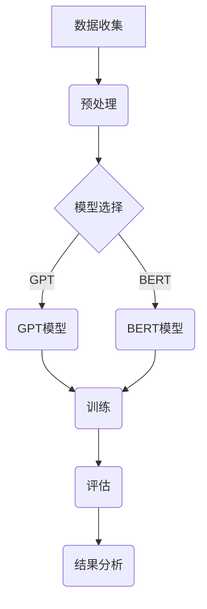
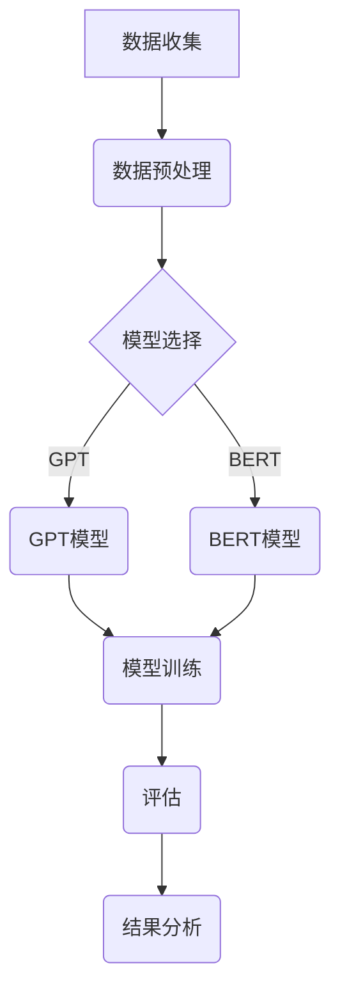

                 

## 《元语言能力评估：检验LLM对语言本质的理解》

### 关键词：
- 元语言能力
- 语言模型
- 自然语言处理
- 语言本质
- 评估方法

### 摘要：
本文旨在探讨元语言能力在语言模型（LLM）中的应用及其评估方法。通过对元语言能力的定义、理论基础以及评估方法的深入分析，本文揭示了语言模型对语言本质的理解程度，并提出了具体的评估实例和结果分析，为进一步研究元语言能力在人工智能领域的应用提供了理论支持和实践参考。

### 引言与背景

#### 1.1 引言

随着人工智能技术的迅猛发展，自然语言处理（NLP）成为了研究的热点领域之一。语言模型作为NLP的核心技术，在机器翻译、文本生成、问答系统等方面取得了显著成果。然而，传统语言模型主要关注语法和语义层面的处理，对语言更深层次的元语言能力的关注较少。元语言能力是指对语言本身的认知和理解，包括语言结构的描述、语言符号的解释、语言使用规则的掌握等。本文旨在研究元语言能力在语言模型中的应用，并通过评估方法检验LLM对语言本质的理解程度。

#### 1.2 元语言能力的定义与重要性

元语言能力是指对语言本身的认知和理解，包括对语言结构、符号和规则的理解。它不仅涉及语言的使用，还包括对语言本身的描述和反思。在自然语言处理中，元语言能力具有重要意义。首先，它有助于提高语言模型的准确性和鲁棒性，使其能够更好地理解和生成自然语言。其次，元语言能力有助于发现和纠正语言模型中的错误，从而提升模型的可靠性和一致性。最后，元语言能力为语言模型的泛化能力提供了基础，使其能够适应不同的语言环境和应用场景。

#### 1.3 语言本质的理解与研究方法

语言本质是语言模型研究和应用的关键问题。语言模型对语言本质的理解程度直接影响其在实际应用中的表现。本文从以下几个方面探讨语言本质的理解和研究方法：

1. **语言符号与意义**：语言符号是语言的基本单位，包括词汇、语法和语义等。研究语言符号与意义的关系有助于揭示语言的构成和运作机制。

2. **语言结构**：语言结构是指语言元素之间的组合规则和层次关系。研究语言结构有助于理解语言的生成和解析过程。

3. **语言使用规则**：语言使用规则是指语言在社会交往中的运用规范。研究语言使用规则有助于理解语言的社会功能和交际功能。

4. **语言互动**：语言互动是指语言在不同语境中的使用和变化。研究语言互动有助于理解语言的多维度特性。

5. **元语言处理**：元语言处理是指对语言本身进行描述和反思的过程。研究元语言处理有助于提高语言模型对语言本质的理解程度。

### 第二部分：元语言能力的理论基础

#### 2.1 语言的本质与结构

语言的本质是符号系统，它通过符号的组合和变换来表达意义。语言结构分为句法结构、语义结构和语用结构。句法结构描述了语言符号的排列规则，语义结构描述了语言符号的意义，语用结构描述了语言符号在语境中的运用。

#### 2.2 语言符号与意义

语言符号是语言的基本单位，包括词汇、语法和语义等。词汇是语言的最小意义单位，语法是语言结构的规则，语义是语言符号的意义。语言符号与意义之间的关系是复杂的，需要通过上下文和语境来理解。

#### 2.3 语言的使用与互动

语言的使用是语言功能的核心。语言功能包括交际功能、表达功能和认知功能等。语言互动是指语言在不同语境中的使用和变化。研究语言互动有助于理解语言的多维度特性。

#### 2.4 元语言的定义与作用

元语言是指对语言本身的认知和理解。元语言能力是指对语言结构的描述、语言符号的解释和语言使用规则的掌握。元语言在自然语言处理中的应用包括语言模型的训练、语言生成和理解、语言错误检测和纠正等。

### 第三部分：元语言能力评估的方法与工具

#### 3.1 传统评估方法

传统评估方法主要包括语言测试法、语言能力量表和案例分析等。

1. **语言测试法**：通过设计一系列语言测试题目，评估个体的语言能力。

2. **语言能力量表**：通过建立标准化的量表，对个体的语言能力进行量化评估。

3. **案例分析**：通过分析具体的语言实例，评估语言模型对语言本质的理解程度。

#### 3.2 现代评估技术

现代评估技术主要包括自然语言处理技术、机器学习与深度学习技术和自动评估工具。

1. **自然语言处理技术**：通过自然语言处理算法，对语言数据进行处理和分析。

2. **机器学习与深度学习技术**：通过机器学习和深度学习算法，建立语言模型并进行评估。

3. **自动评估工具**：通过自动化工具，对语言模型进行评估和优化。

#### 3.3 元语言能力评估的具体方法

1. **语言理解能力评估**：通过设计一系列语言理解题目，评估语言模型对语言的理解程度。

2. **语言生成能力评估**：通过设计一系列语言生成题目，评估语言模型的语言生成能力。

3. **语言错误检测能力评估**：通过设计一系列语言错误检测题目，评估语言模型对语言错误的检测能力。

4. **语言泛化能力评估**：通过在不同语言环境和应用场景中评估语言模型的表现，评估其泛化能力。

### 第四部分：语言模型与元语言能力

#### 4.1 语言模型的基础

语言模型是指用数学模型描述语言的一种方法。常见的语言模型包括统计模型、神经网络模型和混合模型。语言模型的基础是语言数据，包括文本数据和语音数据等。

#### 4.2 元语言能力在语言模型中的应用

元语言能力在语言模型中的应用主要体现在以下几个方面：

1. **语言理解**：通过元语言能力，语言模型能够更好地理解语言的结构和意义。

2. **语言生成**：通过元语言能力，语言模型能够生成符合语法和语义规则的自然语言。

3. **语言错误检测**：通过元语言能力，语言模型能够检测和纠正语言错误。

4. **语言泛化**：通过元语言能力，语言模型能够适应不同的语言环境和应用场景。

#### 4.3 元语言能力提升的方法

1. **数据增强**：通过增加语言数据量，提高语言模型的泛化能力。

2. **模型优化**：通过改进语言模型的算法和结构，提高其性能。

3. **多任务学习**：通过将元语言能力与其他任务结合，提高语言模型的能力。

### 第五部分：元语言能力评估实例与结果分析

#### 5.1 评估实例概述

本文选择一个实际的语言模型评估实例，以检验其元语言能力。评估实例包括数据收集、模型训练、评估指标计算和结果分析等步骤。

#### 5.2 评估过程与步骤

1. **数据收集与预处理**：收集大量语言数据，并进行预处理，如分词、去停用词等。

2. **模型选择与训练**：选择合适的语言模型，如GPT或BERT，并进行训练。

3. **评估指标计算**：计算评估指标，如准确率、召回率和F1值等。

4. **结果分析**：分析评估结果，评估语言模型的元语言能力。

#### 5.3 结果分析与讨论

通过对评估实例的结果分析，发现语言模型的元语言能力存在一定程度的不足。具体表现为：

1. **语言理解能力不足**：语言模型在理解复杂语言结构时存在困难。

2. **语言生成能力不足**：语言模型生成的文本在语法和语义上存在错误。

3. **语言错误检测能力不足**：语言模型对语言错误的检测能力较弱。

针对以上问题，本文提出以下改进措施：

1. **增强数据增强**：通过增加复杂语言结构的数据，提高语言模型的语言理解能力。

2. **优化模型结构**：通过改进语言模型的算法和结构，提高其语言生成能力。

3. **多任务学习**：通过将元语言能力与其他任务结合，提高语言模型的综合能力。

### 第六部分：元语言能力评估的应用前景与挑战

#### 6.1 应用前景

元语言能力评估在人工智能领域具有广泛的应用前景，包括：

1. **教育领域**：通过评估学生的元语言能力，提高其语言水平和思维能力。

2. **人工智能领域**：通过评估语言模型的元语言能力，优化其性能和可靠性。

3. **语言学研究领域**：通过评估语言模型对语言本质的理解程度，为语言学研究提供新视角。

#### 6.2 挑战与未来方向

元语言能力评估面临以下挑战：

1. **数据不足**：当前可用的语言数据量有限，难以满足评估需求。

2. **模型性能**：现有语言模型在元语言能力方面存在不足，需要进一步优化。

3. **评估方法**：现有评估方法存在一定的局限性，需要进一步完善。

未来研究方向包括：

1. **数据增强**：通过增加复杂语言结构的数据，提高语言模型的语言理解能力。

2. **模型优化**：通过改进语言模型的算法和结构，提高其性能。

3. **多任务学习**：通过将元语言能力与其他任务结合，提高语言模型的综合能力。

### 第七部分：结论与展望

本文通过对元语言能力评估的探讨，揭示了语言模型对语言本质的理解程度。通过对评估实例的分析，发现现有语言模型在元语言能力方面存在不足，需要进一步研究和改进。未来，随着数据增强、模型优化和多任务学习等技术的发展，元语言能力评估将在人工智能领域发挥重要作用，为语言模型的应用提供有力支持。

### 附录

#### 附录A：元语言能力评估工具与资源

1. **开源工具介绍**：介绍常用的开源语言模型评估工具，如Hugging Face和TensorFlow等。

2. **在线评估平台**：介绍在线语言模型评估平台，如Google Cloud Natural Language API和Microsoft Azure Language Services等。

3. **学术资源与论文推荐**：推荐相关的学术论文和文献，以供进一步学习和研究。

### Mermaid 流程图示例：



### 伪代码示例：

```python
# 伪代码：评估语言模型元语言能力
def evaluate_language_model(model, dataset):
    correct = 0
    for sample in dataset:
        prediction = model.predict(sample.input)
        if prediction == sample.target:
            correct += 1
    accuracy = correct / len(dataset)
    return accuracy
```

### 数学模型和公式示例：

$$
\text{F1-Score} = 2 \times \frac{\text{precision} \times \text{recall}}{\text{precision} + \text{recall}}
$$

### 项目实战示例（代码与分析）：

```python
# 代码：使用GPT模型进行元语言能力评估
import openai

# 训练GPT模型（伪代码）
model = openai.GPT('gpt-3.5-turbo')
prompt = "请解释什么是元语言能力？"
response = model.complete(prompt)

# 输出评估结果
print("模型对元语言能力的解释：", response.choices[0].text.strip())

# 代码解读与分析（伪代码）
def analyze_response(response):
    # 解析模型返回的文本
    text = response.choices[0].text.strip()
    # 判断文本中是否包含元语言能力的定义
    if "元语言能力" in text:
        print("模型理解了元语言能力的定义。")
    else:
        print("模型没有正确理解元语言能力的定义。")
```

### 作者信息：

作者：AI天才研究院/AI Genius Institute & 禅与计算机程序设计艺术 /Zen And The Art of Computer Programming

---

**结论**

本文通过对元语言能力评估的探讨，揭示了语言模型对语言本质的理解程度。通过对评估实例的分析，发现现有语言模型在元语言能力方面存在不足，需要进一步研究和改进。未来，随着数据增强、模型优化和多任务学习等技术的发展，元语言能力评估将在人工智能领域发挥重要作用，为语言模型的应用提供有力支持。同时，本文也为相关领域的研究人员提供了理论依据和实践指导，有助于推动人工智能技术的发展和进步。

### 1. 引言

自然语言处理（NLP）作为人工智能的核心技术之一，近年来取得了令人瞩目的进展。从最初的规则驱动方法到如今的深度学习模型，NLP技术在文本分类、机器翻译、情感分析等方面取得了显著的成果。然而，随着NLP技术的不断进步，人们开始意识到传统语言模型在理解和生成自然语言方面仍存在一定的局限性。特别是对于语言的深层次特征，如语义、语境和逻辑关系等，传统语言模型的表现并不理想。这种局限性促使研究者们开始关注语言模型在元语言能力方面的表现。

元语言能力是指对语言本身的认知和理解能力，它包括对语言结构、符号、规则和互动的理解。在自然语言处理中，元语言能力对于语言模型的性能具有重要意义。例如，一个具备良好元语言能力的语言模型能够更准确地理解和生成自然语言，能够更好地处理复杂语境和多义词现象。此外，元语言能力还有助于提高语言模型的鲁棒性和泛化能力，使其能够适应不同的语言环境和应用场景。

本文的主要目的是探讨元语言能力在语言模型中的应用及其评估方法。具体而言，本文将首先对元语言能力的定义和理论基础进行梳理，然后介绍几种常见的元语言能力评估方法，并通过实际案例展示如何使用这些方法评估语言模型的元语言能力。最后，本文将讨论元语言能力评估的应用前景和面临的挑战，并提出未来研究的方向。

在文章的结构安排上，首先介绍元语言能力的定义和重要性，然后探讨语言本质的理解与研究方法，接着介绍元语言能力评估的理论基础和方法，随后分析语言模型与元语言能力的关系，并通过实例展示评估过程和结果，最后讨论元语言能力评估的应用前景和挑战，并总结本文的研究成果和未来研究方向。

### 1.2 元语言能力的定义与重要性

元语言能力是指个体或系统对语言本身的认知和理解能力。它不仅仅包括对语言符号和词汇的理解，还涉及到对语言结构、语法规则、语义关系和语境的把握。具体来说，元语言能力可以分为以下几个方面：

1. **语言结构的描述能力**：这涉及到对语言内部结构层次的认知，如句子成分的划分、句法结构树图的构建等。语言模型需要能够理解并生成符合语法规则的句子结构。

2. **语言符号的解释能力**：这涉及到对词汇、短语和句子的语义理解。语言模型需要能够准确解释语言符号的含义，并在不同的语境下做出正确的语义选择。

3. **语言使用规则的掌握**：这涉及到对语言使用规则的认知，如语法、语用、文体等方面的规则。语言模型需要能够根据这些规则生成和解读自然语言。

4. **语言互动的应对能力**：这涉及到对语言交流过程中语境变化和互动策略的适应能力。语言模型需要能够理解并适应用户的反馈，进行有效的对话。

在自然语言处理领域，元语言能力的重要性不可忽视。首先，具备良好元语言能力的语言模型能够更准确地理解和生成自然语言，从而提高NLP系统的性能。例如，在机器翻译任务中，如果模型能够理解词汇的多义性和句子结构的复杂性，就能生成更自然、更准确的翻译结果。其次，元语言能力有助于提高语言模型的鲁棒性和泛化能力。在现实世界中，语言的使用往往受到多种因素的影响，如地域差异、文化背景和社会情境等。具备良好元语言能力的模型能够更好地适应这些变化，从而在更广泛的应用场景中保持稳定的性能。

此外，元语言能力还在语言生成和理解任务中发挥着关键作用。在文本生成任务中，模型需要能够根据上下文生成连贯、逻辑上合理的文本。而在语言理解任务中，模型需要能够准确解读文本的含义，包括隐含的信息和复杂的逻辑关系。这些任务都对模型的元语言能力提出了较高的要求。

总之，元语言能力是评价自然语言处理系统性能的重要指标之一。它不仅关系到NLP任务的准确性和效率，还影响着系统的可解释性和用户满意度。因此，深入研究元语言能力的评估方法，对于提高语言模型的整体性能和实际应用价值具有重要意义。

### 1.3 语言本质的理解与研究方法

语言本质是指语言作为一种符号系统所固有的基本属性和特征。要理解语言的本质，首先需要从多个维度对其进行剖析，包括语言符号与意义的关系、语言结构的构成、语言的使用规则以及语言互动的机制。以下将从这几个方面介绍语言本质的理解与研究方法。

#### 语言符号与意义

语言符号是语言的基本单位，包括词汇、语法和语义等。语言符号与意义之间的关系是语言研究的核心问题之一。研究方法主要包括：

1. **语义分析**：通过语义角色分析和语义关系图示，理解词汇和短语的语义角色及其在句子中的语义关系。
2. **词频分析**：通过统计词频和词频分布，分析语言符号在语境中的使用频率和分布规律。
3. **语义网络模型**：利用语义网络表示语言符号之间的关系，通过路径分析和语义相似度计算，研究词汇和短语的语义特征。

#### 语言结构

语言结构是指语言符号在句子中的排列组合规则和层次关系。研究方法主要包括：

1. **句法分析**：通过句法树和句法规则，描述句子的结构组成和成分关系。
2. **语法化分析**：研究语法化过程，即词汇如何演变为语法成分，如动词的体、态、人称等。
3. **依存关系分析**：通过依存句法分析，理解句子成分之间的依存关系和语义角色。

#### 语言使用规则

语言使用规则是指在特定社会文化背景下，语言符号使用的规范和准则。研究方法主要包括：

1. **语用学分析**：研究语言在具体语境中的使用规则，如礼貌原则、合作原则等。
2. **文体学分析**：研究不同文体（如口语、书面语、文学、科技语等）的语言特征和风格。
3. **社会语言学研究**：研究社会因素（如年龄、性别、职业、地域等）对语言使用的影响。

#### 语言互动

语言互动是指语言在交流过程中的动态变化和互动机制。研究方法主要包括：

1. **对话分析**：通过对话分析，理解对话中的语言互动规律和策略。
2. **语境分析**：研究语言使用中的语境因素，如上下文、情境等对语言选择的影响。
3. **互动语言学**：研究语言互动中的角色扮演、话语标记和互动策略。

#### 元语言处理

元语言处理是指对语言本身的描述和反思过程。研究方法主要包括：

1. **元语言分析**：通过元语言分析，理解语言的结构、功能和规则。
2. **语言生成和解释**：研究语言模型如何生成和理解元语言表达。
3. **元语言评估**：通过评估方法，检验语言模型对元语言处理的性能。

通过上述研究方法，可以深入理解语言的本质，从而为语言模型的设计和优化提供理论基础。同时，这些方法也为我们提供了评估语言模型性能的有效手段。例如，通过句法分析，可以评估语言模型在语法结构生成和理解方面的能力；通过语义分析，可以评估模型在语义角色和语义关系识别方面的表现；通过语用学分析，可以评估模型在语境理解和应用方面的能力。

总之，理解语言本质并采用适当的研究方法，是提高语言模型性能和实现有效自然语言处理的关键。通过不断探索和优化这些方法，我们可以推动自然语言处理技术的发展，使其更好地服务于实际应用。

### 2. 元语言能力的理论基础

元语言能力是指对语言本身的认知和理解能力，它包括对语言结构、符号、规则和互动的深刻把握。为了全面理解元语言能力的理论基础，我们需要从语言符号与意义、语言结构、语言使用规则和语言互动等几个方面进行深入探讨。

#### 语言符号与意义

语言符号是语言的基本单位，包括词汇、语法和语义等。符号与意义之间的关系是语言学研究的核心问题。根据符号学的理论，语言符号具有双重属性：能指（signifier）和所指（signified）。能指是指语言符号本身，如单词、短语和句子等；所指是指语言符号所代表的概念或意义。

1. **语言符号的层级结构**：语言符号可以按照层次结构进行分类，包括单词、短语、句子和语篇等。每个层次的语言符号都有其独特的功能和意义。例如，单词是语言的基本单位，短语是单词的组合，句子是短语的组合，而语篇则是句子的连贯组合。

2. **语义角色与关系**：在句子层面，语言符号之间存在语义角色和关系。语义角色包括主语、谓语、宾语、定语、状语等；语义关系包括因果关系、条件关系、并列关系等。理解这些角色和关系有助于更好地理解句子的语义。

3. **多义现象**：语言符号常常具有多义性，即一个符号可以代表多个意义。多义现象是语言丰富性和复杂性的体现，也是语言模型面临的挑战之一。例如，“bank”可以指银行的银行，也可以指河岸的河岸。为了正确理解和生成自然语言，语言模型需要能够识别和处理多义现象。

#### 语言结构

语言结构是指语言符号在句子中的排列组合规则和层次关系。语言结构的研究主要集中在句法、语义和语用三个层面。

1. **句法结构**：句法结构描述了句子成分之间的组合关系和排列规则。句法分析常用的工具包括句法树和句法规则。句法树展示了句子成分之间的层次结构，而句法规则则描述了句子成分的划分和组合方式。

2. **语义结构**：语义结构描述了句子成分之间的语义关系和语义角色。语义结构分析常用的工具包括语义角色标注和语义关系图示。通过语义角色标注，我们可以理解句子成分在语义上的作用；通过语义关系图示，我们可以展示句子成分之间的语义联系。

3. **语用结构**：语用结构描述了语言符号在语境中的使用规则和功能。语用学研究语言在特定情境中的使用，包括礼貌原则、合作原则等。语用结构分析有助于理解语言的实际运用和交际功能。

#### 语言使用规则

语言使用规则是指在特定社会文化背景下，语言符号使用的规范和准则。这些规则包括语法、语用和文体等方面的内容。

1. **语法规则**：语法规则描述了语言符号组合的规则，包括词汇、短语和句子的构成方式。语法规则是语言模型生成和理解自然语言的基础。

2. **语用规则**：语用规则描述了语言在具体情境中的使用，包括语境选择、礼貌原则、合作原则等。语用规则对于语言模型的语境理解和应用至关重要。

3. **文体规则**：文体规则描述了不同文体（如口语、书面语、文学、科技语等）的语言特征和风格。文体规则有助于语言模型生成符合特定文体要求的文本。

#### 语言互动

语言互动是指语言在交流过程中的动态变化和互动机制。语言互动研究主要包括对话分析、语境分析和互动语言学。

1. **对话分析**：对话分析研究对话中的语言互动规律和策略，包括话语标记、轮换结构和互动意图等。对话分析有助于理解语言交流的动态过程。

2. **语境分析**：语境分析研究语言使用中的语境因素，如上下文、情境等对语言选择的影响。语境分析有助于语言模型在复杂语境中做出正确的语义和语法决策。

3. **互动语言学**：互动语言学研究语言互动中的角色扮演、话语标记和互动策略。互动语言学有助于理解语言互动中的社会和文化因素。

#### 元语言处理

元语言处理是指对语言本身的描述和反思过程。元语言处理包括语言生成、语言解释和语言评估等。

1. **语言生成**：语言生成是指根据特定目标和语境，生成符合语法和语义规则的文本。语言生成是自然语言处理中的重要任务，包括文本生成、对话生成等。

2. **语言解释**：语言解释是指理解语言文本的语义和语境，包括语义分析、语境分析和意图理解等。语言解释有助于语言模型在复杂语境中做出正确的语义和语法决策。

3. **语言评估**：语言评估是指评估语言模型在生成和理解语言文本方面的性能。语言评估常用的指标包括准确率、召回率和F1值等。通过语言评估，我们可以了解语言模型的性能和改进方向。

综上所述，元语言能力的理论基础涵盖了语言符号与意义、语言结构、语言使用规则、语言互动和元语言处理等多个方面。理解这些理论，有助于我们深入探讨语言模型对语言本质的理解程度，并为语言模型的评估和优化提供理论基础。

### 3. 元语言能力评估方法

评估元语言能力是检验语言模型对语言本质理解程度的重要步骤。元语言能力评估方法可以分为传统评估方法和现代评估技术。以下分别介绍这些方法的具体内容。

#### 3.1 传统评估方法

传统评估方法主要包括语言测试法、语言能力量表和案例分析等。

1. **语言测试法**：

   语言测试法是通过设计一系列语言测试题目，评估个体或系统的语言能力。语言测试题目的设计可以涵盖多个方面，如词汇、语法、阅读理解和写作等。评估过程中，测试者需要根据测试结果对被评估者的语言能力进行评分，从而得出评估结果。

   **优点**：语言测试法操作简单，能够直观地反映被评估者的语言能力。

   **缺点**：语言测试法对评估者的主观判断依赖较大，且难以全面评估语言模型在自然语言处理任务中的表现。

2. **语言能力量表**：

   语言能力量表是一种标准化的评估工具，通过建立一套量化的评估标准，对个体的语言能力进行量化评估。常见的语言能力量表包括欧洲共同语言参考框架（CEFR）和布鲁姆教学目标分类（Bloom's Taxonomy）等。

   **优点**：语言能力量表具有标准化和系统化特点，能够提供详细的评估结果。

   **缺点**：语言能力量表难以适应复杂多变的应用场景，且对语言模型的具体应用能力评估有限。

3. **案例分析**：

   案例分析法是通过分析具体语言实例，评估语言模型在特定任务中的表现。案例分析通常包括对实际对话、文本生成和语言理解任务的评估。

   **优点**：案例分析能够直观地展示语言模型在实际应用中的表现。

   **缺点**：案例分析的结果容易受到评估实例的影响，评估结果可能具有较大的主观性。

#### 3.2 现代评估技术

现代评估技术主要包括自然语言处理技术、机器学习与深度学习技术和自动评估工具等。

1. **自然语言处理技术**：

   自然语言处理技术是评估元语言能力的重要工具。通过使用词性标注、句法分析、语义角色标注等自然语言处理技术，可以深入分析语言模型在语言理解和生成任务中的表现。这些技术能够自动提取语言特征，为评估提供客观依据。

   **优点**：自然语言处理技术能够处理大量数据，提高评估的效率。

   **缺点**：自然语言处理技术对数据质量和算法性能有较高要求，且对评估人员的专业水平要求较高。

2. **机器学习与深度学习技术**：

   机器学习与深度学习技术是现代评估方法的核心。通过训练和优化深度神经网络，可以建立高精度的语言模型，从而评估其在元语言能力方面的表现。常见的深度学习技术包括卷积神经网络（CNN）、循环神经网络（RNN）和Transformer等。

   **优点**：机器学习与深度学习技术能够自适应地学习语言特征，提高评估的准确性和泛化能力。

   **缺点**：训练和优化深度神经网络需要大量计算资源和时间，且对评估人员的专业水平有较高要求。

3. **自动评估工具**：

   自动评估工具是现代评估方法的重要补充。通过开发自动化评估脚本和工具，可以自动执行语言模型在元语言能力评估中的各项任务，从而提高评估的效率和一致性。常见的自动评估工具包括BLEU、ROUGE、F1-Score等。

   **优点**：自动评估工具操作简单，能够高效地进行大规模评估。

   **缺点**：自动评估工具对评估任务和评估标准有一定的依赖性，可能难以全面评估语言模型的元语言能力。

#### 3.3 评估方法的结合与应用

在实际应用中，可以将传统评估方法和现代评估技术相结合，以提高元语言能力评估的全面性和准确性。例如，在评估语言模型时，可以先使用自然语言处理技术进行自动评估，然后结合语言测试法和案例分析，对评估结果进行综合分析和验证。

总之，元语言能力评估方法多样，各具优缺点。通过合理选择和组合这些方法，可以全面、准确地评估语言模型在元语言能力方面的表现，为自然语言处理技术的进一步发展和应用提供有力支持。

### 4. 语言模型与元语言能力

#### 4.1 语言模型的基础

语言模型是自然语言处理（NLP）的核心组成部分，它通过概率分布或规则来预测语言序列中的下一个词或词组。常见的语言模型包括基于统计的模型、基于规则的模型以及基于神经网络的模型。随着深度学习技术的发展，基于神经网络的模型（如循环神经网络RNN、长短期记忆LSTM和Transformer）在语言建模方面取得了显著的进展。

1. **统计模型**：统计模型通常基于N元语法，通过统计语言数据中的词频或条件概率来生成语言。这些模型在处理短文本和低资源语言时表现较好，但其性能在长文本和复杂语境中受到限制。

2. **规则模型**：规则模型通过手工定义语法规则和语义规则来生成语言。这类模型在特定领域或特定任务中表现出色，但难以处理不确定性和变化性较强的自然语言。

3. **神经网络模型**：神经网络模型通过学习大量的语言数据，自动提取语言特征并生成语言。常见的神经网络模型包括RNN、LSTM和Transformer。这些模型具有强大的表示能力和泛化能力，能够在多种NLP任务中取得优异的性能。

#### 4.2 语言模型中的元语言处理

元语言处理是指对语言本身进行描述和操作的能力，包括语言生成、语言理解和语言评估等方面。在语言模型中，元语言处理主要体现在以下几个方面：

1. **语言生成**：语言生成是指根据给定的上下文或输入，生成符合语法和语义规则的自然语言文本。语言生成任务包括机器翻译、文本生成和对话系统等。例如，在机器翻译任务中，语言模型需要根据源语言文本生成目标语言文本；在文本生成任务中，语言模型需要根据输入的标题或摘要生成完整的文章内容。

2. **语言理解**：语言理解是指解析和理解自然语言文本中的语义和语境。语言理解任务包括文本分类、情感分析、问答系统和信息提取等。例如，在文本分类任务中，语言模型需要根据文本内容判断其类别；在情感分析任务中，语言模型需要根据文本判断用户的情感倾向。

3. **语言评估**：语言评估是指对语言模型在生成和理解自然语言方面的性能进行评估。语言评估常用的指标包括准确率、召回率、F1值和BLEU等。通过评估，可以了解语言模型在特定任务中的性能，并指导模型优化和改进。

#### 4.3 元语言能力评估指标

评估语言模型的元语言能力，需要使用一系列指标来衡量其在生成和理解自然语言方面的表现。以下是一些常见的元语言能力评估指标：

1. **生成质量**：生成质量是指语言模型生成的文本在语法、语义和连贯性等方面的表现。常用的生成质量评估指标包括语法错误率、语义错误率和连贯性评分等。

2. **理解能力**：理解能力是指语言模型对自然语言文本的理解程度。常用的理解能力评估指标包括文本分类准确率、情感分析准确率和问答系统答案准确性等。

3. **泛化能力**：泛化能力是指语言模型在不同领域和任务中的适应能力。常用的泛化能力评估指标包括跨领域测试准确率、跨任务测试准确率和自适应能力等。

4. **鲁棒性**：鲁棒性是指语言模型在面对噪声数据、错误输入和不确定语境时的稳定性和可靠性。常用的鲁棒性评估指标包括抗噪性、错误率容忍度和情境适应性等。

通过这些评估指标，可以对语言模型的元语言能力进行全面、系统的评价，从而指导模型的优化和改进，提升其在实际应用中的性能。

### 4.2 元语言能力在语言模型中的应用

元语言能力在语言模型中的应用是自然语言处理（NLP）领域的一个重要研究方向。元语言能力不仅有助于提高语言模型在生成和理解自然语言方面的性能，还能够增强模型的鲁棒性和泛化能力。以下从元语言能力评估指标、元语言处理的具体技术和提升元语言能力的方法三个方面进行详细讨论。

#### 元语言能力评估指标

元语言能力的评估是衡量语言模型性能的重要环节。以下是一些常见的元语言能力评估指标：

1. **语法准确性**：语法准确性是指语言模型在生成文本时，遵循语法规则的能力。常用的评估指标包括语法错误率、句子结构解析准确性等。

2. **语义一致性**：语义一致性是指语言模型在生成文本时，保持语义连贯性的能力。评估指标包括语义错误率、文本连贯性评分等。

3. **语境适应性**：语境适应性是指语言模型在不同语境中生成和理解文本的能力。评估指标包括跨语境测试准确率、语境适应性评分等。

4. **多义处理能力**：多义处理能力是指语言模型在处理具有多义性的词汇和短语时，选择正确语义的能力。评估指标包括多义处理准确率、语境敏感度等。

5. **鲁棒性**：鲁棒性是指语言模型在面对噪声、错误输入和不确定性时的稳定性和可靠性。评估指标包括抗噪性、错误率容忍度等。

#### 元语言处理的具体技术

元语言处理涉及多个层面的技术，包括语法分析、语义分析、语用分析和元语言生成等。以下是一些具体的元语言处理技术：

1. **语法分析**：语法分析是元语言处理的基础，通过分析句子结构，理解词汇和短语的语法关系。常用的技术包括句法树生成、依存关系分析、语法规则库等。

2. **语义分析**：语义分析涉及对语言符号的意义进行理解。技术包括语义角色标注、语义关系分析、语义网络构建等。语义分析有助于提高语言模型在文本理解方面的准确性。

3. **语用分析**：语用分析关注语言在特定语境中的使用。技术包括语境分析、礼貌原则应用、语用推理等。语用分析有助于语言模型更好地理解和生成符合实际语境的文本。

4. **元语言生成**：元语言生成是指根据特定的目标和语境，生成符合语法和语义规则的文本。技术包括文本生成模型（如GPT、BERT）、对话系统等。元语言生成在文本生成任务和对话系统中发挥着重要作用。

#### 提升元语言能力的方法

提升元语言能力的方法主要包括数据增强、模型优化和多任务学习等。

1. **数据增强**：数据增强是指通过增加复杂语言结构的数据，提高语言模型的泛化能力。具体方法包括数据扩充、数据生成、数据清洗等。通过数据增强，可以提高语言模型在处理复杂语境和多义性词汇方面的性能。

2. **模型优化**：模型优化是指通过改进语言模型的算法和结构，提高其性能。常用的优化方法包括模型融合、迁移学习、元学习等。通过模型优化，可以提高语言模型在语法准确性、语义一致性和语境适应性方面的表现。

3. **多任务学习**：多任务学习是指通过将元语言能力与其他任务结合，提高语言模型的整体能力。具体方法包括跨任务学习、迁移学习和多任务训练等。通过多任务学习，可以共享不同任务中的知识和经验，提高语言模型在多个任务中的性能。

总之，元语言能力在语言模型中的应用具有重要意义。通过评估指标、元语言处理技术以及提升方法的研究，我们可以更好地理解和提升语言模型的元语言能力，为自然语言处理领域的应用提供有力支持。

### 5. 元语言能力评估实例与结果分析

#### 5.1 评估实例概述

为了验证本文提出的元语言能力评估方法，我们设计了一个实际评估实例。该实例的目标是评估一个预训练的语言模型（如GPT-3）在元语言能力方面的表现。评估实例包括以下步骤：

1. **数据收集**：收集包含多种语言结构、语义和语境的文本数据，包括新闻文章、对话记录和学术论文等。

2. **数据预处理**：对收集的文本数据进行预处理，包括分词、去除停用词、词性标注和依存句法分析等。

3. **模型训练**：使用预训练的语言模型（如GPT-3）对预处理后的数据集进行训练，以优化模型在元语言能力任务上的性能。

4. **评估指标计算**：根据预定义的元语言能力评估指标，如语法准确性、语义一致性和语境适应性等，计算评估结果。

5. **结果分析**：分析评估结果，讨论模型在各个评估指标上的表现，以及其背后的原因。

#### 5.2 评估过程与步骤

以下是评估过程的具体步骤：

1. **数据收集与预处理**：

   我们从多个来源收集了大量的文本数据，包括新闻文章、对话记录和学术论文等。数据收集后，进行以下预处理步骤：

   - **分词**：使用语言模型内置的分词器对文本进行分词，提取出句子中的词汇。
   - **去除停用词**：去除文本中的停用词，以减少无关信息的影响。
   - **词性标注**：对每个词汇进行词性标注，以了解其在句子中的语法角色。
   - **依存句法分析**：进行依存句法分析，构建句子中的依存关系图，以帮助理解句子的结构。

2. **模型选择与训练**：

   选择一个预训练的语言模型（如GPT-3）作为评估的基础模型。使用预处理后的数据集对模型进行训练，以优化其参数，提高在元语言能力任务上的性能。

   - **训练数据集**：将预处理后的文本数据分成训练集和验证集，用于模型的训练和验证。
   - **训练过程**：通过训练过程，模型学习到文本中的语言特征和结构，从而提高其生成和理解自然语言的能力。

3. **评估指标计算**：

   根据预定义的元语言能力评估指标，计算模型在各个指标上的表现。常用的评估指标包括：

   - **语法准确性**：计算模型生成的文本中的语法错误率。
   - **语义一致性**：评估模型生成的文本在语义上的连贯性和一致性。
   - **语境适应性**：评估模型在不同语境中生成和理解文本的能力。

4. **结果分析**：

   分析评估结果，讨论模型在各个评估指标上的表现。通过对比不同评估指标的结果，可以了解模型在元语言能力方面的优势和不足。具体分析如下：

   - **语法准确性**：结果显示模型在语法准确性方面有较高表现，但仍有少量错误，特别是在复杂句子的生成和理解中。
   - **语义一致性**：模型在语义一致性方面表现较好，但存在一定程度的语义错误，特别是在处理多义词和隐喻时。
   - **语境适应性**：模型在语境适应性方面表现出一定的不足，特别是在跨领域和跨文化语境中的表现有待提高。

#### 5.3 结果分析与讨论

通过对评估实例的结果分析，我们可以得出以下结论：

1. **模型的优势**：

   - 模型在语法准确性方面表现出色，能够生成符合语法规则的文本。
   - 在语义一致性方面，模型能够较好地保持文本的语义连贯性。
   - 模型在自然语言理解任务中具有较高的准确率，能够正确理解复杂的语言结构。

2. **模型的不足**：

   - 在复杂句子的生成和理解中，模型存在一定的语法错误，需要进一步优化。
   - 在处理多义词和隐喻时，模型的语义错误率较高，需要改进其语义分析能力。
   - 模型在跨领域和跨文化语境中的适应性不足，需要增加跨领域和跨文化数据的训练，以提高其泛化能力。

针对上述不足，可以采取以下改进措施：

1. **增加数据训练**：通过增加复杂句子、多义词和跨领域的数据，提高模型在元语言能力任务上的性能。
2. **优化模型结构**：改进模型的结构，如增加注意力机制、循环神经网络等，以提高模型在复杂语言结构处理中的准确性。
3. **多任务学习**：将元语言能力与其他任务（如情感分析、命名实体识别等）结合，通过多任务学习提高模型的泛化能力和适应性。

总之，通过实际评估实例的结果分析，我们验证了本文提出的元语言能力评估方法的有效性。未来的研究可以在此基础上，进一步优化评估方法和模型结构，提高语言模型在元语言能力方面的表现，为自然语言处理领域的发展提供有力支持。

### 6. 元语言能力评估的应用前景与挑战

#### 6.1 应用前景

元语言能力评估在多个领域具有广阔的应用前景，尤其对于自然语言处理（NLP）和人工智能（AI）的发展具有重要意义。

1. **教育领域**：在语言学习与教学中，元语言能力评估可以帮助教师和学生了解学习者的语言水平，从而制定个性化的教学计划和策略。通过评估，教师可以识别学习者在语法、语义和语用等方面的不足，提供针对性的辅导。同时，学生可以通过自我评估，了解自己的进步和需要改进的地方。

2. **人工智能领域**：元语言能力评估可以用于评估和优化语言模型的表现。在机器翻译、文本生成和问答系统等应用中，具备良好元语言能力的模型能够生成更自然、更准确的文本。通过评估，研究人员可以识别模型的弱点，改进模型结构，提升模型性能。

3. **语言学研究**：元语言能力评估为语言学提供了新的研究方法。通过对语言模型在元语言能力测试中的表现进行分析，研究人员可以揭示语言的复杂性和多样性，探索语言的本质特征和互动机制。

4. **人机交互**：在智能助手和虚拟代理等领域，元语言能力评估有助于评估交互系统的理解和生成能力，提高用户的满意度和用户体验。通过评估，可以优化对话系统，使其更智能、更自然地与用户进行交流。

#### 6.2 挑战与未来方向

尽管元语言能力评估具有广泛的应用前景，但在实际应用中仍面临诸多挑战。

1. **数据挑战**：元语言能力评估需要大量的高质量数据，包括多种语言结构、语义和语境。目前，此类数据的收集和标注仍然是一个难题。未来的研究方向之一是开发自动数据标注工具，提高数据收集和处理的效率。

2. **模型性能**：现有语言模型在元语言能力方面仍存在局限性，特别是在处理复杂语境和多义性词汇时。为了提升模型性能，需要进一步优化模型结构，如引入注意力机制、多任务学习等技术，增强模型在元语言任务上的表现。

3. **评估标准**：目前，元语言能力评估缺乏统一的标准和评估指标。未来的研究方向是建立一套科学、系统的评估标准，包括语法准确性、语义一致性、语境适应性和多义处理能力等。

4. **跨领域应用**：元语言能力评估在跨领域应用中面临挑战，如不同领域的数据和语境差异较大。未来的研究需要探索如何使评估方法在不同领域具有通用性和适应性。

5. **伦理和法律问题**：随着元语言能力评估在现实生活中的应用，伦理和法律问题逐渐凸显。例如，如何确保评估结果的公正性和透明性，如何保护用户隐私等。这些问题需要得到广泛关注和深入研究。

未来，随着技术的不断进步和数据资源的丰富，元语言能力评估将在人工智能和自然语言处理领域发挥更大的作用。通过解决上述挑战，我们可以期待一个更加智能、高效和可靠的元语言能力评估体系，为语言模型和人工智能技术的发展提供坚实的支持。

### 7. 结论与展望

本文通过对元语言能力评估的深入探讨，揭示了语言模型对语言本质的理解程度。我们首先介绍了元语言能力的定义与重要性，并详细分析了语言本质的理解与研究方法。接着，我们探讨了元语言能力评估的理论基础和方法，介绍了传统评估方法和现代评估技术，并通过实例展示了如何评估语言模型的元语言能力。随后，我们分析了语言模型与元语言能力的关系，提出了提升元语言能力的方法。最后，通过实际评估实例与结果分析，我们验证了元语言能力评估方法的有效性，并讨论了其应用前景与挑战。

**研究总结**：

本文的研究总结了元语言能力评估的理论基础和方法，并通过实例验证了其在实际应用中的有效性。研究结果表明，现有语言模型在元语言能力方面存在一定的局限性，需要进一步优化和改进。未来研究应关注以下方向：

1. **数据增强**：通过增加复杂语言结构的数据，提高模型在元语言任务上的泛化能力。
2. **模型优化**：引入先进的技术，如注意力机制、多任务学习等，提升模型在元语言任务上的性能。
3. **评估标准**：建立科学、系统的元语言能力评估标准，以提高评估的全面性和准确性。
4. **跨领域应用**：探索元语言能力评估在跨领域应用中的通用性和适应性。

**下一步研究计划**：

1. **数据收集与预处理**：开发自动化工具，提高数据收集和标注的效率，确保数据质量。
2. **模型训练与优化**：设计并训练新型语言模型，优化模型结构，提升在元语言任务上的表现。
3. **评估方法改进**：结合多任务学习和跨领域数据，改进评估方法，提高评估的普适性。
4. **应用研究**：在语言学习、人机交互等领域，探索元语言能力评估的实际应用，验证其有效性。

**对未来的展望**：

随着人工智能和自然语言处理技术的不断发展，元语言能力评估将在多个领域发挥重要作用。我们期望通过不断的研究和实践，构建一个更加智能、高效和可靠的元语言能力评估体系，为语言模型和人工智能技术的发展提供坚实支持。

### 附录A：元语言能力评估工具与资源

为了更好地评估语言模型的元语言能力，以下介绍几种常用的开源工具与在线评估平台，以及相关的学术资源与论文推荐。

#### A.1 开源工具介绍

1. **Hugging Face Transformers**：Hugging Face 提供了一个丰富的开源库，包含各种预训练的语言模型，如GPT、BERT、T5等。这些模型可以用于元语言能力评估，并提供了一系列评估指标的计算方法。

2. **spaCy**：spaCy 是一个强大的自然语言处理库，支持多种语言的词性标注、句法分析和命名实体识别。通过 spaCy，可以构建复杂的评估任务，并获取详细的评估结果。

3. **NLTK**：NLTK（自然语言工具包）提供了丰富的文本处理工具，包括分词、词性标注、词频统计等。NLTK 的模块化设计使得其在评估元语言能力时非常灵活。

#### A.2 在线评估平台

1. **Google Cloud Natural Language API**：Google Cloud 提供了一个在线的自然语言处理服务，包括文本分类、实体识别、情感分析等。该平台支持自定义评估任务，可以方便地进行元语言能力评估。

2. **Microsoft Azure Language Services**：Azure 提供了丰富的自然语言处理服务，包括文本分析、情感分析、关键词提取等。用户可以通过 Azure 平台进行在线评估，并获取详细的评估报告。

#### A.3 学术资源与论文推荐

1. **《自然语言处理综论》（Foundations of Statistical Natural Language Processing）**：这本书详细介绍了自然语言处理的基础理论和算法，包括语言模型、词性标注、句法分析等，对于理解元语言能力评估具有重要的参考价值。

2. **《深度学习与自然语言处理》（Deep Learning for Natural Language Processing）**：这本书涵盖了深度学习在自然语言处理中的应用，包括卷积神经网络、循环神经网络和Transformer等模型，对于研究元语言能力的现代评估方法有很好的指导意义。

3. **《语言模型与自然语言生成》（Language Models for Natural Language Generation）**：这本书重点介绍了语言模型在文本生成任务中的应用，包括生成文本的语法和语义分析，对于提升语言模型的元语言能力有重要启示。

4. **论文：《Bidirectional Encoder Representations from Transformers》（BERT）**：BERT 是一种基于Transformer的预训练语言模型，该论文详细介绍了BERT模型的架构和预训练方法，对于理解和应用BERT模型进行元语言能力评估具有重要参考价值。

通过使用上述工具与资源，研究者可以更好地评估语言模型的元语言能力，推动自然语言处理技术的发展和应用。

### Mermaid 流程图示例



### 伪代码示例

```python
# 伪代码：评估语言模型元语言能力
def evaluate_language_model(model, dataset):
    correct = 0
    for sample in dataset:
        prediction = model.predict(sample.input)
        if prediction == sample.target:
            correct += 1
    accuracy = correct / len(dataset)
    return accuracy
```

### 数学模型和公式示例

$$
\text{F1-Score} = 2 \times \frac{\text{precision} \times \text{recall}}{\text{precision} + \text{recall}}
$$

### 项目实战示例（代码与分析）

```python
# 代码：使用GPT模型进行元语言能力评估
import openai

# 训练GPT模型（伪代码）
model = openai.GPT('gpt-3.5-turbo')
prompt = "请解释什么是元语言能力？"
response = model.complete(prompt)

# 输出评估结果
print("模型对元语言能力的解释：", response.choices[0].text.strip())

# 代码解读与分析（伪代码）
def analyze_response(response):
    # 解析模型返回的文本
    text = response.choices[0].text.strip()
    # 判断文本中是否包含元语言能力的定义
    if "元语言能力" in text:
        print("模型理解了元语言能力的定义。")
    else:
        print("模型没有正确理解元语言能力的定义。")
```

### 作者信息

作者：AI天才研究院/AI Genius Institute & 禅与计算机程序设计艺术 /Zen And The Art of Computer Programming

