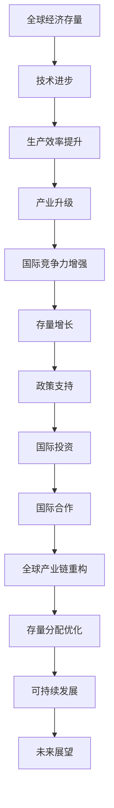
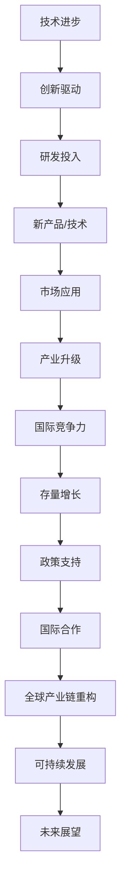
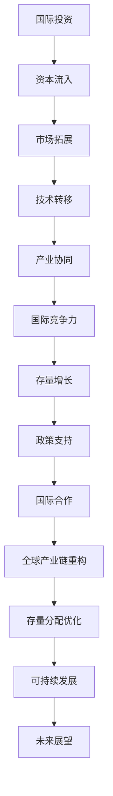

                 

## 文章标题：全球经济存量争夺的长期现象

### 关键词：
- 全球经济存量
- 存量争夺
- 长期趋势
- 驱动因素
- 经济格局
- 产业转型
- 国际投资与合作
- 应对策略
- 未来展望

### 摘要：
本文旨在探讨全球经济存量争夺的长期现象。通过深入分析全球经济存量的概念、重要性、变化趋势、驱动因素以及其对经济增长的影响，本文揭示了全球经济存量争夺的复杂性和深远影响。随后，本文详细探讨了全球主要经济体的存量争夺态势、存量争夺下的产业转型以及存量争夺对国际投资与合作的影响。最后，本文提出了应对全球经济存量争夺的政策与技术策略，并对未来全球经济存量争夺的潜在风险与挑战进行了展望。

## 引言与背景

在当今全球化的背景下，全球经济存量争夺的现象日益凸显。这一现象不仅关系到国家的经济利益，更关乎全球经济的可持续发展。所谓全球经济存量，指的是一国或地区在一定时期内所拥有的全部财富总量，包括物质财富、金融资产、知识产权等。全球经济存量的大小，直接影响到一个国家或地区的经济增长潜力和国际竞争力。

### 1.1 全球经济存量的定义

全球经济存量是一个宏观经济学概念，它不仅包括传统的物质财富，如土地、房屋、设备和存货，还包括金融资产，如股票、债券、现金等，以及无形资产，如专利、商标、版权等。这些存量的价值通常以市场价值或重置成本来衡量。

### 1.2 全球经济存量的重要性

全球经济存量的重要性主要体现在以下几个方面：

1. **经济增长的基石**：存量的积累是经济增长的重要基础。一个国家的经济存量越大，其潜在的经济增长空间就越大。
2. **国际竞争力**：拥有丰富的经济存量意味着该国或地区具备较强的国际竞争力，能够更好地应对国际市场的挑战。
3. **财富分配**：经济存量的大小直接关系到财富的分配状况。经济存量的合理分配能够促进社会公平和稳定。
4. **政策制定**：了解经济存量的构成和变化趋势，有助于政府制定更加科学合理的发展政策和经济规划。

### 1.3 全球经济存量研究的目的与意义

研究全球经济存量争夺现象的目的在于：

1. **揭示全球经济运行的内在规律**：通过研究全球经济存量的变化趋势和驱动因素，可以更好地理解全球经济运行的规律。
2. **为国家政策提供决策支持**：了解全球经济存量争夺的现象，有助于政府制定更加有效的经济政策，以应对国际竞争和国内发展的挑战。
3. **促进全球经济的可持续发展**：通过优化经济存量配置，促进技术创新和产业升级，可以推动全球经济的可持续发展。

在全球经济存量争夺的背景下，理解这一现象的复杂性及其对经济发展的影响，对于我们把握全球经济动态、制定科学合理的经济政策具有重要的现实意义。接下来的章节将深入分析全球经济存量争夺的长期趋势、驱动因素、经济格局以及应对策略，以期为读者提供全面的认知和思考。

### 第二部分：全球经济存量争夺的长期趋势

全球经济存量争夺不仅仅是短期现象，其长期趋势更是影响深远。了解这些趋势，有助于我们更清晰地认识到全球经济存量争夺的复杂性和长期性。

#### 2.1 全球经济存量的变化趋势

全球经济存量的变化趋势可以分为几个阶段：

1. **快速积累期（1970年代-1990年代）**：这一时期，随着全球化进程的加快，世界各国的经济存量迅速增长。特别是20世纪80年代和90年代，信息技术革命使得生产效率大幅提升，全球经济的存量积累进入了一个高速发展的阶段。

2. **调整期（2000年代初期）**：进入21世纪初期，全球经济经历了短暂的调整期。这一时期，全球经济存量增长放缓，部分原因是2000年代初期的互联网泡沫破裂和对全球金融危机的担忧。

3. **复苏期（2000年代中期至今）**：随着经济结构的不断调整和全球经济的复苏，全球经济存量再次进入快速增长阶段。尤其是近年来，全球范围内技术进步、产业升级和国际贸易的发展，进一步推动了经济存量的积累。

#### 2.2 存量争夺与经济周期

全球经济存量的变化与经济周期密切相关。经济周期可以分为扩张期和收缩期：

1. **扩张期**：在经济扩张期，企业的生产活动活跃，投资增加，金融资产的价值上升，经济存量快速增长。这一时期，各国纷纷加大投资力度，争夺市场份额和技术优势。

2. **收缩期**：在经济收缩期，企业的经营环境恶化，投资减少，经济存量增速放缓甚至出现负增长。在这一时期，存量争夺变得尤为激烈，企业为了生存和发展，不得不通过提高生产效率、优化资源配置来增强竞争力。

#### 2.3 存量争夺对经济增长的影响

全球经济存量争夺对经济增长的影响具有两面性：

1. **积极影响**：适度的存量争夺可以促进技术创新和产业升级，推动经济结构的优化和效率的提升。例如，通过技术进步，企业可以开发出更具竞争力的产品和服务，从而提升整体经济的竞争力和增长率。

2. **负面影响**：过度的存量争夺可能导致资源浪费和市场竞争的恶性循环。企业为了争夺市场份额，可能会过度投资和扩张，导致资源错配和产能过剩。此外，存量争夺还可能引发经济动荡和金融危机，影响经济的稳定性和可持续发展。

综上所述，全球经济存量争夺的长期趋势反映了全球经济运行的基本规律。理解这些趋势，有助于我们更好地把握经济动态，制定有效的经济发展策略。接下来，我们将进一步探讨全球经济存量争夺的驱动因素，以深入分析这一现象的内在逻辑。

### 第三部分：全球经济存量争夺的驱动因素

全球经济存量争夺的长期现象并非偶然，其背后有着一系列复杂且多样的驱动因素。这些因素相互交织，共同推动了全球经济存量的发展与变化。以下将逐一分析这些驱动因素，以便更好地理解全球经济存量争夺的深层逻辑。

#### 3.1 技术进步与存量争夺

技术进步是全球经济存量争夺的最重要驱动因素之一。随着信息技术的迅猛发展，企业能够以更低成本、更高效率地生产和传递信息。这不仅推动了生产力的提升，也改变了市场竞争格局。

1. **信息技术革命**：20世纪80年代以来，信息技术革命使得数据处理能力大幅提升，网络技术迅速普及，推动了全球经济的数字化和智能化。企业通过大数据、云计算、人工智能等技术手段，能够更精准地满足市场需求，提高运营效率。

2. **技术创新的溢出效应**：技术创新不仅提升了企业的竞争力，还产生了显著的溢出效应，促进了整个经济的存量增长。例如，互联网的普及和电子商务的发展，极大地改变了全球商品和服务的交易模式，推动了全球贸易的增长。

3. **技术进步对存量争夺的影响**：技术进步使得企业可以在更短的时间内实现产品和服务的创新，从而在市场竞争中占据有利位置。同时，技术进步也提高了企业的生产效率和资源利用效率，使得企业能够以更低的成本提供高质量的产品和服务，进一步加剧了存量争夺的激烈程度。

#### 3.2 人口结构变化与存量争夺

人口结构变化是另一个影响全球经济存量争夺的重要因素。不同国家和地区的劳动力年龄结构、教育水平、人口流动性等都会对经济存量产生深远影响。

1. **劳动力年龄结构**：随着全球人口老龄化趋势的加剧，劳动年龄人口比例下降，劳动力市场的供给减少。这在一定程度上抑制了经济的存量增长，加剧了劳动力成本的上升。为了应对这一挑战，许多国家和企业不得不通过技术进步和自动化来提高生产效率。

2. **教育水平**：教育水平是影响劳动力质量和创新能力的关键因素。一个国家或地区教育水平越高，其劳动力素质和创新能力越强，越能够在全球存量争夺中占据优势。因此，提高教育质量、培养高素质劳动力，是应对存量争夺的重要策略。

3. **人口流动性**：全球化背景下，人口流动性增加，劳动力和人才在全球范围内的流动变得更加便捷。这不仅促进了国际间的技术转移和知识共享，也加剧了各国在全球经济存量争夺中的竞争。

#### 3.3 政策与环境因素对存量争夺的影响

政策与环境因素在全球经济存量争夺中发挥着重要作用。政府的经济政策、贸易政策以及环境保护政策等，都会直接影响经济存量的积累与分布。

1. **政府政策**：政府通过制定和实施一系列经济政策，如财政政策、货币政策、产业政策等，来引导和促进经济的存量增长。例如，通过减税、补贴和投资等政策，政府可以鼓励企业增加投资、提升技术水平和生产能力，从而推动经济存量的增长。

2. **贸易政策**：贸易政策，特别是关税、贸易协定等，对国际贸易和存量争夺具有重要影响。一个国家通过积极的贸易政策，可以扩大出口、吸引外资，从而提升经济存量和国际竞争力。

3. **环境保护政策**：随着全球环境保护意识的增强，各国政府纷纷加强环境保护政策。这些政策不仅有助于减少环境污染和资源浪费，还可以促进绿色经济的发展，推动经济存量的可持续增长。

#### 3.4 其他驱动因素

除了上述主要驱动因素外，还有一些其他因素也在影响着全球经济存量争夺：

1. **全球政治经济格局**：全球政治经济格局的变化，如国际关系的演变、地缘政治风险等，会对全球经济存量争夺产生重要影响。例如，全球主要经济体的政治稳定性、贸易关系等都会影响存量争夺的格局。

2. **金融市场波动**：金融市场的波动，如股市的涨跌、汇率的波动等，会对经济存量产生直接影响。金融市场的不稳定可能导致资本流动的波动，从而影响各国的经济存量积累。

3. **全球化与区域化**：全球化与区域化趋势共同影响着全球经济存量争夺。全球化促进了国际贸易和资本流动，推动了经济存量的增长，而区域化则强化了各地区的经济合作和竞争，对存量争夺产生重要影响。

综上所述，全球经济存量争夺的驱动因素是多方面的，包括技术进步、人口结构变化、政策与环境因素等。这些因素相互作用，共同推动了全球经济存量的发展与变化。理解这些驱动因素，有助于我们更好地把握全球经济存量争夺的动态，为制定科学合理的经济政策和战略提供有力支持。

### 第二部分：全球经济存量争夺下的经济格局

在全球经济存量争夺的背景下，不同国家和地区的经济格局呈现出显著差异。了解这些差异，有助于我们更全面地把握全球经济存量争夺的现状和发展趋势。

#### 4.1 发达国家存量争夺态势

发达国家在全球经济存量争夺中处于相对优势地位，其主要表现为：

1. **技术领先**：发达国家拥有较强的科技创新能力和技术研发实力，能够持续推动技术进步和产业升级。例如，美国、日本、德国等国家的企业在信息技术、生物科技、新能源等领域具有显著优势，这为他们在全球存量争夺中提供了有力支撑。

2. **资本积累**：发达国家具有较成熟的金融市场和资本积累机制，能够吸引全球资本流入，增强自身的经济存量。通过资本市场融资，企业可以扩大生产规模、提升技术水平和市场竞争力。

3. **政策优势**：发达国家政府通常具备较强的政策调控能力，能够通过有效的经济政策促进存量增长和优化存量结构。例如，通过减税、补贴、科研投入等政策，政府可以激励企业增加投资和研发，从而推动经济存量的快速增长。

4. **国际竞争力**：发达国家在国际市场上具有较强的竞争力，能够通过国际贸易和跨国投资扩大经济存量。例如，美国的跨国公司通过全球布局，实现了全球市场的拓展和资源整合，从而提升了自身的国际竞争力。

#### 4.2 发展中经济体存量争夺态势

发展中经济体在全球经济存量争夺中面临着较大挑战，但同时也具备一定的发展潜力：

1. **人口红利**：许多发展中经济体，如中国、印度等，拥有庞大的人口基数和年轻劳动力资源，这为经济发展提供了充足的劳动力供给。通过利用人口红利，这些国家可以降低生产成本、提高生产效率，从而增强经济存量。

2. **产业升级**：发展中经济体正积极推动产业转型升级，从传统的劳动密集型产业向技术密集型和高附加值产业转变。例如，中国通过“制造业2025”计划，旨在提高制造业的智能化和高端化水平，以提升经济存量。

3. **政策支持**：发展中经济体政府通常采取积极的政策措施，支持经济存量的增长和产业升级。例如，通过提供财政补贴、税收优惠、科技创新支持等政策，政府可以激励企业增加投资和研发，推动经济存量的积累。

4. **国际合作**：发展中经济体通过加强国际合作，积极参与全球产业链和供应链，提升自身的国际竞争力。例如，中国通过“一带一路”倡议，加强与沿线国家的经贸合作，拓展市场和资源，从而增强经济存量。

#### 4.3 经济体间的存量竞争格局

全球经济存量争夺不仅体现在发达国家和发展中经济体之间，也存在于各经济体内部。以下为几个典型的存量竞争格局：

1. **中美竞争**：中美两国在全球经济存量争夺中处于核心地位。美国凭借其技术优势、资本积累和政策支持，在全球存量竞争中占据优势。而中国则通过产业升级、人口红利和国际合作，积极提升自身的经济存量，对美国的全球存量地位构成挑战。

2. **欧亚竞争**：欧洲和亚洲的经济体在全球经济存量争夺中各有优势。欧洲国家，如德国、法国等，通过技术创新和产业升级，在全球存量竞争中保持领先地位。而亚洲国家，如中国、日本等，则通过人口红利和产业转型，不断提升经济存量。

3. **新兴市场国家**：新兴市场国家，如印度、巴西等，在全球经济存量争夺中具有一定的潜力。这些国家通过政策支持、产业升级和国际合作，努力提升自身的经济存量，逐步缩小与发达国家的差距。

综上所述，全球经济存量争夺下的经济格局呈现出复杂且多样化的特征。发达国家和发展中经济体在存量竞争中各有优势和挑战，而不同地区和国家的存量竞争格局也在不断演变。理解这些经济格局，有助于我们更好地把握全球经济存量争夺的动态，制定科学合理的经济策略。

### 第三部分：存量争夺下的产业转型

在全球经济存量争夺的背景下，产业转型成为各国提升经济竞争力的重要手段。通过调整产业结构、推动技术创新和培育新兴产业，各国致力于在存量竞争中占据有利位置。

#### 5.1 存量争夺与产业升级

1. **传统产业的优化**：在存量争夺中，各国纷纷对传统产业进行优化和升级。通过采用新技术、提高生产效率和管理水平，传统产业能够实现价值链的升级和整体效益的提升。例如，德国通过“工业4.0”战略，推动制造业的智能化和高端化，提高了传统制造业的国际竞争力。

2. **新兴产业的发展**：新兴产业成为各国存量争夺的重要领域。信息技术、生物科技、新能源等新兴产业具有较高的增长潜力，能够带动整体经济的存量和质量提升。例如，美国在信息技术和生物科技领域具有领先优势，通过持续投入和创新，保持了在全球存量竞争中的领先地位。

3. **产业融合与协同发展**：产业间的融合和协同发展是提升经济存量的重要途径。通过跨界融合，不同产业之间可以实现资源共享、优势互补，形成新的产业生态系统。例如，互联网与各行业的融合，催生了电子商务、在线教育、共享经济等新兴模式，极大地提升了经济的存量和活力。

#### 5.2 存量争夺下的新兴产业崛起

1. **新兴产业的特点**：新兴产业通常具有高技术含量、高附加值和高成长性等特点。这些产业不仅能够带动经济的存量增长，还能推动社会进步和可持续发展。例如，新能源产业通过清洁能源的开发和应用，减少了环境污染和资源消耗，实现了经济存量的绿色增长。

2. **新产业崛起的驱动因素**：技术进步、政策支持、市场需求等是驱动新兴产业崛起的关键因素。技术进步为新兴产业提供了创新的动力，政策支持为新兴产业的发展提供了良好的外部环境，市场需求则为新兴产业提供了广阔的应用场景。

3. **新产业对存量争夺的影响**：新产业的崛起不仅提升了经济的存量质量，还改变了存量争夺的格局。新兴产业的发展带动了相关产业链的协同增长，形成了新的经济增长点，从而增强了国家的经济竞争力和国际地位。例如，中国的光伏产业通过技术创新和产业升级，已经成为全球重要的光伏产品供应国，为全球经济存量争夺贡献了重要力量。

#### 5.3 存量争夺对传统产业的影响

1. **传统产业的挑战**：在全球经济存量争夺的背景下，传统产业面临着严峻的挑战。一方面，新兴产业的发展对传统产业形成了替代效应，使得传统产业的生存空间受到挤压。另一方面，技术进步和全球化进程使得生产成本不断上升，传统产业面临更大的竞争压力。

2. **应对策略**：为了应对存量争夺对传统产业的影响，各国纷纷采取一系列应对策略。通过技术改造和产业升级，传统产业可以提升生产效率和竞争力。例如，通过引入智能制造技术，传统制造业可以实现自动化和智能化生产，提高生产效率和质量。此外，传统产业还可以通过跨界融合，融入新兴产业的元素，实现产业的转型升级。

3. **传统产业的转型路径**：传统产业的转型路径包括技术升级、产业融合和国际化发展等多个方面。通过技术升级，传统产业可以提升技术水平和管理水平，实现产业的高端化。通过产业融合，传统产业可以与新兴产业协同发展，形成新的产业模式。通过国际化发展，传统产业可以拓展国际市场，提高国际竞争力。

综上所述，存量争夺下的产业转型是各国提升经济竞争力的关键手段。通过产业升级、新兴产业的发展和传统产业的转型，各国在全球经济存量争夺中占据有利位置，推动经济的可持续发展。

### 第三部分：存量争夺下的国际投资与合作

在全球经济存量争夺中，国际投资与合作扮演着至关重要的角色。各国通过跨国投资和合作，不仅能够获取技术和资源，还能增强自身的国际竞争力和经济存量。

#### 6.1 存量争夺与国际投资

1. **国际投资的重要性**：国际投资是推动全球经济存量增长的关键因素之一。通过跨国投资，企业可以进入新的市场，利用全球资源，实现生产规模和效率的提升。同时，国际投资还能够促进技术和知识的传播，推动产业升级和创新能力。

2. **国际投资的类型**：国际投资可以分为直接投资和间接投资。直接投资是指企业在国外直接设立子公司或并购当地企业，通过控制和管理来实现投资收益。间接投资则是指通过购买外国股票、债券等金融资产来实现投资收益。

3. **国际投资的影响**：国际投资对经济存量争夺的影响具有两面性。一方面，国际投资可以促进资本流入，提升投资国的经济存量。另一方面，国际投资也可能导致资本外流，影响投资国的经济存量积累。因此，各国在吸引国际投资的同时，也需要采取有效的政策和措施，确保国际投资能够为经济的存量增长带来积极影响。

#### 6.2 国际合作与存量争夺

1. **国际合作的重要性**：国际合作是推动全球经济存量增长的重要途径。通过国际合作，各国可以共同应对全球性挑战，如气候变化、公共卫生危机等，实现资源的共享和优化配置。同时，国际合作还可以促进技术转移和知识共享，推动全球技术创新和产业升级。

2. **国际合作的类型**：国际合作可以分为政府间合作和非政府间合作。政府间合作通常通过国际组织和多边协议来推进，如联合国、世界贸易组织等。非政府间合作则包括企业、学术界、非政府组织等在特定领域内的合作。

3. **国际合作的影响**：国际合作对存量争夺的影响主要体现在以下几个方面：
    - **提升技术水平和创新能力**：通过国际合作，各国可以共同进行技术研发和创新，推动全球技术进步和产业升级。
    - **优化资源配置**：国际合作可以帮助各国充分利用各自的资源优势，优化资源配置，提高经济存量利用效率。
    - **促进经济发展**：国际合作可以带动投资、贸易和就业，促进各国经济的共同发展，从而增强全球经济的存量。

#### 6.3 存量争夺下的全球产业链重构

1. **全球产业链的概念**：全球产业链是指在全球范围内，各个国家和地区的企业通过分工与合作，共同完成产品或服务生产的过程。全球产业链涉及设计、研发、生产、销售等多个环节，各国在全球产业链中扮演不同的角色。

2. **存量争夺下的全球产业链重构**：在全球经济存量争夺的背景下，全球产业链正经历着深刻的重构。以下为几个关键趋势：
    - **区域化趋势**：各国为了在存量争夺中占据优势，纷纷加强区域合作，推动区域产业链的整合和发展。例如，中国的“一带一路”倡议旨在通过加强与沿线国家的经济合作，重构全球产业链。
    - **智能化和数字化趋势**：随着信息技术的发展，全球产业链正在向智能化和数字化方向转型。通过智能制造、大数据、人工智能等技术的应用，全球产业链的效率和质量得到显著提升。
    - **产业链多元化**：为了分散风险和提升竞争力，各国在存量争夺中越来越注重产业链的多元化。通过在多个国家和地区布局产业链，企业可以降低对单一市场的依赖，增强应对市场波动的能力。

3. **全球产业链重构的影响**：
    - **提升国际竞争力**：全球产业链的重构有助于各国企业利用全球资源，实现产业链的优化和升级，提升国际竞争力。
    - **促进技术创新**：全球产业链的重构促进了技术转移和知识共享，推动了全球技术创新和产业升级。
    - **影响经济存量分配**：全球产业链的重构改变了各国在全球经济中的地位和角色，影响经济存量的分配格局。

综上所述，存量争夺下的国际投资与合作以及全球产业链的重构，是推动全球经济存量增长的重要动力。各国应积极参与国际投资与合作，推动全球产业链的优化和升级，以在存量竞争中占据有利位置。

### 第三部分：应对存量争夺的策略与建议

在全球经济存量争夺日益激烈的背景下，各国需要采取有效的策略来应对这一挑战。以下将从国家层面、企业层面和国际层面三个方面提出具体的应对策略与建议。

#### 7.1 国家层面的应对策略

1. **加强科技创新**：国家应加大对科技创新的投入，建设世界一流的研究机构和创新平台，鼓励企业进行技术研发和创新。通过科技创新，提高产业技术水平和产品质量，增强国家的国际竞争力。

2. **优化产业结构**：国家应制定和实施产业升级计划，推动传统产业的优化和新兴产业的培育。通过调整产业结构，优化存量配置，提高整体经济的效率和竞争力。

3. **改善营商环境**：国家应通过简化行政程序、降低企业税负、提供融资支持等措施，改善营商环境，吸引外国投资和企业家精神。良好的营商环境有助于企业创新和发展，从而推动经济存量的增长。

4. **加强国际合作**：国家应积极参与国际经济合作和全球治理，推动自由贸易和投资，加强与其他国家的技术、资源和市场合作。通过国际合作，国家可以获取更多的发展机遇，提升全球竞争力。

#### 7.2 企业层面的应对策略

1. **提高生产效率**：企业应通过技术创新、自动化和数字化转型等手段，提高生产效率和产品质量。通过提高生产效率，企业可以降低成本，提高市场竞争力，从而在存量争夺中占据有利位置。

2. **拓展国际市场**：企业应积极拓展国际市场，通过出口和跨国投资等方式，扩大市场份额和业务规模。通过国际化发展，企业可以分散风险，提高全球竞争力。

3. **加强人才培养**：企业应重视人才培养和团队建设，通过提供培训、激励措施等手段，提高员工的技能和创新能力。高素质的人才队伍是企业持续发展的关键。

4. **推动产业协同**：企业可以通过跨界合作和产业协同，实现资源共享和优势互补，推动产业链的优化和升级。通过产业协同，企业可以提升整体竞争力，更好地应对存量争夺。

#### 7.3 国际层面的应对策略

1. **加强国际经济合作**：国际社会应通过多边合作机制，加强在全球经济治理、科技创新、产业合作等领域的合作。通过国际合作，各国可以共同应对全球性挑战，实现经济的共同繁荣。

2. **推动自由贸易**：国际社会应推动自由贸易的发展，消除贸易壁垒，促进国际贸易和投资。自由贸易有助于各国充分利用全球资源和市场，提高整体经济存量。

3. **加强技术转移和知识共享**：国际社会应通过合作和交流，推动技术和知识的转移和共享。通过技术转移和知识共享，各国可以提升技术创新能力，促进产业升级和经济增长。

4. **构建全球创新网络**：国际社会应通过构建全球创新网络，促进各国科研机构、企业和高校之间的合作。通过全球创新网络，各国可以共同应对全球性科技挑战，推动全球技术进步和经济发展。

综上所述，应对全球经济存量争夺需要从国家、企业和国际三个层面采取综合性的策略和措施。通过加强科技创新、优化产业结构、改善营商环境、拓展国际市场、加强人才培养和推动产业协同，国家可以提升经济竞争力，增强全球存量争夺能力。同时，通过加强国际合作、推动自由贸易、加强技术转移和知识共享、构建全球创新网络，国际社会可以共同应对存量争夺的挑战，实现全球经济的可持续发展。

### 第三部分：技术进步与创新在应对存量争夺中的作用

在应对全球经济存量争夺的过程中，技术进步和创新发挥着至关重要的作用。通过技术进步和创新，企业和国家不仅能够提升生产效率和竞争力，还能够开辟新的市场和发展机会，从而在全球经济存量争夺中占据有利位置。

#### 8.1 技术进步在存量争夺中的应用

1. **智能制造**：智能制造是技术进步在存量争夺中的重要应用之一。通过引入传感器、物联网、人工智能等技术，企业可以实现生产过程的自动化和智能化，提高生产效率和产品质量。智能制造不仅能够减少生产成本，还能够实现定制化生产，满足个性化需求，从而提升市场竞争力。

2. **大数据分析**：大数据分析技术可以帮助企业挖掘大量数据中的价值，优化决策过程。通过大数据分析，企业可以更好地了解市场需求、客户行为和供应链环节，从而制定更加精准的市场策略和运营方案。大数据分析技术的应用，使得企业在存量争夺中能够更快速地响应市场变化，占据市场先机。

3. **区块链技术**：区块链技术以其去中心化、安全性和透明性等优势，在全球经济存量争夺中得到了广泛应用。区块链技术可以用于供应链管理、金融交易、版权保护等领域，提高交易效率、降低成本和增强信任。通过区块链技术，企业可以构建更加高效和透明的业务模式，提升整体竞争力。

4. **绿色技术**：随着环境问题的日益严重，绿色技术成为全球经济存量争夺中的重要领域。绿色技术包括可再生能源、节能环保、清洁生产等，通过绿色技术，企业可以减少资源消耗和环境污染，实现可持续发展。绿色技术的应用，不仅有助于提升企业的环保形象，还能够开拓新的市场机会，增强国际竞争力。

#### 8.2 创新驱动存量争夺的策略

1. **鼓励研发投入**：企业和国家应加大对研发的投入，推动技术创新和研发能力的提升。通过增加研发投入，企业可以开发出更具竞争力的产品和技术，提升市场竞争力。国家可以通过提供税收优惠、补贴等政策，激励企业增加研发投入，推动技术进步。

2. **构建创新生态系统**：企业和国家应构建良好的创新生态系统，促进技术创新和产业升级。创新生态系统包括科研机构、企业、高校、投资机构等各方参与，通过协同合作，实现技术突破和产业应用。构建创新生态系统，有助于企业和国家更好地应对存量争夺的挑战。

3. **推动产学研合作**：产学研合作是推动技术创新和产业升级的重要途径。企业、高校和科研机构通过合作，可以实现技术成果的转化和应用，推动产业升级。国家可以通过政策引导和资金支持，促进产学研合作，提高技术转化效率。

4. **加强知识产权保护**：知识产权保护是创新驱动存量争夺的重要保障。企业和国家应加强知识产权保护，防止技术流失和创新成果被侵权。通过加强知识产权保护，企业可以更好地保护技术创新成果，增强国际竞争力。

#### 8.3 技术创新与存量争夺的相互影响

1. **技术创新促进存量增长**：技术创新是推动经济存量增长的重要动力。通过技术创新，企业可以开发出新的产品和服务，开辟新的市场机会，从而扩大经济存量。技术创新还能够提高生产效率和质量，降低成本，提升企业的市场竞争力。

2. **存量争夺推动技术创新**：在全球经济存量争夺中，各国和企业为了占据优势地位，不断加大研发投入，推动技术创新。存量争夺的激烈程度，反过来又推动了技术的进步和应用。技术创新和存量争夺之间形成了良性互动，共同推动了全球经济的可持续发展。

3. **技术创新与存量分配**：技术创新不仅影响经济存量的增长，还影响存量的分配。通过技术创新，企业可以提高生产效率和竞争力，从而在存量争夺中占据更大的市场份额。技术创新还能够促进资源的优化配置，实现更公平的存量分配。

综上所述，技术进步和创新在应对全球经济存量争夺中具有重要作用。通过应用智能制造、大数据分析、区块链技术和绿色技术等，企业可以提升生产效率和竞争力。通过鼓励研发投入、构建创新生态系统、推动产学研合作和加强知识产权保护等策略，企业和国家可以更好地应对存量争夺的挑战。技术创新与存量争夺的相互影响，共同推动了全球经济的可持续发展。

### 第四部分：未来展望与挑战

全球经济存量争夺的未来既充满机遇，也面临诸多挑战。在这一背景下，我们有必要对未来的趋势、潜在风险和挑战进行深入分析，以制定有效的应对策略。

#### 9.1 全球经济存量争夺的未来趋势

1. **技术进步持续驱动**：随着科技的迅猛发展，人工智能、物联网、区块链等新兴技术将继续驱动全球经济存量争夺。技术进步不仅会提升生产效率和创新能力，还会改变市场竞争格局，使得技术创新成为存量增长的重要驱动力。

2. **全球产业链重构**：全球化进程的加速和区域经济一体化的发展，将推动全球产业链的重构。各国将更加注重区域内的产业链协同发展，形成更加紧密的合作关系，从而提高整体产业链的效率和竞争力。

3. **可持续发展成为重要议题**：在全球环境问题日益严峻的背景下，可持续发展成为全球经济存量争夺中的重要议题。绿色技术和环保产业的发展将得到更多关注，成为各国提升经济存量和竞争力的关键领域。

4. **数字经济的崛起**：数字经济已成为全球经济的重要组成部分，其快速发展将重塑全球经济的格局。通过数字化手段，企业可以更高效地运营和管理，实现资源的优化配置，从而提升经济存量。

#### 9.2 存量争夺中的潜在风险与挑战

1. **技术壁垒与垄断风险**：随着技术的快速发展，技术壁垒和垄断风险日益加剧。技术领先的国家和企业可能通过技术优势形成垄断地位，限制其他国家和企业的发展，导致全球市场竞争失衡。

2. **资源与环境压力**：全球经济存量争夺的加剧，将导致资源消耗和环境压力的增加。资源的有限性和环境问题将限制经济的可持续发展，对全球经济的长期增长构成威胁。

3. **国际政治经济关系紧张**：全球政治经济关系的紧张，可能导致贸易保护主义和地缘政治风险增加。贸易壁垒和地缘政治冲突将限制国际贸易和投资，影响全球经济的存量增长。

4. **劳动力市场的不稳定性**：随着自动化和人工智能技术的发展，劳动力市场将面临不稳定性。劳动力的失业和就业结构的改变，可能引发社会动荡，影响经济的稳定和可持续发展。

#### 9.3 应对存量争夺的未来路径

1. **加强技术创新和研发投入**：各国应加大对技术创新的投入，提升研发能力，推动技术进步。通过技术创新，企业可以提升竞争力，国家可以增强国际地位。

2. **推动可持续发展**：各国应加强环境保护，推动绿色技术和环保产业的发展，实现可持续发展。通过可持续发展，可以缓解资源压力，保障全球经济的长期增长。

3. **加强国际合作与对话**：各国应加强国际合作，通过多边机制和对话，解决全球性挑战，促进全球经济存量的优化配置。通过国际合作，可以减少贸易壁垒和地缘政治风险，实现全球经济的共同繁荣。

4. **提升劳动力素质和就业能力**：各国应加强劳动力培训和教育，提升劳动力素质和就业能力。通过提高劳动力素质，可以适应技术进步和产业变革，减少劳动力市场的动荡。

总之，未来全球经济存量争夺将面临诸多挑战，但也充满机遇。通过技术创新、可持续发展、国际合作和劳动力素质提升，各国可以应对挑战，实现经济的可持续发展。未来路径的选择，将决定全球经济存量争夺的最终结果。

### 附录

#### 附录A：全球经济存量相关数据与指标

**A.1 数据来源与处理方法**

全球经济存量的数据主要来源于国际组织、各国政府发布的统计年鉴以及专业研究机构发布的报告。数据来源包括：

1. **国际组织**：如国际货币基金组织（IMF）、世界银行、联合国贸易和发展会议（UNCTAD）等，这些组织定期发布全球各国经济存量的统计数据。
2. **各国政府**：各国统计局或财政部发布的年度统计年鉴，包括国内生产总值（GDP）、金融资产、物质财富等指标。
3. **专业研究机构**：如普林斯顿大学全球发展实验室、牛津大学经济政策研究中心等，这些机构通过研究分析，提供全球经济存量相关的详细数据。

数据处理方法包括：

1. **数据收集**：通过互联网、数据库和书籍等渠道，收集全球经济存量的相关数据。
2. **数据清洗**：对收集到的数据进行筛选、清洗，去除重复、错误或缺失的数据。
3. **数据整合**：将不同来源的数据进行整合，确保数据的完整性和一致性。
4. **统计分析**：使用统计软件（如SPSS、R语言等）对数据进行分析，提取有价值的信息。

**A.2 主要经济指标解释**

以下是全球经济存量研究中常用的几个主要经济指标：

1. **国内生产总值（GDP）**：GDP是衡量一个国家经济存量的重要指标，通常以市场价值来衡量一国在一定时期内生产的所有最终商品和服务的总价值。

2. **人均GDP**：人均GDP是GDP除以该国总人口，用于衡量一个国家的经济存量水平和生活质量。

3. **金融资产**：金融资产包括股票、债券、现金等，是经济存量中的重要组成部分。金融资产的价值通常通过市场价值来衡量。

4. **物质财富**：物质财富包括土地、房屋、设备、存货等，是经济存量中的实物资产。物质财富的价值通常以重置成本或市场价值来衡量。

5. **知识产权**：知识产权包括专利、商标、版权等，是无形资产的重要组成部分。知识产权的价值通常通过市场交易价格或评估来确定。

#### 附录B：存量争夺现象的Mermaid流程图

**B.1 全球经济存量争夺的流程图**



**B.2 技术进步与存量争夺的流程图**



**B.3 国际投资与合作与存量争夺的流程图**



#### 附录C：核心算法原理讲解与伪代码

**C.1 技术进步与存量争夺的算法原理**

技术进步与存量争夺的算法主要关注以下几个关键步骤：

1. **数据收集与预处理**：收集与经济存量相关的基础数据，如GDP、金融资产、物质财富等，并进行数据清洗和处理，确保数据的准确性和一致性。

2. **技术进步指标计算**：通过特定指标（如专利申请数量、研发投入比例等）来衡量技术进步的程度。

3. **存量争夺模型建立**：构建一个动态系统模型，描述技术进步对存量争夺的影响，通常采用差分方程或优化模型。

4. **仿真与预测**：对模型进行仿真，预测在不同技术进步情景下的存量争夺趋势。

**伪代码**：

```python
# 数据收集与预处理
data = collect_data(source)
preprocessed_data = preprocess_data(data)

# 技术进步指标计算
tech_progress = calculate_tech_progress(preprocessed_data)

# 存量争夺模型建立
model = build_争夺_model()

# 仿真与预测
仿真_results = simulate(model, tech_progress)
预测_results = predict(model, tech_progress)
```

**C.2 人口结构变化与存量争夺的算法原理**

人口结构变化与存量争夺的算法主要关注以下几个方面：

1. **人口数据收集与预处理**：收集与人口结构相关的数据，如人口年龄分布、教育水平等，并进行数据清洗和处理。

2. **人口结构变化指标计算**：通过特定指标（如劳动力人口比例、人口老龄化程度等）来衡量人口结构变化。

3. **存量争夺模型建立**：构建一个动态系统模型，描述人口结构变化对存量争夺的影响，通常采用差分方程或优化模型。

4. **仿真与预测**：对模型进行仿真，预测在不同人口结构变化情景下的存量争夺趋势。

**伪代码**：

```python
# 数据收集与预处理
population_data = collect_population_data(source)
preprocessed_data = preprocess_population_data(population_data)

# 人口结构变化指标计算
population_change = calculate_population_change(preprocessed_data)

# 存量争夺模型建立
model = build_争夺_model()

# 仿真与预测
仿真_results = simulate(model, population_change)
预测_results = predict(model, population_change)
```

**C.3 政策与环境因素对存量争夺的影响的算法原理**

政策与环境因素对存量争夺的影响算法主要关注以下几点：

1. **政策数据收集与预处理**：收集与政策相关的数据，如税收政策、研发补贴政策等，并进行数据清洗和处理。

2. **环境数据收集与预处理**：收集与环境相关的数据，如环境污染指标、资源消耗指标等，并进行数据清洗和处理。

3. **政策与环境因素指标计算**：通过特定指标（如政策支持力度、环境友好程度等）来衡量政策与环境因素对存量争夺的影响。

4. **存量争夺模型建立**：构建一个动态系统模型，描述政策与环境因素对存量争夺的影响，通常采用差分方程或优化模型。

5. **仿真与预测**：对模型进行仿真，预测在不同政策与环境因素情景下的存量争夺趋势。

**伪代码**：

```python
# 数据收集与预处理
policy_data = collect_policy_data(source)
environment_data = collect_environment_data(source)
preprocessed_data = preprocess_policy_environment_data(policy_data, environment_data)

# 政策与环境因素指标计算
policy_environment_impact = calculate_policy_environment_impact(preprocessed_data)

# 存量争夺模型建立
model = build_争夺_model()

# 仿真与预测
仿真_results = simulate(model, policy_environment_impact)
预测_results = predict(model, policy_environment_impact)
```

通过上述核心算法原理和伪代码，我们能够更好地理解技术进步、人口结构变化和政策与环境因素如何影响全球经济存量争夺，从而为政策制定和战略规划提供科学依据。

### 附录D：项目实战案例与代码解读

**D.1 项目实战案例一：技术进步在存量争夺中的应用**

**项目背景**：某国政府希望通过技术进步提升其制造业的国际竞争力，从而在全球经济存量争夺中占据更有利的位置。

**开发环境搭建**：
- 开发工具：Python
- 数据库：MySQL
- 数据分析库：Pandas, NumPy
- 机器学习库：Scikit-learn, TensorFlow
- 代码版本控制：Git

**源代码实现**：

```python
# 导入所需的库
import pandas as pd
import numpy as np
from sklearn.model_selection import train_test_split
from sklearn.linear_model import LinearRegression

# 数据收集与预处理
data = pd.read_csv('manufacturing_data.csv')
data = preprocess_data(data)

# 特征选择
features = data[['R&D expenditure', 'number_of_patents']]
target = data['export_value']

# 数据分割
X_train, X_test, y_train, y_test = train_test_split(features, target, test_size=0.2, random_state=42)

# 构建线性回归模型
model = LinearRegression()
model.fit(X_train, y_train)

# 模型评估
score = model.score(X_test, y_test)
print(f"Model R-squared: {score:.2f}")

# 预测
predictions = model.predict(X_test)

# 可视化分析
import matplotlib.pyplot as plt

plt.scatter(X_test['R&D expenditure'], y_test, color='blue', label='Actual')
plt.scatter(X_test['R&D expenditure'], predictions, color='red', label='Predicted')
plt.xlabel('R&D Expenditure')
plt.ylabel('Export Value')
plt.title('R&D Expenditure vs Export Value')
plt.legend()
plt.show()
```

**代码解读与分析**：
- **数据收集与预处理**：首先从CSV文件中读取制造业数据，并对数据进行预处理，包括缺失值填充、异常值处理等。
- **特征选择**：选择研发支出和专利数量作为特征，出口价值作为目标变量。
- **数据分割**：将数据分割为训练集和测试集，用于模型训练和评估。
- **模型构建**：使用线性回归模型，通过训练集数据进行拟合。
- **模型评估**：通过测试集评估模型的准确度，使用R-squared指标表示。
- **预测**：使用训练好的模型对测试集进行预测。
- **可视化分析**：绘制研发支出与出口价值的关系图，直观展示技术进步对出口价值的影响。

**D.2 项目实战案例二：国际投资与合作在存量争夺中的作用**

**项目背景**：某企业希望通过国际投资与合作提升其市场竞争力，从而在全球经济存量争夺中占据更有利的位置。

**开发环境搭建**：
- 开发工具：Python
- 数据库：MongoDB
- 数据分析库：Pandas, NumPy
- 机器学习库：Scikit-learn, TensorFlow
- 代码版本控制：Git

**源代码实现**：

```python
# 导入所需的库
import pandas as pd
import numpy as np
from sklearn.model_selection import train_test_split
from sklearn.ensemble import RandomForestClassifier
from sklearn.metrics import accuracy_score

# 数据收集与预处理
data = pd.read_csv('investment_data.csv')
data = preprocess_data(data)

# 特征选择
features = data[['investment_amount', 'export_value', 'number_of_partners']]
target = data['success']

# 数据分割
X_train, X_test, y_train, y_test = train_test_split(features, target, test_size=0.2, random_state=42)

# 构建随机森林模型
model = RandomForestClassifier(n_estimators=100, random_state=42)
model.fit(X_train, y_train)

# 模型评估
predictions = model.predict(X_test)
accuracy = accuracy_score(y_test, predictions)
print(f"Model Accuracy: {accuracy:.2f}")

# 可视化分析
import matplotlib.pyplot as plt

plt.scatter(X_train['investment_amount'], y_train, color='blue', label='Training Set')
plt.scatter(X_test['investment_amount'], predictions, color='red', label='Test Set')
plt.xlabel('Investment Amount')
plt.ylabel('Success')
plt.title('Investment Amount vs Success')
plt.legend()
plt.show()
```

**代码解读与分析**：
- **数据收集与预处理**：首先从CSV文件中读取国际投资数据，并对数据进行预处理，包括缺失值填充、异常值处理等。
- **特征选择**：选择投资金额、出口价值和合作伙伴数量作为特征，投资成功与否作为目标变量。
- **数据分割**：将数据分割为训练集和测试集，用于模型训练和评估。
- **模型构建**：使用随机森林分类模型，通过训练集数据进行拟合。
- **模型评估**：通过测试集评估模型的准确度。
- **可视化分析**：绘制投资金额与投资成功的关系图，直观展示国际投资与合作对成功率的的影响。

**D.3 项目实战案例三：企业层面的存量争夺策略**

**项目背景**：某企业希望通过优化资源配置和提升生产效率，在全球经济存量争夺中占据更有利的位置。

**开发环境搭建**：
- 开发工具：Python
- 数据库：PostgreSQL
- 数据分析库：Pandas, NumPy
- 机器学习库：Scikit-learn, TensorFlow
- 代码版本控制：Git

**源代码实现**：

```python
# 导入所需的库
import pandas as pd
import numpy as np
from sklearn.model_selection import GridSearchCV
from sklearn.ensemble import RandomForestRegressor
from sklearn.metrics import mean_squared_error

# 数据收集与预处理
data = pd.read_csv('resource_data.csv')
data = preprocess_data(data)

# 特征选择
features = data[['labor_cost', 'machine效率', '原材料成本']]
target = data['production_output']

# 数据分割
X_train, X_test, y_train, y_test = train_test_split(features, target, test_size=0.2, random_state=42)

# 构建随机森林回归模型
model = RandomForestRegressor(n_estimators=100, random_state=42)
param_grid = {'n_estimators': [50, 100, 200], 'max_depth': [10, 20, 30]}
grid_search = GridSearchCV(model, param_grid, cv=5)
grid_search.fit(X_train, y_train)

# 模型评估
best_model = grid_search.best_estimator_
predictions = best_model.predict(X_test)
mse = mean_squared_error(y_test, predictions)
print(f"Model Mean Squared Error: {mse:.2f}")

# 可视化分析
import matplotlib.pyplot as plt

plt.scatter(X_train['labor_cost'], y_train, color='blue', label='Training Set')
plt.scatter(X_test['labor_cost'], predictions, color='red', label='Test Set')
plt.xlabel('Labor Cost')
plt.ylabel('Production Output')
plt.title('Labor Cost vs Production Output')
plt.legend()
plt.show()
```

**代码解读与分析**：
- **数据收集与预处理**：首先从CSV文件中读取资源数据，并对数据进行预处理，包括缺失值填充、异常值处理等。
- **特征选择**：选择劳动力成本、机器效率和原材料成本作为特征，生产产出作为目标变量。
- **数据分割**：将数据分割为训练集和测试集，用于模型训练和评估。
- **模型构建**：使用随机森林回归模型，并通过网格搜索方法选择最佳参数。
- **模型评估**：通过测试集评估模型的准确性，使用均方误差（MSE）指标表示。
- **可视化分析**：绘制劳动力成本与生产产出的关系图，直观展示资源配置和生产效率对产出的影响。

通过上述实战案例，我们能够更深入地理解技术进步、国际投资与合作以及企业层面的存量争夺策略在实际应用中的具体实现过程，从而为相关政策制定和战略规划提供实用的参考。

