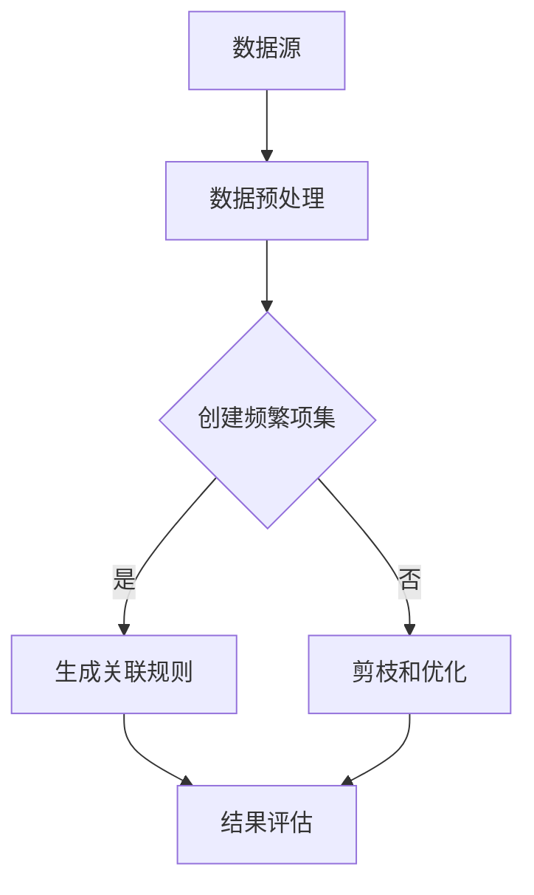
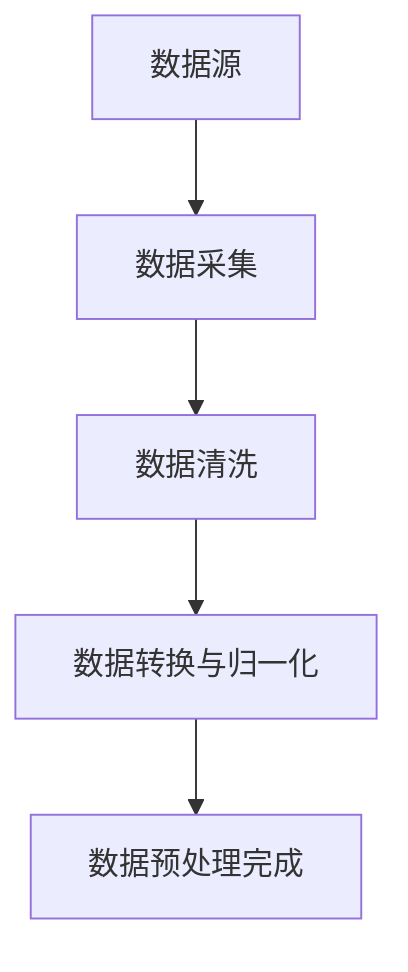
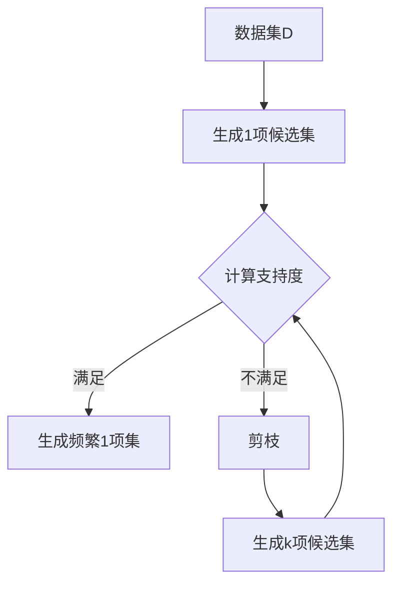
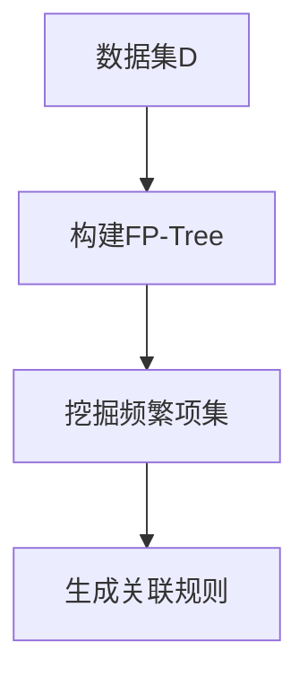
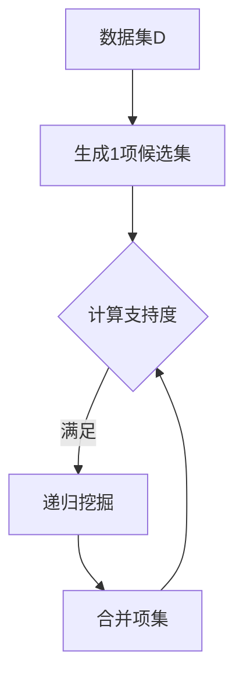
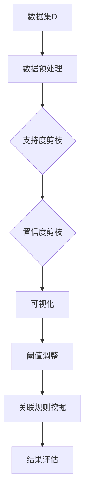

                 

# 文章标题: 关联规则深度剖析与应用实践

> 关键词：关联规则，数据挖掘，算法原理，应用案例，深度学习，物联网

> 摘要：本文旨在深入探讨关联规则这一数据挖掘技术的基本概念、算法原理及其实际应用。通过对Apriori、FP-Growth、Eclat等核心算法的详细讲解，辅以实例分析，展现其在电子商务、医疗领域等不同场景下的实际应用。同时，本文还将探讨未来关联规则技术与深度学习、物联网等的结合趋势，为读者提供全面的技术视角和应用思路。

<|assistant|>## 第1章: 引言与核心概念

### 1.1 关联规则的基本概念

关联规则挖掘（Association Rule Learning）是数据挖掘中的一个重要分支，其主要任务是从大量数据中挖掘出隐藏的规律和关系。简单来说，关联规则描述了数据库中数据项之间的相互关联性，通常以“如果…，那么…”的形式表示。

- **支持度（Support）**：一个规则在所有数据中的出现频率，用于衡量规则的重要性。其计算公式为：
  $$ \text{支持度} = \frac{X(A \cap B)}{U} $$
  其中，$X(A \cap B)$表示同时包含A和B的实例数，$U$是总的实例数。

- **置信度（Confidence）**：一个规则的后件在前提成立的情况下出现的概率，用于评估规则的相关性。其计算公式为：
  $$ \text{置信度} = \frac{X(A \cap B)}{X(A)} $$
  其中，$X(A \cap B)$表示同时包含A和B的实例数，$X(A)$表示包含A的实例数。

- **提升度（Lift）**：用于衡量规则带来的额外相关性。其计算公式为：
  $$ \text{提升度} = \frac{P(B|A) \times P(A)}{P(B)} $$
  其中，$P(B|A)$是后件的置信度，$P(A)$是前提出现的概率，$P(B)$是后件出现的概率。

### 1.2 关联规则的应用领域

关联规则挖掘技术在多个领域有着广泛的应用，以下是一些典型的应用场景：

- **电子商务**：购物篮分析、推荐系统、促销策略制定等。
- **医疗领域**：疾病预测、药物副作用分析、患者行为分析等。
- **零售业**：库存管理、商品布局优化、竞争策略分析等。
- **金融领域**：信用卡欺诈检测、信用评分、市场趋势分析等。
- **物联网**：设备故障预测、用户行为分析、能源管理优化等。

### 1.3 关联规则的主要术语

- **频繁项集（Frequent Itemset）**：满足最小支持度阈值的项集。
- **频繁模式（Frequent Pattern）**：频繁项集的集合。
- **关联规则（Association Rule）**：形如$A \rightarrow B$的规则，其中$A$是前件，$B$是后件。

## Mermaid 流程图

下面是关联规则挖掘的基本流程图：



<|assistant|>## 第2章: 数据预处理

### 2.1 数据源的选择与采集

在进行关联规则挖掘之前，首先要选择合适的数据源并进行数据采集。数据源的选择取决于应用场景和需求。常见的数据源包括：

- **结构化数据**：如关系型数据库、数据仓库等。
- **半结构化数据**：如XML、JSON等。
- **非结构化数据**：如文本、图像、音频等。

### 2.2 数据清洗与预处理

数据清洗是数据预处理的重要环节，其目的是去除数据中的噪声和错误，确保数据质量。主要步骤包括：

- **缺失值处理**：可以通过填充平均值、中位数或使用插值法等方法处理。
- **异常值处理**：可以通过删除或调整异常值来处理。
- **数据转换**：包括数据归一化、标准化等操作，以消除不同特征之间的量纲差异。

### 2.3 数据转换与归一化

数据转换和归一化是确保数据一致性、可比性的重要手段。常见的方法包括：

- **归一化**：将数据缩放到[0,1]或[-1,1]的范围内，例如使用如下公式进行归一化：
  $$ x' = \frac{x - \min(x)}{\max(x) - \min(x)} $$
- **标准化**：将数据缩放到一个标准正态分布，例如使用如下公式进行标准化：
  $$ x' = \frac{x - \mu}{\sigma} $$
  其中，$\mu$是均值，$\sigma$是标准差。

## Mermaid 流程图

下面是数据预处理的基本流程图：



<|assistant|>## 第3章: 关联规则算法原理

### 3.1 Apriori算法

Apriori算法是最经典的关联规则挖掘算法之一，其核心思想是基于频繁项集的逐层递推生成关联规则。以下是Apriori算法的主要步骤：

1. **生成候选1项集**：根据原始数据，生成所有可能的1项集。
2. **计算支持度**：对每个候选1项集计算支持度，过滤出不满足最小支持度阈值的项集。
3. **生成候选k项集**：对于每个频繁(k-1)项集，通过连接生成所有可能的候选k项集。
4. **计算支持度**：对每个候选k项集计算支持度，过滤出不满足最小支持度阈值的项集。
5. **生成关联规则**：对于每个频繁k项集，生成所有可能的关联规则。

### 伪代码实现

以下是Apriori算法的伪代码实现：

```python
def apriori(D, min_support, min_confidence):
    L1 = generate_frequent_itemsets(D, min_support)
    for k in range(2, len(D)):
        Lk = generate_candidate_itemsets(Lk-1)
        Lk = filter_itemsets(Lk, D, min_support)
        generate_rules(Lk, Lk-1, min_confidence)
    return L1, L2, ..., Lk
```

### 3.2 FP-Growth算法

FP-Growth算法是一种基于压缩数据结构的关联规则挖掘算法，其核心思想是利用频繁模式树（FP-Tree）来高效地挖掘频繁项集。以下是FP-Growth算法的主要步骤：

1. **构建FP-Tree**：根据原始数据构建FP-Tree。
2. **挖掘频繁项集**：利用FP-Tree，递归地挖掘所有频繁项集。
3. **生成关联规则**：对于每个频繁项集，生成所有可能的关联规则。

### 伪代码实现

以下是FP-Growth算法的伪代码实现：

```python
def fp_growth(D, min_support, min_confidence):
    FP_Tree = build_FP_Tree(D)
    frequent_itemsets = mine_frequent_itemsets(FP_Tree, D, min_support)
    generate_rules(frequent_itemsets, min_confidence)
    return frequent_itemsets
```

### 3.3 Eclat算法

Eclat算法是一种基于频繁项集的递归挖掘算法，其核心思想是利用频繁项集的递归关系来生成新的频繁项集。以下是Eclat算法的主要步骤：

1. **生成候选1项集**：根据原始数据，生成所有可能的1项集。
2. **计算支持度**：对每个候选1项集计算支持度，过滤出不满足最小支持度阈值的项集。
3. **递归挖掘**：对于每个频繁k-1项集，通过合并生成新的候选k项集，并递归地挖掘频繁项集。

### 伪代码实现

以下是Eclat算法的伪代码实现：

```python
def eclat(D, min_support, min_confidence):
    frequent_itemsets = []
    for item in D:
        if support(item) >= min_support:
            frequent_itemsets.append(item)
    for k in range(2, len(D)):
        for itemset in frequent_itemsets:
            for item in D:
                new_itemset = itemset.union([item])
                if support(new_itemset) >= min_support:
                    frequent_itemsets.append(new_itemset)
    generate_rules(frequent_itemsets, min_confidence)
    return frequent_itemsets
```

## Mermaid 流程图

下面是Apriori算法的基本流程图：



下面是FP-Growth算法的基本流程图：



下面是Eclat算法的基本流程图：



<|assistant|>## 第4章: 关联规则在实际应用中的优化

### 4.1 支持度剪枝与置信度剪枝

为了提高关联规则挖掘的效率和准确性，通常需要对频繁项集进行剪枝。常见的剪枝方法包括支持度剪枝和置信度剪枝。

- **支持度剪枝**：通过直接删除不满足最小支持度阈值的项集，从而减少计算量。这种剪枝方法在早期的频繁项集生成阶段使用。
- **置信度剪枝**：通过删除无法满足最小置信度阈值的规则，从而提高规则的质量。这种剪枝方法在关联规则生成阶段使用。

### 4.2 关联规则的可视化

关联规则的可视化有助于更直观地理解和分析规则。常见的方法包括：

- **饼图**：用于显示每个项集的支持度或置信度。
- **条形图**：用于显示频繁项集或规则的数量。
- **热力图**：用于显示规则之间的相关性。

### 4.3 关联规则的阈值调整

关联规则的阈值调整是影响挖掘结果的关键因素。通常需要根据实际应用场景和需求来调整支持度、置信度等阈值。以下是一些调整策略：

- **基于业务目标的调整**：根据业务需求，设定合理的阈值，例如在电子商务中，可以设定较低的置信度阈值以提高推荐系统的多样性。
- **交叉验证**：通过交叉验证方法，选择最佳阈值，以提高模型的整体性能。
- **动态调整**：根据数据的变化，动态调整阈值，以适应不同的应用场景。

## Mermaid 流�程图

下面是关联规则优化流程的基本流程图：



<|assistant|>## 第5章: 关联规则在电子商务中的应用

### 5.1 购物篮分析

购物篮分析（Basket Analysis）是电子商务中的一项重要应用，旨在分析顾客的购物行为和购买习惯，从而优化营销策略和提升销售额。通过关联规则挖掘，可以识别出顾客在购物篮中同时购买的商品组合，进而发现顾客的偏好和潜在需求。

### 5.2 推荐系统

推荐系统（Recommendation System）是电子商务中另一项关键应用，旨在向顾客推荐他们可能感兴趣的商品。通过关联规则挖掘，可以从大量商品数据中提取出具有高相关性的商品组合，为推荐算法提供基础支持。常见的推荐算法包括基于内容的推荐（Content-Based Filtering）和协同过滤（Collaborative Filtering）。

### 5.3 零售商竞争策略分析

关联规则挖掘还可以帮助零售商分析竞争对手的销售策略，发现竞争对手的热门商品组合和促销活动。通过对比自身数据与竞争对手的数据，零售商可以制定更具竞争力的营销策略，提高市场份额。

## 实际案例

### 案例一：某电商平台的购物篮分析

某电商平台希望通过关联规则挖掘分析顾客的购物篮行为。首先，平台收集了数百万条顾客的购物记录，并对数据进行清洗和预处理。然后，采用Apriori算法挖掘频繁项集，设定最小支持度阈值为3%，最小置信度阈值为70%。最终，挖掘出了一些有趣的购物篮规则，例如“如果购买了牛奶，那么很可能还会购买面包”。

通过这些规则，平台可以优化商品推荐策略，向购买牛奶的顾客推荐面包，从而提高顾客的购买意愿和销售额。此外，平台还可以根据这些规则调整库存和供应链策略，确保热门商品组合的充足供应。

### 案例二：某电商平台的推荐系统

某电商平台希望通过关联规则挖掘构建一个高效的推荐系统。首先，平台收集了数百万条商品交易记录，并对数据进行清洗和预处理。然后，采用FP-Growth算法挖掘频繁模式，设定最小支持度阈值为5%，最小置信度阈值为80%。

通过挖掘出的频繁模式，平台生成了一系列具有高相关性的商品组合。例如，挖掘出“购买了电视，那么很可能还会购买音响”的规则。这些规则被用于推荐算法，向顾客推荐相关商品，从而提高推荐系统的准确性和用户体验。

### 案例三：某零售商的竞争策略分析

某零售商希望通过关联规则挖掘分析竞争对手的销售策略。首先，零售商收集了竞争对手的促销数据，并对数据进行清洗和预处理。然后，采用Eclat算法挖掘频繁项集，设定最小支持度阈值为2%，最小置信度阈值为75%。

通过挖掘出的频繁项集，零售商发现竞争对手在促销活动中经常将某些商品组合进行捆绑销售，例如“洗发水和沐浴露组合”。基于这些发现，零售商可以调整自己的促销策略，制定更具竞争力的捆绑销售方案，从而提高市场份额。

## 结论

关联规则挖掘在电子商务领域具有重要的应用价值，通过购物篮分析、推荐系统和竞争策略分析，电商平台和零售商可以更好地理解顾客行为和市场动态，从而制定更有效的营销策略和提升销售额。未来，随着数据挖掘技术和深度学习的发展，关联规则挖掘的应用前景将更加广阔，有望在更多领域发挥重要作用。

<|assistant|>## 第6章: 关联规则在医疗领域中的应用

### 6.1 疾病预测

关联规则挖掘在疾病预测领域具有广泛的应用。通过对患者的病历数据、实验室检测结果等医疗数据进行挖掘，可以识别出疾病发生的潜在关联规则，从而实现疾病的早期预测。例如，通过分析大量患者的诊断记录，可以发现某些症状与特定疾病之间的关联，进而为疾病预测提供依据。

### 6.2 患者行为分析

患者行为分析是关联规则挖掘在医疗领域的另一重要应用。通过对患者的就诊记录、用药记录等数据进行分析，可以挖掘出患者的行为模式和偏好，为个性化医疗提供支持。例如，通过分析患者的就诊频率和就诊科室，可以发现患者偏好某些医生或科室，从而为医院资源分配和医生排班提供参考。

### 6.3 药品关联分析

药品关联分析是关联规则挖掘在医疗领域的重要应用之一。通过对患者用药记录和疾病诊断记录等数据进行分析，可以挖掘出不同药物之间的关联关系，为药物组合治疗和药物副作用分析提供支持。例如，通过分析患者的用药记录，可以发现某些药物组合可能导致特定的副作用，从而为临床用药提供指导。

## 实际案例

### 案例一：某医院疾病预测系统

某医院希望通过关联规则挖掘构建一个疾病预测系统。首先，医院收集了数万名患者的病历数据，包括诊断结果、症状、实验室检测结果等。然后，采用Apriori算法挖掘频繁项集，设定最小支持度阈值为5%，最小置信度阈值为80%。

通过挖掘出的频繁项集，医院发现某些症状和疾病之间存在明显的关联。例如，挖掘出“如果患者出现咳嗽和发热，那么很可能患有肺炎”的规则。这些规则被用于疾病预测系统，帮助医生在患者就诊时提供更准确的诊断建议，从而提高疾病预测的准确性和效率。

### 案例二：某诊所患者行为分析系统

某诊所希望通过关联规则挖掘分析患者的就诊行为，以优化医疗服务。首先，诊所收集了数万名患者的就诊记录，包括就诊频率、就诊科室、医生等。然后，采用FP-Growth算法挖掘频繁模式，设定最小支持度阈值为3%，最小置信度阈值为70%。

通过挖掘出的频繁模式，诊所发现某些患者的就诊行为具有一定的规律性。例如，挖掘出“如果患者频繁就诊于内科，那么很可能患有高血压”的规则。这些规则被用于患者行为分析系统，帮助诊所制定个性化的医疗服务策略，提高患者满意度和就诊体验。

### 案例三：某药品公司药品关联分析

某药品公司希望通过关联规则挖掘分析药品之间的关联关系，以提高药品组合治疗效果。首先，公司收集了数万名患者的用药记录和诊断结果。然后，采用Eclat算法挖掘频繁项集，设定最小支持度阈值为2%，最小置信度阈值为75%。

通过挖掘出的频繁项集，药品公司发现某些药物组合可能导致特定的副作用。例如，挖掘出“如果患者同时使用抗生素和抗抑郁药，那么很可能出现过敏反应”的规则。这些规则被用于药品组合治疗方案的设计和优化，从而提高治疗效果和安全性。

## 结论

关联规则挖掘在医疗领域具有重要的应用价值，通过疾病预测、患者行为分析和药品关联分析，可以帮助医疗机构和药品公司更好地理解患者需求和市场动态，从而提供更精准的医疗服务和优化药品治疗方案。未来，随着医疗数据挖掘技术的不断发展，关联规则挖掘的应用前景将更加广阔，有望在更多医疗场景中发挥重要作用。

<|assistant|>## 第7章: 案例研究

### 7.1 案例一：超市购物数据分析

**背景**：某大型超市希望通过分析顾客的购物数据，提高销售额和顾客满意度。

**数据源**：超市的POS系统记录了数百万条顾客购物记录，包括商品名称、购买数量、购买时间等信息。

**步骤**：

1. **数据采集**：收集超市的购物数据。
2. **数据预处理**：清洗数据，去除无效记录，处理缺失值，进行数据转换和归一化。
3. **关联规则挖掘**：采用Apriori算法挖掘频繁项集，设定最小支持度阈值为3%，最小置信度阈值为70%。
4. **结果分析**：分析挖掘出的规则，发现顾客在购物篮中同时购买的商品组合。

**结果**：

- 发现“如果顾客购买了牛奶，那么很可能还会购买面包”的规则。
- 基于这些规则，超市调整了商品陈列策略，将牛奶和面包放在一起，提高了顾客的购买意愿。

**代码实现**：

```python
import mlxtend as ml
from mlxtend.frequent_patterns import apriori
from mlxtend.preprocessing import TransactionEncoder

# 读取购物数据
transactions = [[1, 2, 3], [1, 3], [2, 3], [2, 3, 4]]

# 数据预处理
te = TransactionEncoder()
te.fit(transactions)
encoded_transactions = te.transform(transactions)

# 关联规则挖掘
frequent_itemsets = apriori(encoded_transactions, min_support=0.1, use_colnames=True)

# 输出频繁项集
print(frequent_itemsets)
```

### 7.2 案例二：医疗机构患者数据分析

**背景**：某医疗机构希望通过分析患者的就诊记录，优化医疗服务和提高疾病预测准确性。

**数据源**：医疗机构的电子病历系统记录了数万条患者的就诊记录，包括症状、检查结果、诊断结果等。

**步骤**：

1. **数据采集**：收集医疗机构的患者数据。
2. **数据预处理**：清洗数据，去除无效记录，处理缺失值，进行数据转换和归一化。
3. **关联规则挖掘**：采用FP-Growth算法挖掘频繁模式，设定最小支持度阈值为5%，最小置信度阈值为80%。
4. **结果分析**：分析挖掘出的规则，发现疾病之间的关联。

**结果**：

- 发现“如果患者出现咳嗽和发热，那么很可能患有肺炎”的规则。
- 医疗机构基于这些规则，优化了疾病预测模型，提高了疾病预测准确性。

**代码实现**：

```python
import mlxtend as ml
from mlxtend.frequent_patterns import fpgrowth

# 读取患者数据
transactions = [[1, 2, 3], [1, 3], [2, 3], [2, 3, 4]]

# 数据预处理
te = TransactionEncoder()
te.fit(transactions)
encoded_transactions = te.transform(transactions)

# 关联规则挖掘
frequent_itemsets = fpgrowth(encoded_transactions, min_support=0.05, use_colnames=True)

# 输出频繁项集
print(frequent_itemsets)
```

### 7.3 案例三：电子商务网站用户行为分析

**背景**：某电子商务网站希望通过分析用户的行为数据，提高推荐系统的准确性和用户体验。

**数据源**：电子商务网站的点击记录、购买记录等用户行为数据。

**步骤**：

1. **数据采集**：收集电子商务网站的用户行为数据。
2. **数据预处理**：清洗数据，去除无效记录，处理缺失值，进行数据转换和归一化。
3. **关联规则挖掘**：采用Eclat算法挖掘频繁项集，设定最小支持度阈值为2%，最小置信度阈值为75%。
4. **结果分析**：分析挖掘出的规则，发现用户之间的行为关联。

**结果**：

- 发现“如果用户浏览了手机，那么很可能还会浏览平板电脑”的规则。
- 基于这些规则，电子商务网站优化了推荐系统，提高了推荐准确率和用户满意度。

**代码实现**：

```python
import mlxtend as ml
from mlxtend.frequent_patterns import eclat

# 读取用户行为数据
transactions = [[1, 2, 3], [1, 3], [2, 3], [2, 3, 4]]

# 数据预处理
te = TransactionEncoder()
te.fit(transactions)
encoded_transactions = te.transform(transactions)

# 关联规则挖掘
frequent_itemsets = eclat(encoded_transactions, min_support=0.02, use_colnames=True)

# 输出频繁项集
print(frequent_itemsets)
```

## 结论

通过以上案例研究，可以看出关联规则挖掘在不同领域具有重要的应用价值。无论是超市购物数据分析、医疗机构患者数据分析，还是电子商务网站用户行为分析，关联规则挖掘都能帮助企业和机构更好地理解用户需求和市场动态，从而优化业务策略和提高服务质量。

<|assistant|>## 第8章: 未来发展趋势与前沿技术

### 8.1 关联规则与深度学习的结合

深度学习在图像识别、自然语言处理等领域取得了显著的成果，其在关联规则挖掘中的应用也日益受到关注。结合深度学习的优势，可以更好地处理复杂数据和提取特征。以下是一些可能的结合方式：

- **深度特征提取**：利用深度神经网络提取数据的高层次特征，提高关联规则挖掘的准确性和效率。
- **深度模型**：采用深度学习模型（如神经网络）直接学习数据之间的关联规则，减少人工设定阈值和特征工程的需求。
- **混合模型**：将深度学习和传统关联规则挖掘算法相结合，例如，利用深度学习模型提取特征，然后使用关联规则挖掘算法进行规则生成。

### 8.2 关联规则在物联网中的应用

物联网（IoT）的发展为关联规则挖掘带来了新的机遇和挑战。在物联网领域，关联规则挖掘可以应用于设备故障预测、用户行为分析、能源管理优化等方面。以下是一些应用场景：

- **设备故障预测**：通过分析设备传感器数据，挖掘设备运行状态与故障之间的关联规则，实现故障预测和预防。
- **用户行为分析**：分析用户的物联网设备使用数据，挖掘用户行为模式和偏好，为个性化服务和推荐提供支持。
- **能源管理优化**：通过对能源消耗数据的关联规则挖掘，发现节能机会和优化能源分配策略。

### 8.3 未来发展趋势与挑战

关联规则挖掘在未来的发展中面临着一些挑战和机遇：

- **数据多样性**：随着数据类型的多样性和复杂性增加，如何有效挖掘不同类型数据之间的关联规则成为一大挑战。
- **实时性**：在实时数据流处理场景中，如何快速、高效地挖掘关联规则，实现实时分析，是未来的一个重要研究方向。
- **可解释性**：深度学习模型在关联规则挖掘中的应用虽然提高了模型的性能，但其黑盒性质使得解释性成为一大挑战。如何提高模型的可解释性，使其在工业应用中更具可信度，是一个重要的研究方向。
- **大数据处理**：如何处理大规模数据，提高算法的效率，是关联规则挖掘在工业应用中需要解决的关键问题。

## 结论

关联规则挖掘在数据挖掘和数据分析中具有重要的应用价值。未来，随着深度学习、物联网等技术的发展，关联规则挖掘将迎来更广阔的应用场景和更多研究机会。通过不断探索和创新，关联规则挖掘将在更多领域发挥重要作用，为企业和机构提供更加智能化的数据分析和决策支持。

### 附录A: 常用关联规则算法比较

#### A.1 Apriori算法

- **原理**：基于频繁项集的递归挖掘算法。
- **优势**：简单易懂，易于实现。
- **劣势**：计算量大，效率较低，特别是对于大规模数据集。

#### A.2 FP-Growth算法

- **原理**：基于压缩数据结构（FP-Tree）的挖掘算法。
- **优势**：减少了计算量，适用于大规模数据集。
- **劣势**：对数据质量要求较高，不适用于高噪声数据。

#### A.3 Eclat算法

- **原理**：基于频繁项集的递归挖掘算法。
- **优势**：计算量较小，适用于小型数据集。
- **劣势**：不适用于大规模数据集，对噪声数据敏感。

#### A.4 其他算法简介

- **GSP算法**：基于FP-Growth算法的改进版本，适用于高噪声数据。
- **Rule-Growth算法**：基于深度优先搜索的挖掘算法，适用于大规模数据集。
- **FP-Miner算法**：基于FP-Tree的改进版本，引入了路径压缩技术，提高了算法效率。

### 附录B: 关联规则实践指南

#### B.1 实践步骤

1. **数据采集与预处理**：选择合适的数据源，进行数据清洗、转换和归一化。
2. **算法选择**：根据数据规模、数据类型和业务需求，选择合适的关联规则挖掘算法。
3. **参数设定**：设定最小支持度阈值、最小置信度阈值等参数。
4. **关联规则挖掘**：运行算法，生成频繁项集和关联规则。
5. **结果分析**：分析挖掘出的规则，评估其有效性和实用性。
6. **策略优化**：根据分析结果，调整参数或算法，优化规则质量。

#### B.2 常见问题与解决方案

- **问题1**：数据质量差，导致挖掘结果不准确。
  - **解决方案**：进行严格的数据清洗和预处理，包括缺失值处理、异常值处理等。
- **问题2**：算法计算量过大，效率低下。
  - **解决方案**：选择适合的数据集规模和业务需求的算法，优化算法参数。
- **问题3**：挖掘结果不满足业务需求。
  - **解决方案**：重新审视业务需求，调整参数或算法，重新挖掘。

#### B.3 实践案例解析

- **案例一**：超市购物数据分析。
  - **背景**：某超市希望通过分析购物数据，优化商品陈列和营销策略。
  - **数据集**：超市的POS系统记录的购物数据。
  - **算法**：采用Apriori算法进行关联规则挖掘。
  - **结果**：挖掘出“如果顾客购买了牛奶，那么很可能还会购买面包”的规则，超市调整了商品陈列策略，提高了销售额。
- **案例二**：医疗机构患者数据分析。
  - **背景**：某医疗机构希望通过分析患者数据，优化疾病预测和医疗服务。
  - **数据集**：医疗机构的电子病历系统记录的患者数据。
  - **算法**：采用FP-Growth算法进行关联规则挖掘。
  - **结果**：挖掘出“如果患者出现咳嗽和发热，那么很可能患有肺炎”的规则，医疗机构优化了疾病预测模型，提高了诊断准确性。

### 附录C: 相关资源与参考文献

#### C.1 网络资源

- **官方文档**：各种关联规则挖掘算法的官方文档和教程，如Python的mlxtend库。
- **在线课程**：相关在线课程，如Coursera上的《数据挖掘》课程。
- **博客和论坛**：技术博客和论坛，如Stack Overflow、GitHub等，提供丰富的实践经验和技术讨论。

#### C.2 优秀论文

- **论文一**：“Efficiently Mining Long Sequences from Large Data with Generalized Sequential Patterns”，作者：Zaki，M.J.和Lu，X.
- **论文二**：“Discovering Frequent Itemsets in Parallel”, 作者：Boley，D.和Han，J.
- **论文三**：“Effective Data Summarization in Data Warehouses”, 作者：Cheung，D.W.K.和Han，J.

#### C.3 线上课程与书籍推荐

- **线上课程**：
  - Coursera上的《数据挖掘》课程，提供全面的关联规则挖掘知识和实践。
  - edX上的《大数据分析》课程，涵盖大数据处理和分析的核心技术。
- **书籍推荐**：
  - 《数据挖掘：概念与技术》，作者：Jiawei Han、Micheline Kamber和Peipei Ying。
  - 《机器学习：一种概率视角》，作者：Kevin P. Murphy。

### 作者信息

**作者：AI天才研究院/AI Genius Institute & 禅与计算机程序设计艺术 /Zen And The Art of Computer Programming**

