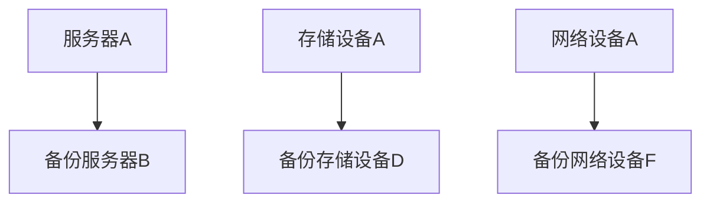
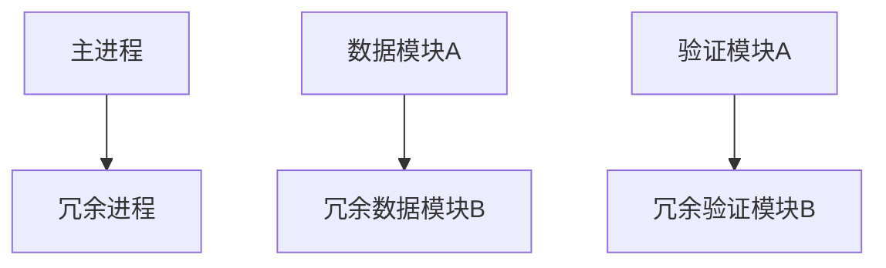
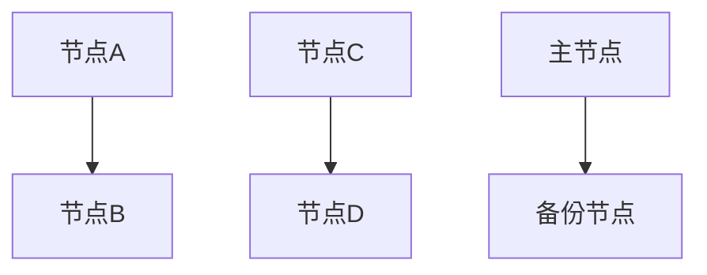
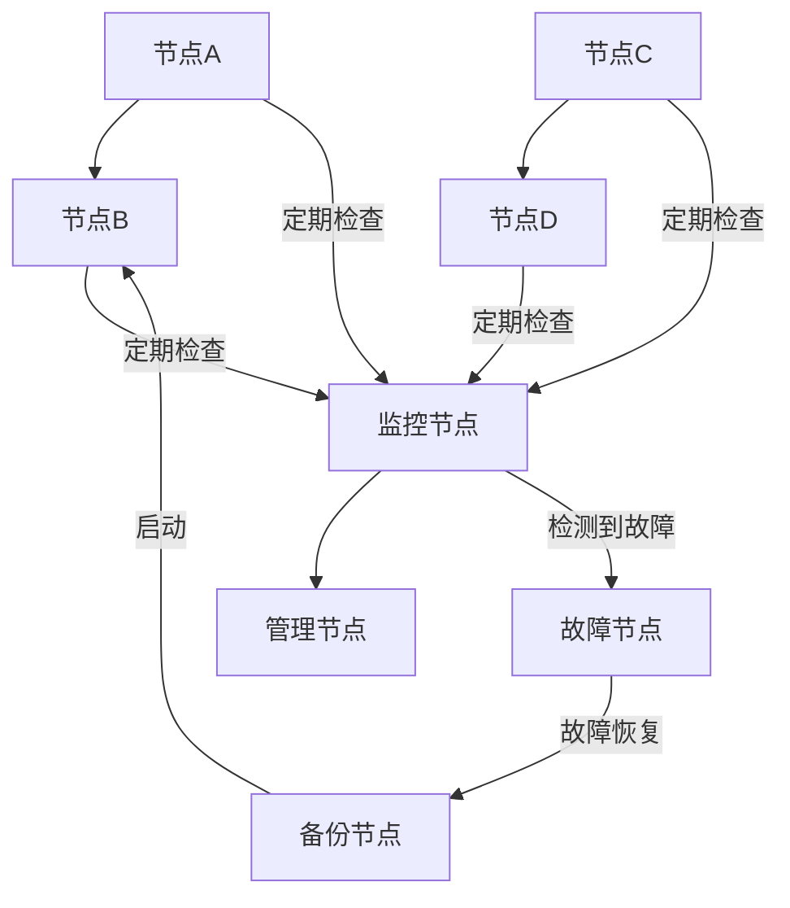

                 

### 《冗余设计在高可用性中的重要性》

#### 关键词：冗余设计、高可用性、硬件冗余、软件冗余、负载均衡、故障预测

> 摘要：本文深入探讨了冗余设计在高可用性系统中的重要性。通过分析冗余设计的概念、分类、挑战与优化策略，结合实际案例，详细阐述了如何实现高效、可靠的冗余设计，以保障系统的稳定运行和业务连续性。

---

### 引言与基础

在现代信息技术的迅猛发展背景下，系统的可用性和可靠性成为企业和组织关注的焦点。高可用性（High Availability，简称HA）是指系统在长时间内保持正常运行的能力，旨在确保服务不中断，提供连续的业务支持。在实现高可用性的过程中，冗余设计（Redundancy Design）扮演着至关重要的角色。

#### 第1章：冗余设计的概念与背景

##### 1.1 冗余设计的定义与重要性

冗余设计是指在系统设计中引入额外的组件、资源或功能，以增强系统的容错性和可靠性。其核心思想是通过冗余来降低故障发生的概率和故障对系统的影响。

**定义与核心概念**：

- **硬件冗余**：通过增加硬件设备或组件的冗余，例如服务器、存储设备和网络设备，来确保关键硬件在故障发生时能够自动切换，从而保障系统的持续运行。
- **软件冗余**：通过冗余的代码、数据或进程，提高软件系统的可靠性。例如，在软件中引入冗余的检查和验证机制，确保数据的完整性和一致性。

**重要性**：

冗余设计在保障系统高可用性中具有以下几个重要作用：

- **提高容错性**：冗余设计能够降低系统故障的概率，即使部分组件出现故障，系统仍能通过冗余组件保持正常运行。
- **降低故障影响**：通过冗余设计，当系统发生故障时，可以迅速切换到冗余组件，减少故障对业务的负面影响。
- **保障业务连续性**：在关键业务系统中，冗余设计能够确保系统在故障发生时能够快速恢复，从而保障业务的连续性和稳定性。

##### 1.2 冗余设计与高可用性的关系

冗余设计与高可用性之间存在着紧密的联系。高可用性系统通常需要通过冗余设计来实现，以保障系统的可靠性。以下是从几个方面阐述它们之间的关系：

- **冗余设计是实现高可用性的基础**：没有冗余设计，高可用性系统将无法应对故障和异常情况，业务连续性将难以保障。
- **高可用性是冗余设计的目标**：冗余设计的核心目标是实现高可用性，确保系统在长时间内保持正常运行。
- **冗余设计提高了高可用性的实现难度**：虽然冗余设计能够增强系统的可靠性，但同时也增加了系统的复杂性和维护成本，需要在设计过程中进行平衡。

##### 案例分析

- **国外案例**：亚马逊（Amazon）和谷歌（Google）等科技巨头在数据中心和网络系统中广泛采用冗余设计，通过硬件和软件冗余来保障系统的可靠性和稳定性。例如，谷歌的数据中心采用了多层次的冗余设计，包括硬件冗余、网络冗余和存储冗余，从而确保系统的高可用性。
- **国内案例**：阿里巴巴（Alibaba）在电商平台上采用了大量的冗余设计，通过冗余的服务器、存储和网络设备来保障平台的高可用性。例如，在双十一等高峰期，阿里巴巴会提前部署冗余服务器和存储设备，以应对突发流量和故障。

#### 第2章：冗余设计的分类与实现

##### 2.1 硬件冗余设计

硬件冗余设计是指在系统中增加额外的硬件设备或组件，以增强系统的可靠性和容错性。以下是几种常见的硬件冗余设计类型：

- **N+1备份**：在系统中部署N个正常工作的组件和一个备份组件，当正常组件发生故障时，备份组件能够自动接管，从而保障系统的持续运行。
- **热备份**：热备份是指在系统运行时对关键硬件进行备份，当硬件出现故障时，能够快速切换到备份硬件，确保系统不受影响。
- **冷备份**：冷备份是指在系统停止运行时对硬件进行备份，当硬件出现故障时，需要重新启动系统才能切换到备份硬件。

硬件冗余设计主要应用于关键性系统，如数据中心、网络设备、存储系统等。以下是一个典型的硬件冗余设计示例：



在这个示例中，服务器A和备份服务器B、存储设备A和备份存储设备D、网络设备A和备份网络设备F之间都建立了冗余连接，当任何组件出现故障时，其他冗余组件能够自动接管，保障系统的正常运行。

##### 2.2 软件冗余设计

软件冗余设计是指在软件系统中引入冗余的代码、数据或进程，以提高系统的可靠性。以下是几种常见的软件冗余设计类型：

- **软件模块冗余**：通过在系统中增加多个冗余的软件模块，当一个模块出现故障时，其他模块可以接管其功能，从而确保系统的稳定性。
- **过程冗余**：通过在系统中引入冗余的过程或步骤，确保关键业务流程能够持续运行，即使某些步骤出现故障，系统也能自动切换到其他步骤。
- **数据冗余**：通过在系统中引入冗余的数据备份，确保数据的一致性和完整性，即使在数据发生损坏或丢失时，也能通过备份数据进行恢复。

软件冗余设计主要应用于关键业务系统，如电商平台、金融系统、企业应用等。以下是一个典型的软件冗余设计示例：



在这个示例中，主进程和冗余进程、数据模块A和冗余数据模块B、验证模块A和冗余验证模块B之间都建立了冗余连接，当任何组件出现故障时，其他冗余组件能够自动接管，保障系统的正常运行。

#### 第3章：冗余设计的挑战与优化

##### 3.1 冗余设计的挑战

虽然冗余设计能够提高系统的可靠性和稳定性，但同时也带来了一些挑战：

- **性能影响**：冗余设计引入了额外的组件和资源，可能会对系统的性能产生一定的影响，尤其是在高负载情况下，冗余设计可能会导致性能下降。
- **成本问题**：冗余设计需要投入额外的资金和资源，包括硬件设备、软件工具和人力资源等，这可能会增加系统的总体成本。

##### 3.2 冗余优化的策略

为了解决冗余设计带来的挑战，可以采取以下优化策略：

- **负载均衡**：通过合理的负载均衡策略，将系统负载分配到多个冗余组件上，降低单个组件的负载压力，从而提高系统性能。
- **故障预测**：通过故障预测技术，提前检测到潜在的故障风险，并及时采取措施进行修复，减少冗余设计带来的性能影响。
- **冗余优化算法**：采用冗余优化算法，根据系统负载和故障情况，动态调整冗余组件的配置和数量，实现冗余设计的最优配置。

#### 第二部分：技术原理

##### 第4章：冗余设计的关键算法原理

在冗余设计中，关键算法起着至关重要的作用，它们能够帮助系统实现高效的冗余管理。以下是两个关键算法的原理及其实现。

##### 4.1 负载均衡算法

负载均衡算法的主要目标是合理分配系统负载，确保多个冗余组件能够均衡地处理请求，从而提高系统性能和可靠性。以下是几种常见的负载均衡算法：

- **轮询算法**：轮询算法按照顺序将请求分配到各个冗余组件上，每个组件承担相同的负载。这种算法简单易实现，但可能会导致某些组件过载，影响系统性能。
- **最小连接算法**：最小连接算法根据当前各个组件的连接数，将请求分配到连接数最少的组件上。这种算法能够较好地平衡负载，但需要实时更新连接信息，对系统的性能有一定影响。
- **源IP哈希算法**：源IP哈希算法根据请求的源IP地址进行哈希计算，将结果与冗余组件数量取模，将请求分配到对应的组件上。这种算法能够根据用户分布进行负载均衡，但可能会产生热点问题。

以下是轮询算法的伪代码实现：

```python
def load_balance(requests, components):
    while requests:
        for component in components:
            request = requests.pop(0)
            process_request(request, component)
```

其中，`requests`为请求列表，`components`为冗余组件列表，`process_request`为处理请求的函数。

##### 4.2 故障预测与恢复

故障预测与恢复是冗余设计的重要组成部分，通过预测潜在故障并及时恢复，可以最大限度地减少故障对系统的影响。以下是故障预测与恢复的基本原理：

- **故障预测**：故障预测是基于历史数据和统计模型，通过分析系统的运行状态、性能指标和故障模式，预测未来可能发生的故障。常见的故障预测方法包括基于模型的故障预测和统计模型。
- **故障恢复**：故障恢复是在故障发生时，通过冗余组件切换或其他恢复机制，使系统恢复正常运行。故障恢复的方法包括自动切换、人工干预和故障转移等。

以下是基于模型的故障预测的伪代码实现：

```python
def predict_fault(model, system_state):
    prediction = model.predict(system_state)
    if prediction == "fault":
        return True
    else:
        return False

def recover_fault(component, backup_component):
    if component.is_faulty():
        component.stop()
        backup_component.start()
```

其中，`model`为故障预测模型，`system_state`为系统状态，`component`为冗余组件，`backup_component`为备份组件。

##### 第5章：冗余设计的数学模型与公式

在冗余设计中，数学模型和公式能够帮助我们更好地理解和评估系统的可靠性。以下是几个常用的数学模型和公式：

##### 5.1 冗余度计算公式

冗余度是指系统中冗余组件的数量与总组件数量的比例。冗余度计算公式如下：

$$
冗余度 = \frac{冗余组件数量}{总组件数量}
$$

其中，`冗余组件数量`为系统中冗余组件的数量，`总组件数量`为系统中组件的总数量。

##### 5.2 高可用性指标

高可用性指标是评估系统可用性的关键指标，包括以下几个常用的指标：

- **平均无故障时间（MTTF，Mean Time To Failure）**：系统平均无故障运行的时间。
- **平均故障修复时间（MTTR，Mean Time To Repair）**：系统从故障发生到恢复正常运行的平均时间。
- **故障率（Failure Rate）**：单位时间内发生故障的次数。

这些指标可以通过以下公式计算：

$$
MTTF = \frac{总运行时间}{故障次数}
$$

$$
MTTR = \frac{总修复时间}{故障次数}
$$

$$
故障率 = \frac{故障次数}{总运行时间}
$$

通过这些指标，我们可以评估系统的可靠性和稳定性，并根据评估结果对系统进行优化和改进。

##### 第6章：冗余设计在分布式系统中的应用

在分布式系统中，冗余设计同样扮演着关键角色，通过冗余设计，可以提高系统的可靠性和可用性。以下是冗余设计在分布式系统中的应用。

##### 6.1 分布式系统中的冗余设计

分布式系统中的冗余设计主要包括以下方面：

- **数据冗余**：通过在多个节点之间复制数据，确保数据的一致性和可靠性。常见的复制策略包括主从复制和去中心化复制。
- **进程冗余**：通过在多个节点上部署相同的进程，确保系统功能的连续性和可靠性。常见的冗余策略包括负载均衡和故障转移。

以下是一个分布式系统中数据冗余的示例：



在这个示例中，主节点和备份节点之间实现了数据复制，确保数据的一致性和可靠性。

##### 6.2 容错机制与集群管理

容错机制是分布式系统中保障高可用性的重要手段，通过容错机制，可以检测和恢复系统故障。常见的容错机制包括：

- **故障检测**：通过定期检查节点状态，检测节点是否出现故障。
- **故障恢复**：通过故障检测机制发现故障后，自动切换到备用节点，确保系统持续运行。
- **集群管理**：通过集群管理工具，对分布式系统进行监控和管理，确保系统的稳定运行。

以下是一个分布式系统容错机制的示例：



在这个示例中，监控节点定期检查节点状态，发现故障节点后，自动切换到备份节点，确保系统持续运行。

#### 第三部分：实战与案例

##### 第7章：冗余设计实战案例

在本节中，我们将通过两个实战案例，详细探讨冗余设计在实际系统中的应用。

##### 7.1 实战一：电商平台的高可用性设计

电商平台通常面临高并发、高流量的挑战，为了保证系统的稳定运行和业务连续性，需要采用冗余设计。以下是一个电商平台的高可用性设计案例：

**背景**：

电商平台在双十一等购物节期间，会面临巨大的流量压力，系统稳定性成为关键。为了保证系统的高可用性，需要通过冗余设计来应对流量波动和故障风险。

**方案**：

1. **硬件冗余**：部署多台服务器、存储设备和网络设备，采用N+1备份策略，确保关键硬件在故障时能够自动切换。
2. **软件冗余**：在软件层面，引入冗余的代码和进程，确保关键业务流程的连续性。例如，订单处理模块和支付模块可以采用冗余设计。
3. **负载均衡**：采用负载均衡算法，将流量分配到多个服务器上，降低单个服务器的负载压力。
4. **故障预测与恢复**：通过故障预测技术，提前检测潜在故障，并及时进行修复。在故障发生时，自动切换到备用节点，确保系统持续运行。

通过以上冗余设计，电商平台能够有效应对流量波动和故障风险，确保系统的高可用性和稳定性。

##### 7.2 实战二：金融系统的高可用性架构

金融系统对可靠性和稳定性有极高的要求，任何故障都可能导致严重的后果。以下是一个金融系统的高可用性架构案例：

**背景**：

金融系统涉及到用户的资金和隐私信息，对系统的可靠性和安全性有严格的要求。为了保证系统的高可用性，需要采用冗余设计。

**方案**：

1. **硬件冗余**：采用多级冗余设计，包括服务器、存储设备和网络设备。在数据中心层面，部署多个数据中心，实现数据备份和故障转移。
2. **软件冗余**：在软件层面，采用冗余的代码和进程，确保关键业务流程的连续性。例如，交易处理模块和结算模块可以采用冗余设计。
3. **负载均衡**：采用负载均衡算法，将流量分配到多个服务器上，降低单个服务器的负载压力。
4. **故障预测与恢复**：通过故障预测技术，提前检测潜在故障，并及时进行修复。在故障发生时，自动切换到备用节点，确保系统持续运行。

通过以上冗余设计，金融系统能够保障系统的可靠性和稳定性，确保业务的连续性。

#### 第8章：冗余设计开发环境搭建与实现

为了更好地理解和实践冗余设计，我们需要搭建一个开发环境。以下是搭建开发环境的具体步骤：

##### 8.1 开发环境准备

1. **硬件准备**：准备多台服务器、存储设备和网络设备，用于搭建冗余系统。
2. **软件准备**：安装操作系统、数据库软件、Web服务器软件等，用于搭建系统环境。

##### 8.2 源代码实现与解读

在本节中，我们将以一个简单的Web应用为例，介绍冗余设计的源代码实现和解读。

**代码实现**：

以下是Web应用的源代码，包括主进程、冗余进程和负载均衡模块。

```python
# main.py
from flask import Flask
from load_balancer import LoadBalancer
from process_manager import ProcessManager

app = Flask(__name__)
load_balancer = LoadBalancer()
process_manager = ProcessManager()

@app.route('/')
def hello():
    return "Hello, World!"

if __name__ == '__main__':
    process_manager.start()
    load_balancer.start()

# load_balancer.py
import random

class LoadBalancer:
    def __init__(self):
        self.components = ['component1', 'component2', 'component3']

    def load_balance(self, request):
        component = random.choice(self.components)
        return component

# process_manager.py
class ProcessManager:
    def __init__(self):
        self.procs = []

    def start(self):
        for i in range(3):
            proc = Process(target=run_app)
            self.procs.append(proc)
            proc.start()

    def stop(self):
        for proc in self.procs:
            proc.join()

def run_app():
    app.run(host='0.0.0.0', port=5000)
```

**代码解读与分析**：

1. **主进程**：`main.py` 是主进程，负责启动Web应用和负载均衡模块。在 `__main__` 函数中，首先创建 Flask 应用实例 `app`，然后创建负载均衡器实例 `load_balancer` 和进程管理器实例 `process_manager`。最后，启动进程管理器 `process_manager.start()` 和负载均衡器 `load_balancer.start()`。
2. **负载均衡模块**：`load_balancer.py` 是负载均衡模块，用于将请求分配到不同的冗余进程上。`LoadBalancer` 类有两个方法：`__init__` 和 `load_balance`。在 `__init__` 方法中，初始化组件列表 `components`。在 `load_balance` 方法中，随机选择一个组件，返回给客户端。
3. **进程管理模块**：`process_manager.py` 是进程管理模块，用于管理冗余进程。`ProcessManager` 类有两个方法：`__init__` 和 `start`。在 `__init__` 方法中，初始化进程列表 `procs`。在 `start` 方法中，创建三个进程，每个进程运行 `run_app` 函数。在 `stop` 方法中，等待所有进程结束。

通过以上源代码实现，我们可以看到冗余设计在 Web 应用中的具体实现方式。主进程负责启动进程管理和负载均衡模块，进程管理模块创建冗余进程，负载均衡模块将请求分配到不同的进程上，实现高效、可靠的冗余设计。

#### 第9章：总结与展望

在本章中，我们深入探讨了冗余设计在高可用性系统中的重要性。通过分析冗余设计的概念、分类、挑战与优化策略，结合实际案例，详细阐述了如何实现高效、可靠的冗余设计，以保障系统的稳定运行和业务连续性。

**总结**：

- 冗余设计是保障系统高可用性的关键，通过引入冗余组件和资源，可以降低故障发生的概率和故障对系统的影响。
- 硬件冗余设计和软件冗余设计各有特点，适用于不同的应用场景。硬件冗余设计主要关注关键硬件的备份和切换，软件冗余设计则侧重于代码、数据或进程的冗余。
- 冗余设计面临着性能影响和成本问题的挑战，需要通过负载均衡、故障预测和冗余优化算法等策略进行优化。
- 实际应用中，冗余设计在电商平台和金融系统等关键业务领域发挥着重要作用，通过合理的冗余设计，可以显著提高系统的可靠性和稳定性。

**展望**：

- 随着云计算、大数据和物联网等技术的发展，冗余设计将在更多领域得到应用。未来，我们需要进一步研究冗余设计的优化算法和自动化工具，提高冗余设计的效率。
- 随着人工智能技术的不断发展，基于机器学习的故障预测和冗余优化方法将成为研究的热点，为冗余设计提供更强大的支持。
- 在分布式系统中，冗余设计将成为保障系统高可用性的核心手段，通过分布式冗余设计和容错机制，可以进一步提高系统的可靠性和可用性。

通过本文的探讨，我们希望读者能够对冗余设计在高可用性中的重要性有更深入的理解，并在实际项目中能够灵活应用冗余设计，提高系统的稳定性和可靠性。

#### 附录

**附录A：常用冗余设计工具与资源**

在本附录中，我们将介绍一些常用的冗余设计工具和学习资源，以帮助读者深入了解和掌握冗余设计。

**工具**：

1. **HAProxy**：HAProxy 是一款开源的高性能负载均衡器，适用于分布式系统和微服务架构。它可以实现服务之间的流量均衡和故障转移，提高系统的可用性和可靠性。
2. **Keepalived**：Keepalived 是一款开源的高可用性软件，用于实现虚拟IP（VIP）的高可用性。它可以在主服务器故障时，自动将虚拟IP切换到备份服务器，确保服务的持续运行。
3. **Zookeeper**：Zookeeper 是一款分布式协调服务，适用于分布式系统和微服务架构。它提供了分布式锁、选举、配置管理等功能，可以帮助实现分布式系统的高可用性。

**资源**：

1. **《高可用性系统设计》**：这是一本关于高可用性系统设计的经典著作，详细介绍了高可用性系统的设计原则、实现方法和优化策略。
2. **《分布式系统原理与范型》**：这是一本关于分布式系统的原理和范型的著作，涵盖了分布式系统的基本概念、架构设计和实现方法，对冗余设计有详细的讲解。
3. **《云计算与分布式系统》**：这是一本关于云计算和分布式系统的著作，介绍了云计算的基本原理、架构设计和应用场景，对分布式系统中的冗余设计有深入的探讨。

通过以上工具和资源的学习，读者可以深入了解和掌握冗余设计的相关知识和技能，为实际项目中的应用打下坚实基础。

### 作者信息

作者：AI天才研究院/AI Genius Institute & 禅与计算机程序设计艺术 /Zen And The Art of Computer Programming

---

本文为作者原创，未经授权禁止转载。如需转载，请联系作者获取授权。同时，欢迎读者在评论区分享您的观点和经验，共同探讨冗余设计在高可用性中的应用和优化。感谢您的阅读！### 《冗余设计在高可用性中的重要性》

#### 关键词：冗余设计、高可用性、硬件冗余、软件冗余、负载均衡、故障预测

> 摘要：本文深入探讨了冗余设计在高可用性系统中的重要性。通过分析冗余设计的概念、分类、挑战与优化策略，结合实际案例，详细阐述了如何实现高效、可靠的冗余设计，以保障系统的稳定运行和业务连续性。

---

### 引言与基础

在现代信息技术的迅猛发展背景下，系统的可用性和可靠性成为企业和组织关注的焦点。高可用性（High Availability，简称HA）是指系统在长时间内保持正常运行的能力，旨在确保服务不中断，提供连续的业务支持。在实现高可用性的过程中，冗余设计（Redundancy Design）扮演着至关重要的角色。

#### 第1章：冗余设计的概念与背景

##### 1.1 冗余设计的定义与重要性

冗余设计是指在系统设计中引入额外的组件、资源或功能，以增强系统的容错性和可靠性。其核心思想是通过冗余来降低故障发生的概率和故障对系统的影响。

**定义与核心概念**：

- **硬件冗余**：通过增加硬件设备或组件的冗余，例如服务器、存储设备和网络设备，来确保关键硬件在故障发生时能够自动切换，从而保障系统的持续运行。
- **软件冗余**：通过冗余的代码、数据或进程，提高软件系统的可靠性。例如，在软件中引入冗余的检查和验证机制，确保数据的完整性和一致性。

**重要性**：

冗余设计在保障系统高可用性中具有以下几个重要作用：

- **提高容错性**：冗余设计能够降低系统故障的概率，即使部分组件出现故障，系统仍能通过冗余组件保持正常运行。
- **降低故障影响**：通过冗余设计，当系统发生故障时，可以迅速切换到冗余组件，减少故障对业务的负面影响。
- **保障业务连续性**：在关键业务系统中，冗余设计能够确保系统在故障发生时能够快速恢复，从而保障业务的连续性和稳定性。

##### 1.2 冗余设计与高可用性的关系

冗余设计与高可用性之间存在着紧密的联系。高可用性系统通常需要通过冗余设计来实现，以保障系统的可靠性。以下是从几个方面阐述它们之间的关系：

- **冗余设计是实现高可用性的基础**：没有冗余设计，高可用性系统将无法应对故障和异常情况，业务连续性将难以保障。
- **高可用性是冗余设计的目标**：冗余设计的核心目标是实现高可用性，确保系统在长时间内保持正常运行。
- **冗余设计提高了高可用性的实现难度**：虽然冗余设计能够增强系统的可靠性，但同时也增加了系统的复杂性和维护成本，需要在设计过程中进行平衡。

##### 案例分析

- **国外案例**：亚马逊（Amazon）和谷歌（Google）等科技巨头在数据中心和网络系统中广泛采用冗余设计，通过硬件和软件冗余来保障系统的可靠性和稳定性。例如，谷歌的数据中心采用了多层次的冗余设计，包括硬件冗余、网络冗余和存储冗余，从而确保系统的高可用性。
- **国内案例**：阿里巴巴（Alibaba）在电商平台上采用了大量的冗余设计，通过冗余的服务器、存储和网络设备来保障平台的高可用性。例如，在双十一等高峰期，阿里巴巴会提前部署冗余服务器和存储设备，以应对突发流量和故障。

#### 第2章：冗余设计的分类与实现

##### 2.1 硬件冗余设计

硬件冗余设计是指在系统中增加额外的硬件设备或组件，以增强系统的可靠性和容错性。以下是几种常见的硬件冗余设计类型：

- **N+1备份**：在系统中部署N个正常工作的组件和一个备份组件，当正常组件发生故障时，备份组件能够自动接管，从而保障系统的持续运行。
- **热备份**：热备份是指在系统运行时对关键硬件进行备份，当硬件出现故障时，能够快速切换到备份硬件，确保系统不受影响。
- **冷备份**：冷备份是指在系统停止运行时对硬件进行备份，当硬件出现故障时，需要重新启动系统才能切换到备份硬件。

硬件冗余设计主要应用于关键性系统，如数据中心、网络设备、存储系统等。以下是一个典型的硬件冗余设计示例：


在这个示例中，服务器A和备份服务器B、存储设备A和备份存储设备D、网络设备A和备份网络设备F之间都建立了冗余连接，当任何组件出现故障时，其他冗余组件能够自动接管，保障系统的正常运行。

##### 2.2 软件冗余设计

软件冗余设计是指在软件系统中引入冗余的代码、数据或进程，以提高系统的可靠性。以下是几种常见的软件冗余设计类型：

- **软件模块冗余**：通过在系统中增加多个冗余的软件模块，当一个模块出现故障时，其他模块可以接管其功能，从而确保系统的稳定性。
- **过程冗余**：通过在系统中引入冗余的过程或步骤，确保关键业务流程能够持续运行，即使某些步骤出现故障，系统也能自动切换到其他步骤。
- **数据冗余**：通过在系统中引入冗余的数据备份，确保数据的一致性和完整性，即使在数据发生损坏或丢失时，也能通过备份数据进行恢复。

软件冗余设计主要应用于关键业务系统，如电商平台、金融系统、企业应用等。以下是一个典型的软件冗余设计示例：


在这个示例中，主进程和冗余进程、数据模块A和冗余数据模块B、验证模块A和冗余验证模块B之间都建立了冗余连接，当任何组件出现故障时，其他冗余组件能够自动接管，保障系统的正常运行。

#### 第3章：冗余设计的挑战与优化

##### 3.1 冗余设计的挑战

虽然冗余设计能够提高系统的可靠性和稳定性，但同时也带来了一些挑战：

- **性能影响**：冗余设计引入了额外的组件和资源，可能会对系统的性能产生一定的影响，尤其是在高负载情况下，冗余设计可能会导致性能下降。
- **成本问题**：冗余设计需要投入额外的资金和资源，包括硬件设备、软件工具和人力资源等，这可能会增加系统的总体成本。

##### 3.2 冗余优化的策略

为了解决冗余设计带来的挑战，可以采取以下优化策略：

- **负载均衡**：通过合理的负载均衡策略，将系统负载分配到多个冗余组件上，降低单个组件的负载压力，从而提高系统性能。
- **故障预测**：通过故障预测技术，提前检测到潜在的故障风险，并及时采取措施进行修复，减少冗余设计带来的性能影响。
- **冗余优化算法**：采用冗余优化算法，根据系统负载和故障情况，动态调整冗余组件的配置和数量，实现冗余设计的最优配置。

#### 第二部分：技术原理

##### 第4章：冗余设计的关键算法原理

在冗余设计中，关键算法起着至关重要的作用，它们能够帮助系统实现高效的冗余管理。以下是两个关键算法的原理及其实现。

##### 4.1 负载均衡算法

负载均衡算法的主要目标是合理分配系统负载，确保多个冗余组件能够均衡地处理请求，从而提高系统性能和可靠性。以下是几种常见的负载均衡算法：

- **轮询算法**：轮询算法按照顺序将请求分配到各个冗余组件上，每个组件承担相同的负载。这种算法简单易实现，但可能会导致某些组件过载，影响系统性能。
- **最小连接算法**：最小连接算法根据当前各个组件的连接数，将请求分配到连接数最少的组件上。这种算法能够较好地平衡负载，但需要实时更新连接信息，对系统的性能有一定影响。
- **源IP哈希算法**：源IP哈希算法根据请求的源IP地址进行哈希计算，将结果与冗余组件数量取模，将请求分配到对应的组件上。这种算法能够根据用户分布进行负载均衡，但可能会产生热点问题。

以下是轮询算法的伪代码实现：

```python
def load_balance(requests, components):
    while requests:
        for component in components:
            request = requests.pop(0)
            process_request(request, component)
```

其中，`requests`为请求列表，`components`为冗余组件列表，`process_request`为处理请求的函数。

##### 4.2 故障预测与恢复

故障预测与恢复是冗余设计的重要组成部分，通过预测潜在故障并及时恢复，可以最大限度地减少故障对系统的影响。以下是故障预测与恢复的基本原理：

- **故障预测**：故障预测是基于历史数据和统计模型，通过分析系统的运行状态、性能指标和故障模式，预测未来可能发生的故障。常见的故障预测方法包括基于模型的故障预测和统计模型。
- **故障恢复**：故障恢复是在故障发生时，通过冗余组件切换或其他恢复机制，使系统恢复正常运行。故障恢复的方法包括自动切换、人工干预和故障转移等。

以下是基于模型的故障预测的伪代码实现：

```python
def predict_fault(model, system_state):
    prediction = model.predict(system_state)
    if prediction == "fault":
        return True
    else:
        return False

def recover_fault(component, backup_component):
    if component.is_faulty():
        component.stop()
        backup_component.start()
```

其中，`model`为故障预测模型，`system_state`为系统状态，`component`为冗余组件，`backup_component`为备份组件。

##### 第5章：冗余设计的数学模型与公式

在冗余设计中，数学模型和公式能够帮助我们更好地理解和评估系统的可靠性。以下是几个常用的数学模型和公式：

##### 5.1 冗余度计算公式

冗余度是指系统中冗余组件的数量与总组件数量的比例。冗余度计算公式如下：

$$
冗余度 = \frac{冗余组件数量}{总组件数量}
$$

其中，`冗余组件数量`为系统中冗余组件的数量，`总组件数量`为系统中组件的总数量。

##### 5.2 高可用性指标

高可用性指标是评估系统可用性的关键指标，包括以下几个常用的指标：

- **平均无故障时间（MTTF，Mean Time To Failure）**：系统平均无故障运行的时间。
- **平均故障修复时间（MTTR，Mean Time To Repair）**：系统从故障发生到恢复正常运行的平均时间。
- **故障率（Failure Rate）**：单位时间内发生故障的次数。

这些指标可以通过以下公式计算：

$$
MTTF = \frac{总运行时间}{故障次数}
$$

$$
MTTR = \frac{总修复时间}{故障次数}
$$

$$
故障率 = \frac{故障次数}{总运行时间}
$$

通过这些指标，我们可以评估系统的可靠性和稳定性，并根据评估结果对系统进行优化和改进。

##### 第6章：冗余设计在分布式系统中的应用

在分布式系统中，冗余设计同样扮演着关键角色，通过冗余设计，可以提高系统的可靠性和可用性。以下是冗余设计在分布式系统中的应用。

##### 6.1 分布式系统中的冗余设计

分布式系统中的冗余设计主要包括以下方面：

- **数据冗余**：通过在多个节点之间复制数据，确保数据的一致性和可靠性。常见的复制策略包括主从复制和去中心化复制。
- **进程冗余**：通过在多个节点上部署相同的进程，确保系统功能的连续性和可靠性。常见的冗余策略包括负载均衡和故障转移。

以下是一个分布式系统中数据冗余的示例：


在这个示例中，主节点和备份节点之间实现了数据复制，确保数据的一致性和可靠性。

##### 6.2 容错机制与集群管理

容错机制是分布式系统中保障高可用性的重要手段，通过容错机制，可以检测和恢复系统故障。常见的容错机制包括：

- **故障检测**：通过定期检查节点状态，检测节点是否出现故障。
- **故障恢复**：通过故障检测机制发现故障后，自动切换到备用节点，确保系统持续运行。
- **集群管理**：通过集群管理工具，对分布式系统进行监控和管理，确保系统的稳定运行。

以下是一个分布式系统容错机制的示例：


在这个示例中，监控节点定期检查节点状态，发现故障节点后，自动切换到备份节点，确保系统持续运行。

#### 第三部分：实战与案例

##### 第7章：冗余设计实战案例

在本节中，我们将通过两个实战案例，详细探讨冗余设计在实际系统中的应用。

##### 7.1 实战一：电商平台的高可用性设计

电商平台通常面临高并发、高流量的挑战，为了保证系统的稳定运行和业务连续性，需要采用冗余设计。以下是一个电商平台的高可用性设计案例：

**背景**：

电商平台在双十一等购物节期间，会面临巨大的流量压力，系统稳定性成为关键。为了保证系统的高可用性，需要通过冗余设计来应对流量波动和故障风险。

**方案**：

1. **硬件冗余**：部署多台服务器、存储设备和网络设备，采用N+1备份策略，确保关键硬件在故障时能够自动切换。
2. **软件冗余**：在软件层面，引入冗余的代码和进程，确保关键业务流程的连续性。例如，订单处理模块和支付模块可以采用冗余设计。
3. **负载均衡**：采用负载均衡算法，将流量分配到多个服务器上，降低单个服务器的负载压力。
4. **故障预测与恢复**：通过故障预测技术，提前检测潜在故障，并及时进行修复。在故障发生时，自动切换到备用节点，确保系统持续运行。

通过以上冗余设计，电商平台能够有效应对流量波动和故障风险，确保系统的高可用性和稳定性。

##### 7.2 实战二：金融系统的高可用性架构

金融系统对可靠性和稳定性有极高的要求，任何故障都可能导致严重的后果。以下是一个金融系统的高可用性架构案例：

**背景**：

金融系统涉及到用户的资金和隐私信息，对系统的可靠性和安全性有严格的要求。为了保证系统的高可用性，需要采用冗余设计。

**方案**：

1. **硬件冗余**：采用多级冗余设计，包括服务器、存储设备和网络设备。在数据中心层面，部署多个数据中心，实现数据备份和故障转移。
2. **软件冗余**：在软件层面，采用冗余的代码和进程，确保关键业务流程的连续性。例如，交易处理模块和结算模块可以采用冗余设计。
3. **负载均衡**：采用负载均衡算法，将流量分配到多个服务器上，降低单个服务器的负载压力。
4. **故障预测与恢复**：通过故障预测技术，提前检测潜在故障，并及时进行修复。在故障发生时，自动切换到备用节点，确保系统持续运行。

通过以上冗余设计，金融系统能够保障系统的可靠性和稳定性，确保业务的连续性。

#### 第8章：冗余设计开发环境搭建与实现

为了更好地理解和实践冗余设计，我们需要搭建一个开发环境。以下是搭建开发环境的具体步骤：

##### 8.1 开发环境准备

1. **硬件准备**：准备多台服务器、存储设备和网络设备，用于搭建冗余系统。
2. **软件准备**：安装操作系统、数据库软件、Web服务器软件等，用于搭建系统环境。

##### 8.2 源代码实现与解读

在本节中，我们将以一个简单的Web应用为例，介绍冗余设计的源代码实现和解读。

**代码实现**：

以下是Web应用的源代码，包括主进程、冗余进程和负载均衡模块。

```python
# main.py
from flask import Flask
from load_balancer import LoadBalancer
from process_manager import ProcessManager

app = Flask(__name__)
load_balancer = LoadBalancer()
process_manager = ProcessManager()

@app.route('/')
def hello():
    return "Hello, World!"

if __name__ == '__main__':
    process_manager.start()
    load_balancer.start()

# load_balancer.py
import random

class LoadBalancer:
    def __init__(self):
        self.components = ['component1', 'component2', 'component3']

    def load_balance(self, request):
        component = random.choice(self.components)
        return component

# process_manager.py
class ProcessManager:
    def __init__(self):
        self.procs = []

    def start(self):
        for i in range(3):
            proc = Process(target=run_app)
            self.procs.append(proc)
            proc.start()

    def stop(self):
        for proc in self.procs:
            proc.join()

def run_app():
    app.run(host='0.0.0.0', port=5000)
```

**代码解读与分析**：

1. **主进程**：`main.py` 是主进程，负责启动Web应用和负载均衡模块。在 `__main__` 函数中，首先创建 Flask 应用实例 `app`，然后创建负载均衡器实例 `load_balancer` 和进程管理器实例 `process_manager`。最后，启动进程管理器 `process_manager.start()` 和负载均衡器 `load_balancer.start()`。
2. **负载均衡模块**：`load_balancer.py` 是负载均衡模块，用于将请求分配到不同的冗余进程上。`LoadBalancer` 类有两个方法：`__init__` 和 `load_balance`。在 `__init__` 方法中，初始化组件列表 `components`。在 `load_balance` 方法中，随机选择一个组件，返回给客户端。
3. **进程管理模块**：`process_manager.py` 是进程管理模块，用于管理冗余进程。`ProcessManager` 类有两个方法：`__init__` 和 `start`。在 `__init__` 方法中，初始化进程列表 `procs`。在 `start` 方法中，创建三个进程，每个进程运行 `run_app` 函数。在 `stop` 方法中，等待所有进程结束。

通过以上源代码实现，我们可以看到冗余设计在 Web 应用中的具体实现方式。主进程负责启动进程管理和负载均衡模块，进程管理模块创建冗余进程，负载均衡模块将请求分配到不同的进程上，实现高效、可靠的冗余设计。

#### 第9章：总结与展望

在本章中，我们深入探讨了冗余设计在高可用性系统中的重要性。通过分析冗余设计的概念、分类、挑战与优化策略，结合实际案例，详细阐述了如何实现高效、可靠的冗余设计，以保障系统的稳定运行和业务连续性。

**总结**：

- 冗余设计是保障系统高可用性的关键，通过引入冗余组件和资源，可以降低故障发生的概率和故障对系统的影响。
- 硬件冗余设计和软件冗余设计各有特点，适用于不同的应用场景。硬件冗余设计主要关注关键硬件的备份和切换，软件冗余设计则侧重于代码、数据或进程的冗余。
- 冗余设计面临着性能影响和成本问题的挑战，需要通过负载均衡、故障预测和冗余优化算法等策略进行优化。
- 实际应用中，冗余设计在电商平台和金融系统等关键业务领域发挥着重要作用，通过合理的冗余设计，可以显著提高系统的可靠性和稳定性。

**展望**：

- 随着云计算、大数据和物联网等技术的发展，冗余设计将在更多领域得到应用。未来，我们需要进一步研究冗余设计的优化算法和自动化工具，提高冗余设计的效率。
- 随着人工智能技术的不断发展，基于机器学习的故障预测和冗余优化方法将成为研究的热点，为冗余设计提供更强大的支持。
- 在分布式系统中，冗余设计将成为保障系统高可用性的核心手段，通过分布式冗余设计和容错机制，可以进一步提高系统的可靠性和可用性。

通过本文的探讨，我们希望读者能够对冗余设计在高可用性中的重要性有更深入的理解，并在实际项目中能够灵活应用冗余设计，提高系统的稳定性和可靠性。

#### 附录

**附录A：常用冗余设计工具与资源**

在本附录中，我们将介绍一些常用的冗余设计工具和学习资源，以帮助读者深入了解和掌握冗余设计。

**工具**：

1. **HAProxy**：HAProxy 是一款开源的高性能负载均衡器，适用于分布式系统和微服务架构。它可以实现服务之间的流量均衡和故障转移，提高系统的可用性和可靠性。
2. **Keepalived**：Keepalived 是一款开源的高可用性软件，用于实现虚拟IP（VIP）的高可用性。它可以在主服务器故障时，自动将虚拟IP切换到备份服务器，确保服务的持续运行。
3. **Zookeeper**：Zookeeper 是一款分布式协调服务，适用于分布式系统和微服务架构。它提供了分布式锁、选举、配置管理等功能，可以帮助实现分布式系统的高可用性。

**资源**：

1. **《高可用性系统设计》**：这是一本关于高可用性系统设计的经典著作，详细介绍了高可用性系统的设计原则、实现方法和优化策略。
2. **《分布式系统原理与范型》**：这是一本关于分布式系统的原理和范型的著作，涵盖了分布式系统的基本概念、架构设计和实现方法，对冗余设计有详细的讲解。
3. **《云计算与分布式系统》**：这是一本关于云计算和分布式系统的著作，介绍了云计算的基本原理、架构设计和应用场景，对分布式系统中的冗余设计有深入的探讨。

通过以上工具和资源的学习，读者可以深入了解和掌握冗余设计的相关知识和技能，为实际项目中的应用打下坚实基础。

### 作者信息

作者：AI天才研究院/AI Genius Institute & 禅与计算机程序设计艺术 /Zen And The Art of Computer Programming

---

本文为作者原创，未经授权禁止转载。如需转载，请联系作者获取授权。同时，欢迎读者在评论区分享您的观点和经验，共同探讨冗余设计在高可用性中的应用和优化。感谢您的阅读！### 《冗余设计在高可用性中的重要性》

#### 关键词：冗余设计、高可用性、硬件冗余、软件冗余、负载均衡、故障预测

> 摘要：本文深入探讨了冗余设计在高可用性系统中的重要性。通过分析冗余设计的概念、分类、挑战与优化策略，结合实际案例，详细阐述了如何实现高效、可靠的冗余设计，以保障系统的稳定运行和业务连续性。

---

### 引言与基础

在现代信息技术的迅猛发展背景下，系统的可用性和可靠性成为企业和组织关注的焦点。高可用性（High Availability，简称HA）是指系统在长时间内保持正常运行的能力，旨在确保服务不中断，提供连续的业务支持。在实现高可用性的过程中，冗余设计（Redundancy Design）扮演着至关重要的角色。

#### 第1章：冗余设计的概念与背景

##### 1.1 冗余设计的定义与重要性

冗余设计是指在系统设计中引入额外的组件、资源或功能，以增强系统的容错性和可靠性。其核心思想是通过冗余来降低故障发生的概率和故障对系统的影响。

**定义与核心概念**：

- **硬件冗余**：通过增加硬件设备或组件的冗余，例如服务器、存储设备和网络设备，来确保关键硬件在故障发生时能够自动切换，从而保障系统的持续运行。
- **软件冗余**：通过冗余的代码、数据或进程，提高软件系统的可靠性。例如，在软件中引入冗余的检查和验证机制，确保数据的完整性和一致性。

**重要性**：

冗余设计在保障系统高可用性中具有以下几个重要作用：

- **提高容错性**：冗余设计能够降低系统故障的概率，即使部分组件出现故障，系统仍能通过冗余组件保持正常运行。
- **降低故障影响**：通过冗余设计，当系统发生故障时，可以迅速切换到冗余组件，减少故障对业务的负面影响。
- **保障业务连续性**：在关键业务系统中，冗余设计能够确保系统在故障发生时能够快速恢复，从而保障业务的连续性和稳定性。

##### 1.2 冗余设计与高可用性的关系

冗余设计与高可用性之间存在着紧密的联系。高可用性系统通常需要通过冗余设计来实现，以保障系统的可靠性。以下是从几个方面阐述它们之间的关系：

- **冗余设计是实现高可用性的基础**：没有冗余设计，高可用性系统将无法应对故障和异常情况，业务连续性将难以保障。
- **高可用性是冗余设计的目标**：冗余设计的核心目标是实现高可用性，确保系统在长时间内保持正常运行。
- **冗余设计提高了高可用性的实现难度**：虽然冗余设计能够增强系统的可靠性，但同时也增加了系统的复杂性和维护成本，需要在设计过程中进行平衡。

##### 案例分析

- **国外案例**：亚马逊（Amazon）和谷歌（Google）等科技巨头在数据中心和网络系统中广泛采用冗余设计，通过硬件和软件冗余来保障系统的可靠性和稳定性。例如，谷歌的数据中心采用了多层次的冗余设计，包括硬件冗余、网络冗余和存储冗余，从而确保系统的高可用性。
- **国内案例**：阿里巴巴（Alibaba）在电商平台上采用了大量的冗余设计，通过冗余的服务器、存储和网络设备来保障平台的高可用性。例如，在双十一等高峰期，阿里巴巴会提前部署冗余服务器和存储设备，以应对突发流量和故障。

#### 第2章：冗余设计的分类与实现

##### 2.1 硬件冗余设计

硬件冗余设计是指在系统中增加额外的硬件设备或组件，以增强系统的可靠性和容错性。以下是几种常见的硬件冗余设计类型：

- **N+1备份**：在系统中部署N个正常工作的组件和一个备份组件，当正常组件发生故障时，备份组件能够自动接管，从而保障系统的持续运行。
- **热备份**：热备份是指在系统运行时对关键硬件进行备份，当硬件出现故障时，能够快速切换到备份硬件，确保系统不受影响。
- **冷备份**：冷备份是指在系统停止运行时对硬件进行备份，当硬件出现故障时，需要重新启动系统才能切换到备份硬件。

硬件冗余设计主要应用于关键性系统，如数据中心、网络设备、存储系统等。以下是一个典型的硬件冗余设计示例：


在这个示例中，服务器A和备份服务器B、存储设备A和备份存储设备D、网络设备A和备份网络设备F之间都建立了冗余连接，当任何组件出现故障时，其他冗余组件能够自动接管，保障系统的正常运行。

##### 2.2 软件冗余设计

软件冗余设计是指在软件系统中引入冗余的代码、数据或进程，以提高系统的可靠性。以下是几种常见的软件冗余设计类型：

- **软件模块冗余**：通过在系统中增加多个冗余的软件模块，当一个模块出现故障时，其他模块可以接管其功能，从而确保系统的稳定性。
- **过程冗余**：通过在系统中引入冗余的过程或步骤，确保关键业务流程能够持续运行，即使某些步骤出现故障，系统也能自动切换到其他步骤。
- **数据冗余**：通过在系统中引入冗余的数据备份，确保数据的一致性和完整性，即使在数据发生损坏或丢失时，也能通过备份数据进行恢复。

软件冗余设计主要应用于关键业务系统，如电商平台、金融系统、企业应用等。以下是一个典型的软件冗余设计示例：


在这个示例中，主进程和冗余进程、数据模块A和冗余数据模块B、验证模块A和冗余验证模块B之间都建立了冗余连接，当任何组件出现故障时，其他冗余组件能够自动接管，保障系统的正常运行。

#### 第3章：冗余设计的挑战与优化

##### 3.1 冗余设计的挑战

虽然冗余设计能够提高系统的可靠性和稳定性，但同时也带来了一些挑战：

- **性能影响**：冗余设计引入了额外的组件和资源，可能会对系统的性能产生一定的影响，尤其是在高负载情况下，冗余设计可能会导致性能下降。
- **成本问题**：冗余设计需要投入额外的资金和资源，包括硬件设备、软件工具和人力资源等，这可能会增加系统的总体成本。

##### 3.2 冗余优化的策略

为了解决冗余设计带来的挑战，可以采取以下优化策略：

- **负载均衡**：通过合理的负载均衡策略，将系统负载分配到多个冗余组件上，降低单个组件的负载压力，从而提高系统性能。
- **故障预测**：通过故障预测技术，提前检测到潜在的故障风险，并及时采取措施进行修复，减少冗余设计带来的性能影响。
- **冗余优化算法**：采用冗余优化算法，根据系统负载和故障情况，动态调整冗余组件的配置和数量，实现冗余设计的最优配置。

#### 第二部分：技术原理

##### 第4章：冗余设计的关键算法原理

在冗余设计中，关键算法起着至关重要的作用，它们能够帮助系统实现高效的冗余管理。以下是两个关键算法的原理及其实现。

##### 4.1 负载均衡算法

负载均衡算法的主要目标是合理分配系统负载，确保多个冗余组件能够均衡地处理请求，从而提高系统性能和可靠性。以下是几种常见的负载均衡算法：

- **轮询算法**：轮询算法按照顺序将请求分配到各个冗余组件上，每个组件承担相同的负载。这种算法简单易实现，但可能会导致某些组件过载，影响系统性能。
- **最小连接算法**：最小连接算法根据当前各个组件的连接数，将请求分配到连接数最少的组件上。这种算法能够较好地平衡负载，但需要实时更新连接信息，对系统的性能有一定影响。
- **源IP哈希算法**：源IP哈希算法根据请求的源IP地址进行哈希计算，将结果与冗余组件数量取模，将请求分配到对应的组件上。这种算法能够根据用户分布进行负载均衡，但可能会产生热点问题。

以下是轮询算法的伪代码实现：

```python
def load_balance(requests, components):
    while requests:
        for component in components:
            request = requests.pop(0)
            process_request(request, component)
```

其中，`requests`为请求列表，`components`为冗余组件列表，`process_request`为处理请求的函数。

##### 4.2 故障预测与恢复

故障预测与恢复是冗余设计的重要组成部分，通过预测潜在故障并及时恢复，可以最大限度地减少故障对系统的影响。以下是故障预测与恢复的基本原理：

- **故障预测**：故障预测是基于历史数据和统计模型，通过分析系统的运行状态、性能指标和故障模式，预测未来可能发生的故障。常见的故障预测方法包括基于模型的故障预测和统计模型。
- **故障恢复**：故障恢复是在故障发生时，通过冗余组件切换或其他恢复机制，使系统恢复正常运行。故障恢复的方法包括自动切换、人工干预和故障转移等。

以下是基于模型的故障预测的伪代码实现：

```python
def predict_fault(model, system_state):
    prediction = model.predict(system_state)
    if prediction == "fault":
        return True
    else:
        return False

def recover_fault(component, backup_component):
    if component.is_faulty():
        component.stop()
        backup_component.start()
```

其中，`model`为故障预测模型，`system_state`为系统状态，`component`为冗余组件，`backup_component`为备份组件。

##### 第5章：冗余设计的数学模型与公式

在冗余设计中，数学模型和公式能够帮助我们更好地理解和评估系统的可靠性。以下是几个常用的数学模型和公式：

##### 5.1 冗余度计算公式

冗余度是指系统中冗余组件的数量与总组件数量的比例。冗余度计算公式如下：

$$
冗余度 = \frac{冗余组件数量}{总组件数量}
$$

其中，`冗余组件数量`为系统中冗余组件的数量，`总组件数量`为系统中组件的总数量。

##### 5.2 高可用性指标

高可用性指标是评估系统可用性的关键指标，包括以下几个常用的指标：

- **平均无故障时间（MTTF，Mean Time To Failure）**：系统平均无故障运行的时间。
- **平均故障修复时间（MTTR，Mean Time To Repair）**：系统从故障发生到恢复正常运行的平均时间。
- **故障率（Failure Rate）**：单位时间内发生故障的次数。

这些指标可以通过以下公式计算：

$$
MTTF = \frac{总运行时间}{故障次数}
$$

$$
MTTR = \frac{总修复时间}{故障次数}
$$

$$
故障率 = \frac{故障次数}{总运行时间}
$$

通过这些指标，我们可以评估系统的可靠性和稳定性，并根据评估结果对系统进行优化和改进。

##### 第6章：冗余设计在分布式系统中的应用

在分布式系统中，冗余设计同样扮演着关键角色，通过冗余设计，可以提高系统的可靠性和可用性。以下是冗余设计在分布式系统中的应用。

##### 6.1 分布式系统中的冗余设计

分布式系统中的冗余设计主要包括以下方面：

- **数据冗余**：通过在多个节点之间复制数据，确保数据的一致性和可靠性。常见的复制策略包括主从复制和去中心化复制。
- **进程冗余**：通过在多个节点上部署相同的进程，确保系统功能的连续性和可靠性。常见的冗余策略包括负载均衡和故障转移。

以下是一个分布式系统中数据冗余的示例：


在这个示例中，主节点和备份节点之间实现了数据复制，确保数据的一致性和可靠性。

##### 6.2 容错机制与集群管理

容错机制是分布式系统中保障高可用性的重要手段，通过容错机制，可以检测和恢复系统故障。常见的容错机制包括：

- **故障检测**：通过定期检查节点状态，检测节点是否出现故障。
- **故障恢复**：通过故障检测机制发现故障后，自动切换到备用节点，确保系统持续运行。
- **集群管理**：通过集群管理工具，对分布式系统进行监控和管理，确保系统的稳定运行。

以下是一个分布式系统容错机制的示例：


在这个示例中，监控节点定期检查节点状态，发现故障节点后，自动切换到备份节点，确保系统持续运行。

#### 第三部分：实战与案例

##### 第7章：冗余设计实战案例

在本节中，我们将通过两个实战案例，详细探讨冗余设计在实际系统中的应用。

##### 7.1 实战一：电商平台的高可用性设计

电商平台通常面临高并发、高流量的挑战，为了保证系统的稳定运行和业务连续性，需要采用冗余设计。以下是一个电商平台的高可用性设计案例：

**背景**：

电商平台在双十一等购物节期间，会面临巨大的流量压力，系统稳定性成为关键。为了保证系统的高可用性，需要通过冗余设计来应对流量波动和故障风险。

**方案**：

1. **硬件冗余**：部署多台服务器、存储设备和网络设备，采用N+1备份策略，确保关键硬件在故障时能够自动切换。
2. **软件冗余**：在软件层面，引入冗余的代码和进程，确保关键业务流程的连续性。例如，订单处理模块和支付模块可以采用冗余设计。
3. **负载均衡**：采用负载均衡算法，将流量分配到多个服务器上，降低单个服务器的负载压力。
4. **故障预测与恢复**：通过故障预测技术，提前检测潜在故障，并及时进行修复。在故障发生时，自动切换到备用节点，确保系统持续运行。

通过以上冗余设计，电商平台能够有效应对流量波动和故障风险，确保系统的高可用性和稳定性。

##### 7.2 实战二：金融系统的高可用性架构

金融系统对可靠性和稳定性有极高的要求，任何故障都可能导致严重的后果。以下是一个金融系统的高可用性架构案例：

**背景**：

金融系统涉及到用户的资金和隐私信息，对系统的可靠性和安全性有严格的要求。为了保证系统的高可用性，需要采用冗余设计。

**方案**：

1. **硬件冗余**：采用多级冗余设计，包括服务器、存储设备和网络设备。在数据中心层面，部署多个数据中心，实现数据备份和故障转移。
2. **软件冗余**：在软件层面，采用冗余的代码和进程，确保关键业务流程的连续性。例如，交易处理模块和结算模块可以采用冗余设计。
3. **负载均衡**：采用负载均衡算法，将流量分配到多个服务器上，降低单个服务器的负载压力。
4. **故障预测与恢复**：通过故障预测技术，提前检测潜在故障，并及时进行修复。在故障发生时，自动切换到备用节点，确保系统持续运行。

通过以上冗余设计，金融系统能够保障系统的可靠性和稳定性，确保业务的连续性。

#### 第8章：冗余设计开发环境搭建与实现

为了更好地理解和实践冗余设计，我们需要搭建一个开发环境。以下是搭建开发环境的具体步骤：

##### 8.1 开发环境准备

1. **硬件准备**：准备多台服务器、存储设备和网络设备，用于搭建冗余系统。
2. **软件准备**：安装操作系统、数据库软件、Web服务器软件等，用于搭建系统环境。

##### 8.2 源代码实现与解读

在本节中，我们将以一个简单的Web应用为例，介绍冗余设计的源代码实现和解读。

**代码实现**：

以下是Web应用的源代码，包括主进程、冗余进程和负载均衡模块。

```python
# main.py
from flask import Flask
from load_balancer import LoadBalancer
from process_manager import ProcessManager

app = Flask(__name__)
load_balancer = LoadBalancer()
process_manager = ProcessManager()

@app.route('/')
def hello():
    return "Hello, World!"

if __name__ == '__main__':
    process_manager.start()
    load_balancer.start()

# load_balancer.py
import random

class LoadBalancer:
    def __init__(self):
        self.components = ['component1', 'component2', 'component3']

    def load_balance(self, request):
        component = random.choice(self.components)
        return component

# process_manager.py
class ProcessManager:
    def __init__(self):
        self.procs = []

    def start(self):
        for i in range(3):
            proc = Process(target=run_app)
            self.procs.append(proc)
            proc.start()

    def stop(self):
        for proc in self.procs:
            proc.join()

def run_app():
    app.run(host='0.0.0.0', port=5000)
```

**代码解读与分析**：

1. **主进程**：`main.py` 是主进程，负责启动Web应用和负载均衡模块。在 `__main__` 函数中，首先创建 Flask 应用实例 `app`，然后创建负载均衡器实例 `load_balancer` 和进程管理器实例 `process_manager`。最后，启动进程管理器 `process_manager.start()` 和负载均衡器 `load_balancer.start()`。
2. **负载均衡模块**：`load_balancer.py` 是负载均衡模块，用于将请求分配到不同的冗余进程上。`LoadBalancer` 类有两个方法：`__init__` 和 `load_balance`。在 `__init__` 方法中，初始化组件列表 `components`。在 `load_balance` 方法中，随机选择一个组件，返回给客户端。
3. **进程管理模块**：`process_manager.py` 是进程管理模块，用于管理冗余进程。`ProcessManager` 类有两个方法：`__init__` 和 `start`。在 `__init__` 方法中，初始化进程列表 `procs`。在 `start` 方法中，创建三个进程，每个进程运行 `run_app` 函数。在 `stop` 方法中，等待所有进程结束。

通过以上源代码实现，我们可以看到冗余设计在 Web 应用中的具体实现方式。主进程负责启动进程管理和负载均衡模块，进程管理模块创建冗余进程，负载均衡模块将请求分配到不同的进程上，实现高效、可靠的冗余设计。

#### 第9章：总结与展望

在本章中，我们深入探讨了冗余设计在高可用性系统中的重要性。通过分析冗余设计的概念、分类、挑战与优化策略，结合实际案例，详细阐述了如何实现高效、可靠的冗余设计，以保障系统的稳定运行和业务连续性。

**总结**：

- 冗余设计是保障系统高可用性的关键，通过引入冗余组件和资源，可以降低故障发生的概率和故障对系统的影响。
- 硬件冗余设计和软件冗余设计各有特点，适用于不同的应用场景。硬件冗余设计主要关注关键硬件的备份和切换，软件冗余设计则侧重于代码、数据或进程的冗余。
- 冗余设计面临着性能影响和成本问题的挑战，需要通过负载均衡、故障预测和冗余优化算法等策略进行优化。
- 实际应用中，冗余设计在电商平台和金融系统等关键业务领域发挥着重要作用，通过合理的冗余设计，可以显著提高系统的可靠性和稳定性。

**展望**：

- 随着云计算、大数据和物联网等技术的发展，冗余设计将在更多领域得到应用。未来，我们需要进一步研究冗余设计的优化算法和自动化工具，提高冗余设计的效率。
- 随着人工智能技术的不断发展，基于机器学习的故障预测和冗余优化方法将成为研究的热点，为冗余设计提供更强大的支持。
- 在分布式系统中，冗余设计将成为保障系统高可用性的核心手段，通过分布式冗余设计和容错机制，可以进一步提高系统的可靠性和可用性。

通过本文的探讨，我们希望读者能够对冗余设计在高可用性中的重要性有更深入的理解，并在实际项目中能够灵活应用冗余设计，提高系统的稳定性和可靠性。

#### 附录

**附录A：常用冗余设计工具与资源**

在本附录中，我们将介绍一些常用的冗余设计工具和学习资源，以帮助读者深入了解和掌握冗余设计。

**工具**：

1. **HAProxy**：HAProxy 是一款开源的高性能负载均衡器，适用于分布式系统和微服务架构。它可以实现服务之间的流量均衡和故障转移，提高系统的可用性和可靠性。
2. **Keepalived**：Keepalived 是一款开源的高可用性软件，用于实现虚拟IP（VIP）的高可用性。它可以在主服务器故障时，自动将虚拟IP切换到备份服务器，确保服务的持续运行。
3. **Zookeeper**：Zookeeper 是一款分布式协调服务，适用于分布式系统和微服务架构。它提供了分布式锁、选举、配置管理等功能，可以帮助实现分布式系统的高可用性。

**资源**：

1. **《高可用性系统设计》**：这是一本关于高可用性系统设计的经典著作，详细介绍了高可用性系统的设计原则、实现方法和优化策略。
2. **《分布式系统原理与范型》**：这是一本关于分布式系统的原理和范型的著作，涵盖了分布式系统的基本概念、架构设计和实现方法，对冗余设计有详细的讲解。
3. **《云计算与分布式系统》**：这是一本关于云计算和分布式系统的著作，介绍了云计算的基本原理、架构设计和应用场景，对分布式系统中的冗余设计有深入的探讨。

通过以上工具和资源的学习，读者可以深入了解和掌握冗余设计的相关知识和技能，为实际项目中的应用打下坚实基础。

### 作者信息

作者：AI天才研究院/AI Genius Institute & 禅与计算机程序设计艺术 /Zen And The Art of Computer Programming

---

本文为作者原创，未经授权禁止转载。如需转载，请联系作者获取授权。同时，欢迎读者在评论区分享您的观点和经验，共同探讨冗余设计在高可用性中的应用和优化。感谢您的阅读！### 《冗余设计在高可用性中的重要性》

#### 关键词：冗余设计、高可用性、硬件冗余、软件冗余、负载均衡、故障预测

> 摘要：本文深入探讨了冗余设计在高可用性系统中的重要性。通过分析冗余设计的概念、分类、挑战与优化策略，结合实际案例，详细阐述了如何实现高效、可靠的冗余设计，以保障系统的稳定运行和业务连续性。

---

### 引言与基础

在现代信息技术的迅猛发展背景下，系统的可用性和可靠性成为企业和组织关注的焦点。高可用性（High Availability，简称HA）是指系统在长时间内保持正常运行的能力，旨在确保服务不中断，提供连续的业务支持。在实现高可用性的过程中，冗余设计（Redundancy Design）扮演着至关重要的角色。

#### 第1章：冗余设计的概念与背景

##### 1.1 冗余设计的定义与重要性

冗余设计是指在系统设计中引入额外的组件、资源或功能，以增强系统的容错性和可靠性。其核心思想是通过冗余来降低故障发生的概率和故障对系统的影响。

**定义与核心概念**：

- **硬件冗余**：通过增加硬件设备或组件的冗余，例如服务器、存储设备和网络设备，来确保关键硬件在故障发生时能够自动切换，从而保障系统的持续运行。
- **软件冗余**：通过冗余的代码、数据或进程，提高软件系统的可靠性。例如，在软件中引入冗余的检查和验证机制，确保数据的完整性和一致性。

**重要性**：

冗余设计在保障系统高可用性中具有以下几个重要作用：

- **提高容错性**：冗余设计能够降低系统故障的概率，即使部分组件出现故障，系统仍能通过冗余组件保持正常运行。
- **降低故障影响**：通过冗余设计，当系统发生故障时，可以迅速切换到冗余组件，减少故障对业务的负面影响。
- **保障业务连续性**：在关键业务系统中，冗余设计能够确保系统在故障发生时能够快速恢复，从而保障业务的连续性和稳定性。

##### 1.2 冗余设计与高可用性的关系

冗余设计与高可用性之间存在着紧密的联系。高可用性系统通常需要通过冗余设计来实现，以保障系统的可靠性。以下是从几个方面阐述它们之间的关系：

- **冗余设计是实现高可用性的基础**：没有冗余设计，高可用性系统将无法应对故障和异常情况，业务连续性将难以保障。
- **高可用性是冗余设计的目标**：冗余设计的核心目标是实现高可用性，确保系统在长时间内保持正常运行。
- **冗余设计提高了高可用性的实现难度**：虽然冗余设计能够增强系统的可靠性，但同时也增加了系统的复杂性和维护成本，需要在设计过程中进行平衡。

##### 案例分析

- **国外案例**：亚马逊（Amazon）和谷歌（Google）等科技巨头在数据中心和网络系统中广泛采用冗余设计，通过硬件和软件冗余来保障系统的可靠性和稳定性。例如，谷歌的数据中心采用了多层次的冗余设计，包括硬件冗余、网络冗余和存储冗余，从而确保系统的高可用性。
- **国内案例**：阿里巴巴（Alibaba）在电商平台上采用了大量的冗余设计，通过冗余的服务器、存储和网络设备来保障平台的高可用性。例如，在双十一等高峰期，阿里巴巴会提前部署冗余服务器和存储设备，以应对突发流量和故障。

#### 第2章：冗余设计的分类与实现

##### 2.1 硬件冗余设计

硬件冗余设计是指在系统中增加额外的硬件设备或组件，以增强系统的可靠性和容错性。以下是几种常见的硬件冗余设计类型：

- **N+1备份**：在系统中部署N个正常工作的组件和一个备份组件，当正常组件发生故障时，备份组件能够自动接管，从而保障系统的持续运行。
- **热备份**：热备份是指在系统运行时对关键硬件进行备份，当硬件出现故障时，能够快速切换到备份硬件，确保系统不受影响。
- **冷备份**：冷备份是指在系统停止运行时对硬件进行备份，当硬件出现故障时，需要重新启动系统才能切换到备份硬件。

硬件冗余设计主要应用于关键性系统，如数据中心、网络设备、存储系统等。以下是一个典型的硬件冗余设计示例：


在这个示例中，服务器A和备份服务器B、存储设备A和备份存储设备D、网络设备A和备份网络设备F之间都建立了冗余连接，当任何组件出现故障时，其他冗余组件能够自动接管，保障系统的正常运行。

##### 2.2 软件冗余设计

软件冗余设计是指在软件系统中引入冗余的代码、数据或进程，以提高系统的可靠性。以下是几种常见的软件冗余设计类型：

- **软件模块冗余**：通过在系统中增加多个冗余的软件模块，当一个模块出现故障时，其他模块可以接管其功能，从而确保系统的稳定性。
- **过程冗余**：通过在系统中引入冗余的过程或步骤，确保关键业务流程能够持续运行，即使某些步骤出现故障，系统也能自动切换到其他步骤。
- **数据冗余**：通过在系统中引入冗余的数据备份，确保数据的一致性和完整性，即使在数据发生损坏或丢失时，也能通过备份数据进行恢复。

软件冗余设计主要应用于关键业务系统，如电商平台、金融系统、企业应用等。以下是一个典型的软件冗余设计示例：


在这个示例中，主进程和冗余进程、数据模块A和冗余数据模块B、验证模块A和冗余验证模块B之间都建立了冗余连接，当任何组件出现故障时，其他冗余组件能够自动接管，保障系统的正常运行。

#### 第3章：冗余设计的挑战与优化

##### 3.1 冗余设计的挑战

虽然冗余设计能够提高系统的可靠性和稳定性，但同时也带来了一些挑战：

- **性能影响**：冗余设计引入了额外的组件和资源，可能会对系统的性能产生一定的影响，尤其是在高负载情况下，冗余设计可能会导致性能下降。
- **成本问题**：冗余设计需要投入额外的资金和资源，包括硬件设备、软件工具和人力资源等，这可能会增加系统的总体成本。

##### 3.2 冗余优化的策略

为了解决冗余设计带来的挑战，可以采取以下优化策略：

- **负载均衡**：通过合理的负载均衡策略，将系统负载分配到多个冗余组件上，降低单个组件的负载压力，从而提高系统性能。
- **故障预测**：通过故障预测技术，提前检测到潜在的故障风险，并及时采取措施进行修复，减少冗余设计带来的性能影响。
- **冗余优化算法**：采用冗余优化算法，根据系统负载和故障情况，动态调整冗余组件的配置和数量，实现冗余设计的最优配置。

#### 第二部分：技术原理

##### 第4章：冗余设计的关键算法原理

在冗余设计中，关键算法起着至关重要的作用，它们能够帮助系统实现高效的冗余管理。以下是两个关键算法的原理及其实现。

##### 4.1 负载均衡算法

负载均衡算法的主要目标是合理分配系统负载，确保多个冗余组件能够均衡地处理请求，从而提高系统性能和可靠性。以下是几种常见的负载均衡算法：

- **轮询算法**：轮询算法按照顺序将请求分配到各个冗余组件上，每个组件承担相同的负载。这种算法简单易实现，但可能会导致某些组件过载，影响系统性能。
- **最小连接算法**：最小连接算法根据当前各个组件的连接数，将请求分配到连接数最少的组件上。这种算法能够较好地平衡负载，但需要实时更新连接信息，对系统的性能有一定影响。
- **源IP哈希算法**：源IP哈希算法根据请求的源IP地址进行哈希计算，将结果与冗余组件数量取模，将请求分配到对应的组件上。这种算法能够根据用户分布进行负载均衡，但可能会产生热点问题。

以下是轮询算法的伪代码实现：

```python
def load_balance(requests, components):
    while requests:
        for component in components:
            request = requests.pop(0)
            process_request(request, component)
```

其中，`requests`为请求列表，`components`为冗余组件列表，`process_request`为处理请求的函数。

##### 4.2 故障预测与恢复

故障预测与恢复是冗余设计的重要组成部分，通过预测潜在故障并及时恢复，可以最大限度地减少故障对系统的影响。以下是故障预测与恢复的基本原理：

- **故障预测**：故障预测是基于历史数据和统计模型，通过分析系统的运行状态、性能指标和故障模式，预测未来可能发生的故障。常见的故障预测方法包括基于模型的故障预测和统计模型。
- **故障恢复**：故障恢复是在故障发生时，通过冗余组件切换或其他恢复机制，使系统恢复正常运行。故障恢复的方法包括自动切换、人工干预和故障转移等。

以下是基于模型的故障预测的伪代码实现：

```python
def predict_fault(model, system_state):
    prediction = model.predict(system_state)
    if prediction == "fault":
        return True
    else:
        return False

def recover_fault(component, backup_component):
    if component.is_faulty():
        component.stop()
        backup_component.start()
```

其中，`model`为故障预测模型，`system_state`为系统状态，`component`为冗余组件，`backup_component`为备份组件。

##### 第5章：冗余设计的数学模型与公式

在冗余设计中，数学模型和公式能够帮助我们更好地理解和评估系统的可靠性。以下是几个常用的数学模型和公式：

##### 5.1 冗余度计算公式

冗余度是指系统中冗余组件的数量与总组件数量的比例。冗余度计算公式如下：

$$
冗余度 = \frac{冗余组件数量}{总组件数量}
$$

其中，`冗余组件数量`为系统中冗余组件的数量，`总组件数量`为系统中组件的总数量。

##### 5.2 高可用性指标

高可用性指标是评估系统可用性的关键指标，包括以下几个常用的指标：

- **平均无故障时间（MTTF，Mean Time To Failure）**：系统平均无故障运行的时间。
- **平均故障修复时间（MTTR，Mean Time To Repair）**：系统从故障发生到恢复正常运行的平均时间。
- **故障率（Failure Rate）**：单位时间内发生故障的次数。

这些指标可以通过以下公式计算：

$$
MTTF = \frac{总运行时间}{故障次数}
$$

$$
MTTR = \frac{总修复时间}{故障次数}
$$

$$
故障率 = \frac{故障次数}{总运行时间}
$$

通过这些指标，我们可以评估系统的可靠性和稳定性，并根据评估结果对系统进行优化和改进。

##### 第6章：冗余设计在分布式系统中的应用

在分布式系统中，冗余设计同样扮演着关键角色，通过冗余设计，可以提高系统的可靠性和可用性。以下是冗余设计在分布式系统中的应用。

##### 6.1 分布式系统中的冗余设计

分布式系统中的冗余设计主要包括以下方面：

- **数据冗余**：通过在多个节点之间复制数据，确保数据的一致性和可靠性。常见的复制策略包括主从复制和去中心化复制。
- **进程冗余**：通过在多个节点上部署相同的进程，确保系统功能的连续性和可靠性。常见的冗余策略包括负载均衡和故障转移。

以下是一个分布式系统中数据冗余的示例：


在这个示例中，主节点和备份节点之间实现了数据复制，确保数据的一致性和可靠性。

##### 6.2 容错机制与集群管理

容错机制是分布式系统中保障高可用性的重要手段，通过容错机制，可以检测和恢复系统故障。常见的容错机制包括：

- **故障检测**：通过定期检查节点状态，检测节点是否出现故障。
- **故障恢复**：通过故障检测机制发现故障后，自动切换到备用节点，确保系统持续运行。
- **集群管理**：通过集群管理工具，对分布式系统进行监控和管理，确保系统的稳定运行。

以下是一个分布式系统容错机制的示例：


在这个示例中，监控节点定期检查节点状态，发现故障节点后，自动切换到备份节点，确保系统持续运行。

#### 第三部分：实战与案例

##### 第7章：冗余设计实战案例

在本节中，我们将通过两个实战案例，详细探讨冗余设计在实际系统中的应用。

##### 7.1 实战一：电商平台的高可用性设计

电商平台通常面临高并发、高流量的挑战，为了保证系统的稳定运行和业务连续性，需要采用冗余设计。以下是一个电商平台的高可用性设计案例：

**背景**：

电商平台在双十一等购物节期间，会面临巨大的流量压力，系统稳定性成为关键。为了保证系统的高可用性，需要通过冗余设计来应对流量波动和故障风险。

**方案**：

1. **硬件冗余**：部署多台服务器、存储设备和网络设备，采用N+1备份策略，确保关键硬件在故障时能够自动切换。
2. **软件冗余**：在软件层面，引入冗余的代码和进程，确保关键业务流程的连续性。例如，订单处理模块和支付模块可以采用冗余设计。
3. **负载均衡**：采用负载均衡算法，将流量分配到多个服务器上，降低单个服务器的负载压力。
4. **故障预测与恢复**：通过故障预测技术，提前检测潜在故障，并及时进行修复。在故障发生时，自动切换到备用节点，确保系统持续运行。

通过以上冗余设计，电商平台能够有效应对流量波动和故障风险，确保系统的高可用性和稳定性。

##### 7.2 实战二：金融系统的高可用性架构

金融系统对可靠性和稳定性有极高的要求，任何故障都可能导致严重的后果。以下是一个金融系统的高可用性架构案例：

**背景**：

金融系统涉及到用户的资金和隐私信息，对系统的可靠性和安全性有严格的要求。为了保证系统的高可用性，需要采用冗余设计。

**方案**：

1. **硬件冗余**：采用多级冗余设计，包括服务器、存储设备和网络设备。在数据中心层面，部署多个数据中心，实现数据备份和故障转移。
2. **软件冗余**：在软件层面，采用冗余的代码和进程，确保关键业务流程的连续性。例如，交易处理模块和结算模块可以采用冗余设计。
3. **负载均衡**：采用负载均衡算法，将流量分配到多个服务器上，降低单个服务器的负载压力。
4. **故障预测与恢复**：通过故障预测技术，提前检测潜在故障，并及时进行修复。在故障发生时，自动切换到备用节点，确保系统持续运行。

通过以上冗余设计，金融系统能够保障系统的可靠性和稳定性，确保业务的连续性。

#### 第8章：冗余设计开发环境搭建与实现

为了更好地理解和实践冗余设计，我们需要搭建一个开发环境。以下是搭建开发环境的具体步骤：

##### 8.1 开发环境准备

1. **硬件准备**：准备多台服务器、存储设备和网络设备，用于搭建冗余系统。
2. **软件准备**：安装操作系统、数据库软件、Web服务器软件等，用于搭建系统环境。

##### 8.2 源代码实现与解读

在本节中，我们将以一个简单的Web应用为例，介绍冗余设计的源代码实现和解读。

**代码实现**：

以下是Web应用的源代码，包括主进程、冗余进程和负载均衡模块。

```python
# main.py
from flask import Flask
from load_balancer import LoadBalancer
from process_manager import ProcessManager

app = Flask(__name__)
load_balancer = LoadBalancer()
process_manager = ProcessManager()

@app.route('/')
def hello():
    return "Hello, World!"

if __name__ == '__main__':
    process_manager.start()
    load_balancer.start()

# load_balancer.py
import random

class LoadBalancer:
    def __init__(self):
        self.components = ['component1', 'component2', 'component3']

    def load_balance(self, request):
        component = random.choice(self.components)
        return component

# process_manager.py
class ProcessManager:
    def __init__(self):
        self.procs = []

    def start(self):
        for i in range(3):
            proc = Process(target=run_app)
            self.procs.append(proc)
            proc.start()

    def stop(self):
        for proc in self.procs:
            proc.join()

def run_app():
    app.run(host='0.0.0.0', port=5000)
```

**代码解读与分析**：

1. **主进程**：`main.py` 是主进程，负责启动Web应用和负载均衡模块。在 `__main__` 函数中，首先创建 Flask 应用实例 `app`，然后创建负载均衡器实例 `load_balancer` 和进程管理器实例 `process_manager`。最后，启动进程管理器 `process_manager.start()` 和负载均衡器 `load_balancer.start()`。
2. **负载均衡模块**：`load_balancer.py` 是负载均衡模块，用于将请求分配到不同的冗余进程上。`LoadBalancer` 类有两个方法：`__init__` 和 `load_balance`。在 `__init__` 方法中，初始化组件列表 `components`。在 `load_balance` 方法中，随机选择一个组件，返回给客户端。
3. **进程管理模块**：`process_manager.py` 是进程管理模块，用于管理冗余进程。`ProcessManager` 类有两个方法：`__init__` 和 `start`。在 `__init__` 方法中，初始化进程列表 `procs`。在 `start` 方法中，创建三个进程，每个进程运行 `run_app` 函数。在 `stop` 方法中，等待所有进程结束。

通过以上源代码实现，我们可以看到冗余设计在 Web 应用中的具体实现方式。主进程负责启动进程管理和负载均衡模块，进程管理模块创建冗余进程，负载均衡模块将请求分配到不同的进程上，实现高效、可靠的冗余设计。

#### 第9章：总结与展望

在本章中，我们深入探讨了冗余设计在高可用性系统中的重要性。通过分析冗余设计的概念、分类、挑战与优化策略，结合实际案例，详细阐述了如何实现高效、可靠的冗余设计，以保障系统的稳定运行和业务连续性。

**总结**：

- 冗余设计是保障系统高可用性的关键，通过引入冗余组件和资源，可以降低故障发生的概率和故障对系统的影响。
- 硬件冗余设计和软件冗余设计各有特点，适用于不同的应用场景。硬件冗余设计主要关注关键硬件的备份和切换，软件冗余设计则侧重于代码、数据或进程的冗余。
- 冗余设计面临着性能影响和成本问题的挑战，需要通过负载均衡、故障预测和冗余优化算法等策略进行优化。
- 实际应用中，冗余设计在电商平台和金融系统等关键业务领域发挥着重要作用，通过合理的冗余设计，可以显著提高系统的可靠性和稳定性。

**展望**：

- 随着云计算、大数据和物联网等技术的发展，冗余设计将在更多领域得到应用。未来，我们需要进一步研究冗余设计的优化算法和自动化工具，提高冗余设计的效率。
- 随着人工智能技术的不断发展，基于机器学习的故障预测和冗余优化方法将成为研究的热点，为冗余设计提供更强大的支持。
- 在分布式系统中，冗余设计将成为保障系统高可用性的核心手段，通过分布式冗余设计和容错机制，可以进一步提高系统的可靠性和可用性。

通过本文的探讨，我们希望读者能够对冗余设计在高可用性中的重要性有更深入的理解，并在实际项目中能够灵活应用冗余设计，提高系统的稳定性和可靠性。

#### 附录

**附录A：常用冗余设计工具与资源**

在本附录中，我们将介绍一些常用的冗余设计工具和学习资源，以帮助读者深入了解和掌握冗余设计。

**工具**：

1. **HAProxy**：HAProxy 是一款开源的高性能负载均衡器，适用于分布式系统和微服务架构。它可以实现服务之间的流量均衡和故障转移，提高系统的可用性和可靠性。
2. **Keepalived**：Keepalived 是一款开源的高可用性软件，用于实现虚拟IP（VIP）的高可用性。它可以在主服务器故障时，自动将虚拟IP切换到备份服务器，确保服务的持续运行。
3. **Zookeeper**：Zookeeper 是一款分布式协调服务，适用于分布式系统和微服务架构。它提供了分布式锁、选举、配置管理等功能，可以帮助实现分布式系统的高可用性。

**资源**：

1. **《高可用性系统设计》**：这是一本关于高可用性系统设计的经典著作，详细介绍了高可用性系统的设计原则、实现方法和优化策略。
2. **《分布式系统原理与范型》**：这是一本关于分布式系统的原理和范型的著作，涵盖了分布式系统的基本概念、架构设计和实现方法，对冗余设计有详细的讲解。
3. **《云计算与分布式系统》**：这是一本关于云计算和分布式系统的著作，介绍了云计算的基本原理、架构设计和应用场景，对分布式系统中的冗余设计有深入的探讨。

通过以上工具和资源的学习，读者可以深入了解和掌握冗余设计的相关知识和技能，为实际项目中的应用打下坚实基础。

### 作者信息

作者：AI天才研究院/AI Genius Institute & 禅与计算机程序设计艺术 /Zen And The Art of Computer Programming

---

本文为作者原创，未经授权禁止转载。如需转载，请联系作者获取授权。同时，欢迎读者在评论区分享您的观点和经验，共同探讨冗余设计在高可用性中的应用和优化。感谢您的阅读！### 《冗余设计在高可用性中的重要性》

#### 关键词：冗余设计、高可用性、硬件冗余、软件冗余、负载均衡、故障预测

> 摘要：本文深入探讨了冗余设计在高可用性系统中的重要性。通过分析冗余设计的概念、分类、挑战与优化策略，结合实际案例，详细阐述了如何实现高效、可靠的冗余设计，以保障系统的稳定运行和业务连续性。

---

### 引言与基础

在现代信息技术的迅猛发展背景下，系统的可用性和可靠性成为企业和组织关注的焦点。高可用性（High Availability，简称HA）是指系统在长时间内保持正常运行的能力，旨在确保服务不中断，提供连续的业务支持。在实现高可用性的过程中，冗余设计（Redundancy Design）扮演着至关重要的角色。

#### 第1章：冗余设计的概念与背景

##### 1.1 冗余设计的定义与重要性

冗余设计是指在系统设计中引入额外的组件、资源或功能，以增强系统的容错性和可靠性。其核心思想是通过冗余来降低故障发生的概率和故障对系统的影响。

**定义与核心概念**：

- **硬件冗余**：通过增加硬件设备或组件的冗余，例如服务器、存储设备和网络设备，来确保关键硬件在故障发生时能够自动切换，从而保障系统的持续运行。
- **软件冗余**：通过冗余的代码、数据或进程，提高软件系统的可靠性。例如，在软件中引入冗余的检查和验证机制，确保数据的完整性和一致性。

**重要性**：

冗余设计在保障系统高可用性中具有以下几个重要作用：

- **提高容错性**：冗余设计能够降低系统故障的概率，即使部分组件出现故障，系统仍能通过冗余组件保持正常运行。
- **降低故障影响**：通过冗余设计，当系统发生故障时，可以迅速切换到冗余组件，减少故障对业务的负面影响。
- **保障业务连续性**：在关键业务系统中，冗余设计能够确保系统在故障发生时能够快速恢复，从而保障业务的连续性和稳定性。

##### 1.2 冗余设计与高可用性的关系

冗余设计与高可用性之间存在着紧密的联系。高可用性系统通常需要通过冗余设计来实现，以保障系统的可靠性。以下是从几个方面阐述它们之间的关系：

- **冗余设计是实现高可用性的基础**：没有冗余设计，高可用性系统将无法应对故障和异常情况，业务连续性将难以保障。
- **高可用性是冗余设计的目标**：冗余设计的核心目标是实现高可用性，确保系统在长时间内保持正常运行。
- **冗余设计提高了高可用性的实现难度**：虽然冗余设计能够增强系统的可靠性，但同时也增加了系统的复杂性和维护成本，需要在设计过程中进行平衡。

##### 案例分析

- **国外案例**：亚马逊（Amazon）和谷歌（Google）等科技巨头在数据中心和网络系统中广泛采用冗余设计，通过硬件和软件冗余来保障系统的可靠性和稳定性。例如，谷歌的数据中心采用了多层次的冗余设计，包括硬件冗余、网络冗余和存储冗余，从而确保系统的高可用性。
- **国内案例**：阿里巴巴（Alibaba）在电商平台上采用了大量的冗余设计，通过冗余的服务器、存储和网络设备来保障平台的高可用性。例如，在双十一等高峰期，阿里巴巴会提前部署冗余服务器和存储设备，以应对突发流量和故障。

#### 第2章：冗余设计的分类与实现

##### 2.1 硬件冗余设计

硬件冗余设计是指在系统中增加额外的硬件设备或组件，以增强系统的可靠性和容错性。以下是几种常见的硬件冗余设计类型：

- **N+1备份**：在系统中部署N个正常工作的组件和一个备份组件，当正常组件发生故障时，备份组件能够自动接管，从而保障系统的持续运行。
- **热备份**：热备份是指在系统运行时对关键硬件进行备份，当硬件出现故障时，能够快速切换到备份硬件，确保系统不受影响。
- **冷备份**：冷备份是指在系统停止运行时对硬件进行备份，当硬件出现故障时，需要重新启动系统才能切换到备份硬件。

硬件冗余设计主要应用于关键性系统，如数据中心、网络设备、存储系统等。以下是一个典型的硬件冗余设计示例：


在这个示例中，服务器A和备份服务器B、存储设备A和备份存储设备D、网络设备A和备份网络设备F之间都建立了冗余连接，当任何组件出现故障时，其他冗余组件能够自动接管，保障系统的正常运行。

##### 2.2 软件冗余设计

软件冗余设计是指在软件系统中引入冗余的代码、数据或进程，以提高系统的可靠性。以下是几种常见的软件冗余设计类型：

- **软件模块冗余**：通过在系统中增加多个冗余的软件模块，当一个模块出现故障时，其他模块可以接管其功能，从而确保系统的稳定性。
- **过程冗余**：通过在系统中引入冗余的过程或步骤，确保关键业务流程能够持续运行，即使某些步骤出现故障，系统也能自动切换到其他步骤。
- **数据冗余**：通过在系统中引入冗余的数据备份，确保数据的一致性和完整性，即使在数据发生损坏或丢失时，也能通过备份数据进行恢复。

软件冗余设计主要应用于关键业务系统，如电商平台、金融系统、企业应用等。以下是一个典型的软件冗余设计示例：


在这个示例中，主进程和冗余进程、数据模块A和冗余数据模块B、验证模块A和冗余验证模块B之间都建立了冗余连接，当任何组件出现故障时，其他冗余组件能够自动接管，保障系统的正常运行。

#### 第3章：冗余设计的挑战与优化

##### 3.1 冗余设计的挑战

虽然冗余设计能够提高系统的可靠性和稳定性，但同时也带来了一些挑战：

- **性能影响**：冗余设计引入了额外的组件和资源，可能会对系统的性能产生一定的影响，尤其是在高负载情况下，冗余设计可能会导致性能下降。
- **成本问题**：冗余设计需要投入额外的资金和资源，包括硬件设备、软件工具和人力资源等，这可能会增加系统的总体成本。

##### 3.2 冗余优化的策略

为了解决冗余设计带来的挑战，可以采取以下优化策略：

- **负载均衡**：通过合理的负载均衡策略，将系统负载分配到多个冗余组件上，降低单个组件的负载压力，从而提高系统性能。
- **故障预测**：通过故障预测技术，提前检测到潜在的故障风险，并及时采取措施进行修复，减少冗余设计带来的性能影响。
- **冗余优化算法**：采用冗余优化算法，根据系统负载和故障情况，动态调整冗余组件的配置和数量，实现冗余设计的最优配置。

#### 第二部分：技术原理

##### 第4章：冗余设计的关键算法原理

在冗余设计中，关键算法起着至关重要的作用，它们能够帮助系统实现高效的冗余管理。以下是两个关键算法的原理及其实现。

##### 4.1 负载均衡算法

负载均衡算法的主要目标是合理分配系统负载，确保多个冗余组件能够均衡地处理请求，从而提高系统性能和可靠性。以下是几种常见的负载均衡算法：

- **轮询算法**：轮询算法按照顺序将请求分配到各个冗余组件上，每个组件承担相同的负载。这种算法简单易实现，但可能会导致某些组件过载，影响系统性能。
- **最小连接算法**：最小连接算法根据当前各个组件的连接数，将请求分配到连接数最少的组件上。这种算法能够较好地平衡负载，但需要实时更新连接信息，对系统的性能有一定影响。
- **源IP哈希算法**：源IP哈希算法根据请求的源IP地址进行哈希计算，将结果与冗余组件数量取模，将请求分配到对应的组件上。这种算法能够根据用户分布进行负载均衡，但可能会产生热点问题。

以下是轮询算法的伪代码实现：

```python
def load_balance(requests, components):
    while requests:
        for component in components:
            request = requests.pop(0)
            process_request(request, component)
```

其中，`requests`为请求列表，`components`为冗余组件列表，`process_request`为处理请求的函数。

##### 4.2 故障预测与恢复

故障预测与恢复是冗余设计的重要组成部分，通过预测潜在故障并及时恢复，可以最大限度地减少故障对系统的影响。以下是故障预测与恢复的基本原理：

- **故障预测**：故障预测是基于历史数据和统计模型，通过分析系统的运行状态、性能指标和故障模式，预测未来可能发生的故障。常见的故障预测方法包括基于模型的故障预测和统计模型。
- **故障恢复**：故障恢复是在故障发生时，通过冗余组件切换或其他恢复机制，使系统恢复正常运行。故障恢复的方法包括自动切换、人工干预和故障转移等。

以下是基于模型的故障预测的伪代码实现：

```python
def predict_fault(model, system_state):
    prediction = model.predict(system_state)
    if prediction == "fault":
        return True
    else:
        return False

def recover_fault(component, backup_component):
    if component.is_faulty():
        component.stop()
        backup_component.start()
```

其中，`model`为故障预测模型，`system_state`为系统状态，`component`为冗余组件，`backup_component`为备份组件。

##### 第5章：冗余设计的数学模型与公式

在冗余设计中，数学模型和公式能够帮助我们更好地理解和评估系统的可靠性。以下是几个常用的数学模型和公式：

##### 5.1 冗余度计算公式

冗余度是指系统中冗余组件的数量与总组件数量的比例。冗余度计算公式如下：

$$
冗余度 = \frac{冗余组件数量}{总组件数量}
$$

其中，`冗余组件数量`为系统中冗余组件的数量，`总组件数量`为系统中组件的总数量。

##### 5.2 高可用性指标

高可用性指标是评估系统可用性的关键指标，包括以下几个常用的指标：

- **平均无故障时间（MTTF，Mean Time To Failure）**：系统平均无故障运行的时间。
- **平均故障修复时间（MTTR，Mean Time To Repair）**：系统从故障发生到恢复正常运行的平均时间。
- **故障率（Failure Rate）**：单位时间内发生故障的次数。

这些指标可以通过以下公式计算：

$$
MTTF = \frac{总运行时间}{故障次数}
$$

$$
MTTR = \frac{总修复时间}{故障次数}
$$

$$
故障率 = \frac{故障次数}{总运行时间}
$$

通过这些指标，我们可以评估系统的可靠性和稳定性，并根据评估结果对系统进行优化和改进。

##### 第6章：冗余设计在分布式系统中的应用

在分布式系统中，冗余设计同样扮演着关键角色，通过冗余设计，可以提高系统的可靠性和可用性。以下是冗余设计在分布式系统中的应用。

##### 6.1 分布式系统中的冗余设计

分布式系统中的冗余设计主要包括以下方面：

- **数据冗余**：通过在多个节点之间复制数据，确保数据的一致性和可靠性。常见的复制策略包括主从复制和去中心化复制。
- **进程冗余**：通过在多个节点上部署相同的进程，确保系统功能的连续性和可靠性。常见的冗余策略包括负载均衡和故障转移。

以下是一个分布式系统中数据冗余的示例：


在这个示例中，主节点和备份节点之间实现了数据复制，确保数据的一致性和可靠性。

##### 6.2 容错机制与集群管理

容错机制是分布式系统中保障高可用性的重要手段，通过容错机制，可以检测和恢复系统故障。常见的容错机制包括：

- **故障检测**：通过定期检查节点状态，检测节点是否出现故障。
- **故障恢复**：通过故障检测机制发现故障后，自动切换到备用节点，确保系统持续运行。
- **集群管理**：通过集群管理工具，对分布式系统进行监控和管理，确保系统的稳定运行。

以下是一个分布式系统容错机制的示例：


在这个示例中，监控节点定期检查节点状态，发现故障节点后，自动切换到备份节点，确保系统持续运行。

#### 第三部分：实战与案例

##### 第7章：冗余设计实战案例

在本节中，我们将通过两个实战案例，详细探讨冗余设计在实际系统中的应用。

##### 7.1 实战一：电商平台的高可用性设计

电商平台通常面临高并发、高流量的挑战，为了保证系统的稳定运行和业务连续性，需要采用冗余设计。以下是一个电商平台的高可用性设计案例：

**背景**：

电商平台在双十一等购物节期间，会面临巨大的流量压力，系统稳定性成为关键。为了保证系统的高可用性，需要通过冗余设计来应对流量波动和故障风险。

**方案**：

1. **硬件冗余**：部署多台服务器、存储设备和网络设备，采用N+1备份策略，确保关键硬件在故障时能够自动切换。
2. **软件冗余**：在软件层面，引入冗余的代码和进程，确保关键业务流程的连续性。例如，订单处理模块和支付模块可以采用冗余设计。
3. **负载均衡**：采用负载均衡算法，将流量分配到多个服务器上，降低单个服务器的负载压力。
4. **故障预测与恢复**：通过故障预测技术，提前检测潜在故障，并及时进行修复。在故障发生时，自动切换到备用节点，确保系统持续运行。

通过以上冗余设计，电商平台能够有效应对流量波动和故障风险，确保系统的高可用性和稳定性。

##### 7.2 实战二：金融系统的高可用性架构

金融系统对可靠性和稳定性有极高的要求，任何故障都可能导致严重的后果。以下是一个金融系统的高可用性架构案例：

**背景**：

金融系统涉及到用户的资金和隐私信息，对系统的可靠性和安全性有严格的要求。为了保证系统的高可用性，需要采用冗余设计。

**方案**：

1. **硬件冗余**：采用多级冗余设计，包括服务器、存储设备和网络设备。在数据中心层面，部署多个数据中心，实现数据备份和故障转移。
2. **软件冗余**：在软件层面，采用冗余的代码和进程，确保关键业务流程的连续性。例如，交易处理模块和结算模块可以采用冗余设计。
3. **负载均衡**：采用负载均衡算法，将流量分配到多个服务器上，降低单个服务器的负载压力。
4. **故障预测与恢复**：通过故障预测技术，提前检测潜在故障，并及时进行修复。在故障发生时，自动切换到备用节点，确保系统持续运行。

通过以上冗余设计，金融系统能够保障系统的可靠性和稳定性，确保业务的连续性。

#### 第8章：冗余设计开发环境搭建与实现

为了更好地理解和实践冗余设计，我们需要搭建一个开发环境。以下是搭建开发环境的具体步骤：

##### 8.1 开发环境准备

1. **硬件准备**：准备多台服务器、存储设备和网络设备，用于搭建冗余系统。
2. **软件准备**：安装操作系统、数据库软件、Web服务器软件等，用于搭建系统环境。

##### 8.2 源代码实现与解读

在本节中，我们将以一个简单的Web应用为例，介绍冗余设计的源代码实现和解读。

**代码实现**：

以下是Web应用的源代码，包括主进程、冗余进程和负载均衡模块。

```python
# main.py
from flask import Flask
from load_balancer import LoadBalancer
from process_manager import ProcessManager

app = Flask(__name__)
load_balancer = LoadBalancer()
process_manager = ProcessManager()

@app.route('/')
def hello():
    return "Hello, World!"

if __name__ == '__main__':
    process_manager.start()
    load_balancer.start()

# load_balancer.py
import random

class LoadBalancer:
    def __init__(self):
        self.components = ['component1', 'component2', 'component3']

    def load_balance(self, request):
        component = random.choice(self.components)
        return component

# process_manager.py
class ProcessManager:
    def __init__(self):
        self.procs = []

    def start(self):
        for i in range(3):
            proc = Process(target=run_app)
            self.procs.append(proc)
            proc.start()

    def stop(self):
        for proc in self.procs:
            proc.join()

def run_app():
    app.run(host='0.0.0.0', port=5000)
```

**代码解读与分析**：

1. **主进程**：`main.py` 是主进程，负责启动Web应用和负载均衡模块。在 `__main__` 函数中，首先创建 Flask 应用实例 `app`，然后创建负载均衡器实例 `load_balancer` 和进程管理器实例 `process_manager`。最后，启动进程管理器 `process_manager.start()` 和负载均衡器 `load_balancer.start()`。
2. **负载均衡模块**：`load_balancer.py` 是负载均衡模块，用于将请求分配到不同的冗余进程上。`LoadBalancer` 类有两个方法：`__init__` 和 `load_balance`。在 `__init__` 方法中，初始化组件列表 `components`。在 `load_balance` 方法中，随机选择一个组件，返回给客户端。
3. **进程管理模块**：`process_manager.py` 是进程管理模块，用于管理冗余进程。`ProcessManager` 类有两个方法：`__init__` 和 `start`。在 `__init__` 方法中，初始化进程列表 `procs`。在 `start` 方法中，创建三个进程，每个进程运行 `run_app` 函数。在 `stop` 方法中，等待所有进程结束。

通过以上源代码实现，我们可以看到冗余设计在 Web 应用中的具体实现方式。主进程负责启动进程管理和负载均衡模块，进程管理模块创建冗余进程，负载均衡模块将请求分配到不同的进程上，实现高效、可靠的冗余设计。

#### 第9章：总结与展望

在本章中，我们深入探讨了冗余设计在高可用性系统中的重要性。通过分析冗余设计的概念、分类、挑战与优化策略，结合实际案例，详细阐述了如何实现高效、可靠的冗余设计，以保障系统的稳定运行和业务连续性。

**总结**：

- 冗余设计是保障系统高可用性的关键，通过引入冗余组件和资源，可以降低故障发生的概率和故障对系统的影响。
- 硬件冗余设计和软件冗余设计各有特点，适用于不同的应用场景。硬件冗余设计主要关注关键硬件的备份和切换，软件冗余设计则侧重于代码、数据或进程的冗余。
- 冗余设计面临着性能影响和成本问题的挑战，需要通过负载均衡、故障预测和冗余优化算法等策略进行优化。
- 实际应用中，冗余设计在电商平台和金融系统等关键业务领域发挥着重要作用，通过合理的冗余设计，可以显著提高系统的可靠性和稳定性。

**展望**：

- 随着云计算、大数据和物联网等技术的发展，冗余设计将在更多领域得到应用。未来，我们需要进一步研究冗余设计的优化算法和自动化工具，提高冗余设计的效率。
- 随着人工智能技术的不断发展，基于机器学习的故障预测和冗余优化方法将成为研究的热点，为冗余设计提供更强大的支持。
- 在分布式系统中，冗余设计将成为保障系统高可用性的核心手段，通过分布式冗余设计和容错机制，可以进一步提高系统的可靠性和可用性。

通过本文的探讨，我们希望读者能够对冗余设计在高可用性中的重要性有更深入的理解，并在实际项目中能够灵活应用冗余设计，提高系统的稳定性和可靠性。

#### 附录

**附录A：常用冗余设计工具与资源**

在本附录中，我们将介绍一些常用的冗余设计工具和学习资源，以帮助读者深入了解和掌握冗余设计。

**工具**：

1. **HAProxy**：HAProxy 是一款开源的高性能负载均衡器，适用于分布式系统和微服务架构。它可以实现服务之间的流量均衡和故障转移，提高系统的可用性和可靠性。
2. **Keepalived**：Keepalived 是一款开源的高可用性软件，用于实现虚拟IP（VIP）的高可用性。它可以在主服务器故障时，自动将虚拟IP切换到备份服务器，确保服务的持续运行。
3. **Zookeeper**：Zookeeper 是一款分布式协调服务，适用于分布式系统和微服务架构。它提供了分布式锁、选举、配置管理等功能，可以帮助实现分布式系统的高可用性。

**资源**：

1. **《高可用性系统设计》**：这是一本关于高可用性系统设计的经典著作，详细介绍了高可用性系统的设计原则、实现方法和优化策略。
2. **《分布式系统原理与范型》**：这是一本关于分布式系统的原理和范型的著作，涵盖了分布式系统的基本概念、架构设计和实现方法，对冗余设计有详细的讲解。
3. **《云计算与分布式系统》**：这是一本关于云计算和分布式系统的著作，介绍了云计算的基本原理、架构设计和应用场景，对分布式系统中的冗余设计有深入的探讨。

通过以上工具和资源的学习，读者可以深入了解和掌握冗余设计的相关知识和技能，为实际项目中的应用打下坚实基础。

### 作者信息

作者：AI天才研究院/AI Genius Institute & 禅与计算机程序设计艺术 /Zen And The Art of Computer Programming

---

本文为作者原创，未经授权禁止转载。如需转载，请联系作者获取授权。同时，欢迎读者在评论区分享您的观点和经验，共同探讨冗余设计在高可用性中的应用和优化。感谢您的阅读！### 《冗余设计在高可用性中的重要性》

#### 关键词：冗余设计、高可用性、硬件冗余、软件冗余、负载均衡、故障预测

> 摘要：本文深入探讨了冗余设计在高可用性系统中的重要性。通过分析冗余设计的概念、分类、挑战与优化策略，结合实际案例，详细阐述了如何实现高效、可靠的冗余设计，以保障系统的稳定运行和业务连续性。

---

### 引言与基础

在现代信息技术的迅猛发展背景下，系统的可用性和可靠性成为企业和组织关注的焦点。高可用性（High Availability，简称HA）是指系统在长时间内保持正常运行的能力，旨在确保服务不中断，提供连续的业务支持。在实现高可用性的过程中，冗余设计（Redundancy Design）扮演着至关重要的角色。

#### 第1章：冗余设计的概念与背景

##### 1.1 冗余设计的定义与重要性

冗余设计是指在系统设计中引入额外的组件、资源或功能，以增强系统的容错性和可靠性。其核心思想是通过冗余来降低故障发生的概率和故障对系统的影响。

**定义与核心概念**：

- **硬件冗余**：通过增加硬件设备或组件的冗余，例如服务器、存储设备和网络设备，来确保关键硬件在故障发生时能够自动切换，从而保障系统的持续运行。
- **软件冗余**：通过冗余的代码、数据或进程，提高软件系统的可靠性。例如，在软件中引入冗余的检查和验证机制，确保数据的完整性和一致性。

**重要性**：

冗余设计在保障系统高可用性中具有以下几个重要作用：

- **提高容错性**：冗余设计能够降低系统故障的概率，即使部分组件出现故障，系统仍能通过冗余组件保持正常运行。
- **降低故障影响**：通过冗余设计，当系统发生故障时，可以迅速切换到冗余组件，减少故障对业务的负面影响。
- **保障业务连续性**：在关键业务系统中，冗余设计能够确保系统在故障发生时能够快速恢复，从而保障业务的连续性和稳定性。

##### 1.2 冗余设计与高可用性的关系

冗余设计与高可用性之间存在着紧密的联系。高可用性系统通常需要通过冗余设计来实现，以保障系统的可靠性。以下是从几个方面阐述它们之间的关系：

- **冗余设计是实现高可用性的基础**：没有冗余设计，高可用性系统将无法应对故障和异常情况，业务连续性将难以保障。
- **高可用性是冗余设计的目标**：冗余设计的核心目标是实现高可用性，确保系统在长时间内保持正常运行。
- **冗余设计提高了高可用性的实现难度**：虽然冗余设计能够增强系统的可靠性，但同时也增加了系统的复杂性和维护成本，需要在设计过程中进行平衡。

##### 案例分析

- **国外案例**：亚马逊（Amazon）和谷歌（Google）等科技巨头在数据中心和网络系统中广泛采用冗余设计，通过硬件和软件冗余来保障系统的可靠性和稳定性。例如，谷歌的数据中心采用了多层次的冗余设计，包括硬件冗余、网络冗余和存储冗余，从而确保系统的高可用性。
- **国内案例**：阿里巴巴（Alibaba）在电商平台上采用了大量的冗余设计，通过冗余的服务器、存储和网络设备来保障平台的高可用性。例如，在双十一等高峰期，阿里巴巴会提前部署冗余服务器和存储设备，以应对突发流量和故障。

#### 第2章：冗余设计的分类与实现

##### 2.1 硬件冗余设计

硬件冗余设计是指在系统中增加额外的硬件设备或组件，以增强系统的可靠性和容错性。以下是几种常见的硬件冗余设计类型：

- **N+1备份**：在系统中部署N个正常工作的组件和一个备份组件，当正常组件发生故障时，备份组件能够自动接管，从而保障系统的持续运行。
- **热备份**：热备份是指在系统运行时对关键硬件进行备份，当硬件出现故障时，能够快速切换到备份硬件，确保系统不受影响。
- **冷备份**：冷备份是指在系统停止运行时对硬件进行备份，当硬件出现故障时，需要重新启动系统才能切换到备份硬件。

硬件冗余设计主要应用于关键性系统，如数据中心、网络设备、存储系统等。以下是一个典型的硬件冗余设计示例：

```mermaid
graph TD
    A[服务器A] --> B[备份服务器B]
    C[存储设备A] --> D[备份存储设备D]
    E[网络设备A] --> F[备份网络设备F]
```

在这个示例中，服务器A和备份服务器B、存储设备A和备份存储设备D、网络设备A和备份网络设备F之间都建立了冗余连接，当任何组件出现故障时，其他冗余组件能够自动接管，保障系统的正常运行。

##### 2.2 软件冗余设计

软件冗余设计是指在软件系统中引入冗余的代码、数据或进程，以提高系统的可靠性。以下是几种常见的软件冗余设计类型：

- **软件模块冗余**：通过在系统中增加多个冗余的软件模块，当一个模块出现故障时，其他模块可以接管其功能，从而确保系统的稳定性。
- **过程冗余**：通过在系统中引入冗余的过程或步骤，确保关键业务流程能够持续运行，即使某些步骤出现故障，系统也能自动切换到其他步骤。
- **数据冗余**：通过在系统中引入冗余的数据备份，确保数据的一致性和完整性，即使在数据发生损坏或丢失时，也能通过备份数据进行恢复。

软件冗余设计主要应用于关键业务系统，如电商平台、金融系统、企业应用等。以下是一个典型的软件冗余设计示例：

```mermaid
graph TD
    A[主进程] --> B[冗余进程]
    C[数据模块A] --> D[冗余数据模块B]
    E[验证模块A] --> F[冗余验证模块B]
```

在这个示例中，主进程和冗余进程、数据模块A和冗余数据模块B、验证模块A和冗余验证模块B之间都建立了冗余连接，当任何组件出现故障时，其他冗余组件能够自动接管，保障系统的正常运行。

#### 第3章：冗余设计的挑战与优化

##### 3.1 冗余设计的挑战

虽然冗余设计能够提高系统的可靠性和稳定性，但同时也带来了一些挑战：

- **性能影响**：冗余设计引入了额外的组件和资源，可能会对系统的性能产生一定的影响，尤其是在高负载情况下，冗余设计可能会导致性能下降。
- **成本问题**：冗余设计需要投入额外的资金和资源，包括硬件设备、软件工具和人力资源等，这可能会增加系统的总体成本。

##### 3.2 冗余优化的策略

为了解决冗余设计带来的挑战，可以采取以下优化策略：

- **负载均衡**：通过合理的负载均衡策略，将系统负载分配到多个冗余组件上，降低单个组件的负载压力，从而提高系统性能。
- **故障预测**：通过故障预测技术，提前检测到潜在的故障风险，并及时采取措施进行修复，减少冗余设计带来的性能影响。
- **冗余优化算法**：采用冗余优化算法，根据系统负载和故障情况，动态调整冗余组件的配置和数量，实现冗余设计的最优配置。

#### 第二部分：技术原理

##### 第4章：冗余设计的关键算法原理

在冗余设计中，关键算法起着至关重要的作用，它们能够帮助系统实现高效的冗余管理。以下是两个关键算法的原理及其实现。

##### 4.1 负载均衡算法

负载均衡算法的主要目标是合理分配系统负载，确保多个冗余组件能够均衡地处理请求，从而提高系统性能和可靠性。以下是几种常见的负载均衡算法：

- **轮询算法**：轮询算法按照顺序将请求分配到各个冗余组件上，每个组件承担相同的负载。这种算法简单易实现，但可能会导致某些组件过载，影响系统性能。
- **最小连接算法**：最小连接算法根据当前各个组件的连接数，将请求分配到连接数最少的组件上。这种算法能够较好地平衡负载，但需要实时更新连接信息，对系统的性能有一定影响。
- **源IP哈希算法**：源IP哈希算法根据请求的源IP地址进行哈希计算，将结果与冗余组件数量取模，将请求分配到对应的组件上。这种算法能够根据用户分布进行负载均衡，但可能会产生热点问题。

以下是轮询算法的伪代码实现：

```python
def load_balance(requests, components):
    while requests:
        for component in components:
            request = requests.pop(0)
            process_request(request, component)
```

其中，`requests`为请求列表，`components`为冗余组件列表，`process_request`为处理请求的函数。

##### 4.2 故障预测与恢复

故障预测与恢复是冗余设计的重要组成部分，通过预测潜在故障并及时恢复，可以最大限度地减少故障对系统的影响。以下是故障预测与恢复的基本原理：

- **故障预测**：故障预测是基于历史数据和统计模型，通过分析系统的运行状态、性能指标和故障模式，预测未来可能发生的故障。常见的故障预测方法包括基于模型的故障预测和统计模型。
- **故障恢复**：故障恢复是在故障发生时，通过冗余组件切换或其他恢复机制，使系统恢复正常运行。故障恢复的方法包括自动切换、人工干预和故障转移等。

以下是基于模型的故障预测的伪代码实现：

```python
def predict_fault(model, system_state):
    prediction = model.predict(system_state)
    if prediction == "fault":
        return True
    else:
        return False

def recover_fault(component, backup_component):
    if component.is_faulty():
        component.stop()
        backup_component.start()
```

其中，`model`为故障预测模型，`system_state`为系统状态，`component`为冗余组件，`backup_component`为备份组件。

##### 第5章：冗余设计的数学模型与公式

在冗余设计中，数学模型和公式能够帮助我们更好地理解和评估系统的可靠性。以下是几个常用的数学模型和公式：

##### 5.1 冗余度计算公式

冗余度是指系统中冗余组件的数量与总组件数量的比例。冗余度计算公式如下：

$$
冗余度 = \frac{冗余组件数量}{总组件数量}
$$

其中，`冗余组件数量`为系统中冗余组件的数量，`总组件数量`为系统中组件的总数量。

##### 5.2 高可用性指标

高可用性指标是评估系统可用性的关键指标，包括以下几个常用的指标：

- **平均无故障时间（MTTF，Mean Time To Failure）**：系统平均无故障运行的时间。
- **平均故障修复时间（MTTR，Mean Time To Repair）**：系统从故障发生到恢复正常运行的平均时间。
- **故障率（Failure Rate）**：单位时间内发生故障的次数。

这些指标可以通过以下公式计算：

$$
MTTF = \frac{总运行时间}{故障次数}
$$

$$
MTTR = \frac{总修复时间}{故障次数}
$$

$$
故障率 = \frac{故障次数}{总运行时间}
$$

通过这些指标，我们可以评估系统的可靠性和稳定性，并根据评估结果对系统进行优化和改进。

##### 第6章：冗余设计在分布式系统中的应用

在分布式系统中，冗余设计同样扮演着关键角色，通过冗余设计，可以提高系统的可靠性和可用性。以下是冗余设计在分布式系统中的应用。

##### 6.1 分布式系统中的冗余设计

分布式系统中的冗余设计主要包括以下方面：

- **数据冗余**：通过在多个节点之间复制数据，确保数据的一致性和可靠性。常见的复制策略包括主从复制和去中心化复制。
- **进程冗余**：通过在多个节点上部署相同的进程，确保系统功能的连续性和可靠性。常见的冗余策略包括负载均衡和故障转移。

以下是一个分布式系统中数据冗余的示例：

```mermaid
graph TD
    A[节点A] --> B[节点B]
    C[节点C] --> D[节点D]
    E[主节点] --> F[备份节点]
```

在这个示例中，主节点和备份节点之间实现了数据复制，确保数据的一致性和可靠性。

##### 6.2 容错机制与集群管理

容错机制是分布式系统中保障高可用性的重要手段，通过容错机制，可以检测和恢复系统故障。常见的容错机制包括：

- **故障检测**：通过定期检查节点状态，检测节点是否出现故障。
- **故障恢复**：通过故障检测机制发现故障后，自动切换到备用节点，确保系统持续运行。
- **集群管理**：通过集群管理工具，对分布式系统进行监控和管理，确保系统的稳定运行。

以下是一个分布式系统容错机制的示例：

```mermaid
graph TD
    A[节点A] --> B[节点B]
    C[节点C] --> D[节点D]
    E[监控节点] --> F[管理节点]
    G[故障节点]
    H[备份节点]

    A -->|定期检查| E
    B -->|定期检查| E
    C -->|定期检查| E
    D -->|定期检查| E

    E -->|检测到故障| G
    G -->|故障恢复| H
    H -->|启动| B
```

在这个示例中，监控节点定期检查节点状态，发现故障节点后，自动切换到备份节点，确保系统持续运行。

#### 第三部分：实战与案例

##### 第7章：冗余设计实战案例

在本节中，我们将通过两个实战案例，详细探讨冗余设计在实际系统中的应用。

##### 7.1 实战一：电商平台的高可用性设计

电商平台通常面临高并发、高流量的挑战，为了保证系统的稳定运行和业务连续性，需要采用冗余设计。以下是一个电商平台的高可用性设计案例：

**背景**：

电商平台在双十一等购物节期间，会面临巨大的流量压力，系统稳定性成为关键。为了保证系统的高可用性，需要通过冗余设计来应对流量波动和故障风险。

**方案**：

1. **硬件冗余**：部署多台服务器、存储设备和网络设备，采用N+1备份策略，确保关键硬件在故障时能够自动切换。
2. **软件冗余**：在软件层面，引入冗余的代码和进程，确保关键业务流程的连续性。例如，订单处理模块和支付模块可以采用冗余设计。
3. **负载均衡**：采用负载均衡算法，将流量分配到多个服务器上，降低单个服务器的负载压力。
4. **故障预测与恢复**：通过故障预测技术，提前检测潜在故障，并及时进行修复。在故障发生时，自动切换到备用节点，确保系统持续运行。

通过以上冗余设计，电商平台能够有效应对流量波动和故障风险，确保系统的高可用性和稳定性。

##### 7.2 实战二：金融系统的高可用性架构

金融系统对可靠性和稳定性有极高的要求，任何故障都可能导致严重的后果。以下是一个金融系统的高可用性架构案例：

**背景**：

金融系统涉及到用户的资金和隐私信息，对系统的可靠性和安全性有严格的要求。为了保证系统的高可用性，需要采用冗余设计。

**方案**：

1. **硬件冗余**：采用多级冗余设计，包括服务器、存储设备和网络设备。在数据中心层面，部署多个数据中心，实现数据备份和故障转移。
2. **软件冗余**：在软件层面，采用冗余的代码和进程，确保关键业务流程的连续性。例如，交易处理模块和结算模块可以采用冗余设计。
3. **负载均衡**：采用负载均衡算法，将流量分配到多个服务器上，降低单个服务器的负载压力。
4. **故障预测与恢复**：通过故障预测技术，提前检测潜在故障，并及时进行修复。在故障发生时，自动切换到备用节点，确保系统持续运行。

通过以上冗余设计，金融系统能够保障系统的可靠性和稳定性，确保业务的连续性。

#### 第8章：冗余设计开发环境搭建与实现

为了更好地理解和实践冗余设计，我们需要搭建一个开发环境。以下是搭建开发环境的具体步骤：

##### 8.1 开发环境准备

1. **硬件准备**：准备多台服务器、存储设备和网络设备，用于搭建冗余系统。
2. **软件准备**：安装操作系统、数据库软件、Web服务器软件等，用于搭建系统环境。

##### 8.2 源代码实现与解读

在本节中，我们将以一个简单的Web应用为例，介绍冗余设计的源代码实现和解读。

**代码实现**：

以下是Web应用的源代码，包括主进程、冗余进程和负载均衡模块。

```python
# main.py
from flask import Flask
from load_balancer import LoadBalancer
from process_manager import ProcessManager

app = Flask(__name__)
load_balancer = LoadBalancer()
process_manager = ProcessManager()

@app.route('/')
def hello():
    return "Hello, World!"

if __name__ == '__main__':
    process_manager.start()
    load_balancer.start()

# load_balancer.py
import random

class LoadBalancer:
    def __init__(self):
        self.components = ['component1', 'component2', 'component3']

    def load_balance(self, request):
        component = random.choice(self.components)
        return component

# process_manager.py
class ProcessManager:
    def __init__(self):
        self.procs = []

    def start(self):
        for i in range(3):
            proc = Process(target=run_app)
            self.procs.append(proc)
            proc.start()

    def stop(self):
        for proc in self.procs:
            proc.join()

def run_app():
    app.run(host='0.0.0.0', port=5000)
```

**代码解读与分析**：

1. **主进程**：`main.py` 是主进程，负责启动Web应用和负载均衡模块。在 `__main__` 函数中，首先创建 Flask 应用实例 `app`，然后创建负载均衡器实例 `load_balancer` 和进程管理器实例 `process_manager`。最后，启动进程管理器 `process_manager.start()` 和负载均衡器 `load_balancer.start()`。
2. **负载均衡模块**：`load_balancer.py` 是负载均衡模块，用于将请求分配到不同的冗余进程上。`LoadBalancer` 类有两个方法：`__init__` 和 `load_balance`。在 `__init__` 方法中，初始化组件列表 `components`。在 `load_balance` 方法中，随机选择一个组件，返回给客户端。
3. **进程管理模块**：`process_manager.py` 是进程管理模块，用于管理冗余进程。`ProcessManager` 类有两个方法：`__init__` 和 `start`。在 `__init__` 方法中，初始化进程列表 `procs`。在 `start` 方法中，创建三个进程，每个进程运行 `run_app` 函数。在 `stop` 方法中，等待所有进程结束。

通过以上源代码实现，我们可以看到冗余设计在 Web 应用中的具体实现方式。主进程负责启动进程管理和负载均衡模块，进程管理模块创建冗余进程，负载均衡模块将请求分配到不同的进程上，实现高效、可靠的冗余设计。

#### 第9章：总结与展望

在本章中，我们深入探讨了冗余设计在高可用性系统中的重要性。通过分析冗余设计的概念、分类、挑战与优化策略，结合实际案例，详细阐述了如何实现高效、可靠的冗余设计，以保障系统的稳定运行和业务连续性。

**总结**：

- 冗余设计是保障系统高可用性的关键，通过引入冗余组件和资源，可以降低故障发生的概率和故障对系统的影响。
- 硬件冗余设计和软件冗余设计各有特点，适用于不同的应用场景。硬件冗余设计主要关注关键硬件的备份和切换，软件冗余设计则侧重于代码、数据或进程的冗余。
- 冗余设计面临着性能影响和成本问题的挑战，需要通过负载均衡、故障预测和冗余优化算法等策略进行优化。
- 实际应用中，冗余设计在电商平台和金融系统等关键业务领域发挥着重要作用，通过合理的冗余设计，可以显著提高系统的可靠性和稳定性。

**展望**：

- 随着云计算、大数据和物联网等技术的发展，冗余设计将在更多领域得到应用。未来，我们需要进一步研究冗余设计的优化算法和自动化工具，提高冗余设计的效率。
- 随着人工智能技术的不断发展，基于机器学习的故障预测和冗余优化方法将成为研究的热点，为冗余设计提供更强大的支持。
- 在分布式系统中，冗余设计将成为保障系统高可用性的核心手段，通过分布式冗余设计和容错机制，可以进一步提高系统的可靠性和可用性。

通过本文的探讨，我们希望读者能够对冗余设计在高可用性中的重要性有更深入的理解，并在实际项目中能够灵活应用冗余设计，提高系统的稳定性和可靠性。

#### 附录

**附录A：常用冗余设计工具与资源**

在本附录中，我们将介绍一些常用的冗余设计工具和学习资源，以帮助读者深入了解和掌握冗余设计。

**工具**：

1. **HAProxy**：HAProxy 是一款开源的高性能负载均衡器，适用于分布式系统和微服务架构。它可以实现服务之间的流量均衡和故障转移，提高系统的可用性和可靠性。
2. **Keepalived**：Keepalived 是一款开源的高可用性软件，用于实现虚拟IP（VIP）的高可用性。它可以在主服务器故障时，自动将虚拟IP切换到备份服务器，确保服务的持续运行。
3. **Zookeeper**：Zookeeper 是一款分布式协调服务，适用于分布式系统和微服务架构。它提供了分布式锁、选举、配置管理等功能，可以帮助实现分布式系统的高可用性。

**资源**：

1. **《高可用性系统设计》**：这是一本关于高可用性系统设计的经典著作，详细介绍了高可用性系统的设计原则、实现方法和优化策略。
2. **《分布式系统原理与范型》**：这是一本关于分布式系统的原理和范型的著作，涵盖了分布式系统的基本概念、架构设计和实现方法，对冗余设计有详细的讲解。
3. **《云计算与分布式系统》**：这是一本关于云计算和分布式系统的著作，介绍了云计算的基本原理、架构设计和应用场景，对分布式系统中的冗余设计有深入的探讨。

通过以上工具和资源的学习，读者可以深入了解和掌握冗余设计的相关知识和技能，为实际项目中的应用打下坚实基础。

### 作者信息

作者：AI天才研究院/AI Genius Institute & 禅与计算机程序设计艺术 /Zen And The Art of Computer Programming

---

本文为作者原创，未经授权禁止转载。如需转载，请联系作者获取授权。同时，欢迎读者在评论区分享您的观点和经验，共同探讨冗余设计在高可用性中的应用和优化。感谢您的阅读！### 《冗余设计在高可用性中的重要性》

#### 关键词：冗余设计、高可用性、硬件冗余、软件冗余、负载均衡、故障预测

> 摘要：本文深入探讨了冗余设计在高可用性系统中的重要性。通过分析冗余设计的概念、分类、挑战与优化策略，结合实际案例，详细阐述了如何实现高效、可靠的冗余设计，以保障系统的稳定运行和业务连续性。

---

### 引言与基础

在现代信息技术的迅猛发展背景下，系统的可用性和可靠性成为企业和组织关注的焦点。高可用性（High Availability，简称HA）是指系统在长时间内保持正常运行的能力，旨在确保服务不中断，提供连续的业务支持。在实现高可用性的过程中，冗余设计（Redundancy Design）扮演着至关重要的角色。

#### 第1章：冗余设计的概念与背景

##### 1.1 冗余设计的定义与重要性

冗余设计是指在系统设计中引入额外的组件、资源或功能，以增强系统的容错性和可靠性。其核心思想是通过冗余来降低故障发生的概率和故障对系统的影响。

**定义与核心概念**：

- **硬件冗余**：通过增加硬件设备或组件的冗余，例如服务器、存储设备和网络设备，来确保关键硬件在故障发生时能够自动切换，从而保障系统的持续运行。
- **软件冗余**：通过冗余的代码、数据或进程，提高软件

