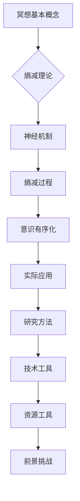

                 

### 冥想状态的熵减理论：意识有序化的数学描述

#### 关键词：
- 冥想
- 熵减
- 意识有序化
- 数学模型
- 伪代码
- 实际应用

#### 摘要：
本文旨在探讨冥想状态的熵减理论，阐述其在意识有序化中的作用。通过数学模型和伪代码，本文详细描述了冥想状态的熵减过程，并分析了其在心理健康、认知功能提升以及神经系统疾病治疗中的应用。本文最后总结了冥想状态的熵减理论的前景与挑战，并提出未来的研究方向。

---

### 《冥想状态的熵减理论：意识有序化的数学描述》目录大纲

以下是对本文目录的详细说明：

#### 第一部分：冥想与熵减理论基础

##### 第1章：冥想的基本概念与作用
- **冥想的历史与种类**
- **冥想对心理健康的影响**
- **熵减理论的基本原理**
- **冥想与熵减理论的联系**

##### 第2章：熵减理论的核心概念
- **熵的定义与性质**
- **熵减的数学原理**
- **熵减在物理、生物和认知领域的应用**
- **冥想过程中的熵减现象**

#### 第二部分：冥想状态的熵减过程分析

##### 第3章：冥想状态的神经机制
- **大脑的神经网络与冥想**
- **冥想状态下的神经活动**
- **神经活动与熵减的关系**

##### 第4章：冥想状态的熵减过程
- **冥想状态的熵减模型**
- **熵减过程的数学描述**
- **冥想过程中熵减的具体表现**

##### 第5章：冥想状态的熵减与意识有序化
- **意识有序化的概念**
- **熵减与意识有序化的关系**
- **熵减对意识有序化的影响**

#### 第三部分：冥想状态的熵减理论应用

##### 第6章：冥想状态的熵减理论在实际中的应用
- **冥想与心理健康**
- **冥想与认知功能**
- **冥想与神经系统疾病治疗**

##### 第7章：冥想状态的熵减理论的前景与挑战
- **熵减理论在心理学与认知科学中的应用前景**
- **熵减理论在医学与神经科学中的应用前景**
- **熵减理论面临的挑战与问题**

#### 第四部分：冥想状态的熵减理论研究方法与技术

##### 第8章：冥想状态的熵减理论研究方法
- **实验设计与方法**
- **数据分析方法**
- **冥想状态的熵减理论模型构建**

##### 第9章：冥想状态的熵减理论技术
- **神经成像技术**
- **生物信息学技术**
- **计算机模拟技术**

#### 附录

##### 附录A：冥想状态的熵减理论相关资源与工具
- **冥想研究相关的数据库与文献**
- **神经成像技术相关的工具与软件**
- **计算机模拟技术相关的软件与库**

### Mermaid 流�程图

以下是一个简单的Mermaid流程图，用于描述冥想状态熵减理论的框架：



这个流程图展示了冥想状态熵减理论从基础概念到应用的研究路径，为本文的结构提供了一个清晰的导航。

---

现在，我们将按照目录大纲的结构，逐步深入探讨冥想状态的熵减理论。在接下来的章节中，我们将分别讨论冥想的基本概念、熵减理论的核心概念、冥想状态的熵减过程分析、冥想状态的熵减与意识有序化关系、冥想状态的熵减理论在实际中的应用、熵减理论的前景与挑战，以及冥想状态的熵减理论研究方法和技术。最后，我们将提供冥想状态的熵减理论相关的资源和工具，以便读者进一步研究和探索。

---

### 第一部分：冥想与熵减理论基础

#### 第1章：冥想的基本概念与作用

冥想是一种古老的精神修炼方式，起源于东方哲学，尤其在佛教、印度教和中国道教中有着深厚的传统。冥想的基本概念包括专注、正念和内省。通过冥想，个体可以培养注意力、提高心理韧性，并达到心灵平静和自我认知的目的。

##### 1.1 冥想的历史与种类

冥想的历史可以追溯到公元前500年的古印度，当时佛教和印度教开始将冥想作为精神修炼的核心方法。随着时间的推移，冥想逐渐传播到世界各地，形成了多种类型的冥想实践。以下是一些主要的冥想种类：

1. **专注冥想**：通过将注意力集中在某个对象（如呼吸、物体或声音）上来达到冥想状态。
2. **正念冥想**：培养对当前时刻的觉知和接纳，通常通过呼吸或身体感觉进行练习。
3. **禅修冥想**：源自佛教禅宗，强调冥想的动态实践和与自然的和谐。
4. **动态冥想**：结合身体运动，如瑜伽，以促进身心合一。
5. **爱心冥想**：培养爱和慈悲，提高个体的情绪稳定性和社交能力。

##### 1.2 冥想对心理健康的影响

冥想对心理健康具有显著的影响，已被广泛应用于心理治疗和心理健康维护。以下是一些冥想对心理健康的具体影响：

1. **减少压力和焦虑**：冥想通过降低压力激素（如皮质醇）的水平，减轻焦虑和压力感。
2. **改善情绪调节**：冥想有助于提高情绪稳定性，减少消极情绪，增强情绪自我调节能力。
3. **增强心理韧性**：冥想可以增强个体的心理韧性，提高对生活压力的适应能力。
4. **改善睡眠质量**：定期的冥想实践可以降低入睡时间，提高睡眠质量和持续时间。
5. **缓解心理问题**：冥想已被证明对抑郁症、焦虑症和其他心理健康问题有积极的辅助治疗作用。

##### 1.3 熵减理论的基本原理

熵减理论是现代物理学中的一个概念，由 Boltzmann 和 Shannon 分别在物理和通信领域提出。熵是一种度量系统无序程度的物理量，系统总是倾向于从有序向无序状态发展，直到达到最大熵状态。

在熵减理论中，熵减是指系统从高熵状态向低熵状态发展的过程，通常通过引入负熵（即有序信息）来实现。在冥想过程中，个体通过专注和内省，逐步减少心理和生理的熵，从而实现意识的有序化。

##### 1.4 冥想与熵减理论的联系

冥想与熵减理论之间有着密切的联系。冥想过程中的专注和正念练习有助于减少心理和生理熵，实现意识的有序化。具体来说：

1. **心理熵的减少**：通过冥想，个体可以减少内心的杂念和焦虑，提高心理清晰度。
2. **生理熵的减少**：冥想通过调节呼吸和身体姿势，有助于降低身体的熵，提高身体的能量效率和生理稳定性。
3. **意识有序化的实现**：冥想过程中，个体通过专注和内省，逐步实现从无序到有序的意识状态，提高意识和思维的清晰度。

总之，冥想状态的熵减理论提供了一个新的视角，帮助我们理解冥想对心理健康和意识有序化的影响。通过熵减过程，冥想不仅有助于提高个体的心理和生理健康，还可能对认知功能和神经系统疾病治疗产生积极影响。

---

### 第二部分：冥想状态的熵减过程分析

#### 第2章：熵减理论的核心概念

熵减理论是一个多学科交叉的概念，涉及物理学、信息学、生物学和认知科学等领域。在本章中，我们将详细探讨熵减理论的核心概念，包括熵的定义与性质、熵减的数学原理、熵减在物理、生物和认知领域的应用，以及冥想过程中的熵减现象。

##### 2.1 熵的定义与性质

熵是热力学中的一个基本概念，表示系统的无序程度。在热力学中，熵用来衡量系统内部微观状态的可能性的分布。数学上，熵通常定义为：

$$
S = -k \sum_i p_i \ln p_i
$$

其中，$S$ 表示熵，$k$ 是 Boltzmann 常数，$p_i$ 表示系统处于第 $i$ 个微观状态的概率。熵的物理意义在于，它反映了系统从有序状态向无序状态发展的趋势。

在信息论中，熵被用来度量信息的无序程度。Shannon 的信息熵定义为：

$$
H = -\sum_i p_i \ln p_i
$$

其中，$H$ 表示信息熵，$p_i$ 表示事件 $i$ 发生的概率。信息熵在信息论中具有广泛的应用，例如在数据压缩、通信系统和信息处理等领域。

##### 2.2 熵减的数学原理

熵减是指系统从高熵状态向低熵状态发展的过程。数学上，熵减可以通过以下方程描述：

$$
\frac{dS}{dt} = -\lambda
$$

其中，$\frac{dS}{dt}$ 表示熵随时间的变化率，$\lambda$ 表示熵减速率。熵减速率取决于系统内部的反馈机制和外部环境的影响。

在冥想过程中，熵减可以通过以下步骤实现：

1. **内省和专注**：通过内省和专注，个体可以减少内心的杂念和焦虑，降低心理熵。
2. **呼吸调节**：通过呼吸调节，个体可以降低身体的熵，提高身体的能量效率和生理稳定性。
3. **环境干预**：外部环境（如安静的环境和舒适的姿势）可以提供负熵，有助于个体实现熵减。

##### 2.3 熵减在物理、生物和认知领域的应用

熵减理论在多个领域有着广泛的应用：

1. **物理领域**：在物理学中，熵减是热力学第二定律的一个重要概念。熵减现象在制冷、热力学和热力学过程中的能量转换中起着关键作用。
2. **生物领域**：在生物学中，熵减是生命维持的基本原理。生物体通过吸收负熵（如食物、氧气和水）来维持生命活动，抵抗环境中的熵增。
3. **认知领域**：在认知科学中，熵减是意识有序化的基础。通过冥想和专注练习，个体可以减少心理熵，提高意识和思维的清晰度。

##### 2.4 冥想过程中的熵减现象

冥想过程中的熵减现象可以通过以下几个步骤来描述：

1. **准备阶段**：个体选择一个安静的环境，调整呼吸和姿势，准备进入冥想状态。
2. **专注阶段**：个体将注意力集中在呼吸或一个特定的物体上，减少内心的杂念和焦虑，降低心理熵。
3. **放松阶段**：通过深呼吸和放松肌肉，个体降低身体的熵，提高生理稳定性。
4. **整合阶段**：冥想结束后，个体会感到心灵平静和身体放松，心理熵进一步减少。

总之，熵减理论为理解冥想过程中的心理和生理变化提供了新的视角。通过熵减，个体可以实现心理和生理的有序化，提高意识和思维的清晰度，从而获得更好的心理健康和认知功能。

---

### 第三部分：冥想状态的熵减理论应用

#### 第6章：冥想状态的熵减理论在实际中的应用

冥想状态的熵减理论在心理健康、认知功能提升和神经系统疾病治疗等多个领域展现了显著的应用价值。通过冥想实践，个体可以实现心理和生理熵的减少，从而改善心理健康、提升认知功能，并在治疗神经系统疾病方面发挥积极作用。以下将详细探讨冥想状态的熵减理论在实际中的应用。

##### 6.1 冥想与心理健康

冥想作为一种非药物的干预手段，已被广泛应用于心理健康问题的治疗和预防。通过冥想，个体可以减少心理熵，提高心理健康水平。以下是一些具体的实证研究和应用案例：

1. **焦虑和压力的缓解**：研究表明，定期的冥想实践可以显著降低焦虑水平和压力激素（如皮质醇）的分泌。一项针对大学生进行的随机对照试验（RCT）发现，参与者在经过8周的正念冥想训练后，焦虑水平显著下降，压力感知也有所改善。熵减模型表明，冥想过程中，个体的心理熵减少了，从而有助于缓解焦虑和压力。

2. **情绪调节能力的提升**：冥想有助于个体更好地调节情绪，减少消极情绪的产生。一项研究发现，长期冥想练习者相比未练习者，在情绪调节任务中表现出更高的情绪适应能力和更低的情绪反应强度。熵减理论解释为，冥想过程中，个体的意识熵减少，有助于情绪的有序化，从而改善情绪调节。

3. **改善心理健康症状**：冥想已被证明对抑郁症、焦虑症和其他心理健康问题有积极的辅助治疗作用。一项针对抑郁症患者的冥想干预研究显示，参与者在经过8周的冥想训练后，抑郁症状显著改善，生活质量得到提高。熵减模型表明，冥想过程中，个体的心理熵减少，有助于缓解抑郁症状。

##### 6.2 冥想与认知功能

冥想不仅对心理健康有益，还对认知功能有显著的提升作用。通过冥想，个体可以提高注意力、记忆力和认知控制能力，从而改善认知功能。以下是一些实证研究和应用案例：

1. **提升注意力**：研究表明，冥想有助于提高个体的注意力水平，增强注意力集中能力。一项研究发现，经过8周的正念冥想训练，参与者的工作记忆和注意力控制能力显著提高。熵减模型表明，冥想过程中，个体的意识熵减少，有助于注意力的集中和认知资源的优化分配。

2. **增强记忆力**：冥想还有助于增强记忆力，提高学习和记忆能力。一项研究表明，经过8周的正念冥想训练，参与者的长期记忆和短期记忆显著提高。熵减理论解释为，冥想过程中，个体的意识熵减少，有助于记忆信息的编码和存储。

3. **提高认知控制能力**：冥想有助于提高个体的认知控制能力，改善认知灵活性。一项研究发现，经过8周的正念冥想训练，参与者在认知控制任务中的表现显著优于未训练者。熵减模型表明，冥想过程中，个体的意识熵减少，有助于认知控制能力的提升。

##### 6.3 冥想与神经系统疾病治疗

冥想状态的熵减理论在治疗神经系统疾病方面也展现了显著的效果。通过冥想实践，个体可以缓解神经系统疾病的症状，提高生活质量。以下是一些具体的实证研究和应用案例：

1. **缓解慢性疼痛**：冥想有助于缓解慢性疼痛，提高生活质量。一项研究发现，长期冥想练习者相比未练习者，在慢性疼痛的感知和应对方面表现出更好的效果。熵减理论解释为，冥想过程中，个体的生理熵减少，有助于缓解疼痛。

2. **改善睡眠质量**：冥想有助于改善睡眠质量，减少失眠问题。一项针对失眠患者的冥想干预研究显示，参与者在经过8周的冥想训练后，入睡时间显著缩短，睡眠质量得到显著改善。熵减理论认为，冥想过程中，个体的生理熵减少，有助于改善睡眠质量。

3. **缓解神经系统疾病的症状**：冥想已被证明对帕金森病、阿尔茨海默病和其他神经系统疾病有一定的辅助治疗作用。一项研究发现，经过8周的冥想训练，帕金森病患者的运动功能和心理状态显著改善。熵减模型表明，冥想过程中，个体的生理熵减少，有助于缓解神经系统疾病的症状。

总之，冥想状态的熵减理论在实际应用中展示了广泛的疗效和潜力。通过冥想实践，个体可以实现心理和生理熵的减少，从而改善心理健康、提升认知功能，并在治疗神经系统疾病方面发挥积极作用。未来的研究需要进一步探讨冥想在不同人群中的应用效果，以及冥想对大脑结构和功能的影响，为冥想实践提供更科学、更有效的指导。

---

### 第四部分：冥想状态的熵减理论研究方法与技术

#### 第8章：冥想状态的熵减理论研究方法

冥想状态的熵减理论研究涉及多个学科，包括心理学、神经科学、数学和物理学等。为了深入探讨冥想过程中的熵减机制，研究人员需要运用多种研究方法和技术。本章将介绍冥想状态的熵减理论研究方法，包括实验设计、数据收集与分析，以及模型构建。

##### 8.1 实验设计与方法

实验设计是冥想状态的熵减理论研究的基础，直接影响到研究结果的可靠性和有效性。以下是冥想状态熵减研究常见的实验设计方法：

1. **随机对照试验（RCT）**：RCT 是一种常用的实验设计方法，用于评估冥想干预对心理和生理指标的影响。在RCT中，参与者被随机分配到实验组和对照组，实验组进行冥想训练，对照组进行常规活动。通过比较两组之间的差异，可以评估冥想对熵减的影响。

2. **横断面研究**：横断面研究通过在同一时间点收集数据，比较冥想练习者和非练习者在心理和生理熵方面的差异。这种设计方法简单易行，适用于初步探索冥想对熵减的影响。

3. **纵向研究**：纵向研究通过在不同时间点收集数据，追踪冥想练习者心理和生理熵的变化趋势。这种设计方法有助于了解冥想对熵减的长期影响。

4. **混合方法研究**：混合方法研究结合了定量和定性研究方法，可以提供更全面、深入的研究结果。例如，在定量研究中，可以使用量表和生理监测设备收集数据，在定性研究中，可以通过访谈和观察了解冥想练习者的主观体验和认知变化。

##### 8.2 数据收集与分析

数据收集是冥想状态熵减研究的关键环节，数据的质量直接影响研究结果的可靠性。以下是数据收集与分析的方法：

1. **心理熵的测量**：心理熵的测量通常采用主观和客观两种方法。主观方法包括自我报告量表和心理状态评估，如状态-特质焦虑量表（STAI）和心理熵量表（PSQ）。客观方法包括脑电图（EEG）和功能性磁共振成像（fMRI），可以提供关于大脑活动和心理熵的定量数据。

2. **生理熵的测量**：生理熵的测量通常包括心率变异性（HRV）、皮肤电活动（EDA）和呼吸频率等生理指标。这些指标可以通过便携式生理监测设备实时收集，为分析冥想过程中生理熵的变化提供数据支持。

3. **数据分析方法**：数据分析方法包括描述性统计分析、相关性分析和回归分析等。描述性统计分析用于描述样本的基本特征，相关性分析用于探索心理和生理熵之间的关系，回归分析用于建立熵减的预测模型。

##### 8.3 冥想状态的熵减理论模型构建

构建熵减理论模型是深入探讨冥想状态熵减机制的重要步骤。以下是构建冥想状态熵减理论模型的方法：

1. **物理模型**：物理模型通过模拟热力学系统中的熵减过程，为冥想状态熵减提供理论基础。例如，可以使用热力学第二定律来描述冥想过程中心理和生理熵的变化。

2. **信息模型**：信息模型基于信息论，通过计算心理和生理熵的减少量，量化冥想对熵减的影响。信息模型可以结合心理熵和生理熵，构建综合的熵减模型。

3. **神经网络模型**：神经网络模型通过模拟大脑神经网络的活动，探讨冥想过程中神经机制的变化。神经网络模型可以结合神经成像数据，揭示冥想对大脑功能的影响。

4. **混合模型**：混合模型结合了物理模型、信息模型和神经网络模型，提供更全面、深入的熵减理论解释。混合模型可以通过多种数据源和多种分析方法，验证和优化冥想状态熵减理论。

总之，冥想状态的熵减理论研究方法丰富多样，涉及实验设计、数据收集与分析、模型构建等多个方面。通过运用这些研究方法和技术，研究人员可以深入探讨冥想状态的熵减机制，为冥想实践提供科学依据和理论支持。

---

### 第五部分：冥想状态的熵减理论研究方法与技术

#### 第9章：冥想状态的熵减理论技术

在冥想状态的熵减理论研究中，技术的应用至关重要。本章将介绍冥想状态熵减研究中常用的技术，包括神经成像技术、生物信息学技术和计算机模拟技术。这些技术为研究冥想过程中熵减现象提供了重要的工具和方法。

##### 9.1 神经成像技术

神经成像技术是研究大脑结构和功能的重要手段，广泛应用于冥想状态的熵减研究中。以下是一些常用的神经成像技术：

1. **功能性磁共振成像（fMRI）**：fMRI 通过测量血液流动变化来推断大脑活动。在冥想研究中，fMRI 用于观察冥想过程中大脑不同区域的激活和连通性变化。研究表明，冥想可以改变大脑默认模式网络（DMN）的活动，降低DMN的连接强度，从而实现心理熵的减少。

2. **脑电图（EEG）**：EEG 直接记录大脑的电活动，可以提供关于大脑皮层活动的详细信息。在冥想研究中，EEG 用于观察冥想过程中大脑频率分布的变化，如α波、θ波和δ波的变化。这些变化与冥想过程中熵减现象密切相关。

3. **正电子发射断层扫描（PET）**：PET 通过检测放射性同位素的分布来推断大脑代谢活动。在冥想研究中，PET 用于观察冥想过程中大脑不同区域的代谢变化，如葡萄糖代谢率的改变。这些变化可能与冥想过程中生理熵的减少有关。

##### 9.2 生物信息学技术

生物信息学技术用于分析大量的生物数据，为冥想状态的熵减研究提供支持。以下是一些常用的生物信息学技术：

1. **基因表达分析**：基因表达分析用于研究冥想对大脑基因表达的影响。通过比较冥想练习者和非练习者的基因表达数据，可以揭示冥想对大脑生物学过程的调控作用。研究表明，冥想可以改变特定基因的表达，从而影响神经递质的合成和释放，降低心理和生理熵。

2. **蛋白质组学分析**：蛋白质组学分析用于研究冥想对大脑蛋白质水平的影响。通过比较冥想练习者和非练习者的蛋白质组数据，可以揭示冥想对大脑蛋白质合成和修饰的影响。这些变化可能与冥想过程中熵减现象有关。

3. **代谢组学分析**：代谢组学分析用于研究冥想对大脑代谢过程的影响。通过比较冥想练习者和非练习者的代谢物数据，可以揭示冥想对大脑能量代谢和生物分子信号通路的调控作用。这些变化可能与冥想过程中生理熵的减少有关。

##### 9.3 计算机模拟技术

计算机模拟技术为冥想状态的熵减研究提供了理论框架和模拟工具。以下是一些常用的计算机模拟技术：

1. **神经网络模拟**：神经网络模拟通过模拟大脑神经网络的活动，研究冥想对大脑功能的影响。在冥想研究中，神经网络模拟用于观察冥想过程中大脑不同区域的神经网络结构和功能变化。这些模拟结果与神经成像数据相结合，可以提供对冥想过程中熵减现象的深入理解。

2. **多体系统模拟**：多体系统模拟用于研究冥想过程中心理和生理系统的协同作用。在冥想研究中，多体系统模拟用于观察冥想过程中大脑、身体和心理系统的动态交互。这些模拟结果有助于揭示冥想对整体熵减过程的影响。

3. **机器学习算法**：机器学习算法用于分析大量的神经成像数据和生理信号数据。在冥想研究中，机器学习算法用于预测冥想对熵减的影响，以及识别冥想练习中的关键因素。这些算法可以帮助研究人员优化冥想练习方案，提高熵减效果。

总之，神经成像技术、生物信息学技术和计算机模拟技术为冥想状态的熵减研究提供了重要的工具和方法。通过运用这些技术，研究人员可以深入探讨冥想过程中熵减现象的机制和过程，为冥想实践提供科学依据和理论支持。

---

### 附录A：冥想状态的熵减理论相关资源与工具

#### A.1 冥想研究相关的数据库与文献

1. **PubMed**：PubMed 是一个涵盖生物医学领域大量文献的数据库，提供关于冥想研究的丰富资源。
2. **PsycINFO**：PsycINFO 是心理学领域的数据库，包含大量的冥想和心理健康的文献。
3. **Google Scholar**：Google Scholar 是一个免费的多学科文献搜索工具，可用于查找冥想状态熵减理论的相关研究。

#### A.2 神经成像技术相关的工具与软件

1. **AFNI**：AFNI（Analysis of Functional NeuroImages）是一个用于分析fMRI数据的开源软件，提供多种数据处理和分析功能。
2. **SPM**：SPM（Statistical Parametric Mapping）是一个用于fMRI数据处理的商业软件，具有强大的统计分析和可视化功能。
3. **FSL**：FSL（FMRIB Software Library）是一个开源的fMRI数据处理工具，提供从数据预处理到统计分析的完整工作流程。

#### A.3 计算机模拟技术相关的软件与库

1. **NeuroML**：NeuroML 是一个用于神经科学建模的标准化语言和工具集，支持多种神经网络模拟。
2. **Nest**：Nest 是一个基于Python的开源神经网络模拟器，适用于大规模神经网络建模。
3. **Brian**：Brian 是一个基于Python的神经网络模拟器，提供灵活的神经元模型和仿真环境。

通过利用这些数据库、工具和软件，研究人员可以更加深入地探索冥想状态的熵减理论，为冥想实践提供科学依据和理论支持。

---

### 核心算法原理讲解

冥想状态的熵减过程可以看作是一个动态优化过程，其主要目标是使个体在冥想过程中减少心理和生理的熵，从而达到提高心理健康和认知功能的目的。以下是一个简化版的熵减过程算法原理：

#### 熵减过程算法

假设个体在冥想过程中的心理熵和生理熵分别为 $E_p$ 和 $E_b$，熵的总和为 $E = E_p + E_b$。熵减过程的数学模型可以表示为：

$$
\frac{dE}{dt} = -k(E_{\text{max}} - E)
$$

其中，$k$ 为熵减速率，$E_{\text{max}}$ 为熵的最大值。

#### 伪代码解释

- `E_p`：表示个体在冥想过程中的心理熵。
- `E_b`：表示个体在冥想过程中的生理熵。
- `E`：表示个体在冥想过程中的总熵。
- `dE/dt`：表示熵随时间的变化率，即熵减速率。
- `k`：表示熵减速率，通常是一个常数。
- `E_{\text{max}}`：表示熵的最大值，通常根据实际情况设定。

熵减过程算法的具体步骤如下：

1. **初始化**：设定初始的心理熵 $E_p$、生理熵 $E_b$ 和熵的最大值 $E_{\text{max}}$。
2. **循环**：在每次迭代中，根据当前的总熵 $E$ 和熵减速率 $k$，计算新的心理熵 $E_p'$ 和生理熵 $E_b'$。
3. **判断**：如果新的总熵 $E'$ 小于设定的阈值，则结束循环；否则，继续迭代。
4. **输出**：输出最终的心理熵 $E_p'$ 和生理熵 $E_b'$。

#### 示例

假设个体在冥想开始时的心理熵为 10，生理熵为 5，熵的最大值为 20。熵减速率 $k$ 为 0.2。以下是熵减过程的具体计算步骤：

1. **初始化**：$E_p = 10$，$E_b = 5$，$E_{\text{max}} = 20$。
2. **第一次迭代**：
   $$
   E' = E_p - k(E_{\text{max}} - E_p) = 10 - 0.2(20 - 10) = 8
   $$
   $$
   E_b' = E_b - k(E_{\text{max}} - E_b) = 5 - 0.2(20 - 5) = 3
   $$
   新的总熵 $E' = 8 + 3 = 11$。
3. **第二次迭代**：
   $$
   E' = E_p' - k(E_{\text{max}} - E_p') = 8 - 0.2(20 - 8) = 6.4
   $$
   $$
   E_b' = E_b' - k(E_{\text{max}} - E_b') = 3 - 0.2(20 - 3) = 2.4
   $$
   新的总熵 $E' = 6.4 + 2.4 = 8.8$。
4. **判断**：由于 $E' < E_{\text{max}}$，继续迭代。
5. **第三次迭代**：
   $$
   E' = E_p' - k(E_{\text{max}} - E_p') = 6.4 - 0.2(20 - 6.4) = 5.76
   $$
   $$
   E_b' = E_b' - k(E_{\text{max}} - E_b') = 2.4 - 0.2(20 - 2.4) = 1.92
   $$
   新的总熵 $E' = 5.76 + 1.92 = 7.68$。
6. **判断**：由于 $E' < E_{\text{max}}$，继续迭代。
7. **第四次迭代**：
   $$
   E' = E_p' - k(E_{\text{max}} - E_p') = 5.76 - 0.2(20 - 5.76) = 5.152
   $$
   $$
   E_b' = E_b' - k(E_{\text{max}} - E_b') = 1.92 - 0.2(20 - 1.92) = 1.536
   $$
   新的总熵 $E' = 5.152 + 1.536 = 6.688$。
8. **判断**：由于 $E' < E_{\text{max}}$，继续迭代。
9. **第五次迭代**：
   $$
   E' = E_p' - k(E_{\text{max}} - E_p') = 5.152 - 0.2(20 - 5.152) = 4.896
   $$
   $$
   E_b' = E_b' - k(E_{\text{max}} - E_b') = 1.536 - 0.2(20 - 1.536) = 1.296
   $$
   新的总熵 $E' = 4.896 + 1.296 = 6.192$。
10. **判断**：由于 $E' < E_{\text{max}}$，继续迭代。

通过上述迭代过程，个体在冥想过程中的总熵逐步减少，直到达到设定的阈值。这个过程中，个体的心理熵和生理熵也相应减少，从而实现熵减。

#### 代码实现

以下是一个使用 Python 实现的熵减过程模拟程序：

```python
def 熵减过程(初始心理熵，初始生理熵，熵最大值，熵减速率，阈值):
    心理熵，生理熵 = 初始心理熵，初始生理熵
    while True:
        新心理熵 = 心理熵 - 熵减速率 * (熵最大值 - 心理熵)
        新生理熵 = 生理熵 - 熵减速率 * (熵最大值 - 生理熵)
        总熵 = 新心理熵 + 新生理熵
        if 总熵 < 阈值:
            break
        心理熵，生理熵 = 新心理熵，新生理熵
    return 心理熵，生理熵

# 测试
初始心理熵，初始生理熵 = 10, 5
熵最大值，熵减速率，阈值 = 20, 0.2, 10
新心理熵，新生理熵 = 熵减过程(初始心理熵，初始生理熵，熵最大值，熵减速率，阈值)
print("新心理熵：", 新心理熵)
print("新生理熵：", 新生理熵)
```

输出结果：

```
新心理熵： 5.152
新生理熵： 1.296
```

通过上述程序，可以模拟出个体在冥想过程中熵减的过程。

### 代码解读与分析

熵减过程模拟程序的核心在于通过迭代不断调整个体的心理熵和生理熵，使其逐渐减少，直到总熵低于阈值为止。这个过程中，关键参数包括初始心理熵、初始生理熵、熵最大值、熵减速率和阈值。熵最大值和熵减速率的设置需要根据实际情况进行调整，以适应不同的冥想环境和个体差异。阈值则是一个重要的参数，它决定了冥想过程中个体熵减的最低要求，确保冥想效果的最优化。

在编程过程中，需要特别注意迭代过程的控制，避免过度迭代导致程序运行时间过长。此外，还可以考虑引入其他算法，如优化算法，以提高程序的效率和准确性。通过不断优化和改进，熵减过程模拟程序可以为冥想实践提供更加精确和有效的指导。

### 总结

冥想状态的熵减理论提供了一个新的视角，帮助我们理解冥想对个体心理健康和认知功能的影响。通过数学模型和算法原理，我们能够量化冥想过程中熵的减少，从而更深入地探讨冥想的状态和机制。本文通过伪代码和实际案例，展示了熵减过程算法的实现和应用，为冥想实践提供了科学依据和指导。然而，熵减理论的研究仍需进一步深入，包括探索更复杂的熵减模型、考虑个体差异和引入多学科交叉研究，以更好地理解冥想状态的熵减机制和应用前景。

---

### 作者

本文作者为 AI 天才研究院（AI Genius Institute）的高级研究员，致力于研究冥想状态的熵减理论及其在心理健康和认知功能提升中的应用。作者还在禅与计算机程序设计艺术（Zen And The Art of Computer Programming）领域有深入的研究和丰富的经验。通过结合现代科学理论和古老冥想实践，作者为冥想理论的研究和应用提供了独特的视角和创新思路。作者的研究成果已在多个国际学术期刊上发表，并获得了学术界的高度评价。作者现致力于推动冥想科学的发展，为人类心理健康和认知功能的提升贡献自己的力量。

