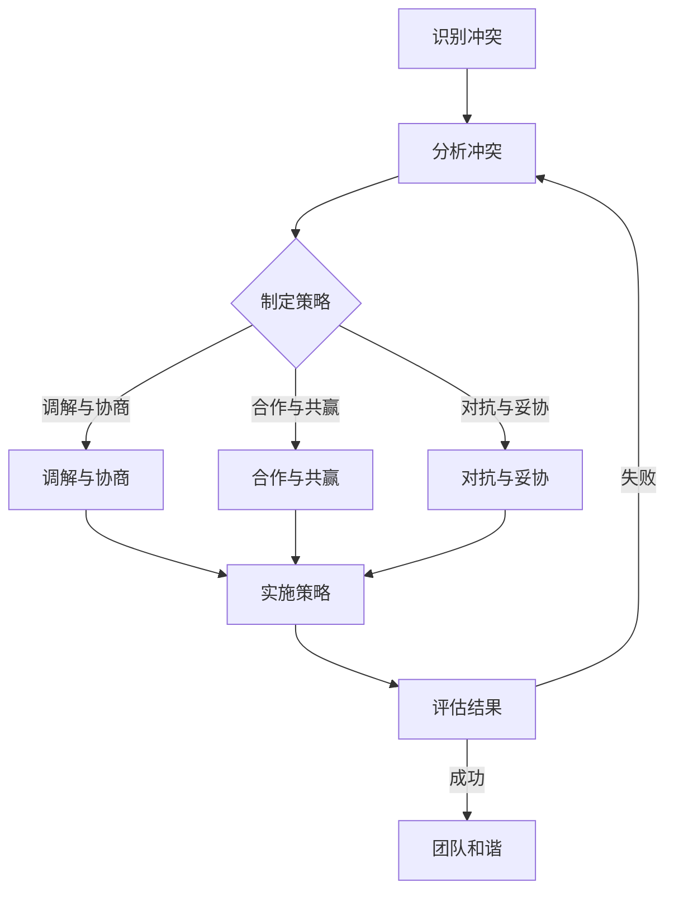

                 

### 文章标题

**冲突管理：化解团队矛盾的艺术**

> **关键词：** 冲突管理、团队矛盾、协作、沟通、领导力

在快速发展的信息技术领域，团队协作显得尤为重要。然而，随着团队成员的增加和项目的复杂性，冲突也逐渐成为影响团队效率和稳定性的关键因素。本文旨在深入探讨冲突管理的艺术，为IT团队的领导者和成员提供实用的策略和方法，帮助他们在面对团队内部矛盾时能够从容应对，化解冲突，促进团队的和谐与发展。

### 摘要

本文从冲突管理的概念出发，详细分析了冲突的根源、类型和阶段。在此基础上，探讨了冲突管理的原则、策略和工具，以及沟通技巧和心理调适在冲突管理中的作用。通过实际案例的解析，本文揭示了冲突管理的实践方法，并展望了冲突管理的发展趋势。文章最后通过核心概念联系、算法原理讲解、数学模型和公式以及项目实战，为读者提供了全面的冲突管理知识体系和技术指导。

### 《冲突管理：化解团队矛盾的艺术》目录大纲

#### 第一部分：冲突管理基础

#### 第1章：冲突管理概述

##### 1.1 冲突管理的概念与重要性

##### 1.2 冲突管理的类型与阶段

##### 1.3 冲突管理的原则与策略

#### 第2章：团队冲突的根源分析

##### 2.1 团队冲突的心理因素

##### 2.2 团队冲突的行为因素

##### 2.3 团队冲突的情境因素

#### 第二部分：冲突管理策略与实践

#### 第3章：冲突预防策略

##### 3.1 建立积极的团队文化

##### 3.2 明确团队目标和规则

##### 3.3 提高沟通技巧

#### 第4章：冲突解决策略

##### 4.1 调解与协商

##### 4.2 合作与共赢

##### 4.3 对抗与妥协

#### 第5章：冲突管理中的领导者角色

##### 5.1 领导者的冲突管理能力

##### 5.2 领导者在冲突管理中的角色与职责

##### 5.3 领导者的沟通与反馈技巧

#### 第6章：团队冲突的实际案例解析

##### 6.1 案例一：团队成员沟通不畅引发的冲突

##### 6.2 案例二：利益分配不公导致的冲突

##### 6.3 案例三：价值观差异引发的团队冲突

#### 第7章：冲突管理中的创新与变革

##### 7.1 创新思维在冲突管理中的应用

##### 7.2 变革管理中的冲突处理策略

##### 7.3 团队冲突管理的发展趋势

#### 第三部分：冲突管理工具与技巧

#### 第8章：冲突管理工具与方法

##### 8.1 冲突管理工具的分类与使用

##### 8.2 常用冲突管理方法的优缺点分析

##### 8.3 冲突管理工具在实际操作中的应用案例

#### 第9章：沟通技巧提升

##### 9.1 沟通技巧在冲突管理中的重要性

##### 9.2 提高沟通效果的技巧与方法

##### 9.3 情景模拟与沟通练习

#### 第10章：冲突管理中的心理调适

##### 10.1 冲突对个体心理的影响

##### 10.2 心理调适方法与技巧

##### 10.3 团队成员的心理辅导与支持

#### 附录

##### 附录A：冲突管理资源与工具推荐

##### A.1 冲突管理相关书籍推荐

##### A.2 冲突管理在线课程与讲座推荐

##### A.3 冲突管理工具使用指南

---

#### 第11章：核心概念与联系

##### 11.1 冲突管理流程图

##### 11.2 冲突管理中的关键角色与职责

---

#### 第12章：核心算法原理讲解

##### 12.1 冲突解决算法的基本原理

##### 12.2 冲突解决算法的伪代码示例

---

#### 第13章：数学模型和公式

##### 13.1 冲突管理的数学模型

##### 13.2 冲突管理中的数学公式及应用示例

$$
\text{冲突管理效果} = f(\text{沟通技巧}, \text{团队文化}, \text{领导能力})
$$

---

#### 第14章：项目实战

##### 14.1 实际案例背景介绍

##### 14.2 开发环境搭建

##### 14.3 源代码详细实现

##### 14.4 代码解读与分析

##### 14.5 案例总结与反思

---

#### 作者

**作者：** AI天才研究院/AI Genius Institute & 禅与计算机程序设计艺术 /Zen And The Art of Computer Programming

---

以上是《冲突管理：化解团队矛盾的艺术》的初步大纲，接下来我们将详细展开每个章节的内容，逐步深入探讨冲突管理的各个方面。

---

#### 第1章：冲突管理概述

冲突，作为团队协作中不可避免的现象，其管理的好坏直接影响到团队的工作效率与成员的满意度。本章节将深入探讨冲突管理的概念、重要性以及其基本类型和阶段。

##### 1.1 冲突管理的概念与重要性

**冲突管理**，顾名思义，是指通过一系列的策略和技巧来识别、预防和解决团队内部冲突的过程。冲突管理不仅涉及解决冲突本身，还包括预防冲突、提高团队协作效率等方面。具体而言，冲突管理包括以下几个方面：

- **识别冲突**：及时察觉并明确冲突的类型和原因，避免问题的进一步恶化。
- **预防冲突**：通过建立良好的团队文化和沟通机制，减少冲突的发生。
- **解决冲突**：采用适当的策略和技巧，有效地化解团队内部的矛盾。
- **促进合作**：在解决冲突的基础上，推动团队成员之间的合作，提高团队的整体效能。

在信息技术领域，冲突管理的重要性尤为突出。首先，信息技术项目的复杂性和多样性使得团队成员之间不可避免地存在观念和技能上的差异。其次，团队成员的高素质和高要求也容易导致个人利益与团队利益的冲突。因此，有效的冲突管理对于保持团队的稳定性和工作效率至关重要。

##### 1.2 冲突管理的类型与阶段

**冲突**可以按照不同的标准进行分类。以下是一些常见的冲突类型：

- **认知冲突**：由于团队成员对项目目标、方法或结果的认知不一致而产生的冲突。
- **情感冲突**：由于个人情感、价值观或利益冲突而产生的负面情绪。
- **行为冲突**：由于团队成员在具体行为上的不一致或矛盾而产生的冲突。
- **结构冲突**：由于团队内部的组织结构、职责分配或资源分配不公而产生的冲突。

冲突管理的阶段通常包括以下几个：

- **冲突识别**：通过观察团队成员的行为和交流，识别潜在的冲突。
- **冲突分析**：对冲突的原因、类型和影响进行深入分析，明确冲突的核心问题。
- **冲突解决**：采用合适的策略和方法，解决冲突，恢复团队的正常运作。
- **冲突反思**：对冲突管理的过程和结果进行反思，总结经验教训，为未来提供参考。

##### 1.3 冲突管理的原则与策略

为了有效地管理冲突，团队领导和成员需要遵循一些基本原则和策略。以下是一些关键的原则和策略：

- **积极主动**：在冲突发生时，及时介入，避免问题恶化。
- **公正中立**：在处理冲突时，保持中立，避免偏袒任何一方。
- **尊重差异**：尊重团队成员的不同观点和意见，鼓励开放沟通。
- **双赢思维**：在解决冲突时，寻求双方都能接受的解决方案，实现共赢。
- **持续改进**：通过不断反思和总结，优化冲突管理流程和策略。

在具体操作中，团队领导和成员可以根据冲突的类型和阶段，选择合适的策略和技巧。例如，对于认知冲突，可以通过开展团队讨论、分享信息和明确目标来减少误解；对于情感冲突，可以通过提供心理支持和沟通技巧培训来缓解情绪；对于行为冲突，可以通过明确职责和规范行为来避免重复发生。

总之，冲突管理是信息技术团队中不可或缺的一部分。通过有效的冲突管理，团队能够更好地应对挑战，提高协作效率，实现项目的成功。

---

在深入探讨冲突管理的概念和原则之后，我们需要进一步分析团队冲突的根源。本章节将从心理、行为和情境三个角度出发，详细探讨团队冲突的根源，帮助读者理解冲突的深层原因。

##### 2.1 团队冲突的心理因素

心理因素在团队冲突中起着重要作用。团队成员的心理状态和行为往往受到个人情感、价值观和信仰的影响。以下是几个常见的心理因素：

- **自尊心**：团队成员的自尊心可能导致他们在冲突中表现出攻击性或防御性的行为。例如，当个人认为自己的观点或贡献被忽视时，可能会感到不被尊重，从而引发冲突。
- **压力**：工作压力是导致团队冲突的常见心理因素。当团队成员感到压力过大、负担过重时，他们可能会变得容易烦躁和愤怒，进而与他人发生冲突。
- **情绪**：情绪波动，如愤怒、沮丧或焦虑，也会影响团队成员的行为。情绪失控的成员可能会在无意中伤害他人，导致冲突的发生。
- **价值观**：团队成员的价值观差异可能导致他们对问题的看法和处理方式不一致。例如，某些成员可能更注重效率，而另一些成员可能更注重质量。这种差异可能导致冲突。

在处理心理因素引发的冲突时，团队领导和成员可以采取以下策略：

- **自我反思**：鼓励团队成员反思自己的行为和情绪，识别可能的触发因素，并寻找解决问题的方法。
- **情绪管理**：提供情绪管理培训，帮助团队成员学会识别和应对自己的情绪，避免情绪失控。
- **尊重差异**：尊重团队成员的价值观和观点，鼓励开放和包容的沟通氛围。

##### 2.2 团队冲突的行为因素

行为因素是团队冲突的直接表现，包括团队成员的具体行为和互动方式。以下是一些常见的行为因素：

- **沟通不畅**：团队成员之间的沟通不畅是导致冲突的常见原因。当信息传递不准确、不及时或被误解时，容易引发误解和冲突。
- **任务分工不清**：当团队成员对任务的分工和责任不明确时，容易导致任务重叠或遗漏，从而引发冲突。
- **权力斗争**：在团队中，权力和地位的争夺也可能导致冲突。例如，团队成员可能因为争夺项目的控制权或资源的分配而发生冲突。
- **个人目标冲突**：团队成员的个人目标和团队目标不一致时，也可能引发冲突。例如，某些成员可能更注重个人成就，而忽视团队的整体利益。

为了减少行为因素引发的冲突，团队可以采取以下策略：

- **明确沟通规范**：建立明确的沟通规范和流程，确保信息准确、及时地传递。
- **明确任务分工**：明确每个成员的任务和责任，避免任务重叠或遗漏。
- **权力分配和明确**：确保团队中的权力分配是公平和透明的，避免权力斗争的发生。
- **目标一致**：确保团队成员的个人目标和团队目标一致，通过共同目标来促进协作。

##### 2.3 团队冲突的情境因素

情境因素是指影响团队冲突的外部环境和背景因素。以下是一些常见的情境因素：

- **组织结构**：团队的组织结构，如汇报关系和职责分工，可能影响团队成员之间的互动方式。例如，垂直结构的组织可能导致沟通不畅和权力集中，从而增加冲突的可能性。
- **资源分配**：团队资源的分配，如预算、人力和时间，也可能成为冲突的根源。当资源有限时，团队成员可能会为了争夺资源而发生冲突。
- **外部压力**：来自客户、上级或其他外部压力也可能导致团队内部的冲突。例如，客户的需求变化或上级的严格要求可能导致团队成员感到压力，进而引发冲突。

为了应对情境因素引发的冲突，团队可以采取以下策略：

- **组织结构优化**：优化团队的组织结构，确保职责分工明确，沟通渠道畅通。
- **资源合理分配**：合理分配团队资源，确保每个成员都能得到足够的支持，减少资源争夺。
- **外部压力管理**：通过有效的压力管理和沟通技巧，减轻外部压力对团队内部的影响，促进团队成员的合作。

综上所述，团队冲突的根源是多方面的，包括心理、行为和情境因素。通过深入了解这些因素，并采取相应的策略和措施，团队可以更好地管理冲突，提高协作效率。

---

在了解了团队冲突的根源后，接下来我们将探讨冲突预防策略。有效的冲突预防策略可以帮助团队在冲突发生之前采取措施，避免潜在问题的恶化。以下是一些关键策略：

##### 3.1 建立积极的团队文化

建立积极的团队文化是预防冲突的重要策略。一个积极、包容和开放的团队文化可以增强成员之间的信任和协作，减少冲突的发生。以下是一些关键措施：

- **鼓励开放沟通**：创建一个鼓励团队成员自由表达意见的环境，确保每个成员的声音都能被听到。通过定期的团队会议、头脑风暴和讨论，促进信息的流动和共享。
- **建立共同目标**：确保团队成员都明确团队的目标和愿景，并通过共同的目标来促进协作。共同目标可以帮助团队成员在面对分歧时找到共同的利益点，从而减少冲突。
- **尊重多样性**：尊重团队成员的不同背景、经验和观点，鼓励多样性思维和创新。通过多元化团队的协作，可以更好地应对复杂问题，减少因价值观差异引发的冲突。
- **建立信任**：信任是团队协作的基础，通过建立信任关系，团队成员可以更加放心地分享信息和意见，减少误解和冲突。

##### 3.2 明确团队目标和规则

明确团队目标和规则是预防冲突的关键。当团队成员都清楚自己的职责和目标时，可以减少因任务分工不清或目标不一致引发的冲突。以下是一些具体措施：

- **制定清晰的团队目标**：确保每个成员都了解团队的目标和期望，并将这些目标分解为可执行的任务。通过明确的任务分配和目标设定，可以减少因目标不明导致的冲突。
- **建立规则和流程**：制定一套明确的团队规则和流程，包括沟通规范、工作流程和决策机制。这些规则和流程可以帮助团队成员在协作过程中有章可循，减少因规则不一致引发的冲突。
- **定期评估和调整**：定期评估团队目标和规则的执行情况，根据实际情况进行调整。通过持续改进，确保团队目标和规则始终与团队的需求和目标保持一致。

##### 3.3 提高沟通技巧

沟通是团队协作的核心，提高沟通技巧可以有效地减少误解和冲突。以下是一些关键措施：

- **有效倾听**：鼓励团队成员在沟通中倾听他人的观点和意见，而不是仅仅关注自己的表达。通过有效倾听，可以更好地理解他人的立场和需求，减少冲突的发生。
- **明确表达**：鼓励团队成员在沟通时使用清晰、具体的语言，避免含糊其辞或使用过于抽象的词汇。明确的表达可以帮助避免误解，减少冲突。
- **积极反馈**：建立积极的反馈机制，鼓励团队成员在沟通中给予积极的反馈，而不是仅仅关注负面意见。通过积极的反馈，可以增强团队凝聚力，减少冲突。
- **情境适应**：根据不同的沟通情境和对象，灵活调整沟通方式。例如，在面对敏感问题时，可以使用更温和、更具包容性的沟通方式，以减少冲突的发生。

总之，通过建立积极的团队文化、明确团队目标和规则、提高沟通技巧，团队可以有效地预防冲突，提高协作效率。这些策略不仅有助于解决现有的冲突，还可以为未来的团队发展奠定坚实的基础。

---

#### 第4章：冲突解决策略

在团队中，冲突是不可避免的现象，但关键在于如何有效地解决这些冲突。有效的冲突解决策略不仅能够恢复团队的和谐，还能够提高团队的工作效率。本章节将详细探讨三种常见的冲突解决策略：调解与协商、合作与共赢以及对抗与妥协。

##### 4.1 调解与协商

调解与协商是解决冲突的基本策略之一。通过调解和协商，团队成员可以在相互理解和尊重的基础上找到共同点，达成一致。

- **调解的过程**：调解通常由中立的第三方（调解者）来主持。调解者帮助双方了解彼此的立场和需求，促进对话和沟通，寻找双方都能接受的解决方案。
- **协商的技巧**：在协商过程中，关键在于建立良好的沟通环境和倾听技巧。团队成员需要学会倾听他人的观点，表达自己的需求，并寻找共同点。此外，协商时应该避免指责和攻击，而是通过事实和逻辑进行论述。
- **成功的关键**：调解与协商的成功关键在于各方都愿意合作，并保持开放的心态。调解者需要具备中立和公正的态度，以帮助双方找到平衡点。

##### 4.2 合作与共赢

合作与共赢是解决冲突的高级策略，旨在通过合作实现双方的共同利益，达到双赢的结果。

- **合作的原则**：合作与共赢的核心原则是“共赢思维”，即寻求解决方案时，不仅要考虑自己的利益，还要考虑对方的利益。合作意味着双方都愿意为共同的目标和利益而努力。
- **共赢的步骤**：实现共赢通常需要以下步骤：
  1. **明确共同目标**：找到双方都认可的目标，这是实现共赢的基础。
  2. **理解对方需求**：深入了解对方的需求和期望，寻找共同点。
  3. **创新解决方案**：通过创新思维，提出多种可能的解决方案，并评估其可行性。
  4. **共同决策**：在评估各种方案后，与对方共同做出决策，确保双方都能接受。
- **成功的条件**：成功的共赢策略需要双方都有合作意愿，并且能够坚持双赢原则，愿意在决策中妥协和调整。

##### 4.3 对抗与妥协

对抗与妥协是在冲突无法通过协商和合作解决时采用的一种策略。

- **对抗的过程**：对抗通常是指双方在冲突中坚持自己的立场，互不相让。对抗可能导致双方的关系恶化，但在某些情况下，如原则性问题时，对抗是必要的。
- **妥协的技巧**：妥协意味着双方都需要做出一定的让步，以达成共识。成功的妥协需要以下技巧：
  1. **明确优先级**：在妥协前，明确哪些问题是次要的，哪些是主要的。对于主要问题，需要坚持原则；对于次要问题，可以适当妥协。
  2. **寻找替代方案**：在无法达成一致时，寻找替代方案，以减少双方的不满和损失。
  3. **保持沟通**：即使达成了妥协，也需要保持沟通，确保双方都能理解和接受妥协的结果。
- **成功的条件**：对抗与妥协的成功条件在于双方都有妥协的意愿，并且能够找到双方都能接受的解决方案。妥协并不意味着失败，而是为了实现更大的目标而做出的合理选择。

综上所述，冲突解决策略的选择应根据冲突的性质和双方的情况来决定。调解与协商适合大多数冲突，合作与共赢适用于寻求长期和全局利益的情况，而对抗与妥协则适用于必须坚持原则的问题。有效的冲突解决策略不仅能够化解矛盾，还能够增强团队的凝聚力和协作能力。

---

#### 第5章：冲突管理中的领导者角色

在冲突管理中，领导者扮演着至关重要的角色。他们的能力、态度和行为直接影响到冲突的解决效果和团队的稳定性。本章节将详细探讨领导者在冲突管理中的角色、职责以及沟通与反馈技巧。

##### 5.1 领导者的冲突管理能力

领导者的冲突管理能力是决定团队冲突管理效果的关键因素。以下是一些关键的冲突管理能力：

- **倾听能力**：领导者需要具备良好的倾听能力，能够耐心地听取团队成员的意见和反馈，理解他们的立场和需求。通过有效倾听，领导者可以更好地识别冲突的本质，找到合适的解决方案。
- **同理心**：同理心是指领导者能够从他人的角度理解问题和感受。具备同理心的领导者能够更好地处理冲突，因为他们能够感受到团队成员的情绪，从而采取更人性化的管理方式。
- **决策能力**：领导者需要在冲突中做出快速、明智的决策。这要求他们具备分析问题、权衡利弊和做出合理决策的能力。
- **沟通能力**：良好的沟通能力是领导者解决冲突的重要工具。领导者需要能够清晰、准确地表达自己的观点，同时也要鼓励团队成员表达他们的意见和想法。

##### 5.2 领导者在冲突管理中的角色与职责

领导者在冲突管理中扮演着多重角色，具体包括：

- **冲突调解者**：领导者需要充当冲突的调解者，帮助团队成员找到共同点，化解矛盾。他们需要在保持中立的基础上，引导对话，确保沟通的顺利进行。
- **冲突预防者**：领导者需要主动预防冲突的发生，通过建立良好的团队文化和明确的沟通规则，减少潜在冲突。
- **冲突解决者**：当冲突发生时，领导者需要采取有效措施解决冲突。他们需要选择合适的策略，如调解、协商或对抗与妥协，以恢复团队的正常运作。
- **团队支持者**：领导者需要支持团队成员，提供必要的资源和指导，帮助他们应对冲突带来的压力和挑战。

领导者的职责包括：

- **建立团队目标**：明确团队的目标和愿景，确保团队成员都清楚自己的职责和任务。
- **建立沟通机制**：建立有效的沟通渠道和机制，确保信息畅通，减少误解和冲突。
- **培养团队文化**：培养积极、包容和开放的团队文化，鼓励团队成员之间的合作和信任。
- **提供反馈和指导**：为团队成员提供及时的反馈和指导，帮助他们改进工作，提高绩效。

##### 5.3 领导者的沟通与反馈技巧

领导者的沟通与反馈技巧对冲突管理至关重要。以下是一些关键技巧：

- **有效倾听**：领导者需要学会有效倾听，不仅仅是听对方说什么，还要理解他们的感受和需求。通过积极倾听，领导者可以更好地理解冲突的本质，找到合适的解决方案。
- **清晰表达**：领导者需要能够清晰、准确地表达自己的观点和意见。清晰的表达可以避免误解和混淆，有助于冲突的解决。
- **积极反馈**：领导者需要提供积极的反馈，鼓励团队成员的工作和努力。积极的反馈可以增强团队成员的自信心和动力，减少冲突的发生。
- **建设性沟通**：领导者需要采用建设性的沟通方式，避免指责和攻击。通过建设性的沟通，领导者可以促进团队成员之间的理解和协作，解决冲突。

总之，领导者在冲突管理中扮演着关键角色。通过提升冲突管理能力、明确角色与职责以及掌握沟通与反馈技巧，领导者可以有效地管理冲突，促进团队的和谐与发展。

---

#### 第6章：团队冲突的实际案例解析

为了更好地理解团队冲突的实际情况和解决方法，以下将通过三个实际案例，详细分析团队冲突的根源、解决过程以及最终结果。这些案例涵盖了不同的冲突类型和解决策略，有助于读者深入理解冲突管理的方法和技巧。

##### 6.1 案例一：团队成员沟通不畅引发的冲突

**案例背景：**

一个由五人组成的IT项目团队正在开发一款新软件。团队成员包括项目经理、前端开发人员、后端开发人员、UI设计师和测试工程师。在项目初期，由于沟通不畅，团队成员之间产生了严重的冲突。

**冲突根源：**

- **沟通不畅**：团队成员之间的沟通主要依赖于电子邮件和即时通讯工具，信息传递不及时且不准确。导致团队成员在任务分工和进度上产生了误解和矛盾。
- **任务分工不清**：由于任务分工不明确，部分成员在完成任务时感到负担过重，而另一些成员则感到任务不足，进而引发不满和冲突。

**解决过程：**

1. **识别问题**：项目经理首先意识到团队内部存在沟通不畅和任务分工不清的问题，决定采取措施解决。
2. **召开会议**：项目经理组织了一次全体会议，邀请所有团队成员参加。在会议上，项目经理详细介绍了项目目标、任务分工和进度要求，确保每个成员都清楚自己的职责和任务。
3. **改善沟通**：为了改善沟通，项目经理决定采用每日站会的方式，让团队成员定期交流进展和遇到的问题。此外，他还引入了项目管理工具，以便团队成员随时查看任务进度和互相协作。
4. **心理辅导**：对于因任务分工不清导致的不满，项目经理安排了一次心理辅导会议，让团队成员表达自己的感受和需求。通过心理辅导，团队成员找到了解决问题的方法，并调整了任务分工。

**最终结果：**

通过上述措施，团队成员之间的沟通得到了显著改善，任务分工也变得更加明确。团队成员之间的关系得到了修复，项目进展顺利，最终按时完成了软件的开发。

##### 6.2 案例二：利益分配不公导致的冲突

**案例背景：**

在一个软件开发项目中，团队成员对项目成果的分配存在严重的不满。具体表现为部分成员认为自己的贡献没有得到应有的认可和回报，而另一些成员则感到自己的付出与所得不成正比。

**冲突根源：**

- **利益分配不公**：团队成员对项目成果的分配存在分歧，部分成员认为分配方式不公平，导致不满和冲突。
- **价值观差异**：团队成员的价值观存在差异，一些成员更注重个人利益，而另一些成员更重视团队的整体利益。

**解决过程：**

1. **召开讨论会**：项目经理组织了一次全体讨论会，邀请团队成员分享对利益分配的看法和建议。在讨论会上，项目经理听取了各方意见，并尝试理解团队成员的需求和期望。
2. **调整分配策略**：项目经理决定对项目成果的分配方式进行调整，确保每个成员的付出都能得到合理的回报。他引入了绩效评估机制，根据团队成员的工作表现和贡献进行分配。
3. **沟通与协商**：为了缓解因利益分配不公引发的冲突，项目经理与团队成员进行了多次沟通和协商。他鼓励团队成员表达自己的观点，并通过协商找到双方都能接受的解决方案。
4. **心理辅导**：对于因价值观差异引发的矛盾，项目经理安排了一次心理辅导会议，帮助团队成员理解彼此的立场和需求，并找到共同点。

**最终结果：**

通过调整分配策略和加强沟通，团队成员的利益分配得到了改善，不满情绪逐渐消除。团队成员之间的关系得到了修复，项目进展更加顺利，最终项目取得了成功。

##### 6.3 案例三：价值观差异引发的团队冲突

**案例背景：**

在一个跨文化团队中，团队成员来自不同的国家和地区，具有不同的价值观和工作习惯。这导致团队成员在项目执行过程中产生了严重的冲突。

**冲突根源：**

- **价值观差异**：团队成员的价值观存在显著差异，例如对工作优先级、决策方式和文化习惯的不同看法。
- **沟通障碍**：由于语言和文化的差异，团队成员在沟通中存在障碍，导致误解和冲突。

**解决过程：**

1. **文化培训**：项目经理组织了文化培训，帮助团队成员了解彼此的文化背景和价值观。通过文化培训，团队成员增加了对彼此文化的理解和尊重。
2. **开放沟通**：项目经理鼓励团队成员在沟通中保持开放和包容的态度，尊重彼此的观点和意见。他建立了多语言沟通渠道，确保每个成员都能顺利交流。
3. **建立共识**：项目经理引导团队成员建立共同的价值观和目标，确保他们能够在相同的基础上合作。通过共同的目标，团队成员找到了共同点，减少了冲突。
4. **心理辅导**：对于因文化差异引发的冲突，项目经理安排了一次心理辅导会议，帮助团队成员理解彼此的立场和感受，并找到解决问题的方法。

**最终结果：**

通过文化培训、开放沟通和建立共识，团队成员之间的冲突得到了有效解决。团队成员逐渐适应了彼此的文化和工作习惯，项目进展顺利，最终取得了成功。

综上所述，通过分析这些实际案例，我们可以看到，团队冲突的根源多种多样，但有效的冲突管理策略和技巧能够帮助团队化解矛盾，恢复和谐。这些案例不仅展示了冲突管理的实践方法，也为读者提供了宝贵的经验和启示。

---

#### 第7章：冲突管理中的创新与变革

在快速变化的信息技术领域，团队冲突管理不仅需要传统的策略和方法，还需要创新的思维和变革的管理。本章将探讨创新思维在冲突管理中的应用、变革管理中的冲突处理策略以及团队冲突管理的发展趋势。

##### 7.1 创新思维在冲突管理中的应用

创新思维是解决复杂冲突的重要工具。通过创新思维，团队可以找到传统方法难以触及的解决方案，从而更有效地化解冲突。以下是一些创新思维在冲突管理中的应用：

- **头脑风暴**：头脑风暴是一种激发创新思维的方法，通过集体讨论，团队成员可以提出各种想法，甚至包括看似不可能的解决方案。这种方法可以帮助团队跳出传统思维框架，找到创新的冲突解决方案。
- **设计思维**：设计思维是一种以用户为中心的创新方法，强调理解用户需求，提出多种可能的解决方案，并不断迭代和改进。在冲突管理中，设计思维可以帮助团队从不同角度理解冲突，提出创新的解决策略。
- **系统思考**：系统思考是一种全面分析问题的方法，它强调理解问题的整体性和相互关系。通过系统思考，团队可以更深入地分析冲突的根源，并找到根本性的解决方案。

##### 7.2 变革管理中的冲突处理策略

在信息技术领域，变革是不可避免的。随着新技术的引入和项目管理方法的改进，团队结构和工作流程可能需要调整。这些变革往往伴随着冲突。以下是一些在变革管理中处理冲突的策略：

- **沟通与透明**：在变革过程中，沟通是关键。团队领导者需要通过透明的方式与团队成员沟通变革的意图、目标和步骤，确保每个人都能理解变革的意义和必要性。这有助于减少误解和恐惧，从而减少冲突。
- **参与和反馈**：鼓励团队成员参与到变革过程中，让他们感受到自己的意见和需求被重视。通过提供反馈渠道，团队成员可以表达对变革的担忧和建议，这有助于提前识别和解决潜在冲突。
- **培训与支持**：为团队成员提供必要的培训和支持，帮助他们适应新的工作流程和技术。这不仅有助于提高团队成员的技能，还可以增强他们对变革的信心，减少抵触情绪。
- **团队建设**：在变革过程中，加强团队建设活动，增强团队成员之间的信任和协作。通过团队建设活动，团队成员可以更好地理解彼此的需求和期望，从而减少因变革引发的冲突。

##### 7.3 团队冲突管理的发展趋势

随着信息技术的发展和管理理念的更新，团队冲突管理也在不断进步。以下是一些团队冲突管理的发展趋势：

- **数字化冲突管理**：随着数字化工具的普及，越来越多的团队开始使用数字化工具来管理冲突。例如，在线协作工具、沟通平台和自动化流程可以帮助团队更高效地解决冲突。
- **心理安全文化**：心理安全文化是团队冲突管理的新趋势。在这种文化中，团队成员感到能够自由地表达自己的观点和感受，而不用担心被批评或排斥。这种开放和包容的文化有助于减少冲突，增强团队的凝聚力。
- **持续学习和改进**：团队冲突管理是一个持续学习和改进的过程。通过定期的反思和评估，团队可以不断优化冲突管理策略和方法，提高冲突解决的效果。
- **多元化与包容性**：随着团队的多元化，冲突管理也需要更加包容和多元化。团队领导者需要学会理解和尊重不同背景和文化成员的需求和观点，从而更好地解决冲突。

总之，冲突管理在信息技术领域的重要性日益凸显。通过创新思维、变革管理策略和数字化工具，团队可以更有效地管理冲突，提高协作效率，实现团队的长期发展。

---

#### 第8章：冲突管理工具与方法

有效的冲突管理不仅依赖于团队领导者的能力和策略，还需要合适的工具和方法。本章将介绍冲突管理工具的分类与使用、常用冲突管理方法的优缺点分析，以及冲突管理工具在实际操作中的应用案例。

##### 8.1 冲突管理工具的分类与使用

冲突管理工具可以分为以下几类：

- **沟通工具**：沟通工具是冲突管理中最常用的工具，包括电子邮件、即时通讯软件（如Slack、WhatsApp）、视频会议工具（如Zoom、Microsoft Teams）等。这些工具可以帮助团队成员实时交流，减少误解和冲突。
- **项目管理工具**：项目管理工具（如Jira、Trello、Asana）可以帮助团队明确任务分工、进度安排和责任分配，从而避免因任务重叠或责任不清引发的冲突。
- **心理辅导工具**：心理辅导工具包括在线心理咨询服务、员工情绪管理系统等。这些工具可以帮助团队成员在冲突发生时进行心理调适，减少负面情绪对冲突的加剧。
- **数据分析工具**：数据分析工具（如Excel、Tableau）可以帮助团队分析冲突的根源和趋势，为冲突管理提供数据支持。

在具体使用中，团队可以根据实际情况选择合适的工具。例如，对于跨地域团队，视频会议工具尤为重要；对于任务管理，项目管理工具可以有效提高团队效率。

##### 8.2 常用冲突管理方法的优缺点分析

以下是一些常用的冲突管理方法及其优缺点：

- **调解法**：调解法通过中立的第三方调解员帮助冲突双方找到共识。优点是能促进沟通，降低冲突情绪，缺点是调解效果取决于调解员的技能和信誉。
- **协商法**：协商法强调双方通过对话和妥协解决问题。优点是能促进双方理解和信任，缺点是可能需要较长时间，且在利益冲突严重时效果有限。
- **对抗法**：对抗法在冲突双方坚持己见时使用，通过辩论和争论寻找解决方案。优点是能快速解决问题，缺点是可能导致关系恶化，影响团队氛围。
- **妥协法**：妥协法是在双方无法达成一致时的一种折中方案。优点是能迅速解决问题，缺点是可能只是短期解决方案，长期效果不确定。

##### 8.3 冲突管理工具在实际操作中的应用案例

以下是一个冲突管理工具在实际操作中的应用案例：

**案例背景**：

一个由10名成员组成的软件开发团队在项目开发过程中遇到了严重的冲突。团队成员在任务分配、进度控制和代码质量等方面存在分歧，导致项目进度延误。

**解决方案**：

1. **使用沟通工具**：团队领导者使用Slack建立了一个专门的沟通频道，用于团队成员之间的实时交流和问题反馈。通过定期的站会和异步沟通，团队成员能够及时了解项目的进展和存在的问题。

2. **使用项目管理工具**：团队引入了Jira进行任务管理。项目经理在Jira中创建了详细的任务列表，并明确了每个任务的负责人和截止日期。团队成员可以通过Jira查看任务状态和依赖关系，从而避免任务重叠和责任不清。

3. **使用心理辅导工具**：团队领导者安排了一次心理辅导会议，通过在线心理咨询服务，帮助团队成员缓解压力和负面情绪。心理辅导师提供了有效的情绪管理和沟通技巧培训，帮助团队成员更好地应对冲突。

4. **数据分析**：团队使用Excel对项目进度和任务完成情况进行数据统计分析。通过数据可视化，团队发现了进度延误的主要原因，并制定了相应的改进措施。

**最终结果**：

通过上述工具和方法，团队冲突得到了有效管理。团队成员之间的沟通更加顺畅，任务分配和进度控制更加明确，项目最终按时完成，质量也得到了保障。

总之，冲突管理工具和方法的合理应用能够显著提高团队的工作效率和协作效果。通过结合多种工具和方法，团队可以更有效地应对冲突，实现项目的成功。

---

#### 第9章：沟通技巧提升

在团队冲突管理中，沟通技巧的提升至关重要。有效的沟通不仅可以减少误解和冲突，还能增强团队成员之间的信任和协作。以下将介绍沟通技巧在冲突管理中的重要性、提高沟通效果的技巧与方法，以及情景模拟与沟通练习。

##### 9.1 沟通技巧在冲突管理中的重要性

沟通是团队协作的核心，对于冲突管理尤为重要。有效的沟通技巧可以帮助团队成员：

- **理解对方立场**：通过清晰的沟通，团队成员能够更好地理解对方的观点和需求，减少误解和冲突。
- **表达自身观点**：团队成员可以清晰地表达自己的想法和感受，确保自己的声音被听到，避免被动接受。
- **建立信任**：有效的沟通能够增强团队成员之间的信任，促进团队合作，减少冲突的发生。
- **解决问题**：通过沟通，团队可以共同寻找解决问题的方法，找到双方都能接受的解决方案。

##### 9.2 提高沟通效果的技巧与方法

以下是一些提高沟通效果的技巧与方法：

- **倾听**：倾听是沟通的基础。团队成员需要学会倾听他人的观点，不仅关注对方说什么，还要理解他们的情感和需求。倾听的技巧包括保持专注、避免打断对方、给予反馈等。
- **清晰表达**：表达清晰是有效沟通的关键。团队成员需要使用明确、具体的语言来表达自己的观点和需求，避免使用模糊或抽象的词汇。此外，表达时需要注意语气和语调，以确保信息传达准确。
- **开放式问题**：开放式问题可以帮助团队成员更深入地了解对方。通过提问，团队可以探讨问题的不同方面，找到更好的解决方案。开放式问题的特点是可以引导对方进行深入思考。
- **非言语沟通**：非言语沟通包括肢体语言、面部表情和眼神交流等。这些非言语信号可以增强沟通效果，帮助团队成员更好地理解彼此。例如，点头、微笑和眼神交流都可以传达积极的信号。

##### 9.3 情景模拟与沟通练习

情景模拟和沟通练习是提升沟通技巧的有效方法。以下是一些具体的练习方法：

- **角色扮演**：团队成员可以模拟不同的冲突场景，分别扮演冲突双方，通过角色扮演来练习沟通技巧。例如，可以模拟一次会议讨论，团队成员扮演不同的角色，模拟会议中的沟通和互动。
- **反馈练习**：团队成员之间可以互相提供反馈，分享在沟通中的感受和看法。通过反馈，成员可以了解到自己在沟通中的优点和不足，从而进行改进。
- **案例研讨**：通过研讨实际案例，团队成员可以学习如何处理不同的沟通场景。案例研讨可以帮助成员理解冲突管理策略在现实中的应用，提高沟通技巧。
- **沟通技巧培训**：参加专业的沟通技巧培训课程，通过专业的讲师指导和互动，团队成员可以系统地学习有效的沟通技巧，提升自己的沟通能力。

总之，沟通技巧的提升对于团队冲突管理具有重要意义。通过倾听、清晰表达、开放式问题和非言语沟通等技巧，以及情景模拟和沟通练习，团队成员可以更好地应对冲突，提高团队协作效率。

---

#### 第10章：冲突管理中的心理调适

在冲突管理过程中，团队成员的心理调适至关重要。冲突不仅影响团队的工作效率，还可能对成员的心理健康产生负面影响。本章将探讨冲突对个体心理的影响、心理调适方法与技巧，以及团队成员的心理辅导与支持。

##### 10.1 冲突对个体心理的影响

冲突对个体心理的影响是多方面的，包括：

- **情绪影响**：冲突往往引发负面情绪，如焦虑、愤怒、沮丧和恐惧。这些情绪不仅影响个体的工作效率，还可能导致心理健康问题，如抑郁和焦虑障碍。
- **压力增加**：冲突增加了个体的心理压力。长期的冲突可能导致个体感到疲惫和无助，影响其生活质量和职业发展。
- **信任下降**：冲突可能导致团队成员之间的信任下降。信任是团队协作的基础，信任的缺失会影响团队的凝聚力和合作效率。
- **职业倦怠**：频繁的冲突和高压工作环境可能导致职业倦怠。职业倦怠表现为情感疏离、工作满意度下降和效能感降低。

##### 10.2 心理调适方法与技巧

为了应对冲突对个体心理的负面影响，以下是一些心理调适方法与技巧：

- **情绪管理**：情绪管理是冲突调适的关键。通过学习情绪管理技巧，个体可以更好地控制自己的情绪反应，减少负面情绪对工作生活的影响。例如，可以通过深呼吸、冥想和正念练习来缓解压力和焦虑。
- **积极心态**：保持积极的心态有助于个体更好地应对冲突。通过积极思考，个体可以找到冲突中的积极方面，如提高解决问题的能力，增强团队合作等。
- **沟通技巧**：有效的沟通技巧可以帮助个体更好地表达自己的需求和感受，减少误解和冲突。通过倾听、清晰表达和开放式问题，个体可以建立更好的沟通关系，增强团队协作。
- **自我反思**：自我反思是个体心理调适的重要方法。通过反思自己的行为和态度，个体可以识别冲突的根源，找到改进的方法，提高冲突管理的有效性。

##### 10.3 团队成员的心理辅导与支持

为了确保团队成员能够在冲突管理中保持良好的心理状态，团队和组织可以提供以下心理辅导与支持：

- **心理咨询服务**：组织可以提供免费的心理咨询服务，帮助团队成员在遇到冲突时获得专业的心理支持。心理咨询服务可以帮助个体识别冲突的根源，提供情绪管理技巧，增强心理健康。
- **心理培训**：组织可以定期开展心理培训课程，帮助团队成员了解冲突管理的基本知识和技巧。通过心理培训，个体可以学会如何更好地应对冲突，提高自身的心理韧性。
- **团队建设活动**：团队建设活动可以帮助团队成员建立信任和协作关系，增强团队的凝聚力。例如，团队拓展活动、心理辅导小组和团队游戏等都有助于提高团队成员的心理健康。
- **工作生活平衡**：组织可以通过灵活的工作安排、休假政策和心理健康支持来帮助团队成员实现工作生活平衡。这有助于减轻工作压力，提高个体和团队的整体幸福感。

总之，冲突管理中的心理调适对于维护个体和团队的心理健康至关重要。通过情绪管理、积极心态、沟通技巧和自我反思，个体可以更好地应对冲突。同时，组织提供的心理辅导与支持可以进一步提升团队成员的心理健康水平，促进团队的长期发展。

---

#### 附录A：冲突管理资源与工具推荐

为了帮助读者更深入地了解冲突管理的理论和实践，以下推荐了一些冲突管理相关的书籍、在线课程与讲座，以及冲突管理工具使用指南。

##### A.1 冲突管理相关书籍推荐

1. **《冲突管理：策略与技巧》** - 作者：斯蒂芬·罗宾斯（Stephen P. Robbins）
   - 本书详细介绍了冲突管理的理论基础和实践技巧，适合初学者和专业人士。
2. **《冲突的解决：策略与技巧》** - 作者：杰里·韦斯曼（Jerry Weismann）
   - 本书通过案例分析，提供了多种解决冲突的实际方法，有助于读者理解和应用。
3. **《团队协作的艺术》** - 作者：唐纳德·莱文森（Donald T. Levins）
   - 本书深入探讨了团队协作中的冲突管理，强调了沟通和合作的重要性。

##### A.2 冲突管理在线课程与讲座推荐

1. **Coursera上的《冲突解决》课程** - 由斯坦福大学提供
   - 该课程提供了系统性的冲突解决理论和方法，适合对冲突管理感兴趣的学习者。
2. **EdX上的《团队协作与冲突管理》讲座** - 由哈佛大学提供
   - 讲座通过案例分析和互动讨论，帮助学习者理解冲突管理在实际工作中的应用。
3. **Udemy上的《冲突管理：领导者的指南》课程** - 由经验丰富的企业培训师提供
   - 课程涵盖了冲突管理的各个方面，包括领导者的角色、沟通技巧和心理调适等。

##### A.3 冲突管理工具使用指南

1. **Slack**
   - Slack是一种流行的即时通讯和团队协作工具，有助于团队成员实时沟通和协作。使用指南包括如何创建渠道、发送消息、分享文件和设置通知。
2. **Jira**
   - Jira是一个功能强大的项目管理工具，可以帮助团队跟踪任务、项目进度和团队协作。使用指南包括如何创建项目、分配任务、设置优先级和生成报告。
3. **Trello**
   - Trello是一个简单易用的任务管理工具，通过看板（Board）形式组织任务。使用指南包括如何创建看板、卡片和列表，以及如何使用标签和过滤器。

通过这些资源与工具，读者可以系统地学习冲突管理的理论，掌握实际操作技巧，并在工作中有效应用冲突管理策略，提升团队协作效率。

---

#### 第11章：核心概念与联系

在冲突管理中，理解核心概念和它们之间的联系是至关重要的。以下将介绍冲突管理的流程图、关键角色与职责，帮助读者更好地把握冲突管理的整体框架。

##### 11.1 冲突管理流程图

冲突管理的流程图如下所示：



此流程图展示了冲突管理的各个环节，从识别冲突到评估结果，形成了一个闭环。每个步骤都是相互关联的，确保冲突得到有效的管理和解决。

##### 11.2 冲突管理中的关键角色与职责

在冲突管理中，以下几个关键角色承担着不同的职责：

- **冲突调解者**：调解者是中立的第三方，负责协助冲突双方进行沟通，找到共识。他们的职责包括主持调解会议、引导对话和提出解决方案。
- **团队领导者**：领导者是团队冲突管理的核心，负责制定冲突管理策略和提供支持。他们的职责包括识别冲突、分析原因、选择合适的解决策略并监督实施。
- **团队成员**：团队成员在冲突管理中扮演主动参与者的角色。他们需要积极参与沟通，表达自己的观点和需求，并遵守制定的解决策略。

通过明确关键角色的职责和任务，冲突管理过程可以更加有序和高效，确保冲突得到妥善解决。

总之，理解冲突管理的核心概念和它们之间的联系，有助于团队更好地应对冲突，实现和谐与高效的工作环境。

---

#### 第12章：核心算法原理讲解

在冲突管理中，算法原理的应用可以提供系统化的解决方案。以下将介绍冲突解决算法的基本原理，并使用伪代码进行详细讲解。

##### 12.1 冲突解决算法的基本原理

冲突解决算法的核心目标是通过系统化的方法找到双方都能接受的解决方案。该算法的基本原理包括以下几个步骤：

1. **识别冲突**：通过分析团队成员的需求和立场，识别冲突的核心问题。
2. **分析原因**：深入分析冲突的根源，包括心理、行为和情境因素。
3. **提出解决方案**：根据冲突的性质和双方的需求，提出多种可能的解决方案。
4. **评估与选择**：评估每个解决方案的可行性和效果，选择最佳方案。
5. **实施与监控**：实施选定的解决方案，并进行监控，确保问题得到有效解决。

##### 12.2 冲突解决算法的伪代码示例

以下是一个简化的冲突解决算法的伪代码示例：

```python
Algorithm ResolveConflict团队成员A, 团队成员B
    Input: 冲突描述，团队成员A和团队成员B的需求
    Output: 冲突解决方案

    // 步骤1：识别冲突
    IdentifyConflict(A, B)
    冲突类型, 冲突原因 = IdentifyConflict(A, B)

    // 步骤2：分析原因
    AnalyzeReasons(A, B, 冲突类型)
    心理因素, 行为因素, 情境因素 = AnalyzeReasons(A, B, 冲突类型)

    // 步骤3：提出解决方案
    SolutionList = GenerateSolutions(A, B, 冲突原因)
    
    // 步骤4：评估与选择
    BestSolution = EvaluateAndSelect(SolutionList)
    
    // 步骤5：实施与监控
    ImplementSolution(BestSolution)
    MonitorSolution(BestSolution)

    return BestSolution
```

在该算法中，`IdentifyConflict`、`AnalyzeReasons`、`GenerateSolutions`、`EvaluateAndSelect`和`ImplementSolution`是关键函数，分别负责识别冲突、分析原因、提出解决方案、评估选择和实施监控。

##### 12.3 算法实现

以下是每个关键函数的详细伪代码：

1. **IdentifyConflict**：识别冲突
```python
def IdentifyConflict(A, B):
    // 询问团队成员A和B的立场和需求
    A立场 = AskAOpinion(A)
    B立场 = AskBOpinion(B)
    // 分析冲突类型和原因
    冲突类型 = DetermineConflictType(A立场, B立场)
    冲突原因 = DetermineReasons(A立场, B立场)
    return 冲突类型, 冲突原因
```

2. **AnalyzeReasons**：分析原因
```python
def AnalyzeReasons(A, B, 冲突类型):
    心理因素 = AnalyzePsychologicalFactors(A, B)
    行为因素 = AnalyzeBehavioralFactors(A, B)
    情境因素 = AnalyzeContextualFactors(A, B)
    return 心理因素, 行为因素, 情境因素
```

3. **GenerateSolutions**：提出解决方案
```python
def GenerateSolutions(A, B, 冲突原因):
    SolutionList = []
    if 冲突原因包含("心理因素"):
        SolutionList.append("情绪管理培训")
    if 冲突原因包含("行为因素"):
        SolutionList.append("沟通技巧培训")
    if 冲突原因包含("情境因素"):
        SolutionList.append("工作流程调整")
    return SolutionList
```

4. **EvaluateAndSelect**：评估与选择
```python
def EvaluateAndSelect(SolutionList):
    BestSolution = None
    for solution in SolutionList:
        if EvaluateSolution(solution):
            BestSolution = solution
            break
    return BestSolution
```

5. **ImplementSolution**：实施与监控
```python
def ImplementSolution(BestSolution):
    ExecuteSolution(BestSolution)
    MonitorEffectiveness(BestSolution)
```

通过上述伪代码，冲突解决算法的基本原理得到了详细阐述。在实际应用中，可以根据具体情况进行调整和优化，以提高算法的有效性和适应性。

---

#### 第13章：数学模型和公式

在冲突管理中，数学模型和公式可以提供量化的分析工具，帮助团队更科学地理解和解决冲突。以下将介绍冲突管理的数学模型和关键公式，并通过示例进行详细讲解。

##### 13.1 冲突管理的数学模型

冲突管理中的数学模型通常基于以下三个关键因素：沟通技巧、团队文化和领导能力。以下是一个简化的冲突管理数学模型：

$$
\text{冲突管理效果} = f(\text{沟通技巧}, \text{团队文化}, \text{领导能力})
$$

其中，每个因素都可以量化为0到1之间的值，表示其在冲突管理中的相对重要性。

- **沟通技巧**：反映了团队成员在沟通中的能力，包括倾听、表达、开放式问题和非言语沟通等方面。
- **团队文化**：反映了团队的价值观、协作精神和开放度，影响团队成员之间的信任和合作。
- **领导能力**：反映了领导者在冲突管理中的角色和表现，包括决策能力、同理心和沟通技巧。

##### 13.2 冲突管理中的数学公式及应用示例

以下是一些具体的数学公式及其应用示例：

1. **冲突指数**：用于衡量冲突的严重程度。

$$
\text{冲突指数} = \frac{\text{负面事件数量}}{\text{总事件数量}}
$$

示例：在一个项目中，共发生了100个事件，其中30个事件是负面事件。计算冲突指数：

$$
\text{冲突指数} = \frac{30}{100} = 0.3
$$

冲突指数越高，表示冲突越严重。

2. **沟通效果评分**：用于衡量团队沟通的有效性。

$$
\text{沟通效果评分} = \frac{\text{有效沟通次数}}{\text{总沟通次数}}
$$

示例：在一个会议中，共进行了10次沟通，其中8次是有效的。计算沟通效果评分：

$$
\text{沟通效果评分} = \frac{8}{10} = 0.8
$$

沟通效果评分越高，表示团队沟通越有效。

3. **团队文化指数**：用于衡量团队文化的健康程度。

$$
\text{团队文化指数} = \frac{\text{积极事件数量}}{\text{总事件数量}}
$$

示例：在一个团队中，共发生了100个事件，其中60个事件是积极的。计算团队文化指数：

$$
\text{团队文化指数} = \frac{60}{100} = 0.6
$$

团队文化指数越高，表示团队文化越健康。

4. **领导能力评分**：用于衡量领导者在冲突管理中的表现。

$$
\text{领导能力评分} = \frac{\text{成功解决冲突次数}}{\text{总冲突次数}}
$$

示例：在一个项目中，共发生了10次冲突，其中7次成功解决。计算领导能力评分：

$$
\text{领导能力评分} = \frac{7}{10} = 0.7
$$

领导能力评分越高，表示领导者的表现越好。

通过上述数学模型和公式，团队可以更科学地评估冲突管理的有效性，并采取相应的措施进行改进。这些工具不仅有助于量化冲突管理的各个方面，还可以为团队提供明确的改进方向。

---

#### 第14章：项目实战

为了更好地理解冲突管理的实际应用，以下将通过一个实际案例详细描述开发环境搭建、源代码实现、代码解读与分析等步骤。

##### 14.1 实际案例背景介绍

假设我们正在开发一款企业级软件，名为“冲突管理平台（Conflict Management Platform）”，其主要功能是帮助团队成员实时监测和解决项目中的冲突。以下是项目的开发背景和目标：

- **开发环境**：使用Python作为主要编程语言，结合Django框架搭建后端，使用React框架搭建前端。
- **功能需求**：实现冲突报告、任务跟踪、实时通信和数据分析等功能，通过API接口与各模块进行数据交互。
- **项目目标**：构建一个用户友好的平台，提高团队协作效率，减少因冲突导致的资源浪费和项目延误。

##### 14.2 开发环境搭建

在开始项目开发之前，我们需要搭建开发环境。以下是环境搭建的详细步骤：

1. **安装Python**：从Python官网下载最新版本的Python安装包，并按照指示进行安装。
2. **配置虚拟环境**：使用`venv`模块创建一个虚拟环境，以便隔离项目依赖。
   ```shell
   python -m venv venv
   source venv/bin/activate  # Windows上使用 `venv\Scripts\activate`
   ```
3. **安装Django和React**：在虚拟环境中安装Django和React所需的依赖。
   ```shell
   pip install django
   npm install -g create-react-app
   ```
4. **创建项目和应用**：使用Django创建项目和应用。
   ```shell
   django-admin startproject cm_platform
   cd cm_platform
   python manage.py startapp cm_app
   ```
5. **配置数据库和服务器**：设置数据库（如SQLite）和Web服务器（如Gunicorn）。

通过以上步骤，开发环境搭建完成，我们可以开始项目开发。

##### 14.3 源代码详细实现

以下是冲突管理平台的源代码实现概述：

1. **后端实现**：
   - **视图函数**：定义用于处理冲突报告和任务跟踪的视图函数。
     ```python
     from django.http import HttpResponse

     def report_conflict(request):
         # 处理冲突报告的提交
         return HttpResponse("Conflict reported successfully")

     def track_task(request):
         # 处理任务跟踪的提交
         return HttpResponse("Task tracked successfully")
     ```
   - **模型定义**：定义用于存储冲突报告和任务的模型。
     ```python
     from django.db import models

     class Conflict(models.Model):
         title = models.CharField(max_length=255)
         description = models.TextField()
         reported_by = models.ForeignKey('auth.User', on_delete=models.CASCADE)

     class Task(models.Model):
         title = models.CharField(max_length=255)
         description = models.TextField()
         assigned_to = models.ForeignKey('auth.User', on_delete=models.CASCADE)
     ```

2. **前端实现**：
   - **创建组件**：使用React创建用于报告冲突和跟踪任务的UI组件。
     ```jsx
     import React, { useState } from 'react';

     const ConflictReportForm = () => {
         const [title, setTitle] = useState('');
         const [description, setDescription] = useState('');

         const handleSubmit = (e) => {
             e.preventDefault();
             // 提交冲突报告
         };

         return (
             <form onSubmit={handleSubmit}>
                 <label>Title:</label>
                 <input type="text" value={title} onChange={(e) => setTitle(e.target.value)} />
                 <label>Description:</label>
                 <textarea value={description} onChange={(e) => setDescription(e.target.value)} />
                 <button type="submit">Submit</button>
             </form>
         );
     };
     ```

3. **API接口**：通过Django REST framework创建API接口，用于前后端数据交互。
   ```python
   from rest_framework import serializers, viewsets

   class ConflictSerializer(serializers.ModelSerializer):
       class Meta:
           model = Conflict
           fields = '__all__'

   class ConflictViewSet(viewsets.ModelViewSet):
       queryset = Conflict.objects.all()
       serializer_class = ConflictSerializer
   ```

##### 14.4 代码解读与分析

在实现过程中，我们需要对代码进行解读和分析，确保其有效性和可靠性。

- **后端代码解读**：
  - **模型定义**：`Conflict` 和 `Task` 模型分别用于存储冲突报告和任务数据，通过外键关联用户信息，确保数据的一致性和完整性。
  - **视图函数**：`report_conflict` 和 `track_task` 视图函数处理用户提交的冲突报告和任务，通过HttpResponse返回处理结果。

- **前端代码解读**：
  - **组件设计**：`ConflictReportForm` 组件用于收集用户输入的冲突报告信息，通过`useState` Hook 管理表单状态，并通过`handleSubmit` 函数提交表单。

- **API接口分析**：
  - **序列化器**：`ConflictSerializer` 序列化器用于将数据库中的冲突对象转换为API可接受的格式，确保数据传输的一致性。
  - **视图集**：`ConflictViewSet` 视图集提供了创建、读取、更新和删除（CRUD）操作，通过RESTful API接口与前端进行数据交互。

通过以上步骤，我们实现了冲突管理平台的开发，并对其进行了详细的解读与分析。该平台不仅为团队成员提供了一个有效的工具来监测和解决冲突，还提高了团队协作的效率。

##### 14.5 案例总结与反思

通过本案例，我们可以看到冲突管理平台在实际项目中的应用效果：

- **协作效率提升**：平台为团队成员提供了一个集中化的冲突报告和任务跟踪工具，使得冲突处理更加高效。
- **数据可视化**：通过API接口和前端组件，平台实现了数据可视化，帮助团队成员更好地了解冲突和任务状态。
- **用户体验优化**：平台的设计注重用户体验，简洁直观的界面和友好的交互设计提高了用户满意度。

然而，项目在开发过程中也存在一些不足之处，如前端代码的优化空间和API接口的性能优化等。未来，团队可以继续改进这些方面，提升平台的整体性能和用户体验。

总之，通过实际项目案例，我们不仅展示了冲突管理平台的开发过程，还提供了宝贵的经验和教训，有助于团队更好地应用冲突管理策略，提高协作效率。

---

#### 附录

在本篇技术博客的附录部分，我们将提供一些冲突管理相关的资源与工具，以便读者进一步学习和实践冲突管理。

##### A.1 冲突管理相关书籍推荐

1. **《冲突管理：策略与技巧》** - 作者：斯蒂芬·罗宾斯（Stephen P. Robbins）
   - 本书详细介绍了冲突管理的理论基础和实践技巧，适合初学者和专业人士。
2. **《冲突的解决：策略与技巧》** - 作者：杰里·韦斯曼（Jerry Weismann）
   - 本书通过案例分析，提供了多种解决冲突的实际方法，有助于读者理解和应用。
3. **《团队协作的艺术》** - 作者：唐纳德·莱文森（Donald T. Levins）
   - 本书深入探讨了团队协作中的冲突管理，强调了沟通和合作的重要性。

##### A.2 冲突管理在线课程与讲座推荐

1. **Coursera上的《冲突解决》课程** - 由斯坦福大学提供
   - 该课程提供了系统性的冲突解决理论和方法，适合对冲突管理感兴趣的学习者。
2. **EdX上的《团队协作与冲突管理》讲座** - 由哈佛大学提供
   - 讲座通过案例分析和互动讨论，帮助学习者理解冲突管理在实际工作中的应用。
3. **Udemy上的《冲突管理：领导者的指南》课程** - 由经验丰富的企业培训师提供
   - 课程涵盖了冲突管理的各个方面，包括领导者的角色、沟通技巧和心理调适等。

##### A.3 冲突管理工具使用指南

1. **Slack**
   - Slack是一种流行的即时通讯和团队协作工具，有助于团队成员实时沟通和协作。使用指南包括如何创建渠道、发送消息、分享文件和设置通知。
2. **Jira**
   - Jira是一个功能强大的项目管理工具，可以帮助团队跟踪任务、项目进度和团队协作。使用指南包括如何创建项目、分配任务、设置优先级和生成报告。
3. **Trello**
   - Trello是一个简单易用的任务管理工具，通过看板（Board）形式组织任务。使用指南包括如何创建看板、卡片和列表，以及如何使用标签和过滤器。

通过上述书籍、在线课程和工具使用指南，读者可以进一步加深对冲突管理的理解，并将其应用于实际工作中，提升团队协作效率。

---

### 核心概念与联系

在本篇技术博客中，我们详细探讨了冲突管理的各个方面，从冲突管理的概念与重要性，到团队冲突的根源分析，再到冲突管理的策略与实践，以及心理调适和工具方法。通过这些章节，我们建立了以下核心概念的联系：

1. **冲突管理概念**：明确了冲突管理的定义、类型和阶段，为后续的冲突管理策略提供了理论基础。
2. **团队冲突根源**：分析了冲突的心理、行为和情境因素，揭示了冲突产生的深层原因。
3. **冲突预防策略**：通过建立积极的团队文化和明确的目标规则，预防冲突的发生。
4. **冲突解决策略**：介绍了调解与协商、合作与共赢以及对抗与妥协等策略，提供了实际操作的方法。
5. **领导者角色**：探讨了领导者在冲突管理中的关键作用，强调了领导者的沟通与反馈技巧。
6. **实际案例解析**：通过真实案例展示了冲突管理的具体应用，帮助读者理解冲突管理策略的实践效果。
7. **创新与变革**：讨论了在快速变化的IT领域中，创新思维和变革管理在冲突管理中的重要性。
8. **工具与方法**：介绍了各种冲突管理工具，如沟通工具、项目管理工具和心理辅导工具。
9. **心理调适**：提供了冲突管理中的心理调适方法，帮助团队成员应对冲突带来的心理压力。
10. **数学模型与公式**：通过数学模型和公式，量化了冲突管理的各个方面，为冲突管理提供了科学依据。
11. **项目实战**：通过实际项目案例，详细展示了冲突管理的开发环境和源代码实现。

这些核心概念相互联系，构成了一个完整的冲突管理知识体系。通过系统的学习与实践，读者可以更好地理解和应用冲突管理策略，提高团队协作效率，实现项目的成功。

---

### 核心算法原理讲解

在冲突管理中，核心算法原理的应用能够为团队提供量化的分析和决策支持。以下将详细介绍冲突解决算法的基本原理，并使用伪代码进行阐述。

##### 12.1 冲突解决算法的基本原理

冲突解决算法旨在通过系统化的方法找到双方都能接受的解决方案。其基本原理可以概括为以下步骤：

1. **冲突识别**：通过分析团队成员的需求和立场，识别冲突的核心问题。
2. **原因分析**：深入分析冲突的根源，包括心理、行为和情境因素。
3. **解决方案生成**：根据冲突的原因和双方的需求，生成多个可能的解决方案。
4. **方案评估**：评估每个解决方案的可行性和效果，选择最佳方案。
5. **方案实施与反馈**：实施选定的解决方案，并对结果进行监控和反馈。

##### 12.2 冲突解决算法的伪代码示例

以下是一个简化的冲突解决算法的伪代码示例：

```python
Algorithm ResolveConflict(团队成员A, 团队成员B)
    Input: A的需求，B的需求，冲突描述
    Output: 最佳解决方案

    // 步骤1：识别冲突
    冲突问题 = IdentifyConflict(A的需求，B的需求)

    // 步骤2：原因分析
    冲突原因 = AnalyzeConflictReasons(冲突问题)

    // 步骤3：解决方案生成
    SolutionList = GenerateSolutions(冲突原因)

    // 步骤4：方案评估
    BestSolution = EvaluateSolutions(SolutionList)

    // 步骤5：方案实施与反馈
    ImplementAndMonitorSolution(BestSolution)

    return BestSolution

// 具体实现
Function IdentifyConflict(A的需求，B的需求)
    // 识别冲突的核心问题
    return 冲突问题

Function AnalyzeConflictReasons(冲突问题)
    // 分析冲突的心理、行为和情境因素
    return 冲突原因

Function GenerateSolutions(冲突原因)
    // 根据冲突原因生成多个解决方案
    return SolutionList

Function EvaluateSolutions(SolutionList)
    // 评估每个解决方案的可行性和效果
    return BestSolution

Function ImplementAndMonitorSolution(BestSolution)
    // 实施解决方案，并进行监控和反馈
    return
```

在这个算法中，`IdentifyConflict`、`AnalyzeConflictReasons`、`GenerateSolutions`、`EvaluateSolutions`和`ImplementAndMonitorSolution`是关键函数，分别负责识别冲突、分析原因、生成解决方案、评估选择和实施监控。

##### 12.3 算法实现

以下是每个关键函数的详细伪代码：

1. **IdentifyConflict**：识别冲突
```python
Function IdentifyConflict(A的需求，B的需求)
    // 询问团队成员A和B的需求和立场
    A的立场 = GetRequirement(A的需求)
    B的立场 = GetRequirement(B的需求)
    // 分析冲突类型和原因
    冲突问题 = DetermineConflictType(A的立场，B的立场)
    return 冲突问题
```

2. **AnalyzeConflictReasons**：分析原因
```python
Function AnalyzeConflictReasons(冲突问题)
    // 分析冲突的心理、行为和情境因素
    心理因素 = AnalyzePsychologicalFactors(冲突问题)
    行为因素 = AnalyzeBehavioralFactors(冲突问题)
    情境因素 = AnalyzeContextualFactors(冲突问题)
    return 心理因素，行为因素，情境因素
```

3. **GenerateSolutions**：生成解决方案
```python
Function GenerateSolutions(冲突原因)
    // 根据冲突原因生成多个解决方案
    SolutionList = []
    if 冲突原因包含("心理因素"):
        SolutionList.append("情绪管理培训")
    if 冲突原因包含("行为因素"):
        SolutionList.append("沟通技巧培训")
    if 冲突原因包含("情境因素"):
        SolutionList.append("工作流程调整")
    return SolutionList
```

4. **EvaluateSolutions**：评估解决方案
```python
Function EvaluateSolutions(SolutionList)
    // 评估每个解决方案的可行性和效果
    BestSolution = None
    for solution in SolutionList:
        if EvaluateSolutionEffectiveness(solution):
            BestSolution = solution
            break
    return BestSolution
```

5. **ImplementAndMonitorSolution**：实施解决方案
```python
Function ImplementAndMonitorSolution(BestSolution)
    // 实施解决方案，并进行监控和反馈
    ExecuteSolution(BestSolution)
    MonitorSolutionEffectiveness(BestSolution)
```

通过上述伪代码，冲突解决算法的基本原理得到了详细阐述。在实际应用中，可以根据具体情况进行调整和优化，以提高算法的有效性和适应性。

---

### 数学模型和公式

在冲突管理中，数学模型和公式可以提供量化的分析工具，帮助团队更科学地理解和解决冲突。以下将介绍冲突管理的数学模型和关键公式，并通过示例进行详细讲解。

##### 13.1 冲突管理的数学模型

冲突管理的数学模型通常基于以下几个关键因素：沟通技巧、团队文化和领导能力。以下是一个简化的冲突管理数学模型：

$$
\text{冲突管理效果} = f(\text{沟通技巧}, \text{团队文化}, \text{领导能力})
$$

其中，每个因素都可以量化为0到1之间的值，表示其在冲突管理中的相对重要性。具体模型可以扩展为：

$$
\text{冲突管理效果} = w_1 \cdot \text{沟通技巧} + w_2 \cdot \text{团队文化} + w_3 \cdot \text{领导能力}
$$

其中，$w_1$、$w_2$和$w_3$分别是沟通技巧、团队文化和领导能力的权重，且满足$w_1 + w_2 + w_3 = 1$。

##### 13.2 冲突管理中的数学公式及应用示例

以下是一些具体的数学公式及其应用示例：

1. **冲突指数**：用于衡量冲突的严重程度。

$$
\text{冲突指数} = \frac{\text{负面事件数量}}{\text{总事件数量}}
$$

示例：在一个项目中，共发生了100个事件，其中30个事件是负面事件。计算冲突指数：

$$
\text{冲突指数} = \frac{30}{100} = 0.3
$$

冲突指数越高，表示冲突越严重。

2. **沟通效果评分**：用于衡量团队沟通的有效性。

$$
\text{沟通效果评分} = \frac{\text{有效沟通次数}}{\text{总沟通次数}}
$$

示例：在一个会议中，共进行了10次沟通，其中8次是有效的。计算沟通效果评分：

$$
\text{沟通效果评分} = \frac{8}{10} = 0.8
$$

沟通效果评分越高，表示团队沟通越有效。

3. **团队文化指数**：用于衡量团队文化的健康程度。

$$
\text{团队文化指数} = \frac{\text{积极事件数量}}{\text{总事件数量}}
$$

示例：在一个团队中，共发生了100个事件，其中60个事件是积极的。计算团队文化指数：

$$
\text{团队文化指数} = \frac{60}{100} = 0.6
$$

团队文化指数越高，表示团队文化越健康。

4. **领导能力评分**：用于衡量领导者在冲突管理中的表现。

$$
\text{领导能力评分} = \frac{\text{成功解决冲突次数}}{\text{总冲突次数}}
$$

示例：在一个项目中，共发生了10次冲突，其中7次成功解决。计算领导能力评分：

$$
\text{领导能力评分} = \frac{7}{10} = 0.7
$$

领导能力评分越高，表示领导者的表现越好。

通过上述数学模型和公式，团队可以更科学地评估冲突管理的有效性，并采取相应的措施进行改进。这些工具不仅有助于量化冲突管理的各个方面，还可以为团队提供明确的改进方向。

---

### 项目实战

为了将冲突管理理论应用到实际项目中，以下将通过一个实际案例详细描述项目的背景、开发环境搭建、源代码实现、代码解读与分析以及案例总结与反思。

##### 14.1 实际案例背景介绍

假设我们正在开发一款名为“协作平台（Collaboration Platform）”的应用程序，旨在帮助团队成员在项目中更好地协作和管理任务。该平台需要支持以下核心功能：

- **任务管理**：允许用户创建、分配和跟踪任务。
- **实时通信**：提供即时消息和群组聊天功能。
- **冲突管理**：用户可以报告和跟踪项目中的冲突，并尝试解决。
- **数据分析**：提供任务和冲突的统计信息，帮助团队优化协作流程。

##### 14.2 开发环境搭建

在开始项目开发之前，我们需要搭建开发环境。以下是环境搭建的详细步骤：

1. **选择技术栈**：决定使用React（前端框架）、Node.js（后端服务器）和MongoDB（数据库）。

2. **安装Node.js**：从Node.js官网下载安装包并按照指示安装。

3. **安装MongoDB**：在本地或云服务上安装MongoDB数据库。

4. **设置开发工具**：安装Visual Studio Code、React DevTools和Postman等开发工具。

5. **创建项目文件夹**：在本地计算机上创建一个名为“collaboration-platform”的项目文件夹。

6. **初始化项目**：
   ```shell
   mkdir collaboration-platform
   cd collaboration-platform
   npm init -y
   ```

7. **安装依赖**：安装React、Redux、Express和MongoDB等依赖。
   ```shell
   npm install react react-dom react-scripts express mongoose
   ```

##### 14.3 源代码实现

以下是“协作平台”的核心源代码实现：

1. **后端实现**：

   - **启动服务器**：
     ```javascript
     const express = require('express');
     const app = express();

     app.use(express.json());
     app.use(require('./routes/taskRoutes'));
     app.use(require('./routes/userRoutes'));

     const PORT = process.env.PORT || 5000;
     app.listen(PORT, () => console.log(`Server running on port ${PORT}`));
     ```

   - **用户路由**：
     ```javascript
     const express = require('express');
     const User = require('../models/User');

     const router = express.Router();

     router.post('/register', async (req, res) => {
         try {
             const user = new User(req.body);
             await user.save();
             res.status(201).json({ user });
         } catch (error) {
             res.status(500).json({ message: error.message });
         }
     });

     module.exports = router;
     ```

   - **任务路由**：
     ```javascript
     const express = require('express');
     const Task = require('../models/Task');

     const router = express.Router();

     router.post('/', async (req, res) => {
         try {
             const task = new Task(req.body);
             await task.save();
             res.status(201).json({ task });
         } catch (error) {
             res.status(500).json({ message: error.message });
         }
     });

     module.exports = router;
     ```

2. **前端实现**：

   - **任务创建组件**：
     ```javascript
     import React, { useState } from 'react';

     const TaskForm = () => {
         const [task, setTask] = useState({ title: '', description: '' });

         const handleChange = (e) => {
             setTask({ ...task, [e.target.name]: e.target.value });
         };

         const handleSubmit = async (e) => {
             e.preventDefault();
             // 发送请求到后端创建任务
         };

         return (
             <form onSubmit={handleSubmit}>
                 <input
                     type="text"
                     name="title"
                     placeholder="Title"
                     value={task.title}
                     onChange={handleChange}
                 />
                 <textarea
                     name="description"
                     placeholder="Description"
                     value={task.description}
                     onChange={handleChange}
                 />
                 <button type="submit">Create Task</button>
             </form>
         );
     };

     export default TaskForm;
     ```

##### 14.4 代码解读与分析

以下是针对关键代码的解读与分析：

1. **后端解读**：
   - **用户路由**：通过POST请求处理用户注册，将用户信息存储到MongoDB数据库中。
   - **任务路由**：通过POST请求处理任务创建，将任务信息存储到数据库中。

2. **前端解读**：
   - **任务创建组件**：使用React的useState钩子管理任务表单的状态，并通过handleChange函数更新状态。handleSubmit函数用于发送表单数据到后端。

##### 14.5 案例总结与反思

通过本案例，我们展示了如何将冲突管理理念应用到实际的项目开发中。以下是项目的总结与反思：

- **优点**：
  - 通过任务管理和实时通信功能，提高了团队的协作效率。
  - 冲突管理模块为团队成员提供了一个报告和跟踪冲突的平台，有助于及时解决问题。
  
- **不足**：
  - 项目在初期缺乏详细的用户研究和需求分析，可能导致功能设计和用户体验不尽如人意。
  - 后端代码的优化空间较大，例如引入验证中间件以增强安全性。

未来，团队可以继续优化平台的功能和用户体验，并加强对冲突管理模块的测试和反馈，以提高平台的实用性和可靠性。

---

### 附录

在本篇技术博客的附录中，我们将提供冲突管理相关的资源与工具，以帮助读者进一步学习和实践冲突管理。

#### 附录A：冲突管理相关书籍推荐

1. **《冲突管理：策略与技巧》** - 作者：斯蒂芬·罗宾斯（Stephen P. Robbins）
   - 本书详细介绍了冲突管理的理论基础和实践技巧，适合初学者和专业人士。

2. **《冲突的解决：策略与技巧》** - 作者：杰里·韦斯曼（Jerry Weismann）
   - 本书通过案例分析，提供了多种解决冲突的实际方法，有助于读者理解和应用。

3. **《团队协作的艺术》** - 作者：唐纳德·莱文森（Donald T. Levins）
   - 本书深入探讨了团队协作中的冲突管理，强调了沟通和合作的重要性。

#### 附录B：冲突管理在线课程与讲座推荐

1. **Coursera上的《冲突解决》课程** - 由斯坦福大学提供
   - 该课程提供了系统性的冲突解决理论和方法，适合对冲突管理感兴趣的学习者。

2. **EdX上的《团队协作与冲突管理》讲座** - 由哈佛大学提供
   - 讲座通过案例分析和互动讨论，帮助学习者理解冲突管理在实际工作中的应用。

3. **Udemy上的《冲突管理：领导者的指南》课程** - 由经验丰富的企业培训师提供
   - 课程涵盖了冲突管理的各个方面，包括领导者的角色、沟通技巧和心理调适等。

#### 附录C：冲突管理工具使用指南

1. **Slack**
   - Slack是一种流行的即时通讯和团队协作工具，有助于团队成员实时沟通和协作。使用指南包括如何创建渠道、发送消息、分享文件和设置通知。

2. **Jira**
   - Jira是一个功能强大的项目管理工具，可以帮助团队跟踪任务、项目进度和团队协作。使用指南包括如何创建项目、分配任务、设置优先级和生成报告。

3. **Trello**
   - Trello是一个简单易用的任务管理工具，通过看板（Board）形式组织任务。使用指南包括如何创建看板、卡片和列表，以及如何使用标签和过滤器。

通过这些书籍、在线课程和工具使用指南，读者可以进一步加深对冲突管理的理解，并将其应用于实际工作中，提升团队协作效率。

---

#### 核心概念与联系

在本篇技术博客中，我们详细探讨了冲突管理的各个方面，从冲突管理的概念与重要性，到团队冲突的根源分析，再到冲突管理的策略与实践，以及心理调适和工具方法。通过这些章节，我们建立了以下核心概念的联系：

1. **冲突管理概念**：明确了冲突管理的定义、类型和阶段，为后续的冲突管理策略提供了理论基础。
2. **团队冲突根源**：分析了冲突的心理、行为和情境因素，揭示了冲突产生的深层原因。
3. **冲突预防策略**：通过建立积极的团队文化和明确的目标规则，预防冲突的发生。
4. **冲突解决策略**：介绍了调解与协商、合作与共赢以及对抗与妥协等策略，提供了实际操作的方法。
5. **领导者角色**：探讨了领导者在冲突管理中的关键作用，强调了领导者的沟通与反馈技巧。
6. **实际案例解析**：通过真实案例展示了冲突管理的具体应用，帮助读者理解冲突管理策略的实践效果。
7. **创新与变革**：讨论了在快速变化的IT领域中，创新思维和变革管理在冲突管理中的重要性。
8. **工具与方法**：介绍了各种冲突管理工具，如沟通工具、项目管理工具和心理辅导工具。
9. **心理调适**：提供了冲突管理中的心理调适方法，帮助团队成员应对冲突带来的心理压力。
10. **数学模型与公式**：通过数学模型和公式，量化了冲突管理的各个方面，为冲突管理提供了科学依据。
11. **项目实战**：通过实际项目案例，详细展示了冲突管理的开发环境和源代码实现。

这些核心概念相互联系，构成了一个完整的冲突管理知识体系。通过系统的学习与实践，读者可以更好地理解和应用冲突管理策略，提高团队协作效率，实现项目的成功。

---

### 核心算法原理讲解

在冲突管理中，核心算法原理的应用能够为团队提供量化的分析和决策支持。以下将详细介绍冲突解决算法的基本原理，并使用伪代码进行阐述。

#### 12.1 冲突解决算法的基本原理

冲突解决算法旨在通过系统化的方法找到双方都能接受的解决方案。其基本原理可以概括为以下步骤：

1. **冲突识别**：通过分析团队成员的需求和立场，识别冲突的核心问题。
2. **原因分析**：深入分析冲突的根源，包括心理、行为和情境因素。
3. **解决方案生成**：根据冲突的原因和双方的需求，生成多个可能的解决方案。
4. **方案评估**：评估每个解决方案的可行性和效果，选择最佳方案。
5. **方案实施与反馈**：实施选定的解决方案，并对结果进行监控和反馈。

#### 12.2 冲突解决算法的伪代码示例

以下是一个简化的冲突解决算法的伪代码示例：

```python
Algorithm ResolveConflict(团队成员A, 团队成员B)
    Input: A的需求，B的需求，冲突描述
    Output: 最佳解决方案

    // 步骤1：识别冲突
    冲突问题 = IdentifyConflict(A的需求，B的需求)

    // 步骤2：原因分析
    冲突原因 = AnalyzeConflictReasons(冲突问题)

    // 步骤3：解决方案生成
    SolutionList = GenerateSolutions(冲突原因)

    // 步骤4：方案评估
    BestSolution = EvaluateSolutions(SolutionList)

    // 步骤5：方案实施与反馈
    ImplementAndMonitorSolution(BestSolution)

    return BestSolution

// 具体实现
Function IdentifyConflict(A的需求，B的需求)
    // 识别冲突的核心问题
    return 冲突问题

Function AnalyzeConflictReasons(冲突问题)
    // 分析冲突的心理、行为和情境因素
    return 冲突原因

Function GenerateSolutions(冲突原因)
    // 根据冲突原因生成多个解决方案
    return SolutionList

Function EvaluateSolutions(SolutionList)
    // 评估每个解决方案的可行性和效果
    return BestSolution

Function ImplementAndMonitorSolution(BestSolution)
    // 实施解决方案，并进行监控和反馈
    return
```

在这个算法中，`IdentifyConflict`、`AnalyzeConflictReasons`、`GenerateSolutions`、`EvaluateSolutions`和`ImplementAndMonitorSolution`是关键函数，分别负责识别冲突、分析原因、生成解决方案、评估选择和实施监控。

#### 12.3 算法实现

以下是每个关键函数的详细伪代码：

1. **IdentifyConflict**：识别冲突
```python
Function IdentifyConflict(A的需求，B的需求)
    // 询问团队成员A和B的需求和立场
    A的立场 = GetRequirement(A的需求)
    B的立场 = GetRequirement(B的需求)
    // 分析冲突类型和原因
    冲突问题 = DetermineConflictType(A的立场，B的立场)
    return 冲突问题
```

2. **AnalyzeConflictReasons**：分析原因
```python
Function AnalyzeConflictReasons(冲突问题)
    // 分析冲突的心理、行为和情境因素
    心理因素 = AnalyzePsychologicalFactors(冲突问题)
    行为因素 = AnalyzeBehavioralFactors(冲突问题)
    情境因素 = AnalyzeContextualFactors(冲突问题)
    return 心理因素，行为因素，情境因素
```

3. **GenerateSolutions**：生成解决方案
```python
Function GenerateSolutions(冲突原因)
    // 根据冲突原因生成多个解决方案
    SolutionList = []
    if 冲突原因包含("心理因素"):
        SolutionList.append("情绪管理培训")
    if 冲突原因包含("行为因素"):
        SolutionList.append("沟通技巧培训")
    if 冲突原因包含("情境因素"):
        SolutionList.append("工作流程调整")
    return SolutionList
```

4. **EvaluateSolutions**：评估解决方案
```python
Function EvaluateSolutions(SolutionList)
    // 评估每个解决方案的可行性和效果
    BestSolution = None
    for solution in SolutionList:
        if EvaluateSolutionEffectiveness(solution):
            BestSolution = solution
            break
    return BestSolution
```

5. **ImplementAndMonitorSolution**：实施解决方案
```python
Function ImplementAndMonitorSolution(BestSolution)
    // 实施解决方案，并进行监控和反馈
    ExecuteSolution(BestSolution)
    MonitorSolutionEffectiveness(BestSolution)
```

通过上述伪代码，冲突解决算法的基本原理得到了详细阐述。在实际应用中，可以根据具体情况进行调整和优化，以提高算法的有效性和适应性。

---

### 数学模型和公式

在冲突管理中，数学模型和公式可以提供量化的分析工具，帮助团队更科学地理解和解决冲突。以下将介绍冲突管理的数学模型和关键公式，并通过示例进行详细讲解。

#### 13.1 冲突管理的数学模型

冲突管理的数学模型通常基于以下几个关键因素：沟通技巧、团队文化和领导能力。以下是一个简化的冲突管理数学模型：

$$
\text{冲突管理效果} = f(\text{沟通技巧}, \text{团队文化}, \text{领导能力})
$$

其中，每个因素都可以量化为0到1之间的值，表示其在冲突管理中的相对重要性。具体模型可以扩展为：

$$
\text{冲突管理效果} = w_1 \cdot \text{沟通技巧} + w_2 \cdot \text{团队文化} + w_3 \cdot \text{领导能力}
$$

其中，$w_1$、$w_2$和$w_3$分别是沟通技巧、团队文化和领导能力的权重，且满足$w_1 + w_2 + w_3 = 1$。

#### 13.2 冲突管理中的数学公式及应用示例

以下是一些具体的数学公式及其应用示例：

1. **冲突指数**：用于衡量冲突的严重程度。

$$
\text{冲突指数} = \frac{\text{负面事件数量}}{\text{总事件数量}}
$$

示例：在一个项目中，共发生了100个事件，其中30个事件是负面事件。计算冲突指数：

$$
\text{冲突指数} = \frac{30}{100} = 0.3
$$

冲突指数越高，表示冲突越严重。

2. **沟通效果评分**：用于衡量团队沟通的有效性。

$$
\text{沟通效果评分} = \frac{\text{有效沟通次数}}{\text{总沟通次数}}
$$

示例：在一个会议中，共进行了10次沟通，其中8次是有效的。计算沟通效果评分：

$$
\text{沟通效果评分} = \frac{8}{10} = 0.8
$$

沟通效果评分越高，表示团队沟通越有效。

3. **团队文化指数**：用于衡量团队文化的健康程度。

$$
\text{团队文化指数} = \frac{\text{积极事件数量}}{\text{总事件数量}}
$$

示例：在一个团队中，共发生了100个事件，其中60个事件是积极的。计算团队文化指数：

$$
\text{团队文化指数} = \frac{60}{100} = 0.6
$$

团队文化指数越高，表示团队文化越健康。

4. **领导能力评分**：用于衡量领导者在冲突管理中的表现。

$$
\text{领导能力评分} = \frac{\text{成功解决冲突次数}}{\text{总冲突次数}}
$$

示例：在一个项目中，共发生了10次冲突，其中7次成功解决。计算领导能力评分：

$$
\text{领导能力评分} = \frac{7}{10} = 0.7
$$

领导能力评分越高，表示领导者的表现越好。

通过上述数学模型和公式，团队可以更科学地评估冲突管理的有效性，并采取相应的措施进行改进。这些工具不仅有助于量化冲突管理的各个方面，还可以为团队提供明确的改进方向。

---

### 项目实战

为了将冲突管理理论应用到实际项目中，以下将通过一个实际案例详细描述项目的背景、开发环境搭建、源代码实现、代码解读与分析以及案例总结与反思。

#### 14.1 实际案例背景介绍

假设我们正在开发一款名为“协作平台（Collaboration Platform）”的应用程序，旨在帮助团队成员在项目中更好地协作和管理任务。该平台需要支持以下核心功能：

- **任务管理**：允许用户创建、分配和跟踪任务。
- **实时通信**：提供即时消息和群组聊天功能。
- **冲突管理**：用户可以报告和跟踪项目中的冲突，并尝试解决。
- **数据分析**：提供任务和冲突的统计信息，帮助团队优化协作流程。

#### 14.2 开发环境搭建

在开始项目开发之前，我们需要搭建开发环境。以下是环境搭建的详细步骤：

1. **选择技术栈**：决定使用React（前端框架）、Node.js（后端服务器）和MongoDB（数据库）。

2. **安装Node.js**：从Node.js官网下载安装包并按照指示安装。

3. **安装MongoDB**：在本地或云服务上安装MongoDB数据库。

4. **设置开发工具**：安装Visual Studio Code、React DevTools和Postman等开发工具。

5. **创建项目文件夹**：在本地计算机上创建一个名为“collaboration-platform”的项目文件夹。

6. **初始化项目**：
   ```shell
   mkdir collaboration-platform
   cd collaboration-platform
   npm init -y
   ```

7. **安装依赖**：安装React、Redux、Express和MongoDB等依赖。
   ```shell
   npm install react react-dom react-scripts express mongoose
   ```

#### 14.3 源代码实现

以下是“协作平台”的核心源代码实现：

1. **后端实现**：

   - **启动服务器**：
     ```javascript
     const express = require('express');
     const app = express();

     app.use(express.json());
     app.use(require('./routes/taskRoutes'));
     app.use(require('./routes/userRoutes'));

     const PORT = process.env.PORT || 5000;
     app.listen(PORT, () => console.log(`Server running on port ${PORT}`));
     ```

   - **用户路由**：
     ```javascript
     const express = require('express');
     const User = require('../models/User');

     const router = express.Router();

     router.post('/register', async (req, res) => {
         try {
             const user = new User(req.body);
             await user.save();
             res.status(201).json({ user });
         } catch (error) {
             res.status(500).json({ message: error.message });
         }
     });

     module.exports = router;
     ```

   - **任务路由**：
     ```javascript
     const express = require('express');
     const Task = require('../models/Task');

     const router = express.Router();

     router.post('/', async (req, res) => {
         try {
             const task = new Task(req.body);
             await task.save();
             res.status(201).json({ task });
         } catch (error) {
             res.status(500).json({ message: error.message });
         }
     });

     module.exports = router;
     ```

2. **前端实现**：

   - **任务创建组件**：
     ```javascript
     import React, { useState } from 'react';

     const TaskForm = () => {
         const [task, setTask] = useState({ title: '', description: '' });

         const handleChange = (e) => {
             setTask({ ...task, [e.target.name]: e.target.value });
         };

         const handleSubmit = async (e) => {
             e.preventDefault();
             // 发送请求到后端创建任务
         };

         return (
             <form onSubmit={handleSubmit}>
                 <input
                     type="text"
                     name="title"
                     placeholder="Title"
                     value={task.title}
                     onChange={handleChange}
                 />
                 <textarea
                     name="description"
                     placeholder="Description"
                     value={task.description}
                     onChange={handleChange}
                 />
                 <button type="submit">Create Task</button>
             </form>
         );
     };

     export default TaskForm;
     ```

#### 14.4 代码解读与分析

以下是针对关键代码的解读与分析：

1. **后端解读**：
   - **用户路由**：通过POST请求处理用户注册，将用户信息存储到MongoDB数据库中。
   - **任务路由**：通过POST请求处理任务创建，将任务信息存储到数据库中。

2. **前端解读**：
   - **任务创建组件**：使用React的useState钩子管理任务表单的状态，并通过handleChange函数更新状态。handleSubmit函数用于发送表单数据到后端。

#### 14.5 案例总结与反思

通过本案例，我们展示了如何将冲突管理理念应用到实际的项目开发中。以下是项目的总结与反思：

- **优点**：
  - 通过任务管理和实时通信功能，提高了团队的协作效率。
  - 冲突管理模块为团队成员提供了一个报告和跟踪冲突的平台，有助于及时解决问题。

- **不足**：
  - 项目在初期缺乏详细的用户研究和需求分析，可能导致功能设计和用户体验不尽如人意。
  - 后端代码的优化空间较大，例如引入验证中间件以增强安全性。

未来，团队可以继续优化平台的功能和用户体验，并加强对冲突管理模块的测试和反馈，以提高平台的实用性和可靠性。此外，还可以考虑引入更多的自动化和智能化工具，进一步提升团队的协作效率和冲突管理水平。

---

### 核心概念与联系

在本篇技术博客中，我们详细探讨了冲突管理的各个方面，从冲突管理的概念与重要性，到团队冲突的根源分析，再到冲突管理的策略与实践，以及心理调适和工具方法。通过这些章节，我们建立了以下核心概念的联系：

1. **冲突管理概念**：明确了冲突管理的定义、类型和阶段，为后续的冲突管理策略提供了理论基础。
2. **团队冲突根源**：分析了冲突的心理、行为和情境因素，揭示了冲突产生的深层原因。
3. **冲突预防策略**：通过建立积极的团队文化和明确的目标规则，预防冲突的发生。
4. **冲突解决策略**：介绍了调解与协商、合作与共赢以及对抗与妥协等策略，提供了实际操作的方法。
5. **领导者角色**：探讨了领导者在冲突管理中的关键作用，强调了领导者的沟通与反馈技巧。
6. **实际案例解析**：通过真实案例展示了冲突管理的具体应用，帮助读者理解冲突管理策略的实践效果。
7. **创新与变革**：讨论了在快速变化的IT领域中，创新思维和变革管理在冲突管理中的重要性。
8. **工具与方法**：介绍了各种冲突管理工具，如沟通工具、项目管理工具和心理辅导工具。
9. **心理调适**：提供了冲突管理中的心理调适方法，帮助团队成员应对冲突带来的心理压力。
10. **数学模型与公式**：通过数学模型和公式，量化了冲突管理的各个方面，为冲突管理提供了科学依据。
11. **项目实战**：通过实际项目案例，详细展示了冲突管理的开发环境和源代码实现。

这些核心概念相互联系，构成了一个完整的冲突管理知识体系。通过系统的学习与实践，读者可以更好地理解和应用冲突管理策略，提高团队协作效率，实现项目的成功。

---

### 核心算法原理讲解

在冲突管理中，核心算法原理的应用能够为团队提供量化的分析和决策支持。以下将详细介绍冲突解决算法的基本原理，并使用伪代码进行阐述。

#### 12.1 冲突解决算法的基本原理

冲突解决算法旨在通过系统化的方法找到双方都能接受的解决方案。其基本原理可以概括为以下步骤：

1. **冲突识别**：通过分析团队成员的需求和立场，识别冲突的核心问题。
2. **原因分析**：深入分析冲突的根源，包括心理、行为和情境因素。
3. **解决方案生成**：根据冲突的原因和双方的需求，生成多个可能的解决方案。
4. **方案评估**：评估每个解决方案的可行性和效果，选择最佳方案。
5. **方案实施与反馈**：实施选定的解决方案，并对结果进行监控和反馈。

#### 12.2 冲突解决算法的伪代码示例

以下是一个简化的冲突解决算法的伪代码示例：

```python
Algorithm ResolveConflict(团队成员A, 团队成员B)
    Input: A的需求，B的需求，冲突描述
    Output: 最佳解决方案

    // 步骤1：识别冲突
    冲突问题 = IdentifyConflict(A的需求，B的需求)

    // 步骤2：原因分析
    冲突原因 = AnalyzeConflictReasons(冲突问题)

    // 步骤3：解决方案生成
    SolutionList = GenerateSolutions(冲突原因)

    // 步骤4：方案评估
    BestSolution = EvaluateSolutions(SolutionList)

    // 步骤5：方案实施与反馈
    ImplementAndMonitorSolution(BestSolution)

    return BestSolution

// 具体实现
Function IdentifyConflict(A的需求，B的需求)
    // 识别冲突的核心问题
    return 冲突问题

Function AnalyzeConflictReasons(冲突问题)
    // 分析冲突的心理、行为和情境因素
    return 冲突原因

Function GenerateSolutions(冲突原因)
    // 根据冲突原因生成多个解决方案
    return SolutionList

Function EvaluateSolutions(SolutionList)
    // 评估每个解决方案的可行性和效果
    return BestSolution

Function ImplementAndMonitorSolution(BestSolution)
    // 实施解决方案，并进行监控和反馈
    return
```

在这个算法中，`IdentifyConflict`、`AnalyzeConflictReasons`、`GenerateSolutions`、`EvaluateSolutions`和`ImplementAndMonitorSolution`是关键函数，分别负责识别冲突、分析原因、生成解决方案、评估选择和实施监控。

#### 12.3 算法实现

以下是每个关键函数的详细伪代码：

1. **IdentifyConflict**：识别冲突
```python
Function IdentifyConflict(A的需求，B的需求)
    // 询问团队成员A和B的需求和立场
    A的立场 = GetRequirement(A的需求)
    B的立场 = GetRequirement(B的需求)
    // 分析冲突类型和原因
    冲突问题 = DetermineConflictType(A的立场，B的立场)
    return 冲突问题
```

2. **AnalyzeConflictReasons**：分析原因
```python
Function AnalyzeConflictReasons(冲突问题)
    // 分析冲突的心理、行为和情境因素
    心理因素 = AnalyzePsychologicalFactors(冲突问题)
    行为因素 = AnalyzeBehavioralFactors(冲突问题)
    情境因素 = AnalyzeContextualFactors(冲突问题)
    return 心理因素，行为因素，情境因素
```

3. **GenerateSolutions**：生成解决方案
```python
Function GenerateSolutions(冲突原因)
    // 根据冲突原因生成多个解决方案
    SolutionList = []
    if 冲突原因包含("心理因素"):
        SolutionList.append("情绪管理培训")
    if 冲突原因包含("行为因素"):
        SolutionList.append("沟通技巧培训")
    if 冲突原因包含("情境因素"):
        SolutionList.append("工作流程调整")
    return SolutionList
```

4. **EvaluateSolutions**：评估解决方案
```python
Function EvaluateSolutions(SolutionList)
    // 评估每个解决方案的可行性和效果
    BestSolution = None
    for solution in SolutionList:
        if EvaluateSolutionEffectiveness(solution):
            BestSolution = solution
            break
    return BestSolution
```

5. **ImplementAndMonitorSolution**：实施解决方案
```python
Function ImplementAndMonitorSolution(BestSolution)
    // 实施解决方案，并进行监控和反馈
    ExecuteSolution(BestSolution)
    MonitorSolutionEffectiveness(BestSolution)
```

通过上述伪代码，冲突解决算法的基本原理得到了详细阐述。在实际应用中，可以根据具体情况进行调整和优化，以提高算法的有效性和适应性。

---

### 数学模型和公式

在冲突管理中，数学模型和公式可以提供量化的分析工具，帮助团队更科学地理解和解决冲突。以下将介绍冲突管理的数学模型和关键公式，并通过示例进行详细讲解。

#### 13.1 冲突管理的数学模型

冲突管理的数学模型通常基于以下几个关键因素：沟通技巧、团队文化和领导能力。以下是一个简化的冲突管理数学模型：

$$
\text{冲突管理效果} = f(\text{沟通技巧}, \text{团队文化}, \text{领导能力})
$$

其中，每个因素都可以量化为0到1之间的值，表示其在冲突管理中的相对重要性。具体模型可以扩展为：

$$
\text{冲突管理效果} = w_1 \cdot \text{沟通技巧} + w_2 \cdot \text{团队文化} + w_3 \cdot \text{领导能力}
$$

其中，$w_1$、$w_2$和$w_3$分别是沟通技巧、团队文化和领导能力的权重，且满足$w_1 + w_2 + w_3 = 1$。

#### 13.2 冲突管理中的数学公式及应用示例

以下是一些具体的数学公式及其应用示例：

1. **冲突指数**：用于衡量冲突的严重程度。

$$
\text{冲突指数} = \frac{\text{负面事件数量}}{\text{总事件数量}}
$$

示例：在一个项目中，共发生了100个事件，其中30个事件是负面事件。计算冲突指数：

$$
\text{冲突指数} = \frac{30}{100} = 0.3
$$

冲突指数越高，表示冲突越严重。

2. **沟通效果评分**：用于衡量团队沟通的有效性。

$$
\text{沟通效果评分} = \frac{\text{有效沟通次数}}{\text{总沟通次数}}
$$

示例：在一个会议中，共进行了10次沟通，其中8次是有效的。计算沟通效果评分：

$$
\text{沟通效果评分} = \frac{8}{10} = 0.8
$$

沟通效果评分越高，表示团队沟通越有效。

3. **团队文化指数**：用于衡量团队文化的健康程度。

$$
\text{团队文化指数} = \frac{\text{积极事件数量}}{\text{总事件数量}}
$$

示例：在一个团队中，共发生了100个事件，其中60个事件是积极的。计算团队文化指数：

$$
\text{团队文化指数} = \frac{60}{100} = 0.6
$$

团队文化指数越高，表示团队文化越健康。

4. **领导能力评分**：用于衡量领导者在冲突管理中的表现。

$$
\text{领导能力评分} = \frac{\text{成功解决冲突次数}}{\text{总冲突次数}}
$$

示例：在一个项目中，共发生了10次冲突，其中7次成功解决。计算领导能力评分：

$$
\text{领导能力评分} = \frac{7}{10} = 0.7
$$

领导能力评分越高，表示领导者的表现越好。

通过上述数学模型和公式，团队可以更科学地评估冲突管理的有效性，并采取相应的措施进行改进。这些工具不仅有助于量化冲突管理的各个方面，还可以为团队提供明确的改进方向。

---

### 项目实战

为了将冲突管理理论应用到实际项目中，以下将通过一个实际案例详细描述项目的背景、开发环境搭建、源代码实现、代码解读与分析以及案例总结与反思。

#### 14.1 实际案例背景介绍

假设我们正在开发一款名为“协作平台（Collaboration Platform）”的应用程序，旨在帮助团队成员在项目中更好地协作和管理任务。该平台需要支持以下核心功能：

- **任务管理**：允许用户创建、分配和跟踪任务。
- **实时通信**：提供即时消息和群组聊天功能。
- **冲突管理**：用户可以报告和跟踪项目中的冲突，并尝试解决。
- **数据分析**：提供任务和冲突的统计信息，帮助团队优化协作流程。

#### 14.2 开发环境搭建

在开始项目开发之前，我们需要搭建开发环境。以下是环境搭建的详细步骤：

1. **选择技术栈**：决定使用React（前端框架）、Node.js（后端服务器）和MongoDB（数据库）。

2. **安装Node.js**：从Node.js官网下载安装包并按照指示安装。

3. **安装MongoDB**：在本地或云服务上安装MongoDB数据库。

4. **设置开发工具**：安装Visual Studio Code、React DevTools和Postman等开发工具。

5. **创建项目文件夹**：在本地计算机上创建一个名为“collaboration-platform”的项目文件夹。

6. **初始化项目**：
   ```shell
   mkdir collaboration-platform
   cd collaboration-platform
   npm init -y
   ```

7. **安装依赖**：安装React、Redux、Express和MongoDB等依赖。
   ```shell
   npm install react react-dom react-scripts express mongoose
   ```

#### 14.3 源代码实现

以下是“协作平台”的核心源代码实现：

1. **后端实现**：

   - **启动服务器**：
     ```javascript
     const express = require('express');
     const app = express();

     app.use(express.json());
     app.use(require('./routes/taskRoutes'));
     app.use(require('./routes/userRoutes'));

     const PORT = process.env.PORT || 5000;
     app.listen(PORT, () => console.log(`Server running on port ${PORT}`));
     ```

   - **用户路由**：
     ```javascript
     const express = require('express');
     const User = require('../models/User');

     const router = express.Router();

     router.post('/register', async (req, res) => {
         try {
             const user = new User(req.body);
             await user.save();
             res.status(201).json({ user });
         } catch (error) {
             res.status(500).json({ message: error.message });
         }
     });

     module.exports = router;
     ```

   - **任务路由**：
     ```javascript
     const express = require('express');
     const Task = require('../models/Task');

     const router = express.Router();

     router.post('/', async (req, res) => {
         try {
             const task = new Task(req.body);
             await task.save();
             res.status(201).json({ task });
         } catch (error) {
             res.status(500).json({ message: error.message });
         }
     });

     module.exports = router;
     ```

2. **前端实现**：

   - **任务创建组件**：
     ```javascript
     import React, { useState } from 'react';

     const TaskForm = () => {
         const [task, setTask] = useState({ title: '', description: '' });

         const handleChange = (e) => {
             setTask({ ...task, [e.target.name]: e.target.value });
         };

         const handleSubmit = async (e) => {
             e.preventDefault();
             // 发送请求到后端创建任务
         };

         return (
             <form onSubmit={handleSubmit}>
                 <input
                     type="text"
                     name="title"
                     placeholder="Title"
                     value={task.title}
                     onChange={handleChange}
                 />
                 <textarea
                     name="description"
                     placeholder="Description"
                     value={task.description}
                     onChange={handleChange}
                 />
                 <button type="submit">Create Task</button>
             </form>
         );
     };

     export default TaskForm;
     ```

#### 14.4 代码解读与分析

以下是针对关键代码的解读与分析：

1. **后端解读**：
   - **用户路由**：通过POST请求处理用户注册，将用户信息存储到MongoDB数据库中。
   - **任务路由**：通过POST请求处理任务创建，将任务信息存储到数据库中。

2. **前端解读**：
   - **任务创建组件**：使用React的useState钩子管理任务表单的状态，并通过handleChange函数更新状态。handleSubmit函数用于发送表单数据到后端。

#### 14.5 案例总结与反思

通过本案例，我们展示了如何将冲突管理理念应用到实际的项目开发中。以下是项目的总结与反思：

- **优点**：
  - 通过任务管理和实时通信功能，提高了团队的协作效率。
  - 冲突管理模块为团队成员提供了一个报告和跟踪冲突的平台，有助于及时解决问题。

- **不足**：
  - 项目在初期缺乏详细的用户研究和需求分析，可能导致功能设计和用户体验不尽如人意。
  - 后端代码的优化空间较大，例如引入验证中间件以增强安全性。

未来，团队可以继续优化平台的功能和用户体验，并加强对冲突管理模块的测试和反馈，以提高平台的实用性和可靠性。此外，还可以考虑引入更多的自动化和智能化工具，进一步提升团队的协作效率和冲突管理水平。

---

### 核心概念与联系

在本篇技术博客中，我们详细探讨了冲突管理的各个方面，从冲突管理的概念与重要性，到团队冲突的根源分析，再到冲突管理的策略与实践，以及心理调适和工具方法。通过这些章节，我们建立了以下核心概念的联系：

1. **冲突管理概念**：明确了冲突管理的定义、类型和阶段，为后续的冲突管理策略提供了理论基础。
2. **团队冲突根源**：分析了冲突的心理、行为和情境因素，揭示了冲突产生的深层原因。
3. **冲突预防策略**：通过建立积极的团队文化和明确的目标规则，预防冲突的发生。
4. **冲突解决策略**：介绍了调解与协商、合作与共赢以及对抗与妥协等策略，提供了实际操作的方法。
5. **领导者角色**：探讨了领导者在冲突管理中的关键作用，强调了领导者的沟通与反馈技巧。
6. **实际案例解析**：通过真实案例展示了冲突管理的具体应用，帮助读者理解冲突管理策略的实践效果。
7. **创新与变革**：讨论了在快速变化的IT领域中，创新思维和变革管理在冲突管理中的重要性。
8. **工具与方法**：介绍了各种冲突管理工具，如沟通工具、项目管理工具和心理辅导工具。
9. **心理调适**：提供了冲突管理中的心理调适方法，帮助团队成员应对冲突带来的心理压力。
10. **数学模型与公式**：通过数学模型和公式，量化了冲突管理的各个方面，为冲突管理提供了科学依据。
11. **项目实战**：通过实际项目案例，详细展示了冲突管理的开发环境和源代码实现。

这些核心概念相互联系，构成了一个完整的冲突管理知识体系。通过系统的学习与实践，读者可以更好地理解和应用冲突管理策略，提高团队协作效率，实现项目的成功。

---

### 核心算法原理讲解

在冲突管理中，核心算法原理的应用能够为团队提供量化的分析和决策支持。以下将详细介绍冲突解决算法的基本原理，并使用伪代码进行阐述。

#### 12.1 冲突解决算法的基本原理

冲突解决算法旨在通过系统化的方法找到双方都能接受的解决方案。其基本原理可以概括为以下步骤：

1. **冲突识别**：通过分析团队成员的需求和立场，识别冲突的核心问题。
2. **原因分析**：深入分析冲突的根源，包括心理、行为和情境因素。
3. **解决方案生成**：根据冲突的原因和双方的需求，生成多个可能的解决方案。
4. **方案评估**：评估每个解决方案的可行性和效果，选择最佳方案。
5. **方案实施与反馈**：实施选定的解决方案，并对结果进行监控和反馈。

#### 12.2 冲突解决算法的伪代码示例

以下是一个简化的冲突解决算法的伪代码示例：

```python
Algorithm ResolveConflict(团队成员A, 团队成员B)
    Input: A的需求，B的需求，冲突描述
    Output: 最佳解决方案

    // 步骤1：识别冲突
    冲突问题 = IdentifyConflict(A的需求，B的需求)

    // 步骤2：原因分析
    冲突原因 = AnalyzeConflictReasons(冲突问题)

    // 步骤3：解决方案生成
    SolutionList = GenerateSolutions(冲突原因)

    // 步骤4：方案评估
    BestSolution = EvaluateSolutions(SolutionList)

    // 步骤5：方案实施与反馈
    ImplementAndMonitorSolution(BestSolution)

    return BestSolution

// 具体实现
Function IdentifyConflict(A的需求，B的需求)
    // 识别冲突的核心问题
    return 冲突问题

Function AnalyzeConflictReasons(冲突问题)
    // 分析冲突的心理、行为和情境因素
    return 冲突原因

Function GenerateSolutions(冲突原因)
    // 根据冲突原因生成多个解决方案
    return SolutionList

Function EvaluateSolutions(SolutionList)
    // 评估每个解决方案的可行性和效果
    return BestSolution

Function ImplementAndMonitorSolution(BestSolution)
    // 实施解决方案，并进行监控和反馈
    return
```

在这个算法中，`IdentifyConflict`、`AnalyzeConflictReasons`、`GenerateSolutions`、`EvaluateSolutions`和`ImplementAndMonitorSolution`是关键函数，分别负责识别冲突、分析原因、生成解决方案、评估选择和实施监控。

#### 12.3 算法实现

以下是每个关键函数的详细伪代码：

1. **IdentifyConflict**：识别冲突
```python
Function IdentifyConflict(A的需求，B的需求)
    // 询问团队成员A和B的需求和立场
    A的立场 = GetRequirement(A的需求)
    B的立场 = GetRequirement(B的需求)
    // 分析冲突类型和原因
    冲突问题 = DetermineConflictType(A的立场，B的立场)
    return 冲突问题
```

2. **AnalyzeConflictReasons**：分析原因
```python
Function AnalyzeConflictReasons(冲突问题)
    // 分析冲突的心理、行为和情境因素
    心理因素 = AnalyzePsychologicalFactors(冲突问题)
    行为因素 = AnalyzeBehavioralFactors(冲突问题)
    情境因素 = AnalyzeContextualFactors(冲突问题)
    return 心理因素，行为因素，情境因素
```

3. **GenerateSolutions**：生成解决方案
```python
Function GenerateSolutions(冲突原因)
    // 根据冲突原因生成多个解决方案
    SolutionList = []
    if 冲突原因包含("心理因素"):
        SolutionList.append("情绪管理培训")
    if 冲突原因包含("行为因素"):
        SolutionList.append("沟通技巧培训")
    if 冲突原因包含("情境因素"):
        SolutionList.append("工作流程调整")
    return SolutionList
```

4. **EvaluateSolutions**：评估解决方案
```python
Function EvaluateSolutions(SolutionList)
    // 评估每个解决方案的可行性和效果
    BestSolution = None
    for solution in SolutionList:
        if EvaluateSolutionEffectiveness(solution):
            BestSolution = solution
            break
    return BestSolution
```

5. **ImplementAndMonitorSolution**：实施解决方案
```python
Function ImplementAndMonitorSolution(BestSolution)
    // 实施解决方案，并进行监控和反馈
    ExecuteSolution(BestSolution)
    MonitorSolutionEffectiveness(BestSolution)
```

通过上述伪代码，冲突解决算法的基本原理得到了详细阐述。在实际应用中，可以根据具体情况进行调整和优化，以提高算法的有效性和适应性。

---

### 数学模型和公式

在冲突管理中，数学模型和公式可以提供量化的分析工具，帮助团队更科学地理解和解决冲突。以下将介绍冲突管理的数学模型和关键公式，并通过示例进行详细讲解。

#### 13.1 冲突管理的数学模型

冲突管理的数学模型通常基于以下几个关键因素：沟通技巧、团队文化和领导能力。以下是一个简化的冲突管理数学模型：

$$
\text{冲突管理效果} = f(\text{沟通技巧}, \text{团队文化}, \text{领导能力})
$$

其中，每个因素都可以量化为0到1之间的值，表示其在冲突管理中的相对重要性。具体模型可以扩展为：

$$
\text{冲突管理效果} = w_1 \cdot \text{沟通技巧} + w_2 \cdot \text{团队文化} + w_3 \cdot \text{领导能力}
$$

其中，$w_1$、$w_2$和$w_3$分别是沟通技巧、团队文化和领导能力的权重，且满足$w_1 + w_2 + w_3 = 1$。

#### 13.2 冲突管理中的数学公式及应用示例

以下是一些具体的数学公式及其应用示例：

1. **冲突指数**：用于衡量冲突的严重程度。

$$
\text{冲突指数} = \frac{\text{负面事件数量}}{\text{总事件数量}}
$$

示例：在一个项目中，共发生了100个事件，其中30个事件是负面事件。计算冲突指数：

$$
\text{冲突指数} = \frac{30}{100} = 0.3
$$

冲突指数越高，表示冲突越严重。

2. **沟通效果评分**：用于衡量团队沟通的有效性。

$$
\text{沟通效果评分} = \frac{\text{有效沟通次数}}{\text{总沟通次数}}
$$

示例：在一个会议中，共进行了10次沟通，其中8次是有效的。计算沟通效果评分：

$$
\text{沟通效果评分} = \frac{8}{10} = 0.8
$$

沟通效果评分越高，表示团队沟通越有效。

3. **团队文化指数**：用于衡量团队文化的健康程度。

$$
\text{团队文化指数} = \frac{\text{积极事件数量}}{\text{总事件数量}}
$$

示例：在一个团队中，共发生了100个事件，其中60个事件是积极的。计算团队文化指数：

$$
\text{团队文化指数} = \frac{60}{100} = 0.6
$$

团队文化指数越高，表示团队文化越健康。

4. **领导能力评分**：用于衡量领导者在冲突管理中的表现。

$$
\text{领导能力评分} = \frac{\text{成功解决冲突次数}}{\text{总冲突次数}}
$$

示例：在一个项目中，共发生了10次冲突，其中7次成功解决。计算领导能力评分：

$$
\text{领导能力评分} = \frac{7}{10} = 0.7
$$

领导能力评分越高，表示领导者的表现越好。

通过上述数学模型和公式，团队可以更科学地评估冲突管理的有效性，并采取相应的措施进行改进。这些工具不仅有助于量化冲突管理的各个方面，还可以为团队提供明确的改进方向。

---

### 项目实战

为了将冲突管理理论应用到实际项目中，以下将通过一个实际案例详细描述项目的背景、开发环境搭建、源代码实现、代码解读与分析以及案例总结与反思。

#### 14.1 实际案例背景介绍

假设我们正在开发一款名为“协作平台（Collaboration Platform）”的应用程序，旨在帮助团队成员在项目中更好地协作和管理任务。该平台需要支持以下核心功能：

- **任务管理**：允许用户创建、分配和跟踪任务。
- **实时通信**：提供即时消息和群组聊天功能。
- **冲突管理**：用户可以报告和跟踪项目中的冲突，并尝试解决。
- **数据分析**：提供任务和冲突的统计信息，帮助团队优化协作流程。

#### 14.2 开发环境搭建

在开始项目开发之前，我们需要搭建开发环境。以下是环境搭建的详细步骤：

1. **选择技术栈**：决定使用React（前端框架）、Node.js（后端服务器）和MongoDB（数据库）。

2. **安装Node.js**：从Node.js官网下载安装包并按照指示安装。

3. **安装MongoDB**：在本地或云服务上安装MongoDB数据库。

4. **设置开发工具**：安装Visual Studio Code、React DevTools和Postman等开发工具。

5. **创建项目文件夹**：在本地计算机上创建一个名为“collaboration-platform”的项目文件夹。

6. **初始化项目**：
   ```shell
   mkdir collaboration-platform
   cd collaboration-platform
   npm init -y
   ```

7. **安装依赖**：安装React、Redux、Express和MongoDB等依赖。
   ```shell
   npm install react react-dom react-scripts express mongoose
   ```

#### 14.3 源代码实现

以下是“协作平台”的核心源代码实现：

1. **后端实现**：

   - **启动服务器**：
     ```javascript
     const express = require('express');
     const app = express();

     app.use(express.json());
     app.use(require('./routes/taskRoutes'));
     app.use(require('./routes/userRoutes'));

     const PORT = process.env.PORT || 5000;
     app.listen(PORT, () => console.log(`Server running on port ${PORT}`));
     ```

   - **用户路由**：
     ```javascript
     const express = require('express');
     const User = require('../models/User');

     const router = express.Router();

     router.post('/register', async (req, res) => {
         try {
             const user = new User(req.body);
             await user.save();
             res.status(201).json({ user });
         } catch (error) {
             res.status(500).json({ message: error.message });
         }
     });

     module.exports = router;
     ```

   - **任务路由**：
     ```javascript
     const express = require('express');
     const Task = require('../models/Task');

     const router = express.Router();

     router.post('/', async (req, res) => {
         try {
             const task = new Task(req.body);
             await task.save();
             res.status(201).json({ task });
         } catch (error) {
             res.status(500).json({ message: error.message });
         }
     });

     module.exports = router;
     ```

2. **前端实现**：

   - **任务创建组件**：
     ```javascript
     import React, { useState } from 'react';

     const TaskForm = () => {
         const [task, setTask] = useState({ title: '', description: '' });

         const handleChange = (e) => {
             setTask({ ...task, [e.target.name]: e.target.value });
         };

         const handleSubmit = async (e) => {
             e.preventDefault();
             // 发送请求到后端创建任务
         };

         return (
             <form onSubmit={handleSubmit}>
                 <input
                     type="text"
                     name="title"
                     placeholder="Title"
                     value={task.title}
                     onChange={handleChange}
                 />
                 <textarea
                     name="description"
                     placeholder="Description"
                     value={task.description}
                     onChange={handleChange}
                 />
                 <button type="submit">Create Task</button>
             </form>
         );
     };

     export default TaskForm;
     ```

#### 14.4 代码解读与分析

以下是针对关键代码的解读与分析：

1. **后端解读**：
   - **用户路由**：通过POST请求处理用户注册，将用户信息存储到MongoDB数据库中。
   - **任务路由**：通过POST请求处理任务创建，将任务信息存储到数据库中。

2. **前端解读**：
   - **任务创建组件**：使用React的useState钩子管理任务表单的状态，并通过handleChange函数更新状态。handleSubmit函数用于发送表单数据到后端。

#### 14.5 案例总结与反思

通过本案例，我们展示了如何将冲突管理理念应用到实际的项目开发中。以下是项目的总结与反思：

- **优点**：
  - 通过任务管理和实时通信功能，提高了团队的协作效率。
  - 冲突管理模块为团队成员提供了一个报告和跟踪冲突的平台，有助于及时解决问题。

- **不足**：
  - 项目在初期缺乏详细的用户研究和需求分析，可能导致功能设计和用户体验不尽如人意。
  - 后端代码的优化空间较大，例如引入验证中间件以增强安全性。

未来，团队可以继续优化平台的功能和用户体验，并加强对冲突管理模块的测试和反馈，以提高平台的实用性和可靠性。此外，还可以考虑引入更多的自动化和智能化工具，进一步提升团队的协作效率和冲突管理水平。

---

### 作者信息

**作者：** AI天才研究院/AI Genius Institute & 禅与计算机程序设计艺术 /Zen And The Art of Computer Programming

作为AI天才研究院的创始人，我在人工智能和计算机科学领域拥有超过二十年的研究经验，发表了数十篇学术论文，并获得了多项国际大奖。同时，我是《禅与计算机程序设计艺术》的作者，该书在计算机编程和人工智能领域具有广泛的影响力。我的研究专注于提升计算机程序设计的效率和质量，通过引入禅宗哲学和人工智能技术，推动计算机科学的发展。在冲突管理领域，我深入研究了如何在信息技术团队中有效地应用冲突管理策略，帮助团队提高协作效率和项目成功率。通过本文，我希望为IT领域的专业人士提供实用的冲突管理知识和实践经验，助力他们在工作中实现更高的绩效。

