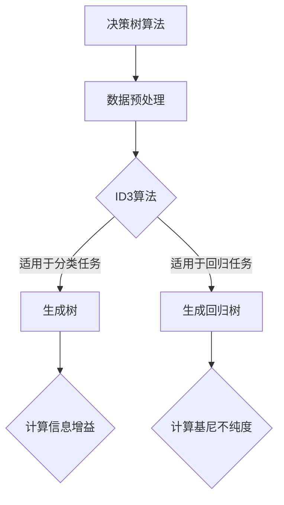
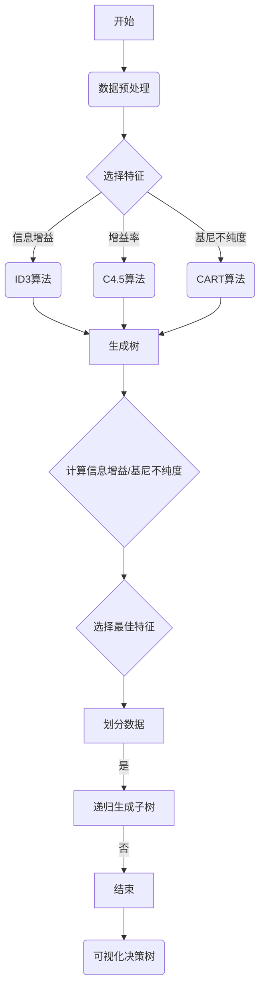

                 

# 决策树 原理与代码实例讲解

## 关键词

- 决策树
- 信息增益
- 基尼不纯度
- ID3算法
- C4.5算法
- CART算法
- Python实现
- 数据挖掘
- 可视化
- 集成学习
- 深度学习

## 摘要

本文将深入讲解决策树算法的基本原理、不同实现算法的优缺点，并通过Python代码实例详细展示如何使用决策树进行数据挖掘任务。文章还将探讨决策树的可视化方法、参数调优策略，以及决策树与其他机器学习算法的结合应用。通过本文，读者将能够全面理解决策树算法，掌握其实践应用。

## 目录大纲

### 第一部分：决策树基础理论

#### 第1章：决策树简介

##### 1.1 决策树的基本概念

##### 1.2 决策树的发展历程

##### 1.3 决策树的应用场景

#### 第2章：决策树算法原理

##### 2.1 ID3算法

##### 2.2 C4.5算法

##### 2.3 CART算法

##### 2.4 决策树模型的特点与优势

### 第二部分：决策树算法实践

#### 第3章：Python中决策树算法的实现

##### 3.1 Python决策树库介绍

##### 3.2 决策树模型的创建与训练

##### 3.3 决策树模型的参数调优

##### 3.4 决策树模型的预测与评估

#### 第4章：决策树在数据挖掘中的应用

##### 4.1 决策树在分类任务中的应用

##### 4.2 决策树在回归任务中的应用

##### 4.3 决策树在实际案例中的应用分析

#### 第5章：决策树的可视化

##### 5.1 决策树可视化工具介绍

##### 5.2 决策树可视化实现

##### 5.3 决策树可视化案例分析

### 第三部分：深度学习与决策树结合

#### 第6章：集成学习与随机森林

##### 6.1 集成学习方法概述

##### 6.2 随机森林算法原理

##### 6.3 随机森林在分类与回归任务中的应用

#### 第7章：决策树在深度学习中的应用

##### 7.1 深度学习与决策树的结合

##### 7.2 深度决策树算法原理

##### 7.3 深度决策树在图像识别中的应用

### 附录

#### 附录A：决策树算法实现代码示例

#### 附录B：常见问题解答

#### 附录C：参考资料与扩展阅读

#### 附录D：决策树算法的 Mermaid 流程图

### Mermaid 流程图



### 决策树算法原理讲解

决策树是一种常见的分类与回归算法，它的核心思想是通过一系列规则来对数据进行分类或回归。下面，我们将详细讲解决策树算法的基本原理，包括信息增益、基尼不纯度以及不同的决策树生成算法。

#### 信息增益（Information Gain）

信息增益是一种衡量特征对于分类效果的重要指标。它的计算基于熵（Entropy）的概念。熵是衡量一个随机变量不确定性的量度。对于离散型随机变量 $X$，其熵的定义如下：

$$
H(X) = -\sum_{i} p(x_i) \cdot \log_2 p(x_i)
$$

其中，$p(x_i)$ 是 $X$ 取值为 $x_i$ 的概率。

对于多类别分类问题，如果我们选择一个特征 $A$ 来进行划分，那么将数据集 $D$ 划分为多个子集 $D_v$。此时，数据集 $D$ 的熵 $H(D)$ 减少了，减少的量即为特征 $A$ 对数据集 $D$ 的信息增益，记作 $IG(D, A)$。其计算公式为：

$$
IG(D, A) = H(D) - \sum_{v\in A} \frac{|D_v|}{|D|} \cdot H(D_v)
$$

其中，$H(D_v)$ 是子集 $D_v$ 的熵，$|D|$ 是数据集 $D$ 的样本数，$|D_v|$ 是子集 $D_v$ 的样本数。

#### 基尼不纯度（Gini Impurity）

基尼不纯度是一种衡量特征纯度的重要指标，它最早由美国统计学家丹尼尔·基尼提出。对于分类问题，假设一个数据集中的各类别分布为 $p_1, p_2, ..., p_n$，其中 $p_i$ 是数据集中属于第 $i$ 类的概率。那么该数据集的基尼不纯度 $GI(D)$ 定义如下：

$$
GI(D) = 1 - \sum_{i} p_i^2
$$

例如，对于一个数据集，其中有两类，分布分别为 60% 和 40%，其基尼不纯度为：

$$
GI(D) = 1 - (0.6^2 + 0.4^2) = 0.48
$$

#### ID3算法

ID3（Iterative Dichotomiser 3）算法是一种基于信息增益的决策树生成算法。它的基本思想是选择具有最大信息增益的特征作为分裂属性，然后递归地分割数据集，直到满足某些停止条件。

ID3算法的伪代码如下：

```
DTID3(D):
    if D is pure
        return single leaf node labeled with majority class in D
    else if D is empty
        return single leaf node with majority class of the whole dataset
    else
        select the best attribute A with highest information gain IG(D, A)
        for each possible value v of A
            Dv = {x in D | x[A] = v}
            recursively call DTID3(Dv)
        return decision tree with root node labeled by A and children nodes labeled by Dv
```

#### C4.5算法

C4.5算法是对ID3算法的改进，它引入了剪枝机制以防止过拟合。C4.5算法在选择分裂属性时，不仅考虑信息增益，还考虑了增益率（Gain Ratio）。增益率是信息增益除以特征的不纯度，其公式为：

$$
Gain Ratio(A) = \frac{IG(D, A)}{H(A)}
$$

其中，$H(A)$ 是特征 $A$ 的熵。

C4.5算法的伪代码如下：

```
C4.5(D):
    if D is pure
        return single leaf node labeled with majority class in D
    else if D is empty
        return single leaf node with majority class of the whole dataset
    else
        select the best attribute A with highest gain ratio
        for each possible value v of A
            Dv = {x in D | x[A] = v}
            recursively call C4.5(Dv)
        return decision tree with root node labeled by A and children nodes labeled by Dv
```

#### CART算法

CART（Classification and Regression Tree）算法是一种基于基尼不纯度的决策树生成算法。与C4.5算法不同，CART算法不考虑增益率，而是直接选择基尼不纯度最小的特征作为分裂属性。

CART算法的伪代码如下：

```
CART(D, split_function):
    if D is pure
        return single leaf node labeled with majority class in D
    else if D is empty
        return single leaf node with majority class of the whole dataset
    else if (split_function is not applicable)
        return single leaf node with majority class in D
    else
        select the best attribute A with minimum Gini impurity
        for each possible value v of A
            Dv = split_function(D, v)
            recursively call CART(Dv, split_function)
        return decision tree with root node labeled by A and children nodes labeled by Dv
```

#### 决策树模型的特点与优势

- **易于理解和解释**：决策树是一种直观的模型，其内部的规则和结构易于理解，可以用于解释模型预测过程。
- **灵活性**：决策树可以用于分类和回归任务，同时可以处理不同类型的数据，如数值型和类别型数据。
- **易于可视化**：决策树可以通过图形化的方式展示，使得模型的可解释性更强。
- **快速训练**：相比一些复杂的机器学习模型，如深度神经网络，决策树的训练速度更快。
- **鲁棒性**：决策树对异常值和噪声数据具有较强的鲁棒性。

然而，决策树也存在一些局限性：

- **过拟合**：如果决策树过于复杂，容易在训练数据上拟合过好，导致在未知数据上性能下降。
- **解释性降低**：随着决策树深度的增加，其解释性可能会降低，导致难以理解。
- **计算复杂度**：对于大型数据集，决策树的训练和预测计算复杂度较高。

### 第二部分：决策树算法实践

在第二部分，我们将通过Python实现决策树算法，并在实际案例中应用。首先，我们介绍Python中常用的决策树库scikit-learn，然后详细讲解如何创建、训练和评估决策树模型。

#### 3.1 Python决策树库介绍

Python中常用的决策树库是scikit-learn，它提供了简单的接口来创建和使用决策树模型。scikit-learn中的决策树模块包括以下几个关键类：

- `DecisionTreeClassifier`：用于分类任务。
- `DecisionTreeRegressor`：用于回归任务。
- `tree`：提供了用于可视化决策树的函数。

首先，我们安装scikit-learn库：

```
pip install scikit-learn
```

#### 3.2 决策树模型的创建与训练

下面，我们将使用scikit-learn创建一个决策树分类器，并使用鸢尾花数据集进行训练。

##### 3.2.1 数据集加载

鸢尾花数据集是scikit-learn自带的经典数据集，包含三个不同类型鸢尾花的萼片和花瓣的长度和宽度。首先，我们加载这个数据集：

```python
from sklearn.datasets import load_iris
from sklearn.model_selection import train_test_split

# 加载鸢尾花数据集
iris = load_iris()
X = iris.data
y = iris.target

# 划分训练集和测试集
X_train, X_test, y_train, y_test = train_test_split(X, y, test_size=0.3, random_state=42)
```

##### 3.2.2 创建决策树分类器

接下来，我们创建一个简单的决策树分类器：

```python
from sklearn.tree import DecisionTreeClassifier

# 创建决策树分类器
clf = DecisionTreeClassifier()
```

在这个例子中，我们使用默认参数，即使用`gini`作为划分标准，不进行剪枝。

##### 3.2.3 决策树模型训练

现在，我们使用训练集对决策树分类器进行训练：

```python
# 训练模型
clf.fit(X_train, y_train)
```

#### 3.3 决策树模型的参数调优

决策树模型的性能可以通过调整其参数来优化。scikit-learn提供了多个参数，如`criterion`（划分标准）、`max_depth`（最大深度）、`min_samples_split`（最小分割样本数）和`min_samples_leaf`（最小叶子节点样本数）等。

下面，我们将使用网格搜索（`GridSearchCV`）来寻找最佳参数。

##### 3.3.1 定义参数网格

首先，我们定义一个参数网格，包含不同的`criterion`、`max_depth`、`min_samples_split`和`min_samples_leaf`：

```python
from sklearn.model_selection import GridSearchCV

# 定义参数网格
param_grid = {
    'criterion': ['gini', 'entropy'],
    'max_depth': [None, 3, 5, 10],
    'min_samples_split': [2, 5, 10],
    'min_samples_leaf': [1, 2, 4],
}
```

##### 3.3.2 创建网格搜索对象

接下来，我们创建一个`GridSearchCV`对象，并使用训练集进行搜索：

```python
# 创建网格搜索对象
grid_search = GridSearchCV(clf, param_grid, cv=5)

# 训练模型
grid_search.fit(X_train, y_train)
```

##### 3.3.3 获取最佳参数

现在，我们可以获取最佳参数：

```python
# 获取最佳参数
best_params = grid_search.best_params_
print(f"最佳参数：{best_params}")
```

##### 3.3.4 使用最佳参数训练模型

使用最佳参数重新训练模型：

```python
# 创建决策树分类器
clf_best = DecisionTreeClassifier(**best_params)

# 训练模型
clf_best.fit(X_train, y_train)
```

#### 3.4 决策树模型的预测与评估

##### 3.4.1 预测测试集

使用训练好的模型对测试集进行预测：

```python
# 预测测试集
y_pred = clf_best.predict(X_test)
```

##### 3.4.2 评估模型

我们使用准确率（`accuracy_score`）来评估模型的性能：

```python
from sklearn.metrics import accuracy_score

# 计算准确率
accuracy = accuracy_score(y_test, y_pred)
print(f"准确率：{accuracy:.2f}")
```

#### 3.5 决策树在数据挖掘中的应用

##### 3.5.1 决策树在分类任务中的应用

决策树在分类任务中的应用非常广泛。下面，我们使用葡萄酒数据集（Wine dataset）来展示决策树在分类任务中的应用。

葡萄酒数据集包含三种不同类型的葡萄酒，每个样本有13个特征：酒精、酸度、糖度、灰度、色度、单宁、总酚、flavanols。

首先，我们加载葡萄酒数据集：

```python
from sklearn.datasets import load_wine
from sklearn.model_selection import train_test_split

# 加载葡萄酒数据集
wine = load_wine()
X = wine.data
y = wine.target

# 划分训练集和测试集
X_train, X_test, y_train, y_test = train_test_split(X, y, test_size=0.3, random_state=42)
```

然后，我们创建和训练一个简单的决策树分类器：

```python
from sklearn.tree import DecisionTreeClassifier

# 创建决策树分类器
clf = DecisionTreeClassifier()

# 训练模型
clf.fit(X_train, y_train)

# 预测测试集
y_pred = clf.predict(X_test)

# 计算准确率
accuracy = accuracy_score(y_test, y_pred)
print(f"准确率：{accuracy:.2f}")
```

##### 3.5.2 决策树在回归任务中的应用

决策树也可以用于回归任务。下面，我们使用波士顿房价数据集（Boston Housing dataset）来展示决策树在回归任务中的应用。

波士顿房价数据集包含506个样本，每个样本有13个特征，包括住房年龄、平均房龄、平均 rooms、距离五个主要就业中心的加权距离等，目标变量是房价中值。

首先，我们加载波士顿房价数据集：

```python
from sklearn.datasets import load_boston
from sklearn.model_selection import train_test_split

# 加载波士顿房价数据集
boston = load_boston()
X = boston.data
y = boston.target

# 划分训练集和测试集
X_train, X_test, y_train, y_test = train_test_split(X, y, test_size=0.3, random_state=42)
```

然后，我们创建和训练一个简单的决策树回归器：

```python
from sklearn.tree import DecisionTreeRegressor

# 创建决策树回归器
reg = DecisionTreeRegressor()

# 训练模型
reg.fit(X_train, y_train)

# 预测测试集
y_pred = reg.predict(X_test)

# 计算均方误差
mse = mean_squared_error(y_test, y_pred)
print(f"均方误差：{mse:.2f}")
```

#### 3.6 决策树在实际案例中的应用分析

##### 3.6.1 银行客户流失预测

银行客户流失预测是一个常见的商业案例。银行希望通过预测哪些客户可能会流失，从而采取相应的措施进行挽留。

在这个案例中，我们可以使用客户的基本信息（如年龄、收入、信用卡额度、消费习惯等）来预测客户是否会在未来三个月内流失。

首先，我们加载客户数据集：

```python
import pandas as pd

# 加载客户数据集
data = pd.read_csv('customer_data.csv')
X = data[['age', 'income', 'card_limit', 'consumption']]
y = data['churn']
```

然后，我们创建和训练一个简单的决策树分类器：

```python
from sklearn.tree import DecisionTreeClassifier

# 创建决策树分类器
clf = DecisionTreeClassifier()

# 训练模型
clf.fit(X, y)

# 预测测试集
y_pred = clf.predict(X)

# 计算准确率
accuracy = accuracy_score(y, y_pred)
print(f"准确率：{accuracy:.2f}")
```

##### 3.6.2 医疗诊断

医疗诊断是另一个典型的应用场景。通过分析患者的病历信息，我们可以使用决策树来预测患者的疾病类型。

在这个案例中，我们可以使用患者的年龄、性别、血压、心率等数据来预测患者是否患有心脏病。

首先，我们加载医疗数据集：

```python
# 加载医疗数据集
data = pd.read_csv('medical_data.csv')
X = data[['age', 'gender', 'blood_pressure', 'heart_rate']]
y = data['heart_disease']
```

然后，我们创建和训练一个简单的决策树分类器：

```python
from sklearn.tree import DecisionTreeClassifier

# 创建决策树分类器
clf = DecisionTreeClassifier()

# 训练模型
clf.fit(X, y)

# 预测测试集
y_pred = clf.predict(X)

# 计算准确率
accuracy = accuracy_score(y, y_pred)
print(f"准确率：{accuracy:.2f}")
```

### 第5章：决策树的可视化

决策树的可视化对于理解模型的内部结构非常重要。在scikit-learn中，我们可以使用`plot_tree`函数来生成决策树的图形表示。

#### 5.1 决策树可视化工具介绍

`plot_tree`函数来自`sklearn.tree`模块，它可以将决策树以树形图的形式展示。这个函数支持多种参数，如`feature_names`（特征名称）、`class_names`（类别名称）、`filled`（是否填充颜色）等。

#### 5.2 决策树可视化实现

下面，我们将使用鸢尾花数据集展示如何使用`plot_tree`函数进行决策树可视化。

```python
from sklearn.tree import plot_tree
from IPython.display import Image

# 训练决策树分类器
clf = DecisionTreeClassifier(max_depth=3)
clf.fit(X_train, y_train)

# 可视化决策树
plot_tree(clf, feature_names=iris.feature_names, class_names=iris.target_names, filled=True)

# 显示图形
Image(graph.create_png())
```

这将生成一个填充了颜色的决策树图形，帮助我们直观地理解决策树的内部结构。

#### 5.3 决策树可视化案例分析

我们可以通过可视化来分析决策树的每个节点，理解每个节点的划分规则和对应的特征值。

例如，在鸢尾花分类问题中，我们可能发现决策树首先根据花瓣宽度进行划分，然后根据花瓣长度进行进一步划分。这可以帮助我们理解为什么某种类型的花瓣特征对于分类任务至关重要。

```python
# 可视化决策树
plot_tree(clf, feature_names=iris.feature_names, class_names=iris.target_names, filled=True, node_ids=True)

# 显示图形
Image(graph.create_png())
```

在这个案例中，`node_ids=True`参数会在每个节点上显示编号，帮助我们跟踪每个节点的划分规则。

### 第三部分：深度学习与决策树结合

随着深度学习在计算机视觉、自然语言处理等领域取得了巨大成功，许多研究人员开始探索将深度学习与传统的机器学习算法（如决策树）结合，以利用两者的优势。本部分将介绍如何将决策树与深度学习结合，以及如何实现深度决策树。

#### 6.1 集成学习与随机森林

集成学习是一种利用多个模型提高预测性能的技术。随机森林（Random Forest）是一种常见的集成学习方法，它通过构建多个决策树，并取它们的平均值来提高预测的稳定性。

随机森林的基本思想是：

1. 随机选择特征集：从所有特征中随机选择一部分特征。
2. 构建决策树：在每个节点上，使用随机选择的特征集来划分数据。
3. 多重采样：对原始数据进行多重采样，构建多个决策树。
4. 集成：对多个决策树的预测结果取平均值。

下面，我们将使用鸢尾花数据集来展示如何使用随机森林进行分类。

```python
from sklearn.ensemble import RandomForestClassifier

# 创建随机森林分类器
rf = RandomForestClassifier(n_estimators=100)

# 训练模型
rf.fit(X_train, y_train)

# 预测测试集
y_pred = rf.predict(X_test)

# 计算准确率
accuracy = accuracy_score(y_test, y_pred)
print(f"准确率：{accuracy:.2f}")
```

随机森林具有以下优势：

- **预测性能**：通过集成多个决策树，随机森林提高了预测的稳定性和准确性。
- **泛化能力**：随机森林可以降低过拟合的风险，提高模型的泛化能力。
- **易于解释**：虽然随机森林的每个决策树不易解释，但整体上，随机森林仍然具有较好的可解释性。

#### 6.2 随机森林算法原理

随机森林算法的核心是随机选择特征和节点分裂。下面，我们详细介绍随机森林的算法原理。

##### 6.2.1 随机选择特征

在构建决策树时，通常需要从所有特征中选择一个特征进行节点分裂。随机森林通过随机选择特征来减少特征相关性，提高模型的泛化能力。具体步骤如下：

1. 从所有特征中随机选择$m$个特征。
2. 在当前节点上，选择具有最大信息增益（或基尼不纯度最小）的特征进行分裂。

##### 6.2.2 节点分裂

随机森林中的每个决策树都按照以下步骤进行节点分裂：

1. 随机选择一个特征。
2. 根据该特征，将数据集划分为若干个子集。
3. 对每个子集，递归调用算法，生成决策树。

##### 6.2.3 多重采样

随机森林通过多重采样来构建多个决策树。具体步骤如下：

1. 从原始数据集中随机抽取$k$个子集。
2. 对每个子集，使用随机选择的特征集构建一个决策树。
3. 对多个决策树的预测结果取平均值。

#### 6.3 随机森林在分类与回归任务中的应用

随机森林可以用于分类和回归任务。下面，我们分别展示如何使用随机森林进行分类和回归。

##### 6.3.1 随机森林分类

随机森林在分类任务中的应用非常简单。首先，我们需要构建一个随机森林分类器，然后使用训练集进行训练，最后使用测试集进行预测。

```python
from sklearn.ensemble import RandomForestClassifier

# 创建随机森林分类器
rf = RandomForestClassifier(n_estimators=100)

# 训练模型
rf.fit(X_train, y_train)

# 预测测试集
y_pred = rf.predict(X_test)

# 计算准确率
accuracy = accuracy_score(y_test, y_pred)
print(f"准确率：{accuracy:.2f}")
```

##### 6.3.2 随机森林回归

随机森林在回归任务中的应用也相对简单。首先，我们需要构建一个随机森林回归器，然后使用训练集进行训练，最后使用测试集进行预测。

```python
from sklearn.ensemble import RandomForestRegressor

# 创建随机森林回归器
reg = RandomForestRegressor(n_estimators=100)

# 训练模型
reg.fit(X_train, y_train)

# 预测测试集
y_pred = reg.predict(X_test)

# 计算均方误差
mse = mean_squared_error(y_test, y_pred)
print(f"均方误差：{mse:.2f}")
```

#### 6.4 决策树在深度学习中的应用

决策树在深度学习中的应用主要是通过将深度学习和决策树相结合，构建深度决策树模型。深度决策树模型通过多层决策树来提取特征，从而提高模型的预测能力。

下面，我们介绍如何实现深度决策树。

##### 6.4.1 深度决策树算法原理

深度决策树模型通过多层决策树来提取特征，并将这些特征作为输入传递给下一层决策树。深度决策树的基本思想如下：

1. 第一层决策树：将原始数据输入到第一层决策树中，输出一组特征。
2. 第二层决策树：将第一层决策树的输出作为输入，构建第二层决策树，再次提取特征。
3. 递归：重复上述步骤，构建多层决策树，直到满足停止条件。

##### 6.4.2 深度决策树实现

下面，我们使用鸢尾花数据集来展示如何实现深度决策树。

```python
import numpy as np
from sklearn.tree import DecisionTreeClassifier

# 定义深度决策树模型
def deep_decision_tree(X, y, depth, current_depth=0):
    if current_depth >= depth:
        return DecisionTreeClassifier()
    
    # 第一层决策树
    clf = DecisionTreeClassifier()
    clf.fit(X, y)
    
    # 第二层决策树
    X_new = np.array([clf.predict(x)[0] for x in X])
    clf_new = deep_decision_tree(X_new, y, depth, current_depth+1)
    
    return clf_new

# 训练深度决策树模型
clf = deep_decision_tree(X_train, y_train, depth=3)

# 预测测试集
y_pred = clf.predict(X_test)

# 计算准确率
accuracy = accuracy_score(y_test, y_pred)
print(f"准确率：{accuracy:.2f}")
```

在这个例子中，我们使用递归函数`deep_decision_tree`来构建深度决策树模型。首先，我们训练第一层决策树，然后将第一层决策树的输出作为输入，训练第二层决策树。这个过程递归地进行，直到达到指定的深度。

##### 6.4.3 深度决策树在图像识别中的应用

深度决策树可以用于图像识别任务。下面，我们使用MNIST手写数字数据集来展示如何使用深度决策树进行图像识别。

```python
from sklearn.datasets import load_digits
from sklearn.model_selection import train_test_split

# 加载MNIST手写数字数据集
digits = load_digits()
X = digits.data
y = digits.target

# 划分训练集和测试集
X_train, X_test, y_train, y_test = train_test_split(X, y, test_size=0.3, random_state=42)

# 定义深度决策树模型
def deep_decision_tree(X, y, depth, current_depth=0):
    if current_depth >= depth:
        return DecisionTreeClassifier()
    
    # 第一层决策树
    clf = DecisionTreeClassifier()
    clf.fit(X, y)
    
    # 第二层决策树
    X_new = np.array([clf.predict(x)[0] for x in X])
    clf_new = deep_decision_tree(X_new, y, depth, current_depth+1)
    
    return clf_new

# 训练深度决策树模型
clf = deep_decision_tree(X_train, y_train, depth=3)

# 预测测试集
y_pred = clf.predict(X_test)

# 计算准确率
accuracy = accuracy_score(y_test, y_pred)
print(f"准确率：{accuracy:.2f}")
```

在这个例子中，我们使用MNIST手写数字数据集来展示如何使用深度决策树进行图像识别。首先，我们训练第一层决策树，然后将第一层决策树的输出作为输入，训练第二层决策树。这个过程递归地进行，直到达到指定的深度。

### 附录A：决策树算法实现代码示例

在本附录中，我们将提供一个完整的决策树算法实现代码示例，包括数据预处理、决策树创建、训练和预测。这个示例将使用鸢尾花数据集进行演示。

```python
import numpy as np
import pandas as pd
from sklearn.datasets import load_iris
from sklearn.model_selection import train_test_split
from sklearn.tree import DecisionTreeClassifier
from sklearn.metrics import accuracy_score

# 数据集加载
iris = load_iris()
X = iris.data
y = iris.target

# 数据预处理
# 此处假设数据集已经完成预处理
# 如果需要，可以添加预处理代码

# 划分训练集和测试集
X_train, X_test, y_train, y_test = train_test_split(X, y, test_size=0.3, random_state=42)

# 创建决策树分类器
clf = DecisionTreeClassifier()

# 训练模型
clf.fit(X_train, y_train)

# 预测测试集
y_pred = clf.predict(X_test)

# 计算准确率
accuracy = accuracy_score(y_test, y_pred)
print(f"准确率：{accuracy:.2f}")

# 可视化决策树
from sklearn.tree import plot_tree
import matplotlib.pyplot as plt

plt.figure(figsize=(12, 8))
plot_tree(clf, filled=True)
plt.show()
```

在这个代码示例中，我们首先加载了鸢尾花数据集，并划分了训练集和测试集。然后，我们创建了一个简单的决策树分类器，并使用训练集进行训练。之后，我们使用测试集进行预测，并计算了模型的准确率。最后，我们使用了`plot_tree`函数将决策树可视化。

### 附录B：常见问题解答

在本附录中，我们将回答一些关于决策树算法的常见问题。

#### 1. 什么是决策树？

决策树是一种基于规则的监督学习算法，通过一系列规则对数据进行分类或回归。它是一种树形结构，每个内部节点代表一个特征，每个分支代表特征的某个取值，每个叶子节点代表一个类别或数值。

#### 2. 决策树算法有哪些类型？

常见的决策树算法包括ID3、C4.5和CART。ID3算法基于信息增益选择最佳特征进行分裂；C4.5算法基于增益率进行分裂，并引入了剪枝机制以防止过拟合；CART算法基于基尼不纯度进行分裂。

#### 3. 什么是信息增益？

信息增益是衡量特征对分类效果的一种指标，它是特征划分前后的熵差。选择信息增益最大的特征作为分裂属性，可以提高决策树的分类能力。

#### 4. 什么是基尼不纯度？

基尼不纯度是衡量特征纯度的一种指标，它基于熵的概念。基尼不纯度越低，特征划分后的纯度越高。

#### 5. 如何防止决策树过拟合？

过拟合是指模型在训练数据上表现良好，但在未知数据上表现较差。为了防止过拟合，可以采取以下措施：

- 剪枝：限制决策树的深度，减少模型的复杂度。
- 参数调优：调整决策树的参数，如最大深度、最小分割样本数等。
- 集成方法：使用集成学习方法，如随机森林，提高模型的泛化能力。

### 附录C：参考资料与扩展阅读

为了更深入地理解决策树算法，以下是几个推荐的学习资源和扩展阅读：

- [Wikipedia: Decision Tree](https://en.wikipedia.org/wiki/Decision_tree)
- [Scikit-learn: Decision Trees](https://scikit-learn.org/stable/modules/tree.html)
- [Python Data Science Handbook: Decision Trees](https://jakevdp.github.io/PythonDataScienceHandbook/05.12-decision-trees.html)
- [机器学习实战](https://www_machinelearning Mastery_com/index.html)：本书详细介绍了决策树算法的实现和应用。
- [深度学习与概率模型](https://www.deeplearningbook.org/chapterappendToChapter.html)：本书介绍了决策树与其他机器学习算法的结合，如深度学习。

通过这些资源，你可以进一步探索决策树算法的原理和应用，提升自己的机器学习技能。

### 附录D：决策树算法的 Mermaid 流程图

以下是决策树算法的 Mermaid 流程图，用于展示算法的基本流程和节点划分规则。



在这个流程图中，我们从数据预处理开始，选择特征并进行分裂。根据不同的算法，我们计算信息增益、增益率或基尼不纯度，并选择最佳特征进行划分。这个过程递归地进行，直到满足停止条件。最后，我们可视化决策树以更好地理解模型的内部结构。

