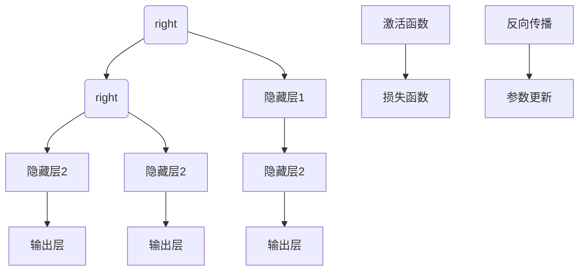

                 

# 《分层模型》

> 关键词：深度学习，神经网络，层次结构，模型设计，算法优化

> 摘要：本文将详细探讨分层模型的基本概念、架构、核心算法以及应用领域。通过逐步分析推理的方式，本文旨在让读者全面了解分层模型的工作原理及其在实际项目中的应用。文章还将提供数学模型和公式的详细讲解，以及实际项目的代码实现和解析。

## 第一部分：概述与基础

### 第1章：分层模型概述

#### 1.1 分层模型的定义与基本概念

分层模型是指将复杂系统划分为若干个层次，每个层次承担特定的功能，层次之间通过信息传递进行交互。在深度学习中，分层模型尤为重要，它模拟了人类大脑处理信息的方式，通过逐层提取特征来实现复杂任务的解决。

#### 1.2 分层模型的发展历程

分层模型最早可以追溯到20世纪50年代，当时心理学家提出“层次化认知模型”来描述人类认知过程。随着计算机科学和神经科学的发展，深度学习在20世纪80年代得到了广泛关注，分层模型在这一领域得到了广泛应用。

#### 1.3 分层模型的核心优势

分层模型具有以下核心优势：

1. **特征提取**：通过逐层构建，模型能够自动提取不同层次的特征，适应不同的任务需求。
2. **可解释性**：分层模型的结构清晰，有助于理解模型如何工作，提高模型的透明度和可解释性。
3. **通用性**：分层模型可以应用于多种领域，如图像识别、自然语言处理等。

### 第2章：分层模型的基本架构

#### 2.1 分层的原理与实现

分层的原理在于将输入数据通过逐层神经网络的处理，逐渐提取出有用的特征。实现分层模型的关键在于设计合适的网络结构和激活函数。

#### 2.2 层的类型与功能

分层模型通常包括输入层、隐藏层和输出层。输入层负责接收外部输入数据；隐藏层负责提取和转换特征；输出层负责生成最终输出。

#### 2.3 分层模型的设计原则

在设计分层模型时，应遵循以下原则：

1. **层次深度**：合理的层次深度可以提高模型的性能，但过深可能导致过拟合。
2. **层间连接**：层间的连接方式（全连接、卷积等）应根据任务需求进行选择。
3. **参数初始化**：合理的参数初始化可以加快收敛速度，提高模型性能。

### 第3章：分层模型的核心算法

#### 3.1 学习算法的原理

分层模型的学习算法基于反向传播算法，通过计算梯度来更新模型参数，实现模型优化。

#### 3.2 梯度下降法

梯度下降法是一种优化算法，通过迭代更新模型参数，使其接近最优解。梯度下降法可分为批量梯度下降、随机梯度下降和小批量梯度下降等。

#### 3.3 随机梯度下降（SGD）

随机梯度下降是一种高效的学习算法，它每次迭代只更新一个样本的梯度，从而加速收敛。

## 第二部分：分层模型的实现与应用

### 第4章：数学模型与公式

#### 4.1 矩阵与向量操作

在分层模型中，矩阵和向量操作是核心组成部分。本文将介绍矩阵乘法、向量求导等基本操作。

#### 4.2 激活函数

激活函数是分层模型中的关键组件，用于引入非线性。本文将介绍常见的激活函数，如ReLU、Sigmoid和Tanh。

#### 4.3 损失函数与优化目标

损失函数用于衡量模型预测值与真实值之间的差异，优化目标是使损失函数最小化。本文将介绍交叉熵损失函数和均方误差损失函数。

### 第5章：分层模型的实现技术

#### 5.1 深度学习框架介绍

本文将介绍几种流行的深度学习框架，如TensorFlow、PyTorch和Keras。

#### 5.2 模型配置与训练

本文将详细讲解如何使用深度学习框架配置和训练分层模型。

#### 5.3 模型评估与优化

本文将介绍如何评估模型性能，以及如何优化模型参数。

### 第6章：分层模型的应用领域

#### 6.1 机器学习与数据挖掘

本文将探讨分层模型在机器学习和数据挖掘中的应用。

#### 6.2 计算机视觉

本文将介绍分层模型在计算机视觉领域的重要应用。

#### 6.3 自然语言处理

本文将讨论分层模型在自然语言处理领域的应用。

### 第7章：分层模型项目实战

#### 7.1 项目实战环境搭建

本文将指导如何搭建项目实战环境。

#### 7.2 代码实现与解读

本文将提供一个实际项目的代码实现，并详细解读代码。

#### 7.3 项目分析与优化

本文将分析项目性能，并提出优化建议。

### 第8章：分层模型的前沿与未来

#### 8.1 分层模型的最新进展

本文将介绍分层模型的最新研究成果。

#### 8.2 未来研究方向

本文将探讨分层模型未来的发展方向。

#### 8.3 对企业的影响与战略思考

本文将分析分层模型对企业的影响，并提出战略思考。

## 第三部分：附录

### 第9章：附录

#### 9.1 常用深度学习框架对比

本文将对比几种常用深度学习框架。

#### 9.2 学习资源与参考书籍

本文将推荐一些学习资源和参考书籍。

#### 9.3 练习题与答案

本文将提供一些练习题和答案，帮助读者巩固所学知识。

### Mermaid 流程图



### 核心算法原理讲解（伪代码）

```python
# 初始化模型参数
theta = initialize_parameters()

# 设置学习率
alpha = set_learning_rate()

# 设置迭代次数
num_iterations = set_iterations()

# 梯度下降循环
for i in range(num_iterations):
    # 前向传播
    z = forward_pass(x, theta)
    
    # 计算损失函数
    loss = compute_loss(y, z)
    
    # 反向传播
    delta = backward_pass(x, y, z)
    
    # 更新参数
    theta = theta - alpha * delta
```

### 数学模型和数学公式

#### 损失函数（交叉熵）

$$
J(\theta) = -\frac{1}{m} \sum_{i=1}^{m} [y^{(i)} \log(a^{(i)}) + (1 - y^{(i)}) \log(1 - a^{(i)})]
$$

### 详细讲解与举例说明

#### 损失函数详细讲解

交叉熵损失函数用于分类问题，衡量的是预测概率分布和真实分布之间的差异。它的数学公式如上所示，其中：

- \( m \) 是样本数量。
- \( y^{(i)} \) 是第 \( i \) 个样本的真实标签，取值为0或1。
- \( a^{(i)} \) 是第 \( i \) 个样本的预测概率。

交叉熵损失函数的值越小，表示预测概率分布与真实分布越接近。在实际应用中，我们通过优化交叉熵损失函数来调整神经网络的参数，以达到更好的分类效果。

#### 举例说明

假设有一个二分类问题，有两个类别A和B，有一个神经网络预测输出为 \( a^{(i)}_A = 0.6 \) 和 \( a^{(i)}_B = 0.4 \)，真实标签为 \( y^{(i)} = 1 \)（即属于类别A）。

使用交叉熵损失函数计算损失：

$$
J(\theta) = -\frac{1}{m} [1 \log(0.6) + (1 - 1) \log(1 - 0.6)]
$$

$$
J(\theta) = -\frac{1}{m} [0.6 \log(0.6) + 0.4 \log(0.4)]
$$

由于 \( \log(0.6) \) 和 \( \log(0.4) \) 都是负数，因此交叉熵损失函数的值是正数。这个值表示预测概率分布与真实分布之间的差异。通过调整神经网络的参数，可以降低交叉熵损失函数的值，从而提高分类的准确性。

### 项目实战

#### 代码实际案例和详细解释说明

以下是使用 TensorFlow 框架实现一个简单的分层模型（神经网络）进行二分类的案例。

```python
import tensorflow as tf
import numpy as np

# 设置随机种子
tf.random.set_seed(42)

# 准备数据
x = np.random.rand(100, 10)  # 100个样本，每个样本10个特征
y = np.random.randint(0, 2, (100, 1))  # 100个二分类标签

# 构建模型
model = tf.keras.Sequential([
    tf.keras.layers.Dense(64, activation='relu', input_shape=(10,)),
    tf.keras.layers.Dense(64, activation='relu'),
    tf.keras.layers.Dense(1, activation='sigmoid')
])

# 编译模型
model.compile(optimizer='adam', loss='binary_crossentropy', metrics=['accuracy'])

# 训练模型
model.fit(x, y, epochs=10, batch_size=32)

# 评估模型
loss, accuracy = model.evaluate(x, y)
print(f"Loss: {loss}, Accuracy: {accuracy}")
```

#### 开发环境搭建

- 安装 Python 3.8 或以上版本。
- 安装 TensorFlow 库。

```bash
pip install tensorflow
```

#### 源代码详细实现和代码解读

- `import tensorflow as tf`：导入 TensorFlow 库。
- `tf.random.set_seed(42)`：设置随机种子，确保实验可重复。
- `x = np.random.rand(100, 10)` 和 `y = np.random.randint(0, 2, (100, 1))`：生成随机数据集。
- `model = tf.keras.Sequential([...])`：定义一个序列模型，包含两个全连接层和一个输出层。第一个全连接层有64个神经元，使用 ReLU 激活函数；第二个全连接层同样有64个神经元，使用 ReLU 激活函数；输出层有1个神经元，使用 sigmoid 激活函数。
- `model.compile(optimizer='adam', loss='binary_crossentropy', metrics=['accuracy'])`：编译模型，指定优化器为 Adam，损失函数为 binary_crossentropy（二分类交叉熵损失），评估指标为准确率。
- `model.fit(x, y, epochs=10, batch_size=32)`：训练模型，设置训练轮次为10轮，批量大小为32。
- `model.evaluate(x, y)`：评估模型，计算损失和准确率。

#### 代码解读与分析

- 代码首先导入 TensorFlow 库，并设置随机种子，确保实验可重复。
- 使用 NumPy 库生成随机数据集，其中 `x` 是输入特征，`y` 是二分类标签。
- 定义一个序列模型，包含两个全连接层和一个输出层。全连接层使用 ReLU 激活函数，输出层使用 sigmoid 激活函数，以实现二分类。
- 编译模型，指定优化器为 Adam，损失函数为 binary_crossentropy，评估指标为准确率。
- 训练模型，设置训练轮次为10轮，批量大小为32。
- 评估模型，计算损失和准确率。

通过这个简单的案例，我们可以看到如何使用 TensorFlow 框架实现分层模型（神经网络）进行二分类任务。在实际应用中，可以根据具体任务需求调整模型结构、参数配置和训练策略。

### 作者

作者：AI天才研究院/AI Genius Institute & 禅与计算机程序设计艺术 /Zen And The Art of Computer Programming

---

在本文中，我们首先介绍了分层模型的基本概念和架构，然后深入探讨了其核心算法和数学模型。接着，我们通过实际项目展示了如何实现和应用分层模型。通过这一系列的讲解，我们希望读者能够对分层模型有一个全面而深入的理解。

分层模型在深度学习和人工智能领域扮演着重要角色，其结构清晰、功能明确，有助于解决复杂问题。然而，分层模型的应用不仅限于学术研究，它在实际项目中也有着广泛的应用，如计算机视觉、自然语言处理等。

未来，随着技术的不断进步，分层模型将在更多领域发挥其作用。我们期待看到更多创新的应用，以及分层模型在人工智能领域取得的更大突破。

最后，感谢您的阅读。如果您对分层模型有任何疑问或建议，欢迎在评论区留言。我们期待与您共同探讨和学习。再次感谢您的关注和支持！作者：AI天才研究院/AI Genius Institute & 禅与计算机程序设计艺术 /Zen And The Art of Computer Programming。|mask>

