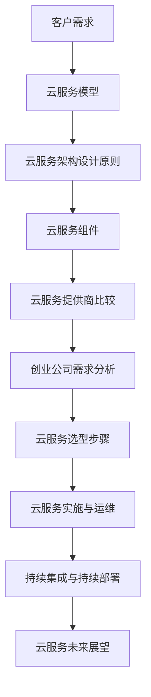
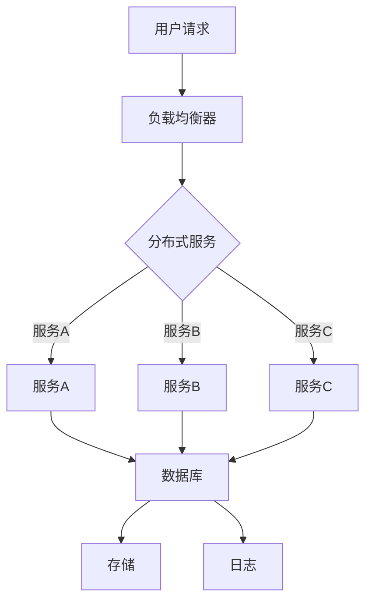

                 

## 《创业公司的云服务选型策略》

### 关键词：创业公司、云服务、选型策略、云计算、技术架构、成本效益分析

#### 摘要：
在快速发展的科技时代，创业公司面临着前所未有的挑战和机遇。云服务的兴起为创业公司提供了强大的基础设施支持，帮助企业快速迭代产品、降低成本、提高效率。本文将深入探讨创业公司在选择云服务时的关键策略，从基础知识的了解、需求分析、选型步骤、案例研究到实施与运维，全面解析如何实现云服务的最优选型，助力创业公司成功应对市场变化，实现持续成长。

### 目录

#### 第一部分：云服务基础知识

- **第1章：云服务概述**
  - 1.1 云计算的发展历程
  - 1.2 云服务的类型
  - 1.3 云服务的优点与挑战
  - 1.4 创业公司采用云服务的必要性

- **第2章：云服务架构**
  - 2.1 云服务模型
  - 2.2 云服务架构设计原则
  - 2.3 云服务组件
  - 2.4 云服务架构示例

- **第3章：云服务提供商**
  - 3.1 主流云服务提供商
  - 3.2 云服务提供商比较
  - 3.3 选择云服务提供商的考虑因素

#### 第二部分：云服务选型策略

- **第4章：创业公司需求分析**
  - 4.1 创业公司业务特点
  - 4.2 创业公司IT需求
  - 4.3 创业公司预算限制
  - 4.4 创业公司技术储备

- **第5章：云服务选型步骤**
  - 5.1 明确业务需求
  - 5.2 确定技术要求
  - 5.3 比较不同云服务提供商
  - 5.4 制定云服务方案
  - 5.5 实施与评估

- **第6章：云服务案例研究**
  - 6.1 成功案例分享
  - 6.2 失败案例分析
  - 6.3 案例启示

- **第7章：云服务管理策略**
  - 7.1 云服务监控与优化
  - 7.2 云服务成本管理
  - 7.3 云服务安全与合规
  - 7.4 云服务团队建设

#### 第三部分：云服务实施与运维

- **第8章：云服务实施策略**
  - 8.1 云服务迁移策略
  - 8.2 云服务部署与配置
  - 8.3 云服务集成与调试
  - 8.4 云服务测试与验收

- **第9章：云服务运维管理**
  - 9.1 云服务运维团队职责
  - 9.2 云服务运维流程
  - 9.3 云服务故障管理
  - 9.4 云服务性能优化

- **第10章：云服务持续集成与持续部署**
  - 10.1 持续集成与持续部署概述
  - 10.2 持续集成与持续部署工具
  - 10.3 持续集成与持续部署实践

- **第11章：云服务未来展望**
  - 11.1 云服务发展趋势
  - 11.2 创业公司云服务发展方向
  - 11.3 云服务创新与挑战

### 附录

- **附录 A：常用云服务参考资料**
  - A.1 云服务协议与合同
  - A.2 云服务常见问题解答
  - A.3 云服务社区与资源

---

接下来，我们将按照目录大纲的顺序，逐章介绍创业公司在选择云服务时的关键策略和方法。

---

**核心概念与联系：**

在探讨云服务选型策略之前，我们先来梳理一下核心概念及其相互联系。使用 Mermaid 流程图，我们可以直观地展示云服务的基础架构和关键组件。

### 云服务模型

云服务模型是云服务架构的核心，它定义了服务提供者和消费者之间的交互方式。常见的云服务模型包括：

- **基础设施即服务（IaaS）**：提供虚拟化计算资源，如虚拟机、存储和网络。
- **平台即服务（PaaS）**：提供一个开发平台，包括操作系统、数据库、Web服务器等。
- **软件即服务（SaaS）**：提供应用程序服务，用户无需管理底层基础设施。

### 云服务架构设计原则

云服务架构设计需要考虑弹性、可扩展性、可靠性和安全性。设计原则包括：

- **微服务架构**：将应用程序分解为独立的、可重用的服务，提高系统的可维护性和扩展性。
- **容器化技术**：使用容器（如 Docker）实现应用程序的轻量级封装，便于部署和管理。
- **自动化**：采用自动化工具（如 Kubernetes）进行容器编排，提高部署和运维效率。

### 云服务组件

云服务组件包括虚拟机、容器、网络、存储等。以下是几个关键组件的简要描述：

- **虚拟机（VM）**：提供隔离的操作系统环境，支持多种操作系统和软件。
- **容器（Container）**：轻量级的封装单元，包含运行应用程序所需的所有依赖和环境。
- **网络（Networking）**：提供虚拟网络和负载均衡功能，确保服务的高可用性和可靠性。
- **存储（Storage）**：提供持久化存储解决方案，如对象存储、块存储和文件存储。

### 云服务提供商比较

主流的云服务提供商包括 AWS、Azure、Google Cloud 等。以下是这些提供商的主要特点和优缺点：

- **AWS**：市场占有率最高，提供丰富的服务和功能，但价格相对较高。
- **Azure**：微软提供的云服务，与微软生态系统紧密集成，适合已有微软产品使用的公司。
- **Google Cloud**：技术先进，提供创新的解决方案，但市场占有率相对较低。

### 创业公司需求分析

创业公司的需求分析是云服务选型的重要环节。以下是一些关键需求：

- **业务特点**：包括产品类型、目标市场、业务增长速度等。
- **IT需求**：包括硬件资源、软件平台、数据存储和安全等。
- **预算限制**：预算直接影响云服务的选型和采购策略。
- **技术储备**：团队的技术能力和对云服务的熟悉程度。

---

在下一章节，我们将深入探讨云服务的基础知识，包括云计算的发展历程、云服务的类型、优点与挑战，以及创业公司采用云服务的必要性。

---

## 第一部分：云服务基础知识

### 第1章：云服务概述

#### 1.1 云计算的发展历程

云计算的发展历程可以追溯到20世纪60年代，当时计算机科学家约翰·麦克卡斯基（John McCarthy）提出了“时间共享”的理念，即多台计算机可以共享资源，提高效率。随着互联网的普及和技术的发展，云计算逐渐从概念走向实际应用。

- **20世纪90年代**：虚拟化技术开始出现，如 VMware 的虚拟化解决方案，使得服务器资源的利用效率大幅提升。
- **2006年**：亚马逊推出了 Amazon Web Services（AWS），提供云计算服务，标志着云计算商业时代的开始。
- **2010年代**：微软、谷歌等巨头纷纷加入云计算市场，云服务逐渐成为企业IT基础设施的重要部分。
- **2020年代**：随着 5G、物联网和人工智能技术的发展，云计算的应用场景更加丰富，成为数字经济的重要驱动力。

#### 1.2 云服务的类型

云服务可以分为以下几种类型：

- **基础设施即服务（IaaS）**：提供虚拟化计算资源，如虚拟机、存储和网络。用户可以根据需求灵活配置资源。
- **平台即服务（PaaS）**：提供一个开发平台，包括操作系统、数据库、Web服务器等。开发者可以专注于应用程序的开发，无需关注底层基础设施。
- **软件即服务（SaaS）**：提供应用程序服务，用户无需管理底层基础设施。典型的例子包括电子邮件、办公软件和客户关系管理（CRM）系统。
- **功能即服务（FaaS）**：提供函数级的服务，开发者可以按需调用函数，无需管理底层基础设施。

#### 1.3 云服务的优点与挑战

云服务的优点包括：

- **成本效益**：企业无需购买和维护昂贵的硬件设备，可以降低成本。
- **弹性**：根据业务需求，可以动态调整资源，提高效率。
- **可靠性**：云服务提供商通常提供高可用性保障，确保服务不中断。
- **灵活性**：支持多种操作系统、编程语言和数据库，满足不同企业的需求。

然而，云服务也面临一些挑战：

- **安全性**：云服务的数据安全是企业最关心的问题，需要采取有效的安全措施。
- **依赖性**：企业对云服务提供商的依赖度较高，一旦服务提供商出现问题，可能会影响到企业的运营。
- **数据迁移**：从现有基础设施迁移到云服务可能需要大量时间和资源。
- **法规遵从性**：不同国家和地区的法律法规对云服务的合规性要求不同，企业需要确保遵守相关法规。

#### 1.4 创业公司采用云服务的必要性

对于创业公司来说，采用云服务具有以下几个必要性：

- **快速迭代**：云服务提供灵活的部署和扩展能力，可以帮助创业公司快速迭代产品，抢占市场先机。
- **降低成本**：创业公司通常资金有限，采用云服务可以降低硬件和运维成本，专注于核心业务。
- **提高效率**：云服务提供丰富的工具和平台，可以帮助创业公司提高开发效率，缩短产品上市时间。
- **技术支持**：云服务提供商通常提供专业的技术支持和培训，可以帮助创业公司提升技术能力。

---

在下一章节，我们将深入探讨云服务架构的设计原则、模型和组件，帮助创业公司更好地理解云服务的内部运作。

---

### 第2章：云服务架构

#### 2.1 云服务模型

云服务模型是构建云服务架构的基础。常见的云服务模型包括基础设施即服务（IaaS）、平台即服务（PaaS）和软件即服务（SaaS）。

- **基础设施即服务（IaaS）**：IaaS 提供虚拟化计算资源，如虚拟机、存储和网络。用户可以根据需求灵活配置资源，如 CPU、内存和存储容量。IaaS 适用于需要高度定制化的应用场景，如大数据分析和高性能计算。

  **示例**：Amazon EC2、Google Compute Engine、Microsoft Azure VM。

- **平台即服务（PaaS）**：PaaS 提供一个开发平台，包括操作系统、数据库、Web服务器等。开发者可以专注于应用程序的开发，无需关注底层基础设施。PaaS 适用于需要快速开发和部署的应用场景，如移动应用和 Web 应用。

  **示例**：Google App Engine、Microsoft Azure App Service、Heroku。

- **软件即服务（SaaS）**：SaaS 提供应用程序服务，用户无需管理底层基础设施。SaaS 适用于需要即时使用和无需维护的应用场景，如电子邮件服务和客户关系管理（CRM）系统。

  **示例**：Salesforce、Microsoft Office 365、Google Workspace。

#### 2.2 云服务架构设计原则

云服务架构设计需要遵循以下原则，以确保系统的弹性、可扩展性、可靠性和安全性：

- **微服务架构**：将应用程序分解为独立的、可重用的服务，每个服务负责一个特定的业务功能。这种架构可以提高系统的可维护性和扩展性，便于分布式部署和运维。

  **示例**：Netflix、Uber、阿里巴巴。

- **容器化技术**：使用容器（如 Docker）实现应用程序的轻量级封装，包含运行应用程序所需的所有依赖和环境。容器化技术可以提高部署和运维的效率，便于实现自动化和持续集成。

  **示例**：Docker、Kubernetes。

- **自动化**：采用自动化工具（如 Kubernetes）进行容器编排，自动化管理应用程序的生命周期。自动化可以提高运维效率，减少人工干预，降低出错概率。

  **示例**：Kubernetes、Ansible。

- **分布式系统**：使用分布式系统架构，确保系统的高可用性和容错能力。分布式系统可以将应用程序部署在多个服务器上，提高系统的可靠性和性能。

  **示例**：Apache Kafka、Apache ZooKeeper。

- **安全性**：采用安全设计原则，确保系统的安全性。包括数据加密、访问控制、网络安全等。

  **示例**：SSL/TLS、OAuth 2.0。

- **可观测性**：采用可观测性设计原则，确保系统的可监控性和可诊断性。包括日志记录、性能监控、错误报告等。

  **示例**：ELK Stack、Prometheus。

#### 2.3 云服务组件

云服务组件是构建云服务架构的基本元素。以下是几个关键组件的简要描述：

- **虚拟机（VM）**：虚拟机提供隔离的操作系统环境，支持多种操作系统和软件。虚拟机适用于需要高度定制化和隔离的应用场景。

  **示例**：Amazon EC2、Google Compute Engine、Microsoft Azure VM。

- **容器（Container）**：容器是轻量级的封装单元，包含运行应用程序所需的所有依赖和环境。容器适用于需要快速部署和扩展的应用场景。

  **示例**：Docker、Kubernetes。

- **网络（Networking）**：网络提供虚拟网络和负载均衡功能，确保服务的高可用性和可靠性。网络适用于需要分布式部署和跨区域访问的应用场景。

  **示例**：AWS VPC、Azure Virtual Network、Google Cloud VPC。

- **存储（Storage）**：存储提供持久化存储解决方案，如对象存储、块存储和文件存储。存储适用于需要数据存储和备份的应用场景。

  **示例**：Amazon S3、Azure Blob Storage、Google Cloud Storage。

- **数据库（Database）**：数据库提供数据存储和管理功能，支持多种数据模型和查询语言。数据库适用于需要数据存储和查询的应用场景。

  **示例**：MySQL、PostgreSQL、MongoDB。

#### 2.4 云服务架构示例

以下是一个典型的云服务架构示例，用于说明如何构建一个分布式、高可用、安全的云服务：

在该示例中，用户请求通过负载均衡器分发到多个分布式服务（服务A、服务B、服务C）。每个服务负责处理特定的业务功能，并与数据库和存储进行交互。日志记录和监控确保系统的可观测性和可维护性。

---

在下一章节，我们将探讨如何选择适合创业公司的云服务提供商，并分析不同提供商的特点和优劣。

---

### 第3章：云服务提供商

#### 3.1 主流云服务提供商

目前市场上主流的云服务提供商包括亚马逊 AWS、微软 Azure、谷歌云 Google Cloud、阿里云 Alibaba Cloud、腾讯云 Tencent Cloud 等。以下是对这些提供商的简要介绍：

- **亚马逊 AWS**：AWS 是全球最大的云服务提供商，提供广泛的云服务，包括 IaaS、PaaS 和 SaaS。AWS 的优势在于丰富的服务种类、灵活的定价模式和强大的生态系统。

  **优势**：
  - 丰富的服务种类：涵盖 IaaS、PaaS、SaaS、数据库、人工智能、大数据等。
  - 灵活的定价模式：按需付费、预留实例、节约计划等。
  - 强大的生态系统：提供丰富的开发工具、开源支持和合作伙伴网络。

  **劣势**：
  - 价格较高：尤其是在高并发和大量数据处理场景下。
  - 集成难度：与其他系统的集成可能需要额外的开发和配置。

- **微软 Azure**：Azure 是微软的云服务品牌，提供与微软生态系统紧密集成的云服务。Azure 的优势在于与 Microsoft 365、Azure AD 等产品的无缝集成，适合已有微软产品使用的公司。

  **优势**：
  - 与 Microsoft 生态系统紧密集成：易于集成 Microsoft 365、Azure AD 等产品。
  - 强大的云服务功能：涵盖 IaaS、PaaS、SaaS、数据库、人工智能等。
  - 丰富的开发工具：提供 .NET、PowerShell、Azure SDK 等开发工具。

  **劣势**：
  - 市场占有率较低：相较于 AWS 和 Google Cloud。
  - 集成成本：与其他系统的集成可能需要额外的开发和配置。

- **谷歌云 Google Cloud**：Google Cloud 是谷歌的云服务品牌，提供先进的技术和创新的解决方案。Google Cloud 的优势在于强大的机器学习、人工智能和大数据能力。

  **优势**：
  - 先进的机器学习和人工智能技术：提供丰富的机器学习和深度学习工具。
  - 大数据解决方案：提供 Hadoop、Spark、Kubernetes 等大数据解决方案。
  - 优秀的性能和可靠性：提供全球分布的数据中心和强大的基础设施。

  **劣势**：
  - 市场占有率较低：相较于 AWS 和 Azure。
  - 成本较高：尤其是在高并发和大量数据处理场景下。

- **阿里云 Alibaba Cloud**：阿里云是中国的云服务提供商，提供全球范围内的云服务。阿里云的优势在于强大的电商和金融背景，以及丰富的本地化服务。

  **优势**：
  - 丰富的本地化服务：覆盖中国和全球多个地区。
  - 强大的电商和金融能力：为电商和金融行业提供定制化的解决方案。
  - 低成本：相较于 AWS 和 Google Cloud，成本较低。

  **劣势**：
  - 国际市场占有率较低：相较于 AWS 和 Google Cloud。
  - 集成难度：与其他系统的集成可能需要额外的开发和配置。

- **腾讯云 Tencent Cloud**：腾讯云是腾讯的云服务品牌，提供全球范围内的云服务。腾讯云的优势在于强大的社交和游戏背景，以及丰富的本地化服务。

  **优势**：
  - 丰富的本地化服务：覆盖中国和全球多个地区。
  - 强大的社交和游戏能力：为社交和游戏行业提供定制化的解决方案。
  - 低成本：相较于 AWS 和 Google Cloud，成本较低。

  **劣势**：
  - 国际市场占有率较低：相较于 AWS 和 Google Cloud。
  - 集成难度：与其他系统的集成可能需要额外的开发和配置。

#### 3.2 云服务提供商比较

以下是主流云服务提供商的比较表格，帮助创业公司选择最适合的提供商：

| 提供商 | 服务种类 | 定价模式 | 优势 | 劣势 |
| :---: | :---: | :---: | :---: | :---: |
| AWS | IaaS、PaaS、SaaS | 按需付费、预留实例、节约计划 | 丰富的服务种类、灵活的定价模式、强大的生态系统 | 价格较高、集成难度 |
| Azure | IaaS、PaaS、SaaS | 按需付费、预留实例、节约计划 | 与 Microsoft 生态系统紧密集成、强大的云服务功能、丰富的开发工具 | 市场占有率较低、集成成本 |
| Google Cloud | IaaS、PaaS、SaaS | 按需付费、预留实例、节约计划 | 先进的机器学习和人工智能技术、大数据解决方案、优秀的性能和可靠性 | 市场占有率较低、成本较高 |
| 阿里云 | IaaS、PaaS、SaaS | 按需付费、预留实例、节约计划 | 丰富的本地化服务、强大的电商和金融能力、低成本 | 国际市场占有率较低、集成难度 |
| 腾讯云 | IaaS、PaaS、SaaS | 按需付费、预留实例、节约计划 | 丰富的本地化服务、强大的社交和游戏能力、低成本 | 国际市场占有率较低、集成难度 |

#### 3.3 选择云服务提供商的考虑因素

选择云服务提供商时，创业公司需要考虑以下因素：

- **业务需求**：了解业务需求，包括所需的云服务类型、性能要求、数据安全性等。
- **预算**：根据预算范围选择合适的云服务提供商，考虑按需付费、预留实例等定价模式。
- **技术储备**：评估团队的技术能力，选择与团队技术栈相匹配的云服务提供商。
- **服务范围**：考虑云服务提供商在全球或特定地区的服务范围，确保能够满足业务需求。
- **可靠性**：了解云服务提供商的可靠性指标，包括数据中心的地理位置、备份和恢复策略等。
- **安全性和合规性**：了解云服务提供商的安全性和合规性措施，确保数据安全和符合相关法规。
- **客户支持**：评估云服务提供商的客户支持服务质量，包括技术支持、响应时间和服务质量等。
- **生态系统**：考虑云服务提供商的生态系统，包括合作伙伴、开发者社区、开源支持等。

---

在下一章节，我们将探讨如何分析创业公司的需求，为云服务选型提供基础。

---

### 第4章：创业公司需求分析

#### 4.1 创业公司业务特点

创业公司的业务特点对云服务选型具有重要影响。了解业务特点可以帮助我们确定所需的云服务类型、性能要求、数据安全性等。以下是创业公司常见的业务特点：

- **产品类型**：创业公司的产品类型可以是软件、硬件、服务等多种形式。不同类型的产品对云服务的要求有所不同，如软件产品可能需要高可用性和快速迭代，硬件产品可能需要高性能计算和大规模数据处理。
- **目标市场**：创业公司的目标市场可以是本地、国内或国际市场。目标市场的不同可能导致数据存储和传输的需求有所不同，如国际市场可能需要跨国数据传输的支持。
- **业务增长速度**：创业公司的业务增长速度可能非常快，也可能较为平稳。业务增长速度对云服务的弹性要求较高，需要选择能够快速扩展和缩放的云服务。
- **客户群体**：创业公司的客户群体可能包括个人、企业或政府等。不同类型的客户群体可能对数据安全和隐私有不同的要求，需要选择符合相关法规的云服务。
- **竞争优势**：创业公司的竞争优势可能在于技术创新、产品功能、服务质量等方面。云服务的选择需要支持竞争优势的实现，如需要高性能计算支持大数据分析或需要高可用性支持关键业务。

#### 4.2 创业公司IT需求

创业公司的 IT 需求直接影响云服务选型。以下是创业公司常见的 IT 需求：

- **硬件资源**：创业公司可能需要高性能的计算、存储和网络资源。硬件资源的需求取决于产品的类型和目标市场，如大数据分析可能需要大规模的存储和处理能力，在线游戏可能需要高带宽的网络。
- **软件平台**：创业公司可能需要使用特定的软件平台，如开发框架、数据库、中间件等。软件平台的选择需要考虑兼容性、性能和安全性等因素。
- **数据存储**：创业公司需要选择合适的数据存储方案，包括对象存储、块存储和文件存储等。数据存储的需求取决于数据规模和访问模式，如大规模数据存储可能需要分布式存储解决方案，高频次数据访问可能需要高性能存储。
- **安全性**：创业公司需要确保数据安全和系统安全。安全性需求包括数据加密、访问控制、网络安全等，需要选择具备完善安全措施的云服务。
- **扩展性**：创业公司的 IT 需求可能随着业务增长而变化。扩展性需求包括支持快速扩展和缩放，如支持增加虚拟机、存储容量和网络带宽等。
- **运维管理**：创业公司可能需要专业的运维管理服务，如自动化运维、监控和故障管理。运维管理需求需要考虑成本、效率和安全性等因素。

#### 4.3 创业公司预算限制

预算限制是创业公司在选择云服务时的重要考虑因素。以下是创业公司在预算限制下的云服务选型策略：

- **按需付费**：按需付费模式可以根据实际需求灵活调整资源使用，避免资源浪费。按需付费适合业务波动较大的创业公司。
- **预留实例**：预留实例可以为长期运行的应用程序提供成本优势。预留实例适合业务稳定且需要长期运行的应用程序。
- **节约计划**：节约计划可以通过优化资源使用、减少不必要的开支等方式降低成本。节约计划适合有优化资源使用需求的创业公司。
- **开源解决方案**：开源解决方案可以降低成本，但可能需要更高的技术储备和维护成本。开源解决方案适合技术储备较强的创业公司。
- **云服务提供商比较**：通过比较不同云服务提供商的定价模式和服务内容，可以选择最具成本效益的云服务提供商。云服务提供商比较适合对成本敏感的创业公司。

#### 4.4 创业公司技术储备

创业公司的技术储备直接影响云服务的选型和实施。以下是创业公司在技术储备方面的考虑因素：

- **编程语言和框架**：创业公司的技术团队需要熟悉主流的编程语言和框架，如 Java、Python、Node.js 等。编程语言和框架的选择需要考虑性能、生态系统和团队熟悉度等因素。
- **云服务经验**：创业公司的技术团队需要具备一定的云服务经验，包括云服务的部署、配置和管理等。云服务经验可以帮助创业公司更好地利用云服务的功能和优势。
- **数据库技术**：创业公司的技术团队需要熟悉主流的数据库技术，包括关系型数据库和 NoSQL 数据库等。数据库技术的选择需要考虑性能、可扩展性和数据安全等因素。
- **DevOps 文化**：创业公司的技术团队需要具备 DevOps 文化，包括自动化部署、持续集成和持续部署等。DevOps 文化可以提高开发效率、降低运维成本、提高系统稳定性。
- **安全知识**：创业公司的技术团队需要具备安全知识，包括网络安全、数据安全和应用安全等。安全知识可以帮助创业公司保护系统和数据免受威胁和攻击。

---

在下一章节，我们将探讨如何制定云服务选型步骤，帮助创业公司系统地选择最适合的云服务。

---

### 第5章：云服务选型步骤

#### 5.1 明确业务需求

明确业务需求是云服务选型的第一步，也是至关重要的一步。业务需求决定了云服务的类型、性能要求、数据安全性和扩展性等因素。以下是明确业务需求的关键步骤：

1. **确定产品目标和业务目标**：首先，明确创业公司的产品目标和业务目标，如提供哪种类型的产品、服务哪些市场、实现什么样的商业价值等。这些目标将直接影响云服务的选型。
   
2. **分析业务流程和应用程序**：分析业务流程和应用程序，确定各个业务模块的功能和交互关系。了解业务流程和应用程序的运行方式可以帮助确定所需的云服务类型和组件。

3. **评估性能要求**：根据业务目标和性能要求，确定所需的计算能力、存储容量、网络带宽等资源。性能要求可能包括响应时间、吞吐量、并发处理能力等。

4. **数据安全性和合规性要求**：评估数据安全性和合规性要求，包括数据加密、访问控制、备份和恢复策略等。确保所选云服务能够满足相关法规和标准。

5. **确定扩展性和弹性需求**：根据业务增长预测和扩展性需求，确定所需的资源扩展能力和弹性。选择能够支持业务增长和快速响应市场变化的云服务。

#### 5.2 确定技术要求

确定技术要求是云服务选型的关键步骤，技术要求决定了创业公司的应用架构、开发工具和数据库等。以下是确定技术要求的关键步骤：

1. **应用架构**：根据业务需求和分析结果，确定所需的应用架构，如单体架构、微服务架构、分布式架构等。应用架构的选择将直接影响云服务的选型和部署。

2. **开发工具和框架**：评估团队的技术栈，选择适合的开发工具和框架，如编程语言、开发框架、版本控制工具等。开发工具和框架的选择应考虑性能、生态系统和团队熟悉度等因素。

3. **数据库技术**：评估业务需求和数据特点，选择合适的数据库技术，如关系型数据库、NoSQL 数据库、时序数据库等。数据库技术的选择应考虑性能、可扩展性和数据安全等因素。

4. **中间件和集成**：确定所需的中间件和集成技术，如消息队列、缓存、API 网关等。中间件和集成技术的选择应考虑性能、可靠性和可扩展性等因素。

5. **DevOps 和自动化**：确定所需的 DevOps 工具和自动化流程，如持续集成、持续部署、自动化监控等。DevOps 和自动化工具的选择应考虑效率、可维护性和安全性等因素。

#### 5.3 比较不同云服务提供商

比较不同云服务提供商是云服务选型的重要步骤，通过比较不同提供商的特点和优势，选择最适合创业公司的云服务。以下是进行比较的关键步骤：

1. **列出候选云服务提供商**：根据创业公司的业务需求和技术要求，列出可能的云服务提供商，如 AWS、Azure、Google Cloud、阿里云、腾讯云等。

2. **评估服务范围**：评估不同云服务提供商的服务范围，包括全球服务范围、区域数据中心和可用区等。确保所选提供商能够满足业务需求。

3. **比较定价模式**：比较不同云服务提供商的定价模式，包括按需付费、预留实例、节约计划等。选择具有成本优势且符合预算要求的定价模式。

4. **评估性能和可靠性**：评估不同云服务提供商的性能和可靠性指标，包括网络延迟、吞吐量、可用性等。选择具有高性能和可靠性的提供商。

5. **评估安全性和合规性**：评估不同云服务提供商的安全性和合规性措施，包括数据加密、访问控制、合规性认证等。确保所选提供商能够满足数据安全和合规性要求。

6. **评估生态系统**：评估不同云服务提供商的生态系统，包括合作伙伴、开发者社区、开源支持等。选择具有丰富生态系统的提供商，以支持业务发展和技术创新。

7. **综合评估**：根据以上评估结果，综合评估不同云服务提供商的优缺点，选择最符合创业公司需求的云服务提供商。

#### 5.4 制定云服务方案

制定云服务方案是云服务选型的关键步骤，云服务方案应详细描述创业公司所需的云服务类型、配置和部署方案。以下是制定云服务方案的关键步骤：

1. **确定云服务类型**：根据业务需求和比较结果，确定所需的云服务类型，如 IaaS、PaaS、SaaS 等。选择最适合业务需求的云服务类型。

2. **配置云服务资源**：根据业务需求和性能要求，配置所需的云服务资源，如虚拟机、存储、网络等。确保云服务资源能够满足业务需求。

3. **设计部署方案**：根据业务流程和应用程序，设计部署方案，包括应用程序的部署、配置和管理。设计合理的部署方案可以提高系统的可维护性和扩展性。

4. **制定安全策略**：制定云服务安全策略，包括数据加密、访问控制、网络安全等。确保云服务系统的安全性。

5. **制定运维策略**：制定云服务运维策略，包括监控、备份、故障管理等。确保云服务系统能够稳定运行和高效运维。

6. **制定成本优化策略**：根据预算限制，制定成本优化策略，包括按需付费、预留实例、节约计划等。确保云服务成本在预算范围内。

#### 5.5 实施与评估

实施与评估是云服务选型的最后一步，通过实施和评估，确保云服务方案能够满足业务需求，并在实际运行中持续优化。以下是实施与评估的关键步骤：

1. **实施云服务方案**：根据云服务方案，逐步实施云服务资源、部署应用程序、配置安全和运维策略。确保云服务系统能够按计划部署和运行。

2. **监控和评估**：通过监控工具和指标，监控云服务系统的性能、安全性和可靠性。定期评估云服务方案的实际效果，发现和解决潜在问题。

3. **性能优化**：根据监控和评估结果，进行性能优化，包括资源调整、部署优化、安全增强等。确保云服务系统能够持续满足业务需求。

4. **成本优化**：根据实际使用情况和预算限制，进行成本优化，包括调整资源使用、优化定价模式等。确保云服务成本在预算范围内。

5. **持续改进**：持续跟踪市场和技术动态，根据业务需求和反馈，不断改进云服务方案。确保云服务系统能够适应市场变化和业务发展。

---

在下一章节，我们将通过案例研究，分析成功的云服务选型案例，并探讨如何从失败中吸取教训。

---

### 第6章：云服务案例研究

#### 6.1 成功案例分享

以下是一个创业公司成功采用云服务的案例分享：

**案例背景**：某创业公司致力于开发一款面向中小企业的人力资源管理系统，旨在提高企业管理效率和员工满意度。公司初创阶段，资金有限，需要选择性价比高且易于扩展的云服务。

**解决方案**：
1. **明确业务需求**：公司分析了业务流程和用户需求，确定了需要实现的功能模块，如员工信息管理、考勤管理、薪资管理、绩效管理等。
2. **确定技术要求**：公司评估了自身的技术储备，选择了适合的编程语言（Python）和开发框架（Django）。
3. **比较云服务提供商**：公司比较了 AWS、Azure 和阿里云，最终选择了阿里云，原因是阿里云提供了丰富的开发工具和开源支持，且在国内市场具有较好的口碑。
4. **制定云服务方案**：公司根据业务需求和技术要求，制定了云服务方案，包括使用阿里云的虚拟机、对象存储和关系型数据库（RDS）。
5. **实施与评估**：公司逐步部署了应用程序，并进行了性能测试和安全测试。在实施过程中，公司遇到了一些问题，如数据库性能瓶颈和网络安全问题。通过优化数据库配置和加强网络安全措施，公司成功解决了这些问题。

**成果**：
- **性能提升**：通过优化数据库和部署缓存，系统的响应时间从原来的 5 秒减少到 2 秒，用户满意度显著提高。
- **成本节约**：公司选择了按需付费模式，根据实际需求调整资源使用，避免了资源浪费，成本降低了 30%。
- **安全性增强**：公司加强了网络安全措施，包括数据加密、防火墙和入侵检测等，确保了系统的安全性。

#### 6.2 失败案例分析

以下是一个创业公司云服务选型失败的案例：

**案例背景**：某创业公司是一家专注于在线教育平台的公司，希望快速推出市场。公司在云服务选型过程中，未能充分考虑业务需求和实际运营情况，导致系统无法稳定运行。

**问题**：
1. **业务需求分析不足**：公司在项目初期，未能充分分析业务需求和用户行为，导致对系统性能的要求过高。
2. **技术要求不明确**：公司没有明确所需的技术栈，导致在云服务选型和实施过程中，出现技术栈不匹配的问题。
3. **云服务提供商选择不当**：公司选择了价格较低但性能和可靠性不稳定的云服务提供商，导致系统频繁出现故障。
4. **实施过程管理不当**：公司在部署过程中，未能充分测试和优化系统，导致上线后出现大量问题。

**后果**：
- **系统稳定性差**：公司频繁遇到系统崩溃、数据丢失等问题，影响了用户体验和业务运营。
- **成本超支**：由于系统问题，公司不得不增加服务器和带宽投入，导致成本大幅上升。
- **用户流失**：系统问题导致用户流失，公司市场份额受损。

#### 6.3 案例启示

从以上案例中，我们可以得出以下启示：

1. **充分分析业务需求**：在云服务选型之前，应充分分析业务需求，明确系统性能、安全性、扩展性等要求。
2. **明确技术要求**：在选择云服务之前，应明确所需的技术栈和开发工具，确保云服务提供商的技术栈与公司需求匹配。
3. **选择合适的云服务提供商**：应选择具有良好性能和可靠性的云服务提供商，避免选择低价但质量不稳定的服务。
4. **实施过程中严格管理**：在部署云服务过程中，应充分测试和优化系统，确保系统能够稳定运行。
5. **持续优化和改进**：在系统上线后，应持续监控和优化系统，确保系统性能和安全性。

---

在下一章节，我们将探讨如何管理创业公司的云服务，包括监控与优化、成本管理、安全与合规性以及团队建设。

---

### 第7章：云服务管理策略

#### 7.1 云服务监控与优化

云服务的监控与优化是确保系统稳定运行、提高性能和降低成本的关键环节。以下是创业公司在云服务监控与优化方面的策略：

1. **性能监控**：使用云服务提供商提供的监控工具，如 AWS CloudWatch、Azure Monitor、Google Stackdriver，实时监控系统的性能指标，包括 CPU 使用率、内存使用率、网络吞吐量、响应时间等。

2. **容量规划**：根据监控数据，定期评估系统的容量需求，确保资源能够满足业务增长和高峰期的需求。对于预期增长，可以提前扩展资源，避免资源不足导致系统崩溃。

3. **优化配置**：通过调整虚拟机、容器和网络等配置，优化系统的性能和效率。例如，调整 CPU 和内存分配、使用更高效的存储方案、优化数据库配置等。

4. **负载均衡**：使用负载均衡器（如 AWS ELB、Azure Load Balancer、Google Load Balancer）将流量分配到多个实例或容器，确保系统的高可用性和负载均衡。

5. **自动化部署**：采用自动化部署工具（如 Jenkins、GitLab CI、AWS CodePipeline），实现持续集成和持续部署，减少手动操作，提高部署效率和稳定性。

6. **性能测试**：定期进行性能测试，模拟高并发场景，评估系统的性能瓶颈，针对性地进行优化。

#### 7.2 云服务成本管理

云服务成本管理是创业公司面临的重大挑战，以下是一些有效的成本管理策略：

1. **按需付费**：根据实际需求使用资源，避免资源浪费。按需付费模式可以根据使用量灵活调整资源，降低成本。

2. **预留实例**：对于长期运行的应用程序，选择预留实例可以享受折扣价格，降低长期成本。

3. **节约计划**：通过优化资源使用、减少不必要的开支等方式，参与云服务提供商的节约计划，降低成本。

4. **自动化成本监控**：使用自动化工具（如 AWS Cost Explorer、Azure Cost Management、Google Cloud Cost Management）监控成本，及时发现和解决成本异常。

5. **资源优化**：定期评估资源使用情况，优化资源分配，避免资源浪费。例如，关闭未使用的虚拟机、合理分配存储容量等。

6. **价格比较**：比较不同云服务提供商的定价模式和服务内容，选择最具成本效益的提供商。

#### 7.3 云服务安全与合规性

云服务安全与合规性是创业公司必须重视的方面，以下是一些关键策略：

1. **数据加密**：使用数据加密技术（如 SSL/TLS、AWS KMS、Azure Key Vault、Google Cloud KMS），确保数据在传输和存储过程中的安全性。

2. **访问控制**：使用访问控制措施（如 IAM 角色和权限管理、Azure Active Directory、Google Cloud Identity），确保只有授权用户可以访问系统和数据。

3. **网络安全**：部署防火墙、入侵检测系统和安全组等网络安全措施，防止外部攻击和数据泄露。

4. **备份和恢复**：定期备份数据，确保在系统故障或数据丢失时，能够快速恢复数据。

5. **合规性认证**：确保云服务提供商符合相关法规和标准，如 GDPR、HIPAA、ISO 27001 等，确保数据安全和合规性。

6. **安全审计**：定期进行安全审计，评估系统的安全性，发现和解决潜在的安全漏洞。

#### 7.4 云服务团队建设

云服务团队建设是确保云服务成功实施和运维的关键，以下是一些团队建设的策略：

1. **技能培养**：为团队成员提供培训和学习机会，提高团队的技术能力和云服务知识。

2. **跨部门协作**：建立跨部门的协作机制，确保 IT 部门、业务部门和运维部门之间的沟通和合作。

3. ** DevOps 文化**：推动 DevOps 文化，实现开发、测试和运维的紧密协作，提高系统交付和运维效率。

4. **敏捷开发**：采用敏捷开发方法，快速迭代和优化系统，提高响应市场变化的能力。

5. **技术交流**：定期举办技术交流会议和分享会，促进团队成员之间的技术交流和知识共享。

6. **激励制度**：建立合理的激励制度，激励团队成员积极参与技术改进和项目优化。

---

在下一章节，我们将探讨创业公司在实施云服务时需要考虑的策略和步骤。

---

### 第8章：云服务实施策略

#### 8.1 云服务迁移策略

云服务迁移是将现有应用程序和基础设施从本地数据中心迁移到云服务提供商的过程。迁移策略的制定对于确保迁移过程顺利、降低风险和成本至关重要。以下是创业公司在云服务迁移方面需要考虑的策略：

1. **评估现有基础设施**：首先，评估现有基础设施的硬件、软件和网络配置，了解应用程序的依赖关系和性能瓶颈。评估结果将帮助确定迁移目标和迁移策略。

2. **确定迁移目标**：根据业务需求和性能要求，确定迁移目标，如提高系统性能、降低运维成本、增强安全性等。明确迁移目标有助于制定具体的迁移计划。

3. **规划迁移方案**：制定详细的迁移方案，包括迁移时间表、迁移步骤、责任分配和风险控制措施。迁移方案应考虑数据备份、应用程序兼容性和网络连通性等因素。

4. **选择迁移工具**：选择合适的迁移工具，如 AWS Migration Hub、Azure Migrate、Google Cloud Cloud Migration Services，这些工具可以简化迁移过程，提高迁移效率和安全性。

5. **测试和验证**：在迁移前，进行全面的测试和验证，确保迁移后的应用程序能够正常运行，并符合性能和安全要求。测试应包括功能测试、性能测试和安全测试。

6. **逐步迁移**：采用逐步迁移策略，先迁移非核心系统和数据，逐步扩展到核心系统和数据。逐步迁移可以降低风险，提高迁移的灵活性。

7. **监控和优化**：在迁移过程中，实时监控迁移进度和系统性能，及时发现和解决问题。迁移完成后，进行优化和调整，确保系统稳定运行。

#### 8.2 云服务部署与配置

云服务部署与配置是将应用程序和基础设施部署到云服务环境，并配置必要的资源和服务的过程。以下是创业公司在云服务部署和配置方面需要考虑的策略：

1. **选择云服务提供商**：根据业务需求和预算，选择合适的云服务提供商，如 AWS、Azure、Google Cloud 等。

2. **了解云服务模型**：了解云服务模型（如 IaaS、PaaS、SaaS），选择适合业务需求的云服务模型。IaaS 提供灵活的资源配置，PaaS 提供开发平台，SaaS 提供应用程序服务。

3. **设计部署架构**：根据业务需求和性能要求，设计部署架构，包括虚拟机、容器、负载均衡、网络和存储等。部署架构应考虑高可用性、可扩展性和安全性。

4. **配置资源**：根据部署架构，配置必要的资源，如虚拟机、容器、网络和存储。确保资源能够满足业务需求，并具备良好的性能和可靠性。

5. **部署应用程序**：使用自动化工具（如 Kubernetes、Ansible），将应用程序部署到云服务环境中。自动化部署可以减少手动操作，提高部署效率和稳定性。

6. **配置安全措施**：配置必要的安全措施，如防火墙、入侵检测系统、数据加密等。确保系统的安全性，防止外部攻击和数据泄露。

7. **监控和优化**：部署完成后，实时监控系统性能和安全性，及时发现和解决问题。根据监控数据，进行优化和调整，确保系统稳定运行。

#### 8.3 云服务集成与调试

云服务集成与调试是将不同的云服务组件和应用程序集成在一起，并确保它们能够协同工作。以下是创业公司在云服务集成与调试方面需要考虑的策略：

1. **了解服务接口**：了解所选云服务提供商的服务接口，包括 API、SDK 和命令行工具等。熟悉服务接口可以帮助快速集成和调试。

2. **设计集成架构**：根据业务需求和集成要求，设计集成架构，包括数据流、服务调用和通信协议等。集成架构应考虑高可用性、可扩展性和安全性。

3. **集成测试**：进行集成测试，确保不同服务组件和应用程序能够正常通信和协同工作。集成测试应包括功能测试、性能测试和安全测试。

4. **调试和优化**：在集成过程中，及时发现和解决问题。调试过程中，可以使用日志分析、性能监控和故障排查工具，定位和解决集成问题。

5. **自动化集成**：采用自动化工具（如 Jenkins、GitLab CI、AWS CodePipeline），实现持续集成和持续部署，提高集成效率和稳定性。

6. **监控和优化**：集成完成后，实时监控集成系统的性能和安全性，及时发现和解决问题。根据监控数据，进行优化和调整，确保系统稳定运行。

#### 8.4 云服务测试与验收

云服务测试与验收是确保云服务质量和性能的重要环节。以下是创业公司在云服务测试与验收方面需要考虑的策略：

1. **功能测试**：进行功能测试，确保应用程序和云服务组件能够按照预期正常工作。功能测试应包括用户界面测试、功能模块测试和集成测试。

2. **性能测试**：进行性能测试，评估系统的响应时间、吞吐量和并发处理能力。性能测试应在真实负载和模拟负载下进行，确保系统在高并发场景下能够稳定运行。

3. **安全测试**：进行安全测试，评估系统的安全性，包括漏洞扫描、渗透测试和攻击测试。安全测试应确保系统能够抵御外部攻击和数据泄露。

4. **验收测试**：在测试完成后，进行验收测试，确保云服务满足业务需求和性能要求。验收测试应在真实环境和用户场景下进行，确保系统在实际运行中能够稳定运行。

5. **文档和报告**：编写详细的测试文档和报告，记录测试结果、问题和解决方案。文档和报告应包括测试计划、测试用例、测试数据和测试结论。

6. **用户反馈**：在验收测试过程中，收集用户的反馈和意见，了解用户的使用体验和需求。根据用户反馈，进行优化和改进，提高系统的质量和满意度。

---

在下一章节，我们将探讨云服务的持续集成与持续部署，以及如何实现高效的开发和部署流程。

---

### 第9章：云服务持续集成与持续部署

#### 9.1 持续集成与持续部署概述

持续集成（Continuous Integration，CI）和持续部署（Continuous Deployment，CD）是现代软件开发中常见的实践，旨在提高软件交付的效率和质量。持续集成是通过将代码频繁集成到共享仓库中，确保代码库中的每个提交都是可合并的。持续部署则是通过自动化流程，将经过测试的代码快速、安全地部署到生产环境。

**持续集成（CI）**

持续集成的主要目标是：

- **及早发现问题**：通过自动化测试，发现代码中的问题，避免合并时的冲突。
- **提高代码质量**：频繁的集成和测试可以减少缺陷，提高代码质量。
- **提高开发效率**：自动化测试和部署可以节省开发人员的时间，让他们专注于核心业务逻辑。

**持续部署（CD）**

持续部署的主要目标是：

- **快速交付**：通过自动化部署，减少人工干预，缩短交付周期。
- **减少风险**：自动化测试和部署可以降低手动操作带来的风险。
- **提高质量**：经过多个环境测试的代码更可靠，减少生产环境中的问题。

#### 9.2 持续集成与持续部署工具

实现持续集成与持续部署需要一系列工具的支持。以下是一些常用的持续集成与持续部署工具：

- **Jenkins**：开源的持续集成服务器，支持多种插件，可以与各种版本控制系统、构建工具和测试工具集成。
- **GitLab CI/CD**：GitLab 内置的持续集成与持续部署解决方案，可以通过配置 `.gitlab-ci.yml` 文件定义构建和部署流程。
- **AWS CodePipeline**：亚马逊提供的持续集成与持续部署服务，可以与 AWS 生态系统中的其他服务集成。
- **Azure DevOps**：微软提供的持续集成与持续部署服务，支持多种开发工具和流程。

#### 9.3 持续集成与持续部署实践

以下是一个简单的持续集成与持续部署实践流程：

1. **代码提交**：开发者将代码提交到版本控制系统。
2. **触发构建**：提交代码后，触发构建过程，构建工具（如 Maven、Gradle）编译代码并打包。
3. **执行测试**：构建完成后，执行自动化测试，包括单元测试、集成测试和性能测试。
4. **结果反馈**：测试结果会被记录和反馈给开发者和团队，失败时自动通知相关人员。
5. **构建成功**：如果构建和测试成功，将代码部署到预生产环境。
6. **验收测试**：在预生产环境中进行验收测试，确保系统符合预期。
7. **部署生产环境**：验收测试通过后，自动部署到生产环境。

#### 9.4 持续集成与持续部署的优势

持续集成与持续部署带来了以下优势：

- **提高交付速度**：自动化流程缩短了交付周期，提高了交付速度。
- **降低风险**：频繁的测试和部署减少了手动操作带来的风险。
- **提高质量**：持续集成和持续部署可以及时发现和修复问题，提高了软件质量。
- **提高团队协作**：持续集成和持续部署鼓励团队协作，提高了团队的效率和生产力。

---

在下一章节，我们将探讨云服务的未来发展趋势，以及创业公司如何应对这些趋势。

---

### 第10章：云服务未来展望

#### 10.1 云服务发展趋势

云服务行业正在快速发展，未来几年将出现以下趋势：

1. **边缘计算**：随着物联网和 5G 的发展，边缘计算成为热点。边缘计算将计算能力推向网络边缘，提高数据处理的效率和响应速度。

2. **人工智能与云服务融合**：人工智能与云服务的结合将推动创新，提供更智能、更高效的服务，如自动化运维、智能数据分析等。

3. **多云和混合云**：企业越来越倾向于采用多云和混合云策略，以获得更好的弹性和成本效益。多云和混合云将不同云服务提供商的服务整合在一起，满足多样化的业务需求。

4. **安全与合规性**：随着云服务的发展，数据安全和合规性成为关键议题。云服务提供商将加大对安全性和合规性的投入，确保客户的数据安全和法规遵守。

5. **云原生应用**：云原生应用采用微服务架构、容器化和自动化等现代技术，提高了应用的灵活性和可扩展性。云原生应用将成为未来云服务的主流。

6. **无服务器计算**：无服务器计算（Serverless）将计算资源的管理和分配交给云服务提供商，企业只需关注业务逻辑。无服务器计算将简化开发、部署和管理过程，降低成本。

#### 10.2 创业公司云服务发展方向

对于创业公司来说，未来的云服务发展方向包括：

1. **技术栈多样化**：创业公司应采用多样化的技术栈，包括云计算、大数据、人工智能、区块链等，以满足不同的业务需求。

2. **快速迭代和试错**：创业公司应充分利用云服务的弹性，快速迭代和试错，验证产品市场可行性。

3. **成本优化**：创业公司应持续优化云服务成本，采用按需付费、预留实例、节约计划等策略，降低运营成本。

4. **安全性合规性**：创业公司应高度重视数据安全和合规性，采用加密、访问控制、安全审计等手段，确保数据安全和符合法规要求。

5. **持续集成与持续部署**：创业公司应采用持续集成与持续部署，提高交付速度和质量，降低开发成本。

6. **生态合作**：创业公司应积极参与云服务生态合作，与云服务提供商、开发者社区和其他企业合作，共同推动技术创新和业务发展。

#### 10.3 云服务创新与挑战

云服务创新带来了以下挑战：

1. **技术更新速度**：随着技术的快速发展，创业公司需要不断学习和更新技术栈，以保持竞争力。

2. **安全风险**：云服务引入了新的安全风险，如数据泄露、服务中断等，创业公司需要采取有效的安全措施。

3. **合规性要求**：不同国家和地区对云服务的合规性要求不同，创业公司需要确保遵守相关法规，避免法律风险。

4. **技术选型**：在众多云服务提供商和技术中，创业公司需要做出合适的技术选型，以实现最佳性能和成本效益。

5. **人才短缺**：随着云服务的发展，人才需求不断增加，创业公司需要吸引和培养具备云服务技能的人才。

---

在下一章节，我们将总结全文，并给出创业公司选择云服务的建议。

---

### 总结

本文从多个角度探讨了创业公司在选择云服务时的关键策略和方法。首先，我们介绍了云服务的基础知识，包括云计算的发展历程、云服务的类型、优点与挑战。接着，我们分析了创业公司的业务需求、IT需求和预算限制，为云服务选型提供了基础。随后，我们详细阐述了云服务选型的步骤，包括明确业务需求、确定技术要求、比较不同云服务提供商、制定云服务方案和实施与评估。此外，我们还通过案例研究，分析了成功的云服务选型案例和失败的教训，总结了云服务管理策略，包括监控与优化、成本管理、安全与合规性以及团队建设。最后，我们探讨了云服务的持续集成与持续部署，展望了云服务的未来发展趋势。

对于创业公司来说，选择合适的云服务至关重要。以下是一些建议：

1. **充分分析业务需求**：深入了解业务流程和用户需求，明确系统性能、安全性、扩展性等要求。
2. **明确技术要求**：根据业务需求和技术储备，选择适合的技术栈和开发工具。
3. **选择合适的云服务提供商**：比较不同云服务提供商的特点和优势，选择最符合业务需求的提供商。
4. **制定详细的云服务方案**：明确云服务的类型、配置和部署方案，确保系统能够满足业务需求。
5. **实施与评估**：逐步实施云服务方案，并进行持续的监控和优化，确保系统稳定运行。
6. **持续优化**：根据业务发展和反馈，不断优化云服务方案，提高系统性能和用户体验。

通过遵循这些建议，创业公司可以更好地利用云服务，实现业务的快速发展和持续创新。

### 附录

#### 附录 A：常用云服务参考资料

**A.1 云服务协议与合同**

- [AWS 服务条款](https://aws.amazon.com/service-terms/)
- [Azure 订购协议](https://azure.microsoft.com/support/legal/servicetags/azure/commercial/)
- [Google Cloud 用户协议](https://cloud.google.com/terms/user-agreement)

**A.2 云服务常见问题解答**

- [AWS 常见问题解答](https://aws.amazon.com/premiumsupport/knowledge-center/)
- [Azure 常见问题解答](https://azure.microsoft.com/support/faq/)
- [Google Cloud 常见问题解答](https://cloud.google.com/support/faq)

**A.3 云服务社区与资源**

- [AWS 社区](https://aws.amazon.com/developers/)
- [Azure 社区](https://docs.microsoft.com/learn/azure/)
- [Google Cloud 社区](https://cloud.google.com/community/)

通过这些参考资料，创业公司可以更好地了解和使用云服务，提高业务效率和竞争力。

---

**作者：**AI天才研究院/AI Genius Institute & 禅与计算机程序设计艺术 /Zen And The Art of Computer Programming

---

通过本文的探讨，我们希望读者能够对创业公司的云服务选型策略有更深刻的理解，为创业公司的数字化转型和持续成长提供有力支持。希望本文对您的业务发展有所帮助！

