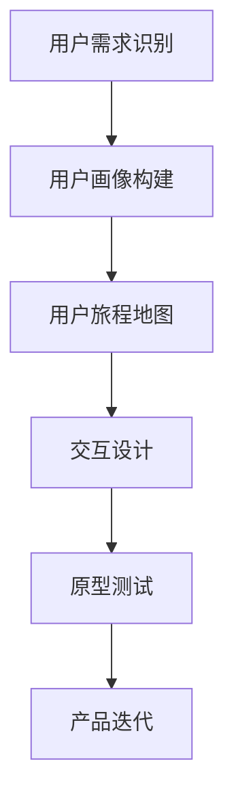

                 

### 《创业公司的用户体验优化与满意度提升策略》

**关键词：用户体验、满意度提升、优化策略、创业公司、设计思维**

**摘要：**
在激烈的市场竞争中，创业公司的成功与否往往取决于其产品和服务的用户体验。本文旨在探讨如何通过优化用户体验和提升用户满意度，增强创业公司的市场竞争力。文章分为五个部分，首先概述用户体验及其重要性，随后介绍用户体验设计的方法论，接着讨论用户体验评估与优化的策略，案例分析与实践指导，最后是用户体验优化资源与工具的总结。

### 第一部分：用户体验优化概述

**第1章：用户体验（UX）概述**

- **1.1 用户体验的定义与重要性**

  用户体验（User Experience，简称UX）是指用户在使用产品或服务过程中所感受到的整体感受。它不仅包括功能性和易用性，还涵盖了情感体验、满意度等多个维度。在创业公司中，用户体验的重要性体现在以下几个方面：

  - **提升用户满意度**：优秀的用户体验能够提高用户的满意度，从而增加用户对产品和品牌的忠诚度。
  - **降低用户流失率**：良好的用户体验可以减少用户流失，提高用户的留存率。
  - **增强品牌价值**：优质的用户体验能够提升品牌形象，增加用户对品牌的信任和好感度。

- **1.2 用户体验的核心要素**

  用户体验的核心要素包括：

  - **功能性**：产品或服务应具备用户所需的基本功能。
  - **易用性**：产品应易于使用，降低用户的学习成本。
  - **美观性**：视觉设计应吸引人，提高用户的使用愉悦感。
  - **情感性**：产品应能够激发用户的情感共鸣，增强用户体验的深度。

- **1.3 用户体验设计与创业公司**

  对于创业公司而言，用户体验设计不仅仅是美学和功能的结合，更是战略层面的考量。以下策略有助于创业公司在用户体验设计方面取得成功：

  - **用户导向**：始终以用户需求为中心，进行产品设计和迭代。
  - **快速迭代**：通过快速原型和用户测试，不断优化产品。
  - **团队合作**：设计、开发和市场团队紧密合作，确保用户体验的一致性。
  - **数据驱动**：利用数据分析指导用户体验设计，提高决策的科学性。

### 第二部分：用户体验设计方法论

**第2章：用户体验设计基础**

- **2.1 设计思维与用户研究**

  设计思维（Design Thinking）是一种以人为本的创新方法，强调通过用户研究和同理心，发现并解决问题。用户研究包括：

  - **用户访谈**：深入了解用户需求和行为。
  - **用户观察**：观察用户在实际环境中的操作。
  - **用户反馈**：收集用户对现有产品和服务的意见和建议。

- **2.2 用户画像与需求分析**

  用户画像（User Persona）是一种虚拟的用户形象，用于代表目标用户群体。需求分析包括：

  - **用户需求识别**：通过用户访谈、问卷等方式收集用户需求。
  - **需求优先级排序**：分析需求的重要性，确定优先级。
  - **用户旅程地图**：展示用户与产品或服务的交互过程。

- **2.3 用户旅程地图与场景构建**

  用户旅程地图（User Journey Map）是一种可视化工具，用于描述用户在产品或服务中的所有互动。场景构建包括：

  - **场景识别**：识别用户在不同情境下的需求和行为。
  - **场景描述**：详细描述用户在不同场景中的行为和感受。
  - **场景分析**：分析用户在场景中的痛点，提出改进方案。

### 第三部分：用户体验评估与优化

**第3章：用户体验评估方法**

- **3.1 用户满意度调查**

  用户满意度调查是一种定量研究方法，用于评估用户对产品和服务的满意度。调查方法包括：

  - **问卷调查**：通过在线或离线方式收集用户反馈。
  - **访谈**：深入了解用户的使用体验和满意度。
  - **评分**：使用评分系统评估用户体验的关键指标。

- **3.2 用户体验测试**

  用户体验测试是一种定性研究方法，通过模拟实际使用场景，观察和记录用户的行为和反馈。测试方法包括：

  - **A/B测试**：比较不同设计方案的优劣。
  - **启发式评估**：专家对用户体验进行评估。
  - **用户行为分析**：通过数据分析了解用户的使用习惯和偏好。

- **3.3 用户体验指标体系构建**

  用户体验指标体系用于量化用户体验的各个方面。常见的指标包括：

  - **功能性指标**：如任务的完成率、错误率。
  - **易用性指标**：如学习曲线、用户满意度。
  - **情感性指标**：如愉悦感、情感投入。

### 第四部分：案例分析与实践指导

**第5章：优秀用户体验案例分析**

- **5.1 国内创业公司用户体验成功案例**

  国内创业公司如微信、滴滴等，通过卓越的用户体验取得了市场成功。分析这些案例，可以发现：

  - **快速响应用户需求**：不断优化产品功能，满足用户需求。
  - **简约而不简单**：界面设计简洁，易于使用。
  - **重视用户反馈**：积极收集用户反馈，及时进行改进。

- **5.2 国际创业公司用户体验成功案例**

  国际创业公司如Airbnb、Spotify等，以其卓越的用户体验赢得了全球用户的喜爱。分析这些案例，可以发现：

  - **全球化视野**：考虑不同文化背景下的用户体验。
  - **创新设计**：不断探索新的交互方式和设计理念。
  - **数据驱动**：利用大数据分析指导用户体验优化。

### 第五部分：提升用户满意度的策略与工具

**第6章：用户体验优化实战**

- **6.1 项目实战一：移动应用优化案例**

  以某移动应用优化为例，详细解释用户体验优化的具体实施步骤，包括：

  - **开发环境搭建**：选择合适的开发工具和平台。
  - **源代码详细实现**：优化核心功能，提升性能。
  - **代码解读与分析**：分析代码中的潜在问题，提出改进方案。
  - **实施效果评估**：通过用户测试和数据监控，评估优化效果。

- **6.2 项目实战二：电商网站用户体验优化案例**

  以某电商网站优化为例，详细解释用户体验优化的具体实施步骤，包括：

  - **用户画像与需求分析**：了解目标用户群体，分析用户需求。
  - **信息架构与导航优化**：优化网站结构和导航，提升用户浏览体验。
  - **视觉设计优化**：提升网站视觉效果，增强用户情感体验。
  - **用户反馈收集与分析**：收集用户反馈，分析用户体验的痛点，提出改进方案。

**第7章：提升用户满意度的策略与工具**

- **7.1 用户反馈收集与分析**

  用户反馈是优化用户体验的重要依据。收集和分析用户反馈的方法包括：

  - **问卷调查**：通过在线或离线方式收集用户反馈。
  - **用户访谈**：深入了解用户的使用体验和满意度。
  - **用户行为分析**：通过数据分析了解用户的使用习惯和偏好。

- **7.2 数据驱动的用户体验优化**

  数据驱动的用户体验优化是指利用数据分析指导用户体验设计。常见的方法包括：

  - **A/B测试**：比较不同设计方案的优劣。
  - **行为分析**：通过用户行为数据，优化产品功能。
  - **用户留存分析**：分析用户留存情况，提高用户粘性。

- **7.3 用户忠诚度与口碑管理策略**

  用户忠诚度和口碑是创业公司成功的关键。管理策略包括：

  - **用户忠诚度计划**：通过积分、优惠券等方式激励用户。
  - **用户评价与反馈**：积极收集用户评价，提高品牌形象。
  - **社交媒体营销**：利用社交媒体平台，传播用户口碑。

### 第六部分：附录

**第8章：用户体验优化资源与工具**

- **8.1 用户体验设计工具介绍**

  常用的用户体验设计工具包括：

  - **Axure**：用于创建交互原型。
  - **Sketch**：用于界面设计。
  - **Figma**：用于团队协作设计。

- **8.2 用户研究方法与实践**

  用户研究方法包括：

  - **用户访谈**：深入了解用户需求和行为。
  - **用户观察**：观察用户在实际环境中的操作。
  - **用户测试**：通过模拟实际使用场景，评估用户体验。

- **8.3 用户体验评估工具推荐**

  常用的用户体验评估工具包括：

  - **Google Analytics**：用于网站和移动应用的用户行为分析。
  - **Qualtrics**：用于在线调查和用户满意度评估。
  - **UserTesting**：用于用户体验测试。

### 附加说明：

**核心概念与联系**

- **Mermaid流程图**：用于展示用户体验设计的方法论流程。



**核心算法原理讲解**

- **聚类分析**：用于用户群体的划分。

```python
def cluster_analysis(data, k):
    # 初始化k个聚类中心
    centroids = initialize_centroids(data, k)
    
    # 循环迭代，直到聚类中心不再变化
    while True:
        # 分配数据点到最近的聚类中心
        clusters = assign_clusters(data, centroids)
        
        # 计算新的聚类中心
        new_centroids = calculate_centroids(data, clusters)
        
        # 判断聚类中心是否变化
        if np.array_equal(centroids, new_centroids):
            break
        
        centroids = new_centroids
    
    return clusters
```

**数学模型和数学公式 & 详细讲解 & 举例说明**

- **用户满意度计算公式**：

$$
S = \frac{1}{n} \sum_{i=1}^{n} s_i
$$

其中，$S$ 为用户满意度得分，$s_i$ 为第 $i$ 个用户对产品的满意度评分，$n$ 为用户总数。

**用户流失率计算公式**：

$$
L = \frac{L_i}{T}
$$

其中，$L$ 为用户流失率，$L_i$ 为在时间 $T$ 内流失的用户数，$T$ 为观察时间。

### 总结

用户体验优化与满意度提升是创业公司成功的关键因素。通过本文的探讨，我们可以了解到用户体验设计的方法论、评估与优化策略、成功案例和实践指导，以及相关资源和工具。创业公司应重视用户体验，以用户为中心，通过不断优化和改进，提升用户满意度，从而在激烈的市场竞争中脱颖而出。

**作者：AI天才研究院/AI Genius Institute & 禅与计算机程序设计艺术 /Zen And The Art of Computer Programming**

