                 

# 《创业公司的用户分层与精准营销》

## 概述

创业公司的成功在很大程度上取决于如何有效管理和利用其用户资源。在这个数字化的时代，用户行为数据的收集、分析和应用成为企业竞争的重要手段。本文将深入探讨创业公司如何通过用户分层和精准营销策略来提升用户满意度和转化率。

### 关键词

- 用户分层
- 精准营销
- 数据分析
- 用户洞察
- 用户行为分析

### 摘要

本文旨在为创业公司提供一套系统化的用户分层与精准营销策略。首先，我们将介绍用户分层与精准营销的基础概念和重要性。随后，通过深入剖析数据分析与用户洞察，我们将详细探讨用户分层策略，包括用户行为分层、用户需求分层和用户生命周期分层。接着，我们将探讨精准营销策略的制定、实施与优化，并通过实际案例来展示这些策略的具体应用和效果评估。最后，本文将总结最佳实践，为创业公司的用户分层与精准营销提供指导。

## 第一部分：用户分层与精准营销概述

### 第1章：用户分层与精准营销基础

#### 1.1 用户分层概述

用户分层是指将用户按照特定的标准进行分类，以便更好地理解和满足他们的需求。用户分层的意义在于：

1. **优化资源分配**：通过用户分层，企业可以更加精准地分配资源，提高营销效率和效果。
2. **提升用户体验**：了解用户特征，可以帮助企业提供更加个性化的服务和产品，提升用户满意度。
3. **增强竞争力**：用户分层可以帮助企业更好地把握市场趋势，增强产品竞争力。

用户分层的类型多种多样，常见的有基于用户行为的分层、基于用户需求的分层和基于用户生命周期的分层。

##### 1.1.1 用户分层的意义

用户分层的意义主要体现在以下几个方面：

- **提高营销效率**：针对不同用户群体制定个性化营销策略，可以显著提高营销活动的效率和转化率。
- **优化资源配置**：用户分层有助于企业合理分配资源，避免资源的浪费。
- **提升用户满意度**：通过深入了解用户需求，提供个性化的服务，可以大大提升用户满意度。

##### 1.1.2 用户分层的类型

用户分层的类型主要有以下几种：

- **基于用户行为的分层**：根据用户的浏览、购买、互动等行为特征进行分类。
- **基于用户需求的分层**：根据用户对产品或服务的需求和偏好进行分类。
- **基于用户生命周期的分层**：根据用户从首次接触产品到最终离去的全过程进行分类。

##### 1.1.3 用户分层的步骤

进行用户分层通常需要以下步骤：

1. **数据收集**：收集与用户相关的各种数据，包括行为数据、需求数据和生命周期数据。
2. **数据处理**：清洗和整理数据，确保数据的质量和一致性。
3. **用户特征提取**：从数据中提取用户的特征，如年龄、性别、收入、购买行为等。
4. **用户分类**：根据提取的用户特征，使用算法或手动方法对用户进行分类。

#### 1.2 精准营销概述

精准营销是一种基于用户数据的营销方法，旨在通过精确的目标定位和个性化内容提供，提高营销效果和用户转化率。

##### 1.2.1 精准营销的概念

精准营销的核心在于：

- **精准定位**：通过数据分析和用户画像，确定目标用户群体。
- **个性化内容**：根据用户特征和需求，提供个性化的营销内容和体验。

##### 1.2.2 精准营销的目标

精准营销的主要目标包括：

- **提高用户转化率**：通过精准营销，提高用户的购买意愿和转化率。
- **提升品牌忠诚度**：通过个性化的服务，提升用户的满意度和品牌忠诚度。
- **优化营销预算**：精准定位和个性化营销可以降低营销成本，提高投资回报率。

##### 1.2.3 精准营销的挑战

精准营销面临的挑战主要包括：

- **数据质量**：高质量的数据是精准营销的基础，数据的质量直接影响营销效果。
- **技术实现**：精准营销需要先进的数据分析技术和工具支持。
- **用户隐私**：在收集和使用用户数据时，需要平衡用户隐私保护与数据利用的矛盾。

### 第2章：数据分析与用户洞察

#### 2.1 数据分析概述

数据分析是指使用统计学、计算机科学和数据分析技术，对大量数据进行提取、转换、处理和分析，以发现数据背后的模式和趋势。

##### 2.1.1 数据分析的意义

数据分析的意义在于：

- **发现商业机会**：通过分析数据，企业可以发现市场趋势和用户需求，从而发掘新的商业机会。
- **优化决策**：基于数据分析的结果，企业可以做出更加科学的决策，提高运营效率。
- **提升竞争力**：通过数据分析，企业可以更好地了解竞争对手和自身优劣势，从而提升竞争力。

##### 2.1.2 数据分析的工具与方法

数据分析常用的工具包括：

- **Excel**：适合进行简单数据分析和可视化。
- **Python**：适合进行复杂的数据处理和分析，拥有丰富的库和框架，如Pandas、NumPy、Matplotlib等。
- **R**：专门用于统计分析和数据可视化，具有强大的数据处理和分析能力。

数据分析的方法包括：

- **描述性分析**：用于描述数据的基本特征，如均值、中位数、标准差等。
- **推断性分析**：通过样本数据推断总体特征，如假设检验、回归分析等。
- **预测性分析**：基于历史数据预测未来趋势，如时间序列分析、机器学习等。

##### 2.1.3 数据分析的应用场景

数据分析在多个应用场景中具有重要价值：

- **市场营销**：通过分析用户行为和需求，制定精准的营销策略。
- **运营优化**：通过分析运营数据，发现优化点，提高运营效率。
- **风险管理**：通过分析风险数据，识别潜在风险，制定防范措施。

#### 2.2 用户洞察

用户洞察是指通过对用户行为数据、需求数据和互动数据的分析，深入了解用户需求和行为，从而为企业提供决策依据。

##### 2.2.1 用户需求分析

用户需求分析是指通过数据分析方法，了解用户的需求、偏好和行为模式。

- **需求识别**：通过调查问卷、用户访谈等方式收集用户需求信息。
- **需求分类**：将用户需求进行分类，如基础需求、高级需求、潜在需求等。
- **需求分析**：使用数据分析方法，如聚类分析、关联规则分析等，识别用户的共同需求和差异需求。

##### 2.2.2 用户行为分析

用户行为分析是指通过数据分析方法，了解用户在网站、应用等环境中的行为模式。

- **行为跟踪**：记录用户在系统中的各种行为，如点击、浏览、购买等。
- **行为分析**：通过行为数据，分析用户的兴趣、偏好和行为路径。
- **行为预测**：基于历史行为数据，预测用户未来的行为，如购买、流失等。

##### 2.2.3 用户满意度分析

用户满意度分析是指通过数据分析方法，了解用户对产品或服务的满意度。

- **满意度调查**：通过问卷调查、用户反馈等方式收集用户满意度信息。
- **满意度分析**：使用数据分析方法，如描述性分析、因子分析等，分析用户满意度的影响因素。
- **满意度改进**：根据用户满意度分析结果，制定改进措施，提高用户满意度。

## 第二部分：用户分层策略

### 第3章：用户行为分层策略

#### 3.1 用户行为分层模型

用户行为分层模型是将用户根据其行为特征进行分类的模型。用户行为分层的目的是为了更好地理解和满足用户的需求，从而提高用户体验和转化率。

##### 3.1.1 用户行为分层的目的

用户行为分层的主要目的是：

- **优化资源配置**：根据用户行为特征，将用户划分为不同的群体，从而有针对性地进行营销和服务。
- **提升用户体验**：通过深入了解用户行为，提供个性化的产品和服务，提高用户满意度和忠诚度。
- **提高转化率**：针对不同用户行为群体，制定差异化的营销策略，提高转化率。

##### 3.1.2 用户行为分层的步骤

进行用户行为分层通常需要以下步骤：

1. **数据收集**：收集与用户行为相关的数据，如浏览行为、购买行为、互动行为等。
2. **数据处理**：清洗和整理数据，确保数据的质量和一致性。
3. **用户特征提取**：从行为数据中提取用户的特征，如活跃度、购买频率、互动深度等。
4. **用户分类**：使用算法或手动方法，根据提取的用户特征，将用户划分为不同的群体。

##### 3.1.3 用户行为分层的案例

以下是一个简单的用户行为分层案例：

1. **数据收集**：收集用户的浏览行为数据，包括浏览次数、浏览时长、浏览页面等。
2. **数据处理**：对数据进行清洗，去除无效数据，确保数据的质量。
3. **用户特征提取**：根据浏览行为数据，提取用户特征，如：
   - 高频用户：每天浏览次数超过10次的用户。
   - 活跃用户：每月浏览时长超过30分钟的用户。
   - 精准用户：浏览特定页面的用户。
4. **用户分类**：根据提取的用户特征，将用户划分为以下群体：
   - 高频用户群体：针对性地推送促销信息。
   - 活跃用户群体：提供个性化推荐和服务。
   - 精准用户群体：推送相关内容，提高转化率。

#### 3.2 用户行为分层策略

用户行为分层策略是指根据用户行为特征，制定相应的营销和服务策略，以提高用户体验和转化率。

##### 3.2.1 确定用户行为指标

确定用户行为指标是用户行为分层策略的重要步骤。常见的用户行为指标包括：

- **活跃度**：用户在系统中的活跃程度，如登录次数、发帖数量等。
- **购买频率**：用户在一定时间内的购买次数。
- **互动深度**：用户在系统中的互动程度，如回复数量、参与活动次数等。
- **留存率**：用户在一定时间后仍然使用系统的比例。

##### 3.2.2 用户行为分层策略的制定

用户行为分层策略的制定需要根据用户行为指标和业务目标进行。以下是一个简单的用户行为分层策略制定过程：

1. **确定业务目标**：根据公司的业务目标和用户需求，确定需要重点关注的用户群体。
2. **分析用户行为数据**：分析用户行为数据，提取关键的用户行为指标，如活跃度、购买频率等。
3. **制定分层策略**：根据用户行为指标和业务目标，制定相应的分层策略，如：
   - 高频用户策略：提供专属优惠、推荐个性化内容等。
   - 活跃用户策略：推送热门话题、推荐相关产品等。
   - 精准用户策略：推送精准内容、提高转化率等。

##### 3.2.3 用户行为分层策略的实施

用户行为分层策略的实施包括以下几个方面：

1. **数据收集与处理**：定期收集用户行为数据，确保数据的质量和准确性。
2. **用户特征提取**：根据用户行为数据，提取用户的特征，如活跃度、购买频率等。
3. **用户分类**：根据提取的用户特征，使用算法或手动方法，将用户划分为不同的群体。
4. **策略执行**：根据用户分层策略，有针对性地执行营销和服务策略，如推送个性化内容、提供专属优惠等。

#### 3.3 用户行为分层策略的效果评估

用户行为分层策略的效果评估是确保策略有效性的重要环节。以下是一个简单的效果评估过程：

1. **设定评估指标**：根据业务目标，设定需要评估的指标，如用户转化率、用户满意度等。
2. **数据收集**：定期收集与评估指标相关的数据，如用户转化率、用户满意度等。
3. **数据分析**：使用数据分析方法，分析评估指标的变化趋势，如是否达到预期目标等。
4. **策略调整**：根据评估结果，对用户行为分层策略进行调整，以提高策略的有效性。

### 第4章：用户需求分层策略

#### 4.1 用户需求分层模型

用户需求分层模型是将用户根据其需求特征进行分类的模型。用户需求分层的目的是为了更好地理解和满足用户的需求，从而提高用户体验和转化率。

##### 4.1.1 用户需求分层的目的

用户需求分层的主要目的是：

- **优化资源配置**：根据用户需求特征，将用户划分为不同的群体，从而有针对性地进行产品和服务开发。
- **提升用户体验**：通过深入了解用户需求，提供个性化的产品和服务，提高用户满意度和忠诚度。
- **提高转化率**：针对不同用户需求群体，制定差异化的营销策略，提高转化率。

##### 4.1.2 用户需求分层的步骤

进行用户需求分层通常需要以下步骤：

1. **需求收集**：收集与用户需求相关的数据，如用户反馈、调查问卷等。
2. **需求分析**：分析用户需求，提取关键的用户需求指标，如需求频率、需求强度等。
3. **用户分类**：根据提取的用户需求指标，使用算法或手动方法，将用户划分为不同的群体。
4. **需求分层**：根据用户需求特征，将用户划分为不同的需求层次，如基础需求、高级需求、潜在需求等。

##### 4.1.3 用户需求分层的案例

以下是一个简单的用户需求分层案例：

1. **需求收集**：通过用户调查问卷，收集用户对产品或服务的需求信息。
2. **需求分析**：分析调查问卷数据，提取关键的用户需求指标，如需求频率、需求强度等。
3. **用户分类**：根据需求指标，将用户划分为以下群体：
   - 高需求用户：对产品或服务有强烈需求，需求频率高。
   - 中需求用户：对产品或服务有一定需求，需求频率适中。
   - 低需求用户：对产品或服务需求较低，需求频率低。
4. **需求分层**：根据用户需求特征，将用户划分为以下需求层次：
   - 基础需求层次：满足用户的基本需求，如基本功能、基本服务。
   - 高级需求层次：满足用户的特殊需求，如个性化定制、高级服务。
   - 潜在需求层次：挖掘用户的潜在需求，如新产品功能、新服务类型。

#### 4.2 用户需求分层策略

用户需求分层策略是指根据用户需求特征，制定相应的产品和服务策略，以提高用户体验和转化率。

##### 4.2.1 确定用户需求指标

确定用户需求指标是用户需求分层策略的重要步骤。常见的用户需求指标包括：

- **需求频率**：用户在一定时间内对某项产品或服务的需求次数。
- **需求强度**：用户对某项产品或服务的需求程度。
- **需求满意度**：用户对某项产品或服务的满意度。

##### 4.2.2 用户需求分层策略的制定

用户需求分层策略的制定需要根据用户需求指标和业务目标进行。以下是一个简单的用户需求分层策略制定过程：

1. **确定业务目标**：根据公司的业务目标和用户需求，确定需要重点关注的用户群体。
2. **分析用户需求数据**：分析用户需求数据，提取关键的用户需求指标，如需求频率、需求强度等。
3. **制定分层策略**：根据用户需求指标和业务目标，制定相应的分层策略，如：
   - 高需求用户策略：提供个性化的产品和服务，满足用户特殊需求。
   - 中需求用户策略：提供标准化的产品和服务，满足用户基本需求。
   - 低需求用户策略：提供优惠和推广活动，提高用户需求强度。

##### 4.2.3 用户需求分层策略的实施

用户需求分层策略的实施包括以下几个方面：

1. **需求收集与处理**：定期收集用户需求数据，确保数据的质量和准确性。
2. **用户需求分析**：根据需求数据，分析用户的真实需求和潜在需求。
3. **用户分类**：根据需求分析结果，将用户划分为不同的需求群体。
4. **策略执行**：根据用户需求分层策略，有针对性地执行产品和服务策略，如提供个性化推荐、满足特殊需求等。

#### 4.3 用户需求分层策略的效果评估

用户需求分层策略的效果评估是确保策略有效性的重要环节。以下是一个简单的效果评估过程：

1. **设定评估指标**：根据业务目标，设定需要评估的指标，如用户转化率、用户满意度等。
2. **数据收集**：定期收集与评估指标相关的数据，如用户转化率、用户满意度等。
3. **数据分析**：使用数据分析方法，分析评估指标的变化趋势，如是否达到预期目标等。
4. **策略调整**：根据评估结果，对用户需求分层策略进行调整，以提高策略的有效性。

### 第5章：用户生命周期分层策略

#### 5.1 用户生命周期分层模型

用户生命周期分层模型是将用户根据其在生命周期中的不同阶段进行分类的模型。用户生命周期分层的目的在于更好地理解和满足用户在各个阶段的需求，从而提高用户满意度和留存率。

##### 5.1.1 用户生命周期分层的目的

用户生命周期分层的主要目的是：

- **优化用户管理**：根据用户在生命周期中的不同阶段，制定差异化的用户管理策略，提高用户满意度和留存率。
- **提升转化率**：针对用户在生命周期中的关键阶段，制定精准的营销策略，提高用户转化率。
- **降低用户流失率**：通过分析用户生命周期数据，识别用户流失的原因，制定预防措施，降低用户流失率。

##### 5.1.2 用户生命周期分层的步骤

进行用户生命周期分层通常需要以下步骤：

1. **数据收集**：收集与用户生命周期相关的数据，如注册时间、购买时间、活跃度等。
2. **数据处理**：清洗和整理数据，确保数据的质量和一致性。
3. **用户阶段划分**：根据用户生命周期数据，划分用户的阶段，如新用户、活跃用户、忠诚用户等。
4. **用户分类**：根据用户阶段，将用户划分为不同的群体。

##### 5.1.3 用户生命周期分层的案例

以下是一个简单的用户生命周期分层案例：

1. **数据收集**：收集用户的注册时间、购买时间和活跃度数据。
2. **数据处理**：清洗和整理数据，去除无效数据，确保数据的质量。
3. **用户阶段划分**：根据用户数据，将用户划分为以下阶段：
   - 新用户：注册时间在三个月以内的用户。
   - 活跃用户：注册时间超过三个月，但未购买的用户。
   - 忠诚用户：注册时间超过三个月，且有购买记录的用户。
4. **用户分类**：根据用户阶段，将用户划分为以下群体：
   - 新用户群体：提供注册优惠、引导使用等。
   - 活跃用户群体：提供产品推荐、优惠活动等。
   - 忠诚用户群体：提供专属服务、忠诚度奖励等。

#### 5.2 用户生命周期分层策略

用户生命周期分层策略是指根据用户生命周期阶段，制定相应的营销和服务策略，以提高用户体验和留存率。

##### 5.2.1 用户生命周期管理策略的制定

用户生命周期管理策略的制定需要根据用户生命周期阶段和业务目标进行。以下是一个简单的用户生命周期管理策略制定过程：

1. **确定业务目标**：根据公司的业务目标和用户需求，确定需要重点关注的用户群体。
2. **分析用户生命周期数据**：分析用户生命周期数据，提取关键的用户阶段指标，如注册率、活跃度、购买率等。
3. **制定分层策略**：根据用户阶段指标和业务目标，制定相应的分层策略，如：
   - 新用户策略：提供注册优惠、引导使用等。
   - 活跃用户策略：提供产品推荐、优惠活动等。
   - 忠诚用户策略：提供专属服务、忠诚度奖励等。

##### 5.2.2 用户生命周期分层策略的实施

用户生命周期分层策略的实施包括以下几个方面：

1. **数据收集与处理**：定期收集用户生命周期数据，确保数据的质量和准确性。
2. **用户阶段划分**：根据用户生命周期数据，划分用户的阶段。
3. **策略执行**：根据用户生命周期分层策略，有针对性地执行营销和服务策略，如提供个性化推荐、优惠活动等。
4. **用户互动**：通过用户互动，了解用户的反馈和需求，不断优化用户生命周期管理策略。

##### 5.2.3 用户生命周期分层策略的效果评估

用户生命周期分层策略的效果评估是确保策略有效性的重要环节。以下是一个简单的效果评估过程：

1. **设定评估指标**：根据业务目标，设定需要评估的指标，如用户留存率、用户转化率等。
2. **数据收集**：定期收集与评估指标相关的数据，如用户留存率、用户转化率等。
3. **数据分析**：使用数据分析方法，分析评估指标的变化趋势，如是否达到预期目标等。
4. **策略调整**：根据评估结果，对用户生命周期分层策略进行调整，以提高策略的有效性。

## 第三部分：精准营销策略

### 第6章：精准营销策略制定

#### 6.1 精准营销策略框架

精准营销策略的制定是一个系统化的过程，需要综合考虑业务目标、用户特征和市场环境。以下是一个简单的精准营销策略框架：

1. **业务目标确定**：明确公司的业务目标和营销目标，如提高用户转化率、提升品牌知名度等。
2. **用户特征分析**：分析目标用户的特征，包括年龄、性别、收入、行为习惯等。
3. **市场环境分析**：分析市场环境和竞争对手，了解行业趋势和潜在的市场机会。
4. **策略制定**：根据业务目标和用户特征，制定精准的营销策略，包括定位策略、内容策略、渠道策略等。
5. **执行与监控**：执行营销策略，并定期监控策略的效果，根据反馈进行优化。

##### 6.1.1 精准营销策略的目标

精准营销策略的目标主要包括：

- **提高用户转化率**：通过精准的目标定位和个性化内容提供，提高用户的购买意愿和转化率。
- **提升品牌忠诚度**：通过持续的用户互动和个性化服务，提升用户对品牌的忠诚度。
- **优化营销成本**：通过精准营销，降低无效的营销成本，提高营销投资的回报率。

##### 6.1.2 精准营销策略的要素

精准营销策略的要素主要包括：

- **用户画像**：建立详细的用户画像，包括用户的基本信息、行为习惯、需求偏好等。
- **目标定位**：根据用户画像，确定目标用户群体，并制定相应的定位策略。
- **内容策略**：根据用户需求和兴趣，制定个性化的内容策略，包括文案、图片、视频等。
- **渠道策略**：选择合适的营销渠道，如社交媒体、电子邮件、短信等，进行精准推广。
- **互动策略**：通过用户互动，收集用户反馈，不断优化营销策略。

##### 6.1.3 精准营销策略的制定过程

精准营销策略的制定过程可以分为以下几个步骤：

1. **需求分析**：通过用户调查、市场研究等方式，了解用户需求和偏好。
2. **用户画像构建**：根据需求分析结果，构建详细的用户画像。
3. **目标用户定位**：根据用户画像，确定目标用户群体。
4. **策略制定**：制定定位策略、内容策略、渠道策略和互动策略。
5. **策略优化**：根据市场反馈和用户行为数据，不断优化营销策略。

### 第7章：精准营销实施与优化

#### 7.1 精准营销实施策略

精准营销的实施是一个复杂的过程，需要结合具体的业务场景和用户特征进行。以下是一个简单的精准营销实施策略：

1. **数据准备**：收集用户数据，包括用户画像、行为数据等，确保数据的质量和准确性。
2. **系统搭建**：搭建精准营销系统，包括数据存储、数据处理、用户画像构建等。
3. **目标定位**：根据用户画像和业务目标，确定目标用户群体。
4. **内容制作**：制作符合目标用户需求的个性化内容，包括文案、图片、视频等。
5. **渠道推广**：选择合适的营销渠道，进行精准推广。
6. **用户互动**：通过用户互动，收集用户反馈，不断优化营销策略。

##### 7.1.1 精准营销实施的关键环节

精准营销实施的关键环节包括：

- **用户数据收集**：确保数据的质量和准确性，是精准营销的基础。
- **用户画像构建**：根据用户数据，构建详细的用户画像，为精准营销提供依据。
- **目标用户定位**：根据用户画像和业务目标，确定目标用户群体，制定精准的营销策略。
- **内容制作**：制作符合目标用户需求的个性化内容，提高用户的参与度和转化率。
- **渠道推广**：选择合适的营销渠道，进行精准推广，提高营销效果。

##### 7.1.2 精准营销实施的步骤

精准营销实施的步骤可以分为以下几个阶段：

1. **需求分析**：通过用户调查、市场研究等方式，了解用户需求和偏好。
2. **用户画像构建**：根据需求分析结果，构建详细的用户画像。
3. **目标用户定位**：根据用户画像和业务目标，确定目标用户群体。
4. **内容制作**：制作符合目标用户需求的个性化内容，包括文案、图片、视频等。
5. **渠道选择**：选择合适的营销渠道，如社交媒体、电子邮件、短信等。
6. **推广执行**：执行营销策略，进行精准推广。
7. **效果评估**：定期评估营销效果，根据反馈进行优化。

##### 7.1.3 精准营销实施中的挑战与应对

精准营销实施中面临的挑战主要包括：

- **数据质量**：数据质量直接影响精准营销的效果，需要确保数据的准确性和完整性。
- **技术实现**：精准营销需要先进的数据分析技术和营销工具支持，需要投入一定的技术资源。
- **用户隐私**：在收集和使用用户数据时，需要平衡用户隐私保护与数据利用的矛盾。

应对策略包括：

- **数据质量保证**：建立完善的数据质量管理流程，确保数据的准确性、完整性和一致性。
- **技术投入**：投入足够的资金和人力资源，引进先进的数据分析技术和营销工具。
- **隐私保护**：严格遵守相关法律法规，采取有效的隐私保护措施，提高用户的信任度。

### 第8章：精准营销优化策略

#### 8.1 精准营销优化策略

精准营销优化策略是指通过不断调整和优化营销策略，提高营销效果和用户满意度。以下是一个简单的精准营销优化策略：

1. **数据反馈收集**：定期收集用户行为数据和市场反馈，了解营销效果。
2. **效果评估**：使用数据分析方法，评估不同营销策略的效果，找出优势和不足。
3. **策略调整**：根据效果评估结果，对营销策略进行调整和优化。
4. **持续监控**：持续监控营销效果，及时调整策略，确保营销目标的实现。

##### 8.1.1 精准营销优化的目的

精准营销优化的主要目的是：

- **提高营销效果**：通过不断优化营销策略，提高用户的参与度和转化率。
- **降低营销成本**：通过优化营销策略，降低无效的营销成本，提高投资回报率。
- **提升用户满意度**：通过持续的用户互动和个性化服务，提高用户满意度和忠诚度。

##### 8.1.2 精准营销优化的方法

精准营销优化的方法主要包括：

- **A/B测试**：通过对比不同营销策略的效果，找出最优策略。
- **用户反馈**：收集用户的反馈和意见，优化产品和服务。
- **数据分析**：使用数据分析方法，深入分析用户行为和市场趋势，找出优化方向。
- **迭代更新**：根据优化结果，不断迭代更新营销策略，提高效果。

##### 8.1.3 精准营销优化的案例

以下是一个简单的精准营销优化案例：

1. **数据反馈收集**：通过用户调研、问卷调查等方式，收集用户对产品和服务的不满意点。
2. **效果评估**：使用数据分析方法，分析用户行为数据，找出影响用户满意度的关键因素。
3. **策略调整**：根据用户反馈和数据分析结果，优化产品和服务，如提高页面加载速度、改进用户界面等。
4. **持续监控**：定期收集用户反馈和数据分析结果，持续优化营销策略，提高用户满意度。

## 第四部分：案例研究

### 第9章：创业公司用户分层与精准营销案例分析

#### 9.1 案例一：一家电商平台的用户分层与精准营销实践

##### 9.1.1 案例背景

一家电商公司，名为“时尚秀”，致力于为用户提供高品质的时尚商品。随着公司规模的扩大和用户数量的增加，公司面临的一个主要挑战是如何有效地管理和利用用户资源，以提高用户满意度和转化率。

##### 9.1.2 用户分层策略

为了实现这一目标，公司决定采用用户分层策略。首先，公司收集了大量的用户行为数据，包括购买历史、浏览记录、互动行为等。然后，通过数据分析，将用户分为以下几类：

1. **高频用户**：每月购买次数超过5次的用户。
2. **活跃用户**：每月浏览时长超过30分钟的用户。
3. **潜在用户**：浏览特定商品但尚未购买的用户。
4. **沉默用户**：长时间没有互动或购买行为的用户。

##### 9.1.3 精准营销策略

基于用户分层结果，公司制定了以下精准营销策略：

1. **高频用户策略**：公司为高频用户提供专属优惠、积分奖励等，以激励他们的持续购买。
2. **活跃用户策略**：公司推送热门话题和个性化推荐，以提升用户的互动和浏览时长。
3. **潜在用户策略**：公司通过推送相关商品信息、优惠券等，引导潜在用户进行购买。
4. **沉默用户策略**：公司通过发送邮件、短信等方式，提醒沉默用户，并提供限时优惠，以激发他们的购买欲望。

##### 9.1.4 实施效果评估

通过用户分层与精准营销策略的实施，公司取得了显著的效果：

- **用户满意度提高**：用户满意度调查结果显示，用户对公司的服务满意度提高了20%。
- **转化率提升**：公司整体转化率提高了15%，特别是在潜在用户群体中，转化率提高了25%。
- **用户留存率增加**：高频用户和活跃用户的留存率分别提高了10%和15%。

#### 9.2 案例二：一家社交媒体平台的用户分层与精准营销实践

##### 9.2.1 案例背景

一家社交媒体平台，名为“社交脉动”，为用户提供内容分享和互动功能。随着用户数量的增长，平台面临的一个主要挑战是如何提高用户活跃度和留存率。

##### 9.2.2 用户分层策略

为了应对这一挑战，平台决定采用用户分层策略。平台收集了大量的用户行为数据，包括发帖数量、互动频率、点赞数量等。通过数据分析，将用户分为以下几类：

1. **活跃用户**：每月发帖数量超过10次的用户。
2. **参与用户**：每月互动频率超过50次的用户。
3. **沉默用户**：长时间没有互动的用户。
4. **潜在用户**：浏览内容但未进行互动的用户。

##### 9.2.3 精准营销策略

基于用户分层结果，平台制定了以下精准营销策略：

1. **活跃用户策略**：平台为活跃用户提供专属徽章、积分奖励等，以激励他们的持续参与。
2. **参与用户策略**：平台推送热门话题和互动活动，以提升用户的互动频率。
3. **沉默用户策略**：平台通过发送通知、推送文章等方式，提醒沉默用户，并提供限时互动机会，以激发他们的参与热情。
4. **潜在用户策略**：平台通过推送相关内容、推荐互动话题等，引导潜在用户进行互动。

##### 9.2.4 实施效果评估

通过用户分层与精准营销策略的实施，平台取得了显著的效果：

- **用户活跃度提高**：平台整体活跃度提高了30%，特别是在沉默用户群体中，活跃度提高了50%。
- **留存率提升**：平台留存率提高了20%，特别是在潜在用户群体中，留存率提高了30%。
- **内容质量提升**：由于用户参与度提高，平台上的内容质量和互动氛围得到了显著改善。

### 第10章：创业公司用户分层与精准营销最佳实践总结

#### 10.1 最佳实践总结

通过以上案例分析，我们可以总结出以下创业公司用户分层与精准营销的最佳实践：

- **数据驱动**：创业公司应该以数据为核心，通过数据分析了解用户需求和行为，制定精准的营销策略。
- **用户分层**：根据用户特征和行为，将用户分为不同群体，有针对性地进行营销和服务。
- **个性化内容**：根据用户需求，提供个性化的内容和体验，提高用户满意度和参与度。
- **持续优化**：通过不断收集用户反馈和数据，优化营销策略，提高营销效果。

#### 10.2 精准营销的关键成功因素

精准营销的关键成功因素包括：

- **高质量数据**：高质量的数据是精准营销的基础，需要确保数据的质量和准确性。
- **用户洞察**：深入了解用户需求和偏好，为精准营销提供依据。
- **技术支持**：先进的分析技术和工具支持，可以提高营销效率和效果。
- **持续优化**：不断优化营销策略，根据市场反馈和用户行为数据进行调整。

#### 10.3 用户分层与精准营销的未来发展趋势

随着技术的进步和用户需求的多样化，用户分层与精准营销将呈现以下发展趋势：

- **人工智能应用**：人工智能技术将在用户分层和精准营销中发挥更大的作用，提高预测准确性和个性化水平。
- **大数据分析**：大数据分析技术将更加普及，帮助企业挖掘更深层次的用户洞察和商业价值。
- **个性化服务**：随着用户对个性化服务的需求增加，个性化服务将成为精准营销的核心。

## 附录

### 附录 A：用户分层与精准营销相关工具

#### A.1 数据分析工具介绍

数据分析工具是进行用户分层与精准营销的重要工具，以下介绍几种常用的数据分析工具：

- **Excel**：Excel 是一款功能强大的数据分析工具，适用于简单数据分析和可视化。它提供了丰富的函数和图表功能，方便用户进行数据处理和展示。
- **Python**：Python 是一种高级编程语言，广泛应用于数据分析领域。Python 拥有丰富的数据分析库和框架，如Pandas、NumPy、Matplotlib等，可以方便地进行数据处理、分析和可视化。
- **R**：R 是一种专门用于统计分析和数据可视化的语言，具有强大的数据处理和分析能力。R 拥有大量的统计模型和包，可以满足复杂的数据分析需求。

#### A.2 精准营销工具介绍

精准营销工具是进行用户分层与精准营销的重要辅助工具，以下介绍几种常用的精准营销工具：

- **用户画像工具**：用户画像工具可以帮助企业构建详细的用户画像，包括用户的基本信息、行为习惯、需求偏好等。常用的用户画像工具包括 Google Analytics、Mixpanel 等。
- **营销自动化工具**：营销自动化工具可以帮助企业自动化营销流程，提高营销效率和效果。常用的营销自动化工具包括 HubSpot、Marketo 等。
- **用户行为分析工具**：用户行为分析工具可以帮助企业实时监测用户行为，了解用户在网站、应用等环境中的行为模式。常用的用户行为分析工具包括 Google Analytics、ClickTale 等。

### 附录 B：用户分层与精准营销相关书籍

- **《精益创业》**：作者埃里克·莱斯，介绍了精益创业的方法，包括用户需求验证、MVP（最小可行产品）等，对创业公司有很高的指导意义。
- **《增长黑客》**：作者范·瓦格纳，介绍了如何通过数据驱动的方法实现企业增长，包括用户分层、A/B测试等。
- **《用户画像》**：作者李华，详细介绍了用户画像的概念、构建方法和应用场景，对进行用户分层和精准营销有很好的参考价值。

### 附录 C：用户分层与精准营销相关网站

- **Google Analytics**：Google Analytics 是一款功能强大的数据分析工具，可以帮助企业收集和分析用户行为数据。
- **Mixpanel**：Mixpanel 是一款用户行为分析工具，提供实时的用户行为监测和分析功能。
- **HubSpot**：HubSpot 是一款营销自动化工具，可以帮助企业自动化营销流程，提高营销效率和效果。

## 参考文献

- **莱斯，埃里克.《精益创业》[M]. 人民邮电出版社，2014.**
- **瓦格纳，范.《增长黑客》[M]. 电子工业出版社，2016.**
- **李华.《用户画像》[M]. 机械工业出版社，2017.**  
- **Google Analytics 官网.https://www.google.com/analytics/**
- **Mixpanel 官网.https://mixpanel.com/**
- **HubSpot 官网.https://www.hubspot.com/**<|im_end|>### 核心概念与联系

用户分层和精准营销是现代营销中至关重要的概念。用户分层（User Segmentation）是指根据用户的某些特征，如行为、需求、偏好、生命周期阶段等，将用户分为不同的群体。精准营销（Precision Marketing）则是一种基于用户数据的营销方法，旨在通过精确的目标定位和个性化内容提供，提高营销效果和用户转化率。

在讨论这两个概念时，我们常常需要借助Mermaid流程图来展示其核心原理和架构。以下是一个简单的用户分层与精准营销的Mermaid流程图：

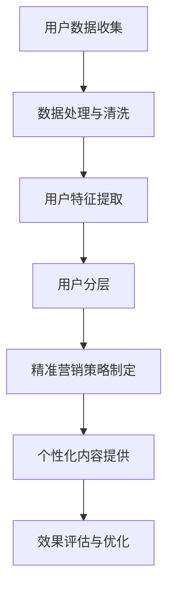

在这个流程图中，用户数据收集是整个流程的起点，通过数据处理和清洗，获得高质量的数据。用户特征提取是对数据进行分析，提取出有意义的特征。用户分层是基于这些特征，将用户划分为不同的群体。精准营销策略制定则是根据用户分层结果，制定相应的营销策略。个性化内容提供是根据用户的具体需求和偏好，提供个性化的内容。最后，通过效果评估与优化，不断调整和优化营销策略，以提高营销效果。

#### 用户分层概述

用户分层（User Segmentation）是指根据用户的某些特征，如行为、需求、偏好、生命周期阶段等，将用户划分为不同的群体。用户分层的目的是为了更好地理解和满足用户的需求，从而提高用户体验和转化率。

用户分层的意义主要体现在以下几个方面：

1. **优化资源配置**：通过用户分层，企业可以更加精准地了解不同用户群体的需求和行为，从而有针对性地进行资源配置，避免资源的浪费。
2. **提升用户体验**：了解用户特征，可以帮助企业提供更加个性化的服务和产品，提升用户满意度。
3. **增强竞争力**：用户分层可以帮助企业更好地把握市场趋势，增强产品竞争力。

用户分层的类型主要包括：

1. **基于用户行为的分层**：根据用户的浏览、购买、互动等行为特征进行分类，如高频用户、活跃用户、沉默用户等。
2. **基于用户需求的分层**：根据用户对产品或服务的需求和偏好进行分类，如基础需求用户、高级需求用户、潜在需求用户等。
3. **基于用户生命周期的分层**：根据用户从首次接触产品到最终离去的全过程进行分类，如新用户、成长用户、成熟用户、流失用户等。

用户分层的基本步骤如下：

1. **数据收集**：收集与用户相关的数据，如行为数据、需求数据、生命周期数据等。
2. **数据处理**：清洗和整理数据，确保数据的质量和一致性。
3. **用户特征提取**：从数据中提取用户的特征，如年龄、性别、收入、购买行为等。
4. **用户分类**：根据提取的用户特征，使用算法或手动方法，将用户划分为不同的群体。

通过用户分层，企业可以更好地了解用户，从而制定更加精准的营销策略，提高用户满意度和转化率。

#### 用户行为分层

用户行为分层（Behavioral Segmentation）是一种基于用户在平台上的行为特征进行用户分类的方法。这种方法的核心是通过对用户的点击、浏览、购买等行为进行分析，将用户划分为不同的群体。用户行为分层有助于企业更精准地理解用户需求，优化资源配置，提高营销效率和用户满意度。

##### 用户行为分层的目的

用户行为分层的目的是：

1. **优化资源配置**：通过对用户行为的深入分析，企业可以更有效地将资源投入到最有价值的用户群体中，避免资源浪费。
2. **提升用户体验**：了解用户的行为模式，可以帮助企业提供更加个性化的服务和产品，提升用户体验和满意度。
3. **提高营销效果**：根据用户行为特征进行精准定位，企业可以制定更加有效的营销策略，提高转化率和ROI（投资回报率）。

##### 用户行为分层模型

一个典型的用户行为分层模型包括以下几个步骤：

1. **行为数据收集**：收集用户在平台上的各种行为数据，如浏览页面、点击广告、参与活动、购买商品等。
2. **数据预处理**：清洗和整理数据，确保数据的质量和一致性。
3. **特征提取**：从行为数据中提取关键的用户特征，如浏览时长、点击次数、购买频率、参与度等。
4. **行为模式识别**：使用统计分析或机器学习算法，分析用户的行为模式，识别不同的用户群体。
5. **用户分类**：根据行为模式，将用户划分为不同的群体，如高频用户、沉默用户、潜在用户等。

以下是一个简单的用户行为分层模型的Mermaid流程图：

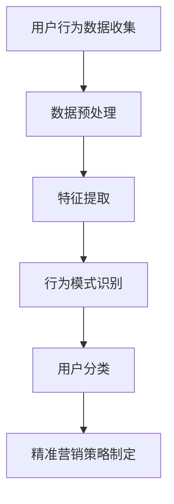

在这个模型中，用户行为数据收集是起点，通过数据预处理和特征提取，可以得到用户的行为特征。行为模式识别步骤使用统计分析和机器学习算法，分析用户的行为数据，识别出不同的行为模式。最后，根据行为模式，将用户分类，为企业提供精准营销策略的制定提供依据。

##### 用户行为分层策略的制定

制定用户行为分层策略通常包括以下几个步骤：

1. **确定分层目标**：明确分层的具体目标，如提高用户留存率、提升购买转化率等。
2. **定义行为指标**：根据业务目标和用户特征，定义关键的用户行为指标，如浏览时长、点击次数、购买频率、参与度等。
3. **数据收集与分析**：收集用户行为数据，并使用数据分析方法，提取用户特征，识别不同的行为模式。
4. **用户分类**：根据行为指标和业务目标，将用户划分为不同的群体，如高频用户、沉默用户、潜在用户等。
5. **策略制定**：根据不同用户群体的特征，制定差异化的营销策略，如针对高频用户提供专属优惠、针对沉默用户进行唤醒等。

以下是一个简单的用户行为分层策略制定的Mermaid流程图：

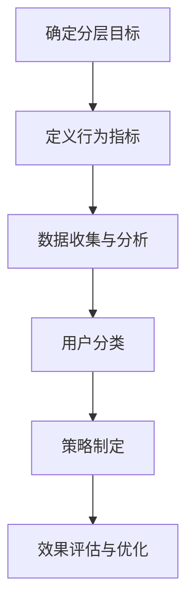

在这个流程中，首先需要明确分层的具体目标，然后定义关键的行为指标。接下来，收集用户行为数据，并进行分析，提取用户特征，进行用户分类。最后，根据不同用户群体的特征，制定差异化的营销策略，并通过效果评估和优化，不断提升营销效果。

##### 用户行为分层策略的实施

用户行为分层策略的实施是确保分层策略有效性的关键环节。以下是一个简单的用户行为分层策略实施流程：

1. **数据收集与处理**：定期收集用户行为数据，并进行预处理，确保数据的质量和准确性。
2. **用户特征提取**：从行为数据中提取关键的用户特征，如浏览时长、点击次数、购买频率、参与度等。
3. **用户分类**：使用算法或手动方法，根据提取的用户特征，将用户划分为不同的群体。
4. **策略执行**：根据用户分层结果，制定并执行差异化的营销策略，如针对高频用户提供专属优惠、针对沉默用户进行唤醒等。
5. **效果监控**：定期监控营销策略的效果，收集用户反馈和转化数据，评估策略的有效性。
6. **策略优化**：根据效果监控结果，对营销策略进行调整和优化，提高策略的有效性。

以下是一个简单的用户行为分层策略实施的Mermaid流程图：

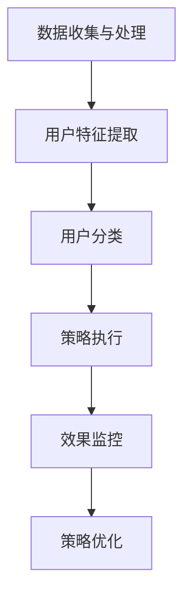

在这个流程中，首先进行数据收集和处理，提取用户特征，进行用户分类。然后，根据用户分层结果，执行差异化的营销策略，并定期监控效果。最后，根据效果监控结果，对策略进行调整和优化，确保策略的有效性。

##### 用户行为分层策略的效果评估

用户行为分层策略的效果评估是确保策略有效性的重要环节。以下是一个简单的效果评估流程：

1. **设定评估指标**：根据业务目标和分层目标，设定需要评估的指标，如用户留存率、购买转化率、用户满意度等。
2. **数据收集**：定期收集与评估指标相关的数据，如用户留存数据、购买数据、用户反馈等。
3. **数据分析**：使用数据分析方法，分析评估指标的变化趋势，评估策略对业务目标的影响。
4. **效果评估**：根据数据分析结果，评估分层策略的有效性，判断是否达到预期目标。
5. **策略调整**：根据效果评估结果，对策略进行调整和优化，以提高策略的有效性。

以下是一个简单的用户行为分层策略效果评估的Mermaid流程图：

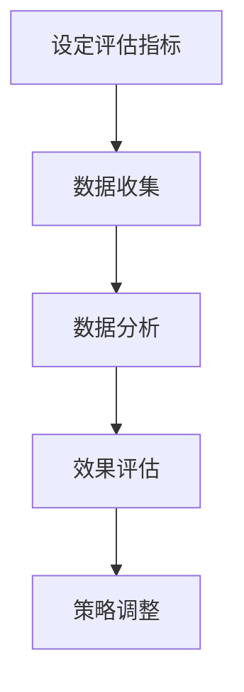

在这个流程中，首先设定评估指标，然后收集相关数据，进行分析和效果评估。最后，根据评估结果，对策略进行调整和优化，确保策略的有效性。

#### 用户需求分层

用户需求分层（Need-Based Segmentation）是一种根据用户对产品或服务的需求和偏好进行分类的方法。通过用户需求分层，企业可以更准确地了解用户的需求，从而提供个性化的产品和服务，提升用户体验和满意度。

##### 用户需求分层的目的

用户需求分层的目的是：

1. **优化产品开发**：根据不同用户群体的需求，优化产品功能和服务，提高产品的市场竞争力。
2. **提升用户满意度**：了解用户的需求，可以提供更加个性化的产品和服务，提升用户满意度。
3. **提高转化率**：针对不同用户群体的需求，制定差异化的营销策略，提高转化率。

##### 用户需求分层模型

一个典型的用户需求分层模型包括以下几个步骤：

1. **需求收集**：通过问卷调查、用户访谈等方式，收集用户的需求信息。
2. **需求分析**：对收集的需求信息进行分析，提取关键的需求特征。
3. **需求分类**：根据提取的需求特征，将用户划分为不同的需求群体。
4. **需求优先级排序**：对用户需求进行优先级排序，确定哪些需求是当前最紧迫的。
5. **需求满足策略制定**：根据需求分类和优先级排序，制定满足用户需求的具体策略。

以下是一个简单的用户需求分层模型的Mermaid流程图：

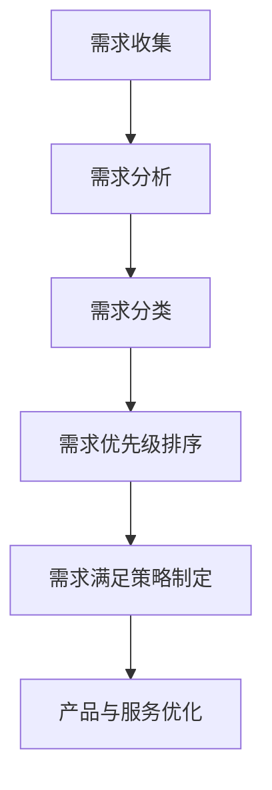

在这个模型中，用户需求收集是起点，通过需求分析和分类，可以将用户划分为不同的需求群体。需求优先级排序可以帮助企业确定哪些需求是最重要的。最后，根据需求分类和优先级排序，制定满足用户需求的具体策略，从而优化产品和服务。

##### 用户需求分层策略的制定

制定用户需求分层策略通常包括以下几个步骤：

1. **确定分层目标**：明确分层的具体目标，如提升用户满意度、提高产品销量等。
2. **定义需求指标**：根据业务目标和用户特征，定义关键的需求指标，如需求频率、需求强度、需求满意度等。
3. **需求数据收集**：通过问卷调查、用户访谈等方式，收集用户的需求信息。
4. **需求分析**：对收集的需求信息进行分析，提取关键的需求特征。
5. **用户分类**：根据提取的需求特征，将用户划分为不同的需求群体。
6. **需求满足策略制定**：根据用户需求分类和优先级排序，制定满足用户需求的具体策略。

以下是一个简单的用户需求分层策略制定的Mermaid流程图：

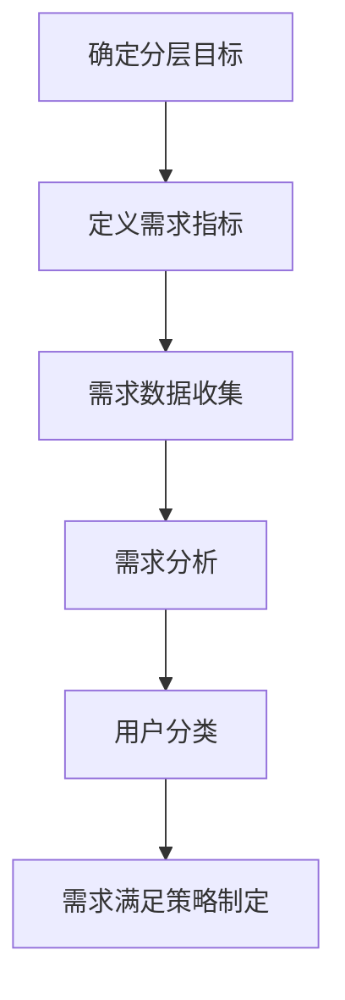

在这个流程中，首先明确分层的具体目标，然后定义需求指标。接下来，收集用户需求数据，进行分析，提取用户特征，进行用户分类。最后，根据用户需求分类和优先级排序，制定满足用户需求的具体策略。

##### 用户需求分层策略的实施

用户需求分层策略的实施是确保分层策略有效性的关键环节。以下是一个简单的用户需求分层策略实施流程：

1. **数据收集与处理**：定期收集用户需求数据，并进行预处理，确保数据的质量和准确性。
2. **需求特征提取**：从用户需求数据中提取关键的需求特征，如需求频率、需求强度、需求满意度等。
3. **用户分类**：使用算法或手动方法，根据提取的需求特征，将用户划分为不同的需求群体。
4. **策略执行**：根据用户需求分类和优先级排序，制定并执行差异化的需求满足策略，如提供个性化推荐、优化产品功能等。
5. **效果监控**：定期监控需求满足策略的效果，收集用户反馈和需求满足数据，评估策略的有效性。
6. **策略优化**：根据效果监控结果，对需求满足策略进行调整和优化，提高策略的有效性。

以下是一个简单的用户需求分层策略实施的Mermaid流程图：


在这个流程中，首先进行数据收集和处理，提取用户需求特征，进行用户分类。然后，根据用户需求分类和优先级排序，执行差异化的需求满足策略，并定期监控效果。最后，根据效果监控结果，对策略进行调整和优化，确保策略的有效性。

##### 用户需求分层策略的效果评估

用户需求分层策略的效果评估是确保策略有效性的重要环节。以下是一个简单的效果评估流程：

1. **设定评估指标**：根据业务目标和分层目标，设定需要评估的指标，如用户满意度、产品销量、用户留存率等。
2. **数据收集**：定期收集与评估指标相关的数据，如用户满意度调查结果、产品销售数据、用户留存数据等。
3. **数据分析**：使用数据分析方法，分析评估指标的变化趋势，评估策略对业务目标的影响。
4. **效果评估**：根据数据分析结果，评估需求满足策略的有效性，判断是否达到预期目标。
5. **策略调整**：根据效果评估结果，对需求满足策略进行调整和优化，以提高策略的有效性。

以下是一个简单的用户需求分层策略效果评估的Mermaid流程图：


在这个流程中，首先设定评估指标，然后收集相关数据，进行分析和效果评估。最后，根据评估结果，对策略进行调整和优化，确保策略的有效性。

#### 用户生命周期分层

用户生命周期分层（Life Cycle Segmentation）是一种根据用户在产品或服务中的生命周期阶段进行分类的方法。用户生命周期通常包括新用户、成长用户、成熟用户和流失用户等阶段。通过用户生命周期分层，企业可以更好地理解和满足不同阶段用户的需求，制定差异化的营销策略，提高用户满意度和留存率。

##### 用户生命周期分层的目的

用户生命周期分层的目的是：

1. **优化用户管理**：通过了解用户在不同生命周期阶段的行为和需求，企业可以更有针对性地进行用户管理和服务。
2. **提升用户体验**：根据用户生命周期的不同阶段，提供个性化的服务和产品，提升用户体验和满意度。
3. **降低用户流失率**：通过识别用户流失的原因，制定针对性的策略，降低用户流失率，提高用户留存率。
4. **提高转化率**：针对不同生命周期阶段的用户，制定差异化的营销策略，提高用户的购买转化率。

##### 用户生命周期分层模型

一个典型的用户生命周期分层模型包括以下几个步骤：

1. **数据收集**：收集与用户生命周期相关的数据，如注册时间、购买时间、活跃度、互动频率等。
2. **数据处理**：清洗和整理数据，确保数据的质量和一致性。
3. **用户阶段划分**：根据用户生命周期数据，将用户划分为不同的阶段，如新用户、成长用户、成熟用户、流失用户等。
4. **用户分类**：根据用户阶段，将用户划分为不同的群体。
5. **生命周期管理策略制定**：根据用户阶段，制定差异化的生命周期管理策略，如新用户策略、成长用户策略、成熟用户策略、流失用户策略等。

以下是一个简单的用户生命周期分层模型的Mermaid流程图：

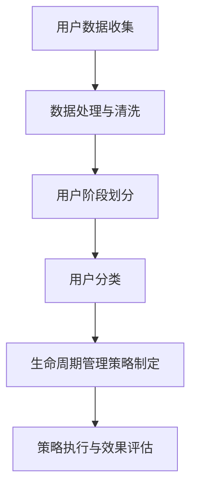

在这个模型中，用户数据收集是起点，通过数据处理和清洗，可以得到高质量的用户数据。用户阶段划分步骤使用统计分析和机器学习算法，分析用户生命周期数据，识别出不同的用户阶段。然后，根据用户阶段，将用户分类，并为不同阶段制定相应的生命周期管理策略。最后，根据用户分类结果和生命周期管理策略，执行具体的策略，并定期评估策略效果。

##### 用户生命周期分层策略的制定

制定用户生命周期分层策略通常包括以下几个步骤：

1. **确定分层目标**：明确分层的具体目标，如提高新用户转化率、降低流失率等。
2. **定义生命周期阶段**：根据用户在产品或服务中的行为和互动，定义不同的生命周期阶段，如新用户、成长用户、成熟用户、流失用户等。
3. **数据收集与分析**：收集用户生命周期数据，并使用数据分析方法，提取用户特征，识别不同的生命周期阶段。
4. **用户分类**：根据用户特征和生命周期阶段，将用户划分为不同的群体。
5. **生命周期管理策略制定**：根据用户分类结果，为不同生命周期阶段的用户制定差异化的管理策略，如新用户策略、成长用户策略、成熟用户策略、流失用户策略等。

以下是一个简单的用户生命周期分层策略制定的Mermaid流程图：

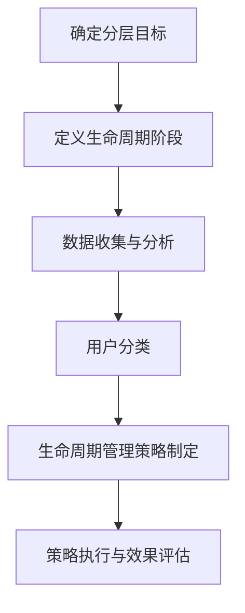

在这个流程中，首先确定分层的具体目标，然后定义生命周期阶段。接下来，收集用户生命周期数据，并进行分析，提取用户特征，进行用户分类。最后，根据用户分类结果，制定差异化的生命周期管理策略，并执行和评估策略效果。

##### 用户生命周期分层策略的实施

用户生命周期分层策略的实施是确保分层策略有效性的关键环节。以下是一个简单的用户生命周期分层策略实施流程：

1. **数据收集与处理**：定期收集用户生命周期数据，并进行预处理，确保数据的质量和准确性。
2. **用户阶段划分**：使用算法或手动方法，根据用户生命周期数据，将用户划分为不同的阶段。
3. **用户分类**：根据用户阶段，将用户划分为不同的群体。
4. **策略执行**：根据用户分类结果，制定并执行差异化的生命周期管理策略，如新用户策略、成长用户策略、成熟用户策略、流失用户策略等。
5. **效果监控**：定期监控生命周期管理策略的效果，收集用户反馈和转化数据，评估策略的有效性。
6. **策略优化**：根据效果监控结果，对生命周期管理策略进行调整和优化，提高策略的有效性。

以下是一个简单的用户生命周期分层策略实施的Mermaid流程图：

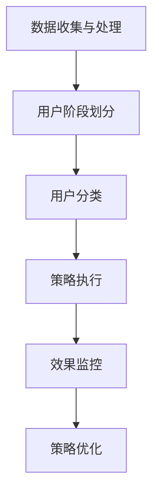

在这个流程中，首先进行数据收集和处理，然后根据用户生命周期数据，划分用户阶段。接下来，根据用户阶段，执行差异化的生命周期管理策略，并定期监控效果。最后，根据效果监控结果，对策略进行调整和优化，确保策略的有效性。

##### 用户生命周期分层策略的效果评估

用户生命周期分层策略的效果评估是确保策略有效性的重要环节。以下是一个简单的效果评估流程：

1. **设定评估指标**：根据业务目标和分层目标，设定需要评估的指标，如新用户转化率、用户留存率、流失率等。
2. **数据收集**：定期收集与评估指标相关的数据，如用户注册数据、购买数据、用户互动数据等。
3. **数据分析**：使用数据分析方法，分析评估指标的变化趋势，评估策略对业务目标的影响。
4. **效果评估**：根据数据分析结果，评估生命周期管理策略的有效性，判断是否达到预期目标。
5. **策略调整**：根据效果评估结果，对生命周期管理策略进行调整和优化，以提高策略的有效性。

以下是一个简单的用户生命周期分层策略效果评估的Mermaid流程图：


在这个流程中，首先设定评估指标，然后收集相关数据，进行分析和效果评估。最后，根据评估结果，对策略进行调整和优化，确保策略的有效性。

### 精准营销策略制定

精准营销策略制定是一个系统化的过程，其核心在于通过对目标用户群体进行精确的定位和差异化的内容提供，以提高营销效果和用户满意度。以下是精准营销策略制定的详细步骤和核心要素。

#### 精准营销策略制定流程

##### 1. 确定业务目标和用户目标

首先，明确企业整体的业务目标，如提升用户转化率、增加品牌知名度、提高用户留存率等。同时，确定具体的用户目标，即希望吸引、保留和转化哪些类型的用户。

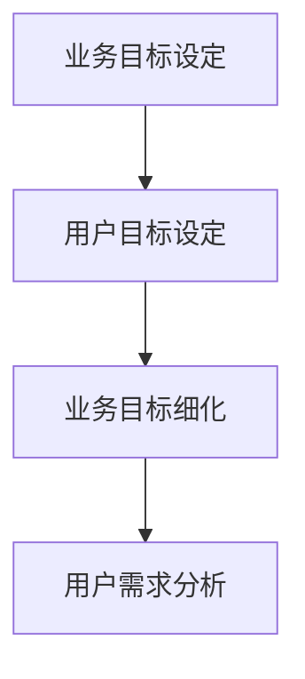

##### 2. 用户画像构建

构建详细的用户画像，包括用户的基本信息（如年龄、性别、地理位置、收入水平等）、行为特征（如购买历史、浏览行为、互动行为等）和需求偏好（如兴趣爱好、消费习惯、品牌偏好等）。用户画像的准确性直接影响精准营销的效果。

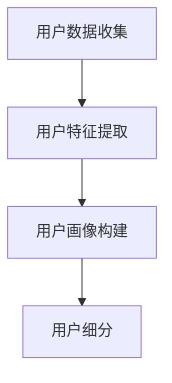

##### 3. 用户细分

基于用户画像，将用户细分为不同的群体。这些群体可以是基于行为特征的（如高频用户、沉默用户等），也可以是基于需求特征的（如基础需求用户、高级需求用户等）。用户细分有助于更精准地定位营销策略。

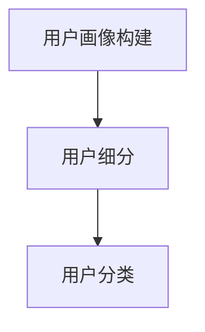

##### 4. 精准营销策略制定

根据不同的用户群体，制定个性化的营销策略。策略应涵盖定位策略、内容策略、渠道策略和互动策略等。例如：

- **定位策略**：明确每个用户群体的目标市场和定位。
- **内容策略**：根据用户特征和需求，定制个性化的营销内容和信息。
- **渠道策略**：选择最适合每个用户群体的营销渠道，如社交媒体、电子邮件、短信等。
- **互动策略**：设计个性化的用户互动活动，提升用户参与度和满意度。

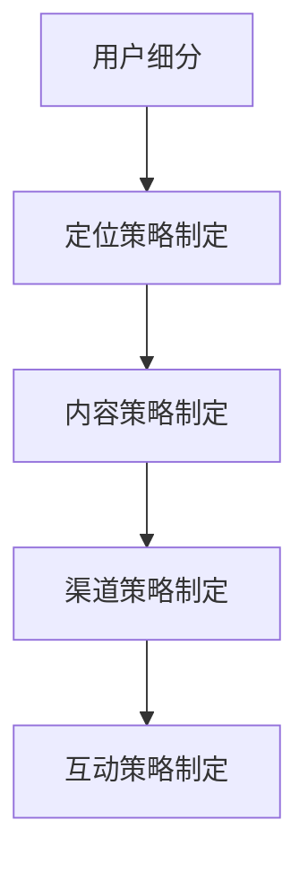

##### 5. 策略执行与监控

执行制定好的营销策略，并实时监控策略的效果。根据监控数据，不断调整和优化策略，确保达到预期目标。

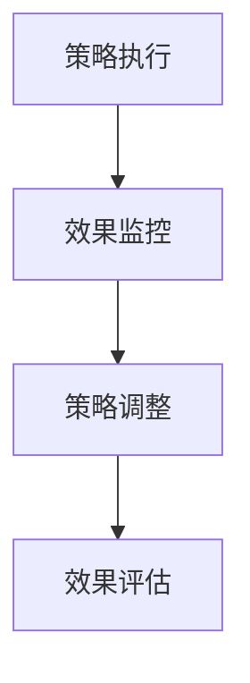

#### 精准营销策略制定的核心要素

##### 1. 用户画像

用户画像（User Persona）是精准营销策略制定的基础。通过用户画像，可以清晰地了解目标用户群体的特征和需求，从而制定更加精准的营销策略。

**用户画像要素**：

- **基本信息**：年龄、性别、地理位置、职业等。
- **行为特征**：购买历史、浏览行为、互动行为等。
- **需求偏好**：兴趣爱好、消费习惯、品牌偏好等。

##### 2. 定位策略

定位策略（Positioning Strategy）是指明确产品或服务在市场中的独特价值，并选择最适合的目标市场。定位策略的成功与否直接影响精准营销的效果。

**定位策略要素**：

- **目标市场**：明确目标用户群体和市场范围。
- **独特卖点**：提炼产品或服务的独特卖点和竞争优势。
- **品牌形象**：塑造品牌形象，提升品牌知名度和认可度。

##### 3. 内容策略

内容策略（Content Strategy）是指根据用户需求和偏好，制定个性化的营销内容和信息。高质量的内容不仅能吸引和留住用户，还能提高用户的参与度和转化率。

**内容策略要素**：

- **内容形式**：文本、图片、视频、音频等多种形式。
- **内容主题**：围绕用户需求和兴趣，制定相关的内容主题。
- **内容发布**：选择合适的发布渠道和时机，提高内容的曝光率和传播效果。

##### 4. 渠道策略

渠道策略（Channel Strategy）是指选择最适合目标用户的营销渠道，进行精准的推广和传播。不同渠道有不同的优势和特点，需要根据用户特征和营销目标进行选择。

**渠道策略要素**：

- **渠道类型**：社交媒体、电子邮件、短信、搜索引擎等。
- **渠道优势**：分析不同渠道的优势和适用场景。
- **渠道整合**：整合多种渠道，形成协同效应，提高营销效果。

##### 5. 互动策略

互动策略（Engagement Strategy）是指通过用户互动活动，提升用户的参与度和满意度。有效的互动策略可以增强用户对品牌的认知和忠诚度。

**互动策略要素**：

- **互动活动**：设计多样化的互动活动，如抽奖、优惠券、问答等。
- **互动频率**：合理控制互动频率，避免过度打扰用户。
- **互动效果**：分析互动活动的效果，不断优化互动策略。

#### 精准营销策略制定案例分析

以下是一个简单的精准营销策略制定案例分析：

**案例背景**：

一家电商公司，主要销售时尚衣物，目标用户群体为20-35岁的女性。

**用户画像**：

- **基本信息**：年龄在20-35岁之间，主要为城市白领和学生。
- **行为特征**：喜欢在社交媒体上浏览时尚资讯，经常参与线上购物活动。
- **需求偏好**：关注时尚趋势，喜欢个性化定制和优惠活动。

**定位策略**：

- **目标市场**：年轻女性市场。
- **独特卖点**：提供高品质、个性化定制的时尚衣物。
- **品牌形象**：塑造年轻、时尚、个性化的品牌形象。

**内容策略**：

- **内容形式**：社交媒体上的时尚搭配分享、博客文章、视频教程。
- **内容主题**：时尚趋势分析、搭配建议、购物指南。
- **内容发布**：在社交媒体上定期发布内容，利用SEO优化提升搜索引擎曝光率。

**渠道策略**：

- **渠道类型**：社交媒体（如Instagram、微博）、电子邮件、短信。
- **渠道优势**：社交媒体可以吸引目标用户，电子邮件和短信可以提升用户参与度。
- **渠道整合**：通过社交媒体吸引流量，利用电子邮件进行用户互动和促销活动。

**互动策略**：

- **互动活动**：定期举办线上抽奖活动、优惠券发放、用户互动问答。
- **互动频率**：每周发布一次社交媒体内容，每月发送一次电子邮件。
- **互动效果**：通过用户反馈和参与度数据，不断优化互动策略。

通过以上案例，我们可以看到精准营销策略制定的过程和核心要素。在实际应用中，企业需要根据自身情况和目标用户特征，灵活调整和优化策略，以实现最佳营销效果。

### 精准营销实施与优化

精准营销实施与优化是确保营销策略有效性的关键环节。以下是精准营销实施与优化的详细步骤和方法。

#### 精准营销实施策略

##### 1. 数据准备

数据准备是精准营销的基础，包括数据收集、数据清洗和数据存储。

- **数据收集**：收集与用户相关的各种数据，如行为数据、需求数据、互动数据等。
- **数据清洗**：去除重复数据、缺失数据和异常数据，确保数据质量。
- **数据存储**：将清洗后的数据存储在数据库中，便于后续分析和处理。

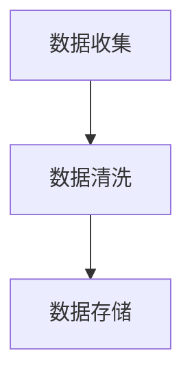

##### 2. 用户画像构建

基于收集的数据，构建详细的用户画像，包括基本信息、行为特征和需求偏好。

- **基本信息**：如年龄、性别、地理位置、职业等。
- **行为特征**：如浏览行为、购买行为、互动行为等。
- **需求偏好**：如兴趣爱好、消费习惯、品牌偏好等。

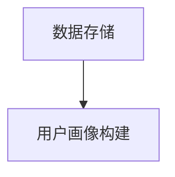

##### 3. 用户分类

根据用户画像，将用户划分为不同的群体，如新用户、活跃用户、沉默用户等。

- **新用户**：最近注册或首次互动的用户。
- **活跃用户**：在一定时间内频繁互动或购买的用户。
- **沉默用户**：长时间没有互动或购买行为的用户。

```mermaid
graph TD
    A[用户画像构建] --> B[用户分类]
```

##### 4. 精准营销策略制定

根据用户分类结果，为不同群体制定差异化的营销策略。

- **新用户策略**：通过欢迎邮件、注册优惠等吸引新用户。
- **活跃用户策略**：通过个性化推荐、专属优惠等提高活跃度。
- **沉默用户策略**：通过唤醒邮件、限时优惠等重新激发兴趣。

```mermaid
graph TD
    A[用户分类] --> B[精准营销策略制定]
```

##### 5. 策略执行

执行制定好的营销策略，包括内容发布、渠道推广和用户互动。

- **内容发布**：根据用户偏好，发布有针对性的内容。
- **渠道推广**：选择合适的渠道进行推广，如社交媒体、电子邮件等。
- **用户互动**：通过互动活动，提高用户参与度和满意度。

```mermaid
graph TD
    A[精准营销策略制定] --> B[策略执行]
```

#### 精准营销优化策略

##### 1. 数据反馈收集

通过用户行为数据和用户反馈，收集营销活动的效果数据。

- **用户行为数据**：如点击率、转化率、互动率等。
- **用户反馈**：如满意度调查、评论、反馈等。

```mermaid
graph TD
    B[策略执行] --> C[数据反馈收集]
```

##### 2. 策略效果评估

使用数据分析方法，评估不同营销策略的效果。

- **A/B测试**：对比不同策略的效果，找出最优策略。
- **数据可视化**：使用图表和报表，直观展示策略效果。

```mermaid
graph TD
    C[数据反馈收集] --> D[策略效果评估]
```

##### 3. 策略调整

根据效果评估结果，对策略进行调整和优化。

- **优化内容**：根据用户反馈，调整内容策略，提高用户满意度。
- **调整渠道**：根据用户行为数据，优化渠道选择和推广方式。
- **优化互动**：根据用户互动效果，调整互动策略，提高用户参与度。

```mermaid
graph TD
    D[策略效果评估] --> E[策略调整]
```

##### 4. 持续优化

通过持续的数据分析和用户反馈，不断优化营销策略。

- **定期评估**：定期评估营销策略效果，及时调整。
- **数据驱动**：基于数据分析，持续优化营销策略，提高效果。

```mermaid
graph TD
    E[策略调整] --> F[持续优化]
```

#### 精准营销实施与优化的案例分析

以下是一个简单的精准营销实施与优化的案例分析：

**案例背景**：

一家电商公司，主要销售家居用品，目标用户群体为20-40岁的女性。

**数据准备**：

- **数据收集**：收集用户注册数据、购买数据、浏览数据等。
- **数据清洗**：去除重复数据和缺失数据，确保数据质量。
- **数据存储**：将清洗后的数据存储在数据库中，便于后续分析。

**用户画像构建**：

- **基本信息**：年龄在20-40岁之间，主要为城市白领。
- **行为特征**：喜欢在电商平台上浏览家居用品，购买频率较高。
- **需求偏好**：注重家居装饰的美观和实用性。

**用户分类**：

- **新用户**：最近注册或首次购买的用户。
- **活跃用户**：在过去三个月内频繁浏览或购买的用户。
- **沉默用户**：在过去三个月内没有互动或购买行为的用户。

**精准营销策略制定**：

- **新用户策略**：通过注册优惠和首单减免，吸引新用户。
- **活跃用户策略**：通过个性化推荐和专属优惠，提高活跃度。
- **沉默用户策略**：通过唤醒邮件和限时优惠，重新激发兴趣。

**策略执行**：

- **内容发布**：在社交媒体上发布家居装饰的图片和视频，提供搭配建议。
- **渠道推广**：通过电子邮件和短信，向用户推送个性化的推荐和优惠信息。
- **用户互动**：通过在线问答和评论互动，提高用户参与度。

**数据反馈收集**：

- **用户行为数据**：监控用户的点击率、转化率、互动率等。
- **用户反馈**：收集用户对产品和服务的评价和建议。

**策略效果评估**：

- **A/B测试**：对比不同营销策略的效果，找出最优策略。
- **数据可视化**：使用图表和报表，直观展示策略效果。

**策略调整**：

- **优化内容**：根据用户反馈，调整内容策略，提高用户满意度。
- **调整渠道**：根据用户行为数据，优化渠道选择和推广方式。
- **优化互动**：根据用户互动效果，调整互动策略，提高用户参与度。

**持续优化**：

- **定期评估**：每月评估营销策略效果，及时调整。
- **数据驱动**：基于数据分析，持续优化营销策略，提高效果。

通过以上案例分析，我们可以看到精准营销实施与优化的具体步骤和方法。在实际应用中，企业需要根据自身情况和目标用户特征，灵活调整和优化策略，以实现最佳营销效果。

### 精准营销效果评估与改进

精准营销效果评估与改进是确保营销策略持续有效的重要环节。以下详细阐述评估指标、评估方法以及效果改进策略。

#### 精准营销效果评估指标

精准营销效果评估的关键在于设定合理的评估指标，这些指标可以反映营销活动的效果，帮助企业了解目标达成情况。

- **用户转化率**：衡量用户从接触到最终转化的比例，是评估营销活动效果的重要指标。
  $$ 转化率 = \frac{转化人数}{接触人数} \times 100\% $$
- **点击率（CTR）**：衡量用户对广告或内容的点击比例，反映了营销内容的吸引力。
  $$ 点击率 = \frac{点击次数}{展示次数} \times 100\% $$
- **平均订单价值（AOV）**：衡量用户平均每次购买的价值，反映营销活动对用户购买行为的推动效果。
  $$ AOV = \frac{总销售额}{订单数量} $$
- **客户获取成本（CAC）**：衡量获取一个新客户所需的成本，用于评估营销活动的成本效益。
  $$ CAC = \frac{总营销成本}{新增客户数量} $$
- **客户生命周期价值（CLV）**：衡量一个客户在其生命周期内为企业带来的总价值，用于评估长远的营销投入回报。
  $$ CLV = \frac{（期望未来利润 × 顾客生存时间）}{（1 + 资本成本率）^n} $$
- **用户留存率**：衡量用户在一定时间后仍然活跃的比例，反映了营销活动对用户留存效果的影响。

#### 精准营销效果评估方法

1. **数据分析方法**：
   - **描述性分析**：分析营销活动的整体效果，如用户转化率、点击率等。
   - **推断性分析**：通过样本数据推断整体效果，如A/B测试。
   - **预测性分析**：基于历史数据预测未来效果，如用户流失预测。

2. **A/B测试**：
   - **测试设计**：设置控制组和实验组，比较两组的营销效果。
   - **数据收集**：收集实验数据，对比两组的转化率、点击率等指标。
   - **结果分析**：评估实验组的改进效果，确定最佳策略。

3. **用户调研**：
   - **问卷调查**：通过问卷收集用户对营销活动的反馈。
   - **深度访谈**：与用户进行一对一访谈，深入了解用户需求和偏好。

#### 精准营销效果改进策略

1. **目标设定**：
   - **明确目标**：设定具体的营销目标，如提高用户转化率、增加品牌知名度等。

2. **数据驱动的决策**：
   - **数据监控**：实时监控关键指标，及时发现和解决问题。
   - **数据驱动**：基于数据分析结果，调整营销策略，优化资源配置。

3. **内容优化**：
   - **用户画像**：根据用户画像，提供个性化的内容和信息。
   - **内容创新**：持续优化内容和形式，提升用户体验。

4. **渠道优化**：
   - **渠道选择**：根据用户行为数据，选择最有效的推广渠道。
   - **多渠道整合**：结合多种渠道，形成协同效应。

5. **用户体验改进**：
   - **简化流程**：优化购买流程，提高用户转化率。
   - **提高响应速度**：快速响应用户需求和反馈。

6. **持续迭代**：
   - **定期评估**：定期评估营销效果，持续优化策略。
   - **创新尝试**：不断尝试新的营销方法和技术，提高营销效果。

#### 案例分析

**案例背景**：

一家电商公司，主要销售时尚衣物，目标用户群体为20-35岁的女性。

**效果评估指标**：
- 用户转化率
- 点击率（CTR）
- 平均订单价值（AOV）
- 客户获取成本（CAC）
- 用户留存率

**效果评估方法**：
- 描述性分析：通过数据报表，了解整体营销效果。
- A/B测试：对比不同营销策略的效果，找出最佳方案。
- 用户调研：通过问卷调查和深度访谈，了解用户需求和偏好。

**效果改进策略**：
- **用户画像构建**：根据用户数据，细分用户群体，提供个性化推荐。
- **内容优化**：通过用户反馈，优化产品页面描述和推荐内容。
- **渠道优化**：根据用户行为数据，调整广告投放策略，提高点击率和转化率。
- **用户体验改进**：简化购物流程，提高页面加载速度，提升用户满意度。
- **持续迭代**：每月评估营销效果，根据用户反馈和数据分析，调整和优化营销策略。

通过以上案例分析，我们可以看到精准营销效果评估与改进的具体实施方法。在实际操作中，企业需要灵活运用各种评估方法和改进策略，不断提高营销效果，实现长期发展目标。

### 创业公司用户分层与精准营销最佳实践总结

在创业公司的成长过程中，用户分层与精准营销策略的应用不仅能够有效提升用户满意度，还能显著提高市场竞争力。以下是对创业公司在用户分层与精准营销方面的最佳实践总结，以及相应的案例分析。

#### 最佳实践总结

1. **数据驱动的决策**：
   - **数据分析**：创业公司应注重数据收集和分析，通过数据分析了解用户行为和需求，制定精准的营销策略。
   - **用户画像**：构建详细的用户画像，有助于企业了解目标用户群体的特征和偏好，从而提供个性化的服务和产品。

2. **用户分层策略**：
   - **行为分层**：根据用户的浏览、购买和互动行为，将用户分为不同的群体，如新用户、活跃用户和潜在用户等。
   - **需求分层**：根据用户对产品或服务的需求，将用户分为基础需求用户、高级需求用户和潜在需求用户等。
   - **生命周期分层**：根据用户在产品中的生命周期阶段，将用户分为新用户、成长用户、成熟用户和流失用户等。

3. **精准营销策略**：
   - **内容个性化**：根据用户画像和需求，提供个性化的内容和服务，提高用户的参与度和满意度。
   - **渠道选择**：根据用户特征和行为，选择最有效的营销渠道，如社交媒体、电子邮件、短信等。
   - **互动优化**：通过互动活动，提高用户的参与度和忠诚度，如在线问答、抽奖、优惠券发放等。

4. **持续优化与评估**：
   - **效果监控**：定期监控营销活动的效果，收集用户反馈和数据，评估策略的有效性。
   - **策略调整**：根据效果评估结果，及时调整营销策略，不断优化和改进。

#### 案例分析

1. **电商平台的用户分层与精准营销实践**：

   - **案例背景**：一家电商公司，销售各类家居用品，目标用户群体为20-35岁的女性。

   - **用户分层策略**：
     - **行为分层**：将用户分为新用户、活跃用户和沉默用户。
     - **需求分层**：根据用户购买历史和偏好，将用户分为基础需求用户、高级需求用户和潜在需求用户。
     - **生命周期分层**：根据用户注册时间和购买频率，将用户分为新用户、成长用户、成熟用户和流失用户。

   - **精准营销策略**：
     - **新用户策略**：通过注册优惠和首单减免，吸引新用户。
     - **活跃用户策略**：通过个性化推荐和专属优惠，提高活跃度。
     - **潜在用户策略**：通过推送相关商品信息和限时优惠，引导潜在用户购买。
     - **流失用户策略**：通过唤醒邮件和限时优惠，重新激发流失用户的兴趣。

   - **效果评估与优化**：
     - **效果评估**：通过用户转化率、点击率、平均订单价值和用户留存率等指标，评估营销策略的效果。
     - **策略调整**：根据用户反馈和数据分析，不断优化营销策略，提高用户满意度和转化率。

2. **社交媒体平台的用户分层与精准营销实践**：

   - **案例背景**：一家社交媒体平台，提供内容分享和互动功能，目标用户群体为年轻人。

   - **用户分层策略**：
     - **行为分层**：将用户分为活跃用户、参与用户和沉默用户。
     - **需求分层**：根据用户在平台上的互动行为和内容偏好，将用户分为基础需求用户、高级需求用户和潜在需求用户。
     - **生命周期分层**：根据用户注册时间和活跃度，将用户分为新用户、成长用户、成熟用户和流失用户。

   - **精准营销策略**：
     - **活跃用户策略**：为活跃用户提供专属徽章、积分奖励等，激励他们的持续参与。
     - **参与用户策略**：推送热门话题和互动活动，提高用户的互动频率。
     - **潜在用户策略**：通过推送相关内容和推荐互动话题，引导潜在用户进行互动。
     - **流失用户策略**：通过发送通知和推送文章，提醒流失用户，并提供限时互动机会。

   - **效果评估与优化**：
     - **效果评估**：通过用户活跃度、互动率、用户留存率等指标，评估营销策略的效果。
     - **策略调整**：根据用户反馈和数据分析，不断优化营销策略，提高用户活跃度和参与度。

通过以上案例分析，我们可以看到创业公司在用户分层与精准营销方面的最佳实践。这些实践不仅帮助创业公司更好地了解用户需求和行为，还提高了营销效果和用户满意度，为企业的持续发展奠定了坚实基础。

### 附录

#### 附录 A：用户分层与精准营销相关工具

在用户分层与精准营销的过程中，各种工具的使用能够显著提升数据分析的效率和精准度。以下是一些常用的工具：

- **数据分析工具**：
  - **Excel**：适用于简单数据的分析和可视化。
  - **Python**：通过Pandas、NumPy等库进行复杂的数据处理和分析。
  - **R**：适用于统计分析和数据可视化，具有丰富的统计模型和包。

- **用户行为分析工具**：
  - **Google Analytics**：提供全面的网站用户行为数据分析。
  - **Mixpanel**：专注于用户行为分析，支持实时监控和报告。
  - **Kissmetrics**：提供用户旅程映射和转化跟踪功能。

- **用户画像工具**：
  - **Hevo Data**：用于数据集成，将不同数据源的数据导入到一个统一平台。
  - **UserPersona**：帮助创建详细的用户画像，用于指导产品设计和营销策略。

#### 附录 B：用户分层与精准营销相关书籍

- **《精益创业》**：作者埃里克·莱斯，介绍了精益创业的方法，包括用户需求验证和MVP（最小可行产品）。
- **《增长黑客》**：作者范·瓦格纳，介绍了如何通过数据驱动的方法实现企业增长，包括用户分层和A/B测试。
- **《用户画像》**：作者李华，详细介绍了用户画像的概念、构建方法和应用场景。

#### 附录 C：用户分层与精准营销相关网站

- **Google Analytics**：[https://www.google.com/analytics/](https://www.google.com/analytics/)
- **Mixpanel**：[https://mixpanel.com/](https://mixpanel.com/)
- **HubSpot**：[https://www.hubspot.com/](https://www.hubspot.com/)
- **Kissmetrics**：[https://kissmetrics.com/](https://kissmetrics.com/)

通过这些工具、书籍和网站的资源，企业可以更好地理解和应用用户分层与精准营销的方法，提升营销效果和用户满意度。

