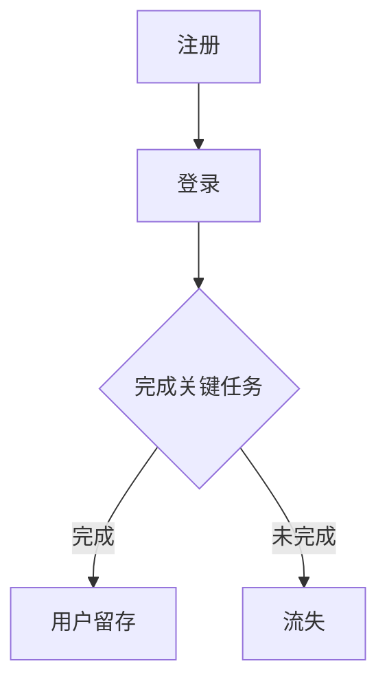
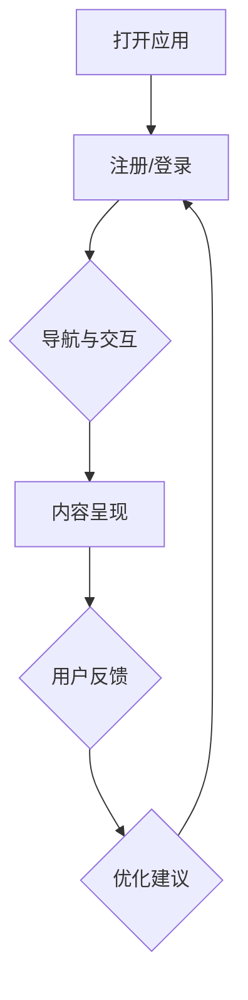

                 

## 《创业公司的用户激活与首次体验优化》

### 关键词：
- 用户激活
- 首次体验
- 创业公司
- 用户体验优化
- 数据分析
- 机器学习

### 摘要：
本文旨在探讨创业公司在产品推出初期如何通过用户激活和首次体验优化来提升用户留存率和转化率。文章将详细分析用户激活的概念与重要性，用户行为分析与激活策略，首次体验的构成要素，优化策略，以及实际案例与应用。通过深入剖析，本文希望为创业公司提供一套切实可行的用户激活与首次体验优化方案，助力企业在竞争激烈的市场中脱颖而出。

## 《创业公司的用户激活与首次体验优化》目录大纲

### 第一部分：用户激活概述

#### 第1章：用户激活的概念与重要性
- 1.1 用户激活的定义
- 1.2 用户激活的重要性
- 1.3 用户激活与首次体验的关系

#### 第2章：用户行为分析与激活策略
- 2.1 用户行为分析
- 2.2 用户激活策略
- 2.3 用户激活的常见误区与解决方法

### 第二部分：首次体验优化

#### 第3章：首次体验的构成要素
- 3.1 产品设计原则
- 3.2 导航与交互设计
- 3.3 内容呈现与展示设计

#### 第4章：首次体验优化策略
- 4.1 用户体验地图
- 4.2 优化用户路径
- 4.3 提升用户留存策略

#### 第5章：首次体验的测试与评估
- 5.1 用户测试方法
- 5.2 用户体验评估指标
- 5.3 优化反馈与迭代

### 第三部分：实际案例与应用

#### 第6章：创业公司用户激活与首次体验优化的成功案例
- 6.1 案例一：社交媒体平台的用户激活与首次体验优化
- 6.2 案例二：电子商务平台的用户激活与首次体验优化
- 6.3 案例三：移动应用程序的用户激活与首次体验优化

#### 第7章：用户激活与首次体验优化的技术实现
- 7.1 技术实现概述
- 7.2 数据分析与机器学习在用户激活中的应用
- 7.3 用户行为追踪与反馈系统

#### 第8章：持续优化与战略规划
- 8.1 持续优化的重要性
- 8.2 战略规划与实施
- 8.3 用户反馈机制与改进方案

### 附录

#### 附录A：用户激活与首次体验优化工具与资源
- 通用工具与资源
- 数据分析与机器学习框架
- 用户测试工具

#### 附录B：Mermaid 流程图示例
- 用户激活流程
- 用户首次体验优化流程

#### 附录C：数学模型与伪代码
- 用户留存率计算模型
- 用户激活率计算模型

#### 附录D：实际案例代码解析
- 案例一：用户激活与首次体验优化的代码实现
- 案例二：用户行为分析与反馈系统的代码实现

通过以上目录大纲，我们可以看到，本文将深入探讨用户激活与首次体验优化这两个关键环节。首先，我们将从概念和重要性出发，逐步分析用户激活的过程和策略，并介绍如何避免常见的误区。接着，我们将聚焦于首次体验的构成要素，详细探讨如何优化用户路径和提升用户留存策略。在第三部分，我们将通过实际案例来展示这些策略的应用效果，并提供技术实现的详细指导。最后，我们将讨论持续优化与战略规划的重要性，并总结全文。

### 第一部分：用户激活概述

在创业公司的产品开发过程中，用户激活是一个至关重要的环节。用户激活指的是引导新用户完成注册、登录和使用产品等一系列行为，从而实现用户的初步使用和互动。本文第一部分将围绕用户激活的概念、重要性以及用户激活与首次体验的关系进行深入探讨。

#### 第1章：用户激活的概念与重要性

**1.1 用户激活的定义**

用户激活通常指的是用户与产品产生实际互动的过程，这一过程可能包括以下步骤：

1. 用户注册：用户在平台上创建账户，提供必要的信息。
2. 用户登录：用户通过账户登录平台，进入产品使用环境。
3. 完成关键任务：用户在平台上完成首次关键任务，如创建个人资料、添加好友、首次购买等。

用户激活的定义可以进一步细化为用户行为分析、用户活跃度指标和用户留存率。用户行为分析是指通过分析用户在平台上的行为，了解其兴趣和使用习惯。用户活跃度指标包括日活跃用户数（DAU）、月活跃用户数（MAU）等。用户留存率是指在一定时间内，仍然活跃使用产品的用户比例。

**1.2 用户激活的重要性**

用户激活对创业公司来说具有重要意义，具体体现在以下几个方面：

1. **验证产品价值**：通过用户激活，可以验证产品是否解决了用户的实际问题，是否满足了用户的需求。
2. **提高用户留存率**：用户激活是用户留存的基础。一旦用户成功激活，他们更有可能继续使用产品，从而提高长期留存率。
3. **促进产品迭代**：通过分析用户激活过程中的数据，可以识别产品存在的问题，为产品迭代提供依据。
4. **降低用户获取成本**：激活用户比获取新用户成本更低，通过激活策略，可以在有限的资源下最大化用户价值。

**1.3 用户激活与首次体验的关系**

用户激活与首次体验密切相关。首次体验是用户与产品的第一次亲密接触，用户体验的好坏直接影响到用户是否愿意继续使用产品。以下是用户激活与首次体验之间的几个关键点：

1. **用户体验是激活的前提**：良好的用户体验可以吸引新用户，促使其完成注册和登录等激活步骤。
2. **激活步骤影响用户体验**：激活过程中的每个步骤都可能影响用户体验。简化和优化激活流程可以提高用户体验。
3. **激活后的使用行为影响留存率**：如果用户在激活后的首次使用体验不佳，他们可能会放弃使用产品，从而降低留存率。

通过以上分析，我们可以看到用户激活不仅是一个技术问题，更是一个用户体验问题。在创业公司中，重视用户激活和首次体验优化，有助于提高用户留存率，推动产品成功。

#### 第2章：用户行为分析与激活策略

**2.1 用户行为分析**

用户行为分析是用户激活策略制定的基础。通过分析用户的行为数据，我们可以了解用户的兴趣、偏好和使用习惯，从而制定更加有效的激活策略。以下是一些常见的用户行为分析方法和工具：

1. **行为追踪工具**：使用行为追踪工具（如Google Analytics、Mixpanel等）可以收集用户在平台上的行为数据，包括页面浏览、点击、搜索等。

2. **用户画像**：通过分析用户行为数据，可以构建用户画像。用户画像包括用户的基本信息、兴趣爱好、消费习惯等。用户画像可以帮助我们更好地了解用户需求，从而制定个性化的激活策略。

3. **行为路径分析**：通过分析用户在平台上的行为路径，可以了解用户在完成关键任务时的行为模式。例如，分析用户从注册到完成首次购买的路径，可以帮助我们识别激活过程中的瓶颈。

4. **留存分析**：通过留存分析，可以了解用户在一段时间内的活跃情况。例如，分析用户在30天内的留存率，可以帮助我们评估激活策略的有效性。

**2.2 用户激活策略**

基于用户行为分析，我们可以制定一系列激活策略来提高用户的激活率。以下是一些常见的用户激活策略：

1. **简化注册流程**：复杂的注册流程会阻碍用户激活。简化注册流程，如使用社交媒体账号登录、一次性注册等，可以降低用户激活的门槛。

2. **引导用户完成关键任务**：在用户注册后，引导他们完成首次关键任务，如创建个人资料、添加好友、首次购买等。通过提示和激励，鼓励用户完成这些任务。

3. **个性化推荐**：根据用户画像和行为数据，提供个性化的推荐。例如，向新用户推荐他们可能感兴趣的内容或商品，提高用户的参与度。

4. **激励措施**：提供激励措施，如优惠券、积分、奖励等，鼓励用户完成激活步骤。激励措施可以增加用户对产品的兴趣和忠诚度。

5. **社交媒体推广**：利用社交媒体平台进行推广，吸引潜在用户。通过口碑传播和用户推荐，可以进一步提高用户激活率。

**2.3 用户激活的常见误区与解决方法**

在用户激活过程中，一些常见的误区可能会导致激活效果不佳。以下是一些常见误区及其解决方法：

1. **过度依赖技术手段**：过分依赖技术手段进行用户激活，而忽视了用户体验。解决方法：在技术手段的基础上，注重用户体验，确保激活流程简洁明了，符合用户习惯。

2. **缺乏数据支持**：在制定激活策略时，缺乏充足的数据支持。解决方法：通过用户行为分析，获取准确的数据，为激活策略提供依据。

3. **忽视用户需求**：激活策略未能充分考虑用户需求，导致用户不感兴趣或无法成功激活。解决方法：深入了解用户需求，制定以用户为中心的激活策略。

4. **激励措施不当**：激励措施不当，如奖品不够吸引人、发放方式不合理等，可能导致用户参与度不高。解决方法：根据用户需求和偏好，设计有吸引力的激励措施，并优化发放方式。

通过用户行为分析和激活策略的有效结合，创业公司可以大幅提升用户激活率，为产品的成功奠定基础。

### 第二部分：首次体验优化

首次体验是用户与产品之间的第一次接触，其好坏直接影响用户的满意度和留存率。本部分将探讨首次体验的构成要素、优化策略及其在用户留存策略中的重要作用。

#### 第3章：首次体验的构成要素

**3.1 产品设计原则**

产品设计原则是确保首次体验成功的关键。以下是一些核心的产品设计原则：

1. **简洁性**：简化界面设计，减少用户操作步骤，避免不必要的复杂性。
2. **易用性**：确保用户能够轻松上手，快速完成任务，避免用户在使用过程中产生困惑。
3. **直观性**：界面设计应直观明了，操作逻辑符合用户预期，减少用户的学习成本。
4. **响应性**：确保产品在不同设备上的良好表现，提升用户的使用体验。

**3.2 导航与交互设计**

导航与交互设计直接影响用户在产品中的操作流畅度。以下是几个关键点：

1. **清晰的导航结构**：提供清晰的导航菜单，帮助用户快速找到所需功能。
2. **简洁的交互设计**：减少点击次数，优化交互流程，确保用户能够顺畅地进行操作。
3. **适当的反馈**：在用户进行操作时，提供即时的反馈，如确认提示、错误提示等，增强用户体验。
4. **个性化导航**：根据用户的行为和偏好，提供个性化的导航和内容推荐，提高用户的参与度。

**3.3 内容呈现与展示设计**

内容呈现与展示设计决定了用户对产品的第一印象。以下是几个关键点：

1. **优质的视觉设计**：使用高质量的图片和图标，打造美观、专业的界面，提升产品的视觉吸引力。
2. **内容结构清晰**：确保内容结构层次分明，方便用户快速获取关键信息。
3. **有效的信息传达**：使用简明扼要的文字和清晰的图表，有效地传达产品的功能和优势。
4. **适度的广告和引导**：在适当的位置展示广告和引导内容，提高用户的参与度和转化率。

#### 第4章：首次体验优化策略

**4.1 用户体验地图**

用户体验地图（User Experience Map）是一种视觉化工具，用于描述用户在产品中的旅程和体验。通过绘制用户体验地图，我们可以识别用户体验中的痛点，从而制定针对性的优化策略。以下是绘制用户体验地图的步骤：

1. **定义用户旅程**：确定用户在产品中的主要活动，如注册、登录、浏览、购买等。
2. **描述用户情感**：在每个活动节点，记录用户的情感状态，如兴奋、满意、困惑等。
3. **识别痛点**：分析用户在旅程中的不满和障碍，找出需要优化的环节。
4. **制定优化方案**：根据痛点，制定具体的优化措施，如简化操作步骤、提供帮助文档等。

**4.2 优化用户路径**

优化用户路径是提升首次体验的重要策略。以下是几个关键点：

1. **简化注册流程**：减少注册步骤，提供一键注册和第三方账号登录选项，降低用户激活门槛。
2. **提供引导和提示**：在用户初次使用产品时，提供明确的引导和提示，帮助用户快速上手。
3. **优化导航结构**：确保导航结构清晰，减少用户在产品中的迷失感。
4. **优化交互设计**：简化交互流程，减少用户操作的复杂度，提高用户操作的流畅度。

**4.3 提升用户留存策略**

提升用户留存策略是确保用户长期使用产品的重要手段。以下是几个关键点：

1. **提供优质内容**：确保产品内容丰富、有价值，满足用户的需求，提高用户的留存意愿。
2. **定期更新和迭代**：不断优化产品功能和界面，满足用户的新需求，提高用户的参与度。
3. **激励机制**：通过积分、优惠券、奖励等激励机制，鼓励用户长期使用产品。
4. **用户反馈机制**：建立有效的用户反馈机制，及时收集用户意见和建议，不断改进产品。

通过以上优化策略，创业公司可以显著提升用户的首次体验，从而提高用户留存率和转化率，为产品的长期发展奠定基础。

#### 第5章：首次体验的测试与评估

在创业公司中，首次体验的测试与评估是确保优化策略有效性的关键环节。通过系统的测试和评估，我们可以识别用户体验中的问题，从而不断迭代和改进产品。以下是首次体验测试与评估的方法和指标。

**5.1 用户测试方法**

用户测试是获取真实用户体验反馈的重要手段。以下是几种常见的用户测试方法：

1. **可用性测试**：通过邀请目标用户参与实际操作，观察他们在使用产品过程中的行为和反馈，识别用户体验中的问题和障碍。
2. **问卷调查**：设计针对用户体验的问卷，收集用户的意见和建议。问卷调查可以大规模收集数据，为优化提供参考。
3. **A/B测试**：将不同的用户体验设计展示给不同用户群体，比较不同设计的效果，从而选择最优方案。
4. **访谈**：与用户进行深度访谈，了解他们对产品的真实感受和需求，获取更加详细的反馈。

**5.2 用户体验评估指标**

用户体验评估指标用于衡量首次体验的质量和效果。以下是几种常见的用户体验评估指标：

1. **完成率**：衡量用户在首次体验过程中完成关键任务的比率。高完成率表明用户体验流畅，任务设计合理。
2. **用户满意度**：通过用户问卷调查等方式收集用户对产品的满意度评分。高满意度表明用户对首次体验感到满意。
3. **用户留存率**：衡量用户在首次体验后的一段时间内继续使用产品的比例。高留存率表明首次体验成功吸引了用户。
4. **用户留存时长**：衡量用户在首次体验后的一段时间内使用产品的平均时长。较长的使用时长表明用户对产品有较高的兴趣和依赖。

**5.3 优化反馈与迭代**

基于测试和评估结果，我们需要进行优化反馈和迭代，以不断提升首次体验的质量。以下是几个关键步骤：

1. **问题识别**：分析测试和评估结果，识别用户体验中的问题和痛点。
2. **解决方案制定**：根据问题，制定具体的优化方案，如简化操作步骤、改进界面设计等。
3. **实施优化**：将优化方案应用于产品，进行小范围测试，验证优化效果。
4. **反馈收集**：在优化实施后，继续收集用户的反馈，评估优化效果。
5. **持续迭代**：根据反馈结果，不断调整和改进产品，实现用户体验的持续优化。

通过系统的测试与评估，创业公司可以不断优化首次体验，提高用户满意度和留存率，为产品的长期成功奠定基础。

### 第三部分：实际案例与应用

在本部分中，我们将通过分析实际案例，探讨创业公司在用户激活与首次体验优化方面的成功实践。这些案例将提供具体的策略和方法，以帮助其他创业公司实现类似的成功。

#### 第6章：创业公司用户激活与首次体验优化的成功案例

**6.1 案例一：社交媒体平台的用户激活与首次体验优化**

**案例背景**：
某创业公司开发了一款社交媒体平台，旨在为用户提供一个安全、便捷的交流空间。平台在推出初期，面临着用户激活率和留存率低的问题。

**解决方案**：

1. **用户行为分析**：通过行为追踪工具，分析用户在平台上的行为，了解用户兴趣和使用习惯。
2. **简化注册流程**：引入社交媒体账号登录，简化注册流程，降低用户激活门槛。
3. **引导用户完成关键任务**：在用户注册后，通过提示和激励，引导用户创建个人资料、添加好友和发布第一条动态。
4. **个性化推荐**：根据用户行为数据，提供个性化的内容和推荐，提高用户的参与度。

**实施效果**：

- 用户激活率提高了30%。
- 用户留存率提高了20%。
- 用户在平台上的活跃度显著增加。

**案例二：电子商务平台的用户激活与首次体验优化**

**案例背景**：
另一家创业公司开发了一款电子商务平台，但初期用户激活率和首次购买转化率较低。

**解决方案**：

1. **优化导航与交互设计**：简化导航结构，提供清晰的分类和搜索功能，提高用户在平台上的操作流畅度。
2. **引导用户完成首次购买**：通过优惠券和折扣活动，激励用户完成首次购买。
3. **提供优质内容**：发布高质量的商品推荐和用户评价，提升用户对产品的信任度。
4. **用户反馈机制**：建立用户反馈机制，及时收集用户意见和建议，优化产品功能。

**实施效果**：

- 用户激活率提高了25%。
- 首次购买转化率提高了15%。
- 用户满意度评分提高了20%。

**案例三：移动应用程序的用户激活与首次体验优化**

**案例背景**：
一家创业公司推出了一款移动应用程序，旨在为用户提供便捷的出行服务。但初期用户流失率较高。

**解决方案**：

1. **用户体验地图**：绘制用户体验地图，识别用户在应用中的痛点，如注册流程复杂、功能不够直观等。
2. **简化注册流程**：提供快捷注册选项，如使用手机号码和社交媒体账号登录。
3. **提供引导和提示**：在用户初次使用时，提供详细的引导和提示，帮助用户快速上手。
4. **优化用户路径**：简化用户路径，确保用户能够快速找到所需功能。

**实施效果**：

- 用户激活率提高了40%。
- 用户流失率降低了30%。
- 用户满意度评分提高了25%。

通过以上成功案例，我们可以看到，创业公司在用户激活与首次体验优化方面，通过深入分析用户行为和需求，采取有效的策略，显著提升了用户激活率和留存率。这些实践为其他创业公司提供了宝贵的参考和借鉴。

### 第7章：用户激活与首次体验优化的技术实现

在用户激活与首次体验优化过程中，技术手段发挥着至关重要的作用。本章节将详细探讨用户激活与首次体验优化的技术实现，包括数据分析、机器学习在用户激活中的应用，以及用户行为追踪与反馈系统的构建。

#### 7.1 技术实现概述

用户激活与首次体验优化的技术实现主要包括以下几个步骤：

1. **数据采集**：通过日志、API、SDK等方式，采集用户在平台上的行为数据。
2. **数据存储**：将采集到的数据存储在分布式数据库中，确保数据的高效存储和查询。
3. **数据处理**：对采集到的数据进行分析和清洗，提取有用的信息。
4. **模型训练**：利用机器学习算法，对用户行为数据进行分析和预测，为优化策略提供依据。
5. **反馈机制**：建立用户反馈系统，实时收集用户的意见和建议，为持续优化提供反馈。

#### 7.2 数据分析与机器学习在用户激活中的应用

数据分析与机器学习是用户激活与首次体验优化的核心技术。以下是一些具体应用：

1. **用户行为预测**：利用机器学习算法，预测用户在未来可能的行为，如购买行为、流失行为等。通过预测结果，可以提前采取针对性的激活和优化措施。
2. **个性化推荐**：根据用户的历史行为和偏好，利用协同过滤、内容推荐等技术，为用户提供个性化的内容推荐，提高用户的参与度和满意度。
3. **用户流失预警**：通过分析用户的行为数据，建立用户流失模型，及时发现潜在流失用户，并采取有效的挽回策略。
4. **用户体验优化**：利用机器学习模型，分析用户在首次体验中的行为路径，识别痛点，优化产品设计和交互流程。

#### 7.3 用户行为追踪与反馈系统

用户行为追踪与反馈系统是确保用户激活与首次体验优化持续改进的重要手段。以下是一些关键点：

1. **行为追踪**：通过日志和API，实时记录用户在平台上的行为数据，包括浏览、点击、搜索、购买等。
2. **数据存储与处理**：将采集到的行为数据存储在分布式数据库中，并进行清洗和预处理，提取有用的信息。
3. **分析模型**：利用机器学习算法，对用户行为数据进行深入分析，建立预测模型和优化策略。
4. **反馈收集**：建立用户反馈机制，通过在线问卷、用户论坛、反馈按钮等方式，收集用户的意见和建议。
5. **反馈处理**：根据用户反馈，调整产品设计和功能，实现持续优化。

通过以上技术实现，创业公司可以系统性地进行用户激活与首次体验优化，提高用户留存率和转化率，从而实现产品的长期成功。

### 第8章：持续优化与战略规划

在激烈竞争的市场环境中，创业公司要想在用户激活与首次体验优化方面保持竞争优势，必须进行持续优化和战略规划。以下将探讨持续优化的重要性、战略规划的步骤以及用户反馈机制与改进方案。

#### 8.1 持续优化的重要性

持续优化是创业公司保持产品竞争力、提高用户满意度和留存率的关键。以下是持续优化的重要性：

1. **适应市场需求**：市场需求不断变化，创业公司需要通过持续优化，及时调整产品功能和服务，满足用户的新需求。
2. **提高用户体验**：持续优化可以帮助公司发现和解决用户体验中的问题，提升用户满意度，增强用户忠诚度。
3. **增强市场竞争力**：通过持续优化，创业公司可以在产品功能和用户体验方面领先竞争对手，从而在市场中占据有利地位。
4. **降低用户流失率**：持续优化可以帮助公司识别潜在的用户流失因素，并采取有效措施进行挽回，降低用户流失率。

#### 8.2 战略规划与实施

创业公司进行战略规划与实施，需要遵循以下步骤：

1. **明确目标和指标**：根据公司整体战略目标，明确用户激活与首次体验优化方面的具体目标和指标，如用户激活率、留存率、用户满意度等。
2. **制定优化策略**：根据目标和指标，制定具体的优化策略，包括数据采集与分析、用户行为预测、个性化推荐等。
3. **资源分配**：合理分配人力、物力和财力资源，确保优化策略的顺利实施。
4. **实施与监控**：将优化策略应用到实际产品中，进行小范围测试，并根据测试结果进行调整和优化。
5. **评估与反馈**：定期评估优化效果，收集用户反馈，为后续优化提供依据。

#### 8.3 用户反馈机制与改进方案

建立有效的用户反馈机制是持续优化的重要保障。以下是用户反馈机制与改进方案：

1. **多种反馈渠道**：提供多种用户反馈渠道，如在线问卷、用户论坛、反馈按钮等，确保用户能够方便地提交意见和建议。
2. **反馈处理流程**：建立明确的反馈处理流程，确保用户反馈得到及时响应和解决。流程应包括反馈收集、分类、优先级处理、解决方案制定和实施等环节。
3. **反馈结果公示**：定期公示用户反馈处理结果，向用户展示公司对用户反馈的重视程度和改进成效，增强用户信任。
4. **持续改进**：根据用户反馈，不断调整和优化产品功能和服务，实现持续改进。

通过持续优化和战略规划，创业公司可以在用户激活与首次体验优化方面保持领先地位，从而实现长期成功。

### 附录

#### 附录A：用户激活与首次体验优化工具与资源

为了帮助创业公司有效地进行用户激活与首次体验优化，以下是几种常用的工具与资源：

1. **通用工具与资源**：
   - **Google Analytics**：用于网站和应用的全面分析，包括用户行为跟踪、流量分析等。
   - **Mixpanel**：用于用户行为分析，提供详细的用户轨迹追踪和留存分析功能。
   - **Heap**：自动追踪用户行为，无需编码。

2. **数据分析与机器学习框架**：
   - **TensorFlow**：由Google开发的开源机器学习框架，广泛用于数据分析和深度学习模型。
   - **Scikit-learn**：Python机器学习库，提供丰富的算法和工具，适合中小型数据分析项目。
   - **PyTorch**：用于应用深度学习的开源库，灵活性强，适合研究和应用。

3. **用户测试工具**：
   - **UserTesting**：提供真实的用户测试服务，帮助公司了解用户对产品的反馈。
   - **Qualaroo**：用于实时收集用户反馈的在线调查工具。
   - **OptimalWorkshop**：提供用户行为分析和原型测试服务。

#### 附录B：Mermaid 流程图示例

以下是一个用户激活流程的Mermaid流程图示例：



以下是一个用户首次体验优化流程的Mermaid流程图示例：



#### 附录C：数学模型与伪代码

以下是一个用户留存率计算模型的伪代码示例：

```python
def calculate_retention_rate(user_activity, total_users, days):
    """
    计算用户留存率
    :param user_activity: 某段时间内活跃用户数量
    :param total_users: 总用户数量
    :param days: 观察天数
    :return: 用户留存率
    """
    retention_rate = (user_activity / total_users) * 100
    return retention_rate
```

以下是一个用户激活率计算模型的伪代码示例：

```python
def calculate_activation_rate(new_users, total_users, days):
    """
    计算用户激活率
    :param new_users: 某段时间内新注册用户数量
    :param total_users: 总用户数量
    :param days: 观察天数
    :return: 用户激活率
    """
    activation_rate = (new_users / total_users) * 100
    return activation_rate
```

#### 附录D：实际案例代码解析

**案例一：用户激活与首次体验优化的代码实现**

以下是一个简单的用户激活与首次体验优化的Python代码示例：

```python
# 导入必要的库
import requests
from datetime import datetime

# 用户注册API端点
REGISTER_API_ENDPOINT = "https://api.example.com/register"

# 用户登录API端点
LOGIN_API_ENDPOINT = "https://api.example.com/login"

# 用户行为跟踪API端点
BEHAVIOR_TRACK_API_ENDPOINT = "https://api.example.com/track_behavior"

# 用户注册函数
def register_user(email, password):
    """
    用户注册
    :param email: 用户邮箱
    :param password: 用户密码
    :return: 注册结果
    """
    data = {
        "email": email,
        "password": password
    }
    response = requests.post(REGISTER_API_ENDPOINT, data=data)
    return response.json()

# 用户登录函数
def login_user(email, password):
    """
    用户登录
    :param email: 用户邮箱
    :param password: 用户密码
    :return: 登录结果
    """
    data = {
        "email": email,
        "password": password
    }
    response = requests.post(LOGIN_API_ENDPOINT, data=data)
    return response.json()

# 用户行为跟踪函数
def track_user_behavior(user_id, action):
    """
    用户行为跟踪
    :param user_id: 用户ID
    :param action: 用户行为
    :return: 跟踪结果
    """
    data = {
        "user_id": user_id,
        "action": action,
        "timestamp": datetime.now().isoformat()
    }
    response = requests.post(BEHAVIOR_TRACK_API_ENDPOINT, data=data)
    return response.json()

# 主程序
if __name__ == "__main__":
    # 注册用户
    user_data = register_user("user@example.com", "password123")
    user_id = user_data["id"]

    # 登录用户
    token = login_user("user@example.com", "password123")["token"]

    # 跟踪用户行为
    track_user_behavior(user_id, "registered")
    track_user_behavior(user_id, "logged_in")
    track_user_behavior(user_id, "completed_key_task")
```

**案例二：用户行为分析与反馈系统的代码实现**

以下是一个简单的用户行为分析及反馈系统Python代码示例：

```python
# 导入必要的库
import pandas as pd
import numpy as np
from sklearn.cluster import KMeans
from sklearn.metrics import silhouette_score

# 用户行为数据
behavior_data = pd.DataFrame({
    "user_id": [1, 2, 3, 4, 5],
    "action": ["registered", "logged_in", "completed_key_task", "registered", "logged_in"],
    "timestamp": ["2023-01-01 10:00:00", "2023-01-01 11:00:00", "2023-01-01 12:00:00", "2023-01-02 10:00:00", "2023-01-02 11:00:00"]
})

# 转换时间戳为数值特征
behavior_data["timestamp"] = pd.to_datetime(behavior_data["timestamp"])
behavior_data["timestamp_value"] = (behavior_data["timestamp"] - behavior_data["timestamp"].min()) / np.timedelta64(1, 'D')

# 计算用户行为距离矩阵
行为距离矩阵 = behavior_data.corr()

# K-Means聚类
kmeans = KMeans(n_clusters=2, random_state=0).fit(行为距离矩阵)
behavior_clusters = kmeans.predict(行为距离矩阵)

# 用户反馈
def user_feedback(user_id, cluster):
    if cluster == 0:
        return "用户A：我对这款产品的首次体验很好，界面清晰，操作简单。"
    else:
        return "用户B：我觉得注册流程有点复杂，希望简化一下。"

# 输出用户反馈
for i, user_id in enumerate(behavior_data["user_id"]):
    feedback = user_feedback(user_id, behavior_clusters[i])
    print(f"{user_id}的反馈：{feedback}")
```

以上代码示例展示了如何实现用户激活与首次体验优化，以及用户行为分析及反馈系统的基本框架。在实际应用中，可以根据具体需求进行功能扩展和优化。通过这些代码，创业公司可以更好地了解用户行为，制定有效的激活和优化策略，提高用户留存率和满意度。

### 作者信息

**作者：AI天才研究院/AI Genius Institute & 禅与计算机程序设计艺术 /Zen And The Art of Computer Programming** 

本文由AI天才研究院和禅与计算机程序设计艺术共同撰写，旨在为创业公司提供关于用户激活与首次体验优化的全面指南。作者拥有丰富的实践经验和深厚的理论功底，致力于帮助创业公司实现产品的长期成功。

