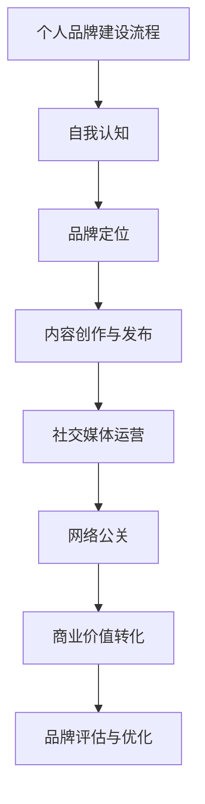

                 

### 《创业者的个人品牌建设与影响力扩大》

## 第一部分：个人品牌建设基础

### 第1章：个人品牌概述

个人品牌是指个人在公众中建立的形象和声誉，是个人在职业和生活中展现出的独特价值和魅力的综合体现。个人品牌建设对于创业者来说至关重要，因为它不仅能够提升创业者的个人影响力，还能够为企业带来更多的商业机会和竞争优势。

#### 1.1 个人品牌的定义与价值

**个人品牌的内涵**

个人品牌不仅仅是一个人的名字或标识，而是包含了以下几个方面：

- **专业能力**：个人在某一领域的专业知识和技能水平，是建立个人品牌的基础。
- **个人形象**：个人在公众面前展现出的气质、言行举止等，是个人品牌的外在表现。
- **人格特质**：个人的性格特点、价值观和信仰等，是个人品牌的核心内涵。
- **社会网络**：个人建立起来的人际关系网络，是个人品牌的重要支撑。

**个人品牌的价值体现**

个人品牌的价值主要体现在以下几个方面：

- **增强个人影响力**：良好的个人品牌能够增强个人在行业内的知名度和认可度，从而提升个人影响力。
- **吸引人才和资源**：创业者拥有强大的个人品牌能够吸引更多的人才和资源，为企业的成长提供支持。
- **提升企业竞争力**：创业者个人品牌的强大，能够提升整个企业的品牌形象和市场竞争力。
- **商业机会**：创业者个人品牌的影响力可以转化为商业机会，如投资合作、产品推广等。

**个人品牌与个人成长的关系**

个人品牌建设与个人成长是相辅相成的。个人品牌的建立可以促进个人成长，而个人成长的每一步又可以进一步丰富和完善个人品牌。具体关系如下：

- **个人成长促进品牌建设**：个人在职业生涯中不断提升自己的专业能力和人格魅力，这些成长经历可以转化为个人品牌的内涵。
- **品牌建设促进个人成长**：个人品牌的建立可以带来更多的机会和挑战，促使个人不断学习和进步。

#### 1.2 个人品牌建设的关键要素

**个人定位**

个人定位是个人品牌建设的第一步，它决定了个人品牌的核心价值和目标受众。个人定位需要考虑以下几个方面：

- **目标受众**：确定个人品牌的目标受众，了解他们的需求和兴趣，以便提供符合他们需求的价值。
- **专业领域**：明确个人在哪个专业领域有独特见解和优势，这是个人品牌的专业基础。
- **个人特点**：发掘个人的独特性格、价值观和经验，这些特点将成为个人品牌的独特卖点。

**个人形象设计**

个人形象设计是个人品牌的外在表现，它需要考虑以下几个方面：

- **外观打扮**：根据个人定位和目标受众，选择合适的着装风格和形象设计，展示专业和自信的形象。
- **言行举止**：在公共场合保持良好的言行举止，展示出专业和礼貌的态度，树立良好的个人形象。
- **社交媒体形象**：在社交媒体上展示真实、专业和有趣的一面，增加个人品牌的吸引力。

**个人技能与知识体系构建**

个人技能和知识体系是个人品牌建设的重要支撑。个人需要不断学习和提升自己的专业技能和知识水平，以保持个人品牌的竞争力。具体措施包括：

- **持续学习**：定期阅读专业书籍、参加行业研讨会和培训课程，保持知识的更新和提升。
- **实践经验**：通过实际项目和工作经验，不断提升自己的实践能力和解决问题的能力。
- **专业认证**：获得相关领域的专业认证，增加个人品牌的权威性和信任度。

### 第2章：自我认知与品牌定位

#### 2.1 自我认知的重要性

自我认知是个人品牌建设的基础，它决定了个人品牌的核心价值和定位。只有真正了解自己，才能准确地设定个人品牌的目标和方向。自我认知的重要性体现在以下几个方面：

- **明确个人目标**：通过自我认知，可以明确个人在职业生涯中的目标和追求，从而制定合适的发展策略。
- **塑造个人特色**：自我认知可以帮助个人发掘自己的独特性格、价值观和经验，从而塑造出独特的个人品牌形象。
- **提升个人信心**：了解自己的优势和不足，可以增强个人的自信心，更加积极地面对挑战和困难。

#### 2.1.1 自我认知的方法

**1. 内省法**

内省法是通过反思自己的行为、思考和情绪，深入了解自己的内心世界。具体步骤如下：

- **记录日记**：每天记录自己的行为和感受，分析自己在不同情境下的反应和思考方式。
- **提问自己**：定期问自己一些关键问题，如：“我最擅长的领域是什么？”“我最想实现的目标是什么？”“我在哪些方面需要改进？”
- **反思与总结**：定期回顾自己的过去行为和经历，总结经验和教训，明确自己的成长方向。

**2. 他人反馈法**

他人反馈法是通过听取他人的意见和建议，了解自己在他人眼中的形象和表现。具体步骤如下：

- **请求反馈**：向身边的朋友、同事和导师等请求他们对你的行为、能力和性格等方面的评价。
- **分析反馈**：认真倾听和记录他人的反馈，分析其中的优点和不足，找出自己的优势和需要改进的地方。
- **积极改进**：根据他人的反馈，制定具体的改进计划，并付诸实践。

**3. 成功人士学习法**

成功人士学习法是通过学习成功人士的经历和经验，借鉴他们的自我认知方法。具体步骤如下：

- **阅读成功人士的传记和自传**：了解他们的成长历程、思维方式和成功秘诀。
- **参加成功人士的讲座和培训**：学习他们的经验和见解，获得启发和指导。
- **模仿成功人士的行为和习惯**：将他们的成功方法应用到自己的生活和工作中。

#### 2.1.2 自我认知与个人定位的关系

自我认知是个人定位的前提和基础，而个人定位又是对自我认知的进一步深化和具体化。两者之间的关系如下：

- **自我认知指导个人定位**：通过自我认知，个人可以明确自己的优势、兴趣和目标，从而为个人定位提供指导。
- **个人定位实现自我认知**：个人定位是将自我认知转化为具体行动和表现的过程，通过实践和反馈，进一步丰富和完善自我认知。

#### 2.2 个人定位策略

**1. 目标受众分析**

确定个人定位的第一步是分析目标受众，了解他们的需求和期望。具体方法如下：

- **市场调研**：通过调查问卷、访谈等方式，了解目标受众的基本情况、需求和期望。
- **竞品分析**：研究竞争对手的产品、定位和营销策略，了解他们的优势和不足。
- **用户画像**：根据调研结果，绘制目标受众的画像，包括年龄、性别、职业、兴趣等特征。

**2. 竞争对手分析**

分析竞争对手的定位策略和市场表现，了解他们的优势和不足，从而为个人定位提供参考。具体方法如下：

- **竞争分析**：通过市场占有率、销售额、用户反馈等指标，分析竞争对手的市场表现。
- **定位对比**：对比竞争对手和个人定位的异同点，找出差异化的竞争优势。
- **优化定位**：根据竞争对手的分析结果，调整和优化个人定位，突出自身的独特价值和优势。

**3. 品牌核心价值提炼**

品牌核心价值是个人品牌的核心内涵，是个人品牌区别于他人的关键因素。提炼品牌核心价值的方法如下：

- **价值观提炼**：从个人价值观、信念和使命中提炼出最核心的价值观，作为品牌核心价值的基础。
- **优势提炼**：从个人专业技能、经验和特长中提炼出最突出的优势，作为品牌核心价值的支撑。
- **目标提炼**：从个人目标和愿景中提炼出最核心的目标，作为品牌核心价值的方向。

**4. 个人定位策略实施**

个人定位策略实施是将品牌核心价值转化为具体行动和表现的过程。具体方法如下：

- **内容创作**：根据个人定位和品牌核心价值，创作符合目标受众需求的内容，展示个人专业能力和独特价值。
- **品牌形象设计**：根据个人定位和品牌核心价值，设计符合个人形象和品牌特色的视觉元素，提升品牌辨识度。
- **市场推广**：通过多种渠道和方式，推广个人品牌，增加品牌曝光度和影响力。

### 小结

自我认知是个人品牌建设的基础，通过自我认知可以明确个人的优势、兴趣和目标，为个人定位提供指导。个人定位是将自我认知转化为具体行动和表现的过程，通过明确目标受众、分析竞争对手和提炼品牌核心价值，实现个人品牌的独特价值和市场定位。个人品牌建设是一个持续的过程，需要创业者不断自我反思、学习和优化，以保持品牌的活力和竞争力。

---

### 第二部分：个人品牌影响力扩大策略

在个人品牌建设的基础上，如何扩大个人影响力成为创业者需要重点关注的课题。在这一部分，我们将探讨内容营销、社交媒体运营、网络公关等策略，帮助创业者有效地扩大个人品牌的影响力。

### 第3章：内容营销与个人品牌建设

#### 3.1 内容营销的概念与作用

**内容营销的概念**

内容营销是指通过创作和分发有价值、相关且具有吸引力的内容，来吸引和留住明确的目标受众，并最终推动企业品牌和业绩增长的一种营销策略。内容营销的核心是“内容”，即通过创造有价值的内容来吸引目标受众，而不是简单地推销产品或服务。

**内容营销的作用**

1. **提升品牌知名度**：通过高质量的内容，可以吸引更多的关注者，提高品牌在目标受众中的知名度。

2. **增强客户忠诚度**：优质的内容能够提供价值，帮助客户解决问题，从而建立信任和忠诚度。

3. **促进用户转化**：内容营销不仅仅是吸引关注者，更重要的是通过有价值的内容推动用户采取行动，如购买产品或服务。

4. **优化搜索引擎排名**：高质量的内容能够提高网站的流量和搜索引擎排名，从而带来更多的商业机会。

#### 3.1.1 内容营销的目标与策略

**内容营销的目标**

1. **吸引目标受众**：通过创作吸引目标受众的内容，增加品牌曝光度和知名度。

2. **建立品牌权威**：通过专业、有深度的内容，建立品牌在行业内的权威性和信誉度。

3. **促进用户互动**：通过互动性强的内容，提高用户参与度和品牌忠诚度。

4. **推动销售转化**：通过具有销售导向的内容，促进用户购买产品或服务。

**内容营销的策略**

1. **明确目标受众**：了解目标受众的需求、兴趣和行为，创作符合他们需求的内容。

2. **内容创作与规划**：制定内容创作计划，包括内容主题、形式和发布频率等。

3. **内容分发**：选择合适的渠道和平台进行内容分发，增加内容的曝光度。

4. **数据分析与优化**：通过数据分析，评估内容的效果，优化内容策略。

#### 3.1.2 内容营销的工具与平台

**内容营销工具**

1. **内容管理系统（CMS）**：如WordPress、Typecho等，用于管理和发布内容。

2. **社交媒体平台**：如微博、微信公众号、知乎、抖音等，用于内容分发自和互动。

3. **邮件营销工具**：如Mailchimp、SendinBlue等，用于发送定期的内容更新邮件。

4. **SEO工具**：如Google Analytics、Google Search Console等，用于优化搜索引擎排名。

**内容营销平台**

1. **专业媒体平台**：如36氪、TechCrunch、创业邦等，用于发布行业洞察和深度报道。

2. **社交媒体平台**：如微博、微信公众号、知乎、抖音等，用于内容分发自和互动。

3. **博客平台**：如Medium、简书等，用于发布个人见解和专业文章。

#### 3.2 个人品牌内容创作技巧

**内容主题选择**

1. **关注热点话题**：紧跟行业热点和趋势，创作与热点相关的内容，吸引更多的关注。

2. **满足受众需求**：了解受众的需求和兴趣，创作能够解决他们问题和提供价值的内容。

3. **体现个人特色**：结合个人的专业背景和经验，创作具有个人特色和观点的内容。

**内容形式多样化**

1. **文字内容**：如文章、博客、评论等，是内容营销中最常用的形式。

2. **图片内容**：如海报、图片故事等，能够增加内容的视觉吸引力。

3. **视频内容**：如短视频、直播等，能够提高用户的参与度和互动性。

4. **音频内容**：如播客、音频节目等，适合于在通勤、运动等场景中收听。

**内容传播策略**

1. **社交媒体推广**：通过社交媒体平台，如微博、微信公众号等，分享和推广内容。

2. **邮件营销**：通过邮件列表，定期发送内容更新邮件，吸引受众持续关注。

3. **合作伙伴**：与其他媒体、行业专家合作，通过联合发布内容，扩大内容的传播范围。

4. **SEO优化**：通过搜索引擎优化，提高内容的搜索引擎排名，吸引更多的自然流量。

### 第4章：社交媒体与个人品牌

#### 4.1 社交媒体在个人品牌建设中的作用

社交媒体已经成为个人品牌建设的重要工具，通过社交媒体，创业者可以：

1. **建立联系**：与目标受众建立直接联系，增加互动和沟通的机会。

2. **展示个性**：通过分享生活点滴、工作心得和思考，展示个人的独特性格和魅力。

3. **传播内容**：将内容迅速传播给大量受众，提高品牌曝光度和影响力。

4. **监控反馈**：通过社交媒体的评论、点赞和转发等，了解受众的反应和反馈，及时调整策略。

#### 4.1.1 社交媒体平台选择

选择合适的社交媒体平台是个人品牌建设的关键。以下是一些常见的社交媒体平台及其特点：

1. **微博**：中国的社交媒体平台，用户基数大，信息传播速度快。

2. **微信公众号**：提供丰富的内容形式，如文字、图片、音频、视频等，适合深度内容发布。

3. **知乎**：专业问答社区，适合展示专业知识和回答用户问题。

4. **抖音**：短视频平台，适合展示个人的才艺和生活状态。

5. **Facebook**：国际社交媒体平台，适合拓展海外市场。

6. **Instagram**：图片和短视频平台，适合展示美感和创意。

#### 4.1.2 社交媒体账号运营策略

**1. 内容策略**

- **内容多样化**：结合文字、图片、视频等多种形式，提高内容的吸引力。
- **定期更新**：保持账号的活跃度，定期发布高质量的内容。
- **热点跟进**：紧跟行业热点和趋势，及时发布相关内容。

**2. 互动策略**

- **回复评论**：积极回复用户的评论和提问，增加互动和用户黏性。
- **点赞和转发**：关注并互动其他用户的帖子，提高自己的曝光度。
- **举办活动**：通过线上活动，如问答、抽奖等，吸引更多用户参与。

**3. 推广策略**

- **付费推广**：通过社交媒体的付费推广工具，将内容推送给更多的目标受众。
- **合作推广**：与其他品牌或个人合作，通过联合推广扩大影响力。
- **SEO优化**：优化社交媒体内容，提高在搜索引擎中的排名。

### 第5章：网络公关与舆论引导

#### 5.1 网络公关的概念与作用

**网络公关的概念**

网络公关是指通过互联网和社交媒体等渠道，与公众、媒体和利益相关者进行沟通、互动和管理的活动。网络公关的目标是维护和提升企业形象，增强品牌影响力。

**网络公关的作用**

1. **危机管理**：在负面信息出现时，通过网络公关及时应对，减少负面影响。

2. **品牌宣传**：通过网络公关活动，提高品牌知名度和美誉度。

3. **市场调研**：通过社交媒体等渠道，了解用户需求和市场动态。

4. **用户互动**：通过网络公关活动，与用户建立良好的互动关系，增强用户忠诚度。

#### 5.1.1 网络公关的基本原理

**1. 信息传播原理**

网络公关的核心是信息传播，通过制定合适的传播策略，将品牌信息传递给目标受众。信息传播的基本原理包括：

- **信息源**：发布信息的主体，如企业、个人等。
- **信息内容**：传播的信息本身，如新闻、公告、观点等。
- **传播渠道**：信息传递的途径，如社交媒体、新闻媒体、电子邮件等。
- **受众**：接收信息的主体，如消费者、投资者、媒体等。

**2. 沟通互动原理**

网络公关不仅仅是单向的信息传播，更强调与受众的互动和沟通。通过互动，可以建立信任、增加用户参与度，从而提升品牌影响力。沟通互动的基本原理包括：

- **倾听**：了解受众的需求和反馈，及时回应。
- **互动**：通过评论、点赞、分享等互动方式，增加用户参与度。
- **沟通**：通过多种沟通渠道，如社交媒体、电子邮件、电话等，与受众建立长期关系。

#### 5.1.2 网络公关的目标与策略

**网络公关的目标**

1. **提升品牌知名度**：通过公关活动，提高品牌在公众中的认知度和影响力。

2. **增强品牌形象**：通过积极正面的信息传播，提升品牌形象和美誉度。

3. **管理危机**：在危机事件发生时，通过网络公关及时应对，减轻负面影响。

4. **建立用户关系**：通过公关活动，与用户建立良好的互动关系，增加用户忠诚度。

**网络公关的策略**

1. **事件营销**：通过策划和参与有影响力的活动，提高品牌曝光度。

2. **新闻发布**：通过新闻媒体发布品牌信息，提高品牌知名度。

3. **社交媒体管理**：通过社交媒体平台，与用户互动，建立良好的品牌形象。

4. **舆论引导**：通过监测和分析舆论动态，及时引导舆论方向，维护品牌形象。

### 第6章：个人品牌商业价值转化

#### 6.1 个人品牌商业价值概述

个人品牌商业价值是指个人品牌在商业活动中所具有的潜在经济价值。通过有效的个人品牌建设，创业者可以将个人品牌转化为商业机会，实现个人品牌的商业价值。个人品牌商业价值主要体现在以下几个方面：

1. **产品或服务销售**：创业者个人品牌的影响力可以促进产品的销售，提高销售额。

2. **投资机会**：创业者个人品牌的影响力可以吸引投资机构和投资者的关注，提高融资成功率。

3. **合作机会**：创业者个人品牌的影响力可以吸引合作伙伴，建立战略合作关系。

4. **咨询服务**：创业者个人品牌的影响力可以吸引客户寻求专业咨询服务，提高咨询费用。

#### 6.1.1 个人品牌商业化的路径

个人品牌商业化的路径可以分为以下几个步骤：

1. **品牌定位**：明确个人品牌的定位和目标市场，为品牌商业化奠定基础。

2. **内容创作**：通过持续的内容创作，提升个人品牌的影响力和知名度。

3. **产品开发**：根据个人品牌的定位和市场需求，开发相关产品或服务。

4. **市场营销**：通过多种渠道和方式，推广个人品牌和产品或服务。

5. **用户互动**：通过用户互动和反馈，优化产品和服务，增强用户忠诚度。

6. **商业合作**：通过商业合作，扩大个人品牌的影响力，实现商业价值的最大化。

#### 6.1.2 个人品牌商业价值评估方法

个人品牌商业价值的评估需要从多个维度进行，以下是一些常用的评估方法：

1. **品牌知名度评估**：通过问卷调查、社交媒体数据等，评估个人品牌在目标市场中的知名度。

2. **用户忠诚度评估**：通过用户调研、用户满意度调查等，评估个人品牌的用户忠诚度。

3. **商业业绩评估**：通过产品销售数据、服务咨询费用等，评估个人品牌对商业业绩的贡献。

4. **投资回报评估**：通过投资成本和收益分析，评估个人品牌商业化的投资回报率。

### 第7章：成功创业者的个人品牌建设实践

#### 7.1 个人品牌建设成功的案例分析

在本章节，我们将通过几个成功创业者的个人品牌建设案例，分析他们如何通过有效的个人品牌建设策略，实现个人品牌影响力的扩大和商业价值的转化。

##### 案例一：企业家A的创业故事

企业家A通过在社交媒体上分享自己的创业经历、管理理念和行业洞察，吸引了大量的关注者。他的个人品牌定位清晰，专注于科技创新和企业管理，通过高质量的内容创作和与用户的互动，建立了强大的个人影响力。以下是他个人品牌建设的一些成功策略：

- **内容创作**：企业家A定期发布高质量的文章和视频，内容涵盖了创业经验、管理心得和对行业的洞察。他的内容不仅具有价值性，而且具有独特的个人风格和见解。
- **社交媒体运营**：他在多个社交媒体平台上建立了账号，如微博、微信公众号、LinkedIn等，通过不同的平台和内容形式，与目标受众保持互动。他的社交媒体运营策略包括：
  - **定期更新**：保持账号的活跃度，定期发布新内容。
  - **互动互动**：积极回复用户的评论和私信，增加用户参与度。
  - **合作推广**：与其他企业家和行业专家合作，通过联合推广扩大影响力。
- **用户互动**：企业家A通过线上和线下的方式，与用户建立互动关系。他经常参加行业会议和研讨会，与用户面对面交流，了解用户的需求和反馈。

通过这些策略，企业家A成功地将个人品牌的影响力转化为商业机会，包括投资合作、产品推广和咨询服务等。

##### 案例二：自媒体人B的个人品牌塑造

自媒体人B通过在博客和社交媒体上分享自己的生活经历、读书心得和职业规划，吸引了大量的年轻读者。他的个人品牌定位为“成长与生活”，通过真实、有趣和有价值的内容，赢得了用户的信任和喜爱。以下是他个人品牌建设的一些成功策略：

- **内容创作**：自媒体人B的内容涵盖了生活、学习、工作和读书等多个方面，通过真实的故事和深刻的见解，帮助读者解决实际问题，提升生活品质。
- **社交媒体运营**：他在多个社交媒体平台上建立了账号，如微信公众号、知乎、微博等，通过不同的平台和内容形式，与用户保持互动。他的社交媒体运营策略包括：
  - **内容多样化**：结合文字、图片、视频等多种形式，提高内容的吸引力。
  - **定期互动**：定期举办线上互动活动，如问答、抽奖等，增加用户参与度。
  - **内容分享**：通过与其他自媒体人的合作，分享内容和资源，扩大影响力。
- **个人形象设计**：自媒体人B注重个人形象的塑造，通过良好的形象设计和真实的生活展示，增强了个人品牌的吸引力。

通过这些策略，自媒体人B成功地将个人品牌的影响力转化为商业价值，包括广告合作、书籍出版和线上课程等。

##### 案例三：科技领袖C的品牌影响力扩大

科技领袖C在科技领域具有深厚的技术背景和丰富的创业经验。他的个人品牌定位为“科技创新领袖”，通过在社交媒体上分享技术见解和行业趋势，吸引了大量的科技爱好者和从业者。以下是他个人品牌建设的一些成功策略：

- **内容创作**：科技领袖C的内容涵盖了最新的科技动态、技术分析和行业趋势，具有很高的专业性和权威性。他的内容形式包括文章、视频和演讲等。
- **社交媒体运营**：他在多个社交媒体平台上建立了账号，如Twitter、LinkedIn、YouTube等，通过不同的平台和内容形式，与目标受众保持互动。他的社交媒体运营策略包括：
  - **国际视野**：关注国际科技动态和趋势，提高内容的专业性和影响力。
  - **互动互动**：积极回复用户的评论和私信，增加用户参与度。
  - **合作交流**：与其他科技领袖和行业专家合作，共同举办线上和线下的交流活动。
- **公众演讲**：科技领袖C经常受邀参加科技大会和论坛，发表主题演讲，提高个人品牌的知名度。

通过这些策略，科技领袖C成功地将个人品牌的影响力转化为商业价值，包括投资合作、咨询服务和产品推广等。

### 第8章：个人品牌建设总结与展望

#### 8.1 个人品牌建设总结

通过前几章的探讨，我们可以总结出个人品牌建设的关键要素和策略：

- **核心要素**：个人定位、内容创作、社交媒体运营、网络公关和商业价值转化。
- **关键策略**：明确个人定位、持续内容创作、多样化内容形式、积极互动和合作推广。

个人品牌建设不仅需要明确的定位和优质的内容，还需要持续的努力和优化。创业者需要通过不断学习和实践，提升自己的专业能力和个人形象，以建立和扩大个人品牌的影响力。

#### 8.1.1 个人品牌建设的核心要素

1. **个人定位**：明确个人品牌的定位和目标受众，为品牌建设奠定基础。
2. **内容创作**：持续创作有价值、相关且吸引人的内容，提升个人品牌的知名度和影响力。
3. **社交媒体运营**：通过多种社交媒体平台，与目标受众建立互动和联系，扩大个人品牌的影响力。
4. **网络公关**：通过有效的公关策略，管理舆论和危机，维护个人品牌形象。
5. **商业价值转化**：将个人品牌的影响力转化为商业机会，实现个人品牌的商业价值。

#### 8.1.2 个人品牌建设的成功经验

通过分析成功创业者的个人品牌建设案例，我们可以总结出以下成功经验：

- **内容为王**：持续创作高质量的内容，满足受众需求，提升个人品牌的吸引力。
- **定位明确**：明确个人品牌的定位，突出个人特点和优势，避免品牌模糊化。
- **互动互动**：积极与用户互动，建立良好的用户关系，增加用户忠诚度。
- **合作推广**：与其他品牌、媒体和行业专家合作，扩大个人品牌的影响力。

#### 8.1.3 个人品牌建设的挑战与应对策略

个人品牌建设面临以下挑战：

1. **竞争激烈**：市场上个人品牌众多，如何脱颖而出成为挑战。
2. **内容质量**：持续创作高质量的内容，保持个人品牌的活力。
3. **舆论风险**：负面舆论可能损害个人品牌形象，如何有效应对成为挑战。

应对策略包括：

- **差异化定位**：明确个人品牌的差异化优势，避免与竞争对手的直接竞争。
- **持续学习**：不断学习和提升自己的专业能力，保持内容的新鲜感和价值性。
- **舆论引导**：建立完善的网络公关机制，及时发现和处理负面舆论，维护个人品牌形象。

#### 8.2 个人品牌建设未来发展趋势

随着互联网和社交媒体的发展，个人品牌建设将呈现出以下趋势：

1. **内容形式多样化**：随着技术的发展，视频、音频和直播等互动性更强的内容形式将越来越受欢迎。
2. **跨平台运营**：创业者将需要在多个社交媒体平台上建立和运营个人品牌，实现更广泛的覆盖和互动。
3. **数据驱动**：通过数据分析，了解受众行为和需求，优化个人品牌建设和运营策略。
4. **品牌联动**：与其他品牌和行业专家合作，通过品牌联动，扩大个人品牌的影响力。

#### 8.2.1 技术发展对个人品牌建设的影响

技术发展对个人品牌建设的影响主要体现在以下几个方面：

1. **内容创作工具**：人工智能和大数据技术的应用，将提高内容创作的效率和质量，帮助创业者更好地满足受众需求。
2. **社交媒体平台**：社交媒体平台的不断更新和优化，将提供更多样化的内容形式和互动方式，增强个人品牌的影响力。
3. **数据分析**：数据分析技术可以帮助创业者更好地了解受众行为和需求，优化个人品牌建设和运营策略。

#### 8.2.2 社会环境对个人品牌建设的影响

社会环境的变化对个人品牌建设也产生了深远的影响：

1. **信息透明度**：信息透明度的提高，要求创业者更加注重个人形象的塑造和品牌形象的维护。
2. **消费者需求**：消费者对品牌的要求越来越高，创业者需要通过优质的内容和卓越的服务，满足消费者的多样化需求。
3. **舆论环境**：舆论环境的变化，要求创业者具备更强的舆论引导能力，及时应对负面舆论，维护个人品牌形象。

#### 8.2.3 个人品牌建设的新机遇与新挑战

个人品牌建设在未来将面临新的机遇和挑战：

1. **新机遇**：
   - **跨界合作**：创业者可以通过跨界合作，拓展个人品牌的影响力。
   - **全球化**：全球化趋势为创业者提供了更广阔的市场空间，可以通过国际化运营，扩大个人品牌的影响力。
   - **技术创新**：技术创新将为个人品牌建设带来新的工具和平台，提高品牌建设和运营的效率。

2. **新挑战**：
   - **竞争加剧**：随着个人品牌建设的普及，竞争将越来越激烈，创业者需要不断优化个人品牌，以脱颖而出。
   - **信息泛滥**：信息泛滥使得受众注意力分散，创业者需要通过更高质量和独特的内容，吸引和保持受众的关注。
   - **舆论风险**：舆论风险依然存在，创业者需要具备更强的舆论引导能力，以应对潜在的舆论危机。

### 总结

个人品牌建设是创业者成功的关键因素之一，通过明确个人定位、持续内容创作、积极互动和有效网络公关，创业者可以建立和扩大个人品牌的影响力，实现个人品牌的商业价值。未来，随着技术的发展和社会环境的变化，个人品牌建设将面临新的机遇和挑战，创业者需要不断学习和适应，以保持品牌的活力和竞争力。

---

### 附录A：个人品牌建设工具与资源

#### A.1 个人品牌建设工具介绍

个人品牌建设工具是帮助创业者高效管理和推广个人品牌的一系列工具。以下是一些常用的个人品牌建设工具及其功能：

1. **个人品牌分析工具**
   - **简介**：个人品牌分析工具用于评估个人品牌的影响力和市场定位。
   - **功能**：分析个人在社交媒体上的影响力、搜索排名、用户反馈等。
   - **推荐工具**：Brandwatch、Hootsuite。

2. **内容创作与编辑工具**
   - **简介**：内容创作与编辑工具用于创作和编辑个人品牌的内容。
   - **功能**：提供模板、格式优化、排版等功能，支持多种内容格式。
   - **推荐工具**：Canva、Grammarly。

3. **社交媒体管理工具**
   - **简介**：社交媒体管理工具用于管理和发布社交媒体内容。
   - **功能**：自动化发布、内容预览、分析报告等。
   - **推荐工具**：Buffer、Sprout Social。

#### A.2 个人品牌建设资源推荐

个人品牌建设资源包括书籍、课程和社区，可以帮助创业者更好地理解和实践个人品牌建设。以下是一些推荐的资源：

1. **品牌建设书籍推荐**
   - **《个人品牌：如何打造独一无二的品牌，赢得追随者和影响者》**：作者：里克·戈德曼（Rick Goldstein）
   - **《品牌影响力：如何打造个人品牌，实现职场成功》**：作者：丹尼斯·里奇（Dennis Ritchie）
   - **《个人影响力：如何成为领袖，赢得信任和尊重》**：作者：斯蒂芬·柯维（Stephen R. Covey）

2. **品牌建设课程推荐**
   - **“个人品牌建设”课程**：提供品牌定位、内容创作和社交媒体运营等方面的系统培训。
   - **“网络营销实战班”**：涵盖SEO、SEM、社交媒体营销等网络营销技能。

3. **个人品牌建设社区与论坛推荐**
   - **LinkedIn**：全球最大的职业社交平台，可以与行业专家和同行交流。
   - **个人品牌建设论坛**：国内专业的个人品牌建设论坛，提供丰富的讨论资源和经验分享。
   - **知乎**：国内知名的知识分享平台，许多专业人士和创业者在这里分享个人品牌建设经验。

#### A.3 个人品牌建设流程图

以下是个人品牌建设流程图的Mermaid表示：



**流程解读：**

- **自我认知**：通过反思和他人反馈，了解自己的优势和定位。
- **品牌定位**：明确品牌的核心价值和目标受众，为品牌建设奠定基础。
- **内容创作与发布**：持续创作有价值的内容，并通过多种渠道发布，提升品牌影响力。
- **社交媒体运营**：管理社交媒体账号，与受众互动，增加品牌曝光度。
- **网络公关**：通过有效的公关策略，维护品牌形象，应对潜在的舆论危机。
- **商业价值转化**：将品牌影响力转化为商业机会，实现个人品牌的商业价值。
- **品牌评估与优化**：定期评估品牌表现，优化品牌策略，保持品牌的活力和竞争力。

通过以上流程，创业者可以系统地构建和扩大个人品牌，实现个人品牌的长期发展。

### 核心算法原理讲解：

#### 3.1 内容创作与营销算法原理

**3.1.1 自然语言处理基础**

自然语言处理（NLP）是计算机科学和人工智能领域的一个重要分支，旨在让计算机理解和解释人类语言。NLP的核心算法包括词嵌入（Word Embedding）、序列模型（Sequence Model）、注意力机制（Attention Mechanism）和转换器架构（Transformer Architecture）。以下是这些算法的基本原理：

**词嵌入（Word Embedding）**

词嵌入是将单词映射到高维空间中的向量，以便计算机可以处理。词嵌入的基本原理是：相似的词在语义上应该接近，反之亦然。常用的词嵌入方法有：

- **word2vec**：基于点的滑动窗口和神经网络，生成词向量。
- **GloVe**：全局向量表示，通过训练模型计算词向量。

**序列模型（Sequence Model）**

序列模型用于处理序列数据，如文本、语音等。常见的序列模型有：

- **隐藏马尔可夫模型（HMM）**：基于状态转移概率的模型，用于序列数据的建模和预测。
- **长短期记忆网络（LSTM）**：通过记忆单元来避免长期依赖问题，广泛用于文本生成和情感分析。
- **门控循环单元（GRU）**：简化LSTM结构，计算效率更高。

**注意力机制（Attention Mechanism）**

注意力机制是一种让模型在处理序列数据时能够关注到重要信息的机制。注意力机制的核心思想是动态地分配权重，使得模型能够关注到序列中的重要部分。常用的注意力机制有：

- **自注意力（Self-Attention）**：同一序列中的元素相互关注，广泛用于文本生成和机器翻译。
- **互注意力（Cross-Attention）**：不同序列之间的元素相互关注，如编码器和解码器之间的交互。

**转换器架构（Transformer Architecture）**

转换器架构是近年来在NLP领域取得突破的模型，其核心是自注意力机制。转换器架构的主要优势包括：

- **并行计算**：由于自注意力机制不需要固定顺序的计算，转换器架构可以高效地并行处理数据。
- **上下文理解**：通过多头注意力机制，转换器能够捕捉到序列中的长距离依赖关系。

**3.1.2 内容创作与营销算法应用**

在个人品牌建设中，内容创作与营销算法可以用于以下方面：

1. **内容推荐**：通过分析用户的历史行为和兴趣，推荐相关的内容，帮助个人品牌吸引更多关注者。
2. **情感分析**：分析社交媒体上的用户评论和反馈，了解用户对个人品牌的情感倾向，优化内容策略。
3. **舆情监测**：实时监测网络上的舆论动态，及时发现负面信息，采取相应措施。
4. **自动写作**：利用自然语言生成技术，自动生成文章、博客等，提高内容创作效率。

以下是一个简单的情感分析算法的伪代码示例：

```python
def sentiment_analysis(text):
    # 将文本转换为词向量
    word_embeddings = convert_text_to_embeddings(text)

    # 使用预训练模型进行情感分析
    sentiment = model.predict(word_embeddings)

    # 返回情感结果
    return sentiment
```

**3.1.3 数学模型和数学公式**

内容传播可以视为一个时间序列过程，可以用以下数学模型进行描述：

$$
P_t = (1 - I_t) \times e^{\lambda t}
$$

其中：

- \( P_t \)：时间 \( t \) 时的内容传播概率。
- \( I_t \)：时间 \( t \) 时的感染概率。
- \( \lambda \)：感染率。

感染概率 \( I_t \) 可以用以下公式计算：

$$
I_t = \frac{\alpha}{N} \times (P_{t-1} - P_t)
$$

其中：

- \( \alpha \)：感染率。
- \( N \)：总人数。

以下是一个简单的内容传播模型的示例：

```python
import numpy as np

# 初始参数
P_0 = 0.01  # 初始传播概率
N = 1000    # 总人数
alpha = 0.1 # 感染率
lambda_ = np.log(1 - P_0) / (N * alpha)

# 计算传播概率
P = []
for t in range(1, 101):
    I_t = (alpha / N) * (P[t-1] - P_0)
    P_t = (1 - I_t) * np.exp(lambda_ * t)
    P.append(P_t)

# 输出传播概率
print(P)
```

### 项目实战

#### 3.3 内容营销与个人品牌建设的实战案例

以下是一个内容营销的实战案例，以某创业者的个人品牌建设为例：

**目标**：提升个人品牌知名度，增加关注者数量。

**步骤**：

1. **内容策划**：根据目标受众的兴趣和需求，策划系列主题内容，如创业经验分享、行业洞察、产品介绍等。

2. **内容创作**：通过文字、图片、视频等多种形式创作高质量的内容，确保内容具有价值性和吸引力。

3. **内容发布**：选择合适的社交媒体平台（如微博、微信公众号、抖音等），定期发布内容，并与关注者互动。

4. **数据分析**：使用数据分析工具（如Google Analytics、社交媒体分析工具等）监控内容的表现，包括阅读量、点赞量、评论量等指标。

5. **优化策略**：根据数据分析结果，调整内容策略，如调整发布时间、优化标题、增加互动环节等，以提高内容传播效果。

**代码实现**（假设使用Python进行内容发布）：

```python
import tweepy
import time

# 初始化Twitter API
auth = tweepy.OAuthHandler('your_consumer_key', 'your_consumer_secret')
auth.set_access_token('your_access_token', 'your_access_token_secret')
api = tweepy.API(auth)

# 定义内容发布函数
def post_content(content):
    try:
        api.update_status(content)
        print("Content posted successfully.")
    except tweepy.TweepError as e:
        print("Error posting content:", e)

# 定义发布计划
content_plan = [
    "Check out our latest product! #Startup #ProductLaunch",
    "Learn from my startup journey! #Entrepreneur #StartupAdvice",
    "Insight into the tech industry! #Tech #IndustryTrends",
]

# 按计划发布内容
for content in content_plan:
    post_content(content)
    time.sleep(3600)  # 每隔1小时发布一条内容
```

**代码解读与分析**：

- **Tweepy库**：用于连接Twitter API，实现内容的发布与监控。
- **内容发布函数**：`post_content` 函数用于发布内容，若发布成功则打印成功信息，否则打印错误信息。
- **内容发布计划**：`content_plan` 列表包含要发布的每条内容的文本。
- **发布内容**：循环遍历内容计划，调用`post_content`函数发布内容，每次发布后暂停1小时，以避免过度使用API。

通过这个实战案例，创业者可以有效地利用内容营销策略提升个人品牌知名度和影响力。在实际应用中，可以根据具体情况调整内容策略、发布频率和平台选择，以达到最佳效果。

### 作者

**作者：AI天才研究院/AI Genius Institute & 禅与计算机程序设计艺术 /Zen And The Art of Computer Programming**

本文由AI天才研究院撰写，AI天才研究院致力于探索和推动人工智能技术的创新与发展。同时，作者也是《禅与计算机程序设计艺术》的资深作者，长期关注人工智能领域的技术趋势和实践应用。希望通过本文，为创业者提供关于个人品牌建设和影响力扩大的实用指导。

