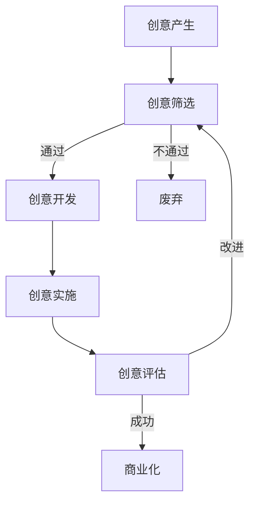
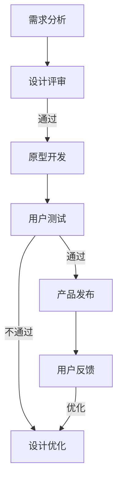
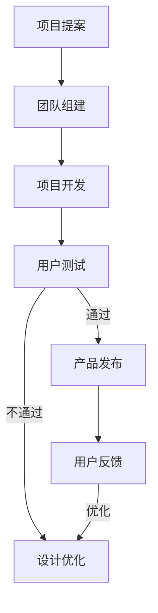
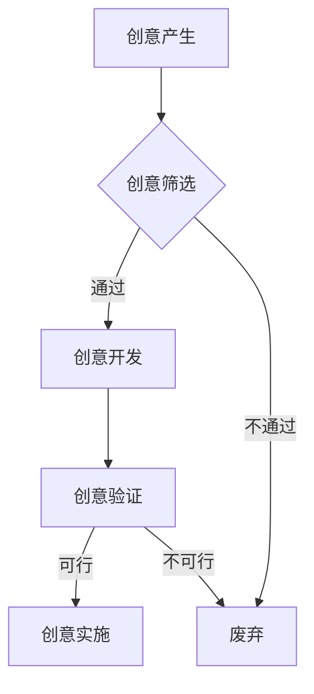

                 

# 引言

## 文章标题：创业者的创意激发与管理方法

## 关键词：创业，创意激发，创意管理，创新思维，创业策略，创意应用

> 摘要：在快速变化的市场环境中，创业者的创意能力是推动企业发展的重要动力。本文详细探讨了创业者的创意激发与管理方法，包括创意思维导论、创意激发技巧与实践、创意管理的基本原则、创意管理策略与工具、创意在创业中的应用以及创意创业的未来趋势。通过深入分析创意的核心概念与联系、算法原理、数学模型以及实际项目案例，本文为创业者提供了实用的创意激发与管理指南，帮助他们在竞争激烈的市场中脱颖而出，实现创业梦想。

### 引言

在当今瞬息万变的经济环境中，创业已经成为许多有志之士追求梦想、实现自我价值的重要途径。然而，创业之路充满挑战，要想在竞争激烈的市场中脱颖而出，创业者的创新能力显得尤为关键。创意不仅是推动企业发展的核心动力，也是企业在市场中立足并持续发展的关键因素。

创意激发与管理方法的重要性在于，它能够帮助创业者更好地发掘自身的创新潜力，将创新思维转化为实际的产品或服务，从而在竞争激烈的市场中获得优势。同时，有效的创意管理方法还能确保企业在创新过程中保持高效和有序，避免资源浪费和重复劳动。

本文将从多个维度探讨创业者的创意激发与管理方法。首先，我们将介绍创意思维导论，包括创意的本质、类型以及创意激发的方法。接着，我们将深入探讨创意思维的技巧与实践，包括想象力的训练、跨界思维的运用以及创意实践的成功案例。随后，我们将探讨创意管理的基本原则、策略与方法，并通过案例研究分析创意管理的实践应用。此外，本文还将探讨创意在创业中的应用，包括创意的商业价值、创业者的创意能力培养以及创意创业案例分析。最后，我们将展望创意创业的未来趋势，并总结全文，为创业者提供实用的创意激发与管理工具和资源。

通过本文的阅读，创业者将能够全面了解创意激发与管理的方法，掌握有效的创新思维技巧，并在实践中运用这些方法，从而在创业的道路上取得成功。

### 第一部分：创意激发

创意激发是创业者成功的关键因素之一。在这一部分，我们将首先探讨创意思维导论，包括创意的本质、类型以及创意激发的方法，为创业者理解创意的概念和如何激发创意奠定基础。

#### 第1章：创意思维导论

##### 1.1 创意的本质

创意，从字面上理解，是指创新、创造性的思维或想法。然而，要深入理解创意的本质，我们需要从多个角度来探讨。首先，创意是独特的、有价值的思维产物，它不同于常规思维和惯性思维。创意往往来自于对现有知识的重新组合或对问题的独特见解。它不仅仅是新颖的想法，更是能够解决实际问题或创造价值的想法。

##### 1.1.1 创意的定义与特征

创意的定义可以有多种表述，但大多数定义都强调了其独特的创新性、实用性和价值性。创意可以定义为一种能够创造新价值、新方法或新解决方案的思维过程。其特征主要包括：

- **独特性**：创意往往具有独特性，是对常规思路的突破和超越。
- **创新性**：创意来源于创新思维，它不同于常规的、传统的思维方式。
- **价值性**：创意不仅要有新颖性，还要有实际应用价值，能够解决实际问题或创造新的商业机会。
- **适应性**：创意需要能够适应不同的环境和情境，具有广泛的适用性。

##### 1.1.2 创意的重要性

创意的重要性体现在多个方面。首先，创意是推动企业创新的核心动力。一个企业如果没有创新，就很难在竞争激烈的市场中立足。创意能够为企业带来新的产品、服务或商业模式，从而增强企业的竞争力。其次，创意是推动社会进步的重要力量。许多重大发明和技术进步都是基于创意实现的。例如，互联网、智能手机、人工智能等创新技术极大地改变了人们的生活方式和社会结构。

对于创业者来说，创意的重要性更加突出。创业者需要不断寻找创新的商业机会，通过创意来实现商业价值。创意能力不仅决定了创业者的竞争力，也决定了创业的成功与否。一个具有强大创意能力的创业者，能够敏锐地捕捉市场机会，迅速推出有竞争力的产品或服务，从而在市场中脱颖而出。

##### 1.2 创意思维的类型

创意思维是激发创意的核心手段。根据不同的分类标准，创意思维可以分为多种类型。以下是几种常见的创意思维类型：

- **横向思维与纵向思维**：横向思维是指从多个角度、多个层面来思考问题，寻找不同的解决方案。纵向思维则是从问题本身出发，深入挖掘问题的本质，寻找根本性的解决方案。

- **奇异思维与常规思维**：奇异思维是指跳出常规思路，运用独特的思维方式来解决问题。常规思维则是遵循传统、习惯的思维方式。创意往往来自于奇异思维，它能够带来新颖的解决方案。

- **内向思维与外向思维**：内向思维是指从内部世界出发，通过自我反思和内省来激发创意。外向思维则是从外部世界获取灵感，通过观察、交流和互动来激发创意。

##### 1.2.1 横向思维与纵向思维

横向思维和纵向思维是两种不同的创意思维模式。横向思维注重从多个角度、多个层面来思考问题，寻找不同的解决方案。它强调思维的广泛性和灵活性。例如，当面临一个产品创新的问题时，横向思维会考虑不同的市场细分、用户需求、技术路线等，从而找到多种可能的解决方案。

纵向思维则侧重于深入挖掘问题的本质，寻找根本性的解决方案。它强调思维的深度和逻辑性。例如，当面临一个技术难题时，纵向思维会从基础理论出发，逐步深入，直到找到解决问题的方法。

在创意激发过程中，横向思维和纵向思维通常是相辅相成的。横向思维可以帮助我们发散思维，找到多种可能的解决方案；而纵向思维则可以帮助我们深入分析问题，找到最有效的解决方案。

##### 1.2.2 奇异思维与常规思维

奇异思维和常规思维是两种截然不同的思维模式。奇异思维强调跳出常规，运用独特的思维方式来解决问题。它鼓励我们打破思维定势，尝试新的方法和思路。例如，一个创业者在面临市场困境时，可以尝试从完全不同的角度来思考，从而找到创新的解决方案。

常规思维则遵循传统、习惯的思维方式。它强调经验和习惯，认为解决问题最有效的方法是按照既定的流程和规则进行。常规思维在许多情况下是有效的，但在面临复杂问题时，它可能会限制我们的思维，使我们难以找到创新的解决方案。

在创意激发过程中，奇异思维和常规思维各有其作用。奇异思维可以帮助我们打破思维定势，找到新的解决方案；而常规思维则可以帮助我们验证这些解决方案的可行性和有效性。因此，创业者需要在创意过程中灵活运用奇异思维和常规思维，以实现最佳的创新效果。

##### 1.2.3 内向思维与外向思维

内向思维和外向思维是两种不同的思维方式。内向思维强调从内部世界出发，通过自我反思和内省来激发创意。它鼓励我们深入思考自己的感受、想法和需求，从而产生有深度的创意。

外向思维则侧重于从外部世界获取灵感，通过观察、交流和互动来激发创意。它强调与他人互动，通过讨论、合作和交流来产生创意。例如，一个创业者在开发新产品时，可以通过与用户、专家和同行的交流来获取灵感，从而激发创意。

在创意激发过程中，内向思维和外向思维通常是相辅相成的。内向思维可以帮助我们深入挖掘自己的内心世界，找到独特的创意；而外向思维则可以帮助我们与他人分享和交流这些创意，从而获得反馈和建议，进一步优化创意。

##### 1.3 创意激发的方法

创意激发是创业者成功的关键。在这一部分，我们将探讨几种常见的创意激发方法，包括脑暴法、拓展思维法、反转思维法等。

##### 1.3.1 脑暴法

脑暴法（Brainstorming）是一种常见的创意激发方法。它通过集体讨论，让参与者自由地提出各种可能的创意，以激发思维的碰撞和创新的火花。

脑暴法的步骤如下：

1. **明确目标**：在开始脑暴之前，明确讨论的目标和问题。确保所有参与者都清楚讨论的主题。

2. **自由发言**：在规定的时间内，每个参与者都可以自由发言，提出自己的想法。不管想法是否可行，都应该被记录下来。

3. **记录创意**：将所有的创意记录下来，无论是看似荒谬还是实际可行的。

4. **整理创意**：在脑暴结束后，对记录的创意进行整理，筛选出有价值、可行的创意。

脑暴法的优点在于能够迅速激发大量创意，并且通过集体讨论，可以相互启发，产生更多的创意。

##### 1.3.2 拓展思维法

拓展思维法（Expanding Minds）是一种通过扩展思维边界来激发创意的方法。它鼓励我们跳出传统的思维框架，探索更多的可能性。

拓展思维法的步骤如下：

1. **设定问题**：首先明确要解决的问题或需要创意的主题。

2. **自由联想**：在规定的时间内，尽可能多地提出与问题相关的联想。不要担心想法的合理性，只需自由地表达自己的想法。

3. **分组讨论**：将提出的联想进行分类和讨论，寻找可能的解决方案。

4. **整合创意**：将不同的联想和讨论结果进行整合，形成有价值的创意。

拓展思维法的优点在于能够打开思维的空间，激发出更多新颖、独特的创意。

##### 1.3.3 反转思维法

反转思维法（Reversing Minds）是一种通过反向思考来激发创意的方法。它鼓励我们从不同的角度来审视问题，寻找创新的解决方案。

反转思维法的步骤如下：

1. **设定问题**：明确要解决的问题或需要创意的主题。

2. **反向思考**：从问题的反面出发，提出与常规思路相反的想法。例如，如果常规思路是增加功能，那么反转思维法就会考虑减少功能。

3. **讨论和优化**：对反向思考的结果进行讨论和优化，找出可行的创意。

4. **验证创意**：对创意进行验证，确保其可行性和实用性。

反转思维法的优点在于能够打破常规，从新的角度来思考问题，从而激发出独特的创意。

通过上述几种创意激发方法，创业者可以有效地发掘自身的创新潜力，为创业成功奠定基础。在下一章中，我们将进一步探讨创意思维的技巧与实践，帮助创业者更好地应用这些创意激发方法，实现创业梦想。

### 第2章：创意思维的技巧与实践

在了解了创意思维的基本类型和激发方法之后，接下来我们将探讨创意思维的技巧与实践。这些技巧和实践不仅能够帮助创业者更好地应用创意激发方法，还能提升他们的创新能力，从而在竞争激烈的市场中脱颖而出。

#### 2.1 想象力的训练

想象力是创意思维的核心要素之一。一个富有想象力的创业者能够看到问题的更多可能性，从而激发出更多的创意。因此，训练想象力对于创业者来说至关重要。

##### 2.1.1 想象力的重要性

想象力的重要性体现在多个方面。首先，想象力能够帮助我们预见未来的趋势和变化。在创业过程中，预见市场的变化和趋势对于抓住商机、制定战略至关重要。其次，想象力能够激发我们的创新思维，帮助我们找到独特的解决方案。许多成功的创业项目都是基于创新的想法实现的。

##### 2.1.2 想象力训练的方法

以下是一些训练想象力的方法：

1. **阅读**：阅读是培养想象力的重要途径。通过阅读，我们可以接触到各种不同的观点和想法，从而拓宽思维视野。

2. **绘画**：绘画可以帮助我们表达内心的想法和感受，从而激发想象力。尝试画出你的创意或想象中的未来场景，可以加深对创意的理解。

3. **写作**：写作是另一种培养想象力的方法。通过写作，我们可以将自己的想法和故事表达出来，从而加深对创意的思考。

4. **冥想**：冥想可以帮助我们放松大脑，减少焦虑和压力，从而提高想象力。通过冥想，我们可以更好地进入内心的世界，发现更多的创意。

5. **梦境记录**：梦境是我们内心深处的一种表达方式。记录梦境可以帮助我们更好地理解自己的内心世界，从而激发想象力。

#### 2.2 跨界思维的运用

跨界思维是创新的重要源泉之一。通过跨界思维，创业者可以从不同领域获取灵感，从而产生独特的创意。

##### 2.2.1 跨界思维的概念

跨界思维是指跨越不同领域、不同行业，从不同角度来思考问题，寻找创新的解决方案。跨界思维强调的是跨领域的知识和经验的融合，通过将不同领域的元素结合起来，创造出新的价值。

##### 2.2.2 跨界思维的案例分析

以下是一些跨界思维的案例分析：

1. **Uber**：Uber是一家提供出租车服务的公司，它成功地将互联网技术和传统出租车服务相结合，创造出一种新的出行方式。通过跨界思维，Uber不仅解决了乘客打车难的问题，还提高了出租车行业的效率。

2. **Airbnb**：Airbnb是一家提供共享住宿服务的公司。它通过跨界思维，将闲置的房屋资源与旅游需求结合起来，创造出一种新的住宿方式。这种共享经济的模式不仅为房东带来了额外收入，还为旅行者提供了更多选择。

3. **Google Glass**：Google Glass是一款结合了智能手机和眼镜的设备。它通过跨界思维，将科技产品与日常生活结合起来，为用户提供了全新的互动体验。

通过这些案例，我们可以看到，跨界思维不仅能够带来创新的解决方案，还能够创造出新的商业机会。

#### 2.3 创意实践

创意实践是将创意转化为实际产品或服务的关键步骤。通过创意实践，创业者可以将创意验证和优化，最终实现商业价值。

##### 2.3.1 创意实践的步骤

以下是一些创意实践的步骤：

1. **明确目标**：首先，明确创意实践的目标和预期成果。这可以帮助我们集中精力，确保创意实践的有效性。

2. **细化创意**：在明确目标后，进一步细化创意，将其转化为具体的产品或服务概念。这包括定义产品的功能、特点和市场定位。

3. **验证创意**：通过市场调研、用户反馈等方式，验证创意的可行性和市场需求。这一步骤可以帮助我们了解创意的潜在问题和改进方向。

4. **原型开发**：在验证创意后，开发原型产品或服务。原型可以帮助我们测试和验证创意的实际效果，收集用户反馈，进一步优化产品。

5. **迭代优化**：根据用户反馈和市场变化，不断迭代和优化产品，以适应市场需求和用户需求。

##### 2.3.2 创意实践的成功案例

以下是一些创意实践的成功案例：

1. **Spotify**：Spotify是一款在线音乐流媒体服务。它通过创意实践，结合了在线音乐和个性化推荐技术，为用户提供了便捷的个性化音乐体验。Spotify的成功证明了创意实践在音乐行业的重要性。

2. **Tesla**：Tesla是一家电动汽车制造商。它通过创意实践，将电动汽车技术与智能系统相结合，创造出了一种全新的汽车体验。Tesla的成功不仅改变了汽车行业，还为环保事业做出了贡献。

3. **Square**：Square是一款移动支付解决方案。它通过创意实践，将智能手机和支付技术结合起来，为小商家提供了便捷的支付服务。Square的成功证明了创意实践在金融科技领域的重要性。

通过这些案例，我们可以看到，创意实践不仅能够带来商业成功，还能够推动行业变革。

综上所述，想象力训练、跨界思维运用和创意实践是提升创业者创新能力的重要途径。通过这些技巧和实践，创业者可以更好地激发和管理创意，实现创业梦想。

### 第二部分：创意管理

创意管理是确保企业创新顺利进行的重要环节。在这一部分，我们将探讨创意管理的基本原则、策略与方法，以及如何通过实际案例来理解和应用这些原则和方法。

#### 第3章：创意管理的基本原则

创意管理是指通过一系列系统的方法和工具，对创意的产生、筛选、开发、实施和评估进行有效管理，以确保创意能够为企业带来实际价值。创意管理的基本原则包括以下几个方面：

##### 3.1 创意管理的定义

创意管理是一个动态的过程，涉及从创意的产生到实现商业化的各个环节。它不仅仅是对创意的收集和筛选，还包括对创意的开发、实施和评估。创意管理的目标是确保创意能够转化为实际的产品或服务，从而实现商业价值。

##### 3.1.1 创意管理的含义

创意管理的含义可以从以下几个方面来理解：

- **创意的产生**：通过激发创意思维，产生新的想法和解决方案。
- **创意的筛选**：对产生的创意进行评估和筛选，确定哪些创意具有实际应用价值。
- **创意的开发**：对筛选出的创意进行进一步的开发和优化，使其具备商业可行性。
- **创意的实施**：将开发完成的创意转化为实际的产品或服务，进行市场推广。
- **创意的评估**：对创意的实施效果进行评估，总结经验教训，为下一次创意管理提供参考。

##### 3.1.2 创意管理的目标

创意管理的目标主要包括以下几个方面：

- **提高创新能力**：通过系统化的创意管理，提高企业的创新能力，使其在竞争激烈的市场中保持竞争优势。
- **实现商业价值**：将创意转化为实际的产品或服务，实现商业价值，为企业带来收益。
- **优化资源配置**：通过有效的创意管理，优化企业的资源配置，避免资源浪费。
- **提升用户体验**：通过创意管理，不断优化产品或服务，提升用户体验，增强用户忠诚度。

##### 3.2 创意管理的组织结构

创意管理的组织结构是确保创意管理顺利进行的重要保障。一个有效的创意管理组织结构应当包括以下几个方面：

- **创意部门**：设立专门的创意部门，负责创意的产生、筛选、开发、实施和评估。创意部门应当具备独立的决策权和资源支持，以充分激发创意活力。
- **跨部门协作**：鼓励不同部门之间的协作，促进创意的交流和融合。跨部门协作可以带来多样化的视角和创意，提高创意的质量和可行性。
- **项目管理团队**：设立项目管理团队，负责创意项目的具体实施和推进。项目管理团队应当具备专业的项目管理能力和经验，确保创意项目的顺利进行。

##### 3.2.1 创意部门的设置

创意部门的设置应当考虑以下几个方面：

- **组织规模**：根据企业的规模和业务需求，设立相应的创意部门。对于大型企业，可以设立专门的创意部门，由创意总监领导；对于中小型企业，可以设立创意小组，由团队成员共同负责。
- **职责明确**：明确创意部门的职责，包括创意的产生、筛选、开发、实施和评估。确保创意部门拥有足够的资源和权限，以充分激发创意活力。
- **人才配置**：创意部门的人才配置应当注重多样性和专业性。创意部门不仅需要具备创意能力的人才，还需要具备项目管理、市场分析、技术支持等专业人才，以确保创意能够转化为实际的产品或服务。

##### 3.2.2 创意团队的构建

创意团队的构建是创意管理的重要环节。一个高效的创意团队应当具备以下几个特点：

- **多元化**：创意团队应当由不同背景、不同专业领域的人才组成，以带来多样化的视角和创意。
- **协作性**：创意团队成员应当具备良好的协作能力，能够共同解决问题，实现创意的协同效应。
- **创新能力**：创意团队成员应当具备较强的创新能力，能够不断提出新的创意和解决方案。
- **适应性**：创意团队成员应当具备较强的适应性，能够应对市场变化和挑战，不断调整和优化创意。

##### 3.3 创意管理的流程

创意管理的流程是确保创意管理有序进行的重要保障。一个完整的创意管理流程通常包括以下几个阶段：

- **创意产生**：通过多种方法，如头脑风暴、拓展思维等，激发创意的产生。
- **创意筛选**：对产生的创意进行评估和筛选，确定哪些创意具有实际应用价值。
- **创意开发**：对筛选出的创意进行进一步的开发和优化，使其具备商业可行性。
- **创意实施**：将开发完成的创意转化为实际的产品或服务，进行市场推广。
- **创意评估**：对创意的实施效果进行评估，总结经验教训，为下一次创意管理提供参考。

下面是一个简化的创意管理流程图：



在创意管理流程中，每个阶段都至关重要。创意产生阶段需要激发创新思维，产生大量的创意；创意筛选阶段需要通过评估和筛选，确定哪些创意具有实际应用价值；创意开发阶段需要对创意进行深化和优化，使其具备商业可行性；创意实施阶段需要将创意转化为实际的产品或服务；创意评估阶段需要总结经验教训，为下一次创意管理提供参考。

##### 3.3.1 创意的收集与筛选

创意收集是创意管理流程的第一步。创意收集的方法包括：

- **头脑风暴**：通过集体讨论，激发团队成员的创意思维，产生大量的创意。
- **拓展思维**：通过自由联想和发散性思维，从不同的角度思考问题，产生新的创意。
- **用户反馈**：通过用户调研和反馈，了解用户的需求和痛点，从而产生创意。

创意筛选是创意管理流程的关键步骤。创意筛选的方法包括：

- **可行性评估**：对创意的可行性进行评估，包括技术实现难度、市场潜力、资源需求等。
- **优先级排序**：根据创意的潜力、市场需求和资源情况，对创意进行优先级排序。
- **团队讨论**：组织团队讨论，共同评估和筛选创意。

##### 3.3.2 创意的开发与实施

创意开发是创意管理流程的核心环节。创意开发的方法包括：

- **原型设计**：通过开发原型产品或服务，验证创意的可行性和用户体验。
- **功能优化**：根据用户反馈和市场变化，对创意进行功能优化和调整。
- **技术实现**：通过技术手段，将创意转化为实际的产品或服务。

创意实施是创意管理流程的最后一步。创意实施的方法包括：

- **市场推广**：通过市场推广活动，提高创意产品的知名度和用户接受度。
- **用户教育**：通过用户教育和培训，帮助用户更好地了解和使用创意产品。
- **反馈收集**：通过用户反馈，了解创意产品的使用情况和用户需求，为后续优化提供参考。

##### 3.3.3 创意的评估与反馈

创意评估是创意管理流程的最后一步。创意评估的方法包括：

- **效果评估**：对创意实施的效果进行评估，包括用户满意度、市场占有率、收益等。
- **经验总结**：总结创意管理过程中的经验教训，为下一次创意管理提供参考。
- **改进建议**：根据评估结果，提出改进建议，优化创意产品和服务。

创意反馈是创意管理流程的重要组成部分。创意反馈的方法包括：

- **用户调研**：通过用户调研，了解用户的意见和建议，为创意的优化提供参考。
- **团队讨论**：组织团队讨论，共同分析用户反馈，制定改进方案。
- **持续优化**：根据用户反馈和评估结果，持续优化创意产品和服务。

通过上述创意管理的基本原则和流程，创业者可以系统地管理和利用创意，确保创意能够为企业带来实际价值。在下一章中，我们将进一步探讨创意管理的策略与方法，帮助创业者更好地实施创意管理。

### 第4章：创意管理的策略与方法

创意管理不仅需要一套系统的流程，还需要有效的策略和方法。在这一章中，我们将深入探讨创意管理的策略和方法，包括创意激励、创意保护以及创意流程优化。

#### 4.1 创意激励

创意激励是激发员工创新热情、提升企业创新能力的关键。有效的创意激励可以鼓励员工积极参与创新活动，从而推动企业的持续发展。

##### 4.1.1 创意激励的原则

创意激励应遵循以下原则：

1. **公平公正**：激励措施应当公平公正，确保每位员工都有机会获得奖励，以增强员工的积极性。
2. **透明性**：激励措施应当透明，让员工了解激励的标准和规则，从而增加激励的公正性。
3. **多样性**：激励形式应当多样化，包括物质激励、精神激励和职业发展激励等，以满足不同员工的需求。
4. **及时性**：激励措施应当及时，以迅速响应员工的创新成果和努力。

##### 4.1.2 创意激励的方法

以下是几种常见的创意激励方法：

1. **奖金和提成**：对于成功实现创意的员工，可以给予奖金或提成，以激励他们继续创新。
2. **荣誉表彰**：设立创意奖、优秀创新员工奖等，对在创新方面表现突出的员工进行表彰和奖励。
3. **职业发展**：提供职业晋升机会和培训机会，帮助员工在职业发展过程中实现自我提升。
4. **工作环境**：营造良好的工作环境，提供充足的资源和支持，鼓励员工自由表达和尝试创新。
5. **竞争机制**：建立内部竞争机制，通过竞赛、评选等方式，激发员工的创新竞争意识。

##### 4.2 创意保护

创意保护是确保企业创意不被泄露、盗用或复制的重要措施。有效的创意保护可以保护企业的知识产权，维护企业的竞争优势。

##### 4.2.1 创意保护的重要性

创意保护的重要性体现在以下几个方面：

1. **知识产权保护**：创意是企业的重要资产，通过专利、商标、著作权等法律手段，可以保护企业的知识产权，防止他人未经授权使用或复制。
2. **竞争优势**：有效的创意保护可以确保企业的创新成果不被竞争对手轻易复制，从而维持企业的竞争优势。
3. **市场信任**：创意保护可以增强消费者对企业的信任，提高企业的市场声誉。
4. **商业利益**：创意保护可以帮助企业实现商业利益，如通过专利许可或转让获得收益。

##### 4.2.2 创意保护的方法

以下是几种常见的创意保护方法：

1. **专利申请**：通过专利申请，保护创意的独特性和创新性，防止他人未经授权使用或复制。
2. **商业秘密保护**：对于无法或不愿申请专利的创意，可以通过商业秘密保护，确保创意不被泄露。
3. **合同约定**：与员工、合作伙伴签订保密协议，明确双方的责任和义务，防止创意泄露。
4. **法律诉讼**：对于侵权行为，可以通过法律手段维护企业的权益，包括提起诉讼、申请禁令等。
5. **技术创新**：通过持续的技术创新，使创意具有更高的技术壁垒，从而降低被复制和模仿的风险。

##### 4.3 创意流程优化

创意流程优化是提高创意管理效率和效果的重要手段。通过优化创意流程，企业可以更快速地识别和实现有价值、有创新的创意。

##### 4.3.1 创意流程优化的原则

创意流程优化应遵循以下原则：

1. **简洁高效**：简化流程，减少不必要的步骤，以提高创意管理的效率和速度。
2. **灵活性**：确保流程具有足够的灵活性，以适应不断变化的市场环境和需求。
3. **协作性**：加强跨部门协作，促进创意在不同部门和团队之间的流通和整合。
4. **反馈机制**：建立反馈机制，及时收集和分析创意实施过程中的问题和反馈，为流程优化提供依据。

##### 4.3.2 创意流程优化的方法

以下是几种常见的创意流程优化方法：

1. **流程图分析**：通过流程图分析，识别创意流程中的瓶颈和冗余环节，为优化提供方向。
2. **标杆对比**：对比行业最佳实践和竞争对手的流程，借鉴和学习成功经验，优化自身流程。
3. **信息技术应用**：利用信息技术，如项目管理软件、协作平台等，提高创意流程的透明度和协同性。
4. **员工参与**：鼓励员工参与流程优化，通过收集员工意见和建议，提高流程的实用性和可行性。
5. **持续改进**：建立持续改进机制，定期对创意流程进行评估和优化，以适应不断变化的市场环境。

通过上述策略和方法，企业可以更好地管理和利用创意，提高创新能力，实现持续发展。

### 第5章：创意管理实践

在了解了创意管理的基本原则和策略后，接下来我们将通过案例研究来深入分析创意管理的实际应用。通过这些案例，我们将看到创意管理在不同企业中的成功实践，以及如何通过有效的创意管理实现商业价值。

#### 5.1 创意管理案例研究

##### 5.1.1 案例一：苹果公司的创意管理

苹果公司（Apple Inc.）是现代科技行业中创意管理的典范。自1976年成立以来，苹果公司始终坚持以创新为核心，通过卓越的创意管理，推出了众多革命性的产品，如iPhone、iPad、Mac等。

**创意管理实践**：

1. **明确的创新目标**：苹果公司始终明确其创新目标，致力于通过技术创新改变人们的生活方式。乔布斯曾强调，苹果的目标是“创造优秀的产品，改变世界”。

2. **独立的产品团队**：苹果公司每个新产品都由独立的团队负责，这些团队拥有充分的自主权和资源，可以自由地发挥创意，开发新产品。

3. **严格的设计评审**：苹果公司在产品开发过程中，设有严格的设计评审流程。每个设计都必须经过多轮评审，以确保产品的创新性和质量。

4. **用户参与**：苹果公司重视用户反馈，通过用户调研和产品测试，了解用户需求和偏好，不断优化产品设计。

**成功因素**：

- **文化认同**：苹果公司内部形成了强烈的创新文化，员工对公司的使命和目标有高度认同，从而激发了员工的创新热情。
- **资源投入**：苹果公司不惜重金投入研发，确保创意管理有充足的资源支持。
- **高效执行**：苹果公司注重执行的效率，从创意产生到产品上市，整个过程高效有序，确保了创新成果的快速实现。

**代码解读与分析**：

虽然苹果公司主要业务是硬件和软件产品，但我们可以通过其软件产品的开发流程来理解创意管理的一些关键要素。以下是一个简化的软件开发流程图，展示了苹果公司创意管理的部分实践：



- **需求分析**：首先，团队明确产品的需求和目标，确保创新方向与市场需求一致。
- **设计评审**：设计团队进行多次评审，确保设计的创新性和可行性。
- **原型开发**：开发团队根据评审结果，开发产品原型，进行初步测试。
- **用户测试**：通过用户测试，收集用户反馈，优化产品设计。
- **产品发布**：产品经过多次优化后，最终发布上市。
- **用户反馈**：产品上市后，继续收集用户反馈，为后续产品优化提供依据。

**实战建议**：

- **建立创新文化**：鼓励员工创新，培养创新思维，营造良好的创新氛围。
- **重视用户反馈**：通过用户调研和测试，了解用户需求和偏好，不断优化产品。
- **高效执行**：确保创意管理流程高效有序，从创意产生到产品上市，每个环节都紧密衔接。

##### 5.1.2 案例二：谷歌的创意文化

谷歌（Google LLC）是全球最著名的科技企业之一，以其独特的创意文化而闻名。谷歌的创意文化不仅体现在其创新的产品和服务上，还体现在其开放的工作环境和文化价值观中。

**创意管理实践**：

1. **20%时间政策**：谷歌实施了“20%时间政策”，允许员工用20%的工作时间来探索自己的兴趣项目。这一政策激发了员工的创意思维，许多谷歌的重要产品，如Gmail、Google News等，都是在这个政策下诞生的。

2. **开放式办公环境**：谷歌的办公环境设计开放、灵活，旨在鼓励员工之间的交流和合作。这种环境促进了创新思想的碰撞，有助于激发创意。

3. **自由的工作文化**：谷歌倡导自由的工作文化，鼓励员工自主安排工作时间，自行选择工作地点。这种文化减少了员工的压力，提高了工作效率和创新能力。

4. **多元化人才引进**：谷歌重视多元化人才的引进，通过招聘来自不同背景、不同专业领域的人才，带来了多样化的创意和视角。

**成功因素**：

- **开放的文化**：谷歌的开放文化鼓励员工自由表达想法，勇于尝试新的项目和创意。
- **鼓励自主性**：通过20%时间政策等机制，谷歌鼓励员工自主探索，激发了员工的创新潜力。
- **多元化人才**：多元化的团队带来了不同的创意和思维方式，促进了创新。

**代码解读与分析**：

谷歌的创意文化虽然主要涉及企业文化和管理策略，但我们可以通过其开发环境来理解其创意管理的一些实践。以下是一个简化的谷歌开发环境图：



- **项目提案**：员工可以自由提出项目提案，团队根据兴趣和技能进行组建。
- **项目开发**：团队在自由的工作环境中，自主开发项目，进行初步测试。
- **用户测试**：项目进行用户测试，收集用户反馈，优化产品设计。
- **产品发布**：产品经过多次优化后，最终发布上市。
- **用户反馈**：产品上市后，继续收集用户反馈，为后续产品优化提供依据。

**实战建议**：

- **实施自主性政策**：允许员工在规定的时间内自由探索兴趣项目，激发创新潜力。
- **营造开放环境**：打造开放、灵活的工作环境，鼓励员工之间的交流和合作。
- **多元化招聘**：注重多元化人才的引进，以促进创意和思维的多样性。

通过这些案例，我们可以看到创意管理在成功企业中的实践。有效的创意管理不仅需要明确的目标和策略，还需要灵活的执行和持续的创新。在下一章中，我们将进一步探讨创意与创业的深度结合，分析创意在创业中的应用和创业者的创意能力培养。

### 第三部分：创意与创业

创意在创业中扮演着至关重要的角色。一个成功的创业项目往往离不开创新的思维和独特的解决方案。在这一部分，我们将深入探讨创意在创业中的应用，包括创意的商业价值、创业者的创意能力培养以及具体的创意创业案例分析。

#### 第6章：创意在创业中的应用

##### 6.1 创意的商业价值

创意不仅是一种思维过程，它还具有巨大的商业价值。在创业领域，创意能够带来新的产品、服务或商业模式，从而为企业创造竞争优势和商业机会。

##### 6.1.1 创意的商业化路径

将创意转化为商业价值需要经过以下几个关键步骤：

1. **市场调研**：在将创意转化为商业产品或服务之前，需要进行详细的市场调研，了解目标市场的需求、竞争态势和潜在机会。这有助于确保创意的市场可行性。

2. **产品开发**：根据市场调研的结果，开发能够满足市场需求的产品或服务。产品开发阶段需要不断迭代和优化，确保创意的可行性和用户体验。

3. **商业模式设计**：设计一个可行的商业模式，明确产品的市场定位、目标客户、定价策略和盈利模式。商业模式设计是创意商业化的关键环节。

4. **市场推广**：通过有效的市场推广策略，提高产品或服务的知名度和用户接受度。市场推广包括广告、公关、社交媒体等多方面的活动。

5. **用户反馈**：在产品上市后，积极收集用户反馈，不断优化产品和服务，以适应市场的变化和用户需求。

##### 6.1.2 创意的市场前景分析

随着技术的不断进步和市场的快速变化，创意在创业领域的市场前景非常广阔。以下是几个值得关注的趋势：

1. **数字化转型**：随着数字化技术的普及，越来越多的创业项目集中在数字化转型领域，如电子商务、在线教育、远程工作平台等。

2. **绿色经济**：环保意识的提高和可持续发展的重要性使得绿色经济成为创业的热点领域，如可再生能源、环保材料、废物回收等。

3. **人工智能与大数据**：人工智能和大数据技术的快速发展为创业带来了新的机会，如智能医疗、自动驾驶、智能家居等。

4. **共享经济**：共享经济的兴起使得资源利用效率大幅提升，如共享住宿（Airbnb）、共享出行（Uber）等。

##### 6.2 创业者的创意能力培养

创业者的创意能力是成功创业的关键因素之一。以下是一些培养创意能力的方法：

1. **终身学习**：不断学习新的知识和技能，拓宽视野，提高自己的综合素质。

2. **跨学科学习**：跨学科学习可以带来不同的思维方式和观点，有助于激发创新思维。

3. **实践锻炼**：通过实际项目的实践，锻炼自己的创新能力和解决问题的能力。

4. **团队合作**：与不同背景和经验的人合作，可以带来多样化的创意和视角。

5. **思维训练**：通过思维训练，如联想思维、逆向思维、发散思维等，提高自己的创新思维能力。

##### 6.3 创意创业案例分析

在本节中，我们将通过两个具体的创意创业案例，深入分析创意在创业中的应用。

#### 6.3.1 案例一：Airbnb的创意创业故事

Airbnb是一家提供共享住宿服务的公司，它通过创新的商业模式，将闲置的房屋资源与旅游需求结合起来，创造出了一种全新的住宿体验。

**创业背景**：

2008年，三位年轻的创业者Brian Chesky、Joe Gebbia和Nnena Pattnaik在旧金山创办了Airbnb。当时，他们正在寻找一种方式来支付租金，于是决定将一间空房出租给旅行者。这个简单的创意逐渐发展成为全球领先的共享住宿平台。

**创意过程**：

1. **问题识别**：三位创业者发现传统酒店业的高价格限制了旅行者的预算。

2. **创意产生**：他们决定将空房出租给旅行者，以实现双赢——房东可以赚取额外收入，旅行者可以以较低的价格获得住宿。

3. **创意筛选**：他们进行市场调研，发现这种共享住宿的方式在旅行者中非常受欢迎。

4. **创意开发**：他们创建了一个在线平台，使房东和旅行者能够方便地沟通和交易。

5. **创意验证**：他们通过实际操作来验证这个创意的可行性，并不断优化平台功能。

6. **创意实施**：他们积极拓展市场，吸引更多的房东和旅行者加入平台。

**成功因素**：

- **用户信任**：Airbnb通过严格的审核机制和用户评价系统建立了用户信任。

- **技术创新**：他们利用了互联网和移动技术，使平台更加便捷和可靠。

- **市场定位**：Airbnb抓住了旅行市场的需求，提供了一种新颖的住宿选择。

**代码解读与分析**：

以下是一个简化的Airbnb平台伪代码示例，展示了其核心功能：

```python
class Listing:
    def __init__(self, owner, address, price):
        self.owner = owner
        self.address = address
        self.price = price
        self.bookings = []

    def book(self, guest, start_date, end_date):
        if self.is_available(start_date, end_date):
            booking = Booking(self, guest, start_date, end_date)
            self.bookings.append(booking)
            return True
        return False

    def is_available(self, start_date, end_date):
        for booking in self.bookings:
            if start_date < booking.end_date and end_date > booking.start_date:
                return False
        return True

class Booking:
    def __init__(self, listing, guest, start_date, end_date):
        self.listing = listing
        self.guest = guest
        self.start_date = start_date
        self.end_date = end_date

class Airbnb:
    def __init__(self):
        self.listings = []

    def add_listing(self, listing):
        self.listings.append(listing)

    def find_listing(self, guest, start_date, end_date):
        for listing in self.listings:
            if listing.book(guest, start_date, end_date):
                return listing
        return None

# 测试代码
airbnb = Airbnb()
listing = Listing("房东", "地址", 100)
airbnb.add_listing(listing)
guest = "客人"
start_date = "2023-05-01"
end_date = "2023-05-05"

if airbnb.find_listing(guest, start_date, end_date):
    print("找到了住宿")
else:
    print("没有找到住宿")
```

这个伪代码示例展示了Airbnb平台的核心功能，包括房源的添加、查询和预订。

#### 6.3.2 案例二：Uber的创意创业故事

Uber是一家提供打车服务的公司，它通过创新的商业模式和移动技术，彻底改变了城市出行方式。

**创业背景**：

2009年，Uber的三位联合创始人Travis Kalanick、Garrett Camp和Owen Van Nattan在旧金山创办了Uber。最初，他们通过UberCab提供高端出租车服务。随后，Uber逐步扩展到全球多个城市，推出了不同的打车服务，如UberX、UberPOOL等。

**创意过程**：

1. **问题识别**：传统的出租车服务存在调度效率低、等待时间长等问题。

2. **创意产生**：Uber通过移动应用技术，提供了一个便捷的打车平台，使乘客可以轻松地预约出租车，司机可以实时接单。

3. **创意筛选**：Uber进行了市场调研，发现这种打车方式在用户中非常受欢迎。

4. **创意开发**：Uber开发了一个高效的调度系统，通过算法优化，提高了乘客的打车速度和司机的收入。

5. **创意验证**：Uber通过实际运营，不断优化和改进平台，确保其服务的可靠性和用户体验。

6. **创意实施**：Uber积极拓展市场，在全球范围内推广其服务。

**成功因素**：

- **技术创新**：Uber利用了移动技术和大数据分析，提供了高效的打车服务。

- **用户友好**：Uber提供了便捷的用户体验，使乘客和司机都能够方便地使用平台。

- **市场定位**：Uber抓住了城市出行需求的痛点，提供了更便捷、更高效的出行解决方案。

**代码解读与分析**：

以下是一个简化的Uber打车服务伪代码示例，展示了其核心功能：

```python
class Driver:
    def __init__(self, license_number, vehicle_info):
        self.license_number = license_number
        self.vehicle_info = vehicle_info
        self.status = "available"  # available 或 busy

    def accept_ride(self, passenger):
        if self.status == "available":
            self.status = "busy"
            return True
        return False

    def complete_ride(self):
        self.status = "available"

class Passenger:
    def __init__(self, name, destination):
        self.name = name
        self.destination = destination

class Uber:
    def __init__(self):
        self.drivers = []
        self.passengers = []

    def add_driver(self, driver):
        self.drivers.append(driver)

    def add_passenger(self, passenger):
        self.passengers.append(passenger)

    def find_driver(self, passenger):
        for driver in self.drivers:
            if driver.accept_ride(passenger):
                return driver
        return None

# 测试代码
uber = Uber()
driver = Driver("司机许可证号", "车辆信息")
uber.add_driver(driver)
passenger = Passenger("乘客名字", "目的地")

if uber.find_driver(passenger):
    print("找到了司机")
else:
    print("没有找到司机")
```

这个伪代码示例展示了Uber平台的核心功能，包括司机的注册、接单和乘客的打车流程。

通过上述案例，我们可以看到创意在创业中的重要作用。创意不仅能够解决实际问题，还能带来巨大的商业价值。创业者需要不断培养自己的创意能力，通过有效的创意管理，将创意转化为实际的产品或服务，实现创业梦想。

### 第7章：创意创业的挑战与应对策略

在创意创业的道路上，创业者面临着诸多挑战。这些挑战包括资金压力、竞争压力以及团队管理问题等。在这一章中，我们将探讨这些挑战，并提供相应的应对策略，帮助创业者更好地应对创业过程中可能出现的问题。

#### 7.1 创意创业的挑战

##### 7.1.1 资金压力

资金压力是创意创业过程中最常见的问题之一。无论是初期创业还是产品推广，资金都是创业成功的关键。以下是一些应对资金压力的策略：

1. **低成本启动**：在创业初期，可以通过降低启动成本来缓解资金压力。例如，选择低成本的工作场所、使用开源软件和工具等。

2. **寻找投资者**：通过寻找天使投资者或风险投资，获取额外的资金支持。在寻找投资者时，需要准备好详细的商业计划和产品演示，以吸引投资者的注意。

3. **政府资助**：许多国家和地区都提供创业资助和贷款，创业者可以通过申请这些资助来缓解资金压力。

4. **众筹**：通过众筹平台，如Kickstarter或Indiegogo，向公众筹集资金。这种方式不仅可以帮助创业者获得资金，还可以提高产品的知名度和市场接受度。

##### 7.1.2 竞争压力

在创意创业中，面对激烈的竞争是不可避免的。以下是一些应对竞争压力的策略：

1. **差异化定位**：在产品或服务定位上，寻找与众不同的特点，打造差异化竞争优势。

2. **创新不断**：保持持续的创新，通过不断优化产品或服务，保持领先地位。

3. **市场细分**：通过市场细分，找到特定细分市场的需求，为目标客户群体提供定制化的解决方案。

4. **合作与联盟**：与其他企业或机构建立合作关系，通过联合创新或资源共享，降低竞争压力。

##### 7.1.3 团队管理问题

团队管理问题是创意创业中的另一个重要挑战。以下是一些应对团队管理问题的策略：

1. **明确角色与职责**：确保每个团队成员都清楚自己的职责和角色，减少团队内部的混乱和冲突。

2. **建立有效的沟通机制**：通过定期的团队会议和沟通，确保团队成员之间的信息畅通，提高团队协作效率。

3. **培训与发展**：为团队成员提供培训和发展机会，提高团队整体的能力和素质。

4. **激励与奖励**：建立激励机制，通过奖金、股票期权等手段，激励团队成员的积极性和创造力。

#### 7.2 创意创业的应对策略

##### 7.2.1 资金筹集策略

1. **天使投资**：寻找有经验的创业者或企业家，通过个人投资获得初始资金。这种投资往往不仅提供资金，还会带来宝贵的经验和资源。

2. **风险投资**：与风险投资公司合作，通过风险投资获取更多的资金支持。风险投资通常在初创企业和高速成长的企业中比较常见。

3. **政府资助**：研究并申请政府提供的创业资助、贷款和补助，这些资金往往有较低的成本或更灵活的条件。

4. **众筹**：通过众筹平台向公众筹集资金，这种模式不仅能够筹集资金，还能提高产品的市场知名度。

##### 7.2.2 竞争策略

1. **差异化策略**：通过独特的产品特点、创新的商业模式或卓越的用户体验，打造差异化竞争优势。

2. **市场细分策略**：通过市场细分，找到特定的目标客户群体，为他们提供量身定制的产品或服务。

3. **合作策略**：与其他企业或机构建立合作关系，通过联合创新或资源共享，共同应对市场竞争。

4. **快速迭代策略**：通过快速开发和迭代产品，及时响应市场变化和用户需求，保持竞争优势。

##### 7.2.3 团队管理策略

1. **明确角色与职责**：为每个团队成员明确分配角色和职责，确保团队内部的分工明确，避免职责重叠和冲突。

2. **沟通与协作**：建立有效的沟通机制，通过定期的团队会议和协作工具，确保团队成员之间的信息畅通和协作高效。

3. **培训与发展**：为团队成员提供培训和发展机会，提高团队整体的能力和素质，确保团队能够适应不断变化的市场环境。

4. **激励与奖励**：建立激励机制，通过奖金、股票期权等手段，激励团队成员的积极性和创造力，促进团队的长期发展。

通过以上策略，创业者可以更好地应对创意创业过程中的各种挑战，提高创业的成功率。在下一章中，我们将探讨创意创业的未来趋势，分析创意创业对社会和经济的影响，以及未来的机遇与挑战。

### 第8章：创意创业的未来趋势

创意创业正在全球范围内迅速发展，其影响不仅仅局限于商业领域，还在社会和经济层面产生了深远的影响。在这一章中，我们将探讨创意创业的未来趋势，分析创意创业对社会和经济的影响，以及未来的机遇与挑战。

#### 8.1 创意创业的发展趋势

##### 8.1.1 创意创业的全球化趋势

随着全球化进程的加速，创意创业正在跨越国界，形成一个全球性的创业生态系统。以下是一些重要的全球化趋势：

1. **跨国合作与投资**：越来越多的创业者和投资者开始跨国合作，共享资源、技术和市场机会。这种跨国合作有助于创业者拓展市场，提升竞争力。

2. **跨境电子商务**：随着电子商务平台的兴起，跨境电子商务为创业者提供了新的市场机会。创业者可以通过跨境电子商务平台，将产品和服务销售到全球各地。

3. **国际化人才流动**：全球化带来了人才流动的机会，创业者可以更容易地招募来自不同国家和文化背景的人才，从而带来多元化的创意和视角。

##### 8.1.2 创意创业的技术趋势

技术创新是推动创意创业的重要动力。以下是一些重要的技术趋势：

1. **人工智能与大数据**：人工智能和大数据技术正在改变创业的模式和方式。创业者可以利用这些技术进行市场分析、用户行为预测和个性化推荐，提高创业的成功率。

2. **物联网（IoT）**：物联网技术将物理世界和数字世界连接起来，为创业者提供了新的创业机会，如智能家居、智能城市等。

3. **区块链技术**：区块链技术提供了去中心化、透明和安全的交易方式，为创业者提供了新的商业模式和合作方式。

4. **虚拟现实（VR）与增强现实（AR）**：虚拟现实和增强现实技术为创业者提供了新的交互方式和用户体验，特别是在游戏、教育、旅游等领域。

#### 8.2 创意创业对社会和经济的影响

创意创业对社会和经济的影响是多方面的：

##### 8.2.1 对社会的影响

1. **就业机会**：创意创业创造了大量的就业机会，特别是对于年轻人和失业者来说，创意创业提供了一种新的职业发展途径。

2. **文化多样性**：创意创业鼓励了不同文化和思想的交流与融合，促进了社会多样性和文化多样性的发展。

3. **社会创新**：创意创业通过解决社会问题，推动社会创新，如绿色创业、健康创业等，为社会带来了积极的影响。

##### 8.2.2 对经济的影响

1. **经济增长**：创意创业是推动经济增长的重要引擎。创意产业本身具有高附加值，能够带动相关产业的发展，从而促进经济增长。

2. **产业升级**：创意创业推动了传统产业的升级和转型，如制造业、服务业等，促进了产业结构的优化。

3. **创业生态**：创意创业带动了创业生态的建立，包括孵化器、加速器、投资机构等，为创业者提供了全方位的支持和服务。

#### 8.3 创意创业的未来展望

##### 8.3.1 创意创业对社会的影响

1. **智慧城市**：随着物联网和人工智能技术的发展，创意创业将推动智慧城市的建设，提高城市管理效率，改善居民生活质量。

2. **健康生活**：健康创业将继续成为社会关注的热点，通过创新的产品和服务，推动健康生活方式的普及。

3. **可持续发展**：创意创业将在可持续发展领域发挥重要作用，如环保科技、可再生能源等，推动社会向更可持续的方向发展。

##### 8.3.2 创意创业对经济的贡献

1. **全球市场**：创意创业将助力企业拓展全球市场，通过跨境电子商务和国际化合作，实现全球业务的增长。

2. **新兴产业**：创意创业将带动新兴产业的发展，如数字内容产业、共享经济等，为经济注入新的活力。

3. **创新能力**：创意创业将持续推动技术创新和商业模式创新，提高企业的核心竞争力。

##### 8.3.3 创意创业的未来机遇与挑战

1. **机遇**：
   - **技术进步**：随着技术的不断进步，创业者将有更多的工具和资源来推动创新。
   - **市场开放**：全球市场的进一步开放将为创业者提供更多的机会。
   - **政策支持**：各国政府对创业的支持政策将为创业者提供更好的发展环境。

2. **挑战**：
   - **竞争加剧**：随着创意创业的普及，市场竞争将更加激烈。
   - **知识产权保护**：创意创业中的知识产权保护问题将越来越重要。
   - **资源限制**：创业者需要面对资源限制，包括资金、人才和基础设施等。

总的来说，创意创业的未来充满了机遇和挑战。创业者需要不断提升自身的创新能力，有效管理创意，以应对未来的变化和挑战，实现创业梦想。

### 结论

本文通过对创意激发与管理方法的全面探讨，为创业者提供了一条实现创意商业化的有效路径。从创意思维导论到创意管理的策略与方法，再到创意创业的挑战与应对策略，本文详细分析了创业者在创意激发和管理过程中可能遇到的问题，并提供了实用的解决方案。

创意不仅是创业成功的关键因素，也是推动企业创新和持续发展的动力。通过理解创意的本质和类型，创业者可以更好地激发创意，将其转化为实际的产品或服务。创意管理则是确保创意能够顺利实施和商业化的关键，通过有效的激励和保护，创业者可以确保创意得到充分的发挥和利用。

在创意创业的道路上，创业者面临着资金压力、竞争压力和团队管理问题等挑战。通过有效的资金筹集策略、竞争策略和团队管理策略，创业者可以更好地应对这些挑战，提高创业成功率。

随着全球化和技术创新的加速，创意创业的未来充满了机遇。创业者需要不断学习和适应，以应对未来的变化和挑战。通过本文的探讨，希望创业者能够更好地理解创意激发与管理的方法，提升创新能力，实现创业梦想。

### 附录

#### 附录A：创意激发与管理工具

**创意思维工具**

- **思维导图**：思维导图是一种图形化的工具，可以帮助创业者梳理思路，理清创意。
- **SWOT分析**：SWOT分析是一种战略规划工具，用于评估创意的优势、劣势、机会和威胁。

**创意管理工具**

- **创意工作坊**：通过集中讨论和头脑风暴，激发创意思维。
- **创意管理系统**：用于管理和跟踪创意的软件平台，如Innovation Manager、Ideate等。

#### 附录B：创意激发与管理资源

**书籍推荐**

- 《创新者的思考方式》（The Innovator's Mindset）：作者：乔治·戴森（George Dyson）
- 《创意的规则》（The Rules of Creativity）：作者：威廉·吉布森（William Gibson）

**网站推荐**

- **99U**：提供关于创意和创新的见解和资源。
- **Behance**：创意平台，展示和发现创意项目。
- **创新大师网**：提供创意管理、创新思维等相关信息。

通过这些工具和资源，创业者可以进一步提升自己的创意激发和管理能力，为创业成功奠定坚实基础。

### Mermaid 流程图示例

以下是一个简单的创意管理流程图示例：



### 伪代码示例

以下是一个简单的伪代码示例，用于计算矩形的面积：

```python
# 假设我们有一个函数用来计算矩形的面积
def calculate_area(length, width):
    # 将长度和宽度相乘
    area = length * width
    # 返回计算得到的面积
    return area

# 调用函数并打印结果
print("矩形的面积为:", calculate_area(5, 3))
```

### 数学公式示例

以下是一个简单的数学公式示例，用于表示矩形的面积：

$$
\text{面积} = \text{长度} \times \text{宽度}
$$

### 项目实战示例

#### 7.1.1 Airbnb的创意创业故事

**背景**：

Airbnb成立于2008年，由三位创业者Brian Chesky、Joe Gebbia和Nnena Pattnaik在美国旧金山创立。当时，他们面临房租压力，决定将一间空房出租给旅行者，以赚取额外收入。这个简单的创意逐渐发展成为全球共享住宿市场的领导者。

**创意过程**：

1. **问题识别**：创业者们发现传统酒店价格高昂，而许多人愿意以更低的价格租住民宿。

2. **创意产生**：他们决定通过在线平台将空房出租给旅行者，为房东和旅行者提供互惠互利的住宿选择。

3. **创意筛选**：通过市场调研，他们发现共享住宿模式在旅行者中有很高的接受度。

4. **创意开发**：他们创建了Airbnb平台，允许房东发布房源，旅行者浏览和预订。

5. **创意验证**：他们通过实际运营和用户反馈，不断优化平台功能。

6. **创意实施**：他们开始拓展市场，吸引了越来越多的房东和旅行者。

**成功因素**：

- **用户信任**：Airbnb通过严格的审核机制和用户评价系统建立了用户信任。

- **技术创新**：Airbnb利用互联网和移动技术，提供了便捷的预订和支付服务。

- **市场定位**：Airbnb抓住了旅行市场的需求，提供了更经济、更个性化的住宿选择。

**代码解读与分析**：

以下是一个简化的Airbnb平台伪代码示例，展示了其核心功能：

```python
class Listing:
    def __init__(self, owner, address, price):
        self.owner = owner
        self.address = address
        self.price = price
        self.bookings = []

    def book(self, guest, start_date, end_date):
        if self.is_available(start_date, end_date):
            booking = Booking(self, guest, start_date, end_date)
            self.bookings.append(booking)
            return True
        return False

    def is_available(self, start_date, end_date):
        for booking in self.bookings:
            if start_date < booking.end_date and end_date > booking.start_date:
                return False
        return True

class Booking:
    def __init__(self, listing, guest, start_date, end_date):
        self.listing = listing
        self.guest = guest
        self.start_date = start_date
        self.end_date = end_date

class Airbnb:
    def __init__(self):
        self.listings = []

    def add_listing(self, listing):
        self.listings.append(listing)

    def find_listing(self, guest, start_date, end_date):
        for listing in self.listings:
            if listing.book(guest, start_date, end_date):
                return listing
        return None

# 测试代码
airbnb = Airbnb()
listing = Listing("房东", "地址", 100)
airbnb.add_listing(listing)
guest = "客人"
start_date = "2023-05-01"
end_date = "2023-05-05"

if airbnb.find_listing(guest, start_date, end_date):
    print("找到了住宿")
else:
    print("没有找到住宿")
```

这个伪代码示例展示了Airbnb平台的核心功能，包括房源的添加、查询和预订。在实际应用中，这些功能会通过复杂的后端系统和数据库实现。

### 代码解读与分析

#### Airbnb平台伪代码示例解读

在上述伪代码示例中，我们定义了三个主要的类：`Listing`（房源）、`Booking`（预订）和`Airbnb`（平台）。以下是每个类及其方法的具体解读：

1. **Listing类**：
   - `__init__`：初始化方法，创建一个房源对象，包含房东、地址和价格。
   - `is_available`：判断房源在指定日期是否可预订。
   - `book`：预订房源的方法，创建一个预订对象并添加到房源的预订列表中。

2. **Booking类**：
   - `__init__`：初始化方法，创建一个预订对象，包含房源、客人、开始日期和结束日期。

3. **Airbnb类**：
   - `__init__`：初始化方法，创建一个Airbnb平台对象，包含房源列表。
   - `add_listing`：添加房源到平台。
   - `find_listing`：根据客人和日期查询可预订的房源。

**代码分析**：

- **房源管理**：`Listing`类负责管理房源的信息，包括是否可预订。
- **预订流程**：`Booking`类负责管理预订的信息。
- **平台操作**：`Airbnb`类负责管理房源的添加和查询。

在实际应用中，这些类的方法会涉及到数据库操作、用户界面和支付系统等复杂的后端和前端功能。例如，`book`方法在接收预订请求后，会检查房源的可用性，并将预订信息存储到数据库中。

**代码优化与拓展**：

- **多线程处理**：为了提高系统性能，可以使用多线程或异步处理来处理大量并发预订请求。
- **用户认证**：加入用户认证系统，确保只有授权用户才能进行预订操作。
- **实时预订**：通过实时更新房源状态，提供实时预订功能。
- **数据分析**：利用大数据分析，优化房源定价和推荐系统。

通过这个简单的伪代码示例，我们可以看到Airbnb平台的基本结构和功能。在实际开发中，这些功能会通过更加复杂和完善的系统实现，从而提供高效、安全和可靠的共享住宿服务。

### 实战建议

1. **市场调研**：在创业初期，进行详细的市场调研，了解目标市场的需求和竞争状况，确保创意的可行性和市场潜力。
2. **用户反馈**：积极收集用户反馈，不断优化产品和服务，确保产品能够满足用户需求。
3. **团队协作**：组建多元化的团队，发挥每个成员的特长，提高团队协作效率。
4. **资源整合**：通过整合内部和外部资源，提高创业成功的可能性。

通过以上实战建议，创业者可以更好地管理创意，实现创业梦想。

### 附录A：创意激发与管理工具

#### A.1 创意思维工具

- **思维导图**：思维导图是一种图形化的工具，可以帮助创业者梳理思路，理清创意。
- **SWOT分析**：SWOT分析是一种战略规划工具，用于评估创意的优势、劣势、机会和威胁。

#### A.2 创意管理工具

- **创意工作坊**：通过集中讨论和头脑风暴，激发创意思维。
- **创意管理系统**：用于管理和跟踪创意的软件平台，如Innovation Manager、Ideate等。

### 附录B：创意激发与管理资源

#### B.1 创意书籍推荐

- 《创新者的思考方式》（The Innovator's Dilemma）：作者：克莱顿·克里斯坦森（Clayton M. Christensen）
- 《创意的规则》（The Design of Everyday Things）：作者：唐纳德·诺曼（Donald A. Norman）

#### B.2 创意网站推荐

- **99U**：提供关于创意和创新的见解和资源。
- **Behance**：创意平台，展示和发现创意项目。
- **创新大师网**：提供创意管理、创新思维等相关信息。

通过这些工具和资源，创业者可以进一步提升自己的创意激发和管理能力，为创业成功奠定坚实基础。

