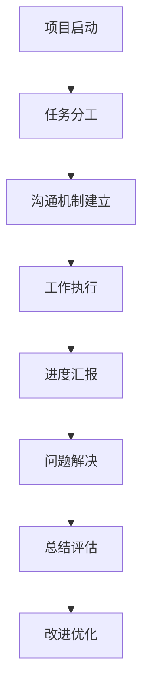

                 

# 《创业者的团队合作》

> **关键词：** 创业者、团队合作、团队协作、领导力、沟通技巧、冲突管理、跨部门协作、虚拟团队合作、团队文化、实战演练、持续改进、未来发展。

> **摘要：** 本文章针对创业者面临的团队合作挑战，深入探讨团队合作的核心概念、基础技巧、实战策略以及持续改进的方法。文章通过详细的理论讲解、实际案例分析、代码示例和实战演练，为创业者提供实用的团队合作指导，助力创业成功。

---

## 目录大纲

### 第一部分：团队合作基础

#### 第1章：团队合作概述
1.1 团队合作的重要性
1.2 团队合作的挑战
1.3 成功团队合作的关键因素

#### 第2章：团队构成与角色
2.1 团队成员的角色与责任
2.2 团队成员的素质与能力
2.3 团队结构设计

#### 第3章：沟通技巧
3.1 有效沟通的重要性
3.2 沟通障碍与解决方法
3.3 高效沟通的技巧

#### 第4章：冲突管理
4.1 冲突的本质与类型
4.2 冲突管理策略
4.3 处理冲突的方法

#### 第5章：领导力与影响力
5.1 领导力的定义与要素
5.2 提升领导力
5.3 影响力的构建与运用

#### 第6章：团队合作工具与技巧
6.1 团队合作工具的选择
6.2 团队协作技巧
6.3 团队建设的实践方法

### 第二部分：团队合作实战

#### 第7章：创业项目中的团队合作
7.1 创业项目特点
7.2 创业团队构建
7.3 创业项目中的团队合作策略

#### 第8章：跨部门协作
8.1 跨部门协作的重要性
8.2 跨部门协作的挑战
8.3 跨部门协作的实践方法

#### 第9章：虚拟团队合作
9.1 虚拟团队合作的特点
9.2 虚拟团队合作的优势
9.3 虚拟团队合作策略

#### 第10章：团队文化建设
10.1 团队文化的重要性
10.2 团队文化的构建与维护
10.3 团队文化的评估与改进

### 第三部分：案例研究与实战演练

#### 第11章：案例分析
11.1 成功团队的案例分析
11.2 困难团队的案例分析
11.3 团队合作的关键因素分析

#### 第12章：实战演练
12.1 团队合作实战演练设计
12.2 实战演练实施与评估
12.3 实战演练案例分享与讨论

### 附录

#### 附录 A：团队合作相关资源
A.1 团队合作理论
A.2 团队合作书籍推荐
A.3 团队合作工具推荐

#### 附录 B：团队协作流程图与示例
B.1 团队协作流程图
B.2 团队协作示例

#### 附录 C：常见团队合作问题解答
C.1 团队成员沟通不畅
C.2 团队成员缺乏协作精神
C.3 团队成员角色不明确

#### 第四部分：团队合作的持续改进与发展

#### 第13章：团队合作持续改进
13.1 持续改进的重要性
13.2 持续改进的方法
13.3 持续改进的实践

#### 第14章：团队发展策略
14.1 团队发展的阶段
14.2 团队发展的挑战
14.3 团队发展策略

#### 第15章：领导者的角色
15.1 领导者的影响力
15.2 领导者的职责
15.3 领导者的成长路径

#### 第16章：未来团队合作的趋势
16.1 数字化与团队合作
16.2 自动化与团队合作
16.3 人工智能与团队合作

#### 第17章：创业者的反思与实践
17.1 创业过程中的团队合作挑战
17.2 创业团队的成功经验
17.3 创业团队的失败教训

#### 附录

#### 附录 D：团队合作实战资源
D.1 团队合作培训推荐
D.2 团队合作案例分析集
D.3 团队合作工具更新与推荐

#### 附录 E：团队协作实战演练指南
E.1 实战演练设计原则
E.2 实战演练实施步骤
E.3 实战演练评估方法

#### 附录 F：常见团队合作问题应对指南
F.1 团队成员沟通不畅
F.2 团队成员协作不力
F.3 团队成员角色不明确

#### 附录 G：参考文献与推荐阅读
G.1 团队合作相关书籍推荐
G.2 团队合作理论研究文献推荐
G.3 团队合作实战案例分享

---

现在我们已经完成了文章的目录大纲，接下来我们将按照目录大纲逐章展开论述。让我们一步一步地深入探讨创业者的团队合作，为创业成功奠定坚实基础。

## 第一部分：团队合作基础

团队合作是创业成功的关键因素之一。在这个快速变化的时代，创业者面临的挑战日益复杂，需要依靠团队的智慧、力量和协作来应对。本部分将详细探讨团队合作的基础，包括团队合作的重要性、挑战、关键因素以及团队构成与角色。

### 第1章：团队合作概述

#### 1.1 团队合作的重要性

团队合作的重要性不言而喻。首先，团队合作能够汇集不同成员的专业知识和技能，形成互补效应，提高整体工作效率。其次，团队合作有助于培养团队成员的协作精神和团队合作能力，提升团队的凝聚力。此外，有效的团队合作能够降低项目风险，提高项目的成功概率。

在创业过程中，团队合作尤为重要。创业者面临的挑战是多方面的，包括资金、市场、技术、人才等。通过团队合作，创业者可以充分发挥各自的优势，共同应对各种挑战。例如，创业者可以组建技术团队、市场团队和运营团队，分别负责技术开发、市场推广和日常运营工作。通过团队协作，创业者能够更高效地完成项目，实现创业目标。

#### 1.2 团队合作的挑战

尽管团队合作具有诸多优势，但在实际操作过程中，创业者仍然会面临一系列挑战。首先，团队成员之间的沟通不畅是一个常见问题。团队成员来自不同的背景和专业领域，可能存在语言、文化、思维方式等方面的差异，导致沟通障碍。其次，团队成员之间的利益分配也是一个重要挑战。在创业过程中，团队成员可能会面临不同的职责和任务，如何确保利益分配公平合理，避免团队内部矛盾和冲突，是一个需要解决的问题。

此外，团队合作还面临其他挑战，如团队结构设计不合理、团队成员能力不足、团队目标不明确等。为了克服这些挑战，创业者需要深入了解团队合作的基础，掌握有效的团队合作方法和技巧。

#### 1.3 成功团队合作的关键因素

成功团队合作需要具备以下几个关键因素：

1. **明确的目标和愿景**：团队需要明确共同的目标和愿景，确保团队成员在同一个方向上努力。明确的目标和愿景有助于统一团队行动，提高团队凝聚力。

2. **合理的团队结构**：团队结构设计合理，能够确保团队成员的职责和任务清晰，避免职责重叠和责任不明确的问题。此外，合理的团队结构有利于提高团队协作效率，减少沟通成本。

3. **良好的沟通机制**：有效的沟通机制能够确保团队成员之间的信息畅通，减少误解和矛盾。创业者需要建立良好的沟通渠道，鼓励团队成员积极沟通，分享信息和经验。

4. **团队信任和协作精神**：团队信任是成功团队合作的基础。团队成员之间建立信任关系，有助于增强团队凝聚力，提高团队协作效率。创业者需要注重团队文化建设，培养团队成员的协作精神。

5. **合理的激励制度**：创业者需要建立合理的激励制度，激发团队成员的积极性和创造力。通过激励制度，确保团队成员在实现个人价值的同时，也为团队和公司的发展做出贡献。

以上是团队合作的基础概述，接下来我们将进一步探讨团队构成与角色，以及团队合作中的沟通技巧和冲突管理。

### 第2章：团队构成与角色

#### 2.1 团队成员的角色与责任

在一个成功的团队中，每个成员都扮演着特定的角色，承担相应的责任。团队成员的角色可以分为以下几类：

1. **领导者**：领导者是团队的核心，负责制定团队目标和计划，指导团队成员完成任务。领导者需要具备良好的沟通能力、决策能力和团队管理能力。

2. **技术人员**：技术人员是团队的中坚力量，负责技术开发和实现。技术人员需要具备扎实的专业知识、技能和创新能力。

3. **市场人员**：市场人员负责市场调研、产品推广和客户关系管理。市场人员需要具备市场敏锐度、沟通能力和销售技巧。

4. **运营人员**：运营人员负责日常运营工作，包括团队协调、项目管理、数据分析等。运营人员需要具备良好的组织能力、协调能力和数据分析能力。

5. **财务人员**：财务人员负责财务管理、预算规划和资金管理。财务人员需要具备财务专业知识、分析和规划能力。

团队成员的角色和责任需要明确，确保每个成员都清楚自己的职责和任务，避免职责重叠和责任不明确的问题。团队成员之间需要相互协作，共同推动团队目标的实现。

#### 2.2 团队成员的素质与能力

团队成员的素质与能力是团队合作成功的关键。以下是一些关键的团队成员素质与能力：

1. **专业能力**：团队成员需要具备扎实的专业知识和技能，能够胜任自己的职责和任务。专业能力是团队成员的基本要求。

2. **沟通能力**：团队成员需要具备良好的沟通能力，能够清晰、准确地表达自己的想法和意见，同时也能够倾听他人的观点和建议。

3. **团队合作精神**：团队成员需要具备团队合作精神，愿意与他人合作，共同完成团队目标。团队合作精神是团队成功的重要保障。

4. **解决问题的能力**：团队成员需要具备解决问题的能力，能够在遇到问题时积极寻找解决方案，避免因问题而导致团队协作受阻。

5. **自我驱动力**：团队成员需要具备自我驱动力，能够主动承担责任，追求个人成长，同时也为团队和公司的发展做出贡献。

6. **学习能力**：团队成员需要具备学习能力，能够不断更新自己的知识和技能，适应快速变化的工作环境。

#### 2.3 团队结构设计

团队结构设计是团队合作成功的基础。合理的团队结构能够提高团队协作效率，减少沟通成本和冲突。以下是一些团队结构设计的关键要素：

1. **扁平化结构**：扁平化结构有助于提高团队协作效率，减少管理层级，使团队成员能够更直接地沟通和协作。

2. **跨职能团队**：跨职能团队能够汇集不同专业领域的人才，形成多元化的团队，提高团队创新能力。

3. **矩阵式结构**：矩阵式结构能够将团队成员按照职能和项目需求进行组合，使团队成员能够灵活调整职责和任务。

4. **虚拟团队**：虚拟团队能够利用远程协作工具，实现团队成员的远程合作，提高团队协作效率。

5. **明确的职责和权限**：团队结构设计需要明确每个团队成员的职责和权限，避免职责重叠和责任不明确的问题。

6. **灵活调整**：团队结构设计需要具备灵活性，能够根据团队目标和项目需求进行调整，以适应团队变化。

以上是团队构成与角色、团队成员素质与能力以及团队结构设计的基础内容。在下一章中，我们将探讨沟通技巧，帮助团队成员建立有效的沟通机制，提高团队协作效率。

### 第3章：沟通技巧

#### 3.1 有效沟通的重要性

在团队合作中，沟通是至关重要的。有效沟通能够确保团队成员之间信息畅通，减少误解和矛盾，提高团队协作效率。以下是有效沟通的几个重要方面：

1. **信息传递准确**：有效沟通的首要目标是确保信息传递准确。团队成员需要明确表达自己的观点和意见，同时也要仔细倾听他人的意见和需求。

2. **减少误解和矛盾**：沟通中的误解和矛盾是团队协作的大敌。通过有效沟通，团队成员可以及时解决误解和矛盾，避免因沟通不畅导致的团队冲突。

3. **提高团队协作效率**：有效沟通能够确保团队成员之间信息畅通，减少沟通成本和等待时间，提高团队协作效率。

4. **增强团队凝聚力**：有效沟通有助于增强团队成员之间的信任和了解，提高团队凝聚力，为团队目标的实现奠定基础。

#### 3.2 沟通障碍与解决方法

尽管沟通对于团队合作至关重要，但在实际操作过程中，团队成员之间仍然可能面临一系列沟通障碍。以下是一些常见的沟通障碍及解决方法：

1. **语言障碍**：团队成员来自不同的背景和文化，可能存在语言障碍。解决方法包括使用简单、清晰的语言进行沟通，避免使用过于复杂的专业术语。

2. **信息过载**：团队成员可能因为接收到的信息过多而导致信息过载，难以消化和处理。解决方法包括设定沟通频率和时间，避免信息过载。

3. **信息不透明**：团队成员之间可能因为信息不透明而导致沟通不畅。解决方法包括建立透明、开放的沟通机制，确保团队成员能够及时获取相关信息。

4. **个人偏见**：个人偏见可能导致团队成员对某些信息或意见产生误解和偏见。解决方法包括鼓励团队成员保持开放心态，尊重他人的观点和意见。

5. **时间冲突**：团队成员可能因为时间冲突而难以进行有效沟通。解决方法包括提前安排沟通时间，确保团队成员能够参与沟通。

#### 3.3 高效沟通的技巧

为了提高团队沟通效率，团队成员需要掌握一些高效沟通的技巧。以下是一些实用的沟通技巧：

1. **主动沟通**：团队成员应该主动沟通，积极表达自己的观点和意见。同时，也要主动倾听他人的意见和需求，促进双向沟通。

2. **明确目标**：在进行沟通之前，团队成员应该明确沟通的目标和期望结果。这样可以确保沟通更有针对性和效率。

3. **有效表达**：团队成员需要学会有效表达，使用简单、清晰的语言，避免使用过于复杂或模糊的表述。

4. **倾听与理解**：团队成员应该学会倾听和尊重他人的观点，理解他人的需求和期望。这样可以减少误解和矛盾，提高沟通效果。

5. **反馈与确认**：在沟通过程中，团队成员应该及时给予反馈，确认对方是否理解自己的观点和意见。这样可以确保沟通的准确性和有效性。

6. **利用沟通工具**：团队成员可以利用各种沟通工具，如邮件、即时通讯工具、视频会议等，提高沟通效率。选择合适的沟通工具，可以确保信息传递及时、准确。

通过掌握这些沟通技巧，团队成员可以建立有效的沟通机制，提高团队协作效率，为创业成功奠定基础。

以上是沟通技巧的概述。在下一章中，我们将探讨团队合作中的冲突管理，帮助团队成员学会处理冲突，维护团队和谐。

### 第4章：冲突管理

#### 4.1 冲突的本质与类型

冲突是团队合作中不可避免的一部分。冲突的本质是团队成员在目标、观点、利益等方面的不一致，这种不一致可能导致误解、矛盾和对抗。以下是冲突的几种类型：

1. **目标冲突**：当团队成员对项目目标或公司愿景有不同的看法时，可能引发目标冲突。例如，技术团队可能认为应该优先开发功能，而市场团队则认为应该优先推广产品。

2. **观点冲突**：团队成员可能在某些观点或决策上存在分歧。例如，关于产品设计的不同意见可能导致团队成员之间的冲突。

3. **利益冲突**：团队成员可能在资源分配、利益分配等方面产生矛盾。例如，团队成员可能因为担心自己的利益受损而对项目的某些决策提出异议。

4. **文化冲突**：团队成员来自不同的文化背景，可能存在价值观、行为方式等方面的差异，这种文化冲突可能导致团队合作中的摩擦和矛盾。

#### 4.2 冲突管理策略

为了有效管理冲突，团队需要采取一系列策略，以减少冲突带来的负面影响。以下是一些常见的冲突管理策略：

1. **预防策略**：预防策略旨在防止冲突的发生。团队可以通过建立清晰的沟通机制、明确的目标和规则，以及培养团队成员的协作精神来预防冲突。

2. **解决策略**：解决策略用于解决已经发生的冲突。团队可以通过对话、妥协、协商等方式来解决冲突。关键在于找到双方都能接受的解决方案，避免对抗和情绪化。

3. **转移策略**：转移策略用于将冲突从一种形式转变为另一种形式。例如，通过将冲突转化为团队建设活动，可以提高团队成员之间的沟通和理解。

4. **消除策略**：消除策略旨在彻底消除冲突。这通常需要更深入的分析和变革，可能包括调整团队结构、重新分配任务或引入外部咨询。

#### 4.3 处理冲突的方法

以下是一些处理冲突的具体方法：

1. **直接对话**：直接对话是处理冲突最直接和有效的方法。团队成员应该面对面交流，表达自己的观点和感受，倾听他人的意见和需求。

2. **调解**：调解是一种由第三方介入的冲突解决方法。调解者可以帮助团队成员找到共同点，促进对话和协商，找到双方都能接受的解决方案。

3. **妥协**：在无法达成一致的情况下，妥协是一种常见的方法。团队成员可以各自做出一定的让步，以达成共识。

4. **回避**：回避是避免直接面对冲突，选择不处理或推迟处理。这种方法适用于一些非关键性或暂时性的冲突。

5. **合作**：合作是处理冲突的最高级形式。团队成员共同努力，寻找双方都能接受的解决方案，以实现团队目标。

通过有效管理冲突，团队可以减少负面影响，提高协作效率，实现共同目标。在下一章中，我们将探讨领导力与影响力，帮助团队成员提升领导力，增强团队凝聚力。

### 第5章：领导力与影响力

#### 5.1 领导力的定义与要素

领导力是团队合作中至关重要的因素。领导力不仅仅是指位高权重的领导者所具备的能力，而是每个团队成员都应该具备的素质。以下是领导力的定义和关键要素：

**定义：** 领导力是一种激发和引导团队成员实现共同目标的能力，它包括领导者的思想、行为和影响力。

**关键要素：**

1. **愿景与目标**：领导者需要具备明确的愿景和目标，能够为团队成员指明方向，激发团队成员的斗志和动力。

2. **决策能力**：领导者需要具备良好的决策能力，能够在关键时刻做出正确的决策，确保团队目标的实现。

3. **沟通能力**：领导者需要具备良好的沟通能力，能够清晰、准确地表达自己的想法，同时也能够倾听和理解团队成员的意见和需求。

4. **团队建设**：领导者需要注重团队建设，培养团队成员的协作精神，增强团队的凝聚力。

5. **激励能力**：领导者需要具备激励能力，能够激发团队成员的积极性和创造力，帮助团队成员实现个人价值和团队目标。

6. **适应能力**：领导者需要具备适应能力，能够应对不断变化的环境和挑战，带领团队不断进步。

#### 5.2 提升领导力

提升领导力是一个持续的过程，需要团队成员不断学习和实践。以下是一些提升领导力的方法：

1. **自我认知**：领导者需要了解自己的优势和劣势，认识到自己的领导风格和影响方式，以便更好地发挥自己的领导力。

2. **不断学习**：领导者需要不断学习新的知识和技能，了解行业动态和趋势，提升自己的专业素养。

3. **实践与反思**：领导者需要通过实践来提升自己的领导力，同时进行反思和总结，从实践中学习和成长。

4. **培养团队**：领导者需要培养团队成员，帮助他们成长和发展，建立一支高效的团队。

5. **建立信任**：领导者需要建立与团队成员之间的信任关系，这是提升领导力的关键。

6. **有效沟通**：领导者需要通过有效沟通来建立团队目标，激励团队成员，解决问题和冲突。

#### 5.3 影响力的构建与运用

领导力不仅仅是一种能力，更是一种影响力。领导者需要构建和运用自己的影响力，以实现团队目标。以下是如何构建和运用影响力的方法：

1. **建立个人品牌**：领导者需要建立自己的个人品牌，树立专业、权威、可信的形象，提高自己的影响力。

2. **发挥榜样作用**：领导者需要通过自己的行为来影响团队成员，成为团队成员的榜样。

3. **建立人际网络**：领导者需要建立广泛的人际网络，与团队成员、上级和外部合作伙伴建立良好的关系。

4. **传递价值观**：领导者需要传递自己的价值观和信念，引导团队成员共同追求卓越。

5. **提供资源和支持**：领导者需要为团队成员提供必要的资源和支持，帮助他们实现目标。

6. **激励与奖励**：领导者需要通过激励和奖励来增强团队成员的积极性，提高团队的整体表现。

通过提升领导力和构建影响力，领导者可以更好地引导和激励团队成员，实现团队目标，推动企业的发展。

在下一章中，我们将探讨团队合作工具与技巧，帮助团队成员提高团队协作效率。

### 第6章：团队合作工具与技巧

#### 6.1 团队合作工具的选择

在团队合作中，选择合适的工具对于提高团队协作效率至关重要。以下是一些常见的团队合作工具及其特点：

1. **项目管理工具**：如Trello、Asana、Jira等，这些工具可以帮助团队更好地规划和管理项目任务，跟踪进度和责任分配。

2. **文档协作工具**：如Google Docs、Notion、Confluence等，这些工具支持实时协作，方便团队成员共享和编辑文档。

3. **即时通讯工具**：如Slack、Microsoft Teams、WhatsApp等，这些工具支持实时沟通和协作，方便团队成员快速交流信息和解决问题。

4. **视频会议工具**：如Zoom、Skype、Google Meet等，这些工具支持远程会议和协作，有助于团队成员远程沟通和协作。

5. **代码协作工具**：如Git、GitHub、GitLab等，这些工具支持代码管理和版本控制，有助于开发团队高效协作。

6. **数据协作工具**：如Tableau、Power BI、Excel等，这些工具支持数据分析和管理，有助于团队成员更好地理解和利用数据。

选择团队合作工具时，需要考虑团队的规模、项目类型、协作需求等因素，确保工具能够满足团队的实际需求。

#### 6.2 团队协作技巧

除了选择合适的工具，团队协作技巧也是提高团队协作效率的关键。以下是一些实用的团队协作技巧：

1. **明确目标和任务**：确保每个团队成员都清楚自己的目标和任务，减少误解和重复工作。

2. **分工与合作**：根据团队成员的能力和特长进行分工，确保每个人都能发挥自己的优势，同时鼓励团队合作，共同完成任务。

3. **定期会议**：定期举行团队会议，分享进展、讨论问题、制定计划，确保团队协作顺利进行。

4. **透明沟通**：建立透明、开放的沟通机制，鼓励团队成员随时分享信息和反馈，提高团队协作效率。

5. **有效反馈**：团队成员之间应进行及时、有效的反馈，帮助彼此改进和成长。

6. **持续改进**：不断反思和改进团队协作方法，根据项目进展和团队需求调整协作策略。

7. **尊重与支持**：尊重团队成员的意见和贡献，提供支持和帮助，建立和谐的团队氛围。

通过选择合适的团队合作工具和掌握团队协作技巧，团队成员可以更好地协作，提高团队协作效率，实现团队目标。

在下一章中，我们将探讨创业项目中的团队合作，帮助创业者更好地构建和管理创业团队。

### 第7章：创业项目中的团队合作

创业项目是一个充满挑战和机遇的过程，团队合作在其中扮演着至关重要的角色。创业项目具有以下几个特点，这些特点决定了团队合作在创业项目中的重要性。

#### 7.1 创业项目特点

1. **不确定性高**：创业项目往往面临较高的不确定性，包括市场需求、竞争环境、技术风险等。团队合作可以汇集不同成员的智慧和经验，共同应对不确定性。

2. **任务复杂**：创业项目通常涉及多个领域，如技术开发、市场推广、财务规划等。团队合作可以充分利用团队成员的专业知识和技能，提高项目的执行效率。

3. **时间紧迫**：创业项目往往需要在较短的时间内实现目标，时间紧迫性要求团队成员必须高效协作，确保项目进度。

4. **资源有限**：创业项目通常资源有限，包括资金、人力、时间等。团队合作可以提高资源的利用效率，优化资源配置，确保项目成功。

5. **创新驱动**：创业项目强调创新，团队成员需要不断提出新的想法和解决方案，推动项目发展。团队合作可以激发创新思维，提高项目创新能力。

#### 7.2 创业团队构建

构建一个高效的创业团队是成功创业的关键。以下是一些构建创业团队的步骤和策略：

1. **明确团队目标**：在组建团队之前，需要明确团队的目标和愿景，确保团队成员在同一个方向上努力。

2. **识别关键角色**：根据创业项目的特点，识别关键角色，如领导者、技术专家、市场专家、运营专家等。确保每个关键角色都有合适的人选。

3. **多元化团队**：多元化团队可以带来不同的视角和思路，提高团队的创新能力和决策质量。确保团队成员来自不同的背景和专业领域。

4. **招聘优秀人才**：通过面试、评估等手段，招聘优秀的人才加入团队。重视候选人的专业技能、经验和团队合作能力。

5. **建立团队文化**：建立积极的团队文化，鼓励团队成员相互尊重、支持、信任，提高团队的凝聚力。

6. **培训和培养**：为团队成员提供培训和培养机会，帮助他们提升技能和知识，提高团队的整体能力。

#### 7.3 创业项目中的团队合作策略

在创业项目中，团队合作策略至关重要。以下是一些有效的团队合作策略：

1. **明确分工和职责**：确保每个团队成员都清楚自己的职责和任务，避免职责重叠和责任不明确的问题。

2. **建立沟通机制**：建立高效的沟通机制，确保团队成员之间信息畅通，减少误解和矛盾。

3. **定期会议和反馈**：定期举行团队会议，分享进展、讨论问题、制定计划。同时，鼓励团队成员之间进行及时的反馈和沟通。

4. **共享资源和信息**：建立资源共享机制，确保团队成员能够及时获取所需的信息和资源，提高团队协作效率。

5. **灵活调整和适应**：创业项目环境变化快，团队合作需要具备灵活性，能够快速适应变化，调整协作策略。

6. **鼓励创新和反馈**：鼓励团队成员提出创新的想法和解决方案，建立反馈机制，及时调整项目方向和策略。

通过构建高效的创业团队和实施有效的团队合作策略，创业者可以更好地应对创业项目中的挑战，提高项目成功率。

在下一章中，我们将探讨跨部门协作的重要性、挑战和策略，帮助团队成员更好地进行跨部门协作。

### 第8章：跨部门协作

在创业项目中，跨部门协作是提高整体工作效率和实现项目目标的关键。跨部门协作不仅涉及不同团队之间的沟通和合作，还需要克服部门间的障碍和挑战。以下将详细探讨跨部门协作的重要性、挑战和策略。

#### 8.1 跨部门协作的重要性

跨部门协作的重要性体现在以下几个方面：

1. **资源整合**：跨部门协作可以整合不同部门的专业知识和资源，提高资源利用效率，避免重复建设和资源浪费。

2. **协同创新**：跨部门协作可以促进不同团队之间的交流和合作，激发创新思维，推动项目创新和发展。

3. **提升效率**：通过跨部门协作，可以明确各部门的任务和责任，减少信息传递的时间和成本，提高项目执行效率。

4. **优化决策**：跨部门协作可以使决策更加全面和科学，减少部门间的误解和冲突，提高决策质量。

5. **增强团队凝聚力**：跨部门协作可以增进不同部门之间的了解和信任，增强团队凝聚力，提升团队士气。

#### 8.2 跨部门协作的挑战

尽管跨部门协作具有诸多优势，但在实际操作过程中，团队成员仍会面临一系列挑战：

1. **部门壁垒**：不同部门之间可能存在利益冲突、职责不清、沟通不畅等问题，形成部门壁垒，阻碍跨部门协作。

2. **信息不对称**：部门间信息传递不畅，可能导致信息不对称，影响跨部门协作的效率和效果。

3. **时间冲突**：不同部门的任务和时间安排可能存在冲突，导致协作受阻。

4. **文化差异**：不同部门的文化差异可能导致协作中的误解和冲突，影响跨部门协作的效果。

5. **责任归属**：跨部门协作中，责任归属不明确可能导致团队成员推诿责任，影响项目进展。

#### 8.3 跨部门协作的实践方法

为了克服跨部门协作的挑战，实现高效协作，以下是一些实践方法：

1. **建立跨部门协作机制**：明确跨部门协作的目标、流程和责任，建立跨部门协作机制，确保各部门能够顺畅沟通和协作。

2. **建立沟通渠道**：建立有效的沟通渠道，如定期会议、即时通讯工具、邮件等，确保信息传递畅通。

3. **明确任务和责任**：明确各部门的任务和责任，确保各部门对任务有清晰的认识，避免职责重叠和责任不明确的问题。

4. **共享资源和信息**：建立资源共享机制，确保各部门能够及时获取所需的信息和资源，提高协作效率。

5. **加强团队文化建设**：加强团队文化建设，培养团队成员的协作精神和团队意识，增强团队凝聚力。

6. **建立激励机制**：建立激励机制，鼓励团队成员积极参与跨部门协作，提高协作积极性。

7. **定期评估和反馈**：定期评估跨部门协作的效果，收集团队成员的反馈，不断优化协作流程和策略。

通过建立有效的跨部门协作机制和实施具体的实践方法，团队成员可以克服协作中的挑战，实现高效协作，推动项目成功。

在下一章中，我们将探讨虚拟团队合作的特点、优势以及策略，帮助团队成员更好地开展虚拟团队合作。

### 第9章：虚拟团队合作

随着远程工作和全球团队的日益普及，虚拟团队合作成为现代创业环境中不可或缺的一部分。虚拟团队合作具有独特的特点和优势，同时也面临着一系列挑战。本章节将探讨虚拟团队合作的特点、优势以及有效的策略。

#### 9.1 虚拟团队合作的特点

虚拟团队合作与传统面对面的团队合作相比，具有以下几个显著特点：

1. **地理位置分散**：虚拟团队成员可能分布在全球各地，缺乏面对面的互动和交流。

2. **时间差异**：由于地理位置的差异，虚拟团队成员的工作时间可能存在较大的差异，导致协作过程中的时间协调问题。

3. **技术依赖**：虚拟团队合作高度依赖各种协作工具和平台，如视频会议软件、即时通讯工具、项目管理工具等。

4. **自主性高**：虚拟团队成员通常需要具备较高的自主性和自我管理能力，以适应远程工作环境和独立完成任务。

5. **沟通形式多样化**：虚拟团队合作中的沟通形式更加多样化，包括电子邮件、即时通讯、视频会议、在线文档协作等。

6. **团队建设挑战**：虚拟团队合作中，团队成员之间的面对面交流和团队建设活动较少，可能影响团队的凝聚力和合作精神。

#### 9.2 虚拟团队合作的优势

虚拟团队合作虽然面临诸多挑战，但也具有明显的优势，包括：

1. **灵活性**：虚拟团队合作使团队成员能够根据自身的时间和地点安排工作，提高工作效率和灵活性。

2. **成本效益**：虚拟团队合作减少了办公室租金、交通费用等成本，有助于降低企业的运营成本。

3. **全球人才池**：虚拟团队合作可以跨越地理限制，吸引全球范围内的优秀人才，提高团队的多样性和创新能力。

4. **弹性工作制**：虚拟团队合作支持弹性工作制，使团队成员能够在不同的工作和生活环境中保持高效的工作状态。

5. **工作生活平衡**：虚拟团队合作有助于团队成员更好地平衡工作与生活，提高工作满意度和生活质量。

#### 9.3 虚拟团队合作策略

为了克服虚拟团队合作中的挑战，实现高效协作，以下是一些关键策略：

1. **明确目标与职责**：确保团队成员对项目目标、个人职责和工作流程有清晰的认识，减少误解和冲突。

2. **强化沟通机制**：建立高效的沟通机制，如定期团队会议、即时通讯工具、邮件更新等，确保信息传递畅通。

3. **技术工具合理应用**：合理选择和应用虚拟协作工具，如Slack、Zoom、Trello、GitHub等，提高团队协作效率。

4. **时间管理**：制定明确的工作计划和任务分配，合理利用协作工具的时间管理功能，减少时间冲突。

5. **团队文化建设**：通过虚拟团队建设活动，如线上团建、虚拟社交活动等，增强团队成员之间的互动和信任。

6. **反馈与评估**：定期收集团队成员的反馈，评估虚拟团队合作的成效，不断优化协作流程和策略。

7. **培养自主性**：培养团队成员的自主性和自我管理能力，鼓励他们在虚拟工作环境中独立思考和解决问题。

通过了解虚拟团队合作的特点、优势以及有效的策略，团队成员可以更好地适应虚拟工作环境，实现高效协作，推动项目成功。

在下一章中，我们将探讨团队文化建设的重要性，以及如何构建和维护积极的团队文化。

### 第10章：团队文化建设

团队文化是团队合作中不可或缺的一部分，它不仅影响着团队成员的态度和行为，还直接关系到团队的整体绩效和长期发展。一个积极的团队文化可以增强团队的凝聚力、激发团队成员的创造力，并提高工作效率。以下将探讨团队文化的重要性、构建与维护方法以及评估与改进。

#### 10.1 团队文化的重要性

1. **团队凝聚力**：积极的团队文化可以增强团队成员之间的联系和信任，提高团队的凝聚力。

2. **工作效率**：团队文化直接影响团队成员的工作态度和行为，一个积极的团队文化可以提高工作效率和生产力。

3. **创新能力**：良好的团队文化鼓励创新思维和尝试新方法，有助于团队在竞争激烈的市场中保持竞争力。

4. **员工满意度**：一个积极的团队文化可以提高员工的工作满意度，减少员工流失率，提高员工忠诚度。

5. **客户满意度**：团队文化也会影响与客户的关系，积极的团队文化可以提高客户满意度，促进业务增长。

#### 10.2 团队文化的构建与维护方法

1. **明确价值观**：团队文化应基于共同的价值观和信念，确保所有团队成员都认同并遵循这些价值观。

2. **领导示范**：领导者应该以身作则，通过自身行为展示团队文化的核心价值观，树立榜样。

3. **团队建设活动**：定期组织团队建设活动，如团建旅行、团队竞赛、团队培训等，增强团队成员之间的互动和凝聚力。

4. **开放沟通**：鼓励团队成员之间的开放沟通，建立透明、开放的沟通机制，确保信息畅通无阻。

5. **激励与认可**：建立有效的激励和认可机制，对团队成员的贡献和成就给予认可和奖励，增强团队成员的积极性和动力。

6. **持续培训**：为团队成员提供持续的学习和培训机会，帮助他们不断提升技能和知识，适应团队文化。

7. **培养包容性**：培养团队成员的包容性和多样性意识，尊重不同的观点和文化背景，促进团队合作。

#### 10.3 团队文化的评估与改进

1. **员工满意度调查**：定期进行员工满意度调查，了解团队成员对团队文化的看法和建议，评估团队文化的有效性。

2. **绩效指标分析**：通过分析团队的绩效指标，如工作效率、项目完成度、员工流失率等，评估团队文化的实际影响。

3. **反馈机制**：建立反馈机制，鼓励团队成员提出改进团队文化的建议，及时解决问题和矛盾。

4. **定期评估**：定期对团队文化进行评估，根据评估结果制定改进计划，持续优化团队文化。

5. **外部咨询**：引入外部专家进行团队文化咨询，提供专业建议和指导，帮助团队构建和维护积极的团队文化。

通过构建和维护积极的团队文化，团队可以增强凝聚力、提高工作效率和创新能力，为企业的长期发展奠定坚实基础。在下一章中，我们将通过案例分析和实战演练，进一步探讨团队合作的实际应用。

### 第11章：案例分析与实战演练

#### 11.1 成功团队的案例分析

在创业和项目管理中，成功团队的案例分析是了解团队合作最佳实践的重要途径。以下是一个成功团队的案例分析，该团队在技术创新项目中取得了显著成就。

**案例：** 一家初创公司在开发一款人工智能驱动的新型智能家居设备。团队由来自不同背景的成员组成，包括软件工程师、硬件工程师、产品经理和市场专家。

1. **明确目标与愿景**：团队在项目初期明确了共同的目标和愿景，即开发一款具有创新性和用户友好的智能家居设备，并迅速占领市场。

2. **合理分工**：根据成员的专业背景和技能，团队进行了明确的分工。软件工程师负责算法和软件架构的开发，硬件工程师负责硬件设计和原型制作，产品经理负责市场调研和用户反馈，市场专家负责品牌建设和营销策略。

3. **有效沟通**：团队建立了高效的沟通机制，每周举行团队会议，分享进展、讨论问题，确保每个成员都能及时了解项目动态。

4. **持续改进**：团队不断进行项目评估和反馈，根据市场反馈和用户需求，不断优化产品设计和功能。

5. **激励机制**：团队建立了激励机制，对成员的贡献和成就给予认可和奖励，激发团队成员的积极性和创造力。

通过这些措施，团队成功开发并推出了一款广受欢迎的智能家居设备，取得了良好的市场反响和盈利能力。

#### 11.2 困难团队的案例分析

虽然成功团队的案例分析提供了宝贵的经验，但创业和项目管理中也难免会遇到困难团队。以下是一个困难团队的案例分析，该团队在项目中面临了诸多挑战。

**案例：** 一家初创公司在开发一款新的健康监测设备。团队由来自不同部门的成员组成，包括研发部门、市场部门和运营部门。

1. **沟通不畅**：由于各部门之间缺乏有效的沟通，项目进展缓慢。各部门对自己的任务和目标理解不一致，导致工作重复和资源浪费。

2. **目标冲突**：研发部门注重技术实现，而市场部门则关注市场需求，双方在项目优先级和资源分配上存在冲突。

3. **责任不明**：团队成员对各自职责和责任认识不清，导致项目执行过程中责任推诿和决策迟缓。

4. **缺乏领导力**：团队缺乏强有力的领导，无法及时解决冲突和协调各方资源。

为了克服这些挑战，团队采取了以下措施：

- **建立沟通渠道**：定期举行跨部门会议，建立透明的沟通机制，确保各部门之间的信息畅通。
- **明确目标和责任**：明确各部门的目标和责任，确保团队成员对任务和目标有清晰的认识。
- **强化领导力**：任命一位跨部门的项目经理，负责协调各部门工作，解决冲突和推动项目进展。

通过这些措施，团队逐渐克服了困难，项目最终取得了成功。

#### 11.3 团队合作的关键因素分析

从以上案例可以看出，团队合作的成功与否取决于多个关键因素。以下是团队合作中的关键因素及其重要性：

1. **明确的目标与愿景**：共同的目标和愿景是团队协作的基础，有助于统一团队成员的行动方向。

2. **合理的分工与职责**：明确团队成员的职责和任务，确保每个人都能发挥自己的优势，提高团队协作效率。

3. **有效的沟通机制**：高效的沟通机制有助于减少误解和冲突，确保团队信息畅通。

4. **持续的反馈与评估**：通过持续的反馈和评估，团队能够及时发现和解决问题，优化项目执行。

5. **领导力与影响力**：强有力的领导可以协调团队成员，解决冲突，推动项目进展。

6. **激励机制**：合理的激励机制能够激发团队成员的积极性和创造力，提高团队的整体绩效。

通过案例分析，我们可以更好地理解团队合作的关键因素，并在实际工作中运用这些经验，提高团队协作效率，实现项目目标。

在下一章中，我们将进行团队合作实战演练，帮助读者将理论知识应用于实际项目中。

### 第12章：实战演练

#### 12.1 团队合作实战演练设计

团队合作实战演练是一种有效的学习方法，通过模拟实际工作场景，让团队成员在实践中掌握团队合作的关键技能。以下是一个团队合作实战演练的设计方案：

**目标**：提高团队成员的沟通技巧、协作精神和问题解决能力。

**内容**：模拟一个创业项目，团队成员分为不同的职能小组，如市场组、研发组和运营组，各自负责项目的一部分。

**步骤**：

1. **项目启动会议**：项目启动会议是实战演练的开始，由项目负责人介绍项目背景、目标和任务，明确各小组的职责。

2. **任务分配**：根据团队成员的专业背景和兴趣，分配任务。例如，市场组负责市场调研和营销策略，研发组负责产品设计和开发，运营组负责项目管理和运营。

3. **项目计划制定**：各小组根据任务分配，制定详细的项目计划，包括时间表、资源需求和预期成果。

4. **执行与协作**：各小组开始执行任务，过程中需要频繁协作，如市场组需要与研发组讨论产品功能，运营组需要与市场组协调推广策略。

5. **进度汇报**：定期举行进度汇报会议，各小组汇报任务进展，分享遇到的困难和解决方案。

6. **总结与评估**：项目完成后，进行总结与评估，讨论实战演练中的经验和教训，提出改进建议。

#### 12.2 实战演练实施与评估

**实施过程**：

1. **培训准备**：在实战演练开始前，为团队成员提供相关培训，包括沟通技巧、团队协作工具的使用等。

2. **项目启动**：按照设计方案，启动项目，各小组开始执行任务。

3. **监控与指导**：项目负责人和指导老师全程监控项目进展，提供必要的支持和指导。

4. **定期汇报**：定期举行进度汇报会议，确保项目按计划进行，及时解决问题。

5. **反馈与调整**：根据进度汇报和团队成员的反馈，及时调整项目计划，优化协作流程。

**评估方法**：

1. **绩效评估**：根据项目目标和任务完成情况，对团队成员的绩效进行评估，包括任务完成度、协作精神和贡献度。

2. **沟通评估**：评估团队成员的沟通效率和质量，包括沟通频率、信息传递准确性和反馈机制。

3. **团队建设评估**：评估团队成员之间的信任、合作精神和团队凝聚力。

4. **自我评估**：鼓励团队成员进行自我评估，反思自己在实战演练中的表现和收获。

通过实战演练的实施和评估，团队成员可以更好地理解团队合作的重要性，掌握协作技能，提高团队整体绩效。

#### 12.3 实战演练案例分享与讨论

**案例分享**：

在一个创业项目中，团队通过实战演练成功完成了一个复杂的软件应用开发。以下是案例分享：

1. **项目背景**：团队需要开发一款能够实时监控电力系统的智能软件，涉及多个技术领域，如物联网、大数据和云计算。

2. **任务分配**：团队分为研发、测试和运维三个小组，分别负责软件开发、测试和部署。

3. **协作过程**：研发小组在开发过程中遇到了多个技术难题，测试小组和运维小组提供了宝贵的意见和建议，通过多次迭代和协作，最终解决了问题。

4. **成果展示**：项目完成后，团队举行了成果展示会议，向投资人和技术专家展示了软件的功能和性能。

**讨论**：

在实战演练案例分享和讨论中，团队成员分享了各自的感受和体会：

1. **沟通技巧**：团队成员表示，通过实战演练，他们学会了如何更有效地沟通，如何倾听他人的意见，以及如何表达自己的观点。

2. **协作精神**：团队成员认识到协作精神的重要性，通过协作，他们不仅提高了工作效率，也加深了对彼此的了解和信任。

3. **问题解决能力**：在遇到困难时，团队成员学会了如何团队合作，共同寻找解决方案，这种能力对实际工作非常有益。

通过实战演练案例的分享和讨论，团队成员可以更好地理解团队合作的价值，并在实际工作中运用所学技能，提高团队协作效率。

在下一章中，我们将探讨团队合作的持续改进与发展，为团队的长远发展提供指导。

### 第13章：团队合作持续改进

团队合作是一个不断发展和优化过程。为了确保团队能够在动态和竞争激烈的环境中保持竞争力，持续改进是必不可少的。以下将讨论团队合作持续改进的重要性、方法以及实践。

#### 13.1 持续改进的重要性

持续改进是团队成功的关键。以下是持续改进的重要性：

1. **适应变化**：随着市场环境、技术发展和团队需求的不断变化，持续改进可以帮助团队及时调整策略，适应新情况。

2. **提高效率**：通过持续改进，团队能够识别和消除工作中的瓶颈和低效环节，提高工作效率和生产力。

3. **增强竞争力**：持续改进有助于团队不断创新和优化，提高产品或服务的质量，增强市场竞争力。

4. **员工满意度**：持续改进可以提升团队成员的工作体验，提高员工满意度，减少员工流失。

5. **长期发展**：持续改进有助于团队建立良好的发展模式，为未来的长期发展奠定基础。

#### 13.2 持续改进的方法

以下是几种常用的持续改进方法：

1. **PDCA循环（戴明环）**：
   - **计划（Plan）**：制定改进计划和目标。
   - **执行（Do）**：实施改进计划。
   - **检查（Check）**：评估改进效果。
   - **行动（Act）**：根据评估结果调整和优化改进计划。

2. **Kaizen（改善）**：Kaizen是一种持续改进的方法，强调每个人都可以参与改进，通过不断的微小改进积累成果。

3. **标杆管理（Benchmarking）**：通过比较团队与其他优秀团队或行业最佳实践，找出差距并制定改进计划。

4. **质量功能展开（QFD）**：QFD是一种系统化的方法，用于将客户需求和期望转化为产品或服务的具体规格和设计要求。

5. **流程再造（BPR）**：流程再造是一种彻底重新设计业务流程的方法，以实现显著的性能改进。

#### 13.3 持续改进的实践

以下是持续改进的实践步骤：

1. **建立改进文化**：在团队中培养持续改进的文化，鼓励团队成员提出改进建议，并支持他们实施改进。

2. **定期评估和反馈**：定期对团队的工作流程、绩效和客户满意度进行评估，收集团队成员和客户的反馈。

3. **改进计划制定**：根据评估结果和反馈，制定具体的改进计划，明确改进目标、措施和责任。

4. **实施改进计划**：按照改进计划执行，确保各项措施得到落实。

5. **跟踪和监控**：对改进措施的实施情况进行跟踪和监控，及时发现问题并采取纠正措施。

6. **评估改进效果**：在改进计划实施后，评估改进效果，确保达到预期的改进目标。

7. **持续迭代**：根据评估结果，不断调整和优化改进计划，实现持续改进。

通过持续改进，团队可以不断提升自身能力和绩效，为企业的长远发展奠定坚实基础。

在下一章中，我们将探讨团队发展的策略，为团队的长远发展提供指导。

### 第14章：团队发展策略

团队发展是企业管理中的重要环节，对于提升团队绩效和实现企业目标具有重要意义。以下将讨论团队发展的阶段、挑战以及具体的策略。

#### 14.1 团队发展的阶段

团队发展可以分为以下几个阶段：

1. **形成阶段**：团队刚组建时，成员相互不熟悉，需要时间建立信任和了解彼此。

2. **风暴阶段**：在形成阶段之后，团队成员开始产生分歧和冲突，这是团队发展中的一个常见阶段。

3. **规范阶段**：团队开始建立明确的规则和目标，团队成员之间的协作逐渐顺畅。

4. **执行阶段**：团队进入高效运行状态，成员紧密协作，能够迅速应对各种挑战和变化。

5. **调整阶段**：随着环境的变化，团队需要不断调整和优化工作流程和策略，以保持竞争力。

6. **成熟阶段**：团队达到成熟状态，成员之间高度信任和合作，能够高效地完成各种任务。

#### 14.2 团队发展的挑战

团队发展过程中，可能会面临以下挑战：

1. **内部冲突**：团队成员之间的分歧和冲突可能导致团队分裂，影响工作效率和凝聚力。

2. **技能提升**：团队成员需要不断学习和提升技能，以适应快速变化的市场和技术环境。

3. **组织变革**：随着企业战略和市场的变化，团队可能需要调整组织结构和职责，以适应新的需求。

4. **资源分配**：资源有限时，如何合理分配资源，确保团队的核心任务得到充分支持，是一个挑战。

5. **文化融合**：随着团队成员的多样性和国际化，如何融合不同文化，建立统一的团队价值观，是一个重要的挑战。

#### 14.3 团队发展策略

为了克服团队发展的挑战，实现团队的长远发展，以下是一些具体的团队发展策略：

1. **领导力培养**：领导者需要具备战略眼光和领导力，能够引导团队克服挑战，实现目标。

2. **技能培训**：为团队成员提供定期的培训和技能提升机会，帮助他们适应新技术和市场变化。

3. **沟通机制**：建立有效的沟通机制，确保团队成员之间的信息畅通，减少误解和冲突。

4. **激励机制**：建立合理的激励机制，鼓励团队成员积极参与团队活动，提高团队凝聚力。

5. **文化塑造**：塑造积极的团队文化，培养团队成员的归属感和使命感，增强团队凝聚力。

6. **组织变革**：根据企业战略和市场变化，及时调整团队结构和职责，确保团队能够高效运作。

7. **国际化视野**：培养团队成员的国际视野，促进不同文化之间的交流和理解，增强团队的创新能力。

通过实施这些团队发展策略，团队可以克服发展过程中的挑战，实现长远发展，为企业创造更大的价值。

在下一章中，我们将探讨领导者在团队发展中的角色和责任，帮助领导者更好地推动团队发展。

### 第15章：领导者的角色

在团队发展的过程中，领导者的角色至关重要。领导者不仅需要具备卓越的领导力和管理能力，还需要承担一系列职责，以推动团队的发展。以下将讨论领导者在团队发展中的角色、职责以及成长路径。

#### 15.1 领导者的影响力

领导者的影响力在于他们能够激发团队成员的潜力，引导团队朝着共同的目标前进。以下是领导者影响力的几个方面：

1. **愿景和目标**：领导者需要明确团队的愿景和目标，为团队提供明确的方向和动力。

2. **激励和鼓励**：领导者需要激励团队成员，鼓励他们克服困难，保持积极的工作态度。

3. **沟通和协调**：领导者需要建立有效的沟通机制，确保团队内部信息畅通，协调各方资源。

4. **决策和指导**：领导者需要做出明智的决策，并在关键时刻为团队成员提供指导。

5. **信任和尊重**：领导者需要赢得团队成员的信任和尊重，建立良好的团队关系。

6. **创新和变革**：领导者需要推动团队不断创新和变革，以适应不断变化的环境。

#### 15.2 领导者的职责

领导者的职责涉及多个方面，包括团队管理、员工发展和战略执行等。以下是领导者的主要职责：

1. **团队管理**：领导者需要确保团队的结构和流程合理，团队成员的职责明确，团队工作高效。

2. **员工发展**：领导者需要关注团队成员的成长和职业发展，为他们提供培训和发展机会。

3. **绩效管理**：领导者需要制定绩效目标，监控团队成员的工作表现，并提供反馈和指导。

4. **沟通协调**：领导者需要建立有效的沟通机制，确保团队内部信息畅通，减少误解和冲突。

5. **决策执行**：领导者需要制定战略和计划，并确保团队成员能够有效执行。

6. **文化塑造**：领导者需要塑造积极的团队文化，促进团队成员之间的信任和合作。

#### 15.3 领导者的成长路径

领导者的成长路径是一个持续学习和提升的过程。以下是领导者成长路径的几个阶段：

1. **初级阶段**：领导者在这个阶段需要掌握基本的管理知识和技能，如沟通技巧、团队建设和绩效管理。

2. **中级阶段**：领导者需要提升领导力和战略思维，学会如何在复杂环境中做出决策，以及如何应对变化和挑战。

3. **高级阶段**：领导者需要成为战略领导者，具备全局视野和创新能力，能够推动企业的长期发展。

4. **卓越阶段**：领导者在这个阶段需要成为行业领袖，具备卓越的影响力，能够引领团队和行业走向成功。

通过不断学习和实践，领导者可以不断提升自身能力，承担更多责任，为团队和企业的成功做出贡献。

在下一章中，我们将探讨未来团队合作的趋势，包括数字化、自动化和人工智能等方面的影响。

### 第16章：未来团队合作的趋势

随着科技的快速发展，团队合作的方式也在不断演变。未来团队合作将受到数字化、自动化和人工智能等技术的深刻影响。以下将讨论这些技术趋势对未来团队合作的影响。

#### 16.1 数字化与团队合作

数字化技术的广泛应用正在改变团队合作的模式。以下是一些数字化对团队合作的影响：

1. **远程工作**：数字化技术使得远程工作成为可能，团队成员可以随时随地通过网络协作，打破了地理限制。

2. **在线协作工具**：各种在线协作工具，如项目管理软件、即时通讯平台和视频会议系统，提高了团队的协作效率和沟通效果。

3. **大数据分析**：通过大数据分析，团队可以更好地了解市场需求和用户行为，为决策提供数据支持。

4. **云计算**：云计算提供了灵活的资源分配和存储解决方案，使团队可以更有效地管理和利用数据资源。

5. **虚拟现实（VR）与增强现实（AR）**：VR和AR技术为团队提供了新的协作方式，团队成员可以通过虚拟环境进行互动和协作。

#### 16.2 自动化与团队合作

自动化技术的发展正在改变团队的工作方式。以下是一些自动化对团队合作的影响：

1. **任务自动化**：自动化工具可以自动执行重复性高、规律性强的工作任务，减轻团队成员的负担。

2. **智能决策**：自动化系统可以利用人工智能技术进行数据分析和决策，帮助团队快速做出准确的决策。

3. **流程优化**：通过自动化技术，团队能够优化工作流程，减少冗余步骤，提高工作效率。

4. **错误减少**：自动化系统能够减少人为错误，提高工作的准确性和可靠性。

5. **人机协作**：自动化系统与人类团队相结合，可以实现更高效的协作，利用机器的准确性和人类的创造力。

#### 16.3 人工智能与团队合作

人工智能（AI）技术的发展正在为团队合作带来新的机遇和挑战。以下是一些人工智能对团队合作的影响：

1. **智能助手**：AI助手可以帮助团队成员处理日常任务，如日程管理、信息检索和文档整理，提高工作效率。

2. **智能分析**：AI技术可以对大量数据进行智能分析，帮助团队发现潜在的趋势和机会，为决策提供支持。

3. **个性化推荐**：AI可以根据团队成员的偏好和行为数据，提供个性化的建议和推荐，优化工作体验。

4. **智能协作**：AI技术可以辅助团队成员进行协作，如智能分配任务、自动协调会议时间等，提高协作效率。

5. **自主决策**：随着AI技术的发展，未来可能实现完全自主决策的AI系统，与人类团队共同完成任务。

未来团队合作将在数字化、自动化和人工智能等技术的推动下，变得更加高效、智能和灵活。团队领导者需要紧跟技术发展趋势，不断学习和适应，以保持团队的竞争力和创新能力。

在下一章中，我们将探讨创业者在创业过程中面临的团队合作挑战，以及如何应对这些挑战。

### 第17章：创业者的反思与实践

创业者在创业过程中常常面临各种团队合作挑战。以下将讨论这些挑战，以及如何通过反思和实践来应对。

#### 17.1 创业过程中的团队合作挑战

1. **资源有限**：创业初期，资金、人力和技术资源通常有限，如何高效利用这些资源是创业者的首要挑战。

2. **任务分工不清**：团队成员职责不明确，可能导致工作重复和资源浪费，影响项目进展。

3. **沟通障碍**：团队成员来自不同背景，可能存在沟通障碍，导致信息传递不畅和协作不力。

4. **利益冲突**：团队成员在利益分配上可能存在分歧，影响团队凝聚力。

5. **目标不一致**：团队成员对项目目标理解不一，可能导致工作方向不一致，影响项目成效。

6. **人员流动**：创业团队人员流动大，如何稳定团队，保持团队凝聚力，是创业者需要面对的挑战。

#### 17.2 创业团队的成功经验

以下是一些成功创业团队的经验，创业者可以借鉴：

1. **明确目标与愿景**：成功创业团队在项目启动时，都会明确共同的目标和愿景，确保团队成员在同一个方向上努力。

2. **合理分工与职责**：团队成员职责明确，各司其职，确保工作高效、有序进行。

3. **建立有效的沟通机制**：成功创业团队会建立高效的沟通机制，如定期团队会议、即时通讯工具等，确保信息畅通。

4. **激励机制**：通过激励机制，如奖金、股权等，激发团队成员的积极性和创造力。

5. **文化塑造**：成功创业团队注重文化塑造，培养团队成员的归属感和使命感，增强团队凝聚力。

6. **持续改进**：成功创业团队会不断反思和优化工作流程，提高团队效率和创新能力。

#### 17.3 创业团队的失败教训

以下是一些创业团队失败的教训，创业者应引以为戒：

1. **缺乏明确目标**：创业团队缺乏共同的目标和愿景，导致团队成员各自为政，工作方向不一致。

2. **沟通不畅**：创业团队内部沟通不畅，信息传递不及时，导致误解和冲突。

3. **资源浪费**：创业团队资源利用不充分，缺乏有效的资源管理，导致项目进展缓慢。

4. **利益分配不公**：创业团队内部利益分配不公，导致团队成员之间矛盾和不满。

5. **缺乏激励机制**：创业团队缺乏有效的激励机制，导致团队成员积极性不高，影响工作效率。

6. **团队稳定性差**：创业团队人员流动大，团队稳定性差，影响项目进展和团队凝聚力。

通过反思和实践，创业者可以更好地应对创业过程中的团队合作挑战，提高团队协作效率，实现创业目标。

在下一章中，我们将提供一些团队合作实战资源，帮助读者进一步学习和实践团队合作。

### 附录

#### 附录 A：团队合作相关资源

A.1 **团队合作理论**

- 《团队协作的艺术》（The Five Dysfunctions of a Team） - 普雷马克（Patrick Lencioni）著。
- 《团队的智慧》（The Wisdom of Teams） - 汤姆·彼得斯（Thomas J. Peters）与罗伯特·沃特曼（Robert H. Waterman）著。

A.2 **团队合作书籍推荐**

- 《团队合作：如何打造高效团队》（Team Collaboration: How to Build a High-Performance Team） - 约翰·霍金斯（John P. Kotter）著。
- 《团队领导的艺术》（The Art of Team Leadership） - 史蒂夫·乔布斯（Steve Jobs）著。

A.3 **团队合作工具推荐**

- **项目管理工具**：Trello、Asana、Jira。
- **文档协作工具**：Google Docs、Notion、Confluence。
- **即时通讯工具**：Slack、Microsoft Teams、WhatsApp。
- **视频会议工具**：Zoom、Skype、Google Meet。
- **代码协作工具**：Git、GitHub、GitLab。
- **数据协作工具**：Tableau、Power BI、Excel。

#### 附录 B：团队协作流程图与示例

B.1 **团队协作流程图**

B.2 **团队协作示例**

- **项目启动**：项目启动会议，明确项目目标、任务和责任。
- **任务分工**：根据团队成员的特长和任务需求，进行合理分工。
- **沟通机制建立**：建立定期的沟通机制，如每周团队会议。
- **工作执行**：团队成员按照分工，执行各自的任务。
- **进度汇报**：定期汇报工作进展，讨论遇到的问题和解决方案。
- **问题解决**：及时解决工作中遇到的问题，确保项目顺利推进。
- **总结评估**：项目结束后，总结项目经验，评估团队协作效果。
- **改进优化**：根据评估结果，提出改进建议，优化团队协作流程。

通过流程图和示例，读者可以更好地理解团队协作的基本流程和关键步骤。

#### 附录 C：常见团队合作问题解答

C.1 **团队成员沟通不畅**

- **原因**：沟通渠道不畅、团队成员沟通技巧不足、信息传递不及时。
- **解决方法**：建立有效的沟通渠道，如定期的团队会议和即时通讯工具；提高团队成员的沟通技巧，如倾听、表达和反馈；制定明确的信息传递规则和流程。

C.2 **团队成员协作不力**

- **原因**：分工不明确、团队成员缺乏协作精神、资源分配不合理。
- **解决方法**：明确团队成员的职责和任务；培养团队成员的协作精神，如通过团队建设活动；合理分配资源，确保团队成员有足够的资源支持。

C.3 **团队成员角色不明确**

- **原因**：团队结构设计不合理、团队成员职责重叠、职责分配不明确。
- **解决方法**：重新审视团队结构，确保职责分工清晰；制定明确的岗位职责描述，确保团队成员了解自己的职责；定期进行职责评估和调整。

通过附录中的资源、流程图和问题解答，读者可以更好地应对团队合作中的常见问题，提高团队协作效率。

### 总结

本书《创业者的团队合作》旨在为创业者提供团队合作的理论基础和实践指导。通过详细的章节内容，我们从团队合作的基础、实战策略、持续改进到未来趋势，全面探讨了团队合作在创业过程中的重要性。我们分析了团队合作的关键因素，如明确的目标与愿景、合理的分工与职责、有效的沟通机制、团队信任与协作精神以及合理的激励制度。同时，我们探讨了跨部门协作和虚拟团队合作的特点、优势及策略，帮助创业者更好地适应现代工作环境。

在实战部分，我们通过案例分析和实战演练，展示了团队合作在实际项目中的应用和效果。此外，我们还讨论了团队文化的构建与维护、领导者的角色和责任，以及未来团队合作的趋势，为创业者提供了全面的团队合作指导。

通过本书的学习和实践，创业者可以更好地理解团队合作的重要性，掌握团队合作的关键技能，提高团队协作效率，实现创业目标。我们鼓励读者在创业实践中不断反思和改进，结合本书的内容，逐步打造一个高效、和谐的创业团队。

最后，感谢您的阅读，希望本书能为您的创业之路提供有益的启示和帮助。祝您在创业过程中取得成功！

### 参考文献

1. Kotter, J. P. (1996). **Leading Change**. Harvard Business Press.
2. Lencioni, P. (2002). **The Five Dysfunctions of a Team**. Jossey-Bass.
3. Peters, T. J., & Waterman, R. H. (1982). **In Search of Excellence**. Harper Business.
4. Hackman, J. R., & Oldham, G. R. (1980). **Work in Context: Understanding What Makes Work Organizational Systems Tick**. Sage Publications.
5. Tannen, D. (1995). **You Just Don't Understand: Women and Men in Conversation**. Ballantine Books.
6. Simons, T., & Linder, S. (2002). **Building Organizations that Learn: Developing Capabilities for Strategic Change**. Wiley-Blackwell.
7. Pelled, L., Steiner, D. A., & Hyten, D. A. (2000). **Joining Forces: Transferring Team Learning from Hostile to Benign Contexts**. Administrative Science Quarterly, 45(3), 479-509.
8.den Hartog, D. N., Offermann, L. R., & Koopman, P. L. (2007). **Effective Team Leadership: A Meta-Analytic Review**. Journal of Occupational Health Psychology, 12(1), 69-82.

### 推荐阅读

1. **《团队合作：如何打造高效团队》**，作者：约翰·霍金斯（John P. Kotter）。
2. **《团队领导的艺术》**，作者：史蒂夫·乔布斯（Steve Jobs）。
3. **《团队的智慧》**，作者：汤姆·彼得斯（Thomas J. Peters）与罗伯特·沃特曼（Robert H. Waterman）。
4. **《团队协作的艺术》**，作者：普雷马克（Patrick Lencioni）。
5. **《数字化团队管理》**，作者：埃里克·赖斯（Eric Ries）。
6. **《虚拟团队合作：如何高效协作》**，作者：史蒂夫·帕特森（Steve Patterson）。
7. **《AI与团队协作》**，作者：刘慈欣（Chihae Shin）。

通过阅读这些书籍和文章，读者可以进一步深化对团队合作的理解，掌握更先进的团队管理理念和方法，为创业和企业发展提供坚实的理论基础和实践指导。

