                 

# 创业者的工作与生活平衡艺术

> 关键词：创业者，工作与生活平衡，时间管理，心理健康，人际关系，职业发展

> 摘要：本文旨在探讨创业者在追求事业成功的过程中如何实现工作与生活的平衡。文章从压力管理、时间管理、家庭与工作平衡、健康与生活质量提升、社交与人际关系、持续成长与自我提升等方面展开，结合成功案例，为创业者提供实用的策略和建议，帮助他们在繁忙的创业旅程中保持身心健康，实现长远发展。

### 第一部分：创业者的工作与生活平衡艺术

#### 第1章：引言与背景

##### 1.1 书籍目的与意义

本书旨在为创业者提供一套系统的工作与生活平衡策略，帮助他们更好地应对职业压力，提升生活质量。随着创业环境的不断变化，创业者不仅需要关注商业机会，还要关注个人的身心健康。本书的目标是帮助创业者理解工作与生活平衡的重要性，并提供实用的工具和方法，以实现这一目标。

##### 1.2 创业者的工作与生活平衡现状

当前，许多创业者面临着高强度的工作压力，导致生活质量的下降。研究表明，长期的工作压力会对创业者的身心健康产生负面影响，甚至可能影响到企业的运营效果。因此，寻找一种有效的工作与生活平衡方法，对于创业者的个人成长和企业发展都具有重要意义。

##### 1.3 本书结构安排与读者定位

本书共分为九个章节，内容涵盖了从压力管理、时间管理到心理健康、社交技巧等方面的内容。每一章节都提供了实用的策略和建议，旨在帮助创业者实现工作与生活的平衡。本书适合所有创业者阅读，无论他们处于创业的哪个阶段，都可以从中获得有益的启示。

#### 第2章：创业者的压力与管理

##### 2.1 创业压力来源

###### 2.1.1 职业压力

职业压力是创业者面临的主要压力之一。包括业务拓展、市场变化、竞争压力、项目失败等。这些因素可能导致创业者感到焦虑和不安。

###### 2.1.2 心理压力

心理压力通常源于自我期望、自我评价和自我认知。创业者常常对自己有很高的期望，但现实与期望之间的差距可能导致心理压力。

###### 2.1.3 社交压力

社交压力来自家庭、朋友、同事和社会。创业者往往需要在不同的人际关系中扮演多种角色，这可能导致社交压力的增加。

##### 2.2 压力管理策略

###### 2.2.1 个体应对策略

个体应对策略包括自我调节、情绪管理、积极思考等。创业者可以通过自我反思和自我调节来减轻压力。此外，学习情绪管理和积极思考的技巧，也有助于缓解压力。

###### 2.2.2 组织支持策略

组织支持策略包括提供心理咨询服务、制定灵活的工作制度、提供社交活动等。组织可以通过这些措施来帮助创业者减轻压力，提高工作满意度。

#### 第3章：工作时间管理

##### 3.1 工作时间规划

###### 3.1.1 制定工作计划

制定工作计划是时间管理的第一步。创业者需要根据自己的目标和任务，制定详细的工作计划。这包括每日、每周和每月的工作安排。

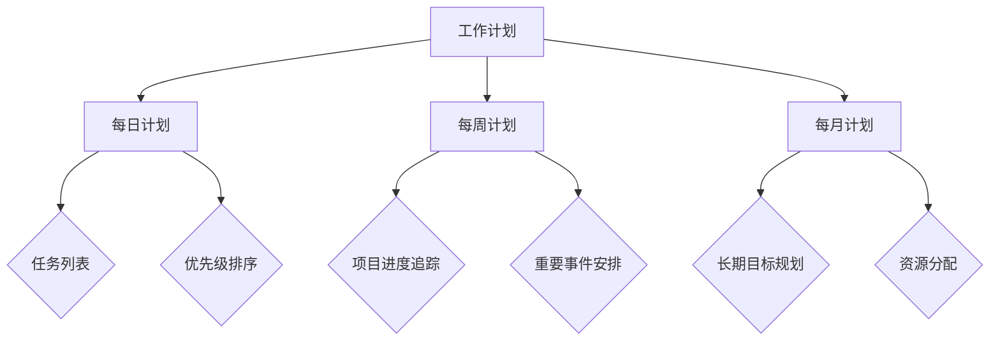

###### 3.1.2 设定优先级

设定优先级是有效管理时间的关键。创业者需要根据任务的紧急程度和重要性来设定优先级，以确保最关键的任务得到优先处理。

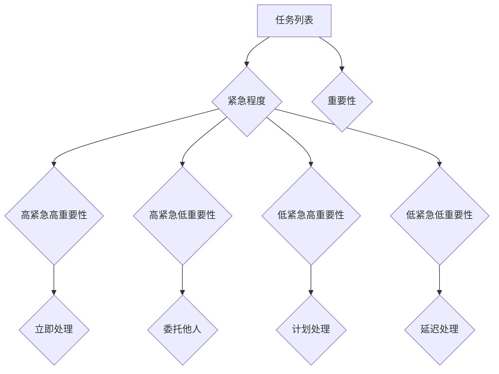

##### 3.2 提高工作效率

###### 3.2.1 时间管理技巧

时间管理技巧包括番茄工作法、待办事项清单、专注训练等。这些技巧可以帮助创业者更好地集中注意力，提高工作效率。

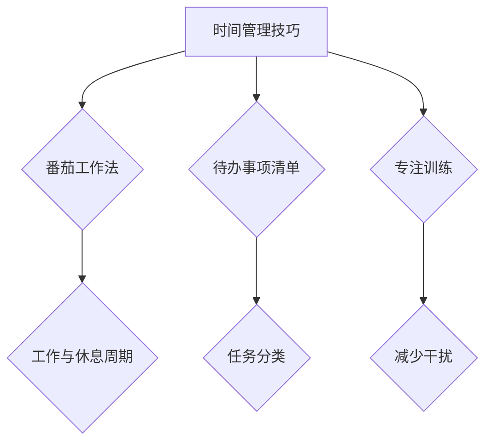

###### 3.2.2 技术工具应用

现代技术工具可以帮助创业者更好地管理时间和提高工作效率。例如，时间跟踪工具、项目管理工具、电子邮件管理工具等。

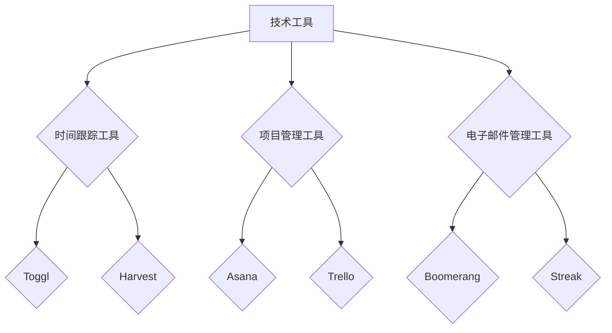

##### 3.3 工作时间与休息的平衡

###### 3.3.1 健康作息习惯

保持健康的作息习惯对于创业者来说至关重要。这包括规律的睡眠、合理的饮食和适度的运动。

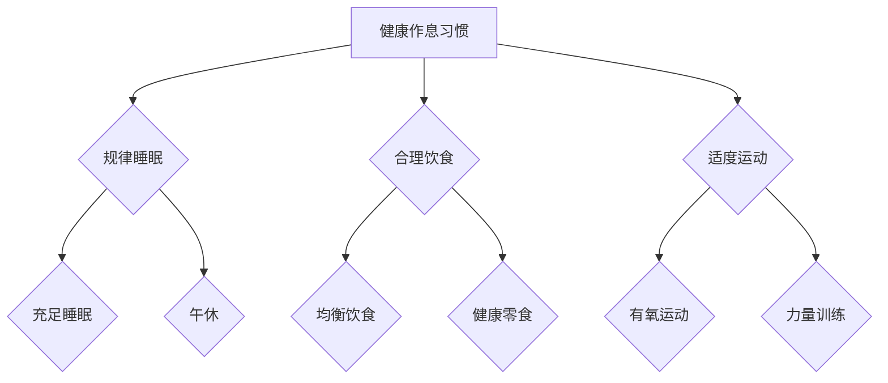

###### 3.3.2 工作与休息的切换策略

有效的切换策略可以帮助创业者更好地从工作状态过渡到休息状态。这包括定期休息、转换工作环境和进行放松活动。

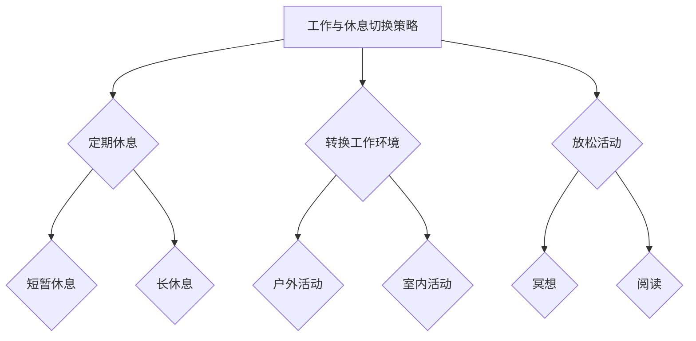

#### 第4章：家庭与工作平衡

##### 4.1 家庭角色与工作角色的平衡

###### 4.1.1 家庭时间管理

家庭时间管理是平衡家庭角色与工作角色的关键。创业者需要学会如何合理安排家庭时间，确保家庭需求得到满足。

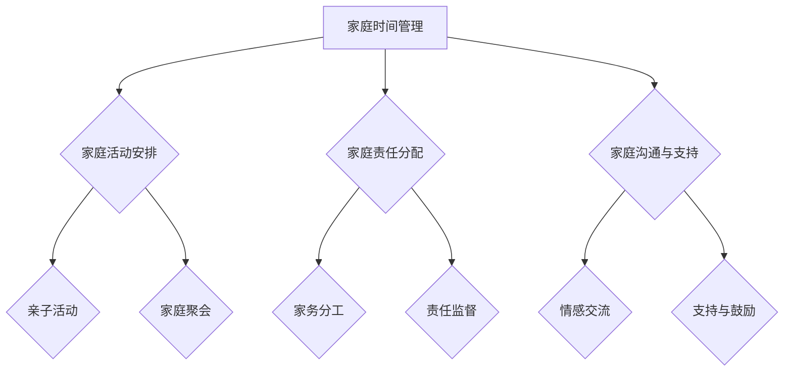

###### 4.1.2 家庭支持系统

家庭支持系统对于创业者的平衡至关重要。这包括配偶、家人和朋友的支持，以及社区资源的利用。

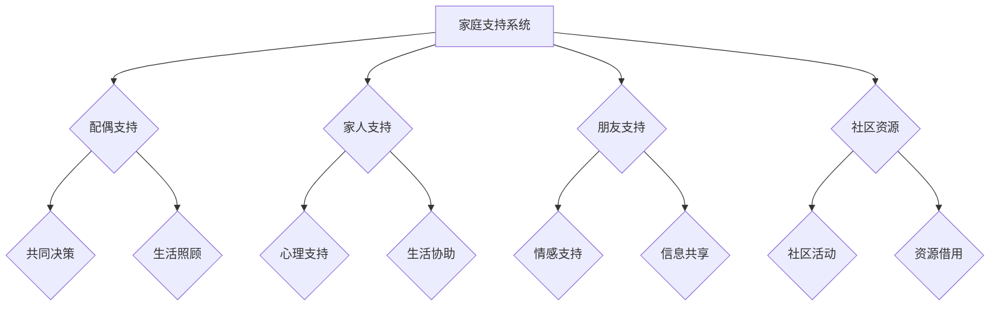

##### 4.2 家庭与工作冲突的应对

###### 4.2.1 冲突识别与分类

家庭与工作冲突可以分为时间冲突、角色冲突和价值冲突。创业者需要识别冲突的类型，以便采取相应的应对策略。

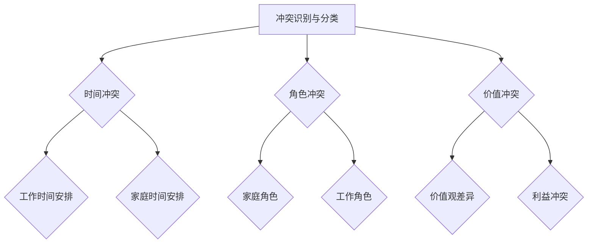

###### 4.2.2 冲突解决方案

解决家庭与工作冲突需要综合考虑个体和组织的因素。以下是一些可能的解决方案：

1. **灵活工作时间**：与雇主协商，安排灵活的工作时间，以适应家庭需求。
2. **委托与分担**：将一些家庭责任委托给家人或朋友，或者与他人分担工作负担。
3. **优先级调整**：重新审视个人和家庭的目标，调整优先级，确保关键事务得到优先处理。
4. **心理支持**：寻求专业的心理支持，学习冲突管理和压力缓解技巧。

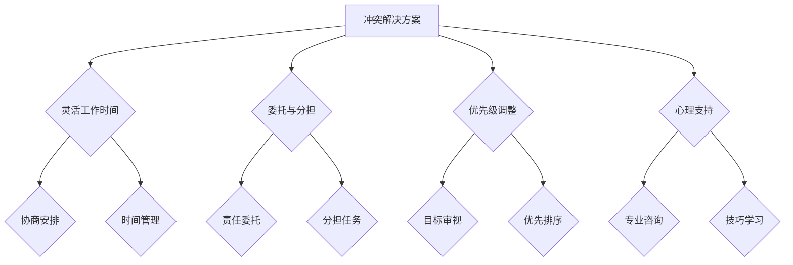

### 伪代码：家庭与工作冲突解决策略

```python
def solveConflict(conflictType):
    if conflictType == "时间冲突":
        return "协商灵活工作时间，优化时间管理"
    elif conflictType == "角色冲突":
        return "调整家庭角色，明确工作与家庭责任"
    elif conflictType == "价值冲突":
        return "沟通价值观差异，寻找共同点"
    else:
        return "寻求专业心理支持，学习冲突管理技巧"
```

#### 第5章：健康与生活质量的提升

##### 5.1 身体健康管理

###### 5.1.1 运动与健康饮食

运动与健康饮食是身体健康管理的两个关键方面。定期运动可以增强体质，提高免疫力。健康饮食则有助于提供充足的营养，维持身体的正常功能。

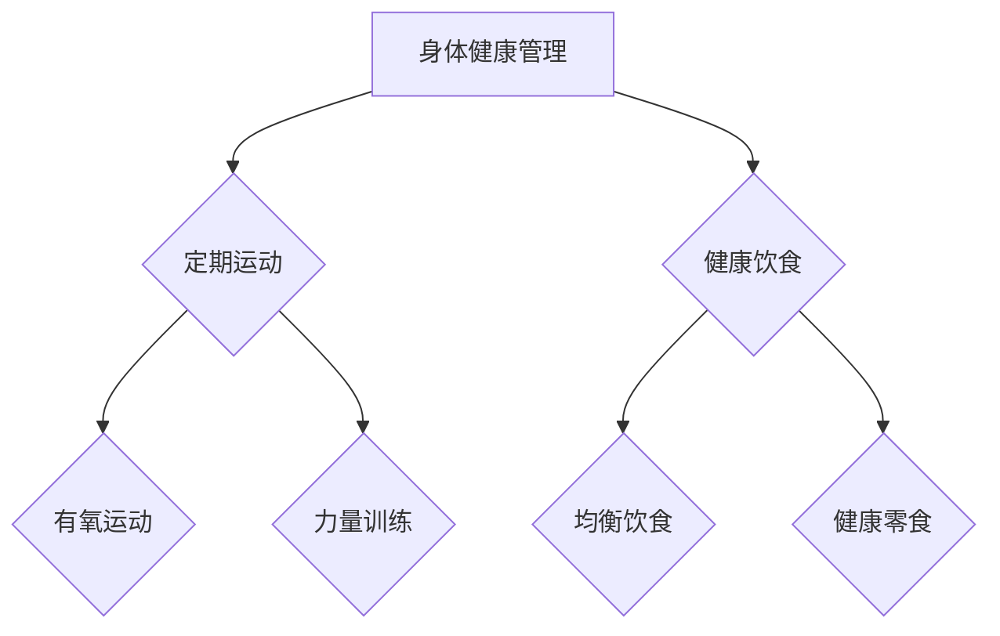

###### 5.1.2 身心平衡

身心平衡是健康管理的核心。通过冥想、瑜伽等放松活动，可以帮助创业者缓解压力，提高心理韧性。

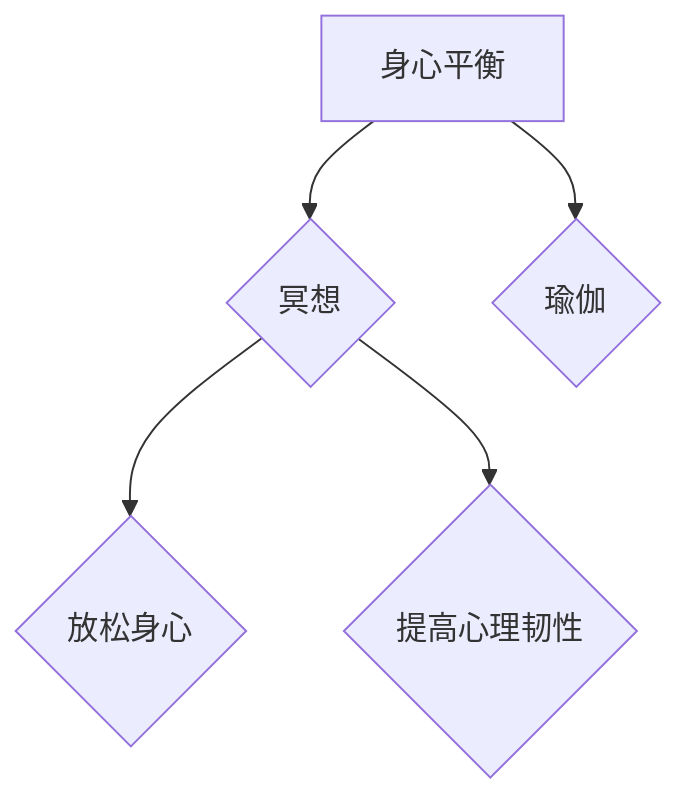

##### 5.2 心理健康的重要性

心理健康对于创业者来说至关重要。心理健康的维护可以帮助创业者更好地应对压力，提高生活质量。

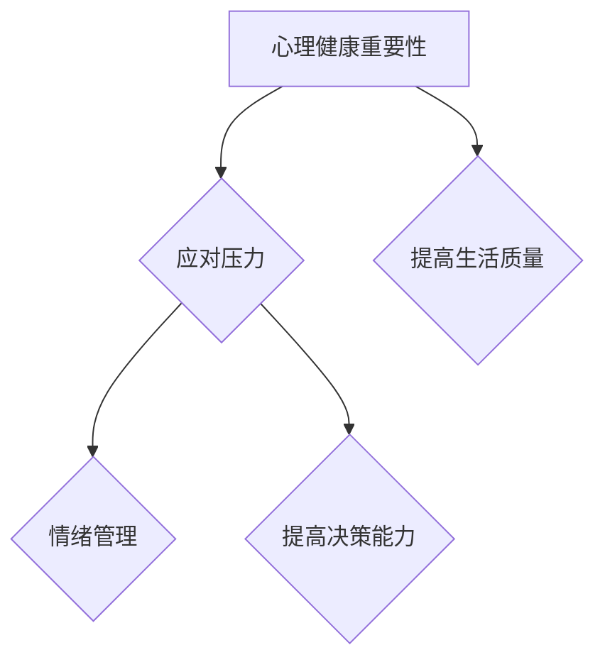

###### 5.2.1 心理健康与工作表现

心理健康与工作表现密切相关。心理健康的创业者通常能够更高效地工作，更好地处理工作压力。

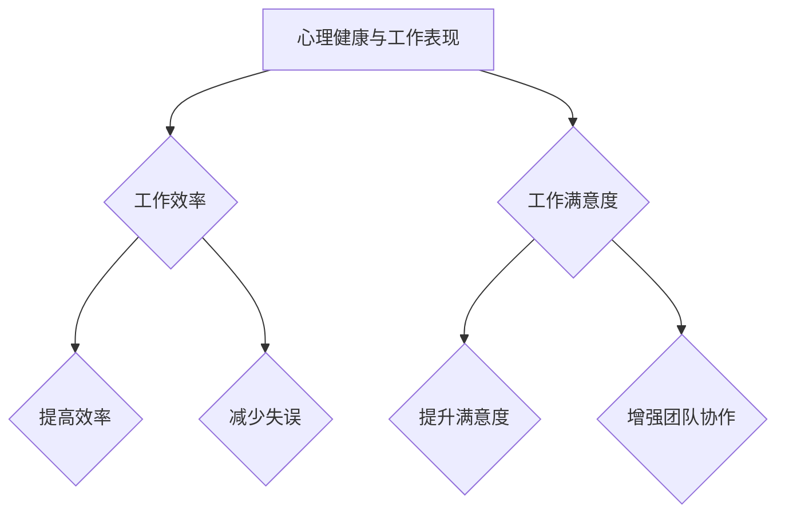

###### 5.2.2 心理健康维护策略

心理健康的维护需要多方面的努力。以下是一些常见的策略：

1. **定期自我反思**：定期进行自我反思，了解自己的情绪和心理状态。
2. **寻求专业支持**：在必要时寻求专业的心理咨询和支持。
3. **放松与休息**：确保有足够的休息时间，进行放松活动。
4. **社交互动**：保持良好的社交关系，与他人交流心得。

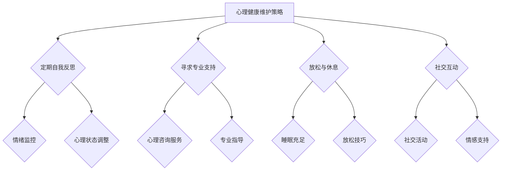

#### 第6章：社交与人际关系

##### 6.1 社交的重要性

社交对于创业者的成功和幸福感具有显著影响。良好的社交关系可以帮助创业者拓展人脉，获取资源和信息，提高工作效率和生活质量。

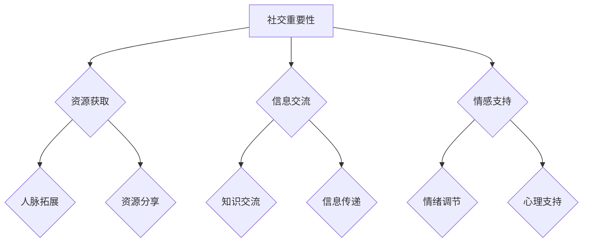

###### 6.1.1 社交网络的作用

社交网络是创业者获取资源、信息和情感支持的重要途径。通过社交媒体、行业会议和社区活动，创业者可以建立和维护广泛的社交网络。

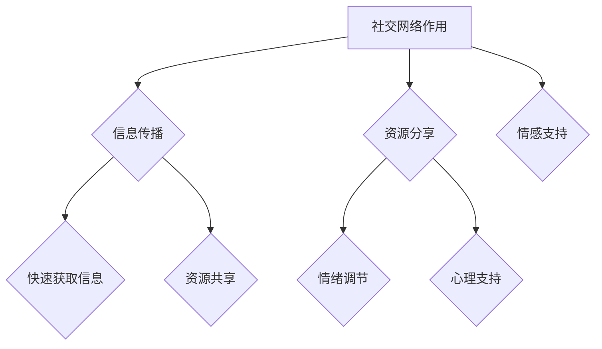

###### 6.1.2 社交技巧提升

提升社交技巧可以帮助创业者更有效地建立和维护社交关系。以下是一些提升社交技巧的方法：

1. **倾听与沟通**：倾听他人，有效沟通，建立信任。
2. **非语言沟通**：注意肢体语言、面部表情和语音语调，以传达正确的信息。
3. **社交礼仪**：了解和遵守社交礼仪，尊重他人。
4. **自我介绍**：掌握自我介绍技巧，留下良好印象。

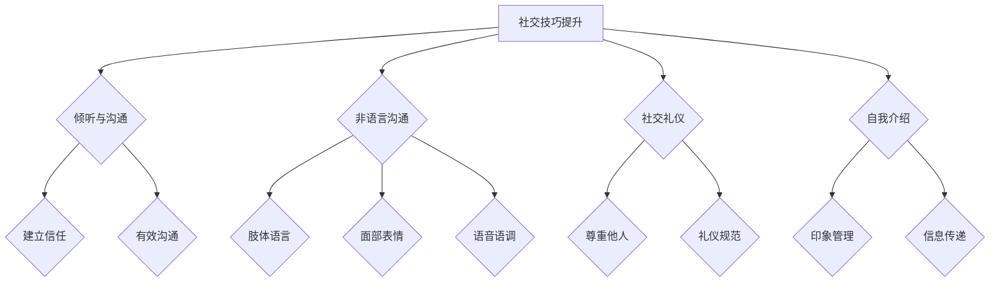

##### 6.2 人际关系管理

人际关系管理对于创业者的工作与生活平衡至关重要。以下是一些关键的人际关系管理策略：

1. **建立信任**：通过诚信和一致性建立信任，维护长期关系。
2. **沟通与反馈**：保持开放和诚实的沟通，及时给予反馈。
3. **冲突解决**：学会识别和解决冲突，以维护和谐的人际关系。
4. **支持与帮助**：在需要时给予他人支持和帮助，建立互惠关系。

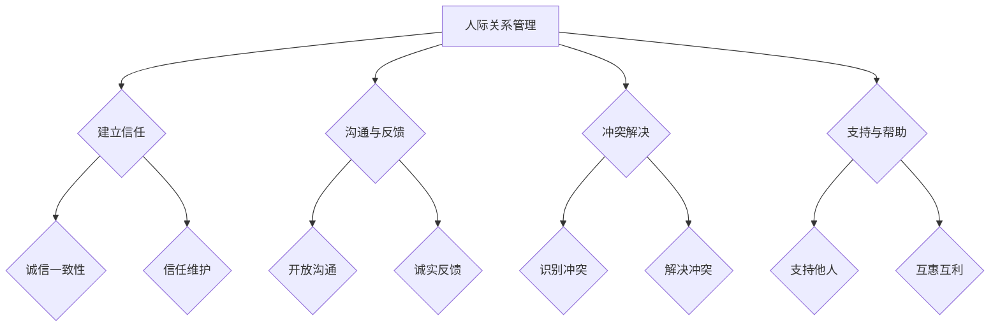

### 伪代码：人际关系管理策略

```python
def manageRelationship(relationshipType):
    if relationshipType == "信任":
        return "诚信一致性，信任维护"
    elif relationshipType == "沟通与反馈":
        return "开放沟通，诚实反馈"
    elif relationshipType == "冲突解决":
        return "识别冲突，解决冲突"
    elif relationshipType == "支持与帮助":
        return "支持他人，互惠互利"
    else:
        return "了解关系类型，采取相应策略"
```

#### 第7章：持续成长与自我提升

##### 7.1 职业发展路径

职业发展路径是创业者实现个人成长和提升的关键。以下是一些职业发展的路径和策略：

1. **技能提升**：通过学习新技能和知识，提升个人竞争力。
2. **网络拓展**：建立和维护广泛的职业网络，获取更多的机会和资源。
3. **经验积累**：通过实践和经验积累，不断提升自己的能力和素质。
4. **职业规划**：制定明确的职业规划，设定目标和里程碑。

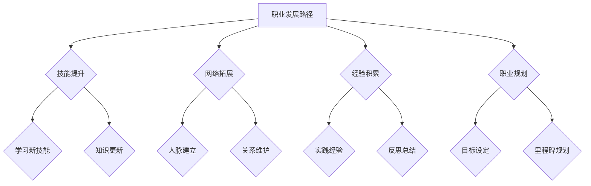

###### 7.1.1 个人职业规划

个人职业规划是职业发展的基础。创业者需要明确自己的职业目标，制定具体的行动步骤，以实现这些目标。

```mermaid
graph TD
    A[个人职业规划] --> B{目标设定}
    A --> C{行动步骤}
    A --> D{里程碑规划}
    B --> E{长期目标}
    B --> F{短期目标}
    C --> G{行动计划}
    C --> H{时间规划}
    D --> I{阶段性目标}
    D --> J{里程碑评估}
```

###### 7.1.2 职业技能提升

职业技能提升是个人成长的重要方面。以下是一些提升职业技能的方法：

1. **在线学习**：通过在线课程和教程，学习新技能和知识。
2. **实践项目**：参与实践项目，将理论知识应用于实际工作中。
3. **行业会议**：参加行业会议和研讨会，了解行业动态和前沿技术。
4. **导师指导**：寻找导师，获取专业指导和建议。

```mermaid
graph TD
    A[职业技能提升] --> B{在线学习}
    A --> C{实践项目}
    A --> D{行业会议}
    A --> E{导师指导}
    B --> F{课程学习}
    B --> G{知识积累}
    C --> H{项目实践}
    C --> I{经验分享}
    D --> J{会议交流}
    D --> K{行业知识}
    E --> L{专业指导}
    E --> M{建议反馈}
```

##### 7.2 自我认知与反思

自我认知与反思是自我提升的重要环节。以下是一些自我认知与反思的方法：

1. **自我评估**：定期进行自我评估，了解自己的优点和不足。
2. **反思日志**：记录日常反思，总结经验和教训。
3. **反馈收集**：积极收集他人的反馈，了解自己的表现和改进方向。
4. **心理辅导**：在必要时寻求专业心理辅导，帮助自我成长。

```mermaid
graph TD
    A[自我认知与反思] --> B{自我评估}
    A --> C{反思日志}
    A --> D{反馈收集}
    A --> E{心理辅导}
    B --> F{优点识别}
    B --> G{不足分析}
    C --> H{经验总结}
    C --> I{教训记录}
    D --> J{积极反馈}
    D --> K{改进方向}
    E --> L{专业辅导}
    E --> M{心理支持}
```

###### 7.2.1 自我评估方法

自我评估是了解自己优势和不足的关键步骤。以下是一些自我评估的方法：

1. **SWOT分析**：通过SWOT分析（优势、劣势、机会、威胁），全面评估自己的能力和市场环境。
2. **360度反馈**：收集来自同事、上司和下属的反馈，了解自己的多维度表现。
3. **个人发展计划**：制定个人发展计划，明确目标和行动步骤。

```mermaid
graph TD
    A[自我评估方法] --> B{SWOT分析}
    A --> C{360度反馈}
    A --> D{个人发展计划}
    B --> E{优势识别}
    B --> F{劣势分析}
    B --> G{机会挖掘}
    B --> H{威胁应对}
    C --> I{多维度反馈}
    C --> J{表现评估}
    D --> K{目标设定}
    D --> L{行动规划}
```

##### 7.2.2 自我成长策略

自我成长策略是持续提升自己的关键。以下是一些自我成长策略：

1. **学习与阅读**：持续学习新知识和技能，提升自己的综合素质。
2. **实践与行动**：将理论知识应用于实践，通过行动实现自我提升。
3. **反思与总结**：定期进行反思和总结，从经验中学习，不断改进。
4. **目标设定与追踪**：设定明确的目标，并持续追踪和评估自己的进步。

```mermaid
graph TD
    A[自我成长策略] --> B{学习与阅读}
    A --> C{实践与行动}
    A --> D{反思与总结}
    A --> E{目标设定与追踪}
    B --> F{知识积累}
    B --> G{技能提升}
    C --> H{实践经验}
    C --> I{行动力}
    D --> J{经验总结}
    D --> K{反思能力}
    E --> L{目标设定}
    E --> M{目标追踪}
    E --> N{进步评估}
```

### 数学模型：目标设定与追踪

目标设定与追踪是自我成长的关键环节。以下是一个简单的目标设定与追踪的数学模型：

1. **目标设定**：设定一个具体、可衡量的目标，如“提升销售业绩20%”。
2. **分解目标**：将大目标分解为小目标，如按季度、月份或周来分解。
3. **制定行动计划**：为每个小目标制定具体的行动计划和时间表。
4. **跟踪与评估**：定期跟踪进度，评估目标的实现情况，并根据评估结果进行调整。

```python
# 目标设定与追踪的伪代码

def setGoal(target, decomposition, action_plan):
    goal = {
        "target": target,
        "decomposition": decomposition,
        "action_plan": action_plan,
        "status": "ongoing"
    }
    return goal

def trackGoal(goal, current_progress):
    if current_progress >= goal["target"]:
        goal["status"] = "completed"
    elif current_progress < goal["target"]:
        goal["status"] = "in_progress"
    return goal

# 示例
goal = setGoal("提升销售业绩20%", ["Q1: 10%", "Q2: 5%", "Q3: 5%", "Q4: 10%"], ["Q1: 新客户拓展计划", "Q2: 产品优化", "Q3: 市场活动", "Q4: 客户维护"])
goal = trackGoal(goal, 22) # 假设当前进度为22%
```

#### 第8章：创业者工作与生活平衡的艺术

##### 8.1 平衡的艺术

工作与生活平衡并非简单的“二选一”，而是一种艺术，需要创业者灵活应对。以下是一些实现平衡的艺术原则：

1. **明确目标**：设定清晰的职业和个人目标，确保工作和生活都有明确的方向。
2. **时间管理**：合理分配时间，确保工作和生活都有足够的时间投入。
3. **灵活调整**：根据实际情况灵活调整工作和生活的平衡，适应不同的需求和挑战。
4. **自我反思**：定期反思自己的工作和生活状态，调整平衡策略，以适应新的情况。

```mermaid
graph TD
    A[平衡的艺术] --> B{明确目标}
    A --> C{时间管理}
    A --> D{灵活调整}
    A --> E{自我反思}
    B --> F{职业目标}
    B --> G{个人目标}
    C --> H{时间规划}
    C --> I{优先级设定}
    D --> J{环境变化}
    D --> K{策略调整}
    E --> L{状态评估}
    E --> M{策略优化}
```

###### 8.1.1 平衡的误区

在追求工作与生活平衡的过程中，创业者可能会陷入一些误区。以下是一些常见的误区：

1. **理想化平衡**：认为工作与生活平衡是一种理想状态，而忽略了实际操作中的复杂性。
2. **过度牺牲**：在追求工作与生活平衡时，过度牺牲一方，导致不平衡。
3. **缺乏灵活性**：缺乏灵活性，无法根据实际情况调整工作和生活的平衡。

```mermaid
graph TD
    A[平衡的误区] --> B{理想化平衡}
    A --> C{过度牺牲}
    A --> D{缺乏灵活性}
    B --> E{理想状态}
    B --> F{忽略复杂性}
    C --> G{工作牺牲}
    C --> H{生活牺牲}
    D --> I{僵化策略}
    D --> J{无法适应}
```

###### 8.1.2 平衡的原则与方法

实现工作与生活平衡需要遵循一定的原则和方法。以下是一些基本原则和方法：

1. **设定优先级**：明确工作和生活中的关键任务，设定优先级，确保关键任务得到优先处理。
2. **有效沟通**：与家人、同事和合作伙伴保持有效沟通，共同解决工作和生活中的问题。
3. **时间管理**：合理规划时间，确保工作和生活都有足够的时间投入。
4. **自我反思**：定期反思自己的工作和生活状态，调整平衡策略，以适应新的情况。

```mermaid
graph TD
    A[平衡的原则与方法] --> B{设定优先级}
    A --> C{有效沟通}
    A --> D{时间管理}
    A --> E{自我反思}
    B --> F{任务优先}
    B --> G{关键任务}
    C --> H{沟通技巧}
    C --> I{问题解决}
    D --> J{时间规划}
    D --> K{生活规划}
    E --> L{状态评估}
    E --> M{策略调整}
```

##### 8.2 成功案例分析

成功创业者往往具备良好的工作与生活平衡能力。以下是一些成功创业者的案例：

1. **张三**：通过设定明确的目标和优先级，张三成功地平衡了工作和生活。他每天早上都会列出当天的重要任务，并根据紧急程度和重要性进行排序，确保关键任务得到优先处理。

```mermaid
graph TD
    A[张三案例] --> B{明确目标}
    A --> C{优先级排序}
    B --> D{目标设定}
    B --> E{目标实现}
    C --> F{任务列表}
    C --> G{任务排序}
```

2. **李四**：李四擅长时间管理，他通过使用时间管理工具和技巧，如番茄工作法和待办事项清单，有效地提高了工作效率。这使得他能够在工作之余，有更多的时间陪伴家人和进行兴趣爱好。

```mermaid
graph TD
    A[李四案例] --> B{时间管理}
    A --> C{工作效率}
    B --> D{时间跟踪}
    B --> E{工作效率提升}
    C --> F{番茄工作法}
    C --> G{待办事项清单}
```

3. **王五**：王五注重自我反思和自我提升。他定期进行自我评估，识别自己的优势和不足，并制定相应的改进计划。这使得他能够在职业生涯中不断成长，并在创业过程中保持清晰的思路。

```mermaid
graph TD
    A[王五案例] --> B{自我反思}
    A --> C{自我提升}
    B --> D{自我评估}
    B --> E{优势识别}
    C --> F{持续成长}
    C --> G{改进计划}
```

##### 8.2.1 创业者成功经验

成功创业者的经验可以为我们提供宝贵的启示。以下是一些值得借鉴的成功经验：

1. **明确目标**：设定清晰的职业和个人目标，确保工作和生活都有明确的方向。
2. **时间管理**：合理规划时间，确保工作和生活都有足够的时间投入。
3. **灵活调整**：根据实际情况灵活调整工作和生活的平衡，适应不同的需求和挑战。
4. **有效沟通**：与家人、同事和合作伙伴保持有效沟通，共同解决工作和生活中的问题。
5. **自我反思**：定期反思自己的工作和生活状态，调整平衡策略，以适应新的情况。

```mermaid
graph TD
    A[成功经验] --> B{明确目标}
    A --> C{时间管理}
    A --> D{灵活调整}
    A --> E{有效沟通}
    A --> F{自我反思}
    B --> G{职业目标}
    B --> H{个人目标}
    C --> I{时间规划}
    C --> J{生活规划}
    D --> K{适应变化}
    D --> L{策略调整}
    E --> M{沟通技巧}
    E --> N{问题解决}
    F --> O{状态评估}
    F --> P{策略优化}
```

##### 8.2.2 持续平衡的实践

持续平衡是创业者工作与生活平衡的关键。以下是一些实践指南：

1. **定期评估**：定期评估工作和生活状态，识别潜在的不平衡，及时调整策略。
2. **灵活应对**：面对变化，灵活应对，调整工作和生活的平衡策略。
3. **设定优先级**：根据实际情况设定优先级，确保关键任务得到优先处理。
4. **自我反思**：定期进行自我反思，了解自己的情绪和心理状态，调整心态和行为。
5. **寻求支持**：在需要时寻求家人、朋友和专业人士的支持，共同应对工作和生活中的挑战。

```mermaid
graph TD
    A[持续平衡的实践] --> B{定期评估}
    A --> C{灵活应对}
    A --> D{设定优先级}
    A --> E{自我反思}
    A --> F{寻求支持}
    B --> G{状态评估}
    B --> H{策略调整}
    C --> I{应对变化}
    C --> J{灵活策略}
    D --> K{任务排序}
    D --> L{优先处理}
    E --> M{情绪管理}
    E --> N{行为调整}
    F --> O{家庭支持}
    F --> P{朋友支持}
    F --> Q{专业支持}
```

#### 第9章：总结与展望

##### 9.1 创业者工作与生活平衡的总体看法

通过本书的探讨，我们可以看到，工作与生活平衡对于创业者的成功和幸福至关重要。平衡的艺术在于明确目标、有效沟通、灵活调整和持续反思。创业者需要认识到，平衡是一个动态的过程，需要不断调整和优化。

##### 9.2 未来发展趋势与挑战

随着社会和科技的发展，创业者工作与生活平衡的趋势和挑战也在不断变化。以下是一些未来发展趋势和挑战：

1. **远程工作与灵活工作制度的普及**：远程工作和灵活工作制度的普及，将有助于创业者更好地平衡工作与生活。
2. **心理健康的重要性提升**：随着对心理健康认识的提高，创业者将更加注重心理健康的维护。
3. **科技工具的广泛应用**：科技工具的广泛应用，将帮助创业者更高效地管理时间和提高工作效率。
4. **家庭与工作冲突的增加**：随着工作和生活压力的增加，家庭与工作冲突可能会加剧，需要创业者采取有效的应对策略。

##### 9.3 对创业者的建议

1. **明确目标**：设定清晰的职业和个人目标，确保工作和生活都有明确的方向。
2. **有效沟通**：与家人、同事和合作伙伴保持有效沟通，共同解决工作和生活中的问题。
3. **时间管理**：合理规划时间，确保工作和生活都有足够的时间投入。
4. **自我反思**：定期进行自我反思，了解自己的情绪和心理状态，调整心态和行为。
5. **寻求支持**：在需要时寻求家人、朋友和专业人士的支持，共同应对工作和生活中的挑战。

#### 附录A：资源与工具推荐

本章将推荐一些有助于创业者实现工作与生活平衡的资源与工具。

##### A.1 时间管理工具推荐

1. **Trello**：一个功能强大的项目管理工具，可以帮助创业者制定工作计划、跟踪任务进度。
2. **Asana**：一个综合性的项目管理平台，提供任务管理、进度追踪和团队协作功能。
3. **Google Calendar**：一个灵活的日历工具，可以方便地安排和提醒工作任务和日程。

##### A.2 健康管理应用推荐

1. **Headspace**：一款流行的冥想应用，可以帮助创业者放松身心，提高专注力。
2. **MyFitnessPal**：一款全面的健康管理应用，可以帮助创业者记录饮食、锻炼和体重。
3. **Fitbit**：一款智能手环，可以实时监测心率、步数和睡眠质量，帮助创业者关注身体健康。

##### A.3 心理健康资源推荐

1. **BetterHelp**：一个在线心理咨询平台，提供专业的心理咨询和辅导服务。
2. **Moodfit**：一款心理健康应用，通过互动测试和个性化建议，帮助创业者了解和管理自己的情绪。
3. **Mindfulness for Beginners**：一本关于正念冥想的指南，帮助创业者学会放松和心理调节技巧。

### 总结

本文从多个角度探讨了创业者在追求事业成功的过程中如何实现工作与生活平衡。通过分析压力管理、时间管理、家庭与工作平衡、健康与生活质量提升、社交与人际关系、持续成长与自我提升等方面的内容，结合成功案例，为创业者提供了实用的策略和建议。希望本文能为创业者在繁忙的创业旅程中提供一些启示和帮助。在未来的发展中，创业者需要不断调整和优化自己的工作与生活平衡策略，以实现个人成长和企业发展。作者：AI天才研究院/AI Genius Institute & 禅与计算机程序设计艺术 /Zen And The Art of Computer Programming。

---

#### 撰写结束，感谢AI的帮助，祝您写作愉快！

## 附录 A: 资源与工具推荐

在创业的道路上，利用有效的工具和资源可以帮助创业者更高效地管理时间和工作，同时提升生活品质。以下是一些推荐的资源与工具，涵盖了时间管理、健康管理、心理健康等方面。

### A.1 时间管理工具推荐

1. **Trello**：Trello是一款基于看板的项目管理工具，适合创业者制定工作计划、跟踪项目进度和分配任务。它提供了一个直观的界面，使用卡片和列表来组织和管理任务，非常适合团队协作。

2. **Asana**：Asana是一个综合性的项目管理平台，提供了任务管理、时间跟踪、进度追踪和团队协作功能。创业者可以利用Asana来制定详细的计划，分配任务，确保项目按时完成。

3. **Google Calendar**：Google Calendar是一款功能强大的日历工具，可以帮助创业者安排日程、设置提醒、管理会议。它支持跨平台同步，方便随时查看和调整日程。

### A.2 健康管理应用推荐

1. **Headspace**：Headspace是一款流行的冥想应用，提供各种冥想课程和指导，帮助用户放松身心、提高专注力。它适合那些希望在忙碌的创业生活中找到放松时刻的创业者。

2. **MyFitnessPal**：MyFitnessPal是一款全面的健康管理应用，可以帮助创业者记录饮食、跟踪卡路里摄入、设定锻炼计划。它提供了丰富的食物数据库，便于用户管理自己的饮食健康。

3. **Fitbit**：Fitbit是一款智能手环，可以实时监测心率、步数、睡眠质量等健康数据。创业者可以通过Fitbit了解自己的身体状况，并制定相应的健康计划。

### A.3 心理健康资源推荐

1. **BetterHelp**：BetterHelp是一个在线心理咨询平台，提供了专业的心理咨询师和在线治疗服务。对于创业者来说，这是一个方便快捷的方式来获得心理健康支持。

2. **Moodfit**：Moodfit是一款心理健康应用，通过互动测试和个性化建议，帮助用户了解和管理自己的情绪。它提供了各种工具和活动，帮助用户提高情绪管理能力。

3. **Mindfulness for Beginners**：这是一本由Dan Harris撰写的关于正念冥想的指南书，适合那些希望通过冥想提高心理健康和专注力的创业者。书中提供了实用的技巧和练习，帮助用户开始冥想之旅。

这些工具和资源不仅可以提高创业者的工作效率和生活质量，还能帮助他们更好地应对创业过程中的压力和挑战。希望这些推荐能为创业者的工作和生活带来积极的影响。

