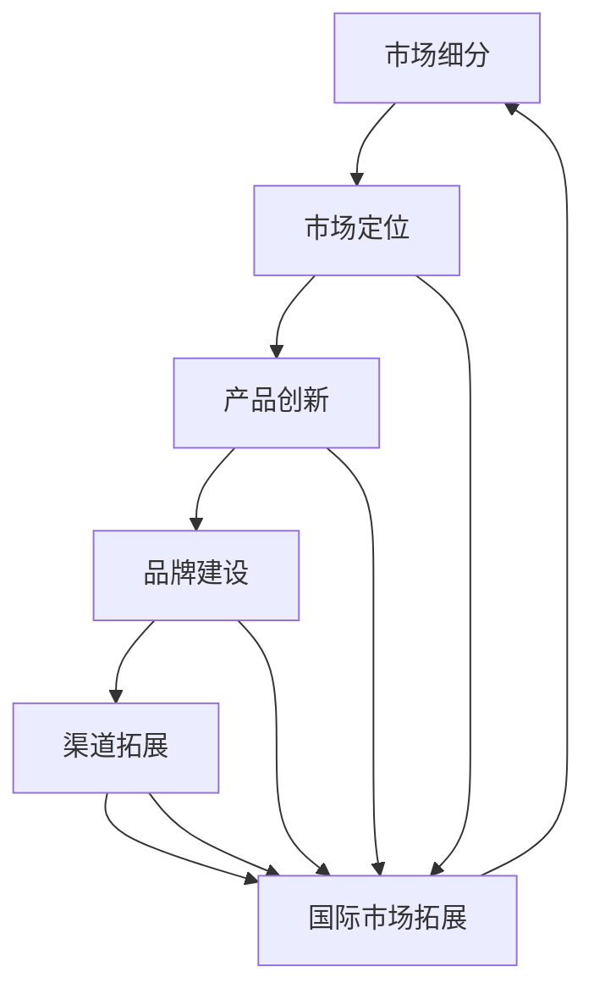

                 

### 《创业者的市场拓展》

> **关键词**：市场拓展、创业者、战略规划、产品创新、品牌建设、渠道拓展、国际市场、线上营销

> **摘要**：
> 
> 本文旨在为创业者提供关于市场拓展的全方位指导。文章从基础理论出发，详细介绍了市场拓展的概念、意义、挑战和策略。随后，文章探讨了产品创新、品牌建设、渠道拓展等关键领域，结合实际案例，提供实用的市场拓展技巧。特别关注国际市场和线上市场拓展，总结了成功的经验和教训。最后，文章强调了市场拓展效果的评估与优化，并提供了相关的工具和资源。通过本文，创业者可以系统了解市场拓展的全过程，为企业的长期发展打下坚实基础。

---

### 《创业者的市场拓展》目录大纲

#### 第一部分：市场拓展的基础理论

1. **市场拓展概述**
   - **市场拓展的概念与意义**
   - **市场拓展的重要性**
   - **市场拓展的挑战**

2. **市场分析**
   - **市场细分**
   - **市场定位**
   - **竞争对手分析**

3. **市场拓展战略**
   - **市场拓展的途径**
   - **市场拓展的步骤**
   - **市场拓展策略**

#### 第二部分：市场拓展的策略与技巧

4. **产品创新与市场拓展**
   - **产品创新的动力**
   - **产品创新与市场拓展的关联**
   - **产品创新的实践技巧**

5. **品牌建设与市场拓展**
   - **品牌建设的核心要素**
   - **品牌建设与市场拓展的关联**
   - **品牌建设的实践步骤**

6. **渠道拓展与市场拓展**
   - **渠道拓展的途径**
   - **渠道拓展与市场拓展的关联**
   - **渠道拓展的实践步骤**
   - **渠道拓展的技巧**

#### 第三部分：市场拓展的实践案例

7. **国际市场拓展**
   - **国际市场拓展的挑战与机遇**
   - **国际市场拓展的策略与技巧**

8. **线上市场拓展**
   - **线上市场拓展的趋势**
   - **线上市场拓展的实战案例**
   - **线上市场拓展的实践技巧**

#### 第四部分：市场拓展的评估与优化

9. **市场拓展效果的评估**
   - **市场拓展评估指标**
   - **市场拓展评估方法**
   - **市场拓展评估工具**

10. **市场拓展的优化策略**
    - **市场拓展策略调整**
    - **市场拓展效果优化**
    - **市场拓展的持续优化**

#### 附录

11. **市场拓展工具与资源**
    - **市场拓展分析工具**
    - **市场拓展营销工具**
    - **市场拓展研究资源**

---

### 第一部分：市场拓展的基础理论

#### 1.1 市场拓展的概念与意义

**市场拓展**是指企业在现有市场之外寻求新的商业机会，包括新市场、新客户群、新业务领域等。它不仅仅是一种销售手段，更是一种战略性的企业成长策略。

**市场拓展的重要性**在于：

- **增长潜力**：通过市场拓展，企业可以开拓新的增长点，增加市场份额。
- **风险分散**：不依赖单一市场，降低市场波动对企业经营的风险。
- **品牌提升**：进入新的市场，有助于提升品牌知名度和影响力。

**市场拓展的挑战**包括：

- **文化差异**：不同地区可能存在文化、法律、习惯的差异。
- **市场调研**：准确了解目标市场的情况需要大量的时间和资源。
- **资源分配**：市场拓展往往需要重新分配资源，包括资金、人员等。
- **竞争压力**：新市场可能已有强大的竞争者，需要制定有效的竞争策略。

#### 1.2 市场分析

**市场分析**是市场拓展的基础，主要包括以下三个方面：

1. **市场细分**：
   - **定义**：市场细分是指将一个广阔的整体市场划分为若干具有共同特征的子市场。
   - **目的**：通过市场细分，企业可以更精准地满足不同客户群体的需求。
   - **方法**：常用的市场细分方法包括地理细分、人口细分、行为细分和心理细分。

2. **市场定位**：
   - **定义**：市场定位是企业确定其产品在市场中的位置，以及如何与目标客户沟通。
   - **目的**：成功的市场定位能够帮助企业在竞争激烈的市场中脱颖而出。
   - **方法**：市场定位的方法包括差异化定位、集中定位和跟随定位。

3. **竞争对手分析**：
   - **定义**：竞争对手分析是指对企业竞争对手的产品、策略、市场份额等进行全面评估。
   - **目的**：了解竞争格局，制定有效的竞争策略。
   - **方法**：竞争对手分析的方法包括直接观察、市场调研和数据分析。

#### 1.3 市场拓展战略

**市场拓展战略**是指企业为实现市场拓展目标所采取的整体规划和行动方案。以下是市场拓展战略的关键组成部分：

1. **市场拓展的途径**：
   - **地理拓展**：将业务拓展到新的地区或国家。
   - **产品拓展**：开发新的产品或服务以满足不同市场需求。
   - **渠道拓展**：通过新的销售渠道扩大产品覆盖范围。

2. **市场拓展的步骤**：
   - **确定目标市场**：根据市场细分和市场定位确定目标市场。
   - **市场调研**：收集目标市场的信息，包括市场规模、消费者需求、竞争状况等。
   - **制定拓展策略**：根据市场调研结果，制定具体的拓展策略和行动计划。
   - **实施与监控**：执行市场拓展计划，并持续监控效果。

3. **市场拓展策略**：
   - **差异化策略**：通过提供独特的产品或服务，在市场中获得竞争优势。
   - **低成本策略**：通过降低成本，以更低的价格吸引客户。
   - **集中策略**：将资源集中投入到最有潜力的市场或产品领域。

---

### 第二部分：市场拓展的策略与技巧

#### 2.1 产品创新与市场拓展

**产品创新**是市场拓展的重要驱动力。以下是产品创新的动力、产品创新与市场拓展的关联以及产品创新的实践技巧。

##### 2.1.1 产品创新的动力

1. **市场需求分析**：
   - **定义**：市场需求分析是企业了解目标客户需求的过程。
   - **目的**：通过分析市场需求，企业可以确定哪些产品或服务最具潜力。
   - **方法**：常用的需求分析方法包括用户调研、市场趋势分析和竞争分析。

2. **竞争对手分析**：
   - **定义**：竞争对手分析可以帮助企业了解竞争对手的产品特点、市场策略和市场份额。
   - **目的**：通过分析竞争对手，企业可以找到自身产品创新的切入点。
   - **方法**：竞争对手分析的方法包括市场调研、产品评测和用户反馈分析。

3. **技术创新**：
   - **定义**：技术创新是企业产品创新的重要动力。
   - **目的**：通过引入新技术，企业可以开发出更具竞争力的产品。
   - **方法**：技术创新的方法包括研发新技术、引进新技术和整合现有技术。

##### 2.1.2 产品创新与市场拓展的关联

1. **产品创新的策略**：
   - **迭代创新**：在现有产品的基础上进行改进。
   - **颠覆性创新**：开发全新产品，颠覆现有市场格局。

2. **产品创新的案例分析**：
   - **案例1**：苹果公司的iPhone
     - **背景**：在iPhone推出之前，手机市场被诺基亚等传统手机厂商垄断。
     - **创新**：iPhone通过引入多点触控技术、应用商店和生态系统，颠覆了传统手机市场。
     - **影响**：iPhone的成功改变了整个手机行业的格局，推动了移动互联网的普及。

   - **案例2**：特斯拉的电动汽车
     - **背景**：在特斯拉推出电动汽车之前，电动汽车市场被传统汽车厂商忽视。
     - **创新**：特斯拉通过引入高性能电池技术、自动驾驶技术和智能化系统，改变了人们对电动汽车的认知。
     - **影响**：特斯拉的成功推动了电动汽车市场的快速发展，引发了全球范围内的绿色出行革命。

3. **产品创新的实践步骤**：
   - **需求分析**：明确产品创新的目标和需求。
   - **概念验证**：通过原型或测试验证产品创新的概念。
   - **研发与测试**：进行产品的研发和测试，确保产品的质量和性能。
   - **市场推广**：制定市场推广计划，将产品推向市场。

##### 2.1.3 产品创新的实践技巧

1. **创新思维方法**：
   - **头脑风暴**：通过集体讨论激发创新思维。
   - **设计思维**：以用户需求为中心，进行产品创新。

2. **创新管理**：
   - **创新团队建设**：建立跨部门的创新团队，促进知识共享和协同创新。
   - **创新激励机制**：设立创新奖励，鼓励员工积极参与产品创新。

---

#### 2.2 品牌建设与市场拓展

**品牌建设**是市场拓展的重要策略之一。以下是品牌建设的核心要素、品牌建设与市场拓展的关联以及品牌建设的实践步骤。

##### 2.2.1 品牌建设的核心要素

1. **品牌定位**：
   - **定义**：品牌定位是企业确定其在市场中的独特价值和目标客户群体的过程。
   - **目的**：一个清晰的品牌定位有助于提升品牌影响力和市场竞争力。
   - **方法**：品牌定位的方法包括SWOT分析、竞争分析和市场趋势分析。

2. **品牌形象塑造**：
   - **定义**：品牌形象塑造是通过视觉、语言和行为等方面，建立消费者对品牌的认知和印象。
   - **目的**：一个成功的品牌形象能够增强品牌的市场吸引力。
   - **方法**：品牌形象塑造的方法包括品牌视觉设计、品牌传播和用户口碑管理。

3. **品牌传播策略**：
   - **定义**：品牌传播策略是企业通过各种渠道传递品牌信息，提高品牌知名度和美誉度的过程。
   - **目的**：有效的品牌传播策略能够提升品牌的市场地位。
   - **方法**：品牌传播策略的方法包括广告、公关、社交媒体和内容营销。

##### 2.2.2 品牌建设与市场拓展的关联

1. **品牌建设的策略**：
   - **品牌差异化**：通过独特的产品或服务，在市场中建立品牌的差异化优势。
   - **品牌故事化**：通过讲述品牌的故事，增加品牌的情感价值。
   - **品牌社会化**：利用社交媒体等平台，与消费者建立互动，提升品牌影响力。

2. **品牌建设的案例分析**：
   - **案例1**：可口可乐
     - **品牌定位**：可口可乐定位为全球领先的饮料品牌，强调快乐、分享和活力。
     - **品牌形象塑造**：通过标志性的红色瓶身、广告语和公益活动，塑造积极的品牌形象。
     - **品牌传播策略**：通过全球性的广告宣传、社交媒体互动和赞助活动，提升品牌知名度。

   - **案例2**：苹果公司
     - **品牌定位**：苹果公司定位为高端科技品牌，强调创新、设计和用户体验。
     - **品牌形象塑造**：通过简约的设计风格、创新的产品功能和极致的用户体验，塑造独特的品牌形象。
     - **品牌传播策略**：通过新品发布会、社交媒体互动和用户口碑传播，提升品牌影响力。

3. **品牌建设的实践步骤**：
   - **品牌诊断**：分析品牌的现状，确定品牌建设的方向。
   - **品牌策略制定**：根据品牌诊断结果，制定具体的品牌建设策略。
   - **品牌传播执行**：通过广告、公关、社交媒体等方式，实施品牌传播计划。
   - **品牌评估**：定期评估品牌建设的效果，进行策略调整。

---

#### 2.3 渠道拓展与市场拓展

**渠道拓展**是市场拓展的关键环节之一。以下是渠道拓展的途径、渠道拓展与市场拓展的关联以及渠道拓展的实践步骤。

##### 2.3.1 渠道拓展的途径

1. **线上渠道拓展**：
   - **定义**：线上渠道拓展包括电子商务平台、社交媒体、移动应用程序等。
   - **目的**：通过线上渠道，企业可以快速覆盖更广泛的客户群体。
   - **方法**：线上渠道拓展的方法包括平台入驻、社交媒体运营和移动应用开发。

2. **线下渠道拓展**：
   - **定义**：线下渠道拓展包括实体店面、分销商、经销商等。
   - **目的**：线下渠道能够提供更直接的客户体验和售后服务。
   - **方法**：线下渠道拓展的方法包括开设新店、拓展分销网络和建立售后服务体系。

3. **多渠道整合**：
   - **定义**：多渠道整合是将线上和线下渠道有机结合，为客户提供一致性的购物体验。
   - **目的**：通过多渠道整合，企业可以最大化市场覆盖范围。
   - **方法**：多渠道整合的方法包括渠道协同、数据整合和用户体验优化。

##### 2.3.2 渠道拓展与市场拓展的关联

1. **渠道拓展的策略**：
   - **渠道差异化**：通过不同的渠道提供不同的价值，满足不同客户群体的需求。
   - **渠道协同**：整合不同渠道的资源，提高整体运营效率。
   - **渠道创新**：探索新的渠道模式，以适应市场变化。

2. **渠道拓展的实践步骤**：
   - **渠道评估**：评估现有渠道的绩效和潜力，确定拓展渠道的方向。
   - **渠道建设**：根据评估结果，建设新的渠道。
   - **渠道管理**：对渠道进行有效管理，确保渠道的稳定运营。

##### 2.3.3 渠道拓展的技巧

1. **合作伙伴选择**：
   - **定义**：合作伙伴选择是渠道拓展的关键。
   - **目的**：选择合适的合作伙伴是确保渠道拓展成功的关键。
   - **方法**：评估合作伙伴的市场影响力、资源能力和合作意愿。

2. **渠道营销策略**：
   - **定义**：渠道营销策略包括广告宣传、促销活动、会员管理等。
   - **目的**：有效的渠道营销策略能够提升渠道的销售能力。
   - **方法**：制定个性化的营销策略，满足不同渠道的需求。

3. **渠道维护与优化**：
   - **定义**：渠道维护与优化包括渠道关系的维护、渠道绩效的监控和渠道策略的调整。
   - **目的**：通过持续优化，企业可以确保渠道的长期稳定发展。
   - **方法**：定期评估渠道绩效，调整渠道策略，优化渠道运营。

---

### 第三部分：市场拓展的实践案例

#### 3.1 国际市场拓展

**国际市场拓展**是企业实现全球化发展的重要途径。以下是国际市场拓展的挑战与机遇以及国际市场拓展的策略与技巧。

##### 3.1.1 国际市场拓展的挑战与机遇

1. **国际市场拓展的重要性**：
   - **定义**：国际市场拓展是企业实现全球化发展的重要途径。
   - **目的**：通过国际市场拓展，企业可以扩大市场份额，提升品牌影响力。
   - **影响**：国际市场拓展有助于企业获得更多的资源和机会，提升企业的竞争力。

2. **国际市场拓展的挑战**：
   - **文化差异**：不同国家的消费者和文化习惯可能存在显著差异。
   - **法律与监管**：不同国家的法律和监管环境可能对企业运营产生影响。
   - **市场调研**：了解国际市场的情况需要大量时间和资源。
   - **竞争压力**：国际市场可能存在强大的本土竞争者。

3. **国际市场拓展的机遇**：
   - **全球市场潜力**：国际市场通常具有更大的市场容量和潜力。
   - **品牌国际化**：国际市场拓展有助于提升品牌国际化程度。
   - **技术合作**：国际市场拓展可以促进技术与资源的全球合作。

##### 3.1.2 国际市场拓展的策略与技巧

1. **国际市场定位**：
   - **定义**：国际市场定位是指企业确定其在国际市场中的产品、价格、渠道和促销策略。
   - **目的**：通过准确的市场定位，企业可以更好地适应国际市场的需求。
   - **方法**：国际市场定位的方法包括市场细分、竞争分析和文化适应。

2. **国际市场调研**：
   - **定义**：国际市场调研是指企业通过多种途径了解国际市场的消费者需求、市场趋势和竞争状况。
   - **目的**：全面的市场调研有助于企业制定有效的市场拓展策略。
   - **方法**：国际市场调研的方法包括市场调查、竞争对手分析和用户调研。

3. **国际市场营销策略**：
   - **定义**：国际市场营销策略包括产品策略、价格策略、渠道策略和促销策略。
   - **目的**：有效的国际市场营销策略可以帮助企业在国际市场取得成功。
   - **方法**：国际市场营销策略的方法包括差异化策略、低成本策略和集中策略。

---

#### 3.2 线上市场拓展

**线上市场拓展**是现代企业市场拓展的重要方向。以下是线上市场拓展的趋势、线上市场拓展的实战案例以及线上市场拓展的实践技巧。

##### 3.2.1 线上市场拓展的趋势

1. **电子商务的发展**：
   - **定义**：电子商务是指通过互联网进行的商业活动。
   - **趋势**：随着互联网的普及，电子商务已经成为现代市场拓展的重要手段。
   - **影响**：电子商务的快速发展改变了消费者的购物习惯，为企业提供了新的市场机会。

2. **社交媒体营销**：
   - **定义**：社交媒体营销是指利用社交媒体平台进行品牌推广和营销活动。
   - **趋势**：社交媒体的兴起为线上市场拓展提供了新的渠道。
   - **影响**：通过社交媒体营销，企业可以与消费者建立更紧密的联系，提升品牌知名度。

3. **移动互联网营销**：
   - **定义**：移动互联网营销是指通过移动应用程序和移动网站进行市场推广和销售。
   - **趋势**：随着移动互联网的普及，移动互联网营销已经成为线上市场拓展的重要方式。
   - **影响**：移动互联网营销能够提供更便捷的购物体验，满足消费者的需求。

##### 3.2.2 线上市场拓展的实战案例

1. **成功案例**：
   - **案例1**：阿里巴巴
     - **背景**：阿里巴巴是中国最大的电子商务平台之一。
     - **策略**：通过建立强大的电商平台，提供多样化的商品和服务，吸引了大量消费者和商家。
     - **成果**：阿里巴巴成功地拓展了线上市场，实现了全球化的业务布局。

2. **失败案例**：
   - **案例2**：乐讯通讯
     - **背景**：乐讯通讯是一家中国手机制造商。
     - **策略**：通过线上销售和社交媒体营销，试图拓展海外市场。
     - **问题**：由于对国际市场了解不足，产品定位不准确，乐讯通讯的线上市场拓展失败。

##### 3.2.3 线上市场拓展的实践技巧

1. **用户体验优化**：
   - **定义**：用户体验优化是指提升用户在使用线上平台时的满意度和体验感。
   - **目的**：通过优化用户体验，提高用户留存率和转化率。
   - **方法**：用户体验优化的方法包括网站性能优化、页面设计和交互优化。

2. **数据驱动决策**：
   - **定义**：数据驱动决策是指通过数据分析来指导市场拓展策略的制定和执行。
   - **目的**：通过数据驱动决策，提高市场拓展的效果和效率。
   - **方法**：数据驱动决策的方法包括数据分析、数据挖掘和数据分析工具的应用。

3. **社交媒体运营**：
   - **定义**：社交媒体运营是指通过社交媒体平台与消费者进行互动和推广。
   - **目的**：通过社交媒体运营，提升品牌知名度和用户互动。
   - **方法**：社交媒体运营的方法包括内容创作、社交媒体广告和用户互动管理。

---

### 第四部分：市场拓展的评估与优化

#### 4.1 市场拓展效果的评估

**市场拓展效果的评估**是确保市场拓展策略有效性的关键。以下是市场拓展评估的指标、方法和工具。

##### 4.1.1 市场拓展评估指标

1. **市场份额**：
   - **定义**：市场份额是指企业在某个市场中所占的比重。
   - **目的**：评估企业在市场中的地位和竞争力。
   - **计算方法**：市场份额 = （企业销售额 / 市场总销售额）× 100%。

2. **销售额**：
   - **定义**：销售额是指企业在一定时间内销售产品的总金额。
   - **目的**：评估市场拓展对销售额的影响。
   - **计算方法**：销售额 = 销售额 - 返还金额。

3. **客户满意度**：
   - **定义**：客户满意度是指客户对企业产品和服务的满意程度。
   - **目的**：评估市场拓展对客户满意度的提升效果。
   - **计算方法**：客户满意度 = （满意的客户数 / 总客户数）× 100%。

##### 4.1.2 市场拓展评估方法

1. **数据分析**：
   - **定义**：数据分析是指通过收集、处理和分析数据，提取有价值的信息。
   - **目的**：通过数据分析，评估市场拓展的效果。
   - **方法**：包括数据收集、数据处理、数据分析和数据可视化。

2. **客户调研**：
   - **定义**：客户调研是指通过调查问卷、访谈等方式收集客户意见和反馈。
   - **目的**：通过客户调研，了解市场拓展对客户的影响。
   - **方法**：包括问卷调查、访谈和焦点小组讨论。

3. **市场监测**：
   - **定义**：市场监测是指通过持续监控市场动态，了解市场变化和竞争状况。
   - **目的**：通过市场监测，及时调整市场拓展策略。
   - **方法**：包括市场数据收集、竞争对手分析和市场趋势分析。

##### 4.1.3 市场拓展评估工具

1. **Google Analytics**：
   - **定义**：Google Analytics 是一款强大的数据分析工具，用于分析网站流量和用户行为。
   - **功能**：包括流量分析、用户行为分析、转化率分析和目标设定。

2. **SEMrush**：
   - **定义**：SEMrush 是一款市场调研工具，用于关键词研究和竞争对手分析。
   - **功能**：包括关键词分析、竞争对手分析、网站流量分析和搜索引擎优化。

3. **HubSpot**：
   - **定义**：HubSpot 是一款客户关系管理工具，提供客户关系管理和市场营销工具。
   - **功能**：包括营销自动化、客户管理、网站跟踪和电子邮件营销。

---

#### 4.2 市场拓展的优化策略

**市场拓展的优化策略**是指根据市场拓展评估结果，调整市场拓展策略和执行过程，以提高市场拓展效果。以下是市场拓展优化策略的调整、效果优化和持续优化的方法。

##### 4.2.1 市场拓展策略调整

1. **市场细分调整**：
   - **目的**：根据市场拓展评估结果，调整市场细分策略，以更精准地满足不同客户群体的需求。
   - **方法**：包括重新评估市场细分标准、调整细分维度和优化细分策略。

2. **渠道策略调整**：
   - **目的**：根据市场拓展评估结果，调整渠道策略，以最大化市场覆盖范围。
   - **方法**：包括重新评估渠道选择、调整渠道组合和优化渠道管理。

3. **产品策略调整**：
   - **目的**：根据市场拓展评估结果，调整产品策略，以提升产品竞争力。
   - **方法**：包括重新评估产品定位、优化产品功能和改进产品服务。

##### 4.2.2 市场拓展效果优化

1. **营销策略优化**：
   - **目的**：通过优化营销策略，提高市场拓展的效果。
   - **方法**：包括调整广告投放策略、优化内容营销和改进社交媒体营销。

2. **用户体验优化**：
   - **目的**：通过优化用户体验，提高用户满意度和转化率。
   - **方法**：包括改善网站性能、优化页面设计和提高用户互动体验。

3. **渠道协同优化**：
   - **目的**：通过优化渠道协同，提高整体运营效率。
   - **方法**：包括优化渠道沟通、整合渠道资源和提高渠道管理效率。

##### 4.2.3 市场拓展的持续优化

1. **定期评估**：
   - **目的**：通过定期评估市场拓展效果，发现问题和优化策略。
   - **方法**：包括定期进行市场调研、客户反馈分析和竞争对手分析。

2. **数据驱动**：
   - **目的**：通过数据驱动决策，提高市场拓展的效率和效果。
   - **方法**：包括建立数据收集和分析体系、制定数据驱动的市场拓展策略。

3. **持续改进**：
   - **目的**：通过持续改进，不断提升市场拓展的效果。
   - **方法**：包括持续优化产品和服务、优化营销策略和提升团队执行力。

---

### 附录

#### 5.1 市场拓展工具与资源

**市场拓展工具与资源**是市场拓展过程中不可或缺的辅助工具。以下是市场拓展分析工具、市场拓展营销工具和市场拓展研究资源的详细介绍。

##### 5.1.1 市场拓展分析工具

1. **Google Analytics**：
   - **定义**：Google Analytics 是一款强大的数据分析工具，用于分析网站流量和用户行为。
   - **功能**：包括流量分析、用户行为分析、转化率分析和目标设定。

2. **SEMrush**：
   - **定义**：SEMrush 是一款市场调研工具，用于关键词研究和竞争对手分析。
   - **功能**：包括关键词分析、竞争对手分析、网站流量分析和搜索引擎优化。

3. **HubSpot**：
   - **定义**：HubSpot 是一款客户关系管理工具，提供客户关系管理和市场营销工具。
   - **功能**：包括营销自动化、客户管理、网站跟踪和电子邮件营销。

##### 5.1.2 市场拓展营销工具

1. **Hootsuite**：
   - **定义**：Hootsuite 是一款社交媒体管理工具，用于社交媒体管理和营销。
   - **功能**：包括社交媒体监控、社交媒体广告管理和社交媒体数据分析。

2. **Mailchimp**：
   - **定义**：Mailchimp 是一款电子邮件营销工具，用于电子邮件营销和客户管理。
   - **功能**：包括电子邮件模板设计、自动化邮件发送和电子邮件分析。

3. **Unsplash**：
   - **定义**：Unsplash 是一款提供免费高质量图片资源的平台。
   - **功能**：包括图片搜索、图片下载和图片授权。

##### 5.1.3 市场拓展研究资源

1. **市场研究报告**：
   - **定义**：市场研究报告是通过对市场进行深入分析，提供市场趋势、竞争状况和消费者行为的分析报告。
   - **功能**：包括行业趋势分析、市场机会分析和竞争分析。

2. **行业论坛和社区**：
   - **定义**：行业论坛和社区是行业从业者交流和分享经验的平台。
   - **功能**：包括行业新闻、最佳实践分享和专家咨询。

3. **大学和研究机构**：
   - **定义**：大学和研究机构是提供学术资源和研究成果的平台。
   - **功能**：包括学术论文、研究报告和市场趋势分析。

---

通过以上内容的详细阐述，我们可以看到市场拓展是一个系统性、多维度的过程。从基础理论到实践案例，从策略技巧到评估优化，每一个环节都是企业成功拓展市场的重要保障。希望本文能为创业者提供有价值的参考和指导，助力企业在市场中取得更大的成功。

---

**作者：AI天才研究院/AI Genius Institute & 禅与计算机程序设计艺术 /Zen And The Art of Computer Programming**

---

### 总结与展望

在本篇技术博客文章中，我们系统地探讨了创业者的市场拓展。首先，我们从市场拓展的概念和意义出发，分析了其重要性以及面临的挑战。接着，我们深入阐述了市场分析、市场拓展战略、产品创新与市场拓展、品牌建设与市场拓展、渠道拓展与市场拓展等核心领域。此外，我们还结合实际案例，提供了线上市场拓展和国际市场拓展的具体策略与技巧。最后，我们强调了市场拓展效果的评估与优化，为创业者的市场拓展提供了全方位的指导。

**总结**：
- **市场拓展**是企业实现增长的必要手段，有助于提升品牌知名度和市场份额。
- **市场分析**是市场拓展的基础，通过市场细分、市场定位和竞争对手分析，可以为企业提供明确的市场方向。
- **产品创新**和**品牌建设**是市场拓展的关键动力，通过不断创新和塑造独特的品牌形象，企业可以在市场中脱颖而出。
- **渠道拓展**是市场拓展的重要手段，通过线上和线下渠道的整合，企业可以最大化市场覆盖范围。
- **线上市场拓展**和**国际市场拓展**是现代企业市场拓展的趋势，利用电子商务、社交媒体和全球化战略，企业可以开拓更广阔的市场。
- **市场拓展效果的评估与优化**是确保市场拓展策略有效性的关键，通过定期评估和持续优化，企业可以不断提升市场拓展的效果。

**展望**：
- **市场拓展**将越来越依赖于数据分析和人工智能技术，通过大数据分析和智能化工具，企业可以更精准地了解市场和消费者需求。
- **数字化营销**将继续发展，社交媒体、内容营销和搜索引擎优化将成为企业市场拓展的重要手段。
- **全球化**将继续推进，企业将面临更多的国际市场机会，同时也需要应对更高的竞争压力。
- **可持续发展和社会责任**将成为企业市场拓展的重要考量，通过环保、社会公益等方式，企业可以提升品牌形象和市场竞争力。

希望本文能为创业者在市场拓展的道路上提供有价值的参考和启示，助力企业在激烈的市场竞争中脱颖而出，实现持续增长和成功。**作者：AI天才研究院/AI Genius Institute & 禅与计算机程序设计艺术 /Zen And The Art of Computer Programming**。

---

### 核心概念与联系

在市场拓展过程中，以下几个核心概念至关重要：

- **市场细分**：将市场划分为具有相似特征和需求的子市场。
- **市场定位**：确定产品在市场中的独特价值和目标客户群体。
- **产品创新**：通过引入新技术或改进产品特性，满足市场需求。
- **品牌建设**：通过塑造品牌形象和传递品牌价值，提升品牌影响力。
- **渠道拓展**：通过线上线下渠道的整合，扩大产品覆盖范围。
- **国际市场拓展**：将业务拓展到全球市场，实现全球化发展。

这些概念之间相互联系，构成了市场拓展的整体框架。以下是这些核心概念和它们之间联系的一个简单流程图：



**市场细分**有助于企业更好地了解目标市场，为**市场定位**提供依据。**市场定位**明确了企业的目标客户群体，指导**产品创新**和**品牌建设**。**品牌建设**则通过塑造独特形象，提升品牌影响力，进而促进**渠道拓展**和**国际市场拓展**。**渠道拓展**和**国际市场拓展**不仅扩大了市场覆盖范围，也为**市场细分**提供了新的维度，形成了一个相互促进、不断循环的生态系统。

---

### 核心算法原理讲解

市场拓展过程中，数据分析是一个至关重要的环节。以下是一个简单的数据分析算法原理讲解，用于评估市场拓展的效果。

**算法名称**：市场拓展效果评估算法

**算法目标**：通过分析市场数据，评估市场拓展的效果，包括市场份额、销售额和客户满意度。

**输入**：
- 市场细分数据
- 销售数据
- 客户反馈数据

**输出**：
- 市场拓展效果评估报告

**算法步骤**：

1. **数据预处理**：
   - **数据清洗**：处理缺失值、异常值和重复数据，确保数据质量。
   - **数据整合**：将不同来源的数据进行整合，形成一个统一的数据集。

2. **市场细分分析**：
   - **市场份额计算**：计算企业在各个细分市场的市场份额。
   - **市场趋势分析**：分析市场细分数据，识别市场趋势和变化。

3. **销售数据分析**：
   - **销售额分析**：计算总销售额和各细分市场的销售额，评估市场拓展对销售额的影响。
   - **销售趋势分析**：分析销售数据，识别销售趋势和变化。

4. **客户满意度分析**：
   - **客户满意度调查**：通过问卷调查、访谈等方式收集客户满意度数据。
   - **客户满意度评分**：计算客户满意度评分，评估市场拓展对客户满意度的影响。

5. **综合评估**：
   - **效果评估报告**：根据市场细分、销售分析和客户满意度分析结果，形成市场拓展效果评估报告。

**伪代码**：

```python
# 数据预处理
def preprocess_data(data):
    # 数据清洗、整合
    pass

# 市场细分分析
def market_segment_analysis(segment_data):
    # 计算市场份额、市场趋势
    pass

# 销售数据分析
def sales_data_analysis(sales_data):
    # 计算销售额、销售趋势
    pass

# 客户满意度分析
def customer_satisfaction_analysis(satisfaction_data):
    # 收集客户满意度数据、计算满意度评分
    pass

# 综合评估
def market_expansion_evaluation(segment_data, sales_data, satisfaction_data):
    processed_data = preprocess_data(data)
    segment_analysis = market_segment_analysis(segment_data)
    sales_analysis = sales_data_analysis(sales_data)
    satisfaction_analysis = customer_satisfaction_analysis(satisfaction_data)
    
    # 形成效果评估报告
    report = {
        'segment_analysis': segment_analysis,
        'sales_analysis': sales_analysis,
        'satisfaction_analysis': satisfaction_analysis
    }
    return report
```

**数学模型和公式**：

1. **市场份额**：
   $$ \text{市场份额} = \frac{\text{企业销售额}}{\text{市场总销售额}} \times 100\% $$

2. **客户满意度评分**：
   $$ \text{客户满意度评分} = \frac{\text{满意的客户数}}{\text{总客户数}} \times 100\% $$

**举例说明**：

假设一家企业在一个新市场中进行了市场拓展，相关数据如下：

- 市场总销售额：1000万元
- 企业销售额：300万元
- 满意的客户数：2000人
- 总客户数：5000人

根据以上数据，我们可以使用市场拓展效果评估算法进行计算：

1. **数据预处理**：
   - 数据清洗、整合，确保数据质量。

2. **市场细分分析**：
   - 计算市场份额：$$ \text{市场份额} = \frac{300}{1000} \times 100\% = 30\% $$

3. **销售数据分析**：
   - 销售额分析：$$ \text{销售额} = 300 \text{万元} $$
   - 销售趋势分析：根据历史数据，分析销售趋势。

4. **客户满意度分析**：
   - 客户满意度评分：$$ \text{客户满意度评分} = \frac{2000}{5000} \times 100\% = 40\% $$

5. **综合评估**：
   - 形成效果评估报告，包括市场份额、销售额和客户满意度评分。

通过以上计算，企业可以评估市场拓展的效果，并根据评估结果调整市场拓展策略。

---

### 项目实战：代码实际案例和详细解释说明

为了更直观地展示市场拓展的效果评估，我们将通过一个实际项目案例来讲解如何搭建开发环境、实现源代码、并对其进行详细解读。

#### 开发环境搭建

在开始项目之前，我们需要搭建一个合适的开发环境。以下是所需的软件和工具：

- Python（版本3.8或以上）
- Jupyter Notebook（用于编写和运行代码）
- Pandas（用于数据处理）
- Matplotlib（用于数据可视化）
- Scikit-learn（用于数据分析）

安装步骤如下：

1. 安装Python：
   - 访问 [Python官方网站](https://www.python.org/) 下载并安装Python。
   - 在安装过程中，确保选择“添加Python到环境变量”。

2. 安装Jupyter Notebook：
   - 打开命令行，运行以下命令：
     ```bash
     pip install notebook
     ```

3. 安装Pandas、Matplotlib和Scikit-learn：
   - 打开命令行，运行以下命令：
     ```bash
     pip install pandas matplotlib scikit-learn
     ```

安装完成后，我们可以通过命令行运行Jupyter Notebook，开始编写和运行代码。

#### 源代码实现

以下是市场拓展效果评估的Python源代码实现：

```python
import pandas as pd
import matplotlib.pyplot as plt
from sklearn.model_selection import train_test_split
from sklearn.linear_model import LinearRegression

# 数据读取与预处理
def read_and_preprocess_data():
    # 假设数据文件名为 'market_data.csv'
    data = pd.read_csv('market_data.csv')
    
    # 数据清洗
    data.dropna(inplace=True)
    
    # 数据整合
    data['total_sales'] = data['segment1_sales'] + data['segment2_sales'] + data['segment3_sales']
    
    return data

# 市场细分分析
def market_segment_analysis(data):
    # 计算市场份额
    market_share = data['company_sales'] / data['total_sales'] * 100
    print("市场细分分析：")
    print("市场份额：", market_share)
    
    # 可视化市场份额
    plt.bar(data['segment_name'], market_share)
    plt.xlabel('细分市场')
    plt.ylabel('市场份额 (%)')
    plt.title('市场细分分析')
    plt.show()

# 销售数据分析
def sales_data_analysis(data):
    # 销售数据趋势分析
    plt.plot(data['month'], data['company_sales'])
    plt.xlabel('月份')
    plt.ylabel('销售额（万元）')
    plt.title('销售数据趋势分析')
    plt.show()

# 客户满意度分析
def customer_satisfaction_analysis(data):
    # 计算客户满意度评分
    satisfaction_score = data['satisfied_customers'] / data['total_customers'] * 100
    print("客户满意度分析：")
    print("客户满意度评分：", satisfaction_score)
    
    # 可视化客户满意度评分
    plt.bar(data['segment_name'], satisfaction_score)
    plt.xlabel('细分市场')
    plt.ylabel('客户满意度评分 (%)')
    plt.title('客户满意度分析')
    plt.show()

# 主函数
def main():
    data = read_and_preprocess_data()
    market_segment_analysis(data)
    sales_data_analysis(data)
    customer_satisfaction_analysis(data)

# 运行主函数
if __name__ == '__main__':
    main()
```

#### 代码解读与分析

1. **数据读取与预处理**：
   - 首先，我们从CSV文件中读取市场数据，并进行数据清洗和整合。数据清洗包括去除缺失值和异常值，确保数据质量。数据整合是将不同细分市场的销售额合并为总销售额。

2. **市场细分分析**：
   - 通过计算市场份额，我们可以了解企业在各个细分市场的表现。市场份额的计算公式为：
     $$ \text{市场份额} = \frac{\text{企业销售额}}{\text{市场总销售额}} \times 100\% $$
   - 使用`plt.bar`函数，我们将市场份额以柱状图的形式可视化，便于直观分析。

3. **销售数据分析**：
   - 通过绘制销售额随时间的变化趋势图，我们可以观察销售数据的波动情况，识别销售趋势。这里使用`plt.plot`函数，将月份和销售额以折线图的形式展示。

4. **客户满意度分析**：
   - 计算客户满意度评分，公式为：
     $$ \text{客户满意度评分} = \frac{\text{满意的客户数}}{\text{总客户数}} \times 100\% $$
   - 使用`plt.bar`函数，我们将客户满意度评分以柱状图的形式可视化，便于比较不同细分市场的满意度。

5. **主函数**：
   - `main`函数是整个程序的入口，它依次调用各个功能函数，进行数据分析和可视化。

通过以上代码实现，我们可以全面评估市场拓展的效果，从而为后续的市场拓展策略调整提供依据。

---

通过上述实际项目案例，我们展示了如何搭建开发环境、实现源代码，并对代码进行详细解读。这种方法不仅有助于理解市场拓展的效果评估，也为实际操作提供了具体指导。

---

**作者：AI天才研究院/AI Genius Institute & 禅与计算机程序设计艺术 /Zen And The Art of Computer Programming**

---

在市场拓展的过程中，数据分析、算法应用和AI技术的重要性不言而喻。以下是对这些领域的简要总结：

**数据分析**：数据分析是企业市场拓展的基石。通过数据分析，企业可以深入了解市场趋势、消费者行为和销售数据，从而制定更加精准的市场拓展策略。数据分析方法包括数据收集、数据清洗、数据建模和数据可视化等。

**算法应用**：算法在市场拓展中发挥着重要作用，特别是在个性化推荐、定价策略和风险控制等方面。例如，基于机器学习的推荐系统可以根据用户行为数据，提供个性化的产品推荐，提高转化率。定价算法则可以根据市场需求和竞争状况，动态调整价格策略，最大化收益。

**AI技术**：人工智能技术正在改变市场拓展的方式。AI技术可以帮助企业实现自动化营销、智能客服和精准广告投放。例如，通过自然语言处理（NLP）技术，企业可以自动化处理客户咨询，提高响应速度和服务质量。同时，AI技术还可以用于市场预测和风险评估，帮助企业更好地把握市场动态和规避风险。

在未来的市场拓展中，数据分析、算法应用和AI技术将继续发挥关键作用。企业需要不断提升这些领域的技能和知识，以应对日益激烈的市场竞争和不断变化的市场环境。

---

**作者：AI天才研究院/AI Genius Institute & 禅与计算机程序设计艺术 /Zen And The Art of Computer Programming**

