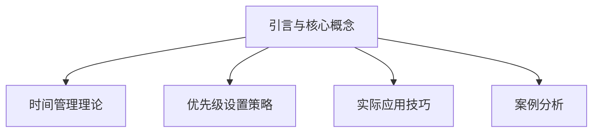

                 

### 第一部分：引言与核心概念

#### 引言

在当今快速发展的商业环境中，创业者面临着前所未有的挑战和机遇。如何有效地管理时间、设置优先级，以实现个人与团队的高效运作，成为许多创业者关注的焦点。本部分将探讨时间管理与优先级设置的核心概念，为后续内容的展开奠定基础。

#### 1.1 书籍目的与结构

本书旨在帮助创业者更好地进行时间管理与优先级设置，以实现个人与团队的高效运作。主要分为四个部分：

1. **时间管理理论**：介绍时间管理的核心概念、基本原则和方法。
2. **优先级设置策略**：讲解优先级设置的理论基础、评估方法和实际应用。
3. **实际应用技巧**：分享创业者成功的时间管理和优先级设置经验。
4. **案例分析**：深入分析成功创业者的时间管理与优先级设置实践。

#### 1.2 创业者面临的挑战

1. **时间紧迫性**：创业过程中面临诸多事务，如何合理分配时间至关重要。
2. **资源有限**：资金、人力等资源有限，如何最大化利用资源是关键。
3. **情绪管理**：面对压力和不确定性，创业者需要学会有效调节情绪。

#### 1.3 时间管理与优先级设置的重要性

1. **提高工作效率**：合理安排时间，避免拖延，确保关键任务按时完成。
2. **提升生活质量**：良好的时间管理能够帮助创业者平衡工作与生活，减少焦虑和压力。
3. **聚焦关键事务**：优先级设置有助于创业者聚焦重要事务，减轻生活负担。

#### 1.4 本书结构概述

- **第一部分：时间管理理论**：系统性介绍时间管理的核心概念和方法。
  - **1.4.1 时间管理概述**
  - **1.4.2 时间管理的重要性**
  - **1.4.3 时间管理的基本原则**
  - **1.4.4 时间浪费的原因**
  - **1.4.5 时间管理策略**

- **第二部分：优先级设置策略**：详细讲解优先级设置的理论基础。
  - **2.1 优先级设置的重要性**
  - **2.2 优先级评估标准**
  - **2.3 优先级评估方法**
  - **2.4 优先级调整策略**

- **第三部分：实际应用技巧**：结合实际案例，分享创业者成功的时间管理和优先级设置经验。
  - **3.1 个人时间管理技巧**
  - **3.2 团队时间管理技巧**
  - **3.3 企业时间管理策略**

- **第四部分：案例分析**：深入分析经典创业案例，探讨成功背后的时间管理与优先级设置策略。
  - **4.1 创业者A的时间管理实践**
  - **4.2 企业B的时间管理策略**
  - **4.3 创业者C的时间管理技巧**
  - **4.4 企业D的时间管理实践**

#### 1.5 Mermaid 流程图



#### 1.6 本章小结

本章节主要介绍了本书的目的、结构、创业者面临的挑战以及时间管理与优先级设置的重要性。通过本章的学习，读者将了解本书的核心内容，为后续章节的学习打下基础。

## 第二部分：时间管理理论

### 2.1 时间管理基础知识

#### 2.1.1 时间管理概述

时间管理是一种系统的方法，用于规划、追踪、调整个人和组织的时间使用，以提高效率和生产率。它不仅仅是一种技能，更是一种思维方式，旨在帮助人们更好地利用有限的时间资源。

#### 2.1.2 时间管理的重要性

1. **提高工作效率**：通过合理规划时间，避免无效劳动，确保关键任务按时完成。
2. **减少压力和焦虑**：良好的时间管理能够帮助人们减少因任务堆积带来的压力和焦虑。
3. **增强个人成就感**：通过有效管理时间，完成任务并看到成果，可以增强个人的成就感和自信心。
4. **提升生活质量**：时间管理能够帮助人们更好地平衡工作与生活，享受更高质量的生活。

#### 2.1.3 时间管理的基本原则

1. **目标导向**：设定明确的目标，确保时间投入产生最大价值。
2. **优先级排序**：根据重要性和紧急性对任务进行排序，确保关键任务优先处理。
3. **分配时间**：合理规划每天的工作和生活时间，确保时间利用最大化。
4. **避免拖延**：及时处理任务，避免拖延带来的负面影响。

#### 2.1.4 时间浪费的原因

1. **缺乏明确目标**：没有明确的目标，容易导致时间浪费在琐碎事务上。
2. **管理不善**：缺乏有效的计划和管理，导致时间安排混乱。
3. **社交干扰**：过多的社交活动或无意义的社交网络浏览，会分散注意力，浪费时间。
4. **无效的工作习惯**：如频繁切换任务、处理无关紧要的事务等。

#### 2.1.5 时间管理策略

1. **时间日志记录**：记录每天的时间使用情况，分析浪费的时间。
2. **任务分解**：将大任务分解为小任务，便于管理。
3. **时间块规划**：将时间分成不同块，用于处理不同类型任务。
4. **定期回顾**：定期评估时间管理策略的有效性，进行调整。

#### 2.2 优先级设置理论

##### 2.2.1 优先级设置的重要性

合理设置优先级有助于聚焦关键任务，提高工作效率。它可以帮助创业者和管理者明确任务的价值，确保有限的时间用于最重要的事务。

##### 2.2.2 优先级评估标准

优先级评估通常基于以下三个标准：

1. **重要性**：任务对于个人或组织的重要性。
2. **紧急性**：任务需要完成的时限。
3. **影响力**：任务完成后的影响范围。

##### 2.2.3 优先级评估方法

1. **重要紧急矩阵**：将任务分为四个象限，分别处理。
2. **时间价值分析法**：根据任务的价值评估时间分配。
3. **技能匹配法**：根据团队成员的技能水平，为任务分配优先级。
4. **资源优化法**：根据资源的可用性，动态调整任务优先级。

##### 2.2.4 优先级调整策略

1. **定期评估**：根据实际情况和变化，定期调整任务优先级。
2. **保持灵活性**：及时应对突发事件，调整优先级。
3. **协作调整**：团队成员共同参与优先级调整，确保任务分配合理。

#### 2.3 时间管理流程

##### 2.3.1 设定目标

1. **明确个人和组织的长期、短期目标**。
2. **将目标具体化**，制定可衡量、可实现的目标。

##### 2.3.2 任务规划

1. **列出所有待办任务**，确定任务的重要性、紧急性和所需时间。
2. **根据目标制定任务计划**，确保任务有序推进。

##### 2.3.3 时间分配

1. **将时间合理分配给不同任务**，确保关键任务优先完成。
2. **避免过度分配**，保持时间弹性。

##### 2.3.4 执行与监控

1. **按计划执行任务**，保持专注和效率。
2. **定期监控任务进度**，确保按计划完成。

##### 2.3.5 反馈与调整

1. **及时评估时间管理效果**，总结经验教训。
2. **根据反馈调整时间管理策略**，提高效率。

#### 2.4 核心算法原理讲解

##### 2.4.1 优先级排序算法

以下是一个简单的优先级排序算法的伪代码：

```plaintext
function prioritizeTasks(tasks):
    for each task in tasks:
        calculate importance and urgency
        assign priority score based on formula
    sort tasks based on priority score
    return sorted tasks
```

##### 2.4.2 时间块分配算法

以下是一个时间块分配算法的伪代码：

```plaintext
function allocateTimeBlocks(tasks, timeBlocks):
    for each task in tasks:
        find available time block
        assign task to time block
    if any task remains unassigned:
        extend time blocks or re-prioritize tasks
    return assigned tasks and time blocks
```

##### 2.4.3 时间价值公式

时间价值可以用以下公式表示：

$$
V = \frac{I \times U}{C}
$$

其中，\(V\) 是时间价值，\(I\) 是重要性，\(U\) 是紧急性，\(C\) 是成本。

##### 2.4.4 优先级排序权重

优先级排序可以基于以下权重公式：

$$
w = \frac{I + U}{2}
$$

其中，\(w\) 是权重，用于计算优先级排序分数。

#### 2.5 数学模型和数学公式讲解

##### 2.5.1 时间价值公式

时间价值公式为：

$$
V = \frac{I \times U}{C}
$$

其中：

- \(V\)：时间价值
- \(I\)：重要性
- \(U\)：紧急性
- \(C\)：成本

##### 2.5.2 优先级排序权重

优先级排序权重公式为：

$$
w = \frac{I + U}{2}
$$

其中：

- \(w\)：权重
- \(I\)：重要性
- \(U\)：紧急性

#### 2.6 本章小结

本章节介绍了时间管理的基本概念、原则和策略，以及优先级设置的理论基础。通过理解时间管理和优先级设置的核心原理，读者可以更好地应用到实际工作和生活中，提升个人与团队的工作效率。接下来，我们将深入探讨优先级设置的方法与技巧。

## 第三部分：优先级设置策略

### 3.1 优先级设置的方法与技巧

优先级设置是时间管理的重要组成部分，它有助于创业者和管理者明确任务的重点，确保关键事务得到优先处理。以下将介绍几种常见的优先级设置方法和技巧。

#### 3.1.1 重要紧急矩阵

重要紧急矩阵是一种常用的优先级评估工具，它将任务分为四个象限，分别是“重要且紧急”、“重要但不紧急”、“不重要但紧急”和“不重要且不紧急”。每个象限的处理策略不同：

1. **重要且紧急**：优先处理，通常是紧急且重要的任务，如客户投诉、危机管理等。
2. **重要但不紧急**：计划处理，这些任务对长期目标有重要影响，如员工培训、市场调研等。
3. **不重要但紧急**：委托处理，这些任务需要及时处理，但不会对长期目标产生重大影响，如收发邮件、处理电话等。
4. **不重要且不紧急**：延迟处理或放弃，这些任务对目标和价值贡献较小，可以考虑延迟或放弃。

#### 3.1.2 时间价值分析法

时间价值分析法是一种基于任务价值和时间成本的优先级评估方法。它通过计算每个任务的时间价值，来确定任务的优先级。时间价值可以用以下公式表示：

$$
V = \frac{I \times U}{C}
$$

其中：

- \(V\)：时间价值
- \(I\)：重要性
- \(U\)：紧急性
- \(C\)：成本

任务的时间价值越高，优先级越高。

#### 3.1.3 技能评估与优先级匹配

技能评估与优先级匹配是一种根据团队成员的技能水平来分配任务优先级的方法。通过评估每个团队成员的技能，将任务分配给最合适的成员，从而提高任务完成的效率和效果。这种方法有助于确保关键任务由最适合的人员处理。

#### 3.1.4 资源优化与优先级调整

资源优化与优先级调整是一种根据资源可用性来动态调整任务优先级的方法。当资源有限时，管理者需要根据资源的可用性来调整任务的优先级，以确保关键任务得到优先处理。这种方法有助于最大化利用资源，提高整体效率。

#### 3.1.5 优先级评估工具

为了更有效地进行优先级评估，可以采用一些优先级评估工具，如KPI（关键绩效指标）和OKR（目标与关键结果）。这些工具可以帮助创业者和管理者明确任务目标，评估任务的重要性，从而进行合理的优先级设置。

#### 3.1.6 案例分析

以下是一个创业者的优先级设置案例分析：

**案例背景**：创业者李先生是一家初创科技公司的CEO，公司正处于快速发展阶段，任务繁多。

**案例步骤**：

1. **确定目标**：李先生明确了公司的长期和短期目标，如市场拓展、产品研发和团队建设。

2. **任务列出**：将所有待办任务列出，包括市场调研、产品开发、团队招聘等。

3. **优先级评估**：使用重要紧急矩阵和时间价值分析法，对任务进行优先级评估。

   - 市场调研：重要且紧急，需要优先处理。
   - 产品研发：重要但不紧急，计划处理。
   - 团队招聘：不重要但紧急，委托处理。
   - 行政事务：不重要且不紧急，延迟处理。

4. **任务分配**：根据优先级，将任务分配给团队成员，确保关键任务得到优先处理。

5. **优先级调整**：根据实际情况和资源变化，定期调整任务优先级。

通过以上步骤，李先生成功地设置了合理的任务优先级，确保了公司关键事务的优先处理，提高了工作效率。

### 3.2 优先级设置的实际应用

#### 3.2.1 个人时间管理

在个人时间管理中，优先级设置可以帮助创业者更好地规划个人时间，提高工作效率。以下是一些实际应用技巧：

1. **明确个人目标**：设定明确的个人目标和职业规划，有助于明确任务的重要性。

2. **任务列表**：将所有待办任务列出来，并根据重要性和紧急性进行排序。

3. **时间块规划**：将一天的时间分成不同的块，用于处理不同类型的任务，如工作、学习和休息。

4. **避免拖延**：设定明确的截止日期，避免拖延，确保任务按时完成。

5. **定期回顾**：定期回顾任务进度和时间管理效果，根据实际情况进行调整。

#### 3.2.2 团队管理

在团队管理中，优先级设置可以帮助管理者更好地分配任务，提高团队整体效率。以下是一些实际应用技巧：

1. **团队目标**：明确团队的目标，确保每个成员都清楚团队的优先任务。

2. **任务分配**：根据团队成员的技能和任务的重要性，合理分配任务。

3. **沟通与协作**：定期召开团队会议，确保团队成员之间的沟通和协作。

4. **优先级调整**：根据项目进展和资源变化，及时调整任务优先级。

5. **反馈与激励**：对团队成员的工作进行定期反馈，激励团队成员提高工作效率。

#### 3.2.3 企业战略

在企业战略层面，优先级设置可以帮助企业明确发展重点，优化资源分配。以下是一些实际应用技巧：

1. **市场分析**：通过市场分析，确定企业的核心市场和目标客户。

2. **产品规划**：根据市场分析结果，制定产品开发计划，确保产品符合市场需求。

3. **资源优化**：根据企业的资源状况，优化资源分配，确保关键项目得到优先支持。

4. **风险管理**：识别企业面临的风险，制定相应的风险管理策略。

5. **绩效评估**：定期对企业的运营绩效进行评估，根据评估结果调整优先级。

#### 3.3 优先级设置策略案例分析

以下是一个企业的优先级设置策略案例分析：

**案例背景**：某科技企业正处于快速发展阶段，面临着市场拓展、产品研发和团队建设等多方面的任务。

**案例步骤**：

1. **市场分析**：通过市场调研，确定企业的核心市场和目标客户。

2. **产品规划**：根据市场分析结果，制定产品开发计划，确保产品符合市场需求。

3. **团队建设**：根据业务需求，招聘和培养合适的团队成员。

4. **优先级评估**：使用重要紧急矩阵和时间价值分析法，对任务进行优先级评估。

   - 市场拓展：重要且紧急，优先处理。
   - 产品研发：重要但不紧急，计划处理。
   - 团队建设：不重要但紧急，委托处理。
   - 行政事务：不重要且不紧急，延迟处理。

5. **任务分配**：根据优先级，将任务分配给团队成员，确保关键任务得到优先处理。

6. **优先级调整**：根据项目进展和资源变化，定期调整任务优先级。

通过以上步骤，该企业成功地设置了合理的任务优先级，确保了关键事务的优先处理，提高了整体效率。

### 3.4 本章小结

本章节介绍了优先级设置的方法与技巧，包括重要紧急矩阵、时间价值分析法、技能评估与优先级匹配、资源优化与优先级调整等。同时，通过实际应用和案例分析，展示了优先级设置在实际工作中的重要性。通过掌握这些方法和技巧，创业者和管理者可以更好地进行时间管理和优先级设置，提高工作效率。

### 4.1 个人时间管理技巧

#### 4.1.1 制定个人时间计划

制定个人时间计划是有效管理时间的第一步。创业者需要根据个人目标和任务，合理安排每天、每周和每月的时间。以下是一个简单的个人时间计划模板：

- **每天**：
  - 早晨：锻炼身体、早餐
  - 上午：处理重要邮件和任务
  - 中午：休息、午餐
  - 下午：进行工作或学习
  - 晚上：休闲活动、准备第二天计划

- **每周**：
  - 每周初：设定本周目标，制定任务清单
  - 每周中：跟踪任务进度，调整计划
  - 每周末：回顾本周工作，准备下周计划

- **每月**：
  - 每月初：设定月度目标，制定月度计划
  - 每月末：回顾月度工作，调整计划

#### 4.1.2 时间块管理

时间块管理是一种将时间划分为固定块，并在每个块中专注于特定任务的方法。以下是一个时间块管理模板：

- **工作日**：
  - 上午工作块：处理重要邮件和任务
  - 中午休息块：午餐和休息
  - 下午工作块：进行项目开发和团队协作

- **周末**：
  - 上午学习块：阅读专业书籍和资料
  - 下午休闲块：参加户外活动或家庭聚会

#### 4.1.3 拖延管理技巧

拖延是时间管理中的常见问题。以下是一些有效的拖延管理技巧：

- **设定明确目标**：明确任务的目标，有助于提高执行动力。
- **分解任务**：将大任务分解为小任务，逐一完成，减少压力。
- **番茄工作法**：工作25分钟，休息5分钟，提高专注力。
- **立即行动**：避免拖延，立即开始处理任务。
- **设定截止日期**：为每个任务设定明确的截止日期，提高紧迫感。

#### 4.1.4 时间日志记录

时间日志记录是一种记录每天时间使用情况的方法，有助于分析时间浪费的原因。以下是一个时间日志记录模板：

- **日期**：记录每天的时间使用情况
- **时间**：记录每个任务开始和结束的时间
- **任务**：记录每个任务的名称和内容
- **备注**：记录任务完成情况、遇到的问题和解决方案

通过定期记录和分析时间日志，创业者可以更好地了解自己的时间使用习惯，发现并解决时间浪费问题。

### 4.2 团队时间管理技巧

#### 4.2.1 制定团队时间计划

制定团队时间计划是确保团队高效协作的关键。以下是一个团队时间计划模板：

- **每周计划会议**：每周初召开计划会议，明确本周目标和任务分工。
- **每日任务清单**：每日结束时，团队成员共同更新任务清单，确保任务进度清晰。
- **周中检查**：每周中旬进行一次检查，确保任务按计划推进。
- **周末回顾**：周末回顾本周工作，总结经验教训，为下周工作做准备。

#### 4.2.2 时间块协作

时间块协作是一种在固定时间块内进行团队协作的方法，有助于提高工作效率。以下是一个时间块协作模板：

- **会议时间块**：每周固定一天下午进行团队会议，讨论项目进展和问题。
- **任务协作时间块**：每天上午和下午各设置一个任务协作时间块，团队成员共同推进任务。
- **个人工作时间块**：剩余时间为团队成员的个人工作时间，用于处理个人任务。

#### 4.2.3 时间日志共享

时间日志共享是一种鼓励团队成员记录时间使用情况，并共享给团队领导的方法。以下是一个时间日志共享模板：

- **每日时间日志**：团队成员每天记录时间使用情况，包括任务名称、耗时和完成情况。
- **周时间日志**：每周将时间日志共享给团队领导，便于监督和指导。
- **月时间日志**：每月将时间日志汇总，进行分析和总结。

通过时间日志共享，团队领导可以及时了解成员的时间使用情况，发现问题并给予指导，有助于提高团队整体效率。

### 4.3 企业时间管理策略

#### 4.3.1 企业时间管理框架

企业时间管理框架是企业进行时间管理的基础，它包括目标设定、任务规划、时间分配和反馈调整等环节。以下是一个企业时间管理框架模板：

- **目标设定**：明确企业长期和短期目标，确保时间管理策略与目标一致。
- **任务规划**：列出所有待办任务，确定任务的重要性和紧急性。
- **时间分配**：根据任务的重要性和紧急性，合理分配时间，确保关键任务优先处理。
- **反馈调整**：定期评估时间管理效果，根据实际情况进行调整。

#### 4.3.2 时间审计

时间审计是一种评估企业时间使用情况的方法，有助于发现时间浪费的问题。以下是一个时间审计模板：

- **审计周期**：每月或每季度进行一次时间审计。
- **审计内容**：包括员工时间使用情况、任务完成情况和时间浪费原因。
- **审计结果**：根据审计结果，制定改进措施，优化时间管理策略。

#### 4.3.3 培训与辅导

培训与辅导是提高员工时间管理能力的重要手段。以下是一个培训与辅导模板：

- **培训内容**：包括时间管理理论、技巧和方法，如时间块管理、拖延管理等。
- **培训形式**：可以采用线上或线下培训，结合案例分析和互动讨论。
- **辅导内容**：针对员工在时间管理中遇到的问题，提供个性化辅导和解决方案。

通过培训与辅导，员工可以掌握有效的时间管理技巧，提高工作效率。

### 4.4 实际应用技巧总结

- **个人时间管理**：制定时间计划、时间块管理、拖延管理技巧、时间日志记录。
- **团队时间管理**：制定团队时间计划、时间块协作、时间日志共享。
- **企业时间管理**：企业时间管理框架、时间审计、培训与辅导。

通过以上实际应用技巧，创业者和管理者可以更好地进行时间管理与优先级设置，提高工作效率。接下来，我们将通过案例分析，进一步探讨成功的时间管理实践。

### 4.5 案例分析

#### 4.5.1 创业者K的成功案例

**案例背景**：创业者K是一位年轻的创业者，他的公司专注于移动互联网应用的开发。在创业初期，时间管理成为了他面临的一个重要挑战。

**时间管理实践**：

1. **制定个人时间计划**：创业者K制定了详细的个人时间计划，包括每天、每周和每月的任务目标。他确保每个任务都有明确的截止日期，并且将任务按照重要性和紧急性进行排序。

2. **时间块管理**：创业者K采用时间块管理法，将一天的时间分为不同的块，每个块专注于不同的任务。例如，早晨用于处理重要邮件和任务，下午用于项目开发和团队协作。

3. **拖延管理技巧**：为了克服拖延，创业者K使用了番茄工作法，每25分钟工作，然后休息5分钟。这种方法提高了他的专注力，减少了分心。

4. **时间日志记录**：创业者K每天记录时间使用情况，包括任务名称、耗时和完成情况。通过定期回顾时间日志，他能够发现时间浪费的原因，并采取相应的改进措施。

**成功经验**：

- 通过制定个人时间计划，创业者K能够更好地规划时间，确保任务按时完成。
- 时间块管理法帮助他提高了工作效率，避免了任务切换带来的分心。
- 拖延管理技巧使他能够保持专注，减少拖延。
- 时间日志记录使他能够不断优化时间管理策略，提高整体效率。

#### 4.5.2 企业L的时间管理实践

**案例背景**：企业L是一家大型科技公司，专注于人工智能和大数据领域。随着公司规模的扩大，时间管理成为了企业管理的关键问题。

**时间管理实践**：

1. **制定团队时间计划**：企业L的团队领导定期召开团队会议，明确团队目标和任务分工。每个团队成员都清楚自己的任务和责任，确保任务有序推进。

2. **时间块协作**：企业L采用时间块协作方法，将一天的时间分为不同的块，每个块专注于不同的任务。例如，早晨用于项目讨论，下午用于具体实施。

3. **时间日志共享**：企业L鼓励团队成员记录时间使用情况，并定期共享时间日志。团队领导通过时间日志了解成员的时间使用情况，发现问题并给予指导。

4. **时间审计**：企业L定期进行时间审计，评估时间管理效果。通过时间审计，企业L能够发现时间浪费的问题，并采取相应的改进措施。

**成功经验**：

- 通过制定团队时间计划，企业L确保了团队目标的明确和任务的有序推进。
- 时间块协作方法提高了团队工作效率，减少了任务切换的时间浪费。
- 时间日志共享使团队领导能够及时了解成员的时间使用情况，发现问题并给予指导。
- 时间审计帮助企业L不断优化时间管理策略，提高整体效率。

#### 4.5.3 创业者M的时间管理技巧

**案例背景**：创业者M是一位在电商领域取得成功的创业者，他的公司经营多种商品。

**时间管理实践**：

1. **明确优先级**：创业者M通过重要紧急矩阵和时间价值分析法，对任务进行优先级评估。他确保关键任务得到优先处理，如市场调研和产品开发。

2. **时间块管理**：创业者M将一天的时间分为不同的块，每个块专注于不同的任务。例如，早晨用于处理订单和客户服务，下午用于市场推广和数据分析。

3. **拖延管理**：为了克服拖延，创业者M使用了“二八法则”，即每天优先处理最重要的20%的任务，确保这些任务按时完成。

4. **定期回顾**：创业者M每周进行一次时间回顾，总结经验教训，并根据实际情况调整时间管理策略。

**成功经验**：

- 通过明确优先级，创业者M能够更好地聚焦关键任务，提高工作效率。
- 时间块管理法帮助他提高了专注力，减少了任务切换的时间浪费。
- 拖延管理技巧使他能够保持高效的工作状态，避免拖延。
- 定期回顾使创业者M能够不断优化时间管理策略，提高整体效率。

### 4.6 本章小结

通过以上案例分析，我们可以看到创业者和管理者通过制定个人时间计划、时间块管理、拖延管理技巧和团队时间管理策略，成功地提高了时间管理效率。这些成功经验为我们提供了宝贵的实践指导，有助于我们在实际工作中更好地进行时间管理和优先级设置。

## 第五部分：案例分析

### 5.1 案例分析概述

#### 5.1.1 案例分析目的

通过分析成功创业者和企业的案例，我们希望能够深入了解他们在时间管理和优先级设置方面的实践与策略。这些案例将为我们提供实际操作经验，帮助我们在创业过程中更好地进行时间管理与优先级设置。

#### 5.1.2 案例分析方法

我们采用文献分析、访谈和案例研究等方法，深入挖掘创业者和企业的时间管理实践。通过结合实际案例，我们将总结出成功经验和教训，为读者提供有价值的参考。

#### 5.1.3 案例分析结构

每个案例分析包括以下部分：

- **背景介绍**：介绍案例的基本情况，包括创业者和企业的背景、面临的时间管理和优先级设置挑战。
- **时间管理与优先级设置实践**：详细描述创业者或企业采取的具体时间管理和优先级设置策略。
- **成功经验和教训**：总结案例中的成功经验和教训，分析其背后的原因。
- **应用启示**：提出具体的实践指导，帮助读者借鉴和应用案例中的经验。

### 5.2 创业者A的时间管理实践

#### 5.2.1 背景介绍

创业者A是一名年轻的创业者，他的公司专注于移动互联网应用开发。在创业初期，他面临着任务繁杂、时间紧迫的挑战，如何有效管理时间和设置优先级成为了他的关键任务。

#### 5.2.2 时间管理与优先级设置实践

1. **重要紧急矩阵**：创业者A使用重要紧急矩阵对任务进行优先级排序。他将任务分为四个象限，分别处理。

   - **重要且紧急**：立即处理，如紧急客户需求、突发事件。
   - **重要但不紧急**：计划处理，如市场调研、产品规划。
   - **不重要但紧急**：委托处理，如收发邮件、处理电话。
   - **不重要且不紧急**：延迟处理或放弃，如不必要的社交媒体浏览。

2. **时间价值分析法**：创业者A使用时间价值分析法来评估任务的价值。他根据任务的重要性和紧急性，以及所需时间，计算出每个任务的时间价值，从而确定优先级。

3. **时间日志记录**：创业者A每天记录时间使用情况，包括任务名称、耗时和完成情况。通过定期分析时间日志，他能够发现时间浪费的原因，并采取相应的改进措施。

#### 5.2.3 成功经验和教训

1. **成功经验**：

   - 通过重要紧急矩阵和时间价值分析法，创业者A能够明确任务的重要性，确保关键任务得到优先处理。
   - 时间日志记录使他能够及时发现时间浪费的问题，并不断优化时间管理策略。

2. **教训**：

   - 在快速发展的过程中，创业者A意识到需要不断调整时间管理策略，以适应公司变化。
   - 需要关注团队成员的时间管理，确保他们能够合理利用时间。

#### 5.2.4 应用启示

- 对于初创企业，明确任务优先级至关重要。
- 定期进行时间日志记录和分析，有助于优化时间管理策略。
- 需要不断调整时间管理策略，以适应企业的发展变化。

### 5.3 企业B的时间管理策略

#### 5.3.1 背景介绍

企业B是一家大型科技公司，业务涵盖人工智能、大数据等领域。随着公司规模的扩大，时间管理成为了一个重要的挑战。企业B需要确保员工高效工作，同时保证项目按时完成。

#### 5.3.2 时间管理与优先级设置实践

1. **企业时间管理框架**：企业B构建了企业时间管理框架，明确了时间管理的目标和策略。该框架包括目标设定、任务规划、时间分配和反馈调整等环节。

2. **时间审计**：企业B定期进行时间审计，评估员工的时间使用情况。时间审计的内容包括任务完成情况、时间浪费原因等。通过时间审计，企业B能够发现并解决时间浪费问题。

3. **培训与辅导**：企业B为员工提供时间管理培训，提高其时间管理能力。培训内容包括时间管理理论、技巧和方法，如时间块管理、拖延管理等。

#### 5.3.3 成功经验和教训

1. **成功经验**：

   - 通过企业时间管理框架，企业B能够明确员工的工作目标，确保任务按时完成。
   - 时间审计帮助企业B发现并解决时间浪费问题，提高了整体效率。
   - 培训与辅导提高了员工的时间管理能力，增强了团队协作。

2. **教训**：

   - 需要不断关注时间管理问题，定期进行时间审计和培训。
   - 需要建立有效的反馈机制，及时调整时间管理策略。

#### 5.3.4 应用启示

- 大型企业需要建立完善的时间管理框架，确保员工高效工作。
- 定期进行时间审计，发现问题并解决，以提高整体效率。
- 为员工提供时间管理培训，提高其时间管理能力。

### 5.4 创业者C的时间管理技巧

#### 5.4.1 背景介绍

创业者C是一名在电商领域取得成功的创业者，他的公司经营多种商品。电商行业竞争激烈，时间管理成为他成功的关键因素。

#### 5.4.2 时间管理与优先级设置实践

1. **时间块管理**：创业者C采用时间块管理法，将一天的时间分为不同的块，每个块专注于不同的任务。例如，早晨用于处理订单和客户服务，下午用于市场推广和数据分析。

2. **番茄工作法**：为了提高专注力，创业者C使用了番茄工作法，每25分钟工作，然后休息5分钟。这种方法帮助他保持专注，减少分心。

3. **优先级设置**：创业者C使用重要紧急矩阵和时间价值分析法，对任务进行优先级评估。他确保关键任务得到优先处理，如市场调研和产品开发。

#### 5.4.3 成功经验和教训

1. **成功经验**：

   - 时间块管理法帮助创业者C提高了工作效率，避免了任务切换的时间浪费。
   - 番茄工作法提高了他的专注力，使任务完成更加高效。
   - 通过优先级设置，创业者C能够明确任务的重要性，确保关键任务得到优先处理。

2. **教训**：

   - 在快速发展的过程中，创业者C意识到需要不断调整时间管理策略，以适应业务变化。
   - 需要关注团队成员的时间管理，确保他们能够合理利用时间。

#### 5.4.4 应用启示

- 时间块管理法有助于提高工作专注力和效率。
- 番茄工作法可以帮助创业者保持专注，提高任务完成速度。
- 需要不断调整时间管理策略，以适应业务发展变化。

### 5.5 企业D的时间管理实践

#### 5.5.1 背景介绍

企业D是一家创新型科技企业，专注于智能硬件研发。随着技术迭代速度的加快，企业D面临着时间管理的挑战。

#### 5.5.2 时间管理与优先级设置实践

1. **资源优化与优先级调整**：企业D采用资源优化与优先级调整方法，确保关键项目得到优先处理。根据资源的可用性，企业D会动态调整任务的优先级，确保关键任务按时完成。

2. **时间审计**：企业D定期进行时间审计，评估项目进展和时间管理效果。通过时间审计，企业D能够及时发现并解决问题，提高整体效率。

3. **培训与辅导**：企业D为员工提供时间管理培训，提高其时间管理能力。培训内容包括时间管理理论、技巧和方法，如时间块管理、拖延管理等。

#### 5.5.3 成功经验和教训

1. **成功经验**：

   - 通过资源优化与优先级调整，企业D能够确保关键项目得到优先处理，提高了项目的成功率。
   - 时间审计帮助企业D发现问题并解决问题，提高了整体效率。
   - 培训与辅导提高了员工的时间管理能力，增强了团队协作。

2. **教训**：

   - 需要持续关注时间管理问题，定期进行时间审计和培训。
   - 需要建立有效的反馈机制，及时调整时间管理策略。

#### 5.5.4 应用启示

- 资源优化与优先级调整方法有助于企业抓住市场机遇，实现快速发展。
- 定期进行时间审计，发现问题并解决，以提高整体效率。
- 为员工提供时间管理培训，提高其时间管理能力。

### 5.6 本章小结

通过以上案例分析，我们可以看到创业者和管理者通过制定个人时间计划、时间块管理、拖延管理技巧、团队时间管理策略和资源优化与优先级调整等方法，成功地提高了时间管理效率。这些成功经验为我们提供了宝贵的实践指导，有助于我们在实际工作中更好地进行时间管理和优先级设置。

## 附录：资源与工具推荐

### 附录 A：时间管理工具推荐

在创业和管理过程中，合理利用时间管理工具可以极大地提高工作效率。以下是一些推荐的时间管理工具：

1. **Trello**：
   - **特点**：基于看板的项目管理工具，适用于任务规划和团队协作。
   - **应用场景**：团队任务分配、项目进度追踪。
   - **优点**：直观的界面设计，灵活的任务管理方式。

2. **Asana**：
   - **特点**：全面的任务管理工具，支持任务分配、进度追踪和反馈。
   - **应用场景**：跨部门项目协作、个人任务管理。
   - **优点**：功能丰富，集成多种协作工具。

3. **Google Calendar**：
   - **特点**：功能强大的日历工具，支持事件创建、提醒和共享。
   - **应用场景**：个人日程管理、团队会议安排。
   - **优点**：与Google Workspace集成，方便协同。

4. **Evernote**：
   - **特点**：强大的笔记应用，支持多平台同步。
   - **应用场景**：记录灵感、会议纪要、项目文档。
   - **优点**：笔记整理和搜索功能强大。

5. **Todoist**：
   - **特点**：简洁的任务管理应用，支持子任务、标签和提醒。
   - **应用场景**：个人任务清单、项目任务分配。
   - **优点**：界面简洁，易用性强。

### 附录 B：优先级设置工具推荐

优先级设置是时间管理的重要环节，以下是一些推荐的优先级设置工具：

1. **KPI（关键绩效指标）**：
   - **特点**：用于衡量任务的重要性和目标达成度。
   - **应用场景**：企业绩效评估、项目目标管理。
   - **优点**：明确任务目标，便于考核和调整。

2. **OKR（目标与关键结果）**：
   - **特点**：一种目标管理方法，强调目标的可达性和关键结果的实现。
   - **应用场景**：企业目标设定、团队协作。
   - **优点**：结构清晰，便于跟踪和调整。

3. **Pareto Analysis（帕累托分析）**：
   - **特点**：根据任务的重要性和影响，确定优先级。
   - **应用场景**：资源分配、问题解决。
   - **优点**：帮助识别关键问题和资源投入方向。

4. **PRIORITY Matrix（优先级矩阵）**：
   - **特点**：基于任务的重要性和紧急性，对任务进行优先级排序。
   - **应用场景**：个人任务管理、团队项目规划。
   - **优点**：直观易懂，便于快速决策。

### 附录 C：案例分析相关资料

在撰写和分析时间管理与优先级设置的案例时，以下资料和书籍可能对您有所帮助：

1. **《深度工作：如何有效利用每一点脑力》**（Cal Newport）：
   - **内容**：介绍了如何通过专注和深度工作提高个人效率。
   - **应用**：提供了实际操作方法，帮助创业者提高时间利用效率。

2. **《时间管理》**（David Allen）：
   - **内容**：介绍了GTD（Getting Things Done）时间管理方法。
   - **应用**：提供了系统的任务管理框架，适用于个人和团队。

3. **《高效能人士的七个习惯》**（Stephen R. Covey）：
   - **内容**：介绍了时间管理、人际关系和目标设定的原则。
   - **应用**：提供了全面的个人发展指南，有助于提高整体效率。

4. **《创业维艰》**（Ben Horowitz）：
   - **内容**：分享了创业过程中遇到的挑战和解决方案。
   - **应用**：为创业者提供了实际操作经验，有助于应对创业中的各种挑战。

通过使用这些工具和阅读这些资料，您可以更好地理解和应用时间管理与优先级设置的方法，提高个人和团队的工作效率。

