                 

# 创业者的财富管理与个人投资策略

> 关键词：财富管理、投资策略、创业者、个人财务、资产配置

> 摘要：本文旨在为创业者提供一套完整的财富管理和个人投资策略。通过对财富管理基础、投资策略以及个人投资实践的深入探讨，帮助创业者建立健康的财富观，制定合理的财务目标，有效管理债务，进行科学合理的投资组合构建和策略调整，从而实现财富的稳健增长。

### 目录

**《创业者的财富管理与个人投资策略》**

- **第一部分：财富管理基础**
  - 第1章：创业者的财富观
  - 第2章：个人财务规划
  - 第3章：债务管理

- **第二部分：投资策略**
  - 第4章：投资基础
  - 第5章：资产配置
  - 第6章：股票投资
  - 第7章：基金投资
  - 第8章：房地产投资
  - 第9章：其他投资渠道

- **第三部分：个人投资实践**
  - 第10章：实战案例分享
  - 第11章：投资风险管理
  - 第12章：个人投资成长路径

- **附录**
  - 附录A：投资工具与资源
  - 附录B：投资常用术语解释

---

## 第一部分：财富管理基础

### 第1章：创业者的财富观

财富管理是创业者财务规划的重要组成部分。一个健康的财富观不仅能帮助创业者实现财务自由，还能为企业的稳定发展提供支持。在本章中，我们将讨论财富管理的重要性、创业者财富观的影响因素以及如何建立健康的财富观。

#### 1.1 财富管理的重要性

财富管理的重要性体现在以下几个方面：

1. **财务自由**：良好的财富管理能够帮助创业者实现财务自由，从而有更多的时间和精力去专注于企业的发展。
2. **风险控制**：通过合理的财富管理，创业者可以降低财务风险，确保企业运营的稳定。
3. **投资增长**：财富管理能够帮助创业者将资金有效地配置到各种投资渠道中，实现资产的增值。

##### 1.1.1 财富管理对个人财务自由的影响

良好的财富管理是财务自由的基础。创业者可以通过以下伪代码来理解这一过程：

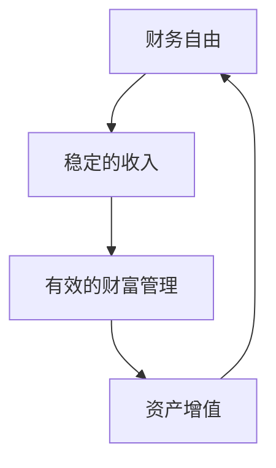

##### 1.1.2 财富管理对创业企业发展的影响

财富管理对企业发展的影响也是显而易见的。一个稳定的财务状况能够为企业提供资金支持，助力企业成长。以下伪代码展示了这一过程：

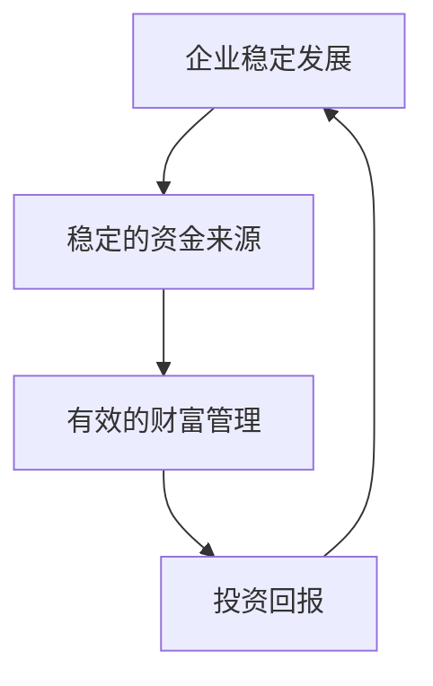

#### 1.2 创业者财富观的影响因素

创业者的财富观受到多种因素的影响，包括个人背景、教育经历、市场环境等。

##### 1.2.1 个人背景与财富观

个人背景对创业者的财富观有重要影响。一个富裕的家庭背景可能使创业者更倾向于稳健投资，而一个贫困的家庭背景可能使创业者更愿意承担高风险以快速致富。以下伪代码展示了这一影响：

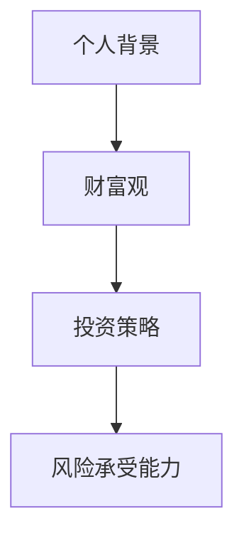

##### 1.2.2 教育经历与财富观

教育经历同样对创业者的财富观有深远影响。受过高等教育的人可能对理财知识有更深入的理解，而缺乏教育的人可能更容易受到市场波动的影响。以下伪代码展示了这一影响：

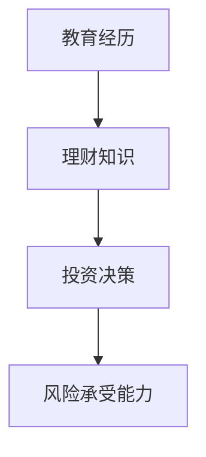

##### 1.2.3 市场环境与财富观

市场环境的变化会影响创业者的财富观。在经济繁荣时期，创业者可能更愿意承担风险；而在经济衰退时期，创业者可能更倾向于保守投资。以下伪代码展示了这一影响：

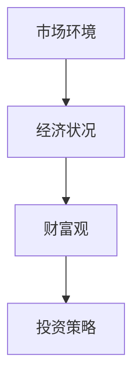

#### 1.3 如何建立健康的财富观

建立健康的财富观需要创业者进行自我认知、学习理财知识、树立正确的投资理念等。

##### 1.3.1 自我认知

创业者需要了解自己的财务状况、风险承受能力、投资偏好等，以便制定合理的财富管理策略。以下伪代码展示了这一过程：

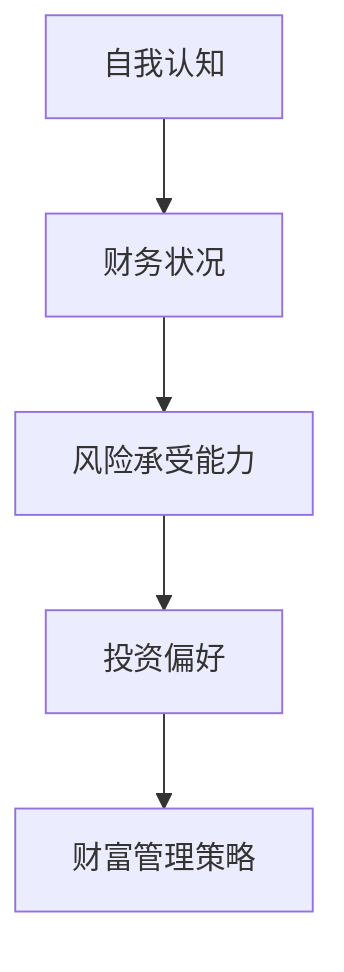

##### 1.3.2 学习理财知识

创业者需要不断学习理财知识，了解各种投资工具和策略，提高自己的理财能力。以下伪代码展示了这一过程：

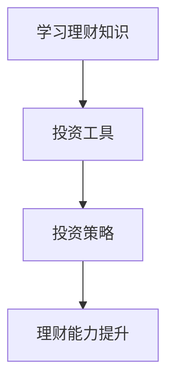

##### 1.3.3 树立正确的投资理念

正确的投资理念包括长期投资、分散投资、风险管理等。创业者需要树立这些理念，避免盲目跟风。以下伪代码展示了这一过程：

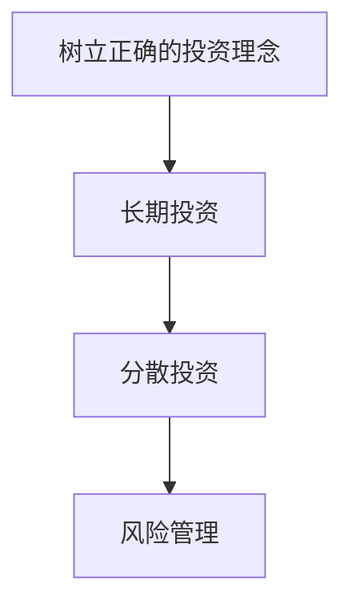

### 第2章：个人财务规划

个人财务规划是财富管理的基础。创业者需要明确自己的财务目标，制定合理的财务规划，以便实现财务自由和企业稳定发展。

#### 2.1 制定个人财务目标

制定个人财务目标是财务规划的第一步。创业者需要根据自身的实际情况，设定短期和长期财务目标。

##### 2.1.1 短期财务目标

短期财务目标通常包括以下内容：

- **紧急资金**：用于应对突发事件，如医疗费用、家庭支出等。
- **教育基金**：为子女的教育储备资金。
- **购房资金**：为购买房产储备资金。

以下伪代码展示了如何设定短期财务目标：

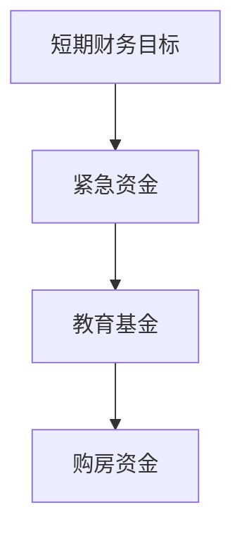

##### 2.1.2 长期财务目标

长期财务目标通常包括以下内容：

- **退休规划**：为退休生活储备资金。
- **财富传承**：为后代传承财富。
- **企业扩张**：为企业的长期发展储备资金。

以下伪代码展示了如何设定长期财务目标：

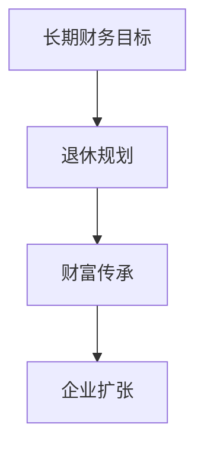

#### 2.2 建立紧急基金

紧急基金是应对突发事件的重要保障。创业者需要根据自身的实际情况，建立一定规模的紧急基金。

##### 2.2.1 紧急基金的重要性

紧急基金能够帮助创业者应对各种突发事件，如失业、疾病等。以下伪代码展示了紧急基金的重要性：

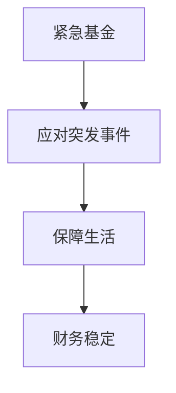

##### 2.2.2 建立紧急基金的方法

建立紧急基金的方法包括：

- **定期储蓄**：每月从收入中提取一定比例的资金存入紧急基金。
- **投资收益**：将一部分投资收益用于紧急基金。

以下伪代码展示了如何建立紧急基金：

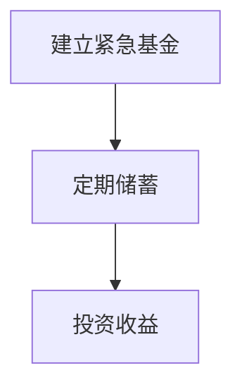

#### 2.3 理财知识体系搭建

搭建理财知识体系是进行有效财务规划的基础。创业者需要掌握基本的理财知识，如资产配置、风险管理等。

##### 2.3.1 资产配置

资产配置是根据个人财务目标和风险承受能力，将资金分配到不同的投资渠道。以下伪代码展示了资产配置的原则：

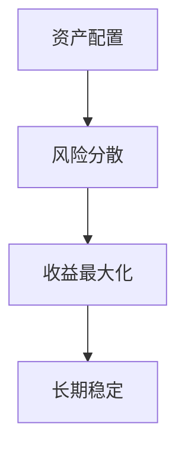

##### 2.3.2 风险管理

风险管理是降低投资损失的重要手段。创业者需要学会如何识别和应对投资风险。以下伪代码展示了风险管理的策略：

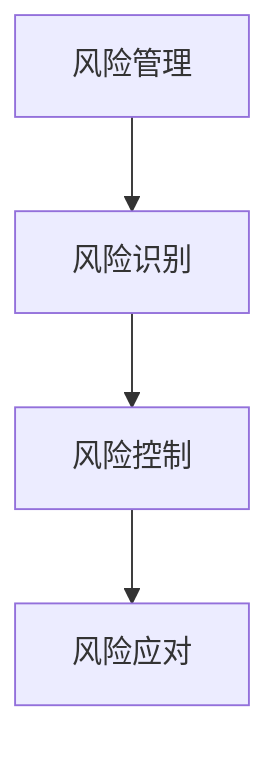

## 第二部分：投资策略

### 第3章：债务管理

债务管理是个人财务规划的重要组成部分。创业者需要了解债务的种类、如何偿还债务以及债务重组与债务减免的方法。

#### 3.1 债务的种类

债务分为良性债务和恶性债务。

##### 3.1.1 良性债务

良性债务包括房贷、教育贷款等，这些债务有助于个人或企业的长期发展。

以下伪代码展示了良性债务的类型：

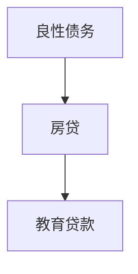

##### 3.1.2 恶性债务

恶性债务包括高利贷、信用卡债务等，这些债务可能导致个人或企业陷入财务困境。

以下伪代码展示了恶性债务的类型：

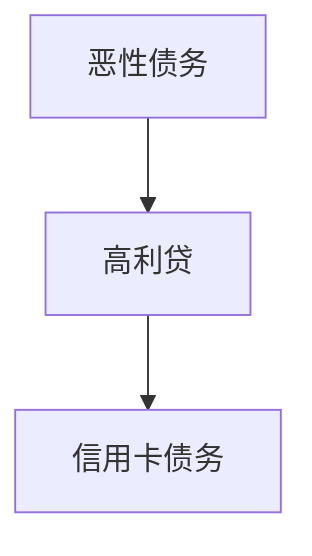

#### 3.2 偿还债务的策略

偿还债务需要根据债务的种类、个人财务状况和风险承受能力来制定相应的策略。

##### 3.2.1 债务重组

债务重组是通过调整债务的利率、延长还款期限等方式来减轻债务负担。

以下伪代码展示了债务重组的方法：

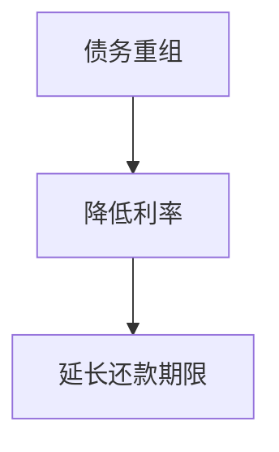

##### 3.2.2 债务减免

债务减免是通过与债权人协商，减少债务金额。

以下伪代码展示了债务减免的方法：

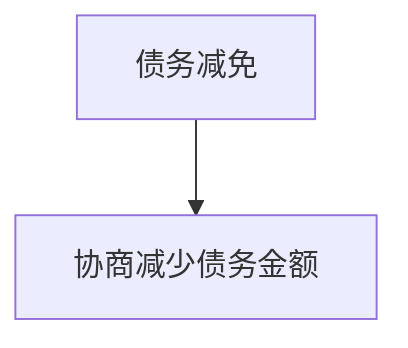

##### 3.2.3 优先偿还策略

优先偿还策略是根据债务的种类和利率来决定偿还顺序，通常优先偿还利率较高的债务。

以下伪代码展示了优先偿还策略：

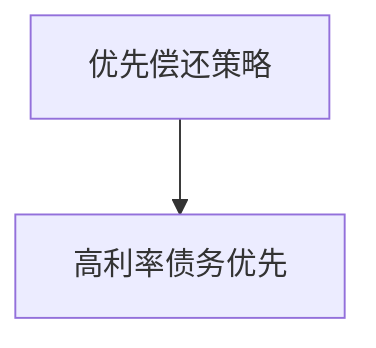

## 第三部分：个人投资实践

### 第4章：投资基础

投资基础是进行有效投资的前提。本章将介绍投资工具概述、风险与收益的关系以及投资心理与决策。

#### 4.1 投资工具概述

投资工具包括股票、债券、基金、房地产等。以下伪代码展示了投资工具的分类：

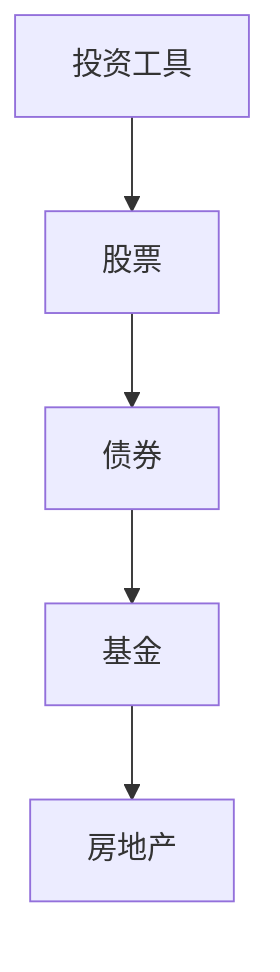

##### 4.1.1 股票

股票是公司发行的证券，投资者通过购买股票成为公司的股东，享有公司利润分配的权利。

以下伪代码展示了股票的基本概念：

```mermaid
graph TD
A[股票] --> B[公司证券]
B --> C[股东权益]
```

##### 4.1.2 债券

债券是一种债务工具，投资者购买债券相当于借钱给发行人，发行人有义务按期支付利息和本金。

以下伪代码展示了债券的基本概念：

```mermaid
graph TD
A[债券] --> B[债务工具]
B --> C[利息支付]
```

##### 4.1.3 基金

基金是一种投资组合，由专业的基金经理管理，投资者通过购买基金份额来参与基金的投资。

以下伪代码展示了基金的基本概念：

```mermaid
graph TD
A[基金] --> B[投资组合]
B --> C[基金经理管理]
```

##### 4.1.4 房地产

房地产投资包括购买房产、土地等，投资者通过出租或出售来获取收益。

以下伪代码展示了房地产投资的基本概念：

```mermaid
graph TD
A[房地产] --> B[购买房产]
B --> C[出租收益]
```

#### 4.2 风险与收益的关系

投资风险与收益之间存在正相关关系，投资者需要根据风险承受能力来选择合适的投资工具。

##### 4.2.1 风险类型

投资风险主要包括市场风险、信用风险、流动性风险等。

以下伪代码展示了风险类型：

```mermaid
graph TD
A[风险类型] --> B[市场风险]
B --> C[信用风险]
C --> D[流动性风险]
```

##### 4.2.2 收益类型

投资收益主要包括资本收益、利息收益、租金收益等。

以下伪代码展示了收益类型：

```mermaid
graph TD
A[收益类型] --> B[资本收益]
B --> C[利息收益]
C --> D[租金收益]
```

#### 4.3 投资心理与决策

投资心理与决策对投资结果具有重要影响，投资者需要克服贪婪和恐惧，做出理性决策。

##### 4.3.1 投资心理

投资心理包括乐观、悲观、贪婪、恐惧等情绪。

以下伪代码展示了投资心理：

```mermaid
graph TD
A[投资心理] --> B[乐观]
B --> C[悲观]
C --> D[贪婪]
D --> E[恐惧]
```

##### 4.3.2 投资决策

投资决策包括投资目标、投资策略、风险控制等。

以下伪代码展示了投资决策：

```mermaid
graph TD
A[投资决策] --> B[投资目标]
B --> C[投资策略]
C --> D[风险控制]
```

### 第5章：资产配置

资产配置是根据个人财务目标和风险承受能力，将资金分配到不同的投资渠道。本章将介绍资产配置的原则、策略以及调整方法。

#### 5.1 资产配置原则

资产配置原则包括分散投资、长期投资、风险控制等。

##### 5.1.1 分散投资

分散投资是通过投资多种资产来降低风险。

以下伪代码展示了分散投资的原则：

```mermaid
graph TD
A[分散投资] --> B[降低风险]
B --> C[资产多样化]
```

##### 5.1.2 长期投资

长期投资是投资者追求长期稳定收益的投资策略。

以下伪代码展示了长期投资的原则：

```mermaid
graph TD
A[长期投资] --> B[稳定收益]
B --> C[资产增值]
```

##### 5.1.3 风险控制

风险控制是通过设定止损点和风险预算来降低风险。

以下伪代码展示了风险控制的原则：

```mermaid
graph TD
A[风险控制] --> B[止损点]
B --> C[风险预算]
```

#### 5.2 投资组合构建

投资组合构建是根据资产配置策略，将资金分配到不同的投资工具。

##### 5.2.1 投资组合构建原则

投资组合构建原则包括分散投资、风险控制、收益最大化等。

以下伪代码展示了投资组合构建的原则：

```mermaid
graph TD
A[投资组合构建] --> B[分散投资]
B --> C[风险控制]
C --> D[收益最大化]
```

##### 5.2.2 投资组合构建方法

投资组合构建方法包括自建投资组合、购买基金等。

以下伪代码展示了投资组合构建的方法：

```mermaid
graph TD
A[投资组合构建] --> B[自建投资组合]
B --> C[购买基金]
```

#### 5.3 资产配置策略调整

资产配置策略调整是根据市场环境、个人财务状况等因素，对投资组合进行调整。

##### 5.3.1 调整原则

资产配置策略调整原则包括风险控制、收益最大化、适应市场变化等。

以下伪代码展示了调整原则：

```mermaid
graph TD
A[调整原则] --> B[风险控制]
B --> C[收益最大化]
C --> D[适应市场变化]
```

##### 5.3.2 调整方法

资产配置策略调整方法包括定期调整、根据市场变化调整等。

以下伪代码展示了调整方法：

```mermaid
graph TD
A[调整方法] --> B[定期调整]
B --> C[根据市场变化调整]
```

### 第6章：股票投资

股票投资是投资者获取收益的重要渠道。本章将介绍股票市场基础知识、股票投资策略以及股票投资案例分析。

#### 6.1 股票市场基础知识

股票市场是投资者进行股票交易的重要场所。本章将介绍股票市场的组成、交易流程以及股票的种类。

##### 6.1.1 股票市场的组成

股票市场由交易所、券商、投资者等组成。

以下伪代码展示了股票市场的组成：

```mermaid
graph TD
A[股票市场] --> B[交易所]
B --> C[券商]
C --> D[投资者]
```

##### 6.1.2 股票交易流程

股票交易流程包括开户、交易、清算交割等。

以下伪代码展示了股票交易流程：

```mermaid
graph TD
A[股票交易流程] --> B[开户]
B --> C[交易]
C --> D[清算交割]
```

##### 6.1.3 股票的种类

股票分为普通股、优先股等。

以下伪代码展示了股票的种类：

```mermaid
graph TD
A[股票种类] --> B[普通股]
B --> C[优先股]
```

#### 6.2 股票投资策略

股票投资策略是根据投资者风险承受能力、投资目标等因素制定的。

##### 6.2.1 长期投资策略

长期投资策略适用于有长期投资目标的投资者，注重公司基本面分析。

以下伪代码展示了长期投资策略：

```mermaid
graph TD
A[长期投资策略] --> B[公司基本面分析]
B --> C[长期持有]
```

##### 6.2.2 短期投资策略

短期投资策略适用于有短期投资目标的投资者，注重市场趋势和技术分析。

以下伪代码展示了短期投资策略：

```mermaid
graph TD
A[短期投资策略] --> B[市场趋势分析]
B --> C[技术分析]
```

##### 6.2.3 分散投资策略

分散投资策略是通过投资多种股票来降低风险。

以下伪代码展示了分散投资策略：

```mermaid
graph TD
A[分散投资策略] --> B[投资多种股票]
B --> C[降低风险]
```

#### 6.3 股票投资案例分析

通过股票投资案例分析，可以帮助投资者更好地理解股票投资策略的运用。

##### 6.3.1 案例分析一：长期投资成功案例

**案例描述**：某投资者在2000年以1元/股的价格买入某公司股票，持有至今，目前该公司股票价格达到100元/股。

**分析**：该投资者通过长期投资获得了巨大的收益，主要原因是公司业绩持续增长，市场估值提高。

**结论**：长期投资策略适用于有耐心的投资者，需要关注公司基本面和市场环境。

以下伪代码展示了案例分析：

```mermaid
graph TD
A[案例分析一] --> B[2000年购买]
B --> C[股票价格增长]
C --> D[公司业绩增长]
```

##### 6.3.2 案例分析二：短期投资成功案例

**案例描述**：某投资者在2021年2月以10元/股的价格买入某公司股票，3个月后以20元/股的价格卖出。

**分析**：该投资者通过短期投资获得了高额的收益，主要原因是市场出现了意外的利好消息，导致股价上涨。

**结论**：短期投资策略适用于有敏锐市场洞察力的投资者，需要关注市场趋势和消息面。

以下伪代码展示了案例分析：

```mermaid
graph TD
A[案例分析二] --> B[2021年2月购买]
B --> C[3个月后卖出]
C --> D[市场利好消息]
```

### 第7章：基金投资

基金投资是投资者进行投资的重要方式。本章将介绍基金的基本概念、基金的分类与选择以及基金投资策略。

#### 7.1 基金的基本概念

基金是一种投资组合，由专业的基金经理管理，投资者通过购买基金份额来参与基金的投资。

##### 7.1.1 基金的定义

基金是一种投资工具，由多个投资者共同出资，由专业的基金经理进行投资管理。

以下伪代码展示了基金的定义：

```mermaid
graph TD
A[基金] --> B[投资工具]
B --> C[共同出资]
C --> D[基金经理管理]
```

##### 7.1.2 基金的分类

基金分为股票基金、债券基金、货币市场基金、混合基金等。

以下伪代码展示了基金的分类：

```mermaid
graph TD
A[基金分类] --> B[股票基金]
B --> C[债券基金]
C --> D[货币市场基金]
D --> E[混合基金]
```

##### 7.1.3 基金的运作机制

基金的运作机制包括基金募集、基金投资、基金运作、基金收益分配等。

以下伪代码展示了基金的运作机制：

```mermaid
graph TD
A[基金运作机制] --> B[基金募集]
B --> C[基金投资]
C --> D[基金运作]
D --> E[基金收益分配]
```

#### 7.2 基金的分类与选择

基金的投资目标和风险承受能力是选择基金的重要依据。

##### 7.2.1 基金的分类

基金分为成长型基金、平衡型基金、保守型基金等。

以下伪代码展示了基金的分类：

```mermaid
graph TD
A[基金分类] --> B[成长型基金]
B --> C[平衡型基金]
C --> D[保守型基金]
```

##### 7.2.2 基金的选择

选择基金需要考虑基金的历史业绩、基金经理的能力、基金的费用等。

以下伪代码展示了基金的选择：

```mermaid
graph TD
A[基金选择] --> B[历史业绩]
B --> C[基金经理能力]
C --> D[基金费用]
```

#### 7.3 基金投资策略

基金投资策略是根据投资者的风险承受能力、投资目标等因素制定的。

##### 7.3.1 长期投资策略

长期投资策略适用于有长期投资目标的投资者，注重基金的投资组合和基金经理的管理能力。

以下伪代码展示了长期投资策略：

```mermaid
graph TD
A[长期投资策略] --> B[投资组合]
B --> C[基金经理管理能力]
```

##### 7.3.2 短期投资策略

短期投资策略适用于有短期投资目标的投资者，注重基金的市场表现和交易策略。

以下伪代码展示了短期投资策略：

```mermaid
graph TD
A[短期投资策略] --> B[市场表现]
B --> C[交易策略]
```

##### 7.3.3 分散投资策略

分散投资策略是通过投资多种基金来降低风险。

以下伪代码展示了分散投资策略：

```mermaid
graph TD
A[分散投资策略] --> B[投资多种基金]
B --> C[降低风险]
```

### 第8章：房地产投资

房地产投资是一种稳健的投资方式。本章将介绍房地产市场概述、房地产投资策略以及房地产投资案例分析。

#### 8.1 房地产市场概述

房地产投资包括住宅市场、商业市场、工业市场等。

##### 8.1.1 房地产市场的定义

房地产市场是指房地产买卖、租赁、抵押等经济活动的总和。

以下伪代码展示了房地产市场的定义：

```mermaid
graph TD
A[房地产市场] --> B[房地产买卖]
B --> C[租赁]
C --> D[抵押]
```

##### 8.1.2 房地产市场的分类

房地产市场分为住宅市场、商业市场、工业市场等。

以下伪代码展示了房地产市场的分类：

```mermaid
graph TD
A[房地产市场分类] --> B[住宅市场]
B --> C[商业市场]
C --> D[工业市场]
```

##### 8.1.3 房地产市场的运行规律

房地产市场的运行规律包括供需关系、政策调控、市场周期等。

以下伪代码展示了房地产市场的运行规律：

```mermaid
graph TD
A[房地产市场运行规律] --> B[供需关系]
B --> C[政策调控]
C --> D[市场周期]
```

#### 8.2 房地产投资策略

房地产投资策略是根据投资者的风险承受能力、投资目标等因素制定的。

##### 8.2.1 成长型投资策略

成长型投资策略适用于有长期投资目标的投资者，注重房地产市场的成长潜力。

以下伪代码展示了成长型投资策略：

```mermaid
graph TD
A[成长型投资策略] --> B[市场成长潜力]
```

##### 8.2.2 价值型投资策略

价值型投资策略适用于有稳健投资目标的投资者，注重房地产的估值和潜在回报。

以下伪代码展示了价值型投资策略：

```mermaid
graph TD
A[价值型投资策略] --> B[房地产估值]
B --> C[潜在回报]
```

##### 8.2.3 分散投资策略

分散投资策略是通过投资多种房地产项目来降低风险。

以下伪代码展示了分散投资策略：

```mermaid
graph TD
A[分散投资策略] --> B[投资多种房地产项目]
```

#### 8.3 房地产投资案例分析

通过房地产投资案例分析，可以帮助投资者更好地理解房地产投资策略的运用。

##### 8.3.1 案例分析一：成功投资案例

**案例描述**：某投资者在2010年以500万元的价格购买了一处商业地产，经过多年的市场发展和经营改善，该地产价值增长到2000万元。

**分析**：该投资者通过长期持有和市场的不断增值获得了巨大的收益，主要原因是市场环境的改善和投资者自身的努力。

**结论**：房地产投资需要耐心和专业知识，通过合理的投资策略可以实现稳健的收益。

以下伪代码展示了案例分析：

```mermaid
graph TD
A[案例分析一] --> B[2010年购买]
B --> C[地产价值增长]
```

##### 8.3.2 案例分析二：失败投资案例

**案例描述**：某投资者在2015年以1000万元的价格购买了一处住宅地产，但由于市场环境恶化，该地产价值在短短几年内降至500万元。

**分析**：该投资者由于没有及时调整投资策略，未能应对市场环境的变化，导致投资损失。

**结论**：房地产投资需要密切关注市场变化，及时调整投资策略以降低风险。

以下伪代码展示了案例分析：

```mermaid
graph TD
A[案例分析二] --> B[2015年购买]
B --> C[地产价值下降]
```

### 第9章：其他投资渠道

除了股票、基金和房地产投资，创业者还可以考虑其他投资渠道，如金融衍生品投资、艺术品投资等。

#### 9.1 金融衍生品投资

金融衍生品投资包括期货、期权、外汇等，是一种高风险、高收益的投资方式。

##### 9.1.1 金融衍生品概述

金融衍生品是一种基于标的资产的金融工具，其价格随着标的资产价格的变化而变化。

以下伪代码展示了金融衍生品的定义：

```mermaid
graph TD
A[金融衍生品] --> B[基于标的资产]
B --> C[价格变化]
```

##### 9.1.2 期货投资

期货投资是通过买卖期货合约来获取收益的投资方式。

以下伪代码展示了期货投资的过程：

```mermaid
graph TD
A[期货投资] --> B[买卖期货合约]
B --> C[获取收益]
```

##### 9.1.3 期权投资

期权投资是通过买卖期权合约来获取收益的投资方式。

以下伪代码展示了期权投资的过程：

```mermaid
graph TD
A[期权投资] --> B[买卖期权合约]
B --> C[获取收益]
```

##### 9.1.4 外汇投资

外汇投资是通过买卖外汇来获取收益的投资方式。

以下伪代码展示了外汇投资的过程：

```mermaid
graph TD
A[外汇投资] --> B[买卖外汇]
B --> C[获取收益]
```

#### 9.2 艺术品投资

艺术品投资是一种多元化的投资方式，通过购买和收藏艺术品来获取收益。

##### 9.2.1 艺术品市场概述

艺术品市场包括绘画、雕塑、陶瓷等艺术品的交易。

以下伪代码展示了艺术品市场的定义：

```mermaid
graph TD
A[艺术品市场] --> B[绘画]
B --> C[雕塑]
C --> D[陶瓷]
```

##### 9.2.2 艺术品投资策略

艺术品投资策略包括价值投资、市场投资、主题投资等。

以下伪代码展示了艺术品投资策略的分类：

```mermaid
graph TD
A[艺术品投资策略] --> B[价值投资]
B --> C[市场投资]
C --> D[主题投资]
```

##### 9.2.3 艺术品投资案例分析

通过艺术品投资案例分析，可以帮助投资者更好地理解艺术品投资策略的运用。

**案例分析**：某投资者在2000年以10万元的价格购买了一幅知名画家的作品，经过多年的市场发展，该作品的价值增长到100万元。

**分析**：该投资者通过长期持有和市场的不断增值获得了巨大的收益，主要原因是艺术市场的繁荣和投资者自身的眼光。

**结论**：艺术品投资需要具备专业知识和对市场的敏感度，通过合理的投资策略可以实现稳健的收益。

以下伪代码展示了案例分析：

```mermaid
graph TD
A[案例分析] --> B[2000年购买]
B --> C[作品价值增长]
```

### 第10章：实战案例分享

#### 10.1 创业者投资实践

通过创业者投资实践案例，可以帮助读者了解创业者的投资策略和实践经验。

##### 10.1.1 创业者投资实践一

**案例描述**：某创业者通过股票投资获得了稳定的收益，其投资策略是长期持有优质股票，并定期进行资产配置调整。

**分析**：该创业者通过长期投资和资产配置调整，成功实现了资产的稳健增值。

**结论**：创业者的投资实践表明，合理的投资策略和长期投资是实现资产增值的有效途径。

以下伪代码展示了案例：

```mermaid
graph TD
A[创业者

