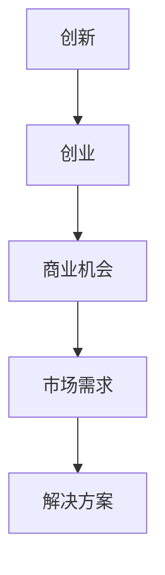

                 

## 文章标题：创新创业的机遇：如何抓住时代的机遇？

### 关键词：
创新、创业、技术趋势、商业模式、市场调研、团队管理、政策环境

### 摘要：
本文旨在探讨创新创业中的机遇，分析如何抓住时代赋予的机遇。通过详细解析创业的基础知识、市场研究与定位、团队建设与管理，以及技术趋势和社会变革等关键因素，帮助读者深入了解如何成功抓住创新创业的机遇。

---

### 引言

在当今快速变化的时代，创新与创业已成为推动社会进步和经济发展的主要动力。每一次技术革命、社会变革和产业升级，都孕育着无数的商业机会。因此，理解并把握这些机遇，成为企业和个人成功的关键。本文将带领读者深入探讨创新创业的多个方面，包括基础概念、策略方法、实际操作，以及如何利用时代赋予的机遇。

### 第一部分：创业基础

#### 第1章：创新创业概述

##### 1.1 创新与创业的定义与联系

创新与创业密切相关，它们之间的联系可以用一个简单的 Mermaid 流程图来描述：

创新是创业的驱动力，它通过提出新的想法、方法或技术，创造出独特的价值。而创业则是将创新转化为商业实践的过程，通过市场调研、商业模式设计、团队建设等环节，将创新理念付诸实施，满足市场需求。

##### 1.2 创新创业的重要性和影响力

创新创业不仅在技术领域产生深远影响，更在社会、经济、文化等多个层面展现出其重要性。以下是对创新创业重要性和影响力的详细阐述：

- **技术进步的推动者**：创新推动了科技的快速发展，带来了新的产品和服务，提升了生产效率，改善了生活质量。
- **经济增长的引擎**：创业活动创造了大量就业机会，促进了投资和消费，成为推动经济增长的重要动力。
- **社会变革的催化剂**：创新和创业不仅改变了商业模式，也影响了人们的生活方式和价值观念，推动了社会进步。

##### 1.3 创业环境与政策

创业环境的优劣直接影响创业者的成功与否。政府和企业应积极创造有利于创新创业的环境，包括提供资金支持、优化政策法规、加强知识产权保护等。以下是对创业环境与政策的关键要素进行分析：

- **资金支持**：政府和企业应提供各种形式的资金支持，如创业基金、低息贷款、风险投资等，以帮助创业者克服资金困难。
- **政策法规**：政策法规的制定应有利于创新创业，如简化行政审批流程、降低市场准入门槛等。
- **知识产权保护**：知识产权的保护对于创新创业至关重要，政府应加强知识产权的法律保护，防止侵权行为。

#### 第2章：创业心态与策略

##### 2.1 创业心态与创业成功的关系

创业心态是影响创业成功的关键因素之一。一个积极向上的心态能够帮助创业者克服困难，保持创新和创业的热情。以下是对创业心态与创业成功关系的详细分析：

- **乐观主义**：乐观主义者往往能够看到问题的积极面，更容易找到解决方案。
- **坚韧不拔**：创业者需要具备坚韧不拔的精神，面对失败和挫折时能够保持冷静，积极寻找改进方法。
- **创新思维**：创新思维是创业者的重要特质，它使创业者能够不断提出新的想法，推动企业的发展。

##### 2.2 创业策略与商业模式

创业策略是创业者实现创业目标的关键步骤。一个成功的商业模式能够帮助企业获取利润，实现可持续发展。以下是对创业策略与商业模式的关键要素进行分析：

- **市场定位**：市场定位是企业成功的基础，创业者需要明确目标市场，了解客户需求。
- **产品创新**：产品创新是创业的核心竞争力，创业者应不断推陈出新，满足市场需求。
- **资源配置**：合理配置资源是提高创业成功率的关键，创业者应优化资源配置，提高效率。

##### 2.3 风险管理策略

创业过程中伴随着各种风险，创业者需要制定有效的风险管理策略，以应对可能出现的风险。以下是对风险管理策略的关键要素进行分析：

- **风险评估**：创业者应进行全面的风险评估，识别潜在风险，分析风险的可能性和影响。
- **风险控制**：制定风险控制措施，降低风险发生的概率和影响。
- **风险转移**：通过保险、合作等方式，将部分风险转移给第三方。

#### 第3章：市场研究与定位

##### 3.1 市场研究的重要性

市场研究是创业过程中不可或缺的一环，它能够帮助企业了解市场环境、客户需求和竞争对手情况。以下是对市场研究重要性的详细分析：

- **市场环境分析**：通过市场研究，企业可以了解宏观市场环境，如市场需求、竞争态势等。
- **客户需求分析**：市场研究可以帮助企业准确把握客户需求，制定满足客户需求的产品和服务。
- **竞争对手分析**：了解竞争对手的情况，有助于企业制定有效的竞争策略。

##### 3.2 市场调研的方法与技巧

市场调研的方法和技巧对于获取准确的市场信息至关重要。以下是对市场调研的方法和技巧的详细分析：

- **问卷调查**：问卷调查是一种常用的市场调研方法，可以通过设计有针对性的问卷，获取大量有价值的信息。
- **访谈**：访谈是一种深入挖掘客户需求的方法，通过与客户进行面对面的交流，获取更详细的反馈。
- **数据分析**：通过对收集到的市场数据进行分析，可以得出有价值的结论，指导企业决策。

##### 3.3 创业项目的市场定位

市场定位是创业项目成功的关键。以下是对创业项目的市场定位策略的详细分析：

- **目标市场选择**：明确目标市场，针对目标客户群体制定相应的市场策略。
- **差异化竞争**：通过差异化策略，在竞争激烈的市场中脱颖而出，满足客户特定需求。
- **市场细分**：将市场细分为不同的子市场，针对不同子市场的特点制定相应的市场策略。

#### 第4章：团队建设与管理

##### 4.1 团队建设的重要性

团队建设是创业成功的关键因素之一，一个高效的团队可以协同工作，发挥出更大的潜力。以下是对团队建设重要性的详细分析：

- **协同效应**：团队中的成员可以相互补充，发挥各自的优势，实现协同效应。
- **创新能力**：团队建设有助于激发创新思维，团队成员可以相互启发，提出新的想法。
- **执行力**：高效的团队能够快速响应市场变化，执行决策，确保项目的顺利进行。

##### 4.2 团队成员的角色与职责

团队成员的角色与职责明确是团队建设的基础。以下是对团队成员角色与职责的详细分析：

- **领导者**：领导者负责制定团队目标和策略，指导团队成员的工作。
- **执行者**：执行者负责具体任务的实施，确保项目按计划进行。
- **协调者**：协调者负责协调团队成员之间的工作，解决冲突，确保团队的和谐。

##### 4.3 团队管理与沟通技巧

团队管理与沟通技巧对于团队的协作和效率至关重要。以下是对团队管理与沟通技巧的详细分析：

- **目标管理**：明确团队目标，确保团队成员明确自己的职责和任务。
- **绩效评估**：定期对团队成员进行绩效评估，激励团队成员，提高工作效率。
- **沟通机制**：建立有效的沟通机制，确保团队成员之间的信息畅通，提高协作效率。

### 第二部分：抓住时代机遇

#### 第5章：技术趋势与创业机遇

##### 5.1 当前技术发展趋势

当前，全球技术正处于快速发展的阶段，以下是对当前技术发展趋势的详细分析：

- **人工智能**：人工智能技术正在迅速发展，从机器学习、深度学习到自然语言处理，人工智能正在改变各行各业。
- **物联网**：物联网技术使得设备之间能够实现互联互通，为创业者提供了广阔的商机。
- **区块链**：区块链技术以其去中心化、不可篡改的特点，在金融、供应链等多个领域得到广泛应用。

##### 5.2 技术与创业的结合点

技术与创业的结合点在于通过技术创新解决实际问题，创造商业价值。以下是对技术与创业结合点的详细分析：

- **技术创新**：通过技术创新，创业者可以开发出具有竞争力的产品和服务。
- **市场应用**：将技术创新应用于实际市场，满足客户需求，实现商业成功。
- **商业模式创新**：通过创新商业模式，提高企业的盈利能力，实现可持续发展。

##### 5.3 创业者在技术选择上的策略

创业者在选择技术时需要考虑多种因素，以下是对创业者在技术选择上的策略的详细分析：

- **市场需求**：选择与市场需求紧密相关的技术，确保产品的市场竞争力。
- **技术创新能力**：选择创业者具备或能够快速掌握的技术，提高创业成功的概率。
- **技术发展趋势**：选择具有长期发展潜力的技术，确保企业能够在未来持续创新。

#### 第6章：社会变革与创业机会

##### 6.1 社会变革对创业的影响

社会变革为创业提供了新的机遇，以下是对社会变革对创业影响的详细分析：

- **人口结构变化**：人口结构的变化带来了新的市场需求，为创业者提供了商机。
- **生活方式变化**：生活方式的变化改变了消费者的需求，为创业者提供了创新的机会。
- **政策环境变化**：政策环境的变化为创业者提供了政策支持和市场机会。

##### 6.2 社会问题与商业机会

社会问题往往蕴含着商业机会，以下是对社会问题与商业机会的详细分析：

- **环境污染**：环境污染问题催生了环保产业，为创业者提供了商机。
- **老龄化社会**：老龄化社会带来了对养老、医疗等服务的需求，为创业者提供了市场空间。
- **教育公平**：教育公平问题催生了在线教育产业，为创业者提供了创新的机会。

##### 6.3 创业者在社会变革中的角色

创业者在社会变革中扮演着重要角色，以下是对创业者在社会变革中角色的详细分析：

- **创新者**：创业者通过技术创新，推动社会变革，创造新的价值。
- **推动者**：创业者通过创业活动，推动社会进步，解决社会问题。
- **参与者**：创业者积极参与社会变革，为社会发展贡献力量。

#### 第7章：政策环境与创业机遇

##### 7.1 政策环境对创业的影响

政策环境对创业具有重要影响，以下是对政策环境对创业影响的详细分析：

- **政策支持**：政策支持能够为创业者提供资金、技术、人才等多方面的支持，降低创业门槛。
- **市场准入**：政策环境的变化会影响市场准入条件，创业者需要关注政策变化，调整创业策略。
- **法律法规**：法律法规的制定和执行对创业活动产生重要影响，创业者需要了解相关法律法规，确保合法合规经营。

##### 7.2 创业者如何利用政策机遇

创业者应善于利用政策机遇，以下是对创业者如何利用政策机遇的详细分析：

- **政策研究**：创业者应关注政策动态，了解政策机遇，制定相应的创业策略。
- **政策申请**：创业者可以积极申请政策支持，如创业补贴、税收优惠等，降低创业成本。
- **政策合作**：创业者可以与政府部门、科研机构、行业协会等建立合作关系，共同推动创业发展。

##### 7.3 政策趋势与未来创业方向

政策趋势对创业方向具有重要影响，以下是对政策趋势与未来创业方向的详细分析：

- **绿色发展**：随着环保意识的提高，绿色发展成为政策趋势，创业者可以关注环保产业、绿色能源等领域。
- **数字化转型**：数字化转型成为政策重点，创业者可以关注物联网、大数据、云计算等领域。
- **科技创新**：科技创新是国家发展的重点，创业者可以关注人工智能、生物科技等前沿领域。

### 第三部分：实践与案例分析

#### 第8章：创业项目实战

##### 8.1 创业项目选择与规划

创业项目选择与规划是创业成功的关键。以下是对创业项目选择与规划的详细分析：

- **项目选择**：创业者应根据自身优势和市场需求，选择具有潜力的创业项目。
- **市场调研**：通过市场调研，了解目标市场、竞争对手等情况，为项目规划提供依据。
- **项目规划**：制定详细的项目规划，包括产品定位、市场策略、团队建设等。

##### 8.2 创业项目执行与监控

创业项目执行与监控是确保项目顺利进行的关键。以下是对创业项目执行与监控的详细分析：

- **项目执行**：按照项目规划，组织实施项目，确保项目按计划进行。
- **进度监控**：定期对项目进度进行监控，发现问题及时调整，确保项目按时完成。
- **风险管理**：制定风险管理计划，识别项目风险，采取相应措施降低风险。

##### 8.3 创业项目风险管理

创业项目风险管理是确保项目成功的关键。以下是对创业项目风险管理的详细分析：

- **风险评估**：对项目进行全面的风险评估，识别潜在风险，分析风险的可能性和影响。
- **风险控制**：制定风险控制措施，降低风险发生的概率和影响。
- **风险应对**：制定风险应对策略，确保项目在风险发生时能够及时应对，降低损失。

#### 第9章：成功创业案例分析

##### 9.1 案例介绍与分析

成功创业案例是创业者学习和借鉴的重要资源。以下是对成功创业案例介绍与分的详细分析：

- **案例介绍**：介绍成功创业案例的基本情况，包括创始人、创业项目、创业历程等。
- **成功要素**：分析成功创业案例中的关键成功要素，如技术创新、市场策略、团队建设等。
- **经验借鉴**：总结成功创业案例中的经验教训，为其他创业者提供借鉴和启示。

##### 9.2 成功创业的要素与经验

成功创业需要具备多个要素，以下是对成功创业要素与经验的详细分析：

- **技术创新**：技术创新是创业的核心竞争力，创业者应注重技术创新，不断提升产品竞争力。
- **市场策略**：市场策略是创业成功的关键，创业者应深入了解市场需求，制定有效的市场策略。
- **团队建设**：团队建设是创业成功的重要保障，创业者应注重团队建设，打造高效的团队。
- **风险管理**：风险管理是创业成功的重要环节，创业者应注重风险管理，确保项目顺利进行。

##### 9.3 案例启示与借鉴

成功创业案例为其他创业者提供了宝贵的启示和借鉴。以下是对案例启示与借鉴的详细分析：

- **市场洞察**：成功创业者往往具有敏锐的市场洞察力，能够发现市场机会，制定有效的市场策略。
- **创新能力**：成功创业者注重创新能力，不断推陈出新，保持竞争优势。
- **团队合作**：成功创业者注重团队合作，打造高效团队，发挥团队协同效应。
- **持续学习**：成功创业者保持持续学习的态度，不断提升自己的能力和素质。

#### 第10章：创业的持续发展与创新

##### 10.1 创业企业的持续发展

创业企业的持续发展是企业长期成功的关键。以下是对创业企业持续发展的详细分析：

- **产品创新**：持续的产品创新是创业企业持续发展的动力，创业者应注重产品创新，满足市场需求。
- **市场拓展**：市场拓展是企业持续发展的关键，创业者应积极拓展市场，扩大市场份额。
- **管理提升**：管理提升是企业持续发展的保障，创业者应注重管理提升，提高企业运营效率。

##### 10.2 创新在创业中的重要性

创新在创业中具有重要地位，以下是对创新在创业中的详细分析：

- **竞争优势**：创新能够为企业带来竞争优势，提高市场竞争力。
- **商业价值**：创新能够创造新的商业价值，推动企业的发展。
- **社会贡献**：创新能够推动社会进步，解决社会问题，为社会发展贡献力量。

##### 10.3 持续创新的方法与策略

持续创新是创业企业发展的关键，以下是对持续创新的方法与策略的详细分析：

- **技术创新**：通过技术创新，不断提升产品和服务质量，满足市场需求。
- **管理创新**：通过管理创新，提高企业运营效率，降低成本。
- **商业模式创新**：通过商业模式创新，提高企业的盈利能力，实现可持续发展。
- **人才激励**：通过人才激励，激发员工创新活力，推动企业持续创新。

### 附录：创新创业资源与工具

#### 附录 A：创新创业资源介绍

##### A.1 创业者必备的网站与工具

- **A.1.1 在线市场研究工具**
  - **Google Trends**：通过分析关键词搜索趋势，了解市场动态。
  - **Alexa**：提供网站流量和搜索引擎排名信息，帮助创业者了解竞争对手。

- **A.1.2 创业者社群与交流平台**
  - **LinkedIn**：专业的社交平台，创业者可以结识行业内的专家和合作伙伴。
  - **AngelList**：提供创业项目融资和人才招募的信息，是创业者寻找投资和合作伙伴的重要渠道。

##### A.2 创业投资与融资渠道

- **A.2.1 天使投资**
  - **AngelList**：平台上有大量的天使投资人，创业者可以在这里寻找投资机会。
  - **Kickstarter**：一个众筹平台，创业者可以通过众筹筹集资金，同时获得市场反馈。

- **A.2.2 风险投资**
  - **VentureDeal**：提供风险投资新闻、分析和数据，帮助创业者了解风险投资动态。
  - **PitchBook**：提供全球风险投资交易数据，是创业者评估投资环境的可靠工具。

##### A.3 创业者社群与交流平台

- **A.3.1 在线创业者社群**
  - **Reddit**：有许多关于创业的子版块，创业者可以在这里分享经验、寻求建议。
  - **Product Hunt**：创业者可以在这里展示自己的产品，获得用户反馈。

- **A.3.2 创业者交流活动**
  - **TechCrunch Disrupt**：全球知名的科技创业大会，创业者可以在这里展示自己的项目，拓展人脉。
  - **Startup Weekend**：一个为期48小时的创业活动，创业者可以在短时间内完成一个创业项目。

#### 附录 B：创新创业相关书籍推荐

##### B.1 基础理论与方法论

- **B.1.1 《创业启示录》**
  - **作者**：史蒂夫·布兰克（Steve Blank）
  - **简介**：介绍了创业过程中所需的关键思维方法和实践步骤，是创业者的必备指南。

- **B.1.2 《创新者的窘境》**
  - **作者**：克莱顿·克里斯坦森（Clayton M. Christensen）
  - **简介**：探讨了创新者在面对市场变化时的困境，以及如何应对这些挑战。

##### B.2 成功案例与实战经验

- **B.2.1 《硅谷创业神话》**
  - **作者**：迈克尔·莫里茨（Michael Moritz）
  - **简介**：讲述了硅谷一些知名创业公司的成功故事，为创业者提供了宝贵的经验。

- **B.2.2 《中国式创业》**
  - **作者**：陈宇闻
  - **简介**：分析了中国创业环境下的独特现象和成功案例，为创业者提供了有针对性的指导。

##### B.3 创新思维与设计方法

- **B.3.1 《创新者的思考方式》**
  - **作者**：迈克尔·莫舍（Michael Mosey）
  - **简介**：介绍了创新思维的方法和技巧，帮助创业者培养创新的思维习惯。

- **B.3.2 《设计思维：创新的方法与策略》**
  - **作者**：蒂姆·布朗（Tim Brown）
  - **简介**：详细介绍了设计思维的方法和应用，帮助创业者通过设计思维实现创新。

### 总结

创业是一个充满挑战和机遇的过程，创业者需要具备创新精神、市场洞察力和团队管理能力。通过本文的详细分析，我们了解了创新创业的各个方面，从基础概念到实际操作，从技术趋势到社会变革，从成功案例到持续发展。希望本文能为创业者提供有益的启示和指导，帮助他们在创业的道路上取得成功。作者：AI天才研究院/AI Genius Institute & 禅与计算机程序设计艺术 /Zen And The Art of Computer Programming。

---

## 后记

本文旨在为创业者提供一份全面的创新创业指南，帮助他们在复杂多变的市场环境中抓住机遇，实现创业梦想。通过深入探讨创新与创业的定义、创业心态与策略、市场研究与定位、团队建设与管理，以及技术趋势和社会变革等关键因素，我们希望读者能够对创新创业有更深刻的理解。

创业之路充满挑战，但同时也充满了无限的可能性。本文所提到的各个方面的知识与实践方法，都是创业者必备的素质和技能。希望读者能够结合自身实际情况，灵活运用这些知识，不断探索和创新，最终实现创业目标。

在创新创业的道路上，我们需要始终保持一颗好奇心和探索精神，不断学习新知识，积累新经验。同时，我们也要保持一颗冷静和坚韧的心态，面对失败和挫折时能够积极应对，不断调整策略，追求成功。

最后，感谢各位读者对本文的关注和支持。希望本文能够为您的创业之路提供一些启示和帮助。如果您有任何疑问或建议，欢迎在评论区留言，我们将会及时回复。祝您创业顺利，事业有成！作者：AI天才研究院/AI Genius Institute & 禅与计算机程序设计艺术 /Zen And The Art of Computer Programming。

