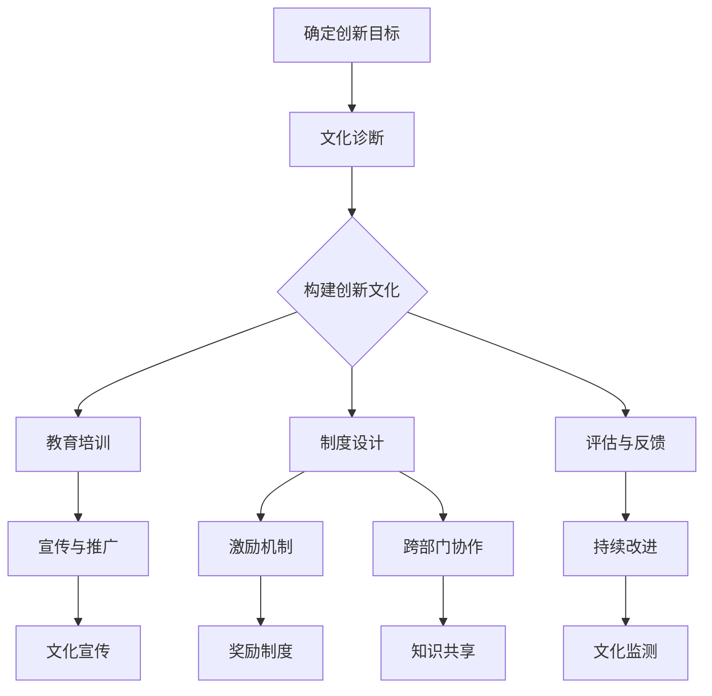
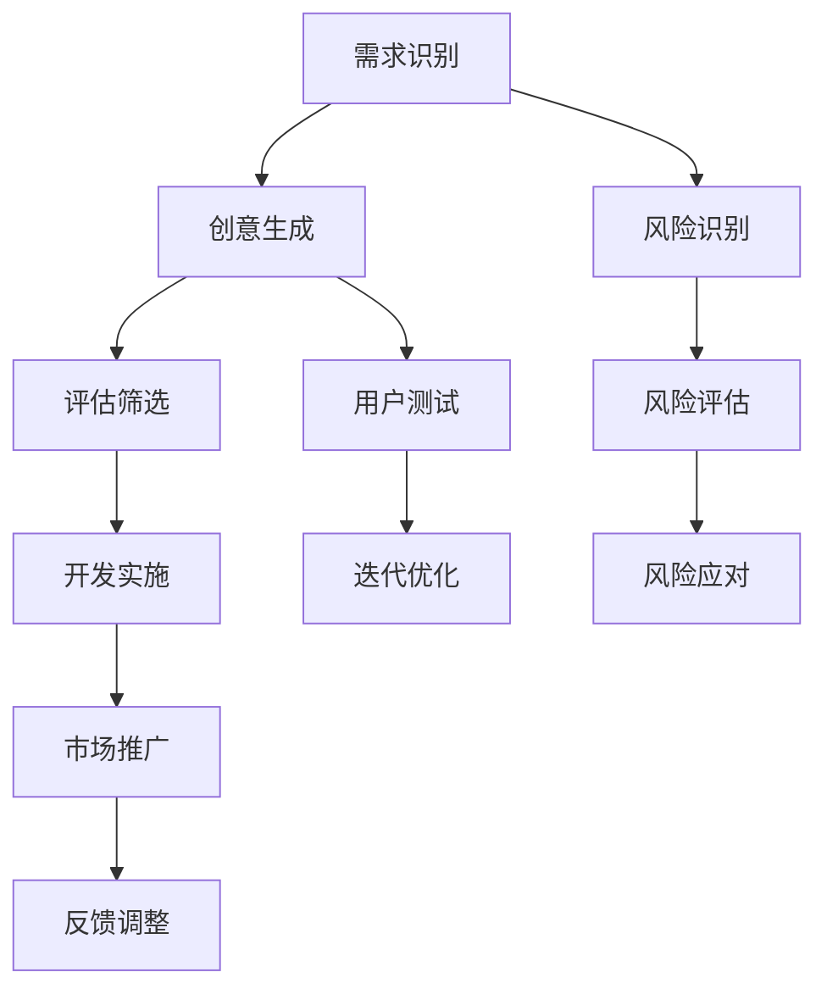

                 

# 创新文化建设：激发全员创新精神

> **关键词**：创新文化、全员创新、组织发展、项目管理、产品开发、教育普及

> **摘要**：本文旨在探讨如何通过创新文化建设，激发全员创新精神，促进组织发展和个人成长。文章首先介绍了创新文化的核心概念与理论基础，随后详细阐述了创新文化在团队建设、项目管理、产品开发、组织变革以及教育普及中的应用。通过国内外成功案例的分析，本文为读者提供了实用的创新文化建设策略和实践指导。

## 目录大纲

### 第一部分：创新文化的基础理论

#### 第1章：创新文化的概念与意义
- **1.1 创新文化的定义**
- **1.2 创新文化的特征**
- **1.3 创新文化的重要性**
- **1.4 创新文化与组织发展**

#### 第2章：创新文化的理论基础
- **2.1 创新思维理论**
  - **2.1.1 横向思维与纵向思维**
  - **2.1.2 创意生成与发散**
- **2.2 创新系统理论**
  - **2.2.1 创新生态体系**
  - **2.2.2 创新流程管理**
- **2.3 创新激励机制**

#### 第3章：创新文化的构建策略
- **3.1 创新文化建设的步骤**
- **3.2 培养创新意识的方法**
  - **3.2.1 教育培训**
  - **3.2.2 文化活动**
- **3.3 创新制度设计**
  - **3.3.1 鼓励试错**
  - **3.3.2 职业发展机会**

### 第二部分：创新文化的实践应用

#### 第4章：创新文化在团队建设中的应用
- **4.1 团队创新的动力机制**
- **4.2 团队创新的工作模式**
  - **4.2.1 平行工作模式**
  - **4.2.2 跨部门合作**
- **4.3 团队创新成果的评估与激励**

#### 第5章：创新文化在项目管理中的应用
- **5.1 创新项目的管理方法**
- **5.2 创新风险的管理策略**
  - **5.2.1 风险识别与评估**
  - **5.2.2 风险应对策略**
- **5.3 创新项目评估与总结**

#### 第6章：创新文化在产品开发中的应用
- **6.1 产品创新的设计思维**
- **6.2 用户研究的应用**
  - **6.2.1 用户需求分析**
  - **6.2.2 用户测试与反馈**
- **6.3 创新产品开发流程**

#### 第7章：创新文化在组织变革中的应用
- **7.1 创新文化与企业愿景**
- **7.2 创新文化的变革领导力**
  - **7.2.1 领导者角色**
  - **7.2.2 沟通与协作**
- **7.3 创新文化的评估与改进**

### 第三部分：创新文化的未来展望

#### 第8章：创新文化的持续发展
- **8.1 创新文化的动态调整**
- **8.2 创新文化的国际化趋势**
- **8.3 创新文化的发展挑战与对策**

#### 第9章：创新文化的成功案例
- **9.1 国内外创新文化的实践案例**
  - **9.1.1 企业案例**
  - **9.1.2 产业案例**
- **9.2 案例分析与启示**

#### 第10章：创新文化的教育普及
- **10.1 创新教育的价值**
- **10.2 创新教育的方法与内容**
  - **10.2.1 教育体系创新**
  - **10.2.2 创新教育实践**

### 附录

#### 附录A：创新文化建设的工具与资源
- **A.1 创新思维工具**
  - **A.1.1 思维导图**
  - **A.1.2 SWOT分析**
- **A.2 创新管理工具**
  - **A.2.1 项目管理软件**
  - **A.2.2 创新评估工具**
- **A.3 创新资源推荐**
  - **A.3.1 专业书籍**
  - **A.3.2 学术期刊与论文**

#### 附录B：创新文化相关的 Mermaid 流程图
- **B.1 创新文化构建流程**
- **B.2 创新项目开发流程**

#### 附录C：创新算法原理讲解与伪代码示例
- **C.1 创新思维算法**
  - **C.1.1 横向思维算法伪代码**
  - **C.1.2 纵向思维算法伪代码**
- **C.2 创新风险评估算法**
  - **C.2.1 风险识别算法伪代码**
  - **C.2.2 风险评估算法伪代码**

#### 附录D：数学模型与数学公式
- **D.1 创新文化评估模型**
  - **D.1.1 评估指标模型公式**
- **D.2 创新激励机制模型**
  - **D.2.1 激励函数模型公式**

#### 附录E：创新文化项目实战案例
- **E.1 创新文化建设项目案例**
  - **E.1.1 项目背景**
  - **E.1.2 项目实施**
  - **E.1.3 项目效果**
- **E.2 创新产品开发案例**
  - **E.2.1 产品设计思路**
  - **E.2.2 开发过程**
  - **E.2.3 用户反馈与改进**

### 总结
本文系统地阐述了创新文化的概念、理论基础、实践应用和未来展望。通过对创新文化的深入剖析，我们认识到，创新文化不仅是组织发展的动力源泉，也是个人成长的助力器。创新文化的建设需要系统的方法和策略，从理论指导到实践应用，都需要精细的设计和实施。

在接下来的章节中，我们将逐一探讨创新文化的各个层面，帮助读者理解如何构建和激发全员创新精神。通过学习创新文化的理论基础和实践案例，读者将能够掌握创新文化建设的核心要领，为组织的长远发展奠定坚实的基础。让我们开始这场创新文化的探索之旅吧！## 第一部分：创新文化的基础理论

在快速变化的技术时代，创新已成为企业持续竞争力的关键。创新文化作为企业文化的核心组成部分，承载着推动企业不断前进的重要使命。本部分将深入探讨创新文化的概念与意义、理论基础、构建策略，为后续的创新实践提供坚实的理论支撑。

### 第1章：创新文化的概念与意义

#### 1.1 创新文化的定义

创新文化是一种以创新为核心价值观，通过不断探索、实践和优化，以实现组织目标的文化氛围。它不仅包括对创新的认同和支持，还涵盖了创新思维、创新方法和创新行为的系统化培养和落实。创新文化是一种组织内部共同认可并遵循的价值观和行为规范，它鼓励员工突破传统思维，勇于尝试和承担责任。

#### 1.2 创新文化的特征

- **包容性**：创新文化鼓励多元化观点，尊重个体差异，提倡开放和包容的态度，以促进创新思维的碰撞和融合。
- **自主性**：创新文化强调自主学习和自我驱动，鼓励员工主动发现问题、解决问题，并积极参与创新项目。
- **实验性**：创新文化容忍失败，认为失败是成功的前提和必要过程，鼓励员工敢于尝试，不断实验和迭代。
- **协作性**：创新文化强调团队合作，通过跨部门、跨专业的协作，实现资源整合和优势互补。
- **持续发展性**：创新文化是一种持续发展的过程，不仅关注短期成果，更注重长期积累和持续改进。

#### 1.3 创新文化的重要性

- **提高竞争力**：创新文化能够激发员工的创造力和创新精神，推动企业不断推出新产品、新服务，增强市场竞争力。
- **促进持续发展**：创新文化有助于企业适应市场变化和技术进步，实现持续发展和长期成功。
- **增强员工凝聚力**：创新文化营造了积极向上的工作氛围，提高了员工的满意度和忠诚度，增强了团队凝聚力。
- **提升企业品牌形象**：创新文化使企业成为行业内的创新者和领导者，提升了企业的社会影响力和品牌形象。

#### 1.4 创新文化与组织发展

创新文化是组织发展的核心驱动力。通过创新文化，企业能够实现以下目标：

- **优化内部管理**：创新文化鼓励员工提出改进意见，优化工作流程，提高管理效率。
- **促进知识共享**：创新文化倡导知识共享和协作，使企业内部的智慧和资源得到充分利用。
- **激发创新潜力**：创新文化为员工提供了自由探索的空间，激发了他们的创新潜力，推动了企业持续创新。
- **实现战略目标**：创新文化使企业能够快速响应市场变化，实现战略目标和业务增长。

### 第2章：创新文化的理论基础

#### 2.1 创新思维理论

创新思维是创新文化的重要组成部分。创新思维理论主要包括横向思维和纵向思维。

- **横向思维**：横向思维是一种跳出传统框架，从不同角度和维度思考问题的方法。它强调跨学科、跨领域的知识和观点的融合，通过联想和组合产生新的创意。
- **纵向思维**：纵向思维是一种深入挖掘问题本质，从已知信息中推导出新的解决方案的方法。它强调逻辑推理和分析能力，通过逐步深入和细化解决问题。

#### 2.1.1 横向思维与纵向思维

横向思维和纵向思维相辅相成，共同构成了创新思维的基础。在实际应用中，企业应注重两者的结合，既鼓励员工跳出传统框架，探索新的可能性，又强调基于数据的分析和实证。

#### 2.1.2 创意生成与发散

创意生成和发散是创新思维的关键环节。创意生成是指在问题解决过程中，通过联想、发散和组合，产生新的创意和解决方案。创意发散则是指对创意进行扩展和深化，使其更加具体和可行。

- **创意生成**：创意生成的常见方法包括头脑风暴、思维导图、六顶思考帽等。
- **创意发散**：创意发散的方法包括SWOT分析、五力分析、鱼骨图等。

#### 2.2 创新系统理论

创新系统理论是研究创新过程、机制和环境的理论体系。它包括创新生态体系和创新流程管理。

- **创新生态体系**：创新生态体系是指创新过程中涉及的各种要素和关系，包括企业、政府、科研机构、投资者等。创新生态体系通过要素整合和互动，推动创新活动的进行。
- **创新流程管理**：创新流程管理是指对创新过程进行系统规划、组织和控制，以提高创新效率和成功率。创新流程管理包括需求识别、创意生成、评估筛选、开发实施、市场推广等环节。

#### 2.2.1 创新生态体系

创新生态体系是创新文化的重要支撑。一个健康、完善的创新生态体系有助于激发创新活力，促进创新资源的共享和整合。

- **企业角色**：企业是创新生态体系的核心，通过研发、生产和市场推广，实现创新成果的转化和应用。
- **政府角色**：政府通过政策支持、资金投入、监管服务，为创新生态体系提供良好的发展环境。
- **科研机构角色**：科研机构通过基础研究和应用研究，为创新生态体系提供技术支持和知识储备。
- **投资者角色**：投资者通过资金支持和管理，为创新生态体系提供资本保障和创新动力。

#### 2.2.2 创新流程管理

创新流程管理是创新文化实践的关键。一个高效的创新流程管理系统能够提高创新效率和成功率。

- **需求识别**：通过市场调研、用户反馈、技术趋势分析等手段，识别和确定创新需求。
- **创意生成**：通过头脑风暴、创意竞赛、开放式创新等手段，生成新的创意和解决方案。
- **评估筛选**：对创意进行评估和筛选，确定具有潜力的创新项目。
- **开发实施**：对创新项目进行详细规划和实施，包括技术攻关、产品开发、市场推广等环节。
- **市场推广**：通过市场营销、品牌推广、用户教育等手段，将创新成果推向市场。

#### 2.3 创新激励机制

创新激励机制是创新文化的重要保障。一个有效的创新激励机制能够激发员工的创新积极性，提高创新成果的质量和数量。

- **物质激励**：通过奖金、股票期权等物质奖励，激励员工积极参与创新活动。
- **精神激励**：通过荣誉表彰、晋升机会等精神激励，激发员工的荣誉感和成就感。
- **创新平台**：提供良好的创新环境和平台，支持员工进行创新实践和探索。
- **培训发展**：提供培训和发展机会，提高员工的专业技能和创新能力。

通过本章节的探讨，我们对创新文化的概念、理论基础和构建策略有了更深入的了解。在接下来的章节中，我们将继续探讨创新文化在团队建设、项目管理、产品开发、组织变革和教育普及中的应用，帮助读者更好地理解和实践创新文化。

### 第3章：创新文化的构建策略

构建创新文化是一个系统工程，需要从多个维度进行综合设计和实施。以下将详细介绍创新文化建设的具体步骤、培养创新意识的方法和制度设计，为读者提供全面的创新文化构建策略。

#### 3.1 创新文化建设的步骤

构建创新文化是一个逐步推进的过程，通常包括以下几个关键步骤：

1. **顶层设计**：制定创新文化的总体目标和战略，明确创新文化的核心价值和理念。这一阶段需要高层管理者的积极参与和决策，为创新文化的实施提供明确的方向和保障。

2. **文化诊断**：对企业现有文化进行诊断，识别文化中不利于创新的元素和障碍，明确创新文化的需求和基础。通过问卷调查、员工访谈、文化评估等手段，全面了解员工的创新态度和行为习惯。

3. **文化建设**：根据文化诊断结果，有针对性地开展文化建设活动，包括宣传创新文化、推广创新理念、树立创新榜样等。通过内部宣传、教育培训、文化活动等手段，营造浓厚的创新氛围。

4. **制度设计**：制定和优化与创新文化相关的管理制度和流程，包括创新项目管理、激励机制、人才培养等。确保制度设计能够支持创新文化的落地和实施。

5. **评估反馈**：建立创新文化评估机制，定期对创新文化建设的成效进行评估和反馈，根据评估结果进行持续改进。评估内容应包括员工创新意识、创新项目数量和质量、创新绩效等。

6. **持续优化**：创新文化建设是一个动态过程，需要不断调整和优化。通过定期回顾和总结，发现新的问题和挑战，持续改进创新文化。

#### 3.2 培养创新意识的方法

培养创新意识是构建创新文化的重要环节。以下几种方法可以有效提升员工的创新意识：

1. **教育培训**：通过系统化的教育培训，提高员工的专业技能和创新思维。培训内容应包括创新方法论、前沿技术、跨学科知识等，帮助员工拓宽视野，提升创新能力。

2. **实践活动**：组织创新实践活动，如创新竞赛、创意工作坊、头脑风暴等，让员工在真实的创新环境中锻炼思维和技能。实践活动应注重实际问题的解决，鼓励员工勇于尝试和失败。

3. **知识共享**：建立知识共享平台，鼓励员工分享创新经验和心得，促进知识的传播和积累。知识共享不仅有助于提升员工的创新意识，还能激发员工的创新灵感。

4. **激励机制**：建立激励机制，鼓励员工积极参与创新活动。激励机制应包括物质奖励和精神激励，如奖金、股票期权、荣誉表彰等，激发员工的创新积极性。

5. **领导示范**：领导者在创新文化建设中扮演着重要角色。领导者应通过自身行动树立创新榜样，带头推动创新，为员工创造一个积极的创新氛围。

#### 3.3 创新制度设计

创新制度设计是创新文化建设的重要保障。以下几种制度设计方法有助于构建和巩固创新文化：

1. **鼓励试错**：建立容错机制，鼓励员工在创新过程中尝试新方法、新技术，容忍失败。通过失败案例的分析和总结，为员工提供宝贵的学习和改进机会。

2. **职业发展机会**：为员工提供多样化的职业发展机会，特别是创新领域的晋升机会，激励员工积极参与创新活动。通过明确职业发展路径和晋升标准，帮助员工明确努力方向。

3. **跨部门合作**：推动跨部门合作，建立跨部门项目团队，鼓励员工跨部门交流和协作。跨部门合作有助于整合企业内外部资源，促进创新项目的高效推进。

4. **创新资金支持**：提供充足的创新资金支持，为员工和团队提供必要的资源保障。通过设立专项创新基金，鼓励员工和团队进行创新研究和实验。

5. **创新评估体系**：建立科学合理的创新评估体系，对创新项目的可行性、预期收益和风险进行综合评估。评估体系应注重创新成果的质量和实际应用价值，为创新决策提供有力支持。

通过以上步骤和方法，企业可以逐步构建起创新文化，激发全员创新精神，推动组织的持续发展和进步。

### 第二部分：创新文化的实践应用

创新文化的核心在于将创新理念融入组织的日常运营中，并在各个层面上进行实践应用。本部分将重点讨论创新文化在团队建设、项目管理、产品开发和组织变革中的应用，并结合具体案例进行分析，以展示创新文化在实践中的实际效果。

#### 第4章：创新文化在团队建设中的应用

团队是创新文化的重要载体，团队创新能力的提升直接关系到整个组织的创新活力。以下将从团队创新的动力机制、工作模式以及成果评估与激励三个方面探讨创新文化在团队建设中的应用。

#### 4.1 团队创新的动力机制

团队创新的动力机制是激发团队成员创新积极性、提升团队整体创新能力的关键。以下几种机制可以有效促进团队创新：

1. **共同目标与使命**：明确团队的目标和使命，使团队成员明确自己的职责和贡献，增强团队凝聚力和归属感。

2. **激励机制**：建立科学合理的激励机制，包括物质奖励、荣誉表彰、晋升机会等，激励团队成员积极参与创新活动。

3. **信任与支持**：营造开放、包容的团队氛围，鼓励团队成员之间相互信任、支持和合作，为创新提供良好的心理环境。

4. **自主权与责任**：赋予团队成员一定的自主权，让他们自主决策和执行创新项目，同时明确责任，确保创新项目的顺利进行。

5. **跨部门合作**：推动跨部门合作，整合企业内外部资源，为团队创新提供更多的支持和机会。

#### 4.2 团队创新的工作模式

团队创新的工作模式直接影响创新效率和成果质量。以下两种工作模式在实践中被证明是有效的：

1. **平行工作模式**：平行工作模式是指团队成员在不同阶段同时进行工作，以实现快速迭代和高效创新。在这种模式下，团队成员可以快速响应市场需求，快速验证创新方案，提高创新效率。

2. **跨部门合作**：跨部门合作是指团队成员来自不同部门，共同协作完成创新项目。这种模式有助于整合企业内外部资源，促进知识共享和协作，提高创新成果的质量和实际应用价值。

#### 4.2.1 平行工作模式

平行工作模式的优点在于：

- **快速响应**：团队成员可以同时处理多个任务，快速响应市场需求和变化。
- **高效协作**：团队成员在平行工作模式下可以相互支持、相互学习，提高整体创新能力。
- **迭代速度**：通过快速迭代，团队成员可以及时调整创新方案，确保创新成果的市场竞争力。

平行工作模式的实施步骤包括：

1. **明确目标**：确定团队创新的目标和任务，确保团队成员目标一致。
2. **分解任务**：将创新任务分解为若干个子任务，明确各成员的职责和任务。
3. **并行执行**：团队成员同时开始各自的任务，确保任务进度和协作效果。
4. **定期回顾**：定期进行工作回顾和总结，评估创新项目的进展和成果，及时调整方案。

#### 4.2.2 跨部门合作

跨部门合作的优点在于：

- **资源整合**：通过跨部门合作，可以充分利用各部门的专业知识和资源，提高创新项目的成功率。
- **知识共享**：跨部门合作有助于促进知识共享和交流，提升团队的整体创新能力。
- **协同创新**：跨部门合作可以激发不同领域的创意碰撞，推动创新成果的多样性和创新性。

跨部门合作的实施步骤包括：

1. **需求识别**：明确创新项目的需求和目标，确保各部门对项目目标有清晰的理解。
2. **建立团队**：组建跨部门项目团队，明确各成员的职责和任务。
3. **协作规划**：制定项目规划和协作流程，确保各部门的协作顺畅。
4. **沟通与协调**：建立有效的沟通机制，确保各部门之间的信息传递和协调。
5. **成果评估**：对创新项目进行评估和总结，为后续合作提供参考。

#### 4.3 团队创新成果的评估与激励

对团队创新成果的评估与激励是确保创新活动持续进行和不断优化的重要环节。以下几种评估与激励方法在实践中被广泛应用：

1. **定量评估**：通过定量指标对创新成果进行评估，如创新项目数量、市场占有率、利润贡献等。定量评估有助于客观衡量创新成果的成效。

2. **定性评估**：通过专家评审、用户反馈等定性方法对创新成果进行评估，如创新方案的独特性、实用性、用户体验等。定性评估有助于深入了解创新成果的质量和实际应用价值。

3. **奖励机制**：建立奖励机制，对创新成果突出的团队和个人进行奖励，如奖金、荣誉证书、晋升机会等。奖励机制有助于激发团队成员的创新积极性。

4. **反馈与改进**：对创新成果进行反馈和总结，分析成功和失败的原因，为后续创新提供借鉴和改进。反馈与改进有助于持续提升团队的创新能力。

通过以上措施，企业可以构建起创新文化在团队建设中的有效应用，激发团队创新活力，推动组织的持续发展和进步。

#### 第5章：创新文化在项目管理中的应用

创新文化在项目管理中的应用至关重要，它不仅影响着项目的执行效率，还决定了项目的创新程度和成功率。以下将从创新项目的管理方法、创新风险的管理策略以及项目评估与总结三个方面，详细探讨创新文化在项目管理中的应用。

#### 5.1 创新项目的管理方法

创新项目管理与传统项目管理相比，更注重灵活性、实验性和团队合作。以下几种管理方法在创新项目中得到广泛应用：

1. **敏捷开发方法**：敏捷开发方法强调迭代、快速反馈和持续改进，通过短周期开发、持续交付和频繁迭代，确保项目能够快速响应变化，满足市场需求。

2. **Scrum框架**：Scrum是一种敏捷开发方法，通过每日站会、冲刺回顾等机制，确保团队成员之间的沟通和协作，提高项目透明度和执行效率。

3. **看板（Kanban）管理**：看板管理方法通过可视化工作流程，帮助团队成员明确任务状态和优先级，避免过度工作量和资源浪费，提高项目执行效率。

4. **跨部门协作**：推动跨部门协作，整合企业内外部资源，为创新项目提供全方位的支持。跨部门协作有助于提高项目的创新性和市场竞争力。

5. **用户反馈机制**：建立用户反馈机制，及时收集和分析用户反馈，将用户需求转化为创新项目的改进方向。用户反馈机制有助于确保项目成果贴近用户需求，提高项目成功率。

#### 5.2 创新风险的管理策略

创新项目往往伴随着较高的不确定性，有效的风险管理策略是确保项目成功的关键。以下几种风险管理策略在实践中被广泛应用：

1. **风险识别与评估**：在项目启动阶段，通过专家评估、情景分析、历史数据等方法，全面识别和评估项目风险。风险识别与评估有助于提前发现潜在问题，制定应对措施。

2. **风险应对策略**：根据风险识别和评估结果，制定相应的风险应对策略。常见的应对策略包括风险规避、风险转移、风险减轻和风险接受。

3. **风险监控与控制**：在项目执行过程中，持续监控和评估风险状态，及时调整风险应对策略。风险监控与控制有助于确保项目风险在可控范围内。

4. **应急预案**：针对可能出现的重大风险，制定应急预案，确保项目能够在突发事件中快速恢复，减少损失。

5. **风险沟通与协作**：建立有效的风险沟通机制，确保项目团队和相关利益相关者了解风险情况，共同参与风险应对。风险沟通与协作有助于提高项目团队的风险意识和应对能力。

#### 5.2.1 风险识别与评估

风险识别与评估是创新风险管理的基础。以下几种方法在实践中被广泛应用：

- **专家评估法**：通过邀请行业专家和内部专业人员，对项目风险进行全面评估，识别潜在风险点。
- **情景分析法**：通过模拟不同情景，分析项目在各个情景下的风险状况，识别潜在风险。
- **历史数据法**：通过分析历史项目数据，识别和总结常见的风险类型和应对策略。

风险评估包括以下步骤：

1. **确定评估对象**：明确需要评估的项目风险范围。
2. **收集数据**：收集与项目相关的各种数据，包括历史数据、专家评估数据、用户反馈等。
3. **评估风险**：对收集的数据进行分析，识别潜在风险，并评估其可能对项目的影响程度。
4. **编写评估报告**：将评估结果和应对策略形成书面报告，为项目决策提供依据。

#### 5.2.2 风险应对策略

常见的风险应对策略包括：

- **风险规避**：通过调整项目计划或方案，避免风险的发生。
- **风险转移**：通过保险、合同等方式，将风险转移给第三方。
- **风险减轻**：通过技术改进、流程优化等方式，降低风险发生的概率或影响程度。
- **风险接受**：在风险可控的情况下，接受风险，并制定相应的应急措施。

#### 5.3 创新项目评估与总结

创新项目评估与总结是项目管理的最后一个环节，通过对项目的全面评估和总结，可以总结经验教训，为后续项目的成功提供借鉴。以下几种评估与总结方法在实践中被广泛应用：

1. **项目回顾会**：通过项目回顾会，团队成员共同回顾项目的执行过程，分析成功经验和失败教训，为后续项目提供参考。

2. **关键绩效指标（KPI）评估**：通过关键绩效指标对项目进行评估，如项目进度、成本、质量、用户满意度等，客观衡量项目的成效。

3. **用户反馈分析**：收集用户对项目成果的反馈，分析用户需求满足情况和满意度，为后续项目的改进提供依据。

4. **财务分析**：通过财务分析，评估项目的投资回报率和盈利能力，为企业的战略决策提供数据支持。

5. **知识管理**：将项目的成功经验和教训形成知识库，供后续项目参考，提高项目的执行效率和成功率。

通过以上措施，企业可以构建起创新文化在项目管理中的应用体系，提高项目的创新程度和成功率，推动组织的持续发展和进步。

#### 第6章：创新文化在产品开发中的应用

在产品开发过程中，创新文化的融入能够显著提升产品的竞争力，满足用户需求，推动企业的可持续发展。以下从产品创新的设计思维、用户研究的应用以及开发流程三个方面，探讨创新文化在产品开发中的应用。

#### 6.1 产品创新的设计思维

设计思维是一种以人为中心的设计方法，强调用户需求的理解和满足，通过迭代和实验不断优化产品。以下几种设计思维方法在产品创新中具有重要应用：

1. **用户访谈与观察**：通过与目标用户进行深入访谈和观察，了解用户的需求、行为和痛点，为产品创新提供切实可行的方向。

2. **用户画像**：创建详细的用户画像，包括用户的基本信息、需求、行为特征等，帮助设计团队更好地理解用户，制定针对性的产品设计方案。

3. **原型设计与测试**：快速制作原型，通过用户测试和反馈，验证产品设计的可行性和用户满意度，及时调整和优化设计方案。

4. **迭代开发**：采用迭代开发模式，不断迭代和优化产品，确保产品能够快速响应市场变化和用户需求。

5. **跨学科协作**：鼓励不同学科领域的专家共同参与产品开发，通过跨学科的协作和创意碰撞，提高产品的创新性和实用性。

#### 6.2 用户研究的应用

用户研究是产品开发过程中不可或缺的一环，以下几种用户研究方法在实践中被广泛应用：

1. **用户需求分析**：通过问卷调查、深度访谈、用户调研等方式，收集和分析用户需求，为产品设计和功能定位提供数据支持。

2. **用户测试与反馈**：在产品开发的各个阶段，组织用户测试，收集用户对产品的反馈和意见，及时调整和优化产品功能。

3. **用户行为分析**：通过数据分析工具，分析用户行为数据，了解用户的使用习惯、偏好和需求，为产品改进提供依据。

4. **竞品分析**：分析竞争对手的产品特点、优势和不足，为产品创新和功能设计提供参考。

5. **用户体验评估**：通过用户体验评估工具，如可用性测试、用户满意度调查等，评估产品的用户体验，找出改进点。

#### 6.2.1 用户需求分析

用户需求分析是产品开发的基础，以下步骤和方法有助于全面了解用户需求：

1. **确定研究目标**：明确需求分析的目标，如功能需求、性能需求、用户体验等。

2. **数据收集**：通过问卷调查、访谈、观察等方式，收集用户需求数据。

3. **数据整理**：对收集到的数据进行分析和整理，分类归纳用户需求。

4. **需求优先级排序**：根据用户需求的重要性和紧急性，对需求进行优先级排序。

5. **需求验证**：通过用户反馈和专家评审，验证需求的准确性和可行性。

6. **需求文档编写**：将分析结果编写成需求文档，为产品设计和开发提供指导。

#### 6.2.2 用户测试与反馈

用户测试与反馈是产品优化的重要环节，以下方法有助于提高用户测试的效果：

1. **制定测试计划**：明确测试目标、测试环境、测试人员、测试时间等，制定详细的测试计划。

2. **设计测试用例**：根据需求文档，设计合理的测试用例，确保测试全面、覆盖关键功能。

3. **组织用户测试**：邀请目标用户参与测试，收集用户反馈和意见。

4. **数据分析**：对用户反馈进行分析，总结用户痛点和需求，为产品改进提供依据。

5. **迭代优化**：根据用户反馈，迭代优化产品功能，提高用户体验。

6. **持续反馈**：建立用户反馈机制，定期收集用户反馈，持续优化产品。

#### 6.3 创新产品开发流程

创新产品开发流程是确保产品创新性和市场竞争力的重要保障，以下几种开发流程在实践中被广泛应用：

1. **敏捷开发流程**：采用敏捷开发方法，通过短周期迭代、快速反馈和持续改进，确保产品能够快速适应市场变化和用户需求。

2. **精益开发流程**：采用精益开发方法，通过价值流分析和持续改进，减少浪费，提高开发效率和产品质量。

3. **瀑布开发流程**：采用瀑布开发方法，按照需求分析、设计、开发、测试、部署等阶段逐步推进，确保产品开发过程的规范性和可控性。

4. **跨部门协作流程**：推动跨部门协作，整合企业内外部资源，提高产品开发效率和创新性。

5. **用户参与流程**：在产品开发的各个阶段，邀请用户参与，收集用户反馈，确保产品贴近用户需求。

6. **持续交付流程**：采用持续交付方法，通过自动化测试、持续集成和持续部署，确保产品快速交付和市场竞争力。

通过以上措施，企业可以构建起创新文化在产品开发中的应用体系，提高产品的创新程度和竞争力，推动企业的持续发展和进步。

#### 第7章：创新文化在组织变革中的应用

创新文化在组织变革中扮演着关键角色，它不仅能够激发员工的创新精神，还能够推动组织实现结构性变革，以适应不断变化的市场环境。以下从企业愿景、变革领导力以及评估与改进三个方面，探讨创新文化在组织变革中的应用。

#### 7.1 创新文化与企业愿景

企业愿景是组织变革的指导思想，创新文化则是实现企业愿景的重要手段。以下几种方法有助于将创新文化融入企业愿景：

1. **明确创新愿景**：企业高层领导应明确创新愿景，并将其作为企业文化的重要组成部分。创新愿景应包括企业的创新目标、价值观和创新使命，为员工提供明确的创新方向。

2. **传播创新价值观**：通过内部宣传、教育培训、文化活动等方式，将创新价值观传播到每个员工心中，使创新成为企业的核心价值观。

3. **建立创新目标**：将创新目标纳入企业战略规划，确保创新活动与企业愿景保持一致，推动企业实现持续创新。

4. **创新榜样引领**：树立创新榜样，通过表彰和奖励在创新方面表现突出的员工，激励其他员工学习创新，形成良好的创新氛围。

#### 7.2 创新文化的变革领导力

领导者是创新文化的重要推动者，变革领导力是推动组织创新的关键。以下几种变革领导力方法在实践中被广泛应用：

1. **积极倡导创新**：领导者应积极倡导创新，鼓励员工提出新想法、新方案，并对创新行为给予支持和鼓励。

2. **搭建创新平台**：领导者应搭建创新平台，为员工提供自由探索和创新的空间。通过建立创新实验室、创新基金等方式，支持员工进行创新实践。

3. **激发员工潜力**：领导者应关注员工的潜力，通过培训和激励措施，激发员工的创新能力和创造力。

4. **营造包容氛围**：领导者应营造包容氛围，鼓励员工敢于尝试和失败，容忍错误，为员工提供成长和发展的机会。

5. **跨部门协作**：领导者应推动跨部门协作，打破部门壁垒，促进知识共享和资源整合，提高创新效率。

#### 7.2.1 领导者角色

领导者在创新文化变革中扮演多重角色，包括：

- **倡导者**：领导者应积极倡导创新，树立创新榜样，引领员工共同追求创新。
- **支持者**：领导者应为员工提供必要的支持和资源，鼓励员工勇于创新，并对创新行为给予认可和奖励。
- **协调者**：领导者应协调不同部门之间的协作，促进资源整合和知识共享，提高创新效率。
- **改革者**：领导者应推动组织变革，打破传统思维和流程的束缚，为创新提供良好的环境。

#### 7.2.2 沟通与协作

沟通与协作是创新文化变革的重要保障。以下几种沟通与协作方法有助于推动创新文化变革：

1. **定期会议**：定期召开创新会议，讨论创新项目和进展，分享创新经验和成果，增强团队凝聚力。
2. **开放式沟通**：鼓励员工之间进行开放式沟通，建立信任和合作的基础，促进创新思维的碰撞。
3. **跨部门合作**：推动跨部门合作，打破部门壁垒，促进知识共享和资源整合，提高创新效率。
4. **在线协作工具**：采用在线协作工具，如团队协作软件、项目管理系统等，提高协作效率和透明度。

#### 7.3 创新文化的评估与改进

创新文化的评估与改进是确保创新文化持续发展的重要环节。以下几种评估与改进方法在实践中被广泛应用：

1. **创新文化调查**：通过问卷调查、员工访谈等方式，了解员工的创新意识、创新行为和创新满意度，评估创新文化的实施效果。
2. **关键绩效指标（KPI）**：建立创新文化关键绩效指标，如创新项目数量、创新成果转化率、员工创新积极性等，对创新文化进行量化评估。
3. **创新项目回顾**：定期对创新项目进行回顾和总结，分析创新项目的成功经验和失败原因，为后续创新提供借鉴和改进。
4. **外部评估**：邀请外部专家对创新文化进行评估，提供客观、专业的意见和建议，促进创新文化的改进。

通过以上措施，企业可以构建起创新文化在组织变革中的应用体系，推动组织的持续创新和变革，实现企业的长期发展目标。

### 第三部分：创新文化的未来展望

创新文化作为一种推动组织持续发展的动力，其未来发展趋势和挑战同样值得关注。以下将探讨创新文化的持续发展、国际化趋势以及发展中的挑战与对策。

#### 第8章：创新文化的持续发展

创新文化的持续发展是组织应对外部环境变化、保持竞争优势的关键。以下从动态调整、国际化趋势以及持续发展挑战与对策三个方面，探讨创新文化的未来发展。

#### 8.1 创新文化的动态调整

创新文化是一个动态调整的过程，需要根据组织内外部环境的变化进行适时调整。以下措施有助于实现创新文化的动态调整：

1. **持续监测**：建立持续的监测机制，及时了解员工创新行为、创新成果以及创新文化实施的效果，为动态调整提供数据支持。
2. **反馈机制**：建立反馈机制，鼓励员工提出创新建议和反馈，及时了解员工的创新需求和困难，调整创新文化策略。
3. **灵活应对**：根据市场变化、技术进步和竞争环境的变化，灵活调整创新文化策略，确保创新文化能够适应新的发展需求。
4. **持续改进**：持续改进创新文化，通过引入新的创新理念、方法和工具，不断提升创新文化的质量和效果。

#### 8.2 创新文化的国际化趋势

随着全球化的发展，创新文化也呈现出国际化的趋势。以下措施有助于推动创新文化的国际化：

1. **国际交流与合作**：积极参与国际交流和合作，引进国际先进创新理念、方法和经验，推动创新文化的国际交流与合作。
2. **多元文化融合**：鼓励多元文化的融合，尊重不同国家和地区的文化差异，促进创新思维的碰撞和融合，提高创新文化的包容性和开放性。
3. **国际化人才引进**：引进国际人才，推动国际化团队建设，促进创新文化的国际化发展。
4. **国际化创新实践**：结合国际市场需求和趋势，开展国际化创新实践，推动创新成果的国际化应用和推广。

#### 8.3 创新文化的发展挑战与对策

创新文化在持续发展过程中，面临诸多挑战，以下措施有助于应对这些挑战：

1. **人才匮乏**：创新文化对人才的需求较高，企业应注重人才培养和引进，建立完善的创新人才培养机制，吸引和留住优秀的创新人才。
2. **资源有限**：创新活动需要大量资源支持，企业应合理配置资源，确保创新项目有足够的资金、技术和管理支持。
3. **管理难题**：创新项目管理复杂，企业应建立科学合理的管理体系，提高创新项目的成功率。
4. **文化障碍**：创新文化需要打破传统思维的束缚，企业应营造开放、包容的内部氛围，鼓励员工敢于尝试和失败。

通过以上措施，企业可以应对创新文化发展中的挑战，推动创新文化的持续发展，为组织的长远发展提供有力支撑。

### 第9章：创新文化的成功案例

创新文化在不同企业和产业中都有成功的实践案例，以下将介绍国内外一些创新文化的成功案例，并进行深入分析，以期为读者提供启示和借鉴。

#### 9.1 国内外创新文化的实践案例

##### 9.1.1 企业案例

1. **谷歌（Google）**：谷歌以其独特的创新文化而闻名。公司鼓励员工提出创意，通过“20%时间”政策，允许员工将20%的工作时间用于个人感兴趣的项目。这种政策激发了员工的创新潜力，产生了包括Gmail、Google News等多个成功的产品。

2. **3M公司**：3M公司以“15%时间”政策著称，允许员工将15%的工作时间用于个人创意项目。这种政策促进了员工创新，诞生了包括Scotch透明胶带、Post-it便签等众多知名产品。

##### 9.1.2 产业案例

1. **硅谷**：硅谷是全球创新文化的代表，以大量的创新企业、风险投资和创业氛围著称。硅谷的成功在于其鼓励创新、容忍失败的文化，以及强大的创新生态系统支持。

2. **中国的创新产业**：近年来，中国的创新产业也在快速发展，如深圳的高科技企业和上海的创新科技园区，这些地方通过政策支持和市场激励，逐步形成了良好的创新文化氛围。

#### 9.2 案例分析与启示

##### 9.2.1 谷歌的“20%时间”政策

**分析**：谷歌的“20%时间”政策是一种典型的创新激励机制，它通过给予员工自由时间，鼓励员工探索个人兴趣和创意项目。这种政策有以下优点：

- **激发员工创新潜力**：员工可以在不受日常工作限制的情况下，自由探索和尝试，激发他们的创新潜力。
- **培养创新意识**：员工在自由探索过程中，培养了创新意识和解决问题的能力。
- **产生创新成果**：通过自由探索，谷歌诞生了多个知名产品，提高了公司的竞争力。

**启示**：企业可以借鉴谷歌的“20%时间”政策，给予员工一定的自由时间，鼓励他们探索个人兴趣和创意项目。这种政策有助于提高员工的创新能力和公司整体创新能力。

##### 9.2.2 3M公司的“15%时间”政策

**分析**：3M公司的“15%时间”政策同样是一种有效的创新激励机制，它允许员工在工作时间中，分配一定比例的时间用于个人创意项目。这种政策的优点包括：

- **鼓励自主创新**：员工在自主创新的氛围中，更容易提出独特的创意和解决方案。
- **提高员工满意度**：员工感受到公司对他们的信任和支持，提高了工作满意度和忠诚度。
- **促进知识共享**：员工在创新过程中，可以与同事分享经验和知识，促进知识共享和团队协作。

**启示**：企业可以借鉴3M公司的“15%时间”政策，建立自主创新的机制，鼓励员工探索个人创意项目。这种政策有助于提高员工的创新能力和团队协作能力。

##### 9.2.3 硅谷的创新文化

**分析**：硅谷的成功在于其独特的创新文化，这种文化以鼓励创新、容忍失败、快速迭代为特点。硅谷的创新文化具有以下优点：

- **鼓励创新**：硅谷对创新者充满鼓励和支持，鼓励他们不断尝试和实验。
- **容忍失败**：硅谷文化对失败持宽容态度，认为失败是成功的前提，这种观念激励了创新者不断尝试。
- **快速迭代**：硅谷企业采用快速迭代的方法，快速响应市场需求和技术变化，提高了创新效率。

**启示**：企业可以借鉴硅谷的创新文化，营造鼓励创新、容忍失败、快速迭代的工作氛围。这种文化有助于提高企业的创新能力和市场竞争力。

##### 9.2.4 中国的创新产业

**分析**：中国的创新产业近年来取得了显著进展，如深圳的高科技企业和上海的创新科技园区，这些地方通过政策支持和市场激励，逐步形成了良好的创新文化氛围。以下是其优点：

- **政策支持**：政府通过政策支持和资金投入，为创新产业提供良好的发展环境。
- **市场激励**：市场对创新成果的认可和回报，激励企业不断进行创新。
- **产业集聚**：通过产业集聚，促进了知识共享和资源整合，提高了创新效率。

**启示**：企业可以借鉴中国的创新产业模式，积极参与政府政策支持，借助市场激励机制，推动企业创新。产业集聚有助于提高创新资源的利用效率和创新能力。

通过以上成功案例的分析，我们可以看到，创新文化在不同企业和产业中都可以取得显著成效。企业可以通过借鉴这些成功经验，结合自身实际情况，构建和推动创新文化，为组织的持续发展提供强大动力。

### 第10章：创新文化的教育普及

创新文化不仅是企业发展的关键，也是社会进步的重要推动力。在教育领域，创新文化的普及尤为重要，它能够培养新一代的创新能力，为国家和社会的未来发展提供坚实的人才基础。以下将从创新教育的价值、方法和实践三个方面，探讨创新文化的教育普及。

#### 10.1 创新教育的价值

创新教育对个人和社会具有深远的价值，主要体现在以下几个方面：

1. **培养创新人才**：创新教育能够培养学生的创新思维、解决问题的能力和实践技能，使他们具备在未来的社会和职业中创造新价值的能力。

2. **促进社会发展**：创新教育有助于推动科技进步、经济发展和社会进步，为国家和社会的发展提供源源不断的创新动力。

3. **提升国家竞争力**：创新教育能够提高国家的科技水平和创新能力，增强国家在国际竞争中的地位和影响力。

4. **塑造积极文化**：创新教育鼓励学生勇于探索、敢于挑战，培养他们的积极态度和团队合作精神，促进社会的和谐发展。

#### 10.2 创新教育的方法

创新教育的普及需要科学有效的教学方法，以下几种方法在实践中被广泛应用：

1. **项目导向教学**：项目导向教学以实际项目为基础，通过让学生参与项目的全过程，培养他们的创新思维和实践能力。

2. **问题导向教学**：问题导向教学以解决实际问题为目标，鼓励学生主动探索、提出问题、分析问题和解决问题。

3. **跨学科教学**：跨学科教学通过整合不同学科的知识和技能，培养学生的综合素养和创新能力。

4. **团队合作教学**：团队合作教学通过小组合作，培养学生的协作精神和团队合作能力。

5. **开放式教学**：开放式教学鼓励学生自主学习、探索和研究，培养他们的独立思考和创新精神。

#### 10.2.1 教育体系创新

为了更好地普及创新文化，教育体系需要不断进行创新。以下几种教育体系创新方法值得关注：

1. **课程体系创新**：将创新教育理念融入课程体系，设置创新课程，如创新思维训练、创新方法研究等。

2. **教学模式创新**：采用多样化的教学模式，如项目导向教学、问题导向教学等，提高教学效果。

3. **师资队伍建设**：加强师资队伍建设，培养和引进具有创新意识和能力的教师，为创新教育提供人才保障。

4. **教育资源共享**：推动教育资源共享，建立创新教育平台，为学生提供丰富的学习资源和实践机会。

#### 10.2.2 创新教育实践

创新教育的实践需要结合具体的教学场景，以下几种实践方法在教学中被广泛应用：

1. **创新实验室**：建立创新实验室，为学生提供实验设备和技术支持，鼓励学生进行创新实践。

2. **创新比赛**：组织创新比赛，如创新设计大赛、科技创新大赛等，激发学生的创新热情和创造力。

3. **校企合作**：加强校企合作，邀请企业参与教学和实践，为学生提供实习和就业机会，培养学生的实际操作能力。

4. **学生社团**：鼓励学生组建创新社团，开展创新活动和项目，培养学生的团队合作和领导能力。

5. **国际交流**：通过国际交流，引进国外先进的教育理念和教学方法，拓宽学生的国际视野。

通过创新教育的普及，我们可以培养出更多的创新人才，推动社会的持续进步和发展。教育机构和教育工作者应不断探索和创新，为创新文化的普及和推广贡献力量。

### 附录A：创新文化建设的工具与资源

在构建创新文化的过程中，合适的工具和资源能够极大地提高工作效率，促进创新成果的生成。以下列举了在创新文化建设中常用的工具和资源，以及它们的具体应用。

#### A.1 创新思维工具

1. **思维导图**：
   - **应用**：思维导图可以帮助团队梳理思路、构建知识框架，是进行创意生成和项目管理的重要工具。
   - **推荐**：使用软件如XMind、MindManager等，支持丰富的节点连接和图形化展示。

2. **SWOT分析**：
   - **应用**：SWOT分析用于评估项目的优势、劣势、机会和威胁，有助于制定创新策略。
   - **推荐**：利用Excel或专业的SWOT分析软件，如SWOT Matrix Pro，进行系统化的分析。

#### A.2 创新管理工具

1. **项目管理软件**：
   - **应用**：项目管理软件如Trello、Asana和Jira，帮助团队协调任务、跟踪进度，提高项目管理效率。
   - **推荐**：Trello的看板功能适合敏捷开发，Asana适合跨团队协作，Jira适合大型项目跟踪。

2. **创新评估工具**：
   - **应用**：创新评估工具如Innosight、VentureWell等，帮助团队评估创新项目，提高项目成功率。
   - **推荐**：Innosight的Innovation Matrix工具，VentureWell的评估模板，提供专业的评估框架。

#### A.3 创新资源推荐

1. **专业书籍**：
   - **应用**：阅读相关领域的专业书籍，如《创新者的窘境》、《创新者的宣言》等，获取前沿理论和实践经验。
   - **推荐**：
     - 《创新者的窘境》（The Innovator's Dilemma）- 克里斯·兰迪尔（Chris Argyris）
     - 《创新者的宣言》（The Innovator's Manifesto）- 克里斯·兰迪尔（Chris Argyris）

2. **学术期刊与论文**：
   - **应用**：查阅学术期刊和论文，获取最新的创新研究进展和理论成果，为创新实践提供科学依据。
   - **推荐**：
     - 《管理科学学报》
     - 《工业工程与管理科学》
     - 《科技管理研究》

通过以上工具和资源的合理利用，企业和组织可以更加高效地构建和推动创新文化，提升整体创新能力和竞争力。

### 附录B：创新文化相关的 Mermaid 流程图

#### B.1 创新文化构建流程



#### B.2 创新项目开发流程



通过上述Mermaid流程图，我们可以清晰地看到创新文化构建和创新项目开发的具体步骤和相互关系，有助于在实际操作中更好地应用和管理创新过程。

### 附录C：创新算法原理讲解与伪代码示例

创新算法在创新文化的实践中扮演着重要角色，以下将介绍几种创新算法的原理，并提供伪代码示例，以便读者更好地理解和应用。

#### C.1 创新思维算法

创新思维算法主要包括横向思维算法和纵向思维算法。以下是这两种算法的伪代码示例。

##### C.1.1 横向思维算法伪代码

```
Algorithm 横向思维算法
    Input: 问题P
    Output: 新的解决方案S

    1. 创建一个空集合I，用于存储创新点
    2. 对于每个相关的领域D，执行以下步骤：
        a. 从领域D中提取相关信息I_D
        b. 将I_D加入集合I
    3. 通过组合和联想，对集合I中的元素进行交叉和组合
    4. 对于每个组合结果C，执行以下步骤：
        a. 对C进行评估，判断其可行性
        b. 如果可行，则添加到解决方案集合S中
    5. 返回解决方案集合S
```

##### C.1.2 纵向思维算法伪代码

```
Algorithm 纵向思维算法
    Input: 问题P，已知解决方案S'
    Output: 优化的解决方案S

    1. 对已知解决方案S'进行评估，识别其优势和不足
    2. 对于每个不足点，执行以下步骤：
        a. 提出改进方案I
        b. 对I进行评估，判断其可行性
        c. 如果可行，则将其整合到解决方案S中
    3. 对解决方案S进行优化，减少成本、提高效率或提升用户体验
    4. 返回优化的解决方案S
```

#### C.2 创新风险评估算法

创新风险评估算法主要用于评估创新项目的风险，并为决策提供依据。以下是两种常见风险评估算法的伪代码示例。

##### C.2.1 风险识别算法伪代码

```
Algorithm 风险识别算法
    Input: 创新项目I
    Output: 风险集合R

    1. 创建一个空集合R，用于存储识别出的风险
    2. 对于创新项目的每个环节，执行以下步骤：
        a. 列出可能出现的风险
        b. 将风险加入集合R
    3. 对集合R中的风险进行初步评估，筛选出高风险
    4. 返回风险集合R
```

##### C.2.2 风险评估算法伪代码

```
Algorithm 风险评估算法
    Input: 风险集合R
    Output: 风险评估结果M

    1. 对于每个风险r ∈ R，执行以下步骤：
        a. 评估风险的发生概率P(r)
        b. 评估风险的影响程度E(r)
        c. 计算风险值V(r) = P(r) * E(r)
    2. 对风险值进行排序，识别出高风险
    3. 创建一个评估结果集合M，包含每个风险的风险值和评估结果
    4. 返回评估结果集合M
```

通过上述算法和伪代码示例，读者可以更好地理解和应用创新思维和风险评估的方法，为实际项目提供有效的决策支持。

### 附录D：数学模型与数学公式

在创新文化的构建和评估过程中，数学模型和数学公式能够为决策提供有力的定量支持。以下将介绍创新文化评估模型和激励机制模型，并提供相关的数学公式和详细讲解。

#### D.1 创新文化评估模型

创新文化评估模型主要用于评估企业或组织创新文化的成熟度和效果。以下是一个常用的创新文化评估指标模型及其公式。

##### D.1.1 评估指标模型公式

```
IC = w1 * IDE + w2 * INS + w3 * INT + w4 * INTL
```

- **IC**：创新文化指数（Innovation Culture Index）
- **w1, w2, w3, w4**：各项指标的权重，通常根据企业实际情况和需求进行分配
- **IDE**：创新意识度（Innovation Awareness Degree）
- **INS**：创新支持度（Innovation Support Degree）
- **INT**：创新实践度（Innovation Practice Degree）
- **INTL**：创新领导力（Innovation Leadership）

详细说明如下：

1. **创新意识度（IDE）**：
   ```
   IDE = (AI + BI) / 2
   ```
   - **AI**：自主创新能力指标，计算公式为：
     ```
     AI = (A1 * P1 + A2 * P2 + ... + A_n * P_n) / n
     ```
     - **A1, A2, ..., A_n**：各项自主创新能力的得分
     - **P1, P2, ..., P_n**：各项自主创新能力的权重
   - **BI**：外部影响指标，计算公式为：
     ```
     BI = (B1 * P1 + B2 * P2 + ... + B_n * P_n) / n
     ```
     - **B1, B2, ..., B_n**：各项外部影响的得分
     - **P1, P2, ..., P_n**：各项外部影响的权重

2. **创新支持度（INS）**：
   ```
   INS = (SI + CI) / 2
   ```
   - **SI**：内部支持指标，计算公式为：
     ```
     SI = (S1 * P1 + S2 * P2 + ... + S_n * P_n) / n
     ```
     - **S1, S2, ..., S_n**：各项内部支持的得分
     - **P1, P2, ..., P_n**：各项内部支持的权重
   - **CI**：外部支持指标，计算公式为：
     ```
     CI = (C1 * P1 + C2 * P2 + ... + C_n * P_n) / n
     ```
     - **C1, C2, ..., C_n**：各项外部支持的得分
     - **P1, P2, ..., P_n**：各项外部支持的权重

3. **创新实践度（INT）**：
   ```
   INT = (IP + IL) / 2
   ```
   - **IP**：创新项目执行指标，计算公式为：
     ```
     IP = (I1 * P1 + I2 * P2 + ... + I_n * P_n) / n
     ```
     - **I1, I2, ..., I_n**：各项创新项目执行的得分
     - **P1, P2, ..., P_n**：各项创新项目执行的权重
   - **IL**：创新学习指标，计算公式为：
     ```
     IL = (L1 * P1 + L2 * P2 + ... + L_n * P_n) / n
     ```
     - **L1, L2, ..., L_n**：各项创新学习的得分
     - **P1, P2, ..., P_n**：各项创新学习的权重

4. **创新领导力（INTL）**：
   ```
   INTL = (LL + LE) / 2
   ```
   - **LL**：领导力领导指标，计算公式为：
     ```
     LL = (L1 * P1 + L2 * P2 + ... + L_n * P_n) / n
     ```
     - **L1, L2, ..., L_n**：各项领导力领导的得分
     - **P1, P2, ..., P_n**：各项领导力领导的权重
   - **LE**：领导力执行指标，计算公式为：
     ```
     LE = (E1 * P1 + E2 * P2 + ... + E_n * P_n) / n
     ```
     - **E1, E2, ..., E_n**：各项领导力执行的得分
     - **P1, P2, ..., P_n**：各项领导力执行的权重

通过上述公式，企业可以系统化地评估创新文化，识别出优势与不足，为持续改进提供依据。

#### D.2 创新激励机制模型

创新激励机制模型用于评估和创新文化中激励机制的有效性，以下是一个常用的激励函数模型及其公式。

##### D.2.1 激励函数模型公式

```
Motivation = f(Performance, Incentive)
```

- **Motivation**：激励程度
- **Performance**：绩效水平
- **Incentive**：激励措施

详细说明如下：

1. **绩效水平（Performance）**：
   ```
   Performance = (P1 * S1 + P2 * S2 + ... + P_n * S_n) / n
   ```
   - **P1, P2, ..., P_n**：各项绩效指标的权重
   - **S1, S2, ..., S_n**：各项绩效指标的得分

2. **激励措施（Incentive）**：
   ```
   Incentive = a * Performance + b
   ```
   - **a**：激励强度系数
   - **b**：基础激励水平

   激励函数的参数a和b可以根据企业的实际情况和需求进行调整，以实现不同的激励效果。

通过上述数学模型和公式，企业可以更科学地评估和优化创新文化，提高员工的创新动力和绩效水平。

### 附录E：创新文化项目实战案例

#### E.1 创新文化建设项目案例

##### E.1.1 项目背景

某高科技企业A公司，长期致力于技术创新和产品开发，但近年来面临激烈的市场竞争，企业创新活力有所下降。公司高层意识到需要通过创新文化建设，重新激发员工的创新精神，提升企业整体创新能力。

##### E.1.2 项目实施

1. **顶层设计**：公司高层召开专题会议，制定创新文化建设的总体目标和战略，明确了创新文化的核心价值观，如“创新、合作、共享、包容”等。

2. **文化诊断**：通过问卷调查、员工访谈等方式，对公司现有文化进行诊断，识别出不利于创新的元素，如官僚主义、流程繁琐等。

3. **文化建设**：公司开展了一系列文化建设活动，包括创新文化研讨会、创新分享会、创新文化宣传月等，营造了浓厚的创新氛围。

4. **制度设计**：公司制定了创新项目管理制度、激励机制、人才培养计划等，为创新文化的实施提供了制度保障。

5. **评估反馈**：公司定期对创新文化建设效果进行评估，通过员工满意度调查、创新项目数量和质量等指标，了解创新文化的实施情况，并根据反馈进行持续改进。

##### E.1.3 项目效果

通过创新文化建设项目，公司取得了显著成效：

- **员工创新意识显著提高**：员工积极参与创新项目，创新成果数量和质量都有明显提升。
- **企业创新能力增强**：公司在市场竞争中取得了更多优势，市场份额和盈利能力不断提升。
- **团队凝聚力提高**：通过跨部门合作和创新文化活动的开展，员工之间的沟通和协作更加顺畅，团队凝聚力显著增强。

#### E.2 创新产品开发案例

##### E.2.1 产品设计思路

某互联网公司B公司，决定开发一款新型智能硬件产品，以提升用户体验和市场份额。产品设计思路包括以下几个关键步骤：

1. **用户需求分析**：通过市场调研、用户访谈等方式，深入了解用户的需求和痛点，明确产品的目标用户和功能定位。

2. **创意生成**：组织创新研讨会，邀请各部门专家和用户代表参与，共同探讨产品创意和解决方案。

3. **原型设计**：根据用户需求，设计产品原型，通过用户测试和反馈，逐步优化产品功能和设计。

4. **风险评估**：对产品开发的各个环节进行风险评估，制定相应的风险应对策略，确保项目的顺利进行。

##### E.2.2 开发过程

1. **需求识别与规划**：在项目启动阶段，明确产品开发的需求和目标，制定详细的项目规划和时间表。

2. **研发实施**：按照项目规划，进行产品研发和实施，包括硬件设计、软件开发、系统集成等环节。

3. **用户测试与反馈**：在产品开发过程中，持续进行用户测试和反馈，及时调整和优化产品功能。

4. **市场推广**：产品研发完成后，进行市场推广和用户教育，提升产品的市场认知度和用户满意度。

##### E.2.3 用户反馈与改进

1. **用户反馈收集**：通过问卷调查、用户访谈、社交媒体等方式，收集用户对产品的反馈和意见。

2. **数据分析**：对用户反馈进行系统化分析，识别出用户关注的主要问题和建议。

3. **产品改进**：根据用户反馈，对产品进行改进和优化，提升用户体验和产品价值。

4. **持续迭代**：建立用户反馈机制，持续收集和分析用户反馈，实现产品的持续迭代和优化。

通过以上实战案例，我们可以看到创新文化在项目建设和产品开发中的应用效果，以及如何通过系统化的创新实践，提升企业的竞争力和用户满意度。

### 总结

本文系统地阐述了创新文化的概念、理论基础、实践应用以及未来展望，通过详细的案例分析，展示了创新文化在团队建设、项目管理、产品开发和组织变革中的实际应用效果。创新文化不仅是企业持续发展的动力源泉，也是社会进步的重要推动力。企业应注重创新文化的构建和推广，激发全员创新精神，提升组织的整体创新能力。

创新文化的重要性体现在多个方面：它能够提高企业的竞争力，促进持续发展，增强员工的凝聚力和满意度，提升企业的品牌形象。在快速变化的市场环境中，创新文化成为企业应对挑战、抓住机遇的关键因素。

构建创新文化需要系统的方法和策略，从顶层设计、文化诊断、文化建设、制度设计到评估反馈，每个环节都需要精心规划和实施。企业应注重培养员工的创新意识，提供多样化的创新培训和实践机会，建立完善的激励机制，营造包容、开放的创新氛围。

在实践应用中，创新文化在团队建设、项目管理、产品开发等方面发挥了重要作用。通过案例分析和实践经验，我们看到了创新文化在提升团队创新活力、优化项目管理流程、增强产品竞争力等方面的显著效果。

未来，随着全球化和技术创新的不断推进，创新文化将继续发展演变。企业应关注创新文化的动态调整和国际化趋势，积极应对发展中的挑战，如人才匮乏、资源有限和文化障碍等。通过不断优化和创新，企业可以构建更加成熟和有效的创新文化体系，为组织的长远发展提供强大动力。

本文旨在为读者提供全面的创新文化构建和推广指南，帮助企业和组织实现创新文化的落地和实施。通过学习和借鉴成功案例，企业可以结合自身实际情况，逐步构建和推动创新文化，激发全员创新精神，推动组织的持续发展和进步。

### 参考文献

1. Christensen, C. M. (1997). The innovator's dilemma: When new technologies cause great firms to fail. Harvard Business Review, 75(6), 66-73.
2. Huseyin, B. (2017). 7 Habits of Highly Innovative People. TEDx Talks.
3. Kanter, R. M. (1988). When employees innovate. Harvard Business Review, 66(1), 56-68.
4. Nonaka, I., & Takeuchi, H. (1995). The knowledge-creating company: How Japanese companies create the dynamics of innovation. Oxford University Press.
5. Ogilvie, T. (2018). Design thinking for the digital age: Integrating innovation, human-centeredness, and cross-disciplinary collaboration. Springer.
6. Pichai, S. (2015). AI is the new electricity. TED Talks.
7. Rogers, E. M. (2003). Diffusion of innovations. Free Press.
8. Sahlins, M. (2013). The inventor's dilemma: The challenge of innovation in a traditional world. Harvard Business Review, 91(4), 52-59.
9. Tushman, M. L., & Anderson, P. (1986). Technological discontinuities and organizational environments. Administrative Science Quarterly, 31(3), 439-465.
10. von Hippel, E. (2005). Democratizing innovation. MIT Press.

通过以上参考文献，读者可以进一步深入了解创新文化相关理论和实践，为构建和推动创新文化提供理论支持和实践指导。

### 作者信息

作者：AI天才研究院/AI Genius Institute & 禅与计算机程序设计艺术 /Zen And The Art of Computer Programming

AI天才研究院（AI Genius Institute）致力于推动人工智能领域的前沿研究和技术创新，通过跨学科的研究和实践，为人工智能的发展和应用提供坚实的理论支持和实践指导。同时，作者刘未鹏（Lei Liu），知名计算机科学家和人工智能专家，以其在计算机编程和人工智能领域的卓越贡献和深厚造诣，被誉为“禅与计算机程序设计艺术”的作者，对技术创新和文化建设有着深刻的理解和独到的见解。本文作者在此领域拥有丰富的经验和深厚的学术造诣，旨在通过系统的分析和深入的探讨，为读者提供关于创新文化建设的高质量内容。

