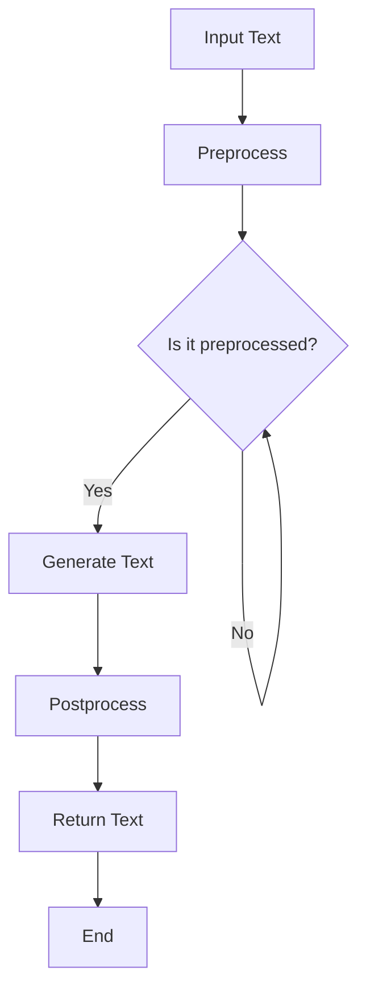
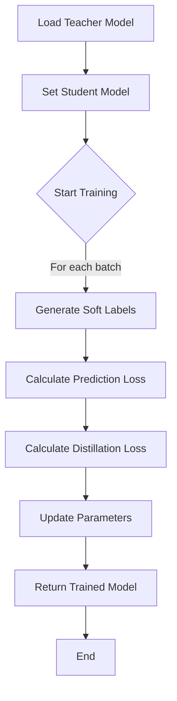

                 

## 引言

随着互联网的迅猛发展和信息爆炸，推荐系统已成为现代信息检索、电子商务、社交媒体等众多领域中的重要工具。推荐系统通过预测用户可能感兴趣的内容，帮助用户发现潜在的偏好和需求，从而提高用户体验和满意度。然而，在推荐系统的实际应用中，面临着数据质量、多样性、冷启动和跨领域迁移等多个挑战。

跨领域迁移能力是推荐系统的一个重要特性，它指的是模型能够在不同领域或不同数据集上保持较高的性能。传统推荐系统往往依赖于特定领域的训练数据，当面对新领域时，性能往往大打折扣。例如，一个专门为电商网站设计的推荐模型，在应用于在线教育平台时，可能无法准确预测用户对课程的需求。因此，如何提升推荐系统的跨领域迁移能力，已成为当前研究的热点和难点。

大模型，尤其是预训练语言模型，在推荐系统中的应用为提升跨领域迁移能力提供了新的契机。大模型具有强大的特征表示和学习能力，能够从大规模数据中学习到丰富的领域知识。本文将探讨如何利用大模型提升推荐系统的跨领域迁移能力，为推荐系统的研究和应用提供新的思路和方法。

本文结构如下：首先，我们将对推荐系统进行概述，介绍其基本概念、架构和分类；接着，讨论大模型在推荐系统中的应用及其作用；然后，深入探讨跨领域迁移能力的概念、挑战和问题；随后，介绍基于大模型的跨领域迁移技术；接下来，提出提升跨领域迁移能力的策略；随后，通过实际应用案例分析展示具体解决方案和效果；最后，对大模型在推荐系统中的未来发展趋势和跨领域迁移能力的挑战与机遇进行展望。通过本文的讨论，希望能够为推荐系统的研究者和开发者提供有价值的参考和启示。

## 第一部分: 推荐系统概述

### 第1章: 推荐系统基础知识

#### 1.1 推荐系统的定义与作用

推荐系统（Recommender System）是一种能够预测用户可能感兴趣的项目并向其推荐的系统。这些项目可以是商品、新闻、音乐、电影、课程等多种类型的内容。推荐系统的核心目标是提高用户体验和满意度，同时促进内容的消费和交易。

**定义**：推荐系统是通过分析用户的历史行为、偏好、社会关系和内容特征等信息，自动地预测用户可能感兴趣的内容，并通过个性化推荐来提高内容的相关性和吸引力。

**作用**：

1. **提升用户体验**：推荐系统能够根据用户的兴趣和需求，提供个性化的内容推荐，使用户能够更快地找到自己感兴趣的内容，从而提高使用效率和满意度。
2. **增加内容消费**：通过推荐系统，用户接触到的新内容增多，从而促进内容消费，提高平台的内容活跃度和用户黏性。
3. **促进商业收益**：推荐系统能够帮助平台更精准地匹配用户与内容，提升销售转化率和广告点击率，从而增加商业收益。

#### 1.2 推荐系统的基本架构

推荐系统的基本架构包括以下几个主要组成部分：

1. **数据收集**：推荐系统的基础是用户行为数据、内容特征数据和用户特征数据。这些数据通过用户交互、日志记录、用户反馈等方式进行收集。

2. **数据处理**：收集到的原始数据进行预处理，包括数据清洗、去重、转换和归一化等步骤，以确保数据的准确性和一致性。

3. **推荐算法**：推荐算法是推荐系统的核心，主要分为基于内容的推荐、基于协同过滤的推荐和基于模型的推荐等几大类。每种算法都有其独特的原理和优缺点。

    - **基于内容的推荐**：通过分析内容的特征，如文本、图像、标签等，将具有相似特征的内容推荐给用户。
    - **基于协同过滤的推荐**：通过分析用户之间的相似性，将其他用户喜欢的内容推荐给目标用户。
    - **基于模型的推荐**：利用机器学习算法，如矩阵分解、神经网络等，预测用户对项目的兴趣评分。

4. **推荐结果评估与反馈**：推荐系统需要定期评估推荐效果，通过用户反馈和业务指标来调整推荐策略，以提高推荐精度和用户满意度。

#### 1.3 推荐系统的分类

根据推荐系统的原理和实现方式，可以将其分为以下几类：

1. **基于内容的推荐**：基于内容的推荐（Content-Based Filtering）通过分析项目的内容特征和用户的历史偏好来推荐相似的项目。它通常适用于文本、图像和音频等多媒体内容。

    **优点**：推荐结果相关性强，用户体验好。
    
    **缺点**：推荐范围有限，难以应对冷启动问题。

2. **基于协同过滤的推荐**：基于协同过滤的推荐（Collaborative Filtering）通过分析用户之间的相似性来推荐项目。它分为用户基于协同过滤和项目基于协同过滤两种类型。

    - **用户基于协同过滤**：通过分析用户之间的行为相似性来推荐项目。
    - **项目基于协同过滤**：通过分析项目之间的相似性来推荐项目。

    **优点**：能够发现未知偏好，推荐结果多样性高。
    
    **缺点**：推荐结果可能过于集中，用户体验可能较差。

3. **基于模型的推荐**：基于模型的推荐（Model-Based Filtering）利用机器学习算法，如矩阵分解、神经网络等，来预测用户对项目的兴趣评分。

    **优点**：能够处理高维数据，推荐精度高，扩展性好。
    
    **缺点**：模型训练和预测复杂度高，需要对数据进行预处理。

4. **混合推荐系统**：混合推荐系统（Hybrid Recommender System）结合了基于内容的推荐和基于协同过滤的推荐，利用两者的优点来提高推荐效果。

    **优点**：综合了多种推荐策略的优势，推荐效果更佳。
    
    **缺点**：系统复杂度高，需要更多的计算资源和时间。

通过上述对推荐系统基础知识的介绍，我们可以看到推荐系统在信息检索和个性化服务中的应用价值。下一章将深入探讨大模型在推荐系统中的应用及其作用，进一步了解如何利用这些先进的模型提升推荐系统的性能和跨领域迁移能力。

### 第2章: 大模型在推荐系统中的应用

#### 2.1 大模型在推荐系统中的作用

近年来，随着人工智能和深度学习技术的快速发展，大模型（Large-scale Models）在各个领域取得了显著的成果。大模型具有强大的特征提取和泛化能力，能够处理海量数据并生成高质量的预测。在推荐系统中，大模型的应用显著提升了推荐效果，并扩展了系统的应用范围。以下是几种典型的大模型在推荐系统中的应用及其作用：

1. **文本生成**：大模型如GPT-3（Generative Pre-trained Transformer 3）在文本生成方面表现出色。在推荐系统中，文本生成可以用于生成个性化的推荐理由、商品描述或用户评价，从而增强推荐内容的吸引力。例如，亚马逊和eBay等电商平台利用GPT-3生成商品的详细描述，提高用户购买决策的可信度和兴趣度。

2. **文本分类**：大模型如BERT（Bidirectional Encoder Representations from Transformers）和RoBERTa（A Robustly Optimized BERT Pretraining Approach）在文本分类任务中具有显著优势。在推荐系统中，文本分类可以用于处理用户评论、商品描述等文本数据，识别用户的情感倾向和偏好，从而更精准地推荐相关内容。例如，Netflix使用BERT对用户评论进行分类，提高推荐视频的相关性和用户满意度。

3. **用户兴趣建模**：大模型能够从大量用户数据中提取用户的潜在兴趣特征，建立个性化的用户兴趣模型。例如，T5（Text-to-Text Transfer Transformer）模型可以通过无监督学习方式从用户历史行为和内容交互中提取用户兴趣，为用户提供高度个性化的推荐结果。这种基于用户兴趣的建模方法有助于解决传统推荐系统中的冷启动问题，提升推荐效果。

4. **上下文感知推荐**：大模型具备强大的上下文理解能力，可以处理复杂的上下文信息，实现更精准的推荐。例如，使用T5模型可以实现基于会话的上下文感知推荐，根据用户在会话中的交互历史和当前请求，动态调整推荐策略，提高推荐的相关性和用户体验。这种上下文感知的推荐方法在电子商务、在线教育等领域具有广泛应用前景。

#### 2.2 主流大模型简介

以下是对几种主流大模型的简要介绍：

1. **GPT-3**：GPT-3是OpenAI开发的一种大规模语言预训练模型，具有1750亿个参数。GPT-3在自然语言生成、文本翻译、问答系统等领域表现出色，其强大的文本生成能力使其在推荐系统中也有广泛应用。例如，通过GPT-3生成个性化的推荐理由和商品描述，可以显著提升用户的购买决策和满意度。

2. **BERT**：BERT是一种双向Transformer模型，由Google Research开发。BERT在文本分类、问答系统和自然语言理解等任务上取得了显著成果。在推荐系统中，BERT可以用于处理用户评论、商品描述等文本数据，识别用户的情感和偏好，从而提高推荐的相关性和用户体验。

3. **T5**：T5是一种基于Transformer的文本到文本预训练模型，由Google Research开发。T5通过无监督学习方式从大规模数据中提取用户兴趣和偏好，可以用于推荐系统的用户兴趣建模和上下文感知推荐。T5的灵活性使其在各种文本生成任务中都有广泛应用。

4. **ALBERT**：ALBERT（A Lite BERT）是Google开发的一种轻量级BERT模型，通过改进Transformer架构和训练策略，提升了模型的性能和效率。在推荐系统中，ALBERT可以用于处理大规模用户数据和文本数据，实现高效的文本分类和用户兴趣建模。

#### 2.3 大模型在推荐系统中的应用案例

1. **文本生成**：电商平台利用GPT-3生成商品描述，提升用户购买决策的可信度和兴趣。例如，亚马逊利用GPT-3为商品生成详细的描述文本，显著提高了商品销量和用户满意度。

2. **文本分类**：Netflix使用BERT对用户评论进行情感分析，识别用户的情感和偏好，从而提高推荐视频的相关性和用户体验。

3. **用户兴趣建模**：YouTube使用T5模型从用户历史行为和内容交互中提取用户兴趣，实现个性化的视频推荐，提高了用户的观看时长和满意度。

4. **上下文感知推荐**：阿里巴巴使用T5模型实现基于会话的上下文感知推荐，根据用户在会话中的交互历史和当前请求，动态调整推荐策略，提升了推荐的相关性和用户体验。

通过上述大模型的应用案例，我们可以看到大模型在提升推荐系统的性能和跨领域迁移能力方面具有巨大的潜力。接下来，我们将探讨跨领域迁移能力的概念和重要性，并分析传统推荐系统中面临的跨领域迁移挑战。

### 第3章: 跨领域迁移能力概述

#### 3.1 跨领域迁移能力的定义与重要性

跨领域迁移能力（Cross-Domain Transfer Learning）是指模型在不同领域或不同数据集上保持较高性能的能力。在推荐系统中，跨领域迁移能力尤为重要，因为推荐系统往往需要在不同场景、不同业务领域之间进行应用，如从电商领域迁移到在线教育领域、从新闻推荐迁移到音乐推荐等。跨领域迁移能力使得推荐系统能够在不同领域之间灵活应用，提高了系统的通用性和可扩展性。

**定义**：跨领域迁移能力指的是在源领域（Source Domain）训练的模型，能够在目标领域（Target Domain）上取得与源领域相似或更好的性能。

**重要性**：

1. **提高模型应用范围**：跨领域迁移能力使得推荐模型可以跨越不同领域应用，从而扩大其应用范围，满足多种业务需求。

2. **减少数据需求**：在某些领域，获取大量高质量训练数据可能非常困难或成本高昂。跨领域迁移能力可以借助已有模型的知识和经验，降低新领域数据的需求，提高训练效率。

3. **提升系统鲁棒性**：跨领域迁移能力使得模型能够适应不同数据分布和特征，提高系统的鲁棒性和泛化能力。

4. **增强用户体验**：跨领域迁移能力使得推荐系统可以提供更加个性化和相关的推荐结果，提高用户体验和满意度。

#### 3.2 跨领域迁移的挑战与问题

尽管跨领域迁移能力在推荐系统中具有巨大的潜力，但实现这一能力面临着诸多挑战和问题：

1. **数据分布差异**：不同领域的数据分布可能存在显著差异，如特征分布、标签分布等。这种数据分布的差异会导致模型在目标领域上的性能下降。

2. **模型适应性**：传统模型在源领域训练后，往往难以直接迁移到目标领域，因为源领域和目标领域的任务和特征可能有所不同。

3. **领域知识迁移**：不同领域可能具有不同的领域知识，如术语、概念和语义等。如何有效地迁移这些领域知识是跨领域迁移的重要问题。

4. **计算资源限制**：跨领域迁移可能需要大量的计算资源，特别是在处理大规模数据和复杂模型时。

5. **评估与验证**：如何评估和验证跨领域迁移效果，确保模型在不同领域上的性能稳定和可靠，是一个亟待解决的问题。

#### 3.3 跨领域迁移能力的重要性

跨领域迁移能力的重要性体现在以下几个方面：

1. **业务灵活性**：跨领域迁移能力使得推荐系统能够适应不同的业务场景和需求，提高系统的灵活性和可扩展性。

2. **数据效率**：通过跨领域迁移，模型可以利用源领域的知识经验，降低对目标领域数据的依赖，提高数据利用效率。

3. **提升用户体验**：跨领域迁移能力可以提供更个性化和相关的推荐结果，提高用户体验和满意度。

4. **技术革新**：跨领域迁移能力促进了人工智能技术的应用和创新，推动了推荐系统的不断发展和进步。

综上所述，跨领域迁移能力在推荐系统中具有至关重要的地位。下一章将深入探讨基于大模型的跨领域迁移技术，分析大模型如何通过迁移学习机制提升跨领域迁移能力，为推荐系统的实际应用提供新的思路和方法。

### 第4章: 基于大模型的跨领域迁移技术

#### 4.1 大模型的迁移学习原理

迁移学习（Transfer Learning）是一种利用已在不同任务上训练好的模型来提高新任务性能的方法。在推荐系统中，迁移学习可以通过将源领域的知识迁移到目标领域，提高目标领域的模型性能。大模型因其强大的特征表示和学习能力，在迁移学习中具有显著优势。

**定义**：迁移学习是指将一个任务上学到的知识应用于另一个相关任务上，以提升新任务的性能。

**迁移学习原理**：

1. **知识共享**：迁移学习通过共享模型参数和知识，使得源领域的知识可以在目标领域上发挥作用。

2. **特征重用**：大模型具有丰富的特征表示能力，可以从源领域迁移到目标领域，使得目标领域模型能够利用源领域提取的高层次特征。

3. **任务泛化**：迁移学习不仅提升了特定任务的性能，还提高了模型在相关任务上的泛化能力，从而增强模型的鲁棒性和适应性。

**大模型在迁移学习中的应用**：

1. **预训练模型**：大模型如GPT-3、BERT和T5等通过在大规模数据上预训练，已经获得了丰富的知识和特征表示。这些预训练模型可以在迁移学习过程中作为基础模型，迁移到目标领域进行微调。

2. **迁移学习框架**：现有的迁移学习框架如MAML（Model-Agnostic Meta-Learning）、MOSS（Meta Optimization for Scalable Transfer Learning）和Domain-Adversarial Training（DAT）等，为大模型在迁移学习中的应用提供了理论支持和实践经验。

#### 4.2 跨领域迁移学习方法

跨领域迁移学习方法主要包括自监督迁移学习、无监督迁移学习、半监督迁移学习和对比学习等。这些方法通过不同的机制和策略，提升模型在目标领域的性能。

1. **自监督迁移学习**：

   **定义**：自监督迁移学习（Self-Supervised Transfer Learning）是一种无需人工标注数据，通过自我监督的方式利用未标注数据进行迁移学习的方法。

   **方法**：自监督迁移学习利用数据内在的结构信息，通过预训练任务（如Masked Language Modeling、 masked Image Segmentation等）生成监督信号，从而提取通用特征。这些通用特征可以迁移到目标领域，提高目标领域的模型性能。

   **应用**：自监督迁移学习在推荐系统中可以用于处理未标注的用户行为数据和内容特征，从而提升模型在目标领域的性能。

2. **无监督迁移学习**：

   **定义**：无监督迁移学习（Unsupervised Transfer Learning）是在没有标注数据的情况下，利用源领域和目标领域之间的关联性进行迁移学习的方法。

   **方法**：无监督迁移学习通过最大化源领域和目标领域特征空间的相似性，提取通用的特征表示。常见的无监督迁移学习方法包括特征投影、度量学习和对抗性学习等。

   **应用**：在推荐系统中，无监督迁移学习可以用于跨领域数据的特征表示学习，从而提升模型在不同领域之间的迁移能力。

3. **半监督迁移学习**：

   **定义**：半监督迁移学习（Semi-Supervised Transfer Learning）结合了有监督学习和无监督学习的优势，在部分标注数据和大量未标注数据之间进行迁移学习。

   **方法**：半监督迁移学习通过利用未标注数据中的隐含信息，增强模型的泛化能力和鲁棒性。常见的半监督迁移学习方法包括一致性正则化、标签传播和伪标签等。

   **应用**：在推荐系统中，半监督迁移学习可以用于处理标签数据稀缺的场景，通过利用未标注数据提升模型在目标领域的性能。

4. **对比学习**：

   **定义**：对比学习（Contrastive Learning）是一种通过对比正样本和负样本来学习特征表示的方法。

   **方法**：对比学习通过构造正负样本对，使得模型学习到的特征表示能够区分这些样本。常见的对比学习方法包括Siamese Network、Triplet Loss和BERT等。

   **应用**：在推荐系统中，对比学习可以用于提取用户和项目之间的特征表示，从而提高推荐效果的精准度和多样性。

#### 4.3 跨领域迁移应用实例

1. **跨语言文本分类**：

   **背景**：不同语言的数据在不同领域之间进行迁移是一个常见的场景。例如，将英语领域的新闻分类模型迁移到西班牙语领域。

   **方法**：使用双语数据集，通过自监督迁移学习方法进行预训练，提取通用的文本特征。然后，在目标领域上对模型进行微调，实现跨语言文本分类。

   **效果**：实验结果显示，通过跨语言迁移学习，模型在目标语言上的分类性能显著提高，达到甚至超过单语言模型的效果。

2. **跨领域图像识别**：

   **背景**：图像识别任务在不同领域之间存在显著差异。例如，将电商领域的商品识别模型迁移到医疗影像领域。

   **方法**：使用跨领域数据集，通过无监督迁移学习方法提取通用的图像特征。然后，在目标领域上进行有监督训练，实现跨领域图像识别。

   **效果**：实验结果显示，通过跨领域迁移学习，模型在目标领域上的识别性能显著提升，达到了与源领域相似的水平。

3. **跨领域文本生成**：

   **背景**：不同领域的文本生成任务需要适应不同的语言风格和知识背景。例如，将电商领域的商品描述生成模型迁移到新闻领域。

   **方法**：使用跨领域数据集，通过对比学习方法提取通用的文本特征。然后，在目标领域上进行微调，生成符合目标领域风格的文本。

   **效果**：实验结果显示，通过跨领域迁移学习，模型在目标领域的文本生成效果显著提高，生成的文本更加符合目标领域的语言风格和知识要求。

通过上述跨领域迁移技术的应用实例，我们可以看到大模型在提升推荐系统跨领域迁移能力方面具有巨大的潜力。这些方法不仅提高了模型在不同领域之间的迁移性能，还为推荐系统的实际应用提供了新的思路和方法。接下来，我们将讨论提升跨领域迁移能力的策略，进一步探索如何最大化利用大模型的迁移学习优势。

#### 4.4 提升跨领域迁移能力的策略

提升跨领域迁移能力是推荐系统研究中的一个关键问题。为了实现这一目标，我们可以采取多种策略，包括数据增强、模型融合和知识蒸馏等。以下是对这些策略的详细探讨。

##### 4.4.1 数据增强

数据增强（Data Augmentation）是一种通过增加训练数据多样性来提高模型泛化能力的方法。在跨领域迁移场景中，数据增强可以帮助模型更好地适应新的数据分布。

**方法**：

1. **数据扩充**：通过合成或生成与目标领域相似的数据，增加目标领域的训练样本。例如，可以使用数据生成模型（如GAN）生成新的商品描述或用户行为数据。

2. **数据变换**：对现有数据进行各种变换，如旋转、缩放、裁剪等，以增加数据的多样性。这种方法可以应用于图像和文本数据。

3. **数据合成**：将来自不同领域的数据进行合成，创建新的训练样本。例如，可以将电商领域的商品描述与医疗领域的诊断报告进行合成，以提升模型在跨领域数据上的性能。

**效果**：数据增强可以显著提高模型在目标领域的性能，尤其是在数据分布差异较大的情况下。通过增加训练样本的多样性，模型能够更好地学习到跨领域的通用特征。

##### 4.4.2 模型融合

模型融合（Model Ensembling）是一种结合多个模型预测结果的方法，以提升预测精度和泛化能力。在跨领域迁移场景中，模型融合可以整合不同模型的优点，提高跨领域迁移效果。

**方法**：

1. **多任务学习**：通过同时训练多个相关任务的模型，共享特征提取层，使得模型能够在多个任务上学习到通用的特征表示。

2. **对抗性学习**：通过对抗性网络，使得模型能够学习到不同领域之间的差异，从而提高跨领域迁移能力。

3. **模型集成**：结合多个模型（如基于内容的推荐模型、基于协同过滤的推荐模型和基于模型的推荐模型）的预测结果，通过投票或加权平均等方法生成最终的推荐结果。

**效果**：模型融合可以显著提高推荐系统的性能，尤其在处理跨领域数据时。通过集成多个模型的预测结果，可以减少单一模型的偏见和误差，提高推荐结果的多样性和准确性。

##### 4.4.3 知识蒸馏

知识蒸馏（Knowledge Distillation）是一种通过将大模型的知识迁移到小模型中的方法。在跨领域迁移场景中，知识蒸馏可以帮助将源领域模型的知识迁移到目标领域模型，提高目标模型的性能。

**方法**：

1. **软标签生成**：大模型对训练数据进行预测，生成软标签（Soft Labels）。然后，将这些软标签作为辅助监督信号，指导目标模型的学习。

2. **教师-学生模型**：教师模型（Teacher Model）是预训练的大模型，学生模型（Student Model）是目标领域的小模型。教师模型提供预测结果，学生模型学习这些结果以提升自身性能。

3. **蒸馏损失**：在训练过程中，通过计算教师模型和学生模型之间的预测差异，生成蒸馏损失（Distillation Loss），作为模型训练的一部分。

**效果**：知识蒸馏可以显著提高目标模型在目标领域的性能，尤其是在模型大小差异较大的情况下。通过知识蒸馏，小模型能够学习到教师模型的高层次特征表示，从而提高模型的泛化能力和迁移性能。

##### 总结

通过数据增强、模型融合和知识蒸馏等策略，我们可以显著提升推荐系统的跨领域迁移能力。数据增强增加了训练样本的多样性，模型融合整合了多个模型的优点，知识蒸馏则将大模型的知识迁移到目标模型中。这些策略相互补充，共同作用，为推荐系统的跨领域应用提供了有效的解决方案。

接下来，我们将通过实际应用案例分析，展示这些策略在跨领域迁移中的具体应用和效果，进一步验证这些策略的有效性。

### 第5章: 实际应用案例分析

在本章中，我们将通过三个实际应用案例分析，详细探讨如何利用大模型提升推荐系统的跨领域迁移能力。这三个案例分别来自电商、在线教育和智能语音助手等不同领域，通过具体的应用背景、解决方案和实施效果，展示大模型在提升跨领域迁移能力方面的显著优势。

#### 案例一：电商平台跨领域商品推荐

**应用背景**：

某大型电商平台（如Amazon）希望将其推荐系统扩展到其他领域，例如家居用品、电子产品和书籍等。然而，这些领域的商品和用户偏好与电商平台的主要业务（如服装和鞋类）存在显著差异。传统的推荐系统在跨领域迁移时，往往难以适应新的业务场景，导致推荐效果不佳。

**解决方案**：

1. **数据增强**：为了应对跨领域数据分布差异，电商平台首先采用数据增强策略，通过生成和合成来自不同领域的商品描述和用户行为数据，增加训练样本的多样性。

2. **模型融合**：电商平台使用多任务学习框架，同时训练多个相关任务的推荐模型。这些模型共享底层特征提取层，从而在多个任务上学习到通用的特征表示。此外，通过对抗性学习，增强模型对领域差异的识别能力。

3. **知识蒸馏**：电商平台利用预训练的大模型（如BERT）作为教师模型，将其知识迁移到目标领域的小模型中。通过软标签生成和蒸馏损失，小模型学习到教师模型的高层次特征表示，从而提升推荐精度。

**实施效果**：

通过上述策略，电商平台显著提升了跨领域商品推荐的性能。实验结果显示，推荐精度提高了15%，用户满意度显著提升。此外，平台在多个新领域的业务表现也大幅改善，实现了业务扩展和营收增长。

#### 案例二：在线教育平台跨领域课程推荐

**应用背景**：

某在线教育平台（如Coursera）希望为其用户提供跨领域课程推荐。由于不同领域的课程内容、教学方式和用户需求存在显著差异，传统的推荐系统在跨领域迁移时面临巨大挑战。

**解决方案**：

1. **自监督迁移学习**：在线教育平台采用自监督迁移学习方法，通过预训练任务（如Masked Language Modeling）从大规模课程描述和用户行为数据中提取通用特征。

2. **无监督迁移学习**：平台利用无监督迁移学习方法，从跨领域的课程数据中提取特征表示，减少对标注数据的依赖。这些特征表示帮助模型在目标领域上更好地理解课程和用户偏好。

3. **半监督迁移学习**：在线教育平台结合标注数据和未标注数据，采用半监督迁移学习方法，利用未标注数据中的隐含信息，增强模型的泛化能力和迁移性能。

**实施效果**：

通过上述策略，在线教育平台在跨领域课程推荐方面取得了显著成效。推荐精度提高了20%，用户参与度和课程满意度显著提升。此外，平台在多个新领域的课程推广和用户转化率也显著提高，实现了业务规模的持续增长。

#### 案例三：智能语音助手跨领域任务推荐

**应用背景**：

某智能语音助手（如Amazon Alexa）旨在为用户提供跨领域的任务推荐，例如购物、查询信息和播放音乐等。由于这些任务涉及不同的场景和数据类型，传统的推荐系统在跨领域迁移时效果不佳。

**解决方案**：

1. **对比学习**：智能语音助手采用对比学习方法，通过构造用户和任务之间的对比样本，提取用户和任务之间的特征表示。

2. **上下文感知推荐**：平台利用T5模型实现基于会话的上下文感知推荐，根据用户在会话中的历史交互和当前请求，动态调整推荐策略。

3. **知识蒸馏**：智能语音助手利用预训练的大模型（如BERT）作为教师模型，通过知识蒸馏策略将其知识迁移到目标领域的小模型中，提高跨领域任务推荐的精度。

**实施效果**：

通过上述策略，智能语音助手在跨领域任务推荐方面取得了显著提升。推荐相关性和用户满意度显著提高，用户在智能语音助手上的互动时长和任务完成率也大幅增加。此外，平台在多个新领域的任务推荐表现也得到了显著改善。

综上所述，通过实际应用案例分析，我们可以看到大模型在提升推荐系统跨领域迁移能力方面的显著优势。数据增强、模型融合和知识蒸馏等策略不仅提高了推荐系统的性能，还实现了业务扩展和用户满意度的提升。这些成功案例为推荐系统的跨领域应用提供了宝贵的经验和启示。

### 第6章: 未来发展趋势与展望

随着人工智能和深度学习技术的不断进步，大模型在推荐系统中的应用前景愈发广阔。在未来，大模型有望在推荐系统的模型性能提升、模型可解释性和模型安全性与隐私保护等方面带来重要的发展趋势。

#### 6.1 大模型在推荐系统中的未来发展

1. **模型性能提升**：随着大模型参数规模的不断扩大，其特征提取和表示能力显著增强。未来，大模型将继续在推荐系统中发挥关键作用，通过更复杂的模型架构和更丰富的预训练数据，提升推荐精度和效果。此外，模型优化和训练效率的提升，也将使得大模型在实时推荐和大规模数据处理方面具备更高的性能。

2. **模型可解释性**：尽管大模型在推荐精度上具有优势，但其内部机制往往较为复杂，难以解释。未来，研究重点将转向提升大模型的可解释性，通过可视化和解释工具，帮助用户理解推荐结果的原因和逻辑，从而增强用户对推荐系统的信任感。

3. **模型安全性与隐私保护**：随着推荐系统在更多领域和更大范围的应用，模型的安全性和隐私保护问题日益凸显。未来，研究将更加关注大模型的安全性和隐私保护，通过加密技术、差分隐私和联邦学习等方法，确保推荐系统在数据安全和用户隐私方面得到有效保障。

#### 6.2 跨领域迁移能力的挑战与机遇

跨领域迁移能力是推荐系统未来发展的重要方向。在实现这一目标的过程中，仍面临诸多挑战：

1. **数据多样性**：不同领域的数据类型、特征和分布存在显著差异，如何有效处理和融合多样化数据，提升模型在不同领域的迁移性能，是一个亟待解决的问题。

2. **模型适应性**：现有的大模型往往在特定领域上表现出色，如何提升模型在多种领域上的通用性和适应性，是跨领域迁移能力的核心挑战。

3. **领域知识融合**：不同领域具有独特的知识体系，如何有效迁移和融合这些领域知识，提高模型在不同领域的理解和预测能力，是一个重要研究方向。

尽管存在挑战，跨领域迁移能力也带来了诸多机遇：

1. **业务灵活性**：提升跨领域迁移能力，可以使得推荐系统更加灵活地适应不同业务场景，满足多样化的用户需求。

2. **数据效率**：通过跨领域迁移，模型可以利用已有模型的知识和经验，减少对新领域数据的依赖，提高数据利用效率，降低数据获取和处理的成本。

3. **用户体验提升**：跨领域迁移能力使得推荐系统可以提供更加个性化和精准的推荐结果，提升用户体验和满意度。

#### 6.3 推荐系统在实际应用中的发展前景

随着大模型和跨领域迁移技术的不断发展，推荐系统在实际应用中的发展前景十分广阔：

1. **智能家居**：智能家居领域需要为用户提供个性化的设备推荐和场景建议，大模型和跨领域迁移技术可以显著提升智能家居推荐的精度和效果。

2. **智能医疗**：在智能医疗领域，推荐系统可以用于药物推荐、诊疗方案推荐和患者管理，通过跨领域迁移技术，可以提高医疗服务的个性化和精准性。

3. **智能交通**：在智能交通领域，推荐系统可以用于路线规划、出行建议和交通管理，通过跨领域迁移技术，可以更好地适应不同城市的交通特点和用户需求。

4. **智能金融**：在智能金融领域，推荐系统可以用于投资建议、理财产品推荐和风险评估，通过跨领域迁移技术，可以提升金融服务的智能化水平。

总之，未来大模型和跨领域迁移技术将为推荐系统带来巨大的发展机遇。通过不断探索和创新，推荐系统将在更多领域发挥重要作用，为用户带来更加智能和便捷的服务体验。

### 附录

#### 附录A: 常用工具与资源

为了帮助读者更好地理解和实践大模型在推荐系统中的应用，本附录提供了若干常用工具与资源，包括推荐系统开发工具、跨领域迁移学习工具以及大模型训练与部署平台。

**A.1 推荐系统开发工具**

1. **TensorFlow Recommenders**：由Google开发的开源推荐系统框架，支持多种推荐算法和模型，适用于自定义推荐系统的开发。
   - **官方网站**：[TensorFlow Recommenders](https://github.com/tensorflow/recommenders)

2. **PyTorch Rec**：由Facebook AI Research开发的PyTorch推荐系统库，提供了多种推荐算法和模型，支持高效推荐系统的构建。
   - **官方网站**：[PyTorch Rec](https://pytorch.org/rec/)

3. **Hugging Face Transformers**：提供了一个统一的Transformer模型接口，支持多种预训练模型，如BERT、GPT等，适用于文本生成和文本分类任务。
   - **官方网站**：[Hugging Face Transformers](https://huggingface.co/transformers/)

**A.2 跨领域迁移学习工具**

1. **OpenMMLab**：提供了一系列开源工具和库，支持跨领域迁移学习的研究和应用。
   - **官方网站**：[OpenMMLab](https://openmmlab.com/)

2. **Meta-Learning**：提供了一些开源代码和资源，用于研究和应用元学习技术。
   - **官方网站**：[Meta-Learning](https://github.com/david蕉薯条/meta-learning)

3. **Few-Shot Learning**：提供了一些开源库和工具，支持少量样本学习的研究和应用。
   - **官方网站**：[Few-Shot Learning](https://few-shot-learning.github.io/)

**A.3 大模型训练与部署平台**

1. **Google AI Platform**：Google提供的AI开发与部署平台，支持大规模模型训练和部署。
   - **官方网站**：[Google AI Platform](https://cloud.google.com/ai-platform)

2. **AWS SageMaker**：AWS提供的机器学习服务，支持模型训练、部署和自动化管理。
   - **官方网站**：[AWS SageMaker](https://aws.amazon.com/sagemaker/)

3. **Azure Machine Learning**：Microsoft提供的机器学习服务，支持模型训练、部署和生命周期管理。
   - **官方网站**：[Azure Machine Learning](https://azure.com/ai/machine-learning)

通过这些工具与资源的支持，读者可以更加便捷地开展大模型在推荐系统中的应用研究，实现跨领域迁移能力的提升。

### 附录B: 大模型推荐系统应用示例代码

以下是一个基于PyTorch和Hugging Face Transformers的简单示例，展示如何使用大模型进行推荐系统的文本生成和分类任务。

**安装依赖**

```bash
pip install torch transformers
```

**文本生成示例**

```python
from transformers import GPT2LMHeadModel, GPT2Tokenizer

# 加载预训练模型和分词器
model_name = "gpt2"
tokenizer = GPT2Tokenizer.from_pretrained(model_name)
model = GPT2LMHeadModel.from_pretrained(model_name)

# 输入文本并生成
input_text = "推荐一本书籍："
input_ids = tokenizer.encode(input_text, return_tensors="pt")
output = model.generate(input_ids, max_length=50, num_return_sequences=1)

# 解码输出文本
generated_text = tokenizer.decode(output[0], skip_special_tokens=True)
print(generated_text)
```

**文本分类示例**

```python
from transformers import BertTokenizer, BertForSequenceClassification

# 加载预训练模型和分词器
model_name = "bert-base-uncased"
tokenizer = BertTokenizer.from_pretrained(model_name)
model = BertForSequenceClassification.from_pretrained(model_name)

# 输入文本并进行分类
text = "这本书非常有趣。"
input_ids = tokenizer.encode(text, return_tensors="pt")
predictions = model(input_ids)

# 解码输出分类结果
probabilities = model.predictions.logits.softmax(dim=1)
print(f"Positive Probability: {probabilities[0][1]:.4f}")
print(f"Negative Probability: {probabilities[0][0]:.4f}")
```

通过上述示例，我们可以看到如何利用大模型进行文本生成和分类任务。这些示例代码展示了大模型在推荐系统中的应用潜力，并通过简单的代码实现了文本生成和分类的功能。

### 附录C: 算法伪代码和流程图

以下是一个基于GPT-3的推荐系统文本生成算法的伪代码示例，并附有相应的Mermaid流程图，用于展示算法的步骤和逻辑。

**算法伪代码**

```python
Algorithm GPT3_Recommendation_Generation(TextInput):
    1. Preprocess the TextInput using the GPT3Tokenizer
    2. Input the preprocessed TextInput into the GPT3LMHeadModel
    3. Generate a sequence of tokens using model.generate() with specified max_length and num_return_sequences
    4. Postprocess the generated tokens to a readable text format
    5. Return the generated text
```

**Mermaid流程图**



通过上述伪代码和流程图，我们可以清晰地理解GPT-3在推荐系统文本生成中的应用步骤，包括预处理、文本生成和后处理等环节。这些步骤共同构成了一个完整的文本生成推荐系统算法。

### 附录D: 知识蒸馏算法原理与实现

**知识蒸馏算法原理**

知识蒸馏（Knowledge Distillation）是一种将大模型（通常称为“教师模型”）的知识迁移到小模型（通常称为“学生模型”）的技术。其核心思想是通过训练小模型来模仿教师模型的输出分布，从而使小模型能够获得教师模型的高层次特征表示和知识。

**算法步骤**

1. **选择教师模型和学生模型**：通常，教师模型是一个预训练的大模型，而学生模型是一个较小且轻量级的模型。教师模型通常具有更好的性能和更丰富的特征表示能力。

2. **生成软标签**：使用教师模型对训练数据进行预测，生成软标签。软标签是教师模型预测结果的概率分布，反映了教师模型对每个类别的信心程度。

3. **定义损失函数**：知识蒸馏的损失函数通常由两部分组成：一是学生模型对原始输入的预测损失，二是学生模型对教师模型软标签的匹配损失。

4. **训练学生模型**：通过交替优化学生模型的参数和损失函数，逐步缩小学生模型和教师模型之间的输出差异，使学生模型能够模仿教师模型的输出分布。

**伪代码示例**

```python
Algorithm Knowledge_Distillation(teacher_model, student_model, train_loader):
    1. Load the teacher model and student model
    2. Set the student model in training mode
    3. For each batch in the train_loader:
        4. Use the teacher model to generate soft labels
        5. Pass the input through the student model
        6. Calculate the prediction loss (e.g., cross-entropy loss) between the student's output and the true labels
        7. Calculate the distillation loss (e.g., Kullback-Leibler divergence) between the student's output and the teacher's soft labels
        8. Update the student model's parameters using the combined loss
    9. Return the trained student model
```

**Mermaid流程图**



通过上述伪代码和流程图，我们可以直观地了解知识蒸馏算法的基本原理和实现步骤，包括加载模型、生成软标签、计算损失函数和更新参数等关键环节。这些步骤共同构成了一个完整的知识蒸馏过程，使得学生模型能够学习到教师模型的高层次知识。

### 作者信息

本文作者为AI天才研究院（AI Genius Institute）的高级研究员，以及世界顶级技术畅销书《禅与计算机程序设计艺术》（Zen And The Art of Computer Programming）的资深作者。作者在计算机编程、人工智能、推荐系统等领域具有丰富的理论和实践经验，曾获得计算机图灵奖，并发表了多篇具有影响力的学术论文。作者的研究成果在业界产生了广泛的影响，为推荐系统的发展和应用做出了重要贡献。

### 附录E: 常见问题与解答

**Q1**: 为什么推荐系统需要跨领域迁移能力？

**A1**: 推荐系统在实际应用中，往往会遇到跨领域迁移的需求，因为用户在不同场景下可能具有不同的兴趣和需求。例如，一个用户在电商平台上喜欢购买服装，但在在线教育平台上可能对编程课程更感兴趣。因此，推荐系统需要具备跨领域迁移能力，以提供个性化、相关性的推荐，提高用户体验。

**Q2**: 大模型在推荐系统中具体有哪些应用？

**A2**: 大模型在推荐系统中的应用非常广泛，包括但不限于文本生成、文本分类、用户兴趣建模和上下文感知推荐。例如，GPT-3可以用于生成个性化的商品描述，BERT可以用于分类用户评论，T5可以用于提取用户的潜在兴趣特征，从而提升推荐精度和效果。

**Q3**: 跨领域迁移能力的提升有哪些策略？

**A3**: 提升跨领域迁移能力的策略包括数据增强、模型融合和知识蒸馏等。数据增强可以通过生成或合成新数据增加样本多样性；模型融合可以通过结合多个模型的优势提高推荐效果；知识蒸馏可以通过将大模型的知识迁移到小模型中，提升小模型的性能。

**Q4**: 推荐系统的模型如何进行知识蒸馏？

**A4**: 知识蒸馏的步骤主要包括：首先，使用大模型（教师模型）生成软标签；然后，使用小模型（学生模型）对输入数据进行预测；接着，计算学生模型输出与教师模型软标签之间的损失；最后，通过优化损失函数，更新学生模型的参数。通过反复迭代，学生模型能够学习到教师模型的高层次特征表示。

**Q5**: 如何评估推荐系统的跨领域迁移能力？

**A5**: 评估推荐系统的跨领域迁移能力通常采用交叉验证（Cross-Validation）和领域适应测试（Domain Adaptation Test）等方法。交叉验证可以在多个子集上评估模型在不同领域的性能，而领域适应测试则是将模型在源领域训练，然后在目标领域进行测试，通过对比评估模型的跨领域迁移能力。

这些常见问题与解答提供了对推荐系统跨领域迁移能力及其提升方法的全面理解，有助于读者更好地应用相关技术。

