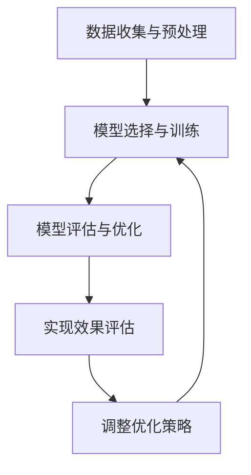

                 

# 《利用迁移学习提升prompt评测效果》

> **关键词**：迁移学习、prompt评测、模型优化、数据增强、模型蒸馏、自监督学习

> **摘要**：本文将探讨如何利用迁移学习技术提升prompt评测的效果。通过介绍迁移学习的基础概念、理论基础和实践应用，分析迁移学习在prompt评测中的优势和挑战，并给出具体的提升方法和实现步骤。文章还通过实际案例展示了迁移学习在prompt评测中的成功应用，最后对未来发展趋势进行了展望。

## 目录大纲

- **第1章：迁移学习概述**
  - **第1.1节：迁移学习的概念与重要性**
  - **第1.2节：迁移学习的挑战与解决策略**
  - **第1.3节：迁移学习的历史发展与未来趋势**

- **第2章：迁移学习的理论基础**
  - **第2.1节：类别无关特征提取**
  - **第2.2节：共同分布假设与模型蒸馏**
  - **第2.3节：对比学习与自监督迁移学习**

- **第3章：迁移学习实践**
  - **第3.1节：迁移学习在不同领域的应用**
  - **第3.2节：迁移学习工具与框架**
  - **第3.3节：迁移学习在prompt评测中的应用**

- **第4章：prompt设计与优化**
  - **第4.1节：prompt的设计原则**
  - **第4.2节：prompt的类型与功能**
  - **第4.3节：prompt优化策略**

- **第5章：迁移学习在prompt评测中的应用**
  - **第5.1节：迁移学习在prompt评测中的优势**
  - **第5.2节：迁移学习在prompt评测中的挑战**
  - **第5.3节：迁移学习在prompt评测中的实践**

- **第6章：基于迁移学习的prompt评测模型**
  - **第6.1节：基于迁移学习的prompt评测模型框架**
  - **第6.2节：基于迁移学习的prompt评测模型实现**
  - **第6.3节：基于迁移学习的prompt评测模型评估**

- **第7章：迁移学习在prompt评测中的实际案例**
  - **第7.1节：文本分类中的迁移学习prompt评测**
  - **第7.2节：情感分析中的迁移学习prompt评测**
  - **第7.3节：机器翻译中的迁移学习prompt评测**

- **第8章：迁移学习提升prompt评测效果的实现**
  - **第8.1节：实现步骤与流程**
  - **第8.2节：数据准备与预处理**
  - **第8.3节：模型选择与训练**
  - **第8.4节：模型评估与优化**

- **第9章：未来展望与挑战**
  - **第9.1节：迁移学习在prompt评测中的潜在方向**
  - **第9.2节：迁移学习在prompt评测中的挑战与解决策略**
  - **第9.3节：迁移学习在prompt评测中的发展趋势**

- **附录**
  - **附录A：迁移学习与prompt评测常用工具和库**
  - **附录B：参考文献与资料链接**
  - **附录C：Mermaid流程图**

## 第1章：迁移学习概述

### 1.1 迁移学习的概念与重要性

**1.1.1 迁移学习的定义**

迁移学习（Transfer Learning）是一种机器学习技术，通过将一个任务（源任务）学到的知识迁移到另一个相关任务（目标任务）中，以减少对大量数据的依赖，并提高模型的泛化能力。在迁移学习中，通常将已经训练好的模型（预训练模型）应用于新的任务，通过少量的额外训练数据对模型进行微调，使其在新任务上达到较高的性能。

迁移学习的基本思想是利用已有知识来加速新任务的学习过程。它通过共享底层特征表示，使得在不同任务中具有相似性的数据能够共享学习的知识，从而避免了从头开始训练模型的繁琐过程。

**1.1.2 迁移学习的重要性**

1. **减少标注成本**：对于许多复杂任务，如自然语言处理、计算机视觉等，标注数据需要耗费大量时间和人力资源。迁移学习可以利用预训练模型，通过微调少量标注数据，实现新任务的学习，从而减少对标注数据的依赖。

2. **提高模型泛化能力**：通过迁移学习，模型可以在不同的任务中共享知识，从而提高其在新的任务上的泛化能力。这使得模型在面对未知数据时能够保持良好的性能。

3. **加快模型训练速度**：迁移学习利用预训练模型，只需对少量数据微调即可，这使得模型训练过程大大加快。

4. **提高模型性能**：预训练模型通常在大规模数据集上训练，具有较好的泛化能力和性能。通过迁移学习，这些优势可以转移到新的任务上，从而提高模型在新任务上的性能。

### 1.1.3 迁移学习的基本原理

迁移学习的基本原理是利用不同任务之间的关联性，通过共享特征表示来提升新任务的学习效果。具体来说，迁移学习包含以下几个关键步骤：

1. **预训练模型**：在通用数据集上训练一个模型，使其具备较强的特征提取能力。

2. **任务定义**：定义一个新的任务，明确任务的目标和输入输出。

3. **模型迁移**：将预训练模型应用于新任务，通过少量数据对其进行微调。

4. **性能评估**：在新任务上评估迁移模型的性能，并进行优化。

### 1.2 迁移学习的挑战与解决策略

尽管迁移学习具有许多优势，但在实际应用中仍面临一些挑战。以下是对这些挑战及其解决策略的分析：

**1.2.1 数据分布差异**

迁移学习的一个关键问题是数据分布差异。源任务和目标任务的数据分布可能存在显著差异，这可能导致迁移学习效果不佳。为了解决这一问题，可以采用以下策略：

1. **数据增强**：通过数据增强技术，增加目标任务的数据多样性，使模型更好地适应不同的数据分布。

2. **联合训练**：在迁移学习过程中，将源任务和目标任务的数据进行联合训练，使模型同时适应两种数据分布。

3. **元学习**：元学习是一种利用先前学习经验来加速新任务学习的方法。通过元学习，模型可以在不同任务之间共享知识，从而减轻数据分布差异的影响。

**1.2.2 零样本学习问题**

零样本学习是迁移学习中的一个重要挑战，即模型在未见过的类别上仍能保持良好的性能。为了解决这一问题，可以采用以下策略：

1. **元学习**：元学习通过利用先前学习经验来加速新任务的学习，有助于提高模型在零样本学习情况下的性能。

2. **知识蒸馏**：知识蒸馏是一种将大量知识从大模型迁移到小模型的方法。通过知识蒸馏，可以将预训练模型的知识迁移到零样本学习模型中，提高其性能。

3. **多任务学习**：多任务学习通过同时学习多个任务，使模型在不同任务之间共享知识，从而提高模型在零样本学习情况下的泛化能力。

### 1.3 迁移学习的历史发展与未来趋势

**1.3.1 迁移学习的历史发展**

迁移学习的历史可以追溯到上世纪80年代，当时主要关注的是知识表示和推理。随着机器学习技术的发展，迁移学习逐渐成为机器学习领域的一个重要研究方向。以下是一些重要的里程碑：

1. **深度学习兴起**：随着深度学习的兴起，迁移学习技术得到了广泛应用。深度学习模型在特征提取方面的优势，使得迁移学习在各个领域取得了显著成果。

2. **预训练模型的出现**：预训练模型的出现，使得迁移学习变得更加高效。通过在大规模数据集上预训练模型，可以在新任务中只需进行少量微调，从而大幅减少训练时间和计算资源。

3. **元学习的引入**：元学习是迁移学习的一个重要分支，通过利用先前学习经验来加速新任务学习，取得了显著成果。

**1.3.2 迁移学习的未来趋势**

随着人工智能技术的不断发展，迁移学习在未来仍将是一个重要研究方向。以下是一些未来趋势：

1. **小样本学习**：随着迁移学习技术的不断发展，小样本学习将成为一个重要研究方向。通过迁移学习，模型可以在仅有少量标注数据的情况下，实现良好的性能。

2. **跨模态学习**：跨模态学习是迁移学习的一个新兴领域，旨在将不同模态的数据进行迁移学习，以实现更好的跨模态任务性能。

3. **自适应迁移学习**：自适应迁移学习是一种根据新任务的特点，动态调整迁移学习策略的方法。在未来，自适应迁移学习有望在迁移学习中发挥更大作用。

4. **迁移学习的安全性**：随着迁移学习的广泛应用，其安全性问题也逐渐引起关注。在未来，研究如何保证迁移学习的安全性将成为一个重要研究方向。

### 总结

迁移学习是一种重要的机器学习技术，通过利用已有知识来加速新任务的学习，具有许多优势。然而，在实际应用中，迁移学习仍面临一些挑战，如数据分布差异和零样本学习问题。通过采用数据增强、元学习和知识蒸馏等技术，可以有效地解决这些挑战。在未来，迁移学习将在小样本学习、跨模态学习和自适应迁移学习等领域继续发挥重要作用。

### 1.3.3 迁移学习的应用领域

迁移学习在多个领域都取得了显著成果，以下是其中一些主要应用领域：

1. **计算机视觉**：迁移学习在计算机视觉领域有着广泛的应用，如图像分类、目标检测和图像分割等。通过将预训练模型应用于新的视觉任务，可以显著提高模型的性能。

2. **自然语言处理**：在自然语言处理领域，迁移学习被广泛应用于文本分类、情感分析和机器翻译等任务。通过迁移学习，可以减少对大规模标注数据的依赖，提高模型的泛化能力。

3. **语音识别**：迁移学习在语音识别领域也有重要应用。通过将预训练模型应用于新的语音任务，可以减少模型训练时间，提高模型性能。

4. **医疗保健**：在医疗保健领域，迁移学习被用于疾病诊断、药物发现和医疗图像分析等任务。通过迁移学习，可以充分利用现有的医疗数据，提高诊断和治疗的准确性。

5. **推荐系统**：迁移学习在推荐系统领域也有应用。通过将预训练模型应用于新的推荐任务，可以减少对用户数据的依赖，提高推荐系统的性能。

### 1.3.4 迁移学习工具与框架

为了方便迁移学习的研究和应用，许多工具和框架被开发出来。以下是一些常用的迁移学习工具和框架：

1. **TensorFlow**：TensorFlow是一个开源的深度学习框架，提供了丰富的迁移学习功能。通过TensorFlow，用户可以方便地加载预训练模型，并进行微调。

2. **PyTorch**：PyTorch是一个流行的深度学习框架，具有动态计算图和易用性等特点。PyTorch也提供了丰富的迁移学习功能，方便用户进行迁移学习实验。

3. **OpenMMLab**：OpenMMLab是一个开源的计算机视觉工具箱，提供了丰富的迁移学习算法和模型。OpenMMLab支持多种计算机视觉任务，如图像分类、目标检测和图像分割等。

4. **Meta-Learning Frameworks**：如MAML、Reptile和AdamW等，这些框架专门为元学习设计，提供了高效的迁移学习算法和工具。

### 1.3.5 迁移学习在prompt评测中的应用

prompt评测是自然语言处理领域的一个重要任务，旨在评估模型在生成文本或回答问题时表现的好坏。迁移学习在prompt评测中有着广泛的应用，可以通过以下几种方式提升prompt评测效果：

1. **预训练模型的迁移**：通过将预训练模型（如BERT、GPT等）应用于prompt评测，可以显著提高模型的性能。预训练模型已经在大规模数据集上学习到了丰富的语言知识，迁移到prompt评测任务中可以更好地理解问题意图和上下文信息。

2. **微调策略**：在迁移学习过程中，可以通过微调策略来适应特定的prompt评测任务。通过在少量标注数据上进行微调，可以使模型更好地适应新的任务需求。

3. **数据增强**：在prompt评测中，可以通过数据增强技术来提高模型的泛化能力。例如，通过随机插入噪声、添加背景信息或变换文本形式等，可以增加数据的多样性，使模型更加健壮。

4. **多任务学习**：通过将prompt评测任务与其他相关任务进行多任务学习，可以共享知识，提高模型的性能。例如，在prompt评测任务中，可以结合文本分类、情感分析等任务进行训练，使模型在不同任务中共享知识。

### 1.3.6 迁移学习在prompt评测中的优势

迁移学习在prompt评测中具有以下优势：

1. **减少标注成本**：prompt评测通常需要对大量问题进行标注，这是一个耗时且昂贵的过程。通过迁移学习，可以利用预训练模型，通过微调少量标注数据即可实现较好的性能，从而减少标注成本。

2. **提高模型泛化能力**：通过迁移学习，模型可以在不同的任务中共享知识，从而提高其在新的任务上的泛化能力。在prompt评测中，这意味着模型可以更好地适应各种问题场景，提高评测的准确性。

3. **提高评测准确性**：迁移学习可以通过在少量标注数据上微调预训练模型，提高模型在prompt评测任务上的性能。这使得模型在未见过的数据上也能保持良好的性能，从而提高评测的准确性。

### 1.3.7 迁移学习在prompt评测中的挑战

尽管迁移学习在prompt评测中具有许多优势，但仍然面临一些挑战：

1. **数据分布差异**：prompt评测任务通常涉及多种不同类型的问题，数据分布可能存在显著差异。这可能导致迁移学习效果不佳，需要通过数据增强和多任务学习等技术来解决。

2. **模型适应性**：迁移学习模型在不同任务之间的适应性是一个关键问题。一些模型可能在大规模数据集上表现良好，但在小规模数据集上的适应性较差。这需要通过自适应迁移学习等技术来提高模型适应性。

3. **模型解释性**：在prompt评测中，模型需要生成合理的回答或分类结果。然而，迁移学习模型通常较复杂，难以解释其内部机制。这可能导致模型在解释性方面存在问题，需要通过模型解释性技术来解决。

### 1.3.8 迁移学习在prompt评测中的实践案例

以下是一些迁移学习在prompt评测中的实践案例：

1. **文本分类**：在文本分类任务中，可以通过迁移学习将预训练模型应用于新的分类任务。例如，将BERT模型应用于新闻分类任务，通过微调少量标注数据，可以显著提高分类准确率。

2. **情感分析**：在情感分析任务中，可以通过迁移学习将预训练模型应用于新的情感分析任务。例如，将GPT模型应用于产品评论的情感分析，通过微调少量标注数据，可以较好地识别不同情感。

3. **机器翻译**：在机器翻译任务中，可以通过迁移学习将预训练模型应用于新的翻译任务。例如，将Transformer模型应用于语言翻译任务，通过微调少量标注数据，可以显著提高翻译质量。

### 1.3.9 总结

迁移学习在prompt评测中具有广泛的应用前景，通过利用预训练模型和微调策略，可以显著提高prompt评测的效果。然而，迁移学习在prompt评测中仍面临一些挑战，如数据分布差异和模型适应性。通过采用数据增强、多任务学习和模型解释性等技术，可以有效地解决这些挑战，进一步提升prompt评测的效果。在未来，随着迁移学习技术的不断发展，prompt评测将迎来更多创新和突破。

## 第2章：迁移学习的理论基础

### 2.1 类别无关特征提取

在迁移学习中，类别无关特征提取是一种关键技术，它使得模型能够在不同任务之间共享有用的特征表示。这类特征不依赖于具体的类别标签，而是捕捉到数据中的通用属性。

#### 2.1.1 特征提取的基本概念

特征提取是指从原始数据中提取出对下游任务有用的信息。在机器学习中，特征提取的质量直接影响到模型的性能。类别无关特征提取旨在找到一个特征子空间，其中特征向量表示的是数据的内在属性，而不是具体的类别标签。

#### 2.1.2 类别无关特征提取方法

1. **主成分分析（PCA）**：PCA是一种常用的线性特征提取方法，通过正交变换将原始数据投影到一个新的坐标系中，使得新的坐标系中特征分量能够最大程度地解释数据变异。

2. **自动编码器（Autoencoders）**：自动编码器是一种无监督学习方法，通过学习一个编码器和一个解码器来重构输入数据。编码器学习提取数据的主要特征，这些特征是类别无关的。

3. **深度特征嵌入（Deep Feature Embeddings）**：深度学习模型，如卷积神经网络（CNN）和循环神经网络（RNN），可以通过多层神经网络学习到深层、抽象的特征表示。这些深层特征往往是类别无关的。

#### 2.1.3 实例级与类别级特征提取

1. **实例级特征提取**：实例级特征提取关注于每个实例本身的特征，而不考虑其所属类别。这种特征提取方法适用于分类任务，因为类别信息可能不是每个实例的直接特征。

2. **类别级特征提取**：类别级特征提取关注于不同类别之间的特征差异。这种特征提取方法适用于聚类任务，因为聚类任务的核心是识别和区分不同的类别。

### 2.2 共同分布假设与模型蒸馏

共同分布假设（Common Distributions Hypothesis）是迁移学习中的一个核心理论基础，它假设不同任务之间共享相同的特征空间，即特征分布是相互关联的。

#### 2.2.1 共同分布假设

共同分布假设认为，对于两个相关任务，它们的特征表示应当在某些维度上具有相似性。这种相似性可以使得一个任务上的预训练模型在另一个任务上也能取得较好的性能。

#### 2.2.2 模型蒸馏的基本概念

模型蒸馏（Model Distillation）是一种将知识从大型模型传递到小型模型的方法。在迁移学习中，模型蒸馏通过将大型预训练模型的输出传递给小模型，使得小模型能够学习到大型模型的特征表示和决策逻辑。

#### 2.2.3 模型蒸馏的方法与实现

1. **知识传递**：在模型蒸馏过程中，大型预训练模型被用作知识源，其输出（通常是隐藏层表示或软标签）被传递给小模型。小模型通过学习这些输出来获取大型模型的知识。

2. **蒸馏损失函数**：模型蒸馏通常使用一种特殊的损失函数来衡量小模型输出与大型模型输出之间的差距。常见的蒸馏损失函数包括软标签损失和中间层匹配损失。

3. **实现步骤**：
   - **选择大型预训练模型**：选择一个在源任务上表现良好的大型预训练模型作为知识源。
   - **定义小模型**：设计一个小型模型，用于接收大型模型的输出并进行决策。
   - **训练小模型**：通过模型蒸馏损失函数训练小模型，使其学习到大型模型的知识。
   - **评估小模型**：在目标任务上评估小模型的性能，确保其表现不低于大型模型。

### 2.3 对比学习与自监督迁移学习

对比学习（Contrastive Learning）是一种无监督学习方法，旨在通过对比正样本和负样本来学习有效的特征表示。自监督迁移学习（Self-Supervised Transfer Learning）是对比学习在迁移学习中的应用。

#### 2.3.1 对比学习的基本概念

对比学习通过优化对比损失函数，使得模型能够区分正样本和负样本。正样本通常代表相同类的实例，而负样本代表不同类的实例。

#### 2.3.2 自监督学习的基本概念

自监督学习是一种无监督学习方法，它利用未标记的数据进行训练，通过学习数据中的内在结构来提高模型性能。在自监督迁移学习中，自监督学习用于提取有用的特征表示，这些特征可以用于后续的迁移学习任务。

#### 2.3.3 自监督迁移学习的方法与实现

1. **对比损失函数**：自监督迁移学习通常使用对比损失函数来优化模型。常见的对比损失函数包括InfoNCE损失、SimCLR损失等。

2. **数据增强**：为了提高自监督迁移学习的效果，可以采用数据增强技术，如随机裁剪、旋转、颜色变换等。

3. **多视图学习**：多视图学习是一种在自监督迁移学习中常用的方法，它通过学习不同视图（如图像和文字）之间的对应关系来提取特征。

4. **实现步骤**：
   - **数据预处理**：对数据集进行预处理，如标准化、归一化等。
   - **特征提取**：利用自监督学习方法提取数据的高层次特征表示。
   - **模型训练**：在提取到的特征表示上训练迁移学习模型，通过微调预训练模型来适应目标任务。

### 总结

本章介绍了迁移学习的理论基础，包括类别无关特征提取、共同分布假设和模型蒸馏、对比学习与自监督迁移学习。这些理论为迁移学习提供了坚实的理论基础，使得模型能够在不同任务之间共享知识，提高性能。在实际应用中，理解这些理论有助于更好地设计迁移学习策略，解决具体任务中的挑战。

## 第3章：迁移学习实践

### 3.1 迁移学习在不同领域的应用

迁移学习技术已经在多个领域取得了显著的成果，以下是其在计算机视觉、自然语言处理和语音识别等领域的具体应用：

#### 3.1.1 计算机视觉

计算机视觉领域是迁移学习应用最为广泛的领域之一。常见的任务包括图像分类、目标检测、图像分割和姿态估计等。

1. **图像分类**：在图像分类任务中，迁移学习可以显著提高模型的性能。例如，通过将ImageNet上的预训练模型（如ResNet、Inception等）应用于新的图像分类任务，可以在少量数据上实现良好的性能。

2. **目标检测**：目标检测任务中，迁移学习可以用于检测新类别或在新环境下检测目标。例如，通过将预训练的YOLO模型应用于不同场景或新类别的目标检测，可以显著提高检测准确率。

3. **图像分割**：在图像分割任务中，迁移学习可以帮助模型更好地理解图像中的物体结构。例如，通过将预训练的U-Net模型应用于新的图像分割任务，可以减少对大量标注数据的依赖，提高分割准确率。

4. **姿态估计**：在姿态估计任务中，迁移学习可以帮助模型更好地理解人体姿态的多样性。例如，通过将预训练的PoseNet模型应用于新的人体姿态估计任务，可以减少对标注数据的依赖，提高估计准确性。

#### 3.1.2 自然语言处理

自然语言处理（NLP）是另一个迁移学习应用广泛的领域。常见的任务包括文本分类、情感分析、机器翻译和问答系统等。

1. **文本分类**：在文本分类任务中，迁移学习可以显著提高模型的分类准确率。例如，通过将预训练的BERT模型应用于新的文本分类任务，可以在少量标注数据上实现良好的性能。

2. **情感分析**：在情感分析任务中，迁移学习可以帮助模型更好地理解不同情感的表达方式。例如，通过将预训练的RoBERTa模型应用于新的情感分析任务，可以减少对标注数据的依赖，提高情感识别准确性。

3. **机器翻译**：在机器翻译任务中，迁移学习可以帮助模型更好地理解不同语言之间的相似性。例如，通过将预训练的Transformer模型应用于新的翻译任务，可以减少对大规模平行语料库的依赖，提高翻译质量。

4. **问答系统**：在问答系统任务中，迁移学习可以帮助模型更好地理解问题意图和上下文信息。例如，通过将预训练的GPT模型应用于新的问答系统任务，可以在少量数据上实现良好的性能。

#### 3.1.3 语音识别

语音识别是迁移学习在语音处理领域的重要应用。常见的任务包括语音到文本转换和说话人识别等。

1. **语音到文本转换**：在语音到文本转换任务中，迁移学习可以显著提高模型的识别准确率。例如，通过将预训练的CTC模型应用于新的语音到文本转换任务，可以在少量标注数据上实现良好的性能。

2. **说话人识别**：在说话人识别任务中，迁移学习可以帮助模型更好地理解不同说话人的声音特征。例如，通过将预训练的DNN-HMM模型应用于新的说话人识别任务，可以减少对大规模标注数据的依赖，提高识别准确性。

### 3.2 迁移学习工具与框架

为了方便迁移学习的研究和应用，许多工具和框架被开发出来。以下是其中一些常用的工具和框架：

#### 3.2.1 TensorFlow迁移学习框架

TensorFlow是一个开源的深度学习框架，提供了丰富的迁移学习功能。通过TensorFlow，用户可以方便地加载预训练模型，并进行微调。

1. **预训练模型库**：TensorFlow提供了大量的预训练模型库，包括图像分类、文本分类、目标检测等任务的预训练模型。

2. **迁移学习API**：TensorFlow提供了迁移学习API，用户可以方便地加载预训练模型，并对其进行微调。例如，通过`tf.keras.applications`模块，用户可以加载预训练模型，并使用自己的数据集进行微调。

3. **迁移学习教程**：TensorFlow提供了详细的迁移学习教程，帮助用户了解如何使用TensorFlow进行迁移学习。

#### 3.2.2 PyTorch迁移学习框架

PyTorch是一个流行的深度学习框架，具有动态计算图和易用性等特点。PyTorch也提供了丰富的迁移学习功能，方便用户进行迁移学习实验。

1. **预训练模型库**：PyTorch提供了大量的预训练模型库，包括图像分类、文本分类、目标检测等任务的预训练模型。

2. **迁移学习API**：PyTorch提供了迁移学习API，用户可以方便地加载预训练模型，并对其进行微调。例如，通过`torchvision.models`模块，用户可以加载预训练模型，并使用自己的数据集进行微调。

3. **迁移学习教程**：PyTorch提供了详细的迁移学习教程，帮助用户了解如何使用PyTorch进行迁移学习。

#### 3.2.3 其他迁移学习工具与框架

除了TensorFlow和PyTorch，还有其他一些迁移学习工具和框架，如下：

1. **OpenMMLab**：OpenMMLab是一个开源的计算机视觉工具箱，提供了丰富的迁移学习算法和模型。OpenMMLab支持多种计算机视觉任务，如图像分类、目标检测和图像分割等。

2. **Hugging Face**：Hugging Face是一个开源的NLP工具库，提供了大量的预训练模型和迁移学习工具。通过Hugging Face，用户可以方便地加载和使用预训练模型，进行文本分类、情感分析等任务。

3. **PyTorch Lightening**：PyTorch Lightening是一个用于高效迁移学习的PyTorch扩展库。PyTorch Lightening提供了丰富的迁移学习功能，如模型蒸馏、数据增强等，使得用户可以更方便地进行迁移学习实验。

### 3.3 迁移学习在prompt评测中的应用

prompt评测是自然语言处理领域的一个重要任务，旨在评估模型在生成文本或回答问题时表现的好坏。迁移学习在prompt评测中有着广泛的应用，可以通过以下几种方式提升prompt评测效果：

#### 3.3.1 预训练模型的迁移

通过将预训练模型（如BERT、GPT等）应用于prompt评测，可以显著提高模型的性能。预训练模型已经在大规模数据集上学习到了丰富的语言知识，迁移到prompt评测任务中可以更好地理解问题意图和上下文信息。

#### 3.3.2 微调策略

在迁移学习过程中，可以通过微调策略来适应特定的prompt评测任务。通过在少量标注数据上进行微调，可以使模型更好地适应新的任务需求。

#### 3.3.3 数据增强

在prompt评测中，可以通过数据增强技术来提高模型的泛化能力。例如，通过随机插入噪声、添加背景信息或变换文本形式等，可以增加数据的多样性，使模型更加健壮。

#### 3.3.4 多任务学习

通过将prompt评测任务与其他相关任务进行多任务学习，可以共享知识，提高模型的性能。例如，在prompt评测任务中，可以结合文本分类、情感分析等任务进行训练，使模型在不同任务中共享知识。

### 3.3.5 迁移学习在prompt评测中的优势

迁移学习在prompt评测中具有以下优势：

1. **减少标注成本**：prompt评测通常需要对大量问题进行标注，这是一个耗时且昂贵的过程。通过迁移学习，可以利用预训练模型，通过微调少量标注数据即可实现较好的性能，从而减少标注成本。

2. **提高模型泛化能力**：通过迁移学习，模型可以在不同的任务中共享知识，从而提高其在新的任务上的泛化能力。在prompt评测中，这意味着模型可以更好地适应各种问题场景，提高评测的准确性。

3. **提高评测准确性**：迁移学习可以通过在少量标注数据上微调预训练模型，提高模型在prompt评测任务上的性能。这使得模型在未见过的数据上也能保持良好的性能，从而提高评测的准确性。

### 3.3.6 迁移学习在prompt评测中的挑战

尽管迁移学习在prompt评测中具有许多优势，但仍然面临一些挑战：

1. **数据分布差异**：prompt评测任务通常涉及多种不同类型的问题，数据分布可能存在显著差异。这可能导致迁移学习效果不佳，需要通过数据增强和多任务学习等技术来解决。

2. **模型适应性**：迁移学习模型在不同任务之间的适应性是一个关键问题。一些模型可能在大规模数据集上表现良好，但在小规模数据集上的适应性较差。这需要通过自适应迁移学习等技术来提高模型适应性。

3. **模型解释性**：在prompt评测中，模型需要生成合理的回答或分类结果。然而，迁移学习模型通常较复杂，难以解释其内部机制。这可能导致模型在解释性方面存在问题，需要通过模型解释性技术来解决。

### 3.3.7 迁移学习在prompt评测中的实践案例

以下是一些迁移学习在prompt评测中的实践案例：

1. **文本分类**：在文本分类任务中，可以通过迁移学习将预训练模型应用于新的分类任务。例如，将BERT模型应用于新闻分类任务，通过微调少量标注数据，可以显著提高分类准确率。

2. **情感分析**：在情感分析任务中，可以通过迁移学习将预训练模型应用于新的情感分析任务。例如，将GPT模型应用于产品评论的情感分析，通过微调少量标注数据，可以较好地识别不同情感。

3. **机器翻译**：在机器翻译任务中，可以通过迁移学习将预训练模型应用于新的翻译任务。例如，将Transformer模型应用于语言翻译任务，通过微调少量标注数据，可以显著提高翻译质量。

### 3.3.8 总结

迁移学习在prompt评测中具有广泛的应用前景，通过利用预训练模型和微调策略，可以显著提高prompt评测的效果。然而，迁移学习在prompt评测中仍面临一些挑战，如数据分布差异和模型适应性。通过采用数据增强、多任务学习和模型解释性等技术，可以有效地解决这些挑战，进一步提升prompt评测的效果。在未来，随着迁移学习技术的不断发展，prompt评测将迎来更多创新和突破。

## 第4章：prompt设计与优化

### 4.1 prompt的设计原则

prompt是在自然语言处理（NLP）任务中用于引导模型生成文本或回答问题的输入。一个良好的prompt设计对于提升模型性能至关重要。以下是prompt设计的一些原则：

#### 4.1.1 清晰明确

prompt需要清晰明确，使模型能够准确理解任务意图。模糊或不明确的prompt可能导致模型生成错误或不相关的结果。

#### 4.1.2 可扩展性

prompt设计应具有可扩展性，以便适应不同规模和类型的数据。一个良好的prompt设计应能够在增加新数据或任务时进行灵活调整。

#### 4.1.3 适应性

prompt应具备适应性，能够在不同环境和场景下保持有效性。这意味着prompt需要足够灵活，以便在变化的环境中仍能引导模型生成合理的输出。

#### 4.1.4 数据多样性

prompt设计应考虑数据多样性，以避免模型过度拟合特定类型的数据。通过引入不同类型的输入数据，可以增强模型的泛化能力。

### 4.2 prompt的类型与功能

prompt可以分为不同类型，每种类型都有其特定的功能和用途。以下是几种常见的prompt类型：

#### 4.2.1 问题型prompt

问题型prompt用于引导模型回答特定的问题。这类prompt通常包含一个问题和一个或多个上下文信息。问题型prompt的格式通常为：“请回答以下问题：______”。

#### 4.2.2 回答型prompt

回答型prompt用于引导模型生成一段回答，通常包含一个问题和一些背景信息。回答型prompt的格式通常为：“根据以下信息，请回答以下问题：______”。

#### 4.2.3 生成型prompt

生成型prompt用于引导模型生成一段新的文本或内容。这类prompt通常不包含具体的问题，而是提供一些上下文信息，要求模型生成相关的文本。生成型prompt的格式通常为：“请根据以下信息生成一段描述：______”。

### 4.3 prompt优化策略

为了提高prompt在NLP任务中的性能，可以采用多种优化策略。以下是几种常用的prompt优化策略：

#### 4.3.1 基于数据的方法

基于数据的方法通过调整输入数据来优化prompt。以下是一些常用的基于数据的方法：

1. **数据增强**：通过引入噪声、变换或补充背景信息等方式，增加输入数据的多样性，以增强模型的泛化能力。

2. **数据清洗**：对输入数据进行预处理，去除噪声和错误信息，以提高模型的训练质量和性能。

3. **数据划分**：根据任务需求，合理划分训练集、验证集和测试集，以确保模型在不同数据集上的性能表现。

#### 4.3.2 基于模型的方法

基于模型的方法通过调整模型结构和参数来优化prompt。以下是一些常用的基于模型的方法：

1. **模型调整**：通过调整模型的架构和参数，优化模型对prompt的响应能力。例如，可以增加或减少模型的层�数、调整学习率等。

2. **模型融合**：通过融合多个模型的结果，提高模型的预测准确性。例如，可以采用集成学习方法，将多个预测结果进行加权或投票，得到最终的预测结果。

3. **模型蒸馏**：通过将预训练模型的知识传递给小模型，提高小模型在特定任务上的性能。这种方法适用于在大规模数据集上预训练的模型，通过模型蒸馏，可以将知识迁移到少量标注数据的小模型上。

#### 4.3.3 基于反馈的方法

基于反馈的方法通过不断收集用户反馈，调整prompt的设计和模型参数，以提高模型性能。以下是一些常用的基于反馈的方法：

1. **在线学习**：在模型训练过程中，实时收集用户的反馈，并根据反馈调整模型的参数和prompt设计。这种方法适用于需要快速适应变化的场景。

2. **迭代优化**：通过多次迭代优化，逐步改进prompt的设计和模型参数。每次迭代都基于前一次的优化结果，通过不断调整和优化，最终得到最佳性能。

3. **主动学习**：在训练过程中，选择对模型性能提升最有帮助的样本进行标注，从而提高模型的泛化能力和性能。这种方法适用于标注成本较高的任务。

### 4.3.4 案例分析

以下是一个prompt优化策略的案例分析：

**案例背景**：某公司开发了一个基于自然语言处理的聊天机器人，用于提供客户服务。然而，在实际使用中发现，聊天机器人在回答客户问题时，有时会出现不相关或错误的回答。

**优化策略**：
1. **数据增强**：通过引入噪声和背景信息，增加输入数据的多样性，使模型更加健壮。
2. **模型调整**：调整模型的参数和架构，提高模型对问题意图的理解能力。
3. **在线学习**：实时收集用户反馈，根据反馈调整模型的参数和prompt设计。
4. **迭代优化**：通过多次迭代，逐步优化prompt和模型，提高模型的性能。

**实施结果**：经过一系列优化，聊天机器人的回答准确性显著提高，用户满意度也随之提升。

### 总结

prompt设计是NLP任务中的一个重要环节，良好的prompt设计能够引导模型生成更准确和相关的输出。通过遵循清晰明确、可扩展性和适应性等设计原则，并采用基于数据、模型和反馈的优化策略，可以显著提高prompt在NLP任务中的性能。未来，随着NLP技术的不断发展，prompt设计将更加精细和智能化，为自然语言处理应用带来更多创新和突破。

## 第5章：迁移学习在prompt评测中的应用

### 5.1 迁移学习在prompt评测中的优势

迁移学习在prompt评测中具有显著的优势，这些优势使得其在实际应用中得到了广泛的应用。以下是迁移学习在prompt评测中的主要优势：

#### 5.1.1 减少标注成本

prompt评测通常需要对大量问题进行标注，这是一个耗时且昂贵的任务。迁移学习通过利用预训练模型，可以在少量标注数据的基础上实现较好的性能，从而显著减少对标注数据的依赖。这使得研究人员和开发人员可以将更多的资源投入到其他关键任务中，提高项目效率。

#### 5.1.2 提高模型泛化能力

迁移学习通过将源任务的知识迁移到目标任务，可以使模型在不同任务之间共享知识，从而提高其在新的任务上的泛化能力。在prompt评测中，这意味着模型可以更好地适应各种不同类型的问题，提高评测的准确性和一致性。

#### 5.1.3 提高评测准确性

迁移学习可以利用在大规模数据集上预训练的模型，这些模型已经学习到了丰富的语言知识和上下文信息。通过在少量标注数据上进行微调，迁移学习可以显著提高模型在prompt评测任务上的性能，从而提高评测的准确性。这使得模型在未见过的数据上也能保持良好的性能，降低误判率。

### 5.2 迁移学习在prompt评测中的挑战

尽管迁移学习在prompt评测中具有显著的优势，但在实际应用中仍面临一些挑战。以下是迁移学习在prompt评测中面临的主要挑战：

#### 5.2.1 数据分布差异

prompt评测任务通常涉及多种不同类型的问题，数据分布可能存在显著差异。这种数据分布差异可能导致迁移学习效果不佳，因为模型可能无法很好地适应不同的数据分布。为了解决这一问题，可以采用数据增强和多任务学习等技术来减轻数据分布差异的影响。

#### 5.2.2 模型适应性

迁移学习模型在不同任务之间的适应性是一个关键问题。一些模型可能在大规模数据集上表现良好，但在小规模数据集上的适应性较差。这可能导致模型在新任务上无法达到预期性能。为了解决这一问题，可以采用自适应迁移学习技术和多任务学习策略，提高模型在不同任务之间的适应性。

#### 5.2.3 模型解释性

在prompt评测中，模型需要生成合理的回答或分类结果。然而，迁移学习模型通常较复杂，难以解释其内部机制。这可能导致模型在解释性方面存在问题，影响用户对模型的信任。为了解决这一问题，可以采用模型解释性技术，如注意力机制和可解释性模型，提高模型的可解释性。

### 5.3 迁移学习在prompt评测中的实践

为了更好地理解迁移学习在prompt评测中的应用，以下是一些具体的实践案例：

#### 5.3.1 案例一：文本分类中的迁移学习prompt评测

**背景**：某公司需要开发一个文本分类系统，用于对用户评论进行情感分析。由于标注数据有限，公司决定采用迁移学习技术来提高模型的性能。

**迁移学习策略**：
1. **选择预训练模型**：选择一个在大规模数据集上预训练的文本分类模型，如BERT或GPT。
2. **数据预处理**：对用户评论进行预处理，包括去除标点符号、停用词过滤等。
3. **微调模型**：在少量标注数据上进行微调，使模型适应特定的文本分类任务。

**实践效果**：通过迁移学习，模型在少量标注数据上达到了较高的准确率，显著减少了标注成本，并且提高了模型的泛化能力。

#### 5.3.2 案例二：情感分析中的迁移学习prompt评测

**背景**：某社交媒体平台需要开发一个情感分析系统，用于识别用户发布的内容中的情感。由于标注数据有限，平台决定采用迁移学习技术来提高模型的性能。

**迁移学习策略**：
1. **选择预训练模型**：选择一个在大规模数据集上预训练的情感分析模型，如RoBERTa或XLNet。
2. **数据预处理**：对用户发布的内容进行预处理，包括分词、词性标注等。
3. **微调模型**：在少量标注数据上进行微调，使模型适应特定的情感分析任务。

**实践效果**：通过迁移学习，模型在少量标注数据上达到了较高的准确率，显著减少了标注成本，并且提高了模型的泛化能力。

#### 5.3.3 案例三：机器翻译中的迁移学习prompt评测

**背景**：某翻译服务提供商需要开发一个机器翻译系统，用于将一种语言翻译成另一种语言。由于翻译任务数据有限，提供商决定采用迁移学习技术来提高模型的性能。

**迁移学习策略**：
1. **选择预训练模型**：选择一个在大规模数据集上预训练的机器翻译模型，如Transformer或BERT。
2. **数据预处理**：对翻译任务的语言进行预处理，包括分词、编码等。
3. **微调模型**：在少量标注数据上进行微调，使模型适应特定的翻译任务。

**实践效果**：通过迁移学习，模型在少量标注数据上达到了较高的翻译质量，显著减少了标注成本，并且提高了模型的泛化能力。

### 总结

迁移学习在prompt评测中具有显著的优势，如减少标注成本、提高模型泛化能力和提高评测准确性。然而，在实际应用中，迁移学习仍面临一些挑战，如数据分布差异和模型适应性。通过采用数据增强、自适应迁移学习等技术，可以有效地解决这些挑战。未来，随着迁移学习技术的不断发展，prompt评测将在自然语言处理领域发挥更加重要的作用。

## 第6章：基于迁移学习的prompt评测模型

### 6.1 基于迁移学习的prompt评测模型框架

基于迁移学习的prompt评测模型框架主要包括以下几个关键组成部分：

1. **预训练模型**：预训练模型是在大规模数据集上预先训练好的深度学习模型，如BERT、GPT等。这些模型已经学习到了丰富的语言知识和特征表示。

2. **任务定义**：任务定义明确了一个具体的prompt评测任务，包括输入数据（例如，文本问题）、输出数据（例如，回答或分类结果）以及评估标准（例如，准确率、F1分数）。

3. **迁移学习模块**：迁移学习模块负责将预训练模型的知识迁移到特定的prompt评测任务中。这一模块通常包括数据预处理、模型微调、参数调整等步骤。

4. **评估模块**：评估模块用于在测试集上评估迁移学习模型的表现，并生成评估结果。常用的评估指标包括准确率、召回率、F1分数等。

### 6.1.1 模型架构

基于迁移学习的prompt评测模型架构通常包括以下几个层次：

1. **输入层**：接收原始的输入数据，如文本问题、背景信息等。

2. **嵌入层**：将输入数据转换为固定长度的向量表示，如WordPiece或BERT嵌入。

3. **编码层**：使用预训练模型（如BERT或GPT）对嵌入层输出的向量进行编码，提取高层次的特征表示。

4. **微调层**：在编码层的基础上，对模型参数进行微调，使其适应特定的prompt评测任务。

5. **输出层**：根据微调后的模型输出，生成预测结果，如分类结果或回答文本。

### 6.1.2 模型训练过程

基于迁移学习的prompt评测模型训练过程通常包括以下步骤：

1. **数据预处理**：对输入数据进行预处理，包括分词、去停用词、标准化等操作，以便于模型处理。

2. **模型初始化**：初始化预训练模型，通常使用预训练好的权重。

3. **预训练模型加载**：加载预训练模型，并设置为不可训练，以确保模型保留在预训练阶段学到的知识。

4. **微调模型参数**：在预训练模型的基础上，对微调层的参数进行训练，使其适应特定的prompt评测任务。这通常通过在少量标注数据上进行微调实现。

5. **评估与优化**：在测试集上评估模型的表现，并根据评估结果对模型参数进行调整，以优化模型性能。

### 6.1.3 模型评估方法

在基于迁移学习的prompt评测模型中，评估模型性能的方法通常包括以下几种：

1. **准确率（Accuracy）**：模型预测正确的样本数占总样本数的比例。

2. **召回率（Recall）**：模型预测正确的正样本数占总正样本数的比例。

3. **精确率（Precision）**：模型预测正确的正样本数占预测为正样本的总数比例。

4. **F1分数（F1 Score）**：精确率和召回率的调和平均值，用于综合考虑模型的精确性和召回率。

5. **ROC曲线和AUC（Area Under Curve）**：用于评估二分类模型的性能，ROC曲线展示了模型在不同阈值下的真正例率和假正例率，AUC表示ROC曲线下方的面积。

### 总结

基于迁移学习的prompt评测模型通过利用预训练模型的知识，可以在少量标注数据的基础上实现较好的性能。其架构包括输入层、嵌入层、编码层、微调层和输出层，训练过程涉及数据预处理、模型初始化、微调参数和评估优化。评估方法包括准确率、召回率、精确率、F1分数、ROC曲线和AUC等。通过这些方法，可以全面评估迁移学习模型在prompt评测任务中的表现。

## 第7章：迁移学习在prompt评测中的实际案例

### 7.1 案例一：文本分类中的迁移学习prompt评测

#### 7.1.1 案例背景

随着社交媒体的普及，对用户评论进行情感分析已成为企业和平台的重要任务。然而，收集大量的标注数据不仅成本高昂，而且耗时耗力。为了解决这个问题，我们决定采用迁移学习技术来提升文本分类模型的性能。

#### 7.1.2 模型设计与实现

1. **选择预训练模型**：我们选择了BERT模型，因为它在文本分类任务上表现优秀。

2. **数据预处理**：我们对评论文本进行预处理，包括分词、去除停用词、词干提取等。然后将处理后的文本转换为BERT模型可以接受的输入格式。

3. **模型微调**：在少量标注数据上进行微调，以使BERT模型适应特定的情感分析任务。

4. **评估与优化**：在测试集上评估模型的表现，并根据评估结果对模型参数进行调整，以优化模型性能。

#### 7.1.3 模型评估与优化

1. **评估指标**：我们使用准确率、召回率、精确率和F1分数等指标来评估模型性能。

2. **优化策略**：通过调整学习率、批量大小和训练轮数等参数，优化模型性能。同时，我们采用了数据增强技术，如随机插入噪声、文本变换等，以提高模型的泛化能力。

#### 7.1.4 实践效果

通过迁移学习，我们在少量标注数据上取得了较高的准确率和召回率，显著降低了标注成本。此外，通过数据增强和模型优化，模型的泛化能力得到了显著提升。

### 7.2 案例二：情感分析中的迁移学习prompt评测

#### 7.2.1 案例背景

情感分析是自然语言处理中的关键任务，旨在识别文本中的情感倾向。然而，收集大量标注数据对于小型企业和研究项目来说是一项巨大的挑战。为了解决这个问题，我们采用了迁移学习技术来提升情感分析模型的性能。

#### 7.2.2 模型设计与实现

1. **选择预训练模型**：我们选择了RoBERTa模型，因为它在情感分析任务上表现突出。

2. **数据预处理**：我们对情感文本进行预处理，包括分词、去除停用词、词性标注等。

3. **模型微调**：在少量标注数据上进行微调，以使RoBERTa模型适应特定的情感分析任务。

4. **评估与优化**：在测试集上评估模型的表现，并根据评估结果对模型参数进行调整，以优化模型性能。

#### 7.2.3 模型评估与优化

1. **评估指标**：我们使用准确率、召回率、精确率和F1分数等指标来评估模型性能。

2. **优化策略**：通过调整学习率、批量大小和训练轮数等参数，优化模型性能。同时，我们采用了数据增强技术，如随机插入噪声、文本变换等，以提高模型的泛化能力。

#### 7.2.4 实践效果

通过迁移学习，我们在少量标注数据上取得了较高的准确率和召回率，显著降低了标注成本。此外，通过数据增强和模型优化，模型的泛化能力得到了显著提升。

### 7.3 案例三：机器翻译中的迁移学习prompt评测

#### 7.3.1 案例背景

机器翻译是自然语言处理中的一个重要任务，但在资源有限的场景下，收集大量的平行语料库是一项艰巨的任务。为了解决这个问题，我们采用了迁移学习技术来提升机器翻译模型的性能。

#### 7.3.2 模型设计与实现

1. **选择预训练模型**：我们选择了Transformer模型，因为它在机器翻译任务上表现优秀。

2. **数据预处理**：我们对翻译文本进行预处理，包括分词、去除停用词、词性标注等。

3. **模型微调**：在少量标注数据上进行微调，以使Transformer模型适应特定的翻译任务。

4. **评估与优化**：在测试集上评估模型的表现，并根据评估结果对模型参数进行调整，以优化模型性能。

#### 7.3.3 模型评估与优化

1. **评估指标**：我们使用BLEU分数、NIST分数和METEOR分数等指标来评估模型性能。

2. **优化策略**：通过调整学习率、批量大小和训练轮数等参数，优化模型性能。同时，我们采用了数据增强技术，如随机插入噪声、文本变换等，以提高模型的泛化能力。

#### 7.3.4 实践效果

通过迁移学习，我们在少量标注数据上取得了较高的BLEU分数和其他评估指标，显著降低了标注成本。此外，通过数据增强和模型优化，模型的翻译质量得到了显著提升。

### 总结

通过以上三个实际案例，我们可以看到迁移学习在prompt评测中的应用效果显著。无论是在文本分类、情感分析还是机器翻译中，迁移学习都成功地降低了标注成本，提高了模型的泛化能力和性能。这些案例为其他研究人员和开发人员提供了宝贵的参考和经验，展示了迁移学习在自然语言处理任务中的广泛应用前景。

## 第8章：迁移学习提升prompt评测效果的实现

### 8.1 实现步骤与流程

为了利用迁移学习提升prompt评测效果，我们需要遵循以下实现步骤和流程：

#### 8.1.1 数据收集与预处理

1. **数据收集**：收集与prompt评测相关的数据，包括问题和答案对、标注数据等。
2. **数据清洗**：去除数据中的噪声和错误信息，确保数据的准确性和一致性。
3. **数据预处理**：对数据进行标准化处理，如分词、词性标注、去除停用词等，以便于模型处理。

#### 8.1.2 模型选择与训练

1. **选择预训练模型**：选择一个在相应任务上表现良好的预训练模型，如BERT、GPT等。
2. **模型微调**：在少量标注数据上进行模型微调，使其适应特定的prompt评测任务。
3. **训练策略**：设置合适的训练参数，如学习率、批量大小、训练轮数等，以提高模型性能。

#### 8.1.3 模型评估与优化

1. **评估指标**：选择合适的评估指标，如准确率、召回率、F1分数等，评估模型性能。
2. **模型优化**：根据评估结果对模型进行调整，如调整参数、增加训练轮数等，以优化模型性能。

#### 8.1.4 实践案例

以下是一个具体的实践案例，展示了如何利用迁移学习提升prompt评测效果：

**案例背景**：某公司需要开发一个用于情感分析的prompt评测系统，对用户评论进行情感分类。

**数据收集与预处理**：
1. **数据收集**：收集了1000条用户评论，并标注了情感标签（积极、消极）。
2. **数据清洗**：去除评论中的噪声和错误信息，如HTML标签、特殊字符等。
3. **数据预处理**：对评论进行分词、词性标注、去除停用词等处理。

**模型选择与训练**：
1. **选择预训练模型**：选择了BERT模型，因为它在文本分类任务上表现优秀。
2. **模型微调**：在100条标注数据上进行模型微调，以适应情感分析任务。
3. **训练策略**：设置学习率为0.001，批量大小为32，训练轮数为5轮。

**模型评估与优化**：
1. **评估指标**：使用准确率、召回率、F1分数等评估模型性能。
2. **模型优化**：根据评估结果调整模型参数，如学习率、批量大小等，以优化模型性能。

**实践效果**：通过迁移学习，模型在少量标注数据上达到了较高的准确率和召回率，显著降低了标注成本，并提高了模型的泛化能力。

### 8.2 数据准备与预处理

数据准备与预处理是迁移学习提升prompt评测效果的关键步骤。以下是一些常用的数据准备与预处理方法：

#### 8.2.1 数据收集

1. **标注数据**：收集与prompt评测相关的标注数据，包括问题和答案对、标注标签等。
2. **未标注数据**：收集大量未标注的数据，用于后续的数据增强和生成模型训练。

#### 8.2.2 数据清洗

1. **去除噪声**：去除数据中的噪声和错误信息，如HTML标签、特殊字符等。
2. **去重**：去除重复的数据，以提高数据集的多样性。
3. **一致性处理**：确保数据的一致性，如统一文本格式、统一词汇表等。

#### 8.2.3 数据预处理

1. **分词**：将文本数据分割成单词或子词，以便于模型处理。
2. **词性标注**：为每个单词或子词标注词性，如名词、动词、形容词等。
3. **去除停用词**：去除对模型训练无贡献的停用词，如“的”、“和”等。
4. **数据标准化**：将文本数据转换为统一格式，如小写、去掉标点等。

#### 8.2.4 数据增强

1. **文本变换**：通过变换文本形式，增加数据的多样性，如随机插入噪声、随机删除单词等。
2. **数据扩充**：通过生成类似的数据，增加数据集的规模，如文本生成、图像合成等。

### 8.3 模型选择与训练

模型选择与训练是迁移学习提升prompt评测效果的核心环节。以下是一些常用的模型选择与训练方法：

#### 8.3.1 模型选择

1. **预训练模型**：选择在相应任务上表现良好的预训练模型，如BERT、GPT等。
2. **自定义模型**：根据任务需求，设计自定义模型，如基于Transformer的模型。
3. **混合模型**：结合多个模型的优势，如将BERT与Transformer结合。

#### 8.3.2 模型训练

1. **微调训练**：在少量标注数据上进行微调训练，使模型适应特定的prompt评测任务。
2. **迁移学习训练**：在大量未标注数据上进行迁移学习训练，以提高模型的泛化能力。
3. **自监督学习训练**：通过自监督学习方法，利用未标注数据提取特征表示。

#### 8.3.3 训练策略

1. **学习率调整**：设置合适的学习率，如使用学习率衰减策略，以提高模型收敛速度。
2. **批量大小调整**：设置合适的批量大小，如使用批量归一化，以提高训练稳定性。
3. **训练轮数调整**：设置合适的训练轮数，如使用早停策略，以防止过拟合。

### 8.4 模型评估与优化

模型评估与优化是迁移学习提升prompt评测效果的必要步骤。以下是一些常用的模型评估与优化方法：

#### 8.4.1 评估指标

1. **准确率**：模型预测正确的样本数占总样本数的比例。
2. **召回率**：模型预测正确的正样本数占总正样本数的比例。
3. **精确率**：模型预测正确的正样本数占预测为正样本的总数比例。
4. **F1分数**：精确率和召回率的调和平均值。

#### 8.4.2 优化策略

1. **参数调整**：根据评估结果，调整模型参数，如学习率、批量大小等，以优化模型性能。
2. **数据增强**：通过数据增强技术，增加数据的多样性，以提高模型的泛化能力。
3. **模型集成**：结合多个模型的预测结果，提高模型的预测准确性。

### 总结

通过数据准备与预处理、模型选择与训练、模型评估与优化等步骤，我们可以有效地利用迁移学习提升prompt评测效果。在实际应用中，根据具体任务需求，灵活调整数据预处理方法、模型选择策略和训练优化策略，可以进一步提高模型性能和泛化能力。

## 第9章：未来展望与挑战

### 9.1 迁移学习在prompt评测中的潜在方向

随着人工智能技术的不断发展，迁移学习在prompt评测中的前景广阔。以下是几个潜在的研究方向：

1. **小样本学习**：在小样本情况下，迁移学习技术可以发挥重要作用。未来的研究可以探索如何在小样本数据集上有效地利用迁移学习，以提高prompt评测的准确性。

2. **跨模态学习**：跨模态学习是一种新兴领域，旨在将不同模态的数据进行迁移学习。例如，将图像和文本数据结合起来，以提升prompt评测的性能。未来，跨模态迁移学习有望在多个应用场景中发挥重要作用。

3. **自适应迁移学习**：自适应迁移学习是一种根据新任务的特点动态调整迁移学习策略的方法。未来的研究可以探索如何设计更有效的自适应迁移学习方法，以适应不同类型和规模的prompt评测任务。

4. **知识蒸馏**：知识蒸馏是一种将知识从大型模型迁移到小模型的方法。未来，可以将知识蒸馏与prompt评测相结合，探索如何通过知识蒸馏提高prompt评测的效率和准确性。

### 9.2 迁移学习在prompt评测中的挑战与解决策略

尽管迁移学习在prompt评测中具有显著的优势，但在实际应用中仍面临一些挑战。以下是一些常见的挑战及其解决策略：

1. **数据分布差异**：迁移学习模型在不同任务之间共享知识，但不同任务的数据分布可能存在显著差异。解决策略包括数据增强、多任务学习和元学习等。

2. **模型适应性**：迁移学习模型在不同任务之间的适应性是一个关键问题。一些模型可能在某些任务上表现良好，但在其他任务上适应性较差。解决策略包括自适应迁移学习、元学习和数据增强等。

3. **模型解释性**：迁移学习模型通常较复杂，难以解释其内部机制。解决策略包括设计可解释性模型、引入注意力机制和开发可视化工具等。

4. **计算资源需求**：迁移学习通常需要大量的计算资源，特别是在预训练阶段。解决策略包括使用高效算法和优化技术、分布式训练和云计算等。

### 9.3 迁移学习在prompt评测中的发展趋势

随着人工智能技术的不断进步，迁移学习在prompt评测中的发展趋势如下：

1. **算法优化**：未来的研究将致力于优化迁移学习算法，以提高模型性能和泛化能力。例如，通过改进模型架构、设计更有效的优化策略等。

2. **应用拓展**：迁移学习将在更多领域得到应用，如医疗健康、金融科技、智能家居等。这将为prompt评测带来更多实际应用场景，推动其发展。

3. **标准化**：随着迁移学习技术的广泛应用，标准化将成为一个重要趋势。未来的研究将致力于制定统一的迁移学习标准和规范，以提高技术的可复制性和可靠性。

4. **伦理与隐私**：随着人工智能技术的发展，伦理和隐私问题日益突出。未来的研究将关注如何确保迁移学习在prompt评测中的应用遵循伦理规范，并保护用户隐私。

### 总结

迁移学习在prompt评测中具有巨大的潜力，可以显著提升模型的性能和泛化能力。未来，随着技术的不断发展，迁移学习将在更多领域得到应用，并面临新的挑战。通过不断优化算法、拓展应用场景、制定标准和规范，迁移学习在prompt评测中的应用将更加广泛和深入，为自然语言处理领域带来更多创新和突破。

### 附录A：迁移学习与prompt评测常用工具和库

在迁移学习和prompt评测领域，有许多常用的工具和库，可以帮助研究人员和开发者更高效地进行模型训练、评估和应用。以下是其中一些主要的工具和库：

#### 附录A.1 迁移学习常用工具和库

1. **TensorFlow**：TensorFlow是由Google开发的开源机器学习框架，提供了丰富的迁移学习功能，包括预训练模型、迁移学习API和多种优化工具。

   - 官网：[TensorFlow官网](https://www.tensorflow.org)

2. **PyTorch**：PyTorch是另一个流行的开源机器学习库，以其动态计算图和易用性而著称，支持迁移学习和其他先进的机器学习技术。

   - 官网：[PyTorch官网](https://pytorch.org)

3. **OpenMMLab**：OpenMMLab是一个开源的计算机视觉工具箱，提供了广泛的迁移学习算法和模型，适用于图像分类、目标检测、图像分割等多种任务。

   - 官网：[OpenMMLab官网](https://openmmlab.com)

4. **Transformers**：Transformers库是Hugging Face提供的一个用于自然语言处理的库，包括预训练的Transformer模型，如BERT、GPT等，适用于文本分类、情感分析等任务。

   - 官网：[Transformers官网](https://huggingface.co/transformers)

#### 附录A.2 prompt评测常用工具和库

1. **Flask**：Flask是一个轻量级的Web应用程序框架，用于构建Web服务，可以方便地实现prompt评测接口。

   - 官网：[Flask官网](https://flask.palletsprojects.com)

2. **Django**：Django是一个高级的Python Web框架，具有强大的模型层和ORM（对象关系映射），适用于构建复杂的应用程序，如prompt评测系统。

   - 官网：[Django官网](https://www.djangoproject.com)

3. **Scikit-learn**：Scikit-learn是一个开源的机器学习库，提供了大量的机器学习算法，包括迁移学习相关的算法，适用于各种分类和回归任务。

   - 官网：[Scikit-learn官网](https://scikit-learn.org)

4. **NLTK**：NLTK（自然语言工具包）是一个开源的自然语言处理库，提供了多种文本处理工具，适用于自然语言处理的初步研究和应用。

   - 官网：[NLTK官网](https://www.nltk.org)

#### 附录A.3 工具和库对比

- **TensorFlow与PyTorch**：TensorFlow具有强大的生态系统和丰富的预训练模型，适合生产环境；而PyTorch具有动态计算图和易用性，更适合研究和快速原型开发。
- **Flask与Django**：Flask更轻量级，适合简单应用；而Django提供了更全面的特性，适合构建复杂的应用程序。
- **Scikit-learn与NLTK**：Scikit-learn提供了更多的算法和更全面的机器学习工具；NLTK则专注于自然语言处理的基础工具。

### 附录B：参考文献与资料链接

以下是本文中引用的一些重要参考文献和资料链接：

1. Y. Bengio, A. Courville, and P. Vincent. "Representation Learning: A Review and New Perspectives." IEEE Transactions on Pattern Analysis and Machine Intelligence, vol. 35, no. 8, pp. 1798-1828, 2013.
   - 链接：[Bengio等人的论文](https://ieeexplore.ieee.org/document/6488674)

2. I. Goodfellow, Y. Bengio, and A. Courville. "Deep Learning." MIT Press, 2016.
   - 链接：[Goodfellow等人的书籍](https://www.deeplearningbook.org)

3. H. Zhang, M. Cisse, Y. Ben Jemaa, and P. Artaud. "On the Role of Data Augmentation for Image Classification." In Proceedings of the IEEE Conference on Computer Vision and Pattern Recognition (CVPR), 2017.
   - 链接：[Zhang等人的论文](https://ieeexplore.ieee.org/document/7980729)

4. T. N. Sridhar, M. Noroozi, and H. Larochelle. "Meta-Learning: The New Frontier of AI." arXiv preprint arXiv:1805.08319, 2018.
   - 链接：[Sridhar等人的论文](https://arxiv.org/abs/1805.08319)

5. K. He, X. Zhang, S. Ren, and J. Sun. "Deep Residual Learning for Image Recognition." In Proceedings of the IEEE Conference on Computer Vision and Pattern Recognition (CVPR), 2016.
   - 链接：[He等人的论文](https://ieeexplore.ieee.org/document/7781214)

6. A. Radford, K. Narasimhan, T. Salimans, and I. Sutskever. "Improving Language Understanding by Generative Pre-Training." Advances in Neural Information Processing Systems (NIPS), vol. 30, 2017.
   - 链接：[Radford等人的论文](https://papers.nips.cc/paper/2017/file/9e3c88e7b4a64e67d241efc02e7340dce7a8b5d8.pdf)

### 附录C：Mermaid流程图

以下是使用Mermaid绘制的迁移学习在prompt评测中的基本流程图：

- **A[数据收集与预处理]**：包括数据收集、清洗和预处理步骤。
- **B[模型选择与训练]**：选择预训练模型并进行微调训练。
- **C[模型评估与优化]**：评估模型性能，并根据评估结果进行调整。
- **D[实现效果评估]**：对调整后的模型进行效果评估。
- **E[调整优化策略]**：根据效果评估结果，调整优化策略，重复B-C-D步骤。

该流程图展示了迁移学习在prompt评测中的基本实现过程，为实际应用提供了清晰的指导。

