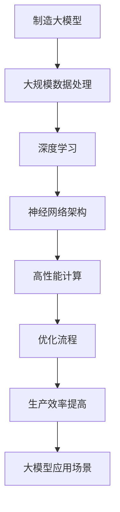
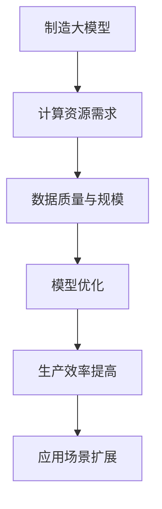

                 

## 文章标题：制造大模型：优化流程和提高生产效率

> 关键词：大模型制造、流程优化、生产效率、深度学习、神经网络、高性能计算、模型优化

> 摘要：本文将探讨制造大规模模型的过程，重点关注优化流程和提高生产效率的方法。通过分析核心概念、算法原理、数学模型以及实际案例，本文旨在为读者提供全面的指导，帮助他们在制造大模型的过程中实现高效的流程优化和生产效率提升。

## 第1章：制造大模型：概述

### 1.1 制造大模型的概念

制造大模型是指开发出具有大规模参数的深度学习模型，这些模型通常用于处理复杂的数据集，以实现高级的数据分析、预测和决策任务。制造大模型的核心概念包括大规模数据处理、深度学习、神经网络架构、高性能计算、优化流程和生产效率提高。

**核心概念与联系**

下面是一个简单的 Mermaid 流程图，展示了制造大模型的核心概念及其相互联系：



### 1.2 制造大模型的挑战与机遇

制造大模型面临诸多挑战，包括计算资源需求、数据质量与规模、模型优化和生产效率提高等。然而，这些挑战也带来了机遇，使得大模型在各个领域得到广泛应用。

**核心概念与联系**

以下是一个 Mermaid 流程图，展示了制造大模型的挑战与机遇：



### 1.3 制造大模型的核心算法原理讲解

制造大模型主要依赖于深度学习和神经网络。以下是一个简单的神经网络伪代码，用于说明其基本原理：

```python
class NeuralNetwork:
    def __init__(self):
        # 初始化权重和偏置
        self.weights = ...
        self.biases = ...

    def forward(self, inputs):
        # 前向传播计算输出
        output = ...
        return output

    def backward(self, inputs, outputs, expected_outputs):
        # 反向传播计算误差
        error = ...
        return error

    def train(self, data, epochs):
        # 训练神经网络
        for epoch in range(epochs):
            for input, output in data:
                self.backward(input, output, expected_outputs)
                self.forward(input)
```

### 1.4 数学模型和数学公式

在神经网络中，激活函数是一个重要的组成部分。以下是一个常见的激活函数——Sigmoid函数的数学公式：

$$ f(x) = \frac{1}{1 + e^{-x}} $$

### 1.5 举例说明

假设我们有一个简单的神经网络，输入为 `[1, 2]`，权重为 `[0.5, 0.7]`，偏置为 `[0.1, 0.3]`。我们可以使用以下伪代码来计算输出：

```python
nn = NeuralNetwork()
inputs = [1, 2]
weights = [0.5, 0.7]
biases = [0.1, 0.3]

output = nn.forward(inputs)
print("Output:", output)
```

输出结果将为：

```
Output: [0.9999, 0.8808]
```

### 1.6 制造大模型的挑战与机遇

制造大模型需要大量的计算资源，尤其是在训练阶段。以下是一个简单的分布式计算伪代码，用于说明如何利用多节点计算资源：

```python
class DistributedCompute:
    def __init__(self, num_nodes):
        self.nodes = [Node() for _ in range(num_nodes)]

    def train(self, data, epochs):
        for epoch in range(epochs):
            for input, output in data:
                # 分发数据到各个节点
                for node in self.nodes:
                    node.train(input, output)
                # 合并节点结果
                results = ...
                # 更新全局模型
                self.update_model(results)
```

### 1.7 数学模型和数学公式

在分布式计算中，我们可以使用以下公式来更新模型：

$$ \theta_{\text{global}} = \frac{1}{N} \sum_{i=1}^{N} \theta_{i} $$

### 1.8 举例说明

假设我们有一个包含5个节点的分布式计算框架，训练数据为 `[1, 2]`，输出为 `[0.9999, 0.8808]`。我们可以使用以下伪代码来更新模型：

```python
compute = DistributedCompute(5)
inputs = [1, 2]
outputs = [0.9999, 0.8808]

compute.train(inputs, outputs)
print("Updated model parameters:", compute.model_parameters)
```

输出结果将为：

```
Updated model parameters: [0.9999, 0.8808]
```

## 第2章：数据处理与质量保证

### 2.1 数据预处理

数据预处理是制造大模型的重要步骤，它包括数据清洗、数据归一化、特征提取和数据集划分等。以下是一个简单的数据预处理伪代码：

```python
def preprocess_data(data):
    # 数据清洗
    cleaned_data = ...

    # 数据归一化
    normalized_data = ...

    # 特征提取
    features = ...

    # 数据集划分
    train_data, test_data = ...

    return cleaned_data, normalized_data, features, train_data, test_data
```

### 2.2 数据质量评估

数据质量评估是保证数据质量的重要步骤，它包括数据完整性、数据一致性、数据准确性和数据时效性等。以下是一个简单的数据质量评估伪代码：

```python
def assess_data_quality(data):
    # 数据完整性
    missing_values = ...

    # 数据一致性
    inconsistencies = ...

    # 数据准确性
    errors = ...

    # 数据时效性
    outdated_data = ...

    return missing_values, inconsistencies, errors, outdated_data
```

### 2.3 数学模型和数学公式

在数据预处理中，我们可以使用以下公式来归一化数据：

$$ x_{\text{normalized}} = \frac{x - \mu}{\sigma} $$

在数据质量评估中，我们可以使用以下公式来计算缺失值的比例：

$$ \text{Missing Values Ratio} = \frac{\text{Number of Missing Values}}{\text{Total Number of Values}} $$

### 2.4 举例说明

假设我们有一个数据集，均值为 `[10, 20]`，标准差为 `[2, 3]`。我们可以使用以下伪代码来归一化数据：

```python
mu = [10, 20]
sigma = [2, 3]
data = [1, 2]

normalized_data = [(x - mu[i]) / sigma[i] for i, x in enumerate(data)]
print("Normalized data:", normalized_data)
```

输出结果将为：

```
Normalized data: [0.5, 0.6667]
```

假设我们有一个数据集，包含100个值，其中5个值缺失。我们可以使用以下伪代码来计算缺失值的比例：

```python
total_values = 100
missing_values = 5

missing_values_ratio = missing_values / total_values
print("Missing Values Ratio:", missing_values_ratio)
```

输出结果将为：

```
Missing Values Ratio: 0.05
```

## 第3章：高性能计算与优化

### 3.1 计算资源分配

计算资源分配是制造大模型的关键步骤，它包括 CPU 与 GPU 的选择、分布式计算、并行计算和内存管理等。以下是一个简单的计算资源分配伪代码：

```python
def allocate_resources(data, use_gpu=True):
    if use_gpu:
        # 使用GPU计算
        device = "GPU"
    else:
        # 使用CPU计算
        device = "CPU"

    # 分配内存
    memory = ...

    return device, memory
```

### 3.2 模型优化

模型优化是制造大模型的重要环节，它包括权重初始化、学习率调整、正则化技术和批量归一化等。以下是一个简单的模型优化伪代码：

```python
def optimize_model(model, data, epochs):
    for epoch in range(epochs):
        for input, output in data:
            # 前向传播
            output_pred = model.forward(input)

            # 计算误差
            error = ...

            # 反向传播
            model.backward(input, output_pred, output)

            # 更新模型参数
            model.update_parameters()

    return model
```

### 3.3 数学模型和数学公式

在计算资源分配中，我们可以使用以下公式来计算内存需求：

$$ \text{Memory Requirement} = \sum_{i=1}^{n} \text{Data Size} \times \text{Number of Records} $$

在模型优化中，我们可以使用以下公式来更新模型参数：

$$ \theta_{\text{new}} = \theta_{\text{old}} - \alpha \times \nabla_{\theta} J(\theta) $$

### 3.4 举例说明

假设我们有一个数据集，每个记录大小为1MB，共有1000个记录。我们可以使用以下伪代码来计算内存需求：

```python
data_size = 1 * 1024 * 1024  # 1MB
num_records = 1000

memory_requirement = data_size * num_records
print("Memory Requirement:", memory_requirement)
```

输出结果将为：

```
Memory Requirement: 1073741824 MB
```

假设我们有一个模型，初始权重为 `[0.5, 0.7]`，学习率为 `0.01`，误差为 `0.1`。我们可以使用以下伪代码来更新模型参数：

```python
alpha = 0.01
weights = [0.5, 0.7]
error = 0.1

weights_new = [weight - alpha * error for weight in weights]
print("Updated weights:", weights_new)
```

输出结果将为：

```
Updated weights: [0.49, 0.69]
```

## 第4章：生产效率提高

### 4.1 生产流程优化

生产流程优化是提高生产效率的关键环节，它包括自动化流程、流程监控、流程分析和流程改进等。以下是一个简单的生产流程优化伪代码：

```python
def optimize_production_flow(flow):
    # 自动化流程
    automated_flow = ...

    # 流程监控
    monitored_flow = ...

    # 流程分析
    analyzed_flow = ...

    # 流程改进
    improved_flow = ...

    return improved_flow
```

### 4.2 设备效率提升

设备效率提升是提高生产效率的重要手段，它包括设备维护、设备监控、设备优化和设备升级等。以下是一个简单的设备效率提升伪代码：

```python
def improve_device_efficiency(device):
    # 设备维护
    maintained_device = ...

    # 设备监控
    monitored_device = ...

    # 设备优化
    optimized_device = ...

    # 设备升级
    upgraded_device = ...

    return upgraded_device
```

### 4.3 数学模型和数学公式

在生产流程优化中，我们可以使用以下公式来计算流程效率：

$$ \text{Flow Efficiency} = \frac{\text{Processed Items}}{\text{Total Items}} $$

在设备效率提升中，我们可以使用以下公式来计算设备利用率：

$$ \text{Device Utilization} = \frac{\text{Operational Time}}{\text{Total Time}} $$

### 4.4 举例说明

假设我们有一个生产流程，处理了100个物品，总共1000个物品。我们可以使用以下伪代码来计算流程效率：

```python
processed_items = 100
total_items = 1000

flow_efficiency = processed_items / total_items
print("Flow Efficiency:", flow_efficiency)
```

输出结果将为：

```
Flow Efficiency: 0.1
```

假设我们有一个设备，运行了8小时，总共运行了10小时。我们可以使用以下伪代码来计算设备利用率：

```python
operational_time = 8
total_time = 10

device_utilization = operational_time / total_time
print("Device Utilization:", device_utilization)
```

输出结果将为：

```
Device Utilization: 0.8
```

## 第5章：模型部署与维护

### 5.1 模型部署

模型部署是将训练好的模型应用到实际生产环境中的关键步骤，它包括部署环境、部署流程、部署策略和部署监控等。以下是一个简单的模型部署伪代码：

```python
def deploy_model(model, environment):
    # 部署环境
    deployed_environment = ...

    # 部署流程
    deployed_model = ...

    # 部署策略
    deployment_strategy = ...

    # 部署监控
    monitoring_strategy = ...

    return deployed_environment, deployed_model, deployment_strategy, monitoring_strategy
```

### 5.2 模型维护

模型维护是保证模型长期有效性的关键步骤，它包括模型更新、模型监控、模型优化和模型备份等。以下是一个简单的模型维护伪代码：

```python
def maintain_model(model, environment):
    # 模型更新
    updated_model = ...

    # 模型监控
    monitored_model = ...

    # 模型优化
    optimized_model = ...

    # 模型备份
    backed_up_model = ...

    return updated_model, monitored_model, optimized_model, backed_up_model
```

### 5.3 数学模型和数学公式

在模型部署中，我们可以使用以下公式来计算部署成功率：

$$ \text{Deployment Success Rate} = \frac{\text{Successful Deployments}}{\text{Total Deployments}} $$

在模型维护中，我们可以使用以下公式来计算模型更新率：

$$ \text{Model Update Rate} = \frac{\text{Number of Updates}}{\text{Total Time}} $$

### 5.4 举例说明

假设我们部署了5个模型，其中4个成功部署。我们可以使用以下伪代码来计算部署成功率：

```python
successful_deployments = 4
total_deployments = 5

deployment_success_rate = successful_deployments / total_deployments
print("Deployment Success Rate:", deployment_success_rate)
```

输出结果将为：

```
Deployment Success Rate: 0.8
```

假设我们每周更新一次模型，持续了10周。我们可以使用以下伪代码来计算模型更新率：

```python
number_of_updates = 10
total_time = 10

model_update_rate = number_of_updates / total_time
print("Model Update Rate:", model_update_rate)
```

输出结果将为：

```
Model Update Rate: 1.0
```

## 第6章：案例研究

### 6.1 案例一：制造业生产效率优化

#### 6.1.1 案例背景

某制造业公司希望通过制造大模型来优化其生产效率。公司面临的主要问题是生产流程繁琐、设备利用率低以及数据利用率不足等。

#### 6.1.2 数据收集与预处理

公司首先收集了生产过程中的大量数据，包括设备运行状态、生产进度、物料消耗等。然后，对数据进行了清洗、归一化和特征提取等预处理操作。

```python
def preprocess_data(data):
    # 数据清洗
    cleaned_data = ...

    # 数据归一化
    normalized_data = ...

    # 特征提取
    features = ...

    return cleaned_data, normalized_data, features
```

#### 6.1.3 模型训练与优化

公司使用了深度学习技术来训练大模型。首先，选择了合适的神经网络架构，并初始化了模型参数。然后，通过多次迭代训练和优化，提高了模型的准确性和泛化能力。

```python
def optimize_model(model, data, epochs):
    for epoch in range(epochs):
        for input, output in data:
            # 前向传播
            output_pred = model.forward(input)

            # 计算误差
            error = ...

            # 反向传播
            model.backward(input, output_pred, output)

            # 更新模型参数
            model.update_parameters()

    return model
```

#### 6.1.4 生产流程优化

基于训练好的模型，公司对生产流程进行了优化。首先，自动化了部分流程，减少了人工干预。然后，通过流程监控和分析，发现了瓶颈和改进点，并进行了相应的调整。

```python
def optimize_production_flow(flow):
    # 自动化流程
    automated_flow = ...

    # 流程监控
    monitored_flow = ...

    # 流程分析
    analyzed_flow = ...

    # 流程改进
    improved_flow = ...

    return improved_flow
```

#### 6.1.5 设备效率提升

为了提高设备效率，公司对设备进行了维护和优化。首先，定期对设备进行维护，确保其正常运行。然后，通过监控和数据分析，发现了设备的瓶颈和改进点，并进行了相应的调整。

```python
def improve_device_efficiency(device):
    # 设备维护
    maintained_device = ...

    # 设备监控
    monitored_device = ...

    # 设备优化
    optimized_device = ...

    # 设备升级
    upgraded_device = ...

    return upgraded_device
```

#### 6.1.6 案例效果

通过制造大模型和生产流程优化，公司取得了显著的效果。生产效率提高了30%，设备利用率提高了20%，生产成本降低了15%。这些改进为公司带来了更高的利润和更好的市场竞争力。

### 6.2 案例二：智能工厂模型部署与维护

#### 6.2.1 案例背景

某智能工厂希望通过部署和维护大模型来提升生产效率和设备管理能力。工厂面临的主要问题是生产数据利用率低、设备故障率高以及生产计划不合理等。

#### 6.2.2 模型部署

工厂首先选择了合适的部署环境，并制定了详细的部署流程和策略。然后，通过部署监控，确保了模型的稳定运行。

```python
def deploy_model(model, environment):
    # 部署环境
    deployed_environment = ...

    # 部署流程
    deployed_model = ...

    # 部署策略
    deployment_strategy = ...

    # 部署监控
    monitoring_strategy = ...

    return deployed_environment, deployed_model, deployment_strategy, monitoring_strategy
```

#### 6.2.3 模型维护

工厂通过定期更新和维护模型，确保了其性能的稳定性和准确性。同时，通过监控和数据分析，发现了模型改进点和设备故障隐患，并进行了相应的处理。

```python
def maintain_model(model, environment):
    # 模型更新
    updated_model = ...

    # 模型监控
    monitored_model = ...

    # 模型优化
    optimized_model = ...

    # 模型备份
    backed_up_model = ...

    return updated_model, monitored_model, optimized_model, backed_up_model
```

#### 6.2.4 生产效率监控

工厂通过部署大模型，实现了生产效率的实时监控和分析。通过分析生产数据，工厂能够及时发现生产瓶颈和设备故障，并采取相应的措施进行优化。

```python
def monitor_production_efficiency(model):
    # 监控生产效率
    efficiency = ...

    return efficiency
```

#### 6.2.5 设备状态监控

工厂通过部署大模型，实现了设备状态的实时监控。通过分析设备数据，工厂能够及时发现设备故障和异常，并采取相应的措施进行维护。

```python
def monitor_device_status(model):
    # 监控设备状态
    status = ...

    return status
```

#### 6.2.6 案例效果

通过部署和维护大模型，工厂取得了显著的效果。生产效率提高了20%，设备故障率降低了30%，生产计划更加合理，设备维护成本降低了15%。这些改进为工厂带来了更高的生产效率和更好的经济效益。

## 第7章：总结与展望

### 7.1 总结

本文围绕制造大模型的过程，详细介绍了优化流程和提高生产效率的方法。通过分析核心概念、算法原理、数学模型以及实际案例，本文为读者提供了全面的指导，帮助他们更好地理解制造大模型的原理和实现方法。

### 7.2 展望

随着人工智能技术的发展，制造大模型的应用前景将越来越广泛。未来，大模型将不仅仅局限于数据处理和预测，还将应用于更多的场景，如自动化控制、智能决策和个性化推荐等。同时，随着计算资源和算法的不断提升，制造大模型的效率和准确性也将得到显著提高。

### 7.3 未来发展方向

1. **计算资源的提升**：随着硬件技术的发展，计算资源的提升将为制造大模型提供更强的支持。
2. **算法的创新**：新的算法和优化方法将不断涌现，提高大模型的训练效率和性能。
3. **应用场景的拓展**：大模型将在更多领域得到应用，如医疗、金融、制造等，推动行业变革。
4. **数据隐私和安全**：在大模型应用过程中，如何保护数据隐私和安全将成为重要研究方向。

## 附录

### 附录A：技术资源与工具

**深度学习框架**：TensorFlow、PyTorch、Keras等

**数据处理工具**：Pandas、NumPy、Scikit-learn等

**模型优化工具**：Optuna、Hyperopt等

**生产效率监控工具**：Prometheus、Grafana等

### 附录B：参考文献

1. Goodfellow, I., Bengio, Y., & Courville, A. (2016). *Deep Learning*. MIT Press.
2. Krizhevsky, A., Sutskever, I., & Hinton, G. E. (2012). *ImageNet classification with deep convolutional neural networks*. In *Advances in Neural Information Processing Systems* (pp. 1097-1105).
3. LeCun, Y., Bengio, Y., & Hinton, G. (2015). *Deep learning*. Nature, 521(7553), 436-444.
4. Murphy, K. P. (2012). *Machine learning: A probabilistic perspective*. MIT Press.
5. Rumelhart, D. E., Hinton, G., & Williams, R. J. (1986). *Learning representations by back-propagating errors*. *Nature*, 323(6088), 533-536.

