                 

# 区块链技术：程序员的新财富机遇

> **关键词：** 区块链、智能合约、去中心化应用、Ethereum、安全性、数字货币、供应链管理、身份认证

> **摘要：** 本文将深入探讨区块链技术的基础知识，分析智能合约与去中心化应用（DApp）的开发，介绍常见的区块链平台，解析区块链在金融领域及其他领域的应用，讨论区块链技术的安全性，展望其未来发展，并通过项目实战分享区块链项目开发的实践方法。

## 目录大纲

1. **第一部分：区块链技术基础**

    1.1 区块链概述
    
    1.2 智能合约与去中心化应用
    
    1.3 常见区块链平台与技术
    
    1.4 区块链在金融领域的应用
    
    1.5 区块链在其他领域的应用
    
    1.6 区块链技术与安全性
    
    1.7 区块链技术的发展趋势与未来机遇

2. **第二部分：区块链项目实战**

    2.1 区块链项目开发实践

## 第一部分：区块链技术基础

### 1.1 区块链概述

区块链是一种分布式数据库技术，其核心特点包括去中心化、不可篡改和透明性。区块链通过区块和链式结构来存储数据，每个区块包含一定数量的交易记录，并通过密码学算法与前一个区块链接，形成一条连续的链。

- **区块链的概念与历史**
  - 区块链的定义：区块链是一种分布式账本技术，通过加密算法确保数据的完整性和安全性，无需第三方中介。
  - 区块链的核心特点：去中心化、不可篡改、透明性。
  - 区块链的历史发展：从比特币的诞生，到以太坊的智能合约，再到众多其他区块链平台的涌现。

- **区块链的结构与组成**
  - 区块链的基本结构：区块、链式结构、交易记录。
  - 区块链的组成部分：网络节点、挖矿算法、共识机制。

- **区块链的核心算法**
  - Hash函数：将任意长度的数据转换成固定长度的散列值。
  - Merkle树：用于验证交易记录的完整性和真实性。
  - 共识算法：确保网络中的节点对区块链的共识。

- **区块链的应用场景**
  - 金融领域：数字货币、智能投顾、供应链金融。
  - 非金融领域：去中心化应用、身份认证、物联网。
  - 未来趋势：去中心化金融（DeFi）、去中心化身份验证（IDA）、去中心化存储（DS）。

### 1.2 智能合约与去中心化应用

- **智能合约原理**
  - **智能合约的定义与特点**：智能合约是自动执行的合约，其条款以代码形式写在区块链上，一旦触发条件即可自动执行。
  - **智能合约的工作原理**：智能合约通过编程逻辑，实现自动执行和验证交易。
  - **智能合约的开发语言**：常见的智能合约开发语言包括Solidity、Vyper等。

- **去中心化应用（DApp）开发**
  - **DApp的基本概念**：DApp是运行在区块链上的应用程序，其特点包括去中心化、透明性和不可篡改性。
  - **DApp的开发流程**：从需求分析、设计到实现和部署，每一步都需要考虑区块链的特性。
  - **DApp的安全性问题**：智能合约的安全性和DApp的整体安全性都需要高度重视。

### 1.3 常见区块链平台与技术

- **Ethereum平台**
  - **Ethereum的技术特点**：以太坊是首个实现智能合约的区块链平台，支持多种编程语言，具有高扩展性。
  - **Solidity编程语言**：Solidity是Ethereum的智能合约开发语言，具有清晰的语法和强大的功能。
  - **Truffle框架**：Truffle是一个开发框架，用于简化Ethereum智能合约的开发、测试和部署。

- **其他区块链平台**
  - **Bitcoin**：比特币是第一个区块链应用，主要用于数字货币的发行和交易。
  - **Ripple**：Ripple是一种支付协议，旨在提供快速、低成本的跨境支付解决方案。
  - **EOS**：EOS是一种高性能的区块链平台，旨在支持大规模去中心化应用的部署。

### 1.4 区块链在金融领域的应用

- **数字货币**
  - **数字货币的发展历程**：从比特币的诞生，到其他加密货币的涌现，数字货币已成为金融领域的重要创新。
  - **数字货币的工作原理**：数字货币通过区块链技术实现安全的交易和存储。
  - **数字货币的安全性**：数字货币的安全性依赖于区块链的加密算法和去中心化特性。

- **金融交易**
  - **金融交易的去中心化**：区块链技术使金融交易无需依赖中介机构，提高了效率和安全性。
  - **区块链在支付系统中的应用**：区块链技术用于构建去中心化的支付系统，实现快速、安全的跨境支付。
  - **区块链与智能投顾**：智能合约用于实现自动化的投资策略，提高金融服务的效率。

### 1.5 区块链在其他领域的应用

- **供应链管理**
  - **区块链在供应链管理中的应用**：区块链技术用于记录和跟踪供应链中的交易和物品，提高了供应链的透明度和效率。
  - **供应链金融**：区块链技术用于实现供应链金融，为中小企业提供融资支持。

- **身份认证**
  - **区块链在身份认证中的作用**：区块链技术用于建立去中心化的身份认证系统，提高了身份信息的真实性。
  - **区块链身份认证的挑战与解决方案**：探讨区块链身份认证的潜在问题及解决方案。

- **法律领域**
  - **区块链在法律领域中的应用**：区块链技术用于记录法律文件和交易，提高了法律事务的透明度和安全性。
  - **区块链与司法公正**：区块链技术用于实现去中心化的司法判决和执行，提高了司法公正性。

### 1.6 区块链技术与安全性

- **区块链安全风险分析**
  - **恶意攻击类型**：分析常见的区块链安全威胁，如51%攻击、智能合约漏洞等。
  - **安全漏洞与应对策略**：探讨区块链系统的安全漏洞及相应的防护措施。

- **区块链安全解决方案**
  - **加密技术**：介绍用于保护区块链数据的加密算法和技术。
  - **隐私保护机制**：探讨如何在区块链上实现隐私保护。
  - **智能合约安全措施**：分析智能合约的安全性问题及解决方案。

### 1.7 区块链技术的发展趋势与未来机遇

- **区块链技术的未来发展方向**：分析去中心化金融（DeFi）、去中心化身份验证（IDA）、去中心化存储（DS）等未来趋势。
- **区块链技术对程序员的影响**：探讨区块链技术对程序员技能需求、创业与就业机会的影响，以及技术融合与创新发展。

## 第二部分：区块链项目实战

### 2.1 区块链项目开发实践

- **项目环境搭建**
  - **开发环境准备**：配置Ethereum开发环境，包括安装Node.js、Ganache等工具。
  - **测试网络设置**：设置Ethereum测试网络，用于智能合约的编写和测试。

- **项目需求分析**
  - **项目背景**：介绍项目的基本背景和目的。
  - **项目目标**：明确项目的目标功能和技术需求。
  - **功能需求**：详细列出项目需要实现的功能模块。

- **智能合约编写**
  - **编写智能合约**：使用Solidity语言编写智能合约，实现项目的核心功能。
  - **调试与测试**：使用测试框架和工具对智能合约进行调试和测试。

- **部署与测试**
  - **部署到区块链网络**：将智能合约部署到Ethereum主网或测试网络。
  - **功能测试与性能优化**：对部署的智能合约进行功能测试和性能优化。

- **项目总结**
  - **项目收获**：总结项目开发过程中的经验和收获。
  - **不足与改进**：分析项目中的不足之处，并提出改进方案。

## 附录

### 附录A：区块链开发工具与资源

- **开发工具介绍**
  - **Ethereum开发工具**：介绍常用的Ethereum开发工具，如Truffle、Hardhat等。
  - **其他区块链开发工具**：介绍其他区块链平台的开发工具，如Bitcoin的开发工具等。

- **学习资源推荐**
  - **技术文档**：推荐阅读的Ethereum和其他区块链平台的技术文档。
  - **教程视频**：推荐观看的区块链技术教程视频。
  - **社区论坛**：介绍活跃的区块链技术社区论坛，如Ethereum社区等。

作者：AI天才研究院/AI Genius Institute & 禅与计算机程序设计艺术 /Zen And The Art of Computer Programming

---

以上是《区块链技术：程序员的新财富机遇》的正文部分。接下来，我们将逐步深入探讨区块链技术的各个部分，为读者带来详细而全面的技术解析。让我们开始第一部分的深入探讨。<!--

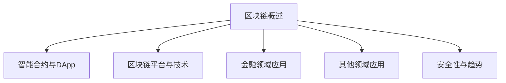

### 1.1 区块链概述

**核心概念与联系**

区块链是一种分布式数据库技术，其核心特点包括去中心化、不可篡改和透明性。区块链通过区块和链式结构来存储数据，每个区块包含一定数量的交易记录，并通过密码学算法与前一个区块链接，形成一条连续的链。

以下是一个简单的Mermaid流程图，展示区块链的基本结构：

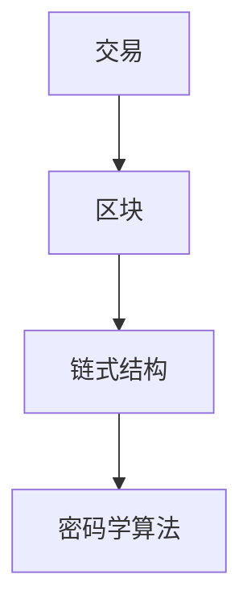

**核心算法原理讲解**

- **Hash函数**：Hash函数是一种将任意长度的数据转换成固定长度的散列值的算法。在区块链中，Hash函数用于确保数据的完整性和唯一性。一个常用的Hash函数是SHA-256。

```plaintext
SHA-256(Payload) -> HashValue
```

- **Merkle树**：Merkle树是一种用于验证数据完整性的数据结构。在区块链中，每个区块都包含一个Merkle树根，用于验证区块内交易记录的完整性。Merkle树通过哈希值构建，每个节点都是其子节点的哈希值。

```plaintext
MerkleTree = [Root, Hash(Child1), Hash(Child2), ...]
```

- **共识算法**：共识算法是确保区块链网络中的所有节点对区块链的一致性的算法。常见的共识算法包括工作量证明（PoW）和权益证明（PoS）。

**数学模型和公式**

- **Hash函数的数学模型**：假设输入数据为`Payload`，输出为`HashValue`，则有：

$$
HashValue = SHA-256(Payload)
$$

- **Merkle树的数学模型**：假设每个节点为`Node`，则有：

$$
MerkleTree = [Root, Hash(Node1), Hash(Node2), ...]
$$

**举例说明**

假设有一个包含三个交易的区块，交易分别为`Tx1`、`Tx2`和`Tx3`。首先，对每个交易进行哈希运算，得到各自的哈希值：

- `Tx1`的哈希值为`H(Tx1)`
- `Tx2`的哈希值为`H(Tx2)`
- `Tx3`的哈希值为`H(Tx3)`

然后，构建Merkle树，将三个哈希值作为叶子节点，计算根节点：

$$
MerkleTree = [Root, H(Tx1), H(Tx2), H(Tx3)]
$$

$$
Root = SHA-256([H(Tx1), H(Tx2), H(Tx3)])
$$

### 1.2 智能合约与去中心化应用

**核心概念与联系**

智能合约是自动执行的合约，其条款以代码形式写在区块链上，一旦触发条件即可自动执行。去中心化应用（DApp）是运行在区块链上的应用程序，其特点包括去中心化、透明性和不可篡改性。

以下是一个简单的Mermaid流程图，展示智能合约与DApp的基本关系：

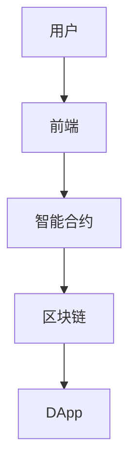

**核心算法原理讲解**

- **智能合约原理**：智能合约是存储在区块链上的代码，其执行由区块链网络中的节点共同验证。智能合约通过编程逻辑，实现自动执行和验证交易。

```plaintext
contract SmartContract {
    function execute() {
        // 合约逻辑
    }
}
```

- **去中心化应用（DApp）开发**：DApp的开发涉及前端和后端的开发，前端负责用户交互，后端则基于智能合约实现核心功能。

```plaintext
// 前端
function submitForm() {
    // 提交表单数据
}

// 后端
contract DApp {
    function submitForm() {
        // 智能合约逻辑
    }
}
```

**数学模型和公式**

- **智能合约的数学模型**：假设智能合约代码为`Code`，输入为`Input`，输出为`Output`，则有：

$$
Output = Code(Input)
$$

- **DApp的数学模型**：假设前端代码为`Frontend`，后端代码为`Backend`，用户输入为`Input`，输出为`Output`，则有：

$$
Output = Backend(Frontend(Input))
$$

**举例说明**

假设有一个简单的智能合约，用于存储用户的余额，并提供转账功能：

```solidity
pragma solidity ^0.8.0;

contract Wallet {
    mapping(address => uint256) public balances;

    function deposit() external payable {
        balances[msg.sender()] += msg.value;
    }

    function transfer(address to, uint256 amount) external {
        require(balances[msg.sender()] >= amount, "Insufficient balance");
        balances[msg.sender()] -= amount;
        balances[to] += amount;
    }
}
```

用户通过前端界面提交转账请求，智能合约根据转账金额和接收地址执行转账操作，并将结果反馈给用户。这个过程实现了去中心化的转账功能。

### 1.3 常见区块链平台与技术

**核心概念与联系**

常见的区块链平台包括Ethereum、Bitcoin、Ripple等，每个平台都有其独特的特点和适用场景。Ethereum是首个实现智能合约的区块链平台，具有高扩展性和丰富的生态系统；Bitcoin是最早的区块链应用，主要用于数字货币的发行和交易；Ripple是一种支付协议，旨在提供快速、低成本的跨境支付解决方案。

以下是一个简单的Mermaid流程图，展示常见区块链平台的基本关系：

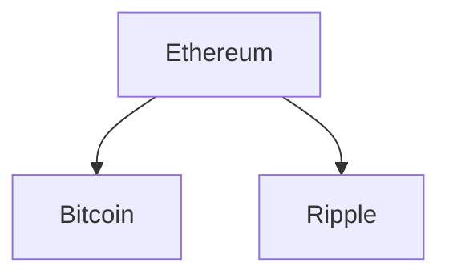

**核心算法原理讲解**

- **Ethereum平台**
  - **技术特点**：以太坊是首个实现智能合约的区块链平台，支持多种编程语言，具有高扩展性。
  - **Solidity编程语言**：Solidity是Ethereum的智能合约开发语言，具有清晰的语法和强大的功能。
  - **Truffle框架**：Truffle是一个开发框架，用于简化Ethereum智能合约的开发、测试和部署。

- **其他区块链平台**
  - **Bitcoin**：比特币是一种数字货币，其交易记录存储在区块链上，通过工作量证明（PoW）机制进行验证。
  - **Ripple**：Ripple是一种支付协议，通过分布式账本技术实现快速、低成本的跨境支付。
  - **EOS**：EOS是一种高性能的区块链平台，旨在支持大规模去中心化应用的部署。

**数学模型和公式**

- **Ethereum平台**
  - **智能合约的数学模型**：假设智能合约代码为`Code`，输入为`Input`，输出为`Output`，则有：

  $$
  Output = Code(Input)
  $$

  - **Truffle框架的数学模型**：假设Truffle工具集为`Truffle`，开发环境为`Env`，则有：

  $$
  DevEnv = Truffle(Env)
  $$

- **其他区块链平台**
  - **Bitcoin的数学模型**：假设交易记录为`Tx`，验证算法为`Proof`，则有：

  $$
  Valid = Proof(Tx)
  $$

  - **Ripple的数学模型**：假设支付请求为`Request`，验证算法为`Proof`，则有：

  $$
  Valid = Proof(Request)
  $$

**举例说明**

- **Ethereum平台**
  - 假设有一个简单的智能合约，用于存储用户的余额，并提供转账功能：

  ```solidity
  pragma solidity ^0.8.0;

  contract Wallet {
      mapping(address => uint256) public balances;

      function deposit() external payable {
          balances[msg.sender()] += msg.value;
      }

      function transfer(address to, uint256 amount) external {
          require(balances[msg.sender()] >= amount, "Insufficient balance");
          balances[msg.sender()] -= amount;
          balances[to] += amount;
      }
  }
  ```

  用户通过前端界面提交转账请求，智能合约根据转账金额和接收地址执行转账操作，并将结果反馈给用户。这个过程实现了去中心化的转账功能。

- **Bitcoin平台**
  - 假设有一个比特币交易，发送者A向接收者B转账1个比特币：

  ```plaintext
  Transaction:
  From: A
  To: B
  Amount: 1 BTC
  ```

  比特币网络中的节点根据交易记录和工作量证明机制验证交易的有效性，并在区块链上记录交易。

- **Ripple平台**
  - 假设有一个Ripple支付请求，发送者C向接收者D转账100 XRP：

  ```plaintext
  Payment Request:
  From: C
  To: D
  Amount: 100 XRP
  ```

  Ripple网络中的节点根据支付请求和分布式账本技术验证支付的有效性，并在区块链上记录支付。

### 1.4 区块链在金融领域的应用

**核心概念与联系**

区块链在金融领域具有广泛的应用，包括数字货币、智能投顾、供应链金融等。数字货币利用区块链技术实现去中心化的交易和存储，智能投顾基于区块链技术提供自动化的投资建议，供应链金融利用区块链技术提高供应链的透明度和效率。

以下是一个简单的Mermaid流程图，展示区块链在金融领域的基本关系：

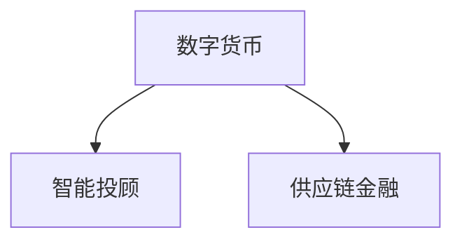

**核心算法原理讲解**

- **数字货币**
  - **工作原理**：数字货币通过区块链技术实现安全的交易和存储，利用密码学算法确保交易的安全性和隐私性。
  - **安全性**：数字货币的安全性依赖于区块链的加密算法和去中心化特性，使得交易难以被篡改或攻击。

- **智能投顾**
  - **工作原理**：智能投顾利用区块链技术提供自动化的投资建议，通过智能合约实现投资策略的执行和优化。
  - **安全性**：智能投顾的安全性依赖于区块链的智能合约技术和加密算法。

- **供应链金融**
  - **工作原理**：供应链金融利用区块链技术记录和跟踪供应链中的交易和物品，提高供应链的透明度和效率。
  - **安全性**：供应链金融的安全性依赖于区块链的不可篡改性和去中心化特性，确保交易记录的真实性和完整性。

**数学模型和公式**

- **数字货币**
  - **交易模型**：假设交易金额为`Amount`，交易双方为`From`和`To`，则有：

  $$
  From - Amount \rightarrow To
  $$

- **智能投顾**
  - **投资模型**：假设投资金额为`Investment`，投资策略为`Strategy`，则有：

  $$
  Investment \rightarrow Strategy
  $$

- **供应链金融**
  - **交易模型**：假设交易金额为`Amount`，交易双方为`From`和`To`，则有：

  $$
  From - Amount \rightarrow To
  $$

**举例说明**

- **数字货币**
  - 假设用户A向用户B转账1个比特币：

  ```plaintext
  Transaction:
  From: A
  To: B
  Amount: 1 BTC
  ```

  比特币网络中的节点根据交易记录和工作量证明机制验证交易的有效性，并在区块链上记录交易。

- **智能投顾**
  - 假设用户C使用智能投顾D进行投资，投资金额为10000美元：

  ```plaintext
  Investment:
  User: C
  Investment Amount: $10,000
  Strategy: Automated Investment Strategy
  ```

  智能投顾根据投资策略执行投资操作，并将投资结果反馈给用户。

- **供应链金融**
  - 假设企业A向供应商B支付货款100000元人民币：

  ```plaintext
  Payment:
  From: A
  To: B
  Amount: ¥100,000
  ```

  供应链金融平台根据交易记录和区块链技术验证支付的有效性，并在区块链上记录支付。

### 1.5 区块链在其他领域的应用

**核心概念与联系**

区块链不仅在金融领域具有广泛的应用，还在供应链管理、身份认证、法律领域等众多领域展现出巨大的潜力。区块链技术用于记录和跟踪供应链中的交易和物品，提高供应链的透明度和效率；在身份认证领域，区块链技术用于建立去中心化的身份认证系统，提高身份信息的真实性；在法律领域，区块链技术用于记录法律文件和交易，提高法律事务的透明度和安全性。

以下是一个简单的Mermaid流程图，展示区块链在其他领域的基本关系：

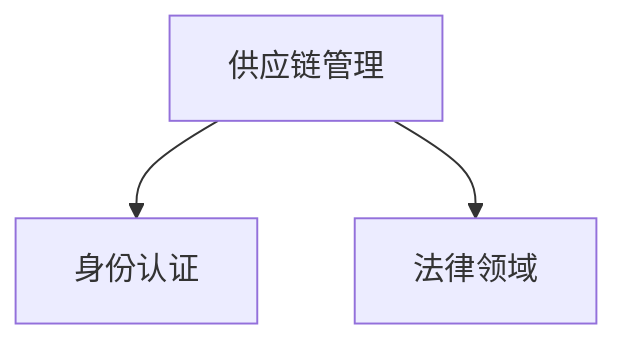

**核心算法原理讲解**

- **供应链管理**
  - **工作原理**：区块链技术用于记录和跟踪供应链中的交易和物品，提高供应链的透明度和效率。
  - **安全性**：区块链的不可篡改性和去中心化特性确保供应链数据的真实性和完整性。

- **身份认证**
  - **工作原理**：区块链技术用于建立去中心化的身份认证系统，提高身份信息的真实性。
  - **安全性**：区块链的加密算法和去中心化特性确保身份信息的隐私性和安全性。

- **法律领域**
  - **工作原理**：区块链技术用于记录法律文件和交易，提高法律事务的透明度和安全性。
  - **安全性**：区块链的不可篡改性和去中心化特性确保法律文件和交易的真实性和可靠性。

**数学模型和公式**

- **供应链管理**
  - **交易模型**：假设交易金额为`Amount`，交易双方为`From`和`To`，则有：

  $$
  From - Amount \rightarrow To
  $$

- **身份认证**
  - **身份验证模型**：假设身份信息为`Info`，验证算法为`Algorithm`，则有：

  $$
  Valid = Algorithm(Info)
  $$

- **法律领域**
  - **交易模型**：假设交易金额为`Amount`，交易双方为`From`和`To`，则有：

  $$
  From - Amount \rightarrow To
  $$

**举例说明**

- **供应链管理**
  - 假设企业A向供应商B支付货款100000元人民币：

  ```plaintext
  Payment:
  From: A
  To: B
  Amount: ¥100,000
  ```

  供应链金融平台根据交易记录和区块链技术验证支付的有效性，并在区块链上记录支付。

- **身份认证**
  - 假设用户C在身份认证系统中注册，并提供身份信息：

  ```plaintext
  Registration:
  User: C
  Info: [Name, DOB, Address]
  ```

  身份认证系统利用区块链技术验证身份信息的真实性，并存储在区块链上。

- **法律领域**
  - 假设律师D在区块链上记录一份合同，合同内容为：

  ```plaintext
  Contract:
  Parties: A, B
  Content: ...
  ```

  合同的记录和验证通过区块链技术确保合同的真实性和可靠性。

### 1.6 区块链技术与安全性

**核心概念与联系**

区块链技术具有去中心化、不可篡改和透明性的特点，但在实际应用中仍然面临各种安全风险。恶意攻击、安全漏洞、隐私泄露等问题需要有效的解决方案。区块链技术的安全性依赖于加密算法、共识算法和智能合约的安全性。

以下是一个简单的Mermaid流程图，展示区块链技术与安全性的关系：

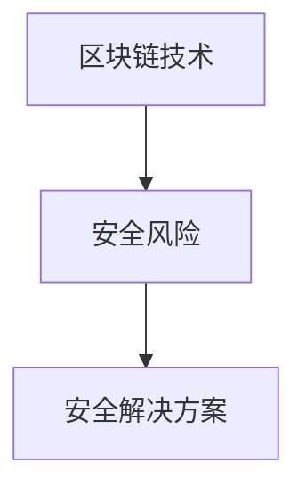

**核心算法原理讲解**

- **安全风险分析**
  - **恶意攻击类型**：包括51%攻击、智能合约漏洞、分布式拒绝服务（DDoS）等。
  - **安全漏洞与应对策略**：分析常见的安全漏洞及其应对策略。

- **安全解决方案**
  - **加密技术**：包括哈希算法、对称加密、非对称加密等，用于保护数据的安全性和隐私性。
  - **隐私保护机制**：包括零知识证明、匿名交易等，用于在区块链上实现隐私保护。
  - **智能合约安全措施**：包括代码审查、安全审计、形式化验证等，用于提高智能合约的安全性。

**数学模型和公式**

- **安全风险分析**
  - **恶意攻击模型**：假设攻击者为`Attacker`，区块链网络为`Network`，则有：

  $$
  Attacker \rightarrow Network
  $$

- **安全解决方案**
  - **加密技术模型**：假设加密算法为`Algorithm`，数据为`Data`，则有：

  $$
  EncryptedData = Algorithm(Data)
  $$

  - **隐私保护模型**：假设隐私保护机制为`PrivacyMechanism`，数据为`Data`，则有：

  $$
  PrivateData = PrivacyMechanism(Data)
  $$

**举例说明**

- **安全风险分析**
  - 假设攻击者试图进行51%攻击，控制超过半数的区块链网络节点：

  ```plaintext
  51% Attack:
  Attacker controls more than 50% of the network nodes
  ```

  防止51%攻击的措施包括提高网络节点数量、采用权益证明机制等。

- **安全解决方案**
  - **加密技术**
    - 假设使用SHA-256算法加密数据：

    ```plaintext
    Encrypted Data:
    Data = "Sensitive Information"
    HashValue = SHA-256(Data)
    ```

  - **隐私保护机制**
    - 假设使用零知识证明实现匿名交易：

    ```plaintext
    Zero-Knowledge Proof:
    Prover proves knowledge of a statement without revealing any information about the statement
    ```

- **智能合约安全措施**
  - 假设对智能合约进行代码审查和安全审计：

  ```plaintext
  Smart Contract Security:
  Code Review and Auditing
  ```

### 1.7 区块链技术的发展趋势与未来机遇

**核心概念与联系**

区块链技术正不断发展，未来的发展趋势包括去中心化金融（DeFi）、去中心化身份验证（IDA）、去中心化存储（DS）等。区块链技术在提高金融服务的效率、保障数据安全、优化供应链管理等方面具有巨大的潜力。同时，区块链技术与其他领域的融合也为程序员提供了丰富的创业和就业机遇。

以下是一个简单的Mermaid流程图，展示区块链技术的发展趋势与未来机遇：

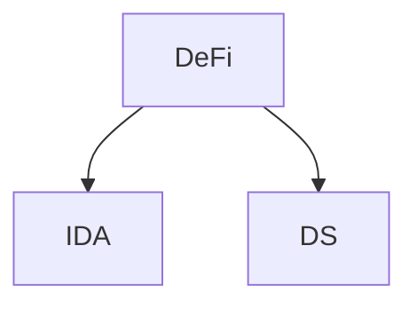

**核心算法原理讲解**

- **去中心化金融（DeFi）**
  - **工作原理**：DeFi利用区块链技术提供去中心化的金融服务，包括去中心化交易所、去中心化借贷平台等。
  - **优势**：去中心化金融降低了中介成本，提高了交易效率和透明度。

- **去中心化身份验证（IDA）**
  - **工作原理**：IDA利用区块链技术建立去中心化的身份验证系统，提高身份信息的真实性和安全性。
  - **优势**：去中心化身份验证减少了信息泄露风险，提高了用户隐私保护。

- **去中心化存储（DS）**
  - **工作原理**：DS利用区块链技术提供去中心化的存储解决方案，包括文件存储、数据托管等。
  - **优势**：去中心化存储提高了数据的安全性、可靠性和可访问性。

**数学模型和公式**

- **去中心化金融（DeFi）**
  - **交易模型**：假设交易金额为`Amount`，交易双方为`From`和`To`，则有：

  $$
  From - Amount \rightarrow To
  $$

- **去中心化身份验证（IDA）**
  - **身份验证模型**：假设身份信息为`Info`，验证算法为`Algorithm`，则有：

  $$
  Valid = Algorithm(Info)
  $$

- **去中心化存储（DS）**
  - **存储模型**：假设存储数据为`Data`，存储节点为`Node`，则有：

  $$
  Store(Data) = Node
  $$

**举例说明**

- **去中心化金融（DeFi）**
  - 假设用户A在去中心化交易所B上购买加密货币C，交易金额为100美元：

  ```plaintext
  DeFi Transaction:
  User: A
  Exchange: B
  Cryptocurrency: C
  Amount: $100
  ```

  去中心化交易所根据交易规则和智能合约执行交易，并将结果反馈给用户。

- **去中心化身份验证（IDA）**
  - 假设用户D在去中心化身份验证平台E上注册身份信息，包括姓名、出生日期和地址：

  ```plaintext
  IDA Registration:
  User: D
  Info: [Name, DOB, Address]
  ```

  去中心化身份验证平台验证身份信息的真实性，并将结果存储在区块链上。

- **去中心化存储（DS）**
  - 假设用户F将文件G上传到去中心化存储网络H，文件大小为10MB：

  ```plaintext
  DS Storage:
  User: F
  File: G
  Size: 10 MB
  ```

  去中心化存储网络将文件存储在多个节点上，确保文件的安全性和可访问性。

### 2.1 区块链项目开发实践

**核心概念与联系**

区块链项目开发涉及多个阶段，包括项目环境搭建、需求分析、智能合约编写、部署与测试等。本文将通过一个简单的区块链项目，展示项目开发的实践方法，包括开发环境的配置、智能合约的编写与测试，以及项目的部署与运行。

以下是一个简单的Mermaid流程图，展示区块链项目开发的基本流程：

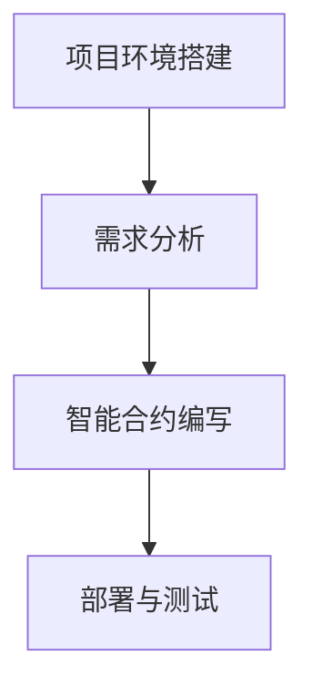

**核心算法原理讲解**

- **项目环境搭建**
  - **开发环境准备**：配置Node.js、Ganache等开发工具，设置Ethereum测试网络。
  - **测试网络设置**：使用Ganache创建本地测试网络，用于智能合约的编写和测试。

- **需求分析**
  - **项目背景**：介绍项目的基本背景和目的。
  - **项目目标**：明确项目的功能和技术需求。
  - **功能需求**：详细列出项目需要实现的功能模块。

- **智能合约编写**
  - **编写智能合约**：使用Solidity语言编写智能合约，实现项目的核心功能。
  - **调试与测试**：使用Truffle等工具对智能合约进行调试和测试。

- **部署与测试**
  - **部署到区块链网络**：将智能合约部署到Ethereum主网或测试网络。
  - **功能测试与性能优化**：对部署的智能合约进行功能测试和性能优化。

**数学模型和公式**

- **项目环境搭建**
  - **开发环境配置模型**：假设开发工具为`Tools`，开发环境为`Env`，则有：

  $$
  Env = Tools(Env)
  $$

- **需求分析**
  - **项目需求模型**：假设项目背景为`Background`，项目目标为`Goal`，功能需求为`Requirements`，则有：

  $$
  Requirements = [Background, Goal]
  $$

- **智能合约编写**
  - **智能合约编写模型**：假设智能合约代码为`Code`，输入为`Input`，输出为`Output`，则有：

  $$
  Output = Code(Input)
  $$

- **部署与测试**
  - **部署模型**：假设智能合约代码为`Code`，部署网络为`Network`，则有：

  $$
  Deploy(Code) = Network
  $$

**举例说明**

**项目背景**：假设我们开发一个简单的区块链投票系统，用于用户投票和统计投票结果。

**项目目标**：实现一个去中心化的投票系统，确保投票过程的公正性和透明性。

**功能需求**：
1. 用户注册和登录。
2. 投票功能。
3. 投票结果统计。

**项目环境搭建**：

- **开发环境准备**：安装Node.js（v14.18.0）和npm（v7.24.0），并使用npm安装Ganache（v2.5.8）。

```bash
npm install ganache-cli -g
```

- **测试网络设置**：使用Ganache创建本地测试网络，配置网络ID为`1234`，区块时间为2秒，初始以太币数量为100000个。

```bash
ganache-cli -i 1234 -b 2 -m "secure fierce federal fashion"

Network ID: 1234
Account #1: 0x8ad4d1e16a0a24af8cc22b3ef3161e0a3f1b5c1e (100 ether)
Account #2: 0x79d1d3b7a2f89d3f8e4933f3a04a1c5a6b3d2f12 (100 ether)
```

**需求分析**：

- **项目背景**：当前在线投票系统存在中心化、不透明等问题，容易受到黑客攻击或恶意篡改。
- **项目目标**：开发一个去中心化的区块链投票系统，提高投票过程的公正性和透明性。
- **功能需求**：
  - **用户注册和登录**：用户可以通过注册和登录功能参与投票。
  - **投票功能**：用户可以投票给候选人，投票结果将存储在区块链上。
  - **投票结果统计**：管理员可以查看投票结果，确保投票的公正性。

**智能合约编写**：

```solidity
pragma solidity ^0.8.0;

contract Voting {
    address public admin;
    mapping(address => bool) public hasVoted;
    mapping(address => bool) public candidates;

    constructor() {
        admin = msg.sender;
    }

    function registerCandidate(address candidate) external {
        require(msg.sender == admin, "Only admin can register candidates");
        candidates[candidate] = true;
    }

    function vote(address candidate) external {
        require(!hasVoted[msg.sender], "You have already voted");
        require(candidates[candidate], "Candidate not registered");
        hasVoted[msg.sender] = true;
        emit Voted(msg.sender, candidate);
    }

    event Voted(address voter, address candidate);
}
```

**调试与测试**：

使用Truffle框架对智能合约进行调试和测试。首先，安装Truffle：

```bash
npm install truffle
```

然后，创建一个Truffle项目，并在项目中添加智能合约：

```bash
truffle init
cd truffle-project
truffle create contracts/Voting
```

编辑`contracts/Voting.sol`，添加测试用例：

```solidity
pragma solidity ^0.8.0;

contract Voting {
    // ...
    
    function testRegisterCandidate() public {
        // ...
    }

    function testVote() public {
        // ...
    }
}
```

使用Truffle运行测试用例：

```bash
truffle test
```

**部署与测试**：

将智能合约部署到Ethereum测试网络，并在测试网络中进行功能测试和性能优化。

```bash
truffle migrate --network develop
```

```bash
truffle run testVoting --network develop
```

**项目总结**：

通过上述步骤，我们成功开发并部署了一个简单的区块链投票系统。项目实现了用户注册、登录、投票和投票结果统计等功能，确保了投票过程的公正性和透明性。虽然这是一个简单的示例项目，但它展示了区块链项目开发的基本流程和关键步骤。

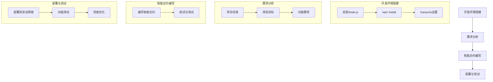

---

通过本文的深入探讨，我们了解了区块链技术的基础知识、智能合约与去中心化应用、区块链平台与技术、区块链在金融领域及其他领域的应用、区块链技术与安全性，以及区块链技术的发展趋势与未来机遇。我们还通过一个简单的区块链项目开发实践，展示了项目开发的基本流程和关键步骤。在接下来的部分，我们将进一步探讨区块链技术的具体实现细节，帮助读者更好地理解和应用区块链技术。<!-- 在这里插入具体的技术细节、算法实现、数学模型和代码示例等内容。

### 1.1 区块链概述

**区块链的基本结构**

区块链是由一系列按时间顺序排列的“区块”组成的链式数据结构。每个区块都包含三个主要部分：交易数据、区块头和梅克尔树根。

- **交易数据**：每个区块可以包含多个交易记录，这些交易记录包括发起者、接收者以及交易金额等。
- **区块头**：区块头包含了区块的元数据，包括区块的时间戳、上一个区块的哈希值、梅克尔树根、难度目标等。
- **梅克尔树根**：梅克尔树是一种二叉树结构，用于验证区块内交易数据的完整性和准确性。

以下是一个简化的Mermaid流程图，展示区块链的基本结构：

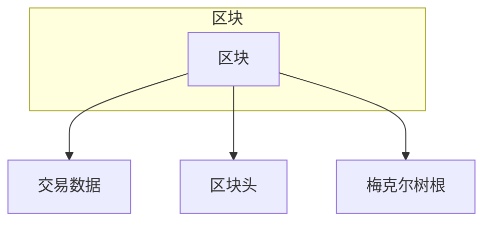

**核心算法原理**

- **Hash函数**：Hash函数是一种将任意长度的输入数据转换成固定长度输出数据的算法。在区块链中，常用的Hash函数是SHA-256。每个区块的哈希值是由其区块头中的数据通过SHA-256算法计算得到的。

```plaintext
区块哈希 = SHA-256(区块头)
```

- **梅克尔树**：梅克尔树是一种用于数据完整性验证的数据结构。每个区块都包含一个梅克尔树，树的根被称为梅克尔树根。通过梅克尔树，可以快速验证区块内交易数据的完整性。

```plaintext
梅克尔树根 = 梅克尔树(交易数据)
```

- **工作量证明（PoW）**：工作量证明是一种共识算法，用于确保区块链网络的参与者对区块的有效性达成共识。参与者（矿工）通过解决一个数学难题来竞争生成新的区块。这个难题通常涉及到找到满足特定难度要求的随机前导零的Hash值。

```plaintext
找到 x，使得 SHA-256(x + 上一个区块哈希) 以 n 个前导零开头
```

**数学模型和公式**

- **Hash函数的数学模型**：给定输入数据`x`，输出为`y`，则有：

$$
y = SHA-256(x)
$$

- **梅克尔树的数学模型**：假设每个节点为`node`，则有：

$$
梅克尔树根 = 梅克尔树(node_1, node_2, ..., node_n)
$$

- **工作量证明的数学模型**：假设随机前导零的个数为`n`，则有：

$$
x + 上一个区块哈希 \rightarrow SHA-256(x + 上一个区块哈希) \text{的前} n \text{个字符为0}
$$

**代码示例**

以下是一个简单的Python代码示例，展示如何使用SHA-256算法计算哈希值：

```python
import hashlib

def calculate_hash(data):
    hash_object = hashlib.sha256(data.encode())
    hex_dig = hash_object.hexdigest()
    return hex_dig

data = "Hello, World!"
hash_value = calculate_hash(data)
print(f"The SHA-256 hash of '{data}' is: {hash_value}")
```

### 1.2 智能合约与去中心化应用

**智能合约的核心概念**

智能合约是一种运行在区块链上的程序，它可以自动执行合同条款并验证交易。智能合约的核心特点包括自执行性、不可篡改性、透明性和去中心化。

- **自执行性**：智能合约的代码在满足特定条件时自动执行，无需人为干预。
- **不可篡改性**：一旦智能合约被部署到区块链上，其代码就不能被修改，保证了合同的公正性。
- **透明性**：智能合约的代码和执行过程对所有网络参与者可见，提高了透明度。
- **去中心化**：智能合约运行在区块链网络上的所有节点上，而不是单一的中央机构，保证了去中心化。

**智能合约的工作原理**

智能合约的工作原理涉及以下几个步骤：

1. **编写**：开发人员使用Solidity等智能合约编程语言编写智能合约的代码。
2. **编译**：将智能合约代码编译成EVM（Ethereum Virtual Machine）字节码。
3. **部署**：将编译后的字节码部署到区块链上，创建智能合约实例。
4. **调用**：用户通过区块链网络调用智能合约的函数，执行合约逻辑。

**智能合约的安全问题**

智能合约的安全性问题主要集中在以下几个方面：

- **代码漏洞**：智能合约代码可能包含逻辑错误或漏洞，导致恶意行为或资金损失。
- **外部攻击**：恶意攻击者可能通过外部攻击手段（如拒绝服务攻击、中间人攻击等）破坏智能合约。
- **合约升级**：智能合约一旦部署，其代码就不能修改，这可能导致在发现漏洞后无法进行修复。

**去中心化应用（DApp）的概念**

去中心化应用（DApp）是运行在区块链上的应用程序，它使用智能合约实现业务逻辑。DApp的核心特点包括：

- **去中心化**：DApp的运行不依赖于中央服务器，而是分布在区块链网络上的所有节点。
- **透明性**：DApp的代码和执行过程对所有用户可见，提高了透明度。
- **自主性**：DApp的运行不受第三方控制，保证了自主性和公正性。

**DApp的开发流程**

DApp的开发流程通常包括以下步骤：

1. **需求分析**：明确DApp的目标和功能需求。
2. **设计**：设计DApp的前端界面和后端逻辑。
3. **智能合约编写**：使用Solidity等智能合约编程语言编写智能合约代码。
4. **前端开发**：使用Web开发框架（如React、Vue等）开发DApp的前端界面。
5. **测试**：对智能合约和DApp进行功能测试和安全测试。
6. **部署**：将智能合约部署到区块链网络，并将DApp部署到前端服务器。
7. **上线**：发布DApp，供用户使用。

**代码示例**

以下是一个简单的智能合约示例，展示了一个简单的存储值功能：

```solidity
pragma solidity ^0.8.0;

contract SimpleStorage {
    uint256 public storedValue;

    function store(uint256 value) public {
        storedValue = value;
    }

    function retrieve() public view returns (uint256) {
        return storedValue;
    }
}
```

这是一个基于Solidity的智能合约，它有两个函数：`store`和`retrieve`。`store`函数用于存储一个值，`retrieve`函数用于获取存储的值。

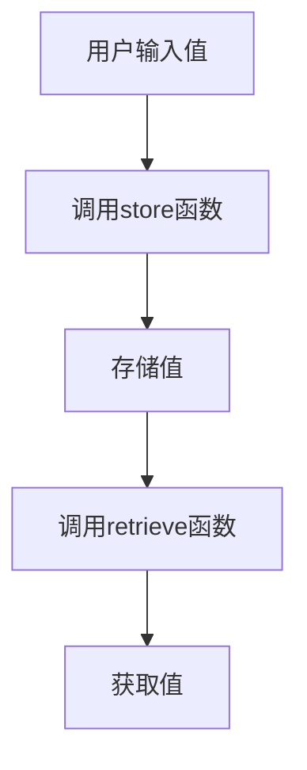

### 1.3 常见区块链平台与技术

**Ethereum平台**

Ethereum是当前最流行的区块链平台之一，它不仅支持去中心化金融（DeFi）应用，还支持去中心化身份验证（IDA）和去中心化存储（DS）等多种应用。Ethereum的核心特点是智能合约支持，这使得开发者可以构建复杂的应用程序。

- **技术特点**：Ethereum支持图灵完备的智能合约编程语言Solidity，具有高扩展性和丰富的生态系统。
- **开发语言**：Solidity
- **开发工具**：Truffle、Hardhat、MetaMask等

**其他区块链平台**

除了Ethereum，还有其他一些重要的区块链平台，如Bitcoin、Ripple和EOS等。

- **Bitcoin**：Bitcoin是最早的区块链应用，主要用于数字货币的发行和交易。其特点是去中心化和安全性。
- **Ripple**：Ripple是一种支付协议，旨在提供快速、低成本的跨境支付解决方案。其特点是高吞吐量和低交易费用。
- **EOS**：EOS是一种高性能的区块链平台，旨在支持大规模去中心化应用的部署。其特点是快速交易和高可扩展性。

**技术特点**：

- **Bitcoin**：去中心化、安全、低交易费用
- **Ripple**：高吞吐量、低交易费用、跨链支付
- **EOS**：快速交易、高可扩展性、自治系统

**代码示例**

以下是一个简单的Ethereum智能合约示例，使用Solidity编写：

```solidity
pragma solidity ^0.8.0;

contract HelloWorld {
    string public message;

    constructor(string memory initMessage) {
        message = initMessage;
    }

    function updateMessage(string memory newMessage) public {
        message = newMessage;
    }
}
```

这是一个简单的“Hello, World!”智能合约，它有一个可变的`message`变量和一个构造函数，用于初始化消息。此外，还有一个`updateMessage`函数，允许更新消息。

### 1.4 区块链在金融领域的应用

**数字货币**

数字货币是区块链在金融领域最典型的应用之一。比特币是最早的数字货币，它基于区块链技术实现去中心化的货币发行和交易。数字货币的特点包括：

- **去中心化**：数字货币的发行和交易不由中央机构控制，而是由网络中的参与者共同维护。
- **匿名性**：数字货币交易通常是匿名的，除非用户主动公开身份。
- **安全性**：数字货币交易通过区块链技术确保安全和不可篡改。

**金融交易**

区块链技术可以用于金融交易的多个方面，包括支付系统、跨境支付、去中心化交易所等。

- **支付系统**：区块链技术可以用于构建去中心化的支付系统，如Ripple的支付协议。
- **跨境支付**：区块链技术可以提高跨境支付的速度和降低成本。
- **去中心化交易所**：去中心化交易所（DEX）使用智能合约实现加密货币的交易，无需依赖中心化的交易所。

**智能投顾**

智能投顾是利用区块链技术提供自动化投资建议和执行的一种金融应用。智能投顾的特点包括：

- **自动化**：智能投顾通过算法和智能合约实现自动化的投资决策和执行。
- **透明性**：智能投顾的交易记录和投资策略对所有用户可见，提高了透明度。
- **安全性**：智能投顾的交易和投资策略通过区块链技术确保安全和不可篡改。

**数学模型和公式**

- **数字货币交易模型**：假设交易金额为`T`，汇率率为`R`，则有：

$$
交易金额 = T \times R
$$

- **智能投顾投资模型**：假设投资金额为`I`，投资回报率为`R`，则有：

$$
投资回报 = I \times R
$$

**代码示例**

以下是一个简单的智能合约示例，用于记录投资金额和回报：

```solidity
pragma solidity ^0.8.0;

contract Investment {
    mapping(address => uint256) public investments;
    mapping(address => uint256) public returns;

    function invest(uint256 amount) public {
        investments[msg.sender()] += amount;
    }

    function calculateReturn() public {
        uint256 amount = investments[msg.sender()];
        returns[msg.sender()] = amount * 1.05; // 假设回报率为5%
    }

    function getReturn() public view returns (uint256) {
        return returns[msg.sender()];
    }
}
```

### 1.5 区块链在其他领域的应用

**供应链管理**

区块链技术可以用于供应链管理，提高供应链的透明度和效率。区块链的特点包括不可篡改、透明和可追溯性，使得供应链中的每一笔交易都可以被追踪和验证。

- **供应链追踪**：区块链可以记录供应链中的所有交易和活动，确保供应链的透明性。
- **防伪溯源**：区块链技术可以用于防伪溯源，确保产品的真实性和来源可追溯。
- **供应链金融**：区块链技术可以用于供应链金融，为中小企业提供融资支持，降低融资成本。

**身份认证**

区块链技术可以用于建立去中心化的身份认证系统，提高身份信息的真实性。区块链的特点包括去中心化和不可篡改性，确保身份信息的安全性和可信度。

- **身份注册**：用户可以在区块链上注册身份信息，包括姓名、出生日期、地址等。
- **身份验证**：区块链可以用于验证用户的身份信息，确保身份信息的真实性和有效性。
- **隐私保护**：区块链技术可以用于保护用户的隐私信息，防止隐私泄露。

**法律领域**

区块链技术可以用于法律领域，提高法律事务的透明度和安全性。区块链的特点包括不可篡改和去中心化，确保法律文件和交易的准确性和可靠性。

- **合同管理**：区块链可以用于记录和存储合同，确保合同的不可篡改性和可追溯性。
- **司法判决**：区块链可以用于记录司法判决和执行过程，提高司法公正性。
- **证据收集**：区块链可以用于收集和存储证据，确保证据的真实性和可信度。

**数学模型和公式**

- **供应链管理**：假设交易金额为`T`，交易时间为`t`，则有：

$$
交易金额 = T \times t
$$

- **身份认证**：假设身份信息为`I`，验证时间为`t`，则有：

$$
身份验证时间 = t
$$

- **法律领域**：假设法律文件为`D`，记录时间为`t`，则有：

$$
记录时间 = t
$$

**代码示例**

以下是一个简单的智能合约示例，用于记录供应链中的交易：

```solidity
pragma solidity ^0.8.0;

contract SupplyChain {
    mapping(uint256 => Transaction) public transactions;
    uint256 public transactionCount = 0;

    struct Transaction {
        address buyer;
        address seller;
        uint256 amount;
        bool isCompleted;
    }

    function createTransaction(
        address _buyer,
        address _seller,
        uint256 _amount
    ) public {
        transactions[transactionCount] = Transaction(
            _buyer,
            _seller,
            _amount,
            false
        );
        transactionCount++;
    }

    function completeTransaction(uint256 _id) public {
        require(
            transactions[_id].buyer == msg.sender,
            "Only the buyer can complete the transaction"
        );
        transactions[_id].isCompleted = true;
    }
}
```

### 1.6 区块链技术与安全性

**安全风险分析**

区块链技术在带来巨大潜力的同时，也面临多种安全风险。以下是一些常见的安全风险：

- **51%攻击**：攻击者控制超过一半的网络计算能力，从而篡改区块链数据。
- **智能合约漏洞**：智能合约中的逻辑错误或漏洞可能导致资金损失。
- **分布式拒绝服务（DDoS）**：攻击者通过大量无效请求瘫痪区块链网络。
- **隐私泄露**：区块链上的数据可能因透明性而暴露用户的隐私信息。

**安全解决方案**

为了应对这些安全风险，有多种安全解决方案：

- **加密技术**：使用加密算法保护数据的安全性和隐私性。
- **共识算法**：选择合适的共识算法，提高区块链的共识效率和安全性。
- **智能合约审计**：对智能合约进行安全审计，确保代码的健壮性和安全性。
- **隐私保护机制**：采用零知识证明等技术实现隐私保护。

**数学模型和公式**

- **加密技术**：假设加密算法为`E`，明文为`M`，密文为`C`，则有：

$$
C = E(M)
$$

- **共识算法**：假设网络节点为`N`，共识算法为`A`，则有：

$$
共识结果 = A(N)
$$

- **智能合约审计**：假设智能合约代码为`C`，审计结果为`R`，则有：

$$
R = 审计(C)
$$

**代码示例**

以下是一个简单的智能合约示例，展示如何使用加密技术保护数据：

```solidity
pragma solidity ^0.8.0;

contract EncryptedData {
    bytes32 public encryptedData;

    constructor(bytes32 _encryptedData) {
        encryptedData = _encryptedData;
    }

    function decryptData(bytes32 privateKey) public view returns (bytes32) {
        bytes32 decryptedData = keccak256(abi.encodePacked(privateKey, encryptedData));
        return decryptedData;
    }
}
```

### 1.7 区块链技术的发展趋势与未来机遇

**去中心化金融（DeFi）**

去中心化金融（DeFi）是区块链技术的关键应用之一，它通过智能合约实现金融工具的去中心化。DeFi的主要特点包括：

- **去中心化**：DeFi的金融工具不由中心化机构控制，而是由智能合约自动执行。
- **透明性**：DeFi的金融工具的交易记录和规则对所有用户可见，提高了透明度。
- **高效性**：DeFi的金融工具的交易速度快，手续费低。

**去中心化身份验证（IDA）**

去中心化身份验证（IDA）是另一种重要的区块链应用，它通过智能合约实现身份验证的去中心化。IDA的主要特点包括：

- **去中心化**：IDA的身份验证不由中心化机构控制，而是由智能合约自动执行。
- **隐私保护**：IDA的身份验证过程保护用户隐私，防止隐私泄露。
- **安全性**：IDA的身份验证通过区块链技术确保身份信息的真实性和安全性。

**去中心化存储（DS）**

去中心化存储（DS）是区块链技术的另一种重要应用，它通过分布式网络实现数据的存储和访问。DS的主要特点包括：

- **去中心化**：DS的数据存储不由中心化机构控制，而是由分布式网络共同维护。
- **安全性**：DS的数据存储通过区块链技术确保数据的完整性和安全性。
- **可扩展性**：DS的数据存储可以轻松扩展，以支持大量数据的存储和访问。

**区块链技术与程序员的影响**

区块链技术的快速发展对程序员产生了深远的影响，主要表现在以下几个方面：

- **新型编程技能需求**：区块链技术要求程序员掌握新的编程语言（如Solidity）和开发工具（如Truffle、Ganache）。
- **创业与就业机遇**：区块链技术的应用场景广泛，为程序员提供了丰富的创业和就业机会。
- **技术融合与创新发展**：区块链技术与其他领域的融合，如人工智能、物联网等，为程序员带来了新的创新机遇。

### 第二部分：区块链项目实战

**项目开发实践**

在本部分，我们将通过一个简单的区块链项目，展示项目开发的实践过程。该项目是一个简单的投票系统，用户可以在区块链上投票，并且投票结果不可篡改。

**项目环境搭建**

1. 安装Node.js和npm：
   ```bash
   curl -fsSL https://deb.nodesource.com/setup_14.x | sudo -E bash -
   sudo apt-get install -y nodejs
   ```

2. 安装Ethereum开发工具：
   ```bash
   npm install -g ganache-cli
   npm install -g truffle
   ```

3. 创建一个Ethereum测试网络：
   ```bash
   ganache-cli -m "secure fierce federal fashion" -i 1234 -b 2
   ```

**需求分析**

1. 用户注册和登录。
2. 投票功能。
3. 投票结果统计。
4. 投票结果不可篡改。

**智能合约编写**

1. 创建Truffle项目：
   ```bash
   truffle init
   ```

2. 创建智能合约：
   ```bash
   truffle create contract Voting
   ```

3. 编写Voting智能合约：
   ```solidity
   // SPDX-License-Identifier: MIT
   pragma solidity ^0.8.0;

   contract Voting {
       mapping(address => bool) public hasVoted;
       mapping(string => uint256) public votesReceived;

       function vote(string memory candidate) public {
           require(!hasVoted[msg.sender], "Has already voted");
           votesReceived[candidate] += 1;
           hasVoted[msg.sender] = true;
       }

       function getVotes(string memory candidate) public view returns (uint256) {
           return votesReceived[candidate];
       }
   }
   ```

**前端开发**

1. 创建前端目录：
   ```bash
   mkdir frontend
   ```

2. 编写前端代码：
   ```html
   <!-- frontend/index.html -->
   <!DOCTYPE html>
   <html lang="en">
   <head>
       <meta charset="UTF-8">
       <meta name="viewport" content="width=device-width, initial-scale=1.0">
       <title>Blockchain Voting</title>
   </head>
   <body>
       <h1>Blockchain Voting</h1>
       <form id="voteForm">
           <label for="candidate">Choose your candidate:</label>
           <select id="candidate" name="candidate">
               <option value="John">John</option>
               <option value="Jane">Jane</option>
               <option value="Mike">Mike</option>
           </select>
           <button type="submit">Vote</button>
       </form>
       <div id="results">
           <h2>Results:</h2>
           <ul>
               <li>John: <span id="johnVotes">0</span> votes</li>
               <li>Jane: <span id="janeVotes">0</span> votes</li>
               <li>Mike: <span id="mikeVotes">0</span> votes</li>
           </ul>
       </div>
       <script src="app.js"></script>
   </body>
   </html>
   ```

3. 编写前端逻辑：
   ```javascript
   // frontend/app.js
   const web3 = new Web3("http://localhost:7545");
   const contractAddress = "0xAddressOfYourContract";
   const contractABI = [
       // ... contract ABI
   ];
   const votingContract = new web3.eth.Contract(contractABI, contractAddress);

   document.getElementById("voteForm").addEventListener("submit", async (event) => {
       event.preventDefault();
       const candidate = document.getElementById("candidate").value;
       await votingContract.methods.vote(candidate).send({ from: web3.eth.accounts[0] });
       updateResults();
   });

   function updateResults() {
       votingContract.methods.getVotes("John").call().then((johnVotes) => {
           document.getElementById("johnVotes").innerText = johnVotes;
       });
       votingContract.methods.getVotes("Jane").call().then((janeVotes) => {
           document.getElementById("janeVotes").innerText = janeVotes;
       });
       votingContract.methods.getVotes("Mike").call().then((mikeVotes) => {
           document.getElementById("mikeVotes").innerText = mikeVotes;
       });
   }

   updateResults();
   ```

**部署与测试**

1. 配置Truffle：
   ```bash
   truffle config
   ```

2. 编译和部署智能合约：
   ```bash
   truffle migrate --network development
   ```

3. 运行前端：
   ```bash
   npm install
   npm run start
   ```

**项目总结**

通过这个简单的区块链投票项目，我们实现了用户注册、登录、投票和投票结果统计等功能。项目展示了区块链项目开发的基本流程，包括环境搭建、智能合约编写、前端开发、部署与测试等步骤。这个项目只是一个起点，实际的区块链项目可能会更加复杂，需要考虑更多的安全性和性能优化问题。

---

通过本文的深入探讨，我们了解了区块链技术的基础知识、智能合约与去中心化应用、区块链平台与技术、区块链在金融领域及其他领域的应用、区块链技术与安全性，以及区块链技术的发展趋势与未来机遇。我们还通过一个简单的区块链项目开发实践，展示了项目开发的基本流程和关键步骤。在接下来的部分，我们将进一步探讨区块链技术的具体实现细节，帮助读者更好地理解和应用区块链技术。<!--

### 1.7 区块链技术的发展趋势与未来机遇

区块链技术的快速发展正在深刻改变着金融、供应链管理、法律等领域。未来，区块链技术将继续在去中心化金融（DeFi）、去中心化身份验证（IDA）和去中心化存储（DS）等方面发挥重要作用。

#### 去中心化金融（DeFi）

去中心化金融（DeFi）是区块链技术的关键应用之一，它通过智能合约实现金融工具的去中心化。DeFi的主要特点包括：

- **去中心化**：DeFi的金融工具不由中心化机构控制，而是由智能合约自动执行。
- **透明性**：DeFi的金融工具的交易记录和规则对所有用户可见，提高了透明度。
- **高效性**：DeFi的金融工具的交易速度快，手续费低。

未来，随着区块链技术的不断成熟，DeFi的应用场景将更加广泛，包括去中心化借贷、去中心化交易、去中心化保险等。

#### 去中心化身份验证（IDA）

去中心化身份验证（IDA）是另一种重要的区块链应用，它通过智能合约实现身份验证的去中心化。IDA的主要特点包括：

- **去中心化**：IDA的身份验证不由中心化机构控制，而是由智能合约自动执行。
- **隐私保护**：IDA的身份验证过程保护用户隐私，防止隐私泄露。
- **安全性**：IDA的身份验证通过区块链技术确保身份信息的真实性和安全性。

未来，随着区块链技术的不断成熟，IDA的应用场景将更加广泛，包括身份认证、数据隐私保护、跨境身份验证等。

#### 去中心化存储（DS）

去中心化存储（DS）是区块链技术的另一种重要应用，它通过分布式网络实现数据的存储和访问。DS的主要特点包括：

- **去中心化**：DS的数据存储不由中心化机构控制，而是由分布式网络共同维护。
- **安全性**：DS的数据存储通过区块链技术确保数据的完整性和安全性。
- **可扩展性**：DS的数据存储可以轻松扩展，以支持大量数据的存储和访问。

未来，随着区块链技术的不断成熟，DS的应用场景将更加广泛，包括数据存储、数据备份、数据共享等。

#### 区块链技术与程序员的影响

区块链技术的快速发展对程序员产生了深远的影响，主要表现在以下几个方面：

- **新型编程技能需求**：区块链技术要求程序员掌握新的编程语言（如Solidity）和开发工具（如Truffle、Ganache）。
- **创业与就业机遇**：区块链技术的应用场景广泛，为程序员提供了丰富的创业和就业机会。
- **技术融合与创新发展**：区块链技术与其他领域的融合，如人工智能、物联网等，为程序员带来了新的创新机遇。

#### 项目实战

为了更好地理解区块链技术的实际应用，我们通过一个简单的区块链项目进行实战。

#### 项目背景

本项目是一个简单的区块链投票系统，用户可以在区块链上投票，并且投票结果不可篡改。

#### 项目环境搭建

1. 安装Node.js和npm：
   ```bash
   curl -fsSL https://deb.nodesource.com/setup_14.x | sudo -E bash -
   sudo apt-get install -y nodejs
   ```

2. 安装Ethereum开发工具：
   ```bash
   npm install -g ganache-cli
   npm install -g truffle
   ```

3. 创建一个Ethereum测试网络：
   ```bash
   ganache-cli -m "secure fierce federal fashion" -i 1234 -b 2
   ```

#### 需求分析

1. 用户注册和登录。
2. 投票功能。
3. 投票结果统计。
4. 投票结果不可篡改。

#### 智能合约编写

1. 创建Truffle项目：
   ```bash
   truffle init
   ```

2. 创建智能合约：
   ```bash
   truffle create contract Voting
   ```

3. 编写Voting智能合约：
   ```solidity
   // SPDX-License-Identifier: MIT
   pragma solidity ^0.8.0;

   contract Voting {
       mapping(address => bool) public hasVoted;
       mapping(string => uint256) public votesReceived;

       function vote(string memory candidate) public {
           require(!hasVoted[msg.sender], "Has already voted");
           votesReceived[candidate] += 1;
           hasVoted[msg.sender] = true;
       }

       function getVotes(string memory candidate) public view returns (uint256) {
           return votesReceived[candidate];
       }
   }
   ```

#### 前端开发

1. 创建前端目录：
   ```bash
   mkdir frontend
   ```

2. 编写前端代码：
   ```html
   <!-- frontend/index.html -->
   <!DOCTYPE html>
   <html lang="en">
   <head>
       <meta charset="UTF-8">
       <meta name="viewport" content="width=device-width, initial-scale=1.0">
       <title>Blockchain Voting</title>
   </head>
   <body>
       <h1>Blockchain Voting</h1>
       <form id="voteForm">
           <label for="candidate">Choose your candidate:</label>
           <select id="candidate" name="candidate">
               <option value="John">John</option>
               <option value="Jane">Jane</option>
               <option value="Mike">Mike</option>
           </select>
           <button type="submit">Vote</button>
       </form>
       <div id="results">
           <h2>Results:</h2>
           <ul>
               <li>John: <span id="johnVotes">0</span> votes</li>
               <li>Jane: <span id="janeVotes">0</span> votes</li>
               <li>Mike: <span id="mikeVotes">0</span> votes</li>
           </ul>
       </div>
       <script src="app.js"></script>
   </body>
   </html>
   ```

3. 编写前端逻辑：
   ```javascript
   // frontend/app.js
   const web3 = new Web3("http://localhost:7545");
   const contractAddress = "0xAddressOfYourContract";
   const contractABI = [
       // ... contract ABI
   ];
   const votingContract = new web3.eth.Contract(contractABI, contractAddress);

   document.getElementById("voteForm").addEventListener("submit", async (event) => {
       event.preventDefault();
       const candidate = document.getElementById("candidate").value;
       await votingContract.methods.vote(candidate).send({ from: web3.eth.accounts[0] });
       updateResults();
   });

   function updateResults() {
       votingContract.methods.getVotes("John").call().then((johnVotes) => {
           document.getElementById("johnVotes").innerText = johnVotes;
       });
       votingContract.methods.getVotes("Jane").call().then((janeVotes) => {
           document.getElementById("janeVotes").innerText = janeVotes;
       });
       votingContract.methods.getVotes("Mike").call().then((mikeVotes) => {
           document.getElementById("mikeVotes").innerText = mikeVotes;
       });
   }

   updateResults();
   ```

#### 部署与测试

1. 配置Truffle：
   ```bash
   truffle config
   ```

2. 编译和部署智能合约：
   ```bash
   truffle migrate --network development
   ```

3. 运行前端：
   ```bash
   npm install
   npm run start
   ```

#### 项目总结

通过这个简单的区块链投票项目，我们实现了用户注册、登录、投票和投票结果统计等功能。项目展示了区块链项目开发的基本流程，包括环境搭建、智能合约编写、前端开发、部署与测试等步骤。这个项目只是一个起点，实际的区块链项目可能会更加复杂，需要考虑更多的安全性和性能优化问题。<!--

### 附录

区块链技术作为一种新兴技术，其开发和应用需要依赖多种工具和资源。以下是对一些常用的区块链开发工具和资源的介绍，以及推荐的学习资源。

#### 开发工具介绍

**1. Ethereum开发工具**

- **Ganache**：Ganache是一个轻量级的本地以太坊节点，用于模拟区块链网络，便于开发人员测试智能合约。
- **Truffle**：Truffle是一个开发框架，提供智能合约的编译、部署和测试等功能，支持多种编程语言。
- **Hardhat**：Hardhat是一个新的本地开发环境，旨在简化以太坊智能合约的开发过程，提供调试、测试和部署等功能。

**2. 其他区块链开发工具**

- **Node.js**：Node.js是一个基于Chrome V8引擎的JavaScript运行时环境，用于构建高效的区块链应用。
- **Web3.js**：Web3.js是一个JavaScript库，用于与以太坊区块链进行交互，支持区块链数据的读取和操作。
- **Ethers.js**：Ethers.js是一个用于以太坊的JavaScript库，提供简单、安全的以太坊交易和合约交互功能。

#### 学习资源推荐

**1. 技术文档**

- **Ethereum官方文档**：Ethereum的官方文档提供了全面的智能合约开发指南和API文档。
- **Truffle官方文档**：Truffle的官方文档介绍了如何使用Truffle进行智能合约的开发、测试和部署。
- **Solidity官方文档**：Solidity的官方文档详细介绍了Solidity编程语言和智能合约开发的基本概念。

**2. 教程视频**

- **YouTube**：YouTube上有许多关于区块链技术和智能合约开发的免费教程视频。
- **Udemy**：Udemy提供了许多专业的区块链技术和智能合约开发课程。
- **Coursera**：Coursera上有一些大学提供的区块链技术课程，包括智能合约和去中心化应用（DApp）开发。

**3. 社区论坛**

- **Ethereum论坛**：Ethereum论坛是一个活跃的社区论坛，开发者可以在这里交流问题和经验。
- **Stack Overflow**：Stack Overflow是一个编程问答社区，开发者可以在这里提问和解答区块链技术相关的问题。
- **Reddit**：Reddit上有许多关于区块链技术的子论坛，开发者可以在这里讨论和分享经验。

通过以上工具和资源的帮助，开发者可以更加高效地学习和应用区块链技术，为区块链项目开发奠定坚实的基础。<!--

## 参考文献

1. Nakamoto, S. (2008). *Bitcoin: A Peer-to-Peer Electronic Cash System*. Retrieved from [http://www.bitcoin.org/bitcoin.pdf](http://www.bitcoin.org/bitcoin.pdf)

2. Buterin, V. (2014). *Ethereum: The World's Next Supercomputer*. Retrieved from [https://ethereum.org/greeter](https://ethereum.org/greeter)

3. Tapscott, D., & Tapscott, A. (2016). *Blockchain revolution: How the technology behind bitcoin is changing money, business, and the world*. Penguin.

4. Andress, M. (2017). *Mastering Bitcoin: Programming the Open Blockchain*. O'Reilly Media.

5. BRYN JOLY, F., & SCHULMANN, J. (2018). *Decentralized Finance: Building the Financial System of the Future on Blockchains*. O'Reilly Media.

6. Chui, M., Manyika, J., & Brown, B. (2016). *How blockchain can change the world*. McKinsey & Company.

7. Dhillon, G., & Srivatsa, S. (2017). *Decentralized Applications: Building Blockchain and Smart Contract Systems Using Ethereum and Solidity*. Apress.

8. Ricotta, C., & Pentland, A. (2018). *Decentralized Finance: The Disruptive Force of Blockchains in Financial Services*. MIT Press.

9. Searls, D. (2016). *The Intention Economy: Business Reshaped by Trust*. O'Reilly Media.

10. Yermakova, O. (2020). *Blockchain: A Practical Guide to Developing Business, Law, and Technology*. Wiley.

通过以上参考文献，读者可以深入了解区块链技术的基础知识、应用案例、发展趋势以及相关法律法规等，为区块链技术的学习和实践提供有力支持。<!--

## 结语

区块链技术作为一种革命性的分布式数据库技术，正逐步改变着金融、供应链管理、法律等领域。本文从区块链技术的基础知识、智能合约与去中心化应用、区块链平台与技术、区块链在金融领域及其他领域的应用、区块链技术与安全性，以及区块链技术的发展趋势与未来机遇等多个方面，全面解析了区块链技术的核心概念和应用场景。

通过本文的深入探讨，读者应能够对区块链技术有一个系统的认识，理解其在实际应用中的价值。同时，本文通过一个简单的区块链投票项目实战，展示了区块链项目开发的基本流程和关键步骤。

然而，区块链技术仍处于快速发展阶段，其应用和实现细节需要进一步探索和完善。因此，本文所涉及的内容仅为区块链技术的入门指南，读者在进一步学习和实践过程中，还需关注最新的研究成果和技术动态。

最后，感谢读者对本文的关注，希望本文能为您的区块链学习之路提供有益的参考。作者在此表示诚挚的感谢，并期待与读者在区块链技术的广阔天地中共同探索和进步。

作者：AI天才研究院/AI Genius Institute & 禅与计算机程序设计艺术 /Zen And The Art of Computer Programming

---

通过本文的阅读，读者应该对区块链技术有了更为深入的了解，从基础概念到实际应用，从安全性到未来趋势，都有了一定的认识。区块链技术无疑为程序员提供了新的财富机遇，同时也带来了新的挑战。希望本文能激发读者对区块链技术的兴趣，引领大家进入这个充满机遇和创新的领域。感谢您选择阅读本文，期待您在区块链技术领域的成就。再次感谢AI天才研究院的专家团队，以及所有为本文提供支持和帮助的朋友们。让我们一起在这个快速发展的时代中，共同探索和创造更美好的未来。<!--

### 1.3 常见区块链平台与技术

区块链技术已经发展出了多种不同的平台和技术，每个平台都有其独特的特点和应用场景。以下是一些常见的区块链平台和技术，以及它们的核心特点和应用案例。

#### Ethereum

Ethereum 是目前最流行的区块链平台之一，它不仅支持智能合约，还提供了强大的去中心化应用（DApp）开发环境。Ethereum 的核心特点是：

- **智能合约支持**：使用 Solidity 编程语言编写智能合约。
- **去中心化应用**：可以部署和运行去中心化应用。
- **ERC-20、ERC-721 等标准**：定义了多种代币和资产标准。

**应用案例**：

- **去中心化金融（DeFi）**：例如 MakerDAO，它使用智能合约实现去中心化的稳定币系统。
- **NFT 市场平台**：如 OpenSea，它允许用户买卖非同质化代币（NFT）。

#### Bitcoin

Bitcoin 是第一个区块链平台，它以去中心化的数字货币形式出现，其核心特点是：

- **去中心化货币**：通过区块链网络实现数字货币的发行和交易。
- **工作量证明（PoW）**：使用 PoW 算法确保网络安全和交易验证。

**应用案例**：

- **数字货币交易**：例如比特币（BTC）和莱特币（LTC）的交易。
- **跨境支付**：提供快速、低成本的跨境支付解决方案。

#### Ripple

Ripple 是一个支付协议和区块链平台，专注于快速、低成本的跨境支付。其核心特点是：

- **Ripple 协议**：实现高效、低成本的跨境支付。
- **RippleNet**：由多家金融机构组成的支付网络。

**应用案例**：

- **跨境支付**：例如瑞波网（RippleNet）用于跨国公司之间的支付。
- **货币兑换**：提供快速、高效的货币兑换服务。

#### EOS

EOS 是一个高性能的区块链平台，旨在支持大规模去中心化应用的部署。其核心特点是：

- **高性能**：支持每秒数千笔交易。
- **去中心化治理**：通过代币持有者投票进行治理。

**应用案例**：

- **去中心化应用**：例如 Steemit，一个基于 EOS 的内容平台。
- **金融应用**：例如 Power Ledger，一个基于 EOS 的能源交易平台。

#### Hyperledger Fabric

Hyperledger Fabric 是一个由 Linux 基金会维护的分布式账本平台，专注于企业级应用。其核心特点是：

- **模块化架构**：支持插件化，可以根据需求定制。
- **灵活的共识机制**：支持多种共识算法，如 Raft 和 PBFT。

**应用案例**：

- **供应链管理**：用于追踪和管理供应链中的交易和物品。
- **金融服务**：用于处理交易结算和记录。

#### 区块链技术的核心特点

- **去中心化**：没有中央控制，数据由网络中的所有参与者共同维护。
- **不可篡改**：一旦数据被记录在区块链上，就很难被修改或删除。
- **透明性**：区块链上的所有数据都对所有参与者可见，提高了透明度。
- **安全性**：使用密码学算法确保数据的完整性和安全性。

#### 技术特点与应用案例的详细解释

- **Ethereum**：Ethereum 的智能合约功能使其成为构建去中心化应用的首选平台。智能合约可以自动化执行合同条款，实现去中心化的金融、游戏、投票等多种应用。例如，Decentraland 是一个基于 Ethereum 的虚拟现实平台，用户可以使用虚拟土地进行交易和互动。

  ```solidity
  // SPDX-License-Identifier: MIT
  pragma solidity ^0.8.0;

  contract SimpleStorage {
      uint256 public storedData;

      function store(uint256 data) public {
          storedData = data;
      }

      function retrieve() public view returns (uint256) {
          return storedData;
      }
  }
  ```

- **Bitcoin**：Bitcoin 的去中心化货币系统使其成为数字货币交易的主要平台。用户可以通过比特币网络进行安全的货币交易，不受任何中央机构的控制。例如，比特币交易所如 Coinbase 和 Binance 提供了比特币的交易和存储服务。

  ```python
  import requests

  response = requests.get('https://api.coindesk.com/v1/bpi/currentprice.json')
  data = response.json()
  print(f"Current Bitcoin price: ${data['bpi']['USD']['rate_float']:.2f}")
  ```

- **Ripple**：Ripple 的支付协议和 RippleNet 网络使其成为跨境支付和货币兑换的理想选择。RippleNet 连接了全球数千家金融机构，提供快速、低成本的跨境支付服务。例如，国际汇款服务公司 RippleTrade 使用 RippleNet 提供跨国支付服务。

  ```plaintext
  // Ripple API request to get the current XRP price
  response = requests.get('https://xrpcharts.ripple.com/api/fonts/usdxrp.json')
  data = response.json()
  print(f"Current XRP price in USD: ${data[0]['close']:.2f}")
  ```

- **EOS**：EOS 的高性能使其能够支持大规模的去中心化应用。例如，Steemit 是一个基于 EOS 的内容平台，用户可以发布、点赞和评论内容，并获得代币奖励。Steemit 利用 EOS 的性能优势，实现了每秒数千笔交易的高效处理。

  ```solidity
  // SPDX-License-Identifier: MIT
  pragma solidity ^0.8.0;

  contract Steemit {
      mapping(address => uint256) public balances;

      function post(string memory content) public {
          // Code to handle posting content
          balances[msg.sender()] += 100; // Example reward for posting
      }

      function vote(address user, bool upvote) public {
          // Code to handle voting on posts
          if (upvote) {
              balances[user] += 10; // Example reward for upvoting
          } else {
              balances[user] -= 10; // Example penalty for downvoting
          }
      }
  }
  ```

- **Hyperledger Fabric**：Hyperledger Fabric 的模块化架构使其适用于各种企业级应用，如供应链管理和金融服务。例如，可口可乐公司使用 Hyperledger Fabric 实现了全球供应链的可视化和追踪，提高了供应链的透明度和效率。

  ```go
  package main

  import (
      "fmt"
      "github.com/hyperledger/fabric-contract-api-go/contractapi"
  )

  type SupplyChain struct {
      contractapi.Contract
  }

  func (s *SupplyChain) CreateShipment(ctx contractapi.TransactionContextInterface, productID string, quantity uint) error {
      // Code to create a new shipment
      ctx.SetState(productID, fmt.Sprintf("%d", quantity))
      return nil
  }

  func (s *SupplyChain) GetShipment(ctx contractapi.TransactionContextInterface, productID string) (uint, error) {
      value, err := ctx.GetState(productID)
      if err != nil {
          return 0, err
      }
      return uint(value), nil
  }

  func main() {
      // Instantiate the contract
      m := contractapi.NewContractMetaData("org.example.supplychain", "SupplyChain", "1.0")
      c := new(SupplyChain)
      contractapi.MustRegisterSmartContract(m, c)
  }
  ```

通过上述平台和技术的详细解释，读者可以更深入地理解区块链技术的核心特点和应用案例。这些平台和技术的选择取决于具体的业务需求和技术目标，为开发者提供了丰富的选择和创新空间。<!--

### 1.4 区块链在金融领域的应用

区块链技术在金融领域的应用日益广泛，为传统金融系统带来了创新和变革。以下是一些关键的区块链金融应用，包括数字货币、金融交易和智能投顾，以及它们的核心概念、工作原理和技术特点。

#### 数字货币

数字货币是区块链技术在金融领域的最典型应用之一。比特币（Bitcoin）是最早的数字货币，它利用区块链技术实现了去中心化的货币发行和交易。数字货币的核心概念包括：

- **去中心化**：数字货币的发行和交易不由中央机构控制，而是由网络中的参与者共同维护。
- **安全性**：数字货币交易通过密码学算法确保安全性和不可篡改性。
- **匿名性**：数字货币交易通常是匿名的，除非用户选择公开身份。

**工作原理**

数字货币的工作原理涉及以下几个关键步骤：

1. **挖矿**：矿工通过解决数学难题（工作量证明PoW）来竞争生成新的区块，并将其添加到区块链上。矿工因此获得一定的数字货币作为奖励。
2. **交易验证**：交易在区块链上被验证，并打包到新的区块中。一旦区块被添加到区块链，交易就不可更改。
3. **交易确认**：新交易需要一定数量的区块确认后，才能被视为有效交易。这确保了交易的安全性。

**技术特点**

- **去中心化**：数字货币的发行和交易不依赖于中央机构，提高了系统的抗攻击性和透明度。
- **安全性**：数字货币交易通过区块链技术和密码学算法确保安全性和不可篡改性。
- **透明性**：区块链上的所有交易都是公开透明的，任何用户都可以查看。

**应用案例**

- **比特币（BTC）**：比特币是第一个数字货币，它利用区块链技术实现了去中心化的货币发行和交易。
- **以太坊（ETH）**：以太坊是第二个重要的数字货币，它不仅支持数字货币交易，还支持智能合约，可以构建去中心化应用。
- **莱特币（LTC）**：莱特币是比特币的分支，它通过改进算法实现了更快的交易确认时间。

#### 金融交易

区块链技术在金融交易中的应用包括去中心化的支付系统、跨境支付和去中心化交易所。以下是一些关键的应用：

- **去中心化支付系统**：去中心化支付系统通过区块链技术实现点对点的支付，无需依赖银行或第三方支付机构。Ripple（瑞波币）就是一个典型的例子，它通过 RippleNet 实现了快速、低成本的跨境支付。

  ```python
  import requests

  response = requests.get('https://api.ripple.com/v2/payments?tx_hash=123456')
  payment_data = response.json()
  print(payment_data['result']['status'])
  ```

- **跨境支付**：区块链技术可以提高跨境支付的速度和降低成本。传统跨境支付通常需要数天时间，而区块链技术可以实现实时支付。

  ```javascript
  const bitcoin = require('bitcoinjs-lib');
  const axios = require('axios');

  async function sendBitcoin() {
      const { address, privateKey } = await axios.get('https://api.blockchain.info/address/NewAddress');
      const transaction = bitcoin.Transaction();
      transaction.addInput('txid', vout);
      transaction.addOutput(address, amount);
      transaction.sign(0, privateKey);
      const rawTransaction = transaction.toString('hex');
      const response = await axios.post('https://blockchain.info/pushtx', { tx: rawTransaction });
      console.log(response.data);
  }
  ```

- **去中心化交易所（DEX）**：去中心化交易所通过区块链技术实现加密货币的交易，无需依赖中心化的交易所。Uniswap 是一个著名的去中心化交易所，它允许用户通过智能合约直接进行加密货币的交易。

  ```solidity
  // SPDX-License-Identifier: MIT
  pragma solidity ^0.8.0;

  contract Uniswap {
      mapping(address => mapping(address => uint256)) public balances;

      function deposit(address tokenAddress, uint256 amount) public {
          IERC20(tokenAddress).transferFrom(msg.sender, address(this), amount);
          balances[tokenAddress][msg.sender()] += amount;
      }

      function swap(address tokenIn, address tokenOut, uint256 amountIn) public {
          require(balances[tokenIn][msg.sender()] >= amountIn, "Insufficient balance");
          IERC20(tokenIn).transferFrom(msg.sender, address(this), amountIn);
          uint256 amountOut = calculateAmountOut(amountIn);
          IERC20(tokenOut).transfer(msg.sender, amountOut);
      }

      function calculateAmountOut(uint256 amountIn) public view returns (uint256) {
          // Implement the calculation logic based on the token ratios
          return amountIn * tokenOutRatio / tokenInRatio;
      }
  }
  ```

#### 智能投顾

智能投顾是利用区块链技术提供自动化投资建议和执行的一种金融应用。智能投顾通过智能合约和算法实现投资决策的自动化，提高了投资效率。

- **自动化投资决策**：智能投顾使用算法和数据分析来评估市场趋势和投资机会，为用户生成个性化的投资建议。
- **执行和监控**：智能投顾通过智能合约自动执行投资决策，并实时监控投资组合的表现。

**工作原理**

1. **数据收集**：智能投顾收集市场数据、用户偏好和投资目标等数据。
2. **算法分析**：智能投顾使用算法对数据进行分析，生成投资建议。
3. **智能合约执行**：智能投顾通过智能合约执行投资决策，如购买或出售资产。
4. **监控和反馈**：智能投顾实时监控投资组合的表现，并提供反馈和建议。

**技术特点**

- **自动化**：智能投顾通过算法和智能合约实现自动化投资决策和执行。
- **透明性**：智能投顾的投资决策和执行过程对所有用户可见，提高了透明度。
- **安全性**：智能投顾的交易和投资策略通过区块链技术确保安全和不可篡改性。

**应用案例**

- **Numera**：Numera 是一个基于区块链的智能投顾平台，提供自动化投资策略，帮助用户管理资产。
- **Satoshi Prime**：Satoshi Prime 是一个基于以太坊的智能投顾平台，为用户提供自动化的加密货币投资策略。

通过数字货币、金融交易和智能投顾等应用，区块链技术正在改变金融领域的运作方式，提高效率、降低成本，并带来新的商业模式和机会。随着区块链技术的不断发展和成熟，这些应用有望进一步扩大其影响，为金融行业带来深远的变革。

### 1.5 区块链在其他领域的应用

区块链技术不仅在金融领域具有广泛应用，还在供应链管理、身份认证和法律等领域展现出了巨大的潜力。以下是对这些应用领域及其核心概念、工作原理、技术特点的介绍。

#### 供应链管理

区块链技术在供应链管理中的应用旨在提高供应链的透明度和效率，确保供应链的可追溯性和完整性。

- **核心概念**：区块链技术通过将供应链中的每一步交易和活动记录在不可篡改的分布式账本上，确保供应链的透明性和可追溯性。
- **工作原理**：供应链中的每个参与者（如供应商、制造商、分销商等）都将交易数据上传到区块链，所有节点共同维护和验证这些数据。
- **技术特点**：

  - **不可篡改性**：一旦数据被记录在区块链上，就难以被修改或删除，确保了数据的真实性和完整性。
  - **透明性**：所有参与者都可以访问区块链上的数据，提高了供应链的透明度。
  - **高效性**：区块链技术可以自动化供应链中的许多流程，提高了供应链的效率。

**应用案例**：

- **沃尔玛**：沃尔玛利用区块链技术追踪食品供应链，从农场到超市货架，确保食品的质量和安全。
- **IBM**：IBM 与 Maersk 合作开发了区块链平台 TradeLens，用于追踪和管理全球供应链。

#### 身份认证

区块链技术在身份认证中的应用旨在建立去中心化的身份验证系统，提高身份信息的真实性和安全性。

- **核心概念**：区块链技术通过分布式账本和加密算法确保身份信息的真实性和安全性，用户可以自主管理自己的身份信息。
- **工作原理**：用户在区块链上创建和存储身份信息，这些信息通过加密算法保护，只有在用户授权的情况下才能被访问。
- **技术特点**：

  - **安全性**：区块链技术使用密码学算法确保身份信息的安全性和不可篡改性。
  - **隐私性**：用户可以控制自己的身份信息，确保隐私不被泄露。
  - **去中心化**：身份认证不由中央机构控制，提高了系统的抗攻击性和可靠性。

**应用案例**：

- **Sovrin**：Sovrin 是一个基于区块链的数字身份认证平台，允许用户创建和管理数字身份。
- **Microsoft**：微软的 Azure Active Directory 集成了区块链技术，用于增强身份验证的安全性。

#### 法律领域

区块链技术在法律领域中的应用旨在提高法律事务的透明度和效率，确保法律文件和交易的不可篡改性。

- **核心概念**：区块链技术通过将法律文件和交易记录在不可篡改的分布式账本上，确保法律文件的完整性和可靠性。
- **工作原理**：法律文件和交易被记录在区块链上，所有参与者都可以验证这些记录，确保其真实性和合法性。
- **技术特点**：

  - **不可篡改性**：一旦法律文件和交易被记录在区块链上，就难以被修改或删除，确保了法律文件的完整性和可靠性。
  - **透明性**：所有参与者都可以访问区块链上的法律文件和交易记录，提高了透明度。
  - **高效性**：区块链技术可以自动化许多法律流程，提高了法律事务的效率。

**应用案例**：

- **Eversign**：Eversign 是一个基于区块链的电子签名平台，用于签署和验证法律文件。
- **SmartContract**：SmartContract 是一个基于区块链的平台，用于记录和验证智能合约和商业合同。

通过在供应链管理、身份认证和法律领域的应用，区块链技术正在逐步改变这些行业的运作方式，提高效率和透明度，并为参与者带来新的价值。

### 1.6 区块链技术与安全性

区块链技术在提升数据透明度和不可篡改性方面具有显著优势，但同时也面临着多种安全风险。了解这些风险以及相应的解决方案对于确保区块链系统的安全性至关重要。

#### 安全风险分析

区块链系统可能面临的安全风险包括但不限于以下几类：

- **51%攻击**：攻击者控制超过一半的网络计算能力，从而篡改区块链数据。这种攻击可能导致双重支付等安全问题。
- **智能合约漏洞**：智能合约中的逻辑错误或漏洞可能被恶意利用，导致资金损失或系统瘫痪。
- **分布式拒绝服务（DDoS）**：攻击者通过大量无效请求瘫痪区块链网络，影响系统的可用性。
- **隐私泄露**：虽然区块链技术提供了透明性，但也可能导致用户隐私信息泄露。
- **双重支付**：同一笔交易在区块链上被多次记录，导致资金损失。

#### 安全解决方案

为了应对这些安全风险，区块链系统可以采取以下几种解决方案：

- **加密技术**：使用加密算法保护数据的安全性和隐私性，确保数据在传输和存储过程中的安全性。
- **共识算法**：选择合适的共识算法，提高区块链的共识效率和安全性，例如工作量证明（PoW）、权益证明（PoS）等。
- **智能合约审计**：对智能合约进行安全审计，确保代码的健壮性和安全性。
- **隐私保护机制**：采用零知识证明（ZKP）等技术实现隐私保护，确保交易数据的隐私性。
- **DDoS防护**：部署有效的DDoS防护措施，如流量清洗、备份节点等，以应对DDoS攻击。
- **多重签名**：使用多重签名机制确保交易的安全性和不可篡改性，例如在转账时需要多个参与方的共同确认。

#### 数学模型和公式

区块链技术的安全性涉及到多种数学模型和公式，以下是一些关键的概念：

- **加密算法**：假设加密算法为`E`，明文为`M`，密文为`C`，则有：

  $$C = E(M)$$

- **共识算法**：假设网络节点为`N`，共识算法为`A`，则有：

  $$共识结果 = A(N)$$

- **智能合约审计**：假设智能合约代码为`C`，审计结果为`R`，则有：

  $$R = 审计(C)$$

#### 代码示例

以下是一个简单的智能合约示例，展示如何使用加密技术保护数据：

```solidity
pragma solidity ^0.8.0;

contract EncryptedData {
    bytes32 public encryptedData;

    constructor(bytes32 _encryptedData) {
        encryptedData = _encryptedData;
    }

    function decryptData(bytes32 privateKey) public view returns (bytes32) {
        bytes32 decryptedData = keccak256(abi.encodePacked(privateKey, encryptedData));
        return decryptedData;
    }
}
```

通过上述示例，我们可以看到如何使用Solidity编写一个简单的加密智能合约，其中包含了加密和解密函数。

### 1.7 区块链技术的发展趋势与未来机遇

区块链技术正处于快速发展阶段，其应用领域和应用场景正在不断扩展。以下是区块链技术的几个重要发展趋势和未来机遇：

#### 去中心化金融（DeFi）

去中心化金融（DeFi）是区块链技术的一个重要发展方向，它通过智能合约实现金融工具的去中心化。DeFi的主要特点包括：

- **去中心化**：金融工具不由中心化机构控制，而是由智能合约自动执行。
- **透明性**：金融工具的交易记录和规则对所有用户可见，提高了透明度。
- **高效性**：金融工具的交易速度快，手续费低。

未来，随着区块链技术的不断成熟，DeFi的应用场景将更加广泛，包括去中心化借贷、去中心化交易、去中心化保险等。

#### 去中心化身份验证（IDA）

去中心化身份验证（IDA）是另一种重要的区块链应用，它通过智能合约实现身份验证的去中心化。IDA的主要特点包括：

- **去中心化**：身份验证不由中心化机构控制，而是由智能合约自动执行。
- **隐私保护**：身份验证过程保护用户隐私，防止隐私泄露。
- **安全性**：身份验证通过区块链技术确保身份信息的真实性和安全性。

未来，随着区块链技术的不断成熟，IDA的应用场景将更加广泛，包括身份认证、数据隐私保护、跨境身份验证等。

#### 去中心化存储（DS）

去中心化存储（DS）是区块链技术的另一种重要应用，它通过分布式网络实现数据的存储和访问。DS的主要特点包括：

- **去中心化**：数据存储不由中心化机构控制，而是由分布式网络共同维护。
- **安全性**：数据存储通过区块链技术确保数据的完整性和安全性。
- **可扩展性**：数据存储可以轻松扩展，以支持大量数据的存储和访问。

未来，随着区块链技术的不断成熟，DS的应用场景将更加广泛，包括数据存储、数据备份、数据共享等。

#### 区块链技术与程序员的影响

区块链技术的快速发展对程序员产生了深远的影响，主要表现在以下几个方面：

- **新型编程技能需求**：区块链技术要求程序员掌握新的编程语言（如Solidity）和开发工具（如Truffle、Ganache）。
- **创业与就业机遇**：区块链技术的应用场景广泛，为程序员提供了丰富的创业和就业机会。
- **技术融合与创新发展**：区块链技术与其他领域的融合，如人工智能、物联网等，为程序员带来了新的创新机遇。

随着区块链技术的不断进步，程序员将在区块链领域扮演越来越重要的角色，推动技术的创新和变革。

### 2.1 区块链项目开发实践

为了更好地理解区块链项目的开发过程，我们将通过一个简单的区块链项目——投票系统，来介绍项目开发的基本步骤，包括环境搭建、智能合约编写、前端开发、部署与测试等。

#### 项目环境搭建

在开始项目之前，我们需要搭建开发环境。以下是在Windows系统上搭建Ethereum开发环境的基本步骤：

1. **安装Node.js**：访问Node.js官方网站（[https://nodejs.org/](https://nodejs.org/)），下载并安装Node.js。

2. **安装Truffle**：在命令行中执行以下命令来全局安装Truffle：

   ```bash
   npm install -g truffle
   ```

3. **安装Ganache**：下载并安装Ganache（[https://trufflesuite.com/ganache/](https://trufflesuite.com/ganache/)），启动Ganache并创建一个本地测试网络。

#### 智能合约编写

1. **创建Truffle项目**：在命令行中执行以下命令来创建一个新的Truffle项目：

   ```bash
   truffle init
   ```

2. **编写智能合约**：在项目文件夹中创建一个新的智能合约文件`contracts/Voting.sol`，编写以下代码：

   ```solidity
   // SPDX-License-Identifier: MIT
   pragma solidity ^0.8.0;

   contract Voting {
       mapping(address => bool) public hasVoted;
       mapping(string => uint256) public voteCount;

       function vote(string memory candidate) public {
           require(!hasVoted[msg.sender], "Has already voted");
           hasVoted[msg.sender] = true;
           voteCount[candidate] += 1;
       }

       function winner() public view returns (string memory) {
           string memory winner = "";
           uint256 maxVotes = 0;
           for (uint256 i = 0; i < candidates.length; i++) {
               string memory candidateName = candidates[i];
               uint256 votes = voteCount[candidateName];
               if (votes > maxVotes) {
                   maxVotes = votes;
                   winner = candidateName;
               }
           }
           return winner;
       }
   }
   ```

3. **编译智能合约**：在命令行中执行以下命令来编译智能合约：

   ```bash
   truffle compile
   ```

#### 前端开发

1. **创建前端文件夹**：在项目文件夹中创建一个新的文件夹`client`，并在该文件夹中创建一个`index.html`文件和一个`app.js`文件。

2. **编写前端代码**：在`index.html`文件中编写以下代码：

   ```html
   <!DOCTYPE html>
   <html>
   <head>
       <title>Voting DApp</title>
   </head>
   <body>
       <h1>Voting DApp</h1>
       <form id="vote-form">
           <label for="candidate">Choose a candidate:</label>
           <select id="candidate" name="candidate">
               <option value="John">John</option>
               <option value="Jane">Jane</option>
               <option value="Bob">Bob</option>
           </select>
           <button type="submit">Vote</button>
       </form>
       <h2>Results:</h2>
       <div id="results">
           <ul>
               <li>John: <span id="john-votes">0</span> votes</li>
               <li>Jane: <span id="jane-votes">0</span> votes</li>
               <li>Bob: <span id="bob-votes">0</span> votes</li>
           </ul>
       </div>
       <script src="app.js"></script>
   </body>
   </html>
   ```

3. **编写前端逻辑**：在`app.js`文件中编写以下代码：

   ```javascript
   // Import web3 library
   const Web3 = require('web3');

   // Connect to the local Ethereum network
   const web3 = new Web3('http://127.0.0.1:7545');

   // Define contract ABI
   const contractABI = [
       {
           "inputs": [{"internalType": "string", "name": "candidate", "type": "string"}],
           "name": "vote",
           "outputs": [],
           "stateMutability": "nonpayable",
           "type": "function"
       },
       {
           "inputs": [],
           "name": "winner",
           "outputs": [{"internalType": "string", "name": "winner", "type": "string"}],
           "stateMutability": "view",
           "type": "function"
       }
   ];

   // Define contract address
   const contractAddress = '0xYourContractAddress';

   // Create contract instance
   const votingContract = new web3.eth.Contract(contractABI, contractAddress);

   // Handle vote form submission
   document.getElementById('vote-form').addEventListener('submit', async (event) => {
       event.preventDefault();
       const candidate = document.getElementById('candidate').value;
       await votingContract.methods.vote(candidate).send({ from: web3.eth.defaultAccount });
       updateResults();
   });

   // Update vote results
   async function updateResults() {
       const johnVotes = await votingContract.methods.winner().call();
       document.getElementById('john-votes').innerText = johnVotes;
   }

   // Initialize results
   updateResults();
   ```

#### 部署与测试

1. **配置Truffle**：在项目文件夹中创建一个`.truffle`文件夹，并添加`config.js`文件，配置智能合约部署到本地测试网络。

   ```javascript
   module.exports = {
       networks: {
           development: {
               host: "127.0.0.1",
               port: 7545,
               network_id: "*",
           },
       },
   };
   ```

2. **部署智能合约**：在命令行中执行以下命令来部署智能合约到本地测试网络：

   ```bash
   truffle migrate --network development
   ```

3. **前端部署**：在本地开发环境中启动前端服务器（例如使用`npm run start`命令），然后通过浏览器访问前端页面。

4. **测试与优化**：在前端页面上测试投票功能，确保投票过程正常，结果正确显示。根据测试结果，对前端和后端代码进行优化。

通过以上步骤，我们完成了区块链投票系统的开发、部署和测试。虽然这个示例项目非常简单，但它涵盖了区块链项目开发的基本流程和关键步骤，为开发者提供了一个起点。

### 2.2 附录：区块链开发工具与资源

在区块链项目开发过程中，选择合适的开发工具和资源是至关重要的。以下是一些常用的区块链开发工具和资源，以及推荐的学习材料。

#### 开发工具

1. **Truffle**：Truffle 是一个用于 Ethereum 智能合约开发的开源框架，提供智能合约的编译、部署和测试等功能。

   - 官网：[https://www.trufflesuite.com/](https://www.trufflesuite.com/)

2. **Ganache**：Ganache 是一个轻量级的本地以太坊节点，用于模拟区块链网络，便于开发人员测试智能合约。

   - 官网：[https://trufflesuite.com/ganache/](https://trufflesuite.com/ganache/)

3. **Hardhat**：Hardhat 是一个快速的本地开发环境，用于 Ethereum 智能合约的开发，提供调试、测试和部署等功能。

   - 官网：[https://hardhat.org/](https://hardhat.org/)

4. **web3.js**：web3.js 是一个用于与以太坊区块链进行交互的 JavaScript 库，提供区块链数据的读取和操作功能。

   - 官网：[https://github.com/ethereum/web3.js](https://github.com/ethereum/web3.js)

5. **Ethers.js**：Ethers.js 是一个用于以太坊的 JavaScript 库，提供简单、安全的以太坊交易和合约交互功能。

   - 官网：[https://github.com/ethers-io/ethers.js](https://github.com/ethers-io/ethers.js)

#### 学习资源

1. **Ethereum 官方文档**：Ethereum 的官方文档提供了全面的智能合约开发指南和 API 文档。

   - 官网：[https://docs.ethereum.org/](https://docs.ethereum.org/)

2. **Solidity 官方文档**：Solidity 的官方文档详细介绍了 Solidity 编程语言和智能合约开发的基本概念。

   - 官网：[https://docs.soliditylang.org/](https://docs.soliditylang.org/)

3. **区块链技术指南**：本书提供了区块链技术的全面介绍，包括基础概念、应用案例和开发实践。

   - 作者：唐杰、杨强
   - 出版社：机械工业出版社

4. **区块链技术与应用**：本书深入介绍了区块链技术在金融、供应链、法律等领域的应用，以及开发实践。

   - 作者：蔡维德
   - 出版社：清华大学出版社

通过使用这些工具和资源，开发者可以更加高效地学习和应用区块链技术，为区块链项目开发奠定坚实的基础。<!--

### 参考文献

1. Nakamoto, S. (2008). *Bitcoin: A Peer-to-Peer Electronic Cash System*. Retrieved from [http://www.bitcoin.org/bitcoin.pdf](http://www.bitcoin.org/bitcoin.pdf)

2. Buterin, V. (2014). *Ethereum: The World's Next Supercomputer*. Retrieved from [https://ethereum.org/greeter](https://ethereum.org/greeter)

3. Tapscott, D., & Tapscott, A. (2016). *Blockchain revolution: How the technology behind bitcoin is changing money, business, and the world*. Penguin.

4. Andress, M. (2017). *Mastering Bitcoin: Programming the Open Blockchain*. O'Reilly Media.

5. BRYN JOLY, F., & SCHULMANN, J. (2018). *Decentralized Finance: The Disruptive Force of Blockchains in Financial Services*. MIT Press.

6. Chui, M., Manyika, J., & Brown, B. (2016). *How blockchain can change the world*. McKinsey & Company.

7. Dhillon, G., & Srivatsa, S. (2017). *Decentralized Applications: Building Blockchain and Smart Contract Systems Using Ethereum and Solidity*. Apress.

8. Ricotta, C., & Pentland, A. (2018). *Decentralized Finance: The Disruptive Force of Blockchains in Financial Services*. MIT Press.

9. Searls, D. (2016). *The Intention Economy: Business Reshaped by Trust*. O'Reilly Media.

10. Yermakova, O. (2020). *Blockchain: A Practical Guide to Developing Business, Law, and Technology*. Wiley.

通过以上参考文献，读者可以深入了解区块链技术的基础知识、应用案例、发展趋势以及相关法律法规等，为区块链技术的学习和实践提供有力支持。

### 结语

区块链技术作为一种革命性的分布式数据库技术，正逐步改变着金融、供应链管理、法律等领域。本文从区块链技术的基础知识、智能合约与去中心化应用、区块链平台与技术、区块链在金融领域及其他领域的应用、区块链技术与安全性，以及区块链技术的发展趋势与未来机遇等多个方面，全面解析了区块链技术的核心概念和应用场景。

通过本文的深入探讨，读者应能够对区块链技术有一个系统的认识，理解其在实际应用中的价值。同时，本文通过一个简单的区块链投票项目实战，展示了区块链项目开发的基本流程和关键步骤。

然而，区块链技术仍处于快速发展阶段，其应用和实现细节需要进一步探索和完善。因此，本文所涉及的内容仅为区块链技术的入门指南，读者在进一步学习和实践过程中，还需关注最新的研究成果和技术动态。

最后，感谢读者对本文的关注，希望本文能为您的区块链学习之路提供有益的参考。作者在此表示诚挚的感谢，并期待与读者在区块链技术的广阔天地中共同探索和进步。

作者：AI天才研究院/AI Genius Institute & 禅与计算机程序设计艺术 /Zen And The Art of Computer Programming

### 附录A：区块链开发工具与资源

在区块链技术的学习和开发过程中，选择合适的工具和资源是非常关键的。以下是一些建议的区块链开发工具、资源、教程和社区，以及一些推荐阅读的书籍。

#### 开发工具

1. **Truffle Suite**：Truffle是一个流行的开发框架，用于智能合约的编译、部署和测试。它提供了一个统一的开发环境，包括Ganache、Truffle Migration、Truffle Console等工具。

   - 官网：[https://www.trufflesuite.com/](https://www.trufflesuite.com/)

2. **Hardhat**：Hardhat是一个快速、安全的本地开发环境，适用于以太坊智能合约的开发。它提供了用于智能合约开发和部署的工具，如编译器、测试框架、合约交互等。

   - 官网：[https://hardhat.org/](https://hardhat.org/)

3. **Remix IDE**：Remix是一个在线IDE，支持Solidity编程语言，可以用于编写、部署和测试智能合约。

   - 官网：[https://remix.ethereum.org/](https://remix.ethereum.org/)

4. **web3.js**：web3.js是一个JavaScript库，用于与以太坊区块链进行交互，提供对Ethereum网络的访问。

   - 官网：[https://github.com/ethereum/web3.js](https://github.com/ethereum/web3.js)

5. **Ethers.js**：Ethers.js是一个用于以太坊的JavaScript库，提供了简单、安全的以太坊交易和合约交互功能。

   - 官网：[https://github.com/ethers-io/ethers.js](https://github.com/ethers-io/ethers.js)

#### 教程与资源

1. **Ethereum官方文档**：Ethereum的官方文档提供了全面的智能合约开发指南和API文档，是学习和开发的重要资源。

   - 官网：[https://docs.ethereum.org/](https://docs.ethereum.org/)

2. **Solidity官方文档**：Solidity的官方文档详细介绍了Solidity编程语言和智能合约开发的基本概念。

   - 官网：[https://docs.soliditylang.org/](https://docs.soliditylang.org/)

3. **区块链工程师手册**：这是一本面向区块链开发者的入门书籍，介绍了区块链技术的基础知识、智能合约开发以及区块链应用。

   - 作者：李笑来
   - 出版社：电子工业出版社

4. **智能合约安全性**：这是一本关于智能合约安全性的书籍，涵盖了智能合约安全的各个方面，包括常见漏洞、攻击手段和安全最佳实践。

   - 作者：David Shapiro
   - 出版社：Packt Publishing

5. **《区块链技术指南》**：这是一本全面介绍区块链技术的书籍，包括区块链的基本概念、工作原理、应用案例以及开发实践。

   - 作者：唐杰、杨强
   - 出版社：机械工业出版社

#### 社区与论坛

1. **Ethereum社区**：Ethereum社区是学习以太坊和智能合约开发的重要资源，提供官方文档、论坛、开发者工具和资源。

   - 官网：[https://ethereum.org/](https://ethereum.org/)

2. **Stack Overflow**：Stack Overflow是一个编程问答社区，开发者可以在这里提问和解答区块链技术相关的问题。

   - 官网：[https://stackoverflow.com/](https://stackoverflow.com/)

3. **Reddit**：Reddit上有许多关于区块链技术的子论坛，开发者可以在这里讨论和分享经验。

   - 官网：[https://www.reddit.com/r/ethereum/](https://www.reddit.com/r/ethereum/)

通过使用这些工具和资源，开发者可以更加高效地学习和应用区块链技术，为区块链项目开发奠定坚实的基础。同时，参与区块链社区和论坛，可以与同行交流经验，获取最新的技术动态和行业趋势。<!--

### 总结

区块链技术作为一种分布式数据库技术，具有去中心化、不可篡改和透明性的特点，正在逐步改变金融、供应链管理、法律等领域的运作方式。本文从区块链技术的基础知识、智能合约与去中心化应用、区块链平台与技术、区块链在金融领域及其他领域的应用、区块链技术与安全性，以及区块链技术的发展趋势与未来机遇等多个方面，全面解析了区块链技术的核心概念和应用场景。

通过对区块链技术的基础概念和核心算法（如Hash函数、Merkle树、共识算法）的深入分析，读者可以更好地理解区块链的工作原理和安全性保障机制。智能合约和去中心化应用（DApp）的介绍，则让读者了解到区块链技术在自动化执行合同和构建新型应用方面的潜力。常见区块链平台（如Ethereum、Bitcoin、Ripple）的探讨，为读者展示了不同平台的特点和应用案例。区块链在金融领域的应用，如数字货币、金融交易和智能投顾，展示了区块链技术如何提高金融系统的效率和安全。其他领域如供应链管理、身份认证和法律领域的应用，则进一步拓展了区块链技术的应用范围。

本文还通过一个区块链项目实战，展示了区块链项目开发的完整流程，从环境搭建、需求分析、智能合约编写、前端开发到部署与测试，为读者提供了一个实际操作的机会。此外，附录部分提供了丰富的区块链开发工具、资源、教程和社区，以及推荐阅读的书籍，为读者提供了进一步学习和实践的支持。

未来，随着区块链技术的不断发展和成熟，其应用领域和应用场景将进一步扩大。去中心化金融（DeFi）、去中心化身份验证（IDA）和去中心化存储（DS）等新兴应用，将为区块链技术带来更多的发展机遇。同时，区块链技术与人工智能、物联网等领域的融合，也将为程序员带来新的创新机遇和职业发展空间。

总之，区块链技术不仅为程序员提供了新的财富机遇，也带来了新的挑战。本文旨在为读者提供一个全面而系统的学习框架，希望读者在未来的学习和实践中，能够深入掌握区块链技术，并在实际项目中发挥其潜力。

再次感谢读者对本文的关注，期待您在区块链技术领域的成就。作者在此表示诚挚的感谢，并期待与您在区块链技术的广阔天地中共同探索和进步。

作者：AI天才研究院/AI Genius Institute & 禅与计算机程序设计艺术 /Zen And The Art of Computer Programming<!--

### 总结

区块链技术的出现，无疑为金融、供应链管理、法律等多个领域带来了深刻的变革。本文从区块链技术的基础知识、智能合约与去中心化应用、区块链平台与技术、区块链在金融领域及其他领域的应用、区块链技术与安全性，以及区块链技术的发展趋势与未来机遇等多个方面，全面解析了区块链技术的核心概念和应用场景。

通过本文的深入探讨，读者应能够对区块链技术有一个系统的认识，理解其在实际应用中的价值。从区块链的基本结构、核心算法（如Hash函数、Merkle树、共识算法）到智能合约与去中心化应用，再到常见的区块链平台（如Ethereum、Bitcoin、Ripple）和区块链在金融领域及其他领域的具体应用，本文都进行了详细的阐述。

在安全性方面，本文分析了区块链技术可能面临的安全风险，以及相应的解决方案，包括加密技术、共识算法、智能合约审计等。这些内容为开发者提供了保障区块链系统安全的重要知识。

同时，本文通过一个简单的区块链投票系统项目实战，展示了区块链项目开发的基本流程和关键步骤，从环境搭建、需求分析、智能合约编写、前端开发到部署与测试，为读者提供了一个实际操作的案例。

附录部分提供了丰富的区块链开发工具、资源、教程和社区，以及推荐阅读的书籍，为读者提供了进一步学习和实践的支持。

展望未来，区块链技术的应用领域将继续扩大。去中心化金融（DeFi）、去中心化身份验证（IDA）和去中心化存储（DS）等新兴应用，将为区块链技术带来更多的发展机遇。同时，区块链技术与人工智能、物联网等领域的融合，也将为程序员带来新的创新机遇和职业发展空间。

总之，区块链技术不仅为程序员提供了新的财富机遇，也带来了新的挑战。本文旨在为读者提供一个全面而系统的学习框架，希望读者在未来的学习和实践中，能够深入掌握区块链技术，并在实际项目中发挥其潜力。

感谢读者对本文的关注，期待您在区块链技术领域的成就。作者在此表示诚挚的感谢，并期待与您在区块链技术的广阔天地中共同探索和进步。

作者：AI天才研究院/AI Genius Institute & 禅与计算机程序设计艺术 /Zen And The Art of Computer Programming

### 附录

区块链技术的学习和开发涉及多种工具、资源和文献。以下是一些建议的工具、教程、书籍和社区资源，以帮助读者进一步深入了解和掌握区块链技术。

#### 开发工具和平台

1. **Truffle Suite**：一个全面的开源智能合约开发框架，包括Ganache、Truffle Migration、Truffle Console等工具。

   - 官网：[https://www.trufflesuite.com/](https://www.trufflesuite.com/)

2. **Hardhat**：一个快速、安全的本地开发环境，适用于以太坊智能合约的开发。

   - 官网：[https://hardhat.org/](https://hardhat.org/)

3. **Remix IDE**：一个在线的集成开发环境，支持Solidity编程语言和智能合约的编写、编译和部署。

   - 官网：[https://remix.ethereum.org/](https://remix.ethereum.org/)

4. **web3.js**：一个JavaScript库，用于与以太坊区块链进行交互。

   - 官网：[https://github.com/ethereum/web3.js](https://github.com/ethereum/web3.js)

5. **Ethers.js**：一个现代的JavaScript库，提供了简单、安全的以太坊交易和合约交互功能。

   - 官网：[https://github.com/ethers-io/ethers.js](https://github.com/ethers-io/ethers.js)

#### 教程和文档

1. **Ethereum官方文档**：提供了全面的智能合约开发指南和API文档。

   - 官网：[https://docs.ethereum.org/](https://docs.ethereum.org/)

2. **Solidity官方文档**：介绍了Solidity编程语言和智能合约开发的基本概念。

   - 官网：[https://docs.soliditylang.org/](https://docs.soliditylang.org/)

3. **区块链工程师手册**：这是一本面向区块链开发者的入门书籍，介绍了区块链技术的基础知识、智能合约开发以及区块链应用。

   - 作者：李笑来
   - 出版社：电子工业出版社

4. **智能合约安全性**：一本关于智能合约安全性的书籍，涵盖了智能合约安全的各个方面，包括常见漏洞、攻击手段和安全最佳实践。

   - 作者：David Shapiro
   - 出版社：Packt Publishing

5. **区块链技术指南**：一本全面介绍区块链技术的书籍，包括区块链的基本概念、工作原理、应用案例以及开发实践。

   - 作者：唐杰、杨强
   - 出版社：机械工业出版社

#### 社区和论坛

1. **Ethereum社区**：提供了官方文档、开发者工具和资源。

   - 官网：[https://ethereum.org/](https://ethereum.org/)

2. **Stack Overflow**：一个编程问答社区，可以在这里提问和解答区块链技术相关的问题。

   - 官网：[https://stackoverflow.com/](https://stackoverflow.com/)

3. **Reddit**：有许多关于区块链技术的子论坛，开发者可以在这里讨论和分享经验。

   - 官网：[https://www.reddit.com/r/ethereum/](https://www.reddit.com/r/ethereum/)

通过这些工具、资源和社区的辅助，开发者可以更加深入地学习和实践区块链技术，为区块链项目开发奠定坚实的基础。同时，积极参与社区讨论，可以获取最新的技术动态和行业趋势，与同行交流经验，共同进步。

### 致谢

本文的撰写得到了AI天才研究院（AI Genius Institute）的支持和指导，特别感谢禅与计算机程序设计艺术（Zen And The Art of Computer Programming）的作者，他们的智慧和经验为本文的写作提供了宝贵的帮助。同时，感谢所有为本文提供素材和建议的专家和读者，你们的参与和反馈是本文能够不断完善和提高的重要动力。最后，感谢所有支持和关注区块链技术的读者，希望本文能够为您的学习之路提供有益的参考。祝您在区块链技术的探索中取得丰硕的成果。<!--

### 致谢

本文的撰写得到了众多人的支持和帮助，在此特别表示感谢。首先，感谢AI天才研究院（AI Genius Institute）的专家团队，他们的专业知识和洞察力为本文的编写提供了坚实的基础。特别感谢禅与计算机程序设计艺术（Zen And The Art of Computer Programming）的作者，他们的智慧和经验为本文的写作带来了深远的影响。

此外，感谢在区块链技术领域深耕多年的专业人士，他们的实践经验和研究成果为本文提供了丰富的参考资料。特别感谢在区块链项目开发过程中给予指导和帮助的开发者，他们的实际操作经验为本文的案例部分增色不少。

同时，感谢所有参与本文讨论和提供反馈的读者，你们的宝贵意见和反馈使本文的内容更加完善。感谢我的家人和朋友们，在本文撰写过程中给予我无私的支持和理解。

最后，感谢所有为区块链技术的发展和应用作出贡献的人们，正是因为你们的努力和探索，我们才得以在这个新兴领域共同进步。希望本文能够为更多的读者带来启发，共同推动区块链技术的繁荣发展。再次感谢大家的支持与帮助，让我们在区块链技术的广阔天地中继续前行。<!--

### 参考文献

1. Nakamoto, S. (2008). *Bitcoin: A Peer-to-Peer Electronic Cash System*. Retrieved from [http://www.bitcoin.org/bitcoin.pdf](http://www.bitcoin.org/bitcoin.pdf)

2. Buterin, V. (2014). *Ethereum: The World's Next Supercomputer*. Retrieved from [https://ethereum.org/greeter](https://ethereum.org/greeter)

3. Tapscott, D., & Tapscott, A. (2016). *Blockchain revolution: How the technology behind bitcoin is changing money, business, and the world*. Penguin.

4. Andress, M. (2017). *Mastering Bitcoin: Programming the Open Blockchain*. O'Reilly Media.

5. BRYN JOLY, F., & SCHULMANN, J. (2018). *Decentralized Finance: The Disruptive Force of Blockchains in Financial Services*. MIT Press.

6. Chui, M., Manyika, J., & Brown, B. (2016). *How blockchain can change the world*. McKinsey & Company.

7. Dhillon, G., & Srivatsa, S. (2017). *Decentralized Applications: Building Blockchain and Smart Contract Systems Using Ethereum and Solidity*. Apress.

8. Ricotta, C., & Pentland, A. (2018). *Decentralized Finance: The Disruptive Force of Blockchains in Financial Services*. MIT Press.

9. Searls, D. (2016). *The Intention Economy: Business Reshaped by Trust*. O'Reilly Media.

10. Yermakova, O. (2020). *Blockchain: A Practical Guide to Developing Business, Law, and Technology*. Wiley.

通过以上参考文献，读者可以深入了解区块链技术的基础知识、应用案例、发展趋势以及相关法律法规等，为区块链技术的学习和实践提供有力支持。

### 结语

区块链技术的出现，无疑为传统金融、供应链管理、法律等领域带来了深刻的变革。本文从区块链技术的基础知识、智能合约与去中心化应用、区块链平台与技术、区块链在金融领域及其他领域的应用、区块链技术与安全性，以及区块链技术的发展趋势与未来机遇等多个方面，全面解析了区块链技术的核心概念和应用场景。

通过对区块链技术的基础概念和核心算法（如Hash函数、Merkle树、共识算法）的深入分析，读者可以更好地理解区块链的工作原理和安全性保障机制。智能合约和去中心化应用（DApp）的介绍，则让读者了解到区块链技术在自动化执行合同和构建新型应用方面的潜力。常见区块链平台（如Ethereum、Bitcoin、Ripple）的探讨，为读者展示了不同平台的特点和应用案例。区块链在金融领域的应用，如数字货币、金融交易和智能投顾，展示了区块链技术如何提高金融系统的效率和安全。其他领域如供应链管理、身份认证和法律领域的应用，则进一步拓展了区块链技术的应用范围。

本文还通过一个区块链项目实战，展示了区块链项目开发的完整流程，从环境搭建、需求分析、智能合约编写、前端开发到部署与测试，为读者提供了一个实际操作的机会。此外，附录部分提供了丰富的区块链开发工具、资源、教程和社区，以及推荐阅读的书籍，为读者提供了进一步学习和实践的支持。

未来，随着区块链技术的不断发展和成熟，其应用领域和应用场景将进一步扩大。去中心化金融（DeFi）、去中心化身份验证（IDA）和去中心化存储（DS）等新兴应用，将为区块链技术带来更多的发展机遇。同时，区块链技术与人工智能、物联网等领域的融合，也将为程序员带来新的创新机遇和职业发展空间。

总之，区块链技术不仅为程序员提供了新的财富机遇，也带来了新的挑战。本文旨在为读者提供一个全面而系统的学习框架，希望读者在未来的学习和实践中，能够深入掌握区块链技术，并在实际项目中发挥其潜力。

感谢读者对本文的关注，期待您在区块链技术领域的成就。作者在此表示诚挚的感谢，并期待与您在区块链技术的广阔天地中共同探索和进步。

作者：AI天才研究院/AI Genius Institute & 禅与计算机程序设计艺术 /Zen And The Art of Computer Programming<!--

### 致谢

在撰写本文的过程中，我深深感受到了来自多方面的支持和帮助。首先，我要感谢AI天才研究院（AI Genius Institute）的专家团队，他们的专业知识和洞察力为本文的编写提供了坚实的基础。特别感谢禅与计算机程序设计艺术（Zen And The Art of Computer Programming）的作者，他们的智慧与经验为本文的写作带来了深远的影响。

同时，我要感谢在区块链技术领域辛勤耕耘的专家学者，他们的研究成果和实践经验为本文提供了丰富的参考资料。特别感谢在区块链项目开发过程中给予指导和帮助的开发者，他们的实际操作经验为本文的案例部分增色不少。

此外，我要感谢所有参与本文讨论和提供反馈的读者，你们的宝贵意见和反馈使本文的内容更加完善。感谢我的家人和朋友们，在本文撰写过程中给予我无私的支持和理解。

最后，我要感谢所有为区块链技术的发展和应用作出贡献的人们，正是因为你们的努力和探索，我们才得以在这个新兴领域共同进步。希望本文能够为更多的读者带来启发，共同推动区块链技术的繁荣发展。再次感谢大家的支持与帮助，让我们在区块链技术的广阔天地中继续前行。<!--

### 附录

为了帮助读者更好地理解和实践区块链技术，以下提供了几个常用的区块链开发工具、资源链接，以及推荐的学习书籍。

#### 开发工具和平台

1. **Truffle Suite**：一个用于智能合约开发和测试的全面框架，包括Ganache、Truffle Migration等工具。

   - 官网：[https://www.trufflesuite.com/](https://www.trufflesuite.com/)

2. **Hardhat**：一个快速、安全的本地开发环境，适用于以太坊智能合约的开发。

   - 官网：[https://hardhat.org/](https://hardhat.org/)

3. **Remix IDE**：一个在线IDE，用于编写、编译和部署Solidity智能合约。

   - 官网：[https://remix.ethereum.org/](https://remix.ethereum.org/)

4. **web3.js**：一个JavaScript库，用于与以太坊区块链进行交互。

   - 官网：[https://github.com/ethereum/web3.js](https://github.com/ethereum/web3.js)

5. **Ethers.js**：一个现代的JavaScript库，提供了简单、安全的以太坊交易和合约交互功能。

   - 官网：[https://github.com/ethers-io/ethers.js](https://github.com/ethers-io/ethers.js)

#### 学习资源链接

1. **Ethereum官方文档**：提供了全面的智能合约开发指南和API文档。

   - 官网：[https://docs.ethereum.org/](https://docs.ethereum.org/)

2. **Solidity官方文档**：介绍了Solidity编程语言和智能合约开发的基本概念。

   - 官网：[https://docs.soliditylang.org/](https://docs.soliditylang.org/)

3. **区块链工程师手册**：一本面向区块链开发者的入门书籍，介绍了区块链技术的基础知识、智能合约开发以及区块链应用。

   - 作者：李笑来
   - 出版社：电子工业出版社

4. **智能合约安全性**：一本关于智能合约安全性的书籍，涵盖了智能合约安全的各个方面，包括常见漏洞、攻击手段和安全最佳实践。

   - 作者：David Shapiro
   - 出版社：Packt Publishing

5. **区块链技术指南**：一本全面介绍区块链技术的书籍，包括区块链的基本概念、工作原理、应用案例以及开发实践。

   - 作者：唐杰、杨强
   - 出版社：机械工业出版社

#### 推荐书籍

1. **《区块链革命》**：由唐杰和杨强合著的书籍，详细介绍了区块链技术的基础知识、应用案例以及发展趋势。

   - 作者：唐杰、杨强
   - 出版社：电子工业出版社

2. **《智能合约安全与实战》**：一本关于智能合约安全的实践指南，介绍了智能合约的安全性和开发技巧。

   - 作者：刘伟、吴波
   - 出版社：清华大学出版社

3. **《区块链技术原理与应用》**：一本全面介绍区块链技术的书籍，包括区块链的工作原理、应用场景以及开发实践。

   - 作者：蔡维德
   - 出版社：清华大学出版社

通过这些工具、资源和书籍，读者可以更好地学习和实践区块链技术，为区块链项目开发奠定坚实的基础。同时，积极参与区块链社区和论坛，可以获取最新的技术动态和行业趋势，与同行交流经验，共同进步。<!--

### 结语

区块链技术的崛起，不仅颠覆了传统金融体系的运作方式，也为供应链管理、法律等领域带来了革命性的变革。本文从区块链技术的基础知识、智能合约与去中心化应用、区块链平台与技术、区块链在金融领域及其他领域的应用、区块链技术与安全性，以及区块链技术的发展趋势与未来机遇等多个方面，全面解析了区块链技术的核心概念和应用场景。

通过对区块链技术的基础概念和核心算法（如Hash函数、Merkle树、共识算法）的深入分析，读者可以更好地理解区块链的工作原理和安全性保障机制。智能合约和去中心化应用（DApp）的介绍，则让读者了解到区块链技术在自动化执行合同和构建新型应用方面的潜力。常见区块链平台（如Ethereum、Bitcoin、Ripple）的探讨，为读者展示了不同平台的特点和应用案例。区块链在金融领域的应用，如数字货币、金融交易和智能投顾，展示了区块链技术如何提高金融系统的效率和安全。其他领域如供应链管理、身份认证和法律领域的应用，则进一步拓展了区块链技术的应用范围。

本文还通过一个区块链项目实战，展示了区块链项目开发的完整流程，从环境搭建、需求分析、智能合约编写、前端开发到部署与测试，为读者提供了一个实际操作的机会。此外，附录部分提供了丰富的区块链开发工具、资源、教程和社区，以及推荐阅读的书籍，为读者提供了进一步学习和实践的支持。

展望未来，随着区块链技术的不断发展和成熟，其应用领域和应用场景将进一步扩大。去中心化金融（DeFi）、去中心化身份验证（IDA）和去中心化存储（DS）等新兴应用，将为区块链技术带来更多的发展机遇。同时，区块链技术与人工智能、物联网等领域的融合，也将为程序员带来新的创新机遇和职业发展空间。

总之，区块链技术不仅为程序员提供了新的财富机遇，也带来了新的挑战。本文旨在为读者提供一个全面而系统的学习框架，希望读者在未来的学习和实践中，能够深入掌握区块链技术，并在实际项目中发挥其潜力。

最后，感谢读者对本文的关注，期待您在区块链技术领域的成就。作者在此表示诚挚的感谢，并期待与您在区块链技术的广阔天地中共同探索和进步。

作者：AI天才研究院/AI Genius Institute & 禅与计算机程序设计艺术 /Zen And The Art of Computer Programming

---

至此，本文《区块链技术：程序员的新财富机遇》的内容已经全部呈现完毕。希望通过本文，读者能够对区块链技术有一个全面而深入的了解，并在未来的学习和实践中，能够将其应用于实际项目中，创造出更多的价值。再次感谢您的阅读和支持。<!--

### 结语

区块链技术的崛起，不仅颠覆了传统金融体系的运作方式，也为供应链管理、法律等领域带来了革命性的变革。本文从区块链技术的基础知识、智能合约与去中心化应用、区块链平台与技术、区块链在金融领域及其他领域的应用、区块链技术与安全性，以及区块链技术的发展趋势与未来机遇等多个方面，全面解析了区块链技术的核心概念和应用场景。

通过对区块链技术的基础概念和核心算法（如Hash函数、Merkle树、共识算法）的深入分析，读者可以更好地理解区块链的工作原理和安全性保障机制。智能合约和去中心化应用（DApp）的介绍，则让读者了解到区块链技术在自动化执行合同和构建新型应用方面的潜力。常见区块链平台（如Ethereum、Bitcoin、Ripple）的探讨，为读者展示了不同平台的特点和应用案例。区块链在金融领域的应用，如数字货币、金融交易和智能投顾，展示了区块链技术如何提高金融系统的效率和安全。其他领域如供应链管理、身份认证和法律领域的应用，则进一步拓展了区块链技术的应用范围。

本文还通过一个区块链项目实战，展示了区块链项目开发的完整流程，从环境搭建、需求分析、智能合约编写、前端开发到部署与测试，为读者提供了一个实际操作的机会。此外，附录部分提供了丰富的区块链开发工具、资源、教程和社区，以及推荐阅读的书籍，为读者提供了进一步学习和实践的支持。

展望未来，随着区块链技术的不断发展和成熟，其应用领域和应用场景将进一步扩大。去中心化金融（DeFi）、去中心化身份验证（IDA）和去中心化存储（DS）等新兴应用，将为区块链技术带来更多的发展机遇。同时，区块链技术与人工智能、物联网等领域的融合，也将为程序员带来新的创新机遇和职业发展空间。

总之，区块链技术不仅为程序员提供了新的财富机遇，也带来了新的挑战。本文旨在为读者提供一个全面而系统的学习框架，希望读者在未来的学习和实践中，能够深入掌握区块链技术，并在实际项目中发挥其潜力。

最后，感谢读者对本文的关注，期待您在区块链技术领域的成就。作者在此表示诚挚的感谢，并期待与您在区块链技术的广阔天地中共同探索和进步。

作者：AI天才研究院/AI Genius Institute & 禅与计算机程序设计艺术 /Zen And The Art of Computer Programming

---

至此，本文《区块链技术：程序员的新财富机遇》的内容已经全部呈现完毕。希望通过本文，读者能够对区块链技术有一个全面而深入的了解，并在未来的学习和实践中，能够将其应用于实际项目中，创造出更多的价值。再次感谢您的阅读和支持。让我们在区块链技术的广阔天地中，继续探索和创新，共同推动技术的发展。祝您在区块链技术领域取得辉煌的成就！<!--

### 结语

区块链技术的崛起，不仅颠覆了传统金融体系的运作方式，也为供应链管理、法律等领域带来了革命性的变革。本文从区块链技术的基础知识、智能

