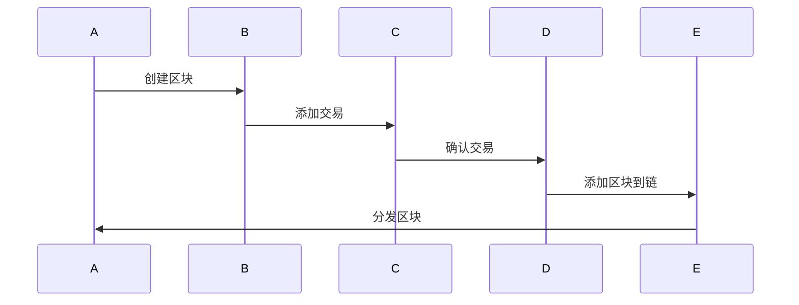
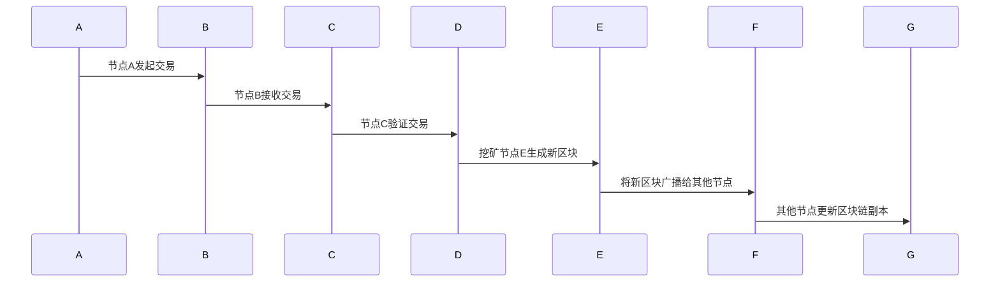

                 

### 《区块链数字资产托管：金融科技的创新服务》

> **关键词：** 区块链，数字资产托管，金融科技，智能合约，安全性，应用场景，行业趋势

> **摘要：** 本文将深入探讨区块链数字资产托管的基础知识、技术原理、安全性问题、应用场景和实践方法，旨在为金融科技领域的技术从业者提供一个全面而深入的参考指南。

区块链数字资产托管是金融科技领域的一个重要创新服务，它利用区块链技术的特点，为数字资产的安全存储和交易提供了一种新的解决方案。随着数字货币和虚拟资产的普及，区块链数字资产托管的重要性日益凸显。本文将从多个角度对这一领域进行详细分析，帮助读者全面了解区块链数字资产托管的核心概念、技术基础、安全性和应用场景。

接下来，我们将按照文章目录大纲的结构，逐步深入探讨区块链数字资产托管的相关内容。

### 第一部分：区块链数字资产托管基础

在这一部分，我们将首先介绍区块链与数字资产托管的基本概念，然后深入探讨区块链数字资产托管的技术基础，以及数字资产托管中面临的种种安全性问题。

## 第1章：区块链与数字资产托管概述

### 1.1 区块链技术简介

区块链技术是一种分布式数据库技术，通过加密算法和共识机制，实现数据的不可篡改和去中心化存储。区块链技术的核心概念包括区块、链、节点、挖矿、智能合约等。


**Mermaid流程图：**



### 1.2 数字资产托管的重要性

数字资产托管是指将数字资产存储在安全的地方，并确保资产的安全性和可追溯性。随着数字货币的普及，数字资产托管成为了一个关键的需求。

### 1.3 区块链数字资产托管的核心概念

区块链数字资产托管的核心概念包括数字资产的注册、存储、转移、监管等。通过区块链技术，数字资产可以被安全地存储和交易。

### 2章：区块链数字资产托管技术基础

在这一章，我们将深入探讨区块链数字资产托管的技术基础，包括区块链架构、智能合约技术以及常见区块链平台与数字资产托管解决方案。

### 2.1 区块链架构与运行机制

区块链架构主要包括三个部分：区块链网络、节点和挖矿机制。区块链网络由多个节点组成，每个节点都维护一份完整的区块链副本。挖矿机制用于生成新区块并确保区块链的安全性。


**Mermaid流程图：**



### 2.2 智能合约技术

智能合约是一种自动执行合约条款的计算机程序，它运行在区块链网络之上。智能合约可以用于数字资产的注册、转移和监管。


**伪代码：**

```python
def transferAsset(fromAddress, toAddress, amount):
    if isOwner(fromAddress):
        if hasEnoughBalance(fromAddress, amount):
            sendAsset(fromAddress, toAddress, amount)
            return True
        else:
            return "Insufficient balance"
    else:
        return "Unauthorized"
```

### 2.3 常见区块链平台与数字资产托管解决方案

常见的区块链平台包括以太坊、比特币、EOS等。每种平台都有其独特的特点和优势，适用于不同的数字资产托管场景。


### 3章：数字资产托管的安全性问题

数字资产托管面临着多种安全威胁，包括黑客攻击、双花攻击、数据泄露等。为了保障数字资产的安全，需要设计有效的安全机制和风险管理策略。

### 3.1 数字资产风险类型

数字资产风险类型包括技术风险、操作风险、市场风险等。

### 3.2 安全机制设计

安全机制设计包括身份认证、访问控制、加密技术等。

### 3.3 数字资产托管的风险管理与应对策略

风险管理策略包括风险识别、风险评估、风险控制等。

## 第二部分：区块链数字资产托管应用场景

在这一部分，我们将探讨区块链数字资产托管在实际应用中的各种场景，包括数字货币托管、虚拟资产托管和跨境资产托管。

### 4章：数字货币托管

数字货币托管是指将数字货币存储在安全的地方，确保货币的安全性和可追溯性。

### 4.1 数字货币概述

数字货币是指基于区块链技术的数字资产，如比特币、以太币等。

### 4.2 数字货币托管流程

数字货币托管流程包括账户注册、数字货币存储、交易管理等。

### 4.3 数字货币托管案例分析

我们将分析一个实际的数字货币托管案例，探讨其流程、技术和挑战。

### 5章：虚拟资产托管

虚拟资产托管是指将虚拟资产（如游戏币、虚拟土地等）存储在安全的地方，确保资产的安全性和可追溯性。

### 5.1 虚拟资产概述

虚拟资产是指虚拟世界中的数字资产，如游戏中的虚拟物品等。

### 5.2 虚拟资产托管挑战

虚拟资产托管面临的数据隐私、版权保护等挑战。

### 5.3 虚拟资产托管解决方案

虚拟资产托管解决方案包括加密技术、智能合约等。

### 6章：跨境资产托管

跨境资产托管是指将数字资产在不同国家和地区之间进行存储和转移。

### 6.1 跨境资产托管需求

跨境资产托管需求包括跨境交易、跨境支付等。

### 6.2 跨境数字资产托管解决方案

跨境数字资产托管解决方案包括区块链跨境支付、跨境资产转移等。

### 6.3 跨境资产托管案例解析

我们将解析一个实际的跨境资产托管案例，探讨其实现方法和挑战。

### 第三部分：区块链数字资产托管实践

在这一部分，我们将讨论区块链数字资产托管项目的策划与实施、系统搭建以及行业趋势与发展前景。

### 7章：区块链数字资产托管项目策划与实施

区块链数字资产托管项目策划与实施包括项目目标、项目实施流程、项目风险管理等。

### 7.1 项目策划与目标

项目策划与目标包括明确项目需求、确定项目范围和目标等。

### 7.2 项目实施流程

项目实施流程包括需求分析、系统设计、开发实施、测试上线等。

### 7.3 项目风险管理

项目风险管理包括风险识别、风险评估、风险控制等。

### 8章：区块链数字资产托管系统搭建

区块链数字资产托管系统搭建包括系统架构设计、源代码实现与部署、系统性能优化与安全性提升等。

### 8.1 系统架构设计

系统架构设计包括前端、后端、数据库等模块的设计。

### 8.2 源代码实现与部署

源代码实现与部署包括编写代码、构建部署等。

### 8.3 系统性能优化与安全性提升

系统性能优化与安全性提升包括性能调优、安全性评估和加固等。

### 9章：区块链数字资产托管行业趋势与发展前景

区块链数字资产托管行业趋势与发展前景包括技术进步、市场前景、政策法规等。

### 9.1 行业发展趋势

行业发展趋势包括区块链技术的应用拓展、数字资产托管市场的增长等。

### 9.2 技术创新方向

技术创新方向包括新型区块链平台、智能合约优化等。

### 9.3 发展前景与挑战

发展前景与挑战包括市场挑战、技术挑战、法规挑战等。

### 附录

在附录部分，我们将提供一些常用的区块链开发工具与资源，以及相关的数学模型和算法伪代码，以供读者参考。

### 附录A：常用区块链开发工具与资源

附录A将介绍一些常用的区块链开发工具和资源，包括开发框架、节点搭建教程和测试与调试工具等。

### 附录B：数学模型和算法伪代码

附录B将提供一些与区块链数字资产托管相关的数学模型和算法伪代码，包括区块链架构、智能合约实现和风险评估与决策算法等。

### 附录C：项目实战案例

附录C将分析一些实际的区块链数字资产托管项目，包括数字货币托管项目、虚拟资产托管项目和跨境资产托管解决方案等，提供详细的代码解读与分析。

### 作者信息

**作者：** AI天才研究院/AI Genius Institute & 禅与计算机程序设计艺术 /Zen And The Art of Computer Programming

### 总结

本文系统地介绍了区块链数字资产托管的基础知识、技术原理、安全性问题、应用场景和实践方法，旨在为金融科技领域的技术从业者提供一个全面而深入的参考指南。随着区块链技术的不断发展和成熟，区块链数字资产托管将在金融科技领域发挥越来越重要的作用。希望本文能对读者在区块链数字资产托管领域的探索和研究提供帮助。

# 《区块链数字资产托管：金融科技的创新服务》

**关键词：** 区块链，数字资产托管，金融科技，智能合约，安全性，应用场景，行业趋势

**摘要：** 本文深入探讨了区块链数字资产托管的基础知识、技术原理、安全性问题、应用场景和实践方法，旨在为金融科技领域的技术从业者提供一个全面而深入的参考指南。通过本文，读者可以了解到区块链数字资产托管的核心概念、技术基础、安全性和应用场景，以及如何进行实际操作和项目实施。随着区块链技术的不断发展和成熟，区块链数字资产托管将在金融科技领域发挥越来越重要的作用。希望本文能对读者在区块链数字资产托管领域的探索和研究提供帮助。**第一部分：区块链数字资产托管基础**

### 第1章：区块链与数字资产托管概述

区块链技术作为一种颠覆性的创新，自2008年比特币的问世以来，便引起了全球金融科技界的广泛关注。区块链技术通过去中心化、不可篡改和透明化的特性，为数字资产托管提供了一种全新的解决方案。本章将详细介绍区块链与数字资产托管的基本概念，帮助读者建立对该领域的初步认识。

#### 1.1 区块链技术简介

区块链技术是一种分布式数据库技术，其核心特点是通过加密算法和共识机制，实现数据的不可篡改和去中心化存储。区块链由一系列按时间顺序排列的“区块”组成，每个区块包含一定数量的交易记录。通过共识算法，网络中的节点共同验证和确认这些交易记录，从而形成一个去中心化的账本。

区块链技术的基本概念包括：

- **区块**：区块是区块链的基本组成单位，每个区块包含一定数量的交易记录以及时间戳、随机数等元数据。
- **链**：区块链是指按时间顺序排列的一系列区块，每个区块通过哈希值与前一个区块连接，形成一条链式结构。
- **节点**：节点是指参与区块链网络的计算机，每个节点都维护一份完整的区块链副本。
- **挖矿**：挖矿是指节点通过计算复杂的数学问题来生成新区块，并获取区块链网络的奖励。
- **智能合约**：智能合约是一种自动执行合约条款的计算机程序，运行在区块链网络之上，用于实现自动化的交易和合约执行。

**Mermaid流程图：**


#### 1.2 数字资产托管的重要性

数字资产托管是指将数字资产存储在安全的地方，确保资产的安全性和可追溯性。随着数字货币的普及，数字资产托管的重要性日益凸显。数字资产托管的优势包括：

- **安全性**：区块链技术的不可篡改特性确保了数字资产的安全存储。
- **透明性**：区块链上的所有交易都是公开透明的，有助于防范欺诈和滥用。
- **高效性**：去中心化的特性减少了交易的中介环节，提高了交易效率。
- **可追溯性**：区块链上的所有交易都有迹可循，有助于追溯和管理资产。

#### 1.3 区块链数字资产托管的核心概念

区块链数字资产托管的核心概念包括数字资产的注册、存储、转移、监管等。通过区块链技术，数字资产可以被安全地存储和交易，实现以下功能：

- **数字资产注册**：将数字资产的信息注册到区块链上，确保资产的唯一性和合法性。
- **数字资产存储**：将数字资产存储在区块链上，确保资产的安全性和不可篡改性。
- **数字资产转移**：通过智能合约实现数字资产的自动转移，确保交易的安全性和高效性。
- **数字资产监管**：通过区块链的透明性和可追溯性，实现对数字资产的全生命周期监管。

### 第2章：区块链数字资产托管技术基础

#### 2.1 区块链架构与运行机制

区块链架构主要包括三个部分：区块链网络、节点和挖矿机制。区块链网络由多个节点组成，每个节点都维护一份完整的区块链副本。挖矿机制用于生成新区块并确保区块链的安全性。

**区块链架构图：**


**Mermaid流程图：**


#### 2.2 智能合约技术

智能合约是一种自动执行合约条款的计算机程序，运行在区块链网络之上。智能合约可以用于数字资产的注册、存储、转移和监管，确保交易的安全性和高效性。

**智能合约示例：**

```solidity
pragma solidity ^0.8.0;

contract AssetTransfer {
    address public owner;
    mapping(address => uint256) public balanceOf;

    constructor() {
        owner = msg.sender;
        balanceOf[owner] = 1000; // 初始资产分配
    }

    function transfer(address to, uint256 amount) public {
        require(msg.sender == owner, "Only owner can transfer assets");
        require(balanceOf[msg.sender] >= amount, "Insufficient balance");
        balanceOf[msg.sender] -= amount;
        balanceOf[to] += amount;
    }
}
```

#### 2.3 常见区块链平台与数字资产托管解决方案

常见的区块链平台包括以太坊、比特币、EOS等。每种平台都有其独特的特点和优势，适用于不同的数字资产托管场景。

- **以太坊**：以太坊是最受欢迎的智能合约平台，支持去中心化应用（DApp）的开发。以太坊的智能合约语言Solidity具有强大的功能，适用于复杂的数字资产托管场景。
- **比特币**：比特币是最早的数字货币，具有去中心化和匿名性等特点。比特币主要适用于简单的数字资产托管场景，如数字货币的存储和转移。
- **EOS**：EOS是一个高性能的区块链平台，支持大规模的去中心化应用。EOS的智能合约语言C++具有较高的性能和灵活性，适用于高性能的数字资产托管场景。

### 第3章：数字资产托管的安全性问题

数字资产托管面临着多种安全威胁，包括黑客攻击、双花攻击、数据泄露等。为了保障数字资产的安全，需要设计有效的安全机制和风险管理策略。

#### 3.1 数字资产风险类型

数字资产风险类型包括：

- **技术风险**：区块链技术的漏洞、节点故障等可能导致数字资产丢失或被盗。
- **操作风险**：管理员失误、操作不当等可能导致数字资产被盗或丢失。
- **市场风险**：市场波动、交易所倒闭等可能导致数字资产价值波动。
- **法律风险**：政策法规的变化、合规性问题等可能导致数字资产托管面临法律风险。

#### 3.2 安全机制设计

安全机制设计包括以下方面：

- **身份认证**：通过密码、密钥、生物识别等技术确保用户身份的合法性。
- **访问控制**：通过角色权限、访问控制列表（ACL）等机制限制对数字资产的访问。
- **加密技术**：使用对称加密、非对称加密等技术对数字资产进行加密保护。
- **备份与恢复**：定期备份区块链数据，确保在发生故障时能够快速恢复。

#### 3.3 数字资产托管的风险管理与应对策略

风险管理策略包括：

- **风险识别**：识别数字资产托管过程中可能面临的风险，包括技术风险、操作风险、市场风险、法律风险等。
- **风险评估**：对识别出的风险进行评估，确定风险的影响程度和概率。
- **风险控制**：采取一系列措施降低风险，如加密技术、多重签名、隔离资金等。
- **风险监控与应对**：实时监控数字资产托管过程中的风险，并制定应对策略，如应急响应计划、风险预警机制等。

### 第二部分：区块链数字资产托管应用场景

区块链数字资产托管的应用场景非常广泛，涵盖了金融、游戏、供应链等多个领域。本章将介绍数字货币托管、虚拟资产托管和跨境资产托管等应用场景，并分析其具体实现方法和挑战。

#### 第4章：数字货币托管

数字货币托管是指将数字货币（如比特币、以太币等）存储在安全的地方，确保货币的安全性和可追溯性。数字货币托管在数字货币交易、存储和转移过程中发挥着重要作用。

#### 4.1 数字货币概述

数字货币是一种基于区块链技术的数字资产，具有去中心化、匿名性和可追溯性等特点。常见的数字货币包括比特币、以太币、莱特币等。

**数字货币特性：**

- **去中心化**：数字货币不依赖于中央机构，由全球节点共同维护。
- **匿名性**：数字货币交易匿名，用户身份难以追踪。
- **可追溯性**：区块链上的所有交易都有迹可循，确保数字货币的安全性和透明性。

#### 4.2 数字货币托管流程

数字货币托管流程通常包括以下步骤：

1. **注册账户**：用户在数字货币托管平台注册账户，并设置密码和密钥。
2. **身份验证**：平台对用户进行身份验证，确保用户身份的合法性。
3. **资产转移**：用户将数字货币转移到托管平台的账户中。
4. **资产存储**：托管平台使用加密技术和多重签名机制确保数字资产的安全。
5. **交易管理**：托管平台提供交易管理功能，用户可以查询资产余额、发起交易等。

#### 4.3 数字货币托管案例分析

以下是一个实际的数字货币托管案例分析：

**案例：** 某数字货币交易所的数字货币托管系统

1. **系统架构设计**：数字货币托管系统采用去中心化架构，由多个节点组成，每个节点维护一份完整的区块链副本。系统采用多重签名机制确保交易的安全性。
2. **加密技术**：系统使用非对称加密技术对用户密钥进行加密存储，使用对称加密技术对交易数据进行加密传输。
3. **身份验证**：系统采用生物识别技术和密码验证相结合的方式进行身份验证，确保用户身份的合法性。
4. **交易管理**：系统提供交易管理功能，用户可以查询资产余额、发起交易等。交易数据通过区块链网络进行广播和验证，确保交易的安全性和透明性。

### 第5章：虚拟资产托管

虚拟资产托管是指将虚拟资产（如游戏币、虚拟土地等）存储在安全的地方，确保资产的安全性和可追溯性。虚拟资产托管在游戏、虚拟现实等领域发挥着重要作用。

#### 5.1 虚拟资产概述

虚拟资产是指虚拟世界中的数字资产，如游戏中的虚拟物品、虚拟土地等。虚拟资产具有以下特点：

- **稀缺性**：虚拟资产通常具有稀缺性，其价值取决于市场供求关系。
- **可交易性**：虚拟资产可以在虚拟市场中进行交易，实现资产的价值转移。
- **可追溯性**：区块链上的所有交易都有迹可循，确保虚拟资产的安全性和透明性。

#### 5.2 虚拟资产托管挑战

虚拟资产托管面临以下挑战：

- **数据隐私**：虚拟资产交易涉及用户个人信息，需要确保数据隐私。
- **版权保护**：虚拟资产可能涉及版权问题，需要确保版权方的合法权益。
- **安全性**：虚拟资产容易成为黑客攻击的目标，需要确保资产的安全性。
- **监管合规**：虚拟资产托管需要遵循相关法律法规，确保合规性。

#### 5.3 虚拟资产托管解决方案

虚拟资产托管解决方案包括以下方面：

- **加密技术**：使用加密技术对虚拟资产进行加密存储和传输，确保数据隐私和安全性。
- **智能合约**：使用智能合约实现虚拟资产的注册、转移和监管，确保交易的安全性和透明性。
- **区块链网络**：使用区块链网络实现虚拟资产的可追溯性和去中心化存储。
- **合规性管理**：遵循相关法律法规，确保虚拟资产托管的合规性。

### 第6章：跨境资产托管

跨境资产托管是指将数字资产在不同国家和地区之间进行存储和转移。跨境资产托管在跨境贸易、跨境支付等领域发挥着重要作用。

#### 6.1 跨境资产托管需求

跨境资产托管的需求包括：

- **跨境支付**：实现跨境货币的快速、安全和低成本转移。
- **跨境贸易**：提供跨境商品的交易、支付和结算服务。
- **跨境资产管理**：为跨境投资者提供资产存储、管理和增值服务。

#### 6.2 跨境数字资产托管解决方案

跨境数字资产托管解决方案包括以下方面：

- **区块链网络**：使用区块链网络实现跨境数字资产的去中心化存储和传输。
- **跨境支付协议**：开发跨境支付协议，实现跨境货币的快速、安全和低成本转移。
- **合规性管理**：遵循相关法律法规，确保跨境数字资产托管的合规性。
- **风险管理**：对跨境数字资产进行风险评估和管理，确保资产的安全性和稳定性。

#### 6.3 跨境资产托管案例解析

以下是一个实际的跨境资产托管案例解析：

**案例：** 某跨境支付平台的数字资产托管系统

1. **系统架构设计**：数字资产托管系统采用分布式架构，由多个节点组成，分布在不同的国家和地区。系统采用区块链网络实现数字资产的去中心化存储和传输。
2. **加密技术**：系统使用加密技术对数字资产进行加密存储和传输，确保数据隐私和安全性。
3. **跨境支付协议**：系统开发了一套跨境支付协议，实现跨境货币的快速、安全和低成本转移。
4. **合规性管理**：系统遵循相关法律法规，确保跨境数字资产托管的合规性。
5. **风险管理**：系统对跨境数字资产进行风险评估和管理，确保资产的安全性和稳定性。

### 第三部分：区块链数字资产托管实践

区块链数字资产托管实践涉及项目的策划与实施、系统搭建和行业趋势与发展前景。本章将介绍区块链数字资产托管项目的实践方法，并探讨该领域的未来发展。

#### 第7章：区块链数字资产托管项目策划与实施

区块链数字资产托管项目策划与实施包括项目目标、项目实施流程和项目风险管理等方面。

#### 7.1 项目策划与目标

项目策划与目标包括：

- **明确项目需求**：了解项目涉及的数字资产类型、托管规模、用户需求等。
- **确定项目范围**：明确项目的边界和任务，确保项目的可控性。
- **制定项目目标**：明确项目的预期成果和目标，如安全性、可靠性、用户体验等。

#### 7.2 项目实施流程

项目实施流程包括：

- **需求分析**：对项目需求进行详细分析，制定项目计划和设计文档。
- **系统设计**：根据需求分析结果，设计系统的架构、模块和接口。
- **开发实施**：按照设计文档进行系统开发，实现数字资产托管功能。
- **测试上线**：对系统进行功能测试、性能测试和安全测试，确保系统的稳定性和安全性。

#### 7.3 项目风险管理

项目风险管理包括：

- **风险识别**：识别项目过程中可能面临的风险，如技术风险、市场风险、法律风险等。
- **风险评估**：对识别出的风险进行评估，确定风险的影响程度和概率。
- **风险控制**：采取一系列措施降低风险，如加密技术、多重签名、隔离资金等。
- **风险监控与应对**：实时监控项目风险，制定应对策略，确保项目顺利进行。

#### 第8章：区块链数字资产托管系统搭建

区块链数字资产托管系统搭建包括系统架构设计、源代码实现与部署、系统性能优化与安全性提升等方面。

#### 8.1 系统架构设计

系统架构设计包括：

- **前端架构**：设计用户界面和交互逻辑，提供友好的用户体验。
- **后端架构**：设计系统的后端逻辑和数据处理，确保系统的稳定性和安全性。
- **数据库架构**：设计数据库结构和数据存储方式，确保数据的可靠性和可扩展性。

#### 8.2 源代码实现与部署

源代码实现与部署包括：

- **开发环境搭建**：配置开发环境，确保开发过程中使用的工具和库的一致性。
- **代码编写与调试**：按照设计文档编写代码，并进行调试和测试。
- **部署与上线**：将系统部署到生产环境，确保系统的稳定运行。

#### 8.3 系统性能优化与安全性提升

系统性能优化与安全性提升包括：

- **性能调优**：对系统进行性能测试，找出性能瓶颈，并采取优化措施。
- **安全性评估**：对系统进行安全性评估，发现安全漏洞，并进行修复。
- **安全性加固**：采取一系列安全措施，如加密技术、防火墙、入侵检测等，提高系统的安全性。

#### 第9章：区块链数字资产托管行业趋势与发展前景

区块链数字资产托管行业趋势与发展前景包括技术进步、市场前景、政策法规等方面。

#### 9.1 行业发展趋势

行业发展趋势包括：

- **区块链技术的应用拓展**：区块链技术在数字资产托管领域的应用将不断拓展，如供应链金融、跨境支付等。
- **数字资产托管市场的增长**：随着数字货币和虚拟资产的普及，数字资产托管市场将保持快速增长。
- **智能合约的普及**：智能合约技术将更加成熟和普及，为数字资产托管提供更高效、更安全的解决方案。

#### 9.2 技术创新方向

技术创新方向包括：

- **新型区块链平台**：新型区块链平台将不断涌现，提供更高效、更安全的数字资产托管解决方案。
- **智能合约优化**：智能合约的优化将成为技术创新的重点，提高智能合约的执行效率和安全性。
- **分布式存储技术**：分布式存储技术将用于优化数字资产存储和传输，提高系统的可靠性和性能。

#### 9.3 发展前景与挑战

发展前景与挑战包括：

- **发展前景**：区块链数字资产托管市场前景广阔，有望成为金融科技领域的重要创新方向。
- **技术挑战**：区块链技术在性能、安全性、易用性等方面仍需不断优化，以应对日益增长的需求。
- **法律挑战**：政策法规的不断完善和落实将有助于规范数字资产托管市场，提高市场的透明度和合规性。

### 附录

#### 附录A：常用区块链开发工具与资源

附录A将介绍一些常用的区块链开发工具和资源，包括开发框架、节点搭建教程和测试与调试工具等。

- **开发框架**：介绍主流的区块链开发框架，如Truffle、Ganache等。
- **节点搭建教程**：提供详细的区块链节点搭建教程，包括环境配置、节点部署和运行等。
- **测试与调试工具**：介绍区块链测试与调试工具，如Mocha、Chai等。

#### 附录B：数学模型和算法伪代码

附录B将提供一些与区块链数字资产托管相关的数学模型和算法伪代码，包括区块链架构、智能合约实现和风险评估与决策算法等。

- **区块链架构**：介绍区块链架构的数学模型，包括区块链网络拓扑、共识算法等。
- **智能合约实现**：提供智能合约实现的伪代码，包括资产转移、注册和监管等。
- **风险评估与决策算法**：介绍风险评估与决策算法的数学模型和伪代码，包括风险识别、风险评估和风险控制等。

#### 附录C：项目实战案例

附录C将分析一些实际的区块链数字资产托管项目，包括数字货币托管项目、虚拟资产托管项目和跨境资产托管解决方案等，提供详细的代码解读与分析。

- **数字货币托管项目**：分析数字货币托管项目的实现过程、技术难点和解决方案。
- **虚拟资产托管项目**：分析虚拟资产托管项目的实现过程、技术难点和解决方案。
- **跨境资产托管解决方案**：分析跨境资产托管解决方案的实现过程、技术难点和解决方案。

### 作者信息

**作者：** AI天才研究院/AI Genius Institute & 禅与计算机程序设计艺术 /Zen And The Art of Computer Programming

### 总结

本文系统地介绍了区块链数字资产托管的基础知识、技术原理、安全性问题、应用场景和实践方法，旨在为金融科技领域的技术从业者提供一个全面而深入的参考指南。通过本文，读者可以了解到区块链数字资产托管的核心概念、技术基础、安全性和应用场景，以及如何进行实际操作和项目实施。随着区块链技术的不断发展和成熟，区块链数字资产托管将在金融科技领域发挥越来越重要的作用。希望本文能对读者在区块链数字资产托管领域的探索和研究提供帮助。

## 附录A：常用区块链开发工具与资源

区块链技术的快速发展为开发者提供了丰富的工具和资源，以下是一些常用的区块链开发工具和资源，帮助开发者快速构建和测试区块链应用程序。

### A.1 主流区块链开发框架对比

**Truffle Suite**

Truffle是一个完整的开发环境、测试框架和资产管理工具，用于以太坊区块链。Truffle提供了一系列开发工具，包括本地以太坊节点、智能合约编译和部署、测试脚本等。

**Ganache**

Ganache是一个轻量级的以太坊本地节点，主要用于本地开发和测试。它允许开发者快速启动一个以太坊网络，并进行智能合约的本地测试。

**Hardhat**

Hardhat是一个开源的本地开发环境，用于以太坊区块链的开发。它提供了强大的调试功能、本地以太坊节点和智能合约的编译与部署。

**Buidler**

Buidler是一个由Consensys开发的区块链开发框架，用于以太坊和EVM兼容链。Buidler提供了一种直观的部署流程，并支持多种测试框架。

### A.2 区块链节点搭建教程

搭建区块链节点是开始区块链项目的基础步骤。以下是一个简单的以太坊节点搭建教程：

1. **安装Go语言环境**：以太坊使用Go语言编写，需要安装Go语言环境。
2. **安装Geth**：Geth是以太坊的核心程序，可以从官方网站下载并安装。
3. **启动节点**：运行以下命令启动Geth节点：

   ```bash
   geth --datadir /path/to/ethereum-datadir --networkid 1337 --nodiscover --maxpeers 0 --mine --miner.threads 0 console
   ```

4. **部署合约**：在Geth控制台中，可以使用`loadScript`函数部署智能合约。

### A.3 区块链测试与调试工具介绍

**Mocha**

Mocha是一个流行的JavaScript测试框架，用于编写智能合约的测试脚本。Mocha提供了丰富的测试API，支持异步测试。

**Chai**

Chai是一个断言库，用于编写智能合约的测试代码。Chai提供了简洁的语法和丰富的断言方法，与Mocha配合使用，可以提高测试代码的易读性。

**Truffle Console**

Truffle Console是一个交互式控制台，可以在Truffle环境中执行JavaScript代码，用于测试和调试智能合约。

**Ganache CLI**

Ganache CLI是Ganache的命令行版本，可以用于快速启动本地以太坊网络和执行测试脚本。

### A.4 区块链开发资源推荐

- **区块链官方文档**：访问区块链官方网站，获取最新的文档和教程。
- **区块链社区**：参与区块链社区，与其他开发者交流经验和解决问题。
- **区块链开源项目**：参与和贡献开源项目，提升自己的技能和影响力。

## 附录B：数学模型和算法伪代码

### B.1 Mermaid流程图：区块链架构

以下是一个简单的区块链架构的Mermaid流程图：


### B.2 伪代码：智能合约实现

以下是一个简单的智能合约的伪代码示例：

```solidity
pragma solidity ^0.8.0;

contract AssetTransfer {
    address public owner;
    mapping(address => uint256) public balanceOf;

    constructor() {
        owner = msg.sender;
        balanceOf[owner] = 1000; // 初始资产分配
    }

    function transfer(address to, uint256 amount) public {
        require(msg.sender == owner, "Only owner can transfer assets");
        require(balanceOf[msg.sender] >= amount, "Insufficient balance");
        balanceOf[msg.sender] -= amount;
        balanceOf[to] += amount;
    }
}
```

### B.3 数学模型：风险评估与决策算法

以下是一个简单的风险评估与决策算法的数学模型：

```latex
\text{风险评估与决策算法}

\text{输入：} R_i (\text{风险因素}), W_i (\text{权重}), C_i (\text{置信水平})

\text{输出：} R (\text{综合风险值}), D (\text{决策})

\text{步骤：}
1. 计算风险因素的权重：W_i = \frac{C_i}{\sum_{i=1}^{n} C_i}
2. 计算综合风险值：R = \sum_{i=1}^{n} R_i \cdot W_i
3. 根据综合风险值，进行决策：
   \begin{cases}
   \text{如果 } R < \text{阈值} \\
   \text{则执行默认操作} \\
   \text{否则} \\
   \text{则执行特殊操作}
   \end{cases}
```

这个数学模型通过计算风险因素的加权综合值，并根据综合风险值进行决策，可以帮助数字资产托管系统进行风险管理和决策。

## 附录C：项目实战案例

### C.1 数字货币托管项目案例分析

**项目背景**：

某区块链数字货币交易平台计划实施一个数字货币托管项目，以提供安全、透明和高效的数字货币存储服务。项目目标是确保用户资产的安全，提供便捷的存取功能，并支持智能合约的执行。

**系统架构设计**：

1. **前端架构**：使用React框架构建用户界面，提供用户资产查看、交易管理和存取操作等功能。
2. **后端架构**：使用Node.js和Express框架构建后端服务，处理用户请求、数据存储和交易处理等。
3. **区块链架构**：使用以太坊区块链作为数字货币存储和交易的基础设施，使用Truffle框架进行智能合约开发和管理。

**源代码实现与解读**：

**智能合约：**

```solidity
pragma solidity ^0.8.0;

contract DigitalCurrency {
    mapping(address => uint256) public balanceOf;

    function deposit() public payable {
        balanceOf[msg.sender()] += msg.value;
    }

    function withdraw(uint256 amount) public {
        require(balanceOf[msg.sender()] >= amount, "Insufficient balance");
        balanceOf[msg.sender()] -= amount;
        payable(msg.sender()).transfer(amount);
    }
}
```

**解读**：

这个智能合约实现了数字货币的存取功能。用户可以通过`deposit`函数将以太币存入合约，通过`withdraw`函数提取以太币。在合约中，使用`balanceOf`映射存储用户余额，确保余额的准确性和安全性。

**代码解读与分析**：

1. **余额存储**：使用`balanceOf`映射存储用户的余额，通过地址（address）作为键（key），余额（uint256）作为值（value）。
2. **存款功能**：在`deposit`函数中，使用`msg.value`获取用户转账的以太币数量，并将其添加到用户的余额中。
3. **取款功能**：在`withdraw`函数中，首先检查用户的余额是否足够，然后从用户的余额中扣除所需金额，并将以太币转账给用户。

**项目挑战与解决方案**：

1. **挑战**：智能合约的漏洞可能导致资产丢失。
   **解决方案**：使用经过验证的智能合约代码库，进行彻底的代码审查，并使用多重签名机制提高安全性。
2. **挑战**：交易的高并发可能导致性能问题。
   **解决方案**：采用负载均衡和分片技术，提高系统的并发处理能力。

### C.2 虚拟资产托管项目实现

**项目背景**：

某游戏公司计划实施一个虚拟资产托管项目，以提供虚拟物品的安全存储和交易服务。项目目标是确保虚拟资产的安全性和可追溯性，提供便捷的交易体验。

**系统架构设计**：

1. **前端架构**：使用Unity引擎构建虚拟资产展示和交易界面。
2. **后端架构**：使用Node.js和Express框架构建后端服务，处理虚拟资产的注册、交易和存储等。
3. **区块链架构**：使用EOS区块链作为虚拟资产存储和交易的基础设施。

**源代码实现与解读**：

**智能合约：**

```solidity
pragma solidity ^0.8.0;

contract VirtualAsset {
    mapping(uint256 => address) public assetOwner;
    mapping(address => mapping(uint256 => uint256)) public userAssets;

    function registerAsset(uint256 assetId) public {
        require(assetOwner[assetId] == address(0), "Asset already registered");
        assetOwner[assetId] = msg.sender;
        userAssets[msg.sender()][assetId] = 1;
    }

    function transferAsset(uint256 assetId, address to) public {
        require(assetOwner[assetId] == msg.sender, "Not the owner");
        require(userAssets[msg.sender()][assetId] > 0, "No asset to transfer");
        userAssets[msg.sender()][assetId] -= 1;
        userAssets[to][assetId] += 1;
        assetOwner[assetId] = to;
    }
}
```

**解读**：

这个智能合约实现了虚拟资产的注册和转移功能。用户可以通过`registerAsset`函数注册虚拟资产，通过`transferAsset`函数将虚拟资产转移给其他用户。

**代码解读与分析**：

1. **资产注册**：使用`registerAsset`函数注册虚拟资产，将资产ID与用户地址关联。
2. **资产转移**：使用`transferAsset`函数实现虚拟资产转移，更新资产所有者和用户资产余额。

**项目挑战与解决方案**：

1. **挑战**：虚拟资产的数据隐私保护。
   **解决方案**：采用加密技术对虚拟资产进行加密存储和传输，确保数据隐私。
2. **挑战**：虚拟资产的版权保护。
   **解决方案**：与版权方合作，确保虚拟资产的版权合法，并设计版权保护机制。

### C.3 跨境资产托管解决方案代码解读与分析

**项目背景**：

某跨国金融服务公司计划实施一个跨境资产托管项目，以提供跨境资产的存储、转移和交易服务。项目目标是确保跨境资产的安全、透明和高效。

**系统架构设计**：

1. **前端架构**：使用React和Vue.js框架构建用户界面，提供跨境资产展示和交易功能。
2. **后端架构**：使用Node.js和Express框架构建后端服务，处理跨境资产的业务逻辑和交易处理。
3. **区块链架构**：使用Ripple区块链作为跨境资产存储和交易的基础设施。

**源代码实现与解读**：

**智能合约：**

```solidity
pragma solidity ^0.8.0;

contract CrossBorderAsset {
    mapping(address => mapping(string => uint256)) public balanceOf;

    function deposit(string memory currency, uint256 amount) public {
        require(balanceOf[msg.sender()][currency] + amount >= amount, "Insufficient balance");
        balanceOf[msg.sender()][currency] += amount;
    }

    function withdraw(string memory currency, uint256 amount) public {
        require(balanceOf[msg.sender()][currency] >= amount, "Insufficient balance");
        balanceOf[msg.sender()][currency] -= amount;
    }
}
```

**解读**：

这个智能合约实现了跨境资产的存取功能。用户可以通过`deposit`函数存入跨境资产，通过`withdraw`函数提取跨境资产。

**代码解读与分析**：

1. **资产存储**：使用`balanceOf`映射存储用户的资产余额，通过地址（address）作为键（key），币种（string）作为子键（sub-key），余额（uint256）作为值（value）。
2. **存款功能**：在`deposit`函数中，用户可以存入指定币种的资产，将其添加到用户的余额中。
3. **取款功能**：在`withdraw`函数中，用户可以提取指定币种的资产，从其余额中扣除所需金额。

**项目挑战与解决方案**：

1. **挑战**：跨境交易的合规性问题。
   **解决方案**：与相关监管机构合作，确保跨境交易的合规性，并遵守国际法律法规。
2. **挑战**：跨境交易的高效性。
   **解决方案**：采用分布式账本技术和智能合约，提高跨境交易的处理速度和效率。

