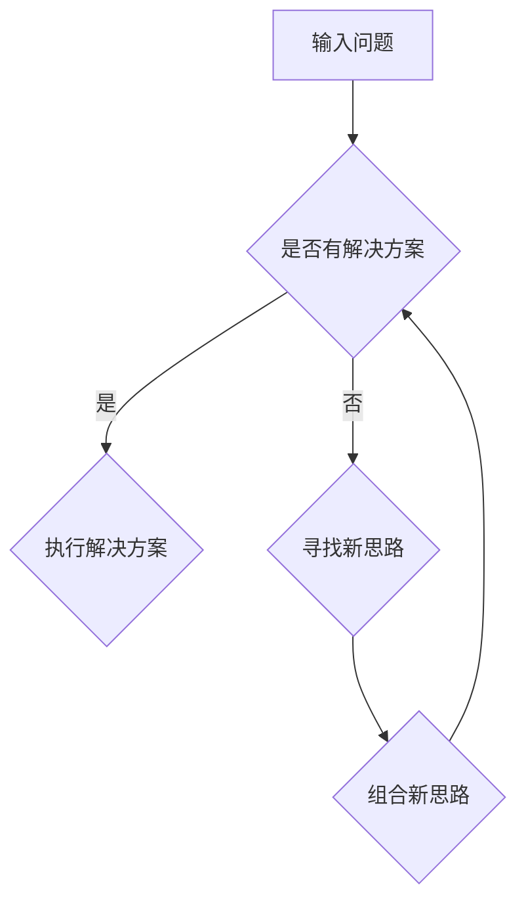
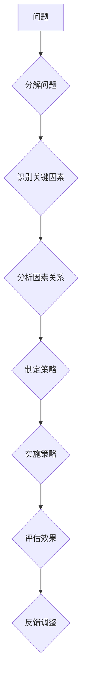
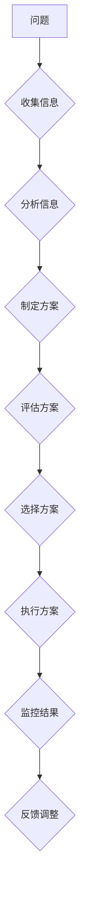
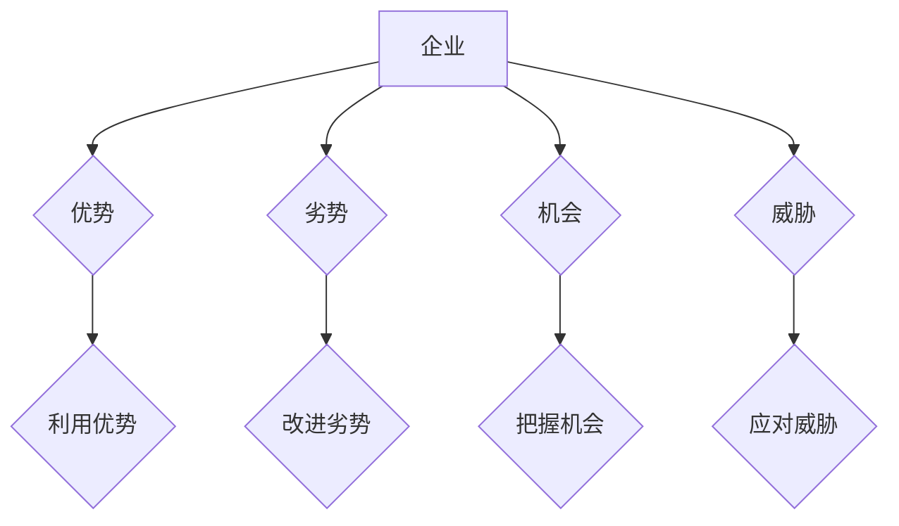
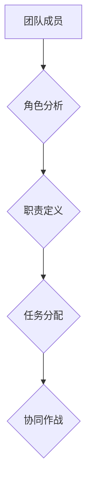
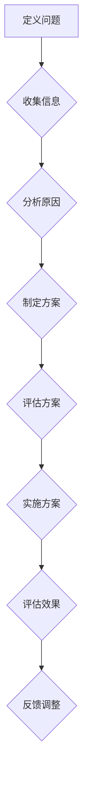
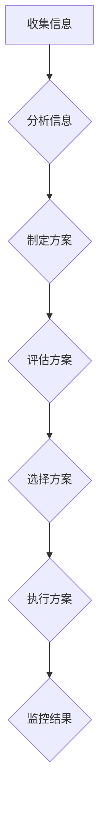
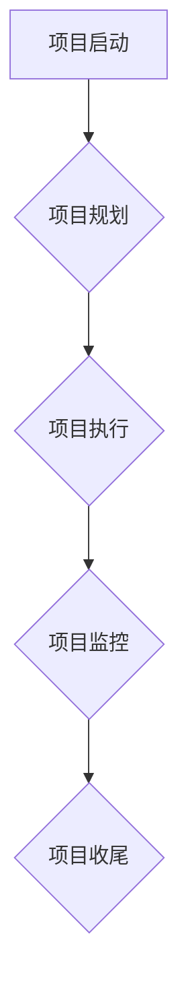
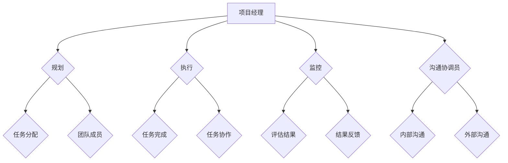
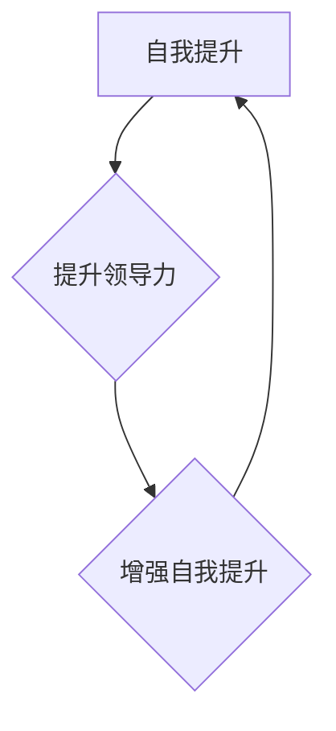

                 

## 卓越管理者的三大修炼：思维、行动与学习

> **关键词**：卓越管理者、思维修炼、行动修炼、学习修炼、领导力

**摘要**：
本博客文章深入探讨了卓越管理者的三大核心修炼：思维、行动与学习。通过分析卓越管理者的核心思维原则、创新思维与决策能力、战略思维与长远规划，我们揭示了卓越管理者的思维方式。接着，文章详细阐述了目标设定与执行力、时间管理与效率提升、问题解决与决策制定、项目管理与团队协作等行动修炼的实践方法。最后，文章探讨了持续学习的重要性、领导者的知识体系构建、终身学习与自我提升等学习修炼的关键。通过这三个方面的修炼，卓越管理者能够不断提升自己的领导力和执行力，为组织的成功奠定坚实基础。

### 目录大纲设计

#### 第一部分：思维修炼

#### 第1章：卓越管理者的思维模式

#### 第2章：战略思维与长远规划

#### 第3章：领导力与团队建设

#### 第4章：有效沟通与人际交往

#### 第二部分：行动修炼

#### 第5章：目标设定与执行力

#### 第6章：时间管理与效率提升

#### 第7章：问题解决与决策制定

#### 第8章：项目管理与团队协作

#### 第三部分：学习修炼

#### 第9章：持续学习的重要性

#### 第10章：领导者的知识体系构建

#### 第11章：终身学习与自我提升

#### 第12章：领导力与自我提升的持续循环

### 第一部分：思维修炼

#### 第1章：卓越管理者的思维模式

在数字化时代，卓越管理者需要具备独特的思维模式，以应对复杂多变的环境和挑战。本章将深入探讨卓越管理者的核心思维原则，包括创造性思维和系统性思维，并运用伪代码和Mermaid流程图进行详细阐述。

##### 1.1 卓越管理者的核心思维原则

卓越管理者的思维模式是其成功的关键之一。以下我们将重点介绍创造性思维和系统性思维两种核心思维原则。

###### 1.1.1 创造性思维

创造性思维是卓越管理者必备的一项能力。它不仅仅是天马行空的想象，更是一种系统化的思维方法。以下是一个简单的创造性思维算法流程图：

**伪代码：创造性思维算法流程图**



在这个流程图中，管理者首先识别问题，然后评估是否已有解决方案。如果没有，管理者将寻找新的思路，并尝试将这些新思路进行组合，最终找到可行的解决方案。

###### 1.1.2 系统性思维

系统性思维是另一个重要的思维原则。它强调从整体的角度看待问题，识别关键因素，分析因素之间的关系，并制定相应的策略。以下是一个简单的系统性思维框架：

**Mermaid流程图：系统性思维框架**



在这个流程图中，管理者首先分解问题，识别关键因素，分析这些因素之间的关系，然后制定相应的策略，并实施这些策略。在实施过程中，管理者需要不断评估效果，并根据反馈进行调整。

##### 1.2 创新思维与决策能力

除了创造性思维和系统性思维，卓越管理者还需要具备创新思维和决策能力。以下我们将介绍创新思维的培养和决策模型的建立。

###### 1.2.1 创新思维的培养

创新思维是一种不断探索和创造新思路的能力。以下是一个简单的创新思维激发算法：

**伪代码：创新思维激发算法**

```python
def stimulate_innovation():
    import random
    ideas = []
    for i in range(5):
        ideas.append(generate_random_idea())
    return ideas

def generate_random_idea():
    # 生成一个随机创新的点子
    pass
```

在这个算法中，管理者通过随机生成多个创新点子，从而激发创新思维。

###### 1.2.2 决策模型的建立

决策模型是管理者进行决策的重要工具。以下是一个简单的决策模型流程：

**Mermaid流程图：决策模型流程**



在这个流程图中，管理者首先收集信息，分析信息，制定方案，评估方案，选择方案，并执行方案。在执行过程中，管理者需要不断监控结果，并根据反馈进行调整。

##### 1.3 总结

本章介绍了卓越管理者的核心思维原则，包括创造性思维、系统性思维、创新思维和决策能力。通过伪代码和Mermaid流程图的详细阐述，我们揭示了卓越管理者的思维方式。在下一章中，我们将探讨战略思维与长远规划，帮助管理者制定有效的战略规划。

### 第2章：战略思维与长远规划

战略思维和长远规划是卓越管理者必须掌握的核心能力。它们帮助管理者在复杂多变的环境中，做出正确的决策，确保组织的长期发展。本章将深入探讨战略思维的概念、基本原则，以及长远规划的方法和工具。

##### 2.1 战略规划的概念与原则

战略规划是指组织为了实现长期目标而制定的一系列计划和行动。它不仅仅关注短期的业绩，更注重组织的长远发展。以下是一些战略规划的基本原则：

###### 2.1.1 战略规划的重要性

战略规划是组织成功的关键。它能够帮助组织明确目标，优化资源配置，提高竞争力。通过战略规划，组织可以应对外部环境的变化，抓住机遇，化解风险。

###### 2.1.2 战略规划的基本原则

1. **明确目标**：战略规划首先要明确组织的长期目标。这些目标应该是具体、可衡量的，并与组织的使命和愿景相一致。

2. **环境分析**：战略规划需要对组织所处的环境进行深入分析。这包括对市场、技术、竞争对手等方面的分析，以便了解组织的优势和劣势。

3. **资源优化**：战略规划需要考虑如何优化组织的资源，包括人力、财力、物力等。通过合理配置资源，可以提高组织的运营效率。

4. **灵活调整**：战略规划不是一成不变的，而是需要根据实际情况进行调整。组织需要具备快速响应环境变化的能力。

##### 2.2 长远规划的方法与工具

长远规划需要科学的方法和工具，以确保规划的可行性和有效性。以下是一些常用的方法和工具：

###### 2.2.1 SWOT分析

SWOT分析是一种常用的战略规划工具，用于分析组织的优势、劣势、机会和威胁。以下是一个简单的SWOT分析框架：

**Mermaid流程图：SWOT分析框架**



在这个框架中，管理者需要分析组织的优势、劣势、机会和威胁，并根据这些分析制定相应的策略。例如，利用优势来抓住机会，改进劣势来应对威胁等。

###### 2.2.2 时间管理

时间管理是长远规划的重要组成部分。一个有效的战略规划需要明确各个阶段的任务和时间节点。以下是一个简单的时间管理算法：

**伪代码：时间管理算法**

```python
def time_management(tasks, deadlines):
    sorted_tasks = sort_by_deadline(tasks, deadlines)
    schedule = schedule_tasks(sorted_tasks)
    return schedule

def sort_by_deadline(tasks, deadlines):
    # 根据截止日期对任务排序
    pass

def schedule_tasks(sorted_tasks):
    # 对排序后的任务进行调度
    pass
```

在这个算法中，管理者首先根据截止日期对任务进行排序，然后对这些任务进行调度，以确保任务能够按时完成。

##### 2.3 总结

本章介绍了战略思维和长远规划的基本原则和方法。通过SWOT分析和时间管理等方法，管理者可以制定出有效的战略规划，为组织的长期发展奠定坚实基础。在下一章中，我们将探讨领导力与团队建设，帮助管理者打造高效的团队。

### 第3章：领导力与团队建设

领导力是卓越管理者不可或缺的核心能力。它不仅关乎个人的成功，更关乎整个团队和组织的发展。本章将深入探讨领导力的核心要素，以及团队建设的策略，帮助管理者提升领导力，打造高效的团队。

##### 3.1 领导力的核心要素

领导力是一种影响力，它能够激发团队成员的潜能，推动团队实现共同的目标。以下是领导力的核心要素：

###### 3.1.1 领导力的重要性

领导力是组织成功的关键。一个优秀的领导者能够带领团队克服困难，实现目标。同时，领导力也是个人成长的重要推动力，它能够帮助管理者提升自身的思维、行动和学习能力。

###### 3.1.2 领导力的核心要素

1. **愿景**：愿景是领导者对未来的蓝图，它能够激发团队成员的激情和动力。一个明确的愿景能够帮助团队明确方向，齐心协力实现目标。

2. **沟通**：沟通是领导者与团队成员之间的重要桥梁。有效的沟通能够确保团队成员理解领导者的意图，减少误解和冲突，提高团队的协作效率。

3. **激励**：激励是领导者激发团队成员潜能的重要手段。通过激励，领导者能够提高团队成员的工作积极性和创造力，推动团队不断前进。

4. **决策**：决策是领导者的重要职责。一个优秀的领导者需要具备敏锐的洞察力，能够快速做出正确的决策，为团队指明方向。

5. **信任**：信任是领导力的重要组成部分。一个领导者只有赢得了团队成员的信任，才能有效地带领团队实现目标。

##### 3.2 团队建设的策略

团队建设是提升领导力的关键环节。一个高效的团队能够实现协同作战，最大化团队的潜能。以下是团队建设的几个关键策略：

###### 3.2.1 团队角色的定位

在团队建设中，明确每个成员的角色至关重要。每个成员都应该清楚自己的职责和任务，以便更好地协作。以下是一个简单的团队角色定位框架：

**Mermaid流程图：团队角色定位框架**



在这个框架中，领导者需要对团队成员进行角色分析，明确每个成员的职责和任务，并进行合理的任务分配，以实现团队的协同作战。

###### 3.2.2 团队协作的有效性

团队协作的有效性是团队建设的重要目标。为了提高团队协作的有效性，领导者可以采取以下策略：

1. **建立明确的沟通机制**：确保团队成员能够及时、准确地沟通，避免信息滞后和误解。

2. **促进知识共享**：鼓励团队成员分享知识和经验，提高整个团队的知识水平。

3. **培养团队精神**：通过团队活动、培训等手段，培养团队成员的团队意识，增强团队的凝聚力。

4. **激励团队成长**：为团队成员提供成长的机会和资源，激发他们的潜能，推动团队整体提升。

##### 3.3 总结

本章介绍了领导力的核心要素和团队建设的策略。通过明确领导力的核心要素，管理者可以提升自身的领导力，通过团队建设的策略，打造高效、协作的团队。在下一章中，我们将探讨有效沟通与人际交往的重要性，帮助管理者提升沟通技巧和人际交往能力。

### 第4章：有效沟通与人际交往

在管理过程中，有效沟通与人际交往是确保团队协作、提高工作效率、实现组织目标的关键因素。本章将深入探讨沟通技巧、情绪管理、人际关系的重要性以及人际交往技巧，帮助管理者提升沟通能力，建立良好的人际关系。

##### 4.1 沟通技巧与策略

沟通是管理者与团队成员之间传递信息、理解意图、协调行动的过程。有效的沟通能够减少误解和冲突，提高团队协作效率。以下是一些沟通技巧和策略：

###### 4.1.1 沟通的基本原则

1. **明确目的**：每次沟通前，明确沟通的目的和目标，确保双方对沟通内容有共同的理解。

2. **倾听**：倾听是有效沟通的重要环节。管理者需要耐心倾听团队成员的意见和需求，理解他们的立场和情感。

3. **清晰表达**：表达时要简洁明了，避免使用模糊或含糊的语言，确保信息准确传达。

4. **积极反馈**：在沟通过程中，及时给予积极的反馈，确认信息的理解和接受程度，避免信息偏差。

5. **非语言沟通**：注意使用非语言沟通手段，如肢体语言、面部表情等，以增强沟通的效果。

###### 4.1.2 情绪管理

情绪管理是有效沟通的重要一环。情绪管理不当会导致沟通障碍，影响团队协作。以下是一些情绪管理的技巧：

1. **自我觉察**：了解自己的情绪，认识到情绪对沟通的影响。

2. **情绪调节**：学会调节情绪，保持冷静和理智，避免情绪化沟通。

3. **同理心**：站在对方的角度思考问题，理解对方的情感和需求，增进沟通的信任和理解。

4. **情绪释放**：在适当的时候，通过合理的方式释放情绪，避免情绪积累影响工作。

##### 4.2 人际交往的艺术

人际交往是管理者在组织中建立关系、协调资源、推动工作的重要手段。以下是一些人际交往的艺术：

###### 4.2.1 人际关系的重要性

1. **信任**：建立信任是人际交往的基础。信任能够促进沟通和协作，提高团队效率。

2. **尊重**：尊重他人是人际交往的基本原则。尊重他人的意见、感受和权利，能够增进彼此的理解和合作。

3. **合作**：合作是人际交往的重要目标。通过合作，管理者能够调动团队成员的积极性和创造力，实现共同的目标。

4. **共赢**：人际交往应该追求共赢。在合作过程中，管理者要关注团队的整体利益，避免个人利益冲突。

###### 4.2.2 人际交往技巧

1. **建立联系**：通过参加社交活动、团队建设等，与团队成员建立联系，增进了解和信任。

2. **倾听与反馈**：倾听他人的意见和需求，给予真诚的反馈，展现对团队成员的关心和支持。

3. **冲突管理**：在人际交往中，难免会遇到冲突。管理者需要学会处理冲突，通过沟通、协商等方式解决矛盾。

4. **感恩与赞赏**：对他人的帮助和支持表示感激，给予适当的赞赏和认可，增强人际关系的和谐。

##### 4.3 总结

本章介绍了有效沟通与人际交往的技巧和策略。通过掌握这些技巧，管理者能够提高沟通能力，建立良好的人际关系，为团队和组织的发展奠定坚实基础。在下一章中，我们将探讨目标设定与执行力，帮助管理者制定明确的目标，并提升执行能力。

### 第二部分：行动修炼

#### 第5章：目标设定与执行力

目标设定和执行力是卓越管理者在行动修炼中必须掌握的两个关键要素。一个明确、具体的目标能够为团队成员指明方向，而强大的执行力则是实现目标的关键保障。本章将详细探讨目标设定的SMART原则、目标设定的步骤、以及提升执行力的方法。

##### 5.1 目标设定的SMART原则

SMART原则是一种常用的目标设定方法，它确保目标具有明确性、可实现性、相关性、时限性。以下是SMART原则的具体内容：

1. **Specific（具体的）**：目标要明确、具体，避免模糊和宽泛的描述。
2. **Measurable（可衡量的）**：目标要有具体的衡量标准，以便评估进度和效果。
3. **Achievable（可实现的）**：目标要符合实际情况，确保通过努力可以实现。
4. **Relevant（相关的）**：目标要与组织的整体目标和价值观相一致，确保方向正确。
5. **Time-bound（时限的）**：目标要设定明确的时间框架，确保有明确的时间节点。

**伪代码：SMART目标设定框架**

```python
def set_smart_goal(goal, criteria):
    specific = is_specific(goal, criteria)
    measurable = is_measurable(goal, criteria)
    achievable = is_achievable(goal, criteria)
    relevant = is_relevant(goal, criteria)
    time_bound = is_time_bound(goal, criteria)
    return specific and measurable and achievable and relevant and time_bound

def is_specific(goal, criteria):
    # 判断目标是否具体
    pass

def is_measurable(goal, criteria):
    # 判断目标是否可衡量
    pass

def is_achievable(goal, criteria):
    # 判断目标是否可实现
    pass

def is_relevant(goal, criteria):
    # 判断目标是否相关
    pass

def is_time_bound(goal, criteria):
    # 判断目标是否时限
    pass
```

##### 5.2 目标设定的步骤

为了确保目标的SMART原则得到有效应用，管理者可以按照以下步骤进行目标设定：

1. **明确目标**：确定组织或团队需要实现的目标，并明确其重要性。
2. **收集信息**：收集与目标相关的信息，包括内外部环境、资源情况、潜在风险等。
3. **制定目标**：根据SMART原则，制定具体、可衡量、可实现、相关、时限的目标。
4. **评估目标**：评估目标的可行性，确保目标既符合现实情况，又能激励团队成员。
5. **沟通目标**：与团队成员沟通目标，确保他们理解目标的内容和期望。

**伪代码：目标设定步骤**

```python
def set_goals(goals, team_members):
    goals = define_goals(goals)
    goals = assess_goals(goals)
    communicate_goals(goals, team_members)
    return goals

def define_goals(goals):
    # 明确目标
    pass

def assess_goals(goals):
    # 评估目标
    pass

def communicate_goals(goals, team_members):
    # 沟通目标
    pass
```

##### 5.3 提升执行力的方法

执行力是目标实现的关键保障。以下是一些提升执行力的方法：

1. **制定有效的行动计划**：将目标分解为具体的任务，为每个任务制定详细的行动计划，明确责任人和完成时间。
2. **明确责任和权限**：确保每个团队成员都清楚自己的职责和权限，避免责任不清和推诿现象。
3. **建立监督机制**：通过定期检查和评估，确保任务按照计划进行，及时调整和解决问题。
4. **激励和奖励**：通过激励和奖励机制，激发团队成员的工作积极性和创造力，提高执行力。
5. **培训和能力提升**：为团队成员提供培训和发展机会，提升他们的专业能力和执行力。

**伪代码：执行力提升方法**

```python
def improve_execution-effectiveness(employees):
    action_plans = create_action_plans()
    responsibilities = define_responsibilities(employees)
    supervision = establish_supervision()
    incentives = implement_incentives()
    training = provide_training(employees)
    return action_plans, responsibilities, supervision, incentives, training

def create_action_plans():
    # 制定行动计划
    pass

def define_responsibilities(employees):
    # 明确责任和权限
    pass

def establish_supervision():
    # 建立监督机制
    pass

def implement_incentives():
    # 激励和奖励
    pass

def provide_training(employees):
    # 培训和能力提升
    pass
```

##### 5.4 总结

本章详细介绍了目标设定与执行力的关键要素和方法。通过掌握SMART原则和目标设定的步骤，管理者可以制定出明确、具体、可实现的目标。同时，通过提升执行力的方法，管理者能够确保目标的顺利实现。在下一章中，我们将探讨时间管理与效率提升，帮助管理者提高工作效率，实现目标。

### 第6章：时间管理与效率提升

在快节奏的工作环境中，时间管理和效率提升是卓越管理者必须掌握的重要技能。有效的时间管理不仅能够提高工作效率，还能减轻工作压力，提升生活质量。本章将深入探讨时间管理的重要性、基本原则、方法与工具，以及提升工作效率的策略。

##### 6.1 时间管理的重要性

时间管理是管理者在职场中的一项基本技能。它关系到个人和团队的效率、资源的合理利用，以及工作目标的实现。以下是时间管理的重要性：

1. **提升工作效率**：通过合理安排时间，管理者可以更加高效地完成工作任务，提高工作成果。
2. **减轻工作压力**：有效的时间管理能够减少加班和疲劳，提高工作效率，从而减轻工作压力。
3. **优化资源分配**：时间管理有助于优化人、财、物的资源配置，确保资源得到最大化利用。
4. **提升生活质量**：合理的时间管理能够为管理者留出更多时间进行休闲和社交，提高生活质量。

##### 6.2 时间管理的基本原则

有效的时间管理需要遵循一些基本原则，以确保时间得到合理利用。以下是时间管理的基本原则：

1. **优先级管理**：将任务按照优先级排序，确保先完成最重要和紧急的任务。
2. **任务分解**：将大任务分解为小任务，以便更好地管理和完成。
3. **定时定量**：为每个任务设定明确的完成时间和质量标准，确保任务按时完成。
4. **避免拖延**：及时处理任务，避免拖延，减少未完成任务的积累。

##### 6.3 时间管理的方法与工具

为了实现有效的时间管理，管理者可以采用以下方法和工具：

1. **时间日志**：记录每天的工作时间和任务完成情况，分析时间使用情况，找出优化空间。
2. **待办事项清单**：将任务列在待办事项清单上，确保任务不遗漏，并按照优先级进行排序。
3. **日程表**：制定日程表，合理安排工作和休息时间，确保时间得到充分利用。
4. **时间块**：将工作时间划分为不同的时间块，每个时间块专注于一项任务，提高专注度和效率。

**伪代码：时间管理方法**

```python
def time_management():
    time_log = record_time_log()
    tasks = create_task_list()
    schedule = create_schedule()
    time_blocks = create_time_blocks(tasks, schedule)
    return time_log, tasks, schedule, time_blocks

def record_time_log():
    # 记录时间日志
    pass

def create_task_list():
    # 创建待办事项清单
    pass

def create_schedule():
    # 制定日程表
    pass

def create_time_blocks(tasks, schedule):
    # 创建时间块
    pass
```

##### 6.4 提升工作效率的策略

除了时间管理，提升工作效率也是管理者需要关注的重要方面。以下是提升工作效率的一些策略：

1. **任务优先级管理**：将任务按照优先级排序，确保先完成最重要和紧急的任务。
2. **精力管理**：合理安排工作和休息时间，确保精力充沛，提高工作效率。
3. **自动化与工具**：使用自动化工具和软件，减少重复性工作，提高效率。
4. **团队协作**：建立高效的团队协作机制，确保团队成员之间的沟通和协作顺畅。
5. **避免干扰**：减少工作过程中的干扰，如关闭不必要的通知，保持专注。

**伪代码：提升工作效率策略**

```python
def improve工作效率():
    task_priority = manage_task_priority()
    energy_management = manage_energy_levels()
    automation = implement_automation()
    team_collaboration = enhance_team_collaboration()
    avoid_interference = reduce_interference()

    return task_priority, energy_management, automation, team_collaboration, avoid_interference

def manage_task_priority():
    # 管理任务优先级
    pass

def manage_energy_levels():
    # 管理精力水平
    pass

def implement_automation():
    # 实施自动化
    pass

def enhance_team_collaboration():
    # 提升团队协作
    pass

def reduce_interference():
    # 减少干扰
    pass
```

##### 6.5 总结

本章详细介绍了时间管理和效率提升的重要性和方法。通过掌握时间管理的基本原则、方法和工具，管理者能够更好地安排时间，提高工作效率。同时，通过提升工作效率的策略，管理者能够进一步优化工作流程，实现工作目标。在下一章中，我们将探讨问题解决与决策制定，帮助管理者应对各种挑战，做出明智的决策。

### 第7章：问题解决与决策制定

在复杂多变的工作环境中，卓越管理者需要具备强大的问题解决能力和决策制定能力。这不仅有助于应对各种挑战，还能确保组织的顺利运行和持续发展。本章将详细探讨问题解决的方法、决策制定的原则和过程，以及相关工具和策略。

##### 7.1 问题解决的方法

问题解决是管理者日常工作中的一项重要任务。以下是一些常见的问题解决方法：

###### 7.1.1 基本问题解决框架

1. **定义问题**：明确问题的性质、范围和影响，确保对问题的全面理解。
2. **收集信息**：搜集与问题相关的信息，包括数据、事实、意见等。
3. **分析原因**：分析问题的根本原因，找到导致问题的关键因素。
4. **制定方案**：根据分析结果，提出解决问题的方案。
5. **评估方案**：评估每个方案的优缺点，选择最佳方案。
6. **实施方案**：执行选定的解决方案，解决问题。
7. **评估效果**：评估解决方案的效果，根据反馈进行调整。

**Mermaid流程图：基本问题解决框架**



###### 7.1.2 创新问题解决方法

除了基本问题解决框架，创新问题解决方法也是管理者应具备的能力。以下是一些创新问题解决方法：

1. **头脑风暴**：通过集体讨论，激发团队成员的创意，提出多种解决方案。
2. **TRIZ方法**：TRIZ是一种系统化的创新问题解决方法，通过应用TRIZ工具，找到问题的解决方案。
3. **SWOT分析**：通过SWOT分析，识别问题的优势和劣势，以及外部环境和内部因素，提出解决方案。

**伪代码：创新问题解决方法**

```python
def solve_innovative_problems(problem):
    solutions = brainstorm_solutions(problem)
    triz_solutions = apply_triz(problem)
    swot_solutions = perform_swot_analysis(problem)
    return solutions, triz_solutions, swot_solutions

def brainstorm_solutions(problem):
    # 头脑风暴
    pass

def apply_triz(problem):
    # 应用TRIZ方法
    pass

def perform_swot_analysis(problem):
    # 执行SWOT分析
    pass
```

##### 7.2 决策制定的过程

决策制定是管理者在解决问题和推动组织发展中的重要环节。以下是一个典型的决策制定过程：

###### 7.2.1 决策制定的原则

1. **信息充分**：在决策前，确保收集到充分的信息，了解问题的各个方面。
2. **目标明确**：明确决策的目标和期望结果，确保决策与组织的整体目标一致。
3. **考虑风险**：评估决策可能带来的风险，并制定相应的风险应对策略。
4. **多方参与**：鼓励多方参与决策，收集不同意见和建议，提高决策的全面性和有效性。
5. **科学评估**：运用科学的方法和工具，对不同的决策方案进行评估和比较。

###### 7.2.2 决策制定的方法

1. **头脑风暴法**：通过集体讨论，激发团队成员的创意，提出多种决策方案。
2. **SWOT分析法**：通过SWOT分析，识别决策方案的优缺点和潜在风险。
3. **成本效益分析法**：评估决策方案的成本和效益，选择最优方案。
4. **多标准决策法**：根据多个决策标准，对方案进行综合评估，选择最佳方案。

**Mermaid流程图：决策制定方法**



##### 7.3 总结

本章详细介绍了问题解决和决策制定的方法和原则。通过掌握基本问题解决框架和创新的解决方法，管理者能够更有效地应对各种挑战。同时，通过了解决策制定的过程和方法，管理者能够做出明智的决策，推动组织的发展。在下一章中，我们将探讨项目管理与团队协作，帮助管理者实现项目的成功交付。

### 第8章：项目管理与团队协作

在组织中，项目管理是确保项目成功交付的关键环节。而团队协作则是实现项目目标的重要保障。本章将深入探讨项目管理的核心要素、团队协作的策略，以及项目管理与团队协作工具的应用。

##### 8.1 项目管理的核心要素

项目管理涉及到项目的范围、进度、成本、质量、资源、风险等方面。以下是项目管理的核心要素：

###### 8.1.1 项目生命周期

项目生命周期是项目管理的基础。它通常包括以下阶段：

1. **项目启动**：明确项目的目标和范围，组建项目团队。
2. **项目规划**：制定详细的项目计划，包括时间表、预算、资源分配等。
3. **项目执行**：按照计划实施项目活动，监控项目进度和质量。
4. **项目监控**：持续监控项目的执行情况，确保项目在预定时间内完成。
5. **项目收尾**：完成项目交付，进行项目总结和评估。

**Mermaid流程图：项目生命周期**



###### 8.1.2 项目管理的方法与工具

1. **甘特图**：甘特图是一种直观的项目进度管理工具，用于显示项目的任务和时间安排。
2. **工作分解结构（WBS）**：WBS将项目分解为可管理的任务，明确项目的责任和进度。
3. **关键路径法（CPM）**：CPM分析项目的关键路径，确保项目按时完成。
4. **资源管理**：合理分配和利用资源，确保项目进度和质量。
5. **风险管理**：识别和评估项目风险，制定风险应对策略。

**伪代码：项目管理方法与工具**

```python
def project_management(project):
    project_start = initiate_project()
    project_plan = create_project_plan()
    project_execution = execute_project_tasks()
    project_monitoring = monitor_project_progress()
    project_closure = close_project()

    return project_start, project_plan, project_execution, project_monitoring, project_closure

def initiate_project():
    # 项目启动
    pass

def create_project_plan():
    # 制定项目计划
    pass

def execute_project_tasks():
    # 实施项目任务
    pass

def monitor_project_progress():
    # 监控项目进度
    pass

def close_project():
    # 项目收尾
    pass
```

##### 8.2 团队协作的策略

团队协作是项目成功的关键。以下是一些团队协作的策略：

###### 8.2.1 团队角色的定位

在团队协作中，明确每个成员的角色和职责至关重要。以下是常见的团队角色：

1. **项目经理**：负责项目规划、执行和监控，确保项目按时、按质量完成。
2. **团队成员**：负责完成分配的任务，与团队成员协作，确保项目目标的实现。
3. **沟通协调员**：负责团队内部和团队与外部利益相关者之间的沟通协调。

**Mermaid流程图：团队角色定位**



###### 8.2.2 团队协作的有效性

1. **明确目标**：确保团队所有成员都清楚项目目标和团队目标。
2. **沟通机制**：建立有效的沟通机制，确保信息及时、准确传达。
3. **协作工具**：使用协作工具，如项目管理系统、即时通讯工具、文档共享平台，提高协作效率。
4. **激励机制**：建立激励机制，鼓励团队成员积极参与协作，提高团队凝聚力。

**伪代码：团队协作有效性策略**

```python
def team_collaboration(team_members, project):
    set_clear_goals(team_members, project)
    establish_communication_mechanism(team_members)
    use_collaboration_tools(team_members)
    implement_incentives(team_members)

def set_clear_goals(team_members, project):
    # 设定清晰的目标
    pass

def establish_communication_mechanism(team_members):
    # 建立沟通机制
    pass

def use_collaboration_tools(team_members):
    # 使用协作工具
    pass

def implement_incentives(team_members):
    # 建立激励机制
    pass
```

##### 8.3 项目管理与团队协作工具的应用

在项目管理和团队协作中，工具的应用能够显著提高效率和效果。以下是一些常用的工具：

1. **项目管理软件**：如Microsoft Project、Asana、Trello等，用于任务分配、进度跟踪和资源管理。
2. **即时通讯工具**：如Slack、Microsoft Teams、WhatsApp等，用于团队内部和跨团队的实时沟通。
3. **文档共享平台**：如Google Drive、OneDrive、Dropbox等，用于文档存储、共享和协作编辑。
4. **视频会议工具**：如Zoom、Microsoft Teams、Skype等，用于远程会议和协作。

**伪代码：项目管理与团队协作工具应用**

```python
def use_project_collaboration_tools(project, team_members):
    project_management_software = implement项目管理软件(project)
    instant_messaging = enable_instant_messaging(team_members)
    document_sharing = enable_document_sharing(team_members)
    video_conferencing = enable_video_conferencing(team_members)

    return project_management_software, instant_messaging, document_sharing, video_conferencing

def implement项目管理软件(project):
    # 实施项目管理软件
    pass

def enable_instant_messaging(team_members):
    # 启用即时通讯工具
    pass

def enable_document_sharing(team_members):
    # 启用文档共享平台
    pass

def enable_video_conferencing(team_members):
    # 启用视频会议工具
    pass
```

##### 8.4 总结

本章详细介绍了项目管理的核心要素和团队协作的策略，以及项目管理与团队协作工具的应用。通过掌握这些知识和技能，管理者能够有效管理项目，实现项目目标的顺利交付。在下一章中，我们将探讨持续学习的重要性，帮助管理者不断提升自身的能力和知识。

### 第三部分：学习修炼

#### 第9章：持续学习的重要性

在知识更新迅速的数字化时代，持续学习成为卓越管理者不可或缺的能力。持续学习不仅能够提升个人的专业素养和领导力，还能推动组织的创新和发展。本章将深入探讨持续学习的本质、价值，以及学习策略与方法。

##### 9.1 学习的本质与价值

持续学习是管理者在职业生涯中不断成长和进步的重要途径。以下是学习的一些本质和价值：

###### 9.1.1 学习的重要性

1. **提升专业素养**：持续学习能够帮助管理者掌握最新的行业知识和技术，提升专业素养。
2. **增强领导力**：通过学习领导力理论和实践，管理者能够更好地应对复杂的管理挑战。
3. **促进创新**：持续学习能够激发管理者的创新思维，推动组织的创新和发展。
4. **适应变化**：持续学习帮助管理者适应快速变化的市场环境和组织需求。

###### 9.1.2 学习的价值

1. **个人成长**：学习是个人成长的重要手段，能够提升自我认知和职业竞争力。
2. **组织发展**：持续学习能够为组织提供持续的人才储备和创新动力，推动组织的长期发展。
3. **知识更新**：在知识更新迅速的时代，持续学习是保持知识前沿的重要手段。

##### 9.2 学习策略与方法

为了实现有效的持续学习，管理者可以采用以下策略和方法：

###### 9.2.1 自我学习的步骤

1. **设定学习目标**：明确学习的目标和方向，确保学习内容与个人和组织的需求相匹配。
2. **选择学习资源**：根据学习目标，选择合适的书籍、课程、讲座等学习资源。
3. **制定学习计划**：制定详细的学习计划，包括学习时间、内容和学习方法。
4. **执行学习计划**：按照学习计划执行学习任务，确保学习内容的吸收和理解。
5. **评估学习效果**：定期评估学习效果，调整学习计划和策略。

**伪代码：自我学习步骤**

```python
def self_learning(learning_goals, learning_resources):
    learning_plan = create_learning_plan(learning_goals, learning_resources)
    execute_learning_plan(learning_plan)
    evaluate_learning_effects(learning_plan)

def create_learning_plan(goals, resources):
    # 制定学习计划
    pass

def execute_learning_plan(plan):
    # 执行学习计划
    pass

def evaluate_learning_effects(plan):
    # 评估学习效果
    pass
```

###### 9.2.2 知识管理

知识管理是持续学习的重要组成部分。以下是一些知识管理的方法：

1. **收集和整理知识**：通过阅读、讲座、研讨会等方式，收集和整理与学习目标相关的知识。
2. **存储和共享知识**：使用知识管理系统（如Confluence、Notion等），将知识存储和共享。
3. **应用和转化知识**：将所学知识应用于实际工作中，通过实践转化为自己的能力和经验。
4. **反馈和改进知识**：通过实践中的反馈，不断改进和更新知识库。

**伪代码：知识管理方法**

```python
def knowledge_management(knowledge_collection, knowledge_storage, knowledge_application):
    collected_knowledge = gather_knowledge()
    stored_knowledge = store_knowledge(collected_knowledge)
    applied_knowledge = apply_knowledge(stored_knowledge)
    feedback_knowledge = improve_knowledge(applied_knowledge)

def gather_knowledge():
    # 收集知识
    pass

def store_knowledge(collected_knowledge):
    # 存储知识
    pass

def apply_knowledge(stored_knowledge):
    # 应用知识
    pass

def improve_knowledge(applied_knowledge):
    # 反馈和改进知识
    pass
```

##### 9.3 总结

本章详细探讨了持续学习的本质、价值以及学习策略与方法。通过掌握这些方法和策略，管理者能够实现有效的持续学习，提升自身的专业素养和领导力，为组织的长期发展贡献力量。在下一章中，我们将探讨领导者的知识体系构建，帮助管理者构建全面、系统的知识体系。

### 第10章：领导者的知识体系构建

卓越的领导者不仅需要具备出色的领导能力，还需要拥有一个全面而系统的知识体系。一个良好的知识体系能够帮助领导者更好地理解复杂问题，制定有效的策略，并推动组织的持续发展。本章将探讨领导者的知识需求、知识获取与积累的方法，以及知识应用与转化的原则。

##### 10.1 领导者的知识需求

领导者的知识体系应该涵盖多个领域，包括但不限于以下几个方面：

1. **业务知识**：领导者需要深入了解组织的业务模式、市场动态、客户需求等，以确保战略决策与市场环境相匹配。
2. **管理知识**：领导者需要掌握人力资源管理、财务管理、运营管理等方面的知识，以确保组织的有效运行。
3. **技术知识**：随着数字化时代的到来，领导者需要了解最新的技术趋势和行业发展，以便在技术驱动变革中保持竞争力。
4. **法律和伦理知识**：领导者需要了解相关法律法规，确保组织的运营符合法律法规要求，并在伦理道德方面树立良好的榜样。
5. **领导力和心理学**：领导者需要掌握领导力和心理学知识，以更好地激励和管理团队成员，提升团队的凝聚力和战斗力。

**伪代码：领导者知识需求框架**

```python
def leader_knowledge_needs():
    business_knowledge = collect_business_knowledge()
    management_knowledge = collect_management_knowledge()
    technical_knowledge = collect_technical_knowledge()
    legal_ethical_knowledge = collect_legal_ethical_knowledge()
    leadership_psychology_knowledge = collect_leadership_psychology_knowledge()
    return business_knowledge, management_knowledge, technical_knowledge, legal_ethical_knowledge, leadership_psychology_knowledge

def collect_business_knowledge():
    # 收集业务知识
    pass

def collect_management_knowledge():
    # 收集管理知识
    pass

def collect_technical_knowledge():
    # 收集技术知识
    pass

def collect_legal_ethical_knowledge():
    # 收集法律和伦理知识
    pass

def collect_leadership_psychology_knowledge():
    # 收集领导力和心理学知识
    pass
```

##### 10.2 知识获取与积累的方法

领导者需要不断更新和扩展自己的知识体系。以下是一些有效的知识获取与积累方法：

1. **阅读与研究**：定期阅读书籍、研究报告、行业文章等，深入研究和理解相关领域的知识。
2. **学习与培训**：参加专业培训课程、研讨会、讲座等，通过学习新的知识和技能来提升自身能力。
3. **实践与反思**：将所学知识应用于实际工作中，通过实践中的反思和总结，不断提升知识水平。
4. **人际交流**：与同事、行业专家、行业领袖等进行交流，通过人际网络获取更多的知识和信息。

**伪代码：知识获取与积累方法**

```python
def knowledge_acquisition_and_accumulation(knowledge_needs):
    read_and_research(knowledge_needs)
    learn_and_train(knowledge_needs)
    practice_and_reflection(knowledge_needs)
    interpersonal_communication(knowledge_needs)

def read_and_research(knowledge_needs):
    # 阅读与研究
    pass

def learn_and_train(knowledge_needs):
    # 学习与培训
    pass

def practice_and_reflection(knowledge_needs):
    # 实践与反思
    pass

def interpersonal_communication(knowledge_needs):
    # 人际交流
    pass
```

##### 10.3 知识应用与转化

知识的应用与转化是领导者知识体系构建的关键环节。以下是一些知识应用与转化的原则：

1. **理论与实践相结合**：将学到的理论知识与实际工作相结合，通过实践验证理论的可行性。
2. **创新与改进**：在应用知识的过程中，不断探索新的方法和技术，改进工作流程，提升工作效率。
3. **反馈与调整**：通过实践中的反馈，及时调整知识应用的方法，确保知识的有效性和适应性。
4. **共享与传播**：将成功应用的知识和经验分享给团队成员，促进知识的共享和传播。

**伪代码：知识应用与转化方法**

```python
def knowledge_application_and_transformation(knowledge_acquired):
    combine_theory_and_practice(knowledge_acquired)
    innovate_and_improve(knowledge_acquired)
    feedback_and_adjustment(knowledge_acquired)
    share_and_spread(knowledge_acquired)

def combine_theory_and_practice(knowledge_acquired):
    # 理论与实践相结合
    pass

def innovate_and_improve(knowledge_acquired):
    # 创新与改进
    pass

def feedback_and_adjustment(knowledge_acquired):
    # 反馈与调整
    pass

def share_and_spread(knowledge_acquired):
    # 共享与传播
    pass
```

##### 10.4 总结

本章详细探讨了领导者的知识体系构建，包括知识需求、获取与积累的方法，以及知识应用与转化的原则。通过构建全面、系统的知识体系，领导者能够更好地应对复杂的管理挑战，推动组织的持续发展。在下一章中，我们将探讨终身学习与自我提升，帮助管理者实现持续的职业生涯发展。

### 第11章：终身学习与自我提升

在快速变化的商业环境中，终身学习和自我提升是卓越管理者保持竞争力和持续发展的重要手段。本章将深入探讨终身学习的理念、方法与策略，以及自我提升的实践和自我反思与改进，帮助管理者不断提升自身的职业素养和领导力。

##### 11.1 终身学习的理念

终身学习是一种持续的学习态度和行为，它强调个人在职业生涯中不断学习、成长和适应变化。以下是终身学习的几个核心理念：

1. **持续学习的重要性**：在知识爆炸的时代，技术和市场环境不断变化，持续学习成为保持竞争力、适应变化的必要条件。
2. **自我驱动的学习**：终身学习不仅仅是被动接受知识，更是主动寻找学习机会，自我驱动地提升自己的能力。
3. **适应变化的灵活性**：终身学习帮助管理者培养适应变化的能力，能够在快速变化的环境中迅速调整策略和行动。
4. **知识整合与创新**：通过终身学习，管理者能够将新知识和已有知识整合，创造出新的思维模式和解决方案。

**伪代码：终身学习理念**

```python
def lifelong_learning():
    emphasize_continuing_education()
    promote_self-directed_learning()
    develop_adaptability()
    integrate_and_innovate_knowledge()

def emphasize_continuing_education():
    # 强调持续教育
    pass

def promote_self-directed_learning():
    # 推动自我驱动学习
    pass

def develop_adaptability():
    # 培养适应变化能力
    pass

def integrate_and_innovate_knowledge():
    # 知识整合与创新
    pass
```

##### 11.2 终身学习的方法与策略

为了实现终身学习，管理者可以采用以下方法和策略：

1. **定期学习计划**：制定个人的学习计划，包括阅读、课程学习、研讨会等，确保学习目标的持续实现。
2. **网络学习资源**：利用在线学习平台、专业网站和电子书等丰富的网络学习资源，随时随地进行学习。
3. **跨领域学习**：不仅专注于自身专业领域，还应该跨领域学习，扩展知识和视野。
4. **实践与反思**：将所学知识应用于实际工作中，通过实践中的反思和总结，不断提升自己的能力。

**伪代码：终身学习方法与策略**

```python
def lifelong_learning_strategies():
    create_learning_plan()
    utilize_online_resources()
    engage_in_interdisciplinary_learning()
    apply_and_reflect_knowledge()

def create_learning_plan():
    # 制定学习计划
    pass

def utilize_online_resources():
    # 利用在线学习资源
    pass

def engage_in_interdisciplinary_learning():
    # 跨领域学习
    pass

def apply_and_reflect_knowledge():
    # 应用与反思知识
    pass
```

##### 11.3 自我提升的实践

自我提升是终身学习的重要组成部分。以下是自我提升的几个关键实践：

1. **设定个人目标**：明确个人职业发展的目标和路径，制定具体、可衡量的目标，确保自我提升的方向。
2. **获取反馈**：主动寻求来自同事、下属和导师的反馈，了解自己的优势和改进空间。
3. **持续反思**：定期进行自我反思，分析自己的行为和决策，找到改进的机会。
4. **参与培训和发展**：积极参加专业培训和职业发展活动，提升自身的专业技能和领导力。

**伪代码：自我提升实践**

```python
def self_improvement_practices():
    set_personal_goals()
    obtain_feedback()
    engage_in_continuous_reflection()
    participate_in_training_and_development()

def set_personal_goals():
    # 设定个人目标
    pass

def obtain_feedback():
    # 获取反馈
    pass

def engage_in_continuous_reflection():
    # 持续反思
    pass

def participate_in_training_and_development():
    # 参与培训和发展
    pass
```

##### 11.4 自我反思与改进

自我反思是自我提升的重要环节。以下是一些自我反思和改进的方法：

1. **记录日志**：记录工作日志，包括工作中的成就、挑战、学习经验等，便于回顾和总结。
2. **设定反思时间**：定期设定反思时间，深入思考工作中的表现和改进措施。
3. **寻求导师指导**：与经验丰富的导师交流，获取他们的意见和建议，指导自我提升。
4. **制定改进计划**：根据反思结果，制定具体的改进计划，包括行动计划、责任人和时间节点。

**伪代码：自我反思与改进方法**

```python
def self_reflection_and_improvement():
    maintain_work_journal()
    schedule_reflection_sessions()
    seek_mentor_advice()
    develop_improvement_plans()

def maintain_work_journal():
    # 记录工作日志
    pass

def schedule_reflection_sessions():
    # 设定反思时间
    pass

def seek_mentor_advice():
    # 寻求导师指导
    pass

def develop_improvement_plans():
    # 制定改进计划
    pass
```

##### 11.5 总结

本章详细探讨了终身学习和自我提升的理念、方法与策略，以及自我反思与改进的实践。通过终身学习和自我提升，管理者能够不断适应变化、提升能力，为组织的长期发展贡献力量。在下一章中，我们将探讨领导力与自我提升的持续循环，帮助管理者实现领导力的持续提升和自我发展的良性循环。

### 第12章：领导力与自我提升的持续循环

领导力与自我提升是一个相互促进、持续循环的过程。卓越的管理者通过不断的自我提升，提升自身的领导力，进而更好地领导团队，实现组织的目标。本章将深入探讨领导力提升的路径、自我提升的方法，以及领导力对自我提升的促进作用。

##### 12.1 领导力提升的路径

领导力提升是一个长期的过程，需要管理者在不同的阶段进行系统的培养和提升。以下是领导力提升的几个关键路径：

###### 12.1.1 领导力发展的阶段

1. **认知阶段**：在这一阶段，管理者开始意识到领导力的重要性，并开始学习相关的理论和方法。
2. **实践阶段**：通过实际工作中的领导实践，管理者将理论知识转化为实际行动，逐步提升领导能力。
3. **反思阶段**：在实践过程中，管理者需要不断反思自己的行为和决策，找到改进的机会，提升领导力。
4. **成熟阶段**：在这一阶段，管理者能够灵活运用领导力，根据不同情境进行有效领导，达到卓越的水平。

**伪代码：领导力发展阶段**

```python
def leadership_development_phases():
    cognitive_stage = learn_leadership_theory()
    practice_stage = apply_leadership_skills()
    reflection_stage = reflect_and_improve()
    mastery_stage = master_leadership_practices()

def learn_leadership_theory():
    # 认知阶段：学习领导力理论
    pass

def apply_leadership_skills():
    # 实践阶段：应用领导力技能
    pass

def reflect_and_improve():
    # 反思阶段：反思和改进
    pass

def master_leadership_practices():
    # 成熟阶段：掌握领导力实践
    pass
```

###### 12.1.2 领导力提升的方法

1. **培训与学习**：通过参加专业培训课程、领导力工作坊、研讨会等，管理者可以系统地学习领导力知识。
2. **实践经验**：通过实际工作中的领导实践，管理者可以将理论知识应用到具体情境中，提升领导力。
3. **反思与总结**：在领导实践中，管理者需要不断反思自己的行为和决策，总结经验教训，持续提升领导力。
4. **导师指导**：通过导师的指导和反馈，管理者可以获得宝贵的经验和建议，快速提升领导力。

**伪代码：领导力提升方法**

```python
def improve_leadership(leadership_skills, experience, reflection, mentor_guidance):
    attend_trainings = join_training_programs()
    gain_experience = engage_in_leadership_practices()
    reflect_on_practices = perform_self-reflection()
    receive_mentor_advice = seek_mentor_guidance()

    return attend_trainings, gain_experience, reflect_on_practices, receive_mentor_advice

def join_training_programs():
    # 参加培训
    pass

def engage_in_leadership_practices():
    # 实践领导
    pass

def perform_self-reflection():
    # 自我反思
    pass

def seek_mentor_guidance():
    # 寻求导师指导
    pass
```

##### 12.2 自我提升与领导力的互动

自我提升与领导力之间是相互促进的关系。通过自我提升，管理者能够提升自身的专业素养、领导能力和影响力，从而更好地发挥领导力；而领导力的提升又能够进一步促进自我提升。

###### 12.2.1 自我提升对领导力的影响

1. **知识扩展**：通过自我提升，管理者能够不断扩展自己的知识面，提升专业技能，从而在领导过程中更加游刃有余。
2. **思维方式**：自我提升有助于管理者形成批判性思维和系统性思维，提高决策质量和领导能力。
3. **人际关系**：通过自我提升，管理者能够更好地理解和管理团队，建立良好的人际关系，增强领导力。
4. **自信心**：自我提升能够增强管理者的自信心，使其在面对挑战时更加坚定和果敢。

**伪代码：自我提升对领导力的影响**

```python
def self_improvement_impacts_leadership(knowledge_expansion, critical_thinking, interpersonal_relationships, confidence):
    expand_knowledge = broaden_knowledge_base()
    develop_critical_thinking = cultivate_critical_thinking()
    enhance_interpersonal_relationships = improve_people_skills()
    build_confidence = strengthen_self-belief()

    return expand_knowledge, develop_critical_thinking, enhance_interpersonal_relationships, build_confidence

def broaden_knowledge_base():
    # 扩展知识库
    pass

def cultivate_critical_thinking():
    # 培养批判性思维
    pass

def improve_people_skills():
    # 提升人际交往能力
    pass

def strengthen_self-belief():
    # 增强自信
    pass
```

###### 12.2.2 领导力对自我提升的促进作用

1. **目标设定**：领导力能够帮助管理者设定明确的目标，并通过规划、执行和监控，实现自我提升的目标。
2. **资源获取**：领导力有助于管理者获取更多的资源和机会，包括财务、人力和技术支持，为自我提升提供有力保障。
3. **团队协作**：领导力能够激发团队成员的积极性和创造力，通过团队协作实现共同的目标，提升个人的能力和成就感。
4. **持续成长**：领导力强调持续学习和自我提升，帮助管理者在职业生涯中不断成长和进步。

**伪代码：领导力对自我提升的促进作用**

```python
def leadership_promotes_self_improvement(goal_setting, resource_acquisition, team_collaboration, continuous_growth):
    set_goals = establish_clear_goals()
    access_resources = secure_resources()
    foster_team_collaboration = build_high-performance_teams()
    pursue_continuous_growth = commit_to_lifelong_learning()

    return set_goals, access_resources, foster_team_collaboration, pursue_continuous_growth

def establish_clear_goals():
    # 设定明确目标
    pass

def secure_resources():
    # 获取资源
    pass

def build_high-performance_teams():
    # 建立高性能团队
    pass

def commit_to_lifelong_learning():
    # 承诺终身学习
    pass
```

##### 12.3 领导力与自我提升的持续循环

领导力与自我提升是一个持续循环的过程。管理者通过自我提升提升领导力，而领导力的提升又促进自我提升，形成良性循环。以下是一个简化的持续循环模型：

**Mermaid流程图：领导力与自我提升的持续循环**



在这个模型中，自我提升和领导力相互促进，形成持续循环。管理者通过不断的自我提升，提升领导力，进而更好地实现自我提升，形成一个良性的循环。

##### 12.4 总结

本章详细探讨了领导力与自我提升的持续循环，包括领导力提升的路径、自我提升的方法，以及领导力与自我提升的互动关系。通过理解这一循环，管理者能够更有效地提升自身的领导力，实现持续的职业生涯发展。在下一章中，我们将总结全文，重申核心观点，为读者提供实际应用的指导。

### 总结与展望

本文围绕卓越管理者的三大修炼：思维、行动与学习，深入探讨了管理者的思维模式、战略思维与长远规划、领导力与团队建设、有效沟通与人际交往、目标设定与执行力、时间管理与效率提升、问题解决与决策制定、项目管理与团队协作、持续学习的重要性、领导者的知识体系构建、终身学习与自我提升，以及领导力与自我提升的持续循环。通过这些修炼，卓越管理者能够不断提升自己的领导力和执行力，为组织的成功奠定坚实基础。

核心观点：

1. **思维修炼**：卓越管理者需要具备创造性思维和系统性思维，通过伪代码和Mermaid流程图，揭示了这些思维的运用。
2. **行动修炼**：明确的目标设定和强大的执行力是成功的关键，通过SMART原则和提升执行力的方法，管理者能够更有效地实现目标。
3. **学习修炼**：终身学习和自我提升是管理者不断进步的源泉，通过系统化的学习方法和策略，管理者能够不断提升自身的知识水平和领导力。

实际应用指导：

1. **思维修炼**：在实际工作中，管理者可以通过头脑风暴、SWOT分析等方法，激发创造性思维，制定系统性策略。
2. **行动修炼**：制定明确的目标和行动计划，利用时间管理工具，提高工作效率，确保任务的按时完成。
3. **学习修炼**：建立个人的学习计划，利用网络资源进行跨领域学习，不断更新和扩展自己的知识体系。

结论：

卓越管理者的成长并非一蹴而就，而是需要通过不断的学习、实践和反思，形成持续循环的提升过程。本文提供了系统的修炼方法和策略，旨在帮助管理者在思维、行动和学习三个维度上全面提升，成为卓越的领导者。通过应用这些方法和策略，管理者能够更好地应对复杂多变的环境，带领团队实现组织的长远目标。作者：AI天才研究院/AI Genius Institute & 禅与计算机程序设计艺术 /Zen And The Art of Computer Programming

