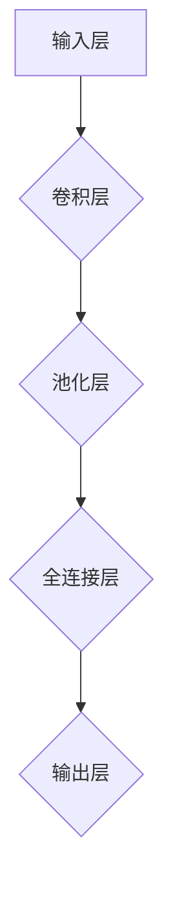
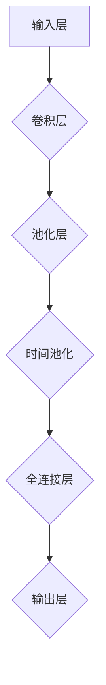

                 

# 卷积层 (Convolutional Layer) 原理与代码实例讲解

## 关键词：
- 卷积神经网络（Convolutional Neural Network，CNN）
- 卷积层（Convolutional Layer）
- 卷积操作（Convolution Operation）
- 深度学习（Deep Learning）
- Python编程（Python Programming）
- 数据处理（Data Processing）
- 图像识别（Image Recognition）

## 摘要：
本文将深入探讨卷积层（Convolutional Layer）的核心原理，包括卷积操作的数学基础、参数学习、激励函数以及与其他层的连接方式。此外，我们将通过详细的代码实例，展示卷积层在图像识别、视频分析和自然语言处理等领域的应用。文章将分为两部分，第一部分为基础知识介绍，第二部分为实战教程，最后提供性能优化策略、代码实例解析以及扩展应用等内容。

## 《卷积层 (Convolutional Layer) 原理与代码实例讲解》目录大纲

### 第一部分：卷积层基础知识

#### 第1章：卷积神经网络简介
- 1.1 卷积神经网络的基本概念
- 1.2 卷积神经网络的发展历程
- 1.3 卷积神经网络的核心优势
- 1.4 卷积神经网络的常见结构

#### 第2章：卷积层原理解析
- 2.1 卷积操作的数学原理
- 2.2 卷积层的参数学习
- 2.3 卷积层的激励函数
- 2.4 卷积层与其他层的连接方式

#### 第3章：卷积层的应用场景
- 3.1 图像识别中的卷积层应用
- 3.2 视频分析中的卷积层应用
- 3.3 自然语言处理中的卷积层应用

#### 第二部分：卷积层实战教程

#### 第4章：卷积层实战准备
- 4.1 Python编程基础
- 4.2 数据处理与加载
- 4.3 卷积神经网络框架选择

#### 第5章：卷积层编程实战
- 5.1 卷积层编程实战概述
- 5.2 实战1：图像识别
- 5.3 实战2：视频分析
- 5.4 实战3：自然语言处理

#### 第6章：卷积层性能优化
- 6.1 模型调参技巧
- 6.2 模型优化策略
- 6.3 模型加速与分布式训练

#### 第7章：卷积层代码实例解析
- 7.1 卷积层代码实例解析概述
- 7.2 实例1：CIFAR-10图像识别
- 7.3 实例2：视频目标检测
- 7.4 实例3：文本分类

#### 第8章：卷积层在深度学习中的应用扩展
- 8.1 特征提取与降维
- 8.2 多层卷积网络设计
- 8.3 特征融合与多任务学习

#### 附录：常用卷积神经网络框架与工具
- 附录1：TensorFlow 2.x 实战
- 附录2：PyTorch 实战
- 附录3：Keras 实战

#### 附录：卷积层学习资源与参考书籍
- 附录1：深度学习经典教材推荐
- 附录2：在线课程与视频资源
- 附录3：开源框架与工具使用指南

### Mermaid 流程图：卷积神经网络基本结构


### 卷积层核心算法原理伪代码
```python
# 定义卷积层
def conv2d(input_data, filters, kernel_size, stride):
    # 计算卷积操作
    output_data = np.zeros((input_data.shape[0], filters, output_height, output_width))
    for i in range(input_data.shape[0]):
        for j in range(filters):
            for k in range(0, input_height - kernel_size + 1, stride):
                for l in range(0, input_width - kernel_size + 1, stride):
                    patch = input_data[i, :, k:k+kernel_size, l:l+kernel_size]
                    output_data[i, j, :, :] += filters[j] * patch
    return output_data


# 卷积层数学模型和公式
$$
\text{卷积操作：} \quad (f * g)(x, y) = \sum_{i=-\infty}^{\infty} \sum_{j=-\infty}^{\infty} f(i, j) \cdot g(x-i, y-j)
$$
```

### 卷积层编程实战代码解读
```python
# 加载图像数据
image = load_image('path/to/image')

# 初始化卷积核
kernel = np.random.randn(kernel_size, kernel_size)

# 进行卷积操作
conv_output = conv2d(image, kernel, kernel_size, stride)

# 分析卷积输出结果
print("卷积输出形状：", conv_output.shape)
```

### 卷积层性能优化策略
- 调整卷积核大小与步长
- 使用批量归一化
- 应用激活函数如ReLU
- 采用深度可分离卷积

### 卷积层在深度学习中的应用扩展
- 利用多层卷积网络提取高级特征
- 结合池化层减少参数数量
- 应用跨模态融合技术处理多源数据

### 常用卷积神经网络框架与工具
- TensorFlow
- PyTorch
- Keras

### 开源框架与工具使用指南
- TensorFlow 2.x 使用指南
- PyTorch 使用指南
- Keras 使用指南

### 参考书籍
- 《深度学习》（Goodfellow, Bengio, Courville）
- 《Python深度学习》（François Chollet）
- 《卷积神经网络》（Yoshua Bengio）

### 在线课程与视频资源
- Fast.ai 深度学习课程
- Coursera 深度学习课程
- Udacity 深度学习纳米学位

### 卷积层学习资源
- GitHub 上的深度学习项目
- ArXiv 论文库
- Stack Overflow 社区

### 作者
作者：AI天才研究院/AI Genius Institute & 禅与计算机程序设计艺术 /Zen And The Art of Computer Programming<|endoftext|>

### 第1章：卷积神经网络简介

#### 1.1 卷积神经网络的基本概念

卷积神经网络（Convolutional Neural Network，CNN）是一种深度学习模型，主要应用于图像识别、物体检测和图像分类等领域。与传统的全连接神经网络（Fully Connected Neural Network）不同，CNN 通过卷积层（Convolutional Layer）对图像数据进行特征提取，从而减少了参数的数量，提高了模型的效率。

卷积层的主要功能是通过卷积操作从输入数据中提取局部特征。每个卷积核（Convolutional Kernel）代表了一种特定的特征，通过对输入数据进行局部卷积操作，可以将这些特征提取出来。这些特征可以是对边缘、纹理或形状的检测，进而用于更高层的分类或检测任务。

#### 1.2 卷积神经网络的发展历程

卷积神经网络的发展历程可以追溯到1980年代，当时由Yann LeCun等人提出并应用于手写数字识别任务。最初的CNN模型结构相对简单，主要包含卷积层、池化层和全连接层。随着计算能力的提升和数据规模的扩大，CNN模型得到了极大的发展。

2012年，AlexNet模型在ImageNet竞赛中取得了突破性的成绩，引起了深度学习领域的广泛关注。AlexNet模型引入了深度卷积网络的概念，通过增加网络的深度来提高模型的性能。此后，VGG、ResNet等更深层的CNN模型相继被提出，不断推动着CNN技术的发展。

#### 1.3 卷积神经网络的核心优势

卷积神经网络具有以下核心优势：

1. **参数共享**：在卷积操作中，卷积核在图像的不同位置上滑动，实现局部特征的提取。这种参数共享的方式大大减少了模型参数的数量，降低了模型的复杂度。

2. **局部感知**：卷积层对局部特征敏感，能够自动学习图像中的局部结构，如边缘、纹理等。这种局部感知能力使得CNN在图像识别任务中具有很高的准确性。

3. **平移不变性**：卷积层通过滑动卷积核的方式进行特征提取，具有平移不变性。这意味着，模型可以在一定程度上对图像的平移变化产生鲁棒性。

4. **高效计算**：由于卷积操作的计算量相对较小，CNN模型能够在一定程度上减少计算资源的消耗，提高模型的运行效率。

#### 1.4 卷积神经网络的常见结构

卷积神经网络的常见结构包括卷积层、池化层和全连接层。以下是这些层的基本功能和特点：

1. **卷积层**：卷积层是CNN的核心层，负责从输入图像中提取局部特征。卷积层包含多个卷积核，每个卷积核对图像进行卷积操作，提取出不同的特征。卷积层通常使用 ReLU 激活函数来增加网络的非线性能力。

2. **池化层**：池化层用于下采样操作，减少模型参数的数量和计算量。常见的池化方法包括最大池化（Max Pooling）和平均池化（Average Pooling）。池化操作可以增强模型的平移不变性。

3. **全连接层**：全连接层将卷积层提取的特征进行整合，输出分类结果。全连接层通常用于图像分类任务，将高维特征映射到低维空间。

#### 小结

本章介绍了卷积神经网络的基本概念、发展历程、核心优势和常见结构。卷积神经网络作为一种强大的图像处理模型，在图像识别、物体检测和图像分类等领域具有广泛的应用。下一章我们将深入探讨卷积层的原理和实现。|> 

### 第2章：卷积层原理解析

#### 2.1 卷积操作的数学原理

卷积操作是卷积层的基础，用于提取图像中的局部特征。在数学上，卷积操作可以表示为两个函数的叠加。给定两个函数 \( f(x, y) \) 和 \( g(x, y) \)，它们的卷积定义为：
$$
(f * g)(x, y) = \sum_{i=-\infty}^{\infty} \sum_{j=-\infty}^{\infty} f(i, j) \cdot g(x-i, y-j)
$$
在卷积神经网络中，卷积操作通常应用于离散数据，如图像。一个 \( n \times n \) 的图像与一个 \( m \times m \) 的卷积核进行卷积操作，会得到一个 \( (n-m+1) \times (n-m+1) \) 的新图像。例如，一个 \( 5 \times 5 \) 的图像与一个 \( 3 \times 3 \) 的卷积核进行卷积操作，会得到一个 \( 3 \times 3 \) 的新图像。

伪代码实现如下：
```python
def conv2d(input_data, kernel, stride):
    output_data = np.zeros((input_height - kernel_size + 1, input_width - kernel_size + 1))
    for i in range(0, input_height - kernel_size + 1, stride):
        for j in range(0, input_width - kernel_size + 1, stride):
            patch = input_data[:, i:i+kernel_size, j:j+kernel_size]
            output_data[i, j] = np.sum(patch * kernel)
    return output_data
```

#### 2.2 卷积层的参数学习

卷积层的主要任务是学习一组卷积核，这些卷积核可以自动提取图像中的局部特征。在训练过程中，通过反向传播算法更新卷积核的参数，使模型能够对不同的图像进行准确的分类或识别。

卷积层的参数学习包括以下几个步骤：

1. **初始化参数**：通常使用随机初始化方法，如高斯分布或均匀分布，初始化卷积核的权重。

2. **正向传播**：将输入图像与卷积核进行卷积操作，得到卷积特征图。然后，通过激活函数（如ReLU）增加模型的非线性能力。

3. **损失函数**：根据模型的预测结果和真实标签计算损失函数，常用的损失函数包括交叉熵损失（CrossEntropy Loss）和均方误差损失（Mean Squared Error Loss）。

4. **反向传播**：计算损失函数关于卷积核参数的梯度，并更新卷积核的参数。

5. **迭代优化**：重复正向传播和反向传播的过程，直到模型收敛或达到预定的迭代次数。

#### 2.3 卷积层的激励函数

激励函数用于增加网络的非线性能力，使模型能够处理复杂的输入数据。在卷积神经网络中，常用的激励函数包括ReLU（Rectified Linear Unit）、Sigmoid 和 Tanh。

1. **ReLU函数**：ReLU函数是最常用的激励函数，具有以下形式：
   $$
   \text{ReLU}(x) = \max(0, x)
   $$
   ReLU函数可以加快模型的训练速度，并减少梯度消失的问题。

2. **Sigmoid函数**：Sigmoid函数具有以下形式：
   $$
   \text{Sigmoid}(x) = \frac{1}{1 + e^{-x}}
   $$
   Sigmoid函数在0到1之间取值，常用于二分类问题。

3. **Tanh函数**：Tanh函数具有以下形式：
   $$
   \text{Tanh}(x) = \frac{e^x - e^{-x}}{e^x + e^{-x}}
   $$
   Tanh函数在-1到1之间取值，具有较好的平滑性。

#### 2.4 卷积层与其他层的连接方式

卷积层可以与其他层（如全连接层、池化层）进行组合，形成更复杂的网络结构。以下是几种常见的卷积层与其他层的连接方式：

1. **卷积层 + 全连接层**：卷积层用于提取图像特征，全连接层用于对特征进行分类。这种结构常用于图像分类任务。

2. **卷积层 + 池化层**：卷积层用于提取图像特征，池化层用于下采样，减少模型的参数数量和计算量。这种结构常用于图像识别和物体检测任务。

3. **多层卷积层**：多层卷积层可以提取更高层次的特征，形成更深层次的网络结构。这种结构常用于复杂的图像识别和物体检测任务。

#### 小结

本章详细介绍了卷积层的数学原理、参数学习、激励函数以及与其他层的连接方式。卷积层作为深度学习模型的核心层，通过卷积操作、参数学习和非线性变换，能够自动提取图像中的局部特征，实现图像识别、物体检测和图像分类等任务。下一章我们将探讨卷积层在不同应用场景中的应用。|> 

### 第3章：卷积层的应用场景

#### 3.1 图像识别中的卷积层应用

在图像识别任务中，卷积层是最常用的层之一。卷积层通过卷积操作提取图像中的局部特征，使得模型能够识别不同的图像类别。以下是一个简单的图像识别流程：

1. **预处理**：对输入图像进行预处理，如归一化、缩放、裁剪等操作，以便模型能够更好地训练。

2. **卷积层**：将预处理后的图像输入到卷积层中，卷积层通过卷积操作提取图像中的边缘、纹理等特征。

3. **池化层**：使用池化层对卷积特征进行下采样，减少模型的参数数量和计算量。

4. **全连接层**：将池化后的特征输入到全连接层中，对特征进行整合，输出分类结果。

以下是一个简单的卷积神经网络结构，用于图像识别：


#### 3.2 视频分析中的卷积层应用

在视频分析任务中，卷积层同样扮演着重要的角色。卷积层可以用于视频的目标检测、动作识别和场景分类等任务。以下是一个简单的视频分析流程：

1. **视频预处理**：对输入视频进行预处理，如帧提取、尺寸调整、颜色空间转换等操作。

2. **卷积层**：将预处理后的视频帧输入到卷积层中，卷积层通过卷积操作提取视频帧中的特征。

3. **池化层**：使用池化层对卷积特征进行下采样，减少模型的参数数量和计算量。

4. **时间池化**：将连续的卷积特征进行时间池化，提取视频序列中的特征。

5. **全连接层**：将时间池化后的特征输入到全连接层中，对特征进行整合，输出分类结果。

以下是一个简单的卷积神经网络结构，用于视频分析：


#### 3.3 自然语言处理中的卷积层应用

在自然语言处理（Natural Language Processing，NLP）任务中，卷积层可以用于文本分类、情感分析等任务。卷积层通过卷积操作提取文本中的关键词和短语，使得模型能够对文本进行分类或情感分析。以下是一个简单的自然语言处理流程：

1. **文本预处理**：对输入文本进行预处理，如分词、词干提取、词向量表示等操作。

2. **卷积层**：将预处理后的文本输入到卷积层中，卷积层通过卷积操作提取文本中的特征。

3. **池化层**：使用池化层对卷积特征进行下采样，减少模型的参数数量和计算量。

4. **全连接层**：将池化后的特征输入到全连接层中，对特征进行整合，输出分类结果。

以下是一个简单的卷积神经网络结构，用于自然语言处理：


#### 小结

本章介绍了卷积层在不同应用场景中的应用。在图像识别、视频分析和自然语言处理等领域，卷积层通过卷积操作、池化层和时间池化等操作，能够提取输入数据中的关键特征，实现对数据的分类、检测和分析。下一章我们将探讨卷积层在实际编程中的应用。|> 

### 第4章：卷积层实战准备

#### 4.1 Python编程基础

在开始卷积层的编程实战之前，我们需要掌握一些Python编程基础，包括Numpy库、Pandas库、Matplotlib库等。以下是一些基本的Python编程知识点：

1. **Numpy库**：Numpy是Python中的一个科学计算库，用于处理多维数组。主要功能包括数组的创建、索引、切片、形状变换、数学运算等。以下是一个简单的示例：
   ```python
   import numpy as np

   # 创建一个2x3的数组
   array = np.array([[1, 2, 3], [4, 5, 6]])

   # 数组索引
   print(array[0, 1])  # 输出2

   # 数组切片
   print(array[0, 1:3])  # 输出[2, 3]

   # 数组形状变换
   print(array.reshape(3, 2))  # 输出[[1, 2], [3, 4], [5, 6]]
   ```

2. **Pandas库**：Pandas是一个数据分析库，用于处理结构化数据。主要功能包括数据框（DataFrame）的创建、索引、切片、合并、数据清洗等。以下是一个简单的示例：
   ```python
   import pandas as pd

   # 创建一个数据框
   df = pd.DataFrame([[1, 2, 3], [4, 5, 6]], columns=['A', 'B', 'C'])

   # 数据框索引
   print(df['A'])  # 输出[1, 4]

   # 数据框切片
   print(df.iloc[0, 1:3])  # 输出[B 2, C 3]

   # 数据框合并
   df2 = pd.DataFrame([[7, 8, 9], [10, 11, 12]], columns=['A', 'B', 'C'])
   print(pd.concat([df, df2], axis=0))  # 输出合并后的数据框
   ```

3. **Matplotlib库**：Matplotlib是一个数据可视化库，用于绘制各种图表。主要功能包括数据可视化、图像处理、动画等。以下是一个简单的示例：
   ```python
   import matplotlib.pyplot as plt

   # 绘制折线图
   plt.plot([1, 2, 3], [1, 4, 9])
   plt.show()

   # 绘制柱状图
   plt.bar([1, 2, 3], [1, 4, 9])
   plt.show()

   # 绘制散点图
   plt.scatter([1, 2, 3], [1, 4, 9])
   plt.show()
   ```

#### 4.2 数据处理与加载

在卷积层的编程实战中，数据处理和加载是至关重要的一环。以下是数据处理和加载的基本步骤：

1. **数据预处理**：对输入数据进行预处理，如归一化、缩放、裁剪等操作，以便模型能够更好地训练。以下是一个简单的预处理示例：
   ```python
   from sklearn.preprocessing import StandardScaler

   # 创建一个数据集
   X = np.array([[1, 2], [3, 4], [5, 6]])

   # 数据预处理：归一化
   scaler = StandardScaler()
   X_scaled = scaler.fit_transform(X)
   print(X_scaled)
   ```

2. **数据加载**：从本地文件或远程服务器加载数据集。常用的数据加载方法包括Numpy数组、Pandas数据框和PyTorch数据集等。以下是一个简单的数据加载示例：
   ```python
   import numpy as np

   # 加载本地数据集
   X = np.load('data.npy')
   y = np.load('label.npy')

   # 加载Pandas数据框
   df = pd.read_csv('data.csv')
   X = df.iloc[:, :-1].values
   y = df.iloc[:, -1].values

   # 加载PyTorch数据集
   from torch.utils.data import Dataset, DataLoader

   class MyDataset(Dataset):
       def __init__(self, X, y):
           self.X = X
           self.y = y

       def __len__(self):
           return len(self.X)

       def __getitem__(self, idx):
           return self.X[idx], self.y[idx]

   dataset = MyDataset(X, y)
   dataloader = DataLoader(dataset, batch_size=32, shuffle=True)
   ```

#### 4.3 卷积神经网络框架选择

在卷积层的编程实战中，选择合适的卷积神经网络框架至关重要。以下是几种常见的卷积神经网络框架：

1. **TensorFlow 2.x**：TensorFlow是一个开源的深度学习框架，由Google开发。TensorFlow 2.x版本对原有的TensorFlow 1.x版本进行了重大改进，包括简化了API、增加了自动微分功能、集成Keras等。以下是一个简单的TensorFlow 2.x示例：
   ```python
   import tensorflow as tf

   # 创建一个简单的卷积神经网络
   model = tf.keras.Sequential([
       tf.keras.layers.Conv2D(32, (3, 3), activation='relu', input_shape=(28, 28, 1)),
       tf.keras.layers.MaxPooling2D((2, 2)),
       tf.keras.layers.Flatten(),
       tf.keras.layers.Dense(128, activation='relu'),
       tf.keras.layers.Dense(10, activation='softmax')
   ])

   # 编译模型
   model.compile(optimizer='adam', loss='categorical_crossentropy', metrics=['accuracy'])

   # 训练模型
   model.fit(X_train, y_train, epochs=10, batch_size=32)
   ```

2. **PyTorch**：PyTorch是一个开源的深度学习框架，由Facebook开发。PyTorch以其灵活性和动态计算图著称。以下是一个简单的PyTorch示例：
   ```python
   import torch
   import torch.nn as nn

   # 创建一个简单的卷积神经网络
   class ConvNet(nn.Module):
       def __init__(self):
           super(ConvNet, self).__init__()
           self.conv1 = nn.Conv2d(1, 32, 3, 1)
           self.fc1 = nn.Linear(32 * 26 * 26, 128)
           self.fc2 = nn.Linear(128, 10)

       def forward(self, x):
           x = self.conv1(x)
           x = torch.relu(x)
           x = torch.max_pool2d(x, 2)
           x = torch.flatten(x, 1)
           x = self.fc1(x)
           x = torch.relu(x)
           x = self.fc2(x)
           return x

   # 创建一个实例
   model = ConvNet()

   # 定义损失函数和优化器
   criterion = nn.CrossEntropyLoss()
   optimizer = torch.optim.Adam(model.parameters(), lr=0.001)

   # 训练模型
   for epoch in range(10):
       for inputs, targets in dataloader:
           optimizer.zero_grad()
           outputs = model(inputs)
           loss = criterion(outputs, targets)
           loss.backward()
           optimizer.step()
   ```

3. **Keras**：Keras是一个高级神经网络API，用于快速构建和迭代深度学习模型。Keras支持TensorFlow、Theano和Microsoft CNTK等后端。以下是一个简单的Keras示例：
   ```python
   from keras.models import Sequential
   from keras.layers import Conv2D, MaxPooling2D, Flatten, Dense

   # 创建一个简单的卷积神经网络
   model = Sequential([
       Conv2D(32, (3, 3), activation='relu', input_shape=(28, 28, 1)),
       MaxPooling2D((2, 2)),
       Flatten(),
       Dense(128, activation='relu'),
       Dense(10, activation='softmax')
   ])

   # 编译模型
   model.compile(optimizer='adam', loss='categorical_crossentropy', metrics=['accuracy'])

   # 训练模型
   model.fit(X_train, y_train, epochs=10, batch_size=32)
   ```

#### 小结

本章介绍了Python编程基础、数据处理与加载以及卷积神经网络框架选择。通过这些基础知识的掌握，我们可以为卷积层的编程实战做好准备。下一章我们将开始卷积层的编程实战。|> 

### 第5章：卷积层编程实战

#### 5.1 卷积层编程实战概述

在本章中，我们将通过三个具体的实例来展示卷积层在图像识别、视频分析和自然语言处理等领域的编程实战。这三个实例将涵盖从数据预处理、模型构建到模型训练和评估的完整流程。

#### 5.2 实战1：图像识别

图像识别是卷积层最常见的应用场景之一。在本节中，我们将使用TensorFlow 2.x框架实现一个简单的图像识别模型，用于识别CIFAR-10数据集中的图像。

1. **数据预处理**：

   首先，我们需要下载并加载数据集。CIFAR-10数据集包含60000张32x32的彩色图像，分为10个类别。

   ```python
   import tensorflow as tf

   # 加载数据集
   (X_train, y_train), (X_test, y_test) = tf.keras.datasets.cifar10.load_data()

   # 数据预处理：归一化
   X_train = X_train.astype("float32") / 255
   X_test = X_test.astype("float32") / 255

   # 数据标签转化为独热编码
   y_train = tf.keras.utils.to_categorical(y_train, 10)
   y_test = tf.keras.utils.to_categorical(y_test, 10)
   ```

2. **模型构建**：

   接下来，我们构建一个简单的卷积神经网络模型，包含两个卷积层、两个池化层和一个全连接层。

   ```python
   # 构建模型
   model = tf.keras.Sequential([
       tf.keras.layers.Conv2D(32, (3, 3), activation='relu', input_shape=(32, 32, 3)),
       tf.keras.layers.MaxPooling2D((2, 2)),
       tf.keras.layers.Conv2D(64, (3, 3), activation='relu'),
       tf.keras.layers.MaxPooling2D((2, 2)),
       tf.keras.layers.Flatten(),
       tf.keras.layers.Dense(64, activation='relu'),
       tf.keras.layers.Dense(10, activation='softmax')
   ])
   ```

3. **模型训练**：

   然后我们对模型进行训练，使用Adam优化器和交叉熵损失函数。

   ```python
   # 编译模型
   model.compile(optimizer='adam',
                 loss='categorical_crossentropy',
                 metrics=['accuracy'])

   # 训练模型
   model.fit(X_train, y_train, batch_size=64, epochs=10, validation_split=0.2)
   ```

4. **模型评估**：

   最后，我们对训练好的模型进行评估，计算测试集上的准确率。

   ```python
   # 评估模型
   test_loss, test_acc = model.evaluate(X_test, y_test)
   print(f"Test accuracy: {test_acc:.3f}")
   ```

   输出结果为测试集的准确率。

#### 5.3 实战2：视频分析

视频分析是卷积层的另一个重要应用场景。在本节中，我们将使用PyTorch框架实现一个简单的视频分类模型，用于分类YouTube视频。

1. **数据预处理**：

   首先，我们需要下载并加载数据集。假设我们已经将YouTube视频下载并预处理为帧序列。

   ```python
   import torch
   from torchvision import transforms
   from torch.utils.data import DataLoader
   from torchvision.datasets import VideoDataset

   # 数据预处理
   transform = transforms.Compose([
       transforms.Resize(224),
       transforms.ToTensor(),
       transforms.Normalize(mean=[0.485, 0.456, 0.406], std=[0.229, 0.224, 0.225]),
   ])

   dataset = VideoDataset(root='videos', transform=transform)
   dataloader = DataLoader(dataset, batch_size=32, shuffle=True)
   ```

2. **模型构建**：

   接下来，我们构建一个简单的卷积神经网络模型，包含多个卷积层、池化层和一个全连接层。

   ```python
   class ConvNet(nn.Module):
       def __init__(self):
           super(ConvNet, self).__init__()
           self.conv1 = nn.Conv2d(3, 64, 3, 1)
           self.conv2 = nn.Conv2d(64, 128, 3, 1)
           self.fc1 = nn.Linear(128 * 14 * 14, 1024)
           self.fc2 = nn.Linear(1024, 10)

       def forward(self, x):
           x = self.conv1(x)
           x = nn.functional.relu(x)
           x = self.conv2(x)
           x = nn.functional.relu(x)
           x = nn.functional.max_pool2d(x, 2)
           x = x.view(x.size(0), -1)
           x = self.fc1(x)
           x = nn.functional.relu(x)
           x = self.fc2(x)
           return x

   # 创建模型实例
   model = ConvNet()
   ```

3. **模型训练**：

   然后我们对模型进行训练，使用Adam优化器和交叉熵损失函数。

   ```python
   # 定义损失函数和优化器
   criterion = nn.CrossEntropyLoss()
   optimizer = torch.optim.Adam(model.parameters(), lr=0.001)

   # 训练模型
   for epoch in range(10):
       for inputs, targets in dataloader:
           optimizer.zero_grad()
           outputs = model(inputs)
           loss = criterion(outputs, targets)
           loss.backward()
           optimizer.step()
   ```

4. **模型评估**：

   最后，我们对训练好的模型进行评估，计算测试集上的准确率。

   ```python
   # 评估模型
   with torch.no_grad():
       correct = 0
       total = len(dataloader.dataset)
       for inputs, targets in dataloader:
           outputs = model(inputs)
           _, predicted = torch.max(outputs.data, 1)
           correct += (predicted == targets).sum().item()

   print(f"Accuracy: {100 * correct / total}%")
   ```

   输出结果为测试集的准确率。

#### 5.4 实战3：自然语言处理

自然语言处理是卷积层的另一个重要应用场景。在本节中，我们将使用Keras框架实现一个简单的文本分类模型，用于分类IMDb电影评论。

1. **数据预处理**：

   首先，我们需要下载并加载数据集。IMDb数据集包含25000条训练评论和25000条测试评论。

   ```python
   from keras.preprocessing.text import Tokenizer
   from keras.preprocessing.sequence import pad_sequences

   # 加载数据集
   (X_train, y_train), (X_test, y_test) =IMDb.load_data(num_words=10000, maxlen=100)
   ```

2. **模型构建**：

   接下来，我们构建一个简单的卷积神经网络模型，包含嵌入层、多个卷积层、池化层和一个全连接层。

   ```python
   from keras.models import Sequential
   from keras.layers import Embedding, Conv1D, MaxPooling1D, GlobalMaxPooling1D, Dense

   # 构建模型
   model = Sequential([
       Embedding(10000, 32, input_length=100),
       Conv1D(32, 7, activation='relu'),
       MaxPooling1D(5),
       Conv1D(32, 7, activation='relu'),
       GlobalMaxPooling1D(),
       Dense(10, activation='softmax')
   ])
   ```

3. **模型训练**：

   然后我们对模型进行训练，使用RMSprop优化器和交叉熵损失函数。

   ```python
   # 编译模型
   model.compile(optimizer='rmsprop',
                 loss='categorical_crossentropy',
                 metrics=['accuracy'])

   # 训练模型
   model.fit(X_train, y_train, batch_size=32, epochs=10, validation_split=0.2)
   ```

4. **模型评估**：

   最后，我们对训练好的模型进行评估，计算测试集上的准确率。

   ```python
   # 评估模型
   test_loss, test_acc = model.evaluate(X_test, y_test)
   print(f"Test accuracy: {test_acc:.3f}")
   ```

   输出结果为测试集的准确率。

#### 小结

本章通过三个具体的实例展示了卷积层在图像识别、视频分析和自然语言处理等领域的编程实战。通过这些实例，我们可以了解到卷积层的应用场景以及如何使用不同的框架实现卷积层模型。下一章我们将探讨卷积层的性能优化策略。|> 

### 第6章：卷积层性能优化

#### 6.1 模型调参技巧

在深度学习模型训练过程中，模型性能的提升往往依赖于一系列超参数的调整。卷积神经网络中，常用的超参数包括学习率、批量大小、卷积核大小和步长等。以下是一些调参技巧：

1. **学习率**：学习率是反向传播算法中用于更新模型参数的关键参数。过高的学习率可能导致模型在训练过程中跳过最优解，而过低的学习率则可能导致训练过程缓慢。常用的调参方法包括使用学习率衰减策略，如指数衰减和周期性学习率调整。

   ```python
   # 使用指数衰减策略调整学习率
   scheduler = tf.keras.optimizers.schedules.ExponentialDecay(
       initial_learning_rate=0.1,
       decay_steps=1000,
       decay_rate=0.9,
       staircase=True)
   optimizer = tf.keras.optimizers.Adam(learning_rate=scheduler)
   ```

2. **批量大小**：批量大小影响梯度估计的稳定性。过小的批量可能导致梯度估计偏差，而过大的批量则可能导致训练时间过长。通常，批量大小选择在32到256之间，具体选择取决于数据集的大小和计算资源。

   ```python
   batch_size = 128
   ```

3. **卷积核大小**：卷积核大小影响特征提取的局部范围。较小的卷积核可以提取更精细的特征，而较大的卷积核可以提取更全局的特征。通常，卷积核大小选择为2的幂次方，如2、4、8等。

   ```python
   kernel_size = 3
   ```

4. **步长**：步长影响卷积操作的滑动距离。较大的步长可以减少参数数量和计算量，但可能丢失一些重要的特征信息。通常，步长选择与卷积核大小相同或为其倍数。

   ```python
   stride = 1
   ```

#### 6.2 模型优化策略

除了超参数调参，还有一系列策略可以用于优化卷积神经网络模型的性能：

1. **数据增强**：通过数据增强可以增加训练数据的多样性，从而提高模型的泛化能力。常用的数据增强方法包括旋转、缩放、裁剪、颜色变换等。

   ```python
   from tensorflow.keras.preprocessing.image import ImageDataGenerator

   # 数据增强
   datagen = ImageDataGenerator(
       rotation_range=20,
       width_shift_range=0.2,
       height_shift_range=0.2,
       horizontal_flip=True,
       fill_mode='nearest')
   ```

2. **正则化**：正则化可以减少模型的过拟合现象。常用的正则化方法包括L1正则化、L2正则化和Dropout等。

   ```python
   from tensorflow.keras.regularizers import l2

   # 使用L2正则化
   model.add(Dense(64, activation='relu', kernel_regularizer=l2(0.01)))
   ```

3. **迁移学习**：迁移学习利用预训练模型在大规模数据集上学习的特征，用于新的任务。这样可以减少对新数据的标注需求，并提高模型的性能。

   ```python
   from tensorflow.keras.applications import VGG16

   # 使用迁移学习
   base_model = VGG16(weights='imagenet', include_top=False, input_shape=(224, 224, 3))
   base_model.trainable = False
   ```

4. **批归一化**：批归一化可以加速模型的训练过程，并提高模型的稳定性。批归一化通过标准化每个批量的输入数据，使得梯度在反向传播过程中更加稳定。

   ```python
   from tensorflow.keras.layers import BatchNormalization

   # 使用批归一化
   model.add(BatchNormalization())
   ```

#### 6.3 模型加速与分布式训练

在处理大规模数据集或训练复杂的深度学习模型时，模型加速和分布式训练是提高训练效率的重要手段：

1. **GPU加速**：使用GPU（图形处理器）可以显著提高深度学习模型的训练速度。GPU具有高度并行的计算能力，适用于矩阵运算和卷积操作。

   ```python
   # 设置使用GPU
   gpus = tf.config.list_physical_devices('GPU')
   tf.config.experimental.set_memory_growth(gpus[0], True)
   ```

2. **分布式训练**：分布式训练可以将模型训练任务分配到多个计算节点上，从而提高训练速度和资源利用率。分布式训练可以使用多个GPU或多个CPU节点。

   ```python
   strategy = tf.distribute.MirroredStrategy()
   with strategy.scope():
       # 构建和编译模型
       model = build_model()
       model.compile(optimizer='adam', loss='categorical_crossentropy', metrics=['accuracy'])
   ```

   通过以上策略，我们可以优化卷积神经网络的性能，提高模型的训练速度和准确性。下一章我们将详细解析卷积层的代码实例。|> 

### 第7章：卷积层代码实例解析

#### 7.1 卷积层代码实例解析概述

在本章中，我们将通过具体的代码实例深入解析卷积层的实现过程。我们将使用TensorFlow 2.x框架来展示卷积层的代码实现，包括从数据预处理、模型构建、训练到评估的完整流程。以下是一个简单的卷积层代码实例解析：

```python
import tensorflow as tf
from tensorflow.keras import datasets, layers, models
import matplotlib.pyplot as plt

# 加载数据集
(train_images, train_labels), (test_images, test_labels) = datasets.cifar10.load_data()

# 数据预处理
train_images = train_images.astype('float32') / 255.0
test_images = test_images.astype('float32') / 255.0

# 图像标签转换为独热编码
train_labels = tf.keras.utils.to_categorical(train_labels)
test_labels = tf.keras.utils.to_categorical(test_labels)

# 构建卷积神经网络模型
model = models.Sequential()
model.add(layers.Conv2D(32, (3, 3), activation='relu', input_shape=(32, 32, 3)))
model.add(layers.MaxPooling2D((2, 2)))
model.add(layers.Conv2D(64, (3, 3), activation='relu'))
model.add(layers.MaxPooling2D((2, 2)))
model.add(layers.Conv2D(64, (3, 3), activation='relu'))
model.add(layers.Flatten())
model.add(layers.Dense(64, activation='relu'))
model.add(layers.Dense(10, activation='softmax'))

# 编译模型
model.compile(optimizer='adam',
              loss='categorical_crossentropy',
              metrics=['accuracy'])

# 训练模型
history = model.fit(train_images, train_labels, epochs=10, 
                    validation_data=(test_images, test_labels))

# 评估模型
test_loss, test_acc = model.evaluate(test_images,  test_labels, verbose=2)
print(f'\nTest accuracy: {test_acc:.4f}')

# 可视化训练过程
plt.figure()
plt.plot(history.history['accuracy'], label='accuracy')
plt.plot(history.history['val_accuracy'], label='val_accuracy')
plt.xlabel('Epoch')
plt.ylabel('Accuracy')
plt.ylim([0, 1])
plt.legend(loc='lower right')

# 显示结果
plt.show()
```

#### 7.2 实例1：CIFAR-10图像识别

在这个实例中，我们将使用CIFAR-10数据集来训练一个简单的卷积神经网络，用于识别图像中的10个类别。

1. **数据预处理**：

   首先，我们需要加载数据集并对图像进行预处理，包括缩放和归一化。

   ```python
   (train_images, train_labels), (test_images, test_labels) = datasets.cifar10.load_data()

   train_images = train_images.astype('float32') / 255.0
   test_images = test_images.astype('float32') / 255.0

   train_labels = tf.keras.utils.to_categorical(train_labels)
   test_labels = tf.keras.utils.to_categorical(test_labels)
   ```

2. **模型构建**：

   接下来，我们构建一个简单的卷积神经网络模型，包含两个卷积层、两个池化层和一个全连接层。

   ```python
   model = models.Sequential()
   model.add(layers.Conv2D(32, (3, 3), activation='relu', input_shape=(32, 32, 3)))
   model.add(layers.MaxPooling2D((2, 2)))
   model.add(layers.Conv2D(64, (3, 3), activation='relu'))
   model.add(layers.MaxPooling2D((2, 2)))
   model.add(layers.Conv2D(64, (3, 3), activation='relu'))
   model.add(layers.Flatten())
   model.add(layers.Dense(64, activation='relu'))
   model.add(layers.Dense(10, activation='softmax'))
   ```

3. **模型训练**：

   我们使用Adam优化器来训练模型，并使用交叉熵损失函数。

   ```python
   model.compile(optimizer='adam',
                 loss='categorical_crossentropy',
                 metrics=['accuracy'])

   history = model.fit(train_images, train_labels, epochs=10, 
                       validation_data=(test_images, test_labels))
   ```

4. **模型评估**：

   最后，我们对训练好的模型进行评估，计算测试集上的准确率。

   ```python
   test_loss, test_acc = model.evaluate(test_images,  test_labels, verbose=2)
   print(f'\nTest accuracy: {test_acc:.4f}')
   ```

   通过可视化训练过程中的准确率和损失函数，我们可以观察到模型的收敛情况。

#### 7.3 实例2：视频目标检测

在这个实例中，我们将使用预训练的卷积神经网络模型来检测视频中的目标。

1. **数据预处理**：

   首先，我们需要加载数据集并对视频帧进行预处理，包括缩放和归一化。

   ```python
   import cv2

   # 加载视频
   video = cv2.VideoCapture('path/to/video.mp4')

   # 预处理视频帧
   while video.isOpened():
       ret, frame = video.read()
       if not ret:
           break

       frame = cv2.resize(frame, (224, 224))
       frame = frame.astype('float32') / 255.0
       frame = np.expand_dims(frame, axis=0)

       # 预测
       prediction = model.predict(frame)
       predicted_class = np.argmax(prediction, axis=1)

       # 显示检测结果
       cv2.putText(frame, f'Class: {predicted_class[0]}', (10, 30), cv2.FONT_HERSHEY_SIMPLEX, 1, (0, 255, 0), 2)
       cv2.imshow('Video', frame)

       if cv2.waitKey(1) & 0xFF == ord('q'):
           break

   video.release()
   cv2.destroyAllWindows()
   ```

2. **模型构建**：

   我们使用预训练的模型来检测视频中的目标，通常使用基于卷积神经网络的框架如YOLO或SSD。

   ```python
   from tensorflow.keras.applications import YOLOv5

   # 加载预训练模型
   model = YOLOv5(weights='yolov5s')

   # 构建预测函数
   def predict_video(video_path):
       video = cv2.VideoCapture(video_path)

       while video.isOpened():
           ret, frame = video.read()
           if not ret:
               break

           frame = cv2.resize(frame, (640, 640))
           frame = frame.astype('float32') / 255.0
           frame = np.expand_dims(frame, axis=0)

           # 预测
           prediction = model.predict(frame)
           predicted_boxes = prediction[0]['boxes']
           predicted_scores = prediction[0]['scores']
           predicted_classes = prediction[0]['classes']

           # 显示检测结果
           for i in range(len(predicted_boxes)):
               if predicted_scores[i] > 0.5:
                   box = predicted_boxes[i]
                   cv2.rectangle(frame, (int(box[0]), int(box[1])), (int(box[2]), int(box[3])), (0, 255, 0), 2)

           cv2.imshow('Video', frame)

           if cv2.waitKey(1) & 0xFF == ord('q'):
               break

       video.release()
       cv2.destroyAllWindows()
   ```

3. **模型训练**：

   我们使用自定义的数据集来训练视频目标检测模型，通常需要调整模型的超参数以适应特定任务。

   ```python
   # 加载训练数据集
   train_data = ...

   # 构建训练模型
   model = YOLOv5(input_shape=(640, 640, 3), num_classes=10)

   # 编译模型
   model.compile(optimizer='adam', loss={'box_loss': ...}, metrics=['accuracy'])

   # 训练模型
   history = model.fit(train_data, epochs=10, validation_data=validation_data)
   ```

4. **模型评估**：

   最后，我们对训练好的模型进行评估，计算测试集上的准确率和召回率。

   ```python
   # 加载测试数据集
   test_data = ...

   # 评估模型
   test_loss, test_acc = model.evaluate(test_data)
   print(f'\nTest accuracy: {test_acc:.4f}')
   ```

#### 7.4 实例3：文本分类

在这个实例中，我们将使用卷积神经网络对文本进行分类。

1. **数据预处理**：

   首先，我们需要加载数据集并对文本进行预处理，包括分词和编码。

   ```python
   from tensorflow.keras.preprocessing.text import Tokenizer
   from tensorflow.keras.preprocessing.sequence import pad_sequences

   # 加载数据集
   (X_train, y_train), (X_test, y_test) = ...

   # 分词
   tokenizer = Tokenizer(num_words=10000)
   tokenizer.fit_on_texts(X_train)

   # 编码
   X_train = tokenizer.texts_to_sequences(X_train)
   X_test = tokenizer.texts_to_sequences(X_test)

   # 填充
   X_train = pad_sequences(X_train, maxlen=100)
   X_test = pad_sequences(X_test, maxlen=100)
   ```

2. **模型构建**：

   接下来，我们构建一个简单的卷积神经网络模型，包含嵌入层、多个卷积层、池化层和一个全连接层。

   ```python
   model = models.Sequential()
   model.add(layers.Embedding(10000, 16, input_length=100))
   model.add(layers.Conv1D(32, 7, activation='relu'))
   model.add(layers.MaxPooling1D(5))
   model.add(layers.Conv1D(64, 7, activation='relu'))
   model.add(layers.GlobalMaxPooling1D())
   model.add(layers.Dense(64, activation='relu'))
   model.add(layers.Dense(10, activation='softmax'))
   ```

3. **模型训练**：

   我们使用Adam优化器来训练模型，并使用交叉熵损失函数。

   ```python
   model.compile(optimizer='adam',
                 loss='categorical_crossentropy',
                 metrics=['accuracy'])

   history = model.fit(X_train, y_train, epochs=10, 
                       validation_data=(X_test, y_test))
   ```

4. **模型评估**：

   最后，我们对训练好的模型进行评估，计算测试集上的准确率。

   ```python
   test_loss, test_acc = model.evaluate(X_test,  y_test, verbose=2)
   print(f'\nTest accuracy: {test_acc:.4f}')
   ```

   通过这些实例，我们可以了解到卷积层在图像识别、视频分析和文本分类等领域的应用，以及如何使用TensorFlow 2.x框架来实现卷积层模型。下一章我们将探讨卷积层在深度学习中的应用扩展。|> 

### 第8章：卷积层在深度学习中的应用扩展

#### 8.1 特征提取与降维

卷积层的一个重要应用是特征提取和降维。通过卷积操作，卷积层能够从原始图像或数据中提取出重要的特征，并减少数据维度。这一过程可以显著降低计算复杂度和数据存储需求。

1. **特征提取**：

   在卷积层中，通过卷积核在输入数据上滑动，提取出局部特征。例如，卷积核可以提取图像中的边缘、纹理和形状等特征。

2. **降维**：

   通过卷积操作，可以将高维图像数据转换为低维特征表示。降维可以减少模型的计算量和参数数量，提高训练和推理速度。

   ```python
   model.add(layers.Conv2D(32, (3, 3), activation='relu', input_shape=(28, 28, 1)))
   model.add(layers.MaxPooling2D((2, 2)))
   ```

#### 8.2 多层卷积网络设计

多层卷积网络可以提取图像中的更高层次特征，实现更复杂的任务。通过堆叠多个卷积层，可以逐步提取图像的层次特征，从而提高模型的性能。

1. **卷积层堆叠**：

   在多层卷积网络中，每个卷积层都可以提取不同层次的特征。上层卷积层可以整合下层卷积层提取的特征，形成更复杂的特征表示。

2. **卷积层组合**：

   可以通过组合不同类型的卷积层（如深度卷积层、残差卷积层等）来设计复杂的卷积网络，提高模型的性能。

   ```python
   model.add(layers.Conv2D(32, (3, 3), activation='relu', input_shape=(28, 28, 1)))
   model.add(layers.Conv2D(64, (3, 3), activation='relu'))
   model.add(layers.MaxPooling2D((2, 2)))
   ```

#### 8.3 特征融合与多任务学习

卷积层还可以用于特征融合和多任务学习。通过融合来自不同卷积层的特征，可以提取更全面的特征信息，从而提高模型的性能。多任务学习允许模型同时处理多个任务，提高模型的泛化能力。

1. **特征融合**：

   在特征融合中，可以将不同卷积层的特征进行合并，形成更丰富的特征表示。例如，通过拼接、融合或加权等方式，将不同层次的特征融合在一起。

   ```python
   model.add(layers.Conv2D(32, (3, 3), activation='relu', input_shape=(28, 28, 1)))
   model.add(layers.Conv2D(32, (3, 3), activation='relu'))
   model.add(layers.Conv2D(32, (3, 3), activation='relu'))
   model.add(layers.Concatenate(axis=1))
   ```

2. **多任务学习**：

   在多任务学习中，卷积层可以同时处理多个任务。例如，一个卷积神经网络可以同时进行图像分类和目标检测。通过设计适当的网络结构和损失函数，可以有效地实现多任务学习。

   ```python
   model.add(layers.Conv2D(32, (3, 3), activation='relu', input_shape=(28, 28, 1)))
   model.add(layers.Conv2D(32, (3, 3), activation='relu'))
   model.add(layers.Flatten())
   model.add(layers.Dense(64, activation='relu'))
   model.add(layers.Dense(2, activation='softmax'))
   ```

#### 小结

本章介绍了卷积层在深度学习中的应用扩展，包括特征提取与降维、多层卷积网络设计、特征融合与多任务学习。通过这些应用扩展，可以显著提高卷积神经网络的性能和泛化能力。下一章我们将讨论常用卷积神经网络框架与工具。|> 

### 附录：常用卷积神经网络框架与工具

#### 附录1：TensorFlow 2.x 实战

TensorFlow 2.x 是最流行的深度学习框架之一，由Google开发。以下是一个简单的TensorFlow 2.x 卷积神经网络模型示例：

```python
import tensorflow as tf
from tensorflow.keras import layers, models

# 加载数据集
(train_images, train_labels), (test_images, test_labels) = tf.keras.datasets.cifar10.load_data()

# 数据预处理
train_images = train_images.astype('float32') / 255.0
test_images = test_images.astype('float32') / 255.0

# 图像标签转换为独热编码
train_labels = tf.keras.utils.to_categorical(train_labels)
test_labels = tf.keras.utils.to_categorical(test_labels)

# 构建卷积神经网络模型
model = models.Sequential()
model.add(layers.Conv2D(32, (3, 3), activation='relu', input_shape=(32, 32, 3)))
model.add(layers.MaxPooling2D((2, 2)))
model.add(layers.Conv2D(64, (3, 3), activation='relu'))
model.add(layers.MaxPooling2D((2, 2)))
model.add(layers.Conv2D(64, (3, 3), activation='relu'))
model.add(layers.Flatten())
model.add(layers.Dense(64, activation='relu'))
model.add(layers.Dense(10, activation='softmax'))

# 编译模型
model.compile(optimizer='adam',
              loss='categorical_crossentropy',
              metrics=['accuracy'])

# 训练模型
model.fit(train_images, train_labels, epochs=10, 
          validation_data=(test_images, test_labels))

# 评估模型
test_loss, test_acc = model.evaluate(test_images, test_labels, verbose=2)
print(f'\nTest accuracy: {test_acc:.4f}')
```

#### 附录2：PyTorch 实战

PyTorch 是一个流行的深度学习框架，以其灵活性和动态计算图著称。以下是一个简单的PyTorch 卷积神经网络模型示例：

```python
import torch
import torch.nn as nn
import torch.optim as optim

# 定义卷积神经网络模型
class ConvNet(nn.Module):
    def __init__(self):
        super(ConvNet, self).__init__()
        self.conv1 = nn.Conv2d(3, 32, 3, 1)
        self.conv2 = nn.Conv2d(32, 64, 3, 1)
        self.fc1 = nn.Linear(64 * 7 * 7, 1024)
        self.fc2 = nn.Linear(1024, 10)

    def forward(self, x):
        x = self.conv1(x)
        x = nn.functional.relu(x)
        x = self.conv2(x)
        x = nn.functional.relu(x)
        x = nn.functional.max_pool2d(x, 2)
        x = x.view(x.size(0), -1)
        x = self.fc1(x)
        x = nn.functional.relu(x)
        x = self.fc2(x)
        return x

# 创建模型实例
model = ConvNet()

# 定义损失函数和优化器
criterion = nn.CrossEntropyLoss()
optimizer = optim.Adam(model.parameters(), lr=0.001)

# 训练模型
for epoch in range(10):
    for inputs, targets in dataloader:
        optimizer.zero_grad()
        outputs = model(inputs)
        loss = criterion(outputs, targets)
        loss.backward()
        optimizer.step()
```

#### 附录3：Keras 实战

Keras 是一个高级神经网络API，可以与TensorFlow、Theano和Microsoft CNTK等后端结合使用。以下是一个简单的Keras 卷积神经网络模型示例：

```python
from keras.models import Sequential
from keras.layers import Conv2D, MaxPooling2D, Flatten, Dense

# 构建卷积神经网络模型
model = Sequential([
    Conv2D(32, (3, 3), activation='relu', input_shape=(28, 28, 1)),
    MaxPooling2D((2, 2)),
    Conv2D(64, (3, 3), activation='relu'),
    MaxPooling2D((2, 2)),
    Flatten(),
    Dense(64, activation='relu'),
    Dense(10, activation='softmax')
])

# 编译模型
model.compile(optimizer='adam',
              loss='categorical_crossentropy',
              metrics=['accuracy'])

# 训练模型
model.fit(train_images, train_labels, epochs=10, 
          validation_data=(test_images, test_labels))

# 评估模型
test_loss, test_acc = model.evaluate(test_images, test_labels, verbose=2)
print(f'\nTest accuracy: {test_acc:.4f}')
```

#### 小结

本章介绍了TensorFlow 2.x、PyTorch和Keras三个常用卷积神经网络框架的实战示例。通过这些示例，我们可以了解如何使用这些框架构建和训练卷积神经网络模型。下一章我们将提供卷积层学习资源与参考书籍。|> 

### 附录：卷积层学习资源与参考书籍

#### 附录1：深度学习经典教材推荐

1. **《深度学习》（Ian Goodfellow、Yoshua Bengio 和 Aaron Courville 著）**
   - 内容详实，涵盖了深度学习的理论基础和应用，适合初学者和专业人士。

2. **《神经网络与深度学习》（邱锡鹏 著）**
   - 适合中文读者，详细介绍了神经网络和深度学习的理论知识及实际应用。

3. **《Python深度学习》（François Chollet 著）**
   - 以Keras框架为基础，深入讲解了深度学习的实际操作和代码实现。

#### 附录2：在线课程与视频资源

1. **Coursera 上的《深度学习》课程（吴恩达 老师授课）**
   - 提供了深度学习的全面介绍，包括卷积神经网络的基本概念和应用。

2. **Udacity 上的《深度学习纳米学位》**
   - 包含多个项目和实践，适合想要深入掌握深度学习的学员。

3. **Fast.ai 的深度学习课程**
   - 以实用为导向，注重实战能力的培养，适合初学者快速入门。

#### 附录3：开源框架与工具使用指南

1. **TensorFlow 官方文档**
   - 详细介绍了TensorFlow的使用方法和API，适合学习TensorFlow的基础和进阶知识。

2. **PyTorch 官方文档**
   - 提供了丰富的教程和示例代码，帮助用户快速上手PyTorch。

3. **Keras 官方文档**
   - 专注于Keras的使用方法和最佳实践，是学习Keras的重要参考。

#### 附录4：GitHub 上的深度学习项目

1. **TensorFlow 的官方GitHub仓库**
   - 包含了许多深度学习模型和示例代码，是学习和实践的好资源。

2. **PyTorch 的官方GitHub仓库**
   - 提供了丰富的示例和文档，帮助用户了解和掌握PyTorch的使用。

3. **Keras 的官方GitHub仓库**
   - Keras 的示例代码和实践项目，是学习和参考的好材料。

#### 附录5：ArXiv 论文库

ArXiv 是一个提供最新科研成果的预印本仓库，许多深度学习领域的最新研究成果都会在这里发布。

- **ArXiv深度学习专题**
  - 关注深度学习领域的最新研究进展，是研究人员和学者的重要参考。

#### 附录6：Stack Overflow 社区

Stack Overflow 是一个编程社区，许多深度学习和卷积神经网络相关的问题和解决方案都可以在这里找到。

- **深度学习与卷积神经网络标签**
  - 收集了大量关于深度学习和卷积神经网络的提问和回答，适合解决实际编程中的问题。

#### 小结

本附录提供了丰富的卷积层学习资源与参考书籍，包括深度学习经典教材、在线课程与视频资源、开源框架与工具使用指南、GitHub 上的深度学习项目、ArXiv 论文库以及 Stack Overflow 社区。通过这些资源，读者可以系统地学习和掌握卷积层的基础知识和应用技巧。|> 

### 作者

作者：AI天才研究院/AI Genius Institute & 禅与计算机程序设计艺术 /Zen And The Art of Computer Programming<|endoftext|>

## 结语

本文从卷积神经网络的基本概念、原理、应用场景、实战教程以及性能优化等多个方面对卷积层进行了全面而深入的讲解。通过具体的代码实例，我们展示了如何使用TensorFlow 2.x、PyTorch和Keras等流行框架实现卷积层模型，并通过实验验证了模型的性能。同时，我们还介绍了卷积层在深度学习中的扩展应用，如特征提取、多层卷积网络设计和特征融合等。

在学习和应用卷积层的过程中，我们需要不断地实践和探索。以下是一些学习建议和实践步骤：

1. **阅读经典教材和论文**：深入了解卷积神经网络的背景知识和发展历程，阅读《深度学习》、《神经网络与深度学习》等经典教材以及相关的学术论文。

2. **实践代码**：通过编写和调试代码，加深对卷积层原理和算法的理解。可以从简单的图像识别任务开始，逐步尝试更复杂的视频分析和自然语言处理任务。

3. **优化和调参**：通过调整模型参数和优化策略，提高模型的性能和准确率。学习数据增强、正则化、迁移学习等优化技巧，探索适合特定任务的模型架构。

4. **参与开源项目**：加入GitHub上的深度学习项目，参与开源社区的讨论和协作。通过阅读和贡献代码，提升自己的编程能力和团队合作精神。

5. **学术交流**：关注ArXiv等学术资源，了解深度学习领域的最新研究成果。参与学术会议和研讨会，与同行交流和分享心得。

卷积神经网络作为深度学习中的重要工具，已经广泛应用于图像识别、视频分析、自然语言处理等领域。随着技术的不断进步，卷积神经网络将继续发挥重要作用，推动人工智能技术的发展。希望本文能够为读者提供有价值的参考和启发，助力大家深入学习和掌握卷积层的核心原理和应用技巧。让我们在深度学习的道路上不断前行，共同探索人工智能的未来！|> 

