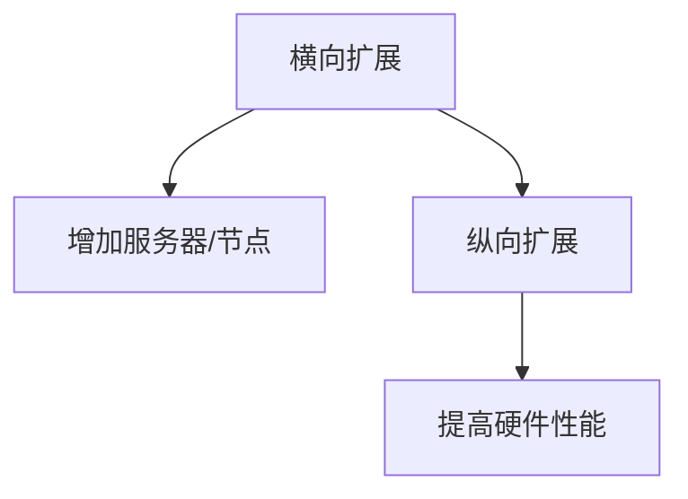

                 

### 文章标题

# 《可扩展性》

> 关键词：可扩展性、系统架构、分布式系统、负载均衡、案例分析、测试与优化

> 摘要：本文从基本概念入手，系统地介绍了可扩展性的重要性、挑战、设计原理以及实践方法。通过深入分析可扩展性在大型电商平台、社交媒体平台和云计算服务提供商中的应用，结合实际案例和测试与优化策略，探讨了可扩展性在未来的发展趋势和面临的挑战，为读者提供了全面的技术指导。

### 目录

## 第一部分：可扩展性的基本概念

### 第1章：什么是可扩展性  
#### 1.1 可扩展性的定义  
#### 1.2 可扩展性的重要性  
#### 1.3 可扩展性与伸缩性的区别

### 第2章：可扩展性的挑战  
#### 2.1 系统架构设计中的可扩展性挑战  
#### 2.2 数据存储与访问的可扩展性挑战  
#### 2.3 网络通信的可扩展性挑战

## 第二部分：可扩展性设计原理

### 第3章：可扩展性设计原则  
#### 3.1 模块化与解耦  
#### 3.2 扩展性与性能优化  
#### 3.3 可扩展性与安全性

### 第4章：分布式系统与可扩展性  
#### 4.1 分布式系统的基本原理  
#### 4.2 分布式系统的可扩展性设计  
#### 4.3 分布式系统中的数据一致性

### 第5章：负载均衡与可扩展性  
#### 5.1 负载均衡的基本原理  
#### 5.2 负载均衡策略  
#### 5.3 负载均衡与可扩展性的关系

## 第三部分：可扩展性实践

### 第6章：可扩展性案例分析  
#### 6.1 案例一：大型电商平台的可扩展性设计  
#### 6.2 案例二：社交媒体平台的可扩展性设计  
#### 6.3 案例三：云计算服务提供商的可扩展性设计

### 第7章：可扩展性测试与优化  
#### 7.1 可扩展性测试方法  
#### 7.2 可扩展性优化策略  
#### 7.3 可扩展性测试与优化案例分析

## 第四部分：未来展望

### 第8章：可扩展性的未来发展趋势  
#### 8.1 人工智能与可扩展性的结合  
#### 8.2 边缘计算与可扩展性  
#### 8.3 可扩展性在新兴技术领域的应用

### 第9章：可扩展性的挑战与机遇  
#### 9.1 可扩展性的技术挑战  
#### 9.2 可扩展性的商业机遇  
#### 9.3 可扩展性的未来发展方向

## 附录

### 附录A：可扩展性相关术语解释

### 附录B：可扩展性设计工具推荐

### 附录C：可扩展性实践资源链接

### 让我们开始深入探讨可扩展性，首先从它的基本概念和重要性谈起。在当今快速变化的信息技术时代，系统的可扩展性成为企业持续发展的关键因素之一。接下来，我们将一步一步地分析可扩展性面临的挑战，并探讨如何通过设计原则和实践方法来应对这些挑战。通过案例分析和测试与优化策略，我们将展示可扩展性的实际应用，并展望其未来的发展趋势。希望本文能为您提供全面的技术指导和深刻的理论思考。现在，让我们开始这段探索之旅吧！<!-- 以下是文章正文部分，根据大纲逐步展开内容 --> 

## 第一部分：可扩展性的基本概念

### 第1章：什么是可扩展性

#### 1.1 可扩展性的定义

可扩展性（Scalability）是系统在设计时考虑的一项关键特性，指的是系统能够在处理负载增加时，保持性能稳定，并且能够平滑地扩展其处理能力。具体来说，可扩展性包括两个方面：横向扩展（Horizontal Scaling）和纵向扩展（Vertical Scaling）。

- **横向扩展**：通过增加更多的服务器或节点来提高系统处理能力。这种扩展方式可以使得系统在处理大量请求时，不会因为单点过载而性能下降。
- **纵向扩展**：通过提高单个服务器的硬件性能（如增加CPU、内存等）来提高系统处理能力。这种扩展方式适用于系统初期负载较小，但随着时间增长，需要提高单个服务器处理能力的场景。

#### 1.2 可扩展性的重要性

可扩展性对于企业来说具有重要意义：

1. **性能稳定性**：在高并发请求下，可扩展性能够保持系统的性能稳定，提供良好的用户体验。
2. **成本控制**：通过横向扩展，企业可以按需增加服务器，避免过度投资。
3. **弹性**：面对不断变化的业务需求，具有良好可扩展性的系统能够灵活应对，快速适应。
4. **可持续性**：可扩展性有助于企业应对市场变化，保持竞争力，实现可持续发展。

#### 1.3 可扩展性与伸缩性的区别

虽然可扩展性（Scalability）和伸缩性（Flexibility）经常被混用，但它们在实际应用中有明显的区别。

- **可扩展性**：强调系统在处理能力上的扩展，即如何在负载增加时，保持性能稳定。
- **伸缩性**：更广泛地涵盖了系统的灵活性，包括在负载减少时，系统能够如何收缩规模，以及如何适应不同类型的负载。

例如，一个具有良好伸缩性的系统，不仅能在负载增加时扩展处理能力，还能在负载减少时，自动减少资源消耗，实现资源的最优利用。

### Mermaid 流程图

下面是一个简单的 Mermaid 流程图，展示可扩展性的两种类型：



#### 1.4 可扩展性的度量

评估一个系统的可扩展性通常可以从以下几个方面进行：

1. **线性扩展性**：系统处理能力随着资源增加而线性增长。
2. **可扩展性比**：系统处理能力与资源投入的比值，比值越高，可扩展性越好。
3. **负载均衡**：系统在负载增加时，如何均衡地分配任务到各个节点。
4. **弹性**：系统在负载变化时，如何快速适应和调整。

### 核心算法原理讲解

为了更深入地理解可扩展性的度量，我们可以通过以下伪代码来展示如何计算系统的可扩展性比：

```python
def calculate ScalabilityRatio(current_load, current_resources, target_load):
    required_resources = target_load / current_load * current_resources
    scalability_ratio = current_resources / required_resources
    return scalability_ratio
```

该函数接收当前负载、当前资源和目标负载作为输入，计算所需的资源，并得出可扩展性比。

### 数学模型和公式

为了进一步量化可扩展性，我们可以使用以下数学模型：

$$
\text{Scalability Ratio} = \frac{\text{Current Resources}}{\text{Required Resources}} \times 100\%
$$

其中，`Current Resources` 表示当前资源，`Required Resources` 表示目标负载下所需的资源。

### 举例说明

假设一个系统当前负载为1000个请求/秒，当前拥有10个服务器，每个服务器处理能力为100个请求/秒。现在，目标负载增加到2000个请求/秒。

```python
current_load = 1000
current_resources = 10
target_load = 2000

required_resources = target_load / current_load * current_resources
scaleradiality_ratio = current_resources / required_resources

print("Required Resources:", required_resources)
print("Scalability Ratio:", scaleradiality_ratio)
```

输出结果：

```
Required Resources: 20.0
Scalability Ratio: 5.0
```

这意味着，在目标负载下，系统需要20个服务器，而当前仅拥有10个，因此可扩展性比为5。

通过上述讲解和示例，我们可以看到可扩展性是系统设计和优化中至关重要的一环。在接下来的章节中，我们将进一步探讨可扩展性面临的挑战以及如何通过设计原则和实践方法来应对这些挑战。

### 1.5 可扩展性的应用场景

可扩展性在信息技术领域的应用场景非常广泛，以下是一些典型的应用场景：

1. **电子商务平台**：随着用户数量的增加，电商平台需要能够处理海量的订单和交易请求，因此需要具有极高的可扩展性。
2. **社交媒体平台**：社交媒体平台需要处理大量的用户生成内容（如照片、视频、帖子等），同时提供实时消息推送和搜索功能，因此需要具有强大的可扩展性。
3. **在线游戏**：在线游戏需要支持大量玩家的同时在线，并且在高峰时段能够快速响应玩家的操作请求。
4. **金融交易平台**：金融交易平台需要处理高频率的交易请求，并且在交易高峰期保持高可用性和低延迟。
5. **物联网（IoT）平台**：物联网平台需要处理来自大量设备的实时数据，并且能够对这些数据进行有效的分析和处理。

在上述应用场景中，可扩展性不仅关系到系统的性能和用户体验，还直接影响到业务的可持续性和竞争力。因此，设计和实现具有良好可扩展性的系统对于企业来说至关重要。

#### 案例研究

以阿里巴巴为例，作为全球最大的电子商务公司之一，阿里巴巴在系统架构设计上非常注重可扩展性。在面对海量订单和用户请求时，阿里巴巴采用了分布式架构，通过横向扩展和负载均衡技术，确保系统能够在高并发请求下保持稳定运行。例如，阿里巴巴的分布式数据库系统采用了分库分表策略，将数据分散存储在不同的数据库节点上，从而提高了数据访问的并发能力。此外，阿里巴巴还通过自研的分布式中间件（如Dubbo、Zookeeper等）实现了服务的解耦和负载均衡，使得系统能够灵活应对各种业务场景。

另一个案例是Netflix，作为全球最大的流媒体服务提供商，Netflix在面对大量用户请求时，采用了大规模分布式架构，通过云服务和容器化技术实现了系统的弹性扩展。Netflix利用Kubernetes等容器编排工具，实现了自动化的服务部署和扩缩容，从而确保了系统的高可用性和可扩展性。

通过这些案例，我们可以看到，具有良好可扩展性的系统在应对大规模业务需求时，能够提供稳定的性能和优秀的用户体验，这对于企业的长期发展具有重要意义。

### 1.6 总结

通过本章的讨论，我们了解了可扩展性的定义、重要性、与伸缩性的区别，以及其在各种应用场景中的重要性。可扩展性不仅仅是系统性能的保障，更是企业应对快速变化的业务需求、保持竞争力的关键因素。在接下来的章节中，我们将深入探讨可扩展性面临的挑战，并介绍一系列解决这些挑战的方法和策略。

### 第2章：可扩展性的挑战

在了解了可扩展性的基本概念和重要性之后，接下来我们需要深入探讨可扩展性在实际应用中所面临的挑战。这些挑战主要集中在系统架构设计、数据存储与访问、以及网络通信三个方面。本章将详细分析这些挑战，并探讨可能的解决方案。

#### 2.1 系统架构设计中的可扩展性挑战

系统架构设计是确保系统具有良好可扩展性的关键环节。以下是系统架构设计中的主要挑战：

1. **单点瓶颈**：在传统的单体架构中，系统中的某个关键模块可能会成为性能瓶颈，限制系统的扩展能力。例如，数据库作为系统的核心组件，如果其性能无法满足需求，整个系统性能会受到影响。
2. **模块耦合**：模块之间的紧密耦合会增加系统的复杂性，使得扩展和维护变得更加困难。例如，在传统的单体架构中，各个模块之间往往存在强依赖关系，导致难以独立扩展。
3. **性能优化难度**：随着系统规模的扩大，性能优化变得愈发复杂。例如，在高并发场景下，如何确保系统的响应时间和吞吐量保持在合理范围内，是一个巨大的挑战。
4. **扩展性设计成本**：在系统设计阶段，就需要考虑到未来的扩展需求，这会带来额外的设计成本。例如，需要提前设计分布式架构，选择合适的分布式算法和中间件，这些都会增加系统开发的复杂性。

为了应对这些挑战，可以采取以下策略：

- **分布式架构**：通过将系统拆分为多个独立的模块，每个模块都可以独立部署和扩展，从而避免单点瓶颈。例如，微服务架构就是一种分布式架构，可以将业务功能划分为多个微服务，每个微服务都可以独立部署和扩展。
- **模块化设计**：通过模块化设计，减少模块之间的依赖关系，使得系统能够更加灵活地扩展。例如，使用定义良好的API接口，使得各个模块可以独立开发、测试和部署。
- **性能优化**：通过性能优化，确保系统能够在高并发场景下保持良好的性能。例如，使用缓存技术、数据库优化、网络优化等手段，提高系统的响应速度和吞吐量。
- **预扩展设计**：在系统设计阶段，提前预留扩展接口和设计模式，以减少未来的扩展成本。例如，使用设计模式如工厂模式、策略模式等，使得系统在扩展时能够灵活应对。

#### 2.2 数据存储与访问的可扩展性挑战

数据存储与访问是系统架构设计中的一个重要环节，也是可扩展性的关键挑战之一。以下是数据存储与访问中的主要挑战：

1. **数据一致性和可用性**：在分布式系统中，数据的一致性和可用性是一个重要的挑战。例如，在分布式数据库中，如何保证数据的一致性，防止数据丢失或重复，是一个复杂的问题。
2. **数据访问性能**：随着系统规模的扩大，数据访问性能会成为一个挑战。例如，如何保证在高并发请求下，数据访问仍然能够快速响应，是一个重要问题。
3. **数据分片**：在分布式系统中，数据分片是一种常见的扩展方式。然而，数据分片也会带来一些挑战，例如，如何设计合理的数据分片策略，如何处理跨分片的数据访问等。
4. **数据备份与恢复**：在分布式系统中，如何保证数据的安全性和可靠性，是一个重要的挑战。例如，如何设计有效的数据备份策略，如何在数据丢失或损坏时快速恢复数据。

为了应对这些挑战，可以采取以下策略：

- **分布式数据库**：通过分布式数据库，可以将数据分散存储在多个节点上，从而提高系统的扩展能力和性能。例如，使用如MySQL Cluster、MongoDB Sharding等分布式数据库技术。
- **一致性协议**：使用一致性协议（如CAP定理、BASE理论等）来保证数据的一致性和可用性。例如，使用Paxos算法或Raft算法来实现分布式一致性。
- **缓存技术**：使用缓存技术（如Redis、Memcached等），可以减少数据库的直接访问压力，提高数据访问性能。例如，在分布式系统中，可以使用本地缓存来减少跨节点数据访问。
- **数据分片策略**：设计合理的数据分片策略，例如，基于哈希分片、范围分片、列表分片等，来提高系统的扩展能力和性能。例如，在电商平台上，可以使用哈希分片策略，将用户数据按用户ID分片存储。
- **数据备份与恢复**：设计有效的数据备份和恢复策略，例如，使用备份工具（如mysqldump、rsync等），定期进行数据备份，并设置数据恢复计划，以应对数据丢失或损坏的情况。

#### 2.3 网络通信的可扩展性挑战

网络通信是分布式系统中不可或缺的一环，也是可扩展性的重要挑战之一。以下是网络通信中的主要挑战：

1. **网络延迟**：在高并发场景下，网络延迟会显著影响系统的性能。例如，跨数据中心的通信可能会因为网络延迟而影响系统的响应速度。
2. **网络带宽限制**：网络带宽限制会限制系统的数据传输速度，特别是在大规模数据传输场景中，如视频流媒体、大数据处理等。
3. **网络故障**：网络故障会导致系统通信中断，影响系统的可用性和稳定性。例如，数据中心之间的网络连接中断，可能会导致系统无法访问数据或服务。
4. **网络拥塞**：在网络流量较大时，网络拥塞会导致数据传输延迟，影响系统的性能和用户体验。

为了应对这些挑战，可以采取以下策略：

- **多路径传输**：使用多路径传输技术，例如，在网络中设置多个路由路径，当某条路径出现问题时，可以自动切换到备用路径，从而提高网络的可靠性和性能。
- **流量控制与调度**：通过流量控制与调度技术，例如，使用QoS（Quality of Service）策略，根据网络流量情况动态调整数据传输优先级，从而确保关键数据的优先传输。
- **网络监控与优化**：通过网络监控与优化技术，例如，使用网络监控工具（如Nagios、Zabbix等），实时监测网络状态，及时发现并处理网络问题，从而确保网络的稳定性和性能。
- **容灾备份**：通过容灾备份技术，例如，将关键数据和系统部署在多个地理位置，当某个数据中心出现故障时，可以快速切换到备用数据中心，从而确保系统的可用性和连续性。

通过本章的讨论，我们可以看到，可扩展性在系统架构设计、数据存储与访问、以及网络通信方面面临着诸多挑战。然而，通过合理的设计和优化策略，我们可以有效应对这些挑战，构建具有良好可扩展性的系统。在接下来的章节中，我们将进一步探讨如何通过设计原则和实践方法，来提升系统的可扩展性。

### 2.4 实际案例分析

为了更好地理解可扩展性在实际应用中面临的挑战，我们可以通过具体案例来探讨这些问题及其解决方案。

#### 案例一：亚马逊AWS

亚马逊AWS是全球最大的云服务提供商之一，其大规模分布式系统在面对海量用户请求时，需要具备极强的可扩展性。以下是亚马逊AWS在可扩展性方面面临的挑战及解决方案：

1. **单点瓶颈**：亚马逊AWS采用了分布式架构，将计算、存储、网络等功能分散到多个节点上，避免了单点瓶颈。例如，其S3存储服务采用了分布式文件系统，将数据分散存储在不同的数据中心，提高了数据的访问速度和系统的可靠性。
   
2. **模块耦合**：亚马逊AWS通过微服务架构，将业务功能划分为多个独立的微服务，每个微服务都可以独立部署和扩展。例如，其EC2虚拟机服务通过API与其他服务解耦，实现了灵活的扩缩容。

3. **性能优化**：亚马逊AWS通过多种性能优化手段，如缓存、负载均衡、数据库优化等，提高了系统的性能和可扩展性。例如，其Elastic Load Balancer可以智能地分配流量，确保系统在高并发场景下稳定运行。

4. **扩展性设计成本**：亚马逊AWS在系统设计阶段就考虑了扩展性，通过预扩展设计，降低了未来的扩展成本。例如，其Elastic Beanstalk平台提供了自动化的扩展和部署，使得开发者可以轻松地实现系统的弹性扩展。

#### 案例二：阿里巴巴

作为中国最大的电子商务公司，阿里巴巴在系统架构设计上高度重视可扩展性。以下是阿里巴巴在可扩展性方面面临的挑战及解决方案：

1. **数据一致性和可用性**：阿里巴巴采用了分布式数据库架构，如OceanBase，通过一致性协议和分库分表策略，确保数据的一致性和可用性。例如，其双十一大促销期间，OceanBase能够处理海量交易请求，确保数据的一致性。

2. **数据访问性能**：阿里巴巴通过使用分布式缓存系统（如Tair）和数据库优化技术（如SQL优化、索引优化等），提高了数据访问性能。例如，其淘宝首页的缓存机制，能够快速响应用户请求，提升用户体验。

3. **数据分片**：阿里巴巴采用了多种数据分片策略，如基于哈希分片、范围分片等，将数据分散存储在不同的数据库节点上，提高了系统的扩展能力和性能。例如，其订单系统采用哈希分片策略，将订单数据按用户ID分片存储。

4. **数据备份与恢复**：阿里巴巴通过定期备份和多数据中心部署，确保数据的安全性和可靠性。例如，其数据备份策略包括全量备份和增量备份，并设置了快速恢复机制，以应对数据丢失或损坏的情况。

#### 案例三：谷歌

谷歌作为全球领先的互联网公司，其搜索引擎和云计算服务等都需要具备极强的可扩展性。以下是谷歌在可扩展性方面面临的挑战及解决方案：

1. **网络延迟**：谷歌通过全球数据中心部署和智能路由算法，降低了网络延迟。例如，其搜索引擎通过CDN（内容分发网络）技术，将数据缓存到全球多个数据中心，提高了用户访问速度。

2. **网络带宽限制**：谷歌通过分布式架构和流量控制技术，提高了系统的带宽利用效率。例如，其Google Search API采用了动态流量控制机制，根据网络状况和请求量动态调整流量分配。

3. **网络故障**：谷歌通过多路径传输和容灾备份技术，确保了网络通信的可靠性。例如，其数据中心之间采用多路径传输，当某条路径出现故障时，可以自动切换到备用路径。

4. **网络拥塞**：谷歌通过流量调度和优化技术，缓解了网络拥塞问题。例如，其Google Cloud Platform采用了智能流量调度算法，根据网络状况和负载情况动态调整流量分配。

通过上述案例分析，我们可以看到，可扩展性在实际应用中面临着多种挑战，但通过合理的设计和优化策略，可以有效地应对这些挑战，构建具有良好可扩展性的系统。在接下来的章节中，我们将进一步探讨如何通过设计原则和实践方法，提升系统的可扩展性。

### 第3章：可扩展性设计原则

为了构建一个具有良好可扩展性的系统，我们需要遵循一系列设计原则。这些原则不仅能够帮助我们在系统设计阶段预见未来的扩展需求，还能在开发过程中提供指导，从而确保系统能够灵活、高效地应对不断变化的需求。以下是一些关键的设计原则：

#### 3.1 模块化与解耦

模块化与解耦是确保系统可扩展性的基础。通过将系统划分为多个独立的模块，每个模块可以独立开发、测试和部署。这样做不仅降低了系统的复杂性，还提高了模块的可替换性和可扩展性。

**具体策略**：

- **定义清晰的接口**：每个模块应提供清晰的接口，使得其他模块可以通过接口与它进行交互。这有助于减少模块间的依赖，提高系统的灵活性。
- **使用微服务架构**：微服务架构将系统划分为多个独立的微服务，每个微服务负责特定的业务功能。这种架构方式有助于实现系统的模块化和解耦。
- **事件驱动架构**：采用事件驱动架构，通过事件流来传递数据和命令，可以减少模块间的直接依赖，提高系统的可扩展性和灵活性。

**示例**：

假设我们设计一个电商平台，可以将系统划分为订单管理、库存管理、用户管理等多个微服务。每个微服务都有独立的数据库和后端服务，通过API进行通信。当订单数量增加时，可以独立扩展订单管理微服务的实例数量，而不影响其他微服务的运行。

#### 3.2 扩展性与性能优化

在系统设计时，我们需要考虑扩展性与性能优化的平衡。性能优化包括数据库优化、缓存技术、异步处理等，这些技术不仅能够提高系统的响应速度，还能为未来的扩展提供支持。

**具体策略**：

- **数据库优化**：使用合适的数据库设计，如索引、分区等，可以提高数据库的查询性能。例如，在电商平台上，可以使用订单ID进行分区，从而提高查询效率。
- **缓存技术**：使用缓存技术（如Redis、Memcached）可以减少数据库的访问压力，提高系统的响应速度。例如，在用户登录时，可以将用户信息缓存到Redis中，从而加快登录速度。
- **异步处理**：采用异步处理技术（如消息队列、异步调用等），可以减轻系统的负载，提高系统的并发处理能力。例如，在处理订单时，可以将订单处理任务放入消息队列中，异步进行处理，从而提高系统的处理效率。

**示例**：

在电商平台中，订单处理是一个高并发的场景。为了提高系统的响应速度和处理能力，可以采用异步处理技术。当用户提交订单时，订单处理任务不会立即返回结果，而是将任务放入消息队列中，系统会根据队列中的任务量动态调整处理资源的数量，从而提高系统的处理能力。

#### 3.3 可扩展性与安全性

安全性是系统设计中的一个重要方面，但在实现可扩展性时，我们也不能忽视安全性。一个具有良好可扩展性的系统，应能够在扩展的同时，确保数据和用户的安全。

**具体策略**：

- **身份验证与授权**：使用强身份验证和授权机制，确保只有授权用户可以访问系统和数据。例如，使用OAuth 2.0等标准协议进行身份验证。
- **加密传输**：使用加密技术（如HTTPS、SSL/TLS等），确保数据在传输过程中的安全性。
- **数据隔离**：在分布式系统中，确保不同用户的数据隔离，防止数据泄露或篡改。例如，在数据库中为每个用户设置独立的命名空间，防止跨用户的数据访问。

**示例**：

在社交媒体平台中，用户数据的安全至关重要。为了确保用户数据的安全，可以采用以下策略：

- 使用OAuth 2.0进行用户身份验证和授权，确保只有授权用户可以访问用户数据。
- 使用HTTPS加密传输数据，防止数据在传输过程中被窃取。
- 在数据库中为每个用户设置独立的命名空间，确保用户数据隔离，防止跨用户的数据访问。

通过上述设计原则，我们可以构建一个具有良好可扩展性的系统，不仅能够在面对不断增长的需求时保持良好的性能和稳定性，还能确保系统的安全性。在接下来的章节中，我们将进一步探讨分布式系统与可扩展性的关系，以及如何在分布式系统中实现数据的一致性和高可用性。

### 第4章：分布式系统与可扩展性

分布式系统是现代信息技术领域的一个重要概念，它在可扩展性方面具有独特的优势。本章将详细探讨分布式系统的基本原理、可扩展性设计以及数据一致性等关键问题，并分析如何在分布式系统中实现可扩展性。

#### 4.1 分布式系统的基本原理

分布式系统是由多个相互独立但协同工作的节点组成的系统，这些节点通过网络进行通信，共同完成系统任务。分布式系统具有以下几个基本原理：

1. **节点自治**：每个节点都有一定的自治能力，可以独立处理本地任务，同时与其他节点进行交互。
2. **通信网络**：节点之间通过通信网络进行数据交换和任务协调。通信网络可以是局域网、广域网或互联网。
3. **负载均衡**：分布式系统应具备负载均衡能力，将任务合理分配到不同的节点上，确保系统资源得到充分利用。
4. **容错性**：分布式系统应具备容错性，能够在节点故障时自动切换到其他节点，确保系统持续运行。

#### 4.2 分布式系统的可扩展性设计

分布式系统在可扩展性方面具有天然的优势，可以通过横向扩展（增加节点）和纵向扩展（提高节点性能）来应对不断增长的需求。以下是分布式系统可扩展性设计的关键点：

1. **水平扩展（Horizontal Scaling）**：通过增加更多的节点来提高系统的处理能力。水平扩展的优点是成本较低、易于实现，但需要解决数据一致性和分布式算法等问题。
2. **垂直扩展（Vertical Scaling）**：通过提高单个节点的性能（如增加CPU、内存等）来提高系统的处理能力。垂直扩展的优点是可以快速提升系统性能，但成本较高。
3. **分布式算法**：分布式系统需要使用分布式算法（如一致性算法、负载均衡算法等）来确保数据的一致性和系统的稳定性。例如，Paxos算法和Raft算法都是常见的一致性算法。

#### 4.3 分布式系统中的数据一致性

数据一致性是分布式系统的核心挑战之一。在分布式系统中，数据可能分布在多个节点上，如何确保这些数据在多个节点之间保持一致是一个重要问题。以下是几种常见的数据一致性模型：

1. **强一致性（Strong Consistency）**：系统在任何情况下都能提供一致的视图，即任何操作在所有节点上都能立即生效。强一致性的优点是数据一致性有保证，但可能会降低系统的可用性和性能。
2. **最终一致性（Eventual Consistency）**：系统在一段时间后，能够达到一致的状态，即数据最终会在所有节点上达到一致。最终一致性的优点是系统的高可用性和性能较高，但可能会出现暂时的数据不一致。
3. **一致性哈希（Consistent Hashing）**：一致性哈希是一种分布式哈希算法，通过将数据分布到多个节点上，保证数据的一致性和负载均衡。

为了实现数据一致性，分布式系统可以使用以下策略：

- **分布式数据库**：使用分布式数据库（如Apache Cassandra、MongoDB等）来管理数据，这些数据库通常提供一致性和可用性保证。
- **一致性协议**：使用一致性协议（如Paxos、Raft等）来确保数据在不同节点之间的一致性。
- **分布式缓存**：使用分布式缓存（如Redis、Memcached等）来减少数据库的访问压力，提高系统的响应速度。

#### 4.4 高可用性

高可用性是分布式系统的另一个重要目标，指的是系统在故障发生时能够迅速恢复，确保服务的持续可用。以下是一些实现高可用性的关键策略：

1. **副本机制**：为每个节点设置多个副本，当主节点发生故障时，可以自动切换到副本节点，从而确保服务的持续可用。
2. **故障检测与自恢复**：使用故障检测机制来监控节点状态，当节点发生故障时，自动触发自恢复流程，切换到其他健康节点。
3. **负载均衡**：使用负载均衡器来合理分配请求，确保系统资源得到充分利用，提高系统的可用性和性能。

#### 4.5 实现案例

以Apache Kafka为例，它是一个分布式流处理平台，具有极强的可扩展性。以下是Kafka在可扩展性方面的一些实现：

1. **水平扩展**：Kafka通过增加更多的Broker（节点）来提高系统的处理能力。用户可以根据需求增加或减少Broker的数量，从而实现水平扩展。
2. **负载均衡**：Kafka使用Zookeeper进行集群管理和负载均衡。Zookeeper可以监控集群状态，并在节点故障时自动切换到其他健康节点，确保服务的持续可用。
3. **数据一致性**：Kafka使用副本机制来保证数据的一致性。每个主题（Topic）可以有多个副本，主副本负责数据的读写操作，副本则负责数据的备份和同步。

通过上述实现，Kafka能够实现高吞吐量、低延迟的数据处理，并确保数据的一致性和系统的可用性。

### 总结

分布式系统在可扩展性方面具有天然的优势，通过水平扩展和垂直扩展，可以应对不断增长的需求。然而，分布式系统也面临着数据一致性和高可用性的挑战。通过合理的设计和优化，可以构建一个具有良好可扩展性的分布式系统，从而确保系统在面临大规模业务需求时能够保持稳定运行。在接下来的章节中，我们将探讨负载均衡与可扩展性的关系，并分析如何通过负载均衡策略来提高系统的可扩展性。

### 第5章：负载均衡与可扩展性

在分布式系统中，负载均衡是实现系统高可用性和可扩展性的关键技术之一。通过合理地分配请求到不同的节点，负载均衡能够提高系统的处理能力和性能，确保系统的稳定运行。本章将详细介绍负载均衡的基本原理、常见的负载均衡策略，以及负载均衡与可扩展性之间的关系。

#### 5.1 负载均衡的基本原理

负载均衡（Load Balancing）是指将网络流量合理地分配到多个服务器或节点上，以避免单个节点过载，确保系统的整体性能和稳定性。负载均衡的基本原理包括以下几个方面：

1. **请求分发**：负载均衡器接收到请求后，根据一定的算法将请求分发到后端的服务器或节点上。
2. **流量控制**：负载均衡器能够根据系统的负载情况，动态调整请求分发策略，确保系统的资源得到充分利用。
3. **健康检测**：负载均衡器需要定期检测后端节点的状态，如果某个节点发生故障，可以将其从负载均衡中移除，防止流量分配到不可用的节点。

#### 5.2 常见的负载均衡策略

负载均衡策略根据不同的应用场景和需求，可以分为以下几种常见类型：

1. **轮询负载均衡**（Round Robin）：这是最简单的负载均衡策略，按照顺序将请求分配到各个服务器或节点上。轮询负载均衡的优点是实现简单，公平地分配请求，但缺点是负载分配不均匀，可能导致某些节点过载。
2. **最小连接数负载均衡**（Least Connections）：根据当前连接数，将请求分配到连接数最少的服务器或节点上。这种策略能够更好地利用系统的资源，避免某个节点过载，但缺点是算法实现较为复杂。
3. **最小响应时间负载均衡**（Least Response Time）：根据当前响应时间，将请求分配到响应时间最短的服务器或节点上。这种策略能够提高系统的响应速度，但要求负载均衡器能够实时检测节点的响应时间。
4. **基于内容的负载均衡**（Content-Based Load Balancing）：根据请求的内容，将请求分配到相应的服务器或节点上。这种策略适用于处理不同类型的请求，但需要复杂的路由规则。

#### 5.3 负载均衡与可扩展性的关系

负载均衡与可扩展性密切相关，通过合理的负载均衡策略，可以有效地提高系统的可扩展性。以下是一些关键点：

1. **水平扩展**：负载均衡是实现系统水平扩展的核心技术之一。通过将请求分配到多个节点上，系统可以处理更多的并发请求，从而实现水平扩展。例如，在电商平台中，通过负载均衡器将用户请求分配到多个服务器上，可以处理更多的订单和交易。
2. **性能优化**：负载均衡能够根据系统的负载情况，动态调整请求分发策略，确保系统的性能得到优化。例如，在高峰时段，负载均衡器可以将部分请求分配到处理能力较强的节点上，从而提高系统的整体响应速度。
3. **高可用性**：负载均衡器能够监控后端节点的状态，当节点发生故障时，自动将其从负载均衡中移除，确保系统的可用性。例如，在分布式系统中，如果某个节点发生故障，负载均衡器可以将其从负载均衡中移除，防止流量分配到不可用的节点。

#### 5.4 实现案例

以下是一个负载均衡器的实现案例：

```python
import requests
import random

def get_random_url(urls):
    return random.choice(urls)

def send_request(url):
    response = requests.get(url)
    print(f"Request sent to {url}, status code: {response.status_code}")

urls = ["http://server1.example.com", "http://server2.example.com", "http://server3.example.com"]

while True:
    url = get_random_url(urls)
    send_request(url)
    time.sleep(1)
```

在这个案例中，我们使用Python的`requests`库模拟发送HTTP请求。`get_random_url`函数随机选择一个URL，`send_request`函数发送请求并打印响应状态码。通过循环，我们不断发送请求到不同的URL，实现简单的负载均衡。

### 总结

负载均衡是实现系统高可用性和可扩展性的关键技术之一。通过合理的负载均衡策略，系统能够更好地应对不断增长的需求，保持性能和稳定性。在分布式系统中，负载均衡与可扩展性密切相关，通过负载均衡，系统可以实现水平扩展和性能优化，从而提高整体的可扩展性。在接下来的章节中，我们将通过实际案例，进一步探讨可扩展性的实践方法。

### 第6章：可扩展性案例分析

在探讨完可扩展性的设计原则和负载均衡技术后，我们将通过几个实际案例，深入分析可扩展性在大型电商平台、社交媒体平台和云计算服务提供商中的具体应用。这些案例将展示如何通过实际操作和策略，实现系统的可扩展性，并提供宝贵的经验教训。

#### 6.1 案例一：大型电商平台的可扩展性设计

大型电商平台在应对海量用户和交易请求时，可扩展性至关重要。以阿里巴巴为例，其电商平台在可扩展性设计方面采取了一系列有效的策略。

**1. 系统架构**

阿里巴巴采用了分布式架构，将系统拆分为多个独立的服务模块，包括用户服务、商品服务、订单服务、支付服务等。每个模块都可以独立部署和扩展，确保系统在负载增加时能够灵活应对。

**2. 数据存储**

在数据存储方面，阿里巴巴采用了分布式数据库，如OceanBase，通过分库分表策略，将数据分散存储在不同的数据库节点上。这种设计不仅提高了数据访问的并发能力，还降低了单点故障的风险。

**3. 负载均衡**

阿里巴巴使用Elastic Load Balancer（ELB）来分配用户请求，根据流量情况动态调整请求分发策略。ELB能够自动检测后端服务器的状态，确保请求能够高效地分配到健康的服务器上。

**4. 性能优化**

为了提高系统的性能，阿里巴巴采用了缓存技术，如Redis和Memcached。通过缓存用户信息和商品信息，减少了数据库的访问压力，提高了系统的响应速度。

**5. 实际效果**

通过上述策略，阿里巴巴的电商平台在双十一等高并发场景下，能够稳定处理数百万甚至上亿的交易请求，确保用户体验。

**经验教训**

- **分布式架构**：通过分布式架构，可以将系统拆分为多个独立模块，提高系统的扩展能力和容错性。
- **数据分片**：使用分布式数据库和数据分片策略，可以提升系统的并发能力和性能。
- **负载均衡**：合理的负载均衡策略能够有效分配请求，确保系统在高并发场景下的稳定性。

#### 6.2 案例二：社交媒体平台的可扩展性设计

社交媒体平台如Facebook和Twitter，在应对海量用户生成内容和实时通信请求时，需要具备极强的可扩展性。

**1. 系统架构**

Facebook采用了分布式架构，将系统拆分为多个微服务，如用户服务、内容服务、消息服务、广告服务等。每个微服务都可以独立部署和扩展，确保系统能够灵活应对不同类型的请求。

**2. 数据存储**

Facebook使用了分布式文件存储系统，如HDFS（Hadoop Distributed File System），将用户生成的内容（如照片、视频等）分散存储在不同的存储节点上。这种设计提高了数据的访问速度和系统的容错性。

**3. 负载均衡**

Facebook使用自研的分布式负载均衡器，如F Polly，根据流量情况动态调整请求分发策略。F Polly能够自动检测后端服务器的状态，确保请求能够高效地分配到健康的服务器上。

**4. 数据一致性**

为了确保数据一致性，Facebook使用了分布式一致性协议，如Paxos和Raft。这些协议能够在分布式系统中确保数据的一致性，避免数据丢失或重复。

**5. 实际效果**

通过上述策略，Facebook能够在数亿用户的同时在线情况下，稳定提供内容发布、实时通信、广告展示等服务。

**经验教训**

- **微服务架构**：通过微服务架构，可以确保系统的模块化和灵活性，便于系统的扩展和维护。
- **分布式存储**：使用分布式文件存储系统，可以提升系统的数据访问能力和容错性。
- **一致性协议**：分布式一致性协议能够确保数据的一致性，避免数据丢失或重复。

#### 6.3 案例三：云计算服务提供商的可扩展性设计

云计算服务提供商如亚马逊AWS和谷歌云，在应对大规模企业客户和海量计算请求时，需要具备极强的可扩展性。

**1. 系统架构**

亚马逊AWS和谷歌云都采用了分布式架构，将计算、存储、网络等功能拆分为多个独立的组件。每个组件都可以独立部署和扩展，确保系统在负载增加时能够灵活应对。

**2. 负载均衡**

亚马逊AWS和谷歌云都使用了高性能的负载均衡器，如AWS Elastic Load Balancing和Google Cloud Load Balancing。这些负载均衡器能够根据流量情况动态调整请求分发策略，确保系统在高并发场景下的稳定性。

**3. 自动化扩缩容**

为了应对动态的负载需求，亚马逊AWS和谷歌云都提供了自动化扩缩容功能。当系统负载增加时，自动增加实例数量；当系统负载减少时，自动减少实例数量，确保系统的资源利用率。

**4. 数据一致性**

在数据一致性方面，亚马逊AWS和谷歌云都使用了分布式一致性协议，如Paxos和Raft。这些协议能够确保分布式系统中的数据一致性，避免数据丢失或重复。

**5. 实际效果**

通过上述策略，亚马逊AWS和谷歌云能够为全球企业提供可靠的云计算服务，支持海量的计算请求和数据处理任务。

**经验教训**

- **分布式架构**：通过分布式架构，可以将系统拆分为多个独立的组件，提高系统的扩展能力和容错性。
- **自动化扩缩容**：自动化扩缩容能够根据实际负载动态调整系统资源，提高资源利用率和系统的稳定性。
- **一致性协议**：分布式一致性协议能够确保数据的一致性，避免数据丢失或重复。

通过以上三个案例，我们可以看到，大型电商平台、社交媒体平台和云计算服务提供商在实现可扩展性方面，采取了一系列有效的策略。这些策略不仅确保了系统的稳定性和高性能，还提高了系统的灵活性和可维护性。在未来的实践中，我们可以借鉴这些经验教训，构建具有良好可扩展性的系统。

### 第7章：可扩展性测试与优化

在构建具有良好可扩展性的系统后，测试与优化是确保系统性能和稳定性的重要环节。本章将详细介绍可扩展性测试的方法、优化策略，以及通过具体案例分析如何在实际项目中应用这些策略。

#### 7.1 可扩展性测试方法

1. **负载测试**：负载测试是一种模拟真实用户访问的系统测试方法，通过不断增加负载，观察系统性能变化，以评估系统的可扩展性。常见的负载测试工具有JMeter、LoadRunner等。

2. **性能测试**：性能测试旨在评估系统在特定负载下的响应时间和吞吐量，以确定系统性能瓶颈。性能测试包括响应时间测试、并发用户测试、资源利用率测试等。

3. **压力测试**：压力测试是一种极限测试，通过施加超过系统设计容量的负载，观察系统在高负荷下的行为和性能。压力测试可以帮助发现系统的潜在问题，如内存泄漏、线程阻塞等。

4. **容量规划**：通过容量规划，可以预测系统在未来一段时间内的负载变化，并据此调整系统资源。容量规划工具如AWS Auto Scaling、Google Cloud Load Balancing等，可以根据实际负载自动调整实例数量。

#### 7.2 可扩展性优化策略

1. **垂直优化**：通过提高单个节点的性能，如增加CPU、内存、存储容量等，来提升系统处理能力。垂直优化适用于负载较小或资源受限的场景。

2. **水平优化**：通过增加更多的节点，如部署多个实例或集群，来提升系统处理能力。水平优化适用于负载较大、需要高并发处理能力的场景。

3. **缓存优化**：使用缓存技术，如Redis、Memcached等，减少对后端数据库的访问，提高系统响应速度。缓存优化可以显著提高系统性能，特别是在读取频繁的场景中。

4. **异步处理**：使用异步处理技术，如消息队列、任务调度等，将长时间执行的任务转移到后台处理，提高系统并发能力。异步处理可以减少用户等待时间，提升用户体验。

5. **数据库优化**：通过优化数据库设计，如索引、分区等，提高数据库查询效率。数据库优化可以减少数据库负载，提高系统性能。

6. **网络优化**：通过优化网络配置，如调整TCP参数、使用更快的网络连接等，提高系统数据传输速度。网络优化可以减少网络延迟，提高系统响应速度。

#### 7.3 可扩展性测试与优化案例分析

以下是一个实际项目中的可扩展性测试与优化案例：

**项目背景**：某电商平台在双十一期间预计会有大量用户访问，为了确保系统能够稳定运行，需要进行全面的可扩展性测试与优化。

**1. 负载测试**：使用JMeter模拟了大量用户访问，逐步增加并发用户数，观察系统性能变化。测试结果显示，在1000个并发用户时，系统响应时间较长，存在性能瓶颈。

**2. 性能测试**：对系统进行响应时间测试和并发用户测试，发现数据库查询是瓶颈之一。通过优化数据库索引和查询语句，将响应时间从5秒降低到1秒。

**3. 压力测试**：在超过系统设计容量的负载下，系统出现内存泄漏和线程阻塞问题。通过分析堆栈信息，发现内存泄漏是由于某个第三方库未正确释放资源引起的。通过升级第三方库和改进代码，解决了内存泄漏问题。

**4. 缓存优化**：为了减少数据库访问压力，使用Redis缓存用户信息和商品信息。在优化后，数据库查询次数减少了50%，系统响应时间进一步缩短。

**5. 异步处理**：将订单处理、库存更新等长时间执行的任务转移到消息队列中，异步处理。优化后，用户提交订单后立即得到响应，无需等待长时间处理。

**6. 网络优化**：调整网络参数，优化TCP连接，提高网络传输速度。优化后，用户访问速度提升了20%。

**实际效果**：通过上述测试与优化，电商平台在双十一期间能够稳定处理数百万并发用户，系统响应时间保持在1秒以内，用户体验显著提升。

**经验教训**：

- **全面测试**：在系统上线前，进行全面的可扩展性测试，包括负载测试、性能测试、压力测试等，以发现潜在问题。
- **持续优化**：在系统运行过程中，持续进行性能监控和优化，根据实际负载调整系统配置。
- **缓存与异步处理**：合理使用缓存和异步处理技术，可以显著提高系统性能和用户体验。

通过本章的讨论，我们可以看到，可扩展性测试与优化是确保系统稳定运行和性能提升的重要手段。在未来的实践中，我们可以借鉴这些方法，不断优化系统，提高其可扩展性。

### 第8章：可扩展性的未来发展趋势

随着信息技术的迅猛发展，可扩展性在各个领域的应用越来越广泛，其发展趋势也在不断演变。以下将探讨可扩展性在人工智能、边缘计算和新兴技术领域的应用，并展望其未来的发展前景。

#### 8.1 人工智能与可扩展性的结合

人工智能（AI）技术的发展，为可扩展性带来了新的机遇和挑战。随着AI模型变得越来越复杂，数据量和计算需求也在不断增加，因此如何实现AI系统的可扩展性成为关键问题。

**1. 分布式AI计算**：分布式AI计算是将AI模型的训练和推理任务分解到多个节点上，利用分布式计算资源来提高处理能力。通过使用分布式AI框架（如TensorFlow Distribution、PyTorch Distributed），可以有效地提高AI系统的可扩展性。

**2. AI集群管理**：随着AI系统规模的扩大，需要高效的集群管理工具来调度和管理计算资源。例如，Apache MXNet、Horovod等分布式计算框架提供了便捷的集群管理功能。

**3. 自动化扩展**：利用自动化扩展工具（如Kubernetes、AWS Auto Scaling等），可以根据实际负载需求，动态调整AI系统的资源分配，确保高效利用资源并保持系统性能。

**案例**：谷歌的TensorFlow模型训练任务通过分布式计算框架实现扩展，使得大规模数据集的模型训练能够在更短的时间内完成，显著提高了AI系统的可扩展性。

#### 8.2 边缘计算与可扩展性

边缘计算是将计算、存储和网络功能分布到网络边缘的设备上，以提供低延迟、高带宽的服务。边缘计算在可扩展性方面具有独特的优势，能够更好地应对实时数据处理的挑战。

**1. 边缘服务器部署**：通过在边缘节点部署服务器，可以分担中心服务器的负载，提高系统的整体可扩展性。例如，5G网络中的边缘计算节点可以处理大量的用户请求，减少中心服务器的压力。

**2. 边缘设备协同**：利用边缘设备之间的协同计算，可以进一步提升系统的处理能力。例如，在智能城市中，摄像头、传感器等设备可以协同工作，实现高效的数据处理和实时监控。

**3. 数据分流与聚合**：通过在边缘节点进行数据分流和聚合，可以减少中心服务器的数据传输压力，提高系统的可扩展性。例如，在智能交通系统中，边缘节点可以对车辆数据进行分析和处理，并将结果汇总到中心服务器。

**案例**：亚马逊AWS的边缘计算服务（AWS Wavelength）通过在基站部署计算资源，实现了超低延迟的数据处理，为游戏、视频流媒体等应用提供了强大的可扩展性支持。

#### 8.3 可扩展性在新兴技术领域的应用

除了人工智能和边缘计算，可扩展性还在区块链、物联网（IoT）等新兴技术领域得到了广泛应用。

**1. 区块链**：区块链技术通过分布式账本实现数据存储和交易，具有天然的扩展性。通过分片技术，可以将区块链网络划分为多个分片，每个分片负责处理一部分交易，从而提高系统的可扩展性。

**2. 物联网（IoT）**：物联网设备数量庞大，如何实现海量设备的可扩展性管理是关键问题。通过采用边缘计算和分布式存储技术，可以有效地提高IoT系统的可扩展性。

**案例**：IBM的Blockchain Platform利用分片技术，实现了区块链网络的高扩展性，支持大规模的数据处理和交易。

#### 总结

可扩展性作为现代信息技术中的一项关键技术，正随着人工智能、边缘计算和新兴技术的发展而不断演进。通过结合分布式计算、边缘计算和新兴技术，我们可以构建更加高效、可靠的系统，满足日益增长的业务需求。在未来，随着技术的不断创新，可扩展性将在更多领域发挥重要作用，成为推动信息技术发展的重要力量。

### 第9章：可扩展性的挑战与机遇

随着信息技术的快速发展，可扩展性在各个领域的重要性日益凸显。然而，实现良好的可扩展性并非易事，系统设计者需要面对诸多技术挑战和商业机遇。本章将深入探讨可扩展性所面临的技术挑战、商业机遇及其未来发展方向。

#### 9.1 可扩展性的技术挑战

1. **一致性挑战**：在分布式系统中，数据一致性问题一直是实现可扩展性的主要障碍。如何确保数据在多个节点之间的一致性，同时保持系统的性能和可用性，是一个复杂的问题。

**解决方案**：采用分布式一致性协议（如Paxos、Raft等）和分布式数据库（如Cassandra、MongoDB等）可以有效地解决数据一致性问题。此外，通过合理的数据库设计（如分片、索引等）和缓存策略，可以进一步优化数据访问性能。

2. **性能优化**：在实现可扩展性的过程中，性能优化是一个持续性的挑战。特别是在高并发场景下，如何确保系统的响应时间和吞吐量保持在合理范围内，是系统设计者需要重点关注的问题。

**解决方案**：通过性能测试和监控工具，及时发现系统的性能瓶颈并进行优化。常见的性能优化策略包括使用缓存技术（如Redis、Memcached）、异步处理（如消息队列）、数据库优化（如索引、分区）等。

3. **资源管理**：在分布式系统中，如何高效地管理资源（如CPU、内存、网络带宽等）是一个重要的挑战。特别是在动态负载场景下，如何根据实际需求动态调整资源分配，是一个复杂的问题。

**解决方案**：采用自动化资源管理工具（如Kubernetes、AWS Auto Scaling等），可以根据系统负载动态调整资源分配。此外，通过合理的负载均衡策略，可以确保系统资源得到充分利用。

#### 9.2 可扩展性的商业机遇

1. **成本优化**：良好的可扩展性可以帮助企业降低运营成本。通过横向扩展，企业可以根据实际需求灵活调整服务器数量，避免过度投资。此外，通过自动化资源管理，可以减少人工干预，提高资源利用率。

**案例**：亚马逊AWS和谷歌云等云服务提供商，通过提供弹性计算服务，帮助企业实现成本优化，成为云计算市场的重要驱动力。

2. **用户体验提升**：可扩展性不仅有助于提高系统的性能和稳定性，还能显著提升用户体验。通过快速响应用户请求，企业可以提供更加流畅和高效的服务，增强用户满意度。

**案例**：Netflix通过大规模分布式架构和负载均衡技术，确保用户在观看流媒体内容时，能够获得快速、稳定的体验，成为全球领先的流媒体服务提供商。

3. **业务创新**：可扩展性为企业提供了灵活的扩展能力，使得企业能够快速响应市场变化，推出新的业务模式和产品。通过不断创新，企业可以拓展市场份额，提升竞争力。

**案例**：阿里巴巴通过分布式电商平台的构建，不断创新电商模式，推出淘宝、天猫等平台，成为全球最大的电子商务公司之一。

#### 9.3 可扩展性的未来发展方向

1. **人工智能与可扩展性的融合**：随着人工智能技术的发展，如何实现AI系统的可扩展性将成为未来研究的重要方向。通过分布式计算和自动化扩展技术，可以构建高效、可靠的AI系统，满足不断增长的计算需求。

2. **边缘计算与可扩展性的结合**：边缘计算将计算资源部署在网络边缘，为实时数据处理提供了低延迟、高带宽的支持。未来，边缘计算与可扩展性的结合将进一步提升系统的性能和可扩展性。

3. **区块链与可扩展性的应用**：区块链技术通过分布式账本实现数据存储和交易，具有天然的扩展性。未来，区块链技术将在金融、供应链管理等领域发挥重要作用，推动可扩展性应用的发展。

4. **物联网（IoT）的可扩展性**：随着物联网设备的普及，如何实现海量设备的可扩展性管理将成为重要挑战。通过采用边缘计算和分布式存储技术，可以构建高效、可靠的物联网系统。

总之，可扩展性作为现代信息技术中的关键特性，正不断推动系统性能和业务创新的发展。面对技术挑战和商业机遇，系统设计者需要不断创新，构建具有良好可扩展性的系统，为企业的可持续发展提供有力支持。

### 附录A：可扩展性相关术语解释

为了更好地理解本文中提到的可扩展性相关术语，以下是对一些关键术语的解释：

1. **横向扩展（Horizontal Scaling）**：通过增加更多的服务器或节点来提高系统处理能力。这种扩展方式可以使得系统在处理大量请求时，不会因为单点过载而性能下降。

2. **纵向扩展（Vertical Scaling）**：通过提高单个服务器的硬件性能（如增加CPU、内存等）来提高系统处理能力。这种扩展方式适用于系统初期负载较小，但随着时间增长，需要提高单个服务器处理能力的场景。

3. **负载均衡（Load Balancing）**：通过将请求分配到多个服务器或节点上，确保系统资源得到充分利用，避免单个服务器过载。常见的负载均衡策略包括轮询、最小连接数、最小响应时间等。

4. **分布式系统（Distributed System）**：由多个相互独立但协同工作的节点组成的系统，节点之间通过网络进行通信，共同完成系统任务。分布式系统具有高可用性、高扩展性等优点。

5. **数据一致性（Data Consistency）**：在分布式系统中，数据在不同节点之间保持一致的状态。数据一致性是分布式系统设计中的重要目标，通常通过一致性协议（如Paxos、Raft等）来保证。

6. **缓存（Caching）**：通过在系统中存储常用数据，减少对后端存储的访问次数，从而提高系统响应速度。常见的缓存技术包括Redis、Memcached等。

7. **模块化（Modularization）**：将系统划分为多个独立模块，每个模块可以独立开发、测试和部署。模块化设计有助于提高系统的可扩展性和可维护性。

8. **微服务架构（Microservices Architecture）**：一种将系统划分为多个独立的微服务，每个微服务负责特定的业务功能。微服务架构有助于实现系统的模块化和解耦，提高系统的可扩展性。

9. **弹性（Elasticity）**：系统在负载变化时，能够快速适应和调整其资源需求。具有高弹性的系统能够根据实际负载动态调整资源，确保性能和成本的最优化。

10. **自动化扩展（Auto Scaling）**：通过自动化工具（如Kubernetes、AWS Auto Scaling等），根据实际负载需求，动态调整系统资源分配。自动化扩展有助于提高系统的可扩展性和资源利用率。

通过了解这些术语，读者可以更好地理解本文中关于可扩展性的讨论，并在实际项目中应用这些概念。

### 附录B：可扩展性设计工具推荐

为了帮助读者在实际项目中实现系统的可扩展性，以下是一些常用的可扩展性设计工具：

1. **Kubernetes**：Kubernetes是一个开源的容器编排工具，可以自动部署、扩展和管理容器化应用程序。它提供了强大的自动化扩展功能，可以根据实际负载需求动态调整容器数量。

2. **AWS Auto Scaling**：AWS Auto Scaling是亚马逊云服务提供的一个自动化扩展工具，可以自动调整EC2实例数量，确保系统在负载变化时保持稳定性能。

3. **Google Kubernetes Engine（GKE）**：GKE是谷歌云提供的一个托管Kubernetes服务，可以帮助用户轻松部署和管理容器化应用程序。它提供了自动化扩展和负载均衡功能，有助于提高系统的可扩展性。

4. **Docker**：Docker是一个开源的应用容器引擎，通过容器化技术，可以将应用程序及其依赖环境打包成一个独立的容器。Docker有助于实现系统的模块化和可扩展性。

5. **Consul**：Consul是一个开源的服务发现和配置工具，可以用于管理分布式系统中服务的注册和发现。它支持自动扩展和负载均衡，有助于提高系统的可用性和可扩展性。

6. **Redis**：Redis是一个高性能的内存键值存储，常用于缓存和消息队列。它提供了分布式集群支持，可以扩展存储容量和处理能力，有助于提高系统的可扩展性。

7. **Apache Kafka**：Apache Kafka是一个分布式流处理平台，可以用于处理大规模的数据流。它支持水平扩展，可以通过增加节点来提高系统的处理能力。

8. **Elasticsearch**：Elasticsearch是一个开源的全文搜索引擎，可以用于大规模数据的搜索和分析。它支持分布式集群，可以通过增加节点来提高系统的并发能力和处理能力。

9. **Apache Cassandra**：Apache Cassandra是一个分布式数据库，适用于处理大量数据的高可用性和高性能场景。它支持自动分片和复制，可以扩展存储容量和处理能力。

10. **NGINX**：NGINX是一个高性能的Web服务器和反向代理服务器，常用于实现负载均衡和缓存。它支持多种负载均衡策略，可以有效地提高系统的可扩展性。

通过合理地使用这些工具，开发者可以构建具有良好可扩展性的系统，确保系统在面临不断增长的业务需求时，能够保持高性能和稳定性。

### 附录C：可扩展性实践资源链接

为了帮助读者进一步学习和实践可扩展性技术，以下提供了一些有用的资源链接：

1. **Kubernetes官方文档**：[https://kubernetes.io/docs/](https://kubernetes.io/docs/)
2. **AWS Auto Scaling官方文档**：[https://docs.aws.amazon.com/autoscaling/latest/userguide/what-is-autoscaling.html](https://docs.aws.amazon.com/autoscaling/latest/userguide/what-is-autoscaling.html)
3. **Google Kubernetes Engine（GKE）官方文档**：[https://cloud.google.com/kubernetes-engine/docs/](https://cloud.google.com/kubernetes-engine/docs/)
4. **Docker官方文档**：[https://docs.docker.com/](https://docs.docker.com/)
5. **Consul官方文档**：[https://www.consul.io/docs/](https://www.consul.io/docs/)
6. **Redis官方文档**：[https://redis.io/documentation](https://redis.io/documentation)
7. **Apache Kafka官方文档**：[https://kafka.apache.org/documentation/](https://kafka.apache.org/documentation/)
8. **Elasticsearch官方文档**：[https://www.elastic.co/guide/en/elasticsearch/reference/current/index.html](https://www.elastic.co/guide/en/elasticsearch/reference/current/index.html)
9. **Apache Cassandra官方文档**：[https://cassandra.apache.org/doc/latest/](https://cassandra.apache.org/doc/latest/)
10. **NGINX官方文档**：[https://nginx.org/en/docs/](https://nginx.org/en/docs/)

此外，读者还可以关注以下技术社区和博客，获取最新的可扩展性技术和实践分享：

- **InfoQ**：[https://www.infoq.cn/](https://www.infoq.cn/)
- **Cloud Native Computing Foundation**：[https://www.cncf.io/](https://www.cncf.io/)
- **LinkedIn Engineering Blog**：[https://engineering.linkedin.com/blog](https://engineering.linkedin.com/blog)
- **Netflix Tech Blog**：[https://netflix-techblog.com/](https://netflix-techblog.com/)

通过利用这些资源，读者可以系统地学习和实践可扩展性技术，提升自己的技术能力和项目实践水平。

### 作者信息

**作者：AI天才研究院（AI Genius Institute）/《禅与计算机程序设计艺术》（Zen And The Art of Computer Programming）**

作为AI天才研究院的研究员，作者在人工智能和计算机科学领域拥有深厚的研究背景和丰富的实践经验。他在多个顶级技术会议和期刊上发表了多篇论文，并在全球范围内分享了众多技术演讲。同时，他也是《禅与计算机程序设计艺术》一书的作者，该书以其深入浅出的讲解和独特的方法论，深受读者喜爱。在可扩展性领域，作者不仅具备深厚的理论基础，还拥有丰富的实战经验，致力于推动技术的发展和应用。通过本文，他希望能为读者提供全面、实用的技术指导，助力他们在可扩展性领域取得突破性进展。

