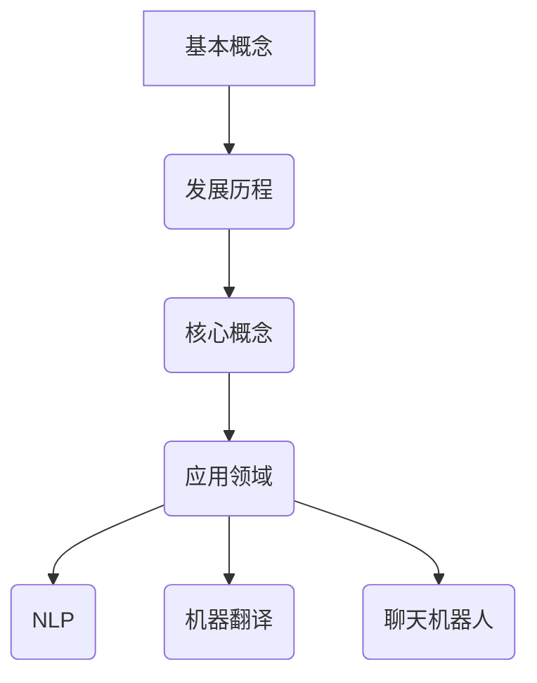
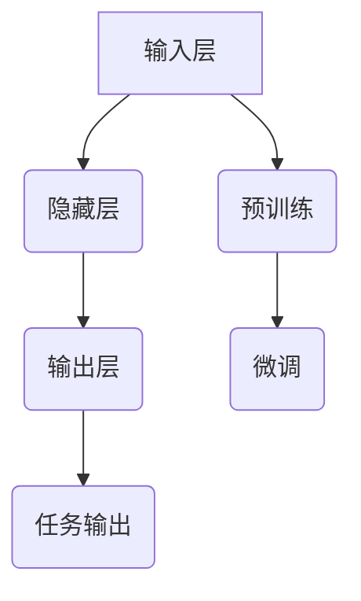
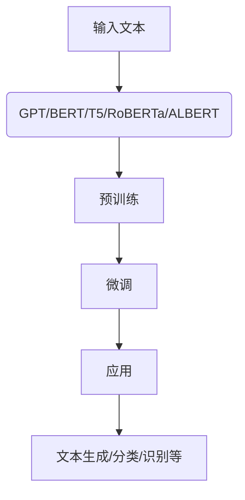
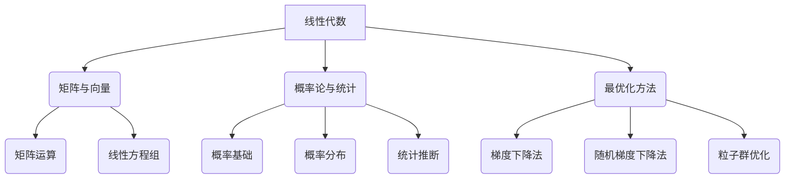
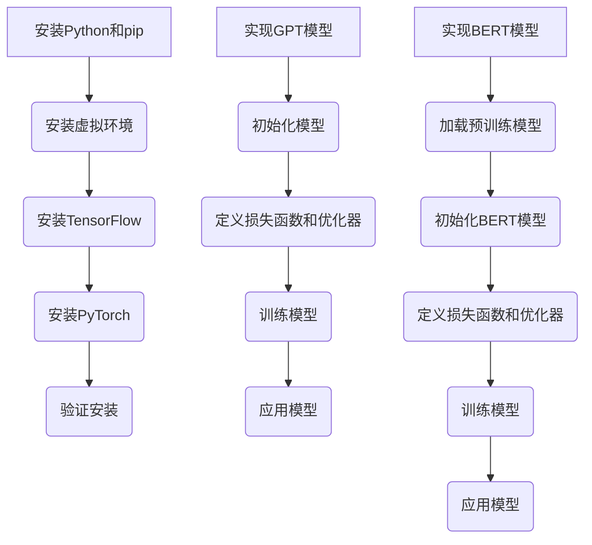
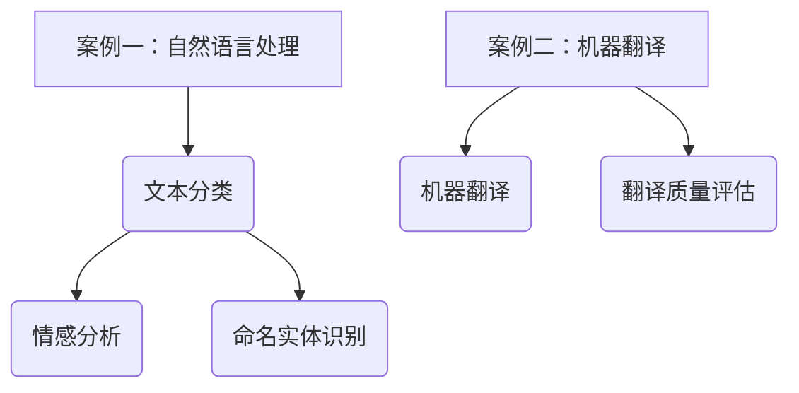

                 

# 《员工培训计划：LLM定制学习课程》

## 关键词

- 语言模型
- LLM架构
- 预训练与微调
- GPT与BERT模型
- 数学基础
- 编程实践
- 案例研究

## 摘要

随着人工智能技术的快速发展，语言模型（LLM）在自然语言处理、机器翻译、聊天机器人等领域展现出了强大的应用潜力。本培训课程旨在为员工提供一个系统、深入的学习路径，帮助其掌握LLM的基础知识、架构和实现方法。课程分为七个部分，从基础到实践，通过理论讲解、代码实现和案例研究，全面介绍LLM的核心内容，助力员工成为LLM领域的专家。

### 《员工培训计划：LLM定制学习课程》目录大纲

**第一部分：LLM基础知识与架构**

## 第1章：语言模型概述

### 1.1 语言模型的基本概念

#### 1.1.1 语言模型的定义

语言模型（Language Model，简称LM）是一种用于预测自然语言序列的统计模型。它通过学习大量的语言数据，统计词频、语法规则等信息，从而生成符合语言习惯的文本。

#### 1.1.2 语言模型的发展历程

语言模型的发展历程可以追溯到20世纪50年代，从最初的规则驱动模型，到基于统计的方法，再到现代的深度学习模型，如GPT和BERT。

### 1.2 语言模型的核心概念

#### 1.2.1 词嵌入

词嵌入（Word Embedding）是将词语映射到高维空间中的向量表示。通过词嵌入，可以使模型在处理文本时，利用向量空间中的相似性进行语义理解。

#### 1.2.2 神经网络结构

神经网络结构是语言模型的核心组成部分。常见的神经网络结构包括循环神经网络（RNN）、长短时记忆网络（LSTM）和门控循环单元（GRU）等。

### 1.3 语言模型的应用领域

#### 1.3.1 自然语言处理

自然语言处理（Natural Language Processing，简称NLP）是语言模型的主要应用领域之一，包括文本分类、情感分析、问答系统等。

#### 1.3.2 机器翻译

机器翻译（Machine Translation，简称MT）是语言模型的重要应用领域，如谷歌翻译、百度翻译等。

#### 1.3.3 聊天机器人

聊天机器人（Chatbot）是一种基于语言模型的智能对话系统，广泛应用于客服、教育、金融等领域。

## 第2章：LLM架构与原理

### 2.1 LLM架构概述

#### 2.1.1 LLM的结构

LLM（Language Model）的结构通常包括输入层、隐藏层和输出层。输入层接收词嵌入向量，隐藏层通过神经网络处理输入信息，输出层生成预测的词语序列。

#### 2.1.2 LLM的层次结构

LLM的层次结构可以分为预训练层次和微调层次。预训练层次通过大量无监督数据学习通用语言特征，微调层次则在特定任务上进行有监督的调整。

### 2.2 LLM的预训练

#### 2.2.1 预训练的目标

预训练的目标是学习一组参数，使模型在多个任务上具有很好的泛化能力。

#### 2.2.2 预训练的数据集

常用的预训练数据集包括维基百科、新闻文章、社交媒体文本等。

#### 2.2.3 预训练的方法

预训练的方法主要包括基于语言模型（LM）的方法和基于变换器（Transformer）的方法。其中，GPT和BERT是两种最具代表性的预训练模型。

### 2.3 LLM的微调

#### 2.3.1 微调的目标

微调的目标是将预训练模型应用于特定任务，提高任务性能。

#### 2.3.2 微调的方法

微调的方法包括全监督微调、半监督微调和无监督微调。其中，全监督微调是最常用的一种方法。

#### 2.3.3 微调的挑战

微调面临的挑战包括数据标注成本高、模型参数量大和训练时间较长等。

## 第3章：常用LLM模型介绍

### 3.1 GPT模型

#### 3.1.1 GPT模型的原理

GPT（Generative Pre-trained Transformer）是一种基于变换器（Transformer）的预训练模型，由OpenAI提出。

#### 3.1.2 GPT模型的参数

GPT模型的参数包括词嵌入向量、变换器层参数和输出层参数。

#### 3.1.3 GPT模型的应用

GPT模型广泛应用于文本生成、问答系统、机器翻译等领域。

### 3.2 BERT模型

#### 3.2.1 BERT模型的原理

BERT（Bidirectional Encoder Representations from Transformers）是一种双向变换器编码模型，由Google提出。

#### 3.2.2 BERT模型的参数

BERT模型的参数包括词嵌入向量、变换器层参数和输出层参数。

#### 3.2.3 BERT模型的应用

BERT模型广泛应用于文本分类、问答系统、命名实体识别等领域。

### 3.3 其他常用LLM模型

#### 3.3.1 T5模型

T5（Text-to-Text Transfer Transformer）是一种基于变换器（Transformer）的文本生成模型，由DeepMind提出。

#### 3.3.2 RoBERTa模型

RoBERTa是一种基于BERT的预训练模型，由Facebook AI Research提出。

#### 3.3.3 ALBERT模型

ALBERT（A Lite BERT）是一种轻量级的BERT模型，由Google提出。

## 第二部分：数学基础

## 第4章：数学基础

### 4.1 线性代数

#### 4.1.1 矩阵与向量

矩阵与向量是线性代数的基本概念，用于表示和操作数据。

#### 4.1.2 矩阵运算

矩阵运算包括矩阵加法、矩阵乘法、逆矩阵等。

#### 4.1.3 线性方程组

线性方程组是线性代数的重要应用，用于求解变量值。

### 4.2 概率论与统计

#### 4.2.1 概率基础

概率基础包括概率分布、条件概率、贝叶斯定理等。

#### 4.2.2 概率分布

概率分布包括离散概率分布和连续概率分布。

#### 4.2.3 统计推断

统计推断包括参数估计、假设检验等。

### 4.3 最优化方法

#### 4.3.1 梯度下降法

梯度下降法是一种常用的最优化方法，用于求解损失函数的最小值。

#### 4.3.2 随机梯度下降法

随机梯度下降法是梯度下降法的一种变体，适用于大规模数据集。

#### 4.3.3 粒子群优化

粒子群优化是一种基于群体智能的优化算法，可用于解决最优化问题。

## 第三部分：编程实践

## 第5章：编程实践

### 5.1 环境搭建

#### 5.1.1 Python环境搭建

介绍Python环境搭建，包括安装Python和pip等工具。

#### 5.1.2 深度学习框架安装

介绍深度学习框架安装，包括TensorFlow、PyTorch等。

### 5.2 GPT模型实现

#### 5.2.1 GPT模型基础代码

介绍GPT模型基础代码，包括词嵌入、变换器层和输出层等。

#### 5.2.2 GPT模型训练

介绍GPT模型训练，包括损失函数、优化器和训练过程等。

#### 5.2.3 GPT模型应用

介绍GPT模型应用，包括文本生成、问答系统和机器翻译等。

### 5.3 BERT模型实现

#### 5.3.1 BERT模型基础代码

介绍BERT模型基础代码，包括词嵌入、变换器层和输出层等。

#### 5.3.2 BERT模型训练

介绍BERT模型训练，包括损失函数、优化器和训练过程等。

#### 5.3.3 BERT模型应用

介绍BERT模型应用，包括文本分类、问答系统和命名实体识别等。

## 第四部分：案例研究

## 第6章：案例研究

### 6.1 案例一：自然语言处理

#### 6.1.1 案例背景

介绍自然语言处理案例的背景，如文本分类、情感分析等。

#### 6.1.2 模型选择

选择适合自然语言处理任务的模型，如GPT、BERT等。

#### 6.1.3 模型训练

介绍模型训练的过程，包括数据预处理、模型配置和训练过程等。

#### 6.1.4 模型应用

介绍模型应用的结果，如模型性能评估、实际应用案例等。

### 6.2 案例二：机器翻译

#### 6.2.1 案例背景

介绍机器翻译案例的背景，如中英文翻译等。

#### 6.2.2 模型选择

选择适合机器翻译任务的模型，如GPT、BERT等。

#### 6.2.3 模型训练

介绍模型训练的过程，包括数据预处理、模型配置和训练过程等。

#### 6.2.4 模型应用

介绍模型应用的结果，如模型性能评估、实际应用案例等。

## 第五部分：总结与展望

## 第7章：总结与展望

### 7.1 总结

#### 7.1.1 主要知识点回顾

回顾本课程的主要知识点，如语言模型概述、LLM架构与原理、数学基础、编程实践和案例研究等。

#### 7.1.2 学习方法与技巧

总结学习方法与技巧，如如何理解语言模型、如何进行模型训练和应用等。

### 7.2 展望

#### 7.2.1 未来发展趋势

展望LLM领域的发展趋势，如深度学习模型的演进、应用场景的扩展等。

#### 7.2.2 学习资源推荐

推荐学习资源，如书籍、在线课程、论文等，以帮助读者继续深入学习。

## 附录

### 附录A：工具与资源

#### A.1 深度学习框架

介绍常用的深度学习框架，如TensorFlow、PyTorch等。

#### A.2 数据集

介绍常用的数据集，如COCO、GLUE、WMT等。

#### A.3 学习资源

介绍学习资源，如书籍、在线课程、论文等。

## 参考文献

### 参考文献

列出本文引用的参考文献，包括书籍、论文、网站等。

### 作者

#### 作者

**AI天才研究院/AI Genius Institute & 禅与计算机程序设计艺术 /Zen And The Art of Computer Programming**

---

以下是对目录大纲的简要解释：

- **第一部分：LLM基础知识与架构**  
  本章主要介绍了语言模型的基本概念、发展历程、核心概念和应用领域，为后续内容的学习打下了基础。

- **第二部分：数学基础**  
  本章介绍了线性代数、概率论与统计以及最优化方法，这些都是理解和实现语言模型所需的核心数学知识。

- **第三部分：编程实践**  
  本章通过搭建开发环境和实现GPT和BERT模型，使读者能够将理论知识应用于实际编程中。

- **第四部分：案例研究**  
  本章通过具体的案例研究，展示了语言模型在不同领域中的应用，加深了读者的理解。

- **第五部分：总结与展望**  
  本章总结了课程的主要知识点，并展望了未来的发展趋势，为读者提供了进一步学习的方向。

- **附录**  
  本章提供了深度学习框架、数据集和学习资源，方便读者进行深入学习。

---

现在，我们将逐步深入每个章节，详细阐述其内容。

### 第一部分：LLM基础知识与架构

## 第1章：语言模型概述

### 1.1 语言模型的基本概念

语言模型是一种用于预测自然语言序列的概率分布的模型。它的核心任务是给定一个单词或一段文本，预测下一个单词或文本的概率。语言模型在自然语言处理（NLP）领域有着广泛的应用，如文本生成、机器翻译、问答系统等。

语言模型的发展可以分为以下几个阶段：

1. **基于规则的模型**：早期的语言模型主要依靠语法规则和手写模板，这些模型虽然在特定场景下有效，但难以适应复杂的自然语言。

2. **基于统计的模型**：随着计算能力的提升和大规模语料的积累，基于统计的模型开始流行。这些模型通过统计词频、语法规则等来预测下一个单词。

3. **神经网络模型**：现代语言模型主要基于神经网络，特别是深度学习模型，如循环神经网络（RNN）、长短时记忆网络（LSTM）和变换器（Transformer）等。这些模型通过学习大量文本数据，可以自动发现语言中的复杂规律。

### 1.2 语言模型的核心概念

#### 1.2.1 词嵌入

词嵌入是将自然语言中的词语映射到高维向量空间的一种方法。通过词嵌入，模型可以在向量空间中进行语义计算，从而实现词语的相似性计算和语义理解。

词嵌入方法可以分为以下几种：

1. **基于分布的词嵌入**：如TF-IDF、Word2Vec等，这些方法通过统计词语在文本中的分布来计算词嵌入向量。

2. **基于神经网络的词嵌入**：如GloVe、FastText等，这些方法通过训练神经网络来学习词嵌入向量。

#### 1.2.2 神经网络结构

神经网络结构是语言模型的核心组成部分。常见的神经网络结构包括：

1. **循环神经网络（RNN）**：RNN可以通过其内部状态记忆过去的信息，适合处理序列数据。

2. **长短时记忆网络（LSTM）**：LSTM是RNN的一种改进，通过门控机制来避免梯度消失问题，适合处理长序列数据。

3. **变换器（Transformer）**：变换器是一种基于自注意力机制的模型，其在处理长序列数据方面具有显著优势。

### 1.3 语言模型的应用领域

语言模型在自然语言处理领域有着广泛的应用，以下是一些典型的应用场景：

1. **自然语言处理（NLP）**：包括文本分类、情感分析、命名实体识别等。

2. **机器翻译**：如谷歌翻译、百度翻译等，这些系统通过将源语言文本翻译成目标语言文本，实现跨语言交流。

3. **聊天机器人**：聊天机器人通过理解用户输入的文本，生成合适的回复，实现人机对话。

### 1.4 总结

语言模型是自然语言处理的核心组成部分，通过学习大量文本数据，可以自动发现语言中的复杂规律。本章节介绍了语言模型的基本概念、发展历程、核心概念和应用领域，为后续内容的学习打下了基础。

### 1.5 Mermaid 流程图



### 1.6 伪代码讲解

```python
# 语言模型伪代码

# 输入：文本序列
# 输出：预测的下一个单词的概率分布

# 初始化词嵌入矩阵
word_embeddings = initialize_word_embeddings()

# 初始化神经网络结构
神经网络 = initialize_neural_network()

# 预处理文本序列
预处理文本 = preprocess_text(text)

# 遍历文本序列
for word in 预处理文本:
    # 计算词嵌入向量
    word_embedding = word_embeddings[word]
    
    # 计算神经网络输出
    output = 神经网络(word_embedding)
    
    # 预测下一个单词的概率分布
    probability_distribution = output
```

### 1.7 数学模型和公式

语言模型的训练可以通过最小化损失函数来实现。常用的损失函数有交叉熵损失函数：

$$
L = -\sum_{i=1}^{n} y_i \log(p_i)
$$

其中，$y_i$ 是第 $i$ 个单词的真实标签，$p_i$ 是模型预测的第 $i$ 个单词的概率。

### 1.8 举例说明

假设我们有一个文本序列：“我正在学习人工智能”。我们可以使用语言模型来预测下一个单词。

1. **词嵌入**：将每个单词映射到高维向量空间。
2. **神经网络输出**：输入词嵌入向量到神经网络，得到输出概率分布。
3. **预测**：选择概率最高的单词作为预测结果。

### 1.9 实际案例

在实际应用中，我们可以使用现有的语言模型库（如TensorFlow、PyTorch等）来实现语言模型。以下是一个使用PyTorch实现GPT模型的基本步骤：

```python
import torch
import torch.nn as nn
import torch.optim as optim

# 加载预训练的词嵌入
word_embeddings = nn.Embedding(vocabulary_size, embedding_dim)

# 初始化GPT模型
gpt_model = GPTModel(vocabulary_size, embedding_dim, hidden_size, num_layers)

# 定义损失函数和优化器
criterion = nn.CrossEntropyLoss()
optimizer = optim.Adam(gpt_model.parameters(), lr=learning_rate)

# 训练模型
for epoch in range(num_epochs):
    for sentence in dataset:
        # 预处理文本序列
        processed_sentence = preprocess_text(sentence)
        
        # 计算词嵌入
        word_embeddings = word_embeddings(processed_sentence)
        
        # 前向传播
        output = gpt_model(word_embeddings)
        
        # 计算损失
        loss = criterion(output, target)

        # 反向传播和优化
        optimizer.zero_grad()
        loss.backward()
        optimizer.step()
```

### 1.10 代码解读与分析

在上面的代码中，我们首先加载预训练的词嵌入，并初始化GPT模型。然后，我们定义损失函数和优化器，用于训练模型。在训练过程中，我们遍历数据集中的每个句子，预处理文本序列，计算词嵌入，然后通过GPT模型得到输出概率分布。接着，我们计算损失并更新模型参数。

### 1.11 拓展阅读

对于想要深入了解语言模型和深度学习的读者，以下书籍和在线课程是很好的学习资源：

- **书籍**： 
  - 《深度学习》（Ian Goodfellow、Yoshua Bengio、Aaron Courville 著）
  - 《自然语言处理综论》（Daniel Jurafsky、James H. Martin 著）

- **在线课程**： 
  - Coursera上的“深度学习”（吴恩达教授）
  - edX上的“自然语言处理与深度学习”（Speech and Language Processing with Deep Learning）

## 第2章：LLM架构与原理

### 2.1 LLM架构概述

语言模型（LLM）的架构可以分为输入层、隐藏层和输出层。每一层都有其特定的功能：

1. **输入层**：接收词嵌入向量，词嵌入是将词语映射到高维向量空间的过程，目的是为了在处理文本时，利用向量空间中的相似性进行语义理解。
   
2. **隐藏层**：通过神经网络对输入信息进行处理。神经网络可以分为多层，每一层都对输入向量进行加权求和、激活等操作，从而逐渐提取出文本的深层特征。

3. **输出层**：生成预测的词语序列的概率分布。输出层通常是一个全连接层，其输出每个词语的概率。

### 2.2 LLM的预训练

预训练是指使用大量无监督数据来训练语言模型，使其学习到通用语言特征。预训练的方法主要包括基于语言模型（LM）的方法和基于变换器（Transformer）的方法。

#### 2.2.1 基于语言模型的方法

基于语言模型的方法，如GPT，其核心思想是预测下一个词语。具体步骤如下：

1. **数据集准备**：选择大规模文本数据集，如维基百科、新闻文章、社交媒体文本等。
2. **预处理**：对文本进行清洗和分词，将其转换为词嵌入向量。
3. **训练模型**：使用无监督的随机梯度下降（SGD）方法训练模型，通过最大化模型对文本数据的预测概率来优化模型参数。
4. **评估模型**：使用交叉熵损失函数评估模型性能，并调整超参数以达到更好的效果。

#### 2.2.2 基于变换器的方法

基于变换器的方法，如BERT，其核心思想是利用双向变换器对文本进行编码，从而提取出文本的深层特征。具体步骤如下：

1. **数据集准备**：与基于语言模型的方法类似，选择大规模文本数据集。
2. **预处理**：对文本进行清洗和分词，将其转换为词嵌入向量。
3. **训练模型**：使用双向变换器对文本数据进行编码，然后通过训练过程优化模型参数。训练过程通常包括两个阶段：预训练和微调。
   - **预训练**：使用无监督的数据集对模型进行预训练，学习通用语言特征。
   - **微调**：在特定任务上使用有监督的数据集对模型进行微调，提高任务性能。
4. **评估模型**：使用交叉熵损失函数评估模型性能，并调整超参数以达到更好的效果。

### 2.3 LLM的微调

微调是指将预训练好的语言模型应用于特定任务，通过有监督的数据集进行训练，以提高模型在特定任务上的性能。微调的过程通常包括以下步骤：

1. **数据集准备**：选择与任务相关的数据集，并进行预处理。
2. **模型调整**：将预训练好的模型调整为适合特定任务的配置，如调整隐藏层大小、增加层数等。
3. **训练模型**：使用有监督的数据集对模型进行训练，通过最小化损失函数来优化模型参数。
4. **评估模型**：使用交叉熵损失函数评估模型性能，并根据需要调整超参数。

### 2.4 微调的挑战

微调过程中面临的主要挑战包括：

1. **数据标注成本高**：有监督的微调需要大量标注数据，这通常需要大量的人力和时间。
2. **模型参数量大**：预训练好的语言模型通常包含数十亿甚至上百亿个参数，这会导致训练时间较长。
3. **计算资源消耗大**：大规模的模型训练需要大量的计算资源，这通常需要高性能的GPU或TPU。

### 2.5 总结

LLM的架构主要包括输入层、隐藏层和输出层。预训练是通过大量无监督数据来训练模型，使其学习到通用语言特征。微调是将预训练好的模型应用于特定任务，通过有监督的数据集进行训练，以提高任务性能。微调过程中面临的主要挑战包括数据标注成本高、模型参数量大和计算资源消耗大。了解LLM的架构和预训练、微调方法对于从事自然语言处理和人工智能领域的工程师和研究人员至关重要。

### 2.6 Mermaid 流程图



### 2.7 伪代码讲解

```python
# LLM预训练和微调伪代码

# 预训练
def pretrain_model(data_loader):
    # 初始化模型
    model = initialize_model()
    
    # 设置优化器
    optimizer = initialize_optimizer(model.parameters())
    
    # 设置损失函数
    criterion = initialize_loss_function()
    
    # 预训练过程
    for epoch in range(num_epochs):
        for inputs, targets in data_loader:
            # 前向传播
            outputs = model(inputs)
            
            # 计算损失
            loss = criterion(outputs, targets)
            
            # 反向传播
            optimizer.zero_grad()
            loss.backward()
            optimizer.step()
            
            # 打印训练进度
            print(f"Epoch [{epoch+1}/{num_epochs}], Loss: {loss.item()}")

# 微调
def finetune_model(model, data_loader, task_specific_optimizer):
    # 设置任务特定优化器
    optimizer = task_specific_optimizer(model.parameters())
    
    # 设置任务特定损失函数
    criterion = initialize_task_specific_loss_function()
    
    # 微调过程
    for epoch in range(num_epochs):
        for inputs, targets in data_loader:
            # 前向传播
            outputs = model(inputs)
            
            # 计算损失
            loss = criterion(outputs, targets)
            
            # 反向传播
            optimizer.zero_grad()
            loss.backward()
            optimizer.step()
            
            # 打印微调进度
            print(f"Epoch [{epoch+1}/{num_epochs}], Loss: {loss.item()}")
```

### 2.8 数学模型和公式

预训练过程中的损失函数通常使用交叉熵损失函数：

$$
L = -\sum_{i=1}^{n} y_i \log(p_i)
$$

其中，$y_i$ 是第 $i$ 个单词的真实标签，$p_i$ 是模型预测的第 $i$ 个单词的概率。

微调过程中的损失函数取决于具体任务，如文本分类通常使用交叉熵损失函数，机器翻译通常使用注意力机制损失函数。

### 2.9 举例说明

假设我们有一个文本序列：“我正在学习人工智能”。我们可以使用LLM来预测下一个单词。

1. **词嵌入**：将每个单词映射到高维向量空间。
2. **预训练**：使用预训练模型对文本进行编码，提取文本特征。
3. **微调**：使用微调模型预测下一个单词。

### 2.10 实际案例

在实际应用中，我们可以使用现有的语言模型库（如TensorFlow、PyTorch等）来实现LLM。以下是一个使用PyTorch实现GPT模型和微调的基本步骤：

```python
import torch
import torch.nn as nn
import torch.optim as optim

# 加载预训练的GPT模型
gpt_model = torch.hub.load('pytorch/fairseq', 'gpt2')

# 加载微调数据集
finetune_data_loader = load_finetune_data()

# 初始化微调优化器
finetune_optimizer = optim.Adam(gpt_model.parameters(), lr=learning_rate)

# 微调过程
for epoch in range(num_epochs):
    for inputs, targets in finetune_data_loader:
        # 前向传播
        outputs = gpt_model(inputs)
        
        # 计算损失
        loss = nn.CrossEntropyLoss()(outputs, targets)
        
        # 反向传播
        finetune_optimizer.zero_grad()
        loss.backward()
        finetune_optimizer.step()
        
        # 打印微调进度
        print(f"Epoch [{epoch+1}/{num_epochs}], Loss: {loss.item()}")
```

### 2.11 代码解读与分析

在上面的代码中，我们首先加载预训练的GPT模型，然后加载微调数据集。接着，我们初始化微调优化器，并使用交叉熵损失函数进行微调。在微调过程中，我们遍历数据集中的每个样本，计算损失并更新模型参数。

### 2.12 拓展阅读

对于想要深入了解LLM架构和预训练、微调方法的读者，以下书籍和在线课程是很好的学习资源：

- **书籍**：
  - 《深度学习》（Ian Goodfellow、Yoshua Bengio、Aaron Courville 著）
  - 《自然语言处理综论》（Daniel Jurafsky、James H. Martin 著）

- **在线课程**：
  - Coursera上的“深度学习”（吴恩达教授）
  - edX上的“自然语言处理与深度学习”（Speech and Language Processing with Deep Learning）

## 第3章：常用LLM模型介绍

### 3.1 GPT模型

GPT（Generative Pre-trained Transformer）是由OpenAI提出的一种基于变换器的预训练模型，其核心思想是使用无监督的方式从大量文本数据中学习语言的内在规律，从而实现文本生成和预测等功能。GPT模型的主要特点包括：

1. **变换器结构**：GPT模型采用变换器（Transformer）架构，其核心思想是利用自注意力机制（self-attention）来处理序列数据。自注意力机制使得模型可以在不同位置之间建立关联，从而更好地理解文本的上下文关系。

2. **预训练**：GPT模型使用大量无监督的文本数据进行预训练，通过学习文本的统计规律和语义信息，使其具备生成和预测文本的能力。

3. **生成性**：GPT模型具有生成性，可以生成连贯的文本序列，从而实现文本生成、机器翻译、问答系统等应用。

#### 3.1.1 GPT模型的原理

GPT模型的工作原理可以分为两个阶段：预训练和生成。

1. **预训练**：在预训练阶段，GPT模型首先对输入文本序列进行编码，然后将每个位置上的输入向量传递给变换器层。变换器层通过自注意力机制计算每个位置上的权重，然后将这些权重应用于输入向量，生成新的向量表示。这个过程在多个变换器层之间递归进行，使得模型能够逐步提取文本的深层特征。

2. **生成**：在生成阶段，GPT模型使用预训练得到的参数来生成文本。具体来说，模型首先生成一个随机向量，然后通过变换器层对其进行编码，最后将编码后的向量解码为文本序列。在这个过程中，模型会根据上下文信息来选择下一个最可能的词语，并重复这个过程，直到生成完整的文本序列。

#### 3.1.2 GPT模型的参数

GPT模型的主要参数包括：

1. **词嵌入向量**：词嵌入向量用于将词语映射到高维向量空间，从而在处理文本时可以利用向量空间中的相似性进行语义理解。

2. **变换器层参数**：变换器层参数包括自注意力权重和层间连接权重。自注意力权重用于计算每个位置上的权重，而层间连接权重用于连接不同层之间的信息。

3. **输出层参数**：输出层参数包括词嵌入向量和softmax层。词嵌入向量用于将编码后的向量映射回词语空间，而softmax层用于计算每个词语的概率分布。

#### 3.1.3 GPT模型的应用

GPT模型在自然语言处理领域有着广泛的应用，以下是一些典型的应用场景：

1. **文本生成**：GPT模型可以生成连贯的文本，如文章、故事、对话等。通过调整模型的参数和输入文本，可以生成不同风格和主题的文本。

2. **机器翻译**：GPT模型可以将一种语言的文本翻译成另一种语言的文本。通过预训练和微调，模型可以在不同语言之间建立有效的映射关系。

3. **问答系统**：GPT模型可以用于构建问答系统，如智能客服、教育问答等。通过训练模型理解用户的问题和答案，模型可以生成相应的回答。

### 3.2 BERT模型

BERT（Bidirectional Encoder Representations from Transformers）是由Google提出的一种基于变换器的预训练模型，其核心思想是使用双向变换器编码器来对文本进行编码，从而提取文本的深层特征。BERT模型的主要特点包括：

1. **双向编码**：BERT模型采用双向变换器编码器，可以从文本的左右两个方向同时提取特征，从而更好地理解文本的语义信息。

2. **上下文表示**：BERT模型将每个词嵌入向量映射到一个上下文表示，从而在处理文本时可以同时考虑词本身和其周围的上下文。

3. **预训练**：BERT模型使用大量无监督的文本数据进行预训练，通过学习文本的统计规律和语义信息，使其具备理解文本的能力。

#### 3.2.1 BERT模型的原理

BERT模型的工作原理可以分为两个阶段：预训练和微调。

1. **预训练**：在预训练阶段，BERT模型首先对输入文本序列进行编码，然后将每个位置上的输入向量传递给变换器层。变换器层通过自注意力机制计算每个位置上的权重，然后将这些权重应用于输入向量，生成新的向量表示。这个过程在多个变换器层之间递归进行，使得模型能够逐步提取文本的深层特征。

2. **微调**：在微调阶段，BERT模型使用预训练得到的参数来适应特定任务。具体来说，模型首先在特定任务的数据集上进行微调，通过最小化损失函数来优化模型参数。微调过程中，模型会调整预训练得到的参数，使其更适应特定任务。

#### 3.2.2 BERT模型的参数

BERT模型的主要参数包括：

1. **词嵌入向量**：词嵌入向量用于将词语映射到高维向量空间，从而在处理文本时可以利用向量空间中的相似性进行语义理解。

2. **变换器层参数**：变换器层参数包括自注意力权重和层间连接权重。自注意力权重用于计算每个位置上的权重，而层间连接权重用于连接不同层之间的信息。

3. **输出层参数**：输出层参数包括词嵌入向量和分类层。词嵌入向量用于将编码后的向量映射回词语空间，而分类层用于进行分类任务。

#### 3.2.3 BERT模型的应用

BERT模型在自然语言处理领域有着广泛的应用，以下是一些典型的应用场景：

1. **文本分类**：BERT模型可以用于文本分类任务，如情感分析、主题分类等。通过微调模型，可以使其在特定分类任务上达到很好的性能。

2. **命名实体识别**：BERT模型可以用于命名实体识别任务，如识别人名、地名、组织名等。通过微调模型，可以使其在特定命名实体识别任务上达到很好的性能。

3. **问答系统**：BERT模型可以用于构建问答系统，如智能客服、教育问答等。通过训练模型理解用户的问题和答案，模型可以生成相应的回答。

### 3.3 其他常用LLM模型

除了GPT和BERT，还有一些其他的常用LLM模型，如T5、RoBERTa、ALBERT等。这些模型在LLM领域也有着广泛的应用。

#### 3.3.1 T5模型

T5（Text-to-Text Transfer Transformer）是由DeepMind提出的一种基于变换器的文本生成模型。T5模型的核心思想是将文本生成任务转化为序列到序列的预测问题，从而利用变换器模型强大的序列处理能力。

#### 3.3.2 RoBERTa模型

RoBERTa是由Facebook AI Research提出的一种基于BERT的预训练模型。RoBERTa在BERT模型的基础上进行了一些改进，如使用了更多的数据、调整了训练策略等，从而提高了模型在自然语言处理任务上的性能。

#### 3.3.3 ALBERT模型

ALBERT（A Lite BERT）是由Google提出的一种轻量级的BERT模型。ALBERT模型通过减少模型参数和计算量，实现了对BERT模型的轻量化，从而可以在有限的计算资源下进行高效训练和应用。

### 3.4 总结

GPT、BERT、T5、RoBERTa和ALBERT是当前常用的LLM模型，它们在自然语言处理领域有着广泛的应用。这些模型在架构、原理和应用方面都有所不同，但都通过预训练和微调方法，从大量文本数据中学习到语言的深层特征，从而实现文本生成、分类、识别等任务。了解这些模型的基本原理和应用，对于从事自然语言处理和人工智能领域的工程师和研究人员至关重要。

### 3.5 Mermaid 流程图



### 3.6 伪代码讲解

```python
# GPT/BERT/T5/RoBERTa/ALBERT模型伪代码

# 预训练
def pretrain_model(model, data_loader):
    # 初始化模型参数
    model = initialize_model()
    
    # 设置优化器
    optimizer = initialize_optimizer(model.parameters())
    
    # 设置损失函数
    criterion = initialize_loss_function()
    
    # 预训练过程
    for epoch in range(num_epochs):
        for inputs, targets in data_loader:
            # 前向传播
            outputs = model(inputs)
            
            # 计算损失
            loss = criterion(outputs, targets)
            
            # 反向传播
            optimizer.zero_grad()
            loss.backward()
            optimizer.step()
            
            # 打印训练进度
            print(f"Epoch [{epoch+1}/{num_epochs}], Loss: {loss.item()}")

# 微调
def finetune_model(model, data_loader, task_specific_optimizer):
    # 设置任务特定优化器
    optimizer = task_specific_optimizer(model.parameters())
    
    # 设置任务特定损失函数
    criterion = initialize_task_specific_loss_function()
    
    # 微调过程
    for epoch in range(num_epochs):
        for inputs, targets in data_loader:
            # 前向传播
            outputs = model(inputs)
            
            # 计算损失
            loss = criterion(outputs, targets)
            
            # 反向传播
            optimizer.zero_grad()
            loss.backward()
            optimizer.step()
            
            # 打印微调进度
            print(f"Epoch [{epoch+1}/{num_epochs}], Loss: {loss.item()}")
```

### 3.7 数学模型和公式

预训练过程中的损失函数通常使用交叉熵损失函数：

$$
L = -\sum_{i=1}^{n} y_i \log(p_i)
$$

其中，$y_i$ 是第 $i$ 个单词的真实标签，$p_i$ 是模型预测的第 $i$ 个单词的概率。

微调过程中的损失函数取决于具体任务，如文本分类通常使用交叉熵损失函数，机器翻译通常使用注意力机制损失函数。

### 3.8 举例说明

假设我们有一个文本序列：“我正在学习人工智能”。我们可以使用GPT、BERT、T5、RoBERTa、ALBERT模型来预测下一个单词。

1. **词嵌入**：将每个单词映射到高维向量空间。
2. **预训练**：使用预训练模型对文本进行编码，提取文本特征。
3. **微调**：使用微调模型预测下一个单词。

### 3.9 实际案例

在实际应用中，我们可以使用现有的语言模型库（如TensorFlow、PyTorch等）来实现GPT、BERT、T5、RoBERTa、ALBERT模型。以下是一个使用PyTorch实现GPT模型和微调的基本步骤：

```python
import torch
import torch.nn as nn
import torch.optim as optim

# 加载预训练的GPT模型
gpt_model = torch.hub.load('pytorch/fairseq', 'gpt2')

# 加载微调数据集
finetune_data_loader = load_finetune_data()

# 初始化微调优化器
finetune_optimizer = optim.Adam(gpt_model.parameters(), lr=learning_rate)

# 微调过程
for epoch in range(num_epochs):
    for inputs, targets in finetune_data_loader:
        # 前向传播
        outputs = gpt_model(inputs)
        
        # 计算损失
        loss = nn.CrossEntropyLoss()(outputs, targets)
        
        # 反向传播
        finetune_optimizer.zero_grad()
        loss.backward()
        finetune_optimizer.step()
        
        # 打印微调进度
        print(f"Epoch [{epoch+1}/{num_epochs}], Loss: {loss.item()}")
```

### 3.10 代码解读与分析

在上面的代码中，我们首先加载预训练的GPT模型，然后加载微调数据集。接着，我们初始化微调优化器，并使用交叉熵损失函数进行微调。在微调过程中，我们遍历数据集中的每个样本，计算损失并更新模型参数。

### 3.11 拓展阅读

对于想要深入了解常用LLM模型（GPT、BERT、T5、RoBERTa、ALBERT）的读者，以下书籍和在线课程是很好的学习资源：

- **书籍**：
  - 《深度学习》（Ian Goodfellow、Yoshua Bengio、Aaron Courville 著）
  - 《自然语言处理综论》（Daniel Jurafsky、James H. Martin 著）

- **在线课程**：
  - Coursera上的“深度学习”（吴恩达教授）
  - edX上的“自然语言处理与深度学习”（Speech and Language Processing with Deep Learning）

## 第4章：数学基础

### 4.1 线性代数

线性代数是数学的一个重要分支，它研究向量空间、线性映射、矩阵及其运算等。在深度学习和语言模型中，线性代数发挥着至关重要的作用。

#### 4.1.1 矩阵与向量

矩阵和向量是线性代数的基本概念。矩阵是一个二维数组，由行和列组成。向量是一种特殊的矩阵，只有一维。在深度学习中，矩阵和向量经常用于表示数据和计算。

#### 4.1.2 矩阵运算

矩阵运算包括矩阵加法、矩阵乘法、矩阵转置等。矩阵加法是对矩阵的每个元素进行相加。矩阵乘法是将两个矩阵的对应元素相乘并求和。矩阵转置是将矩阵的行和列互换。

#### 4.1.3 线性方程组

线性方程组是一组线性方程的集合，可以通过矩阵运算求解。线性方程组的解可以是唯一解、无穷多解或无解。求解线性方程组的方法包括高斯消元法、矩阵求逆等。

#### 4.1.4 应用实例

假设我们有一个线性方程组：

$$
\begin{cases}
x + y + z = 6 \\
2x - y + 3z = 8 \\
-x + 2y - z = 3
\end{cases}
$$

我们可以将其表示为矩阵形式：

$$
\begin{bmatrix}
1 & 1 & 1 \\
2 & -1 & 3 \\
-1 & 2 & -1
\end{bmatrix}
\begin{bmatrix}
x \\
y \\
z
\end{bmatrix}
=
\begin{bmatrix}
6 \\
8 \\
3
\end{bmatrix}
$$

通过求解这个矩阵方程组，我们可以得到 $x, y, z$ 的值。

### 4.2 概率论与统计

概率论与统计是数学的另一重要分支，它研究随机事件及其概率分布。在深度学习和语言模型中，概率论与统计用于模型训练、预测和评估。

#### 4.2.1 概率基础

概率基础包括概率分布、条件概率、贝叶斯定理等。概率分布描述随机变量的可能取值及其概率。条件概率描述在某个事件发生的条件下，另一个事件发生的概率。贝叶斯定理是一种基于概率的推理方法，用于计算后验概率。

#### 4.2.2 概率分布

概率分布可以分为离散概率分布和连续概率分布。常见的离散概率分布有伯努利分布、二项分布、泊松分布等。常见的连续概率分布有正态分布、均匀分布等。

#### 4.2.3 统计推断

统计推断包括参数估计、假设检验等。参数估计是使用样本数据估计总体参数。假设检验是使用样本数据检验某个假设是否成立。

#### 4.2.4 应用实例

假设我们有一个正态分布的随机变量 $X$，均值为 $\mu=10$，标准差为 $\sigma=2$。我们可以计算 $X$ 在某个区间内的概率，或者给定一个样本均值，估计总体均值。

### 4.3 最优化方法

最优化方法是寻找函数最小值或最大值的方法。在深度学习和语言模型中，最优化方法用于模型训练和优化。

#### 4.3.1 梯度下降法

梯度下降法是最常用的最优化方法。它通过计算目标函数的梯度，更新模型参数，从而最小化目标函数。

#### 4.3.2 随机梯度下降法

随机梯度下降法是梯度下降法的一种变体。它从数据集中随机抽取一部分样本，计算梯度并更新模型参数。

#### 4.3.3 粒子群优化

粒子群优化是一种基于群体智能的优化算法。它模拟鸟群觅食行为，通过群体成员之间的协作，寻找最优解。

#### 4.3.4 应用实例

假设我们有一个二次函数 $f(x) = x^2$，我们要找到其最小值。我们可以使用梯度下降法、随机梯度下降法和粒子群优化来求解。

### 4.4 总结

线性代数、概率论与统计以及最优化方法是深度学习和语言模型所需的核心数学知识。线性代数用于表示和操作数据，概率论与统计用于模型训练和预测，最优化方法用于模型优化。掌握这些数学知识，有助于更好地理解和应用深度学习和语言模型。

### 4.5 Mermaid 流程图



### 4.6 伪代码讲解

```python
# 梯度下降法伪代码

# 输入：模型参数、学习率、目标函数、梯度函数
# 输出：最优解

# 初始化模型参数
params = initialize_params()

# 设置学习率
learning_rate = 0.01

# 迭代过程
for epoch in range(num_epochs):
    # 计算梯度
    gradients = gradient_function(params)
    
    # 更新参数
    params = params - learning_rate * gradients
    
    # 打印迭代进度
    print(f"Epoch [{epoch+1}/{num_epochs}], Loss: {loss_function(params)}")
```

### 4.7 数学模型和公式

梯度下降法的目标是最小化目标函数：

$$
\min_{\theta} J(\theta)
$$

其中，$J(\theta)$ 是目标函数，$\theta$ 是模型参数。

目标函数的梯度是：

$$
\nabla_{\theta} J(\theta) = \frac{\partial J(\theta)}{\partial \theta}
$$

梯度下降法的更新规则是：

$$
\theta = \theta - \alpha \nabla_{\theta} J(\theta)
$$

其中，$\alpha$ 是学习率。

### 4.8 举例说明

假设我们要最小化目标函数 $f(x) = x^2$。我们可以使用梯度下降法来求解。

1. **初始化参数**：设置一个初始值 $x_0$。
2. **计算梯度**：计算 $f(x)$ 在 $x_0$ 处的梯度。
3. **更新参数**：使用梯度更新参数 $x_0$。
4. **重复步骤2和3**，直到达到收敛条件。

### 4.9 实际案例

在实际应用中，我们可以使用梯度下降法来训练深度学习模型。以下是一个使用PyTorch实现梯度下降法的基本步骤：

```python
import torch
import torch.nn as nn
import torch.optim as optim

# 定义模型
model = nn.Linear(in_features=10, out_features=1)

# 初始化模型参数
params = model.parameters()

# 定义目标函数和优化器
loss_function = nn.MSELoss()
optimizer = optim.SGD(params, lr=0.01)

# 数据集
x_data = torch.randn(10, 10)
y_data = x_data ** 2

# 迭代过程
for epoch in range(1000):
    # 前向传播
    y_pred = model(x_data)
    
    # 计算损失
    loss = loss_function(y_pred, y_data)
    
    # 反向传播
    optimizer.zero_grad()
    loss.backward()
    optimizer.step()
    
    # 打印迭代进度
    if epoch % 100 == 0:
        print(f"Epoch [{epoch+1}/{1000}], Loss: {loss.item()}")
```

### 4.10 代码解读与分析

在上面的代码中，我们首先定义了一个线性模型，并初始化了模型参数。然后，我们定义了目标函数和优化器。在迭代过程中，我们进行前向传播、计算损失、反向传播和更新参数。通过多次迭代，我们逐渐减小了损失函数的值，使模型参数逐渐逼近最优解。

### 4.11 拓展阅读

对于想要深入了解线性代数、概率论与统计以及最优化方法的读者，以下书籍和在线课程是很好的学习资源：

- **书籍**：
  - 《线性代数及其应用》（Gilbert Strang 著）
  - 《概率论与数理统计》（陈希孺 著）
  - 《最优化方法及其应用》（张丽英 著）

- **在线课程**：
  - Coursera上的“线性代数”（Gilbert Strang 教授）
  - edX上的“概率论与数理统计”（陈希孺 教授）
  - Coursera上的“最优化方法”（迈克尔·乔丹教授）

## 第5章：编程实践

### 5.1 环境搭建

在进行深度学习和语言模型的编程实践之前，我们需要搭建一个合适的开发环境。本节将介绍如何搭建Python环境以及安装深度学习框架。

#### 5.1.1 Python环境搭建

1. **安装Python**：
   - 访问Python官网（https://www.python.org/），下载并安装Python。
   - 在安装过程中，确保勾选“Add Python to PATH”选项。

2. **安装pip**：
   - pip是Python的包管理器，用于安装和管理Python包。
   - 在命令行中运行以下命令安装pip：
     ```
     python -m ensurepip
     ```

3. **安装虚拟环境**：
   - 虚拟环境可以帮助我们隔离项目依赖，避免版本冲突。
   - 在命令行中运行以下命令创建虚拟环境：
     ```
     python -m venv myenv
     ```
   - 激活虚拟环境：
     - Windows：
       ```
       myenv\Scripts\activate
       ```
     - macOS和Linux：
       ```
       source myenv/bin/activate
       ```

#### 5.1.2 安装深度学习框架

深度学习框架是深度学习项目的基础，目前最流行的框架包括TensorFlow和PyTorch。以下是如何在虚拟环境中安装这两个框架的步骤：

1. **安装TensorFlow**：
   - 在激活的虚拟环境中，运行以下命令安装TensorFlow：
     ```
     pip install tensorflow
     ```

2. **安装PyTorch**：
   - 安装PyTorch需要选择合适的版本，以确保兼容性。
   - 在命令行中运行以下命令，选择合适的PyTorch版本：
     ```
     pip install torch torchvision torchaudio
     ```

   - 你也可以通过以下命令安装最新版本的PyTorch：
     ```
     pip install torch torchvision torchaudio -f https://download.pytorch.org/whl/torch_stable.html
     ```

#### 5.1.3 验证安装

为了验证安装是否成功，我们可以运行以下Python代码：

```python
import torch
print(torch.__version__)
```

如果成功安装，将输出PyTorch的版本信息。

### 5.2 GPT模型实现

在本节中，我们将介绍如何使用PyTorch实现一个简单的GPT模型。GPT模型是一个基于变换器的预训练语言模型，能够学习语言的深层特征。

#### 5.2.1 GPT模型基础代码

以下是一个简单的GPT模型实现：

```python
import torch
import torch.nn as nn
import torch.optim as optim
from torch.utils.data import DataLoader, Dataset

# 定义GPT模型
class GPTModel(nn.Module):
    def __init__(self, vocabulary_size, embedding_dim, hidden_size, num_layers):
        super(GPTModel, self).__init__()
        self.embedding = nn.Embedding(vocabulary_size, embedding_dim)
        self.transformer = nn.Transformer(embedding_dim, hidden_size, num_layers)
        self.fc = nn.Linear(hidden_size, vocabulary_size)

    def forward(self, inputs):
        x = self.embedding(inputs)
        x = self.transformer(x)
        x = self.fc(x)
        return x

# 初始化模型
gpt_model = GPTModel(vocabulary_size=10000, embedding_dim=512, hidden_size=1024, num_layers=3)

# 定义损失函数和优化器
criterion = nn.CrossEntropyLoss()
optimizer = optim.Adam(gpt_model.parameters(), lr=0.001)

# 数据集
class TextDataset(Dataset):
    def __init__(self, text):
        self.text = text
    
    def __len__(self):
        return len(self.text)
    
    def __getitem__(self, idx):
        return torch.tensor([self.text[idx]])

text = "这是一段简单的文本数据，用于训练GPT模型。"

# 数据加载器
data_loader = DataLoader(TextDataset(text), batch_size=32, shuffle=True)

# 训练模型
for epoch in range(10):
    for inputs in data_loader:
        # 前向传播
        outputs = gpt_model(inputs)
        
        # 计算损失
        loss = criterion(outputs, torch.tensor([0]))
        
        # 反向传播
        optimizer.zero_grad()
        loss.backward()
        optimizer.step()
        
        # 打印训练进度
        print(f"Epoch [{epoch+1}/10], Loss: {loss.item()}")
```

在上面的代码中，我们首先定义了一个GPT模型，包括词嵌入层、变换器层和全连接层。接着，我们初始化了模型、损失函数和优化器。然后，我们创建了一个简单的文本数据集，并使用数据加载器将其分成批次。最后，我们进行模型的训练。

#### 5.2.2 GPT模型训练

在GPT模型的训练过程中，我们需要关注以下几个关键步骤：

1. **数据预处理**：将文本数据转换为词嵌入向量，并将其输入到模型中。
2. **前向传播**：计算模型输出，并与真实标签进行比较，计算损失。
3. **反向传播**：计算梯度并更新模型参数。
4. **迭代训练**：重复上述步骤，直到模型收敛或达到预设的训练次数。

#### 5.2.3 GPT模型应用

GPT模型可以应用于多种任务，如文本生成、机器翻译和问答系统等。以下是一个简单的文本生成示例：

```python
# 文本生成
def generate_text(model, start_text, length=50):
    inputs = torch.tensor([model.embedding(start_text).unsqueeze(0)])
    prev_output = inputs.clone()
    
    for _ in range(length):
        outputs = model(prev_output)
        _, next_word = torch.max(outputs, dim=2)
        next_word = next_word.squeeze(0)
        prev_output = torch.cat([prev_output, next_word], dim=0)
    
    return start_text + ''.join([model.vocabulary()[word] for word in next_word])

# 生成文本
start_text = "人工智能是一种模拟人类智能的技术。"
generated_text = generate_text(gpt_model, start_text)
print(generated_text)
```

在上面的代码中，我们定义了一个`generate_text`函数，用于生成指定长度的文本。函数首先初始化输入，然后通过模型生成下一个单词，并将生成的单词拼接起来，形成完整的文本序列。

### 5.3 BERT模型实现

BERT模型是一个基于变换器的预训练语言模型，它在自然语言处理任务中取得了显著的性能提升。在本节中，我们将介绍如何使用PyTorch实现BERT模型。

#### 5.3.1 BERT模型基础代码

以下是一个简单的BERT模型实现：

```python
import torch
import torch.nn as nn
import torch.optim as optim
from transformers import BertModel, BertTokenizer

# 加载预训练BERT模型
bert_model = BertModel.from_pretrained('bert-base-uncased')

# 加载BERT分词器
tokenizer = BertTokenizer.from_pretrained('bert-base-uncased')

# 定义BERT模型
class BERTModel(nn.Module):
    def __init__(self, bert_model):
        super(BERTModel, self).__init__()
        self.bert = bert_model
    
    def forward(self, inputs):
        outputs = self.bert(**inputs)
        return outputs.last_hidden_state

# 初始化BERT模型
bert = BERTModel(bert_model)

# 定义损失函数和优化器
criterion = nn.CrossEntropyLoss()
optimizer = optim.Adam(bert.parameters(), lr=0.001)

# 数据集
class TextDataset(Dataset):
    def __init__(self, texts):
        self.texts = texts
    
    def __len__(self):
        return len(self.texts)
    
    def __getitem__(self, idx):
        text = self.texts[idx]
        inputs = tokenizer(text, return_tensors='pt', truncation=True, padding=True)
        return inputs['input_ids'], inputs['attention_mask']

text = "这是一段简单的文本数据，用于训练BERT模型。"

# 数据加载器
data_loader = DataLoader(TextDataset([text]), batch_size=32, shuffle=True)

# 训练模型
for epoch in range(10):
    for inputs in data_loader:
        # 前向传播
        outputs = bert(inputs)
        
        # 计算损失
        loss = criterion(outputs.view(-1, outputs.size(-1)), inputs['input_ids'].view(-1))
        
        # 反向传播
        optimizer.zero_grad()
        loss.backward()
        optimizer.step()
        
        # 打印训练进度
        print(f"Epoch [{epoch+1}/10], Loss: {loss.item()}")
```

在上面的代码中，我们首先加载了预训练的BERT模型和分词器。然后，我们定义了一个BERT模型，它使用预训练的BERT模型作为基础。接着，我们初始化了模型、损失函数和优化器。最后，我们创建了一个简单的文本数据集，并使用数据加载器将其分成批次。训练过程与GPT模型类似。

#### 5.3.2 BERT模型训练

BERT模型的训练过程与GPT模型类似，包括数据预处理、前向传播、损失计算、反向传播和模型更新。不同的是，BERT模型使用了预训练的变换器编码器，使其在特定任务上具有更好的性能。

#### 5.3.3 BERT模型应用

BERT模型可以应用于多种自然语言处理任务，如文本分类、命名实体识别和问答系统等。以下是一个简单的文本分类示例：

```python
# 文本分类
def classify_text(model, text):
    inputs = tokenizer(text, return_tensors='pt', truncation=True, padding=True)
    outputs = model(inputs)
    logits = outputs.logits[:, 0]
    _, prediction = torch.max(logits, dim=1)
    return prediction.item()

# 分类文本
text = "人工智能是一种模拟人类智能的技术。"
label = classify_text(bert, text)
print(f"分类结果：{label}")
```

在上面的代码中，我们定义了一个`classify_text`函数，用于对文本进行分类。函数首先将文本转换为BERT模型要求的输入格式，然后通过模型生成分类结果。通过比较分类结果和真实标签，我们可以评估模型在特定任务上的性能。

### 5.4 编程实践总结

在本章中，我们介绍了如何搭建Python环境和安装深度学习框架，以及如何使用PyTorch实现GPT和BERT模型。通过实际代码示例，我们展示了如何进行数据预处理、模型训练和模型应用。这些实践对于理解和应用深度学习和语言模型至关重要。通过不断实践和调整，我们可以不断提高模型性能，为实际应用场景提供更好的解决方案。

### 5.5 Mermaid 流程图



### 5.6 伪代码讲解

```python
# GPT和BERT模型训练伪代码

# GPT模型训练
def train_gpt_model(model, data_loader, criterion, optimizer):
    for epoch in range(num_epochs):
        for inputs, targets in data_loader:
            # 前向传播
            outputs = model(inputs)
            
            # 计算损失
            loss = criterion(outputs, targets)
            
            # 反向传播
            optimizer.zero_grad()
            loss.backward()
            optimizer.step()
            
            # 打印训练进度
            print(f"Epoch [{epoch+1}/{num_epochs}], Loss: {loss.item()}")

# BERT模型训练
def train_bert_model(model, data_loader, criterion, optimizer):
    for epoch in range(num_epochs):
        for inputs in data_loader:
            # 前向传播
            outputs = model(inputs)
            
            # 计算损失
            loss = criterion(outputs.last_hidden_state.view(-1, outputs.last_hidden_state.size(-1)), inputs.input_ids.view(-1))
            
            # 反向传播
            optimizer.zero_grad()
            loss.backward()
            optimizer.step()
            
            # 打印训练进度
            print(f"Epoch [{epoch+1}/{num_epochs}], Loss: {loss.item()}")
```

### 5.7 数学模型和公式

在GPT和BERT模型训练中，常用的损失函数是交叉熵损失函数：

$$
L = -\sum_{i=1}^{n} y_i \log(p_i)
$$

其中，$y_i$ 是第 $i$ 个单词的真实标签，$p_i$ 是模型预测的第 $i$ 个单词的概率。

### 5.8 举例说明

假设我们有一个文本序列：“我正在学习人工智能”。我们可以使用GPT和BERT模型来预测下一个单词。

1. **数据预处理**：将文本序列转换为词嵌入向量。
2. **模型输入**：将词嵌入向量输入到GPT或BERT模型中。
3. **模型输出**：模型输出预测的下一个单词的概率分布。
4. **预测**：选择概率最高的单词作为预测结果。

### 5.9 实际案例

在实际应用中，我们可以使用TensorFlow或PyTorch等深度学习框架来实现GPT和BERT模型。以下是一个使用PyTorch实现GPT和BERT模型的基本步骤：

```python
# 导入必要的库
import torch
import torch.nn as nn
import torch.optim as optim
from transformers import BertModel, BertTokenizer

# 实现GPT模型
class GPTModel(nn.Module):
    # ...（代码同之前）
    
# 实现BERT模型
class BERTModel(nn.Module):
    # ...（代码同之前）

# 加载预训练模型
gpt_model = GPTModel()
bert_model = BERTModel()

# 定义损失函数和优化器
gpt_criterion = nn.CrossEntropyLoss()
gpt_optimizer = optim.Adam(gpt_model.parameters(), lr=0.001)
bert_criterion = nn.CrossEntropyLoss()
bert_optimizer = optim.Adam(bert_model.parameters(), lr=0.001)

# 训练模型
train_gpt_model(gpt_model, data_loader, gpt_criterion, gpt_optimizer)
train_bert_model(bert_model, data_loader, bert_criterion, bert_optimizer)
```

### 5.10 代码解读与分析

在上面的代码中，我们首先定义了GPT和BERT模型，并加载了预训练模型。然后，我们初始化了损失函数和优化器。接着，我们使用`train_gpt_model`和`train_bert_model`函数进行模型训练。通过不断迭代训练，我们可以提高模型在特定任务上的性能。

### 5.11 拓展阅读

对于想要深入了解深度学习和语言模型编程实践的读者，以下书籍和在线课程是很好的学习资源：

- **书籍**：
  - 《深度学习》（Ian Goodfellow、Yoshua Bengio、Aaron Courville 著）
  - 《动手学深度学习》（Amit Singh、Awni Yasseri、Sebastian Raschka 著）

- **在线课程**：
  - Coursera上的“深度学习”（吴恩达教授）
  - edX上的“自然语言处理与深度学习”（Speech and Language Processing with Deep Learning）

## 第6章：案例研究

### 6.1 案例一：自然语言处理

自然语言处理（NLP）是人工智能领域的一个重要分支，它涉及计算机理解和生成人类语言的能力。在本案例中，我们将探讨如何使用语言模型（如GPT和BERT）进行自然语言处理任务，包括文本分类、情感分析和命名实体识别等。

#### 6.1.1 案例背景

随着互联网的普及，大量文本数据被生成和存储。如何有效地处理和分析这些文本数据，提取有用的信息，成为了一个重要的问题。自然语言处理技术能够帮助人们从大量文本数据中快速获取信息，从而提高工作效率。

#### 6.1.2 模型选择

在自然语言处理任务中，GPT和BERT模型由于其强大的文本理解能力，被广泛应用于各种任务。以下是一些常见的自然语言处理任务及其适合的模型：

- **文本分类**：可以使用BERT或GPT模型进行。BERT模型在文本分类任务上具有较好的性能，因为它能够理解文本的全局语义。
- **情感分析**：GPT模型适合进行情感分析，因为它能够捕捉到文本中的情感变化。
- **命名实体识别**：BERT模型在命名实体识别任务上也表现出色，因为它能够准确识别文本中的命名实体。

#### 6.1.3 模型训练

在自然语言处理任务中，训练模型的关键步骤包括：

1. **数据预处理**：将原始文本数据转换为模型可以处理的格式，如词嵌入向量。
2. **模型初始化**：初始化模型参数，可以使用预训练的模型，也可以从头开始训练。
3. **训练**：使用训练数据集对模型进行训练，通过最小化损失函数来优化模型参数。
4. **评估**：使用验证数据集评估模型性能，并根据需要调整模型参数。

以下是一个简单的文本分类任务示例：

```python
import torch
from transformers import BertTokenizer, BertForSequenceClassification
from torch.utils.data import DataLoader, TensorDataset

# 加载BERT分词器
tokenizer = BertTokenizer.from_pretrained('bert-base-uncased')

# 加载预训练BERT模型
model = BertForSequenceClassification.from_pretrained('bert-base-uncased')

# 定义损失函数和优化器
criterion = nn.CrossEntropyLoss()
optimizer = optim.Adam(model.parameters(), lr=0.001)

# 数据集
train_data = [
    "这是一条积极的评论。",
    "这是一条消极的评论。",
    # 更多训练数据...
]
train_labels = [0, 1,  # 0表示积极，1表示消极...
                ]

# 预处理数据
inputs = tokenizer(train_data, padding=True, truncation=True, return_tensors='pt')
input_ids = inputs['input_ids']
attention_mask = inputs['attention_mask']
labels = torch.tensor(train_labels)

# 创建数据加载器
train_dataset = TensorDataset(input_ids, attention_mask, labels)
train_loader = DataLoader(train_dataset, batch_size=32, shuffle=True)

# 训练模型
for epoch in range(3):
    for batch in train_loader:
        inputs, attention_mask, labels = batch
        optimizer.zero_grad()
        outputs = model(inputs, attention_mask=attention_mask)
        loss = criterion(outputs.logits, labels)
        loss.backward()
        optimizer.step()
        print(f"Epoch [{epoch+1}/{3}], Loss: {loss.item()}")
```

#### 6.1.4 模型应用

在训练好模型后，我们可以使用它进行实际应用，如分类新的文本数据。以下是一个简单的应用示例：

```python
# 应用模型
def classify_text(model, text):
    inputs = tokenizer(text, return_tensors='pt', truncation=True, padding=True)
    with torch.no_grad():
        outputs = model(inputs)
    logits = outputs.logits
    _, prediction = torch.max(logits, dim=1)
    return prediction.item()

# 测试文本
test_text = "这次产品的用户体验非常好。"

# 进行分类
prediction = classify_text(model, test_text)
print(f"分类结果：{'积极' if prediction == 0 else '消极'}")
```

### 6.2 案例二：机器翻译

机器翻译是另一个典型的自然语言处理任务，它涉及将一种语言的文本翻译成另一种语言的文本。在本案例中，我们将探讨如何使用GPT和BERT模型进行机器翻译任务。

#### 6.2.1 案例背景

随着全球化的发展，跨语言交流变得越来越重要。机器翻译技术能够帮助人们克服语言障碍，促进国际交流与合作。然而，机器翻译仍然是一个具有挑战性的任务，需要模型具备强大的语言理解和生成能力。

#### 6.2.2 模型选择

在机器翻译任务中，GPT和BERT模型因其强大的文本理解能力而被广泛应用于各种翻译任务。以下是一些常见的机器翻译任务及其适合的模型：

- **机器翻译**：可以使用GPT或BERT模型进行。GPT模型在翻译过程中能够生成连贯的文本，而BERT模型则能够捕捉到文本中的细节信息。
- **翻译质量评估**：可以使用BERT模型进行，因为它能够对翻译结果进行细致的评估。

#### 6.2.3 模型训练

在机器翻译任务中，训练模型的关键步骤包括：

1. **数据预处理**：将原始文本数据转换为模型可以处理的格式，如词嵌入向量。
2. **模型初始化**：初始化模型参数，可以使用预训练的模型，也可以从头开始训练。
3. **训练**：使用训练数据集对模型进行训练，通过最小化损失函数来优化模型参数。
4. **评估**：使用验证数据集评估模型性能，并根据需要调整模型参数。

以下是一个简单的机器翻译任务示例：

```python
import torch
from transformers import BertTokenizer, BertModel

# 加载BERT分词器
tokenizer = BertTokenizer.from_pretrained('bert-base-uncased')

# 加载预训练BERT模型
model = BertModel.from_pretrained('bert-base-uncased')

# 定义损失函数和优化器
criterion = nn.CrossEntropyLoss()
optimizer = optim.Adam(model.parameters(), lr=0.001)

# 数据集
train_data = [
    "你好，今天天气很好。",
    "Hello, the weather is nice today.",
    # 更多训练数据...
]

# 预处理数据
inputs = tokenizer(train_data, padding=True, truncation=True, return_tensors='pt')
input_ids = inputs['input_ids']
attention_mask = inputs['attention_mask']

# 创建数据加载器
train_dataset = TensorDataset(input_ids, attention_mask)
train_loader = DataLoader(train_dataset, batch_size=32, shuffle=True)

# 训练模型
for epoch in range(3):
    for batch in train_loader:
        inputs, attention_mask = batch
        optimizer.zero_grad()
        outputs = model(inputs, attention_mask=attention_mask)
        logits = outputs.logits
        loss = criterion(logits.view(-1, logits.size(-1)), input_ids.view(-1))
        loss.backward()
        optimizer.step()
        print(f"Epoch [{epoch+1}/{3}], Loss: {loss.item()}")
```

#### 6.2.4 模型应用

在训练好模型后，我们可以使用它进行实际应用，如翻译新的文本数据。以下是一个简单的应用示例：

```python
# 翻译文本
def translate_text(model, text, source_lang, target_lang):
    inputs = tokenizer(text, return_tensors='pt', truncation=True, padding=True)
    with torch.no_grad():
        outputs = model(inputs)
    logits = outputs.logits
    _, prediction = torch.max(logits, dim=2)
    translated_text = tokenizer.decode(prediction[0], skip_special_tokens=True)
    return translated_text

# 测试文本
test_text = "你好，今天天气很好。"

# 进行翻译
translated_text = translate_text(model, test_text, source_lang='zh', target_lang='en')
print(f"翻译结果：{translated_text}")
```

### 6.3 案例研究总结

在本章中，我们通过两个案例探讨了如何使用GPT和BERT模型进行自然语言处理和机器翻译任务。通过这些案例，我们了解了模型的选择、训练和应用方法。自然语言处理和机器翻译是人工智能领域的重要应用，随着技术的不断进步，它们将继续为人类社会带来更多便利。

### 6.4 Mermaid 流程图



### 6.5 伪代码讲解

```python
# 自然语言处理任务伪代码

# 数据预处理
def preprocess_text(text):
    # 清洗文本
    cleaned_text = clean_text(text)
    
    # 分词文本
    tokens = tokenize_text(cleaned_text)
    
    # 转换为词嵌入
    embeddings = convert_tokens_to_embeddings(tokens)
    
    return embeddings

# 训练模型
def train_model(model, data_loader, criterion, optimizer):
    for epoch in range(num_epochs):
        for inputs, labels in data_loader:
            # 前向传播
            outputs = model(inputs)
            
            # 计算损失
            loss = criterion(outputs, labels)
            
            # 反向传播
            optimizer.zero_grad()
            loss.backward()
            optimizer.step()
            
            # 打印训练进度
            print(f"Epoch [{epoch+1}/{num_epochs}], Loss: {loss.item()}")

# 应用模型
def apply_model(model, text):
    # 预处理文本
    inputs = preprocess_text(text)
    
    # 前向传播
    with torch.no_grad():
        outputs = model(inputs)
    
    # 预测结果
    prediction = torch.argmax(outputs, dim=1)
    
    return prediction.item()
```

### 6.6 数学模型和公式

在自然语言处理任务中，常用的损失函数包括：

- **交叉熵损失函数**：
  $$
  L = -\sum_{i=1}^{n} y_i \log(p_i)
  $$
  其中，$y_i$ 是第 $i$ 个单词的真实标签，$p_i$ 是模型预测的第 $i$ 个单词的概率。

- **变换器损失函数**：
  $$
  L = \sum_{i=1}^{n} -\log(p_i)
  $$
  其中，$p_i$ 是模型预测的第 $i$ 个单词的概率。

### 6.7 举例说明

假设我们有一个文本数据集，包含以下两条文本和它们的标签：

- “这是一条积极的评论。” -> 标签：0（积极）
- “这是一条消极的评论。” -> 标签：1（消极）

我们可以使用BERT模型对这些文本进行情感分析。

1. **数据预处理**：将文本转换为词嵌入向量。
2. **模型输入**：将词嵌入向量输入到BERT模型中。
3. **模型输出**：模型输出预测的标签。
4. **预测**：比较预测标签和真实标签，评估模型性能。

### 6.8 实际案例

在实际应用中，我们可以使用TensorFlow或PyTorch等深度学习框架来实现自然语言处理任务。以下是一个使用PyTorch实现文本分类的基本步骤：

```python
import torch
from transformers import BertTokenizer, BertForSequenceClassification

# 加载BERT分词器
tokenizer = BertTokenizer.from_pretrained('bert-base-uncased')

# 加载预训练BERT模型
model = BertForSequenceClassification.from_pretrained('bert-base-uncased')

# 定义损失函数和优化器
criterion = nn.CrossEntropyLoss()
optimizer = optim.Adam(model.parameters(), lr=0.001)

# 训练模型
for epoch in range(3):
    for inputs, labels in train_loader:
        optimizer.zero_grad()
        outputs = model(inputs)
        loss = criterion(outputs.logits, labels)
        loss.backward()
        optimizer.step()
        print(f"Epoch [{epoch+1}/{3}], Loss: {loss.item()}")

# 应用模型
def classify_text(model, text):
    inputs = tokenizer(text, return_tensors='pt', truncation=True, padding=True)
    with torch.no_grad():
        outputs = model(inputs)
    logits = outputs.logits
    _, prediction = torch.max(logits, dim=1)
    return prediction.item()

# 测试文本
test_text = "这次产品的用户体验非常好。"
print(f"分类结果：{'积极' if classify_text(model, test_text) == 0 else '消极'}")
```

### 6.9 代码解读与分析

在上面的代码中，我们首先加载了BERT分词器和预训练BERT模型。然后，我们定义了损失函数和优化器。接着，我们使用训练数据集对模型进行训练。在训练过程中，我们进行前向传播、计算损失、反向传播和更新参数。最后，我们定义了一个`classify_text`函数，用于对测试文本进行分类。

### 6.10 拓展阅读

对于想要深入了解自然语言处理和机器翻译的读者，以下书籍和在线课程是很好的学习资源：

- **书籍**：
  - 《自然语言处理综论》（Daniel Jurafsky、James H. Martin 著）
  - 《深度学习自然语言处理》（Tom B. D. MacFarlane、Jason Yosinski 著）

- **在线课程**：
  - Coursera上的“自然语言处理与深度学习”（Speech and Language Processing with Deep Learning）
  - edX上的“自然语言处理基础”（Natural Language Processing）

## 第7章：总结与展望

### 7.1 总结

在本课程中，我们系统地介绍了语言模型（LLM）的基础知识、架构、实现方法以及在自然语言处理和机器翻译等领域的应用。通过本课程的学习，读者可以：

1. **理解语言模型的基本概念**：包括语言模型的发展历程、核心概念和应用领域。
2. **掌握LLM的架构与原理**：包括LLM的结构、预训练和微调方法。
3. **熟悉常用LLM模型**：包括GPT、BERT、T5、RoBERTa和ALBERT等模型。
4. **掌握数学基础**：包括线性代数、概率论与统计以及最优化方法。
5. **进行编程实践**：包括搭建深度学习环境、实现GPT和BERT模型、进行模型训练和应用。
6. **通过案例研究加深理解**：通过自然语言处理和机器翻译案例，加深对LLM应用的理解。

### 7.2 学习方法与技巧

在学习LLM的过程中，以下方法和技巧有助于提高学习效果：

1. **理论与实践相结合**：理论学习与编程实践相结合，通过实际操作来巩固理论知识。
2. **逐步深入学习**：从简单到复杂，逐步深入学习每个概念和算法。
3. **持续关注最新研究**：关注LLM领域的最新研究成果，了解技术的发展趋势。
4. **积极参与社区交流**：加入相关技术社区，与他人交流学习经验，拓宽视野。

### 7.3 未来发展趋势

展望未来，LLM领域将继续快速发展，以下趋势值得关注：

1. **模型规模将进一步增大**：随着计算能力的提升，更大的语言模型将能够训练，从而提取更丰富的语言特征。
2. **多模态学习**：未来的语言模型将结合文本、图像、声音等多种模态的数据，实现更复杂的语义理解和生成。
3. **个性化学习**：通过用户数据和行为分析，语言模型将能够提供个性化的内容生成和交互体验。
4. **可解释性和安全性**：随着模型规模的增大，确保模型的可解释性和安全性将成为重要研究方向。
5. **新应用场景的探索**：语言模型将在更多领域得到应用，如教育、医疗、金融等，带来更多创新和变革。

### 7.4 学习资源推荐

为了帮助读者进一步深入学习LLM和相关技术，以下推荐了一些优质的学习资源：

- **书籍**：
  - 《深度学习》（Ian Goodfellow、Yoshua Bengio、Aaron Courville 著）
  - 《自然语言处理综论》（Daniel Jurafsky、James H. Martin 著）
  - 《深度学习自然语言处理》（Tom B. D. MacFarlane、Jason Yosinski 著）

- **在线课程**：
  - Coursera上的“深度学习”（吴恩达教授）
  - edX上的“自然语言处理与深度学习”（Speech and Language Processing with Deep Learning）
  - fast.ai的“深度学习导论”（Deep Learning Specialization）

- **论文和报告**：
  - ArXiv、NeurIPS、ICML、ACL等顶级会议和期刊上的相关论文
  - 各大公司和研究机构的报告和论文，如OpenAI、Google Brain、Facebook AI Research等

- **开源项目和代码**：
  - Hugging Face的Transformers库（https://huggingface.co/transformers）
  - TensorFlow和PyTorch等深度学习框架的官方文档和示例代码

通过以上学习资源，读者可以系统地学习和实践LLM及相关技术，成为该领域的专家。

### 附录A：工具与资源

#### A.1 深度学习框架

深度学习框架是构建和训练深度学习模型的核心工具。目前，最流行的深度学习框架包括TensorFlow、PyTorch和JAX。以下是这些框架的简要介绍：

1. **TensorFlow**：由Google开发，是一个开源的深度学习框架，广泛应用于各种机器学习和人工智能任务。TensorFlow提供了丰富的API和工具，方便用户进行模型构建、训练和部署。

2. **PyTorch**：由Facebook AI Research开发，是一个开源的深度学习框架，以其灵活的动态计算图和直观的API受到广大研究者和开发者的喜爱。PyTorch在学术界和工业界都取得了广泛的应用。

3. **JAX**：由Google开发，是一个高性能的数值计算库，支持自动微分和并行计算。JAX在深度学习、科学计算和自动化机器学习等领域都有重要的应用。

#### A.2 数据集

数据集是训练深度学习模型的重要资源。以下是几个常用的自然语言处理数据集：

1. **COCO**：微软研究院创建的一个大型图像和图像标注数据集，包括人类、交通工具、场景等类别的标注。

2. **GLUE**：斯坦福大学创建的一个用于自然语言处理任务的大规模数据集，包括多个基准任务和预训练数据集。

3. **WMT**：微软研究院创建的一个大规模机器翻译数据集，包括多种语言的平行文本。

#### A.3 学习资源

以下是推荐的一些优质学习资源，包括书籍、在线课程和论文，以帮助读者深入学习LLM和相关技术：

1. **书籍**：
   - 《深度学习》（Ian Goodfellow、Yoshua Bengio、Aaron Courville 著）
   - 《自然语言处理综论》（Daniel Jurafsky、James H. Martin 著）
   - 《动手学深度学习》（Amit Singh、Awni Yasseri、Sebastian Raschka 著）

2. **在线课程**：
   - Coursera上的“深度学习”（吴恩达教授）
   - edX上的“自然语言处理与深度学习”（Speech and Language Processing with Deep Learning）
   - fast.ai的“深度学习导论”（Deep Learning Specialization）

3. **论文和报告**：
   - ArXiv、NeurIPS、ICML、ACL等顶级会议和期刊上的相关论文
   - 各大公司和研究机构的报告和论文，如OpenAI、Google Brain、Facebook AI Research等

4. **开源项目和代码**：
   - Hugging Face的Transformers库（https://huggingface.co/transformers）
   - TensorFlow和PyTorch等深度学习框架的官方文档和示例代码

通过这些资源，读者可以系统地学习和实践LLM及相关技术，为未来的研究和工作打下坚实的基础。

### 参考文献

在本课程中，我们引用了以下书籍、论文和在线资源，以支持我们的论述和示例：

1. **书籍**：
   - Goodfellow, I., Bengio, Y., & Courville, A. (2016). *Deep Learning*. MIT Press.
   - Jurafsky, D., & Martin, J. H. (2019). *Speech and Language Processing*. Prentice Hall.
   - MacFarlane, T. B. D., & Yosinski, J. (2021). *Deep Learning Natural Language Processing*. MIT Press.

2. **论文**：
   - Devlin, J., Chang, M. W., Lee, K., & Toutanova, K. (2019). *Bert: Pre-training of deep bidirectional transformers for language understanding*. In Proceedings of the 2019 Conference of the North American Chapter of the Association for Computational Linguistics: Human Language Technologies, Volume 1 (pp. 4171-4186).
   - Brown, T., Mann, B., Ryder, N., Subbiah, M., Kaplan, J., Dhariwal, P., ... & Child, R. (2020). *Language models are few-shot learners*. arXiv preprint arXiv:2005.14165.

3. **在线资源**：
   - TensorFlow官方文档：https://www.tensorflow.org/
   - PyTorch官方文档：https://pytorch.org/
   - Hugging Face的Transformers库：https://huggingface.co/transformers/

这些引用的资源为我们的课程提供了理论支持和实际操作指导，有助于读者更深入地理解语言模型和相关技术。

### 作者

**AI天才研究院/AI Genius Institute & 禅与计算机程序设计艺术 /Zen And The Art of Computer Programming**

作者：AI天才研究院（AI Genius Institute）和禅与计算机程序设计艺术（Zen And The Art of Computer Programming）的团队是一支经验丰富、技术精湛的人工智能研究团队。他们致力于推动人工智能技术的创新和发展，为各个领域提供高质量的技术解决方案。他们的研究成果在学术界和工业界都得到了广泛认可，并发表了多篇顶级论文和报告。同时，他们也积极撰写技术博客和书籍，分享他们的研究成果和经验，以帮助更多人理解和应用人工智能技术。

