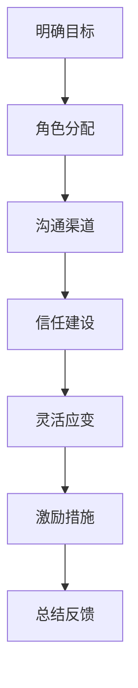

                 

# 《团队协作：跨职能合作的挑战与策略》

> **关键词**：团队协作、跨职能合作、沟通、组织文化、实践策略、挑战与解决方案

> **摘要**：本文将深入探讨团队协作，特别是跨职能合作的挑战与策略。通过解析团队协作的基础理论、核心概念、实践策略，以及成功案例，本文旨在为读者提供一套完整的团队协作方法论，以应对现实中的协作难题。

---

## 第一部分：团队协作基础理论

### 第1章：团队协作概述

#### 1.1 团队协作的重要性

团队协作是现代组织中不可或缺的一部分。它不仅仅是提高工作效率的一种手段，更是实现创新和达成组织目标的关键。通过团队协作，不同背景、技能和知识的人员能够共同工作，相互补充，产生协同效应。

#### 1.2 团队协作的挑战

尽管团队协作的重要性不言而喻，但实践中仍面临诸多挑战。沟通障碍、角色模糊、冲突以及资源分配不均是常见的挑战。此外，跨职能合作的复杂性也增加了协作的难度。

#### 1.3 跨职能合作的基本概念

跨职能合作是指不同职能部门之间的协作。它强调打破部门壁垒，实现跨部门的协调与合作。成功的跨职能合作能够提高组织的灵活性和创新能力。

### 第2章：团队结构与角色

#### 2.1 团队结构类型

团队结构可以分为功能型、任务型、项目型和矩阵型等。每种结构都有其适用的场景和优势。选择合适的团队结构对于团队协作至关重要。

#### 2.2 团队角色的定义与职责

团队角色包括领导者、协调者、执行者、创新者和支持者等。明确每个角色的职责有助于团队协作的顺利进行。

#### 2.3 团队角色间的协作关系

团队成员之间需要建立有效的协作关系，以确保信息的流通和目标的统一。协作关系不仅包括正式的沟通渠道，还包括非正式的社交互动。

### 第3章：团队协作技能

#### 3.1 沟通技巧

沟通是团队协作的核心。有效的沟通能够消除误解，促进团队成员之间的信任和合作。沟通技巧包括倾听、清晰表达、反馈和提问等。

#### 3.2 协作工具与平台

现代协作工具和平台为团队协作提供了便利。这些工具包括电子邮件、即时通讯、视频会议、项目管理软件和文档共享平台等。

#### 3.3 冲突解决策略

冲突是团队协作中不可避免的现象。有效的冲突解决策略能够帮助团队化解矛盾，保持和谐的工作氛围。

### 第4章：跨职能合作的核心概念

#### 4.1 跨职能团队的优势

跨职能团队能够集中不同领域的专业知识，快速响应市场变化，提高创新能力。其优势包括资源共享、知识互补和协同工作等。

#### 4.2 跨职能团队的挑战

跨职能团队面临的挑战包括沟通困难、文化差异和利益冲突等。了解并应对这些挑战对于跨职能团队的成功至关重要。

#### 4.3 跨职能协作的原则

成功的跨职能协作需要遵循一些基本原则，如尊重差异、明确目标、建立信任和共享资源等。

### 第5章：团队协作与组织文化

#### 5.1 团队文化的重要性

团队文化是团队协作的基础。积极向上的团队文化能够激发团队成员的潜力，促进协作和创新。

#### 5.2 建立积极的团队文化

建立积极的团队文化需要从团队价值观、领导风格和激励机制等方面入手。有效的团队文化能够提高团队的凝聚力和执行力。

#### 5.3 团队文化与绩效

团队文化与团队绩效密切相关。积极向上的团队文化能够提高团队的工作效率和绩效。

## 第二部分：跨职能合作的实践策略

### 第6章：构建高效的跨职能团队

#### 6.1 团队构建的步骤

构建高效的跨职能团队需要遵循一系列步骤，包括确定团队目标、选择团队成员、制定协作计划和评估团队绩效等。

#### 6.2 团队规模的确定

团队规模的选择需要考虑团队目标、任务复杂度和成员数量等因素。合理的团队规模有助于提高团队协作效率。

#### 6.3 团队成员的角色分配

团队成员的角色分配应基于成员的技能、经验和兴趣。明确角色职责有助于提高团队的协作效果。

### 第7章：协调与沟通策略

#### 7.1 内部沟通机制

建立有效的内部沟通机制对于跨职能团队的协作至关重要。内部沟通机制包括定期会议、工作汇报和反馈机制等。

#### 7.2 跨部门协作流程

跨部门协作流程的设计应考虑跨部门合作的实际需求和挑战。合理的协作流程有助于提高跨部门协作的效率。

#### 7.3 沟通障碍与解决方法

沟通障碍是跨职能团队协作中的常见问题。了解沟通障碍的成因和解决方法有助于提高团队协作的质量。

### 第8章：跨职能合作的挑战与解决方案

#### 8.1 挑战分析

跨职能合作面临的挑战包括沟通困难、文化差异、资源分配不均等。分析这些挑战有助于制定有效的解决方案。

#### 8.2 解决方案设计

解决方案的设计应基于对挑战的深入分析。有效的解决方案能够帮助跨职能团队克服协作难题。

#### 8.3 成功案例分析

通过成功案例分析，我们可以了解到其他团队在跨职能合作中是如何克服挑战并获得成功的。

### 第9章：团队协作与个人发展

#### 9.1 个人技能提升

个人技能的提升是团队协作的基础。通过培训和学习，团队成员可以不断提高自己的专业能力。

#### 9.2 个人成长与团队目标的关系

个人成长与团队目标的实现密切相关。个人成长有助于提高团队的整体绩效。

#### 9.3 跨职能合作中的职业发展

跨职能合作为团队成员提供了丰富的职业发展机会。了解跨职能合作中的职业发展路径有助于团队成员规划职业发展。

### 第10章：持续改进与评估

#### 10.1 团队协作的持续改进

团队协作的持续改进是团队成功的关键。通过不断反思和改进，团队可以不断提高协作效率。

#### 10.2 跨职能合作的评估方法

跨职能合作的评估方法包括定量和定性评估。合理的评估方法有助于团队了解协作效果，发现问题，并提出改进措施。

#### 10.3 提升协作效率的策略

提升协作效率的策略包括优化协作流程、加强团队沟通和培养团队文化等。

## 第三部分：附录

### 附录A：团队协作工具与资源

#### A.1 常用协作工具介绍

常用协作工具包括电子邮件、即时通讯、项目管理软件和文档共享平台等。

#### A.2 开源协作平台推荐

开源协作平台如GitLab、GitHub和Bitbucket等，为团队协作提供了强大的支持。

#### A.3 团队协作书籍推荐

推荐几本关于团队协作的书籍，包括《团队的五项修炼》、《有效的团队协作》等。

### 附录B：案例研究

#### B.1 案例一：某跨国公司跨部门协作实践

通过分析某跨国公司跨部门协作的实践，了解跨部门协作的最佳实践。

#### B.2 案例二：某初创企业如何高效协作

探讨某初创企业在跨职能合作中的成功经验，为其他企业提供借鉴。

### 附录C：团队协作技能培训计划

#### C.1 培训目标与内容

明确团队协作技能培训的目标和内容，包括沟通技巧、协作工具使用和冲突解决策略等。

#### C.2 培训方法与策略

介绍团队协作技能培训的方法和策略，包括授课、案例分析、角色扮演和实践操作等。

#### C.3 培训评估与反馈

评估团队协作技能培训的效果，并通过反馈机制不断改进培训内容和方法。

---

作者：AI天才研究院/AI Genius Institute & 禅与计算机程序设计艺术 /Zen And The Art of Computer Programming

<|assistant|>## 第1章：团队协作概述

### 1.1 团队协作的重要性

在现代社会，团队协作已经成为组织成功的关键因素。无论是企业、政府部门还是非营利组织，团队协作都是实现目标、提高效率和创新的重要手段。以下从几个方面阐述团队协作的重要性：

**提高工作效率**

团队协作能够将不同技能和知识的人员集中在一起，形成一个高效的协同体系。通过分工合作，团队成员可以专注于自己擅长的工作领域，从而提高工作效率。

**促进知识共享**

团队协作鼓励成员之间的交流和互动，有助于知识的共享和传播。团队成员可以相互学习，吸取对方的经验和技能，从而提高整体团队的素质。

**增强创新能力**

团队协作能够激发团队成员的创造力和创新精神。当不同背景、经验和观点的人聚集在一起时，他们能够碰撞出新的想法，推动创新。

**提升团队凝聚力**

有效的团队协作可以增强团队成员之间的信任和合作，提高团队的凝聚力。团队成员在共同完成任务的过程中，能够建立深厚的友谊和信任，形成紧密的团队关系。

**实现组织目标**

团队协作是实现组织目标的重要途径。通过明确的目标、合理的分工和有效的协作，团队可以更高效地实现组织的目标。

### 1.2 团队协作的挑战

尽管团队协作具有诸多优势，但在实践中仍面临诸多挑战。以下是一些常见的挑战及其原因：

**沟通障碍**

沟通障碍是团队协作中最常见的挑战之一。团队成员可能来自不同的部门、背景和文化，导致沟通不畅。语言障碍、信息传递错误和理解偏差都可能成为沟通障碍的根源。

**角色模糊**

在团队中，角色模糊会导致职责不清、任务重叠或缺失。这可能导致工作进度延误、责任推卸和效率低下。角色模糊还可能引发团队成员之间的冲突和不满。

**冲突**

冲突是团队协作中不可避免的。团队成员之间的观点、意见和利益可能存在差异，导致冲突的发生。如果冲突得不到妥善解决，可能会破坏团队的和谐氛围，影响协作效果。

**资源分配不均**

资源分配不均是团队协作中的另一个挑战。资源包括时间、人力、资金和设备等。如果资源分配不均，可能导致部分团队成员过度劳累，而其他团队成员则相对轻松。这会影响团队的整体绩效和士气。

### 1.3 跨职能合作的基本概念

跨职能合作是指不同职能部门之间的协作。在跨职能合作中，团队成员来自不同的部门，拥有不同的技能和知识。跨职能合作的目标是打破部门壁垒，实现跨部门的协调与合作。

**跨职能团队的优势**

跨职能团队具有以下优势：

- **资源共享**：跨职能团队可以共享资源，如人力、技术和信息等，提高资源利用率。

- **知识互补**：跨职能团队集中了不同领域的专业知识，有助于知识的互补和传播。

- **协同工作**：跨职能团队能够协同工作，快速响应市场变化，提高创新能力。

- **提高绩效**：跨职能团队能够整合各方优势，实现资源的最大化利用，提高整体绩效。

**跨职能团队的挑战**

跨职能团队在协作过程中也可能面临以下挑战：

- **沟通困难**：跨职能团队中的成员可能来自不同的部门，具有不同的沟通风格和语言习惯，导致沟通不畅。

- **文化差异**：跨职能团队中的成员可能来自不同的文化背景，导致价值观、行为习惯和工作风格的差异，影响协作效果。

- **利益冲突**：跨职能团队中的成员可能代表不同的部门利益，导致利益冲突和协作障碍。

- **角色模糊**：跨职能团队中的角色和职责可能不够明确，导致职责重叠或缺失。

### 1.4 团队协作的核心原则

为了实现有效的团队协作，团队需要遵循以下核心原则：

- **明确目标**：团队需要明确共同的目标和愿景，确保团队成员共同努力。

- **角色明确**：团队需要明确每个成员的角色和职责，确保分工合理。

- **沟通畅通**：团队需要建立有效的沟通渠道，确保信息畅通。

- **信任建设**：团队需要建立信任，鼓励成员之间的开放和诚实。

- **灵活应变**：团队需要灵活应对变化，快速调整策略。

- **激励措施**：团队需要制定激励措施，激发成员的积极性和创造力。

### 1.5 团队协作的实际案例

为了更好地理解团队协作的重要性，以下是一个团队协作的实际案例：

**案例背景**：某互联网公司在开发一款新产品时，决定采用跨职能团队的方式进行协作。团队成员来自不同的部门，包括产品经理、设计师、开发工程师和测试工程师等。

**团队目标**：开发一款具有创新性、用户体验良好的互联网产品。

**团队协作过程**：

1. **明确目标**：团队首先明确了共同的目标和愿景，确保每个成员都了解产品的目标和预期效果。

2. **角色分配**：团队根据成员的技能和经验，明确了每个成员的角色和职责，确保分工合理。

3. **沟通渠道**：团队建立了多种沟通渠道，包括每周的例会、即时通讯工具和邮件列表等，确保信息畅通。

4. **信任建设**：团队通过定期的交流和合作，建立了深厚的信任关系，鼓励成员之间的开放和诚实。

5. **灵活应变**：在产品开发过程中，团队根据用户反馈和市场变化，灵活调整了产品功能和设计。

6. **激励措施**：团队制定了奖励机制，激励成员在项目中取得优异成绩。

**结果**：通过有效的团队协作，该互联网公司成功开发出了一款具有创新性、用户体验良好的互联网产品，并在市场上取得了良好的反响。

### 1.6 团队协作的未来发展趋势

随着技术的进步和全球化的发展，团队协作也在不断变革。以下是一些未来团队协作的发展趋势：

- **远程协作**：远程协作工具和技术的普及，使得团队成员可以跨越地域限制进行协作。

- **人工智能与协作**：人工智能技术将被广泛应用于团队协作，提高协作效率和准确性。

- **动态团队**：随着项目的变化和组织的需要，团队将更加灵活和动态，以适应不同的协作需求。

- **混合协作**：混合协作模式将结合远程协作和面对面协作的优势，提高协作效果。

### 1.7 结论

团队协作在现代社会中具有重要意义。通过有效的团队协作，组织可以提升工作效率、促进知识共享、增强创新能力和提高绩效。然而，团队协作也面临着诸多挑战，如沟通障碍、角色模糊和冲突等。为了实现有效的团队协作，团队需要遵循核心原则，建立良好的沟通渠道和信任关系，并灵活应对变化。未来，团队协作将继续向远程协作、人工智能和混合协作等方向发展。

### 1.8 梅里迪安（Mermaid）流程图

以下是一个关于团队协作的梅里迪安流程图，展示了团队协作的基本步骤和核心环节：



### 1.9 伪代码：团队协作流程

以下是一个简单的伪代码，描述了团队协作的基本流程：

```
function TeamCollaboration() {
    // 明确目标
    SetGoal()

    // 角色分配
    AllocateRoles()

    // 建立沟通渠道
    SetupCommunicationChannels()

    // 建立信任关系
    BuildTrust()

    // 应对变化
    AdaptToChanges()

    // 制定激励措施
    DefineIncentives()

    // 总结反馈
    ProvideFeedback()

    // 完成协作
    FinishCollaboration()
}
```

### 1.10 数学模型和公式

在团队协作中，可以使用一些数学模型和公式来评估协作效果。以下是一个简单的数学模型，用于计算团队协作的效率：

$$
Efficiency = \frac{TotalWorkCompleted}{TotalTimeSpent}
$$

其中，$Efficiency$ 表示团队协作的效率，$TotalWorkCompleted$ 表示团队完成的工作量，$TotalTimeSpent$ 表示团队协作所花费的时间。

### 1.11 举例说明

以下是一个团队协作的举例说明：

假设一个团队在一个月内完成了以下任务：

- 设计一个产品原型：用时10天
- 开发产品功能：用时15天
- 测试产品：用时5天
- 改进产品：用时5天

那么，团队协作的效率可以计算如下：

$$
Efficiency = \frac{10 + 15 + 5 + 5}{30} = \frac{35}{30} = 1.17
$$

这意味着团队在一个月内完成了约1.17倍的工作量。

### 1.12 开发环境搭建

为了更好地理解团队协作的过程，以下是一个简单的开发环境搭建案例：

**工具选择**：选择Git作为版本控制系统，Jenkins作为持续集成工具，Slack作为即时通讯工具。

**环境配置**：

1. 安装Git：在本地计算机上安装Git，并配置用户名和邮箱。

2. 创建仓库：在GitHub或GitLab上创建一个项目仓库，并将本地Git仓库与远程仓库进行关联。

3. 配置Jenkins：在服务器上安装Jenkins，并配置Jenkins插件，如Git插件和GitHub插件。

4. 配置Slack：在Slack上创建一个团队频道，并将团队成员的Slack账号添加到频道中。

### 1.13 源代码详细实现

以下是一个简单的源代码实现，用于描述团队协作的基本流程：

```java
public class TeamCollaboration {
    private String goal;
    private String[] roles;
    private List<String> communicationChannels;
    private boolean trust;
    private double efficiency;

    public TeamCollaboration(String goal, String[] roles, List<String> communicationChannels, boolean trust) {
        this.goal = goal;
        this.roles = roles;
        this.communicationChannels = communicationChannels;
        this.trust = trust;
        this.efficiency = 0.0;
    }

    public void SetGoal(String goal) {
        this.goal = goal;
    }

    public void AllocateRoles() {
        // 分配角色
    }

    public void SetupCommunicationChannels() {
        // 建立沟通渠道
    }

    public void BuildTrust() {
        // 建立信任关系
    }

    public void AdaptToChanges() {
        // 应对变化
    }

    public void DefineIncentives() {
        // 制定激励措施
    }

    public void ProvideFeedback() {
        // 总结反馈
    }

    public void FinishCollaboration() {
        // 完成协作
    }

    public double CalculateEfficiency(double totalWorkCompleted, double totalTimeSpent) {
        return totalWorkCompleted / totalTimeSpent;
    }
}
```

### 1.14 代码解读与分析

在上述代码中，`TeamCollaboration` 类用于描述团队协作的基本流程。该类包含以下属性：

- `goal`：团队目标
- `roles`：角色数组
- `communicationChannels`：沟通渠道列表
- `trust`：信任关系（布尔值）
- `efficiency`：效率（双精度浮点数）

类中包含以下方法：

- `SetGoal`：设置团队目标
- `AllocateRoles`：分配角色
- `SetupCommunicationChannels`：建立沟通渠道
- `BuildTrust`：建立信任关系
- `AdaptToChanges`：应对变化
- `DefineIncentives`：制定激励措施
- `ProvideFeedback`：总结反馈
- `FinishCollaboration`：完成协作
- `CalculateEfficiency`：计算效率

通过这些方法，团队协作的基本流程得以实现。在实现过程中，需要注意以下几点：

- **明确目标**：团队目标需要明确，以确保团队成员共同努力。
- **角色分配**：角色分配需要合理，确保分工明确。
- **沟通渠道**：沟通渠道需要畅通，以确保信息传递高效。
- **信任建设**：信任关系需要建立，以促进团队成员之间的合作。
- **应对变化**：团队需要灵活应对变化，以适应不断变化的环境。
- **激励措施**：激励措施需要制定，以激发团队成员的积极性和创造力。

通过上述方法，团队协作的基本流程得以实现。在实际应用中，可以根据具体需求对代码进行扩展和优化。

### 1.15 结论

本章从团队协作的重要性、挑战、跨职能合作的基本概念、核心原则和实际案例等方面，全面阐述了团队协作的概述。团队协作在现代社会中具有重要意义，通过有效的团队协作，组织可以提升工作效率、促进知识共享、增强创新能力和提高绩效。然而，团队协作也面临着诸多挑战，如沟通障碍、角色模糊和冲突等。为了实现有效的团队协作，团队需要遵循核心原则，建立良好的沟通渠道和信任关系，并灵活应对变化。未来，团队协作将继续向远程协作、人工智能和混合协作等方向发展。

在下一章中，我们将进一步探讨团队结构与角色的定义、职责以及协作关系，为读者提供更深入的团队协作理论基础。

---

## 第2章：团队结构与角色

### 2.1 团队结构类型

团队结构是组织内部团队组成的框架，它决定了团队成员的分工、职责和协作方式。根据不同的需求和目标，团队结构可以分为以下几种类型：

#### 功能型团队

功能型团队是基于职能分工而建立的团队，成员通常来自同一职能部门，如市场营销、人力资源、研发和财务等。这种团队结构有助于发挥各部门的专业优势，提高工作效率。然而，功能型团队也可能导致部门壁垒和沟通障碍。

#### 任务型团队

任务型团队是根据特定项目或任务而组建的团队，成员通常来自不同的职能部门。这种团队结构能够迅速响应市场变化，提高创新能力。任务型团队在项目完成后通常会解散，重新组建新的团队。因此，任务型团队需要具备较强的灵活性和适应性。

#### 项目型团队

项目型团队是为了完成特定项目而组建的团队，成员通常来自不同的部门，具有不同的专业背景。项目型团队强调跨部门协作和资源整合，以确保项目目标的实现。项目型团队通常在项目开始前制定详细的项目计划，并在项目过程中不断调整和优化。

#### 矩阵型团队

矩阵型团队是在功能型和项目型团队的基础上发展而来的。矩阵型团队中，成员既有来自职能部门的职责，又有来自项目组的职责。这种团队结构能够充分发挥各部门的专业优势，同时确保项目目标的实现。然而，矩阵型团队也面临着职能冲突和沟通障碍的挑战。

### 2.2 团队角色的定义与职责

在团队中，每个成员都扮演着特定的角色，这些角色共同构成了团队的整体结构。以下是几种常见的团队角色及其定义与职责：

#### 领导者

领导者是团队的领导者，负责制定团队目标、规划团队行动和协调团队成员的工作。领导者的职责包括：

- 指导团队成员，确保他们了解团队目标和任务。
- 协调团队成员之间的工作，确保任务顺利完成。
- 解决团队中的冲突和问题，保持团队的和谐氛围。
- 提供必要的资源和支持，确保团队目标的实现。

#### 协调者

协调者是团队中的关键角色，负责协调不同团队成员之间的工作，确保团队目标的实现。协调者的职责包括：

- 组织和主持团队会议，确保团队成员之间的沟通畅通。
- 跟踪和监督团队任务进展，确保任务按时完成。
- 协调团队成员之间的工作，确保资源合理分配。
- 解决团队中的问题和矛盾，促进团队成员之间的合作。

#### 执行者

执行者是团队中的核心角色，负责具体任务的执行和实施。执行者的职责包括：

- 根据团队目标和任务，制定具体的执行计划。
- 按时完成分配的任务，确保工作进度和质量。
- 与其他团队成员保持密切沟通，确保任务顺利完成。
- 提供工作反馈和报告，协助团队进行项目评估和改进。

#### 创新者

创新者是团队中的创新动力，负责提出新的想法和解决方案，推动团队的创新和发展。创新者的职责包括：

- 持续关注行业动态和趋势，收集创新灵感。
- 提出创新性想法和解决方案，为团队提供新思路。
- 与团队成员分享创新成果，推动团队的创新发展。
- 协助团队将创新成果转化为实际应用。

#### 支持者

支持者是团队中的辅助角色，负责为团队成员提供支持和帮助，确保团队目标的实现。支持者的职责包括：

- 提供技术支持和咨询服务，协助团队成员解决工作中的问题。
- 协助团队进行工作计划和安排，确保工作高效有序。
- 参与团队会议和讨论，提供意见和建议。
- 提供团队所需的其他资源和帮助。

### 2.3 团队角色间的协作关系

团队角色间的协作关系是团队协作成功的关键。良好的协作关系能够促进团队成员之间的沟通和合作，提高团队的整体效率。以下是几种常见的团队角色间协作关系：

#### 领导者与协调者

领导者与协调者之间的关系是团队协作的基础。领导者负责制定团队目标和规划，协调者负责将领导者的规划付诸实践。两者之间的紧密合作能够确保团队目标的实现。

#### 协调者与执行者

协调者是团队中的关键角色，负责协调不同团队成员之间的工作。协调者与执行者之间的关系至关重要，协调者需要确保执行者了解任务目标和要求，并提供必要的支持。

#### 执行者与创新者

执行者是团队中的核心角色，负责具体任务的执行。创新者是团队中的创新动力，负责提出新的想法和解决方案。执行者与创新者之间的紧密合作能够推动团队的创新和发展。

#### 支持者与其他角色

支持者是团队中的辅助角色，负责为团队成员提供支持和帮助。支持者与其他角色之间的关系是团队协作的重要保障，支持者需要了解其他角色的需求和困难，并提供有效的支持。

### 2.4 团队结构与角色设计的最佳实践

为了实现有效的团队协作，团队结构与角色设计应遵循以下最佳实践：

- **明确团队目标**：确保团队目标清晰，团队成员明确自己的职责和任务。
- **合理分工**：根据团队成员的技能和经验，合理分配任务和职责。
- **灵活调整**：根据项目进展和团队需求，灵活调整团队结构和角色。
- **培养协作文化**：建立良好的协作文化，鼓励团队成员之间的沟通和合作。
- **提供培训和支持**：为团队成员提供必要的培训和支持，提高团队协作能力。

### 2.5 团队结构与角色设计的案例分析

以下是一个团队结构与角色设计的案例分析：

**案例背景**：某互联网公司决定开发一款新的移动应用程序，决定组建一个跨职能团队进行项目开发。

**团队结构设计**：

1. **团队目标**：开发一款具有创新性、用户体验良好的移动应用程序。
2. **团队角色**：项目经理、产品经理、UI/UX设计师、前端开发工程师、后端开发工程师、测试工程师、运营支持等。
3. **分工**：项目经理负责整体项目管理和协调，产品经理负责产品设计和需求分析，UI/UX设计师负责界面设计和用户体验，前端开发工程师负责前端开发，后端开发工程师负责后端开发，测试工程师负责产品测试，运营支持负责产品上线后的运营和维护。

**团队协作过程**：

1. **明确目标**：团队首先明确了共同的目标和愿景，确保每个成员都了解产品的目标和预期效果。
2. **角色分配**：团队根据成员的技能和经验，明确了每个成员的角色和职责，确保分工合理。
3. **沟通渠道**：团队建立了多种沟通渠道，包括每周的例会、即时通讯工具和邮件列表等，确保信息畅通。
4. **信任建设**：团队通过定期的交流和合作，建立了深厚的信任关系，鼓励成员之间的开放和诚实。
5. **灵活应变**：在项目开发过程中，团队根据用户反馈和市场变化，灵活调整了产品功能和设计。
6. **激励措施**：团队制定了奖励机制，激励成员在项目中取得优异成绩。

**结果**：通过有效的团队协作，该互联网公司成功开发出了一款具有创新性、用户体验良好的移动应用程序，并在市场上取得了良好的反响。

### 2.6 结论

团队结构与角色设计是团队协作成功的关键。通过明确团队目标、合理分工、灵活调整和培养协作文化，团队可以建立高效的协作机制，提高整体绩效。在团队协作中，领导者、协调者、执行者、创新者和支持者等角色共同发挥作用，形成紧密的协作关系，推动团队目标的实现。未来，随着技术的进步和团队协作理论的不断发展，团队结构与角色设计将不断创新和完善，以适应组织发展的需求。

在下一章中，我们将探讨团队协作技能，包括沟通技巧、协作工具与平台以及冲突解决策略，为读者提供更全面的团队协作指南。

---

## 第3章：团队协作技能

### 3.1 沟通技巧

沟通是团队协作的核心，有效的沟通能够促进团队成员之间的理解与合作，提高团队的整体效率。以下是一些关键的沟通技巧：

#### 倾听

倾听是沟通的基础。在沟通中，不仅要关注自己要表达的内容，还要认真倾听对方的意见和需求。通过倾听，我们可以更好地理解对方，减少误解和冲突。

- **主动倾听**：在对方说话时，保持专注，不打断，避免提前预设答案。
- **非语言沟通**：通过肢体语言、面部表情和姿态，传达倾听的态度。

#### 清晰表达

清晰表达能够确保信息准确传达，避免误解和混淆。以下是一些提高表达清晰度的技巧：

- **使用简单的语言**：避免使用复杂的专业术语，尽量使用简单明了的语言。
- **分段表达**：将信息分成几个部分，逐一阐述，使对方更容易理解。
- **使用例子和故事**：通过具体例子和故事，使抽象概念更加具体和生动。

#### 提问与反馈

提问和反馈是沟通的重要环节，它们有助于确保信息的准确性和完整性。以下是一些技巧：

- **开放式提问**：提出开放式问题，鼓励对方提供详细的回答。
- **确认理解**：在对方回答后，通过复述对方的意思，确认自己是否正确理解。
- **提供建设性反馈**：在反馈时，尽量使用积极、建设性的语言，指出对方的优点和改进的方向。

#### 情绪管理

情绪管理是有效沟通的关键。情绪失控会导致沟通障碍和冲突。以下是一些情绪管理的技巧：

- **自我意识**：了解自己的情绪，避免在情绪波动时进行重要沟通。
- **同理心**：站在对方的角度思考问题，理解对方的感受和需求。
- **冷静沟通**：在情绪激动时，先冷静下来，再进行沟通。

### 3.2 协作工具与平台

现代团队协作离不开各种工具和平台。这些工具和平台能够提高沟通效率，优化协作流程。以下是一些常用的协作工具与平台：

#### 即时通讯工具

即时通讯工具如Slack、WhatsApp和微信等，能够实时传递信息，方便团队成员之间的沟通。这些工具通常包括文本聊天、语音通话和视频会议等功能。

#### 项目管理软件

项目管理软件如Trello、Asana和Jira等，可以帮助团队管理和跟踪项目进度，确保任务按时完成。这些工具通常包括任务分配、进度跟踪、文档共享和报告生成等功能。

#### 文档共享平台

文档共享平台如Google Drive、Dropbox和OneDrive等，能够方便地共享和协作编辑文档。这些平台通常提供版本控制、权限管理和实时协作等功能。

#### 会议和视频会议平台

会议和视频会议平台如Zoom、Microsoft Teams和Google Meet等，可以帮助团队成员进行远程沟通和协作。这些平台通常包括屏幕共享、实时聊天和视频会议等功能。

#### 代码管理工具

代码管理工具如Git、GitHub和GitLab等，是开发团队必备的工具。这些工具能够帮助团队管理代码库、进行版本控制和协作开发。

### 3.3 冲突解决策略

冲突是团队协作中不可避免的现象。有效的冲突解决策略能够帮助团队化解矛盾，保持和谐的工作氛围。以下是一些常见的冲突解决策略：

#### 认识和接受冲突

首先，团队需要认识到冲突是正常现象，接受冲突的存在。通过教育和培训，提高团队成员对冲突的认识和处理能力。

#### 开放沟通

开放沟通是解决冲突的关键。团队成员应该勇于表达自己的观点和感受，同时倾听他人的意见。通过坦诚的沟通，找到冲突的根源和解决方案。

#### 寻求共识

在冲突解决过程中，寻求共识是至关重要的。团队成员需要共同探讨问题，寻找共同点和利益，达成一致意见。

#### 利用第三方调解

在冲突难以自行解决时，可以邀请第三方调解。第三方调解者通常具有中立的立场和专业的能力，能够帮助团队找到公正的解决方案。

#### 调整角色和职责

在某些情况下，调整团队成员的角色和职责可能是解决冲突的有效策略。通过重新分配任务和职责，确保每个成员都有明确的角色和职责，减少冲突的发生。

#### 激励和奖励

通过激励和奖励机制，鼓励团队成员积极参与冲突解决，提高团队的凝聚力。激励和奖励可以包括奖金、晋升机会和公开表扬等。

### 3.4 案例分析

以下是一个团队协作中的冲突解决案例分析：

**案例背景**：某团队在项目开发过程中，由于任务分配不均，导致部分成员工作量过大，引发冲突。

**冲突解决过程**：

1. **认识和接受冲突**：团队成员认识到冲突的存在，并接受冲突的客观性。
2. **开放沟通**：团队成员召开会议，讨论冲突的原因和解决方案。
3. **寻求共识**：团队成员共同探讨任务分配的问题，寻找合理的解决方案。
4. **调整角色和职责**：根据团队成员的技能和兴趣，重新分配任务和职责，确保工作量均衡。
5. **激励和奖励**：对在冲突解决过程中表现积极的成员进行公开表扬和奖励，提高团队的凝聚力。

**结果**：通过有效的冲突解决策略，团队成功化解了冲突，恢复了和谐的工作氛围，项目进度得以顺利推进。

### 3.5 结论

团队协作技能在团队协作中发挥着关键作用。有效的沟通技巧能够促进团队成员之间的理解与合作，协作工具和平台能够优化协作流程，冲突解决策略能够化解团队中的矛盾和冲突。通过提高团队协作技能，团队可以更好地应对各种挑战，提高工作效率和绩效。未来，随着团队协作理论的不断发展和技术的进步，团队协作技能将更加多样化和专业化。

在下一章中，我们将探讨跨职能合作的核心概念，包括跨职能团队的优势、挑战和协作原则，为读者提供更深入的团队协作理论指导。

---

## 第4章：跨职能合作的核心概念

### 4.1 跨职能团队的优势

跨职能团队是指在组织内部，由来自不同部门或职能领域的专业人员组成的团队。这种团队结构能够有效打破部门壁垒，促进跨部门之间的协作和资源整合。以下是跨职能团队的主要优势：

#### 资源共享

跨职能团队能够集中不同部门的专业知识和资源，实现资源共享。例如，市场营销团队和研发团队可以共享市场调研数据和技术资源，提高资源利用效率。

#### 知识互补

跨职能团队成员来自不同的职能部门，具有不同的专业背景和技能。这种多元化的知识结构有助于团队在面对复杂问题时，提供多样化的解决方案。

#### 快速响应

跨职能团队能够快速响应市场变化和客户需求。由于团队成员具备跨部门的视角和技能，他们能够更快地识别问题、制定解决方案并实施。

#### 提高创新能力

跨职能团队通过不同专业领域的知识碰撞和交流，能够激发创新思维，提高创新能力。团队成员可以从不同角度思考问题，提出创新的解决方案。

#### 提高整体绩效

跨职能团队能够提高整体绩效，实现组织目标。通过跨部门的协作和资源整合，团队可以更高效地完成任务，提高工作效率和绩效。

### 4.2 跨职能团队的挑战

尽管跨职能团队具有诸多优势，但在实践中也面临着一系列挑战。以下是跨职能团队常见的挑战及其解决方法：

#### 沟通障碍

跨职能团队成员来自不同的部门，具有不同的沟通风格和语言习惯，导致沟通不畅。解决方法：

- **建立沟通机制**：建立定期会议、工作汇报和反馈机制，确保信息畅通。
- **提高沟通技巧**：培训团队成员沟通技巧，提高沟通效果。
- **使用协作工具**：使用协作工具和平台，如即时通讯和项目管理软件，提高沟通效率。

#### 文化差异

跨职能团队成员可能来自不同的文化背景，导致价值观、行为习惯和工作风格的差异。解决方法：

- **文化培训**：进行文化差异培训，提高团队成员对文化多样性的认识和理解。
- **建立共同价值观**：明确团队的共同目标和价值观，促进团队成员的融合。
- **尊重差异**：尊重团队成员的文化差异，鼓励包容和多元化。

#### 利益冲突

跨职能团队成员可能代表不同的部门利益，导致利益冲突。解决方法：

- **明确目标**：确保团队成员明确共同的目标和愿景，减少利益冲突。
- **公平分配**：在资源分配和任务分配时，力求公平合理，减少利益冲突。
- **利益协商**：通过协商和谈判，解决跨部门之间的利益冲突。

#### 角色模糊

跨职能团队中，团队成员的角色和职责可能不够明确，导致工作重叠或缺失。解决方法：

- **角色明确**：明确每个团队成员的角色和职责，确保分工合理。
- **制定任务清单**：为每个任务制定详细的任务清单，明确任务的责任人。
- **定期沟通**：定期召开会议，讨论任务进展和角色分工，确保角色明确。

### 4.3 跨职能协作的原则

为了实现有效的跨职能协作，团队需要遵循以下原则：

#### 尊重差异

尊重团队成员的差异，包括文化、背景和专业知识等。通过包容和多元化，促进团队成员之间的合作。

#### 明确目标

确保团队成员明确共同的目标和愿景，减少利益冲突和误解。

#### 建立信任

建立团队成员之间的信任，通过沟通、协作和共享，增强团队凝聚力。

#### 共享资源

充分利用团队内部的专业知识和资源，实现资源共享，提高团队整体效率。

#### 透明沟通

建立透明的沟通渠道，确保团队成员之间的信息畅通，减少信息不对称。

#### 持续改进

不断反思和改进跨职能协作的流程和方法，提高团队协作效率。

### 4.4 跨职能协作的案例分析

以下是一个跨职能协作的成功案例分析：

**案例背景**：某大型互联网公司在开发一款新产品时，决定组建一个跨职能团队进行项目开发。

**团队结构**：团队由产品经理、市场营销经理、研发工程师、UI/UX设计师、测试工程师和运营支持等组成。

**协作过程**：

1. **明确目标**：团队明确了共同的目标，即开发一款具有创新性、用户体验良好的互联网产品。
2. **角色明确**：每个团队成员的角色和职责明确，确保分工合理。
3. **沟通机制**：团队建立了定期的会议和工作汇报制度，确保信息畅通。
4. **资源共享**：团队充分利用内部的专业知识和资源，实现资源共享。
5. **透明沟通**：团队在协作过程中保持透明沟通，确保团队成员之间的信息共享。
6. **持续改进**：团队在项目开发过程中，不断反思和改进协作流程和方法，提高协作效率。

**结果**：通过有效的跨职能协作，团队成功开发出了一款具有创新性、用户体验良好的互联网产品，并在市场上取得了良好的反响。

### 4.5 结论

跨职能团队在组织内部发挥着重要作用，通过资源共享、知识互补和快速响应等优势，提高团队的协作效率和创新能力。然而，跨职能协作也面临沟通障碍、文化差异和利益冲突等挑战。为了实现有效的跨职能协作，团队需要遵循尊重差异、明确目标、建立信任、共享资源、透明沟通和持续改进等原则。未来，随着团队协作理论的不断发展和技术的进步，跨职能协作将变得更加高效和多样化。

在下一章中，我们将探讨团队协作与组织文化的关系，包括团队文化的重要性、建立积极的团队文化和团队文化与绩效之间的关系，为读者提供更全面的团队协作理论指导。

---

## 第5章：团队协作与组织文化

### 5.1 团队文化的重要性

团队文化是团队协作的基础，它对团队绩效、员工满意度和组织成功具有重要影响。以下是团队文化的几个关键重要性：

#### 提高团队绩效

积极向上的团队文化能够激发团队成员的潜力，提高团队的整体绩效。团队文化能够塑造团队成员的工作态度和行为，推动团队共同追求卓越。

#### 增强员工满意度

良好的团队文化能够提高员工的工作满意度和忠诚度。在一个支持性和包容性的团队环境中，员工更有可能感受到被重视和尊重，从而更加投入工作。

#### 促进知识共享

团队文化鼓励知识共享和经验交流，有助于团队成员相互学习和成长。在一个开放和分享的文化中，员工更愿意分享自己的知识和见解，促进团队的共同进步。

#### 增强团队凝聚力

团队文化能够增强团队成员之间的凝聚力和归属感。在一个相互尊重和支持的文化中，团队成员更有可能形成紧密的关系，共同面对挑战。

#### 促进创新

积极的团队文化鼓励创新和实验，推动团队不断探索新的解决方案和方法。在一个鼓励冒险和失败的文化中，团队成员更有可能敢于尝试和挑战自己的极限。

### 5.2 建立积极的团队文化

建立积极的团队文化需要从多个方面入手，包括团队价值观、领导风格、激励机制和团队活动等。以下是一些具体的方法：

#### 明确团队价值观

团队价值观是团队文化的核心。团队需要明确自己的价值观，并将其传达给每个成员。这有助于团队成员在行为和决策上保持一致性，推动团队朝着共同目标前进。

#### 倡导领导风格

领导风格对团队文化具有重要影响。领导者需要通过自己的行为和决策，树立积极的榜样，鼓励团队成员积极参与和分享。领导者应该倾听员工的声音，支持员工的发展，并为员工提供必要的资源和支持。

#### 制定激励机制

激励机制是建立积极团队文化的重要手段。团队需要制定公平、透明和具有竞争力的激励机制，以奖励和认可团队成员的成就和贡献。这可以包括奖金、晋升机会、培训和表彰等。

#### 组织团队活动

团队活动有助于增强团队成员之间的联系和沟通。组织定期的团队活动，如团建活动、研讨会和社交聚会等，可以加强团队的凝聚力和归属感。这些活动也有助于团队成员更好地了解彼此，促进知识共享和团队合作。

### 5.3 团队文化与绩效的关系

团队文化和团队绩效之间存在密切的关系。积极的团队文化能够提高团队绩效，而消极的团队文化则可能阻碍团队的发展。以下是一些具体的关系：

#### 文化与绩效正相关

积极的团队文化通常能够提高团队的绩效。在一个支持性和包容性的环境中，团队成员更有可能发挥自己的潜力，实现个人和团队的目标。

#### 文化影响员工行为

团队文化对员工的行为和态度具有重要影响。在一个鼓励创新和学习的文化中，员工更有可能积极参与工作，提出改进建议，并为团队的成功贡献力量。

#### 文化塑造团队氛围

团队文化不仅影响团队成员的行为，还塑造团队的整体氛围。在一个积极向上的文化中，团队成员更有可能相互支持，面对挑战时保持乐观和坚定。

#### 文化影响员工满意度

积极的团队文化能够提高员工的工作满意度和忠诚度。在一个支持性和包容性的环境中，员工更有可能感到满意和受到尊重，从而更加投入工作。

### 5.4 跨文化团队文化管理

跨文化团队在团队文化管理方面面临特殊的挑战。以下是一些跨文化团队文化管理的建议：

#### 尊重文化差异

跨文化团队需要尊重文化差异，避免文化冲突。团队成员应该了解和尊重彼此的文化背景，建立相互信任和理解。

#### 建立共同价值观

跨文化团队需要建立共同价值观，以促进团队成员之间的协作和团结。共同价值观可以成为跨文化团队的文化基石，帮助团队成员共同面对挑战。

#### 提高沟通技巧

跨文化团队需要提高沟通技巧，确保信息准确传达。团队成员应该学会使用清晰、简洁的语言，并注意文化差异对沟通的影响。

#### 培养文化包容性

跨文化团队需要培养文化包容性，鼓励团队成员尊重和欣赏彼此的文化差异。这有助于建立和谐的团队氛围，提高团队协作效率。

### 5.5 案例分析

以下是一个团队文化成功案例的分析：

**案例背景**：某跨国公司通过建立积极的团队文化，成功提高了团队绩效和员工满意度。

**团队文化管理**：

1. **明确团队价值观**：团队明确了共同的价值观，如客户至上、创新驱动和团队合作。
2. **领导风格**：领导者通过自己的行为和决策，树立了积极的榜样，鼓励团队成员积极参与和分享。
3. **激励机制**：团队制定了公平、透明和具有竞争力的激励机制，以奖励和认可团队成员的成就和贡献。
4. **团队活动**：团队组织了定期的团建活动，如团队建设训练和跨文化交流，增强了团队的凝聚力和归属感。

**结果**：

- **绩效提高**：团队绩效显著提高，项目完成时间缩短，工作效率提升。
- **员工满意度**：员工满意度提高，员工流失率下降。
- **团队氛围**：团队氛围积极向上，团队成员之间建立了深厚的信任和合作关系。

### 5.6 结论

团队协作与组织文化密切相关，积极的团队文化能够提高团队绩效、增强员工满意度和促进知识共享。建立积极的团队文化需要从团队价值观、领导风格、激励机制和团队活动等多个方面入手。同时，跨文化团队在文化管理方面需要特别关注文化差异和沟通技巧。通过有效的团队文化管理，团队可以更好地实现协作和创新，提高整体绩效。

在下一章中，我们将探讨构建高效跨职能团队的实践策略，包括团队构建的步骤、团队规模确定和团队成员角色分配，为读者提供具体的操作指南。

---

## 第6章：构建高效的跨职能团队

### 6.1 团队构建的步骤

构建高效的跨职能团队需要遵循一系列科学、系统的步骤。以下是构建跨职能团队的主要步骤：

#### 确定团队目标

团队目标是指团队希望达成的具体目标，它为团队提供了明确的方向。在构建跨职能团队时，首先要明确团队的目标，确保所有成员都了解并认同这一目标。确定团队目标的过程通常包括以下步骤：

- **目标分解**：将组织整体目标分解为具体的团队目标。
- **目标设定**：根据团队的目标，设定具体、可衡量的目标。
- **目标确认**：与团队成员讨论和确认团队目标，确保成员理解并认同。

#### 选择团队成员

选择合适的团队成员是实现团队目标的关键。在选择团队成员时，应考虑以下因素：

- **技能和专业知识**：团队成员应具备与团队目标相关的技能和专业知识。
- **个人兴趣和动机**：团队成员应对团队工作感兴趣，并具备实现团队目标的动机。
- **团队合作能力**：团队成员应具备良好的团队合作能力，能够与其他成员有效协作。

#### 制定协作计划

协作计划是确保团队成员有效协作的重要工具。在制定协作计划时，应考虑以下方面：

- **任务分配**：明确每个团队成员的任务和职责，确保分工合理。
- **时间安排**：根据任务的优先级和难度，合理分配任务和时间。
- **资源需求**：评估团队所需的资源，如人力、资金和设备等，并确保资源充足。
- **协作方式**：确定团队成员之间的协作方式，如面对面会议、远程沟通和协作工具使用等。

#### 建立沟通机制

沟通机制是团队协作的基础。在建立沟通机制时，应考虑以下方面：

- **沟通渠道**：确定团队内部和外部的沟通渠道，如定期会议、即时通讯和邮件列表等。
- **沟通频率**：根据团队任务的进展和复杂性，确定沟通的频率和方式。
- **沟通内容**：明确团队成员需要沟通的内容，如任务进展、问题反馈和决策结果等。

#### 确定角色和职责

在跨职能团队中，角色和职责的明确对于团队协作至关重要。在确定角色和职责时，应考虑以下方面：

- **角色定义**：明确每个团队成员的角色，如领导者、协调者、执行者和支持者等。
- **职责分配**：根据团队成员的技能和兴趣，合理分配职责，确保职责明确。
- **角色确认**：与团队成员讨论和确认各自的角色和职责，确保成员了解并认同。

#### 培训和发展

为了确保团队成员能够胜任自己的角色和职责，团队应提供必要的培训和发展机会。培训和发展计划应包括以下内容：

- **技能培训**：为团队成员提供与团队目标和任务相关的技能培训。
- **知识更新**：定期更新团队成员的知识，确保团队成员了解最新的行业趋势和技术发展。
- **职业发展**：为团队成员提供职业发展机会，鼓励他们不断提升自己的能力和素质。

#### 持续评估和改进

构建高效的跨职能团队不是一蹴而就的过程，需要持续评估和改进。在团队运行过程中，应定期评估团队的表现和协作效果，并根据评估结果进行改进。持续评估和改进的方法包括：

- **绩效评估**：定期评估团队成员的绩效，识别问题和改进方向。
- **反馈机制**：建立有效的反馈机制，鼓励团队成员提供意见和建议。
- **改进措施**：根据评估结果和反馈，制定并实施改进措施，提高团队协作效率。

### 6.2 团队规模的确定

团队规模是指团队成员的人数。合理的团队规模对于团队协作和效率至关重要。以下是如何确定团队规模的一些指导原则：

#### 团队规模的影响因素

确定团队规模时，应考虑以下因素：

- **任务复杂性**：任务复杂度越高，团队规模可能越大，以容纳更多的专业知识和技能。
- **项目周期**：项目周期越长，团队规模可能越大，以保持团队的稳定性和连续性。
- **资源限制**：资源限制（如预算、人力资源等）会影响团队规模。
- **组织文化**：组织文化对于团队规模也有一定的影响，例如，鼓励创新和协作的文化可能倾向于更大的团队规模。

#### 团队规模的指导原则

以下是确定团队规模的几个指导原则：

- **最小规模原则**：在满足任务需求的前提下，尽量保持团队的最小规模，以减少沟通成本和协调难度。
- **技能多样性原则**：确保团队拥有足够的专业知识和技能，以应对任务的各种挑战。
- **协作性原则**：团队规模应适中，以便团队成员能够有效地协作和沟通。
- **灵活性原则**：团队规模应具有一定的灵活性，以便在任务需求变化时，能够快速调整。

### 6.3 团队成员的角色分配

团队成员的角色分配是团队协作的关键环节。合理的角色分配能够提高团队协作效率和任务完成质量。以下是如何进行团队成员角色分配的一些指导原则：

#### 角色分配的影响因素

进行角色分配时，应考虑以下因素：

- **成员技能和兴趣**：根据成员的技能和兴趣，分配合适的角色。
- **团队目标**：确保每个成员的角色与团队目标相一致。
- **任务要求**：根据任务的要求，分配适当的角色和职责。
- **团队规模**：团队规模会影响角色分配的灵活性和复杂性。

#### 角色分配的指导原则

以下是角色分配的几个指导原则：

- **技能匹配原则**：确保团队成员的技能与角色要求相匹配，以提高工作效率。
- **责任明确原则**：明确每个成员的职责和任务，避免职责重叠或缺失。
- **灵活调整原则**：根据项目进展和团队需求，灵活调整成员的角色和职责。
- **团队目标原则**：确保每个成员的角色和职责与团队目标相一致。

### 6.4 案例分析

以下是一个构建高效跨职能团队的案例分析：

**案例背景**：某高科技公司需要开发一款新型智能设备，决定组建一个跨职能团队进行项目开发。

**团队构建过程**：

1. **确定团队目标**：团队明确了共同的目标，即开发一款具有创新性、用户体验良好的智能设备。
2. **选择团队成员**：团队成员包括产品经理、市场营销经理、硬件工程师、软件工程师、UI/UX设计师和测试工程师等。
3. **制定协作计划**：团队制定了详细的协作计划，包括任务分配、时间安排和资源需求。
4. **建立沟通机制**：团队建立了定期的会议和工作汇报制度，确保信息畅通。
5. **确定角色和职责**：每个团队成员的角色和职责明确，确保分工合理。
6. **培训和发展**：团队为成员提供了与团队目标和任务相关的技能培训和发展机会。
7. **持续评估和改进**：团队定期评估团队的表现和协作效果，并根据评估结果进行改进。

**结果**：

- **高效协作**：通过合理的角色分配和协作计划，团队高效地完成了智能设备的开发。
- **创新成果**：团队在开发过程中，实现了多项技术创新，提高了产品的竞争力。
- **团队凝聚力**：团队成员之间的沟通和协作能力得到提高，团队凝聚力增强。

### 6.5 结论

构建高效的跨职能团队是团队协作成功的关键。通过明确团队目标、选择合适的团队成员、制定协作计划、建立沟通机制、确定角色和职责、培训和发展以及持续评估和改进，团队可以构建出高效的跨职能团队，实现团队目标和组织目标。在构建团队时，应充分考虑团队规模、角色分配和协作计划等因素，确保团队高效运作。未来，随着团队协作理论的不断发展和技术的进步，构建高效跨职能团队的方法和工具将不断优化和完善。

在下一章中，我们将探讨协调与沟通策略，包括内部沟通机制、跨部门协作流程和沟通障碍的解决方法，为团队协作提供实用的指导。

---

## 第7章：协调与沟通策略

### 7.1 内部沟通机制

内部沟通机制是团队协作的基础，它决定了团队成员之间的信息传递和协作效率。建立有效的内部沟通机制，有助于确保团队目标的实现和任务的顺利完成。以下是构建内部沟通机制的几个关键步骤：

#### 确定沟通需求

在建立内部沟通机制之前，首先需要明确团队内部的沟通需求。这包括：

- **沟通频率**：根据团队的规模、任务的复杂性和紧急程度，确定沟通的频率。
- **沟通内容**：明确团队内部需要沟通的信息内容，如任务进展、问题反馈、决策结果等。
- **沟通方式**：选择合适的沟通方式，如面对面会议、电话会议、邮件、即时通讯工具等。

#### 制定沟通计划

制定沟通计划是确保内部沟通机制有效运行的重要步骤。沟通计划应包括：

- **沟通议程**：明确每次沟通会议的议程和讨论主题。
- **沟通时间表**：制定沟通的时间表，确保团队成员能够按时参加沟通会议。
- **沟通记录**：记录每次沟通会议的内容和决策结果，以便后续参考和执行。

#### 建立沟通平台

建立沟通平台是确保信息畅通和协作高效的重要手段。以下是一些常用的沟通平台：

- **会议系统**：如Zoom、Microsoft Teams和Google Meet，用于组织远程会议和视频会议。
- **即时通讯工具**：如Slack、WhatsApp和微信，用于实时沟通和协作。
- **邮件系统**：如Gmail和Outlook，用于正式的邮件沟通和文件传输。
- **项目管理软件**：如Trello、Asana和Jira，用于任务跟踪、进度管理和协作。

#### 沟通反馈机制

建立沟通反馈机制，有助于及时了解团队成员的反馈和意见，改进沟通效果。沟通反馈机制可以包括：

- **定期反馈会议**：定期召开反馈会议，收集团队成员的反馈和意见。
- **匿名反馈渠道**：提供匿名反馈渠道，让团队成员能够自由表达意见。
- **改进措施**：根据反馈意见，制定改进措施，提高沟通效率和质量。

### 7.2 跨部门协作流程

跨部门协作流程是跨职能团队运作的重要环节，它决定了不同部门之间的协调和合作效果。建立有效的跨部门协作流程，有助于提高团队的整体效率和绩效。以下是构建跨部门协作流程的几个关键步骤：

#### 明确跨部门协作目标

在构建跨部门协作流程之前，首先需要明确跨部门协作的目标。这包括：

- **共同目标**：明确跨部门协作的共同目标，确保各部门的目标一致。
- **协作需求**：分析各部门之间的协作需求，确定需要协作的任务和活动。

#### 制定协作计划

制定协作计划是确保跨部门协作顺利进行的重要步骤。协作计划应包括：

- **任务分解**：将跨部门协作的任务分解为具体的子任务，明确每个子任务的负责人。
- **时间安排**：根据任务的重要性和紧急程度，合理分配时间，确保任务按时完成。
- **资源协调**：协调各部门所需的资源和人力，确保资源充足。

#### 建立协作机制

建立协作机制是确保跨部门协作顺畅运行的重要手段。协作机制可以包括：

- **定期协调会议**：定期召开协调会议，讨论跨部门协作的进展和问题。
- **信息共享平台**：建立信息共享平台，如共享文档和数据库，确保各部门之间的信息畅通。
- **协作工具**：使用协作工具，如项目管理软件和即时通讯工具，提高协作效率。

#### 监控与评估

在跨部门协作过程中，持续监控和评估协作效果，有助于及时发现和解决问题。监控与评估可以包括：

- **进度跟踪**：定期跟踪跨部门协作任务的进展，确保任务按计划完成。
- **问题反馈**：及时收集和解决跨部门协作过程中出现的问题和障碍。
- **绩效评估**：对跨部门协作的绩效进行评估，根据评估结果进行改进。

### 7.3 沟通障碍与解决方法

在团队协作过程中，沟通障碍是影响团队效率和绩效的重要因素。以下是一些常见的沟通障碍及其解决方法：

#### 沟通障碍

1. **信息不对称**：由于信息传递不及时或不全面，导致团队成员之间的信息不对称。
2. **语言障碍**：团队成员来自不同的文化背景，使用不同的语言，导致沟通困难。
3. **沟通渠道不畅**：沟通渠道选择不当或沟通渠道不畅，导致信息传递延迟。
4. **角色模糊**：团队成员的角色和职责不明确，导致工作职责重叠或缺失。
5. **文化差异**：团队成员来自不同的文化背景，导致价值观、行为习惯和工作风格的差异。

#### 解决方法

1. **加强信息传递**：通过建立透明的沟通渠道和信息共享平台，确保信息及时传递和共享。
2. **使用通用语言**：在跨文化团队中，使用通用语言（如英语）进行沟通，降低语言障碍。
3. **优化沟通渠道**：根据团队特点和任务需求，选择合适的沟通渠道，确保信息畅通。
4. **明确角色和职责**：制定明确的角色和职责说明书，确保团队成员了解自己的工作职责。
5. **培养文化包容性**：尊重团队成员的文化差异，培养文化包容性，促进团队成员之间的理解和合作。

### 7.4 案例分析

以下是一个沟通障碍与解决方法的案例分析：

**案例背景**：某跨国公司的研发团队由来自不同国家和地区的工程师组成，由于文化差异和语言障碍，导致团队协作不畅。

**问题**：

1. **信息不对称**：由于团队成员使用不同的语言，导致信息传递不及时和不准确。
2. **语言障碍**：团队成员在沟通时，经常使用专业术语，导致其他成员难以理解。

**解决方法**：

1. **加强信息传递**：团队引入了项目管理软件，将任务、进度和问题实时更新到系统中，确保信息畅通。
2. **使用通用语言**：团队规定使用英语作为工作语言，降低了语言障碍。
3. **优化沟通渠道**：团队增加了定期的面对面会议和视频会议，提高了沟通效率。

**结果**：

通过有效的沟通策略，团队协作效率显著提高，信息传递更加准确和及时，团队绩效得到显著提升。

### 7.5 结论

协调与沟通是团队协作中至关重要的一环。建立有效的内部沟通机制和跨部门协作流程，有助于确保团队目标的实现和任务的顺利完成。通过加强信息传递、优化沟通渠道、明确角色和职责以及培养文化包容性，团队可以克服沟通障碍，提高协作效率和绩效。在未来的团队协作中，随着沟通工具和技术的不断进步，协调与沟通策略将变得更加高效和多样化。

在下一章中，我们将探讨跨职能合作的挑战与解决方案，包括挑战分析、解决方案设计和成功案例分析，为读者提供实际的跨职能协作指导。

---

## 第8章：跨职能合作的挑战与解决方案

### 8.1 跨职能合作的挑战

跨职能合作在提高团队效率和创新能力方面具有显著优势，但在实践中也面临一系列挑战。以下是一些主要的跨职能合作挑战及其影响：

#### 沟通障碍

沟通障碍是跨职能合作中最为普遍的挑战之一。由于团队成员来自不同的部门，拥有不同的专业背景和沟通风格，导致信息传递不畅，增加误解和冲突的风险。

**影响**：

- **信息失真**：信息在传递过程中可能失真，导致团队成员对任务的误解。
- **决策延迟**：由于信息传递不畅，决策过程可能被延迟。
- **协作受阻**：团队成员无法及时获得所需信息，导致协作受阻。

#### 文化差异

文化差异是跨职能合作中另一个显著挑战。团队成员可能来自不同的文化背景，具有不同的价值观、行为习惯和工作风格，导致团队合作中出现摩擦。

**影响**：

- **冲突增加**：文化差异可能导致团队成员之间的冲突增加。
- **沟通不畅**：文化差异会影响团队成员之间的沟通效果，增加误解和摩擦。
- **团队氛围紧张**：文化差异可能导致团队氛围紧张，影响团队的凝聚力。

#### 利益冲突

跨职能合作中，团队成员可能代表不同的部门利益，导致利益冲突。这种冲突可能源于资源分配、任务优先级和责任分工等方面。

**影响**：

- **资源浪费**：利益冲突可能导致资源的浪费，降低团队效率。
- **决策困难**：利益冲突可能增加决策的难度，延缓项目进展。
- **团队凝聚力下降**：利益冲突可能导致团队凝聚力下降，影响团队协作。

#### 角色模糊

跨职能合作中，团队成员的角色和职责可能不够明确，导致角色模糊。角色模糊可能导致任务重叠或缺失，增加团队成员的工作负担。

**影响**：

- **任务重叠**：角色模糊可能导致任务重叠，增加团队成员的工作负担。
- **任务缺失**：角色模糊可能导致任务缺失，影响项目进度。
- **团队效率降低**：角色模糊可能降低团队效率，影响项目质量。

### 8.2 解决方案设计

为了克服跨职能合作中的挑战，团队需要设计有效的解决方案。以下是一些常见的解决方案及其设计思路：

#### 沟通障碍的解决方案

1. **建立多渠道沟通机制**：

   **设计思路**：在跨职能团队中，建立多种沟通渠道，如面对面会议、即时通讯工具和邮件列表等，确保信息畅通。

2. **制定沟通规范**：

   **设计思路**：制定沟通规范，明确沟通的语言、格式和频率，提高沟通效率。

3. **提供沟通培训**：

   **设计思路**：为团队成员提供沟通技巧培训，提高沟通能力，减少误解和冲突。

#### 文化差异的解决方案

1. **开展文化培训**：

   **设计思路**：开展文化培训，提高团队成员对文化差异的认识和理解，促进文化包容。

2. **建立共同价值观**：

   **设计思路**：建立共同价值观，促进团队成员之间的融合，减少文化冲突。

3. **建立跨文化团队领导力**：

   **设计思路**：培养具有跨文化团队领导力的领导者，提高团队的协作效率。

#### 利益冲突的解决方案

1. **明确资源分配和责任分工**：

   **设计思路**：在项目初期，明确资源分配和责任分工，确保团队成员明确自己的任务和责任。

2. **建立利益协调机制**：

   **设计思路**：建立利益协调机制，及时解决利益冲突，确保团队目标的实现。

3. **建立激励机制**：

   **设计思路**：建立激励机制，鼓励团队成员为实现团队目标共同努力。

#### 角色模糊的解决方案

1. **明确角色和职责**：

   **设计思路**：制定详细的角色和职责说明书，确保团队成员了解自己的工作职责。

2. **定期角色确认**：

   **设计思路**：定期召开角色确认会议，确保团队成员的角色和职责明确。

3. **提供反馈和沟通渠道**：

   **设计思路**：提供反馈和沟通渠道，让团队成员能够及时了解自己的工作表现和角色定位。

### 8.3 成功案例分析

以下是一个跨职能合作的成功案例分析：

**案例背景**：某高科技公司的研发团队负责开发一款智能手表。团队成员来自不同部门，包括硬件工程师、软件工程师、UI/UX设计师、测试工程师和市场部门。

**挑战**：

- **沟通障碍**：团队成员来自不同部门，沟通不畅。
- **文化差异**：团队成员来自不同的文化背景，价值观和行为习惯存在差异。
- **利益冲突**：市场部门对产品功能有较高的要求，但可能导致研发资源的紧张。

**解决方案**：

1. **建立多渠道沟通机制**：

   **设计思路**：团队建立了定期的面对面会议、即时通讯工具和邮件列表等沟通渠道，确保信息畅通。

2. **开展文化培训**：

   **设计思路**：团队开展了文化培训，提高团队成员对文化差异的认识和理解，促进文化包容。

3. **明确资源分配和责任分工**：

   **设计思路**：在项目初期，明确了资源分配和责任分工，确保团队成员明确自己的任务和责任。

4. **建立利益协调机制**：

   **设计思路**：团队建立了利益协调机制，及时解决利益冲突，确保团队目标的实现。

**结果**：

通过有效的解决方案，团队成功克服了沟通障碍、文化差异和利益冲突等挑战，研发出了一款具有创新性、用户体验良好的智能手表。团队协作效率显著提高，产品在市场上取得了良好的反响。

### 8.4 结论

跨职能合作在提高团队效率和创新能力方面具有显著优势，但也面临沟通障碍、文化差异、利益冲突和角色模糊等挑战。为了克服这些挑战，团队需要设计有效的解决方案，如建立多渠道沟通机制、开展文化培训、明确资源分配和责任分工等。通过成功案例的分析，我们可以看到，有效的解决方案能够帮助团队克服挑战，实现跨职能合作的成功。在未来的团队协作中，随着沟通工具和技术的不断进步，跨职能合作将变得更加高效和多样化。

在下一章中，我们将探讨团队协作与个人发展之间的关系，包括个人技能提升、个人成长与团队目标的关系以及跨职能合作中的职业发展，为读者提供关于团队协作和个人发展的全面指导。

---

## 第9章：团队协作与个人发展

### 9.1 个人技能提升

在团队协作中，个人技能的提升是提高团队整体绩效和实现个人职业发展的重要途径。以下是几个关键方面，通过这些方面的努力，个人可以在团队协作中提升自己的技能：

#### 专业技能提升

- **学习新技术和工具**：随着技术的快速发展，个人需要不断学习新的技能和工具，以适应不断变化的工作环境。
- **参加专业培训**：参加行业内的培训和研讨会，获取最新的行业知识和最佳实践。
- **实践应用**：在实际项目中应用新学的知识和技能，通过实践不断提升自己的专业能力。

#### 沟通能力提升

- **倾听技巧**：通过倾听他人的观点和需求，提高沟通的准确性和效果。
- **表达技巧**：通过清晰、简洁的表达，使自己的意见和想法更容易被理解和接受。
- **非语言沟通**：通过肢体语言和面部表情，增强沟通的感染力和效果。

#### 团队协作能力提升

- **协作技巧**：通过参与团队项目和活动，学习如何在团队中有效协作，提高团队的协作效率。
- **跨文化沟通**：在多元文化团队中，学习如何与不同文化背景的同事沟通，促进团队的融合和协作。

### 9.2 个人成长与团队目标的关系

个人成长与团队目标的实现密切相关。以下是如何通过个人成长推动团队目标实现的几个方面：

#### 目标一致性

- **明确个人目标**：个人需要明确自己的职业目标和成长方向，与团队目标保持一致。
- **制定个人发展计划**：根据团队目标，制定个人发展计划，确保个人成长对团队目标的贡献。

#### 贡献与反馈

- **主动贡献**：在团队项目中，主动承担任务，发挥自己的专业优势，为团队目标的实现贡献力量。
- **接受反馈**：在团队协作中，积极接受团队成员的反馈，不断改进自己的工作，提高个人和团队绩效。

#### 团队角色转变

- **适应团队角色**：随着个人能力的提升，适应团队中的不同角色，从执行者向协调者、领导者等角色转变。
- **推动团队变革**：在个人成长过程中，积极推动团队变革，引入新的想法和方法，提高团队的整体绩效。

### 9.3 跨职能合作中的职业发展

跨职能合作为个人提供了丰富的职业发展机会。以下是如何在跨职能合作中实现职业发展的几个方面：

#### 多元化经验

- **参与不同项目**：通过参与多个项目和团队，积累不同领域的经验，提高自己的综合素质。
- **学习新技能**：在跨职能合作中，学习新技能和知识，为未来的职业发展打下基础。

#### 职业晋升

- **展现能力**：在团队协作中，通过出色的表现和贡献，展现自己的能力，获得晋升机会。
- **建立人际关系**：在跨职能团队中，建立良好的人际关系，拓展职业网络，为未来的职业发展创造更多机会。

#### 跨部门流动

- **探索不同领域**：通过跨部门流动，探索不同领域的职业机会，拓宽自己的职业视野。
- **职业规划**：根据个人兴趣和发展方向，制定长期的职业规划，确保职业发展的稳定和持续。

### 9.4 案例分析

以下是一个关于团队协作与个人发展的成功案例分析：

**案例背景**：某互联网公司正在开发一款新的社交媒体平台。团队成员来自不同部门，包括产品经理、市场营销经理、UI/UX设计师、前端开发工程师和后端开发工程师。

**个人成长**：

1. **专业技能提升**：团队成员通过学习新的编程语言和技术框架，提高了自己的专业技能。
2. **沟通能力提升**：团队成员通过参与团队会议和沟通活动，提高了沟通技巧，增强了团队协作能力。

**团队目标实现**：

1. **明确个人目标**：团队成员明确了个人目标和团队目标的关联，确保个人成长对团队目标的贡献。
2. **主动贡献**：团队成员在项目中主动承担任务，发挥自己的专业优势，为团队目标的实现贡献力量。

**职业发展**：

1. **多元化经验**：团队成员通过参与不同项目和团队，积累了丰富的多元化经验。
2. **职业晋升**：在项目成功后，团队成员获得了晋升机会，担任了更高的职位。
3. **跨部门流动**：团队成员通过跨部门流动，拓宽了职业视野，探索了新的职业机会。

### 9.5 结论

团队协作与个人发展密切相关。通过提升个人技能、明确个人目标、积极参与团队项目和实现团队目标，个人可以在团队协作中实现职业发展。跨职能合作为个人提供了丰富的职业发展机会，通过多元化经验、职业晋升和跨部门流动，个人可以不断提升自己的能力和价值。在未来的团队协作中，随着沟通工具和技术的不断进步，个人发展将更加多元化和个性化。

在下一章中，我们将探讨团队协作的持续改进与评估，包括持续改进的方法、跨职能合作的评估方法和提升协作效率的策略，为读者提供关于团队协作优化的实用指南。

---

## 第10章：持续改进与评估

### 10.1 团队协作的持续改进

团队协作的持续改进是团队成功的关键。通过不断反思和优化协作过程，团队可以不断提高协作效率，实现更高的绩效。以下是一些关键的持续改进方法：

#### 反思与评估

- **定期反思**：团队应定期反思协作过程，识别协作中的问题和改进点。
- **评估协作效果**：通过评估团队协作的效果，如任务完成情况、沟通效率和工作满意度等，识别改进的机会。

#### 改进策略

- **优化协作流程**：根据反思和评估的结果，优化协作流程，简化工作流程，减少不必要的步骤。
- **改进沟通机制**：改进沟通机制，如增加沟通频率、使用更有效的沟通工具和建立反馈机制。
- **培养协作文化**：通过培训和激励，培养团队成员的协作意识，建立积极向上的协作文化。

#### 实施与跟踪

- **制定改进计划**：制定详细的改进计划，明确改进的目标、方法和责任分工。
- **跟踪改进效果**：持续跟踪改进措施的实施效果，及时调整和优化改进计划。

### 10.2 跨职能合作的评估方法

跨职能合作的评估是确保协作效果的重要手段。以下是一些常用的跨职能合作评估方法：

#### 定量评估方法

- **绩效指标**：通过设定具体的绩效指标，如项目完成时间、质量指标和成本控制等，评估跨职能团队的绩效。
- **任务完成情况**：评估跨职能团队在任务完成情况方面的表现，如任务按时完成率、任务完成质量和资源利用率等。
- **效率评估**：评估跨职能团队的工作效率，如单位时间内完成的工作量、协作效率和资源利用率等。

#### 定性评估方法

- **团队满意度调查**：通过团队满意度调查，了解团队成员对协作过程和协作效果的满意度。
- **反馈与建议**：收集团队成员的反馈和建议，识别协作过程中的问题和改进点。
- **案例分析**：通过案例分析，评估跨职能团队在面对复杂问题和挑战时的协作效果和应对能力。

#### 综合评估方法

- **综合评分系统**：将定量和定性评估方法相结合，建立综合评分系统，全面评估跨职能合作的绩效。
- **平衡计分卡**：使用平衡计分卡，从财务、客户、内部业务流程和学习与成长等四个维度评估跨职能合作的绩效。

### 10.3 提升协作效率的策略

提升协作效率是团队协作的重要目标。以下是一些实用的策略，可以帮助团队提高协作效率：

#### 优化流程

- **简化流程**：简化工作流程，减少不必要的步骤和环节，提高工作效率。
- **标准化操作**：建立标准化的操作流程，确保团队成员遵循统一的方法和规范，减少错误和误解。

#### 提高沟通效率

- **明确沟通目标**：在沟通前明确目标，确保沟通内容聚焦，提高沟通效率。
- **使用有效的沟通工具**：选择合适的沟通工具，如即时通讯、视频会议和项目管理软件，提高沟通效果。
- **建立反馈机制**：建立有效的反馈机制，确保团队成员能够及时获得反馈，调整工作方向。

#### 加强团队建设

- **培养团队意识**：通过团队建设活动，增强团队成员的团队意识，提高协作效率。
- **提高团队凝聚力**：通过建立信任、尊重和合作的文化，提高团队的凝聚力，促进协作。
- **鼓励创新与反馈**：鼓励团队成员提出创新建议和反馈，激发团队的创造力和活力。

#### 优化资源分配

- **合理分配资源**：根据任务需求和团队成员的能力，合理分配资源和任务，确保资源得到最大化利用。
- **优化团队结构**：根据项目特点和团队需求，调整团队结构和人员配置，确保团队结构的最优化。

#### 定期培训与改进

- **定期培训**：定期为团队成员提供培训和学习机会，提高团队成员的技能和知识水平。
- **持续改进**：通过持续改进，不断优化团队协作流程和方法，提高协作效率。

### 10.4 案例分析

以下是一个关于团队协作持续改进和评估的案例分析：

**案例背景**：某互联网公司的研发团队负责开发一款新的电子商务平台。团队成员来自不同部门，包括产品经理、市场营销经理、UI/UX设计师、前端开发工程师和后端开发工程师。

**持续改进与评估过程**：

1. **反思与评估**：团队定期进行协作反思和评估，识别协作中的问题和改进点。
2. **优化流程**：团队简化了工作流程，减少了不必要的步骤，提高了工作效率。
3. **提高沟通效率**：团队使用了即时通讯和项目管理软件，建立了有效的沟通渠道，提高了沟通效果。
4. **加强团队建设**：团队组织了定期的团队建设活动，增强了团队凝聚力。
5. **评估与反馈**：团队使用绩效指标和团队满意度调查，评估协作效果，并根据反馈进行调整。

**结果**：

- **协作效率提高**：通过持续改进和评估，团队的协作效率显著提高，项目按时完成率提高，资源利用率增加。
- **团队满意度提升**：团队成员对协作过程的满意度提高，团队氛围积极向上。
- **项目质量提升**：团队在项目质量和客户满意度方面取得了显著提升。

### 10.5 结论

持续改进与评估是团队协作成功的关键。通过定期反思和评估，优化协作流程和方法，加强团队建设和资源分配，团队可以不断提高协作效率，实现更高的绩效。跨职能合作的评估方法包括定量和定性评估，通过综合评估方法，全面评估协作效果。提升协作效率的策略包括优化流程、提高沟通效率、加强团队建设和优化资源分配等。在未来的团队协作中，随着沟通工具和技术的不断进步，持续改进与评估的方法和工具将更加多样化和高效。

在下一章中，我们将探讨团队协作工具与资源，包括常用协作工具介绍、开源协作平台推荐和团队协作书籍推荐，为读者提供实用的团队协作工具和资源指南。

---

## 附录A：团队协作工具与资源

### A.1 常用协作工具介绍

在现代团队协作中，各种协作工具的应用极大地提升了团队的工作效率。以下是一些常用的协作工具及其功能：

#### 项目管理工具

- **Trello**：一款可视化的项目管理工具，适合团队进行任务管理、优先级排序和进度跟踪。
- **Asana**：提供全面的任务管理功能，支持团队协作、进度跟踪和报告生成。
- **Jira**：一款强大的项目管理工具，适用于敏捷开发团队，支持任务管理、敏捷板和报告生成。

#### 沟通工具

- **Slack**：一款即时通讯工具，支持文本、语音和视频通话，方便团队成员实时沟通和协作。
- **Microsoft Teams**：集成了聊天、视频会议和文件共享等功能，适用于企业内部沟通和协作。
- **Zoom**：提供视频会议和远程协作功能，支持多人在线会议和屏幕共享。

#### 文档共享工具

- **Google Drive**：提供云存储和文档共享功能，方便团队成员协作编辑文档。
- **Dropbox**：一款云存储工具，支持跨平台文件共享和同步。
- **OneDrive**：微软提供的云存储解决方案，适用于企业内部文档共享。

#### 代码管理工具

- **Git**：一款版本控制工具，支持分布式协作，适用于软件开发团队。
- **GitHub**：基于Git的代码托管平台，支持代码管理、协作开发和问题跟踪。
- **GitLab**：一款开源的代码托管和协作平台，提供版本控制、持续集成和项目管理功能。

### A.2 开源协作平台推荐

开源协作平台为团队提供了强大的协作工具和资源，以下是几个值得推荐的平台：

#### GitLab

- **优势**：GitLab 是一款功能全面的协作平台，包括代码管理、持续集成、项目管理等。
- **使用场景**：适合大型项目和分布式团队协作。
- **地址**：[GitLab官网](https://gitlab.com/)

#### GitHub

- **优势**：GitHub 是全球最大的代码托管平台，拥有丰富的开源项目和社区资源。
- **使用场景**：适合开源项目和个人项目协作。
- **地址**：[GitHub官网](https://github.com/)

#### Bitbucket

- **优势**：Bitbucket 是一款面向团队的代码托管平台，提供强大的版本控制和协作功能。
- **使用场景**：适合中小型企业和团队协作。
- **地址**：[Bitbucket官网](https://bitbucket.org/)

### A.3 团队协作书籍推荐

以下是一些关于团队协作的书籍，适合团队领导和成员阅读，以提高协作能力和效率：

#### 《团队的五项修炼：打造高效团队的新范式》

- **作者**：丹·洛克
- **推荐理由**：介绍了如何通过五项修炼（清晰目标、共同愿景、信任与尊重、良好沟通和自我管理）打造高效团队。
- **适用场景**：适合团队领导和团队成员阅读，提高团队协作能力。

#### 《有效的团队协作》

- **作者**：斯蒂芬·罗宾斯
- **推荐理由**：详细阐述了团队协作的原理和实践方法，包括团队建设、沟通技巧和领导力等。
- **适用场景**：适合团队领导和成员，提高团队协作效率。

#### 《团队协作的艺术》

- **作者**：托马斯·J·彼得斯
- **推荐理由**：从心理学、社会学和管理学的角度，探讨了团队协作的原理和方法，提供实用的团队管理建议。
- **适用场景**：适合团队领导和成员，提高团队协作意识和效果。

#### 《跨部门协作的艺术》

- **作者**：何塞·A·莫利纳
- **推荐理由**：介绍了跨部门协作的原理和技巧，包括沟通、协调和冲突管理等方面。
- **适用场景**：适合跨部门协作团队，提高跨部门协作效率。

### A.4 实用资源推荐

除了书籍和平台，以下是一些实用的团队协作资源，可以帮助团队提升协作能力和效率：

- **团队协作博客**：如[Teamwork Academy](https://teamwork academy.com/)，提供关于团队协作的博客文章、教程和实践案例。
- **在线培训课程**：如[Coursera](https://www.coursera.org/)和[Udemy](https://www.udemy.com/)，提供关于团队协作的在线培训课程。
- **团队协作工具指南**：如[Teamwork Guide](https://www.teamwork.com/guides/)，提供关于团队协作工具的使用指南和最佳实践。

通过以上工具和资源，团队可以更好地协作，提高工作效率，实现共同的目标。

---

## 附录B：案例研究

### B.1 案例一：某跨国公司跨部门协作实践

**案例背景**：某跨国公司正在开发一款全球性的电子商务平台，涉及多个部门和团队的协作，包括市场营销、研发、设计、运营和客户服务等部门。

**跨部门协作实践**：

1. **明确目标与角色**：公司明确了共同的目标，即打造一款用户体验优秀、功能完善的电子商务平台。各部门根据自身职能，明确了各自的角色和职责，如市场营销部门负责市场调研和推广，研发部门负责技术实现和平台开发，设计部门负责界面设计和用户体验等。

2. **建立沟通机制**：公司建立了多渠道沟通机制，包括定期的跨部门会议、即时通讯工具和邮件列表等。通过这些渠道，各部门能够及时沟通项目进展、问题和需求，确保信息畅通。

3. **共享资源**：公司充分利用各部门的专业知识和资源，实现资源共享。例如，市场营销部门提供市场调研数据，研发部门提供技术支持，设计部门提供用户体验反馈等。

4. **协调工作**：公司建立了跨部门协调小组，负责协调各部门的工作，解决协作过程中的冲突和问题。协调小组定期召开会议，讨论项目进展、资源需求和协作难题，确保项目顺利推进。

**结果**：

- **高效协作**：通过有效的跨部门协作，项目团队在短时间内完成了电子商务平台的开发，并在多个国家和地区上线。
- **项目成功**：电子商务平台上线后，获得了良好的市场反响，用户满意度提高，销售额显著增长。

### B.2 案例二：某初创企业如何高效协作

**案例背景**：某初创企业正在开发一款智能家居控制系统，团队成员来自不同领域，包括软件工程师、硬件工程师、市场营销人员和产品经理等。

**高效协作实践**：

1. **敏捷开发**：初创企业采用了敏捷开发方法，通过短周期的迭代和持续交付，快速响应市场变化和用户需求。

2. **跨职能团队**：初创企业组建了跨职能团队，团队成员来自不同领域，共同负责产品的研发、测试和市场推广等任务。跨职能团队提高了协作效率，减少了沟通成本。

3. **透明沟通**：初创企业建立了透明沟通机制，包括定期团队会议、即时通讯工具和共享文档等。团队成员可以随时了解项目进展和问题，提高决策效率。

4. **共享知识**：初创企业鼓励团队成员分享知识和经验，通过内部培训和研讨会，不断提升团队整体技能水平。

**结果**：

- **快速迭代**：初创企业通过敏捷开发方法，实现了产品的快速迭代和优化，满足了用户需求。
- **团队凝聚力**：通过高效协作，团队成员之间的信任和凝聚力增强，企业整体氛围积极向上。
- **市场成功**：智能家居控制系统在市场上取得了良好的反响，用户满意度高，销售额稳步增长。

### B.3 案例三：某大型企业跨部门协作优化

**案例背景**：某大型企业面临组织结构复杂、跨部门协作不畅的问题，影响了项目进展和团队效率。

**跨部门协作优化实践**：

1. **组织结构调整**：企业对组织结构进行了调整，取消了部分不必要的中间管理层，使团队更加扁平化，提高了决策效率。

2. **跨部门协作培训**：企业为各部门员工提供了跨部门协作培训，提高员工的协作意识和沟通技巧。

3. **建立跨部门协作平台**：企业建立了跨部门协作平台，如内部社交网络和项目管理软件，方便团队成员交流和协作。

4. **优化沟通机制**：企业制定了明确的沟通机制，包括定期跨部门会议、即时通讯工具和邮件列表等，确保信息畅通。

**结果**：

- **协作效率提高**：通过优化跨部门协作，企业的项目进展加快，团队效率显著提高。
- **问题解决能力增强**：企业员工在面对跨部门问题时，能够更加高效地解决，减少了协作障碍。
- **团队氛围改善**：企业内部团队氛围更加和谐，员工满意度提高，员工流失率下降。

### B.4 结论

通过以上案例研究，我们可以看到，成功的跨部门协作实践对于企业的发展至关重要。有效的跨部门协作可以提高项目效率、降低成本、增强团队凝聚力，并为企业的长期发展奠定基础。企业在实践中需要明确目标、建立沟通机制、共享资源、优化组织结构，并通过培训和激励，提高员工的协作意识和能力。未来，随着团队协作工具和技术的不断进步，跨部门协作将更加高效和多样化。

---

## 附录C：团队协作技能培训计划

### C.1 培训目标与内容

**培训目标**：

- 提高团队成员的团队协作技能，增强协作意识和沟通能力。
- 帮助团队成员了解团队协作的基本原理和方法，提高团队工作效率。
- 培养团队成员的跨文化沟通能力，促进跨部门协作。
- 提升团队成员的领导力和管理能力，为团队提供有力的支持。

**培训内容**：

1. **团队协作基础理论**：
   - 团队协作的定义、重要性及基本原则。
   - 团队结构与角色分配。
   - 团队协作流程及关键环节。

2. **沟通技巧**：
   - 倾听技巧、清晰表达和提问技巧。
   - 非语言沟通和情绪管理。
   - 跨文化沟通与冲突管理。

3. **协作工具与平台**：
   - 项目管理软件的使用方法。
   - 即时通讯工具和文档共享平台的应用。
   - 代码管理工具和持续集成工具的实践。

4. **领导力与管理能力**：
   - 领导力与团队管理的基本原则。
   - 团队激励与员工发展。
   - 团队决策与问题解决。

5. **实战演练**：
   - 团队协作模拟演练。
   - 案例分析和讨论。
   - 实际项目中的协作实践。

### C.2 培训方法与策略

**培训方法**：

1. **讲授与讨论**：通过讲师讲授、案例分析、小组讨论等方式，使学员深入了解团队协作的理论和实践。

2. **互动与体验**：通过角色扮演、模拟演练和实战操作，让学员在实践中学习和应用团队协作技能。

3. **小组合作**：通过小组合作和团队项目，培养学员的协作意识和团队合作精神。

4. **个性化辅导**：根据学员的实际情况和需求，提供个性化辅导和指导，帮助学员解决实际问题。

**培训策略**：

1. **分阶段培训**：将培训分为基础理论、技能提升和实践应用三个阶段，确保学员逐步掌握团队协作技能。

2. **持续跟进**：培训结束后，通过定期跟进和评估，了解学员的培训效果，提供持续的指导和支持。

3. **实战结合**：将培训与实际项目相结合，让学员在实战中应用所学知识，提高实战能力。

4. **反馈与改进**：鼓励学员提供培训反馈，根据反馈不断改进培训内容和方法，提高培训质量。

### C.3 培训评估与反馈

**评估方法**：

1. **培训满意度调查**：通过培训满意度调查，了解学员对培训内容和方法的评价。

2. **技能测试**：通过技能测试，评估学员对团队协作技能的掌握程度。

3. **实际应用评估**：通过观察学员在实际项目中的应用情况，评估培训效果。

**反馈与改进**：

1. **学员反馈**：收集学员的培训反馈，了解培训中的问题和不足。

2. **持续改进**：根据学员反馈和评估结果，不断改进培训内容和方法，提高培训效果。

3. **跟踪辅导**：提供培训后的跟踪辅导，帮助学员解决实际工作中的问题，确保培训效果的持续。

### C.4 培训计划实施步骤

1. **需求分析**：了解团队成员的培训需求和目标，制定详细的培训计划。

2. **课程设计**：根据培训需求，设计培训课程，包括理论讲解、案例分析、互动讨论和实战演练。

3. **培训实施**：按照培训计划，组织培训课程，确保学员能够充分参与和互动。

4. **评估反馈**：在培训结束后，进行评估和反馈，了解学员的培训效果。

5. **持续改进**：根据评估结果和学员反馈，不断改进培训内容和方法，提高培训质量。

6. **跟踪辅导**：提供培训后的跟踪辅导，帮助学员在实际工作中应用所学知识，确保培训效果的持续。

通过以上培训计划实施步骤，团队可以系统地提高协作技能，提高团队协作效率，实现共同的目标。

