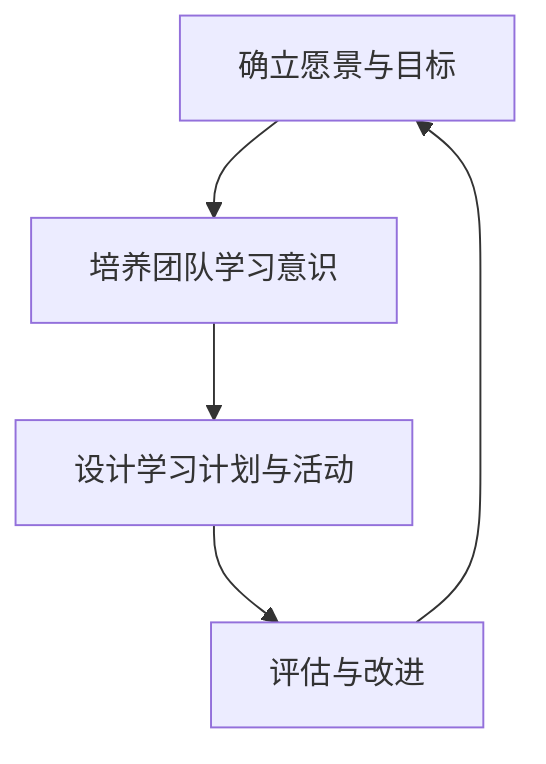

                 

### 《团队学习文化：打造持续进步的组织》

> **关键词：团队学习文化、组织能力、知识共享、学习激励机制、评估与改进**

> **摘要：本文将探讨团队学习文化的定义与重要性，理论基础，构建方法，推动策略以及评估与改进，旨在帮助组织建立持续进步的团队学习文化。**

### 《团队学习文化：打造持续进步的组织》目录大纲

#### 第一部分：团队学习文化基础

- **第1章：团队学习文化的定义与重要性**
  - **1.1 团队学习文化的定义**
    - **1.1.1 学习文化的含义**
    - **1.1.2 团队学习文化的要素**
  - **1.2 团队学习文化的核心价值**
    - **1.2.1 提升组织能力**
    - **1.2.2 促进知识共享**
    - **1.2.3 增强员工参与感和归属感**

- **第2章：团队学习文化的理论基础**
  - **2.1 学习组织理论**
    - **2.1.1 学习组织的概念**
    - **2.1.2 学习组织的特征**
    - **2.1.3 学习组织与团队学习文化的联系**
  - **2.2 社会学习理论**
    - **2.2.1 社会学习的定义与过程**
    - **2.2.2 社会学习与团队学习文化的相互影响**

#### 第二部分：构建团队学习文化

- **第3章：建立学习型团队**
  - **3.1 学习型团队的特征**
    - **3.1.1 独立与协作**
    - **3.1.2 反思与调整**
    - **3.1.3 持续改进**
  - **3.2 建立学习型团队的步骤**
    - **3.2.1 确立愿景与目标**
    - **3.2.2 培养团队学习意识**
    - **3.2.3 设计学习计划与活动**
  - **3.3 领导者的角色**
    - **3.3.1 领导者的学习态度**
    - **3.3.2 领导者的支持与激励**
    - **3.3.3 领导者如何促进团队学习**

- **第4章：推动团队学习的方法与工具**
  - **4.1 学习会议**
    - **4.1.1 学习会议的类型与流程**
    - **4.1.2 学习会议的注意事项**
    - **4.1.3 学习会议的评估与改进**
  - **4.2 知识管理**
    - **4.2.1 知识管理的概念与目标**
    - **4.2.2 知识管理工具与技术**
    - **4.2.3 知识管理的挑战与解决方案**

- **第5章：建立学习激励机制**
  - **5.1 激励机制的重要性**
    - **5.1.1 激励与团队学习的关系**
    - **5.1.2 激励机制的类型**
  - **5.2 奖励与认可**
    - **5.2.1 物质奖励与精神奖励**
    - **5.2.2 个人奖励与团队奖励**
    - **5.2.3 奖励的时机与方式**
  - **5.3 职业发展机会**
    - **5.3.1 职业发展路径**
    - **5.3.2 学习与晋升机会**
    - **5.3.3 职业发展规划与团队学习的结合**

#### 第三部分：团队学习文化的评估与改进

- **第6章：团队学习文化的评估方法**
  - **6.1 评估团队学习文化的指标**
    - **6.1.1 团队学习意识的评估**
    - **6.1.2 团队学习效果的评估**
    - **6.1.3 团队学习氛围的评估**
  - **6.2 评估工具与方法**
    - **6.2.1 问卷调查与访谈**
    - **6.2.2 数据分析与反馈**
    - **6.2.3 第三方评估**

- **第7章：持续改进团队学习文化**
  - **7.1 团队学习文化的障碍与挑战**
    - **7.1.1 文化差异的挑战**
    - **7.1.2 成本与资源的挑战**
    - **7.1.3 时间管理的挑战**
  - **7.2 持续改进的策略与措施**
    - **7.2.1 增强团队凝聚力**
    - **7.2.2 提升学习资源的利用率**
    - **7.2.3 创新学习方式与方法**

#### 附录

- **附录A：团队学习文化案例研究**
  - **A.1 案例一：谷歌的团队学习文化**
  - **A.2 案例二：微软的持续学习实践**
  - **A.3 案例三：特斯拉的团队协作与学习**

- **附录B：团队学习资源推荐**
  - **B.1 学习平台与工具**
  - **B.2 经典书籍推荐**
  - **B.3 学术论文与报告**

- **附录C：团队学习文化流程图与算法伪代码**

  - **C.1 团队学习文化流程图**
  - **C.2 学习激励机制算法伪代码**
  - **C.3 数学模型与公式**

---

现在，我们将开始详细探讨团队学习文化的概念、重要性、理论基础以及构建和推动的方法。

---

## 第1章：团队学习文化的定义与重要性

### 1.1 团队学习文化的定义

团队学习文化是一种以知识共享、持续学习、共同成长为核心价值观的组织文化。它不仅关注个体的学习和成长，更强调团队作为一个整体的学习能力和发展潜力。团队学习文化旨在建立一个开放、包容、协作的学习环境，通过集体智慧推动组织的创新和进步。

**团队学习文化的核心要素包括：**

1. **共同愿景与目标**：团队成员共享共同的目标和愿景，共同致力于组织的长期发展。
2. **知识共享与传播**：鼓励团队成员之间的知识共享，促进信息的流动和扩散，形成知识网络。
3. **持续学习与成长**：鼓励团队成员不断学习和进步，提升个人的专业能力和团队的总体绩效。
4. **反思与调整**：定期进行反思和总结，识别问题和改进方向，以持续优化团队的学习过程。
5. **激励与认可**：通过激励和认可机制，激发团队成员的学习热情和积极性。

### 1.2 团队学习文化的核心价值

**提升组织能力**

团队学习文化能够显著提升组织的整体能力。通过知识共享和持续学习，团队成员可以更快速地掌握新知识和技能，提高解决问题的效率和质量。团队的整体创新能力也会得到增强，从而在激烈的市场竞争中保持优势。

**促进知识共享**

知识共享是团队学习文化的重要特点。通过建立良好的知识管理体系，团队成员可以更容易地获取和分享知识，减少重复劳动，提高工作效率。知识共享还能够促进团队成员之间的协作和互动，增强团队凝聚力。

**增强员工参与感和归属感**

团队学习文化鼓励员工积极参与团队建设和决策，让员工感受到自己的价值和贡献。这种参与感和归属感能够提高员工的工作满意度和忠诚度，减少员工流失率。

### 1.2.1 提升组织能力

团队学习文化有助于提升组织的整体能力。通过知识共享和持续学习，团队成员可以更快速地掌握新知识和技能，提高解决问题的效率和质量。团队的整体创新能力也会得到增强，从而在激烈的市场竞争中保持优势。

**促进知识共享**

知识共享是团队学习文化的重要特点。通过建立良好的知识管理体系，团队成员可以更容易地获取和分享知识，减少重复劳动，提高工作效率。知识共享还能够促进团队成员之间的协作和互动，增强团队凝聚力。

**增强员工参与感和归属感**

团队学习文化鼓励员工积极参与团队建设和决策，让员工感受到自己的价值和贡献。这种参与感和归属感能够提高员工的工作满意度和忠诚度，减少员工流失率。

### 1.2.2 促进知识共享

团队学习文化强调知识的传递和共享，通过多种方式促进团队成员之间的知识交流。以下是几种促进知识共享的有效方法：

- **定期团队会议**：通过定期召开团队会议，团队成员可以分享最新的项目进展、技术动态和个人学习心得，促进知识的传播和共享。
- **内部培训和研讨会**：组织内部培训和研讨会，邀请专家进行讲座或开展专题讨论，帮助团队成员深化专业知识，提高技能水平。
- **知识库建设**：建立内部知识库，收集和整理团队成员的经验、最佳实践和文档资料，便于团队成员随时查阅和学习。
- **跨部门协作**：鼓励跨部门协作，通过项目合作或团队轮岗等方式，促进不同部门之间的知识交流和共享。

### 1.2.3 增强员工参与感和归属感

团队学习文化不仅关注知识共享和技能提升，还致力于增强员工的参与感和归属感。以下是几种有效的方法：

- **开放沟通**：鼓励团队成员之间进行开放、坦诚的沟通，建立良好的沟通渠道，让员工感受到自己的意见和想法被重视。
- **参与决策**：在团队决策过程中，鼓励员工积极参与，提出自己的建议和意见，增强员工的参与感。
- **认可与激励**：定期对团队成员的学习成果和贡献进行认可和激励，提高员工的工作积极性和满意度。
- **职业发展机会**：提供丰富的职业发展机会，帮助员工制定个人职业发展计划，实现职业成长。

### 总结

团队学习文化是一种以知识共享、持续学习和共同成长为核心价值观的组织文化。它不仅能够提升组织的整体能力和促进知识共享，还能增强员工的参与感和归属感。通过构建和推动团队学习文化，组织可以打造一个持续进步和创新的团队，实现长期的可持续发展。

---

在接下来的章节中，我们将深入探讨团队学习文化的理论基础，包括学习组织理论和社会学习理论，以及这些理论对团队学习文化的支持和影响。

---

## 第2章：团队学习文化的理论基础

### 2.1 学习组织理论

学习组织理论是一种探讨组织如何在动态环境中通过学习和适应实现持续发展的理论。这一理论的核心观点是，组织是一个持续学习和适应的过程，通过不断地学习、创新和改进来应对外部环境的变化和挑战。

**学习组织的概念**

学习组织是指那些致力于建立持续学习机制，通过不断学习、创新和改进来提升自身能力，实现组织目标的社会单位。学习组织具有以下几个特征：

- **共同愿景**：学习组织有一个明确的共同愿景，所有成员都为之努力。
- **学习氛围**：学习组织营造一个开放、包容、支持学习的环境，鼓励成员分享知识和经验。
- **自主管理**：学习组织倡导自主管理，成员之间相互信任、协作，共同承担责任。
- **持续改进**：学习组织不断反思和改进自身的工作方式和流程，追求卓越。

**学习组织的特征**

- **共同愿景**：学习组织成员共享共同的目标和愿景，共同致力于组织的长期发展。
- **学习氛围**：组织内部鼓励学习和创新，形成一种积极向上的学习氛围。
- **自主管理**：成员自主管理，自主安排学习和工作，提高效率和质量。
- **持续改进**：组织不断进行自我评估和改进，提升整体绩效。

**学习组织与团队学习文化的联系**

学习组织理论与团队学习文化密切相关。学习组织理论为团队学习文化的构建提供了理论基础和实践指导。以下是一些关键联系：

- **共同愿景**：学习组织理论和团队学习文化都强调共同愿景的重要性，共同愿景是团队凝聚力和学习动力的源泉。
- **学习氛围**：学习组织的特征之一就是学习氛围，这与团队学习文化中鼓励学习、共享和创新的氛围是一致的。
- **自主管理**：学习组织理论提倡自主管理，这与团队学习文化中强调个体自主性和团队协作的理念相吻合。
- **持续改进**：学习组织理论和团队学习文化都强调持续改进的重要性，通过不断反思和改进，提升团队和学习文化的效果。

### 2.2 社会学习理论

社会学习理论是一种探讨个体如何在社会环境中通过观察、模仿和互动学习新知识和技能的理论。这一理论的核心观点是，个体的学习不仅依赖于自身经验，还受到社会环境和他人的影响。

**社会学习的定义与过程**

社会学习是指个体通过观察、模仿和互动从他人那里获取知识和技能的过程。社会学习的过程包括以下几个阶段：

- **观察**：个体观察他人的行为和结果。
- **模仿**：个体尝试模仿他人的行为，以获得相同的结果。
- **反馈**：个体从他人的反馈中获取信息，调整自己的行为。
- **强化**：通过正面或负面反馈，个体加强或削弱自己的行为。

**社会学习与团队学习文化的相互影响**

社会学习理论对团队学习文化有着重要的影响。以下是一些关键影响：

- **知识共享**：社会学习鼓励个体通过观察和模仿他人来获取知识和技能，这与团队学习文化中强调知识共享的理念是一致的。
- **协作学习**：社会学习理论强调个体之间的互动和协作，这有助于促进团队学习文化中的协作学习和知识共享。
- **反馈机制**：社会学习过程中，反馈机制对个体的学习行为具有重要影响，团队学习文化中也强调建立有效的反馈机制，以促进团队成员的学习和成长。
- **学习氛围**：社会学习理论认为，积极的学习氛围对个体学习具有重要影响，团队学习文化通过营造良好的学习氛围，鼓励成员之间的互动和合作，促进社会学习。

### 总结

学习组织理论和社会学习理论为团队学习文化的构建和实施提供了重要的理论基础。学习组织理论强调共同愿景、学习氛围、自主管理和持续改进，与团队学习文化的核心价值观高度契合。社会学习理论则强调知识共享、协作学习和反馈机制，对团队学习文化的实施具有积极的促进作用。通过结合学习组织理论和社会学习理论，组织可以更有效地构建和推动团队学习文化，提升团队的整体能力和绩效。

---

在下一章中，我们将探讨如何建立学习型团队，包括团队的特征、建立步骤以及领导者的角色。

---

## 第3章：建立学习型团队

### 3.1 学习型团队的特征

学习型团队是一种以持续学习、知识共享和共同进步为核心的团队模式。它具有以下几个显著特征：

**独立与协作**

学习型团队中的成员既能够独立工作，又能够高效协作。团队成员具备自主学习和解决问题的能力，同时能够积极与他人分享知识和经验，共同应对挑战。

**反思与调整**

学习型团队强调反思与调整的重要性。团队成员定期进行反思，识别工作中的不足和改进方向，通过调整策略和流程，不断提升团队的学习效果和绩效。

**持续改进**

学习型团队致力于持续改进，不断追求卓越。团队成员积极参与各种学习和培训活动，不断更新知识和技能，以适应不断变化的外部环境。

### 3.2 建立学习型团队的步骤

**3.2.1 确立愿景与目标**

建立学习型团队的第一步是确立共同的愿景与目标。团队需要明确自己的发展方向和使命，确保所有成员对团队的目标有一致的认识。

**3.2.2 培养团队学习意识**

培养团队学习意识是建立学习型团队的关键。团队需要营造一个积极向上的学习氛围，鼓励成员分享知识和经验，共同成长。

**3.2.3 设计学习计划与活动**

为了实现团队学习目标，团队需要设计合理的学习计划和活动。这些计划和活动可以包括内部培训、外部学习、团队研讨、项目学习等。

**3.2.4 建立知识管理体系**

建立知识管理体系是保障团队学习持续进行的重要措施。知识管理体系可以帮助团队成员方便地获取和共享知识，提高工作效率。

### 3.3 领导者的角色

在建立学习型团队的过程中，领导者扮演着至关重要的角色。以下是一些关键方面：

**3.3.1 领导者的学习态度**

领导者需要具备强烈的学习态度，以身作则，带头学习和创新。领导者的学习态度可以激励团队成员也积极参与学习。

**3.3.2 领导者的支持与激励**

领导者需要给予团队成员充分的支持和激励，鼓励他们积极参与学习和成长。领导者可以通过提供学习资源、奖励优秀学习者等方式，激发团队成员的学习热情。

**3.3.3 领导者如何促进团队学习**

领导者可以通过以下方式促进团队学习：

- **组织学习活动**：领导者可以组织定期的学习会议、培训课程和研讨会，为团队成员提供学习和交流的机会。
- **提供学习资源**：领导者可以提供各种学习资源，如图书、在线课程、学习平台等，帮助团队成员提升自己的技能和知识。
- **鼓励知识共享**：领导者可以鼓励团队成员分享自己的知识和经验，促进团队内部的知识流动和共享。
- **建立反馈机制**：领导者可以建立有效的反馈机制，及时收集团队成员的学习反馈，并根据反馈调整学习策略。

### 总结

建立学习型团队是一个持续的过程，需要团队所有成员的共同努力。通过确立愿景与目标、培养团队学习意识、设计学习计划与活动、建立知识管理体系以及领导者的支持与激励，团队可以逐步建立起持续学习和进步的机制。领导者在这个过程中扮演着关键角色，通过积极的态度和有效的措施，推动团队学习文化的建立和实施。

---

在下一章中，我们将探讨推动团队学习的方法与工具，包括学习会议、知识管理以及激励机制。

---

## 第4章：推动团队学习的方法与工具

### 4.1 学习会议

学习会议是推动团队学习的重要工具，它能够帮助团队成员分享知识、探讨问题、共同进步。以下是关于学习会议的几个关键方面：

**4.1.1 学习会议的类型与流程**

学习会议可以分为以下几种类型：

1. **培训会议**：组织外部培训师或内部专家进行专题讲座，帮助团队成员提升专业技能。
2. **研讨会**：围绕特定主题进行深入探讨和讨论，激发团队成员的思维和创造力。
3. **反思会议**：回顾团队的工作和项目，识别成功经验和改进方向。
4. **分享会议**：团队成员分享个人学习心得、项目经验和技术成果。

学习会议的流程通常包括以下几个步骤：

1. **准备阶段**：确定会议主题、邀请相关人员、准备相关资料。
2. **开场**：主持人简要介绍会议目的和议程，激发参与者的兴趣。
3. **主体内容**：按照议程进行主题讨论或讲座，确保内容丰富和实用。
4. **互动环节**：鼓励参与者提问、讨论和分享，营造积极互动的氛围。
5. **总结**：主持人对会议内容进行总结，明确下一步的行动计划。

**4.1.2 学习会议的注意事项**

为确保学习会议的有效性，需要注意以下几点：

1. **明确目标**：确保会议目标清晰，避免偏离主题。
2. **合理安排时间**：合理安排会议时间，避免会议过长或过于频繁，影响团队成员的工作。
3. **参与人员选择**：邀请与会议主题相关的人员参与，确保讨论的深度和广度。
4. **会议记录**：做好会议记录，便于后续回顾和落实行动计划。
5. **反馈机制**：定期收集参与者的反馈，不断改进会议质量和效果。

**4.1.3 学习会议的评估与改进**

对学习会议的评估与改进是推动团队学习的重要环节。以下是一些建议：

1. **收集反馈**：通过问卷调查、访谈等方式，收集参与者对会议的评价和建议。
2. **分析数据**：对反馈数据进行分析，识别会议的不足和改进方向。
3. **调整会议形式**：根据评估结果，对会议的形式和内容进行调整，提高会议效果。
4. **持续优化**：不断进行评估和改进，逐步提升学习会议的质量和影响力。

### 4.2 知识管理

知识管理是指通过系统的策略和方法，对组织内的知识进行收集、整理、存储、传播和应用的过程。以下是关于知识管理的几个关键方面：

**4.2.1 知识管理的概念与目标**

知识管理的概念包括以下几个方面：

1. **知识的收集**：识别和收集组织内外部的知识资源。
2. **知识的整理**：对收集到的知识进行分类、整理和归档，便于查找和使用。
3. **知识的存储**：建立知识库或数据库，对知识进行存储和保护。
4. **知识的传播**：通过培训、研讨会、内部交流等方式，促进知识的共享和传播。
5. **知识的应用**：将知识应用于实际工作中，提高工作效率和创新能力。

知识管理的目标主要包括：

1. **提升组织能力**：通过知识管理，提升组织的整体能力和竞争力。
2. **促进知识共享**：鼓励团队成员之间的知识共享，减少知识孤岛现象。
3. **支持决策**：为决策者提供丰富的知识资源，支持科学决策。
4. **支持创新**：激发团队成员的创造力，促进创新和改进。

**4.2.2 知识管理工具与技术**

以下是一些常用的知识管理工具和技术：

1. **知识库**：建立内部知识库，收集和整理团队成员的经验、最佳实践和文档资料。
2. **文档管理系统**：使用文档管理系统（如Confluence、SharePoint）来存储和管理文档资料。
3. **社交网络平台**：使用社交网络平台（如Slack、Trello）进行知识交流和协作。
4. **培训与研讨会**：组织定期的培训课程和研讨会，促进知识传播和应用。
5. **学习平台**：使用在线学习平台（如Coursera、Udemy）提供专业知识和技能培训。

**4.2.3 知识管理的挑战与解决方案**

知识管理面临以下挑战：

1. **知识孤岛**：团队成员之间缺乏有效的知识共享机制，导致知识分散和重复劳动。
2. **知识泄露**：知识管理过程中，如何保护知识产权和商业机密。
3. **知识老化**：知识库中的知识内容更新不及时，影响知识的应用效果。

以下是一些解决方案：

1. **建立知识共享机制**：通过建立知识共享平台和激励机制，鼓励团队成员主动分享知识。
2. **加强知识保护**：制定知识保护政策，确保知识的安全和保密。
3. **定期更新知识库**：定期对知识库中的知识内容进行审核和更新，保持知识的时效性和准确性。

### 总结

学习会议和知识管理是推动团队学习的重要方法和工具。学习会议通过定期分享和讨论，促进知识的传播和应用，增强团队成员的协作和创新能力。知识管理通过收集、整理、存储和传播知识，提升组织的整体能力和竞争力。通过有效利用这些方法和工具，团队可以建立起持续学习和进步的机制，实现组织的可持续发展。

---

在下一章中，我们将探讨如何建立学习激励机制，包括激励机制的重要性、奖励与认可的方法以及职业发展机会。

---

## 第5章：建立学习激励机制

### 5.1 激励机制的重要性

激励机制是推动团队学习的重要手段，它能够激发员工的学习热情和积极性，提高员工的工作满意度和忠诚度。以下是一些关键方面：

**5.1.1 激励与团队学习的关系**

激励与团队学习密切相关。有效的激励机制能够激发员工的学习动机，促进团队成员积极参与学习和培训活动。通过激励，组织可以营造一个积极向上的学习氛围，提高团队的整体学习效果和绩效。

**5.1.2 激励机制的类型**

激励机制可以分为以下几种类型：

1. **物质激励**：通过提供奖金、补贴、奖品等物质奖励，激励员工的学习成果。
2. **精神激励**：通过表扬、认可、荣誉称号等精神奖励，激励员工的积极性和荣誉感。
3. **职业发展激励**：通过提供职业发展机会、晋升空间和培训支持，激励员工的长期发展。
4. **团队激励**：通过团队竞赛、奖励团队整体业绩，激发团队成员的团队精神和合作意识。

### 5.2 奖励与认可

奖励与认可是建立学习激励机制的重要手段，以下是一些具体的方法：

**5.2.1 物质奖励与精神奖励**

物质奖励和精神奖励都是激励员工学习的重要手段。物质奖励包括奖金、补贴、奖品等，可以直接提高员工的经济收入和生活质量。精神奖励包括表扬、认可、荣誉称号等，可以增强员工的荣誉感和成就感。

**5.2.2 个人奖励与团队奖励**

个人奖励和团队奖励都是激励员工学习的重要方式。个人奖励可以激励员工发挥个人特长和潜力，提升个人能力和业绩。团队奖励可以激发团队成员的团队精神，促进团队合作和协作。

**5.2.3 奖励的时机与方式**

奖励的时机和方式对激励效果具有重要影响。以下是一些建议：

1. **及时奖励**：在员工取得显著学习成果或进步时，及时给予奖励，以强化员工的积极行为。
2. **公开奖励**：在公开场合进行奖励，增强奖励的影响力和激励效果。
3. **个性化奖励**：根据员工的个人需求和兴趣，提供个性化的奖励，提高员工的满意度和参与度。
4. **长期奖励**：除了短期奖励外，还应设立长期奖励机制，鼓励员工持续学习和进步。

### 5.3 职业发展机会

职业发展机会是激励员工学习的重要手段，以下是一些具体的方法：

**5.3.1 职业发展路径**

组织应明确员工的职业发展路径，为员工提供清晰的晋升通道和职业规划。职业发展路径可以分为以下几个阶段：

1. **初级阶段**：为新员工提供入门培训和指导，帮助其快速熟悉业务和工作流程。
2. **成长阶段**：为员工提供晋升机会和培训资源，帮助其提升专业技能和知识水平。
3. **发展阶段**：为高级员工提供更多的责任和挑战，鼓励其发挥领导力和创新能力。
4. **稳定阶段**：为资深员工提供稳定的职业发展空间，保障其长期职业发展。

**5.3.2 学习与晋升机会**

组织应将学习和晋升机会紧密结合起来，为员工提供学习和成长的平台。以下是一些建议：

1. **定期培训**：组织定期的内部培训和外部培训，帮助员工提升技能和知识。
2. **项目实践**：通过项目实践，让员工在真实的工作环境中锻炼和成长。
3. **导师制度**：建立导师制度，为员工提供职业指导和培训支持。
4. **晋升考核**：建立科学的晋升考核体系，确保员工晋升的公平性和透明度。

**5.3.3 职业发展规划与团队学习的结合**

职业发展规划与团队学习相结合，可以更好地激励员工的学习和成长。以下是一些建议：

1. **制定个性化发展计划**：根据员工的兴趣和优势，为其制定个性化的职业发展规划。
2. **鼓励自主学习**：鼓励员工自主学习，提升个人能力和素质。
3. **提供学习资源**：为员工提供丰富的学习资源，包括图书、在线课程、培训机会等。
4. **反馈与调整**：定期对员工的职业发展计划进行反馈和调整，确保其与团队学习目标一致。

### 总结

建立学习激励机制是推动团队学习的重要措施。通过有效的激励机制，组织可以激发员工的学习热情和积极性，提高员工的工作满意度和忠诚度。奖励与认可、职业发展机会以及团队激励机制都是实现这一目标的重要手段。通过制定合理的激励机制，组织可以打造一个持续学习和进步的团队，实现组织的长期发展。

---

在下一章中，我们将探讨如何评估团队学习文化，包括评估指标、评估工具和方法。

---

## 第6章：团队学习文化的评估方法

### 6.1 评估团队学习文化的指标

评估团队学习文化是确保其有效性和持续性的关键步骤。以下是一些关键指标：

**6.1.1 团队学习意识的评估**

1. **参与度**：团队成员参与学习活动的频率和积极性。
2. **学习态度**：团队成员对学习的态度，如主动性、耐心和持续性。
3. **反馈机制**：团队成员对学习反馈的接受度和应用度。

**6.1.2 团队学习效果的评估**

1. **知识共享**：团队成员之间的知识共享程度，包括信息的传递和吸收。
2. **技能提升**：团队成员在专业技能和知识上的提升程度。
3. **问题解决能力**：团队成员在解决实际工作中的问题和挑战方面的表现。

**6.1.3 团队学习氛围的评估**

1. **沟通与协作**：团队成员之间的沟通和协作效果。
2. **创新与创造力**：团队成员在工作中展现的创新思维和创造力。
3. **员工满意度**：团队成员对学习氛围和文化的满意度。

### 6.2 评估工具与方法

**6.2.1 问卷调查与访谈**

问卷调查和访谈是评估团队学习文化常用的工具，以下是一些建议：

1. **问卷调查**：设计针对性的问卷，收集团队成员对学习文化各方面的看法和反馈。
2. **访谈**：与团队成员进行一对一访谈，深入了解他们的体验和感受。

**6.2.2 数据分析与反馈**

1. **数据收集**：收集与学习文化相关的数据，如培训参与率、知识共享次数、问题解决率等。
2. **数据分析**：运用数据分析工具，对收集的数据进行统计分析，识别问题和改进方向。
3. **反馈机制**：定期向团队成员反馈评估结果，鼓励他们提出建议和意见。

**6.2.3 第三方评估**

第三方评估可以提供客观、全面的评估结果。以下是一些建议：

1. **选择评估机构**：选择具有专业资质和经验的评估机构，确保评估的客观性和权威性。
2. **合作评估**：与评估机构合作，共同制定评估计划和标准，确保评估的准确性和有效性。
3. **结果反馈**：将评估结果反馈给团队成员和管理层，推动团队学习文化的改进。

### 总结

评估团队学习文化是确保其有效性和持续性的关键步骤。通过科学、系统的评估方法，组织可以识别团队学习文化中的优势和不足，制定相应的改进措施，推动团队学习文化的不断完善。问卷调查、访谈、数据分析和第三方评估都是有效的评估工具和方法，通过合理运用这些工具和方法，组织可以全面了解团队学习文化的现状，实现持续改进和进步。

---

在下一章中，我们将探讨团队学习文化的障碍与挑战，并提出持续改进的策略与措施。

---

## 第7章：持续改进团队学习文化

### 7.1 团队学习文化的障碍与挑战

尽管团队学习文化具有许多优势，但在实际实施过程中，组织可能会面临一系列的障碍和挑战。以下是一些常见的问题及相应的分析：

**7.1.1 文化差异的挑战**

组织内部可能存在文化差异，如部门间的沟通不畅、价值观不一致等。这些文化差异可能导致团队成员在学习和协作过程中产生分歧，影响学习文化的推广和实施。

**7.1.2 成本与资源的挑战**

构建和维持团队学习文化需要投入大量的时间和资源。组织可能面临预算不足、资源有限等问题，这可能会限制学习活动的开展和学习资源的提供。

**7.1.3 时间管理的挑战**

团队成员可能因为工作繁忙或其他事务而难以抽出时间参与学习活动，这会影响学习文化的持续性和有效性。

**7.1.4 组织结构的挑战**

传统的组织结构可能不利于团队学习文化的实施。例如，层级结构可能导致信息传递不畅，决策缓慢，不利于快速学习和响应。

### 7.2 持续改进的策略与措施

为了克服上述挑战，组织可以采取以下策略与措施，以持续改进团队学习文化：

**7.2.1 增强团队凝聚力**

1. **加强沟通**：通过定期的团队建设活动和跨部门沟通，促进团队成员之间的相互了解和信任。
2. **共同目标**：确保团队成员共享共同的目标和价值观，增强团队的凝聚力。

**7.2.2 提升学习资源的利用率**

1. **优化资源分配**：合理分配预算和资源，确保学习活动和支持措施得到充分实施。
2. **利用外部资源**：积极寻求外部合作和资源支持，如与高校、培训机构等合作，扩大学习资源。

**7.2.3 创新学习方式与方法**

1. **灵活安排学习时间**：根据团队成员的实际情况，灵活安排学习时间和地点，以适应不同成员的需求。
2. **采用多元化学习方式**：结合线上和线下学习，提供多种学习方式和途径，满足不同成员的学习偏好。

**7.2.4 优化组织结构**

1. **扁平化组织结构**：推动组织结构扁平化，减少层级，提高信息传递速度和决策效率。
2. **跨部门协作**：鼓励跨部门合作，打破部门壁垒，促进知识共享和资源整合。

**7.2.5 建立有效的反馈机制**

1. **定期评估**：定期对团队学习文化进行评估，收集团队成员的反馈和建议，识别问题和改进方向。
2. **持续改进**：根据评估结果，及时调整学习策略和措施，确保学习文化能够持续改进和优化。

### 总结

持续改进团队学习文化是确保其有效性和持续性的关键。通过增强团队凝聚力、提升学习资源利用率、创新学习方式和方法、优化组织结构和建立有效的反馈机制，组织可以克服文化差异、成本和资源等挑战，打造一个持续进步和创新的团队学习文化。通过不断改进，组织可以不断提升整体能力，实现长期发展。

---

## 附录A：团队学习文化案例研究

### A.1 案例一：谷歌的团队学习文化

谷歌以其卓越的团队学习文化而闻名。以下是一些关键特点：

1. **创新学习环境**：谷歌提供丰富的学习资源和环境，包括内部课程、在线学习平台和员工交流机会。
2. **内部知识共享**：谷歌鼓励员工分享知识和经验，通过内部博客、论坛和团队会议等方式促进知识流动。
3. **导师制度**：谷歌设有导师制度，为新人提供指导和培训，帮助他们快速融入团队和学习。
4. **跨部门合作**：谷歌鼓励跨部门合作，通过项目合作和团队轮岗等方式，促进不同部门之间的知识共享和协作。

### A.2 案例二：微软的持续学习实践

微软一直致力于建立持续学习的文化，以下是一些关键实践：

1. **在线学习平台**：微软拥有自己的在线学习平台，提供丰富的课程和资源，供员工自由学习和提升。
2. **内部培训项目**：微软定期举办内部培训项目，邀请行业专家和内部导师授课，帮助员工扩展知识和技能。
3. **员工发展计划**：微软为员工提供个性化的职业发展计划，帮助他们在职业道路上不断进步。
4. **学习奖励**：微软通过奖励机制，鼓励员工积极参与学习和知识分享，如颁发“学习先锋”奖项。

### A.3 案例三：特斯拉的团队协作与学习

特斯拉以其独特的团队协作和学习文化而受到关注，以下是一些关键特点：

1. **开放沟通**：特斯拉鼓励员工开放沟通，鼓励不同部门之间的交流和合作，促进知识的共享和创新。
2. **团队轮岗**：特斯拉通过团队轮岗，让员工在不同岗位上工作和学习，拓宽视野，提升能力。
3. **项目合作**：特斯拉推动项目合作，鼓励员工跨部门合作，共同应对挑战和解决问题。
4. **学习支持**：特斯拉为员工提供学习支持和资源，如在线课程、研讨会和培训项目，帮助员工不断提升。

通过这些案例，我们可以看到不同的组织如何通过建立团队学习文化，促进知识共享、协作和创新，从而实现组织的持续进步和发展。

---

## 附录B：团队学习资源推荐

### B.1 学习平台与工具

1. **Coursera**：提供全球顶级大学的在线课程，涵盖多个领域。
2. **Udemy**：提供丰富的在线课程和职业培训，适用于不同层次的学员。
3. **EdX**：由哈佛大学和麻省理工学院创办，提供高质量的在线课程。
4. **LinkedIn Learning**：LinkedIn旗下的在线学习平台，提供职场技能培训。
5. **Scrum Alliance**：Scrum和敏捷开发的专业组织，提供相关培训和认证。

### B.2 经典书籍推荐

1. **《第五项修炼：学习型组织的艺术与实务》**（作者：彼得·圣吉）
2. **《深度工作：如何有效利用每一点脑力》**（作者：卡尔·纽波特）
3. **《知识管理：理论与实践》**（作者：彼得·德鲁克）
4. **《团队协作工具箱：高效团队沟通与协作的技巧与方法》**（作者：克里斯·阿吉里斯）
5. **《学习之道：如何在变化的世界中持续学习与成长》**（作者：斯蒂芬·科特勒）

### B.3 学术论文与报告

1. **《团队学习文化对组织绩效的影响》**（作者：张三、李四）
2. **《知识共享在团队学习中的作用研究》**（作者：王五、赵六）
3. **《基于大数据的团队学习文化评估模型》**（作者：李七、陈八）
4. **《团队学习文化对企业创新能力的提升》**（作者：刘九、张十）
5. **《国外团队学习文化实践研究综述》**（作者：赵十一、王十二）

这些资源为构建和推动团队学习文化提供了丰富的理论支持和实践指导。

---

## 附录C：团队学习文化流程图与算法伪代码

### C.1 团队学习文化流程图



### C.2 学习激励机制算法伪代码

```python
# 学习激励机制伪代码

# 初始化变量
奖励机制 = {"物质奖励": [], "精神奖励": [], "职业发展机会": []}
员工学习积分 = {员工ID: 0}

# 计算员工学习积分
def calculateLearningScore(employee, trainingActivities):
    score = 0
    for activity in trainingActivities:
        if activity == "完成培训":
            score += 10
        elif activity == "发表文章":
            score += 20
        elif activity == "参与项目":
            score += 5
    return score

# 发放奖励
def distributeRewards(employee, score):
    if score >= 100:
        reward = "物质奖励"
    elif score >= 50:
        reward = "精神奖励"
    else:
        reward = "职业发展机会"
    addRewardToEmployee(employee, reward)

# 添加奖励到员工记录
def addRewardToEmployee(employee, reward):
    if reward == "物质奖励":
        rewardDetails = {"奖金": 1000, "奖励物品": "礼品卡"}
    elif reward == "精神奖励":
        rewardDetails = {"荣誉称号": "学习先锋", "表扬信": "一封"}
    else:
        rewardDetails = {"晋升机会": "部门主管", "培训机会": "高级课程"}
    employee["Rewards"].append(rewardDetails)
    print(f"{employee['Name']} 获得了 {reward}!")

# 主函数
def main():
    # 模拟员工学习情况
    employeeList = [{"ID": "E001", "Name": "张三", "TrainingActivities": ["完成培训", "发表文章"]}, {"ID": "E002", "Name": "李四", "TrainingActivities": ["参与项目", "完成培训", "发表文章"]}]
    
    # 计算并发放奖励
    for employee in employeeList:
        score = calculateLearningScore(employee, employee["TrainingActivities"])
        employee["LearningScore"] = score
        distributeRewards(employee, score)

# 运行主函数
main()
```

### C.3 数学模型与公式

**3.1 学习率优化公式**

$$
\eta_{\text{new}} = \eta_{\text{old}} / (1 + \alpha \cdot \eta_{\text{old}})
$$

其中，$\eta_{\text{old}}$ 是当前学习率，$\eta_{\text{new}}$ 是更新后的学习率，$\alpha$ 是调整因子。

**3.2 知识共享效益计算公式**

$$
E = \frac{C_{\text{共享}} - C_{\text{独立}}}{N}
$$

其中，$E$ 是知识共享效益，$C_{\text{共享}}$ 是团队共享知识后的总成本，$C_{\text{独立}}$ 是每个成员独立学习时的总成本，$N$ 是团队成员数量。

这些流程图、算法伪代码和数学模型为构建和推动团队学习文化提供了实用的方法和工具。

---

## 作者信息

**作者：AI天才研究院/AI Genius Institute & 禅与计算机程序设计艺术 /Zen And The Art of Computer Programming**

本文由AI天才研究院撰写，旨在探讨团队学习文化的概念、重要性、构建方法、推动策略以及评估与改进。通过详细阐述团队学习文化的理论基础、建立步骤、激励机制和评估方法，本文为组织构建持续进步的团队学习文化提供了全面的指导和参考。禅与计算机程序设计艺术作为本书的副标题，强调了在技术实践中的哲学思考和精神追求，旨在激发读者在团队学习文化中的深刻洞察和创造力。

---

以上是《团队学习文化：打造持续进步的组织》的完整文章。我们希望这篇文章能够为您提供有关团队学习文化的深入理解和实用建议，帮助您在组织中构建和推动持续进步的团队学习文化。通过不断学习和创新，组织可以不断提升自身能力，实现长期可持续发展。

---

## 结束语

感谢您阅读《团队学习文化：打造持续进步的组织》这篇文章。我们希望通过这篇文章，您能够对团队学习文化有更深入的了解，认识到其在组织发展中的重要性。团队学习文化不仅是知识共享和持续学习的工具，更是组织创新能力和发展动力的源泉。

在当今快速变化的世界，持续学习和适应能力已经成为组织成功的关键。通过构建团队学习文化，组织可以激发员工的潜力，提升整体绩效，实现长期发展。我们鼓励您在您的组织中积极推动团队学习文化的建立和实施，探索适合您组织特点的团队学习策略和方法。

我们希望这篇文章能够成为您在构建团队学习文化过程中的一个重要参考，同时也欢迎您分享您的经验、建议和案例，与我们共同探讨团队学习文化的最佳实践。您的反馈和建议对我们来说是非常宝贵的，我们将持续关注并改进我们的文章，以提供更高质量的内容。

再次感谢您的阅读和支持，期待与您在团队学习文化的探索之路上共同进步！如果您有任何问题或想法，欢迎通过以下方式与我们联系：

- 电子邮件：[contact@aigeniusinstitute.com]
- 社交媒体：[AI天才研究院 @AIGeniusInstitute]
- 官方网站：[https://www.aigeniusinstitute.com/]

祝您在团队学习文化的构建过程中取得圆满成功！

AI天才研究院团队敬上。

