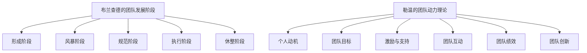
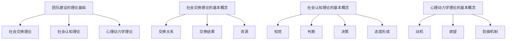
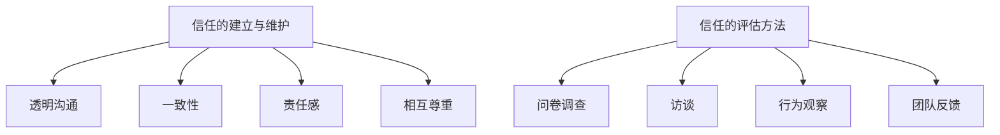
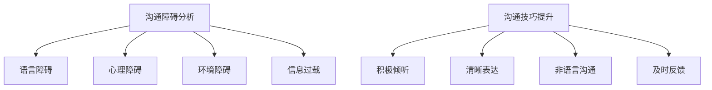

                 

### 引言

在当今快速变化和竞争激烈的商业环境中，团队建设成为组织成功的关键因素之一。一个高效的团队不仅可以提高工作效率，促进创新思维，还能增强员工的满意度和归属感，从而提升整体组织的竞争力。然而，如何从零开始构建一个高效且和谐的团队，对于许多组织来说仍然是一个挑战。

本文旨在探讨团队建设的全新思路，从陌生到默契，帮助读者理解团队建设的核心概念、策略和方法。文章分为四个主要部分：

1. **团队建设的理论基础**：介绍团队建设的重要性、团队发展的阶段理论以及团队建设的理论基础。
2. **从陌生到默契的团队建设策略**：讨论如何建立团队的信任、提升团队沟通效率、促进团队协作和培养团队领导力。
3. **实战团队建设**：详细讲解团队建设的实施流程、常见障碍与应对策略，并通过案例分析提供实际操作经验。
4. **团队建设的未来趋势**：探讨新型团队模式、科技对团队建设的影响以及未来团队建设的趋势展望。

通过本文的阅读，读者将能够获得以下收获：

- **理解团队建设的核心概念**：了解团队建设的重要性、核心要素和原则。
- **掌握团队建设策略**：学习如何建立团队的信任、提升沟通效率、促进协作和培养领导力。
- **获得实战经验**：通过案例分析，了解团队建设的实际操作方法和注意事项。
- **展望未来趋势**：了解团队建设的未来发展方向，为组织的发展提供新思路。

### 《团队建设新思路：从陌生到默契》目录大纲

#### 第一部分：团队建设的理论基础

- **第1章 团队建设的重要性**
  - **1.1 团队在社会和组织中的作用**
    - **1.1.1 团队的定义与类型**
    - **1.1.2 团队在组织中的重要性**
  - **1.2 团队建设的核心要素**
    - **1.2.1 目标明确**
    - **1.2.2 成员协作**
    - **1.2.3 领导力**
    - **1.2.4 共同价值观**
  - **1.3 团队建设的核心原则**
    - **1.3.1 以人为本**
    - **1.3.2 动态调整**
    - **1.3.3 持续改进**

- **第2章 团队发展的阶段理论**
  - **2.1 布兰查德的团队发展阶段**
    - **2.1.1 形成阶段**
    - **2.1.2 风暴阶段**
    - **2.1.3 规范阶段**
    - **2.1.4 执行阶段**
    - **2.1.5 休整阶段**
  - **2.2 勒温的团队动力理论**
    - **2.2.1 团队动力来源**
    - **2.2.2 团队动力的维持**
    - **2.2.3 团队动力的转化**

- **第3章 团队建设的理论基础**
  - **3.1 社会交换理论**
  - **3.2 社会认知理论**
  - **3.3 心理动力学理论**

#### 第二部分：从陌生到默契的团队建设策略

- **第4章 建立团队的信任**
  - **4.1 信任的建立与维护**
  - **4.2 信任的评估方法**

- **第5章 提升团队沟通效率**
  - **5.1 沟通障碍分析**
  - **5.2 沟通技巧提升**
  - **5.3 案例分析：高效率沟通的实践**

- **第6章 促进团队协作**
  - **6.1 协作的障碍与解决**
  - **6.2 协作工具与平台介绍**
  - **6.3 团队协作的案例分析**

- **第7章 培养团队领导力**
  - **7.1 领导者的角色与职责**
  - **7.2 领导力发展路径**
  - **7.3 领导力提升的策略与方法**

#### 第三部分：实战团队建设

- **第8章 团队建设的实施流程**
  - **8.1 团队建设的目标设定**
  - **8.2 团队成员的角色分配**
  - **8.3 团队建设的阶段性评估**

- **第9章 团队建设中的障碍与应对策略**
  - **9.1 团队冲突的处理**
  - **9.2 团队成员的激励**
  - **9.3 团队建设中的常见问题及解决**

- **第10章 团队建设案例分析**
  - **10.1 成功的团队建设案例分析**
  - **10.2 失败的团队建设案例分析**
  - **10.3 案例中的启示**

#### 第四部分：团队建设新思路

- **第11章 新型团队模式**
  - **11.1 自组织团队**
  - **11.2 跨界合作团队**
  - **11.3 平台型团队**

- **第12章 科技对团队建设的影响**
  - **12.1 人工智能在团队管理中的应用**
  - **12.2 大数据对团队效能的提升**
  - **12.3 云计算与团队协作**

- **第13章 未来团队建设趋势展望**
  - **13.1 数字化团队建设**
  - **13.2 个性化团队建设**
  - **13.3 持续学习型团队建设**

#### 附录

- **附录 A：团队建设相关工具与资源**
  - **A.1 团队评估工具介绍**
  - **A.2 团队协作工具推荐**
  - **A.3 团队建设书籍与文献推荐**

- **附录 B：团队建设实践案例**
  - **B.1 某科技公司团队建设实践**
  - **B.2 某公益组织团队建设经验**
  - **B.3 某学术团队建设案例分析**

通过上述的目录大纲，我们可以看到，本文将逐步深入地探讨团队建设的各个方面，为读者提供一套完整的团队建设指南。接下来，我们将从理论基础开始，逐步展开讨论。

### 第1章 团队建设的重要性

#### 1.1 团队在社会和组织中的作用

团队是一种组织形式，由两个或两个以上的个体组成，为了共同实现某一目标而协同工作。在现代社会中，团队的作用日益突出，尤其是在组织层面。以下将探讨团队在社会和组织中的重要作用：

1. **提高工作效率**

   团队可以通过分工合作，将复杂的工作任务分解为更小的部分，并由每个团队成员分别完成。这种方式不仅能够提高工作效率，还能确保任务的准确性和质量。例如，在一个软件开发项目中，团队成员可以分别负责编码、测试、设计和文档编写等不同任务，从而提高整个项目的进度和效率。

2. **促进创新思维**

   团队的成员通常来自不同的背景和专业领域，他们可以带来不同的视角和观点。这种多样化的背景有助于激发创新思维，推动组织不断探索新的解决方案和方法。例如，在产品开发过程中，团队成员可以共同讨论市场趋势、用户需求和技术发展方向，从而产生更具创意的产品设计。

3. **提升员工满意度**

   一个良好的团队氛围可以增强员工的归属感和工作满意度。当员工感到被尊重和认可时，他们更有可能投入更多的精力和热情来工作。此外，团队合作还能帮助员工建立良好的人际关系，减轻工作压力，提高生活质量。这些因素都有助于提高员工的满意度和留存率。

4. **增强组织竞争力**

   团队建设不仅能够提高工作效率和员工满意度，还能增强组织的竞争力。一个高效的团队能够迅速响应市场变化，快速推出新产品或服务，抢占市场份额。此外，团队的合作和协作能力也使组织能够更好地应对各种挑战和困难，保持持续的发展和增长。

#### 1.1.1 团队的定义与类型

1. **团队的定义**

   团队是一种组织形式，由两个或两个以上的个体组成，为了共同实现某一目标而协同工作。团队成员通常具有以下特点：

   - **共同目标**：团队成员对团队的目标有共同的理解和认同。
   - **分工合作**：团队成员根据各自的专长和角色，分工合作，共同完成任务。
   - **相互依赖**：团队成员之间的工作相互依赖，需要相互支持和协作。
   - **沟通与协调**：团队成员需要通过有效的沟通和协调，确保任务的顺利进行。

2. **团队的类型**

   团队可以分为正式团队和非正式团队：

   - **正式团队**：正式团队是组织结构中的一个组成部分，通常有明确的职责和任务分配。例如，工作小组、项目团队等。
   - **非正式团队**：非正式团队是由成员自发组成的，没有明确的职责和任务分配，通常基于共同的兴趣、目标和价值观。例如，兴趣小组、社交团体等。

#### 1.1.2 团队建设在组织中的重要性

团队建设是组织管理的重要组成部分，对于组织的成功和可持续发展具有重要意义。以下从几个方面阐述团队建设在组织中的重要性：

1. **提高团队协作能力**

   团队建设有助于提高团队成员的协作能力。通过团队建设活动，团队成员可以相互了解，建立信任关系，学会有效沟通和协调。这些因素都有助于提高团队的整体协作水平，从而实现共同的目标。

2. **促进组织文化的发展**

   团队建设有助于塑造和传播组织文化。通过团队建设活动，可以强化组织的核心价值观和行为规范，培养员工对组织的认同感和归属感。这种文化氛围有助于增强组织的凝聚力和执行力。

3. **提升组织创新能力**

   团队建设有助于激发团队成员的创新思维和创造力。通过团队建设活动，可以鼓励团队成员积极分享自己的想法和建议，共同探讨和解决工作中的问题。这种创新氛围有助于组织不断推出新的产品和服务，保持竞争优势。

4. **提高组织绩效**

   团队建设有助于提高组织的整体绩效。通过有效的团队建设，可以提高团队成员的工作效率和工作质量，减少内部冲突和资源浪费。这些因素都有助于提高组织的绩效和竞争力。

#### 1.2 团队建设的核心要素

一个高效的团队需要具备以下几个核心要素：

1. **目标明确**

   团队的目标是团队成员共同努力的方向，有助于团队聚焦资源和努力。明确的团队目标可以避免团队成员在任务执行过程中的目标冲突和资源浪费，确保团队的工作方向一致。

2. **成员协作**

   成员之间的协作是团队建设的关键。协作能力包括沟通、配合和互助。通过有效的协作，团队成员可以充分发挥各自的专长，共同完成任务。协作能力的提升有助于团队解决问题和实现目标。

3. **领导力**

   领导者在团队建设中的角色至关重要。领导力包括决策能力、沟通能力和激励能力。一个优秀的领导者能够为团队提供清晰的方向和目标，促进团队成员之间的有效沟通和协作，激发团队成员的积极性和创造力。

4. **共同价值观**

   共同的价值观是团队凝聚力的重要基础。共同的价值观有助于团队成员在行为和决策上达成一致，增强团队的归属感和认同感。共同价值观可以塑造团队的文化，为团队的发展提供持续的动力。

#### 1.3 团队建设的核心原则

团队建设需要遵循一些核心原则，以确保团队的发展方向和效果：

1. **以人为本**

   团队建设应以人为中心，关注团队成员的需求和成长。以人为本的原则要求组织尊重和关注员工的个体差异，提供公平的待遇和发展机会，促进员工的自我实现。

2. **动态调整**

   团队建设是一个动态过程，需要根据实际情况进行灵活调整。动态调整的原则要求组织能够及时应对环境变化和团队发展需求，优化团队结构和协作模式。

3. **持续改进**

   团队建设不是一次性的任务，而是一个持续改进的过程。持续改进的原则要求组织定期对团队建设的效果进行评估，并采取相应的改进措施，确保团队始终保持高效和和谐。

### Mermaid 流程图

以下是一个简化的 Mermaid 流程图，用于展示团队建设的重要性和核心要素：

```mermaid
graph TD
    A[团队建设重要性]
    B[提高工作效率]
    C[促进创新思维]
    D[提升员工满意度]
    E[增强组织竞争力]
    A --> B
    A --> C
    A --> D
    A --> E

    F[团队定义与类型]
    G[正式团队]
    H[非正式团队]
    F --> G
    F --> H

    I[团队建设在组织中的重要性]
    J[提高团队协作能力]
    K[促进组织文化发展]
    L[提升组织创新能力]
    M[提高组织绩效]
    I --> J
    I --> K
    I --> L
    I --> M

    N[团队建设的核心要素]
    O[目标明确]
    P[成员协作]
    Q[领导力]
    R[共同价值观]
    N --> O
    N --> P
    N --> Q
    N --> R

    S[团队建设的核心原则]
    T[以人为本]
    U[动态调整]
    V[持续改进]
    S --> T
    S --> U
    S --> V
```

通过上述流程图，我们可以更清晰地理解团队建设的重要性和核心要素，为后续章节的讨论奠定基础。

### 第2章 团队发展的阶段理论

#### 2.1 布兰查德的团队发展阶段

团队的发展是一个动态的过程，从形成到成熟，经历了一系列不同的阶段。布兰查德（Bernaard J. Belbin）的团队发展阶段理论为我们提供了一个详细的理解框架，有助于我们更好地理解和引导团队的发展。

**形成阶段**

在形成阶段，团队成员刚刚组成团队，开始相互了解和熟悉。团队成员通常会表现出较高的不确定性和焦虑感。在这个阶段，团队成员需要明确团队的目标和职责，建立初步的沟通和信任。

- **角色定位**：团队成员需要了解自己在团队中的角色和职责，并开始适应团队环境。
- **建立信任**：团队成员需要通过初步的互动和合作，建立基本的信任和合作关系。
- **目标共识**：团队成员需要共同制定团队目标，确保每个人都清楚团队的最终目标。

**风暴阶段**

在风暴阶段，团队成员之间的冲突和竞争开始加剧。团队成员可能会因为角色定位不清、目标不一致或者沟通不畅而产生矛盾和争执。

- **角色冲突**：团队成员可能会因为对自己角色的理解不同而产生冲突，影响团队的工作效率。
- **目标分歧**：团队成员可能会对团队的目标有不同的看法，导致协作困难。
- **沟通障碍**：团队成员之间的沟通不畅，容易引发误解和矛盾。

**规范阶段**

在规范阶段，团队成员开始相互合作，形成了共同的目标和价值观。团队成员之间的信任和合作逐渐增强，团队氛围变得和谐。

- **角色明确**：团队成员对自己的角色有更清晰的认识，能够更好地履行职责。
- **合作增强**：团队成员之间的协作更加紧密，能够高效地完成任务。
- **团队文化**：团队开始形成自己的文化，价值观和行为规范得到认可和遵守。

**执行阶段**

在执行阶段，团队进入了高效运转的阶段。团队成员充分发挥各自的专长，协同合作，高效实现团队目标。

- **任务完成**：团队成员能够高效地完成任务，达到团队的预期目标。
- **协作顺畅**：团队成员之间的协作无缝衔接，提高了工作效率。
- **绩效突出**：团队的整体绩效显著提升，得到了组织和管理层的认可。

**休整阶段**

在休整阶段，团队任务完成后，团队成员进行总结和反思。这是一个对团队过去工作进行全面回顾和评估的阶段。

- **总结反思**：团队成员对团队的工作进行总结，分析成功和失败的原因。
- **经验分享**：团队成员分享经验，为未来的团队工作提供参考。
- **角色调整**：团队成员进行角色调整和资源分配，为下一阶段的工作做好准备。

#### 2.2 勒温的团队动力理论

勒温（Kurt Lewin）的团队动力理论为我们提供了关于团队动力来源和维持的重要见解。勒温认为，团队动力来源于成员的个人动机和团队目标之间的相互作用。

**团队动力的来源**

- **个人动机**：团队成员的个人动机是团队动力的基础。这些动机包括自我实现、成就感和归属感等。当团队成员感受到自己能够实现个人目标和价值观时，他们的动力就会增强。
- **团队目标**：团队目标为团队成员提供了一个共同的方向和目标。当团队成员认同团队目标并为之努力时，他们的动力也会得到增强。

**团队动力的维持**

- **激励与支持**：领导者需要通过激励和支持来维持团队动力。激励可以包括物质奖励、精神激励和职业发展机会等。支持则包括提供必要的资源、解决团队问题以及为团队成员提供必要的培训和支持。
- **团队互动**：团队成员之间的积极互动和协作有助于维持团队动力。通过定期的沟通和合作，团队成员可以保持对团队目标和任务的关注，增强团队凝聚力和归属感。

**团队动力的转化**

- **团队绩效**：团队动力可以转化为团队绩效。当团队成员感到被激励和支持时，他们更愿意付出额外的努力，提高工作质量，从而实现更高的团队绩效。
- **团队创新**：团队动力还可以促进团队创新。当团队成员相互信任和合作时，他们更愿意分享自己的想法和观点，从而激发新的创意和解决方案。

勒温的团队动力理论为我们提供了一个全面的视角，帮助我们理解和引导团队的发展。通过关注团队动力的来源、维持和转化，领导者可以更好地激发团队的潜力，实现团队的目标。

### Mermaid 流程图

以下是一个简化的 Mermaid 流程图，用于展示布兰查德和勒温的团队发展阶段和动力理论：

通过上述流程图，我们可以更清晰地理解团队发展的不同阶段以及团队动力的来源、维持和转化，为团队建设提供有力的理论支持。

### 第3章 团队建设的理论基础

#### 3.1 社会交换理论

社会交换理论（Social Exchange Theory）是研究人际关系和团队协作的重要理论之一，它主要关注个体在社会互动中通过资源交换来满足自身需求的过程。社会交换理论的基本概念包括资源、交换关系和交换结果。

**基本概念**

- **资源**：在社会交换过程中，资源是双方交换的对象。资源可以包括时间、精力、信息、知识、情感支持等。
- **交换关系**：交换关系是指个体在交换过程中形成的互惠关系。这种关系可以是长期的、稳定的，也可以是短期的、偶然的。
- **交换结果**：交换结果是指交换过程的结果，包括交换的效率、效果和满意度。交换结果会影响到个体对交换关系的评价和未来交换行为的决策。

**团队中的应用**

在社会交换理论中，团队可以看作是一个复杂的交换网络，团队成员之间的互动和协作就是资源交换的过程。以下是在团队建设中的具体应用：

- **增强团队凝聚力**：团队成员通过交换资源和信息，建立互惠关系，从而增强团队的凝聚力。这种凝聚力有助于团队在面对外部压力时保持稳定和协作。
- **提高工作效率**：团队成员通过交换技能和知识，提高工作效率和质量。例如，在软件开发项目中，团队成员可以相互分享代码片段和测试用例，从而缩短开发周期。
- **促进创新思维**：团队成员通过交换不同的观点和想法，激发创新思维。这种创新思维有助于团队在产品开发和服务提供过程中不断推陈出新。

**案例分析**

以一个初创公司的团队为例，团队成员通过以下方式应用社会交换理论：

- **技能交换**：团队成员在团队中发挥各自的专业技能，通过技能交换，提高团队的整体工作效率。
- **信息交换**：团队成员分享市场信息、用户反馈和竞争对手动态，通过信息交换，帮助团队做出更明智的决策。
- **支持交换**：团队成员在项目进展过程中相互提供情感支持和鼓励，通过支持交换，增强团队的凝聚力和士气。

通过社会交换理论的应用，团队成员可以更好地理解团队协作的重要性，并通过有效的资源交换，提高团队的整体绩效。

#### 3.2 社会认知理论

社会认知理论（Social Cognitive Theory）是研究个体如何通过社会互动和认知过程来理解自己和他人的一种理论框架。该理论强调认知过程在个体行为和团队协作中的作用，包括知觉、判断、决策和态度形成。

**基本概念**

- **知觉**：知觉是指个体对外部信息的感知和理解。在团队协作中，知觉过程涉及到团队成员如何理解和解读同事的行为和意图。
- **判断**：判断是指个体基于知觉信息进行的评价和决策。在团队协作中，判断过程涉及到团队成员如何评估团队目标和任务，以及如何选择最佳行动方案。
- **决策**：决策是指个体在判断基础上做出的具体行动选择。在团队协作中，决策过程涉及到团队成员如何共同制定决策，并分配任务和责任。
- **态度形成**：态度形成是指个体在认知过程中形成的对某些对象、观念或行为的评价和偏好。在团队协作中，态度形成过程涉及到团队成员如何通过互动和沟通，建立共同的价值观和行为规范。

**团队中的应用**

在社会认知理论中，团队可以看作是一个复杂的认知系统，团队成员之间的互动和协作就是认知过程的一部分。以下是在团队建设中的具体应用：

- **提升团队认知水平**：通过社会认知理论，团队成员可以更好地理解彼此的行为和意图，从而提升团队的认知水平。这种认知水平的提升有助于团队成员更有效地协作和解决问题。
- **增强团队信任**：社会认知理论认为，通过相互了解和沟通，团队成员可以建立信任关系。这种信任关系是团队协作和团队建设的重要基础。
- **促进团队创新**：社会认知理论强调认知过程在创新思维中的作用。通过社会互动和认知过程，团队成员可以相互启发，激发创新思维，推动团队的创新和发展。

**案例分析**

以一个跨部门项目团队为例，团队成员通过以下方式应用社会认知理论：

- **互动与沟通**：团队成员通过定期的会议和讨论，分享各自的工作进展和挑战，增强对项目的理解和共识。
- **反馈与改进**：团队成员在项目执行过程中，通过互相提供反馈和建议，不断改进工作方法，提高团队的整体绩效。
- **协作与支持**：团队成员在项目执行过程中，相互提供技术和资源支持，共同克服项目中的困难和挑战。

通过社会认知理论的应用，团队成员可以更好地理解团队协作的重要性，并通过有效的互动和沟通，提升团队的整体表现。

#### 3.3 心理动力学理论

心理动力学理论（Psychodynamic Theory）源于心理学，关注个体内心的动力和冲突，以及这些动力和冲突如何影响个体的行为和决策。心理动力学理论认为，个体的行为受潜意识驱动，包括动机、欲望和防御机制。在团队建设中，心理动力学理论有助于我们理解团队成员的心理状态，提供有效的心理支持。

**基本概念**

- **动机**：动机是个体内在的驱动力，促使个体采取行动以满足某种需求或目标。在团队建设中，动机可以是实现团队目标、获得成就感和满足感等。
- **欲望**：欲望是个体的深层次需求，通常与个体的成长、发展和自我实现相关。在团队建设中，欲望可以激励团队成员为团队和组织的长期目标努力。
- **防御机制**：防御机制是个体在面对心理压力或冲突时采取的心理策略，以减轻内心的焦虑和痛苦。常见的防御机制包括压抑、合理化、投射和反作用等。

**团队中的应用**

在团队建设中，心理动力学理论可以应用于以下几个方面：

- **理解团队成员的心理状态**：领导者可以通过心理动力学理论，更好地理解团队成员的动机、欲望和防御机制，从而更有效地管理团队和解决团队问题。
- **提供心理支持**：领导者可以运用心理动力学理论，为团队成员提供心理支持和辅导，帮助他们应对工作中的压力和挑战。
- **促进团队成员的心理发展**：通过理解团队成员的心理状态，领导者可以提供适当的激励和指导，促进团队成员的心理成长和发展，提高团队的凝聚力和执行力。

**案例分析**

以一个项目团队为例，团队成员通过以下方式应用心理动力学理论：

- **动机分析**：领导者通过了解团队成员的动机，为每个成员分配合适的任务，激发他们的工作热情和创造力。
- **欲望激发**：领导者通过鼓励团队成员追求个人目标和职业发展，激发他们的工作动力，推动团队的整体进步。
- **心理辅导**：领导者为团队成员提供心理辅导，帮助他们应对工作中的压力和困难，提高团队的心理健康和工作效率。

通过心理动力学理论的应用，团队领导者可以更好地理解和管理团队成员的心理状态，从而提高团队的整体表现和效率。

### Mermaid 流程图

以下是一个简化的 Mermaid 流程图，用于展示团队建设的理论基础：

通过上述流程图，我们可以更清晰地理解团队建设的理论基础，包括社会交换理论、社会认知理论和心理动力学理论，以及它们在团队建设中的应用。

### 第4章 建立团队的信任

#### 4.1 信任的建立与维护

信任是团队协作的基石，没有信任，团队就无法高效运作。信任的建立和维护需要团队成员共同努力，通过一系列具体的行为和策略来实现。

**信任的建立**

1. **透明沟通**

   透明沟通是建立信任的关键。团队成员应该尽可能开放地分享信息，避免隐瞒或误导。透明沟通可以帮助团队成员更好地了解彼此的工作进展、目标和困难，从而减少误解和猜疑。

2. **一致性**

   一致性是信任的重要基础。团队成员应该言行一致，保持一致的行动和决策。当团队成员能够保持一致性时，他们更容易赢得其他成员的信任。

3. **责任感**

   责任感是信任的重要体现。团队成员应该对自己的工作和决策负责，当出现问题时，能够主动承担责任，并寻找解决方案。责任感有助于建立团队成员之间的互信。

4. **相互尊重**

   相互尊重是建立信任的重要前提。团队成员应该尊重彼此的观点、意见和个性，避免批评和攻击。尊重可以增进团队成员之间的信任和合作。

**信任的维护**

1. **持续的沟通**

   即使在团队已经建立了初步信任之后，持续的沟通仍然是维护信任的关键。团队成员应该保持定期的沟通，分享工作进展、遇到的问题和解决方案。持续的沟通有助于团队成员之间保持良好的关系。

2. **积极反馈**

   积极反馈可以增强团队成员之间的信任感。团队成员应该及时给予正面反馈，表扬和认可他人的贡献和努力。积极反馈可以增进团队成员之间的相互信任。

3. **解决冲突**

   冲突是团队工作中不可避免的一部分，但如何解决冲突是维护信任的关键。团队成员应该学会通过开放、诚实和尊重的方式解决冲突，避免将冲突个人化或扩大化。有效的冲突解决可以增强团队的凝聚力。

4. **共同目标**

   共同目标是维持团队信任的重要手段。团队成员应该共同设定明确的目标，并共同努力实现这些目标。共同目标有助于团队成员在合作中找到共同点，增强团队的凝聚力。

#### 4.2 信任的评估方法

为了确保团队信任的有效建立和维护，可以使用以下评估方法：

1. **问卷调查**

   通过设计问卷，评估团队成员对彼此的信任程度。问卷可以包括关于信任感、沟通质量、责任感等方面的具体问题。问卷调查可以提供量化的数据，帮助团队了解信任的现状。

2. **访谈**

   通过访谈团队成员，深入了解他们对信任的感受和看法。访谈可以提供更详细和深入的见解，帮助团队识别信任问题并提供改进措施。

3. **行为观察**

   观察团队成员在工作中的行为和互动，评估他们的信任水平。行为观察可以提供直接的证据，帮助团队了解信任的实际表现。

4. **团队反馈**

   定期组织团队反馈会议，让团队成员分享他们对团队信任的感受和建议。团队反馈可以促进开放和诚实的沟通，帮助团队识别和解决信任问题。

通过上述评估方法，团队可以定期检查信任的建立和维护情况，并根据评估结果采取相应的改进措施。

### Mermaid 流程图

以下是一个简化的 Mermaid 流程图，用于展示信任的建立与维护方法：

通过上述流程图，我们可以更清晰地理解如何建立和维护团队信任，以及如何评估团队信任的水平。

### 第5章 提升团队沟通效率

#### 5.1 沟通障碍分析

在团队工作中，沟通是确保任务顺利完成和目标实现的重要环节。然而，沟通障碍的存在会严重影响团队的效率和效果。以下是对几种常见沟通障碍的分析：

**语言障碍**

语言障碍是指由于语言表达不清或语言误解导致的沟通问题。这种障碍可能源于团队成员的语言能力、语言习惯或专业术语的使用。

- **解决方法**：提高语言表达能力，使用简洁明了的语言，避免使用过于复杂或模糊的表达。同时，鼓励团队成员使用专业术语，并通过解释和举例来确保每个人都能理解。

**心理障碍**

心理障碍是指由于团队成员的心理状态、文化背景或个人偏见导致的沟通问题。这种障碍可能表现为情绪化、抵触或不愿意分享信息。

- **解决方法**：建立开放、诚实和尊重的沟通氛围，鼓励团队成员表达自己的观点和感受。领导者可以通过倾听和理解，帮助团队成员消除心理障碍，建立信任。

**环境障碍**

环境障碍是指由于外部环境因素，如噪音、技术问题或空间限制，导致的沟通问题。这种障碍会干扰团队成员之间的交流和信息传递。

- **解决方法**：优化沟通环境，选择安静、舒适的地方进行沟通。使用高质量的通信工具，确保信息传递的准确性和及时性。

**信息过载**

信息过载是指由于信息量过大或信息传递不及时导致的沟通问题。这种障碍会导致团队成员感到压力和困惑，难以有效地处理和利用信息。

- **解决方法**：制定明确的沟通计划和流程，确保信息的有效传递和利用。定期整理和总结关键信息，减少冗余和重复的信息传递。

通过分析沟通障碍的类型和原因，团队可以采取相应的措施来提高沟通效率。以下是一些具体的沟通技巧：

#### 5.2 沟通技巧提升

**积极倾听**

积极倾听是指团队成员在沟通过程中，全神贯注地听取对方的发言，理解其意图和情感。这种技巧有助于建立信任和理解，减少误解和冲突。

- **方法**：在对方发言时，保持眼神接触，避免打断，给予适当的反馈和确认。通过提问和总结，确保自己正确理解对方的观点。

**清晰表达**

清晰表达是指团队成员在沟通时，使用准确、简洁的语言，确保信息传达的清晰和准确。

- **方法**：在表达时，尽量使用简单、易懂的语言，避免使用模糊或复杂的词汇。在重要信息之前，进行强调和重述，确保对方正确理解。

**非语言沟通**

非语言沟通是指通过肢体语言、表情和姿态等方式进行沟通。这种技巧可以增强语言表达的效果，帮助团队成员更好地理解和传达信息。

- **方法**：保持良好的姿态和表情，使用适当的肢体语言，如点头、微笑等，表达自己的态度和情感。避免使用过于紧张或僵硬的姿态。

**及时反馈**

及时反馈是指团队成员在沟通过程中，及时给予反馈和回应，确保信息的有效传递和问题的及时解决。

- **方法**：在沟通过程中，及时回应对方的问题或观点，表达自己的看法和意见。通过积极的反馈，增强沟通的互动性和效率。

**案例分析：高效率沟通的实践**

**案例描述**：一个项目团队在执行一个重要的软件开发项目时，通过一系列的沟通技巧，提高了团队沟通的效率。

- **行动一**：团队成员定期召开沟通会议，确保信息的及时传递和问题的及时解决。
- **行动二**：团队成员积极倾听和表达，确保每个成员的观点和意见都被充分理解和尊重。
- **行动三**：团队领导者通过积极反馈，鼓励团队成员分享信息和想法，增强团队的协作和创造力。

**结果分析**：通过上述沟通技巧的实践，项目团队在沟通效率方面取得了显著提升。团队成员之间的误解和冲突减少，信息传递更加准确和及时，项目进展顺利，最终提前完成了目标。

通过案例分析，我们可以看到，提升团队沟通效率不仅需要团队成员掌握有效的沟通技巧，还需要领导者提供支持和指导。通过有效的沟通，团队可以更好地协同工作，实现共同的目标。

### Mermaid 流程图

以下是一个简化的 Mermaid 流程图，用于展示沟通障碍分析和沟通技巧提升方法：

通过上述流程图，我们可以更清晰地理解如何分析沟通障碍和提升团队沟通效率。

### 第6章 促进团队协作

#### 6.1 协作的障碍与解决

在团队协作过程中，障碍是不可避免的。这些障碍可能会影响团队的工作效率和质量。以下将分析团队协作中的常见障碍及其解决方法。

**角色冲突**

- **问题描述**：团队成员对自己的角色和职责缺乏清晰的认识，导致在任务执行过程中产生冲突。
- **解决方法**：明确界定每个团队成员的角色和责任，确保每个人都知道自己的任务和期望。定期进行角色评估和调整，以适应团队的变化。

**沟通障碍**

- **问题描述**：团队成员之间的沟通不畅，导致信息传递不准确或延迟。
- **解决方法**：建立有效的沟通机制，如定期会议、即时通讯工具等。鼓励团队成员积极沟通，使用清晰、简洁的语言表达，确保信息传递的准确性。

**资源冲突**

- **问题描述**：团队成员争夺有限的资源，如时间、资金和技术支持，导致协作受阻。
- **解决方法**：合理规划和分配资源，确保每个成员都能获得所需资源。建立资源共享机制，鼓励团队成员相互支持和协作。

**目标不一致**

- **问题描述**：团队成员对团队目标的理解不一致，导致努力方向不统一。
- **解决方法**：共同制定团队目标，确保每个成员都清楚团队的最终目标。通过定期回顾和调整目标，确保团队成员始终朝着共同目标努力。

**文化差异**

- **问题描述**：团队成员来自不同的文化背景，导致价值观和沟通方式上的冲突。
- **解决方法**：建立跨文化的沟通和协作机制，鼓励团队成员理解和尊重彼此的文化差异。通过文化培训，提高团队成员的跨文化沟通能力。

**解决协作障碍的方法**

1. **明确界定角色和责任**

   通过制定详细的岗位职责说明书，明确每个团队成员的角色和责任。定期组织角色评估和反馈会议，确保团队成员对自己的角色有清晰的认识。

2. **建立有效的沟通机制**

   设立定期的沟通会议，确保团队成员之间的信息流通。鼓励团队成员使用即时通讯工具和协作平台，提高沟通的效率和透明度。

3. **合理规划和分配资源**

   根据团队目标和工作计划，合理分配资源。建立资源共享机制，确保团队成员能够充分利用资源，提高协作效率。

4. **共同制定团队目标**

   通过共同讨论和制定团队目标，确保每个成员都清楚团队的最终目标。定期回顾和调整目标，确保团队成员始终朝着共同目标努力。

5. **促进文化融合**

   通过文化培训和文化交流活动，提高团队成员的跨文化沟通能力。鼓励团队成员理解和尊重彼此的文化差异，促进文化融合。

通过上述方法，团队可以有效地克服协作障碍，提高协作效率和质量，实现共同的目标。

#### 6.2 协作工具与平台介绍

在团队协作中，选择合适的工具和平台是确保协作高效的关键。以下介绍几种常用的协作工具和平台，以及如何根据团队需求选择合适的协作工具和平台。

**Trello**

Trello 是一款流行的项目管理工具，它通过看板（Board）和卡片（Card）的形式，帮助团队可视化任务和管理项目。每个看板可以看作一个项目，卡片则代表具体的任务。

- **功能特点**：Trello 支持任务分配、截止日期、优先级设置、评论和附件等功能，使团队成员可以清晰了解任务的进展情况。
- **使用场景**：适合小型项目和团队，可以用于任务分配、进度追踪和协作管理。

**Slack**

Slack 是一款即时通讯工具，它提供了丰富的聊天功能、渠道（Channel）和直接消息（Direct Message）等，帮助团队成员高效沟通。

- **功能特点**：Slack 支持文件共享、链接嵌入、命令和机器人（Bot）等，可以整合其他工具和服务，如Google Drive、Trello等。
- **使用场景**：适合大型团队和跨部门协作，用于日常沟通、协作和信息共享。

**Microsoft Teams**

Microsoft Teams 是微软推出的协作平台，它集成了聊天、会议、文档共享和项目管理等功能。

- **功能特点**：Teams 支持视频会议、在线协作、白板和应用程序集成，是一个全面的协作解决方案。
- **使用场景**：适合企业级团队和远程工作，用于团队沟通、协作和项目管理。

**如何根据团队需求选择合适的协作工具和平台**

1. **团队规模和结构**：考虑团队的规模和结构，选择适合的工具和平台。小型团队可以选择简洁易用的工具，如Trello，大型团队则需要功能全面、易于集成的平台，如Microsoft Teams。

2. **协作需求**：明确团队的协作需求，如项目管理、文档共享、即时沟通等，选择具有相应功能的工具和平台。

3. **用户习惯**：考虑团队成员的习惯和偏好，选择用户界面友好、易于使用的工具和平台，降低学习成本。

4. **安全性**：确保工具和平台提供足够的安全性，如数据加密、访问控制等，以保护团队数据和隐私。

5. **成本效益**：考虑工具和平台的成本效益，选择性价比高的解决方案。

通过合理选择和使用协作工具和平台，团队可以更高效地协同工作，提高工作效率和团队绩效。

#### 6.3 团队协作的案例分析

**案例一：成功协作**

**项目背景**：一个初创科技公司正在开发一款新的移动应用，项目团队由产品经理、设计师、开发人员和测试人员组成。

**协作实践**：

- **任务分配**：团队成员根据各自的专长，明确了各自的任务和责任。产品经理负责需求分析和产品规划，设计师负责界面设计，开发人员负责编写代码，测试人员负责测试和调试。

- **沟通工具**：团队选择了Trello进行任务管理和进度追踪，使用Slack进行即时沟通和协作。Trello上的看板和卡片帮助团队成员清晰了解任务的进展情况，Slack的聊天功能和渠道确保信息传递的及时性和准确性。

- **协作机制**：团队建立了定期的站立会议，每次会议讨论任务的进展、遇到的问题和解决方案。团队成员在会议中积极分享自己的工作进展和遇到的挑战，共同解决难题。

**结果**：通过有效的协作实践，项目团队在短时间内完成了产品的开发、测试和上线，产品在市场上获得了良好的反响。

**成功因素**：

- **明确角色和责任**：团队成员对自己的角色和任务有清晰的认识，确保了任务的顺利进行。

- **有效沟通**：通过Trello和Slack，团队成员之间的沟通高效且透明，信息传递准确无误。

- **定期会议**：定期的站立会议促进了团队成员之间的沟通和协作，共同解决难题。

**案例二：协作失败**

**项目背景**：一个大型企业团队负责实施一个复杂的IT项目，团队成员包括项目经理、开发人员、测试人员和业务分析师。

**协作实践**：

- **任务分配**：团队成员没有明确各自的职责和任务，导致任务重复或遗漏。项目经理未能有效分配任务，导致团队工作效率低下。

- **沟通工具**：团队选择了多个不同的沟通工具，如电子邮件、即时通讯工具和项目管理软件，导致信息混乱和传递延迟。

- **协作机制**：团队缺乏定期的沟通和协作机制，团队成员之间缺乏有效的交流和协作。

**结果**：项目进度严重滞后，项目质量未能达到预期，最终导致项目失败。

**失败原因**：

- **角色和责任不明确**：团队成员对自己的职责和任务不清晰，导致任务重复或遗漏。

- **沟通工具选择不当**：使用多个不同的沟通工具，导致信息传递混乱和延迟。

- **缺乏定期沟通和协作**：团队缺乏有效的沟通和协作机制，导致团队成员之间缺乏交流和协作。

通过以上两个案例，我们可以看到，成功的团队协作需要明确的角色和责任、高效的沟通工具和定期的协作机制。同时，失败的案例也提醒我们，忽视这些关键因素会导致项目失败。在实际工作中，团队应该从成功和失败的案例中吸取经验，不断优化团队协作的方法和实践。

### 第7章 培养团队领导力的策略与方法

#### 7.1 领导者的角色与职责

在团队建设过程中，领导者扮演着至关重要的角色。领导者的角色不仅包括制定战略目标和提供指导，还包括沟通、激励和培养团队成员。以下将详细探讨领导者的角色与职责：

**角色**

1. **战略制定者**：领导者负责制定团队的战略目标和发展方向。这包括确定团队的目标、制定实现目标的策略和计划，并确保这些策略与组织的整体战略保持一致。

2. **决策者**：领导者需要做出关键的决策，包括资源的分配、优先级的设定和任务的分配。领导者应基于团队的实际情况和成员的能力，做出明智的决策，确保团队高效运作。

3. **沟通者**：领导者是团队沟通的桥梁，负责确保信息在团队内部的有效传递。领导者需要向上级传达团队的工作进展和挑战，同时也需要确保团队成员之间信息的透明和畅通。

4. **激励者**：领导者需要激发团队成员的积极性和创造力，通过激励措施和认可来增强团队成员的工作动力。领导者应关注团队成员的个人成长和发展，提供支持和资源。

5. **协调者**：领导者需要协调团队内部和外部的各种资源和关系，确保团队能够顺利地完成工作。这包括与上级、同事和其他利益相关者的沟通和协调。

**职责**

1. **设定目标**：领导者需要明确团队的目标，确保团队成员对目标有共同的理解和认同。目标应具体、可衡量、可实现、相关性强和时限性。

2. **角色分配**：领导者应根据团队成员的专长和兴趣，合理分配任务和角色，确保每个成员都能在适合自己的岗位上发挥最大潜力。

3. **绩效管理**：领导者需要监控团队成员的工作绩效，提供及时的反馈和指导，帮助团队成员改进工作方法，提高工作效率。

4. **团队建设**：领导者需要通过团队建设活动，增强团队的凝聚力和协作能力。这包括组织团队建设活动、培训和发展计划，以及处理团队内部的冲突和问题。

5. **持续改进**：领导者应不断寻求改进团队工作和流程的方法，鼓励团队成员提出创新的想法和建议，并推动这些想法的实施。

#### 7.2 领导力发展路径

领导力是一个持续发展和提升的过程，领导者应根据团队和个人的实际情况，制定适合自己的领导力发展路径。以下是一个典型的领导力发展路径：

**初级领导力发展**

1. **基础技能学习**：领导者需要学习基础的管理技能，包括时间管理、沟通技巧、团队建设和基本的项目管理知识。

2. **实践锻炼**：通过实际工作机会，如参与项目团队、担任小组负责人等，领导者可以将理论知识应用到实践中，锻炼领导能力。

3. **自我反思**：领导者应定期进行自我反思，了解自己的优势和不足，并根据反馈进行改进。

**中级领导力发展**

1. **深入学习**：领导者应深入学习更高级的管理理论和实践，如组织行为学、领导心理学和战略管理。

2. **扩大影响力**：领导者应参与更多的跨部门项目和决策，扩大自己的影响力，提升领导能力。

3. **领导力培训**：领导者应积极参加领导力培训课程，与同行交流和学习，不断提升自己的领导力。

**高级领导力发展**

1. **战略规划**：领导者需要学习如何制定和实施战略计划，为团队和组织提供长远的发展方向。

2. **团队领导**：领导者应培养和带领团队，成为团队的核心领导者，推动团队持续发展。

3. **持续学习**：领导者应保持对新知识和新技能的学习，不断适应变化，保持领导力与时俱进。

#### 7.3 提升领导力的策略与方法

为了提升领导力，领导者可以采取以下策略和方法：

**提升自我认知**

1. **自我反思**：领导者应定期进行自我反思，了解自己的行为和决策对团队的影响，并找出改进的方法。

2. **反馈与评估**：领导者应主动寻求团队成员和上级的反馈，通过定期的绩效评估，了解自己在领导力方面的优势和不足。

**建立信任关系**

1. **开放沟通**：领导者应与团队成员建立开放、诚实和尊重的沟通氛围，确保信息的透明和畅通。

2. **信任传递**：领导者应通过自己的行为传递信任，如履行承诺、公正处理问题等，赢得团队成员的信任。

**持续学习和成长**

1. **培训与学习**：领导者应积极参加各种培训和学习活动，不断提升自己的知识和技能。

2. **阅读与研究**：领导者应阅读相关的书籍和研究文献，了解最新的领导力理论和实践。

3. **实践与反思**：领导者应在实际工作中不断实践和应用所学知识，通过反思和总结，不断提升自己的领导力。

通过上述策略和方法，领导者可以不断提升自己的领导力，为团队和组织的发展提供有力的支持。

### 第8章 实战团队建设

#### 8.1 团队建设的实施流程

团队建设是一个系统的过程，涉及到多个环节和步骤。以下将详细讨论团队建设的实施流程，包括目标设定、角色分配和阶段性评估等内容。

**目标设定**

1. **明确团队目标**：团队建设的第一步是明确团队的目标。这些目标应具体、可衡量、可实现、相关性强和时限性。明确的目标有助于团队成员明确自己的努力方向，提高团队的凝聚力。

2. **制定实现计划**：在明确团队目标后，团队需要制定实现这些目标的计划。计划应包括具体的行动步骤、时间表和责任人。通过制定计划，团队可以有条不紊地推进工作，确保目标的实现。

3. **目标传达与共识**：团队领导者应将团队目标传达给所有团队成员，并确保每个人都对目标有共同的理解和认同。通过沟通和讨论，团队成员可以共同确定目标，并承诺为实现目标而努力。

**角色分配**

1. **角色界定**：在团队建设过程中，明确每个成员的角色和职责至关重要。团队领导者应根据成员的专长和兴趣，合理分配任务和角色，确保每个成员都能在适合自己的岗位上发挥最大潜力。

2. **角色确认**：在任务分配后，团队领导者应与每个成员进行确认，确保他们对所分配的角色有清晰的认识，并理解自己的职责和期望。

3. **角色调整**：在团队建设过程中，应根据团队的实际需求和成员的能力变化，及时调整角色分配。角色调整应基于团队成员的反馈和团队的整体绩效，以确保团队的高效运作。

**阶段性评估**

1. **定期评估**：团队建设不是一次性的任务，而是一个持续的过程。团队领导者应定期对团队建设的效果进行评估，检查目标实现情况和团队氛围。

2. **反馈与改进**：在评估过程中，团队领导者应收集团队成员的反馈，了解他们在团队建设过程中的感受和建议。根据评估结果，团队可以及时调整团队建设策略和方法，优化团队结构和协作模式。

3. **持续改进**：团队建设应注重持续改进，通过不断的评估和反馈，团队可以不断提升自己的建设和协作能力，实现更高的绩效和目标。

通过上述实施流程，团队可以系统地推进团队建设，确保目标的实现和团队的高效运作。

#### 8.2 团队建设中的障碍与应对策略

在团队建设过程中，可能会遇到各种障碍，这些障碍会影响团队的效率和效果。以下将分析常见的团队建设障碍，并讨论相应的应对策略。

**角色冲突**

**问题描述**：团队成员对自己的角色和职责缺乏清晰的认识，导致在任务执行过程中产生冲突。

**应对策略**：

- **明确界定角色**：团队领导者应明确界定每个成员的角色和职责，确保团队成员对自己的角色有清晰的认识。
- **角色确认**：在任务分配后，团队领导者应与每个成员进行确认，确保他们对所分配的角色有清晰的理解和认同。
- **角色调整**：根据团队的实际需求和成员的能力变化，及时调整角色分配，以确保每个成员都能在适合自己的岗位上发挥最大潜力。

**沟通障碍**

**问题描述**：团队成员之间的沟通不畅，导致信息传递不准确或延迟。

**应对策略**：

- **建立有效的沟通机制**：团队领导者应建立有效的沟通机制，如定期会议、即时通讯工具等，确保团队成员之间的信息流通。
- **提升沟通技巧**：团队领导者应组织沟通技巧培训，提高团队成员的沟通能力，确保信息传递的准确性和及时性。
- **透明沟通**：团队领导者应鼓励团队成员透明沟通，分享信息和意见，减少误解和冲突。

**资源冲突**

**问题描述**：团队成员争夺有限的资源，如时间、资金和技术支持，导致协作受阻。

**应对策略**：

- **合理规划和分配资源**：团队领导者应根据团队目标和任务需求，合理规划和分配资源，确保每个成员都能获得所需的资源。
- **资源共享**：建立资源共享机制，鼓励团队成员相互支持和协作，共同利用资源。
- **优先级设定**：明确任务优先级，确保关键任务得到优先资源和关注。

**目标不一致**

**问题描述**：团队成员对团队目标的理解不一致，导致努力方向不统一。

**应对策略**：

- **共同制定目标**：团队领导者应与团队成员共同制定团队目标，确保每个成员都清楚团队的最终目标。
- **目标传达与共识**：通过沟通和讨论，确保团队成员对目标有共同的理解和认同。
- **目标调整**：根据实际情况和团队反馈，及时调整目标，确保团队成员始终朝着共同目标努力。

**文化差异**

**问题描述**：团队成员来自不同的文化背景，导致价值观和沟通方式上的冲突。

**应对策略**：

- **文化培训**：团队领导者应组织文化培训，提高团队成员的跨文化沟通能力，促进文化融合。
- **尊重差异**：团队领导者应尊重团队成员的文化差异，鼓励团队成员理解和尊重彼此的文化背景。
- **建立跨文化团队**：通过建立跨文化团队，促进不同文化背景的成员之间的交流和合作。

通过分析团队建设中的障碍和应对策略，团队可以更好地识别和解决团队建设过程中的问题，提高团队的协作效率和绩效。

#### 8.3 团队建设案例分析

**案例一：成功团队建设**

**项目背景**：某初创公司开发一款智能医疗设备，项目团队由来自不同领域的技术专家、产品经理和市场专家组成。

**团队建设实践**：

- **角色界定**：团队领导者通过明确界定每个成员的角色和职责，确保团队成员对自己的角色有清晰的认识。例如，技术专家负责技术实现，产品经理负责产品规划和市场专家负责市场分析。

- **沟通机制**：团队领导者建立了高效的沟通机制，包括定期会议、邮件沟通和即时通讯工具，确保团队成员之间的信息流通。定期会议帮助团队成员及时了解项目的进展和问题，邮件沟通和即时通讯工具则确保信息的实时传递。

- **目标共识**：团队领导者与团队成员共同制定项目目标，并通过讨论和修改，确保每个成员对目标有共同的理解和认同。目标共识帮助团队成员明确自己的努力方向，提高了团队的凝聚力。

- **文化融合**：由于团队成员来自不同文化背景，团队领导者组织了文化培训，提高了团队成员的跨文化沟通能力。同时，领导者鼓励团队成员尊重和欣赏彼此的文化差异，通过跨文化团队的建立，促进了不同文化背景的成员之间的交流和合作。

**结果**：通过有效的团队建设实践，项目团队在短时间内完成了产品的开发、测试和上市，产品在市场上获得了良好的反响。团队成员之间的信任和协作增强，团队的绩效显著提升。

**成功因素**：

- **明确的角色和职责**：团队成员对自己的角色和职责有清晰的认识，确保了任务的顺利进行。

- **高效的沟通机制**：通过多种沟通工具和定期的会议，确保了信息的及时传递和问题的快速解决。

- **目标共识**：团队成员对项目目标有共同的理解和认同，增强了团队的凝聚力和向心力。

- **文化融合**：通过文化培训和跨文化团队的建立，促进了团队成员之间的交流和合作，提高了团队的协作效率。

**案例二：团队建设失败**

**项目背景**：某大型企业启动了一个跨部门的项目，旨在优化公司的供应链管理。项目团队由来自不同部门的管理人员和技术人员组成。

**团队建设实践**：

- **角色模糊**：项目开始时，团队成员对自己的角色和职责没有明确的认识，导致任务执行过程中产生混淆和冲突。

- **沟通不畅**：由于项目涉及多个部门，团队成员之间的沟通不畅，导致信息传递不准确和延迟。部门之间的利益冲突使得问题更加复杂。

- **目标不一致**：团队成员对项目的目标理解不一致，部分成员认为项目应该更侧重技术实现，而另一些成员则认为应更注重市场推广。目标不一致导致团队成员的努力方向不统一。

- **资源不足**：项目资源分配不均，导致部分团队成员无法获得所需的资源，影响了项目的进展。

**结果**：项目进度严重滞后，项目质量未能达到预期，最终导致项目失败。

**失败原因**：

- **角色模糊**：团队成员对自己的角色和职责缺乏清晰的认识，导致任务执行过程中产生混淆和冲突。

- **沟通不畅**：团队成员之间的沟通不畅，导致信息传递不准确和延迟，影响了团队的协作效率。

- **目标不一致**：团队成员对项目的目标理解不一致，导致努力方向不统一，影响了项目的进度和质量。

- **资源不足**：项目资源分配不均，导致部分团队成员无法获得所需的资源，影响了项目的进展。

通过以上案例分析，我们可以看到，成功的团队建设需要明确的角色和职责、高效的沟通机制、目标共识和资源合理分配。同时，失败的案例也提醒我们，忽视这些关键因素会导致项目失败。在实际工作中，团队应该从成功和失败的案例中吸取经验，不断优化团队建设的方法和实践。

### 第9章 团队建设新思路

#### 9.1 新型团队模式

随着科技的不断进步和企业管理理念的更新，传统的团队模式也在逐步转变。新型团队模式不仅更加灵活和高效，还能够更好地适应现代企业的发展需求。

**自组织团队**

自组织团队是一种基于自我管理和自我协调的团队模式。在这种模式中，团队成员具有更高的自主权和责任感，能够自主决定工作内容和方式。自组织团队的优点包括：

- **提高团队效率**：自组织团队通过减少管理层级和决策流程，提高了工作效率和灵活性。
- **增强团队创新**：自组织团队鼓励成员自由发挥和创意，有助于激发团队的创新能力。
- **提高员工满意度**：自组织团队赋予成员更多的自主权，提高了员工的满意度和工作积极性。

**跨界合作团队**

跨界合作团队是由来自不同领域、不同背景的成员组成的团队。这种模式能够充分发挥团队成员的多样性和互补性，提高团队的协作效率和创造力。跨界合作团队的优势包括：

- **多元化的视角**：跨界合作团队能够提供多元化的视角，有助于发现和解决复杂问题。
- **知识共享**：团队成员可以相互分享不同领域的知识和经验，促进知识的跨界融合。
- **创新能力**：跨界合作团队通过跨领域的合作，能够产生更多的创新想法和解决方案。

**平台型团队**

平台型团队是一种基于共享资源和平台的团队模式。在这种模式中，团队成员可以根据需要加入和退出团队，灵活地调整团队结构和任务分配。平台型团队的特点包括：

- **灵活性**：平台型团队能够快速响应市场需求和变化，灵活调整团队结构和任务分配。
- **资源整合**：平台型团队通过共享资源，实现了资源的优化配置和高效利用。
- **协作便捷**：平台型团队提供了便捷的协作工具和平台，支持团队成员随时随地进行协作。

#### 9.2 科技对团队建设的影响

随着信息技术的快速发展，科技正在深刻地影响团队建设和运作方式。以下将探讨科技在团队建设中的应用，以及其对团队效能的提升。

**人工智能在团队管理中的应用**

人工智能（AI）在团队管理中的应用日益广泛。通过人工智能，团队可以自动化许多重复性和低价值的工作，提高工作效率。具体应用包括：

- **自动化任务处理**：AI 可以自动化处理邮件、日程安排和文档整理等任务，减轻团队成员的工作负担。
- **数据分析与预测**：AI 可以对团队成员的工作数据进行分析，提供预测和建议，帮助团队更好地规划工作。
- **智能助手**：AI 智能助手可以实时解答团队成员的问题，提供信息支持和决策建议。

**大数据对团队效能的提升**

大数据技术在团队建设中的应用正在逐步深入。通过大数据分析，团队可以更全面地了解团队成员的工作表现和需求，提高团队效能。具体应用包括：

- **绩效评估**：通过分析团队成员的工作数据，团队能够更客观地评估成员的绩效，为绩效管理提供依据。
- **需求分析**：大数据分析可以帮助团队了解成员的需求和偏好，优化团队建设和管理工作。
- **决策支持**：大数据分析提供的数据支持，可以帮助团队更好地做出决策，提高决策的准确性和效率。

**云计算与团队协作**

云计算为团队协作提供了强大的支持。通过云计算，团队可以随时随地访问所需的资源和服务，提高协作效率。具体应用包括：

- **远程协作**：云计算支持远程协作，团队成员可以随时随地通过网络访问团队资源和工具，实现高效协作。
- **数据共享**：云计算提供了强大的数据存储和共享功能，团队成员可以方便地共享文档和工作成果，提高协作效率。
- **资源优化**：云计算可以根据团队需求动态调整资源，优化团队资源的使用，提高资源利用效率。

通过科技的应用，团队可以更加高效地协同工作，提高团队效能。未来，随着科技的不断进步，团队建设将迎来更多的创新和变革。

### 第10章 未来团队建设趋势展望

#### 10.1 数字化团队建设

数字化团队建设是未来团队建设的重要趋势。数字化不仅改变了团队的工作方式，也提升了团队的工作效率和协同能力。以下将探讨数字化团队建设的关键方面：

**数字化转型**

数字化转型是指将传统的工作流程、管理模式和组织形式进行数字化改造，以适应现代信息时代的要求。数字化转型的关键步骤包括：

- **数字化工具和平台的引入**：引入数字化工具和平台，如云计算、人工智能和大数据分析等，支持团队的工作和协作。
- **数字化流程的优化**：通过数字化手段优化工作流程，减少冗余和低效环节，提高工作效率。
- **数字化文化的塑造**：培养数字化思维和文化，鼓励团队成员适应数字化环境，积极参与数字化转型。

**数字化协同**

数字化协同是数字化团队建设的重要组成部分。通过数字化协同，团队可以更加高效地协作和沟通。以下是一些数字化协同的关键措施：

- **实时沟通和协作**：利用即时通讯工具、视频会议和协作平台，实现团队成员之间的实时沟通和协作。
- **数据共享和整合**：通过数字化工具，实现团队数据的高效共享和整合，提高信息透明度和决策效率。
- **智能决策支持**：利用大数据和人工智能技术，为团队提供智能决策支持，提高决策的准确性和效率。

**数字化管理**

数字化管理是数字化团队建设的核心。通过数字化管理，团队可以实现更高效的管理和监督。以下是一些数字化管理的关键措施：

- **绩效评估**：利用大数据和人工智能技术，对团队成员的工作绩效进行实时评估和反馈。
- **资源管理**：通过数字化工具，实现团队资源的动态管理和优化，提高资源利用效率。
- **风险管理**：通过数字化手段，实现对团队风险的有效识别、评估和管理，降低风险发生的概率。

通过数字化转型、数字化协同和数字化管理，团队可以更好地适应数字化时代的要求，提高工作效率和团队绩效。

#### 10.2 个性化团队建设

个性化团队建设是未来团队建设的重要方向。个性化团队建设关注团队成员的个体差异，旨在为每个成员提供个性化的培养和发展方案。以下将探讨个性化团队建设的关键方面：

**个性化培养**

个性化培养是个性化团队建设的核心。通过个性化培养，团队能够更好地满足成员的发展需求，提高团队的整体绩效。以下是一些个性化培养的措施：

- **能力评估**：通过对团队成员的能力进行评估，确定每个成员的发展需求和潜力。
- **定制培训**：根据团队成员的能力评估结果，为每个成员提供个性化的培训和发展方案。
- **职业规划**：帮助团队成员制定职业规划，明确个人的职业发展路径，提供职业发展的指导和支持。

**个性化激励**

个性化激励是激发团队成员积极性和创造力的重要手段。通过个性化激励，团队能够更好地调动成员的积极性，提高团队的整体绩效。以下是一些个性化激励的措施：

- **奖励机制**：根据团队成员的工作表现和贡献，制定个性化的奖励机制，激励团队成员的工作积极性。
- **认可与表扬**：通过公开认可和表扬，鼓励团队成员的积极行为，增强团队成员的归属感和认同感。
- **个性化福利**：为团队成员提供个性化的福利，如灵活的工作时间、远程工作机会等，满足成员的不同需求。

**个性化发展**

个性化发展是个性化团队建设的重要组成部分。通过个性化发展，团队能够为成员提供更多的成长机会，提高团队的整体竞争力。以下是一些个性化发展的措施：

- **项目参与**：为团队成员提供多样化的项目参与机会，帮助成员在不同领域中成长和积累经验。
- **跨部门交流**：鼓励团队成员跨部门交流和合作，拓宽成员的视野和思维方式。
- **持续学习**：为团队成员提供持续学习的资源和支持，鼓励成员不断提升自己的知识和技能。

通过个性化培养、个性化激励和个性化发展，团队可以更好地满足成员的需求，提高团队的凝聚力和绩效。

#### 10.3 持续学习型团队建设

持续学习型团队建设是未来团队建设的重要趋势。持续学习型团队强调团队成员的持续学习和成长，通过不断学习和创新，提高团队的整体竞争力和适应能力。以下将探讨持续学习型团队建设的关键方面：

**学习文化**

学习文化是持续学习型团队建设的基础。通过建立学习文化，团队可以鼓励成员持续学习和分享知识。以下是一些建立学习文化的措施：

- **学习氛围**：营造积极的学习氛围，鼓励团队成员积极参与学习和知识分享。
- **学习资源**：提供丰富的学习资源，如图书、在线课程、研讨会等，支持团队成员的学习和成长。
- **学习激励**：通过奖励机制和认可，激励团队成员积极参与学习和知识分享。

**学习机制**

学习机制是持续学习型团队建设的重要组成部分。通过建立有效的学习机制，团队可以确保学习的持续性和有效性。以下是一些学习机制的措施：

- **定期培训**：定期组织培训和学习活动，提高团队成员的技能和知识水平。
- **案例学习**：通过案例分析，帮助团队成员从实践中学习，提高解决问题的能力。
- **知识分享**：建立知识分享平台，鼓励团队成员分享经验和知识，促进知识的积累和传播。

**创新实践**

创新实践是持续学习型团队建设的重要体现。通过创新实践，团队可以不断探索新的解决方案和方法，提高团队的整体绩效。以下是一些创新实践的措施：

- **创新项目**：鼓励团队成员参与创新项目，提供创新实践的机会和资源。
- **实验与尝试**：鼓励团队成员进行实验和尝试，从失败中学习和成长。
- **跨学科合作**：通过跨学科合作，促进团队成员之间的知识融合和创新能力。

通过学习文化、学习机制和创新实践，团队可以建立持续学习型团队，提高团队成员的持续学习能力和创新能力，为团队的发展提供持续动力。

### 附录

#### 附录 A：团队建设相关工具与资源

在团队建设过程中，使用合适的工具和资源可以显著提升团队协作效率和效果。以下是一些常用的团队建设工具与资源的介绍：

**团队评估工具**

- **反馈问卷**：通过设计问卷，评估团队成员的满意度和团队效能。
- **成长矩阵**：用于评估团队成员的能力和发展潜力。
- **团队成熟度评估**：评估团队在不同方面的成熟度和发展水平。

**团队协作工具**

- **Slack**：一款功能丰富的即时通讯工具，支持多渠道、文件共享和集成其他应用。
- **Microsoft Teams**：微软推出的协作平台，集成了聊天、视频会议、文档共享等功能。
- **Trello**：一款项目管理工具，通过看板和卡片的形式，帮助团队可视化任务和管理项目。

**团队建设书籍与文献**

- **《团队协作的艺术》**：详细介绍了团队协作的原理和实践方法。
- **《团队管理实战手册》**：提供了丰富的团队管理实践案例和技巧。
- **《团队沟通技巧》**：专注于提高团队沟通效率和效果的方法。

#### 附录 B：团队建设实践案例

**案例一：某初创公司的团队建设实践**

**项目背景**：某初创公司致力于开发一款智能健康监测应用，团队由产品经理、设计师、开发人员和市场人员组成。

**团队建设实践**：

- **自组织团队**：初创公司采用了自组织团队模式，团队成员根据项目需求自主分工，承担不同的角色和职责。
- **跨界合作**：团队鼓励成员跨部门合作，如设计人员与市场人员共同参与产品设计，提高产品的市场适应性。
- **数字化管理**：通过使用Trello和Slack等数字化工具，实现团队的高效协作和管理。

**结果**：团队成员之间的协作效率显著提高，产品在短时间内成功上线，并获得了良好的市场反馈。

**案例二：某大型企业团队的协作经验**

**项目背景**：某大型企业在进行一次跨部门的项目时，涉及多个业务领域的协作。

**团队建设实践**：

- **明确角色和职责**：通过制定详细的岗位职责说明书，明确每个团队成员的角色和职责，避免角色冲突。
- **定期沟通和反馈**：团队建立了定期的沟通机制，通过会议和即时通讯工具，确保信息传递的及时性和准确性。
- **文化培训**：组织跨文化培训，提高团队成员的跨文化沟通能力，促进团队融合。

**结果**：项目在预期时间内完成，项目质量得到客户的高度认可，团队协作效率显著提升。

**案例三：某公益组织的团队建设经验**

**项目背景**：某公益组织致力于为贫困地区提供教育资源，团队由志愿者、项目协调员和后勤人员组成。

**团队建设实践**：

- **共享平台**：通过搭建共享平台，实现志愿者和项目协调员之间的信息共享和协作。
- **激励机制**：通过表彰和奖励，激励志愿者积极参与项目活动。
- **社区建设**：建立志愿者社区，鼓励志愿者之间的交流和互助。

**结果**：团队凝聚力显著增强，志愿者的参与度和积极性提高，项目成功覆盖了更多的贫困地区。

通过以上实践案例，我们可以看到，不同的团队和组织在团队建设过程中采用了不同的策略和方法，但都取得了显著的成效。这些案例为其他团队和组织提供了宝贵的经验和参考。

