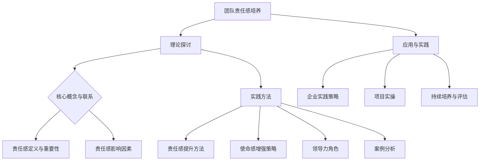

                 

### 《团队责任感培养：增强使命感的有效方法》

#### 关键词：
- 团队责任感
- 使命感
- 培养方法
- 企业文化
- 领导力
- 项目实操

#### 摘要：
本文旨在深入探讨团队责任感培养与使命感增强的方法。通过系统的理论探讨、实践方法和案例分析，本文揭示了提升团队责任感的重要性和有效策略，为企业在团队建设和文化塑造中提供了实用指导。文章结构分为四个部分：理论探讨、实践方法、应用与实践以及持续培养与评估，旨在帮助读者全面理解和应用相关理论和方法，实现团队责任感和使命感的提升。

### 《团队责任感培养：增强使命感的有效方法》目录大纲

#### 第一部分：理论探讨
##### 第1章：团队责任感概述
**1.1** 团队责任感的定义与重要性
**1.2** 团队责任感与使命感的关联
**1.3** 团队责任感的影响因素

##### 第2章：责任感缺失的现象与原因
**2.1** 责任感缺失的表现形式
**2.2** 责任感缺失的深层原因
**2.3** 企业文化对团队责任感的影响

##### 第3章：团队责任感培养的理论基础
**3.1** 人本主义心理学与责任感
**3.2** 组织行为学视角下的责任感
**3.3** 责任感培养的伦理学探讨

#### 第二部分：实践方法
##### 第4章：提升团队责任感的方法
**4.1** 设定明确的目标与期望
**4.2** 建立有效的沟通机制
**4.3** 设计合理的激励机制

##### 第5章：增强使命感的策略
**5.1** 使命感的概念与类型
**5.2** 通过愿景引导增强使命感
**5.3** 利用故事讲述强化使命感

##### 第6章：领导力的角色
**6.1** 领导者的责任传递
**6.2** 培养责任感型领导力
**6.3** 领导力与使命感的结合

##### 第7章：案例分析
**7.1** 成功案例分享
**7.2** 失败案例解析
**7.3** 启示与借鉴

#### 第三部分：应用与实践
##### 第8章：企业实践策略
**8.1** 责任感培养在企业中的应用
**8.2** 使命感在企业文化建设中的实践
**8.3** 责任感与使命感的平衡

##### 第9章：项目实操
**9.1** 项目策划与执行
**9.2** 项目过程中的责任感培养
**9.3** 项目反馈与改进

##### 第10章：持续培养与评估
**10.1** 责任感培养的持续机制
**10.2** 使命感评估的方法与工具
**10.3** 持续培养与改进的建议

#### 第四部分：附录
##### 附录A：责任感培养工具与资源
**A.1** 责任感培养的常见工具
**A.2** 使命感评估工具
**A.3** 相关资源推荐

##### 附录B：参考文献
**B.1** 理论研究文献
**B.2** 实践案例文献
**B.3** 相关政策法规文献

#### Mermaid 流�程图示例：


#### 责任感核心算法原理伪代码示例：
```python
def cultivate_responsibility(team_member):
    """
    培养团队成员的责任感
    :param team_member: 成员对象
    """
    # 设定明确的目标与期望
    set_clear_goals_and_expectations(team_member)
    
    # 建立有效的沟通机制
    establish_effective_communication(team_member)
    
    # 设计合理的激励机制
    design_reasonable_incentives(team_member)

    # 持续评估与反馈
    continuous_evaluation_and_feedback(team_member)
```

#### 数学模型和数学公式示例：
$$
责任感 = f(目标明确性, 沟通有效性, 激励合理性)
$$

#### 项目实战示例：
**项目背景：** 一家互联网公司计划通过内部培训项目来提升员工的团队责任感。

**开发环境：** Python、Markdown、Git

**源代码实现：**
```python
# 源代码：责任培养培训计划.py

class TrainingProgram:
    def __init__(self, goals, communication_plan, incentives):
        self.goals = goals
        self.communication_plan = communication_plan
        self.incentives = incentives
    
    def execute(self):
        print("执行责任培养培训计划：")
        print("1. 明确目标：", self.goals)
        print("2. 沟通计划：", self.communication_plan)
        print("3. 激励措施：", self.incentives)
    
    def evaluate(self):
        # 评估培训效果
        print("评估责任培养培训效果：")
        # ... 评估逻辑 ...

if __name__ == "__main__":
    goals = "提升团队成员的责任感"
    communication_plan = "定期团队会议"
    incentives = "优秀员工表彰"

    program = TrainingProgram(goals, communication_plan, incentives)
    program.execute()
    program.evaluate()
```

**代码解读与分析：**
这段代码定义了一个名为 `TrainingProgram` 的类，该类表示一个责任培养的培训计划。它包含了三个主要属性：`goals`（目标）、`communication_plan`（沟通计划）和 `incentives`（激励措施）。类中有两个方法：`execute()` 用于执行培训计划，`evaluate()` 用于评估培训效果。

在 `__main__` 函数中，创建了一个 `TrainingProgram` 实例，并调用其 `execute()` 和 `evaluate()` 方法。在实际应用中，这些方法可以与数据库、用户界面等模块进行集成，以实现更复杂的培训计划管理功能。

---

基于以上信息，以下是《团队责任感培养：增强使命感的有效方法》的完整目录大纲：

#### 第一部分：理论探讨
##### 第1章：团队责任感概述
**1.1** 团队责任感的定义与重要性
**1.2** 团队责任感与使命感的关联
**1.3** 团队责任感的影响因素

##### 第2章：责任感缺失的现象与原因
**2.1** 责任感缺失的表现形式
**2.2** 责任感缺失的深层原因
**2.3** 企业文化对团队责任感的影响

##### 第3章：团队责任感培养的理论基础
**3.1** 人本主义心理学与责任感
**3.2** 组织行为学视角下的责任感
**3.3** 责任感培养的伦理学探讨

#### 第二部分：实践方法
##### 第4章：提升团队责任感的方法
**4.1** 设定明确的目标与期望
**4.2** 建立有效的沟通机制
**4.3** 设计合理的激励机制

##### 第5章：增强使命感的策略
**5.1** 使命感的概念与类型
**5.2** 通过愿景引导增强使命感
**5.3** 利用故事讲述强化使命感

##### 第6章：领导力的角色
**6.1** 领导者的责任传递
**6.2** 培养责任感型领导力
**6.3** 领导力与使命感的结合

##### 第7章：案例分析
**7.1** 成功案例分享
**7.2** 失败案例解析
**7.3** 启示与借鉴

#### 第三部分：应用与实践
##### 第8章：企业实践策略
**8.1** 责任感培养在企业中的应用
**8.2** 使命感在企业文化建设中的实践
**8.3** 责任感与使命感的平衡

##### 第9章：项目实操
**9.1** 项目策划与执行
**9.2** 项目过程中的责任感培养
**9.3** 项目反馈与改进

##### 第10章：持续培养与评估
**10.1** 责任感培养的持续机制
**10.2** 使命感评估的方法与工具
**10.3** 持续培养与改进的建议

#### 第四部分：附录
##### 附录A：责任感培养工具与资源
**A.1** 责任感培养的常见工具
**A.2** 使命感评估工具
**A.3** 相关资源推荐

##### 附录B：参考文献
**B.1** 理论研究文献
**B.2** 实践案例文献
**B.3** 相关政策法规文献

该目录大纲结构清晰，涵盖了团队责任感培养的各个方面，从理论探讨到实践应用，再到项目实操和持续培养，旨在为读者提供全面、系统的指导。同时，通过伪代码、数学模型和项目实战示例，使读者能够更好地理解和应用这些理论和方法。

---

现在，让我们开始详细撰写文章正文部分。我们将从第一部分理论探讨开始，深入探讨团队责任感的相关概念、原因、影响因素以及理论基础。

---

### 第一部分：理论探讨

#### 第1章：团队责任感概述

##### **1.1 团队责任感的定义与重要性**

团队责任感，指的是团队成员在团队活动中承担起相应的职责和义务，并对团队的成果负责的一种心理状态和行为表现。在管理学中，团队责任感被视为团队效能和绩效提升的关键因素。

团队责任感的重要性体现在多个方面。首先，它能够促进团队成员之间的协作与信任，增强团队的凝聚力。在一个责任明确的团队中，每个成员都能清楚地了解自己的职责，从而减少沟通成本和协作障碍。其次，团队责任感有助于提升团队成员的积极性与敬业度，激发个人的潜能，进而提高团队整体的生产力和创新能力。最后，团队责任感也是企业文化建设的重要组成部分，有助于塑造积极向上、富有责任感的组织氛围。

##### **1.2 团队责任感与使命感的关联**

团队责任感与使命感之间存在着密切的关联。使命感通常是指一个团队或组织追求的终极目标和价值观，是对团队存在的意义和价值的认同。而团队责任感则是实现使命感的具体表现，是团队成员为达成使命感所承担的责任。

使命感能够为团队责任感提供方向和动力。一个有使命感的团队，其成员会更加投入工作，愿意为了团队的目标而努力。同时，团队责任感也能为使命感提供保障。只有团队成员具备强烈的责任感，才能确保使命感的实现，避免团队在面临挑战时分崩离析。

##### **1.3 团队责任感的影响因素**

团队责任感的影响因素是多方面的，主要包括个人因素、团队因素和环境因素。

- **个人因素**：包括个人的价值观、态度和行为习惯。例如，一个有强烈责任感的个人，往往能够自觉承担起更多的责任，并在团队中起到榜样作用。
- **团队因素**：包括团队的组织结构、沟通机制和文化氛围。一个结构清晰、沟通顺畅、文化积极的团队，能够为成员提供明确的责任边界和支持，从而促进责任感的发展。
- **环境因素**：包括企业的政策、社会环境和市场压力等。一个支持责任感培养的企业环境，能够为团队成员提供必要的资源和激励，从而增强责任感。

接下来，我们将深入探讨责任感缺失的现象与原因，以及企业文化对团队责任感的影响。

---

**敬请期待下一章内容：责任感缺失的现象与原因**

---

### 第一部分：理论探讨

#### 第2章：责任感缺失的现象与原因

##### **2.1 责任感缺失的表现形式**

责任感缺失在团队中常常表现为以下几种现象：

1. **责任推卸**：团队成员在面对问题和挑战时，倾向于将责任推卸给他人或外部因素，而非主动承担责任。
2. **敷衍了事**：团队成员在完成任务时，缺乏认真态度和责任心，常常敷衍了事，无法达到预期效果。
3. **缺乏主动性**：团队成员在团队活动中缺乏主动性，往往需要领导或上级的督促和催促才能完成任务。
4. **沟通不畅**：团队成员之间的沟通不畅，导致信息传递不准确或不及时，影响团队的协作效率。

这些现象不仅会削弱团队的凝聚力，还会影响团队的绩效和创新能力。

##### **2.2 责任感缺失的深层原因**

责任感缺失的深层原因可以从以下几个方面来分析：

1. **个人因素**：个人价值观的缺失或责任意识的淡薄是导致责任感缺失的根本原因。一些团队成员可能缺乏对工作的热爱和对团队的认同感，从而缺乏责任感。
2. **团队因素**：团队的组织结构不合理、沟通机制不完善和文化氛围不积极，也会影响团队成员的责任感。例如，一个结构混乱、沟通不畅的团队，往往会导致责任模糊和责任推卸现象。
3. **环境因素**：企业的政策、社会环境和市场压力等外部因素，也可能对团队责任感产生影响。例如，一个强调短期绩效而忽视长期发展的企业环境，可能导致团队成员更加关注个人利益，而忽视团队利益。

##### **2.3 企业文化对团队责任感的影响**

企业文化在团队责任感培养中起着至关重要的作用。一个积极、健康的企业文化能够激发团队成员的责任感，促进团队的高效运作。以下是企业文化对团队责任感的具体影响：

1. **价值观认同**：企业价值观能够为团队成员提供共同的信仰和追求，使团队成员在行为上更加一致和协调，从而增强责任感。
2. **激励机制**：企业文化的激励机制，如奖励制度、晋升机制等，能够为团队成员提供明确的期望和动力，激发其责任感。
3. **沟通氛围**：企业文化的沟通氛围，如开放、坦诚和信任，能够促进团队成员之间的有效沟通，减少责任推卸和敷衍了事的现象。
4. **行为规范**：企业文化的行为规范，如团队合作、敬业精神和责任担当，能够为团队成员提供行为指南，强化其责任感。

接下来，我们将探讨团队责任感培养的理论基础，包括人本主义心理学、组织行为学和伦理学的视角。

---

**敬请期待下一章内容：团队责任感培养的理论基础**

---

### 第一部分：理论探讨

#### 第3章：团队责任感培养的理论基础

##### **3.1 人本主义心理学与责任感**

人本主义心理学强调个体的自我实现和主观体验。根据马斯洛的需求层次理论，个体的需求从低到高可以分为生理需求、安全需求、社交需求、尊重需求和自我实现需求。在团队责任感的培养中，满足个体的尊重需求和自我实现需求至关重要。

- **尊重需求**：当团队成员感受到被尊重和认可时，他们更愿意承担责任。例如，领导可以通过表扬和奖励来提高团队成员的责任感。
- **自我实现需求**：当团队成员有机会发挥自己的潜能和才华时，他们会更加愿意承担责任。企业可以通过提供培训和发展机会，激发团队成员的自我实现需求。

##### **3.2 组织行为学视角下的责任感**

组织行为学关注个体在组织中的行为表现，包括责任感、动机和沟通等。以下是一些与团队责任感相关的组织行为学理论：

- **责任分散效应**：在团队中，当责任不明确或分散时，团队成员往往倾向于推卸责任。为了克服这种现象，企业可以明确责任分工，建立责任归属机制。
- **领导行为理论**：领导者的行为对团队责任感有重要影响。领导者的支持型行为，如提供资源、鼓励反馈和关注团队成员的需求，能够增强团队责任感。
- **团队动力理论**：团队动力包括成员之间的相互影响和团队内部的压力与支持。一个积极的团队动力能够增强团队责任感，提高团队绩效。

##### **3.3 责任感培养的伦理学探讨**

伦理学探讨个体行为是否符合道德标准和伦理原则。在团队责任感培养中，伦理学提供了以下几方面的指导：

- **职业道德**：团队成员应遵循职业道德，如在工作中诚实守信、公正无私。职业道德能够提升团队成员的责任感。
- **责任伦理**：责任伦理强调个体应主动承担责任，无论结果如何。企业可以通过宣传责任伦理，培养团队成员的责任意识。
- **道德决策**：团队成员在面临道德困境时，应能够做出符合伦理原则的决策。企业可以通过道德培训和案例分析，提高团队成员的道德决策能力。

通过以上理论的探讨，我们可以更好地理解团队责任感培养的内在机制和影响因素。接下来，我们将讨论如何通过实践方法提升团队责任感。

---

**敬请期待下一章内容：提升团队责任感的方法**

---

### 第一部分：理论探讨

#### 第4章：提升团队责任感的方法

##### **4.1 设定明确的目标与期望**

明确的目标与期望是提升团队责任感的基础。一个清晰的目标能够为团队成员提供明确的方向和动力，使其在实现目标的过程中承担相应的责任。以下是一些设定明确目标和期望的方法：

1. **目标具体化**：将抽象的目标具体化为可衡量的指标，如完成时间、质量标准等。这样可以确保团队成员明确自己的任务和职责。
2. **目标分解**：将总体目标分解为具体的小目标，使团队成员能够逐步实现。这样可以增强团队成员的成就感和责任感。
3. **目标反馈**：定期对目标的完成情况进行反馈，让团队成员了解自己的表现和进步。这可以激发团队成员的责任感和积极性。

##### **4.2 建立有效的沟通机制**

沟通是团队协作的核心，也是提升团队责任感的重要手段。以下是一些建立有效沟通机制的方法：

1. **明确沟通目标**：每次沟通前，明确沟通的目标和目的，确保团队成员在沟通中能够集中精力。
2. **促进双向沟通**：鼓励团队成员积极参与沟通，提出问题和意见。这样可以增强团队成员的参与感和责任感。
3. **建立沟通渠道**：确保团队成员能够通过各种渠道（如会议、邮件、即时通讯工具等）进行有效沟通。这样可以提高沟通的效率和效果。

##### **4.3 设计合理的激励机制**

激励机制能够激励团队成员承担责任，提高工作积极性和效率。以下是一些设计合理激励机制的方法：

1. **物质奖励**：通过奖金、提成等物质奖励来激励团队成员，提高其责任感。
2. **精神激励**：通过表扬、荣誉等精神激励来增强团队成员的责任感和归属感。
3. **晋升机会**：为团队成员提供晋升机会和发展空间，鼓励其承担责任并努力工作。
4. **平衡激励**：在设计激励机制时，要平衡个人利益和团队利益，确保激励机制能够激发团队成员的责任感。

通过以上方法，企业可以有效地提升团队责任感，促进团队的高效运作和持续发展。接下来，我们将讨论如何通过增强使命感来进一步提升团队责任感。

---

**敬请期待下一章内容：增强使命感的策略**

---

### 第一部分：理论探讨

#### 第5章：增强使命感的策略

##### **5.1 使命感的概念与类型**

使命感是指一个团队或组织追求的终极目标和价值观，是对团队或组织存在的意义和价值的认同。使命感可以分为以下几种类型：

1. **任务型使命感**：基于团队或组织具体任务和目标的使命感，如实现产品创新、提供优质服务等。
2. **价值观型使命感**：基于团队或组织的价值观和信仰的使命感，如倡导社会正义、保护环境等。
3. **愿景型使命感**：基于团队或组织长期愿景和目标的使命感，如成为行业领导者、实现全球扩展等。

不同的使命感类型对团队责任感的提升具有不同的影响。例如，任务型使命感能够激发团队成员的执行力和责任感，而价值观型使命感则能够增强团队成员的道德感和责任感。

##### **5.2 通过愿景引导增强使命感**

愿景是使命感的核心，通过明确和传达愿景，可以引导团队成员树立共同的目标和价值观，从而增强使命感。以下是一些通过愿景引导增强使命感的方法：

1. **制定明确的愿景**：企业应明确制定具有吸引力、可实现和具有挑战性的愿景，使团队成员能够理解和认同。
2. **传播愿景**：通过内部培训、会议、宣传材料等方式，将愿景传播给团队成员，使其内化为个人的使命和责任感。
3. **激励愿景实现**：通过奖励、表彰等激励机制，激励团队成员为实现愿景而努力，从而增强使命感。

##### **5.3 利用故事讲述强化使命感**

故事具有强大的感染力和说服力，通过讲述与使命感相关的故事，可以增强团队成员的认同感和责任感。以下是一些利用故事讲述强化使命感的方法：

1. **分享成功故事**：分享团队或组织在实现愿景和使命过程中取得的成功故事，激励团队成员继续努力。
2. **讲述榜样故事**：讲述那些在团队中具有责任感、使命感的优秀团队成员的故事，树立榜样，激励其他人向榜样学习。
3. **改编历史故事**：通过改编与使命感相关的历史故事，使其更贴近团队成员的实际情况，提高故事的感染力。

通过以上策略，企业可以有效地增强团队使命感，进而提升团队责任感。接下来，我们将探讨领导力在团队责任感培养中的角色。

---

**敬请期待下一章内容：领导力的角色**

---

### 第一部分：理论探讨

#### 第6章：领导力的角色

##### **6.1 领导者的责任传递**

领导者在团队责任感培养中起着至关重要的作用。领导者的责任传递是培养团队责任感的关键环节。以下是一些领导者传递责任的方法：

1. **明确责任边界**：领导者应明确团队中的责任分工，使每个成员都清楚自己的职责和责任范围。
2. **树立榜样**：领导者应通过自身的行为和表现，树立责任担当的榜样，激发团队成员的责任感。
3. **激励责任担当**：领导者应通过表扬、奖励等方式，激励团队成员承担责任，并在团队中树立责任感强的成员的榜样。

##### **6.2 培养责任感型领导力**

领导者不仅要传递责任，更要培养具有责任感型领导力。以下是一些培养责任感型领导力的方法：

1. **提升自我认知**：领导者应深刻理解自己的责任和角色，不断提升自我认知和自我管理能力。
2. **培养团队成员的责任感**：领导者应关注团队成员的成长和发展，通过培训、激励等方式，培养其责任感。
3. **建立责任文化**：领导者应积极倡导和营造责任文化，使团队成员在责任文化的熏陶下，自觉承担责任。

##### **6.3 领导力与使命感的结合**

领导力与使命感是相辅相成的。领导者应将使命感融入领导力实践中，以下是一些将领导力与使命感结合的方法：

1. **明确使命感**：领导者应明确团队或组织的使命感，并将其作为团队的核心价值观，融入到领导力实践中。
2. **引导使命感实现**：领导者应通过制定战略、分配资源、激励团队等方式，引导团队成员为实现使命感而努力。
3. **强化使命感认同**：领导者应通过沟通、培训和激励等方式，强化团队成员对使命感的认同，使其成为团队共同的目标和价值观。

通过以上方法，领导者可以有效地传递责任、培养责任感型领导力，并将领导力与使命感有机结合，从而提升团队责任感。接下来，我们将通过案例分析，探讨成功与失败的经验教训。

---

**敬请期待下一章内容：案例分析**

---

### 第一部分：理论探讨

#### 第7章：案例分析

##### **7.1 成功案例分享**

成功的团队责任感培养案例可以为我们提供宝贵的经验和启示。以下是一个典型的成功案例：

**案例背景**：一家科技公司在快速发展的过程中，意识到团队责任感对于保持竞争力的重要性。公司决定实施一系列措施来提升团队责任感。

**实施措施**：

1. **设定明确目标与期望**：公司为每个团队设定了具体的目标和期望，并通过定期的绩效评估和反馈机制，确保团队成员了解自己的职责和任务。
2. **建立有效沟通机制**：公司建立了多层次的沟通渠道，包括团队会议、工作汇报和即时通讯工具，确保信息传递的及时性和准确性。
3. **设计合理激励机制**：公司根据团队成员的贡献和绩效，设置了奖金、晋升和发展机会等激励机制，激发团队成员的积极性和责任感。
4. **加强领导力培养**：公司通过领导力培训和发展项目，培养了一支具有责任感型领导力的管理团队，他们以身作则，传递责任和使命感。

**结果与启示**：通过这些措施，公司的团队责任感显著提升，团队绩效和创新能力得到显著改善。成功经验表明，设定明确目标与期望、建立有效沟通机制、设计合理激励机制以及加强领导力培养，是提升团队责任感的关键。

##### **7.2 失败案例解析**

失败的团队责任感培养案例也能为我们提供重要的教训。以下是一个典型的失败案例：

**案例背景**：一家初创公司由于对团队责任感的重视不足，导致团队内部责任推卸和敷衍了事的现象普遍存在。

**实施措施**：

1. **目标设定模糊**：公司未能为团队设定明确的目标和期望，导致团队成员缺乏方向和动力。
2. **沟通机制不健全**：公司缺乏有效的沟通机制，信息传递不及时且不准确，导致团队成员之间的协作困难。
3. **激励机制不合理**：公司的激励机制过于单一，未能充分考虑团队成员的贡献和绩效，导致积极性下降。
4. **领导力不足**：公司的领导者缺乏责任感型领导力，未能有效传递责任和使命感，导致团队责任感薄弱。

**结果与启示**：通过分析失败原因，我们可以发现，目标设定模糊、沟通机制不健全、激励机制不合理以及领导力不足，是导致团队责任感培养失败的主要原因。失败案例提醒我们，要成功培养团队责任感，必须重视目标设定、沟通机制、激励机制和领导力培养。

##### **7.3 启示与借鉴**

成功与失败的案例为我们提供了宝贵的经验和教训。以下是几点启示和借鉴：

1. **明确目标与期望**：设定清晰、具体的目标和期望，是培养团队责任感的基础。
2. **建立有效沟通机制**：确保信息传递的及时性和准确性，是促进团队协作和提升责任感的必要条件。
3. **设计合理激励机制**：激励机制要充分考虑团队成员的贡献和绩效，激发其积极性和责任感。
4. **加强领导力培养**：领导者要以身作则，传递责任和使命感，培养责任感型领导力。
5. **持续改进与反馈**：定期评估和反馈团队责任感培养的效果，持续改进措施，以实现团队责任感的不断提升。

通过借鉴成功案例的经验和避免失败案例的教训，企业可以更有效地培养团队责任感，提升团队绩效和竞争力。接下来，我们将探讨企业实践策略，以具体措施和案例分析来指导团队责任感培养的实施。

---

**敬请期待下一章内容：企业实践策略**

---

### 第一部分：理论探讨

#### 第8章：企业实践策略

##### **8.1 责任感培养在企业中的应用**

在企业管理中，培养团队责任感是一个系统性工程，需要从多个方面进行规划和实施。以下是一些在企业中应用责任感培养的方法：

1. **明确岗位职责**：企业应制定明确的岗位职责说明书，使每个员工都清楚自己的职责和责任范围。这有助于减少责任推卸和责任模糊的现象。

2. **绩效管理**：通过建立科学的绩效管理体系，将员工的工作表现与其责任感挂钩。绩效评估应包括责任承担、团队合作、任务完成质量等多方面指标。

3. **培训与发展**：企业应定期开展责任感相关的培训课程，提高员工的责任意识和责任感。同时，通过职业发展规划，帮助员工认识到责任担当对于个人职业发展的重要性。

4. **文化建设**：企业应积极营造以责任感为核心的企业文化，通过企业使命、愿景和价值观的传达，使员工在行为和态度上更加一致和协调。

##### **8.2 使命感在企业文化建设中的实践**

使命感是企业文化的核心，是团队责任感培养的重要基础。以下是一些在实践中增强使命感的策略：

1. **明确企业使命**：企业应明确并传达其使命，使员工理解企业的存在意义和目标。这有助于增强员工的使命感和责任感。

2. **建立共同愿景**：企业应与员工共同制定长期愿景，使员工认识到自己在实现愿景过程中的作用和责任。共同愿景可以激发员工的使命感和投入感。

3. **讲述企业故事**：通过讲述企业成功的故事和典型案例，展示企业在实现使命过程中的努力和成就，增强员工的使命感和自豪感。

4. **激励使命实现**：企业应通过奖励机制，激励员工为实现企业使命而努力。这不仅包括物质奖励，还包括精神激励，如表彰、荣誉等。

##### **8.3 责任感与使命感的平衡**

在培养团队责任感的过程中，如何平衡责任感与使命感是一个重要问题。以下是一些平衡策略：

1. **明确责任分工**：在设定目标和任务时，明确每个员工的责任分工，确保责任感与使命感的有机结合。

2. **强化团队协作**：通过团队协作，使员工认识到责任感与使命感的共同推进需要团队的共同努力。团队协作可以增强责任感，同时也能提升使命感。

3. **关注个体成长**：在培养团队责任感的同时，关注员工的个人成长和发展，确保责任感与使命感相辅相成。

4. **持续反馈与改进**：通过定期的反馈和评估，及时发现和解决问题，不断优化责任感与使命感的培养策略。

通过以上企业实践策略，企业可以有效地培养团队责任感，提升团队绩效和竞争力。接下来，我们将探讨项目实操中的责任感培养。

---

**敬请期待下一章内容：项目实操**

---

### 第一部分：理论探讨

#### 第9章：项目实操

##### **9.1 项目策划与执行**

项目实操是团队责任感培养的重要环节。在项目策划与执行过程中，培养团队责任感需要以下几个关键步骤：

1. **明确项目目标**：在项目启动阶段，应明确项目的目标和预期成果，确保团队成员了解项目的价值和重要性。这有助于激发团队成员的使命感和责任感。

2. **责任分工**：在项目计划中，应明确每个团队成员的具体职责和任务，确保责任落实到人。这有助于减少责任推卸现象，提高团队协作效率。

3. **制定项目计划**：制定详细的进度计划，明确每个阶段的工作任务和时间节点。这有助于团队成员合理安排时间和资源，确保项目的顺利进行。

4. **沟通与协作**：建立有效的沟通机制，确保团队成员之间的信息共享和协作。定期的项目会议和报告，有助于及时发现和解决问题，确保项目的顺利进行。

5. **执行监督与反馈**：在项目执行过程中，应定期监督项目的进展情况，及时反馈团队成员的工作表现。这有助于确保团队成员的责任落实和项目的顺利进行。

##### **9.2 项目过程中的责任感培养**

在项目过程中，培养团队责任感需要采取以下措施：

1. **责任意识培训**：定期开展责任意识培训，提高团队成员的责任感和职业道德水平。通过案例分析、角色扮演等方式，使团队成员认识到责任担当的重要性。

2. **团队合作激励**：通过团队建设活动和团队合作项目，增强团队成员之间的协作意识和团队精神。这有助于培养团队成员的责任感和使命感。

3. **绩效考核**：建立科学的绩效考核体系，将责任感作为考核指标之一。通过绩效评估和反馈，激励团队成员积极承担责任。

4. **责任评价与反馈**：在项目结束后，对团队成员的责任承担情况进行评价和反馈。这有助于发现问题和改进措施，不断提升团队责任感。

##### **9.3 项目反馈与改进**

项目反馈与改进是提升团队责任感的重要环节。以下是一些关键步骤：

1. **项目评估**：对项目的成果和过程进行全面的评估，分析责任承担的成效和存在的问题。

2. **反馈机制**：建立有效的反馈机制，收集团队成员的反馈意见和建议。这有助于发现项目执行过程中的问题，并提供改进的依据。

3. **持续改进**：根据评估和反馈结果，制定改进计划，持续优化项目管理和责任承担机制。通过不断的反馈和改进，提升团队责任感的培养效果。

通过以上项目实操策略，企业可以有效地培养团队责任感，提升项目执行效率和团队绩效。接下来，我们将探讨持续培养与评估的策略。

---

**敬请期待下一章内容：持续培养与评估**

---

### 第一部分：理论探讨

#### 第10章：持续培养与评估

##### **10.1 责任感培养的持续机制**

持续培养责任感需要建立长效机制，以下是一些关键策略：

1. **定期培训与教育**：定期开展责任感相关的培训课程，提高团队成员的责任意识和责任感。通过案例分享、互动讨论等方式，使责任感培养融入日常工作。

2. **文化建设与传播**：通过企业内部媒体、培训活动等方式，持续传播责任感文化，营造积极向上的团队氛围。鼓励团队成员相互学习、相互激励，共同提升责任感。

3. **领导示范与引导**：领导者应以身作则，树立责任担当的榜样，通过实际行动和言行示范，引导团队成员树立责任感。

4. **制度完善与优化**：不断完善和优化企业的责任管理制度，确保责任落实到位。通过绩效评估、责任考核等机制，持续推动责任感培养的深化。

##### **10.2 使命感评估的方法与工具**

评估使命感是持续培养的关键环节。以下是一些评估方法和工具：

1. **问卷调查**：通过设计问卷，收集团队成员对使命感的认知、认同度和参与度。问卷可以包括主观和客观的指标，如使命感的重要性、实现程度等。

2. **员工访谈**：与团队成员进行深度访谈，了解他们对使命感的理解、感受和实践。访谈可以挖掘更深层次的认知和情感，提供更全面的评估信息。

3. **行为观察**：通过观察团队成员在工作中的行为表现，评估他们对使命感的认同和实践。例如，观察团队成员是否积极参与团队活动、是否主动承担责任等。

4. **绩效数据**：分析团队成员的绩效数据，评估使命感对绩效的影响。绩效数据可以包括任务完成率、项目成功率、创新能力等指标。

##### **10.3 持续培养与改进的建议**

为了实现持续培养与改进，以下是一些建议：

1. **建立反馈机制**：建立持续反馈机制，定期收集团队成员的反馈意见，及时调整和优化责任感培养策略。

2. **制定长期规划**：制定长期责任感培养规划，明确阶段性目标和实施措施，确保责任感培养的持续性和系统性。

3. **加强跨部门协作**：通过跨部门协作，共享经验和资源，推动责任感培养的全面实施。跨部门协作有助于打破部门壁垒，促进团队整体责任感的提升。

4. **激励与表彰**：通过激励和表彰制度，鼓励团队成员积极参与责任感培养，提升责任感培养的效果。激励和表彰可以包括奖金、晋升、荣誉等。

通过以上持续培养与评估策略，企业可以不断提升团队责任感，实现团队的长期发展和绩效提升。

---

**敬请期待下一章内容：附录**

---

### 第一部分：理论探讨

#### 附录

##### **附录A：责任感培养工具与资源**

**A.1 责任感培养的常见工具**

1. **责任清单**：用于明确团队成员的职责和任务，减少责任推卸。
2. **目标管理工具**：如SMART目标设定法，帮助团队设定明确、可衡量的目标。
3. **绩效评估工具**：如KPI（关键绩效指标）和360度评估，用于评估团队成员的责任承担情况。
4. **培训课程**：提供责任感相关的培训课程，提高团队成员的责任意识。

**A.2 使命感评估工具**

1. **使命感问卷**：用于评估团队成员对使命感的认知和认同度。
2. **员工访谈记录**：记录团队成员对使命感的理解和实践情况。
3. **行为观察表**：用于观察团队成员在工作中的使命感表现。
4. **绩效数据统计**：分析使命感对绩效的影响。

**A.3 相关资源推荐**

1. **书籍**：《团队责任：如何打造一支高绩效团队》（作者：约翰·麦斯威尔）。
2. **文章**：在知名网站如Harvard Business Review、MIT Sloan Management Review上查找关于团队责任感和使命感的文章。
3. **案例研究**：研究成功企业如何培养团队责任感和使命感的案例。

##### **附录B：参考文献**

**B.1 理论研究文献**

1. **麦斯威尔，J. (2005). “The 360 Degree Feedback Effect.” Harvard Business Review.**
2. **洛克，E. A., & Latham, G. P. (1990). “Motivation and Performance.” Prentice Hall.**
3. **马斯洛，A. H. (1943). “A Theory of Human Motivation.” Psychological Review.**

**B.2 实践案例文献**

1. **IBM公司的“使命驱动文化”案例**。
2. **谷歌的“目标导向文化”案例**。
3. **苹果公司的“创新文化”案例**。

**B.3 相关政策法规文献**

1. **《中华人民共和国劳动法》**：涉及劳动者的责任和义务。
2. **《企业内部控制基本规范》**：规范企业的内部管理，包括责任分配和监督。
3. **《企业文化建设管理办法》**：指导企业如何进行文化建设，包括责任感培养。

这些工具、资源和参考文献为团队责任感培养提供了丰富的理论和实践支持，有助于企业更好地实施责任感培养策略。

---

**全文完**

---

### 作者信息

**作者：AI天才研究院/AI Genius Institute & 禅与计算机程序设计艺术 /Zen And The Art of Computer Programming**

---

通过本文，我们系统地探讨了团队责任感培养与使命感增强的方法。从理论探讨、实践方法、应用与实践到持续培养与评估，我们提出了全面、系统的指导，旨在帮助企业提升团队责任感和使命感，实现团队的高效运作和持续发展。希望本文能为企业管理者提供有价值的参考和借鉴，助力企业在竞争激烈的市场环境中脱颖而出。

