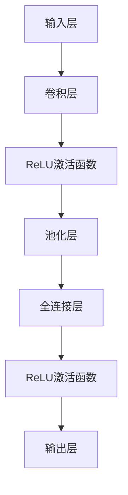
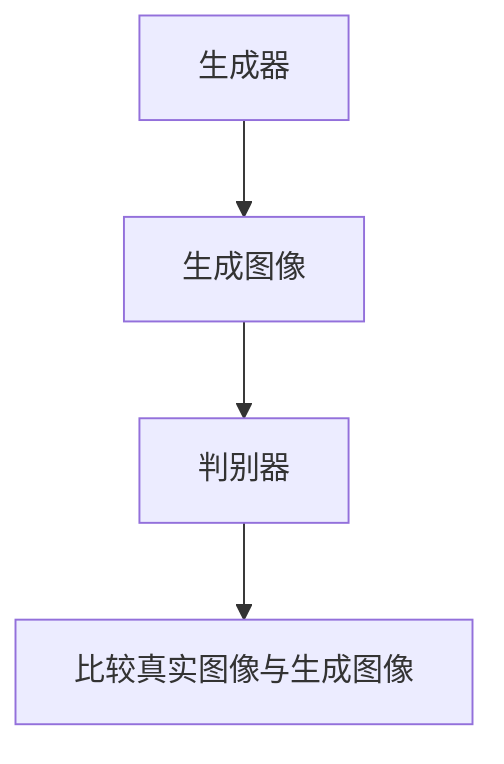

                 

### 文章标题

# 图像分类：从基础到前沿的深度解析

> 关键词：图像分类、深度学习、卷积神经网络（CNN）、目标检测、实例分割、图像生成、生成对抗网络（GAN）、应用场景、发展趋势

> 摘要：本文将全面解析图像分类技术，从基础概念到高级应用，从数学模型到实际项目实战，深入探讨图像分类的发展历程、核心技术及其在不同领域的应用。通过详细讲解图像分类的关键理论、算法原理和项目实战，帮助读者全面掌握图像分类技术，展望其未来发展趋势。

### 第一部分：图像分类基础

#### 第1章：图像分类概述

## 1.1 图像分类的起源与发展

图像分类（Image Classification）是计算机视觉（Computer Vision）领域的一项重要任务，其核心目的是通过算法将图像或视频中的对象识别并分类到预定义的类别中。图像分类技术的起源可以追溯到20世纪60年代，当时的计算机科学家开始尝试通过编程来处理和识别图像中的基本特征。

### 1.2 图像分类的重要性及应用领域

图像分类技术在各个领域都有着广泛的应用，包括但不限于：

- **医学影像诊断**：通过图像分类技术，可以辅助医生对影像数据进行诊断，提高诊断的准确性和效率。
- **智能监控**：图像分类技术被广泛应用于智能监控系统，用于实时监测和识别异常行为或事件。
- **自动驾驶**：自动驾驶汽车需要通过图像分类技术识别道路上的各种对象，如车辆、行人、交通标志等，以确保行车安全。
- **自然语言处理**：图像分类技术可以与自然语言处理（NLP）技术相结合，实现图像与文本的关联，提升人机交互体验。
- **工业自动化**：图像分类技术在工业自动化中用于检测生产线上的缺陷产品，提高生产效率和产品质量。

### 1.3 图像分类的主要挑战

尽管图像分类技术已经取得了一定的进展，但在实际应用中仍然面临以下主要挑战：

- **数据多样性**：真实世界中的图像数据是多样化的，如何处理不同场景、光照条件、视角下的图像成为一大挑战。
- **过拟合**：模型在训练数据上表现良好，但在未见数据上表现不佳，如何防止过拟合是一个重要问题。
- **计算资源**：深度学习模型尤其是卷积神经网络（CNN）模型通常需要大量的计算资源，如何在有限的资源下实现高效的图像分类是一个技术难题。

## 第2章：图像分类的核心概念与联系

## 2.1 图像分类的基本原理

图像分类的基本原理是基于机器学习（Machine Learning）和深度学习（Deep Learning）的方法。在图像分类任务中，模型的输入是一个图像，输出是该图像属于哪一个预定义的类别。常见的机器学习方法包括决策树（Decision Tree）、支持向量机（Support Vector Machine，SVM）等，而深度学习方法主要基于卷积神经网络（Convolutional Neural Network，CNN）。

### 2.2 机器学习与深度学习在图像分类中的应用

机器学习在图像分类中的应用主要是通过训练分类器来识别图像中的对象。分类器的训练依赖于大量的标注数据，这些数据通常由专家或人工标注。深度学习在图像分类中的应用则更加广泛，通过多层神经网络的结构，自动从原始图像中提取特征，从而实现分类任务。

### 2.3 卷积神经网络（CNN）的基本结构

卷积神经网络（CNN）是深度学习在图像分类中应用最广泛的一种模型。其基本结构包括以下几个部分：

1. **卷积层（Convolutional Layer）**：卷积层通过卷积操作提取图像的特征。
2. **激活函数（Activation Function）**：常用的激活函数包括ReLU（Rectified Linear Unit）。
3. **池化层（Pooling Layer）**：池化层用于降低特征图的维度，减少参数数量。
4. **全连接层（Fully Connected Layer）**：全连接层将特征图展平，进行分类预测。

### 第3章：图像分类的数学模型与算法原理

## 3.1 矩阵运算与图像处理基础

图像在计算机中的表示通常是二维矩阵，每个元素表示图像中的像素值。矩阵运算在图像处理中至关重要，包括矩阵的加法、减法、乘法、转置等。这些运算为图像处理算法的实现提供了基础。

### 3.2 神经网络与反向传播算法

神经网络（Neural Network）是机器学习的基础，通过模拟生物神经网络的结构和工作原理，实现对数据的分类和回归任务。反向传播算法（Backpropagation Algorithm）是神经网络训练的核心，通过计算梯度来更新网络的权重，从而优化模型。

### 3.3 卷积操作与池化操作

卷积操作是CNN中最核心的部分，通过卷积核（Filter）在图像上滑动，提取图像的局部特征。池化操作则用于降低特征图的维度，常用的池化方法包括最大池化（Max Pooling）和平均池化（Average Pooling）。

### 3.4 深度学习的优化方法

深度学习模型的优化方法主要包括随机梯度下降（Stochastic Gradient Descent，SGD）、Adam优化器等。这些方法通过调整学习率、批量大小等参数，优化模型的训练过程。

### 第4章：图像分类的数学模型与详细讲解

## 4.1 激活函数与导数计算

激活函数在神经网络中用于引入非线性，常用的激活函数包括ReLU（Rectified Linear Unit）、Sigmoid和Tanh。计算激活函数的导数是反向传播算法中的关键步骤。

### 4.2 损失函数与优化目标

损失函数（Loss Function）用于度量预测值与真实值之间的差距，常用的损失函数包括均方误差（MSE）和交叉熵（Cross Entropy）。优化目标是最小化损失函数，从而得到最优的分类模型。

### 4.3 过拟合与正则化

过拟合是指模型在训练数据上表现很好，但在未见数据上表现不佳。为了防止过拟合，可以采用正则化（Regularization）技术，如L1正则化、L2正则化。

### 4.4 学习率调整与训练策略

学习率调整是深度学习训练中的一个重要环节，合理调整学习率可以加速模型的收敛。训练策略包括批量归一化（Batch Normalization）、数据增强（Data Augmentation）等，以提高模型的泛化能力。

### 第5章：项目实战：手写数字识别

## 5.1 项目背景与数据集介绍

手写数字识别（Handwritten Digit Recognition）是图像分类中的一个经典问题，其数据集通常包括MNIST、Kaggle Handwritten Digit等。这些数据集包含了大量的手写数字图像，适用于训练和测试图像分类模型。

### 5.2 环境搭建与代码实现

为了进行手写数字识别项目，首先需要搭建一个开发环境，包括安装Python、TensorFlow等库。以下是搭建环境的基本步骤：

1. 安装Python：从官方网站下载并安装Python。
2. 安装TensorFlow：使用pip命令安装TensorFlow。

```shell
pip install tensorflow
```

3. 安装其他依赖库：根据项目需要，安装其他依赖库，如NumPy、Pandas等。

### 5.3 模型训练与优化

在搭建好开发环境后，可以开始实现手写数字识别模型。以下是使用TensorFlow实现手写数字识别模型的基本步骤：

1. 导入数据集：使用TensorFlow内置的MNIST数据集。

```python
import tensorflow as tf

mnist = tf.keras.datasets.mnist
(x_train, y_train), (x_test, y_test) = mnist.load_data()
```

2. 数据预处理：将图像数据缩放到0-1之间，并转换为TensorFlow的张量。

```python
x_train, x_test = x_train / 255.0, x_test / 255.0
x_train = x_train.reshape(-1, 28, 28, 1)
x_test = x_test.reshape(-1, 28, 28, 1)
```

3. 构建模型：使用TensorFlow的Keras API构建卷积神经网络模型。

```python
model = tf.keras.Sequential([
  tf.keras.layers.Conv2D(32, (3,3), activation='relu', input_shape=(28, 28, 1)),
  tf.keras.layers.MaxPooling2D(2, 2),
  tf.keras.layers.Flatten(),
  tf.keras.layers.Dense(128, activation='relu'),
  tf.keras.layers.Dense(10, activation='softmax')
])
```

4. 编译模型：设置优化器和损失函数。

```python
model.compile(optimizer='adam',
              loss='sparse_categorical_crossentropy',
              metrics=['accuracy'])
```

5. 训练模型：使用训练数据训练模型。

```python
model.fit(x_train, y_train, epochs=5)
```

6. 评估模型：使用测试数据评估模型性能。

```python
test_loss, test_acc = model.evaluate(x_test,  y_test, verbose=2)
print('\nTest accuracy:', test_acc)
```

### 5.4 结果分析与模型评估

在完成模型训练后，可以通过分析测试结果来评估模型性能。以下是一些评估指标：

- **准确率（Accuracy）**：模型正确预测的样本数占总样本数的比例。
- **召回率（Recall）**：模型正确预测的样本数占所有实际正样本数的比例。
- **精确率（Precision）**：模型正确预测的样本数占所有预测为正样本的样本数的比例。

```python
predictions = model.predict(x_test)
predicted_classes = np.argmax(predictions, axis=1)
confusion_matrix = metrics.confusion_matrix(y_test, predicted_classes)

print("Confusion Matrix:")
print(confusion_matrix)
```

通过这些指标，可以全面了解模型在不同类别上的表现，从而进行进一步的优化和调整。

### 第二部分：图像分类高级应用

#### 第6章：目标检测

## 6.1 目标检测的基本概念

目标检测（Object Detection）是图像分类的进一步扩展，其目标是在图像中识别并定位多个对象。与图像分类不同，目标检测需要同时输出对象的类别和位置信息。常见的目标检测算法包括YOLO（You Only Look Once）、SSD（Single Shot MultiBox Detector）和Faster R-CNN（Region-based Convolutional Networks）等。

### 6.2 基于深度学习的目标检测算法

基于深度学习的目标检测算法通常包括以下步骤：

1. **特征提取**：使用卷积神经网络提取图像的特征。
2. **区域提议**：通过区域提议方法（如区域生成网络RPN）生成可能包含目标的区域。
3. **分类与定位**：对每个区域进行分类并调整其位置，以确定其具体位置。

### 6.3 项目实战：行人检测

行人检测是目标检测中的一个典型应用，其目标是在图像中识别和定位行人。以下是一个简单的行人检测项目：

1. **数据集准备**：收集并标注行人图像，常用的数据集包括COCO（Common Objects in Context）和PASCAL VOC（PASCAL Visual Object Classes）等。

2. **模型训练**：使用预训练的卷积神经网络模型（如Faster R-CNN）进行训练，调整模型参数以适应行人检测任务。

3. **模型部署**：将训练好的模型部署到实际应用中，如智能监控系统。

4. **性能评估**：使用测试数据集评估模型性能，包括准确率、召回率等指标。

### 第7章：实例分割

## 7.1 实例分割的基本概念

实例分割（Instance Segmentation）是图像分类和目标检测的进一步扩展，其目标是在图像中识别并定位多个对象，同时区分每个对象的实例。实例分割需要输出每个对象的位置、形状和类别信息。常见的实例分割算法包括Mask R-CNN、实例分割网络（Instance Segmentation Network）和PointRend等。

### 7.2 基于深度学习的实例分割算法

基于深度学习的实例分割算法通常包括以下步骤：

1. **特征提取**：使用卷积神经网络提取图像的特征。
2. **区域提议**：通过区域提议方法生成可能包含对象的区域。
3. **实例分割**：对每个区域进行分割，生成每个实例的掩膜（Mask）。

### 7.3 项目实战：人脸分割

人脸分割是实例分割的一个典型应用，其目标是在图像中识别和定位多个人脸。以下是一个简单的人脸分割项目：

1. **数据集准备**：收集并标注人脸图像，常用的数据集包括WIDER FACE和AFW等。

2. **模型训练**：使用预训练的实例分割网络（如Mask R-CNN）进行训练，调整模型参数以适应人脸分割任务。

3. **模型部署**：将训练好的模型部署到实际应用中，如人脸识别系统。

4. **性能评估**：使用测试数据集评估模型性能，包括准确率、召回率等指标。

### 第8章：图像生成与对抗网络

## 8.1 图像生成的基本概念

图像生成（Image Generation）是通过算法生成新的图像或改变现有图像的内容。生成对抗网络（Generative Adversarial Network，GAN）是一种基于深度学习的图像生成模型，其核心思想是通过两个神经网络（生成器和判别器）的对抗训练，生成高质量的真实感图像。

### 8.2 生成对抗网络（GAN）的基本原理

GAN由生成器（Generator）和判别器（Discriminator）两个部分组成：

1. **生成器（Generator）**：生成器旨在生成逼真的图像，其输入是随机噪声，输出是生成的图像。
2. **判别器（Discriminator）**：判别器旨在区分生成器生成的图像和真实图像，其输入是图像，输出是概率值，表示输入图像是真实的概率。

### 8.3 项目实战：图像风格迁移

图像风格迁移（Image Style Transfer）是将一幅图像的风格（如绘画风格）转移到另一幅图像上的过程。以下是一个简单的图像风格迁移项目：

1. **数据集准备**：收集图像风格数据集，如VGG19预训练模型。
2. **模型训练**：使用预训练的生成对抗网络（如CycleGAN）进行训练，调整模型参数以适应图像风格迁移任务。
3. **模型部署**：将训练好的模型部署到实际应用中，如在线图像风格迁移服务。
4. **性能评估**：使用测试数据集评估模型性能，包括视觉效果和风格保真度等指标。

### 第9章：图像分类的应用案例

## 9.1 医学影像分类

医学影像分类是图像分类在医学领域的一个重要应用，其目标是对医学影像数据进行分类，以辅助医生进行诊断。常见的医学影像分类任务包括癌症检测、骨折诊断等。以下是一个简单的医学影像分类项目：

1. **数据集准备**：收集医学影像数据集，如CheXpert和ChestX-ray8。
2. **模型训练**：使用预训练的卷积神经网络模型进行训练，调整模型参数以适应医学影像分类任务。
3. **模型部署**：将训练好的模型部署到实际应用中，如医疗诊断系统。
4. **性能评估**：使用测试数据集评估模型性能，包括准确率、召回率等指标。

### 9.2 智能交通系统

智能交通系统（Intelligent Transportation System，ITS）是图像分类在交通领域的一个重要应用，其目标是通过图像分类技术实现对交通场景的实时监测和智能分析。以下是一个简单的智能交通系统项目：

1. **数据集准备**：收集交通场景数据集，如KITTI和COCO。
2. **模型训练**：使用预训练的卷积神经网络模型进行训练，调整模型参数以适应交通场景分类任务。
3. **模型部署**：将训练好的模型部署到实际应用中，如智能交通监控系统。
4. **性能评估**：使用测试数据集评估模型性能，包括准确率、召回率等指标。

### 9.3 网络安全与图像分类

网络安全与图像分类的结合，可以用于检测和识别网络攻击行为。以下是一个简单的网络安全与图像分类项目：

1. **数据集准备**：收集网络攻击数据集，如KDD Cup 99。
2. **模型训练**：使用预训练的卷积神经网络模型进行训练，调整模型参数以适应网络攻击分类任务。
3. **模型部署**：将训练好的模型部署到实际应用中，如网络安全系统。
4. **性能评估**：使用测试数据集评估模型性能，包括准确率、召回率等指标。

### 9.4 其他应用领域

图像分类技术在其他领域也有着广泛的应用，如环境监测、智能制造、智能家居等。以下是一个简单的环境监测项目：

1. **数据集准备**：收集环境监测数据集，如Aerial_Visual_Satellite_6。
2. **模型训练**：使用预训练的卷积神经网络模型进行训练，调整模型参数以适应环境监测分类任务。
3. **模型部署**：将训练好的模型部署到实际应用中，如环境监测系统。
4. **性能评估**：使用测试数据集评估模型性能，包括准确率、召回率等指标。

### 第三部分：图像分类未来发展

#### 第10章：图像分类技术的挑战与展望

## 10.1 挑战分析

随着图像分类技术的不断发展，其在实际应用中仍然面临以下主要挑战：

1. **数据多样性**：真实世界中的图像数据是多样化的，如何处理不同场景、光照条件、视角下的图像成为一大挑战。
2. **计算资源**：深度学习模型尤其是卷积神经网络（CNN）模型通常需要大量的计算资源，如何在有限的资源下实现高效的图像分类是一个技术难题。
3. **过拟合**：模型在训练数据上表现良好，但在未见数据上表现不佳，如何防止过拟合是一个重要问题。
4. **实时性**：在实际应用中，图像分类模型需要能够在实时环境中快速响应，如何提高模型的实时性是一个重要挑战。

## 10.2 技术发展趋势

未来，图像分类技术将在以下几个方面取得进展：

1. **轻量化模型**：随着移动设备和嵌入式系统的普及，轻量化模型（Lite Model）将成为研究热点，以降低计算资源和功耗。
2. **自适应学习**：自适应学习（Adaptive Learning）技术将使模型能够根据不同场景和需求动态调整参数，提高模型的泛化能力。
3. **多模态融合**：多模态融合（Multimodal Fusion）技术将结合图像、文本、语音等多种数据源，实现更准确和全面的图像分类。
4. **联邦学习**：联邦学习（Federated Learning）技术将使多个设备上的模型能够在不共享数据的情况下进行协同训练，提高数据隐私性和安全性。

## 10.3 未来应用场景

未来，图像分类技术将在更多领域得到广泛应用，包括：

1. **医疗诊断**：通过图像分类技术，可以辅助医生进行更精确的疾病诊断，提高治疗效果。
2. **智能制造**：图像分类技术在生产线检测、质量监测等环节中的应用，将提高生产效率和产品质量。
3. **智能交通**：图像分类技术在交通监控、自动驾驶等领域的应用，将提高交通安全和效率。
4. **环境监测**：通过图像分类技术，可以实时监测环境污染、森林火灾等灾害，为灾害预防提供支持。

### 第11章：图像分类技术在人工智能中的角色

## 11.1 图像分类与自然语言处理的关系

图像分类与自然语言处理（Natural Language Processing，NLP）在人工智能（Artificial Intelligence，AI）领域中密切相关。两者之间的结合，可以实现更丰富和更智能的人机交互。以下是一些结合的例子：

1. **图像描述生成**：通过图像分类技术识别图像中的对象，结合NLP技术生成图像描述，实现图像与文本的转换。
2. **多模态问答**：结合图像和文本数据，通过图像分类技术和NLP技术实现多模态问答系统，提高问答的准确性和用户体验。

## 11.2 图像分类与计算机视觉的关系

图像分类是计算机视觉（Computer Vision）领域的重要组成部分，计算机视觉包括图像分类、目标检测、实例分割等多个任务。图像分类技术的发展，将推动计算机视觉在更多领域中的应用，如医疗、交通、安防等。

## 11.3 图像分类在其他领域的融合应用

图像分类技术在其他领域的融合应用，将带来更多创新和突破。以下是一些例子：

1. **智慧城市**：通过图像分类技术，可以实时监测城市交通、环境、安全等情况，为智慧城市建设提供数据支持。
2. **娱乐产业**：图像分类技术在视频内容分析、个性化推荐等方面有广泛应用，为娱乐产业带来更多创新和体验。
3. **教育领域**：通过图像分类技术，可以实现个性化教育，为不同学习需求的用户推荐合适的学习资源和课程。

### 第12章：总结与展望

## 12.1 图像分类的关键成果与经验

经过多年的发展，图像分类技术在理论和实践上取得了显著成果：

1. **算法优化**：从传统的机器学习方法到现代的深度学习方法，图像分类算法不断优化，提高了分类的准确性和效率。
2. **数据集建设**：大量的图像数据集（如MNIST、COCO等）为图像分类研究提供了丰富的训练资源。
3. **应用拓展**：图像分类技术在医学、交通、安全等多个领域取得了广泛应用，推动了人工智能技术的发展。

## 12.2 未来研究方向

未来，图像分类技术将在以下几个方面取得突破：

1. **数据多样性处理**：如何处理不同场景、光照条件、视角下的图像数据，提高模型的泛化能力。
2. **计算资源优化**：如何降低模型对计算资源的需求，实现更高效的图像分类。
3. **实时性提升**：如何提高模型的实时性，使其能够在实时环境中快速响应。

## 12.3 对图像分类技术的期望与建议

对图像分类技术的期望：

1. **更智能化**：图像分类技术能够自动适应不同场景和需求，实现更智能的分类。
2. **更泛化**：图像分类技术能够在各种复杂场景下表现良好，具有更强的泛化能力。

建议：

1. **加强数据集建设**：持续建设高质量、多样化的图像数据集，为图像分类研究提供丰富的训练资源。
2. **跨领域合作**：鼓励不同领域的研究人员和技术团队进行跨领域合作，推动图像分类技术的创新和应用。
3. **开源与共享**：鼓励开源和共享图像分类技术的研究成果，推动技术的普及和应用。

附录 A：常用工具与资源列表

## A.1 常用深度学习框架

- TensorFlow：Google推出的开源深度学习框架，适用于各种深度学习任务。
- PyTorch：Facebook推出的开源深度学习框架，具有良好的灵活性和易用性。
- Keras：基于TensorFlow和Theano的开源深度学习框架，提供简洁的API。

## A.2 图像处理库

- OpenCV：开源计算机视觉库，提供丰富的图像处理算法和功能。
- PIL（Python Imaging Library）：Python的图像处理库，适用于简单的图像处理任务。
- Pillow：PIL的轻量级替代品，适用于大多数图像处理任务。

## A.3 代码示例与数据集来源

### A.3.1 代码示例

以下是一个简单的MNIST手写数字识别项目代码示例：

```python
import tensorflow as tf
mnist = tf.keras.datasets.mnist
(x_train, y_train), (x_test, y_test) = mnist.load_data()
x_train, x_test = x_train / 255.0, x_test / 255.0
x_train = x_train.reshape(-1, 28, 28, 1)
x_test = x_test.reshape(-1, 28, 28, 1)
model = tf.keras.Sequential([
  tf.keras.layers.Conv2D(32, (3,3), activation='relu', input_shape=(28, 28, 1)),
  tf.keras.layers.MaxPooling2D(2, 2),
  tf.keras.layers.Flatten(),
  tf.keras.layers.Dense(128, activation='relu'),
  tf.keras.layers.Dense(10, activation='softmax')
])
model.compile(optimizer='adam',
              loss='sparse_categorical_crossentropy',
              metrics=['accuracy'])
model.fit(x_train, y_train, epochs=5)
test_loss, test_acc = model.evaluate(x_test,  y_test, verbose=2)
print('\nTest accuracy:', test_acc)
```

### A.3.2 数据集来源

- MNIST：由美国国家标准技术研究所（NIST）提供的手写数字数据集，常用于图像分类研究。
- COCO：由Microsoft Research和Google Research提供的图像分类和目标检测数据集。
- KITTI：由德国卡尔斯鲁厄理工学院（KITTI）提供的自动驾驶数据集。

附录 B：图像分类相关的Mermaid流程图与伪代码示例

## B.1 CNN结构流程图



## B.2 反向传播算法伪代码

```python
# 初始化模型参数
W = 初始化权重
b = 初始化偏置

# 前向传播
z = X * W + b
a = 激活函数(z)

# 计算损失
loss = 损失函数(y, a)

# 反向传播
dz = 激活函数的导数(a)
dW = (1/m) * (da * X)
db = (1/m) * dz

# 更新模型参数
W = W - 学习率 * dW
b = b - 学习率 * db
```

## B.3 GAN结构流程图



## B.4 伪代码示例：图像生成算法

```python
# 初始化生成器G和判别器D的参数
W_G = 初始化生成器参数
W_D = 初始化判别器参数

# 初始化随机噪声
z = 随机噪声

# 生成图像
x_g = G(z)

# 计算判别器的损失
loss_D = L_D(x_g, D(x_g), 1) + L_D(real_images, D(real_images), 0)

# 更新判别器D的参数
dW_D = 反向传播(x_g, D(x_g), real_images, D(real_images))
W_D = W_D - 学习率 * dW_D

# 生成图像
x_g = G(z)

# 计算生成器的损失
loss_G = L_G(x_g, D(x_g), 0)

# 更新生成器G的参数
dW_G = 反向传播(x_g, D(x_g))
W_G = W_G - 学习率 * dW_G
```

