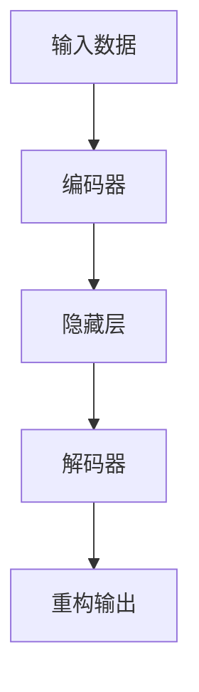
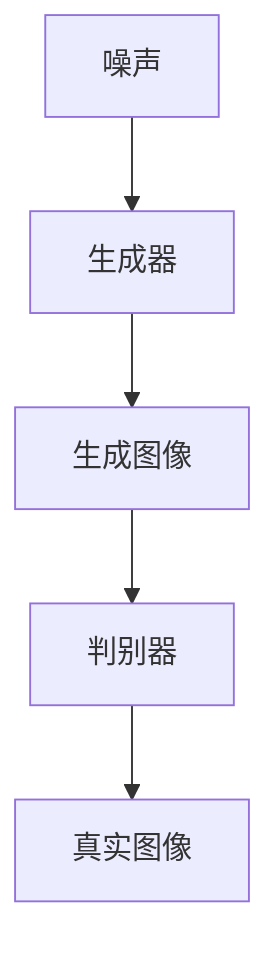
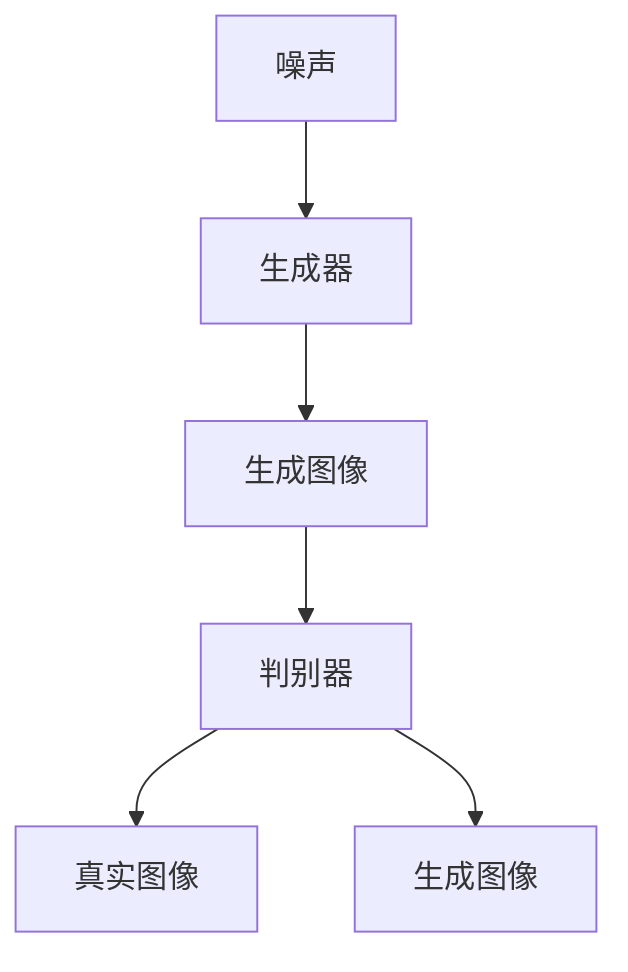
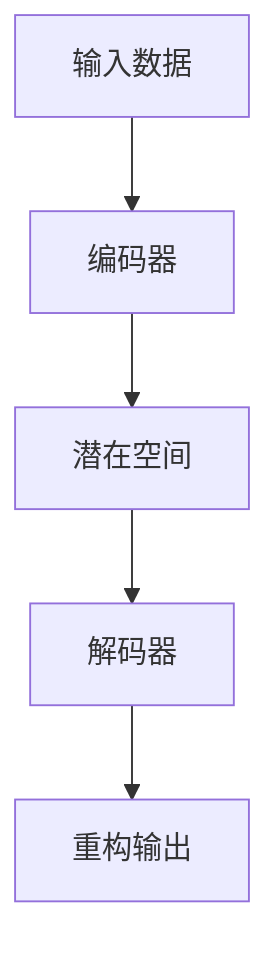
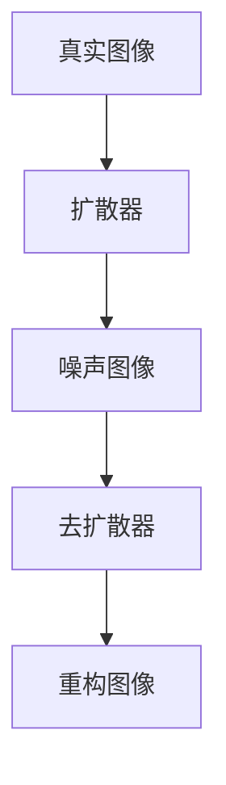
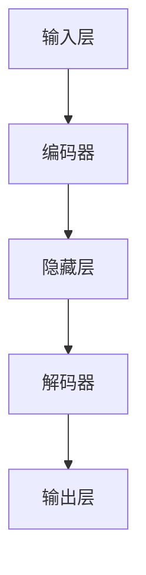
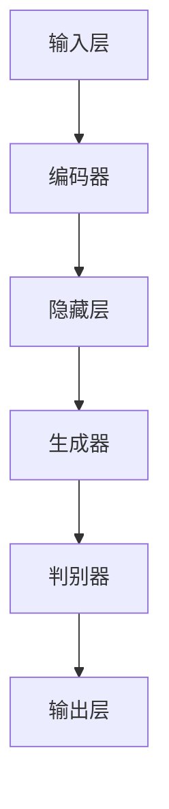
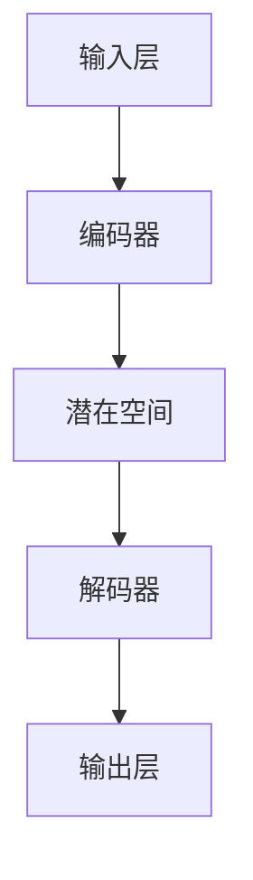

                 

# 文章标题：图像生成 (Image Generation)

> 关键词：图像生成、深度学习、生成对抗网络、自编码器、变分自编码器、生成扩散模型

> 摘要：本文旨在深入探讨图像生成技术的背景、核心原理、应用领域以及未来趋势。我们将逐步分析各种图像生成模型的架构和算法，并通过实际项目实战展示图像生成技术的应用。文章分为多个章节，涵盖从基础概念到高级应用的全面内容，旨在为读者提供清晰、详细、实用的技术指南。

## 目录

### 第1章：图像生成技术概述

#### 1.1 图像生成的背景与重要性

##### 1.1.1 什么是图像生成
##### 1.1.2 图像生成的历史
##### 1.1.3 图像生成的应用领域

#### 1.2 图像生成的核心技术

##### 1.2.1 基于深度学习的生成模型
##### 1.2.2 图像生成的流程
##### 1.2.3 图像生成的挑战与未来趋势

### 第2章：自编码器（Autoencoders）

#### 2.1 自编码器的基本原理

##### 2.1.1 什么是自编码器
##### 2.1.2 自编码器的架构
##### 2.1.3 自编码器的学习过程

#### 2.2 自编码器的类型

##### 2.2.1 前向自编码器
##### 2.2.2 对抗自编码器
##### 2.2.3 变分自编码器（VAE）

#### 2.3 自编码器的应用

##### 2.3.1 数据降维
##### 2.3.2 数据生成
##### 2.3.3 数据增强

### 第3章：生成对抗网络（GAN）

#### 3.1 GAN的概念与原理

##### 3.1.1 什么是GAN
##### 3.1.2 GAN的学习过程
##### 3.1.3 GAN的架构

#### 3.2 GAN的类型

##### 3.2.1 标准GAN
##### 3.2.2 条件GAN（cGAN）
##### 3.2.3 扩展GAN（EGAN）
##### 3.2.4 循环一致GAN（CycleGAN）

#### 3.3 GAN的应用

##### 3.3.1 图像生成
##### 3.3.2 图像增强
##### 3.3.3 图像修复与去噪

### 第4章：变分自编码器（VAE）

#### 4.1 VAE的概念与原理

##### 4.1.1 什么是VAE
##### 4.1.2 VAE的学习过程
##### 4.1.3 VAE的架构

#### 4.2 VAE的应用

##### 4.2.1 数据生成
##### 4.2.2 数据降维
##### 4.2.3 数据增强

### 第5章：生成扩散模型（GDM）

#### 5.1 GDM的概念与原理

##### 5.1.1 什么是GDM
##### 5.1.2 GDM的学习过程
##### 5.1.3 GDM的架构

#### 5.2 GDM的应用

##### 5.2.1 图像生成
##### 5.2.2 图像增强
##### 5.2.3 图像修复与去噪

### 第6章：图像生成的质量评估

#### 6.1 评价指标

##### 6.1.1 常见评价指标
##### 6.1.2 评价指标的计算方法

#### 6.2 质量评估方法

##### 6.2.1 主观评价
##### 6.2.2 客观评价
##### 6.2.3 综合评价

### 第7章：图像生成项目实战

#### 7.1 项目背景与目标

##### 7.1.1 项目背景
##### 7.1.2 项目目标

#### 7.2 项目环境搭建

##### 7.2.1 硬件环境
##### 7.2.2 软件环境
##### 7.2.3 数据集准备

#### 7.3 模型设计与训练

##### 7.3.1 模型选择
##### 7.3.2 模型参数设置
##### 7.3.3 模型训练

#### 7.4 生成图像质量评估

##### 7.4.1 客观评估
##### 7.4.2 主观评估
##### 7.4.3 综合评估

#### 7.5 项目总结与反思

##### 7.5.1 项目成果
##### 7.5.2 项目经验与教训

### 第8章：图像生成技术的未来趋势与应用展望

#### 8.1 图像生成技术的未来趋势

##### 8.1.1 技术进步
##### 8.1.2 应用领域拓展
##### 8.1.3 伦理与责任

#### 8.2 图像生成技术的应用展望

##### 8.2.1 工业设计
##### 8.2.2 建筑设计
##### 8.2.3 健康医疗
##### 8.2.4 文艺创作

### 附录：图像生成工具与资源

#### 附录 A：主流图像生成工具介绍

##### A.1 TensorFlow
##### A.2 PyTorch
##### A.3 其他图像生成工具

#### 附录 B：图像生成相关资源

##### B.1 数据集
##### B.2 论文与文献
##### B.3 社区与论坛

---

接下来，我们将根据上述目录，逐步深入探讨图像生成技术的各个方面。希望通过本文，读者能够全面了解图像生成技术，掌握其核心原理和应用方法。让我们开始吧！<|assistant|>### 第1章：图像生成技术概述

#### 1.1 图像生成的背景与重要性

##### 1.1.1 什么是图像生成

图像生成是一种通过算法创建新图像的技术，其目的是模拟或生成与已知图像相似或完全不同的图像。在计算机视觉和人工智能领域，图像生成技术具有重要意义，它不仅能够帮助我们理解和分析图像数据，还可以在多个实际应用中发挥关键作用。

从早期的像素级图像生成到今天的深度学习生成模型，图像生成技术的发展经历了多个阶段。最初，图像生成主要依赖于规则方法和图像处理技术。随着计算能力的提升和深度学习的发展，基于深度学习的图像生成模型成为了研究热点，如生成对抗网络（GAN）、自编码器（Autoencoders）、变分自编码器（VAE）等。

##### 1.1.2 图像生成的历史

图像生成技术的发展可以追溯到20世纪80年代。早期的图像生成方法主要包括以下几种：

1. **像素级生成**：通过编写规则来生成像素级图像。这种方法通常依赖于特定的生成算法，如神经网络和模式识别。

2. **纹理合成**：通过将不同纹理拼接在一起来创建新的图像。这种方法在图像编辑和艺术创作中得到了广泛应用。

3. **规则方法**：通过编写一系列规则来生成图像。这种方法通常用于生成特定的图像类型，如几何图案。

随着计算能力的提升和深度学习的发展，图像生成技术进入了一个新的阶段。以下是一些重要的里程碑：

1. **生成对抗网络（GAN）**：由Ian Goodfellow等人于2014年提出。GAN通过生成器和判别器的对抗训练生成高质量图像，迅速成为图像生成技术的代表。

2. **自编码器（Autoencoders）**：自编码器是一种无监督学习算法，通过学习数据的编码表示来生成新图像。

3. **变分自编码器（VAE）**：VAE是一种概率生成模型，通过引入概率模型提高了图像生成的多样性和质量。

4. **生成扩散模型（GDM）**：GDM通过逐步去噪来生成高质量图像，其独特的架构使其在图像生成中表现出色。

##### 1.1.3 图像生成的应用领域

图像生成技术在计算机视觉、娱乐、医学等多个领域具有广泛应用：

1. **游戏、虚拟现实、增强现实**：图像生成技术可以创建逼真的虚拟场景和角色，为游戏和虚拟现实体验提供支持。

2. **艺术创作与设计**：艺术家和设计师可以利用图像生成技术进行创意探索和作品创作。

3. **医学图像处理**：图像生成技术在医学图像重建、诊断辅助和疾病研究等领域具有重要应用。

4. **计算机视觉辅助任务**：图像生成技术可以用于数据增强、图像修复、图像去噪等计算机视觉任务。

总之，图像生成技术作为计算机视觉和人工智能领域的重要组成部分，其发展不仅推动了理论研究的进展，也为实际应用带来了巨大价值。在接下来的章节中，我们将深入探讨图像生成技术的核心原理和应用方法。

---

通过上述内容，我们对图像生成技术的历史和背景有了初步了解，接下来我们将详细讨论图像生成的核心技术，包括自编码器、生成对抗网络、变分自编码器和生成扩散模型。这些技术不仅代表了图像生成领域的前沿，也为实际应用提供了强大的工具和解决方案。

#### 1.2 图像生成的核心技术

##### 1.2.1 基于深度学习的生成模型

深度学习技术在图像生成领域取得了显著成果，特别是生成对抗网络（GAN）、自编码器（Autoencoders）、变分自编码器（VAE）和生成扩散模型（GDM）。这些模型通过不同的架构和训练方法，实现了高质量的图像生成。

###### 1.2.1.1 自编码器（Autoencoders）

**什么是自编码器？**

自编码器是一种无监督学习算法，其目标是学习输入数据的编码表示，并能够重构原始数据。自编码器由编码器和解码器组成，其中编码器将输入数据压缩为低维表示，解码器则将压缩后的表示重构回原始数据。

**自编码器的架构**

自编码器的架构通常包括三个部分：输入层、隐藏层和输出层。输入层接收原始数据，隐藏层通过编码过程学习数据的特征表示，输出层则通过解码过程重构原始数据。

**自编码器的学习过程**

自编码器的学习过程可以通过最小化重构误差来实现。具体来说，训练过程中，自编码器尝试最小化输入和重构输出之间的差异，通过反向传播算法不断调整模型参数。

**自编码器的类型**

1. **前向自编码器**：最简单的自编码器形式，编码过程和解码过程都是线性的。
2. **对抗自编码器**：结合了生成对抗网络（GAN）的思想，通过对抗训练来提高生成质量。
3. **变分自编码器（VAE）**：引入概率模型，通过概率分布来生成数据。

**自编码器的应用**

1. **数据降维**：用于特征提取和降维，如主成分分析（PCA）和线性判别分析（LDA）。
2. **数据生成**：通过解码器生成新的数据，用于图像、音频等数据的合成。
3. **数据增强**：用于生成训练数据，提高模型的泛化能力。

**核心概念与联系**

为了更好地理解自编码器的工作原理，我们可以通过一个简单的Mermaid流程图来展示其架构和流程：



在这个流程图中，输入数据首先通过编码器被压缩为低维表示，然后通过解码器重构回原始数据。这个过程中，隐藏层起到了关键作用，它不仅学习了数据的特征表示，还使得重构过程能够最小化误差。

**伪代码示例**

以下是一个简单的自编码器的伪代码示例，用于说明其基本架构和训练过程：

```python
# 初始化模型参数
initialize_model_params()

# 定义编码器和解码器
encoder = Encoder()
decoder = Decoder()

# 定义损失函数
loss_function = MeanSquaredError()

# 定义优化器
optimizer = AdamOptimizer()

# 训练模型
for epoch in range(num_epochs):
    for data in dataset:
        # 前向传播
        hidden_representation = encoder(data)
        reconstructed_data = decoder(hidden_representation)
        
        # 计算损失
        loss = loss_function(data, reconstructed_data)
        
        # 反向传播
        gradients = compute_gradients(loss, [encoder, decoder])
        
        # 更新模型参数
        optimizer.update_gradients(gradients)
```

在这个伪代码中，我们首先初始化模型参数，然后定义编码器和解码器。在训练过程中，我们通过前向传播计算重构输出，并使用损失函数计算重构误差。通过反向传播计算梯度，并使用优化器更新模型参数。

通过上述内容，我们详细介绍了自编码器的基本原理、架构、学习过程和应用。在接下来的章节中，我们将继续探讨生成对抗网络（GAN）、变分自编码器（VAE）和生成扩散模型（GDM），进一步了解图像生成技术的核心原理和应用。

##### 1.2.2 生成对抗网络（GAN）

**什么是生成对抗网络（GAN）？**

生成对抗网络（GAN）是由Ian Goodfellow等人于2014年提出的一种深度学习模型。GAN的核心思想是利用生成器和判别器的对抗训练来生成高质量图像。生成器试图生成逼真的图像，而判别器则试图区分生成图像和真实图像。

**GAN的学习过程**

GAN的学习过程是通过生成器和判别器的对抗训练来实现的。具体来说，训练过程中，生成器和判别器交替更新模型参数，以达到以下目标：

1. **生成器**：生成器尝试生成逼真的图像，使其能够欺骗判别器，判别器认为这些图像是真实的。
2. **判别器**：判别器尝试准确地区分真实图像和生成图像。

这种对抗训练使得生成器和判别器在相互博弈的过程中不断改进，最终生成器能够生成高质量图像。

**GAN的架构**

GAN的架构主要包括生成器、判别器和损失函数三个部分。以下是GAN的基本架构：



在这个架构中，生成器接收噪声作为输入，生成图像。判别器则同时接收真实图像和生成图像，并输出判别结果。通过最小化生成图像的判别误差，GAN可以生成高质量图像。

**核心概念与联系**

为了更好地理解GAN的工作原理，我们可以通过一个简单的Mermaid流程图来展示其架构和流程：



在这个流程图中，生成器通过噪声生成图像，判别器则对真实图像和生成图像进行判别。通过对抗训练，生成器和判别器在相互博弈的过程中不断改进，使得生成器能够生成更逼真的图像。

**伪代码示例**

以下是一个简单的GAN的伪代码示例，用于说明其基本架构和训练过程：

```python
# 初始化模型参数
initialize_model_params()

# 定义生成器和解码器
generator = Generator()
discriminator = Discriminator()

# 定义损失函数
gan_loss_function = AdversarialLoss()

# 定义优化器
generator_optimizer = AdamOptimizer()
discriminator_optimizer = AdamOptimizer()

# 训练模型
for epoch in range(num_epochs):
    for real_data in real_dataset:
        # 训练判别器
        fake_data = generator.sample_noise()
        generated_data = generator(fake_data)
        discriminator_loss = gan_loss_function(discriminator(real_data), discriminator(generated_data))
        
        # 反向传播和更新判别器参数
        gradients = compute_gradients(discriminator_loss, discriminator)
        discriminator_optimizer.update_gradients(gradients)
        
        # 训练生成器
        fake_data = generator.sample_noise()
        generated_data = generator(fake_data)
        generator_loss = gan_loss_function(discriminator(generated_data))
        
        # 反向传播和更新生成器参数
        gradients = compute_gradients(generator_loss, generator)
        generator_optimizer.update_gradients(gradients)
```

在这个伪代码中，我们首先初始化模型参数，然后定义生成器和判别器。在训练过程中，我们通过交替训练生成器和判别器，使得生成器能够生成高质量图像。

**GAN的类型**

1. **标准GAN**：最基本的GAN架构，通过生成器和判别器的对抗训练生成高质量图像。
2. **条件GAN（cGAN）**：引入条件输入，能够生成条件化的图像。
3. **扩展GAN（EGAN）**：解决GAN训练不稳定的问题。
4. **循环一致GAN（CycleGAN）**：用于图像域转换，如风格迁移。

**GAN的应用**

1. **图像生成**：生成高质量、高分辨率的图像。
2. **图像增强**：提高图像的清晰度、对比度和细节表现。
3. **图像修复与去噪**：修复损坏的图像、去除图像中的噪声。

**核心概念与联系**

为了更好地理解GAN的工作原理，我们可以通过一个简单的Mermaid流程图来展示其架构和流程：


在这个流程图中，生成器通过噪声生成图像，判别器则对真实图像和生成图像进行判别。通过对抗训练，生成器和判别器在相互博弈的过程中不断改进，使得生成器能够生成更逼真的图像。

通过上述内容，我们详细介绍了生成对抗网络（GAN）的基本原理、架构、学习过程和应用。在接下来的章节中，我们将继续探讨变分自编码器（VAE）和生成扩散模型（GDM），进一步了解图像生成技术的核心原理和应用。

##### 1.2.3 变分自编码器（VAE）

**什么是变分自编码器（VAE）？**

变分自编码器（VAE）是一种基于概率生成模型的图像生成技术，由Kingma和Welling于2013年提出。VAE的核心思想是通过引入概率模型，学习数据的概率分布，从而生成新的图像。

**VAE的学习过程**

VAE的学习过程包括两个主要步骤：编码过程和解码过程。编码过程通过编码器将输入数据映射到一个潜在空间中的概率分布，解码过程通过解码器将潜在空间中的样本重构回输入数据。

具体来说，VAE通过以下步骤进行学习：

1. **编码器**：给定输入数据x，编码器将其映射到一个潜在空间中的样本z。编码器的目标是学习一个概率分布q(z|x)，表示给定x的z的概率分布。
2. **解码器**：给定潜在空间中的样本z，解码器将其映射回输入数据x。解码器的目标是学习一个概率分布p(x|z)，表示给定z的x的概率分布。
3. **最大化数据似然函数**：VAE通过最大化数据似然函数L = p(x)来训练模型。具体来说，通过优化以下目标函数：

   $$ \mathcal{L}(q, p) = \mathbb{E}_{z \sim q(z|x)}[log(p(x|z))] $$

   其中，$\mathbb{E}_{z \sim q(z|x)}$表示对q(z|x)进行期望，log表示对数函数。

**VAE的架构**

VAE的架构主要包括编码器、解码器和损失函数三个部分。以下是VAE的基本架构：



在这个架构中，输入数据首先通过编码器被映射到潜在空间中的概率分布，然后通过解码器重构回原始数据。这个过程中，潜在空间起到了关键作用，它不仅学习了数据的特征表示，还使得重构过程能够最小化误差。

**核心概念与联系**

为了更好地理解VAE的工作原理，我们可以通过一个简单的Mermaid流程图来展示其架构和流程：


在这个流程图中，输入数据首先通过编码器被映射到潜在空间中的概率分布，然后通过解码器重构回原始数据。这个过程中，潜在空间起到了关键作用，它不仅学习了数据的特征表示，还使得重构过程能够最小化误差。

**伪代码示例**

以下是一个简单的VAE的伪代码示例，用于说明其基本架构和训练过程：

```python
# 初始化模型参数
initialize_model_params()

# 定义编码器和解码器
encoder = Encoder()
decoder = Decoder()

# 定义损失函数
vae_loss_function = VariationalLoss()

# 定义优化器
optimizer = AdamOptimizer()

# 训练模型
for epoch in range(num_epochs):
    for data in dataset:
        # 前向传播
        latent_distribution = encoder(data)
        reconstructed_data = decoder(latent_distribution)

        # 计算损失
        loss = vae_loss_function(data, reconstructed_data)

        # 反向传播
        gradients = compute_gradients(loss, [encoder, decoder])

        # 更新模型参数
        optimizer.update_gradients(gradients)
```

在这个伪代码中，我们首先初始化模型参数，然后定义编码器和解码器。在训练过程中，我们通过前向传播计算重构输出，并使用损失函数计算重构误差。通过反向传播计算梯度，并使用优化器更新模型参数。

**VAE的应用**

1. **数据生成**：VAE可以生成新的数据样本，如图像、文本等。
2. **数据降维**：用于特征提取和降维，如主成分分析（PCA）和线性判别分析（LDA）。
3. **数据增强**：用于生成训练数据，提高模型的泛化能力。

通过上述内容，我们详细介绍了变分自编码器（VAE）的基本原理、架构、学习过程和应用。VAE作为图像生成技术的一种重要方法，通过引入概率模型，实现了高质量的数据生成和降维。在接下来的章节中，我们将继续探讨生成扩散模型（GDM），进一步了解图像生成技术的核心原理和应用。

##### 1.2.4 生成扩散模型（GDM）

**什么是生成扩散模型（GDM）？**

生成扩散模型（GDM）是一种新兴的图像生成模型，由Battaglia等人于2018年提出。GDM的核心思想是通过逐步去噪来生成高质量图像。与传统的生成模型（如GAN和VAE）不同，GDM通过引入扩散过程和去扩散过程，实现了图像的生成和重构。

**GDM的学习过程**

GDM的学习过程可以分为两个主要阶段：扩散过程和去扩散过程。

1. **扩散过程**：在训练过程中，GDM将真实图像逐步转换为噪声图像。具体来说，这个过程是通过迭代应用一个去噪函数来实现的。去噪函数将当前图像与一个噪声图像之间的差异作为输入，生成一个新的图像，使得图像的噪声程度逐渐增加。

2. **去扩散过程**：在生成图像的过程中，GDM将噪声图像逐步恢复为真实图像。这个过程同样是通过迭代应用一个去噪函数来实现的，但与扩散过程相反，去噪函数将当前图像与一个真实图像之间的差异作为输入，生成一个新的图像，使得图像的噪声程度逐渐减少。

**GDM的架构**

GDM的架构主要包括扩散器、去扩散器和损失函数三个部分。以下是GDM的基本架构：



在这个架构中，真实图像首先通过扩散器转换为噪声图像，然后通过去扩散器重构回真实图像。这个过程中，扩散器和去扩散器起到了关键作用，它们分别实现了图像的扩散和去扩散。

**核心概念与联系**

为了更好地理解GDM的工作原理，我们可以通过一个简单的Mermaid流程图来展示其架构和流程：


在这个流程图中，真实图像通过扩散器转换为噪声图像，然后通过去扩散器重构回真实图像。这个过程中，扩散器和去扩散器分别实现了图像的扩散和去扩散。

**伪代码示例**

以下是一个简单的GDM的伪代码示例，用于说明其基本架构和训练过程：

```python
# 初始化模型参数
initialize_model_params()

# 定义扩散器和解码器
diffuser = Diffuser()
de_diffuser = DeDiffuser()

# 定义损失函数
gdm_loss_function = GenerativeDiffusionLoss()

# 定义优化器
optimizer = AdamOptimizer()

# 训练模型
for epoch in range(num_epochs):
    for real_image in dataset:
        # 扩散过程
        noisy_image = diffuser(real_image)
        
        # 去扩散过程
        reconstructed_image = de_diffuser(noisy_image)
        
        # 计算损失
        loss = gdm_loss_function(real_image, reconstructed_image)
        
        # 反向传播
        gradients = compute_gradients(loss, [diffuser, de_diffuser])
        
        # 更新模型参数
        optimizer.update_gradients(gradients)
```

在这个伪代码中，我们首先初始化模型参数，然后定义扩散器和解码器。在训练过程中，我们通过交替应用扩散器和去扩散器，使得模型能够逐步学习图像的扩散和去扩散过程。

**GDM的应用**

1. **图像生成**：GDM可以生成高质量、高分辨率的图像。
2. **图像增强**：GDM可以增强图像的清晰度、对比度和细节表现。
3. **图像修复与去噪**：GDM可以修复损坏的图像和去除图像中的噪声。

**核心概念与联系**

为了更好地理解GDM的工作原理，我们可以通过一个简单的Mermaid流程图来展示其架构和流程：


在这个流程图中，真实图像通过扩散器转换为噪声图像，然后通过去扩散器重构回真实图像。这个过程中，扩散器和去扩散器分别实现了图像的扩散和去扩散。

通过上述内容，我们详细介绍了生成扩散模型（GDM）的基本原理、架构、学习过程和应用。GDM作为一种新的图像生成模型，通过引入扩散和去扩散过程，实现了高质量图像的生成和增强。在接下来的章节中，我们将继续探讨图像生成的挑战与未来趋势。

##### 1.3 图像生成的挑战与未来趋势

尽管图像生成技术在近年来取得了显著进展，但在实际应用中仍然面临诸多挑战。这些挑战不仅涉及技术层面的优化，还包括伦理和社会层面的考量。

###### 1.3.1 挑战

1. **数据集的收集与标注**：图像生成模型通常需要大量的数据集进行训练。然而，收集和标注这些数据集是一个复杂且耗时的过程，特别是对于高质量的图像数据。此外，数据集的多样性和平衡性也直接影响到图像生成模型的效果。

2. **模型的训练效率与资源消耗**：生成模型（如GAN）的训练过程通常需要大量的计算资源，训练时间较长。优化模型的训练效率，减少资源消耗是一个重要的研究方向。

3. **生成图像的真实性、多样性和细节表现**：尽管当前的生成模型已经能够生成高质量的图像，但生成图像的真实性、多样性和细节表现仍有待提升。如何提高生成图像的质量，使其在视觉上更加逼真，是一个亟待解决的问题。

4. **模型的可解释性和透明性**：生成模型的训练和决策过程通常较为复杂，缺乏透明性。如何提高模型的可解释性，使其决策过程更加直观和可理解，是一个重要的挑战。

###### 1.3.2 未来趋势

1. **模型压缩与优化**：为了提高生成模型的训练效率，减少资源消耗，研究者们正在探索模型压缩和优化技术，如量化、剪枝和蒸馏等。这些技术有望使得生成模型在保持较高质量的同时，降低计算和存储需求。

2. **多模态图像生成**：随着人工智能技术的发展，多模态图像生成成为了一个热门方向。未来，研究者们将致力于实现图像与其他模态（如文本、音频、视频等）的联合生成，以提升图像生成技术的应用场景和实用性。

3. **交互式图像生成**：交互式图像生成是一种用户可以实时与模型互动，根据用户输入生成图像的技术。这种技术在未来有望在虚拟现实、游戏设计和个性化内容创作等领域得到广泛应用。

4. **生成模型的伦理与责任**：随着图像生成技术的应用日益广泛，其伦理和社会责任问题也日益凸显。如何确保生成图像的真实性、防止虚假信息的传播，以及保护用户的隐私和数据安全，是未来需要重点关注的领域。

###### 1.3.3 未来展望

1. **工业设计**：图像生成技术可以用于工业设计中的原型生成和虚拟样机验证，提高设计效率和准确性。

2. **建筑设计**：通过图像生成技术，设计师可以快速生成建筑外观效果图，为建筑设计提供灵感和参考。

3. **健康医疗**：图像生成技术在医学图像处理、疾病诊断和治疗方案制定等方面具有重要应用，有望提高医疗服务的质量和效率。

4. **文艺创作**：图像生成技术可以为艺术家和设计师提供创作工具，拓宽艺术创作的形式和内容。

通过上述内容，我们对图像生成技术的挑战和未来趋势进行了深入探讨。在接下来的章节中，我们将通过具体的自编码器（Autoencoders）案例，详细分析其工作原理、架构和应用，帮助读者更好地理解图像生成技术。

## 第2章：自编码器（Autoencoders）

自编码器（Autoencoders）是一种无监督学习算法，用于学习数据的编码表示。自编码器通过一个编码器将输入数据编码成一个低维表示，然后通过一个解码器将这个低维表示重构回原始数据。自编码器在特征提取、数据降维、数据生成等方面有着广泛的应用。

### 2.1 自编码器的基本原理

#### 2.1.1 什么是自编码器

自编码器是一种神经网络模型，由两部分组成：编码器和解码器。编码器的目的是将输入数据压缩成一个低维表示，这个表示通常被称为编码或者嵌入。解码器的目的是将这个低维表示重构回原始数据。自编码器通过最小化输入和重构输出之间的差异来实现其目标。

#### 2.1.2 自编码器的架构

自编码器的架构通常包括以下几个部分：

1. **输入层**：接收原始数据。
2. **隐藏层**：通过编码器将输入数据压缩成低维表示。
3. **编码器**：负责编码过程，将输入数据映射到隐藏层。
4. **解码器**：负责解码过程，将隐藏层映射回原始数据。
5. **输出层**：输出重构后的数据。

以下是自编码器的基本架构：



#### 2.1.3 自编码器的学习过程

自编码器的学习过程是通过最小化输入和重构输出之间的差异来实现的。具体来说，自编码器通过以下步骤进行训练：

1. **前向传播**：输入数据通过编码器被压缩成低维表示，然后通过解码器重构回原始数据。
2. **计算损失**：使用某种损失函数（如均方误差）计算输入和重构输出之间的差异。
3. **反向传播**：通过反向传播算法计算梯度，并更新模型参数。
4. **迭代更新**：重复上述过程，直到模型收敛。

以下是自编码器的学习过程伪代码示例：

```python
initialize_model_params()

for epoch in range(num_epochs):
    for data in dataset:
        # 前向传播
        hidden_representation = encoder(data)
        reconstructed_data = decoder(hidden_representation)
        
        # 计算损失
        loss = loss_function(data, reconstructed_data)
        
        # 反向传播
        gradients = compute_gradients(loss, [encoder, decoder])
        
        # 更新模型参数
        optimizer.update_gradients(gradients)
```

在这个伪代码中，我们首先初始化模型参数，然后定义编码器和解码器。在训练过程中，我们通过前向传播计算重构输出，并使用损失函数计算重构误差。通过反向传播计算梯度，并使用优化器更新模型参数。

### 2.2 自编码器的类型

自编码器有多种类型，每种类型都有其特定的应用场景和特点。以下是几种常见的自编码器类型：

#### 2.2.1 前向自编码器

前向自编码器是最简单的自编码器类型，它由一个编码器和一个解码器组成。编码器将输入数据压缩成低维表示，解码器将这个低维表示重构回原始数据。

**架构**：


**应用**：前向自编码器常用于数据降维、特征提取和图像压缩。

#### 2.2.2 对抗自编码器

对抗自编码器结合了生成对抗网络（GAN）的思想，通过对抗训练来提高生成质量。对抗自编码器的生成器部分试图生成逼真的数据，而判别器部分则试图区分真实数据和生成数据。

**架构**：



**应用**：对抗自编码器常用于图像生成、数据增强和图像修复。

#### 2.2.3 变分自编码器（VAE）

变分自编码器（VAE）是一种概率生成模型，通过引入概率分布来生成数据。VAE通过编码器学习输入数据的概率分布，然后通过解码器生成新的数据样本。

**架构**：



**应用**：VAE常用于数据生成、图像处理和特征提取。

### 2.3 自编码器的应用

自编码器在多个领域有着广泛的应用，以下是几种常见的应用场景：

#### 2.3.1 数据降维

数据降维是一种通过减少数据维度来提高数据处理效率的方法。自编码器通过学习输入数据的低维表示，实现数据的降维。

**应用示例**：

假设我们有1000维的数据，我们希望将其降维到100维。使用自编码器，我们可以通过训练一个编码器和一个解码器，学习数据的低维表示。在降维过程中，我们只使用编码器的输出部分，将原始数据从1000维映射到100维。

#### 2.3.2 数据生成

自编码器可以用于生成新的数据样本，这些样本可以是图像、文本或者其他类型的数据。

**应用示例**：

在图像生成方面，我们可以使用对抗自编码器（AAE）来生成新的图像。通过训练编码器和解码器，对抗自编码器可以学习图像的潜在特征，然后使用解码器生成新的图像。这种技术在生成艺术作品、游戏设计和个性化内容创作中有着广泛的应用。

#### 2.3.3 数据增强

数据增强是一种通过生成新的数据样本来提高模型泛化能力的方法。自编码器可以用于生成训练数据，从而增强模型的训练效果。

**应用示例**：

在计算机视觉任务中，数据集通常较小，为了提高模型的泛化能力，我们可以使用自编码器生成新的图像样本。这些生成的图像样本可以与原始图像一起用于训练模型，从而提高模型的性能。

### 2.4 自编码器的实际案例

在本节中，我们将通过一个实际案例来展示自编码器的应用。假设我们要使用自编码器对图像进行降维，并生成新的图像。

#### 2.4.1 案例背景

我们有一个包含1000张图像的数据集，每张图像都是28x28的像素矩阵。我们的目标是使用自编码器将图像从1000维降维到100维，并生成新的图像。

#### 2.4.2 硬件环境

- CPU或GPU：用于训练自编码器。
- 显卡：NVIDIA GPU（推荐显存4GB以上）。

#### 2.4.3 软件环境

- Python：用于编写训练代码。
- TensorFlow或PyTorch：用于构建和训练自编码器模型。
- NumPy：用于数据预处理。

#### 2.4.4 数据集准备

我们使用MNIST数据集作为训练数据，这个数据集包含0到9的手写数字图像，每张图像都是28x28的像素矩阵。我们首先需要将数据集转换为适合训练自编码器的格式。

```python
import tensorflow as tf
from tensorflow.keras.datasets import mnist

# 加载MNIST数据集
(x_train, _), (x_test, _) = mnist.load_data()

# 将图像数据缩放到0到1之间
x_train = x_train / 255.0
x_test = x_test / 255.0

# 将图像数据展平为一维数组
x_train = x_train.reshape(-1, 28 * 28)
x_test = x_test.reshape(-1, 28 * 28)
```

#### 2.4.5 模型设计与训练

我们设计一个简单的自编码器模型，编码器和解码器都是全连接神经网络。

```python
from tensorflow.keras.models import Model
from tensorflow.keras.layers import Input, Dense

# 定义输入层
input_layer = Input(shape=(28 * 28))

# 定义编码器
encoded = Dense(100, activation='relu')(input_layer)

# 定义解码器
decoded = Dense(28 * 28, activation='sigmoid')(encoded)

# 定义自编码器模型
autoencoder = Model(input_layer, decoded)

# 编译模型
autoencoder.compile(optimizer='adam', loss='binary_crossentropy')

# 训练模型
autoencoder.fit(x_train, x_train, epochs=100, batch_size=256, validation_data=(x_test, x_test))
```

在这个案例中，我们使用了100个隐藏层神经元来压缩图像数据。在训练过程中，我们使用二进制交叉熵作为损失函数，并使用Adam优化器来更新模型参数。

#### 2.4.6 数据生成

训练完成后，我们可以使用自编码器的编码器部分来生成新的图像。

```python
# 定义编码器模型
encoder = Model(input_layer, encoded)

# 生成新的图像
new_images = encoder.predict(x_test[:10])

# 将新图像从一维数组重塑为原始尺寸
new_images = new_images.reshape(-1, 28, 28)

# 显示新图像
import matplotlib.pyplot as plt

plt.figure(figsize=(10, 10))
for i in range(10):
    plt.subplot(10, 10, i + 1)
    plt.imshow(new_images[i], cmap='gray')
    plt.xticks([])
    plt.yticks([])
plt.show()
```

在这个案例中，我们生成了10张新的图像。通过观察生成的图像，我们可以看到自编码器成功地学习了图像的潜在特征，并能够生成与原始图像相似的图像。

通过这个实际案例，我们展示了如何使用自编码器进行图像降维和生成新的图像。自编码器作为一种强大的无监督学习算法，在特征提取、数据降维、图像生成和数据增强等方面有着广泛的应用。

### 2.5 自编码器的优势和局限性

#### 优势

1. **无监督学习**：自编码器可以通过无监督学习从数据中提取有用的特征，无需依赖标签数据。
2. **自适应降维**：自编码器能够自动学习数据的低维表示，从而提高数据处理效率。
3. **灵活性和通用性**：自编码器可以应用于各种类型的数据，如图像、文本和音频等。
4. **强大的生成能力**：对抗自编码器能够生成高质量的数据样本，适用于图像生成和数据增强。

#### 局限性

1. **训练难度**：自编码器的训练过程可能比较复杂，需要大量的计算资源和时间。
2. **对数据质量要求较高**：自编码器对数据质量有较高要求，数据质量直接影响模型的效果。
3. **可解释性较差**：自编码器的内部结构和决策过程相对复杂，难以进行解释。
4. **过拟合风险**：自编码器可能会过拟合训练数据，导致在未知数据上表现不佳。

通过上述内容，我们对自编码器的基本原理、类型、应用和实际案例进行了详细探讨。自编码器作为一种强大的无监督学习算法，在特征提取、数据降维、图像生成和数据增强等方面有着广泛的应用。然而，自编码器也存在一些局限性，需要在使用过程中加以注意。在接下来的章节中，我们将继续探讨生成对抗网络（GAN）的基本原理和应用。

### 第3章：生成对抗网络（GAN）

生成对抗网络（Generative Adversarial Network，GAN）是近年来在图像生成领域取得显著成果的一种深度学习模型。GAN的核心思想是利用生成器和判别器的对抗训练，通过相互博弈来生成高质量图像。本章将详细介绍GAN的基本原理、架构、学习过程和应用。

#### 3.1 GAN的概念与原理

GAN由生成器（Generator）和判别器（Discriminator）两部分组成，它们在训练过程中进行对抗博弈。生成器的目标是通过输入噪声生成逼真的图像，而判别器的目标则是准确地区分输入图像是真实图像还是生成图像。通过这种对抗训练，生成器和判别器在相互博弈的过程中不断优化，最终生成器能够生成高度逼真的图像。

GAN的工作原理可以概括为以下几个步骤：

1. **生成器生成图像**：生成器通过随机噪声生成图像。
2. **判别器判断图像真实性**：判别器同时接收真实图像和生成图像，并输出判断结果。
3. **对抗训练**：生成器和判别器交替更新模型参数，生成器试图欺骗判别器，而判别器则试图提高判断准确性。

GAN的核心优势在于其强大的图像生成能力，通过生成器和判别器的相互博弈，GAN能够学习数据的潜在分布，从而生成高质量、多样化的图像。

#### 3.2 GAN的架构

GAN的架构主要包括生成器、判别器和损失函数三个部分。以下是GAN的基本架构：


在这个架构中，生成器接收随机噪声作为输入，生成图像。判别器则接收真实图像和生成图像，并输出判断结果。通过对抗训练，生成器和判别器在相互博弈的过程中不断优化，最终生成器能够生成高质量图像。

**生成器**：生成器的目标是生成逼真的图像。它通常是一个多层全连接神经网络，通过随机噪声生成图像。生成器的输出通常是一个高维的图像表示，然后通过解码器将这个表示重构回原始图像。

**判别器**：判别器的目标是准确地区分真实图像和生成图像。它也是一个多层全连接神经网络，接收图像作为输入，并输出一个二值判断结果，表示输入图像是真实图像的概率。

**损失函数**：GAN的损失函数通常由两个部分组成：生成器的损失和判别器的损失。生成器的损失函数用于衡量生成图像的质量，判别器的损失函数用于衡量判别器的准确性。具体来说，生成器的损失函数通常使用二元交叉熵（Binary Cross-Entropy）损失，而判别器的损失函数则使用均方误差（Mean Squared Error）或对数损失（Log Loss）。

#### 3.3 GAN的学习过程

GAN的学习过程是通过生成器和判别器的对抗训练来实现的。具体来说，训练过程中，生成器和判别器交替更新模型参数，以达到以下目标：

1. **生成器**：生成器尝试生成逼真的图像，使其能够欺骗判别器，判别器认为这些图像是真实的。
2. **判别器**：判别器尝试准确地区分真实图像和生成图像。

这种对抗训练使得生成器和判别器在相互博弈的过程中不断改进，最终生成器能够生成高质量图像。

GAN的学习过程可以分为以下几个步骤：

1. **初始化模型参数**：生成器和判别器的初始模型参数是随机初始化的。
2. **生成器生成图像**：生成器通过随机噪声生成图像。
3. **判别器判断图像真实性**：判别器同时接收真实图像和生成图像，并输出判断结果。
4. **计算损失**：生成器和判别器的损失函数分别计算生成图像质量和判别器准确性的损失。
5. **反向传播**：通过反向传播算法计算梯度，并更新模型参数。
6. **迭代更新**：重复上述过程，直到模型收敛。

以下是GAN学习过程的伪代码示例：

```python
initialize_model_params()

for epoch in range(num_epochs):
    for real_images in real_dataset:
        # 训练判别器
        fake_images = generator.sample_noise()
        generated_images = generator(fake_images)
        discriminator_loss = compute_discriminator_loss(discriminator, real_images, generated_images)
        
        # 反向传播和更新判别器参数
        gradients = compute_gradients(discriminator_loss, discriminator)
        discriminator_optimizer.update_gradients(gradients)
        
        # 训练生成器
        fake_images = generator.sample_noise()
        generated_images = generator(fake_images)
        generator_loss = compute_generator_loss(generated_images)
        
        # 反向传播和更新生成器参数
        gradients = compute_gradients(generator_loss, generator)
        generator_optimizer.update_gradients(gradients)
```

在这个伪代码中，我们首先初始化模型参数，然后定义生成器和判别器。在训练过程中，我们通过交替训练生成器和判别器，使得生成器能够生成高质量图像。

#### 3.4 GAN的类型

GAN有多种类型，每种类型都有其特定的应用场景和特点。以下是几种常见的GAN类型：

##### 3.4.1 标准GAN

标准GAN是最基本的GAN架构，由生成器和判别器组成。生成器通过随机噪声生成图像，判别器则接收真实图像和生成图像，并输出判断结果。标准GAN的核心优势在于其简单性和有效性，能够在多种应用场景中生成高质量图像。

##### 3.4.2 条件GAN（cGAN）

条件GAN（Conditional GAN，cGAN）是标准GAN的扩展，引入了条件输入，能够生成条件化的图像。cGAN通过在生成器和判别器中添加条件层，使得生成器和判别器能够同时处理条件信息。这种架构在图像生成任务中表现出色，能够生成具有特定属性（如颜色、风格等）的图像。

##### 3.4.3 扩展GAN（EGAN）

扩展GAN（Extended GAN，EGAN）是解决GAN训练不稳定问题的一种改进方法。EGAN通过在生成器和判别器之间添加额外的对抗性层，增加了训练过程的稳定性。EGAN能够提高生成器的生成质量，减少训练过程中的模式崩溃现象。

##### 3.4.4 循环一致GAN（CycleGAN）

循环一致GAN（CycleGAN）是用于图像域转换的一种GAN架构。CycleGAN通过在生成器和判别器之间添加循环一致性损失，使得生成器能够将一种域的图像转换为另一种域的图像。CycleGAN在图像风格迁移、图像修复和图像去噪等领域表现出色。

#### 3.5 GAN的应用

GAN在多个领域有着广泛的应用，以下是几种常见的应用场景：

##### 3.5.1 图像生成

GAN能够生成高质量、多样化的图像，广泛应用于图像合成、图像修复和图像增强等任务。通过训练生成器和判别器，GAN可以学习数据的潜在分布，从而生成与真实图像高度相似的图像。

##### 3.5.2 图像增强

GAN能够增强图像的清晰度、对比度和细节表现，广泛应用于图像超分辨率、图像去噪和图像增强等任务。通过训练生成器和判别器，GAN可以学习图像的潜在特征，从而提高图像的质量。

##### 3.5.3 图像修复与去噪

GAN能够修复损坏的图像和去除图像中的噪声，广泛应用于图像去噪、图像修复和图像增强等任务。通过训练生成器和判别器，GAN可以学习图像的潜在特征，从而恢复图像的原始质量。

##### 3.5.4 数据增强

GAN能够生成新的图像样本，用于数据增强，提高模型的泛化能力。在计算机视觉任务中，数据集通常较小，为了提高模型的泛化能力，我们可以使用GAN生成新的图像样本，与原始图像一起用于训练模型。

#### 3.6 GAN的核心概念与联系

为了更好地理解GAN的工作原理，我们可以通过一个简单的Mermaid流程图来展示其架构和流程：


在这个流程图中，生成器通过噪声生成图像，判别器则对真实图像和生成图像进行判别。通过对抗训练，生成器和判别器在相互博弈的过程中不断改进，使得生成器能够生成更逼真的图像。

#### 3.7 伪代码示例

以下是一个简单的GAN的伪代码示例，用于说明其基本架构和训练过程：

```python
# 初始化模型参数
initialize_model_params()

# 定义生成器和解码器
generator = Generator()
discriminator = Discriminator()

# 定义损失函数
gan_loss_function = AdversarialLoss()

# 定义优化器
generator_optimizer = AdamOptimizer()
discriminator_optimizer = AdamOptimizer()

# 训练模型
for epoch in range(num_epochs):
    for real_data in real_dataset:
        # 训练判别器
        fake_data = generator.sample_noise()
        generated_data = generator(fake_data)
        discriminator_loss = gan_loss_function(discriminator(real_data), discriminator(generated_data))
        
        # 反向传播和更新判别器参数
        gradients = compute_gradients(discriminator_loss, discriminator)
        discriminator_optimizer.update_gradients(gradients)
        
        # 训练生成器
        fake_data = generator.sample_noise()
        generated_data = generator(fake_data)
        generator_loss = gan_loss_function(generated_data)
        
        # 反向传播和更新生成器参数
        gradients = compute_gradients(generator_loss, generator)
        generator_optimizer.update_gradients(gradients)
```

在这个伪代码中，我们首先初始化模型参数，然后定义生成器和判别器。在训练过程中，我们通过交替训练生成器和判别器，使得生成器能够生成高质量图像。

#### 3.8 GAN的实际案例

在本节中，我们将通过一个实际案例来展示GAN的应用。假设我们要使用GAN生成人脸图像。

#### 3.8.1 案例背景

我们有一个包含1000张人脸图像的数据集，每张图像都是128x128的像素矩阵。我们的目标是使用GAN生成高质量的人脸图像。

#### 3.8.2 硬件环境

- CPU或GPU：用于训练GAN模型。
- 显卡：NVIDIA GPU（推荐显存8GB以上）。

#### 3.8.3 软件环境

- Python：用于编写训练代码。
- TensorFlow或PyTorch：用于构建和训练GAN模型。
- NumPy：用于数据预处理。

#### 3.8.4 数据集准备

我们使用人脸数据集作为训练数据，这个数据集包含各种人脸图像。

```python
import tensorflow as tf
from tensorflow.keras.preprocessing.image import ImageDataGenerator

# 加载人脸数据集
train_datagen = ImageDataGenerator(rescale=1./255)
train_generator = train_datagen.flow_from_directory(
        'path_to_training_data',
        target_size=(128, 128),
        batch_size=batch_size,
        class_mode='binary')

# 测试数据集
test_datagen = ImageDataGenerator(rescale=1./255)
test_generator = test_datagen.flow_from_directory(
        'path_to_test_data',
        target_size=(128, 128),
        batch_size=batch_size,
        class_mode='binary')
```

在这个案例中，我们使用了ImageDataGenerator来加载和预处理人脸数据集。

#### 3.8.5 模型设计与训练

我们设计一个简单的GAN模型，生成器和判别器都是全连接神经网络。

```python
from tensorflow.keras.models import Model
from tensorflow.keras.layers import Input, Dense, Reshape, Flatten

# 定义输入层
input_shape = (128, 128, 3)
input_layer = Input(shape=input_shape)

# 定义生成器
noise = Input(shape=(100,))
x = Dense(128 * 128 * 3, activation='relu')(noise)
x = Reshape((128, 128, 3))(x)
generator = Model(noise, x)

# 定义判别器
x = Flatten()(input_layer)
x = Dense(1, activation='sigmoid')(x)
discriminator = Model(input_layer, x)

# 编译模型
discriminator.compile(optimizer='adam', loss='binary_crossentropy')

# 定义G

