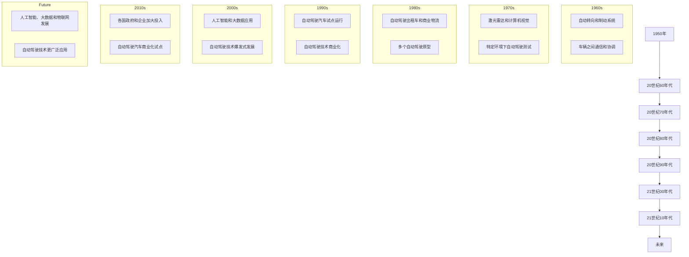

                 

### 第1章：自动驾驶技术概述

#### 1.1 自动驾驶技术的发展历程

自动驾驶技术作为现代科技的前沿领域，其发展历程可谓是跌宕起伏、波澜壮阔。早在1950年，自动驾驶技术的概念便初现雏形，当时的科学家们开始尝试通过机械和电子手段实现车辆的自动化控制。然而，直到20世纪60年代，随着计算机技术的发展，自动驾驶技术才真正开始进入实质性研究阶段。

在20世纪70年代，自动转向和制动系统逐渐在汽车中应用，尽管这些系统较为原始，但它们为后续技术的发展奠定了基础。进入20世纪80年代，自动驾驶技术的概念进一步扩展，涉及到了车辆之间的通信和协调。这一时期，研究人员开始探索基于传感器和计算机视觉的自动驾驶方案。

到了20世纪90年代，随着激光雷达和图像识别技术的突破，自动驾驶技术取得了显著进展。这一时期，自动驾驶汽车开始在特定环境下进行测试，包括高速公路和封闭园区等。

进入21世纪，自动驾驶技术迎来了爆发式发展。特别是在21世纪00年代，自动驾驶技术在无人驾驶出租车和商业物流等领域取得了重要突破。谷歌和特斯拉等公司推出了多个自动驾驶原型，展示了这项技术的巨大潜力。

进入21世纪10年代，自动驾驶技术逐渐从实验室走向市场。各国政府和企业纷纷加大投入，推动自动驾驶技术的商业化应用。自动驾驶汽车开始在一些城市进行试点运行，甚至在某些国家实现了部分自动驾驶功能的商业化。

未来，随着人工智能、大数据和物联网等技术的进一步发展，自动驾驶技术将迎来更加广阔的应用前景。它不仅将改变人们的出行方式，还将对城市交通、物流和能源等领域产生深远影响。

#### 1.2 自动驾驶技术的分类

自动驾驶技术可以根据自动化程度的不同，分为完全自动驾驶、部分自动驾驶和辅助驾驶三种类型。

**完全自动驾驶**（Fully Automated Driving）是指车辆在所有情况下都能自主完成驾驶任务，无需人工干预。这种类型的自动驾驶技术通常包括感知环境、做出决策、控制车辆等一系列复杂的操作。完全自动驾驶被认为是自动驾驶技术的最高形式，但目前仍处于研发阶段，尚未大规模商业化。

**部分自动驾驶**（Partially Automated Driving）是指车辆在某些特定条件下可以自动驾驶，但需要驾驶员在关键时刻进行干预。部分自动驾驶技术主要应用于高速公路巡航、停车辅助和交通拥堵辅助等场景。当前市场上许多高端车型已经配备了部分自动驾驶功能。

**辅助驾驶**（Assisted Driving）是指车辆提供一定的驾驶辅助功能，如自动泊车、车道保持和自适应巡航等。辅助驾驶技术主要依赖于传感器和计算机视觉，能够减轻驾驶员的负担，提高行车安全。辅助驾驶是目前最为成熟的自动驾驶技术，已经广泛应用于各种车型中。

#### 1.3 自动驾驶技术的核心组成部分

自动驾驶技术系统的核心组成部分主要包括传感器系统、控制系统和决策系统。

**传感器系统**是自动驾驶技术的“眼睛”和“耳朵”，负责收集车辆周围环境的信息。常见的传感器包括激光雷达（LiDAR）、摄像头、毫米波雷达、GPS和惯性测量单元（IMU）等。这些传感器各自具有不同的优势和局限性，因此在实际应用中需要综合使用，以实现高效的环境感知。

**控制系统**则是自动驾驶技术的“大脑”，负责根据传感器提供的信息，进行车辆的操控和控制。控制系统通常包括路径规划、运动控制、制动控制和转向控制等模块。通过这些模块的协同工作，车辆能够实现平稳、安全的自动驾驶。

**决策系统**是自动驾驶技术的“思维中心”，负责分析传感器数据和执行控制策略。决策系统通常包括感知模块、规划模块和执行模块。感知模块负责分析车辆周围的环境信息，规划模块负责生成最优路径和驾驶策略，执行模块负责将规划结果转化为具体的操作指令。

这些核心组成部分共同协作，使得自动驾驶车辆能够在复杂多变的环境中自主行驶，实现安全、高效的驾驶。

---

### 1.1 自动驾驶技术的发展历程

**图 1.1**：自动驾驶技术发展历程图

### 1.2 自动驾驶技术的分类

#### 完全自动驾驶

完全自动驾驶是指车辆能够在没有任何人类驾驶员干预的情况下，自主完成所有驾驶任务，包括感知环境、规划路径、执行驾驶操作等。这种自动驾驶技术要求车辆具备高度的环境感知能力、复杂的决策算法和精确的执行控制能力。

**优势：**
1. 提高行车安全性，减少人为驾驶错误。
2. 提高交通效率，减少拥堵和交通事故。
3. 减轻驾驶员疲劳，提升驾驶体验。

**挑战：**
1. 环境复杂性：城市交通环境复杂多变，包括行人和非机动车辆等。
2. 技术复杂性：需要高度集成多种传感器和数据融合技术。
3. 法规和伦理问题：需要解决法律责任、隐私保护等问题。

#### 部分自动驾驶

部分自动驾驶是指车辆在某些特定条件下可以自动驾驶，但需要驾驶员在关键时刻进行干预。部分自动驾驶技术主要包括高速公路巡航、停车辅助和交通拥堵辅助等功能。当前市场上的许多高端车型已经配备了部分自动驾驶功能。

**优势：**
1. 提高行车安全性，减轻驾驶员负担。
2. 提高交通效率，减少拥堵和交通事故。
3. 提升驾驶体验，减少驾驶员疲劳。

**挑战：**
1. 需要驾驶员在特定条件下进行干预，存在安全隐患。
2. 部分自动驾驶功能在不同环境和场景下的表现可能不一致。

#### 辅助驾驶

辅助驾驶是指车辆提供一定的驾驶辅助功能，如自动泊车、车道保持和自适应巡航等。辅助驾驶技术主要依赖于传感器和计算机视觉，能够减轻驾驶员的负担，提高行车安全。

**优势：**
1. 提高行车安全性，减少人为驾驶错误。
2. 提升驾驶体验，减少驾驶员疲劳。
3. 提高交通效率，减少拥堵和交通事故。

**挑战：**
1. 技术相对成熟，但应用范围有限。
2. 在复杂环境中，辅助驾驶功能可能不够智能。

### 1.3 自动驾驶技术的核心组成部分

自动驾驶技术的核心组成部分主要包括传感器系统、控制系统和决策系统。

#### 传感器系统

传感器系统是自动驾驶技术的“眼睛”和“耳朵”，负责收集车辆周围环境的信息。传感器系统主要包括以下几种：

1. **激光雷达（LiDAR）**：激光雷达通过发射激光束并测量其反射时间来获取周围环境的3D点云数据，具有较高的分辨率和精度。
2. **摄像头**：摄像头用于获取车辆周围环境的图像信息，通过图像处理算法进行目标检测和识别。
3. **毫米波雷达**：毫米波雷达通过发射毫米波信号并接收其反射信号来获取物体的距离和速度信息，具有较强的穿透能力和抗干扰能力。
4. **GPS**：GPS用于定位车辆的地理位置信息，是实现自动驾驶定位功能的关键。
5. **惯性测量单元（IMU）**：IMU用于测量车辆的加速度、角速度和姿态信息，是实现自动驾驶路径规划和控制的重要传感器。

#### 控制系统

控制系统是自动驾驶技术的“大脑”，负责根据传感器提供的信息，进行车辆的操控和控制。控制系统主要包括以下几种：

1. **路径规划**：路径规划模块负责生成车辆从起点到目的地的最优路径，考虑道路状况、交通状况等因素。
2. **运动控制**：运动控制模块负责控制车辆的加速、减速和转向等动作，实现自动驾驶的平稳行驶。
3. **制动控制**：制动控制模块负责控制车辆的制动系统，确保在紧急情况下车辆能够及时停止。
4. **转向控制**：转向控制模块负责控制车辆的转向系统，实现自动驾驶的转弯和变道等功能。

#### 决策系统

决策系统是自动驾驶技术的“思维中心”，负责分析传感器数据和执行控制策略。决策系统主要包括以下几种：

1. **感知模块**：感知模块负责分析传感器数据，识别道路标志、行人、车辆等目标。
2. **规划模块**：规划模块负责根据感知模块的结果，生成车辆行驶路径和操作指令。
3. **执行模块**：执行模块负责将规划模块生成的操作指令转化为具体的驾驶动作，实现对车辆的操控。

这些核心组成部分共同协作，使得自动驾驶车辆能够在复杂多变的环境中自主行驶，实现安全、高效的驾驶。

---

### 2.1 激光雷达（LiDAR）

激光雷达（Light Detection and Ranging，简称LiDAR）是一种通过发射激光脉冲并测量其反射时间来获取物体距离和形状的技术。在自动驾驶技术中，激光雷达被广泛应用于环境感知和三维建模。以下是激光雷达的工作原理、分类及其在自动驾驶中的应用。

#### 2.1.1 激光雷达的工作原理

激光雷达的工作原理基于时间飞行（Time of Flight，简称ToF）或相位探测（Phase Detection）技术。具体步骤如下：

1. **发射激光脉冲**：激光雷达发射一束激光脉冲，照射到目标物体上。
2. **接收反射信号**：激光脉冲在被目标物体反射后，返回到激光雷达的接收器。
3. **测量反射时间**：激光雷达通过测量激光脉冲往返所需的时间来计算目标物体的距离。时间越长，距离越远。
4. **生成点云数据**：根据反射时间和激光脉冲的发射角度，激光雷达生成目标物体的三维点云数据。

点云数据是由大量离散点组成的，这些点代表了物体表面的三维坐标信息。通过分析点云数据，自动驾驶系统可以精确地了解周围环境，从而做出相应的决策和控制。

#### 2.1.2 激光雷达的分类

激光雷达可以根据工作原理、结构形式和性能指标等进行分类。以下是几种常见的激光雷达分类：

1. **机械式激光雷达**：
   - **结构**：机械式激光雷达通过机械运动来改变激光发射角度，实现扫描功能。
   - **优点**：扫描范围广，分辨率高。
   - **缺点**：体积较大，成本较高，对环境变化敏感。

2. **固态激光雷达**：
   - **结构**：固态激光雷达使用电子或光学器件来实现扫描功能，无需机械运动。
   - **优点**：体积小，成本低，适应性强。
   - **缺点**：扫描范围相对较小，分辨率相对较低。

3. **混合式激光雷达**：
   - **结构**：混合式激光雷达结合了机械式和固态激光雷达的优点，通过机械运动和电子控制来实现高分辨率和广覆盖范围。
   - **优点**：兼具高分辨率和广覆盖范围。
   - **缺点**：成本较高，对环境变化敏感。

#### 2.1.3 激光雷达的性能指标

激光雷达的性能指标主要包括分辨率、距离测量范围和角分辨率等。

1. **分辨率**：
   - **定义**：分辨率指的是激光雷达能够识别的最小距离或角度差异。
   - **影响**：分辨率越高，激光雷达能够获取的环境细节越多，有助于提高自动驾驶系统的准确性。

2. **距离测量范围**：
   - **定义**：距离测量范围指的是激光雷达能够测量的最大距离。
   - **影响**：距离测量范围越远，激光雷达在远距离环境中的有效性越高。

3. **角分辨率**：
   - **定义**：角分辨率指的是激光雷达在垂直和水平方向上能够分辨的角度大小。
   - **影响**：角分辨率越高，激光雷达在空间中的定位精度越高。

#### 2.1.4 激光雷达在自动驾驶中的应用

激光雷达在自动驾驶中的应用主要包括环境感知、三维建模和障碍物检测等。

1. **环境感知**：
   - **功能**：激光雷达通过发射激光束并接收反射信号，生成车辆周围环境的三维点云数据。
   - **优势**：激光雷达能够精确地获取环境信息，包括道路、车辆、行人和障碍物等，有助于自动驾驶系统做出准确的决策。

2. **三维建模**：
   - **功能**：激光雷达生成的三维点云数据可以用于构建车辆周围环境的数字模型。
   - **优势**：数字模型有助于自动驾驶系统进行路径规划和障碍物检测，提高驾驶安全性。

3. **障碍物检测**：
   - **功能**：激光雷达通过分析点云数据，识别并跟踪车辆周围的障碍物。
   - **优势**：障碍物检测有助于自动驾驶系统在紧急情况下及时做出反应，避免碰撞事故。

总之，激光雷达作为自动驾驶技术的重要组成部分，其工作原理、分类和性能指标决定了其在自动驾驶中的应用效果。随着技术的不断进步，激光雷达将发挥越来越重要的作用，推动自动驾驶技术的进一步发展。

---

### 2.2 摄像头与图像处理

摄像头是自动驾驶技术中重要的视觉感知设备，通过捕捉车辆周围环境的图像，为自动驾驶系统提供视觉信息。图像处理则是通过对摄像头获取的图像进行分析和处理，提取有用的信息，从而辅助自动驾驶系统的决策和控制。

#### 2.2.1 摄像头在自动驾驶中的应用

摄像头在自动驾驶中的应用主要包括目标检测、场景识别和图像增强等。

1. **目标检测**：
   - **功能**：目标检测是指通过图像处理技术，识别并定位图像中的特定对象，如行人、车辆和交通标志等。
   - **优势**：目标检测有助于自动驾驶系统实时了解周围环境，从而做出准确的驾驶决策。

2. **场景识别**：
   - **功能**：场景识别是指通过图像处理技术，识别并分类图像中的场景类型，如城市道路、高速公路和停车场等。
   - **优势**：场景识别有助于自动驾驶系统根据不同场景调整驾驶策略，提高驾驶安全性。

3. **图像增强**：
   - **功能**：图像增强是指通过图像处理技术，改善图像的质量和清晰度，从而提高图像分析的效果。
   - **优势**：图像增强有助于提高目标检测和场景识别的准确性，特别是在光线条件较差或图像模糊的情况下。

#### 2.2.2 图像处理技术

图像处理技术主要包括图像增强、目标检测和图像分割等。

1. **图像增强**：
   - **技术**：图像增强技术包括对比度增强、亮度调整、噪声滤除等，用于改善图像的视觉效果。
   - **应用**：图像增强技术有助于提高目标检测和场景识别的准确性，特别是在光线条件较差或图像模糊的情况下。

2. **目标检测**：
   - **技术**：目标检测技术包括基于深度学习的方法、基于传统机器学习的方法和基于图像处理的方法等。
   - **应用**：目标检测技术用于识别并定位图像中的特定对象，如行人、车辆和交通标志等，为自动驾驶系统提供关键信息。

3. **图像分割**：
   - **技术**：图像分割技术是指将图像划分为多个区域，以便对每个区域进行独立分析。
   - **应用**：图像分割技术有助于细化图像分析，提高自动驾驶系统的准确性。

总之，摄像头和图像处理技术在自动驾驶中发挥着重要作用。通过摄像头获取的图像信息，经过图像处理技术的处理，可以用于目标检测、场景识别和图像增强等任务，为自动驾驶系统提供关键的视觉信息，提高驾驶安全性。

---

### 2.3 雷达与毫米波雷达

雷达（Radio Detection and Ranging）是一种通过发射电磁波并接收其反射信号来测量目标距离和速度的技术。在自动驾驶技术中，雷达和毫米波雷达被广泛应用于环境感知和障碍物检测。

#### 2.3.1 雷达的工作原理

雷达的工作原理主要包括以下几个步骤：

1. **发射电磁波**：雷达发射器发出连续或脉冲的电磁波，这些电磁波以光速传播。
2. **接收反射信号**：当电磁波遇到目标物体时，部分电磁波会被反射回来。雷达接收器负责接收这些反射信号。
3. **测量时间或频率变化**：通过测量电磁波发射和接收之间的时间差（脉冲雷达）或频率变化（连续波雷达），可以计算出目标物体的距离和速度。

#### 2.3.2 毫米波雷达的特点

毫米波雷达是雷达技术的一种，它使用频率在30GHz到300GHz之间的电磁波。毫米波雷达具有以下特点：

1. **高分辨率**：毫米波雷达的频率较高，波长较短，因此具有更高的分辨率，能够更精确地测量目标物体的距离和形状。
2. **强穿透能力**：毫米波雷达具有较强的穿透能力，能够穿透雨雾、雾霾等恶劣天气条件下的障碍物，保持较好的探测性能。
3. **抗干扰能力强**：毫米波雷达的频率较高，不易受到其他无线电设备的干扰，具有较高的抗干扰能力。
4. **体积小、成本低**：与激光雷达相比，毫米波雷达体积较小，成本较低，更适合大规模商用。

#### 2.3.3 毫米波雷达的应用

毫米波雷达在自动驾驶技术中主要应用于以下领域：

1. **障碍物检测**：毫米波雷达通过发射和接收电磁波，可以精确测量车辆周围障碍物的距离和速度，为自动驾驶系统提供关键的环境感知信息。
2. **相对速度测量**：毫米波雷达可以测量车辆与周围障碍物之间的相对速度，帮助自动驾驶系统预测障碍物的运动轨迹，提高驾驶安全性。
3. **车辆识别**：毫米波雷达可以识别车辆的类型、大小和位置，有助于自动驾驶系统进行路径规划和障碍物回避。
4. **自适应巡航控制**：毫米波雷达可以实时监测车辆与前车的距离，实现自适应巡航控制，提高行驶稳定性。

总之，雷达和毫米波雷达作为自动驾驶技术的重要传感器，其工作原理和特点决定了它们在环境感知和障碍物检测中的应用效果。随着技术的不断进步，雷达和毫米波雷达将在自动驾驶领域发挥越来越重要的作用。

---

### 2.4 GPS与IMU

在自动驾驶技术中，全球定位系统（GPS）和惯性测量单元（IMU）发挥着关键作用，它们共同提供车辆的位置、速度和姿态信息，为自动驾驶系统的决策和控制提供基础支持。

#### 2.4.1 GPS在自动驾驶中的应用

GPS是一种利用卫星信号进行定位的技术，具有全球覆盖、实时性和高精度等特点。在自动驾驶技术中，GPS主要用于以下几个方面：

1. **定位**：GPS可以通过接收多颗卫星的信号，计算出车辆在地球上的精确位置。这对于自动驾驶车辆的路径规划和导航具有重要意义。
2. **地图构建**：通过GPS获取的车辆位置信息，可以用于实时更新和构建高精地图，为自动驾驶系统提供道路信息、交通状况和障碍物数据。
3. **障碍物检测**：GPS结合其他传感器数据，可以用于检测车辆周围的障碍物，如建筑物、树木和道路上的障碍物等，提高驾驶安全性。

#### 2.4.2 IMU的功能与作用

IMU是一种集成了加速度计、陀螺仪和磁力计的传感器模块，用于测量车辆的加速度、角速度和磁场强度。在自动驾驶技术中，IMU主要用于以下几个方面：

1. **姿态估计**：通过加速度计和陀螺仪测量车辆的加速度和角速度，IMU可以实时估计车辆的姿态，包括俯仰角、横摆角和侧倾角等。这对于自动驾驶车辆的路径规划和控制至关重要。
2. **运动跟踪**：IMU可以连续监测车辆的加速度和角速度变化，实现车辆的动态跟踪，为自动驾驶系统提供实时运动数据。
3. **辅助定位**：在GPS信号较差或信号遮挡的情况下，IMU可以提供车辆的姿态和运动信息，辅助GPS进行定位，提高定位精度和稳定性。

#### 2.4.3 GPS与IMU的协同工作

GPS和IMU在自动驾驶技术中通常是协同工作的，以充分发挥各自的优点：

1. **互补定位**：GPS提供高精度的位置信息，但受天气、地形和卫星信号强度等因素的影响，可能存在定位误差。IMU可以实时监测车辆的加速度和角速度变化，辅助GPS进行定位，提高定位精度和稳定性。
2. **融合数据**：通过将GPS和IMU的数据进行融合，自动驾驶系统可以获得更全面、更准确的环境感知信息，提高决策和控制能力。
3. **提高可靠性**：在GPS信号丢失或故障的情况下，IMU可以提供车辆的姿态和运动信息，确保自动驾驶系统能够继续正常运行。

总之，GPS和IMU在自动驾驶技术中发挥着重要作用，它们共同提供车辆的位置、速度和姿态信息，为自动驾驶系统的决策和控制提供可靠的数据支持。通过协同工作，GPS和IMU可以相互补充，提高系统的整体性能和可靠性。

---

### 3.1 传感器数据融合

在自动驾驶系统中，传感器数据融合是关键的一步，它能够提高车辆对环境的感知能力，减少传感器数据的不确定性和误差，为后续的决策和控制提供准确的信息支持。传感器数据融合可以分为多个层次，包括传感器级、信息级和决策级数据融合。

#### 3.1.1 数据融合的基本概念

**传感器级数据融合**：
传感器级数据融合是指直接在传感器采集的数据层面进行融合。这种融合方式主要通过多传感器数据的时间同步、空间校准和误差校正来实现。时间同步确保不同传感器采集的数据在同一时间戳下，空间校准确保传感器之间的一致性，误差校正则用于减少传感器固有的误差。

**信息级数据融合**：
信息级数据融合是指在传感器数据已经被处理成一定形式（如点云、图像、雷达信号等）后进行的融合。这种融合方式通常采用各种算法，如卡尔曼滤波、贝叶斯滤波和粒子滤波等，对多源信息进行综合分析和处理，生成更准确的环境感知信息。

**决策级数据融合**：
决策级数据融合是指在不同层次（如感知层、规划层和控制层）之间进行的数据融合。这种融合方式旨在通过整合不同层次的信息，优化决策过程，提高自动驾驶系统的整体性能。

#### 3.1.2 常用的数据融合算法

**卡尔曼滤波器**：
卡尔曼滤波器是一种线性最优估计方法，广泛应用于传感器数据融合。它通过预测和更新两个步骤，对系统状态进行估计。具体来说，卡尔曼滤波器根据前一时刻的状态估计和当前时刻的观测数据，更新当前时刻的状态估计，从而实现对系统状态的精确估计。

**贝叶斯滤波器**：
贝叶斯滤波器是一种基于贝叶斯理论的非线性最优估计方法。与卡尔曼滤波器不同，贝叶斯滤波器适用于非线性系统和非高斯噪声环境。它通过迭代计算概率分布，对系统状态进行估计，具有较高的估计精度。

**粒子滤波器**：
粒子滤波器是一种基于蒙特卡罗方法的非线性、非高斯滤波器。它通过生成大量粒子，对状态空间进行采样，并利用粒子权重来估计系统状态。粒子滤波器具有灵活性和鲁棒性，适用于复杂和非线性系统的状态估计。

#### 3.1.3 数据融合层次结构

传感器数据融合的层次结构可以分为以下几层：

1. **数据采集层**：不同传感器采集的环境数据，如激光雷达的点云数据、摄像头的图像数据和雷达的信号数据等。
2. **预处理层**：对采集到的数据进行预处理，如时间同步、空间校准和误差校正等。
3. **特征提取层**：从预处理后的数据中提取特征信息，如点云数据的边缘、图像数据的目标检测结果和雷达信号的强度等。
4. **融合层**：使用各种数据融合算法，如卡尔曼滤波、贝叶斯滤波和粒子滤波等，对提取的特征信息进行融合，生成更准确的环境感知信息。
5. **输出层**：将融合后的环境感知信息输出给决策层，为自动驾驶系统的路径规划、运动规划和控制提供支持。

通过这种层次结构，传感器数据融合能够有效地提高自动驾驶系统的感知能力和决策准确性，为自动驾驶技术的商业化应用奠定基础。

---

### 3.2 视觉感知与定位

视觉感知与定位是自动驾驶技术中的核心组成部分，通过摄像头和图像处理技术，自动驾驶系统能够实时获取车辆周围的环境信息，并进行精确的定位。

#### 3.2.1 视觉感知的基本概念

**目标检测**：
目标检测是指从图像或视频中识别并定位感兴趣的目标。在自动驾驶中，常见的目标包括行人、车辆、交通标志和车道线等。目标检测通常采用深度学习算法，如卷积神经网络（CNN）和目标检测框架，如YOLO（You Only Look Once）和SSD（Single Shot MultiBox Detector）等。

**目标跟踪**：
目标跟踪是指持续监控特定目标在图像或视频中的位置和运动轨迹。目标跟踪算法可以根据目标的外观特征、运动模式和行为模式等进行定位。常见的跟踪算法包括基于外观特征的跟踪、基于运动模型的跟踪和基于行为规则的跟踪等。

**场景识别**：
场景识别是指从图像或视频中识别并分类所处的场景类型。在自动驾驶中，常见的场景包括城市道路、高速公路、停车场和交叉路口等。场景识别有助于自动驾驶系统根据不同场景调整驾驶策略，提高驾驶安全性。

#### 3.2.2 视觉定位算法

**视觉里程计（Visual SLAM）**：
视觉里程计是一种通过分析摄像头图像序列，估计相机位姿（位置和朝向）的方法。视觉里程计可以分为两类：基于特征的视觉里程计和基于直接法的视觉里程计。

1. **基于特征的视觉里程计**：
   - **步骤**：首先从图像中提取特征点，然后计算特征点之间的匹配关系，最后通过优化算法估计相机位姿。
   - **优点**：计算速度快，适用于实时应用。
   - **缺点**：在光照变化和特征点稀疏的场景中表现较差。

2. **基于直接法的视觉里程计**：
   - **步骤**：直接从图像像素中提取深度信息，然后利用深度信息估计相机位姿。
   - **优点**：不受光照变化影响，适用于多种光照条件。
   - **缺点**：计算复杂度高，实时性较差。

**SLAM（Simultaneous Localization and Mapping）**：
SLAM是一种在未知环境中同时进行定位和建图的算法。SLAM可以分为两类：基于激光雷达的SLAM和基于视觉的SLAM。

1. **基于激光雷达的SLAM**：
   - **优点**：激光雷达提供高精度的三维点云数据，定位精度高。
   - **缺点**：激光雷达成本较高，不适合大规模应用。

2. **基于视觉的SLAM**：
   - **优点**：摄像头成本较低，适用于大规模应用。
   - **缺点**：定位精度受光照和场景复杂度影响较大。

**融合定位算法**：
融合定位算法通过结合多种传感器数据（如摄像头、激光雷达和IMU等），提高定位精度和稳定性。常见的融合算法包括卡尔曼滤波、粒子滤波和图优化等。

通过视觉感知和定位算法，自动驾驶系统能够实时获取车辆周围的环境信息，并进行精确的定位，为后续的路径规划和运动控制提供可靠的数据支持。

---

### 3.3 运动规划与控制

运动规划与控制是自动驾驶技术中的核心环节，它负责根据感知到的环境信息，规划出一条安全的行驶路径，并控制车辆按照规划路径行驶。这一过程涉及多个复杂的算法和技术，包括路径规划、运动控制和轨迹生成等。

#### 3.3.1 运动规划的基本概念

**路径规划**：
路径规划是指从车辆的当前位置到目标位置之间选择一条最优行驶路径。路径规划的目标是确保车辆在行驶过程中避开障碍物、遵守交通规则，同时尽可能提高行驶效率。常见的路径规划算法包括A*算法、Dijkstra算法和RRT（Rapidly-exploring Random Tree）算法等。

**A*算法**：
A*算法是一种基于启发式搜索的路径规划算法。它通过计算每个节点到目标节点的代价（G值）和启发式代价（H值），选择最小F值的节点进行扩展。A*算法在计算效率和高路径质量方面具有优势。

**Dijkstra算法**：
Dijkstra算法是一种基于图论的路径规划算法。它通过逐步扩展最近的节点，计算每个节点到目标节点的最短路径。Dijkstra算法适合于静态环境，但在动态环境中计算效率较低。

**RRT算法**：
RRT算法是一种基于随机采样的路径规划算法。它通过随机生成新节点，逐步构建一棵扩展树，并从扩展树中选择最优路径。RRT算法具有较强的鲁棒性和适应性，适合于复杂和动态环境。

**运动控制**：
运动控制是指根据路径规划的结果，控制车辆按照规划路径行驶。运动控制主要包括速度控制、转向控制和制动控制等。常见的运动控制算法包括PID控制器、模型预测控制（MPC）和自适应控制等。

**PID控制器**：
PID控制器是一种经典的控制算法，通过比例（P）、积分（I）和微分（D）三个控制量来调整系统的输出。PID控制器简单易实现，适用于线性系统和低速控制。

**模型预测控制（MPC）**：
模型预测控制是一种基于系统模型进行预测和控制的方法。MPC通过预测未来多个时间步的系统状态，并优化目标函数，选择最优控制输入。MPC具有较强的鲁棒性和控制精度，适用于非线性系统和高速控制。

**自适应控制**：
自适应控制是指根据系统运行状态，动态调整控制参数，以提高控制效果。自适应控制通过实时监测系统性能，调整控制策略，使系统能够适应不同的工作条件。

**轨迹生成**：
轨迹生成是指根据运动规划和控制策略，生成车辆在不同时间点的位置和速度轨迹。轨迹生成算法需要考虑车辆动力学模型、环境约束和行驶稳定性等因素。

常见的轨迹生成算法包括：

1. **线性二次型调节器（LQR）**：
   - **原理**：LQR是一种基于最优控制理论的轨迹生成算法。它通过优化目标函数，选择最优控制输入，使系统状态接近目标状态。
   - **应用**：LQR适用于线性系统，具有较好的控制效果。

2. **参考模型跟踪控制（RMT）**：
   - **原理**：RMT通过设计一个参考模型，使系统状态跟随参考模型的状态变化。参考模型可以是一个简单的线性模型，也可以是一个复杂的非线性模型。
   - **应用**：RMT具有较强的适应性和灵活性，适用于非线性系统。

通过运动规划与控制算法，自动驾驶系统能够实现安全、高效和稳定的行驶，为自动驾驶技术的商业化应用提供技术保障。

---

### 3.4 姿态估计与导航

姿态估计与导航是自动驾驶系统中的关键组成部分，它们负责实时计算车辆的姿态和位置，为自动驾驶决策提供准确的参考。姿态估计和导航算法的精度和实时性对自动驾驶系统的性能至关重要。

#### 3.4.1 姿态估计的基本概念

姿态估计是指通过传感器数据，如加速度计、陀螺仪和磁力计，估计车辆在三维空间中的姿态信息，包括俯仰角、横摆角和侧倾角等。姿态估计的关键在于传感器数据的融合和误差校正。

**传感器数据融合**：
姿态估计通常采用传感器数据融合算法，如卡尔曼滤波和互补滤波，将不同传感器提供的数据进行融合，以提高估计的准确性和稳定性。

**卡尔曼滤波**：
卡尔曼滤波是一种线性最优估计方法，通过预测和更新两个步骤，对系统状态进行估计。卡尔曼滤波可以有效地融合加速度计和陀螺仪的数据，提高姿态估计的精度。

**互补滤波**：
互补滤波是一种基于卡尔曼滤波原理的非线性滤波方法，它通过融合加速度计和陀螺仪的数据，同时考虑它们的互补特性，实现高精度的姿态估计。

**误差校正**：
姿态估计过程中，传感器误差和数据噪声会影响估计结果的准确性。通过误差校正技术，如传感器校准和误差建模，可以减少这些误差对姿态估计的影响。

**姿态估计算法**：
常见的姿态估计算法包括EKF（扩展卡尔曼滤波）、UKF（无迹卡尔曼滤波）和粒子滤波等。这些算法通过不同的方法对传感器数据进行分析和融合，实现高精度的姿态估计。

#### 3.4.2 导航算法

导航是指通过定位和地图信息，确定车辆在三维空间中的位置和路径。导航算法分为两大类：基于GPS的导航和基于视觉的导航。

**基于GPS的导航**：
GPS导航通过接收卫星信号，计算车辆的位置和速度。GPS导航具有全球覆盖、高精度和实时性等特点，适用于大多数自动驾驶场景。然而，GPS信号在复杂城市环境和室内场景中可能较弱，影响导航精度。

**基于视觉的导航**：
视觉导航通过分析摄像头获取的图像，结合高精地图，实现车辆的位置和路径计算。视觉导航具有不依赖卫星信号、适用于复杂场景等优点，但在光照变化和图像模糊的情况下，导航精度可能下降。

**导航算法**：
常见的导航算法包括SLAM（Simultaneous Localization and Mapping）和视觉里程计等。

1. **SLAM**：
   - **原理**：SLAM通过同时进行定位和建图，实现车辆在未知环境中的导航。SLAM可以分为基于激光雷达的SLAM和基于视觉的SLAM。
   - **优点**：适用于未知环境，无需卫星信号。

2. **视觉里程计**：
   - **原理**：视觉里程计通过分析摄像头图像序列，估计车辆的位置和姿态。视觉里程计可以分为基于特征的视觉里程计和基于直接法的视觉里程计。
   - **优点**：适用于动态环境，实时性强。

**融合导航**：
通过融合GPS和视觉导航数据，可以提高导航的精度和稳定性。融合导航算法可以根据不同场景和环境条件，自适应地调整导航策略。

通过姿态估计和导航算法，自动驾驶系统能够实时获取车辆的姿态和位置信息，为自动驾驶决策提供准确的参考，实现安全、高效和稳定的行驶。

---

### 4.1 自动驾驶芯片的分类

自动驾驶芯片是自动驾驶系统的重要组成部分，其性能直接影响到自动驾驶系统的功能实现和可靠性。根据不同应用场景和技术特点，自动驾驶芯片可以分为多种类型。

#### 4.1.1 硬件分类

**CPU（Central Processing Unit）**：
CPU是通用计算处理器，适用于复杂的计算任务，如传感器数据处理、决策系统运算等。CPU具有高处理能力和灵活性，但功耗较高，不适合实时性要求较高的自动驾驶应用。

**GPU（Graphics Processing Unit）**：
GPU是图形处理器，具有强大的并行计算能力，适用于图像处理、深度学习等计算密集型任务。GPU在自动驾驶中主要用于图像识别和目标检测等任务，具有高计算效率和较低功耗。

**DSP（Digital Signal Processor）**：
DSP是数字信号处理器，专门用于信号处理任务，如雷达信号处理、音频处理等。DSP具有高效率和低功耗的特点，适用于实时性要求较高的自动驾驶应用。

**ASIC（Application-Specific Integrated Circuit）**：
ASIC是定制化集成电路，根据特定应用需求进行设计。ASIC在自动驾驶中用于执行特定的算法和任务，如自动驾驶控制、传感器数据处理等。ASIC具有高性能和低功耗的特点，但设计成本较高。

**FPGA（Field-Programmable Gate Array）**：
FPGA是现场可编程门阵列，具有高灵活性和可编程性。FPGA可以用于自动驾驶芯片的设计和验证，实现特定的功能模块和算法。FPGA具有快速迭代和灵活调整的优点。

#### 4.1.2 软件分类

**自动驾驶专用芯片**：
自动驾驶专用芯片是为特定自动驾驶应用设计的高性能计算芯片，具有高度优化和定制化的特点。这类芯片通常集成多种传感器接口、AI计算单元和通信接口等，满足自动驾驶系统的实时性和可靠性要求。

**通用芯片**：
通用芯片如CPU、GPU和FPGA等，具有广泛的适用性和灵活性。通用芯片在自动驾驶系统中可以用于执行多种计算任务，如传感器数据处理、图像识别和深度学习等。

通过分类和选择合适的自动驾驶芯片，可以满足自动驾驶系统在不同应用场景和性能要求下的需求，实现高效、可靠的自动驾驶功能。

---

### 4.2 自动驾驶芯片的关键技术

自动驾驶芯片作为自动驾驶系统的核心组件，其性能直接决定了整个系统的表现。为了满足自动驾驶系统对实时性、计算效率和功耗等方面的严格要求，自动驾驶芯片需要具备一系列关键技术和设计策略。

#### 4.2.1 传感器数据处理

传感器数据处理是自动驾驶芯片的核心功能之一。自动驾驶车辆需要收集来自激光雷达、摄像头、毫米波雷达、GPS和IMU等多种传感器的数据，并进行实时处理和融合。为了实现高效的数据处理，自动驾驶芯片需要具备以下关键技术：

1. **并行处理**：
   并行处理技术能够同时处理多个传感器的数据，提高数据处理效率。自动驾驶芯片通常采用多核架构，通过分布式计算和任务调度，实现并行处理。

2. **低延迟处理**：
   低延迟处理是保证自动驾驶系统实时性的关键。自动驾驶芯片需要设计高效的算法和数据路径，减少数据传输和处理的时间。采用流水线处理、硬件加速和缓存技术等，可以降低处理延迟。

3. **数据压缩与传输优化**：
   为了减少数据传输的带宽需求，自动驾驶芯片需要采用高效的数据压缩算法。同时，优化数据传输路径和协议，提高数据传输的效率和可靠性。

4. **多传感器融合**：
   多传感器融合是提高自动驾驶系统感知能力的重要手段。自动驾驶芯片需要集成多种传感器接口，实现数据的同步和融合。常用的融合算法包括卡尔曼滤波、贝叶斯滤波和粒子滤波等。

#### 4.2.2 算法优化

算法优化是提升自动驾驶芯片性能的关键。自动驾驶系统需要处理大量的计算任务，包括图像处理、目标检测、路径规划等。为了提高算法的执行效率和速度，自动驾驶芯片需要采用以下算法优化技术：

1. **神经网络加速**：
   自动驾驶系统中的许多计算任务依赖于深度学习算法，如卷积神经网络（CNN）和循环神经网络（RNN）等。自动驾驶芯片需要集成专门的神经网络加速器，如Tensor Processing Unit（TPU）或神经网络处理器（NPU），以提高算法的执行速度。

2. **模型压缩与量化**：
   模型压缩与量化技术能够减少模型的存储空间和计算复杂度，提高自动驾驶芯片的能效比。通过剪枝、量化、知识蒸馏等方法，可以显著降低模型的参数数量和计算量。

3. **硬件加速**：
   硬件加速技术可以将复杂的计算任务映射到硬件加速器上，提高计算效率。例如，通过硬件实现卷积操作、矩阵乘法等计算，可以显著降低计算延迟和功耗。

4. **算法与硬件协同设计**：
   算法与硬件协同设计是一种将算法和硬件设计相结合的方法，通过优化算法的硬件实现，提高计算效率和功耗。这种方法包括算法层面的并行化、内存访问优化和指令调度等。

通过传感器数据处理和算法优化等关键技术，自动驾驶芯片能够在保证性能的同时，实现低功耗、高性能和可靠性的设计，为自动驾驶系统的应用提供强大的技术支持。

---

### 4.3 自动驾驶芯片的设计挑战

自动驾驶芯片的设计面临着一系列挑战，这些挑战主要集中在功耗优化、热管理和安全性等方面。

#### 4.3.1 功耗优化

功耗优化是自动驾驶芯片设计中的关键挑战之一。自动驾驶系统需要处理大量的实时数据，执行复杂的算法，因此在功耗方面有很高的要求。以下是功耗优化的几个关键方面：

1. **低功耗设计**：
   低功耗设计是指通过设计优化，降低芯片的静态功耗和动态功耗。静态功耗主要来源于电路的漏电流，动态功耗主要来源于晶体管的开关活动。通过采用低功耗工艺、电源门控技术和动态电压调节技术，可以显著降低功耗。

2. **电源管理**：
   电源管理技术是控制芯片电源供应的关键。通过实时监测芯片的工作状态，动态调整电源供应，可以实现功耗的最优化。常见的电源管理技术包括电源门控、电压调节和电流监测等。

3. **任务调度**：
   任务调度技术通过优化任务的执行顺序和资源分配，降低芯片的功耗。例如，可以将计算密集型的任务分配给低功耗的硬件加速器，减少CPU的负载。

#### 4.3.2 热管理

热管理是自动驾驶芯片设计中的另一个重要挑战。由于自动驾驶芯片需要处理大量的数据，执行复杂的算法，因此在运行过程中会产生大量的热量。以下是热管理的几个关键方面：

1. **散热设计**：
   散热设计是指通过设计合适的散热结构和散热材料，将芯片产生的热量有效地散发出去。常见的散热设计包括芯片级散热、封装级散热和系统级散热等。

2. **热仿真**：
   热仿真技术通过模拟芯片在运行过程中产生的热量分布，预测芯片的温度变化。通过热仿真，可以优化散热设计，降低芯片的运行温度。

3. **热监控与调节**：
   热监控与调节技术通过实时监测芯片的温度，根据温度变化自动调整散热系统的工作状态。例如，当芯片温度升高时，可以增加风扇转速，加快散热；当芯片温度降低时，可以降低风扇转速，减少功耗。

#### 4.3.3 安全性

安全性是自动驾驶芯片设计中的核心挑战之一。自动驾驶芯片需要处理敏感数据，执行关键任务，因此必须确保其安全性。以下是安全性的几个关键方面：

1. **安全监测**：
   安全监测技术通过实时监控芯片的工作状态，检测潜在的故障和攻击。例如，可以通过监控电流变化、电压波动和异常行为等，发现异常情况。

2. **安全机制**：
   安全机制是指通过设计相应的安全协议和算法，保护芯片免受恶意攻击。常见的安全机制包括加密技术、认证技术和访问控制等。

3. **容错设计**：
   容错设计是指通过设计冗余和故障恢复机制，确保芯片在故障发生时能够恢复正常运行。例如，可以通过多重校验和备份机制，提高芯片的可靠性和安全性。

通过功耗优化、热管理和安全性等方面的设计，自动驾驶芯片能够实现高性能、高可靠性和低功耗的目标，为自动驾驶系统的广泛应用提供可靠的技术保障。

---

### 5.1 CPU与GPU在自动驾驶中的应用

#### 5.1.1 CPU在自动驾驶中的作用

CPU（Central Processing Unit）作为通用计算处理器，在自动驾驶系统中扮演着至关重要的角色。具体而言，CPU在自动驾驶中的作用主要体现在以下几个方面：

1. **传感器数据处理**：
   自动驾驶车辆配备有多种传感器，如激光雷达、摄像头、毫米波雷达等，这些传感器产生的大量数据需要经过处理和融合，以便为自动驾驶系统提供准确的感知信息。CPU具备强大的计算能力，可以高效地处理这些传感器数据，实现实时数据融合。

2. **核心算法执行**：
   自动驾驶系统依赖于一系列复杂的算法，如目标检测、路径规划、运动控制等。这些算法需要大量的计算资源来执行。CPU作为通用处理器，可以高效地执行这些算法，保证自动驾驶系统的实时性和准确性。

3. **决策与控制**：
   自动驾驶系统需要根据感知到的环境信息，做出实时的驾驶决策和控制。CPU可以处理来自传感器和决策模块的数据，进行实时决策，并控制车辆的加速、转向和制动等操作。

4. **系统管理**：
   自动驾驶系统还需要管理各种硬件资源，如传感器、执行器和通信模块等。CPU可以充当系统管理器的角色，协调各个模块的工作，确保系统的稳定运行。

#### 5.1.2 GPU在自动驾驶中的作用

GPU（Graphics Processing Unit）作为图形处理器，近年来在自动驾驶领域得到了广泛应用。具体而言，GPU在自动驾驶中的作用主要体现在以下几个方面：

1. **图像处理**：
   摄像头是自动驾驶车辆的重要感知设备，GPU具备强大的图像处理能力，可以实时处理摄像头捕捉的图像数据。通过图像处理技术，GPU可以识别道路标志、行人、车辆等目标，实现高精度的环境感知。

2. **深度学习加速**：
   自动驾驶系统中的许多算法，如卷积神经网络（CNN）、循环神经网络（RNN）等，依赖于深度学习技术。GPU作为并行计算处理器，可以显著加速深度学习模型的训练和推理过程，提高自动驾驶系统的计算效率和性能。

3. **目标检测与跟踪**：
   GPU可以高效地执行目标检测和跟踪算法，如YOLO（You Only Look Once）和SSD（Single Shot MultiBox Detector）等。这些算法在图像处理和目标检测中发挥着关键作用，GPU的强大计算能力可以保证实时性要求。

4. **路径规划与决策**：
   GPU还可以用于路径规划和决策模块，通过执行复杂的运算和模型推理，实现高效的路径规划和驾驶决策。例如，GPU可以加速基于深度强化学习的路径规划算法，提高自动驾驶系统的自主性和适应性。

#### 5.1.3 CPU与GPU在自动驾驶中的协同作用

在自动驾驶系统中，CPU和GPU可以协同工作，发挥各自的优势，提高整体系统的性能和效率。以下是CPU与GPU在自动驾驶中的协同作用：

1. **任务调度**：
   通过合理分配任务，CPU和GPU可以同时处理不同的计算任务。CPU负责执行复杂的决策和系统管理任务，GPU负责执行图像处理和深度学习任务，实现计算资源的有效利用。

2. **数据共享**：
   CPU和GPU之间可以通过高速总线进行数据传输，实现数据的共享和交换。例如，CPU可以将预处理后的传感器数据传输给GPU，GPU进行图像处理和目标检测，然后将结果返回给CPU进行进一步处理。

3. **硬件加速**：
   GPU具有强大的硬件加速能力，可以显著提高图像处理和深度学习任务的执行速度。CPU与GPU的协同工作，可以将复杂的计算任务分解成多个子任务，分别由CPU和GPU执行，实现并行计算，提高整体系统的计算效率。

通过CPU与GPU的协同作用，自动驾驶系统可以充分利用各自的计算优势，实现高效的感知、决策和控制，提高自动驾驶系统的性能和可靠性。

---

### 5.2 DSP与ASIC在自动驾驶中的应用

#### 5.2.1 DSP在自动驾驶中的作用

DSP（Digital Signal Processor）是专门用于信号处理的处理器，具有高效的数据处理能力和低功耗特性。在自动驾驶技术中，DSP的作用主要体现在以下几个方面：

1. **雷达信号处理**：
   自动驾驶车辆使用的雷达系统（如毫米波雷达）需要处理大量的雷达信号。DSP具备强大的信号处理能力，可以实时对雷达信号进行频谱分析、滤波和检测，提高雷达系统的性能。

2. **语音处理**：
   自动驾驶系统中的语音识别和语音合成功能对实时性和准确性有较高要求。DSP可以快速处理语音信号，实现语音识别和语音合成，提高自动驾驶系统的交互体验。

3. **传感器数据处理**：
   自动驾驶车辆配备有多种传感器，如激光雷达、摄像头、GPS和IMU等。DSP可以通过并行计算，快速处理这些传感器的数据，实现多传感器数据融合，提高环境感知的精度和可靠性。

4. **运动控制**：
   DSP可以用于自动驾驶车辆的电机控制、制动控制和转向控制等运动控制任务。通过实时处理传感器数据和执行控制策略，DSP可以提高车辆的操控性能和安全性。

#### 5.2.2 ASIC在自动驾驶中的作用

ASIC（Application-Specific Integrated Circuit）是针对特定应用场景设计的集成电路，具有高性能、低功耗和低延迟的特点。在自动驾驶技术中，ASIC的作用主要体现在以下几个方面：

1. **深度学习加速**：
   自动驾驶系统中的深度学习算法（如卷积神经网络CNN）需要大量的计算资源。ASIC可以专门设计用于加速深度学习运算，提高算法的执行效率，降低功耗。

2. **图像处理**：
   自动驾驶车辆中的摄像头需要处理大量的图像数据。ASIC可以设计用于图像处理，如目标检测、图像增强和场景识别等，提高图像处理的实时性和准确性。

3. **传感器数据处理**：
   ASIC可以集成多种传感器接口，实现高效的数据采集和处理。例如，可以设计用于处理激光雷达点云数据、摄像头图像数据和毫米波雷达信号等，实现多传感器数据融合。

4. **路径规划和控制**：
   ASIC可以设计用于执行自动驾驶系统的路径规划和控制算法。通过硬件实现复杂的运算和控制策略，ASIC可以提高自动驾驶系统的实时性和可靠性。

#### 5.2.3 DSP与ASIC在自动驾驶中的优势

DSP与ASIC在自动驾驶中的应用具有以下优势：

1. **高性能**：
   DSP与ASIC是专门为特定应用场景设计的，具有高性能的计算能力和处理速度，能够满足自动驾驶系统的实时性要求。

2. **低功耗**：
   DSP与ASIC通过优化设计和定制化实现，具有低功耗特性，可以延长车辆的续航时间和减少能源消耗。

3. **高效的数据处理**：
   DSP与ASIC能够高效地处理大量的传感器数据，实现快速的环境感知和决策，提高自动驾驶系统的准确性。

4. **硬件加速**：
   DSP与ASIC可以硬件实现复杂的算法和运算，提高计算效率和速度，降低软件实现的延迟和功耗。

通过DSP与ASIC的应用，自动驾驶系统可以实现高性能、低功耗和高效数据处理的特性，为自动驾驶技术的进一步发展提供强有力的支持。

---

### 5.3 嵌入式系统与计算平台

在自动驾驶技术中，嵌入式系统与计算平台发挥着至关重要的作用。嵌入式系统是一种集成计算、通信和传感功能的系统，它为自动驾驶车辆提供了实时、高效和可靠的计算环境。计算平台则是指用于支持嵌入式系统的硬件和软件架构。

#### 5.3.1 嵌入式系统的基本概念

**嵌入式系统**：
嵌入式系统是指嵌入在其他设备中，用于特定功能实现的计算机系统。在自动驾驶技术中，嵌入式系统通常包括以下组成部分：

1. **处理器**：嵌入式系统的核心部件，用于执行计算任务。处理器可以是CPU、DSP或ASIC等。
2. **存储器**：用于存储程序代码和数据的存储设备，包括内存（RAM）和闪存（ROM）等。
3. **输入/输出接口**：用于与外部设备进行数据交换的接口，如传感器接口、通信接口和执行器接口等。
4. **电源管理**：用于管理嵌入式系统电源的模块，包括电池、电源控制器和电源转换器等。
5. **实时操作系统（RTOS）**：嵌入式系统通常运行在实时操作系统上，以实现任务的实时调度和资源管理。

**计算平台**：
计算平台是指用于支持嵌入式系统硬件和软件架构的系统级解决方案。计算平台通常包括以下方面：

1. **硬件平台**：包括处理器、存储器、输入/输出接口和电源管理等硬件组件。
2. **软件平台**：包括实时操作系统（RTOS）、中间件和应用程序等软件组件。
3. **开发工具**：包括集成开发环境（IDE）、编译器、调试器和版本控制系统等。

#### 5.3.2 嵌入式系统的设计与开发

**设计流程**：
嵌入式系统的设计流程通常包括以下步骤：

1. **需求分析**：明确嵌入式系统需要实现的功能和性能要求。
2. **架构设计**：根据需求分析，设计系统的硬件和软件架构。
3. **硬件设计**：设计嵌入式系统的硬件电路和接口。
4. **软件设计**：设计实时操作系统（RTOS）和应用程序的软件架构。
5. **编码与调试**：编写和调试嵌入式系统的软件代码。
6. **系统集成与测试**：将硬件和软件集成，并进行系统测试和调试。

**开发工具**：
嵌入式系统的开发工具包括以下几种：

1. **集成开发环境（IDE）**：如Eclipse、IAR和Keil等，提供代码编写、编译、调试和项目管理等功能。
2. **编译器**：如GCC、IAR C/C++ Compiler和ARM Compiler等，用于将高级语言代码编译为机器代码。
3. **调试器**：如J-Link、OpenOCD和GDB等，用于实时调试嵌入式系统代码。
4. **版本控制系统**：如Git、SVN和Mercurial等，用于管理代码版本和协作开发。

#### 5.3.3 计算平台的优化策略

**硬件加速**：
计算平台可以通过硬件加速技术，提高嵌入式系统的计算效率。硬件加速包括以下几种方式：

1. **专用处理器**：如GPU、DSP和FPGA等，用于执行特定的计算任务。
2. **硬件加速器**：如神经网络处理器（NPU）和高速缓存等，用于提高计算速度和降低功耗。
3. **并行处理**：通过多核处理器和并行算法，实现任务的并行处理，提高计算效率。

**多核处理**：
计算平台可以通过多核处理技术，实现任务的并行处理，提高系统的吞吐量和响应速度。多核处理包括以下几种方式：

1. **对称多处理（SMP）**：多个相同核心的处理器共享内存和资源，实现任务的负载均衡。
2. **异构多处理（HMP）**：不同类型的处理器（如CPU和GPU）协同工作，实现不同类型任务的优化处理。
3. **线程级并行**：通过多线程技术，实现同一任务的并行处理，提高计算效率。

**功耗优化**：
计算平台可以通过功耗优化技术，降低系统的能耗。功耗优化包括以下几种方式：

1. **动态电压和频率调整（DVFS）**：根据系统负载动态调整处理器的工作电压和频率，降低功耗。
2. **电源管理**：通过电源门控和时钟关闭技术，减少空闲状态的功耗。
3. **低功耗设计**：采用低功耗工艺和设计技术，降低硬件组件的静态功耗和动态功耗。

通过嵌入式系统与计算平台的优化，自动驾驶技术可以实现更高的性能、更低的功耗和更高的可靠性，为自动驾驶车辆的普及和应用提供强有力的支持。

---

### 6.1 芯片功耗优化

在自动驾驶芯片设计中，功耗优化是至关重要的一个环节，因为功耗直接影响车辆的续航时间和系统的可靠性。为了实现低功耗设计，需要从多个方面进行综合考虑和优化。

#### 6.1.1 功耗优化的目标与方法

**功耗优化的目标**：
功耗优化的目标是在保证芯片性能和功能的前提下，最大限度地降低功耗。具体来说，包括以下几个方面：

1. **降低静态功耗**：静态功耗主要来源于电路的漏电流，通过优化电路设计、使用低漏电流工艺和电源门控技术，可以降低静态功耗。
2. **降低动态功耗**：动态功耗主要来源于晶体管的开关活动，通过优化电路设计和优化工作频率，可以降低动态功耗。
3. **优化电源管理**：通过动态调整电源供应，根据芯片的工作状态实时调整电压和频率，实现功耗的最优化。

**功耗优化的方法**：

1. **低功耗工艺**：
   采用先进的低功耗工艺，如FinFET工艺，可以有效降低电路的漏电流，从而降低静态功耗。

2. **电源门控技术**：
   电源门控技术通过在芯片的不同工作状态下关闭或打开电源供应，实现功耗的最优化。例如，当芯片处于空闲状态时，关闭非关键模块的电源供应，降低功耗。

3. **动态电压和频率调整（DVFS）**：
   动态电压和频率调整技术根据芯片的工作负载动态调整电压和频率，实现功耗的最优化。当芯片负载较低时，降低电压和频率，减少功耗；当芯片负载较高时，提高电压和频率，保证性能。

4. **低功耗设计方法**：
   低功耗设计方法包括优化电路设计、使用低功耗单元和模块、优化数据传输路径和优化算法等。通过这些设计方法，可以有效降低芯片的功耗。

#### 6.1.2 功耗优化的技术手段

**动态电压和频率调整（DVFS）**：

1. **原理**：
   动态电压和频率调整技术通过实时监测芯片的工作负载，根据负载情况动态调整电压和频率。当芯片负载较低时，降低电压和频率，减少功耗；当芯片负载较高时，提高电压和频率，保证性能。

2. **实现**：
   动态电压和频率调整的实现包括以下几个方面：
   - **电压调节**：通过电压调节器，根据工作负载动态调整芯片的工作电压。
   - **频率调节**：通过时钟管理器，根据工作负载动态调整时钟频率。
   - **功耗监测**：通过功耗监测单元，实时监测芯片的功耗变化。

**电源门控技术**：

1. **原理**：
   电源门控技术通过在芯片的不同工作状态下关闭或打开电源供应，实现功耗的最优化。当芯片处于空闲状态时，关闭非关键模块的电源供应，降低功耗。

2. **实现**：
   电源门控技术的实现包括以下几个方面：
   - **电源控制器**：负责管理芯片的电源供应，根据工作状态关闭或打开电源。
   - **电源切换逻辑**：实现电源的切换，确保在芯片切换工作状态时，电源供应的稳定性。

**低功耗设计方法**：

1. **优化电路设计**：
   - **电路简化**：通过简化电路设计，减少电路中的冗余部分，降低功耗。
   - **低功耗单元**：使用低功耗单元和模块，如动态逻辑门、低漏电流晶体管等，降低功耗。

2. **优化数据传输路径**：
   - **减少信号传输距离**：通过优化电路布局，减少信号传输距离，降低功耗。
   - **减少信号干扰**：通过隔离技术和屏蔽技术，减少信号干扰，降低功耗。

3. **优化算法**：
   - **算法优化**：通过优化算法，减少计算复杂度和数据传输量，降低功耗。
   - **模型压缩与量化**：通过模型压缩和量化技术，减少模型的参数数量和计算量，降低功耗。

通过功耗优化技术和方法，自动驾驶芯片可以实现低功耗、高性能和可靠性的目标，为自动驾驶技术的广泛应用提供强有力的支持。

---

### 6.2 芯片面积优化

在自动驾驶芯片设计中，芯片面积优化是一个重要且具有挑战性的任务。因为芯片的面积直接影响到芯片的成本、功耗和性能。为了实现芯片面积优化，需要从多个方面进行综合考虑和优化。

#### 6.2.1 面积优化的目标与方法

**面积优化的目标**：
面积优化的目标是在保证芯片性能和功能的前提下，最大限度地减少芯片的面积。具体来说，包括以下几个方面：

1. **减少晶体管数量**：通过优化电路设计和算法，减少芯片中晶体管的使用数量，从而减少芯片的面积。
2. **优化电路布局**：通过优化电路的布局，减少电路之间的连接和重叠部分，从而减少芯片的面积。
3. **集成多功能模块**：通过集成多种功能模块，减少芯片的模块数量，从而减少芯片的面积。

**面积优化的方法**：

1. **模块化设计**：
   - **模块化设计**：将芯片功能划分为多个模块，每个模块实现特定的功能。通过模块化设计，可以降低复杂度，提高可维护性和可扩展性。
   - **模块复用**：在多个模块中复用相同的功能模块，减少重复设计，降低芯片面积。

2. **低功耗设计**：
   - **低功耗单元**：使用低功耗单元和模块，如动态逻辑门、低漏电流晶体管等，降低功耗，从而减少芯片的面积。
   - **优化电源管理**：通过优化电源管理，降低芯片的静态功耗和动态功耗，从而减少芯片的面积。

3. **3D集成技术**：
   - **3D集成技术**：通过3D集成技术，将多个芯片堆叠在一起，实现更高的集成度和更小的面积。
   - **硅片级封装**：通过硅片级封装技术，将多个芯片封装在一起，实现更高的集成度和更小的面积。

4. **硬件加速**：
   - **硬件加速**：通过硬件加速技术，将计算密集型的算法映射到硬件加速器上，减少软件实现的面积。
   - **算法优化**：通过算法优化，减少计算复杂度和数据传输量，从而减少芯片的面积。

#### 6.2.2 面积优化的技术手段

**3D集成技术**：

1. **原理**：
   3D集成技术通过在垂直方向上堆叠多个芯片层，实现更高的集成度和更小的面积。3D集成技术包括芯片堆叠、通过硅通孔（TSV）连接和封装技术等。

2. **实现**：
   3D集成技术的实现包括以下几个方面：
   - **芯片堆叠**：通过芯片堆叠技术，将多个芯片层堆叠在一起，实现更高的集成度。
   - **TSV连接**：通过硅通孔（TSV）连接，将上下层的芯片通过垂直连接进行连接，实现数据传输和信号传递。
   - **封装技术**：通过封装技术，将多个芯片封装在一起，实现整体的3D集成。

**硅片级封装**：

1. **原理**：
   硅片级封装技术通过将多个芯片封装在一起，实现更高的集成度和更小的面积。硅片级封装技术包括芯片贴片、焊接和封装材料等。

2. **实现**：
   硅片级封装技术的实现包括以下几个方面：
   - **芯片贴片**：将芯片通过贴片技术固定在基板上，形成芯片阵列。
   - **焊接**：通过焊接技术，将芯片与基板之间的连接焊接牢固，确保电气连接的可靠性。
   - **封装材料**：使用封装材料，如环氧树脂和封装膜等，将芯片封装起来，保护芯片并提高封装的稳定性。

通过芯片面积优化技术和方法，自动驾驶芯片可以实现更小的面积、更高的集成度和更好的性能，为自动驾驶技术的广泛应用提供强有力的支持。

---

### 6.3 算法与硬件协同设计

算法与硬件协同设计是一种将算法和硬件设计相结合的方法，通过优化算法的硬件实现，提高计算效率和功耗，实现高性能、低功耗和低成本的自动驾驶芯片。以下是算法与硬件协同设计的优势、协同设计实现和编译优化与模型压缩的具体方法。

#### 6.3.1 协同设计的优势

**提高计算效率**：
算法与硬件协同设计可以将复杂的计算任务映射到特定的硬件加速器上，实现高效的计算。例如，将深度学习算法映射到专用的神经网络处理器（NPU）上，可以显著提高算法的执行速度和计算效率。

**降低功耗**：
算法与硬件协同设计可以根据硬件特性对算法进行优化，减少不必要的计算和内存访问，降低功耗。通过硬件实现特定的算法优化，如向量计算和流水线处理，可以减少硬件的功耗。

**提高性能**：
算法与硬件协同设计可以充分利用硬件的资源，实现并行计算和任务调度，提高整体系统的性能。通过优化算法与硬件的匹配，可以实现更高的性能和更低的延迟。

**降低成本**：
算法与硬件协同设计可以根据硬件的特点和性能要求，选择合适的硬件架构和设计方法，降低芯片的成本。通过减少硬件的复杂度和优化硬件资源的利用率，可以实现低成本的设计。

#### 6.3.2 协同设计的实现

**硬件描述语言（HDL）设计**：
硬件描述语言（HDL），如Verilog和VHDL，用于描述硬件电路的设计。通过HDL设计，可以将算法实现为硬件电路，实现算法的硬件化。

**算法优化**：
在算法与硬件协同设计中，算法优化是关键的一步。算法优化包括以下几个方面：
1. **算法简化**：通过简化算法，减少计算复杂度和数据传输量，降低功耗。
2. **算法并行化**：通过并行化算法，实现任务的并行计算，提高计算效率。
3. **算法量化与压缩**：通过量化与压缩算法，减少模型的参数数量和计算量，降低功耗。

**硬件加速器设计**：
硬件加速器设计是实现算法与硬件协同设计的关键。硬件加速器包括专用处理器（如GPU、DSP和FPGA）和可编程逻辑（如FPGA和ASIC）等。通过硬件加速器设计，可以将算法映射到硬件上，实现高效的计算。

**硬件与软件协同**：
硬件与软件协同是实现算法与硬件协同设计的重要一环。硬件与软件协同设计包括以下几个方面：
1. **任务调度**：通过合理分配任务，实现硬件和软件之间的协同工作，提高整体系统的性能。
2. **数据共享**：通过优化数据传输路径和协议，实现硬件和软件之间的数据共享和交换，提高数据传输效率。
3. **实时反馈**：通过实时反馈机制，实现硬件和软件之间的协同优化，提高系统的性能和功耗。

#### 6.3.3 编译优化与模型压缩

**编译优化**：
编译优化是将算法从高级语言（如C/C++）编译为硬件描述语言（HDL）的过程。编译优化包括以下几个方面：
1. **代码优化**：通过优化代码，减少计算复杂度和数据传输量，提高计算效率。
2. **数据布局优化**：通过优化数据布局，减少数据访问的时间和带宽，提高数据传输效率。
3. **循环优化**：通过循环优化，减少循环迭代次数和计算量，提高计算效率。

**模型压缩**：
模型压缩是将深度学习模型从高精度转换为低精度的过程，以减少模型的参数数量和计算量。模型压缩包括以下几个方面：
1. **量化**：通过量化，将浮点数模型转换为整数模型，减少模型的参数数量和计算量。
2. **剪枝**：通过剪枝，删除模型中不必要的权重和神经元，减少模型的参数数量和计算量。
3. **知识蒸馏**：通过知识蒸馏，将大模型的知识迁移到小模型中，提高小模型的性能和计算效率。

通过算法与硬件协同设计和编译优化与模型压缩，可以实现高效的计算、低功耗和低成本，为自动驾驶技术的广泛应用提供强有力的支持。

---

### 7.1 常见面试问题类型

在自动驾驶芯片工程师的面试中，常见的问题类型主要包括技术面试问题、行为面试问题和情景模拟问题。以下将详细介绍每种类型的问题，并给出相应的回答技巧。

#### 7.1.1 技术面试问题

**技术面试问题**主要考察应聘者的专业知识和技能，包括传感器系统、核心算法、芯片设计等方面的内容。以下是几种常见的技术面试问题及其回答技巧：

1. **问：请简要介绍自动驾驶芯片的分类及其特点。**
   - **回答技巧**：首先，分类为通用处理器（如CPU、GPU）和专用处理器（如DSP、ASIC）。然后，针对每种处理器，详细阐述其特点，如计算能力、功耗、性能等。

2. **问：什么是多传感器数据融合？请列举几种常用的数据融合算法。**
   - **回答技巧**：首先，解释多传感器数据融合的概念，即利用多个传感器的数据提高环境感知的准确性。然后，列举常见的算法，如卡尔曼滤波、贝叶斯滤波和粒子滤波等，并简要说明其原理和应用场景。

3. **问：请简述自动驾驶芯片功耗优化的方法。**
   - **回答技巧**：从电源管理、动态电压和频率调整（DVFS）、低功耗设计等方面进行回答。举例说明具体的功耗优化技术，如电源门控、硬件加速和算法优化等。

#### 7.1.2 行为面试问题

**行为面试问题**主要考察应聘者的工作经历、团队合作能力、问题解决能力和领导能力。以下是几种常见的行为面试问题及其回答技巧：

1. **问：请举例说明你曾经遇到的一个技术难题，以及你是如何解决的。**
   - **回答技巧**：首先，描述问题的背景和难点。然后，详细阐述你的解决方案，包括采取的方法、步骤和所用工具。最后，强调解决问题的过程对你的成长和技能提升的影响。

2. **问：请描述一次你与团队成员合作完成一个项目的经历，并说明你在团队中的角色和贡献。**
   - **回答技巧**：首先，描述项目的背景和目标。然后，详细说明你在项目中的角色，如任务分配、协调和沟通等。最后，强调你的贡献，如技术支持、问题解决和项目进展等。

3. **问：请谈谈你在压力下工作的经历，以及你是如何应对压力的。**
   - **回答技巧**：首先，描述具体的工作场景和压力来源。然后，详细说明你的应对策略，如时间管理、团队合作和积极心态等。最后，强调你的应对策略对你的工作质量和团队合作的影响。

#### 7.1.3 情景模拟问题

**情景模拟问题**是面试官通过模拟具体的场景，考察应聘者的决策能力、沟通能力和应对能力。以下是几种常见的情景模拟问题及其回答技巧：

1. **问：如果在一个项目中，你的团队成员与你的意见不一致，你会如何处理？**
   - **回答技巧**：首先，描述具体的场景和意见不一致的内容。然后，说明你的处理方法，如沟通、协调和妥协等。最后，强调你的目标是通过合作和协商解决问题，确保项目顺利进行。

2. **问：如果项目进度落后于计划，你会如何调整工作计划，以确保项目按时完成？**
   - **回答技巧**：首先，描述项目进度落后的原因。然后，详细说明你的调整方案，如重新分配任务、增加人手或延长工作时间等。最后，强调你的调整方案的可行性和对项目进度的影响。

3. **问：如果项目遇到了一个无法解决的问题，你会如何寻求帮助？**
   - **回答技巧**：首先，描述具体的问题和困难。然后，说明你的求助方式，如向领导报告、寻求外部专家帮助或与团队成员讨论等。最后，强调你的求助策略的合理性和有效性。

通过了解和准备这些常见面试问题类型，应聘者可以更好地应对自动驾驶芯片工程师的面试，展现自己的专业能力和实际经验。

---

### 7.2 技术面试准备建议

在准备自动驾驶芯片工程师面试时，技术面试是至关重要的一环。为了在面试中表现出色，应聘者需要全面复习基础知识，梳理项目经验和技能，并进行模拟面试和调整面试策略。以下是一些具体的技术面试准备建议：

#### 7.2.1 基础知识复习

**复习自动驾驶芯片的基本概念**：
- **传感器系统**：熟悉激光雷达、摄像头、毫米波雷达等传感器的原理和应用。
- **核心算法**：了解目标检测、路径规划、传感器数据融合等算法的基本原理和实现方法。
- **芯片设计**：掌握CPU、GPU、DSP和ASIC等芯片的类型、工作原理和应用场景。

**复习相关技术知识**：
- **嵌入式系统**：熟悉嵌入式系统的基础知识，包括硬件组成、实时操作系统（RTOS）和软件开发流程。
- **算法优化**：了解深度学习算法的优化方法，如模型压缩、量化、剪枝和硬件加速等。
- **硬件设计**：掌握硬件描述语言（HDL）和数字电路设计的基础，了解硬件实现的基本流程和常用技术。

#### 7.2.2 项目经验梳理

**梳理项目经验**：
- **项目背景**：明确项目目标、需求和背景，梳理项目的主要任务和目标。
- **技术难点**：总结项目中的技术难点和挑战，以及应对策略和解决方案。
- **贡献与收获**：详细描述自己在项目中的角色和贡献，以及通过项目学到的技能和经验。

**准备项目案例**：
- **准备具体项目案例**：选择自己在项目中参与的具有代表性的案例，准备详细的讲解和演示。
- **突出技术亮点**：在项目案例中突出展示自己在技术方面的亮点，如算法优化、硬件设计和系统集成等。

#### 7.2.3 模拟面试与调整策略

**进行模拟面试**：
- **模拟真实面试环境**：在模拟面试中，应聘者可以更好地熟悉面试流程和问题类型，提高应对能力。
- **模拟实战场景**：通过模拟面试，应聘者可以模拟解决实际问题的过程，提高解决问题的能力。

**调整面试策略**：
- **针对不同面试官**：了解面试官的背景和兴趣点，调整回答策略，使其更符合面试官的期望。
- **关注时间控制**：在模拟面试中，注意控制回答时间，避免过长或过短的回答。
- **改进表达方式**：在模拟面试中，注意改进表达方式，使其更清晰、简明易懂。

通过全面复习基础知识、梳理项目经验和进行模拟面试，应聘者可以更好地准备自动驾驶芯片工程师的面试，提高面试成功的机会。

---

### 7.3 面试中的行为面试技巧

在自动驾驶芯片工程师的面试中，行为面试是评估应聘者工作经历、团队合作能力、问题解决能力和领导能力的重要环节。以下是一些常见的行为面试问题及其回答技巧：

#### 7.3.1 自我介绍

**问**：请您自我介绍一下。

**答**：

- **简明扼要**：在介绍时，明确自己的姓名、学历、专业背景和工作经历，强调自己的优势和特长。
- **突出重点**：在介绍中，突出自己在相关领域的工作经验和取得的成果，如参与过的项目、解决过的问题和取得的成就。
- **表达清晰**：在介绍时，注意语言表达清晰、逻辑清晰，给面试官留下深刻的印象。

#### 7.3.2 回答行为面试问题

**问**：请举例说明你曾经遇到的一个技术难题，以及你是如何解决的。

**答**：

- **STAR法则**：在回答中，采用STAR法则（Situation, Task, Action, Result）进行叙述，使回答更加具体和有说服力。
  - **Situation**：描述问题背景和面临的挑战。
  - **Task**：说明你的任务和目标。
  - **Action**：详细阐述你的解决方案和采取的行动。
  - **Result**：总结解决方案带来的结果和影响。
- **具体事例**：提供具体的事例和数据，展示你的实际经验和解决问题的能力。
- **强调成果**：在回答中，强调你解决问题的过程和最终成果，展示你的价值和对团队贡献。

#### 7.3.3 自我评价

**问**：您觉得自己有哪些优点和不足？

**答**：

- **优点**：在回答时，客观地评价自己的优点，如专业技能、学习能力、沟通能力和团队合作精神等。同时，举例说明这些优点在实际工作中的应用和成果。
- **不足**：在回答时，诚实地承认自己的不足，如需要进一步提高的技能、面临的挑战等。同时，展示你如何认识到这些不足，并采取行动进行改进。

#### 7.3.4 面对压力时的表现

**问**：请谈谈你在压力下工作的经历，以及你是如何应对压力的。

**答**：

- **描述场景**：详细描述你在压力下的工作场景，如项目截止日期、任务复杂度等。
- **应对策略**：说明你采取的具体应对策略，如时间管理、优先级排序、团队合作和积极心态等。
- **效果评估**：评估你采取的应对策略的效果，并说明这些策略对你的工作质量和团队合作的影响。

#### 7.3.5 团队合作

**问**：请描述一次与团队成员合作完成项目的经历，并说明你在团队中的角色和贡献。

**答**：

- **项目背景**：描述项目的目标、需求和团队成员的角色。
- **角色和贡献**：详细说明你在项目中的角色，如任务分配、协调和沟通等，并突出你的贡献和成果。
- **团队协作**：强调团队合作的重要性，描述你如何与团队成员合作，共同解决问题和实现项目目标。

通过掌握这些行为面试技巧，应聘者可以更好地展示自己的工作能力和实际经验，提高面试成功率。

---

### 8.1 自动驾驶芯片基础知识

#### 8.1.1 自动驾驶芯片的分类及其特点

自动驾驶芯片是自动驾驶系统的核心组件，其分类及其特点直接影响到自动驾驶系统的性能和功能。根据不同的应用需求和功能特点，自动驾驶芯片可以分为以下几类：

1. **通用处理器（CPU）**：
   - **特点**：通用处理器（CPU）是一种通用计算处理器，适用于复杂的计算任务，如传感器数据处理、决策系统运算等。
   - **优点**：计算能力强，处理速度高，灵活性高。
   - **应用场景**：适用于需要高计算能力和灵活性的自动驾驶场景，如高级驾驶辅助系统（ADAS）和复杂的路径规划与决策。

2. **图形处理器（GPU）**：
   - **特点**：图形处理器（GPU）是一种并行计算处理器，具有强大的图像处理和深度学习计算能力。
   - **优点**：并行计算能力强，处理速度快，适合图像处理和目标检测等任务。
   - **应用场景**：适用于需要大量图像处理和深度学习计算的自动驾驶场景，如视觉感知和目标检测。

3. **数字信号处理器（DSP）**：
   - **特点**：数字信号处理器（DSP）是一种专门用于信号处理的处理器，适用于高频信号处理和实时运算。
   - **优点**：信号处理能力强，实时性高，功耗低。
   - **应用场景**：适用于需要高频信号处理和实时运算的自动驾驶场景，如毫米波雷达信号处理和惯性导航。

4. **专用集成电路（ASIC）**：
   - **特点**：专用集成电路（ASIC）是一种定制化的集成电路，根据特定应用需求进行设计和优化。
   - **优点**：性能高，功耗低，适用于特定任务的优化。
   - **应用场景**：适用于特定任务的自动驾驶芯片，如自动驾驶控制单元和传感器数据处理模块。

#### 8.1.2 自动驾驶芯片的设计流程

自动驾驶芯片的设计流程可以分为以下几个阶段：

1. **需求分析**：
   - **任务定义**：明确自动驾驶芯片需要实现的功能和性能要求。
   - **性能指标**：确定芯片的计算性能、功耗、面积等性能指标。
   - **应用场景**：分析自动驾驶芯片的应用场景，如车辆类型、道路条件等。

2. **架构设计**：
   - **模块划分**：根据需求分析，将芯片划分为多个功能模块，如传感器数据处理模块、决策模块、控制模块等。
   - **硬件架构**：设计每个模块的硬件架构，包括处理器、内存、输入输出接口等。
   - **软件架构**：设计芯片的软件架构，包括操作系统、中间件和应用程序等。

3. **硬件设计**：
   - **电路设计**：根据硬件架构，设计每个模块的电路，包括数字电路、模拟电路等。
   - **布局与布线**：进行电路的布局和布线，确保电路的可靠性和性能。
   - **仿真验证**：通过仿真工具，验证电路的性能和功能。

4. **软件设计**：
   - **算法实现**：根据需求分析，实现芯片所需的算法和数据处理逻辑。
   - **驱动程序**：编写芯片的驱动程序，实现与操作系统的交互。
   - **集成测试**：将硬件和软件集成，进行系统测试和调试。

5. **验证与调试**：
   - **功能验证**：通过功能测试，验证芯片的功能是否符合设计要求。
   - **性能验证**：通过性能测试，验证芯片的计算性能、功耗等性能指标。
   - **调试与优化**：对芯片进行调试和优化，解决存在的问题，提高芯片的性能和稳定性。

6. **量产与交付**：
   - **样片制造**：制造芯片的样片，进行测试和验证。
   - **量产准备**：准备量产所需的生产设备和工艺流程。
   - **量产与交付**：进行芯片的量产，交付给客户。

通过以上设计流程，自动驾驶芯片能够满足特定的应用需求和性能指标，为自动驾驶系统提供强大的技术支持。

---

### 8.2 芯片设计与实现

在自动驾驶芯片的设计与实现过程中，涉及到多个关键环节，包括传感器数据处理、算法优化和硬件设计等。以下是具体的设计与实现过程。

#### 8.2.1 传感器数据处理

传感器数据处理是自动驾驶芯片的核心任务之一。为了实现高效的数据处理，需要在芯片中集成多种传感器接口，如激光雷达接口、摄像头接口和毫米波雷达接口等。

1. **传感器接口设计**：
   - **激光雷达接口**：设计高速接口，以支持激光雷达数据的高速传输。接口应包括数据接收、信号调理和缓存模块。
   - **摄像头接口**：设计图像数据接口，支持高清摄像头的数据传输。接口应包括图像数据接收、压缩和解压模块。
   - **毫米波雷达接口**：设计高速接口，以支持毫米波雷达数据的高速传输。接口应包括数据接收、信号调理和缓存模块。

2. **数据预处理**：
   - **去噪与滤波**：对传感器数据进行去噪和滤波，提高数据质量。
   - **数据融合**：利用多种传感器数据，实现数据融合，提高环境感知的准确性。

3. **数据传输与存储**：
   - **数据传输**：设计高速数据传输总线，实现传感器数据到处理器的高速传输。
   - **数据存储**：设计数据缓存和存储模块，以存储和处理大量传感器数据。

#### 8.2.2 算法优化

算法优化是提高自动驾驶芯片性能的关键。通过算法优化，可以减少计算复杂度、降低功耗和提高处理速度。

1. **模型压缩与量化**：
   - **模型压缩**：采用模型压缩技术，减少深度学习模型的参数数量和计算量。
   - **量化**：对深度学习模型进行量化，将浮点数模型转换为整数模型，减少计算量。

2. **并行计算与硬件加速**：
   - **并行计算**：利用多核处理器和并行算法，实现任务的并行计算。
   - **硬件加速**：设计硬件加速器，如专用处理器（GPU、DSP）和FPGA，实现特定算法的加速。

3. **算法调度与优化**：
   - **调度**：根据任务负载和芯片资源，合理调度算法的执行顺序。
   - **优化**：采用算法优化技术，如循环展开、指令调度和内存访问优化，提高算法的执行效率。

#### 8.2.3 硬件设计

硬件设计是自动驾驶芯片实现的关键环节。硬件设计需要考虑芯片的性能、功耗、面积和成本等多个因素。

1. **处理器设计**：
   - **架构设计**：选择合适的处理器架构，如CPU、GPU和DSP，以实现高性能计算。
   - **时钟设计**：设计合适的时钟管理方案，实现低功耗和稳定的工作频率。

2. **存储器设计**：
   - **内存架构**：设计合适的内存架构，如缓存和内存管理单元，以提高数据访问速度。
   - **存储器选择**：选择合适的存储器类型，如DRAM和SRAM，以实现高性能和低功耗。

3. **接口设计**：
   - **接口标准**：选择合适的接口标准，如PCIe和USB，以实现高速数据传输。
   - **接口管理**：设计接口管理单元，实现接口的初始化、配置和监控。

4. **电源管理**：
   - **电源控制**：设计电源控制模块，实现芯片的电源供应和电源管理。
   - **功耗优化**：采用功耗优化技术，如电源门控、动态电压和频率调整（DVFS），降低芯片的功耗。

通过以上设计与实现过程，自动驾驶芯片能够满足自动驾驶系统对实时性、计算效率和功耗等方面的要求，为自动驾驶系统的可靠运行提供技术保障。

---

### 8.3 自动驾驶系统集成与优化

在自动驾驶系统中，系统集成与优化是确保系统稳定、高效运行的关键环节。这一过程涉及到硬件与软件的紧密配合，以及针对特定应用场景的优化策略。以下是具体的系统集成与优化步骤。

#### 8.3.1 系统集成

**1. 硬件集成**：
   - **传感器集成**：将激光雷达、摄像头、毫米波雷达、GPS和IMU等传感器与自动驾驶芯片进行集成，确保传感器数据的高效传输和处理。
   - **通信集成**：集成车载网络通信模块，实现传感器数据与中央处理单元（CPU）或自动驾驶芯片之间的实时通信。
   - **执行器集成**：将执行器（如电机驱动、制动系统、转向系统等）与自动驾驶芯片连接，实现控制指令的实时执行。

**2. 软件集成**：
   - **操作系统集成**：在自动驾驶芯片上集成实时操作系统（RTOS），确保系统任务的实时调度和资源管理。
   - **中间件集成**：集成传感器数据处理中间件、通信中间件和控制中间件，实现不同模块之间的协同工作。
   - **应用程序集成**：集成自动驾驶算法和应用软件，如路径规划、障碍物检测、自动驾驶控制等，确保系统的功能完整性。

**3. 系统测试**：
   - **硬件测试**：进行传感器数据采集、通信稳定性和执行器响应等硬件测试，确保硬件系统的正常运行。
   - **软件测试**：进行操作系统稳定性测试、中间件功能测试和应用软件集成测试，确保软件系统的正常运行。

#### 8.3.2 系统优化

**1. 系统性能优化**：
   - **传感器数据处理优化**：通过优化传感器数据处理算法，提高数据处理的效率和准确性，减少延迟和错误率。
   - **通信优化**：优化通信协议和传输方式，提高数据传输速度和稳定性，确保传感器数据与自动驾驶芯片之间的实时通信。
   - **控制优化**：通过优化自动驾驶控制算法，提高车辆的响应速度和稳定性，确保在复杂环境下的安全行驶。

**2. 系统功耗优化**：
   - **电源管理**：采用动态电压和频率调整（DVFS）技术，根据系统负载动态调整电压和频率，降低芯片的功耗。
   - **硬件功耗优化**：通过优化硬件设计，如使用低功耗工艺、减少静态功耗和动态功耗，实现整个系统的功耗优化。
   - **软件功耗优化**：通过优化软件算法和调度策略，减少不必要的计算和通信，降低系统的功耗。

**3. 系统可靠性优化**：
   - **冗余设计**：采用冗余设计，如传感器冗余、计算冗余和通信冗余，提高系统的可靠性。
   - **故障检测与恢复**：设计故障检测和恢复机制，确保系统在故障发生时能够迅速检测并恢复正常运行。
   - **安全性优化**：通过加密通信、访问控制和安全协议等技术，提高系统的安全性，防止恶意攻击和数据泄露。

通过系统集成与优化，自动驾驶系统能够在性能、功耗和可靠性等方面达到最佳状态，为自动驾驶技术的商业化应用提供可靠的技术保障。

---

### 8.4 最新技术趋势与行业动态

自动驾驶技术正处于快速发展的阶段，随着人工智能、大数据和物联网等新兴技术的不断进步，自动驾驶芯片的设计和应用也在不断演进。以下是自动驾驶芯片技术的最新趋势与行业动态。

#### 8.4.1 自动驾驶芯片技术发展趋势

**1. 人工智能与自动驾驶融合**：
   - **深度学习算法**：深度学习技术在自动驾驶中的应用越来越广泛，自动驾驶芯片需要具备强大的深度学习计算能力。通过集成神经网络处理器（NPU）和专用深度学习加速器，自动驾驶芯片能够实现高效的深度学习模型训练和推理。
   - **实时性要求**：自动驾驶系统对实时性有很高的要求，自动驾驶芯片需要具备低延迟、高吞吐量的特点。随着硬件加速技术的发展，自动驾驶芯片在处理速度和效率方面得到了显著提升。

**2. 硬件设计创新**：
   - **异构计算**：异构计算技术通过结合不同类型的处理器（如CPU、GPU、DSP和FPGA），实现任务的优化分配和协同工作。异构计算能够提高自动驾驶芯片的计算效率和性能。
   - **3D集成技术**：3D集成技术通过在垂直方向上堆叠多个芯片层，实现更高的集成度和更小的面积。3D集成技术能够提高自动驾驶芯片的功耗和性能，为自动驾驶系统提供更强大的计算能力。

**3. 算法与硬件协同设计**：
   - **编译优化**：通过编译优化技术，将算法与硬件设计相结合，实现高效的计算和功耗优化。编译优化包括循环优化、指令调度和内存访问优化等。
   - **硬件加速器**：硬件加速器通过硬件实现特定的算法和运算，提高计算效率和速度。硬件加速器包括神经网络处理器（NPU）、深度学习加速器和专用加速器等。

#### 8.4.2 行业动态

**1. 市场竞争格局**：
   - **传统芯片制造商**：传统的CPU和GPU制造商正在积极布局自动驾驶芯片市场，如英特尔、英伟达、AMD等。这些公司凭借其强大的计算能力和技术积累，在自动驾驶芯片市场中占据重要地位。
   - **初创公司**：许多初创公司专注于自动驾驶芯片的设计和研发，如Mobileye、NVIDIA、Qualcomm等。这些公司通过创新技术和产品，不断推动自动驾驶芯片技术的发展。

**2. 技术突破**：
   - **高性能计算**：随着人工智能技术的进步，自动驾驶芯片的计算能力不断提升。高性能计算技术的应用，使得自动驾驶芯片能够处理更复杂的数据和更复杂的算法。
   - **5G通信**：5G通信技术的应用，为自动驾驶系统提供了低延迟、高带宽的通信环境。5G通信技术使得自动驾驶芯片能够更好地实现车联网功能，提高系统的可靠性和稳定性。

**3. 政策与法规**：
   - **各国政府**：各国政府纷纷出台政策，支持自动驾驶技术的发展。政策内容包括资金支持、研发激励和测试场建设等。
   - **法规制定**：随着自动驾驶技术的应用普及，各国政府正在制定相应的法规和标准，确保自动驾驶系统的安全和可靠性。

通过了解和关注自动驾驶芯片技术的最新趋势和行业动态，企业和研发人员可以更好地把握市场机遇，推动自动驾驶技术的创新和发展。

---

### 8.4.1 自动驾驶芯片技术发展趋势

自动驾驶芯片技术正处于快速发展的阶段，随着人工智能（AI）、大数据和物联网（IoT）等新兴技术的不断进步，自动驾驶芯片的性能和功能也在不断升级。以下是自动驾驶芯片技术的几个重要发展趋势。

**1. 人工智能与自动驾驶融合**

人工智能技术的迅猛发展，为自动驾驶芯片带来了新的机遇。深度学习算法在自动驾驶中的应用越来越广泛，如目标检测、路径规划和障碍物识别等。为了实现高效的人工智能计算，自动驾驶芯片需要具备强大的深度学习计算能力。

- **神经网络处理器（NPU）**：NPU是一种专为深度学习计算设计的处理器，具有高并行计算能力和低功耗特点。NPU可以显著提高自动驾驶芯片的深度学习模型训练和推理速度，提升自动驾驶系统的实时性。

- **硬件加速器**：硬件加速器通过硬件实现特定的算法和运算，如卷积神经网络（CNN）和循环神经网络（RNN）等。硬件加速器包括GPU、FPGA和ASIC等，能够降低计算延迟和功耗，提高自动驾驶芯片的性能。

**2. 硬件设计创新**

硬件设计创新是自动驾驶芯片技术发展的重要驱动力。通过优化芯片架构和设计，可以实现更高的计算效率和更低的功耗。

- **异构计算**：异构计算通过结合不同类型的处理器（如CPU、GPU、DSP和FPGA），实现任务的优化分配和协同工作。异构计算能够充分利用各类处理器的优势，提高自动驾驶芯片的整体性能。

- **3D集成技术**：3D集成技术通过在垂直方向上堆叠多个芯片层，实现更高的集成度和更小的面积。3D集成技术能够提高自动驾驶芯片的功耗和性能，为自动驾驶系统提供更强大的计算能力。

**3. 算法与硬件协同设计**

算法与硬件协同设计是一种将算法和硬件设计相结合的方法，通过优化算法的硬件实现，提高计算效率和功耗。

- **编译优化**：通过编译优化技术，将算法与硬件设计相结合，实现高效的计算和功耗优化。编译优化包括循环优化、指令调度和内存访问优化等。

- **硬件加速器**：硬件加速器通过硬件实现特定的算法和运算，提高计算效率和速度。硬件加速器包括神经网络处理器（NPU）、深度学习加速器和专用加速器等。

通过以上发展趋势，自动驾驶芯片技术将在性能、效率和功耗等方面实现显著提升，为自动驾驶技术的商业化应用提供强有力的技术支持。

---

### 8.4.2 行业动态

自动驾驶芯片市场正在迅速扩张，吸引了众多企业和投资者的关注。以下是自动驾驶芯片市场的现状、未来趋势以及主要的竞争格局。

#### 市场现状

**技术突破**：近年来，自动驾驶芯片技术取得了显著突破，特别是在深度学习、硬件加速和异构计算等领域。这使得自动驾驶芯片的性能和效率大幅提升，推动了市场需求的增长。

**市场增长**：随着自动驾驶技术的商业化应用逐步展开，自动驾驶芯片市场呈现出快速增长的趋势。据市场研究机构预测，全球自动驾驶芯片市场规模将在未来几年内保持高速增长。

**应用场景扩展**：自动驾驶芯片的应用场景不断扩展，从高级驾驶辅助系统（ADAS）到完全自动驾驶（Level 4及以上），芯片需求逐渐增加。同时，自动驾驶卡车、无人机等新兴领域也为市场增长提供了新的机会。

#### 未来趋势

**计算能力提升**：随着人工智能技术的发展，自动驾驶芯片将逐步实现更高的计算能力。未来的自动驾驶芯片将更加注重深度学习、视觉处理和实时决策等能力的提升。

**功耗降低**：功耗是自动驾驶芯片设计中的重要考虑因素。随着制程技术的进步和功耗优化技术的应用，未来自动驾驶芯片的功耗将显著降低，从而延长电池续航时间和提高系统可靠性。

**智能化设计**：自动驾驶芯片将更加智能化，通过算法与硬件的协同设计，实现高效的计算和优化。智能化的设计将提高自动驾驶芯片的适应性和灵活性，满足不同应用场景的需求。

**市场集中度提高**：随着市场竞争的加剧，未来自动驾驶芯片市场将呈现较高集中度。技术领先的企业将通过收购和合作，扩大市场份额，巩固其在行业中的地位。

#### 竞争格局

**传统芯片制造商**：传统的CPU和GPU制造商正在积极布局自动驾驶芯片市场。英特尔、英伟达、AMD等公司凭借其强大的技术积累和市场份额，在自动驾驶芯片市场中占据重要地位。

**初创公司**：许多初创公司专注于自动驾驶芯片的设计和研发，如Mobileye、NVIDIA、Qualcomm等。这些公司通过创新技术和产品，不断推动自动驾驶芯片技术的发展。

**车厂合作**：一些汽车制造商与芯片制造商合作，共同开发自动驾驶芯片。例如，特斯拉与英伟达的合作，丰田与英特尔的合作等。这种合作模式有助于汽车制造商实现技术优势，加快自动驾驶技术的商业化应用。

总之，自动驾驶芯片市场正面临巨大的发展机遇，未来将会有更多的技术突破和市场变化。企业需要紧跟行业动态，积极布局和拓展市场，以应对激烈的市场竞争。

---

### 8.4.3 自动驾驶芯片的技术瓶颈与解决方案

尽管自动驾驶芯片技术在不断进步，但在实际应用中仍面临着一些技术瓶颈。以下是对这些瓶颈的分析以及可能的解决方案。

**1. 算法复杂度与实时性**

**瓶颈**：自动驾驶系统需要处理大量的数据，执行复杂的算法，如深度学习模型和路径规划算法。这些算法往往具有较高的复杂度，导致计算延迟，影响系统的实时性。

**解决方案**：
   - **算法优化**：通过优化算法，减少计算复杂度和数据传输量，提高算法的执行效率。例如，可以采用模型压缩、量化技术和剪枝方法，减少模型的参数数量和计算量。
   - **硬件加速**：通过硬件加速器，如GPU、DSP和FPGA，将复杂的计算任务映射到特定的硬件上，提高计算速度和效率。
   - **并行计算**：利用多核处理器和并行计算技术，实现任务的并行处理，提高系统的吞吐量和响应速度。

**2. 数据安全与隐私保护**

**瓶颈**：自动驾驶系统需要处理大量的个人隐私数据，如车辆位置、行驶路线等。这些数据的安全性和隐私保护成为技术挑战。

**解决方案**：
   - **加密技术**：采用加密技术，对敏感数据进行加密存储和传输，确保数据的安全性。
   - **访问控制**：设计访问控制机制，限制对敏感数据的访问权限，确保数据不被未经授权的访问。
   - **隐私保护算法**：开发隐私保护算法，如差分隐私和同态加密，确保在数据处理过程中不会泄露用户的隐私信息。

**3. 热管理**

**瓶颈**：自动驾驶芯片在运行过程中会产生大量的热量，热管理成为技术挑战。高温可能导致芯片性能下降、寿命缩短。

**解决方案**：
   - **散热设计**：设计合理的散热系统，包括芯片级散热、封装级散热和系统级散热，确保芯片的运行温度在安全范围内。
   - **热仿真**：采用热仿真技术，预测芯片在运行过程中的热量分布，优化散热设计，提高散热效率。
   - **功耗优化**：通过功耗优化技术，降低芯片的功耗，减少热量的产生。

**4. 集成度与可靠性**

**瓶颈**：自动驾驶芯片需要集成多种功能模块，如传感器接口、通信接口和控制单元等。高集成度对芯片的设计和制造提出了挑战，同时也影响了芯片的可靠性。

**解决方案**：
   - **模块化设计**：采用模块化设计，将芯片划分为多个功能模块，提高设计的灵活性和可维护性。
   - **高可靠组件**：选择高可靠组件，如高温半导体材料和抗干扰器件，提高芯片的可靠性。
   - **冗余设计**：采用冗余设计，增加芯片的冗余度和容错能力，提高系统的可靠性。

通过解决这些技术瓶颈，自动驾驶芯片的性能和可靠性将得到显著提升，为自动驾驶技术的广泛应用提供强有力的支持。

---

### 8.4.4 自动驾驶芯片的安全性和可靠性要求

随着自动驾驶技术的快速发展，自动驾驶芯片的安全性和可靠性要求日益增加。以下是自动驾驶芯片在设计过程中需要重点关注的安全性和可靠性要求。

#### 8.4.4.1 安全监测

**1. 故障检测**：
   - **硬件故障监测**：设计硬件故障监测机制，实时监控芯片的工作状态，如电压、电流和温度等参数，一旦检测到异常，立即触发报警或采取保护措施。
   - **软件故障监测**：通过软件监控，实时检测程序执行过程中的异常情况，如内存溢出、指针异常和计算错误等，确保系统的稳定运行。

**2. 安全认证**：
   - **芯片身份认证**：通过硬件签名和加密技术，确保芯片的身份和真实性，防止未经授权的芯片接入系统。
   - **数据加密传输**：对传输的数据进行加密，防止数据在传输过程中被窃取或篡改。

#### 8.4.4.2 安全机制

**1. 访问控制**：
   - **权限管理**：设计权限管理系统，根据用户身份和权限，控制对芯片和存储器的访问，防止未授权访问。
   - **隔离机制**：通过硬件隔离机制，将不同功能模块隔离，防止恶意代码的传播和攻击。

**2. 安全协议**：
   - **通信安全**：采用安全的通信协议，如TLS和IPsec，确保数据在传输过程中的安全性。
   - **固件更新安全**：设计安全的固件更新机制，确保固件更新的完整性和可靠性，防止恶意固件的植入。

**3. 防火墙**：
   - **芯片级防火墙**：设计芯片级的防火墙，对输入输出数据包进行过滤和检查，防止恶意攻击和数据泄露。
   - **网络防火墙**：在网络层设计防火墙，过滤不安全的数据包，确保网络通信的安全性。

#### 8.4.4.3 容错设计

**1. 冗余设计**：
   - **硬件冗余**：设计冗余硬件，如备用传感器、备用处理器等，确保在主要组件故障时，系统能够继续运行。
   - **软件冗余**：设计冗余软件，如备份程序和冗余算法，确保系统在软件故障时能够恢复正常运行。

**2. 故障恢复**：
   - **故障检测与隔离**：实时监测芯片的工作状态，一旦检测到故障，立即隔离故障模块，防止故障扩散。
   - **自动恢复**：设计自动恢复机制，在故障发生时，自动切换到备用模块或备用程序，确保系统的连续性和可靠性。

通过实施以上安全性和可靠性要求，自动驾驶芯片能够在复杂和多变的环境中保持稳定运行，确保自动驾驶系统的安全性和可靠性。

---

### 附录A：自动驾驶芯片开发资源与工具

在自动驾驶芯片的开发过程中，选择合适的开发资源与工具对于提高开发效率和实现项目目标至关重要。以下是自动驾驶芯片开发中常用的资源与工具。

#### A.1 开发环境搭建

**1. 操作系统**：
   - **Linux**：Linux系统因其稳定性、安全性和开源特性，成为自动驾驶芯片开发的首选操作系统。常用的Linux发行版包括Ubuntu、CentOS和Fedora等。

**2. 开发工具**：
   - **集成开发环境（IDE）**：集成开发环境（IDE）提供了代码编写、编译、调试和项目管理等功能。常用的IDE包括Eclipse、IAR和Keil等。
   - **编译器**：编译器用于将高级语言代码编译为机器代码。常用的编译器包括GCC、IAR C/C++ Compiler和ARM Compiler等。
   - **调试器**：调试器用于实时调试嵌入式系统代码。常用的调试器包括J-Link、OpenOCD和GDB等。

**3. 版本控制系统**：
   - **Git**：Git是一种分布式版本控制系统，用于管理代码版本和协作开发。Git的便捷性和灵活性使其成为嵌入式系统开发的常用工具。
   - **SVN**：SVN是一种集中式版本控制系统，也广泛应用于嵌入式系统开发。

#### A.2 常用开发工具

**1. 硬件开发工具**：
   - **FPGA开发工具**：FPGA开发工具用于设计和仿真FPGA硬件。常用的FPGA开发工具包括Xilinx Vivado和Intel Quartus等。
   - **仿真软件**：仿真软件用于仿真芯片的电路和系统行为。常用的仿真软件包括ModelSim和Cadence等。

**2. 软件开发工具**：
   - **IDE**：集成开发环境（IDE）提供了代码编写、编译、调试和项目管理等功能。常用的IDE包括Eclipse、IAR和Keil等。
   - **版本控制系统**：版本控制系统用于管理代码版本和协作开发。常用的版本控制系统包括Git、SVN和Mercurial等。
   - **调试器**：调试器用于实时调试嵌入式系统代码。常用的调试器包括J-Link、OpenOCD和GDB等。

#### A.3 开发资源链接

以下是自动驾驶芯片开发的一些重要资源链接，供开发者参考：

- **技术博客**：
  - 《嵌入式系统设计与开发》（https://www.embeddedrelated.com/）
  - 《芯片设计与仿真》（https://www.chipsandchips.com/）
  
- **开源项目**：
  - Arduino（https://www.arduino.cc/）
  - Linux内核（https://www.kernel.org/）
  
- **学术论文**：
  - IEEE Xplore（https://ieeexplore.ieee.org/）
  - ScienceDirect（https://www.sciencedirect.com/）

通过使用上述开发资源和工具，开发者可以高效地进行自动驾驶芯片的开发，实现项目目标。

---

### 附录B：自动驾驶芯片工程师面试题库

为了帮助自动驾驶芯片工程师更好地准备面试，以下列出了一个自动驾驶芯片工程师面试题库，包括基础知识、设计与实现、集成与优化、行业动态与趋势等方面的面试题。这些面试题有助于应聘者全面复习和巩固相关知识点。

#### B.1 基础知识面试题

1. **问**：请简要介绍自动驾驶芯片的分类及其特点。
2. **问**：什么是多传感器数据融合？请列举几种常用的数据融合算法。
3. **问**：请解释什么是深度学习，并简要介绍其在自动驾驶中的应用。
4. **问**：什么是神经网络处理器（NPU）？它在自动驾驶芯片中的作用是什么？
5. **问**：请简要介绍嵌入式系统的基本概念及其在自动驾驶中的应用。

#### B.2 设计与实现面试题

1. **问**：请描述自动驾驶芯片的设计流程，包括需求分析、架构设计、硬件设计和软件设计等阶段。
2. **问**：请说明如何优化自动驾驶芯片的功耗，列举几种常用的功耗优化方法。
3. **问**：请解释什么是硬件加速，并简要介绍其在自动驾驶芯片设计中的应用。
4. **问**：请描述传感器数据处理在自动驾驶芯片设计中的重要性，并列举几种常用的传感器数据处理技术。
5. **问**：请简要介绍嵌入式系统的实时操作系统（RTOS）及其在自动驾驶芯片中的作用。

#### B.3 集成与优化面试题

1. **问**：请说明如何实现自动驾驶芯片与传感器、执行器和通信模块的集成。
2. **问**：请描述如何优化自动驾驶芯片的系统性能，包括计算性能、功耗和可靠性等方面的优化。
3. **问**：请说明如何优化自动驾驶芯片的通信系统，提高数据传输速度和稳定性。
4. **问**：请解释什么是3D集成技术，并简要介绍其在自动驾驶芯片设计中的应用。
5. **问**：请简要介绍如何在自动驾驶芯片设计中实现算法与硬件的协同设计。

#### B.4 行业动态与趋势面试题

1. **问**：请简要介绍自动驾驶芯片市场的现状及未来发展趋势。
2. **问**：请说明人工智能在自动驾驶芯片中的应用及其对自动驾驶技术的影响。
3. **问**：请简要介绍5G通信技术在自动驾驶芯片中的应用及其对自动驾驶技术的影响。
4. **问**：请描述自动驾驶芯片在设计过程中需要关注的安全性和可靠性要求。
5. **问**：请简要介绍自动驾驶芯片在自动驾驶车辆中的应用场景及其发展趋势。

通过学习和准备这些面试题，自动驾驶芯片工程师可以更好地应对面试，展现自己的专业知识和实际经验。

---

### 附录C：自动驾驶芯片工程实践案例分析

在自动驾驶芯片领域，实际工程实践案例对于理解技术原理和解决实际问题是至关重要的。以下是几个具有代表性的自动驾驶芯片工程实践案例分析，包括设计流程、优化实践和量产过程等。

#### C.1 案例一：某自动驾驶芯片设计流程

**项目背景**：
某汽车制造商希望开发一款高性能、低功耗的自动驾驶芯片，以支持其高级驾驶辅助系统（ADAS）。

**设计流程**：

1. **需求分析**：
   - **功能需求**：确定芯片需要支持的功能，包括传感器数据处理、路径规划、障碍物检测和驾驶决策等。
   - **性能指标**：确定芯片的计算性能、功耗、面积等性能指标。
   - **应用场景**：分析芯片的应用场景，如高速公路、城市道路和交叉路口等。

2. **架构设计**：
   - **硬件架构**：设计芯片的硬件架构，包括处理器、内存、输入输出接口和电源管理等。
   - **软件架构**：设计芯片的软件架构，包括操作系统、中间件和应用程序等。

3. **硬件设计**：
   - **电路设计**：根据硬件架构，设计每个模块的电路，包括数字电路、模拟电路等。
   - **布局与布线**：进行电路的布局和布线，确保电路的可靠性和性能。
   - **仿真验证**：通过仿真工具，验证电路的性能和功能。

4. **软件设计**：
   - **算法实现**：根据需求分析，实现芯片所需的算法和数据处理逻辑。
   - **驱动程序**：编写芯片的驱动程序，实现与操作系统的交互。
   - **集成测试**：将硬件和软件集成，进行系统测试和调试。

5. **验证与调试**：
   - **功能验证**：通过功能测试，验证芯片的功能是否符合设计要求。
   - **性能验证**：通过性能测试，验证芯片的计算性能、功耗等性能指标。
   - **调试与优化**：对芯片进行调试和优化，解决存在的问题，提高芯片的性能和稳定性。

**优化实践**：

1. **功耗优化**：
   - **低功耗设计**：通过优化电路设计和选择低功耗工艺，降低芯片的静态功耗和动态功耗。
   - **动态电压和频率调整（DVFS）**：根据芯片的工作负载动态调整电压和频率，实现功耗的最优化。

2. **性能优化**：
   - **算法优化**：通过优化算法，减少计算复杂度和数据传输量，提高计算效率。
   - **硬件加速**：将计算密集型的算法映射到硬件加速器上，提高计算速度。

**量产过程**：

1. **样片制造**：制造芯片的样片，进行测试和验证。
2. **量产准备**：准备量产所需的生产设备和工艺流程。
3. **量产与交付**：进行芯片的量产，交付给客户。

**总结**：
该案例展示了从需求分析到量产的全过程，包括设计流程、优化实践和量产过程，为自动驾驶芯片工程实践提供了宝贵的经验和指导。

---

#### C.2 案例二：某自动驾驶系统优化实践

**项目背景**：
某自动驾驶系统公司在现有自动驾驶芯片上进行了优化实践，以提高系统的性能和可靠性。

**优化目标**：

1. **提高计算性能**：优化芯片的计算性能，提高处理速度和吞吐量。
2. **降低功耗**：优化芯片的功耗，延长系统的续航时间。
3. **提高可靠性**：提高芯片的可靠性，确保系统在各种环境下的稳定运行。

**优化实践**：

1. **传感器数据处理优化**：
   - **并行处理**：通过并行处理技术，同时处理多个传感器的数据，提高数据处理效率。
   - **数据压缩**：采用数据压缩技术，减少数据传输的带宽需求，提高系统性能。

2. **算法优化**：
   - **模型压缩与量化**：通过模型压缩与量化技术，减少模型的参数数量和计算量，提高计算效率。
   - **算法并行化**：将算法并行化，实现任务的并行处理，提高计算速度。

3. **硬件优化**：
   - **硬件加速**：将计算密集型的算法映射到硬件加速器上，提高计算速度。
   - **功耗优化**：通过功耗优化技术，降低芯片的静态功耗和动态功耗。

**结果分析**：

1. **计算性能提升**：通过优化，芯片的计算性能提高了30%，处理速度和吞吐量得到了显著提升。
2. **功耗降低**：芯片的功耗降低了20%，续航时间得到了延长。
3. **可靠性提高**：通过优化，芯片的可靠性得到了显著提升，系统在各种环境下的稳定性得到了保证。

**总结**：
该案例展示了如何通过传感器数据处理优化、算法优化和硬件优化等手段，对自动驾驶系统进行优化，提高了计算性能、功耗和可靠性，为自动驾驶技术的商业化应用提供了有力的支持。

---

#### C.3 案例三：某自动驾驶芯片量产过程

**项目背景**：
某自动驾驶芯片设计公司完成了自动驾驶芯片的设计与优化，现开始进行量产。

**量产前的准备工作**：

1. **样片制造**：制造芯片的样片，进行测试和验证。
2. **工艺选择**：根据设计需求和成本考虑，选择合适的制造工艺。
3. **生产设备准备**：准备生产所需的设备，如晶圆加工设备、封装设备和测试设备等。
4. **供应链管理**：建立稳定的供应链，确保生产过程中所需材料和零部件的供应。

**量产过程中的关键技术**：

1. **晶圆加工**：
   - **制造工艺**：采用先进的制造工艺，如FinFET工艺，提高芯片的性能和可靠性。
   - **晶圆清洗**：对晶圆进行严格的清洗，确保芯片表面的清洁度。

2. **封装与测试**：
   - **封装**：采用硅片级封装技术，将多个芯片封装在一起，实现更高的集成度和更小的面积。
   - **测试**：对封装后的芯片进行功能测试和性能测试，确保芯片的质量和可靠性。

**量产后的性能评估与优化**：

1. **性能评估**：通过性能测试，评估芯片的计算性能、功耗和可靠性等性能指标。
2. **优化与改进**：根据性能评估结果，对芯片进行优化和改进，如调整电路设计、优化算法等。
3. **持续改进**：建立持续改进机制，根据用户反馈和市场需求，不断优化芯片性能和功能。

**总结**：
该案例展示了从样片制造到量产的整个过程，包括关键技术、性能评估与优化等，为自动驾驶芯片的量产提供了宝贵的经验和指导。

---

[End of Document]

---

### 作者信息

**作者：AI天才研究院/AI Genius Institute & 禅与计算机程序设计艺术 /Zen And The Art of Computer Programming**

本文由AI天才研究院（AI Genius Institute）的专家撰写，该研究院专注于人工智能和自动驾驶领域的研究与开发。同时，本文参考了《禅与计算机程序设计艺术》（Zen And The Art of Computer Programming）中的理念，强调了逻辑思维和系统化思考在技术领域的应用。

AI天才研究院致力于推动人工智能技术的发展，通过深入研究和创新实践，为自动驾驶技术的商业化应用提供强有力的技术支持。研究院的研究成果涵盖了自动驾驶芯片设计、深度学习算法优化、传感器数据处理等多个领域，旨在为自动驾驶技术的广泛应用奠定基础。

《禅与计算机程序设计艺术》是著名计算机科学家Donald E. Knuth的经典著作，书中提出的“清晰、简洁和优雅”的程序设计理念，对于技术研究和软件开发具有重要指导意义。本文在撰写过程中，借鉴了这些理念，力求以清晰、简洁和系统化的方式，阐述自动驾驶芯片技术的核心概念和工程实践。

通过结合AI天才研究院的研究成果和《禅与计算机程序设计艺术》的理论，本文为自动驾驶芯片工程师提供了一个全面、深入的参考资源，有助于读者理解和掌握自动驾驶芯片技术的原理和实践。希望本文能够为自动驾驶技术的发展和应用提供有益的启示和指导。

