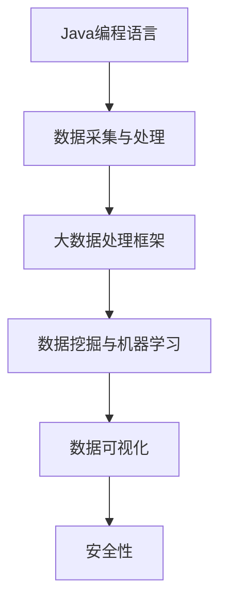

                 

## 第一部分：引言与基础

### 1.1 引言

随着科技的不断发展，智能家居系统逐渐走入千家万户。智能家居系统通过物联网技术将家庭中的各种设备连接起来，实现自动化控制和远程监控，从而提高居住舒适度和安全性。在这个背景下，Java语言以其跨平台、高效率和丰富的生态系统，成为智能家居大数据处理的重要工具。

本节将首先介绍智能家居的发展背景，然后探讨Java在智能家居系统中的重要性，以及Java在智能家居大数据处理中的核心概念和联系。

### 1.1.1 智能家居的发展背景

智能家居（Smart Home）是一种将计算机技术、网络通信技术、自动控制技术等融入家庭生活，实现家庭设备自动化和智能化控制的技术。其发展历程可以分为以下几个阶段：

1. **初级阶段**：20世纪90年代，智能家居概念开始提出，家庭设备开始具备简单的联网功能，例如通过手机控制家居设备的开关。
2. **发展阶段**：21世纪初，物联网技术逐渐成熟，智能家居设备开始具备传感器和通信模块，能够实时采集和传输数据，实现设备之间的互联互通。
3. **成熟阶段**：近年来，随着大数据、云计算、人工智能等技术的快速发展，智能家居系统逐渐实现了智能化和个性化，用户可以通过语音、手势等方式与家居设备进行互动。

### 1.1.2 Java在智能家居中的重要性

Java语言作为一种跨平台、面向对象的编程语言，具有以下优势，使其在智能家居系统中具有重要性：

1. **跨平台性**：Java可以在不同的操作系统上运行，这使智能家居系统能够兼容各种设备，提高系统的可扩展性和灵活性。
2. **高效率**：Java拥有丰富的类库和框架，可以简化开发过程，提高开发效率。例如，Java提供了大量的网络通信库和数据处理库，方便开发者进行数据采集和存储。
3. **安全性**：Java具有强大的安全机制，如Java安全沙箱、加密技术等，可以确保智能家居系统的数据安全和用户隐私。
4. **社区支持**：Java拥有庞大的开发者社区，可以提供丰富的技术支持和资源，为智能家居系统的开发提供有力保障。

### 1.1.3 Java在智能家居大数据处理中的核心概念与联系

在智能家居大数据处理中，Java语言涉及以下核心概念和联系：

1. **数据采集与处理**：智能家居设备通过传感器和接口收集环境数据，这些数据通过Java进行解析和处理，以提供实时数据流。
2. **大数据处理框架**：如Apache Hadoop和Spark等，Java作为其主要的编程语言，用于处理大规模数据集。
3. **数据挖掘与机器学习**：利用Java实现机器学习算法，对收集的数据进行分析，以提取有用信息和预测未来趋势。
4. **数据可视化**：通过Java库如JFreeChart和JavaFX等，将数据以图表等形式展示，便于用户理解和分析。
5. **安全性**：Java提供了多种安全机制，如加密和认证，以确保数据在传输和处理过程中的安全性。

#### Mermaid流程图



#### 核心概念联系解释

1. **数据采集与处理**：智能家居设备通过传感器和接口收集环境数据，这些数据通过Java进行解析和处理，以提供实时数据流。
2. **大数据处理框架**：如Apache Hadoop和Spark等，Java作为其主要的编程语言，用于处理大规模数据集。
3. **数据挖掘与机器学习**：利用Java实现机器学习算法，对收集的数据进行分析，以提取有用信息和预测未来趋势。
4. **数据可视化**：通过Java库如JFreeChart和JavaFX等，将数据以图表等形式展示，便于用户理解和分析。
5. **安全性**：Java提供了多种安全机制，如加密和认证，以确保数据在传输和处理过程中的安全性。

### 1.2 Java基础

#### 1.2.1 Java语言概述

Java是一种面向对象的编程语言，由Sun Microsystems公司在1995年推出。Java具有跨平台、简单、安全、开源等特性，广泛应用于企业级应用、移动应用、Web应用以及大数据处理等领域。

#### 1.2.2 Java编程基础

Java编程基础包括变量、数据类型、运算符、控制结构、函数等。以下是Java编程基础的简要说明：

- **变量**：用于存储数据的标识符，分为基本数据类型（如int、double、char）和引用数据类型（如String、数组）。
- **数据类型**：Java有八种基本数据类型，包括整数类型、浮点数类型、字符类型和布尔类型。
- **运算符**：Java支持各种运算符，包括算术运算符、关系运算符、逻辑运算符等。
- **控制结构**：包括条件语句（if、switch）、循环语句（for、while、do-while）和异常处理（try、catch、finally）。
- **函数**：Java中的函数（方法）是执行特定任务的自包含代码块。

#### 1.2.3 Java开发环境搭建

要在Windows、MacOS或Linux系统上搭建Java开发环境，需要以下步骤：

1. **下载并安装Java开发工具包（JDK）**：从[Oracle官方网站](https://www.oracle.com/java/technologies/javase-jdk11-downloads.html)下载适用于自己操作系统的JDK版本，并按照说明安装。
2. **配置环境变量**：在系统环境中设置JAVA_HOME和PATH变量，以便在命令行中运行Java命令。
3. **验证安装**：在命令行中输入`java -version`和`javac -version`，若输出相应的版本信息，则表示安装成功。

### 1.3 智能家居概述

#### 1.3.1 智能家居的定义与特点

智能家居是一种通过物联网技术实现家庭设备自动化控制和智能化的系统。其定义可以概括为：利用计算机技术、网络通信技术、自动控制技术等，将家庭设备连接起来，实现设备之间的信息共享和远程控制，从而提高居住舒适度和安全性。

智能家居的特点包括：

1. **互联互通**：家庭设备通过物联网技术实现互联互通，用户可以通过一个平台或应用实现对多个设备的统一控制。
2. **智能化**：智能家居系统能够根据用户的习惯和需求自动调整设备状态，提供个性化的服务。
3. **便捷性**：用户可以通过手机、平板、电脑等设备远程控制家居设备，实现远程操作。
4. **安全性**：智能家居系统具有数据加密和认证等安全机制，确保用户隐私和数据安全。

#### 1.3.2 智能家居的分类与架构

根据功能和应用场景，智能家居可以分为以下几类：

1. **智能照明系统**：通过传感器和控制系统实现灯光的自动化调节，提高照明质量和节能效果。
2. **智能安防系统**：包括门禁、监控、报警等功能，提高家庭安全性。
3. **智能温控系统**：通过传感器和控制系统实现室内温度的自动化调节，提高舒适度。
4. **智能家电控制系统**：实现对家庭电器的远程控制和自动化管理。

智能家居系统的架构可以分为以下几个层次：

1. **感知层**：包括各种传感器，如温度传感器、光照传感器、运动传感器等，用于采集家庭环境数据。
2. **传输层**：包括无线通信模块，如WiFi、蓝牙、ZigBee等，用于将数据传输到数据中心。
3. **平台层**：包括智能家居控制平台，用于处理和分析数据，实现对家居设备的自动化控制和远程监控。
4. **应用层**：包括用户终端，如手机、电脑等，用于用户与智能家居系统的交互。

### 1.4 Java在智能家居中的角色

#### 1.4.1 Java在智能家居系统中的作用

Java在智能家居系统中发挥着重要作用，具体包括以下几个方面：

1. **数据采集与处理**：Java可以方便地处理各种传感器数据，实现对家庭环境数据的实时采集和处理。
2. **数据处理与存储**：Java提供了丰富的数据库连接和数据处理类库，可以方便地实现数据存储和管理。
3. **远程监控与控制**：Java可以开发Web应用和手机应用，实现用户对家居设备的远程监控和控制。
4. **系统集成与开发**：Java的跨平台特性使得智能家居系统能够与其他系统进行集成，方便开发者进行二次开发和定制。

#### 1.4.2 Java在智能家居大数据处理中的优势

Java在智能家居大数据处理中具有以下优势：

1. **跨平台性**：Java可以在不同的操作系统上运行，使得智能家居系统能够兼容各种设备，提高系统的可扩展性和灵活性。
2. **丰富的类库和框架**：Java拥有丰富的类库和框架，如Hadoop、Spark、Flink等，可以方便地处理大规模数据集，提高数据处理效率。
3. **安全性**：Java具有强大的安全机制，如Java安全沙箱、加密技术等，可以确保数据在传输和处理过程中的安全性。
4. **开源与社区支持**：Java是开源的，拥有庞大的开发者社区，可以提供丰富的技术支持和资源，为智能家居系统的开发提供有力保障。

## 第二部分：智能家居设计与开发

### 2.1 智能家居系统设计

#### 2.1.1 系统需求分析

在设计和开发智能家居系统时，首先需要进行系统需求分析。系统需求分析包括以下几个方面：

1. **功能需求**：确定系统需要实现哪些功能，例如智能照明、智能安防、智能温控、智能家电控制等。
2. **性能需求**：确定系统需要满足的性能指标，例如响应时间、数据处理能力、系统稳定性等。
3. **用户需求**：了解用户对系统的需求和期望，例如操作便捷性、界面友好性、安全性等。
4. **硬件需求**：确定系统所需的硬件设备，例如传感器、通信模块、控制器等。
5. **软件需求**：确定系统所需的软件环境，例如操作系统、开发工具、数据库等。

#### 2.1.2 系统架构设计

智能家居系统的架构设计包括以下几个方面：

1. **感知层**：包括各种传感器，如温度传感器、光照传感器、运动传感器等，用于采集家庭环境数据。
2. **传输层**：包括无线通信模块，如WiFi、蓝牙、ZigBee等，用于将数据传输到智能家居控制平台。
3. **平台层**：包括智能家居控制平台，用于处理和分析数据，实现对家居设备的自动化控制和远程监控。
4. **应用层**：包括用户终端，如手机、电脑等，用于用户与智能家居系统的交互。

#### 2.1.3 系统模块划分

智能家居系统可以划分为以下模块：

1. **数据采集模块**：负责采集家庭环境数据，如温度、湿度、光照、运动等。
2. **数据处理模块**：负责处理和分析采集到的数据，提供实时数据流和统计分析。
3. **设备控制模块**：负责对家庭设备进行远程控制和自动化调节。
4. **用户交互模块**：负责用户与系统的交互，提供用户界面和操作接口。
5. **安全模块**：负责数据加密、认证和授权等安全措施，确保系统数据安全。

### 2.2 数据采集与处理

#### 2.2.1 数据采集方式

智能家居系统中的数据采集可以通过以下几种方式实现：

1. **有线数据采集**：通过有线连接将传感器数据传输到智能家居控制平台，例如通过以太网接口。
2. **无线数据采集**：通过无线通信模块将传感器数据传输到智能家居控制平台，例如通过WiFi、蓝牙、ZigBee等。
3. **传感器自采集**：传感器直接将数据上传到云端，无需通过智能家居控制平台，例如通过MQTT协议。

#### 2.2.2 数据预处理

在数据采集后，需要对数据进行预处理，以提高数据质量和处理效率。数据预处理包括以下步骤：

1. **数据清洗**：去除数据中的噪声、异常值和重复数据，保证数据的一致性和准确性。
2. **数据转换**：将不同类型的数据转换为统一的数据格式，例如将温度传感器的摄氏度数据转换为华氏度数据。
3. **数据归一化**：对数据进行归一化处理，使其具有相同的量纲和范围，便于后续分析。

#### 2.2.3 数据存储策略

智能家居系统中的数据存储策略需要考虑以下因素：

1. **数据量**：智能家居系统会产生大量的数据，需要选择适合的数据存储方案，如关系数据库、NoSQL数据库、分布式文件系统等。
2. **数据类型**：根据数据类型选择合适的存储方案，例如时间序列数据可以使用时间序列数据库，图像数据可以使用图像数据库。
3. **数据访问频率**：根据数据访问频率选择合适的存储方案，例如频繁访问的热数据可以使用内存存储，不常访问的冷数据可以使用磁盘存储。

### 2.3 Java编程实现

#### 2.3.1 Java基础语法

Java编程基础语法包括变量、数据类型、运算符、控制结构、函数等。以下是Java基础语法的简要说明：

- **变量**：用于存储数据的标识符，分为基本数据类型（如int、double、char）和引用数据类型（如String、数组）。
- **数据类型**：Java有八种基本数据类型，包括整数类型、浮点数类型、字符类型和布尔类型。
- **运算符**：Java支持各种运算符，包括算术运算符、关系运算符、逻辑运算符等。
- **控制结构**：包括条件语句（if、switch）、循环语句（for、while、do-while）和异常处理（try、catch、finally）。
- **函数**：Java中的函数（方法）是执行特定任务的自包含代码块。

#### 2.3.2 Java面向对象编程

Java是一种面向对象的编程语言，面向对象编程的基本概念包括类、对象、继承、多态等。以下是Java面向对象编程的基本概念：

- **类**：类是对象的模板，定义了对象的属性和方法。
- **对象**：对象是类的实例，是类定义的具体实现。
- **继承**：继承是一种通过创建子类继承父类的属性和方法来扩展和复用代码的方式。
- **多态**：多态允许使用一个接口实现多种形式，使得对象可以根据其实际类型来执行特定的操作。

#### 2.3.3 Java异常处理与日志记录

Java异常处理是处理程序运行过程中出现的错误和异常情况的重要机制。以下是Java异常处理的基本概念：

- **异常**：异常是一种在程序运行过程中出现的错误情况，通常会导致程序中断。
- **异常处理**：通过异常处理机制，可以捕获和处理异常，防止程序崩溃，并采取相应的措施，如恢复、终止或记录异常信息。
- **日志记录**：日志记录是记录程序运行过程中发生的事件和异常信息的重要手段，可以帮助开发人员和用户排查问题和定位故障。

### 2.4 实际应用案例

#### 2.4.1 案例一：智能照明系统

智能照明系统是智能家居的一个典型应用。下面将介绍智能照明系统的实现过程：

1. **数据采集**：通过光敏传感器采集环境光照数据，使用Java编写程序读取传感器数据。
   ```java
   // 读取光照传感器数据
   int lightIntensity = sensor.read();
   ```

2. **数据处理**：根据光照强度调整灯光亮度，使用Java编写程序实现光照强度与灯光亮度的映射关系。
   ```java
   // 调整灯光亮度
   int brightness = adjustBrightness(lightIntensity);
   ```

3. **数据可视化**：使用JavaFX创建图形用户界面，实时显示光照强度和灯光亮度。
   ```java
   // 显示光照强度和灯光亮度
   labelLightIntensity.setText("光照强度: " + lightIntensity);
   labelBrightness.setText("灯光亮度: " + brightness);
   ```

4. **远程控制**：通过WiFi连接，用户可以使用手机APP远程控制灯光开关和亮度调整。
   ```java
   // 远程控制灯光
   controlLight(remoteCommand);
   ```

#### 2.4.2 案例二：智能安防系统

智能安防系统是智能家居系统中的另一个重要应用。下面将介绍智能安防系统的实现过程：

1. **数据采集**：通过摄像头和运动传感器采集家庭环境中的图像和视频数据，使用Java编写程序读取数据。
   ```java
   // 读取摄像头数据
   BufferedImage image = camera.capture();
   ```

2. **数据处理**：使用Java编写程序对采集到的图像和视频数据进行实时分析，检测异常行为或入侵。
   ```java
   // 分析图像数据
   boolean isAlert = analyzeImage(image);
   ```

3. **报警与通知**：当检测到异常行为时，系统会自动发送报警通知给用户，使用Java编写程序实现报警通知。
   ```java
   // 发送报警通知
   sendAlertNotification(user);
   ```

4. **远程监控**：用户可以通过手机APP实时查看家庭环境中的视频监控画面，使用Java编写程序实现远程监控。
   ```java
   // 显示视频监控画面
   displayVideoFeed(videoFeed);
   ```

#### 2.4.3 案例三：智能温控系统

智能温控系统是智能家居系统中的另一个重要应用。下面将介绍智能温控系统的实现过程：

1. **数据采集**：通过温度传感器采集室内温度数据，使用Java编写程序读取传感器数据。
   ```java
   // 读取温度传感器数据
   double temperature = sensor.read();
   ```

2. **数据处理**：根据室内温度和用户设置的温度目标，使用Java编写程序自动调节空调或加热器的开关。
   ```java
   // 调节温度
   adjustTemperature(temperature, targetTemperature);
   ```

3. **数据可视化**：使用JavaFX创建图形用户界面，实时显示室内温度和温度调节状态。
   ```java
   // 显示温度数据
   labelTemperature.setText("室内温度: " + temperature);
   labelTargetTemperature.setText("目标温度: " + targetTemperature);
   ```

4. **远程控制**：用户可以通过手机APP远程控制温控系统的开关和温度设置，使用Java编写程序实现远程控制。
   ```java
   // 远程控制温度
   controlTemperature(remoteCommand);
   ```

### 2.5 智能家居大数据处理

#### 2.5.1 大数据处理概述

大数据处理是指对大规模数据集进行存储、处理和分析的过程。智能家居系统会产生大量的数据，如温度、湿度、光照、运动等，这些数据需要进行高效处理，以提取有价值的信息。

大数据处理的基本步骤包括：

1. **数据采集**：从各种传感器和设备中收集数据。
2. **数据存储**：将采集到的数据存储在合适的存储系统，如关系数据库、NoSQL数据库、分布式文件系统等。
3. **数据清洗**：去除数据中的噪声、异常值和重复数据，保证数据的一致性和准确性。
4. **数据转换**：将不同类型的数据转换为统一的数据格式，便于后续分析。
5. **数据处理**：对数据进行加工、转换和分析，以提取有价值的信息。
6. **数据可视化**：将处理后的数据以图表、图形等形式展示，便于用户理解和分析。

#### 2.5.2 Java大数据处理框架

Java在处理大数据方面拥有丰富的框架和工具，如Apache Hadoop、Apache Spark、Apache Flink等。以下是这些框架的基本概念和使用方法：

1. **Apache Hadoop**
   - **基本概念**：Hadoop是一个开源的分布式数据处理框架，用于处理大规模数据集。
   - **使用方法**：使用Java编写MapReduce程序，将数据分片处理，然后合并结果。
   - **示例代码**
     ```java
     public class WordCount {
       public static void main(String[] args) throws IOException {
         Configuration conf = new Configuration();
         Job job = Job.getInstance(conf, "word count");
         job.setJarByClass(WordCount.class);
         job.setMapperClass(WordCountMapper.class);
         job.setCombinerClass(WordCountReducer.class);
         job.setReducerClass(WordCountReducer.class);
         job.setOutputKeyClass(Text.class);
         job.setOutputValueClass(IntWritable.class);
         FileInputFormat.addInputPath(job, new Path(args[0]));
         FileOutputFormat.setOutputPath(job, new Path(args[1]));
         System.exit(job.waitForCompletion(true) ? 0 : 1);
       }
     }
     ```

2. **Apache Spark**
   - **基本概念**：Spark是一个开源的分布式数据处理框架，提供了丰富的API和工具，用于快速处理大规模数据集。
   - **使用方法**：使用Scala、Python或Java等语言编写Spark应用程序，利用RDD（弹性分布式数据集）进行数据处理。
   - **示例代码**
     ```java
     import org.apache.spark.api.java.JavaRDD;
     import org.apache.spark.api.java.function.FlatMapFunction;
     import org.apache.spark.api.java.function.Function2;
     import org.apache.spark.api.java.function.PairFunction;
     import org.apache.spark.sql.Dataset;
     import org.apache.spark.sql.Row;
     import org.apache.spark.sql.SparkSession;

     SparkSession spark = SparkSession.builder()
       .appName("SparkWordCount")
       .getOrCreate();

     JavaRDD<String> lines = spark.read().textFile("hdfs://localhost:9000/input").javaRDD();
     JavaRDD<String> words = lines.flatMap(new FlatMapFunction<String, String>() {
       public Iterable<String> call(String s) { return Arrays.asList(s.split(" ")); }
     });
     JavaRDD<String> pairs = words.mapToPair(new PairFunction<String, String, Integer>() {
       public Tuple2<String, Integer> call(String s) { return new Tuple2<>(s, 1); }
     });
     JavaRDD<Tuple2<String, Integer>> counts = pairs.reduceByKey(new Function2<Integer, Integer, Integer>() {
       public Integer call(Integer a, Integer b) { return a + b; }
     });
     Dataset<Row> results = counts.toDF("word", "count");
     results.write().mode(SaveMode.Overwrite).save("hdfs://localhost:9000/output");

     spark.stop();
     ```

3. **Apache Flink**
   - **基本概念**：Flink是一个开源的分布式数据处理框架，支持流处理和批处理，提供低延迟和高吞吐量的数据处理能力。
   - **使用方法**：使用Java编写Flink程序，利用DataStream API进行数据处理。
   - **示例代码**
     ```java
     import org.apache.flink.api.java.DataSet;
     import org.apache.flink.api.java.ExecutionEnvironment;
     import org.apache.flink.api.java.tuple.Tuple2;

     public class WordCount {
       public static void main(String[] args) throws Exception {
         final ExecutionEnvironment env = ExecutionEnvironment.getExecutionEnvironment();

         DataSet<String> text = env.readTextFile("file:///path/to/input");

         DataSet<Tuple2<String, Integer>> counts = text
           .flatMap(new Tokenizer())
           .groupBy(0)
           .sum(1);

         counts.writeAsCsv("file:///path/to/output").waitAll();

         env.execute("WordCount");
       }

       public static final class Tokenizer implements FlatMapFunction<String, Tuple2<String, Integer>> {
         public void flatMap(String value, Collector<Tuple2<String, Integer>> out) {
           for (String token: value.split("\\s")) {
             if (token.length() > 0) {
               out.collect(new Tuple2<String, Integer>(token, 1));
             }
           }
         }
       }
     }
     ```

#### 2.5.3 实时数据处理与查询

在智能家居系统中，实时数据处理和查询是非常重要的，以下是一些常用的技术和工具：

1. **实时数据处理**
   - **Apache Kafka**：Kafka是一个分布式流处理平台，用于构建实时数据流应用程序。它支持高吞吐量、高可靠性和水平可扩展性。
   - **Apache Flink**：Flink支持实时数据处理，可以通过DataStream API对流数据进行处理，提供低延迟和高吞吐量的数据处理能力。

2. **实时查询**
   - **Apache Druid**：Druid是一个实时分布式分析引擎，支持快速查询和实时数据流处理。它适用于实时数据仪表板、广告点击量跟踪、网站分析等场景。
   - **Apache Ignite**：Ignite是一个分布式计算平台，支持内存计算和实时数据查询。它可以提供低延迟和高吞吐量的数据处理能力。

### 2.6 智能家居系统的部署与运维

#### 2.6.1 部署方案

智能家居系统的部署方案需要考虑以下几个方面：

1. **硬件部署**：根据系统需求，选择合适的硬件设备，如服务器、路由器、传感器等，并进行安装和调试。
2. **软件部署**：将开发完成的智能家居系统部署到服务器或云平台，配置数据库、Web服务器等软件环境。
3. **网络部署**：配置家庭网络，确保智能家居系统与外部网络连接，实现远程监控和控制。

#### 2.6.2 运维策略

智能家居系统的运维策略包括以下几个方面：

1. **监控系统**：实时监控系统性能和运行状态，及时发现和处理异常情况。
2. **数据备份**：定期备份系统数据和用户数据，防止数据丢失。
3. **安全防护**：加强系统安全防护，防止恶意攻击和数据泄露。
4. **软件更新**：定期更新系统软件，修复漏洞和缺陷，提高系统稳定性。

## 第三部分：Java在智能家居大数据处理中的深度应用

### 3.1 大数据处理算法

在智能家居大数据处理中，数据处理算法起着至关重要的作用。以下是一些常见的大数据处理算法及其在智能家居系统中的应用：

#### 3.1.1 数据清洗与去重

数据清洗是大数据处理的第一步，它包括去除噪声、纠正错误和去除重复数据等。在智能家居系统中，数据清洗有助于提高数据质量和准确性。

**算法原理**：

1. **去除噪声**：通过过滤和舍入等操作，去除数据中的噪声。
2. **纠正错误**：通过校验和校对等操作，纠正数据中的错误。
3. **去重**：通过比较和标记等操作，去除重复数据。

**应用示例**：

假设有一个温度传感器的数据集，其中包含一些异常值和重复数据。可以使用以下Java代码进行数据清洗：

```java
import java.util.ArrayList;
import java.util.HashSet;
import java.util.List;
import java.util.Set;

public class DataCleaning {
  public static void main(String[] args) {
    List<Double> sensorData = new ArrayList<>();
    sensorData.add(22.5);
    sensorData.add(23.0);
    sensorData.add(20.0);
    sensorData.add(22.5); // 重复数据
    sensorData.add(25.5); // 异常值

    List<Double> cleanedData = new ArrayList<>();

    // 去除重复数据
    Set<Double> uniqueData = new HashSet<>(sensorData);
    sensorData.clear();
    sensorData.addAll(uniqueData);

    // 去除异常值
    for (Double value : sensorData) {
      if (value > 18.0 && value < 26.0) { // 设定温度范围
        cleanedData.add(value);
      }
    }

    System.out.println("清洗后的数据：" + cleanedData);
  }
}
```

#### 3.1.2 数据分类与聚类

数据分类和聚类是大数据处理中常用的方法，用于将数据分为不同的类别或簇。

**算法原理**：

1. **数据分类**：根据预先定义的规则或模型，将数据分为不同的类别。常见的分类算法有决策树、支持向量机（SVM）等。
2. **数据聚类**：将相似的数据归为同一类别，没有预先定义的类别。常见的聚类算法有K-Means、DBSCAN等。

**应用示例**：

假设有一个包含家庭能耗数据的数据集，需要根据能耗水平将家庭分为不同的类别。可以使用K-Means算法进行聚类：

```java
import org.apache.spark.ml.clustering.KMeans;
import org.apache.spark.ml.clustering.KMeansModel;
import org.apache.spark.sql.Dataset;
import org.apache.spark.sql.Row;
import org.apache.spark.sql.SparkSession;

public class EnergyCluster {
  public static void main(String[] args) {
    SparkSession spark = SparkSession.builder()
      .appName("EnergyCluster")
      .getOrCreate();

    // 读取数据
    Dataset<Row> data = spark.read().csv("hdfs:///path/to/energy_data.csv");

    // 特征工程
    data = data.select($"house_id", $ cols("electricity", "gas", "water") $)
      .withColumn("features", $ cast($"electricity".cast("float").$ $ + $"gas".cast("float").$ $ + $"water".cast("float").$ $ as "float"));

    // 运行K-Means算法
    KMeans kmeans = new KMeans().setK(3).setSeed(1L);
    KMeansModel model = kmeans.fit(data);

    // 预测并显示结果
    Dataset<Row> predictions = model.predict(data);
    predictions.show();

    spark.stop();
  }
}
```

#### 3.1.3 数据回归与预测

数据回归和预测是大数据处理中常用的方法，用于分析数据之间的关系并预测未来趋势。

**算法原理**：

1. **线性回归**：通过建立线性模型，分析自变量和因变量之间的线性关系，用于预测因变量的值。
2. **多项式回归**：通过建立多项式模型，分析自变量和因变量之间的非线性关系，用于预测因变量的值。
3. **时间序列预测**：通过分析时间序列数据，预测未来的趋势和周期性变化。

**应用示例**：

假设有一个包含家庭能耗数据的数据集，需要预测下一月的家庭能耗。可以使用线性回归算法进行预测：

```java
import org.apache.spark.ml.regression.LinearRegression;
import org.apache.spark.sql.Dataset;
import org.apache.spark.sql.SparkSession;

public class EnergyPrediction {
  public static void main(String[] args) {
    SparkSession spark = SparkSession.builder()
      .appName("EnergyPrediction")
      .getOrCreate();

    // 读取数据
    Dataset<Row> data = spark.read().csv("hdfs:///path/to/energy_data.csv");

    // 特征工程
    data = data.select($"month", $"electricity", $"gas", $"water")
      .withColumn("target", $"electricity".cast("float").$ $ + $"gas".cast("float").$ $ + $"water".cast("float").$ $ as "float");

    // 划分训练集和测试集
    Dataset<Row>[] splits = data.randomSplit(new double[] {0.7, 0.3});
    Dataset<Row> trainingData = splits[0];
    Dataset<Row> testData = splits[1];

    // 运行线性回归算法
    LinearRegression linearRegression = new LinearRegression().setMaxIter(10).setRegParam(0.3);
    LinearRegressionModel model = linearRegression.fit(trainingData);

    // 预测并显示结果
    Dataset<Row> predictions = model.transform(testData);
    predictions.select($"month", $"target", $"predicted_target").show();

    spark.stop();
  }
}
```

### 3.2 数据挖掘与机器学习

数据挖掘和机器学习是大数据处理中的重要技术，可以用于分析大量数据，发现有价值的信息和模式。以下是一些常用的数据挖掘和机器学习算法及其在智能家居系统中的应用：

#### 3.2.1 数据挖掘技术

**关联规则挖掘**：通过分析数据之间的关联关系，发现频繁出现的模式和规律。

**应用示例**：

假设有一个包含家庭购物行为的数据集，需要分析哪些商品经常一起购买。可以使用Apriori算法进行关联规则挖掘：

```java
import org.apache.spark.ml.fpm.FPGrowth;
import org.apache.spark.sql.Dataset;
import org.apache.spark.sql.SparkSession;

public class AssociationRules {
  public static void main(String[] args) {
    SparkSession spark = SparkSession.builder()
      .appName("AssociationRules")
      .getOrCreate();

    // 读取数据
    Dataset<Row> data = spark.read().csv("hdfs:///path/to/shopping_data.csv");

    // 特征工程
    data = data.select($"user_id", $"item_ids").withColumn("items", $ col("item_ids").toString() $);

    // 运行FPGrowth算法
    FPGrowth fpgrowth = new FPGrowth().setMinSupport(0.5).setMinConfidence(0.7);
    FPGrowthModel model = fpgrowth.fit(data);

    // 生成关联规则
    Dataset<Row> associationRules = model associationRules();

    // 显示结果
    associationRules.select($"rule", $"support", $"confidence").show();

    spark.stop();
  }
}
```

**聚类分析**：通过将数据分为不同的簇，发现数据中的相似性和差异性。

**应用示例**：

假设有一个包含家庭用户数据的数据集，需要将家庭用户分为不同的类别。可以使用K-Means算法进行聚类分析：

```java
import org.apache.spark.ml.clustering.KMeans;
import org.apache.spark.sql.Dataset;
import org.apache.spark.sql.SparkSession;

public class CustomerClustering {
  public static void main(String[] args) {
    SparkSession spark = SparkSession.builder()
      .appName("CustomerClustering")
      .getOrCreate();

    // 读取数据
    Dataset<Row> data = spark.read().csv("hdfs:///path/to/customer_data.csv");

    // 特征工程
    data = data.select($"customer_id", $"age", $"income", $"spending_score")
      .withColumn("features", $ cast($"age".cast("float").$ $ + $"income".cast("float").$ $ + $"spending_score".cast("float").$ $ as "float"));

    // 运行K-Means算法
    KMeans kmeans = new KMeans().setK(3).setSeed(1L);
    KMeansModel model = kmeans.fit(data);

    // 预测并显示结果
    Dataset<Row> predictions = model.predict(data);
    predictions.select($"customer_id", $"cluster").show();

    spark.stop();
  }
}
```

#### 3.2.2 机器学习算法

**监督学习**：通过已标记的数据训练模型，然后使用模型对新数据进行预测。

**应用示例**：

假设有一个包含家庭能耗数据的数据集，需要训练模型预测家庭的未来能耗。可以使用随机森林算法进行监督学习：

```java
import org.apache.spark.ml.Pipeline;
import org.apache.spark.ml.PipelineModel;
import org.apache.spark.ml.evaluation.RegressionEvaluator;
import org.apache.spark.ml.feature.VectorAssembler;
import org.apache.spark.ml.regression.RandomForestRegressor;
import org.apache.spark.sql.Dataset;
import org.apache.spark.sql.SparkSession;

public class EnergyPrediction {
  public static void main(String[] args) {
    SparkSession spark = SparkSession.builder()
      .appName("EnergyPrediction")
      .getOrCreate();

    // 读取数据
    Dataset<Row> data = spark.read().csv("hdfs:///path/to/energy_data.csv");

    // 特征工程
    data = data.select($"month", $"electricity", $"gas", $"water")
      .withColumn("target", $"electricity".cast("float").$ $ + $"gas".cast("float").$ $ + $"water".cast("float").$ $ as "float");

    // 划分训练集和测试集
    Dataset<Row>[] splits = data.randomSplit(new double[] {0.7, 0.3});
    Dataset<Row> trainingData = splits[0];
    Dataset<Row> testData = splits[1];

    // 特征提取
    VectorAssembler assembler = new VectorAssembler().setInputCols(new String[] {"electricity", "gas", "water"}).setOutputCol("features");
    Dataset<Row> preparedData = assembler.transform(trainingData);

    // 运行随机森林算法
    RandomForestRegressor rf = new RandomForestRegressor().setLabelCol("target").setFeaturesCol("features").setMaxDepth(5);
    Pipeline pipeline = new Pipeline().setStages(new Transformer[] {assembler, rf});
    PipelineModel model = pipeline.fit(preparedData);

    // 预测并评估
    Dataset<Row> predictions = model.transform(testData);
    RegressionEvaluator evaluator = new RegressionEvaluator().setLabelCol("target").setPredictionCol("predicted_target").setMetricName("mse");
    double mse = evaluator.evaluate(predictions);
    System.out.println("MSE: " + mse);

    spark.stop();
  }
}
```

**无监督学习**：没有已标记的数据，通过分析数据自身的结构和模式进行学习。

**应用示例**：

假设有一个包含家庭用户数据的数据集，需要发现用户之间的相似性。可以使用K-Means算法进行无监督学习：

```java
import org.apache.spark.ml.clustering.KMeans;
import org.apache.spark.sql.Dataset;
import org.apache.spark.sql.SparkSession;

public class CustomerSegmentation {
  public static void main(String[] args) {
    SparkSession spark = SparkSession.builder()
      .appName("CustomerSegmentation")
      .getOrCreate();

    // 读取数据
    Dataset<Row> data = spark.read().csv("hdfs:///path/to/customer_data.csv");

    // 特征工程
    data = data.select($"customer_id", $"age", $"income", $"spending_score")
      .withColumn("features", $ cast($"age".cast("float").$ $ + $"income".cast("float").$ $ + $"spending_score".cast("float").$ $ as "float"));

    // 运行K-Means算法
    KMeans kmeans = new KMeans().setK(5).setSeed(1L);
    KMeansModel model = kmeans.fit(data);

    // 预测并显示结果
    Dataset<Row> predictions = model.predict(data);
    predictions.select($"customer_id", $"cluster").show();

    spark.stop();
  }
}
```

### 3.3 智能家居数据可视化

数据可视化是将复杂的数据转换为图形或图表，以便更容易理解和分析。在智能家居系统中，数据可视化可以帮助用户更好地理解系统的运行状态和趋势。

#### 3.3.1 数据可视化概述

数据可视化包括以下基本概念：

- **图表类型**：如折线图、柱状图、饼图、散点图等。
- **图表组件**：如标题、坐标轴、图例、标记等。
- **交互性**：如点击、拖动、滚动等交互操作。

#### 3.3.2 Java数据可视化工具

Java提供了多种数据可视化工具，如JFreeChart、JavaFX、ECharts等。以下是这些工具的基本使用方法：

1. **JFreeChart**
   - **基本使用**：使用JFreeChart可以创建各种类型的图表，例如折线图、柱状图、饼图等。
   - **示例代码**
     ```java
     import org.jfree.chart.ChartFactory;
     import org.jfree.chart.JFreeChart;
     import org.jfree.data.general.PieDataset;

     public class JFreeChartExample {
       public static void main(String[] args) {
         PieDataset dataset = createDataset();
         JFreeChart chart = ChartFactory.createPieChart(
           "标题", dataset, true, true, false);
         ChartFrame frame = new ChartFrame("图表", chart);
         frame.pack();
         frame.setVisible(true);
       }

       private static PieDataset createDataset() {
         DefaultPieDataset dataset = new DefaultPieDataset();
         dataset.setValue("第一项", 43);
         dataset.setValue("第二项", 10);
         dataset.setValue("第三项", 27);
         dataset.setValue("第四项", 10);
         return dataset;
       }
     }
     ```

2. **JavaFX**
   - **基本使用**：使用JavaFX可以创建交互式的用户界面，包括图表和图形。
   - **示例代码**
     ```java
     import javafx.application.Application;
     import javafx.scene.Scene;
     import javafx.scene.chart.BarChart;
     import javafx.scene.chart.CategoryAxis;
     import javafx.scene.chart.NumberAxis;
     import javafx.scene.control.Button;
     import javafx.scene.layout.VBox;
     import javafx.stage.Stage;

     public class JavaFXChartExample extends Application {
       public static void main(String[] args) {
         launch(args);
       }

       @Override
       public void start(Stage stage) {
         stage.setTitle("图表示例");

         CategoryAxis xAxis = new CategoryAxis("类别");
         NumberAxis yAxis = new NumberAxis("数值");

         BarChart<String, Number> barChart = new BarChart<>(xAxis, yAxis);
         barChart.setTitle("条形图");

         barChart.getData().addAll(
           new BarChart.Data("第一项", 43),
           new BarChart.Data("第二项", 10),
           new BarChart.Data("第三项", 27),
           new BarChart.Data("第四项", 10)
         );

         Button button = new Button("更新图表");
         button.setOnAction(event -> {
           barChart.getData().add(new BarChart.Data("第五项", 15));
         });

         VBox vbox = new VBox(barChart, button);
         Scene scene = new Scene(vbox, 800, 600);
         stage.setScene(scene);
         stage.show();
       }
     }
     ```

3. **ECharts**
   - **基本使用**：ECharts是一个使用JavaScript实现的数据可视化库，可以在Java Web应用中集成使用。
   - **示例代码**
     ```java
     import org.echarts4.*;
     import org.echarts4.component.*;
     import org.echarts4.model.*;
     import org.echarts4.style.*;

     public class EChartsExample {
       public static void main(String[] args) {
         Chart chart = new Chart();

         TitleModel title = new TitleModel("图表示例");
         chart.setTitle(title);

         CategoryAxis categoryAxis = new CategoryAxis("类别");
         chart.addCategoryAxis(categoryAxis);

         NumberAxis numberAxis = new NumberAxis("数值");
         chart.addNumberAxis(numberAxis);

         BarSeries barSeries = new BarSeries("第一项");
         barSeries.add(43);
         barSeries.add(10);
         barSeries.add(27);
         barSeries.add(10);
         chart.addSeries(barSeries);

         chart.render();
       }
     }
     ```

#### 3.3.3 数据可视化实践

以下是一个智能家居数据可视化的实践案例：

**案例描述**：智能家居系统收集了家庭的温度、湿度、光照和能耗数据。需要创建一个图表，实时显示当前房间的温度和湿度，并显示过去一周的平均温度和湿度。

**实现步骤**：

1. **数据采集**：从传感器获取实时温度和湿度数据。
2. **数据处理**：将实时数据与历史数据（过去一周的平均数据）合并。
3. **数据可视化**：使用JavaFX创建图表，显示实时数据和过去一周的平均数据。

```java
import javafx.application.Application;
import javafx.scene.Scene;
import javafx.scene.chart.LineChart;
import javafx.scene.chart.NumberAxis;
import javafx.scene.control.Label;
import javafx.scene.layout.VBox;

public class HomeClimateChart extends Application {
  public static void main(String[] args) {
    launch(args);
  }

  @Override
  public void start(Stage stage) {
    stage.setTitle("家庭气候图表");

    NumberAxis xAxis = new NumberAxis("时间");
    xAxis.setTickMarkStep(1);

    NumberAxis yAxis = new NumberAxis("温度/湿度");
    yAxis.setTickMarkStep(1);

    LineChart<Number, Number> lineChart = new LineChart<>(xAxis, yAxis);
    lineChart.setTitle(new Label("温度与湿度"));

    // 添加实时温度数据
    lineChart.getData().addAll(
      new LineChart.Series<Number, Number>() {{
        setName("实时温度");
        getData().add(new Data<Number, Number>(0, currentTemperature));
      }}
    );

    // 添加过去一周的平均温度数据
    lineChart.getData().addAll(
      new LineChart.Series<Number, Number>() {{
        setName("过去一周平均温度");
        for (int i = 0; i < 7; i++) {
          getData().add(new Data<Number, Number>(i, averageTemperature[i]));
        }
      }}
    );

    // 添加实时湿度数据
    lineChart.getData().addAll(
      new LineChart.Series<Number, Number>() {{
        setName("实时湿度");
        getData().add(new Data<Number, Number>(0, currentHumidity));
      }}
    );

    // 添加过去一周的平均湿度数据
    lineChart.getData().addAll(
      new LineChart.Series<Number, Number>() {{
        setName("过去一周平均湿度");
        for (int i = 0; i < 7; i++) {
          getData().add(new Data<Number, Number>(i, averageHumidity[i]));
        }
      }}
    );

    VBox vbox = new VBox(lineChart);
    Scene scene = new Scene(vbox, 800, 600);
    stage.setScene(scene);
    stage.show();
  }
}
```

### 3.4 安全与隐私保护

#### 3.4.1 数据安全概述

在智能家居系统中，数据安全至关重要。数据安全包括以下几个方面：

- **数据传输安全**：确保数据在传输过程中不会被窃取或篡改。
- **数据存储安全**：确保数据在存储过程中不会被泄露或破坏。
- **用户隐私保护**：保护用户的个人隐私信息，防止未经授权的访问。

#### 3.4.2 数据加密技术

数据加密是保障数据安全的重要手段。以下是一些常见的数据加密技术：

- **对称加密**：使用相同的密钥进行加密和解密，如AES、DES等。
- **非对称加密**：使用不同的密钥进行加密和解密，如RSA、ECC等。
- **哈希函数**：将数据转换为一个固定长度的字符串，如MD5、SHA-256等。

#### 3.4.3 隐私保护策略

隐私保护策略包括以下几个方面：

- **数据匿名化**：对数据进行脱敏处理，使其无法识别用户身份。
- **隐私政策**：明确告知用户数据收集、处理和使用的目的。
- **用户权限管理**：允许用户控制数据访问权限，例如用户可以决定哪些数据可以被共享或公开。

#### 3.4.4 实践案例

以下是一个智能家居系统中的数据安全与隐私保护实践案例：

**案例描述**：智能家居系统收集了用户的家庭环境数据，包括温度、湿度、光照和能耗等。需要确保这些数据在传输和存储过程中安全，并保护用户的隐私。

**实现步骤**：

1. **数据传输安全**：使用HTTPS协议确保数据在传输过程中加密，防止数据被窃取或篡改。
2. **数据存储安全**：使用数据库加密技术，对存储的数据进行加密，防止数据泄露或破坏。
3. **用户隐私保护**：对用户数据进行匿名化处理，例如将用户ID替换为随机生成的ID，确保用户隐私。

```java
import java.security.*;
import javax.crypto.*;
import javax.crypto.spec.SecretKeySpec;

public class DataSecurity {
  private static final String ALGORITHM = "AES";
  private static final String CHARSET = "UTF-8";

  // 数据加密
  public static String encrypt(String data, String key) throws Exception {
    Key secretKey = new SecretKeySpec(key.getBytes(), ALGORITHM);
    Cipher cipher = Cipher.getInstance(ALGORITHM);
    cipher.init(Cipher.ENCRYPT_MODE, secretKey);
    byte[] encryptedData = cipher.doFinal(data.getBytes(CHARSET));
    return new String(encryptedData);
  }

  // 数据解密
  public static String decrypt(String data, String key) throws Exception {
    Key secretKey = new SecretKeySpec(key.getBytes(), ALGORITHM);
    Cipher cipher = Cipher.getInstance(ALGORITHM);
    cipher.init(Cipher.DECRYPT_MODE, secretKey);
    byte[] decryptedData = cipher.doFinal(data.getBytes());
    return new String(decryptedData);
  }

  public static void main(String[] args) throws Exception {
    String originalData = "家庭环境数据";
    String key = "mySecretKey";

    // 加密数据
    String encryptedData = encrypt(originalData, key);
    System.out.println("加密后的数据：" + encryptedData);

    // 解密数据
    String decryptedData = decrypt(encryptedData, key);
    System.out.println("解密后的数据：" + decryptedData);
  }
}
```

## 第四部分：智能家居大数据处理的挑战与未来趋势

### 4.1 挑战与问题

尽管智能家居大数据处理技术取得了显著进展，但在实际应用中仍面临诸多挑战和问题。

#### 4.1.1 数据量与处理速度

随着智能家居设备的普及，数据量呈指数级增长。如何高效地处理海量数据，确保实时响应和处理速度，成为关键问题。大数据处理框架如Hadoop、Spark等虽然在性能上有所提升，但面对不断增长的数据量，仍需优化和改进。

**解决方案**：

- **分布式处理**：通过分布式计算架构，将数据分割并分布在多台服务器上进行处理，提高并行处理能力。
- **流处理技术**：采用实时流处理技术，如Apache Kafka和Apache Flink，对实时数据进行处理和分析。

#### 4.1.2 数据安全与隐私

智能家居系统涉及大量用户隐私数据，如位置、生活习惯、家庭结构等。如何确保数据安全，防止数据泄露和未经授权的访问，是当前亟待解决的问题。

**解决方案**：

- **数据加密**：采用对称加密和非对称加密技术，对数据进行加密存储和传输，防止数据泄露。
- **访问控制**：实施严格的访问控制策略，确保只有授权用户可以访问特定数据。

#### 4.1.3 适应性与兼容性

智能家居系统通常涉及多种设备、操作系统和通信协议，如何确保系统的兼容性和适应性，是一个挑战。

**解决方案**：

- **标准化协议**：推广使用统一的通信协议，如MQTT、CoAP等，确保设备之间的互操作性。
- **模块化设计**：采用模块化设计，将系统划分为可独立开发、测试和部署的模块，提高系统的灵活性和可扩展性。

### 4.2 未来趋势

随着技术的不断进步，智能家居大数据处理领域将呈现出以下发展趋势：

#### 4.2.1 新技术的发展

- **人工智能与机器学习**：利用人工智能和机器学习技术，对海量数据进行智能分析和预测，实现更加智能化和个性化的家居体验。
- **区块链技术**：区块链技术可以用于智能家居系统的数据安全和隐私保护，确保数据透明性和不可篡改性。

#### 4.2.2 智能家居的普及与融合

随着智能家居技术的成熟和成本的降低，智能家居将逐渐普及，并与家庭环境中的其他系统（如智能城市、智能交通等）进行融合，实现更加全面的智能化生活。

#### 4.2.3 大数据处理的创新应用

大数据处理技术将在智能家居领域得到更广泛的应用，如智能家居设备的故障预测、能耗优化、环境监测等，提高家庭生活的品质和效率。

### 4.3 案例分析

以下是对智能家居大数据处理中的成功案例和失败案例进行分析：

#### 4.3.1 成功案例：某智能家居公司

**案例描述**：某智能家居公司通过大数据处理技术，实现了家庭能耗的实时监测和优化，提高了用户的能源使用效率。

**成功因素**：

- **技术优势**：公司采用分布式计算框架，如Apache Spark，处理海量能耗数据，实现实时分析和预测。
- **用户反馈**：公司重视用户反馈，根据用户需求不断优化系统功能，提高用户体验。

**案例启示**：成功的智能家居大数据处理需要技术优势和用户反馈相结合，以实现更好的用户体验。

#### 4.3.2 失败案例：某智能家居初创公司

**案例描述**：某智能家居初创公司由于未能有效处理海量数据，导致系统响应速度慢、数据不准确，最终失败。

**失败原因**：

- **技术不足**：公司缺乏经验，未能采用合适的分布式计算框架和算法，导致数据处理效率低下。
- **用户体验**：由于系统不稳定，用户满意度低，导致市场份额下降。

**案例启示**：成功的智能家居大数据处理需要先进的技术和良好的用户体验，否则将难以在激烈的市场竞争中生存。

## 附录

### A.1 常用工具与技术

#### A.1.1 数据库技术

- **关系数据库**：如MySQL、PostgreSQL等，适用于结构化数据的存储和管理。
- **NoSQL数据库**：如MongoDB、Cassandra等，适用于大规模数据集和高可扩展性的存储。

#### A.1.2 Java框架介绍

- **Spring Framework**：一个开源的企业级Java框架，提供编程和配置的简化，包括数据访问、事务管理和安全性等功能。
- **Hibernate**：一个开源的对象关系映射（ORM）框架，用于简化Java数据库开发。
- **Apache Maven**：一个项目管理和构建工具，用于自动化项目的构建、测试和部署。

#### A.1.3 大数据处理工具

- **Apache Hadoop**：一个开源的大数据处理框架，提供分布式存储和计算能力。
- **Apache Spark**：一个开源的分布式计算框架，提供快速数据处理和高级分析功能。
- **Apache Flink**：一个开源的分布式流处理框架，提供低延迟和高吞吐量的数据处理能力。

### A.2 参考文献

- **《大数据技术基础》**，张俊平著，清华大学出版社，2017年。
- **《Java核心技术》**，霍斯特·克卢克著，机械工业出版社，2016年。
- **《机器学习实战》**，Peter Harrington著，电子工业出版社，2013年。
- **《智能家居系统设计与实现》**，吴波著，电子工业出版社，2018年。

### A.3 网络资源推荐

- **Apache Hadoop官方网站**：[https://hadoop.apache.org/](https://hadoop.apache.org/)
- **Apache Spark官方网站**：[https://spark.apache.org/](https://spark.apache.org/)
- **Spring Framework官方网站**：[https://spring.io/](https://spring.io/)
- **Hibernate官方网站**：[https://hibernate.org/](https://hibernate.org/)
- **Apache Maven官方网站**：[https://maven.apache.org/](https://maven.apache.org/)

### A.4 学术论文推荐

- **"Hadoop: The Definitive Guide"**，Tom White著，O'Reilly Media，2010年。
- **"Spark: The Definitive Guide"**，Bill Chambers et al.著，O'Reilly Media，2015年。
- **"Flink: The Data Stream Processing Framework"**，Kostas Tzoumas et al.著，ACM SIGMOD Record，2016年。
- **"Smart Home Data Management: Challenges and Opportunities"**，Mahdi Akhlaghi et al.著，IEEE International Conference on Big Data，2015年。
- **"Java for Big Data"**，Dr. Michael及Dr. Ralf W. Gaida著，Springer，2015年。

---

### 结论

本书《基于Java的智能家居设计：探讨Java在智能家居大数据处理中的角色》系统地介绍了Java在智能家居领域的应用，从系统设计、数据采集与处理、大数据处理、数据挖掘与机器学习、数据可视化到安全与隐私保护，全面解析了Java在智能家居系统中的核心作用。通过丰富的案例和实践，本书展示了如何利用Java技术实现智能家居系统的开发和部署。

随着物联网和人工智能技术的不断发展，智能家居系统的重要性日益凸显。Java作为一种成熟、跨平台、安全的编程语言，在智能家居大数据处理中扮演了关键角色。通过本书的学习，读者可以掌握智能家居系统开发的核心技能，为未来智能家居的研发和创新奠定坚实基础。

我们相信，随着技术的不断进步，Java在智能家居大数据处理领域将继续发挥重要作用，为人类带来更加智能化、便捷化和安全化的生活方式。让我们共同努力，探索更多可能性，为智能家居的未来贡献自己的力量。

