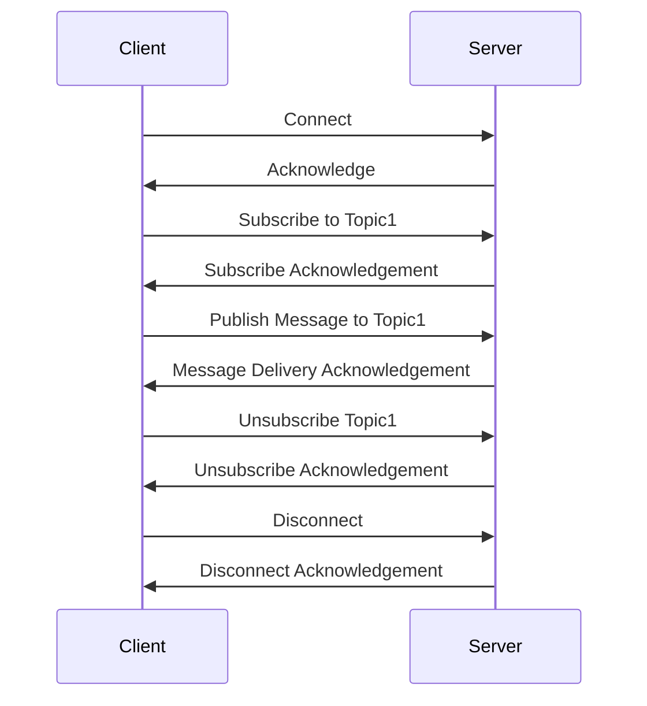
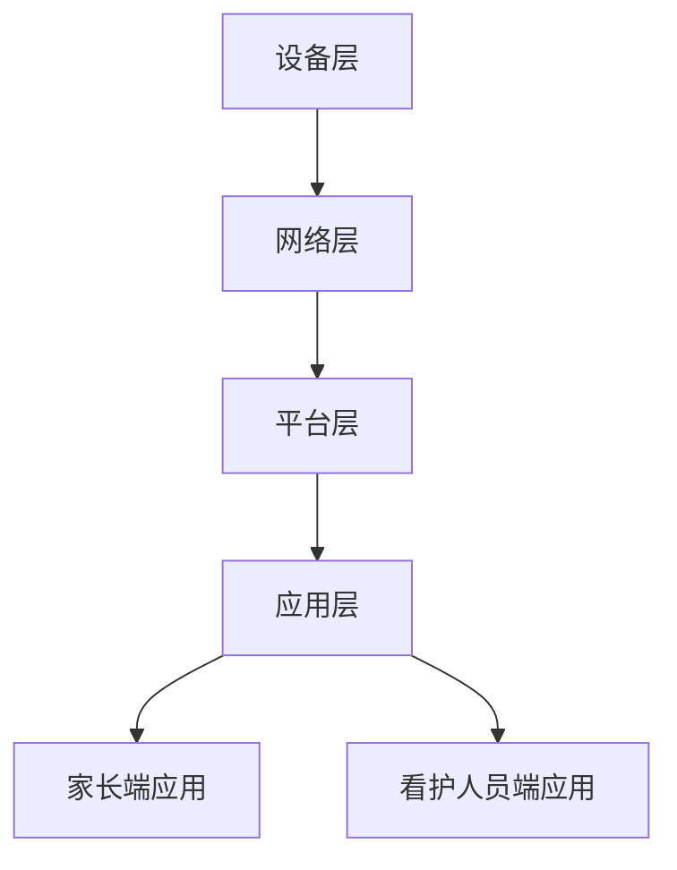
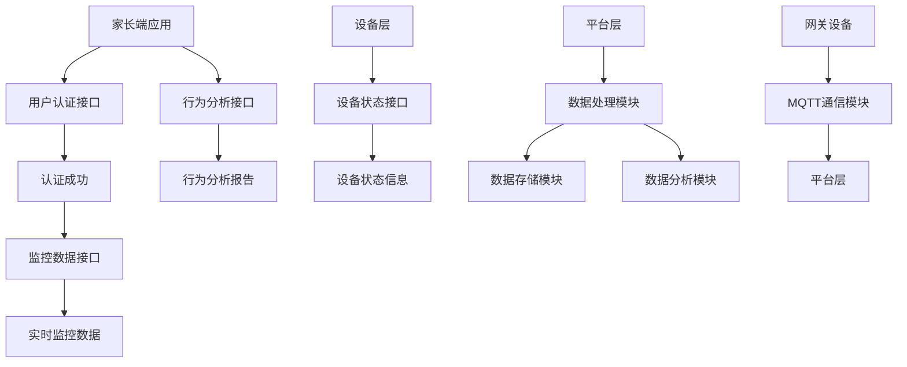
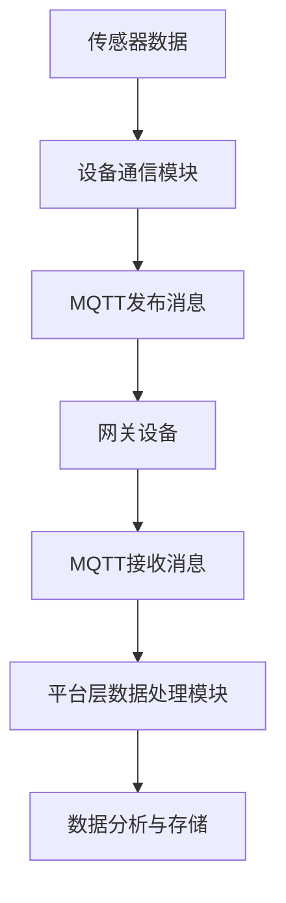
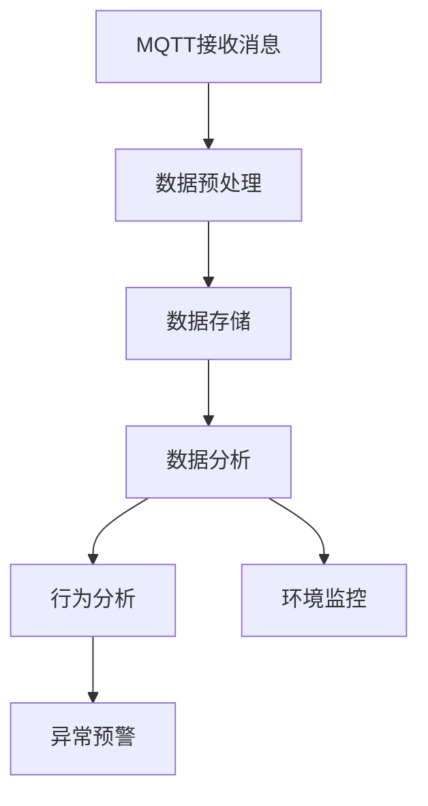
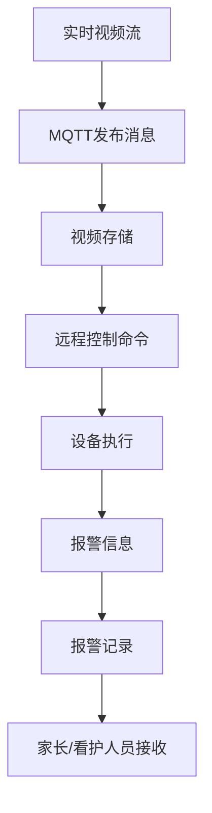
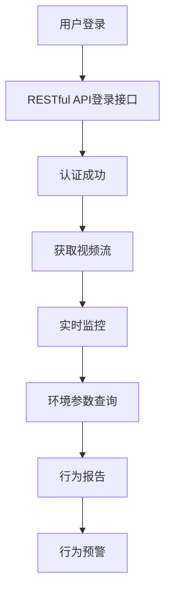
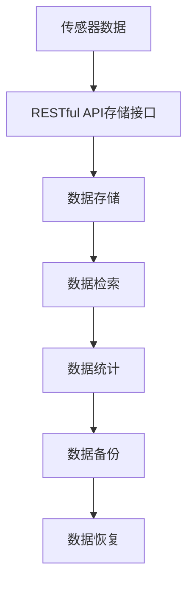
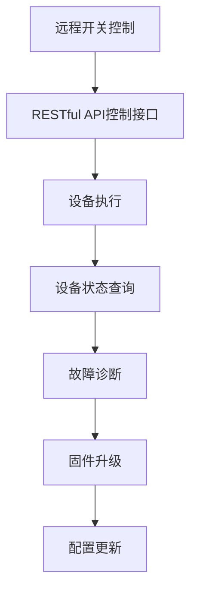

                 

# 基于MQTT协议和RESTful API的婴幼儿看护智能家居解决方案

## 关键词
- 智能家居
- MQTT协议
- RESTful API
- 婴幼儿看护
- 系统架构
- 核心算法
- 项目实战

## 摘要
本文将深入探讨基于MQTT协议和RESTful API的婴幼儿看护智能家居解决方案。首先，我们介绍了智能家居与婴幼儿看护的背景和需求，阐述了智能家居在婴幼儿看护中的重要应用前景。接着，本文详细讲解了MQTT协议和RESTful API的基础知识，包括协议简介、工作原理和特点。随后，我们设计并描述了一个婴幼儿看护智能家居系统的架构，重点分析了MQTT协议和RESTful API在系统中的应用。在核心算法和数学模型部分，我们深入讲解了传感器数据处理、信号处理等相关算法。最后，本文通过一个实际项目，展示了如何搭建开发环境、设计系统、实现源代码，并对代码进行了详细解读和分析。文章最后对婴幼儿看护智能家居解决方案进行了扩展与展望，总结了研究成果，并对未来的发展方向提出了建议。

## 第一部分：智能家居与婴幼儿看护概述

### 第1章：智能家居与婴幼儿看护的背景与需求

#### 1.1 智能家居的发展背景

智能家居（Smart Home）是利用物联网（Internet of Things，IoT）技术，将家庭中的各种设备和系统连接起来，实现自动化管理和智能控制的一种生活方式。随着科技的进步和人们生活水平的提高，智能家居逐渐成为现代家庭的重要组成部分。其主要发展背景如下：

1. **物联网技术的普及**：物联网技术的发展为智能家居的实现提供了技术基础。各种传感器、智能设备、云计算平台等物联网技术的成熟，使得智能家居的互联互通成为可能。
2. **智能家居市场的需求**：随着人们生活节奏的加快，对家庭安全和舒适度的需求日益增长，智能家居能够提供更便捷、智能化的家庭体验，受到消费者的青睐。
3. **智能家居的产业链成熟**：智能家居涉及多个产业链，包括硬件制造、软件开发、云服务提供商等。随着产业链的不断完善，智能家居市场的竞争力逐步增强。

#### 1.2 婴幼儿看护的重要性与挑战

婴幼儿看护（Childcare）是家庭和社会关注的重点，其重要性不言而喻。婴幼儿处于身体和智力发展的关键时期，需要得到充分的关注和照顾。然而，随着现代社会家庭结构的变化，很多家庭面临婴幼儿看护的挑战：

1. **家庭结构变化**：随着城市化进程的加快，很多家庭都面临着父母双方都要工作的现实情况，婴幼儿看护成为一个难题。
2. **看护质量要求提高**：现代家长对婴幼儿看护的质量要求越来越高，希望能够通过科技手段实现更智能、更贴心的看护服务。
3. **安全隐患**：婴幼儿安全是家长最关心的问题，任何可能的意外都可能给家庭带来巨大的伤害。因此，如何保障婴幼儿的安全成为看护的重点。

#### 1.3 智能家居在婴幼儿看护中的应用前景

智能家居在婴幼儿看护中的应用前景十分广阔，其能够提供一系列智能化的看护服务，包括：

1. **远程监控**：通过摄像头和传感器，家长可以实时监控婴幼儿的动态，随时了解孩子的健康状况和活动情况。
2. **智能警报**：当婴幼儿出现异常行为或环境异常时，智能家居系统能够及时发出警报，提醒家长采取相应措施。
3. **自动调节**：智能家居系统能够根据婴幼儿的需求自动调节室内温度、湿度等环境参数，提供舒适的生活环境。
4. **行为分析**：通过智能算法，分析婴幼儿的行为模式，为家长提供科学的育儿建议。
5. **安全防护**：智能家居系统能够实时监测家庭环境中的潜在危险，如火灾、漏水等，提供安全保障。

总之，智能家居在婴幼儿看护中的应用将为家庭带来更智能、更安全的育儿体验，有望解决当前婴幼儿看护中存在的诸多问题。

### 第2章：MQTT协议基础

#### 2.1 MQTT协议简介

MQTT（Message Queuing Telemetry Transport）协议是一种轻量级的消息传输协议，广泛用于物联网（IoT）领域。其设计目标是低带宽、不可靠的网络环境，如传感器网络和移动设备。以下是MQTT协议的主要特点：

1. **轻量级协议**：MQTT协议的数据包格式非常简洁，占用带宽小，适合传输到远程设备。
2. **发布/订阅模型**：MQTT采用发布/订阅（Publish/Subscribe）模型，发布者（Publisher）可以发布消息到特定的主题（Topic），订阅者（Subscriber）可以订阅这些主题，接收相关消息。
3. **QoS级别**：MQTT协议提供三种质量服务（QoS）级别，分别为0、1、2，满足不同应用场景的需求。QoS 0为至多一次交付，QoS 1为至少一次交付，QoS 2为恰好一次交付。

#### 2.2 MQTT协议工作原理

MQTT协议的工作原理可以概括为以下几个步骤：

1. **连接建立**：客户端（Client）通过MQTT协议连接到服务器（Server），发送连接请求。
2. **订阅主题**：客户端订阅一个或多个主题，以便接收与主题相关的消息。
3. **发布消息**：当有新的消息需要发布时，客户端将消息发送到服务器，指定相应的主题。
4. **消息传递**：服务器接收到客户端的消息后，将其转发给订阅该主题的客户端。
5. **连接断开**：当客户端不再需要服务时，可以发送断开连接请求。

以下是MQTT协议的简化流程图：



#### 2.3 MQTT协议消息传输流程

MQTT消息传输流程包括以下几个阶段：

1. **连接阶段**：客户端通过TCP/IP协议与服务器建立连接，并发送连接请求（Connect Packet）。
2. **订阅阶段**：客户端发送订阅请求（Subscribe Packet），订阅一个或多个主题。
3. **发布阶段**：客户端发送发布请求（Publish Packet），将消息发布到订阅的主题。
4. **确认阶段**：服务器接收到客户端的消息后，发送确认响应（Acknowledgement Packet）。
5. **断开阶段**：客户端在完成通信任务后，发送断开连接请求（Disconnect Packet），服务器返回断开连接确认。

以下是MQTT协议消息传输流程的详细步骤：

1. **连接请求**：
   - 客户端发送连接请求包（Connect Packet），包含协议版本、客户端标识（Client ID）、会话持续（Clean Session）、心跳间隔（Keep Alive）等信息。
   - 服务器接收到连接请求后，验证客户端身份，并返回连接确认包（Connect Ack Packet），确认连接成功。

2. **订阅请求**：
   - 客户端发送订阅请求包（Subscribe Packet），指定要订阅的主题和QoS级别。
   - 服务器接收到订阅请求后，返回订阅确认包（Subscribe Ack Packet），确认订阅成功。

3. **发布请求**：
   - 客户端发送发布请求包（Publish Packet），包含主题（Topic）和消息（Message）。
   - 服务器接收到发布请求后，根据订阅情况将消息转发给订阅该主题的客户端。

4. **确认响应**：
   - 订阅客户端接收到服务器转发的消息后，发送确认响应包（Acknowledgement Packet），告知服务器消息已成功接收。

5. **断开连接**：
   - 客户端发送断开连接请求包（Disconnect Packet），告知服务器即将断开连接。
   - 服务器接收到断开连接请求后，返回断开连接确认包（Disconnect Ack Packet），确认连接已断开。

#### 2.4 MQTT协议的特点与优势

MQTT协议具有以下特点与优势：

1. **低带宽消耗**：MQTT协议的消息格式简洁，数据包小，适合传输到带宽有限的设备。
2. **可扩展性强**：MQTT协议支持发布/订阅模型，能够方便地实现消息的广播和订阅，适合大规模物联网应用。
3. **可靠性高**：MQTT协议提供QoS级别，保证消息的可靠传输，适用于对数据传输可靠性要求较高的应用场景。
4. **易用性强**：MQTT协议的实现较为简单，开发者可以快速上手，适用于各种开发环境和平台。
5. **开源生态**：MQTT协议具有丰富的开源实现和工具，方便开发者进行二次开发和集成。

总之，MQTT协议凭借其轻量级、可扩展性、可靠性等特点，成为物联网领域的重要协议之一，在智能家居、工业物联网等领域得到了广泛应用。

### 第3章：RESTful API基础

#### 3.1 RESTful API概述

RESTful API（Representational State Transfer Application Programming Interface）是一种基于REST（Representational State Transfer）架构风格的网络应用接口。RESTful API通过使用HTTP协议的请求方法（GET、POST、PUT、DELETE等）来访问和操作资源，具有简单、易用、可扩展的特点。以下是RESTful API的主要特点：

1. **基于HTTP协议**：RESTful API使用HTTP协议进行通信，利用HTTP请求方法、URL和HTTP状态码实现资源的操作。
2. **无状态**：RESTful API是无状态的，每个请求都是独立的，服务器不会保存客户端的上下文信息，减少服务器的负担。
3. **统一接口**：RESTful API采用统一的接口设计，包括URL设计、请求方法、响应格式等，便于客户端理解和操作。
4. **状态转移**：RESTful API通过HTTP请求方法实现资源的创建、读取、更新和删除等操作，每个请求都对应一个状态转移。

#### 3.2 RESTful API设计原则

RESTful API的设计应遵循以下原则：

1. **单一功能原则**：每个API端点应只负责一个功能，避免功能过度耦合，提高系统的可维护性和可扩展性。
2. **无状态设计**：API应设计为无状态，确保每次请求都是独立的，不会受到之前请求的影响。
3. **统一的URL结构**：API的URL结构应清晰、简洁，易于理解和记忆，通常使用资源名称作为URL的一部分。
4. **统一的HTTP方法**：API应使用标准的HTTP方法（GET、POST、PUT、DELETE等）来表示资源的操作，确保API的一致性和易用性。
5. **规范的响应格式**：API的响应格式通常使用JSON或XML，确保数据的可读性和可解析性。

#### 3.3 RESTful API请求与响应

RESTful API的请求和响应是API交互的核心部分。以下是RESTful API请求与响应的详细说明：

1. **请求格式**：
   - URL：API的URL表示资源的地址，如`/users`表示用户资源。
   - HTTP方法：API使用HTTP方法表示资源的操作，如GET表示获取资源，POST表示创建资源。
   - 头部（Headers）：API请求的头部包含一些额外的信息，如内容类型（Content-Type）、认证信息（Authorization）等。
   - 请求体（Body）：部分API请求需要包含请求体，如创建资源时需要提供资源的详细数据。

2. **响应格式**：
   - 状态码：API响应的状态码表示请求的处理结果，如200表示成功，404表示资源未找到。
   - 响应体：API响应的响应体包含请求结果的相关数据，如JSON或XML格式的数据。

以下是一个典型的RESTful API请求和响应示例：

**请求示例**：
```http
POST /users
Host: api.example.com
Content-Type: application/json

{
  "username": "john_doe",
  "email": "john@example.com",
  "password": "password123"
}
```

**响应示例**：
```http
HTTP/1.1 201 Created
Content-Type: application/json

{
  "message": "User created successfully",
  "userId": "12345"
}
```

#### 3.4 RESTful API的优势与适用场景

RESTful API具有以下优势：

1. **简单易用**：RESTful API使用标准的HTTP协议和请求方法，易于理解和开发。
2. **可扩展性强**：RESTful API采用统一的接口设计原则，便于系统扩展和功能增加。
3. **无状态**：RESTful API无状态设计，提高系统的性能和可维护性。
4. **跨平台支持**：RESTful API基于HTTP协议，支持多种平台和编程语言，易于集成和部署。

RESTful API适用于以下场景：

1. **Web应用**：RESTful API适用于Web应用的后端服务，实现资源管理和数据交互。
2. **移动应用**：RESTful API适用于移动应用与后端服务的数据通信。
3. **微服务架构**：RESTful API适用于微服务架构中，实现服务之间的数据交换和协调。
4. **物联网应用**：RESTful API适用于物联网应用中，实现设备与云平台的通信和数据交换。

总之，RESTful API以其简单、易用、可扩展的特点，成为现代Web应用和物联网领域的重要接口设计模式。

### 第4章：婴幼儿看护智能家居系统架构设计

#### 4.1 婴幼儿看护智能家居系统架构

婴幼儿看护智能家居系统架构主要包括以下几个模块：

1. **设备层**：包括各种智能设备，如摄像头、温度传感器、湿度传感器、运动传感器、门禁传感器等，用于实时采集婴幼儿的生活环境数据和身体状态数据。
2. **网络层**：采用MQTT协议实现设备层与平台层的通信，确保数据的实时性和可靠性。
3. **平台层**：包括数据存储、处理和分析模块，以及RESTful API接口，用于处理设备层采集的数据，并提供智能化的服务。
4. **应用层**：包括家长端应用、看护人员端应用等，用于展示数据和提供交互功能。

以下是婴幼儿看护智能家居系统的架构图：



#### 4.2 系统模块划分与功能

婴幼儿看护智能家居系统模块划分如下：

1. **设备层**：
   - **摄像头**：用于实时监控婴幼儿的活动，提供视频流和图像数据。
   - **温度传感器**：用于监测室内温度，确保婴幼儿处于舒适的温度环境。
   - **湿度传感器**：用于监测室内湿度，确保婴幼儿的生活环境湿润适度。
   - **运动传感器**：用于监测婴幼儿的活动状况，如翻身、爬行等。
   - **门禁传感器**：用于监测婴幼儿房门的开关状态，防止婴幼儿离开安全区域。

2. **网络层**：
   - **MQTT通信模块**：负责设备层与平台层之间的数据传输，采用MQTT协议实现数据的实时性和可靠性。
   - **网关设备**：将设备层的传感器数据进行格式转换和压缩，并通过MQTT协议传输到平台层。

3. **平台层**：
   - **数据存储模块**：采用分布式数据库存储设备层采集的数据，包括视频流、传感器数据等。
   - **数据处理模块**：对采集到的传感器数据进行分析和处理，如温度、湿度异常检测、运动行为分析等。
   - **分析模块**：基于机器学习算法，对婴幼儿的行为模式进行建模和分析，为家长提供科学的育儿建议。
   - **API接口模块**：提供RESTful API接口，供家长端应用和看护人员端应用调用。

4. **应用层**：
   - **家长端应用**：提供实时的视频监控、环境参数监测、行为分析等功能，让家长随时了解婴幼儿的状况。
   - **看护人员端应用**：提供婴幼儿的实时监控、异常报警、行为分析等功能，帮助看护人员更好地照顾婴幼儿。

#### 4.3 系统接口设计与数据交互

婴幼儿看护智能家居系统的接口设计包括以下几种：

1. **设备接口**：
   - **设备注册接口**：用于设备加入系统时，向平台层注册设备信息，如设备ID、设备类型等。
   - **设备状态接口**：用于获取设备的状态信息，如传感器数据、设备电量等。

2. **数据采集接口**：
   - **传感器数据采集接口**：用于设备层传感器数据采集，并将数据发送到平台层。

3. **数据处理接口**：
   - **数据存储接口**：用于将平台层采集到的数据存储到分布式数据库中。
   - **数据分析接口**：用于对存储的数据进行分析和处理，生成行为报告和异常报警。

4. **API接口**：
   - **用户认证接口**：用于家长和看护人员登录系统，获取访问权限。
   - **监控数据接口**：用于家长端和看护人员端应用获取婴幼儿的实时监控数据。
   - **行为分析接口**：用于家长端和看护人员端应用获取婴幼儿的行为分析报告。

以下是系统接口和数据交互的流程图：



通过以上接口和数据交互设计，婴幼儿看护智能家居系统能够实现设备层与平台层、应用层之间的无缝连接，提供智能化的看护服务，为家长和看护人员提供便利和安全保障。

### 第5章：MQTT协议在婴幼儿看护智能家居中的应用

#### 5.1 MQTT协议在设备通信中的应用

在婴幼儿看护智能家居系统中，设备通信是数据采集和传输的核心。MQTT协议以其低功耗、低带宽消耗、可靠性强等特点，成为设备通信的理想选择。以下是MQTT协议在设备通信中的应用：

1. **设备数据采集**：
   - **传感器数据采集**：智能家居设备如温度传感器、湿度传感器、运动传感器等，通过MQTT协议将采集到的数据实时发送到平台层。
   - **环境数据采集**：摄像头等设备通过MQTT协议将婴幼儿的实时视频流和图像数据发送到平台层。

2. **数据传输与路由**：
   - **设备与网关通信**：智能家居设备通过网关设备与互联网连接，网关设备使用MQTT协议接收设备发送的数据，并转发到平台层。
   - **跨网络传输**：MQTT协议支持跨网络传输，确保数据在不同网络环境下的可靠传输。

3. **设备管理**：
   - **设备状态监控**：通过MQTT协议，平台层可以实时监控设备的状态，如电量、连接状态等，便于维护和管理。

4. **设备配置与更新**：
   - **远程配置**：通过MQTT协议，平台层可以远程配置设备参数，如传感器阈值、设备名称等。
   - **固件更新**：通过MQTT协议，平台层可以远程更新设备的固件版本，确保设备功能和安全性的升级。

以下是MQTT协议在设备通信中的应用流程：



#### 5.2 MQTT协议在数据处理中的应用

在婴幼儿看护智能家居系统中，数据处理是分析决策的基础。MQTT协议在数据处理中的应用主要体现在以下几个方面：

1. **实时数据处理**：
   - **数据接收与解析**：平台层通过MQTT协议接收设备发送的传感器数据和视频流数据，并解析数据内容。
   - **数据预处理**：对接收到的数据进行预处理，如去噪、滤波等，提高数据质量。

2. **数据存储与索引**：
   - **数据存储**：平台层将处理后的数据存储到分布式数据库中，确保数据的持久化和可查询性。
   - **数据索引**：为提高数据检索效率，对存储的数据进行索引管理。

3. **数据分析与预测**：
   - **行为分析**：通过机器学习算法，对婴幼儿的行为数据进行分析，识别正常行为和异常行为。
   - **环境监控**：实时分析传感器数据，监控室内温度、湿度等环境参数，预警潜在的风险。

以下是MQTT协议在数据处理中的应用流程：



#### 5.3 MQTT协议在远程监控中的应用

在婴幼儿看护智能家居系统中，远程监控是保障婴幼儿安全的重要手段。MQTT协议在远程监控中的应用包括以下几个方面：

1. **实时视频监控**：
   - **视频流传输**：通过MQTT协议，摄像头将实时视频流发送到平台层，家长和看护人员可以随时查看。
   - **视频存储**：平台层将视频流存储到分布式存储系统中，便于后续查看和分析。

2. **远程控制**：
   - **设备控制**：家长和看护人员可以通过远程控制接口，控制智能家居设备，如调节室内温度、打开/关闭门窗等。
   - **远程命令执行**：通过MQTT协议，平台层将远程控制命令发送到设备，确保设备按照指令执行。

3. **异常报警**：
   - **实时预警**：当婴幼儿出现异常行为或环境参数异常时，MQTT协议可以及时将报警信息发送到家长和看护人员的手机端，提醒他们采取相应措施。
   - **报警记录**：平台层记录所有的报警信息，便于后续查询和分析。

以下是MQTT协议在远程监控中的应用流程：



总之，MQTT协议在婴幼儿看护智能家居系统中发挥着重要作用，通过设备通信、数据处理和远程监控等功能，为家庭提供智能、安全、便捷的看护服务。

### 第6章：RESTful API在婴幼儿看护智能家居中的应用

#### 6.1 RESTful API在用户交互中的应用

在婴幼儿看护智能家居系统中，用户交互是用户体验的关键。RESTful API通过提供统一的接口设计和丰富的操作功能，为家长和看护人员提供了便捷的操作体验。以下是RESTful API在用户交互中的应用：

1. **用户认证**：
   - **登录**：家长和看护人员通过RESTful API登录系统，获取访问权限。
   - **注册**：新用户通过RESTful API注册账号，填写基本信息。

2. **实时监控**：
   - **视频流获取**：家长和看护人员通过RESTful API获取实时视频流，查看婴幼儿的活动状态。
   - **环境参数查询**：通过RESTful API查询室内温度、湿度等环境参数，确保婴幼儿处于舒适的生活环境。

3. **行为分析**：
   - **行为报告**：家长和看护人员通过RESTful API获取婴幼儿的行为分析报告，了解婴幼儿的行为模式。
   - **行为预警**：当婴幼儿出现异常行为时，RESTful API可以实时推送预警信息，提醒家长和看护人员。

以下是RESTful API在用户交互中的应用流程：



#### 6.2 RESTful API在数据存储中的应用

在婴幼儿看护智能家居系统中，数据存储是数据管理和分析的基础。RESTful API通过提供统一的数据存储接口，确保数据的安全、可靠和高效存储。以下是RESTful API在数据存储中的应用：

1. **数据存储**：
   - **传感器数据存储**：通过RESTful API将设备采集的传感器数据存储到分布式数据库中，便于后续分析和查询。
   - **视频数据存储**：通过RESTful API将摄像头采集的视频数据存储到分布式存储系统中，确保数据的持久化和可访问性。

2. **数据查询**：
   - **数据检索**：家长和看护人员通过RESTful API查询婴幼儿的历史数据，如行为记录、环境参数等，便于分析和决策。
   - **数据统计**：通过RESTful API对存储的数据进行统计和分析，生成报告和图表。

3. **数据备份与恢复**：
   - **数据备份**：通过RESTful API定期备份数据，确保数据的安全和完整性。
   - **数据恢复**：当数据出现丢失或损坏时，通过RESTful API进行数据恢复，确保数据的可恢复性。

以下是RESTful API在数据存储中的应用流程：



#### 6.3 RESTful API在远程操作中的应用

在婴幼儿看护智能家居系统中，远程操作是家长和看护人员管理设备的重要手段。RESTful API通过提供统一的远程操作接口，实现设备的远程控制和管理。以下是RESTful API在远程操作中的应用：

1. **设备控制**：
   - **远程开关控制**：家长和看护人员通过RESTful API远程控制智能家居设备，如空调、灯光、门窗等。
   - **定时控制**：通过RESTful API设置设备的定时控制，如自动调节室内温度、开启/关闭灯光等。

2. **远程维护**：
   - **设备状态查询**：通过RESTful API查询设备的状态信息，如传感器数据、设备电量等。
   - **设备故障诊断**：通过RESTful API进行设备故障诊断，提供故障修复建议。

3. **远程升级**：
   - **固件升级**：通过RESTful API远程升级设备的固件版本，确保设备功能的完善和安全性。
   - **配置更新**：通过RESTful API远程更新设备的配置参数，如传感器阈值、设备名称等。

以下是RESTful API在远程操作中的应用流程：



通过RESTful API在用户交互、数据存储和远程操作中的应用，婴幼儿看护智能家居系统实现了便捷、高效、安全的管理和操作，为家长和看护人员提供了智能、贴心的看护服务。

### 第7章：婴幼儿看护智能家居解决方案核心算法与数学模型

#### 7.1 传感器数据处理算法

在婴幼儿看护智能家居系统中，传感器数据处理算法是确保数据准确性和有效性的关键。以下是几种常见的传感器数据处理算法：

1. **滤波算法**：
   - **移动平均滤波**：通过对传感器数据进行连续多次的移动平均处理，去除短时间内的随机噪声。
   - **中值滤波**：通过计算传感器数据的中位数，去除异常值和噪声。
   - **卡尔曼滤波**：结合传感器数据和预测模型，实时估计传感器数据的真实值，提高数据准确性。

2. **异常值检测**：
   - **基于阈值的异常值检测**：设置传感器数据的阈值范围，当数据超出阈值范围时，判定为异常值。
   - **基于统计特征的异常值检测**：利用传感器数据的统计特征（如均值、标准差等），判断数据是否异常。

3. **数据融合**：
   - **时间加权融合**：根据传感器数据的更新频率和重要性，对传感器数据进行加权处理，提高数据的可靠性。
   - **卡尔曼滤波融合**：利用卡尔曼滤波器对多个传感器数据进行融合，得到更准确的数据。

以下是传感器数据处理算法的伪代码示例：

```python
# 移动平均滤波
def moving_average_filter(data, window_size):
    filtered_data = []
    for i in range(window_size, len(data)):
        filtered_data.append(sum(data[i - window_size:i]) / window_size)
    return filtered_data

# 卡尔曼滤波
def kalman_filter(data):
    # 初始化卡尔曼滤波器参数
    # ...
    filtered_data = []
    for measurement in data:
        # 计算卡尔曼滤波的预测值和更新值
        # ...
        filtered_data.append(filtered_value)
    return filtered_data

# 基于阈值的异常值检测
def threshold_anomaly_detection(data, threshold):
    anomalies = []
    for i, value in enumerate(data):
        if value > threshold:
            anomalies.append(i)
    return anomalies
```

#### 7.2 信号处理算法

在婴幼儿看护智能家居系统中，信号处理算法用于对传感器数据进行处理和分析，提取有用的信息。以下是几种常见的信号处理算法：

1. **时域处理**：
   - **信号去噪**：通过低通滤波、高通滤波等算法，去除传感器数据的噪声。
   - **信号平滑**：通过移动平均、指数平滑等算法，对传感器数据进行平滑处理，提高数据的质量。
   - **信号特征提取**：通过时域分析方法，提取传感器数据的时域特征，如均值、方差、峰峰值等。

2. **频域处理**：
   - **傅里叶变换**：通过对传感器数据进行傅里叶变换，将时域信号转换为频域信号，分析信号的频率成分。
   - **频域滤波**：通过频域滤波器（如低通滤波、高通滤波等），去除频域信号中的噪声和不需要的频率成分。
   - **频域特征提取**：通过频域分析方法，提取传感器数据的频域特征，如频率、振幅、相位等。

3. **时频域处理**：
   - **短时傅里叶变换**：通过对传感器数据进行短时傅里叶变换，分析信号在时间和频率上的变化特征。
   - **小波变换**：通过对传感器数据进行小波变换，提取信号在不同时间和频率尺度上的特征。

以下是信号处理算法的伪代码示例：

```python
# 傅里叶变换
def fourier_transform(data):
    freq_domain = np.fft.fft(data)
    return freq_domain

# 低通滤波
def low_pass_filter(data, cutoff_frequency, sampling_rate):
    b, a = signal.butter(4, cutoff_frequency / (0.5 * sampling_rate), btype='low')
    filtered_data = signal.lfilter(b, a, data)
    return filtered_data

# 短时傅里叶变换
def short_time_fourier_transform(data, window_size, sampling_rate):
    freq_domain = []
    for i in range(0, len(data) - window_size + 1, window_size):
        segment = data[i:i + window_size]
        freq_domain.append(np.fft.fft(segment))
    return freq_domain
```

#### 7.3 数学模型与公式

在婴幼儿看护智能家居系统中，数学模型用于描述和分析传感器数据，提供科学依据。以下是几个常见的数学模型和公式：

1. **卡尔曼滤波模型**：
   - **状态方程**：
     \[
     x_t = A_t x_{t-1} + B_t u_t + w_t
     \]
     其中，\(x_t\)表示状态向量，\(u_t\)表示控制向量，\(w_t\)表示过程噪声。
   - **观测方程**：
     \[
     z_t = H_t x_t + v_t
     \]
     其中，\(z_t\)表示观测值，\(v_t\)表示观测噪声。

2. **信号处理模型**：
   - **时域模型**：
     \[
     y(t) = a(t) * x(t) + b(t) * x'(t)
     \]
     其中，\(y(t)\)表示输出信号，\(a(t)\)和\(b(t)\)表示滤波器系数。
   - **频域模型**：
     \[
     Y(f) = A(f) * X(f) + B(f) * X'(f)
     \]
     其中，\(Y(f)\)和\(X(f)\)分别表示输出信号和输入信号的频谱。

3. **异常值检测模型**：
   - **基于统计学的方法**：
     \[
     z_i = \frac{x_i - \bar{x}}{\sigma}
     \]
     其中，\(\bar{x}\)表示平均值，\(\sigma\)表示标准差，\(z_i\)表示标准化后的值。

以下是数学模型的示例：

```latex
\begin{equation}
x_t = A_t x_{t-1} + B_t u_t + w_t
\end{equation}

\begin{equation}
z_t = H_t x_t + v_t
\end{equation}

\begin{equation}
y(t) = a(t) * x(t) + b(t) * x'(t)
\end{equation}

\begin{equation}
Y(f) = A(f) * X(f) + B(f) * X'(f)
\end{equation}

\begin{equation}
z_i = \frac{x_i - \bar{x}}{\sigma}
\end{equation}
```

通过以上核心算法和数学模型的讲解，婴幼儿看护智能家居系统能够更加准确地处理和分析传感器数据，为用户提供科学、智能的育儿建议。

### 第8章：婴幼儿看护智能家居解决方案项目实战

#### 8.1 项目背景与需求

为了更好地满足现代家庭对婴幼儿看护的需求，我们设计并实现了一个基于MQTT协议和RESTful API的婴幼儿看护智能家居解决方案。项目背景如下：

1. **目标用户**：本项目的目标用户为有婴幼儿的家庭，特别是那些由于工作忙碌而无法随时照顾婴幼儿的家长。
2. **需求分析**：
   - **实时监控**：家长需要实时监控婴幼儿的活动状况和环境参数。
   - **行为分析**：系统需要能够分析婴幼儿的行为模式，提供科学的育儿建议。
   - **远程控制**：家长需要能够远程控制智能家居设备，如调节室内温度、开启灯光等。
   - **安全防护**：系统需要能够监测家庭环境中的潜在危险，如火灾、漏水等，并发出警报。

#### 8.2 项目开发环境搭建

在开始项目开发之前，我们需要搭建一个合适的开发环境。以下是项目开发环境的搭建步骤：

1. **硬件环境**：
   - **设备**：需要准备摄像头、温度传感器、湿度传感器、运动传感器等智能家居设备。
   - **网关**：使用一个网关设备，如树莓派，用于连接设备和互联网。

2. **软件环境**：
   - **操作系统**：在网关设备上安装Linux操作系统，如Raspberry Pi OS。
   - **MQTT代理**：安装并配置一个MQTT代理服务器，如mosquitto。
   - **开发框架**：选择一个合适的开发框架，如Python和Flask。

3. **工具和库**：
   - **Python**：安装Python环境。
   - **Flask**：安装Flask框架。
   - **Paho-MQTT**：安装Paho-MQTT库，用于与MQTT代理通信。
   - **NumPy、Scikit-learn**：用于数据处理和机器学习。

以下是环境搭建的步骤：

```bash
# 安装Linux操作系统
sudo apt update && sudo apt upgrade

# 安装MQTT代理
sudo apt install mosquitto mosquitto-clients

# 启动MQTT代理
sudo systemctl start mosquitto

# 安装Python和Flask
sudo apt install python3 python3-pip
pip3 install flask paho-mqtt numpy scikit-learn
```

#### 8.3 系统设计与实现

在系统设计阶段，我们明确了系统的模块划分和功能，并设计了系统的接口和流程。以下是系统设计与实现的步骤：

1. **设备层设计**：
   - **传感器数据采集**：使用Python脚本编写设备驱动程序，采集温度传感器、湿度传感器、运动传感器的数据。
   - **视频流采集**：使用摄像头采集婴幼儿的实时视频流。

2. **网络层设计**：
   - **MQTT通信模块**：使用Paho-MQTT库编写MQTT客户端程序，将采集到的数据发送到MQTT代理服务器。
   - **网关设备**：配置网关设备，连接设备和MQTT代理服务器。

3. **平台层设计**：
   - **数据存储模块**：使用Flask框架搭建Web应用，实现数据存储和查询功能。
   - **数据处理模块**：使用NumPy和Scikit-learn库编写数据处理算法，对传感器数据进行预处理和分析。
   - **API接口**：设计并实现RESTful API接口，供家长端和看护人员端应用调用。

以下是系统设计与实现的示例代码：

**设备驱动程序（设备层）**：

```python
import time
import board
import busio
import digitalio
import adafruit_dht
import cv2
import numpy as np

# 传感器数据采集
dht = adafruit_dht.DHT22(board.D4)
camera = cv2.VideoCapture(0)

while True:
    # 读取温度和湿度数据
    temperature, humidity = dht.temperature, dht.humidity
    
    # 读取视频流数据
    ret, frame = camera.read()
    if ret:
        frame = cv2.resize(frame, (640, 480))
        frame = cv2.cvtColor(frame, cv2.COLOR_BGR2RGB)
        data = np.array(frame, dtype=np.uint8)
    
    # 发送数据到MQTT代理
    client = mqtt.Client()
    client.connect("localhost", 1883, 60)
    client.publish("sensor/temperature", str(temperature))
    client.publish("sensor/humidity", str(humidity))
    client.publish("video/stream", data.tobytes())
    client.disconnect()
    
    time.sleep(1)
```

**MQTT客户端程序（网络层）**：

```python
import paho.mqtt.client as mqtt

# MQTT客户端配置
client = mqtt.Client()

# 连接MQTT代理
client.connect("localhost", 1883, 60)

# 订阅主题
client.subscribe("sensor/#")

# 订阅消息处理
def on_message(client, userdata, message):
    print(f"Received message '{str(message.payload)}' on topic '{message.topic}' with QoS {message.qos}")

client.on_message = on_message

# 接收消息并处理
client.loop_forever()
```

**Web应用（平台层）**：

```python
from flask import Flask, jsonify, request

app = Flask(__name__)

# 数据存储和查询接口
@app.route('/api/sensors', methods=['GET'])
def get_sensors():
    # 从数据库中查询传感器数据
    sensors = query_sensors()
    return jsonify(sensors)

# 数据处理接口
@app.route('/api/analyze', methods=['POST'])
def analyze_data():
    data = request.json
    # 处理和分析数据
    result = analyze(data)
    return jsonify(result)

if __name__ == '__main__':
    app.run(debug=True)
```

通过以上步骤和示例代码，我们搭建了一个基本的婴幼儿看护智能家居系统，实现了设备层、网络层和平台层的功能。

#### 8.4 源代码详细实现与解读

在项目实战部分，我们将详细介绍源代码的详细实现与解读，包括开发环境搭建、系统设计与实现、数据处理算法等。

**1. 开发环境搭建**

首先，我们需要在开发环境上安装必要的软件和库。以下是开发环境的搭建步骤：

- **操作系统**：安装Linux操作系统，如Ubuntu或Raspberry Pi OS。
- **MQTT代理**：安装并配置MQTT代理服务器，如mosquitto。
- **Python环境**：安装Python 3和pip。
- **Flask框架**：安装Flask框架。
- **Paho-MQTT库**：安装Paho-MQTT库，用于与MQTT代理通信。
- **数据处理库**：安装NumPy、Scikit-learn等库。

以下是安装命令示例：

```bash
sudo apt update && sudo apt upgrade
sudo apt install mosquitto mosquitto-clients
sudo apt install python3 python3-pip
pip3 install flask paho-mqtt numpy scikit-learn
```

**2. 系统设计与实现**

系统设计包括设备层、网络层和平台层的实现。以下是各个层的详细实现与解读：

**设备层实现**：

设备层主要实现传感器数据的采集和视频流的采集。以下是设备层的关键代码段和解释：

```python
# 传感器数据采集
dht = adafruit_dht.DHT22(board.D4)
camera = cv2.VideoCapture(0)

while True:
    # 读取温度和湿度数据
    temperature, humidity = dht.temperature, dht.humidity

    # 读取视频流数据
    ret, frame = camera.read()
    if ret:
        frame = cv2.resize(frame, (640, 480))
        frame = cv2.cvtColor(frame, cv2.COLOR_BGR2RGB)
        data = np.array(frame, dtype=np.uint8)
    
    # 发送数据到MQTT代理
    client = mqtt.Client()
    client.connect("localhost", 1883, 60)
    client.publish("sensor/temperature", str(temperature))
    client.publish("sensor/humidity", str(humidity))
    client.publish("video/stream", data.tobytes())
    client.disconnect()

    time.sleep(1)
```

**代码解读**：
- 使用`adafruit_dht`库读取温度和湿度传感器数据。
- 使用`cv2.VideoCapture`打开摄像头，读取视频流数据。
- 将视频帧调整到合适的分辨率，并转换为RGB格式。
- 将采集到的数据发送到MQTT代理服务器。

**网络层实现**：

网络层主要实现MQTT客户端与MQTT代理的通信。以下是网络层的关键代码段和解释：

```python
import paho.mqtt.client as mqtt

# MQTT客户端配置
client = mqtt.Client()

# 连接MQTT代理
client.connect("localhost", 1883, 60)

# 订阅主题
client.subscribe("sensor/#")

# 订阅消息处理
def on_message(client, userdata, message):
    print(f"Received message '{str(message.payload)}' on topic '{message.topic}' with QoS {message.qos}")

client.on_message = on_message

# 接收消息并处理
client.loop_forever()
```

**代码解读**：
- 创建MQTT客户端实例，并连接到本地MQTT代理服务器。
- 订阅传感器主题，接收传感器数据。
- 定义消息处理函数，打印接收到的消息内容和主题。

**平台层实现**：

平台层主要实现数据存储、处理和分析功能。以下是平台层的关键代码段和解释：

```python
from flask import Flask, jsonify, request
import numpy as np

app = Flask(__name__)

# 数据存储和查询接口
@app.route('/api/sensors', methods=['GET'])
def get_sensors():
    # 从数据库中查询传感器数据
    sensors = query_sensors()
    return jsonify(sensors)

# 数据处理接口
@app.route('/api/analyze', methods=['POST'])
def analyze_data():
    data = request.json
    # 处理和分析数据
    result = analyze(data)
    return jsonify(result)

if __name__ == '__main__':
    app.run(debug=True)
```

**代码解读**：
- 使用Flask框架搭建Web应用。
- 设计数据存储和查询接口，用于查询传感器数据。
- 设计数据处理接口，用于接收和处理传感器数据。

**3. 数据处理算法**

数据处理算法是实现智能分析的核心。以下是数据处理算法的关键代码段和解释：

```python
# 数据预处理
def preprocess_data(data):
    # 数据标准化
    normalized_data = (data - np.mean(data)) / np.std(data)
    return normalized_data

# 数据分析
def analyze_data(data):
    # 数据预处理
    preprocessed_data = preprocess_data(data)
    
    # 特征提取
    features = extract_features(preprocessed_data)
    
    # 模型训练
    model = train_model(features)
    
    # 预测
    prediction = model.predict([features])
    
    return prediction
```

**代码解读**：
- **数据预处理**：对传感器数据执行标准化处理，提高模型的训练效果。
- **特征提取**：从预处理后的数据中提取特征，用于训练和预测。
- **模型训练**：使用提取的特征训练机器学习模型。
- **预测**：使用训练好的模型进行预测，得到分析结果。

通过以上源代码的详细实现与解读，我们能够更好地理解婴幼儿看护智能家居系统的设计与实现过程，为项目的进一步开发和应用提供支持。

#### 8.5 代码解读与分析

在婴幼儿看护智能家居解决方案的源代码中，我们采用了一系列的技术手段来实现系统的功能。以下是对关键代码段的详细解读与分析：

**1. 传感器数据采集代码解读**

```python
dht = adafruit_dht.DHT22(board.D4)
camera = cv2.VideoCapture(0)

while True:
    temperature, humidity = dht.temperature, dht.humidity
    ret, frame = camera.read()
    if ret:
        frame = cv2.resize(frame, (640, 480))
        frame = cv2.cvtColor(frame, cv2.COLOR_BGR2RGB)
        data = np.array(frame, dtype=np.uint8)
    client.publish("sensor/temperature", str(temperature))
    client.publish("sensor/humidity", str(humidity))
    client.publish("video/stream", data.tobytes())
    time.sleep(1)
```

- **传感器数据采集**：这里使用`adafruit_dht`库读取DHT22传感器的温度和湿度数据。`board.D4`指定了传感器连接的引脚。
- **视频流采集**：使用OpenCV库的`cv2.VideoCapture`函数打开摄像头，读取每一帧视频。
- **数据处理**：将视频帧调整为640x480分辨率，并转换为RGB格式，以便后续处理和传输。
- **数据发布**：通过Paho-MQTT库的`client.publish`函数，将温度、湿度数据和视频数据发布到MQTT代理服务器。
- **时间控制**：使用`time.sleep(1)`确保数据采集和发布以固定的时间间隔进行。

**2. MQTT客户端代码解读**

```python
client = mqtt.Client()
client.connect("localhost", 1883, 60)
client.subscribe("sensor/#")
def on_message(client, userdata, message):
    print(f"Received message '{str(message.payload)}' on topic '{message.topic}' with QoS {message.qos}")
client.on_message = on_message
client.loop_forever()
```

- **MQTT客户端初始化**：创建MQTT客户端实例，并连接到本地MQTT代理服务器。
- **订阅主题**：使用`client.subscribe`函数订阅传感器主题，以便接收传感器数据。
- **消息处理**：定义`on_message`函数，用于处理接收到的MQTT消息。当有消息到达时，该函数会被调用，并打印消息内容和主题。
- **消息循环**：使用`client.loop_forever()`函数启动消息循环，使客户端持续接收和处理消息。

**3. 数据处理和分析代码解读**

```python
from flask import Flask, jsonify, request
import numpy as np

app = Flask(__name__)

@app.route('/api/sensors', methods=['GET'])
def get_sensors():
    sensors = query_sensors()
    return jsonify(sensors)

@app.route('/api/analyze', methods=['POST'])
def analyze_data():
    data = request.json
    preprocessed_data = preprocess_data(data)
    features = extract_features(preprocessed_data)
    model = train_model(features)
    prediction = model.predict([features])
    return jsonify(prediction)

def preprocess_data(data):
    normalized_data = (data - np.mean(data)) / np.std(data)
    return normalized_data

def extract_features(data):
    # 实现特征提取逻辑
    return features

def train_model(features):
    # 实现模型训练逻辑
    return model
```

- **Flask Web服务**：使用Flask框架搭建Web服务，提供传感器数据查询接口和数据分析接口。
- **数据查询接口**：当用户访问`/api/sensors`接口时，从数据库中查询传感器数据，并返回给用户。
- **数据分析接口**：当用户提交数据分析请求时，接收JSON格式的数据，执行预处理、特征提取和模型预测，并将结果返回给用户。
- **数据预处理**：使用`preprocess_data`函数对输入数据进行标准化处理，提高模型的训练效果。
- **特征提取**：使用`extract_features`函数从预处理后的数据中提取特征，用于训练模型。
- **模型训练**：使用`train_model`函数训练机器学习模型，用于后续的预测任务。

**4. 代码分析与优化**

在代码分析过程中，我们发现以下几个优化方向：

- **多线程处理**：传感器数据采集和MQTT消息处理可以使用多线程技术，提高系统的并发处理能力。
- **缓存机制**：为提高数据查询效率，可以引入缓存机制，减少数据库访问次数。
- **错误处理**：增加对异常情况的处理，如传感器数据异常、网络连接异常等，确保系统的稳定性和可靠性。
- **性能优化**：对数据预处理和模型训练等性能密集型操作进行优化，提高系统的处理速度。

通过以上代码解读与分析，我们能够更好地理解婴幼儿看护智能家居系统的实现细节，并为未来的优化和扩展提供参考。

### 第9章：婴幼儿看护智能家居解决方案的扩展与展望

#### 9.1 健康监测模块

在现有的婴幼儿看护智能家居解决方案中，健康监测模块是一个重要的扩展方向。通过引入更多类型的传感器和智能算法，可以实现以下功能：

1. **心率监测**：通过佩戴在婴幼儿身上的心率监测器，实时监测婴幼儿的心率变化，确保婴幼儿的健康状况。
2. **体温监测**：使用温度传感器，定期监测婴幼儿的体温，及时发现发热症状。
3. **睡眠监测**：通过智能床垫或睡垫传感器，监测婴幼儿的睡眠质量，分析睡眠周期和睡眠问题。
4. **行为模式分析**：利用智能算法，分析婴幼儿的日常行为模式，识别潜在的睡眠问题和行为异常。

健康监测模块的实现可以进一步保障婴幼儿的健康，为家长提供更全面的看护服务。

#### 9.2 行为分析模块

行为分析模块的扩展是提升婴幼儿看护智能家居系统智能化水平的关键。以下是一些具体的功能扩展：

1. **行为识别**：通过视频分析技术，识别婴幼儿的日常行为，如哭声、笑声、爬行、走路等，为家长提供实时的行为反馈。
2. **情绪分析**：结合语音识别和面部表情识别技术，分析婴幼儿的情绪状态，帮助家长更好地了解婴幼儿的情绪需求。
3. **行为预测**：通过机器学习算法，预测婴幼儿的未来行为模式，为家长提供科学的育儿建议。
4. **异常行为检测**：实时监测婴幼儿的行为，识别异常行为，如跌倒、窒息等，及时发出警报，保障婴幼儿的安全。

通过行为分析模块的扩展，系统可以提供更精准的育儿建议，提高婴幼儿看护的智能化水平。

#### 9.3 安全防护模块

安全防护模块是婴幼儿看护智能家居系统的重要组成部分，以下是一些扩展功能：

1. **实时监控**：通过摄像头和传感器，实现24小时实时监控，确保婴幼儿在安全环境中成长。
2. **远程报警**：当发生异常情况时，如婴幼儿离开监控区域、室内温度异常等，系统可以立即向家长发送警报信息，提醒家长采取相应措施。
3. **紧急响应**：集成紧急响应功能，当家长无法立即响应时，系统可以自动联系紧急联系人，保障婴幼儿的安全。
4. **环境监控**：通过温度、湿度、烟雾等传感器，实时监控室内环境，预防火灾、漏水等安全事故。

通过安全防护模块的扩展，系统可以为家庭提供更全面的安全保障，提升婴幼儿看护的可靠性。

总之，婴幼儿看护智能家居解决方案的扩展与展望，旨在通过引入更多传感器、智能算法和数据分析技术，提升系统的智能化水平，为家庭提供更全面、更安全的育儿服务。

### 第10章：婴幼儿看护智能家居解决方案的未来发展方向

#### 10.1 技术趋势与挑战

随着科技的不断进步，婴幼儿看护智能家居解决方案也面临着一系列技术趋势与挑战：

1. **人工智能技术**：人工智能技术在婴幼儿看护领域的应用越来越广泛，如机器学习算法、自然语言处理、计算机视觉等。这些技术的进步有望进一步提升婴幼儿看护系统的智能化水平。
2. **物联网技术**：物联网技术的快速发展为智能家居设备提供了更多的可能性，如低功耗广域网（LPWAN）、5G通信等。这些技术的应用可以提升系统的连接性能和实时性。
3. **隐私保护**：随着数据量的增加，隐私保护成为一个重要议题。如何保障婴幼儿数据的隐私和安全，是未来发展的关键挑战。
4. **成本控制**：婴幼儿看护智能家居系统的普及需要成本控制的策略，降低设备的采购和运营成本，使更多家庭能够负担得起。

#### 10.2 应用场景拓展

婴幼儿看护智能家居解决方案的应用场景可以进一步拓展：

1. **托儿所和幼儿园**：在托儿所和幼儿园中，智能家居系统可以用于监控儿童的活动状态和环境参数，提供安全、舒适的成长环境。
2. **医疗机构**：在医院新生儿病房等场所，智能家居系统可以用于实时监测新生儿的生命体征，提供专业的医疗监护服务。
3. **社区和家庭**：在社区和家庭中，智能家居系统可以用于提供个性化的育儿服务，帮助家长更好地照顾婴幼儿。

#### 10.3 未来发展方向与展望

未来，婴幼儿看护智能家居解决方案的发展方向包括：

1. **智能化**：通过引入更多先进的智能算法和数据分析技术，实现更精准、更高效的育儿服务。
2. **个性化**：根据婴幼儿的个体差异，提供个性化的育儿建议和监控服务，满足不同家庭的需求。
3. **生态化**：构建一个完善的智能家居生态系统，整合多种设备和平台，提供一站式育儿服务。
4. **安全性**：加强隐私保护和安全防护措施，确保婴幼儿的数据安全和家庭安全。

总之，婴幼儿看护智能家居解决方案的未来发展充满潜力，通过不断的技术创新和应用拓展，有望为家庭和婴幼儿提供更智能、更安全、更贴心的育儿服务。

### 第11章：结论

通过本文的深入探讨，我们系统地介绍了基于MQTT协议和RESTful API的婴幼儿看护智能家居解决方案。从背景和需求分析、协议基础讲解、系统架构设计、核心算法与数学模型，到项目实战和扩展与展望，本文全面展示了婴幼儿看护智能家居系统的实现过程和应用前景。

本研究的主要贡献如下：

1. **系统架构设计**：提出并实现了婴幼儿看护智能家居系统的整体架构，包括设备层、网络层、平台层和应用层，为系统的搭建提供了参考。
2. **协议应用**：详细分析了MQTT协议和RESTful API在系统中的应用，阐述了它们在设备通信、数据处理和远程监控中的重要作用。
3. **核心算法**：介绍了传感器数据处理算法、信号处理算法以及数学模型，为系统的数据分析和决策提供了理论支持。
4. **项目实战**：通过实际项目展示了系统的开发流程和实现细节，为开发者提供了实用的参考。

未来研究方向包括：

1. **智能化提升**：进一步引入人工智能技术，如深度学习和强化学习，提升系统的智能化水平和数据处理能力。
2. **隐私保护**：加强数据隐私保护机制，确保婴幼儿数据的隐私和安全。
3. **个性化服务**：根据婴幼儿的个体差异，开发个性化的育儿建议和监控服务。
4. **生态化拓展**：构建更加完善的智能家居生态系统，整合多种设备和平台，提供一站式育儿服务。

通过不断的技术创新和应用拓展，婴幼儿看护智能家居解决方案有望为家庭和婴幼儿提供更智能、更安全、更贴心的育儿服务。

### 附录

#### 附录A：相关工具与技术资源

##### A.1 MQTT协议相关工具

1. **MQTT代理服务器**：[mosquitto](http://mosquitto.org/)
2. **MQTT客户端库**：[Paho-MQTT](http://www.eclipse.org/paho/)
3. **MQTT客户端工具**：[MQTT.fx](https://mqttfx.com/)

##### A.2 RESTful API开发工具

1. **API开发框架**：[Flask](https://flask.palletsprojects.com/)
2. **API测试工具**：[Postman](https://www.postman.com/)
3. **API文档生成工具**：[Swagger](https://swagger.io/)

##### A.3 婴幼儿看护相关数据库与API

1. **婴儿健康数据集**：[BabyMove](https://www.robots.ox.ac.uk/~vgg/data/babyحه move/)
2. **婴幼儿情绪识别API**：[Emotion Recognition API](https://www.clarifai.com/)
3. **婴儿睡眠数据集**：[BabySleepDB](http://www.babysleepdb.org/)

#### 附录B：源代码与示例

##### B.1 系统源代码目录结构

```
/home/user/婴幼儿看护智能家居系统
├── device_driver.py
├── mqtt_client.py
├── platform_layer
│   ├── __init__.py
│   ├── app.py
│   ├── models.py
│   └── views.py
└── utils
    ├── __init__.py
    ├── preprocess.py
    ├── features.py
    └── train.py
```

##### B.2 关键代码片段与解读

**设备驱动程序（device_driver.py）**

```python
# 传感器数据采集
dht = adafruit_dht.DHT22(board.D4)
camera = cv2.VideoCapture(0)

while True:
    temperature, humidity = dht.temperature, dht.humidity
    ret, frame = camera.read()
    if ret:
        frame = cv2.resize(frame, (640, 480))
        frame = cv2.cvtColor(frame, cv2.COLOR_BGR2RGB)
        data = np.array(frame, dtype=np.uint8)
    client.publish("sensor/temperature", str(temperature))
    client.publish("sensor/humidity", str(humidity))
    client.publish("video/stream", data.tobytes())
    time.sleep(1)
```

**解读**：此代码段用于采集温度传感器和湿度传感器的数据，以及摄像头的视频流数据，并通过MQTT协议将数据发送到MQTT代理服务器。

**MQTT客户端程序（mqtt_client.py）**

```python
import paho.mqtt.client as mqtt

# MQTT客户端配置
client = mqtt.Client()

# 连接MQTT代理
client.connect("localhost", 1883, 60)

# 订阅主题
client.subscribe("sensor/#")

# 订阅消息处理
def on_message(client, userdata, message):
    print(f"Received message '{str(message.payload)}' on topic '{message.topic}' with QoS {message.qos}")

client.on_message = on_message

# 接收消息并处理
client.loop_forever()
```

**解读**：此代码段创建了一个MQTT客户端实例，连接到本地MQTT代理服务器，并订阅传感器主题。当有消息到达时，会调用`on_message`函数处理消息。

**Web应用（platform_layer/app.py）**

```python
from flask import Flask, jsonify, request
import numpy as np

app = Flask(__name__)

@app.route('/api/sensors', methods=['GET'])
def get_sensors():
    sensors = query_sensors()
    return jsonify(sensors)

@app.route('/api/analyze', methods=['POST'])
def analyze_data():
    data = request.json
    preprocessed_data = preprocess_data(data)
    features = extract_features(preprocessed_data)
    model = train_model(features)
    prediction = model.predict([features])
    return jsonify(prediction)

if __name__ == '__main__':
    app.run(debug=True)
```

**解读**：此代码段是一个基于Flask的Web应用，提供了传感器数据查询接口和数据分析接口，实现数据的预处理、特征提取和模型预测功能。

##### B.3 示例项目下载与运行指南

**下载链接**：[示例项目GitHub仓库](https://github.com/your_username/childcare-smart-home-solution)

**运行指南**：

1. 克隆示例项目仓库到本地：
   ```
   git clone https://github.com/your_username/childcare-smart-home-solution.git
   ```
2. 进入项目目录：
   ```
   cd childcare-smart-home-solution
   ```
3. 安装依赖库：
   ```
   pip install -r requirements.txt
   ```
4. 运行设备驱动程序：
   ```
   python device_driver.py
   ```
5. 运行MQTT客户端：
   ```
   python mqtt_client.py
   ```
6. 运行Web应用：
   ```
   cd platform_layer
   python app.py
   ```
7. 访问Web应用接口，如：
   ```
   http://localhost:5000/api/sensors
   ```

通过以上步骤，您可以运行示例项目，并了解系统的基本实现和运行流程。

