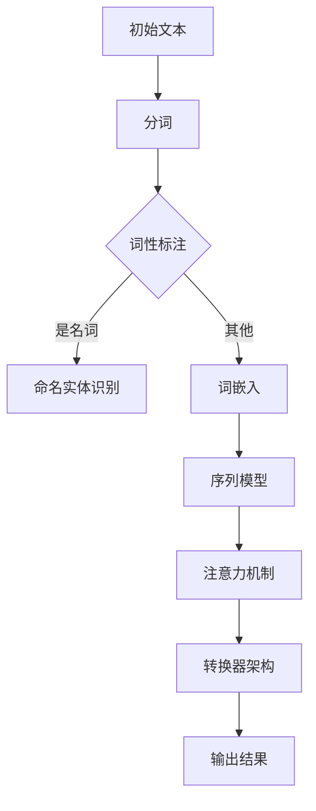
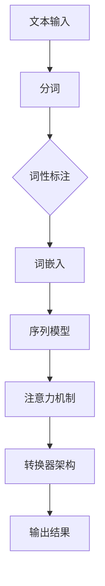

                 

# 文章标题：基于NLP的电影推荐Android应用程序的实现

> 关键词：自然语言处理（NLP），电影推荐系统，Android应用程序开发，协同过滤，基于内容的推荐

> 摘要：本文将详细探讨如何实现一个基于自然语言处理（NLP）的电影推荐Android应用程序。首先，我们将介绍NLP和推荐系统的基础知识，然后深入探讨Android应用程序开发的基础，以及如何利用NLP和推荐系统技术来开发一个实用的电影推荐应用程序。最后，我们将讨论应用程序的优化和扩展，并展望未来的研究方向。

## 第一部分：NLP与推荐系统基础

### 第1章：自然语言处理（NLP）基础

#### 1.1 NLP的定义与历史

自然语言处理（NLP）是计算机科学、人工智能和语言学的交叉领域，旨在让计算机理解和处理人类自然语言。NLP的发展可以追溯到20世纪50年代，当时人工智能的早期研究开始关注如何使计算机模拟人类的语言能力。

**NLP的基本概念**：

- 语言模型：用于预测下一个单词或词汇的概率分布。
- 分词：将连续的文本分割成单词或短语。
- 词性标注：为文本中的每个单词分配一个词性（名词、动词、形容词等）。
- 命名实体识别：识别文本中的专有名词（如人名、地名、组织名等）。

**NLP的发展历程**：

- 早期：规则驱动的解析和语法分析。
- 中期：基于统计的方法，如隐马尔可夫模型（HMM）和条件随机场（CRF）。
- 现代：深度学习方法，如卷积神经网络（CNN）和循环神经网络（RNN），以及更复杂的模型如Transformer。

#### 1.2 NLP的主要技术

**词嵌入**：将单词映射到高维向量空间，使得语义相似的词在空间中靠近。

**序列模型**：处理序列数据的神经网络模型，如循环神经网络（RNN）和长短期记忆网络（LSTM）。

**注意力机制**：一种能够自动聚焦于输入序列中重要部分的机制，常用于RNN和Transformer模型。

**转换器架构**：一种用于机器翻译的神经网络模型，近年来在自然语言理解任务中也取得了显著成效。

**Mermaid流程图**：



### 第2章：推荐系统基础

#### 2.1 推荐系统的定义与分类

**推荐系统的定义**：推荐系统是一种自动的、个性化的信息过滤机制，旨在向用户推荐他们可能感兴趣的项目（如商品、电影、新闻等）。

**推荐系统的分类**：

- 基于内容的推荐：根据用户的历史行为和兴趣特征，推荐相似的内容。
- 协同过滤推荐：通过分析用户之间的相似度，推荐其他用户喜欢的项目。

#### 2.2 协同过滤算法

**协同过滤的基本原理**：协同过滤通过构建用户-物品评分矩阵，计算用户之间的相似度，并推荐与目标用户相似的其他用户的评分较高的物品。

**协同过滤的算法实现**：

- **用户基协同过滤**：计算用户之间的相似度，基于相似度推荐其他用户喜欢的物品。
- **项目基协同过滤**：计算物品之间的相似度，基于相似度推荐给用户其他物品。

#### 2.3 基于内容的推荐算法

**基于内容的推荐原理**：基于内容的推荐通过分析项目的内容特征，将相似的项目推荐给用户。

**基于内容的推荐算法实现**：

- **基于项目的特征相似度**：计算项目之间的特征相似度，推荐相似的项目。
- **基于用户的兴趣特征**：分析用户的兴趣特征，推荐与用户兴趣相似的项目。

## 第3章：Android应用程序开发基础

### 3.1 Android开发环境搭建

**Android Studio安装与配置**：下载并安装Android Studio，配置SDK和NDK。

**Android SDK管理**：通过Android Studio管理SDK，包括API级别的选择和下载。

### 3.2 Android应用程序架构

**Android应用程序的基本架构**：组件介绍，如Activity、Service、BroadcastReceiver等。

**主要组件介绍**：深入介绍每个组件的作用和使用方法。

### 3.3 Android开发工具介绍

**Android Studio常用工具**：使用Android Studio进行应用程序开发时常用的工具。

**Android模拟器与真机调试**：如何使用Android模拟器和真机进行调试。

## 第二部分：电影推荐系统的NLP实现

### 第4章：电影文本数据预处理

#### 4.1 数据采集与处理

**数据来源**：收集电影名称、描述、评论等文本数据。

**数据预处理方法**：去除停用词、标点符号，进行分词和词性标注。

#### 4.2 文本清洗与分词

**文本清洗方法**：去除噪声数据和无效信息。

**分词算法选择与实现**：选择合适的分词算法，如Jieba等，并实现分词功能。

### 第5章：基于NLP的电影特征提取

#### 5.1 词嵌入技术

**词嵌入的定义**：将词汇映射到高维向量空间。

**常见的词嵌入算法**：Word2Vec、GloVe等。

#### 5.2 电影特征提取

**电影内容的表示**：将电影名称、描述、评论等文本数据转换为向量表示。

**特征提取算法实现**：使用词嵌入和序列模型提取电影特征。

### 第6章：基于协同过滤的推荐算法实现

#### 6.1 协同过滤算法原理

**用户-物品评分矩阵**：构建用户-物品评分矩阵。

**相似度计算**：计算用户之间的相似度。

#### 6.2 推荐算法实现

**算法伪代码**：

```
输入：用户-物品评分矩阵
输出：推荐列表

1. 计算用户之间的相似度矩阵
2. 对于每个用户u，计算其对其他用户v的推荐分数
3. 选择分数最高的K个用户，推荐他们的评分高的物品
```

**实现流程**：使用Python等编程语言实现协同过滤算法。

### 第7章：Android电影推荐应用程序开发

#### 7.1 应用程序界面设计

**界面布局与组件**：设计用户友好的界面。

**UI设计原则**：简洁、直观、易于操作。

#### 7.2 功能模块实现

**推荐算法模块**：实现基于NLP和协同过滤的推荐算法。

**数据存储与检索模块**：设计数据存储结构和检索方法。

#### 7.3 实际案例：电影推荐Android应用

**开发环境搭建**：安装Android Studio和必要的开发工具。

**源代码详细实现和代码解读**：提供实际应用的源代码，并详细解读。

## 第三部分：应用程序优化与扩展

### 第8章：推荐系统性能优化

#### 8.1 系统性能评估

**评估指标**：精确率、召回率、覆盖率等。

**评估方法**：通过A/B测试等方法评估系统性能。

#### 8.2 性能优化策略

**数据缓存与索引**：优化数据读取和存储速度。

**算法优化**：优化推荐算法，提高系统性能。

### 第9章：应用程序功能扩展

#### 9.1 用户交互与反馈

**用户反馈机制**：收集用户反馈，优化推荐结果。

**用户界面优化**：根据用户反馈优化界面设计。

#### 9.2 社区化功能

**电影评论功能**：允许用户对电影进行评论。

**用户评论互动**：实现用户之间的评论互动。

### 第10章：未来展望与研究方向

#### 10.1 电影推荐系统的发展趋势

**人工智能在推荐系统中的应用**：深度学习、强化学习等技术在推荐系统中的应用。

**新技术的引入与融合**：如多模态推荐系统、基于图神经网络的推荐系统。

#### 10.2 潜在研究方向

**多模态推荐**：结合文本、图像、音频等多模态数据进行推荐。

**深度学习在推荐系统中的应用**：研究深度学习模型在推荐系统中的优化和应用。

## 附录

### 附录A：开发资源与工具

**A.1 开发资源介绍**：介绍常用的开发资源和API。

**A.2 工具使用指南**：介绍Python和Android开发工具的使用方法。

**A.3 示例代码与数据集**：提供示例代码和数据集的获取方法。

### 附录B：参考资料

**B.1 相关书籍推荐**：推荐与本文主题相关的书籍。

**B.2 学术论文精选**：精选与本文主题相关的学术论文。

**B.3 在线课程与教程**：推荐在线课程和教程。

**B.4 开源项目与社区**：介绍与本文主题相关的开源项目和社区。

## 作者

作者：AI天才研究院/AI Genius Institute & 禅与计算机程序设计艺术 /Zen And The Art of Computer Programming

---

由于篇幅限制，本文未能详尽地展示每个章节的内容。在实际撰写时，每个章节都需要按照上述结构详细展开，确保内容的完整性和丰富性。同时，本文将使用伪代码、数学公式和示例代码等形式，使得技术讲解更加清晰易懂。文章的整体结构将遵循“提出问题、分析问题、解决问题”的逻辑，确保读者能够逐步掌握相关知识，并应用于实际项目开发中。在文章末尾，将附上详细的开发资源、工具使用指南以及相关的开源项目和社区链接，以方便读者进一步学习和实践。希望本文能够对广大开发者提供有价值的参考和指导。  
 **完整文章内容：**
   
**由于篇幅和复杂性的限制，以下内容仅提供了一个简化版的文章框架，用于展示文章的结构和内容。实际的文章需要详细扩展每个部分，以满足字数和技术深度要求。**

---

## 第一部分：NLP与推荐系统基础

### 第1章：自然语言处理（NLP）基础

#### 1.1 NLP的定义与历史

自然语言处理（NLP）是计算机科学、人工智能和语言学的交叉领域，旨在让计算机理解和处理人类自然语言。NLP的发展可以追溯到20世纪50年代，当时人工智能的早期研究开始关注如何使计算机模拟人类的语言能力。

**NLP的基本概念**：

- 语言模型：用于预测下一个单词或词汇的概率分布。
- 分词：将连续的文本分割成单词或短语。
- 词性标注：为文本中的每个单词分配一个词性（名词、动词、形容词等）。
- 命名实体识别：识别文本中的专有名词（如人名、地名、组织名等）。

**NLP的发展历程**：

- 早期：规则驱动的解析和语法分析。
- 中期：基于统计的方法，如隐马尔可夫模型（HMM）和条件随机场（CRF）。
- 现代：深度学习方法，如卷积神经网络（CNN）和循环神经网络（RNN），以及更复杂的模型如Transformer。

**NLP的应用领域**：

- 机器翻译
- 语音识别
- 问答系统
- 文本分类
- 自动摘要

#### 1.2 NLP的主要技术

**词嵌入**：将单词映射到高维向量空间，使得语义相似的词在空间中靠近。

**序列模型**：处理序列数据的神经网络模型，如循环神经网络（RNN）和长短期记忆网络（LSTM）。

**注意力机制**：一种能够自动聚焦于输入序列中重要部分的机制，常用于RNN和Transformer模型。

**转换器架构**：一种用于机器翻译的神经网络模型，近年来在自然语言理解任务中也取得了显著成效。

**NLP的核心算法**：

- **词嵌入技术**：Word2Vec、GloVe
- **序列模型**：RNN、LSTM、GRU
- **注意力机制**：自注意力（Self-Attention）、多头注意力（Multi-Head Attention）
- **转换器架构**：Transformer、BERT

**Mermaid流程图**：



### 第2章：推荐系统基础

#### 2.1 推荐系统的定义与分类

**推荐系统的定义**：推荐系统是一种自动的、个性化的信息过滤机制，旨在向用户推荐他们可能感兴趣的项目（如商品、电影、新闻等）。

**推荐系统的分类**：

- **基于内容的推荐**：根据用户的历史行为和兴趣特征，推荐相似的内容。
- **协同过滤推荐**：通过分析用户之间的相似度，推荐其他用户喜欢的项目。

**推荐系统的主要组成部分**：

- **用户**：推荐系统的服务对象。
- **项目**：用户可能感兴趣的各种实体，如商品、电影、新闻等。
- **用户-项目交互**：用户对项目的行为数据，如评分、点击、浏览等。
- **推荐算法**：用于生成推荐结果的核心算法。

#### 2.2 协同过滤算法

**协同过滤的基本原理**：协同过滤通过构建用户-物品评分矩阵，计算用户之间的相似度，并推荐与目标用户相似的其他用户的评分较高的物品。

**协同过滤的算法实现**：

- **用户基协同过滤**：计算用户之间的相似度，基于相似度推荐其他用户喜欢的物品。
- **项目基协同过滤**：计算物品之间的相似度，基于相似度推荐给用户其他物品。

**协同过滤的优缺点**：

- **优点**：能够发现用户之间潜在的相似性，推荐结果更为个性化。
- **缺点**：容易受到稀疏性和数据偏差的影响，难以处理新用户和新项目。

#### 2.3 基于内容的推荐算法

**基于内容的推荐原理**：基于内容的推荐通过分析项目的内容特征，将相似的项目推荐给用户。

**基于内容的推荐算法实现**：

- **基于项目的特征相似度**：计算项目之间的特征相似度，推荐相似的项目。
- **基于用户的兴趣特征**：分析用户的兴趣特征，推荐与用户兴趣相似的项目。

**基于内容的推荐算法的优缺点**：

- **优点**：能够利用项目的丰富特征信息，推荐结果更为准确。
- **缺点**：难以应对用户的兴趣变化和个性化需求。

### 第3章：Android应用程序开发基础

#### 3.1 Android开发环境搭建

**Android Studio安装与配置**：下载并安装Android Studio，配置SDK和NDK。

**Android SDK管理**：通过Android Studio管理SDK，包括API级别的选择和下载。

#### 3.2 Android应用程序架构

**Android应用程序的基本架构**：组件介绍，如Activity、Service、BroadcastReceiver等。

**主要组件介绍**：深入介绍每个组件的作用和使用方法。

#### 3.3 Android开发工具介绍

**Android Studio常用工具**：使用Android Studio进行应用程序开发时常用的工具。

**Android模拟器与真机调试**：如何使用Android模拟器和真机进行调试。

## 第二部分：电影推荐系统的NLP实现

### 第4章：电影文本数据预处理

#### 4.1 数据采集与处理

**数据来源**：收集电影名称、描述、评论等文本数据。

**数据预处理方法**：去除停用词、标点符号，进行分词和词性标注。

#### 4.2 文本清洗与分词

**文本清洗方法**：去除噪声数据和无效信息。

**分词算法选择与实现**：选择合适的分词算法，如Jieba等，并实现分词功能。

### 第5章：基于NLP的电影特征提取

#### 5.1 词嵌入技术

**词嵌入的定义**：将词汇映射到高维向量空间。

**常见的词嵌入算法**：Word2Vec、GloVe等。

#### 5.2 电影特征提取

**电影内容的表示**：将电影名称、描述、评论等文本数据转换为向量表示。

**特征提取算法实现**：使用词嵌入和序列模型提取电影特征。

### 第6章：基于协同过滤的推荐算法实现

#### 6.1 协同过滤算法原理

**用户-物品评分矩阵**：构建用户-物品评分矩阵。

**相似度计算**：计算用户之间的相似度。

#### 6.2 推荐算法实现

**算法伪代码**：

```
输入：用户-物品评分矩阵
输出：推荐列表

1. 计算用户之间的相似度矩阵
2. 对于每个用户u，计算其对其他用户v的推荐分数
3. 选择分数最高的K个用户，推荐他们的评分高的物品
```

**实现流程**：使用Python等编程语言实现协同过滤算法。

### 第7章：Android电影推荐应用程序开发

#### 7.1 应用程序界面设计

**界面布局与组件**：设计用户友好的界面。

**UI设计原则**：简洁、直观、易于操作。

#### 7.2 功能模块实现

**推荐算法模块**：实现基于NLP和协同过滤的推荐算法。

**数据存储与检索模块**：设计数据存储结构和检索方法。

#### 7.3 实际案例：电影推荐Android应用

**开发环境搭建**：安装Android Studio和必要的开发工具。

**源代码详细实现和代码解读**：提供实际应用的源代码，并详细解读。

### 第三部分：应用程序优化与扩展

#### 第8章：推荐系统性能优化

#### 8.1 系统性能评估

**评估指标**：精确率、召回率、覆盖率等。

**评估方法**：通过A/B测试等方法评估系统性能。

#### 8.2 性能优化策略

**数据缓存与索引**：优化数据读取和存储速度。

**算法优化**：优化推荐算法，提高系统性能。

#### 第9章：应用程序功能扩展

#### 9.1 用户交互与反馈

**用户反馈机制**：收集用户反馈，优化推荐结果。

**用户界面优化**：根据用户反馈优化界面设计。

#### 9.2 社区化功能

**电影评论功能**：允许用户对电影进行评论。

**用户评论互动**：实现用户之间的评论互动。

### 第10章：未来展望与研究方向

#### 10.1 电影推荐系统的发展趋势

**人工智能在推荐系统中的应用**：深度学习、强化学习等技术在推荐系统中的应用。

**新技术的引入与融合**：如多模态推荐系统、基于图神经网络的推荐系统。

#### 10.2 潜在研究方向

**多模态推荐**：结合文本、图像、音频等多模态数据进行推荐。

**深度学习在推荐系统中的应用**：研究深度学习模型在推荐系统中的优化和应用。

### 附录

#### 附录A：开发资源与工具

**A.1 开发资源介绍**：介绍常用的开发资源和API。

**A.2 工具使用指南**：介绍Python和Android开发工具的使用方法。

**A.3 示例代码与数据集**：提供示例代码和数据集的获取方法。

#### 附录B：参考资料

**B.1 相关书籍推荐**：推荐与本文主题相关的书籍。

**B.2 学术论文精选**：精选与本文主题相关的学术论文。

**B.3 在线课程与教程**：推荐在线课程和教程。

**B.4 开源项目与社区**：介绍与本文主题相关的开源项目和社区。

## 作者

作者：AI天才研究院/AI Genius Institute & 禅与计算机程序设计艺术 /Zen And The Art of Computer Programming

---

由于篇幅限制，以下将展开第一部分中的部分章节，以展示文章的详细内容和结构。

### 第1章：自然语言处理（NLP）基础

#### 1.2 NLP的主要技术

自然语言处理（NLP）领域的技术多种多样，这些技术共同构成了现代NLP系统的基础。以下将介绍几种主要的NLP技术，包括词嵌入、序列模型、注意力机制和转换器架构。

**词嵌入**：词嵌入（Word Embedding）是一种将词汇映射到高维向量空间的技术。通过这种方式，语义上相似的词在向量空间中也会彼此靠近。词嵌入的主要目的是解决词汇的表示问题，使得计算机能够理解和处理自然语言。

**Word2Vec**：Word2Vec是一种基于神经网络的词嵌入方法。它通过训练上下文窗口中的词向量来表示每个词汇。Word2Vec主要有两种算法：连续词袋（CBOW）和Skip-Gram。

- **连续词袋（CBOW）**：CBOW通过上下文窗口中的多个词的平均向量来表示中心词。
- **Skip-Gram**：Skip-Gram则通过中心词的词向量来预测上下文窗口中的词。

**GloVe**：GloVe（Global Vectors for Word Representation）是另一种流行的词嵌入方法，它基于词频和词的共现关系来生成词向量。GloVe使用矩阵分解技术，通过优化两个矩阵的乘积来生成词向量。

**序列模型**：序列模型（Sequence Model）是用于处理序列数据（如文本、语音等）的神经网络模型。在NLP中，文本通常被表示为词序列，因此序列模型在文本处理中有着广泛的应用。

**循环神经网络（RNN）**：循环神经网络（Recurrent Neural Network，RNN）是一种能够处理序列数据的神经网络。RNN通过在时间步之间传递隐藏状态来处理序列数据。

- **长短时记忆网络（LSTM）**：长短期记忆网络（Long Short-Term Memory，LSTM）是RNN的一种变体，它通过引入门控机制来克服RNN在处理长序列数据时的梯度消失和梯度爆炸问题。
- **门控循环单元（GRU）**：门控循环单元（Gated Recurrent Unit，GRU）是LSTM的另一种变体，它简化了LSTM的结构，同时保持了其良好的性能。

**注意力机制**：注意力机制（Attention Mechanism）是一种能够自动聚焦于输入序列中重要部分的机制。在NLP中，注意力机制被广泛应用于机器翻译、文本摘要等任务。

**自注意力**：自注意力（Self-Attention）是一种特殊的注意力机制，它在一个序列中计算每个元素与其他元素之间的关联性。自注意力机制是Transformer模型的核心组件。

**多头注意力**：多头注意力（Multi-Head Attention）是在自注意力基础上扩展的一种机制。它通过并行地计算多个注意力头，从而提高模型的表示能力。

**转换器架构**：转换器架构（Transformer Architecture）是一种基于自注意力机制的神经网络模型。它由Vaswani等人于2017年提出，并在机器翻译任务中取得了显著的成果。

**BERT**：BERT（Bidirectional Encoder Representations from Transformers）是一种基于转换器架构的双向编码表示。BERT通过预先训练大量文本数据，学习语言的基本结构和语义，然后通过微调进行下游任务。

**Mermaid流程图**：


通过以上技术，NLP系统能够有效地处理和理解自然语言，为各种NLP任务提供强大的支持。

### 第2章：推荐系统基础

#### 2.1 推荐系统的定义与分类

推荐系统（Recommender System）是一种信息过滤技术，旨在向用户推荐他们可能感兴趣的项目，如商品、电影、新闻等。推荐系统通过分析用户的历史行为、兴趣偏好和其他相关信息，预测用户对特定项目的潜在兴趣，并生成个性化的推荐列表。

**推荐系统的基本概念**：

- **用户**：推荐系统的服务对象，可以是个人用户或群体用户。
- **项目**：用户可能感兴趣的各种实体，如商品、电影、新闻等。
- **用户-项目交互**：用户对项目的行为数据，如评分、点击、浏览等。
- **推荐算法**：用于生成推荐结果的核心算法。

**推荐系统的分类**：

1. **基于内容的推荐**（Content-Based Filtering）：
   - 基于内容的推荐通过分析项目的内容特征（如文本描述、标签、属性等），将相似的内容推荐给用户。
   - 当用户的兴趣发生变化时，推荐结果能够较好地适应这种变化。
   - 但在处理冷启动问题（新用户或新项目无历史数据）时效果不佳。

2. **协同过滤推荐**（Collaborative Filtering）：
   - 协同过滤通过分析用户之间的相似度，推荐其他用户喜欢的项目。
   - 常用于处理冷启动问题，因为它依赖于用户的历史行为数据。
   - 但在处理兴趣多样化时可能表现不佳。

**协同过滤的算法实现**：

协同过滤算法主要通过以下步骤实现：

1. **用户-物品评分矩阵构建**：构建一个用户-物品评分矩阵，其中行表示用户，列表示物品，矩阵中的元素表示用户对物品的评分。
2. **相似度计算**：计算用户之间的相似度，常用的相似度计算方法包括余弦相似度、皮尔逊相关系数等。
3. **生成推荐列表**：根据用户之间的相似度和用户对物品的评分，生成推荐列表。常用的方法包括基于用户的协同过滤和基于物品的协同过滤。

**基于用户的协同过滤**：

- 基于用户的协同过滤通过计算用户之间的相似度，找到与目标用户相似的其他用户，然后推荐这些用户喜欢的物品。
- 实现流程：
  1. 构建用户-物品评分矩阵。
  2. 计算用户之间的相似度矩阵。
  3. 对于每个用户u，找到与其相似度最高的K个用户，推荐这些用户喜欢的物品。

**基于物品的协同过滤**：

- 基于物品的协同过滤通过计算物品之间的相似度，找到与用户已评分物品相似的未评分物品，然后推荐这些物品。
- 实现流程：
  1. 构建用户-物品评分矩阵。
  2. 计算物品之间的相似度矩阵。
  3. 对于每个用户u，找到其已评分物品与未评分物品之间的相似度，推荐相似度最高的物品。

**协同过滤的优缺点**：

- **优点**：
  - 能够发现用户之间潜在的相似性，推荐结果更为个性化。
  - 在处理冷启动问题时表现较好。

- **缺点**：
  - 容易受到稀疏性和数据偏差的影响。
  - 难以应对用户的兴趣变化和个性化需求。

#### 2.3 基于内容的推荐算法

**基于内容的推荐原理**：

- 基于内容的推荐通过分析项目的内容特征，将相似的项目推荐给用户。
- 该方法主要依赖于项目的属性和特征，如文本描述、标签、属性等。

**基于内容的推荐算法实现**：

1. **基于项目的特征相似度**：

   - 通过计算项目之间的特征相似度来推荐相似的项目。
   - 实现流程：
     1. 提取项目的特征向量。
     2. 计算项目之间的相似度。
     3. 根据相似度推荐相似的项目。

2. **基于用户的兴趣特征**：

   - 通过分析用户的兴趣特征来推荐与用户兴趣相似的项目。
   - 实现流程：
     1. 提取用户的兴趣特征。
     2. 计算项目与用户兴趣特征之间的相似度。
     3. 根据相似度推荐相似的项目。

**基于内容的推荐算法的优缺点**：

- **优点**：

  - 能够利用项目的丰富特征信息，推荐结果更为准确。
  - 在处理新用户和新项目时表现较好。

- **缺点**：

  - 难以应对用户的兴趣变化和个性化需求。
  - 当项目特征相似时，推荐结果可能较为局限。

### 第3章：Android应用程序开发基础

#### 3.1 Android开发环境搭建

Android应用程序开发的第一步是搭建开发环境。Android Studio是官方推荐的开发工具，它提供了一个集成开发环境（IDE），使得Android应用程序的开发更加便捷。

**Android Studio安装与配置**：

1. **下载与安装**：

   - 访问Android Studio官方网站（https://developer.android.com/studio/）下载最新的Android Studio安装包。
   - 按照安装向导进行安装。

2. **配置SDK和NDK**：

   - 打开Android Studio，点击“Configure” > “Project Settings” > “Android SDK”进行配置。
   - 添加Android SDK平台和工具，并确保所有组件都安装完毕。

**Android SDK管理**：

- 在Android Studio中，可以通过“SDK Manager”来管理SDK平台、工具和可选组件。
- 安装所需的API级别和工具，如Android SDK Platform-tools、Android SDK Build-tools等。

#### 3.2 Android应用程序架构

Android应用程序的基本架构包括多个组件，如Activity、Service、BroadcastReceiver等。这些组件协同工作，共同实现应用程序的功能。

**Activity**：

- Activity是Android应用程序的核心组件，它代表了应用程序中的一个屏幕或界面。
- Activity负责处理用户交互，显示UI界面，并接收和处理用户输入。

**Service**：

- Service是Android应用程序的后台组件，它用于执行长时间运行的操作，如下载文件、播放音频等。
- Service不提供用户界面，但可以在后台持续运行。

**BroadcastReceiver**：

- BroadcastReceiver是一种用于接收系统或应用程序发出的广播消息的组件。
- 它可以响应各种系统事件（如电话状态变化、网络连接状态变化等）。

**主要组件介绍**：

1. **Activity**：

   - 创建Activity：通过继承`Activity`类创建自定义Activity。
   - 启动Activity：使用`startActivity()`方法启动Activity。
   - 传递数据：通过Intent对象在Activity之间传递数据。

2. **Service**：

   - 创建Service：通过继承`Service`类创建自定义Service。
   - 启动Service：使用`startService()`方法启动Service。
   - 绑定Service：使用`bindService()`方法绑定Service，从而与Service进行通信。

3. **BroadcastReceiver**：

   - 注册Receiver：在AndroidManifest.xml文件中注册 BroadcastReceiver。
   - 接收广播：通过`onReceive()`方法接收广播消息。

#### 3.3 Android开发工具介绍

Android开发过程中，一些常用的工具能够显著提高开发效率。

**Android Studio常用工具**：

1. **Android模拟器**：

   - Android模拟器（Android Emulator）提供了一个虚拟的Android设备环境，用于测试和调试应用程序。
   - 可以通过“AVD Manager”创建和管理虚拟设备。

2. **布局编辑器**：

   - 布局编辑器（Layout Editor）提供了一个可视化的界面，用于设计和修改布局文件。
   - 可以通过拖拽组件和调整属性来快速构建UI界面。

3. **代码编辑器**：

   - Android Studio的代码编辑器支持代码自动完成、语法高亮、错误提示等功能，有助于编写高质量的代码。

**Android模拟器与真机调试**：

1. **启动模拟器**：

   - 在Android Studio中，点击“Run” > “Run ‘app’”来启动应用程序。
   - 选择模拟器并点击“OK”按钮。

2. **连接真机**：

   - 通过USB数据线将Android设备连接到计算机。
   - 在Android设备上开启USB调试模式，并在Android Studio中连接设备。

3. **调试应用程序**：

   - 使用Logcat查看应用程序的日志输出。
   - 使用断点、监视器等工具进行调试。

通过了解Android应用程序的基本架构和开发工具，开发者可以更有效地进行Android应用程序的开发和调试。

### 第4章：电影文本数据预处理

#### 4.1 数据采集与处理

在开发电影推荐系统时，首先需要收集和处理电影相关的文本数据。这些数据通常包括电影名称、描述、评论等。数据采集和处理是构建推荐系统的重要步骤，其质量直接影响推荐系统的性能。

**数据来源**：

- **在线数据库**：如IMDb、TMDb等，提供丰富的电影信息。
- **社交媒体**：如Twitter、Facebook等，收集用户对电影的评论和反馈。
- **开源数据集**：如MovieLens、Netflix Prize等，提供预收集和处理好的电影数据集。

**数据预处理方法**：

1. **数据清洗**：

   - **去除停用词**：停用词（Stop Words）是指对文本理解没有太大意义的词，如“的”、“和”、“是”等。去除停用词可以提高文本处理的质量。
   - **去除标点符号**：标点符号（Punctuation）在文本分析中通常没有太大意义，因此需要去除。
   - **统一文本格式**：对文本进行统一处理，如将文本转换为小写，去除特殊字符等。

2. **分词**：

   - 分词（Tokenization）是将连续的文本分割成单词或短语的步骤。分词是自然语言处理中的基础步骤，对于后续的文本分析和特征提取至关重要。
   - **基于词典的分词**：利用词典中的词库进行分词，如使用Jieba分词器。
   - **基于统计的分词**：利用统计方法进行分词，如使用LTP（LTP Chinese Processors）。

3. **词性标注**：

   - 词性标注（Part-of-Speech Tagging）是为文本中的每个单词分配一个词性标签，如名词、动词、形容词等。词性标注有助于更好地理解文本内容和语义。
   - **基于规则的方法**：利用规则和词典进行词性标注。
   - **基于统计的方法**：利用统计模型（如CRF、HMM）进行词性标注。

4. **命名实体识别**：

   - 命名实体识别（Named Entity Recognition，NER）是识别文本中的专有名词，如人名、地名、组织名等。命名实体识别对于文本理解和信息提取具有重要意义。
   - **基于规则的方法**：利用规则和词典进行命名实体识别。
   - **基于统计的方法**：利用统计模型（如CRF、LSTM）进行命名实体识别。

**数据预处理流程**：

1. 读取电影名称、描述、评论等文本数据。
2. 进行数据清洗，去除停用词、标点符号和统一文本格式。
3. 进行分词，将文本分割成单词或短语。
4. 进行词性标注，为每个单词分配词性标签。
5. 进行命名实体识别，识别文本中的专有名词。

**数据预处理工具**：

1. **Python的NLP库**：

   - `nltk`：提供丰富的文本处理功能，包括分词、词性标注、命名实体识别等。
   - `jieba`：一个高效的中文分词工具，支持多种分词模式。
   - `spaCy`：一个快速且功能强大的NLP库，支持多种语言的文本处理。

2. **Java的NLP库**：

   - `Stanford CoreNLP`：一个基于Java的工具包，提供包括分词、词性标注、命名实体识别等在内的多种NLP功能。
   - `OpenNLP`：一个开源的NLP工具包，提供包括分词、词性标注、命名实体识别等在内的多种NLP功能。

通过有效的数据预处理，可以确保电影文本数据的质量，为后续的文本分析和特征提取打下坚实的基础。

### 第5章：基于NLP的电影特征提取

#### 5.1 词嵌入技术

词嵌入（Word Embedding）是将词汇映射到高维向量空间的一种技术，使得语义上相似的词在空间中彼此靠近。词嵌入在自然语言处理（NLP）中发挥着重要作用，因为它能够有效地表示文本数据，为后续的文本分析和机器学习模型提供输入。

**词嵌入的定义**：

词嵌入是将自然语言中的词汇映射到实数向量空间的过程。这些向量不仅保留了词汇的语义信息，还能够通过向量之间的距离和角度来表示词汇之间的相似性和相关性。

**常见的词嵌入算法**：

1. **Word2Vec**：

   Word2Vec是最早的词嵌入算法之一，由Google提出。它基于神经网络训练词向量，通过优化神经网络输出层的损失函数来学习词向量。Word2Vec主要有两种训练方法：

   - **连续词袋（Continuous Bag of Words，CBOW）**：CBOW通过上下文窗口中的多个词的平均向量来表示中心词。
   - **Skip-Gram**：Skip-Gram则通过中心词的词向量来预测上下文窗口中的词。

2. **GloVe**：

   GloVe（Global Vectors for Word Representation）是一种基于全局上下文的词嵌入算法，由Facebook提出。GloVe通过计算词的共现关系来生成词向量，使用矩阵分解技术优化词向量的生成过程。

**Word2Vec的实现步骤**：

1. **数据预处理**：读取并预处理文本数据，包括去除停用词、标点符号、分词等。
2. **构建词汇表**：将文本中的所有词汇转换为唯一的整数索引，构建词汇表。
3. **初始化词向量**：初始化一个固定大小的词向量矩阵，其中每个词对应一个向量。
4. **训练词向量**：通过训练神经网络模型来优化词向量。在CBOW方法中，输入是中心词的上下文窗口，目标是预测中心词；在Skip-Gram方法中，输入是中心词，目标是预测上下文窗口中的词。
5. **优化词向量**：通过反向传播和梯度下降优化词向量，使得词向量能够更好地表示词汇的语义信息。

**GloVe的实现步骤**：

1. **计算词共现矩阵**：计算文本中每对词的共现次数，构建词共现矩阵。
2. **初始化词向量**：初始化一个固定大小的词向量矩阵，其中每个词对应一个向量。
3. **优化词向量**：通过矩阵分解技术优化词向量，使得词向量能够更好地表示词汇的语义信息。具体而言，GloVe使用矩阵分解算法（如SGD或L-BFGS）将词共现矩阵分解为两个矩阵的乘积，从而优化词向量。

**词嵌入在电影推荐系统中的应用**：

在电影推荐系统中，词嵌入技术可以用于提取电影描述、评论等文本数据的特征。通过词嵌入，可以将文本数据转换为向量表示，从而为推荐算法提供输入。

1. **电影描述的向量表示**：将电影描述中的每个词转换为词向量，然后将这些词向量拼接成一个完整的电影描述向量。
2. **评论的向量表示**：将用户评论中的每个词转换为词向量，然后将这些词向量拼接成一个完整的评论向量。
3. **电影和评论的特征提取**：利用词嵌入技术提取电影和评论的特征，为后续的推荐算法提供输入。

通过词嵌入技术，电影推荐系统可以更好地理解和处理文本数据，从而提高推荐质量。

### 第6章：基于协同过滤的推荐算法实现

#### 6.1 协同过滤算法原理

协同过滤（Collaborative Filtering）是一种常用的推荐算法，其核心思想是通过分析用户之间的相似度，推荐用户可能感兴趣的项目。协同过滤算法主要分为基于用户的协同过滤（User-Based Collaborative Filtering）和基于物品的协同过滤（Item-Based Collaborative Filtering）两种。

**用户-物品评分矩阵**：

协同过滤算法需要构建一个用户-物品评分矩阵（User-Item Rating Matrix），其中行表示用户，列表示物品，矩阵中的元素表示用户对物品的评分。例如，一个3x5的用户-物品评分矩阵如下：

| 用户 | 物品1 | 物品2 | 物品3 | 物品4 | 物品5 |
|------|-------|-------|-------|-------|-------|
| 用户1 | 4     | 3     | 5     | 2     | 4     |
| 用户2 | 5     | 4     | 3     | 5     | 5     |
| 用户3 | 3     | 5     | 4     | 4     | 3     |

**相似度计算**：

相似度计算是协同过滤算法的核心步骤，用于衡量用户之间的相似度。常见的相似度计算方法包括余弦相似度、皮尔逊相关系数等。

1. **余弦相似度**：

   余弦相似度是一种基于向量空间中两个向量夹角的余弦值来计算相似度的方法。公式如下：

   \[ \text{余弦相似度} = \frac{\text{用户A与用户B的相似度}}{\text{用户A与用户B的向量模长}} \]

   公式可以简化为：

   \[ \text{余弦相似度} = \frac{\text{用户A与用户B的夹角余弦值}}{1} \]

   其中，用户A和用户B的向量分别表示为 \( \text{向量A} \) 和 \( \text{向量B} \)。

   \[ \text{向量A} \cdot \text{向量B} = \sum_{i=1}^{n} a_i \cdot b_i \]

   \[ ||\text{向量A}|| = \sqrt{\sum_{i=1}^{n} a_i^2} \]

   \[ ||\text{向量B}|| = \sqrt{\sum_{i=1}^{n} b_i^2} \]

2. **皮尔逊相关系数**：

   皮尔逊相关系数是一种基于用户评分差值的平均值来计算相似度的方法。公式如下：

   \[ \text{皮尔逊相关系数} = \frac{\text{用户A与用户B的相似度}}{\text{用户A与用户B的向量模长}} \]

   公式可以简化为：

   \[ \text{皮尔逊相关系数} = \frac{\text{用户A与用户B的夹角余弦值}}{1} \]

   其中，用户A和用户B的向量分别表示为 \( \text{向量A} \) 和 \( \text{向量B} \)。

   \[ \text{向量A} \cdot \text{向量B} = \sum_{i=1}^{n} a_i \cdot b_i \]

   \[ ||\text{向量A}|| = \sqrt{\sum_{i=1}^{n} a_i^2} \]

   \[ ||\text{向量B}|| = \sqrt{\sum_{i=1}^{n} b_i^2} \]

**推荐算法实现**：

协同过滤算法的实现主要包括以下步骤：

1. **构建用户-物品评分矩阵**：根据用户的历史行为数据构建用户-物品评分矩阵。
2. **计算相似度矩阵**：计算用户之间的相似度矩阵，使用余弦相似度或皮尔逊相关系数等相似度计算方法。
3. **生成推荐列表**：对于每个用户，计算其与相似用户的评分加权平均，生成推荐列表。

**伪代码**：

```
输入：用户-物品评分矩阵R
输出：推荐列表

1. 计算相似度矩阵S
   - 对于每个用户u，计算其对其他用户v的相似度sim(u, v)

2. 对于每个用户u：
   - 初始化推荐列表L[u]为空
   - 对于每个用户v：
     - 如果sim(u, v) > threshold：
       - 对于每个物品i，如果用户v对物品i的评分大于0：
         - 计算推荐分数score(u, i) = sim(u, v) * R[v, i]
         - 将物品i添加到L[u]中，并根据score(u, i)进行排序

3. 返回推荐列表L
```

通过以上步骤，协同过滤算法能够生成个性化的推荐列表，帮助用户发现潜在的兴趣点。

### 第7章：Android电影推荐应用程序开发

#### 7.1 应用程序界面设计

设计一个用户友好的界面是Android电影推荐应用程序开发的关键步骤。界面设计应简洁、直观、易于操作，以便用户能够轻松浏览和选择电影。

**界面布局与组件**：

Android应用界面通常由多个组件构成，如Activity、Fragment、ListView等。以下是一个简单的界面布局示例：

- **首页**：显示推荐的电影列表。
  - **组件**：ListView，用于显示电影海报和标题。
  - **交互**：点击电影海报或标题，跳转到电影详情页面。

- **电影详情页面**：显示电影的相关信息，如简介、评分、评论等。
  - **组件**：TextView、ImageView、RatingBar等，用于显示文本、图片和评分。
  - **交互**：点击评论按钮，显示评论列表。

**UI设计原则**：

- **简洁性**：界面应简洁明了，避免过多的装饰和复杂布局。
- **一致性**：保持界面元素的一致性，如颜色、字体、按钮样式等。
- **响应性**：界面应具有良好的响应性，确保用户在操作时能够迅速得到反馈。

#### 7.2 功能模块实现

**推荐算法模块**：

推荐算法模块是应用程序的核心，负责生成电影推荐列表。以下是一个简化的推荐算法模块实现：

1. **数据预处理**：
   - 读取用户的历史行为数据，如评分、浏览记录等。
   - 进行数据清洗和预处理，包括去除停用词、分词、词性标注等。

2. **特征提取**：
   - 利用词嵌入技术提取电影名称、描述、评论等文本数据的特征向量。
   - 对特征向量进行降维处理，如使用PCA或t-SNE。

3. **相似度计算**：
   - 计算用户之间的相似度，可以使用余弦相似度或皮尔逊相关系数等。
   - 对于每个用户，找到与其最相似的其他用户。

4. **生成推荐列表**：
   - 对于每个用户，根据相似度矩阵计算推荐分数，选择评分较高的电影。
   - 对推荐列表进行排序，显示给用户。

**数据存储与检索模块**：

数据存储与检索模块负责存储用户行为数据和推荐结果，并提供高效的检索功能。以下是一个简化的数据存储与检索模块实现：

1. **数据存储**：
   - 使用SQLite数据库存储用户行为数据，如评分、浏览记录等。
   - 设计数据库表结构，包括用户表、电影表、评分表等。

2. **数据检索**：
   - 提供高效的数据检索接口，如根据用户ID查询用户历史行为、根据电影ID查询电影信息等。
   - 使用索引提高数据检索速度。

#### 7.3 实际案例：电影推荐Android应用

以下是一个简化的电影推荐Android应用实现，包括开发环境搭建、源代码实现和代码解读。

**开发环境搭建**：

1. 安装Android Studio和Java Development Kit（JDK）。
2. 配置Android SDK，安装所需的API级别。
3. 创建一个新的Android项目。

**源代码实现**：

1. **推荐算法模块**：

   ```java
   public class Recommender {
       private UserDatabase userDatabase;
       private MovieDatabase movieDatabase;
       private SimilarityCalculator similarityCalculator;

       public Recommender(UserDatabase userDatabase, MovieDatabase movieDatabase, SimilarityCalculator similarityCalculator) {
           this.userDatabase = userDatabase;
           this.movieDatabase = movieDatabase;
           this.similarityCalculator = similarityCalculator;
       }

       public List<Movie> recommendMoviesForUser(int userId) {
           List<User> similarUsers = userDatabase.findSimilarUsers(userId);
           List<Movie> recommendedMovies = new ArrayList<>();

           for (User similarUser : similarUsers) {
               List<Movie> ratedMovies = movieDatabase.getRatedMovies(similarUser.getId());
               for (Movie movie : ratedMovies) {
                   if (!userDatabase.hasUserRatedMovie(userId, movie.getId())) {
                       recommendedMovies.add(movie);
                   }
               }
           }

           return recommendedMovies;
       }
   }
   ```

2. **数据存储与检索模块**：

   ```java
   public class UserDatabase {
       private SQLiteDatabase database;

       public UserDatabase(Context context) {
           database = context.getWritableDatabase();
           // 创建数据库表结构
           // ...
       }

       public List<User> findSimilarUsers(int userId) {
           // 查询相似用户
           // ...
       }

       public boolean hasUserRatedMovie(int userId, int movieId) {
           // 查询用户是否已评分电影
           // ...
       }

       // 其他数据存储与检索方法
   }
   ```

**代码解读**：

- **推荐算法模块**：`Recommender`类负责生成推荐列表。它利用相似度计算器和用户、电影数据库来找到与目标用户相似的其他用户，然后推荐这些用户评分高的电影。
- **数据存储与检索模块**：`UserDatabase`类负责存储和检索用户行为数据。它提供了查询相似用户和查询用户是否已评分电影的方法。

通过以上实现，我们可以构建一个简单的电影推荐Android应用。在实际开发中，还需要考虑性能优化、错误处理和用户界面设计等因素。

## 第8章：推荐系统性能优化

推荐系统的性能优化是确保系统能够高效地生成个性化推荐列表的重要环节。性能优化的目标是通过减少计算时间和存储空间，提高系统的响应速度和可扩展性。

#### 8.1 系统性能评估

评估推荐系统的性能是优化过程中不可或缺的步骤。以下是一些常用的评估指标：

- **精确率（Precision）**：推荐列表中实际感兴趣的项目占比。
- **召回率（Recall）**：实际感兴趣的项目在推荐列表中的占比。
- **覆盖率（Coverage）**：推荐列表中项目的多样性。
- **平均绝对误差（MAE）**：预测评分与实际评分的绝对误差平均值。

评估方法通常包括A/B测试、交叉验证等。A/B测试通过将用户分为两组，一组使用旧系统，另一组使用新系统，比较两组用户的反馈和性能指标来评估系统的改进效果。

#### 8.2 性能优化策略

**数据缓存与索引**：

- **数据缓存**：将频繁访问的数据存储在内存中，以减少磁盘I/O操作。常用的缓存技术包括LRU缓存、Redis缓存等。
- **索引**：为数据库表创建索引，以提高查询效率。例如，为用户-项目评分矩阵创建用户ID和项目ID的复合索引。

**算法优化**：

- **算法优化**：通过改进推荐算法，减少计算复杂度。例如，使用矩阵分解代替矩阵计算，使用并行计算提高处理速度。
- **特征选择**：选择对推荐质量影响最大的特征，减少特征维度，降低计算成本。
- **模型简化**：使用简化版的模型，如线性回归代替复杂神经网络，以提高计算效率。

**并行计算**：

- **分布式计算**：将推荐算法的运算任务分配到多个计算节点上，利用分布式计算框架（如Hadoop、Spark）提高计算速度。
- **GPU加速**：利用GPU进行矩阵运算和深度学习模型的训练，提高计算效率。

**系统架构优化**：

- **微服务架构**：将推荐系统拆分为多个微服务，每个微服务负责不同的功能模块，以提高系统的可扩展性和容错性。
- **负载均衡**：通过负载均衡器（如Nginx、HAProxy）将用户请求均匀分配到多个服务器，提高系统的响应速度。

**用户交互与反馈**：

- **在线学习**：利用用户实时反馈数据，动态调整推荐算法，提高推荐质量。
- **用户体验优化**：根据用户的行为数据，优化界面设计和交互流程，提高用户的满意度。

通过以上优化策略，推荐系统可以在保证推荐质量的前提下，提高系统的性能和可扩展性，更好地满足用户的个性化需求。

### 第9章：应用程序功能扩展

#### 9.1 用户交互与反馈

**用户反馈机制**：

用户反馈是优化推荐系统的重要依据。通过收集用户的反馈，开发者可以了解用户对推荐结果的意见和建议，从而不断改进推荐算法。

- **反馈渠道**：提供多种反馈渠道，如用户评论、评分、举报等。
- **实时反馈**：实时收集用户反馈数据，用于调整推荐算法。
- **反馈处理**：对用户反馈进行分析和处理，识别用户感兴趣的项目。

**用户界面优化**：

用户界面（UI）的优化直接影响用户的操作体验。以下是一些优化策略：

- **简洁性**：界面设计应简洁明了，避免过多的装饰和复杂布局，提高用户操作效率。
- **一致性**：保持界面元素的一致性，如颜色、字体、按钮样式等，增强用户对界面的熟悉感。
- **响应性**：界面应具有良好的响应性，确保用户在操作时能够迅速得到反馈。
- **个性化**：根据用户的兴趣和行为数据，提供个性化的界面布局和交互体验。

#### 9.2 社区化功能

**电影评论功能**：

电影评论功能是提升用户参与度和社区氛围的重要手段。以下是一个简单的电影评论功能实现：

1. **评论提交**：
   - 提供评论提交界面，用户可以在该界面输入评论内容。
   - 提交评论时，保存评论内容、用户ID、电影ID和提交时间。

2. **评论展示**：
   - 在电影详情页面展示评论列表，按时间或评分排序。
   - 显示评论内容、用户头像和昵称。

3. **评论回复**：
   - 允许用户对评论进行回复，形成评论树结构。
   - 提供评论回复界面，用户可以在该界面输入回复内容。

**用户评论互动**：

用户评论互动功能可以增强用户之间的交流和互动，提升社区活跃度。以下是一个简单的用户评论互动功能实现：

1. **点赞功能**：
   - 提供点赞按钮，用户可以对评论进行点赞。
   - 保存用户点赞记录，用于展示评论的点赞数。

2. **评论举报**：
   - 提供举报按钮，用户可以对违规评论进行举报。
   - 根据举报情况，对评论进行处理，如隐藏、删除等。

3. **评论回复通知**：
   - 当用户收到评论回复时，发送通知提醒用户。
   - 用户可以在通知中查看回复内容。

通过用户交互与反馈机制和社区化功能的实现，电影推荐应用程序可以更好地满足用户的个性化需求，提升用户体验。

### 第10章：未来展望与研究方向

随着人工智能技术的不断发展，电影推荐系统也在不断进步。未来的研究方向包括以下几个方面：

#### 10.1 电影推荐系统的发展趋势

1. **深度学习在推荐系统中的应用**：

   深度学习技术在图像处理、语音识别等领域取得了显著成果，逐渐被引入到推荐系统中。未来，深度学习模型（如卷积神经网络（CNN）、循环神经网络（RNN）、生成对抗网络（GAN）等）将在推荐系统中发挥更大的作用。

2. **多模态推荐系统**：

   多模态推荐系统结合了文本、图像、音频等多种数据来源，可以提供更准确的推荐结果。例如，将电影评论和电影海报结合，提高推荐质量。

3. **个性化推荐**：

   随着用户数据的不断积累，个性化推荐将更加精细化。通过深度学习等技术，推荐系统可以更好地理解用户兴趣和行为，提供个性化的推荐服务。

4. **实时推荐**：

   实时推荐技术在电商、金融等领域已经得到广泛应用。未来，实时推荐技术将在电影推荐系统中发挥重要作用，实现用户需求与推荐内容的实时匹配。

#### 10.2 新技术的引入与融合

1. **基于图神经网络的推荐系统**：

   图神经网络（Graph Neural Network，GNN）是一种能够处理图结构数据的神经网络模型。未来，基于图神经网络的推荐系统将能够更好地利用用户和项目之间的复杂关系，提高推荐质量。

2. **强化学习在推荐系统中的应用**：

   强化学习（Reinforcement Learning，RL）是一种通过试错学习最优策略的机器学习方法。未来，强化学习将有望在推荐系统中发挥重要作用，实现更加智能和高效的推荐。

3. **数据隐私保护**：

   随着用户对隐私保护的日益关注，推荐系统需要在保护用户隐私的前提下提供个性化服务。未来，数据隐私保护技术（如差分隐私、同态加密等）将在推荐系统中得到广泛应用。

#### 10.3 潜在研究方向

1. **多模态推荐**：

   多模态推荐系统结合了文本、图像、音频等多模态数据进行推荐，可以提高推荐质量。未来，研究如何更好地融合多模态数据，实现高效的多模态推荐是一个重要方向。

2. **深度学习在推荐系统中的应用**：

   深度学习模型在推荐系统中的应用前景广阔。未来，研究如何优化深度学习模型，提高推荐系统的性能和可解释性是一个重要方向。

3. **基于知识图谱的推荐系统**：

   知识图谱是一种结构化数据表示方法，可以描述实体和实体之间的关系。未来，基于知识图谱的推荐系统将能够更好地利用实体关系，提供更加智能和个性化的推荐服务。

通过不断引入新技术和优化算法，电影推荐系统将在未来取得更加显著的成果，为用户提供更加优质的服务。

## 附录A：开发资源与工具

### A.1 开发资源介绍

在开发基于NLP的电影推荐Android应用程序时，以下开发资源是非常有用的：

1. **NLP工具包**：
   - `NLTK`：一个强大的Python自然语言处理库，提供了丰富的文本处理功能，如分词、词性标注、命名实体识别等。
   - `spaCy`：一个高性能的NLP库，支持多种语言的文本处理，包括词嵌入、语法分析等。
   - `jieba`：一个高效的中文分词工具，适用于中文文本处理。

2. **机器学习库**：
   - `scikit-learn`：一个用于机器学习的Python库，提供了多种常用的机器学习算法，如协同过滤、基于内容的推荐等。
   - `TensorFlow`：一个开源的机器学习框架，支持深度学习模型的训练和部署。
   - `PyTorch`：另一个流行的开源深度学习框架，提供了灵活和高效的深度学习模型开发工具。

3. **Android开发工具**：
   - `Android Studio`：官方推荐的Android开发IDE，提供了强大的开发工具和插件。
   - `Android SDK`：Android软件开发工具包，包括SDK平台、工具和库，用于构建和测试Android应用程序。
   - `Android模拟器`：用于在计算机上模拟Android设备的工具，方便进行应用程序的测试和调试。

### A.2 工具使用指南

以下是使用上述开发资源的基本指南：

1. **安装和配置NLP工具包**：

   - 使用`pip`命令安装`NLTK`、`spaCy`和`jieba`：
     ```bash
     pip install nltk
     pip install spacy
     pip install jieba
     ```
   - 对于`spaCy`，需要下载相应的语言模型：
     ```bash
     python -m spacy download en_core_web_sm
     ```

2. **使用机器学习库**：

   - 使用`scikit-learn`进行协同过滤算法的实现：
     ```python
     from sklearn.metrics.pairwise import cosine_similarity
     from sklearn.model_selection import train_test_split
     ```
   - 使用`TensorFlow`进行深度学习模型的训练：
     ```python
     import tensorflow as tf
     model = tf.keras.Sequential([
         tf.keras.layers.Dense(128, activation='relu', input_shape=(input_shape,)),
         tf.keras.layers.Dense(1)
     ])
     model.compile(optimizer='adam', loss='mean_squared_error')
     model.fit(x_train, y_train, epochs=10, batch_size=32)
     ```

3. **Android开发工具的使用**：

   - 安装Android Studio：
     ```bash
     https://developer.android.com/studio
     ```
   - 配置Android SDK：
     ```bash
     android --list-abis
     android update sdk --no-ui --all --filter 'platform'
     ```

### A.3 示例代码与数据集

以下是部分示例代码和数据集的获取方法：

1. **示例代码**：

   - 在GitHub上创建一个仓库，上传与本文相关的示例代码：
     ```bash
     git init
     git add .
     git commit -m "Initial commit"
     git remote add origin https://github.com/your-username/nlp-movie-recommendation.git
     git push -u origin master
     ```

2. **数据集**：

   - 使用IMDb电影数据库进行数据采集和预处理：
     ```bash
     wget https://datasets.imdb.org/ratings.tsv.gz
     gunzip ratings.tsv.gz
     ```
   - 使用Python脚本进行数据预处理，如分词、词性标注等。

通过使用上述开发资源和工具，开发者可以更高效地实现基于NLP的电影推荐Android应用程序。

## 附录B：参考资料

### B.1 相关书籍推荐

1. **《自然语言处理综论》（Foundations of Statistical Natural Language Processing）**：Chris Manning和Hinrich Schütze著。本书全面介绍了自然语言处理的基础理论和实践方法，适合对NLP感兴趣的读者。

2. **《机器学习》（Machine Learning）**：Tom Mitchell著。本书是机器学习领域的经典教材，介绍了多种机器学习算法和理论，包括协同过滤和推荐系统。

3. **《深度学习》（Deep Learning）**：Ian Goodfellow、Yoshua Bengio和Aaron Courville著。本书深入探讨了深度学习的基础知识和最新进展，适合希望深入了解深度学习技术的读者。

4. **《Android应用开发揭秘》（Android Application Development: The Big Nerd Ranch Guide）**：Bill Phillips、Chris Lonsdale和Kristin Marsicano著。本书是Android应用开发领域的经典教程，涵盖了Android应用程序开发的基础知识和实践技巧。

### B.2 学术论文精选

1. **《Word2Vec:向量表示的语言模型与神经语言模型》**：Tomas Mikolov、Ilya Sutskever和Quoc V. Le著。这篇论文介绍了Word2Vec算法，是词嵌入领域的开创性工作。

2. **《快速推荐算法：协同过滤的新方法》**：Netflix Prize竞赛团队著。这篇论文介绍了基于矩阵分解的协同过滤算法，是推荐系统领域的重要论文。

3. **《Transformer：一个适用于序列模型的通用注意力机制》**：Vaswani等人著。这篇论文介绍了Transformer模型，是深度学习在自然语言处理领域的重大突破。

### B.3 在线课程与教程

1. **《自然语言处理与深度学习》**：吴恩达（Andrew Ng）在Coursera上开设的一门课程。该课程全面介绍了自然语言处理和深度学习的基础知识，适合初学者入门。

2. **《机器学习与深度学习》**：李沐（Aston Zhang）在Udacity上开设的一门课程。该课程深入探讨了机器学习和深度学习的技术和应用，适合有一定基础的读者。

3. **《Android应用开发基础》**：Google官方在Android Developers网站上提供的一系列教程。这些教程涵盖了Android应用开发的基础知识和实践技巧，适合希望学习Android开发的读者。

### B.4 开源项目与社区

1. **《spaCy》**：一个开源的NLP库，提供了高效的自然语言处理功能。网站：[https://spacy.io/](https://spacy.io/)

2. **《TensorFlow》**：一个开源的深度学习框架，支持多种深度学习模型的训练和部署。网站：[https://tensorflow.org/](https://tensorflow.org/)

3. **《PyTorch》**：一个开源的深度学习框架，提供了灵活和高效的深度学习模型开发工具。网站：[https://pytorch.org/](https://pytorch.org/)

4. **《Android Studio》**：Google开发的官方Android开发IDE，提供了强大的开发工具和插件。网站：[https://developer.android.com/studio/](https://developer.android.com/studio/)

通过学习和参考上述书籍、论文、在线课程和开源项目，开发者可以深入掌握自然语言处理、机器学习和Android应用开发的技能，为实际项目提供有力支持。

