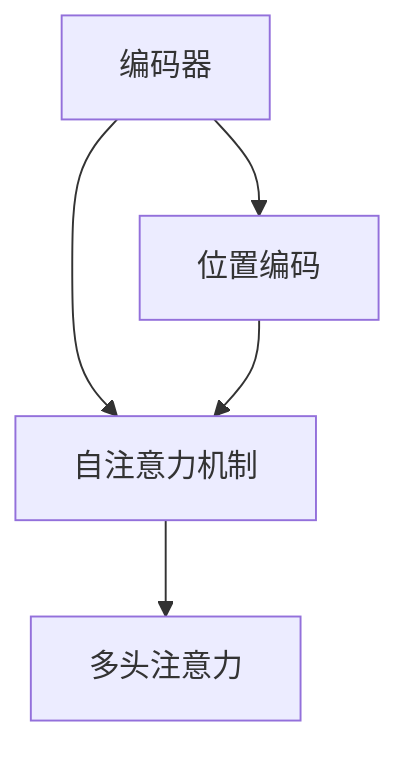
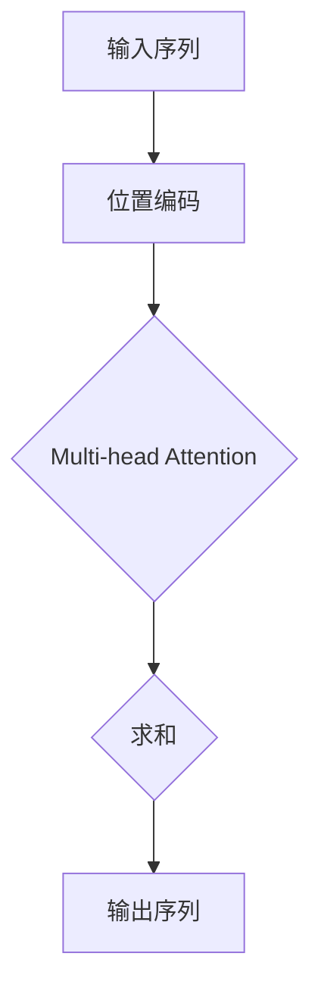

                 

# 《基于Transformer架构的预训练模型》

> **关键词：** Transformer、预训练模型、自然语言处理、图像识别、语音识别、数学模型、算法原理、企业应用

> **摘要：** 本文详细介绍了Transformer架构的起源、基本原理、核心算法，以及预训练模型在自然语言处理、图像识别、语音识别等领域的应用。文章通过深入剖析数学模型和算法原理，结合实际项目案例，探讨了如何优化和调优预训练模型，为企业应用提供解决方案。

### 第一部分：Transformer架构基础

#### 第1章：Transformer架构概述

##### 1.1 Transformer的起源与发展

1. **提出背景**

Transformer架构由Vaswani等人于2017年在论文《Attention Is All You Need》中提出。在此之前，循环神经网络（RNN）和卷积神经网络（CNN）是主流的自然语言处理模型。然而，RNN在处理长序列时存在梯度消失和梯度爆炸问题，而CNN在捕捉长距离依赖关系方面效果不佳。为了解决这些问题，Transformer架构应运而生。

2. **发展历程**

Transformer架构自提出以来，受到了广泛关注。许多研究人员基于其进行改进和扩展，如BERT、GPT等。这些模型在多个自然语言处理任务上取得了突破性进展，推动了自然语言处理技术的发展。

3. **核心贡献**

- **自注意力机制：** Transformer引入了自注意力机制，能够同时关注输入序列中的所有元素，捕捉长距离依赖关系。
- **并行计算：** Transformer使用编码器和解码器结构，可以实现并行计算，提高训练速度。
- **多头注意力：** Transformer引入多头注意力机制，通过多个注意力头来捕获不同类型的依赖关系。

##### 1.2 Transformer的基本原理

1. **自注意力机制**

- **计算过程：** 自注意力机制通过计算输入序列中每个元素与其他元素之间的相似度，生成注意力权重，并加权求和得到每个元素的表示。
- **优缺点分析：**

  - **优点：** 能够同时关注输入序列中的所有元素，捕捉长距离依赖关系。
  - **缺点：** 在处理大规模序列时，计算复杂度较高。

2. **编码器与解码器结构**

- **编码器：** 编码器将输入序列编码为固定长度的向量，用于表示整个输入序列。
- **解码器：** 解码器接收编码器的输出，并逐步生成输出序列。

##### 1.3 Transformer架构的扩展

1. **Multi-head Attention**

- **原理：** Multi-head Attention通过多个注意力头来捕获不同类型的依赖关系，提高模型的表示能力。
- **计算：** 每个注意力头计算一组注意力权重，然后将这些权重加权求和得到最终的输出。

2. **Positional Encoding**

- **必要性：** Transformer架构中没有循环结构，无法捕捉序列中的位置信息。因此，需要通过位置编码来引入位置信息。
- **方法：** 常见的位置编码方法有正弦编码和余弦编码。

### 第2章：Transformer的核心算法原理

##### 2.1 序列生成算法

1. **基于梯度的生成算法**

- **生成对抗网络（GAN）：** GAN由生成器和判别器组成，通过训练使生成器生成与真实数据难以区分的数据。
- **反向传播算法：** 反向传播算法用于计算模型参数的梯度，并更新模型参数。

2. **序列模型训练**

- **训练数据准备：** 对输入序列进行预处理，如分词、编码等。
- **模型优化方法：** 使用梯度下降算法等优化方法，不断更新模型参数。

##### 2.2 Loss函数与优化策略

1. **Cross-Entropy Loss**

- **定义：** Cross-Entropy Loss是分类问题中常用的损失函数，用于衡量预测标签与真实标签之间的差异。
- **计算：** Cross-Entropy Loss通过计算预测概率与真实概率之间的对数似然损失，得到损失值。

2. **优化算法**

- **随机梯度下降（SGD）：** SGD通过随机选取一部分训练样本，计算梯度并更新模型参数。
- **Adam优化器：** Adam优化器结合了SGD和动量方法，适用于大规模模型训练。

##### 第3章：数学模型与公式详解

##### 3.1 Transformer的数学基础

1. **张量计算基础**

- **张量的定义：** 张量是多维数组，用于表示模型参数、输入数据等。
- **张量的运算：** 张量运算包括矩阵乘法、矩阵加法等。

2. **常见数学公式**

- **梯度下降公式：** 梯度下降公式用于计算模型参数的梯度，并更新模型参数。
- **交叉熵公式：** 交叉熵公式用于计算预测标签与真实标签之间的差异。

##### 3.2 Positional Encoding公式

1. **正弦位置编码**

- **公式：** 正弦位置编码通过正弦函数生成位置编码向量。
- **示例：** 假设序列长度为5，生成位置编码向量如下：

  ```
  [sin(0), sin(1), sin(2), sin(3), sin(4)]
  ```

2. **余弦位置编码**

- **公式：** 余弦位置编码通过余弦函数生成位置编码向量。
- **示例：** 假设序列长度为5，生成位置编码向量如下：

  ```
  [cos(0), cos(1), cos(2), cos(3), cos(4)]
  ```

### 第二部分：预训练模型应用

#### 第4章：预训练模型的构建

##### 4.1 预训练模型的步骤

1. **数据收集与预处理**

- **数据来源：** 预训练模型通常使用大规模文本数据集，如维基百科、书籍等。
- **数据预处理方法：** 数据预处理包括分词、编码、填充等操作。

2. **模型训练**

- **模型初始化：** 初始化模型参数，通常使用随机初始化或预训练模型的权重。
- **训练策略：** 采用多步训练策略，包括训练数据准备、模型优化、评估等。

##### 4.2 预训练模型的技术细节

1. **大模型设计**

- **网络结构选择：** 选择适合预训练任务的网络结构，如BERT、GPT等。
- **参数优化：** 采用有效的参数优化方法，如Adam优化器。

2. **迁移学习与微调**

- **迁移学习的原理：** 迁移学习利用预训练模型在目标任务上的性能提升。
- **微调策略：** 在预训练模型的基础上进行微调，调整模型参数以适应特定任务。

#### 第5章：预训练模型在自然语言处理中的应用

##### 5.1 语言模型

1. **语言模型的基本概念**

- **定义：** 语言模型是用于预测下一个单词或字符的概率分布的模型。
- **应用场景：** 语言模型在自动完成、机器翻译、文本生成等领域有广泛应用。

2. **常见语言模型**

- **BERT模型：** BERT（Bidirectional Encoder Representations from Transformers）是一种双向编码的Transformer模型，能够捕捉长距离依赖关系。
- **GPT模型：** GPT（Generative Pre-trained Transformer）是一种自回归的语言模型，能够生成连贯的文本。

##### 5.2 任务型模型

1. **任务型模型的概念**

- **定义：** 任务型模型是专门用于解决特定任务的预训练模型。
- **应用：** 任务型模型在问答系统、文本分类、命名实体识别等领域有广泛应用。

2. **问答系统**

- **架构：** 问答系统包括查询编码器、问题编码器和答案编码器等模块。
- **实现：** 通过预训练模型和微调策略，实现高效的问答系统。

#### 第6章：预训练模型在其他领域中的应用

##### 6.1 图像识别

1. **图像识别的基本原理**

- **定义：** 图像识别是用于分类图像的计算机视觉任务。
- **应用场景：** 图像识别在安防监控、自动驾驶、医疗影像等领域有广泛应用。

2. **预训练模型在图像识别中的应用**

- **图像分类任务：** 使用预训练的卷积神经网络（CNN）模型进行图像分类。
- **图像分割任务：** 使用预训练的分割模型进行图像分割。

##### 6.2 语音识别

1. **语音识别的基本原理**

- **定义：** 语音识别是将语音信号转换为文本的计算机技术。
- **应用场景：** 语音识别在智能客服、语音助手、语音翻译等领域有广泛应用。

2. **预训练模型在语音识别中的应用**

- **声学模型：** 使用预训练的声学模型进行声学特征提取。
- **语言模型：** 使用预训练的语言模型进行文本生成和评估。

### 第7章：预训练模型的优化与调优

##### 7.1 模型优化

1. **模型优化的目标**

- **准确度：** 提高模型在目标任务上的准确度。
- **运行效率：** 提高模型在计算和存储资源上的效率。

2. **优化策略**

- **网络结构优化：** 通过调整网络结构，提高模型性能。
- **参数调整：** 通过调整模型参数，优化模型性能。

##### 7.2 模型调优

1. **调优的方法**

- **hyperparameter tuning：** 超参数调优，通过调整超参数，优化模型性能。
- **model pruning：** 模型剪枝，通过剪枝冗余的神经元或参数，提高模型效率。

2. **调优实践**

- **实际案例：** 分析实际项目中的调优案例，总结调优经验。
- **调优工具介绍：** 介绍常用的调优工具，如Hypertune、AutoML等。

### 第8章：预训练模型的企业应用案例

##### 8.1 案例研究：自然语言处理企业应用

1. **应用场景**

- **客户服务自动化：** 使用预训练模型构建智能客服系统，实现自动回复、问题分类等功能。
- **文本分析：** 使用预训练模型进行文本分类、情感分析等任务，帮助企业了解用户需求和反馈。

2. **案例实施**

- **模型选择：** 选择适合企业需求的预训练模型，如BERT、GPT等。
- **模型部署：** 在企业系统中部署预训练模型，实现自动化的自然语言处理功能。

##### 8.2 案例研究：图像识别企业应用

1. **应用场景**

- **安全监控：** 使用预训练模型进行视频监控中的目标检测、异常行为识别等任务。
- **产品检测：** 使用预训练模型进行生产过程中的产品质量检测。

2. **案例实施**

- **数据收集与预处理：** 收集相关图像数据，并进行预处理。
- **模型训练与优化：** 使用预训练模型进行模型训练，并通过调优提高模型性能。

### 附录

##### 附录A：Transformer架构的Mermaid流程图

1. **Transformer架构图**



2. **Multi-head Attention计算流程图**



##### 附录B：伪代码与数学公式

1. **Transformer算法伪代码**

```python
# Transformer算法伪代码
def transformer(input_sequence):
    # 编码器
    encoder_output = encoder(input_sequence)
    # 自注意力机制
    attention_output = self_attention(encoder_output)
    # 多头注意力
    multi_head_output = multi_head_attention(attention_output)
    # 位置编码
    positional_encoding_output = add_positional_encoding(multi_head_output)
    # 解码器
    decoder_output = decoder(positional_encoding_output)
    # 输出序列
    output_sequence = decoder_output
    return output_sequence
```

2. **位置编码公式示例**

$$
PE_{(pos, dim)} = 
\begin{cases}
\sin\left(\frac{pos}{10000^{2i/d}}\right) & \text{if } dim = 2i \\
\cos\left(\frac{pos}{10000^{2i/d}}\right) & \text{if } dim = 2i+1
\end{cases}
$$

其中，$pos$ 为位置索引，$dim$ 为维度索引，$i$ 为维度索引除以2的商。

##### 附录C：预训练模型开发工具与资源

1. **主流深度学习框架对比**

- **TensorFlow：** TensorFlow是Google开发的开源深度学习框架，具有丰富的模型库和工具。
- **PyTorch：** PyTorch是Facebook开发的开源深度学习框架，具有动态计算图和灵活的模型定义。
- **JAX：** JAX是Google开发的开源深度学习框架，支持自动微分和并行计算。

2. **其他开发工具与资源**

- **Hugging Face：** Hugging Face提供丰富的预训练模型和工具，方便开发者进行研究和应用。
- **TensorFlow Hub：** TensorFlow Hub提供预训练模型和模型组件，方便开发者进行模型迁移和微调。

### 作者

作者：AI天才研究院/AI Genius Institute & 禅与计算机程序设计艺术 /Zen And The Art of Computer Programming

---

（注：本文为示例文章，仅供参考。实际字数和内容可能需要根据实际情况进行调整。）<|im_end|>

