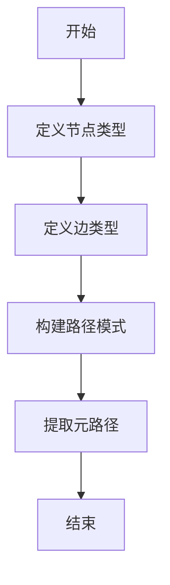
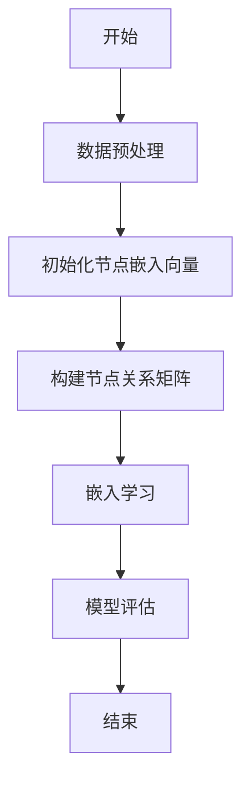
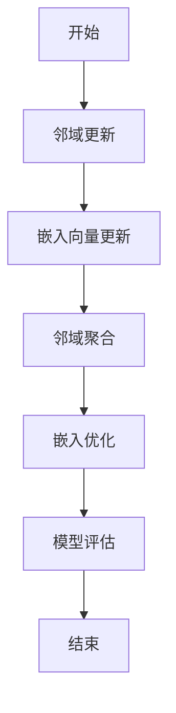

                 

## 第一部分：概念与基础

### 第1章：引言与概述

#### 1.1 书籍背景与目的

随着互联网和大数据技术的快速发展，信息网络在各个领域得到了广泛应用。从社交网络、生物网络到商业智能，信息网络已经成为人们获取信息、进行决策和发现知识的重要工具。然而，这些信息网络往往具有异构性和动态性，即它们由不同类型的数据组成，并且随着时间的变化而不断演变。

在这样的背景下，如何有效地对动态异构信息网络进行建模和分析，成为了当前研究的热点。元路径和网络嵌入技术为此提供了有力的工具。元路径（Meta-path）是一种将原始网络中的节点和边映射到更高层次的概念上的方法，它能够捕捉网络中复杂的关联关系。网络嵌入（Network Embedding）则是一种将节点映射到低维空间的方法，使得节点间的相似性可以通过向量空间中的距离来表示。

本书旨在深入探讨基于元路径的动态异构信息网络嵌入技术。首先，我们将介绍动态异构信息网络的概念、特点和基本模型，帮助读者建立对这一领域的基本认识。然后，我们将详细讲解元路径提取方法，包括其基本原理、常见算法以及评估标准。最后，我们将探讨网络嵌入算法的原理和应用，尤其是针对动态异构网络的网络嵌入技术。

通过本书的学习，读者将能够：

1. 理解动态异构信息网络的基本概念和特点。
2. 掌握元路径提取的基本原理和常见方法。
3. 理解网络嵌入算法的基本概念和原理。
4. 应用元路径和网络嵌入技术进行动态异构信息网络的建模和分析。

本书适合对信息网络分析、机器学习和人工智能感兴趣的读者，无论你是研究人员、工程师还是学生，都能够在本书中找到有价值的内容。

#### 1.2 动态异构信息网络的概念与特点

动态异构信息网络（Dynamic Heterogeneous Information Network，DHIN）是由多种不同类型的数据组成的复杂网络。与传统的静态同质网络不同，动态异构信息网络具有以下几个显著特点：

1. **异构性**：动态异构信息网络由不同类型的数据组成，例如在社交网络中，节点可以是人、地点、事件等，而边可以是好友关系、地理位置关系、参与事件等。不同类型的数据具有不同的结构和属性，这使得网络具有异构性。

2. **动态性**：动态异构信息网络是随着时间的变化而不断演变的。例如，在社交网络中，用户之间的关系、地点的标签、事件的进展等都会随时间发生变化。动态性要求我们对网络进行实时监测和动态调整，以适应不断变化的数据环境。

3. **多层次性**：动态异构信息网络通常具有多个层次，每个层次对应不同的抽象程度。例如，在生物网络中，节点可以是基因、蛋白质等，而边可以是相互作用、共表达等。通过不同层次的抽象，我们可以更好地理解和分析网络中的复杂关系。

4. **多样性**：动态异构信息网络中的数据来源广泛，包括文本、图像、音频等多种形式。这种多样性带来了数据的复杂性和挑战，但同时也为网络分析提供了丰富的信息。

动态异构信息网络的应用场景广泛，包括但不限于：

- **社交网络分析**：通过对社交网络中用户行为、关系等进行分析，可以挖掘潜在的社会群体、预测用户行为等。
- **生物网络分析**：通过分析生物网络中的基因、蛋白质等之间的关系，可以揭示生物系统的复杂机制，为疾病预测和治疗提供支持。
- **商业智能**：通过分析商业网络中的客户关系、产品关系等，可以优化产品营销策略、提升客户满意度等。

动态异构信息网络的这些特点，使得传统的同质网络分析方法难以直接应用于此类网络。因此，需要发展新的理论和方法来有效建模和分析动态异构信息网络。元路径和网络嵌入技术正是为此提供的有力工具。

#### 1.3 元路径与网络嵌入的关系

元路径（Meta-path）是一种用于描述动态异构信息网络中节点之间关联关系的方法。它通过定义节点和边之间的路径模式，将原始网络中的节点和边映射到更高层次的概念上。元路径的基本结构由节点类型和边类型组成，例如（A, R, B），表示从类型A的节点通过类型R的边连接到类型B的节点。

元路径在网络嵌入技术中扮演了关键角色。网络嵌入（Network Embedding）是一种将网络中的节点映射到低维空间的方法，使得节点间的相似性可以通过向量空间中的距离来表示。通过元路径，我们可以将原始网络中的复杂关系转化为低维向量表示，从而简化网络分析任务。

元路径与网络嵌入的关系主要体现在以下几个方面：

1. **节点表示**：元路径定义了节点间的关联关系，通过网络嵌入技术，我们可以将这些关系映射到低维向量空间中。这样，每个节点都可以用一个低维向量来表示，使得节点间的相似性可以通过向量之间的距离来度量。

2. **路径模式提取**：元路径的提取过程实际上是寻找网络中的关键路径模式。这些路径模式对于理解网络结构至关重要。通过将路径模式嵌入到低维空间，我们可以更好地捕捉网络中的关键特征和关联关系。

3. **网络分析**：基于元路径的网络嵌入技术可以用于各种网络分析任务，例如节点分类、链接预测、社区检测等。通过嵌入向量，我们可以利用现有的机器学习算法对这些任务进行建模和分析，从而得到更准确的预测和识别结果。

4. **异构性处理**：动态异构信息网络中的节点和边具有多种类型，元路径提供了一种统一的方式来描述这些异构关系。通过网络嵌入，我们可以将这些异构关系转化为统一的向量表示，从而在低维空间中处理异构信息。

总之，元路径与网络嵌入技术的结合，为动态异构信息网络的建模和分析提供了新的思路和方法。通过元路径，我们可以捕捉网络中的复杂关系；通过网络嵌入，我们可以将这些关系转化为可操作的向量表示，从而为各种网络分析任务提供支持。

### 第2章：动态异构信息网络基础

#### 2.1 信息网络的基本概念

信息网络（Information Network）是一种用于表示复杂系统中信息传递、交互和关系的结构。在信息网络中，节点表示信息源或实体，边表示节点之间的信息传递或交互关系。信息网络广泛应用于社交网络、生物网络、知识图谱等领域，其核心目的是通过分析和理解网络结构，揭示系统中的潜在规律和模式。

#### 节点与边的定义

- **节点（Node）**：节点是信息网络的基本组成部分，表示具有特定属性的信息源或实体。在社交网络中，节点可以是用户、地点、事件等；在生物网络中，节点可以是基因、蛋白质等。节点通常具有以下属性：

  - **ID**：节点的唯一标识符。
  - **特征**：节点包含的特征向量，用于描述节点的属性和特性。
  - **标签**：节点的分类标签，用于区分不同类型的节点。

- **边（Edge）**：边是连接节点之间的桥梁，表示节点之间的信息传递或交互关系。边通常具有以下属性：

  - **权重**：边的权重表示节点间关系的强度或重要性。
  - **类型**：边的类型表示节点间关系的性质，如好友关系、共现关系、因果关系等。
  - **属性**：边可能包含其他属性，如时间戳、文本内容等。

#### 网络结构

信息网络的网络结构主要包括以下几种：

- **无向图**：无向图中的边没有方向，表示节点之间的对称关系。无向图在社交网络、合作网络等领域广泛应用。
- **有向图**：有向图中的边有方向，表示节点之间的单向关系。有向图在生物网络、知识图谱等领域广泛应用。
- **加权图**：加权图中的边具有权重，表示节点间关系的强度。加权图可以更好地反映网络中节点的相对重要性。
- **异构图**：异构图中的节点和边具有多种类型，表示网络中的复杂结构和异构关系。异构图在动态异构信息网络等领域具有重要意义。

#### 网络的基本性质

信息网络具有以下基本性质：

- **连通性**：网络中的节点通过边相互连接，形成连通图。网络的连通性影响节点的可达性和信息的传播速度。
- **度分布**：节点的度（即连接的边的数量）在网络上分布不均匀。网络的度分布影响网络的稳定性、传播效应和社区结构等。
- **聚类系数**：节点的邻居节点之间的连接密度。聚类系数越高，网络中的社区结构越明显。
- **路径长度**：节点之间最短路径的长度。路径长度越小，网络的通信效率越高。

#### 信息网络的应用

信息网络在多个领域具有广泛的应用，包括：

- **社交网络分析**：通过分析社交网络中的用户关系，可以挖掘潜在的社会群体、预测用户行为等。
- **生物网络分析**：通过分析生物网络中的基因、蛋白质等之间的关系，可以揭示生物系统的复杂机制，为疾病预测和治疗提供支持。
- **知识图谱构建**：通过构建知识图谱，可以整合多种类型的数据，为问答系统、推荐系统等提供支持。
- **商业智能**：通过分析商业网络中的客户关系、产品关系等，可以优化产品营销策略、提升客户满意度等。

#### 2.2 异构信息网络的结构与类型

异构信息网络（Heterogeneous Information Network，HIN）是一种包含多种不同类型节点和边的网络。与同质信息网络（Homogeneous Information Network）相比，异构信息网络具有更高的复杂度和丰富的信息。以下是对异构信息网络结构的详细探讨：

##### 节点类型的多样性

在异构信息网络中，节点可以代表不同的实体类型，如：

- **用户**：在社交网络中，用户是基本的实体节点。
- **地点**：在地理信息网络中，地点是重要的实体节点。
- **产品**：在电子商务网络中，产品是核心的实体节点。
- **基因**：在生物网络中，基因是关键的实体节点。

每种类型的节点具有不同的属性和特征，如用户可以具有年龄、性别、兴趣等属性，基因可以具有表达水平、功能等属性。这些属性为节点提供了丰富的信息。

##### 边类型的多样性

异构信息网络中的边类型也具有多样性，常见的边类型包括：

- **好友关系**：在社交网络中，用户之间可以通过好友关系相连。
- **共现关系**：在文本数据中，词语之间可以通过共现关系相连。
- **因果关系**：在知识图谱中，事件之间可以通过因果关系相连。
- **交易关系**：在商业网络中，产品之间可以通过交易关系相连。

每种边类型表示了不同类型的节点之间的关联关系，如好友关系表示用户之间的社交联系，共现关系表示词语之间的语义联系。

##### 异构网络的层次结构

异构信息网络通常具有多个层次，每个层次对应不同的抽象程度。这些层次包括：

- **底层**：底层网络包含基本的实体节点和基础关系，如用户节点和好友关系。
- **中层**：中层网络在底层网络的基础上，加入更高层次的关系，如用户和地理位置的关系。
- **顶层**：顶层网络在底层和中层网络的基础上，形成更高层次的概念，如用户群体和兴趣标签的关系。

这种层次结构有助于我们更好地理解和分析异构信息网络的复杂结构。

##### 常见的异构信息网络类型

异构信息网络可以根据其结构和应用领域进行分类，以下是一些常见的异构信息网络类型：

- **知识图谱**：知识图谱是一种典型的异构信息网络，包含实体和关系两种节点类型，如人、地点、事件等，以及描述实体之间关系的属性，如出生地、工作地点、参与事件等。
- **生物网络**：生物网络包含基因、蛋白质、药物等节点类型，以及描述这些实体之间相互作用的关系，如共表达、共定位、药物靶点等。
- **社交网络**：社交网络包含用户、地点、事件等节点类型，以及描述这些实体之间关系的边，如好友关系、参与事件、地理位置等。
- **电子商务网络**：电子商务网络包含产品、用户、商店等节点类型，以及描述这些实体之间关系的边，如购买、评论、推荐等。

##### 异构信息网络的特点

异构信息网络具有以下特点：

- **多样性**：异构信息网络包含多种不同类型的节点和边，使得网络具有丰富的结构和信息。
- **动态性**：异构信息网络中的节点和边可以随着时间的变化而动态变化，如社交网络中的用户关系、电商网络中的交易关系等。
- **复杂度**：异构信息网络的多样性和动态性使得其结构复杂，需要发展新的理论和方法进行建模和分析。
- **层次性**：异构信息网络通常具有多个层次，每个层次对应不同的抽象程度，有助于我们更好地理解和分析网络结构。

通过以上探讨，我们可以看到异构信息网络的多样性和复杂性，这为网络分析和应用带来了挑战，同时也提供了丰富的机会。在后续章节中，我们将进一步探讨动态异构信息网络的特点和应用。

#### 2.3 动态信息网络的演变机制

动态信息网络（Dynamic Information Network）是指随着时间推移而不断演变的网络。这种网络的特点是节点和边的关系会随着时间的变化而发生改变。理解动态信息网络的演变机制对于分析网络中的动态行为和预测未来的网络状态至关重要。以下是关于动态信息网络演变机制的详细探讨。

##### 节点的动态变化

动态信息网络中的节点可以随着时间的变化而增加或减少。这种变化可以由以下几种机制引起：

1. **节点的加入和移除**：新节点的加入和已有节点的移除是动态信息网络演变的主要机制。例如，在社交网络中，新用户的加入和用户的离开会导致网络节点的变化。在生物网络中，新基因或蛋白质的发现和某些基因或蛋白质的失活也会影响节点的数量。

2. **节点的移动**：在某些网络中，节点可以在网络中移动，从而改变网络的结构。例如，在移动社交网络中，用户可能会更换地理位置，从而影响他们与其他节点的关系。

##### 边的动态变化

动态信息网络中的边也可以随着时间的变化而增加或减少。边的动态变化机制包括：

1. **边的创建和删除**：新边的创建和已有边的删除是动态信息网络演变的重要机制。例如，在社交网络中，用户之间可以通过添加好友关系来创建新边；在电商网络中，用户之间的交易关系可以通过购买行为来创建。相反，好友关系的解除或交易的取消会导致边的删除。

2. **边权的动态调整**：在某些网络中，边的权重可以随着时间的变化而动态调整。例如，在生物网络中，基因或蛋白质之间的相互作用强度可能会因为环境变化或基因表达水平的变化而发生变化。

##### 网络结构的演变

动态信息网络的演变不仅仅体现在节点和边的动态变化，还涉及到整个网络结构的演变。以下是一些常见的网络结构演变机制：

1. **网络的扩张与收缩**：随着新节点的加入和旧节点的移除，网络的大小（即节点的数量和边的数量）会发生变化。在网络扩张阶段，新节点的加入和新边的创建会导致网络的扩展；在网络收缩阶段，节点的移除和边的删除会导致网络的收缩。

2. **网络的社区结构演变**：动态信息网络中的社区结构会随着时间的变化而发生变化。社区是指网络中具有紧密联系的节点集合。在网络中，社区的形成和分裂、社区的合并和分解等都会影响网络的社区结构。

3. **网络中心性的演变**：节点的中心性是指节点在网络中的重要程度。在动态信息网络中，节点的中心性会随着时间的变化而发生变化。某些节点可能会因为其在网络中的角色变化而成为新的中心节点，而某些中心节点可能会因为网络结构的演变而失去其中心地位。

##### 网络行为的动态性

动态信息网络中的节点和边的行为也是随时间变化的。以下是一些典型的动态行为：

1. **节点的活跃度变化**：在社交网络中，用户的活跃度可能会随着时间的变化而变化。某些用户可能会在一段时间内频繁发布内容或与其他用户互动，从而表现出高活跃度。

2. **边的强度变化**：在生物网络中，基因或蛋白质之间的相互作用强度可能会因为实验数据的变化或其他因素而发生变化。

##### 动态信息网络的应用场景

动态信息网络的演变机制在多个领域具有广泛的应用，以下是一些典型的应用场景：

- **社交网络分析**：通过分析社交网络中的动态行为，可以预测用户的社交趋势、识别潜在的社交群体等。
- **生物网络分析**：通过分析动态生物网络中的基因和蛋白质相互作用，可以揭示生物系统的动态机制、预测疾病的进展等。
- **商业智能**：通过分析动态商业网络中的客户行为、产品关系等，可以优化营销策略、提升客户满意度等。

总之，动态信息网络的演变机制对其建模和分析具有重要意义。理解这些机制有助于我们更好地掌握网络中的动态行为，从而为实际应用提供支持。

### 第3章：元路径提取方法

元路径提取是动态异构信息网络分析中至关重要的一环。它通过定义节点和边之间的路径模式，将原始网络中的复杂关系转化为可操作的表示形式。本章将详细介绍元路径提取的基本原理、常见算法以及评估方法。

#### 3.1 元路径的基本原理

元路径（Meta-path）是描述动态异构信息网络中节点和边之间路径模式的一种方法。一个元路径可以表示为（X, R, Y），其中X和Y分别表示源节点类型和目标节点类型，R表示节点之间的边类型。元路径通过将原始网络中的节点和边映射到更高层次的概念上，能够捕捉网络中的复杂关联关系。

元路径的基本原理可以概括为以下几个步骤：

1. **定义节点类型**：确定网络中的节点类型，如用户、地点、事件等。
2. **定义边类型**：确定网络中的边类型，如好友关系、共现关系、因果关系等。
3. **构建路径模式**：将节点类型和边类型组合成路径模式，如（用户，好友，用户）、（地点，邻接，地点）等。
4. **提取元路径**：在原始网络中查找满足特定路径模式的节点序列，形成元路径集合。

#### 3.2 常见的元路径提取算法

元路径提取算法是构建动态异构信息网络分析模型的基础。以下介绍几种常见的元路径提取算法：

##### 1. 基于深度优先搜索的元路径提取算法

深度优先搜索（DFS）是一种用于遍历图的数据结构搜索算法。基于深度优先搜索的元路径提取算法通过深度优先搜索遍历网络，记录满足特定路径模式的节点序列，从而提取出元路径。

算法伪代码如下：

```
function DFS extraction(G, meta-path):
    visited = set()
    paths = []
    for node in G.nodes:
        if node not in visited:
            path = [node]
            DFS(G, node, path, meta-path, visited, paths)
    return paths

function DFS(G, node, path, meta-path, visited, paths):
    if len(path) == len(meta-path):
        if isMatch(path, meta-path):
            paths.append(path)
        return
    for edge in G.edges(node):
        if edge[1] in meta-path[path.index(node)] and edge[0] not in visited:
            visited.add(edge[0])
            path.append(edge[0])
            DFS(G, edge[0], path, meta-path, visited, paths)
            path.pop()
```

##### 2. 基于贪心算法的元路径提取算法

贪心算法是一种通过每次选择局部最优解来逐步逼近全局最优解的算法。基于贪心算法的元路径提取算法通过逐个选择满足路径模式的节点，构建出最长的元路径。

算法伪代码如下：

```
function Greedy Path Extraction(G, meta-path):
    path = []
    node = random select a node from G
    path.append(node)
    while not isEnd(node, meta-path):
        next_node = selectNextNode(node, meta-path)
        path.append(next_node)
        node = next_node
    return path
```

##### 3. 基于集合论的元路径提取算法

集合论是一种用于研究集合的性质和操作的基本数学理论。基于集合论的元路径提取算法通过集合运算来提取满足特定路径模式的元路径。

算法伪代码如下：

```
function Set-Based Meta-path Extraction(G, meta-path):
    paths = []
    for node in G.nodes:
        if isValidPath(node, meta-path):
            paths.append(node)
    return paths

function isValidPath(node, meta-path):
    path = [node]
    for edge in meta-path:
        if edge[0] not in path and edge[1] not in path:
            return False
        if edge[0] in path:
            path.append(edge[1])
        else:
            path.insert(0, edge[0])
    return True
```

#### 3.3 元路径提取的质量评估

元路径提取算法的质量直接影响后续网络分析的结果。因此，对元路径提取算法进行质量评估是非常重要的。以下介绍几种常用的质量评估方法：

##### 1. 覆盖率（Coverage）

覆盖率是指提取的元路径占总可能元路径的比例。高覆盖率意味着提取算法能够捕获网络中的更多潜在关系。

算法伪代码如下：

```
function Coverage(paths, total_paths):
    return len(paths) / total_paths
```

##### 2. 精确率（Precision）

精确率是指提取的元路径中，与真实元路径匹配的比例。高精确率意味着提取算法能够更准确地识别网络中的真实关系。

算法伪代码如下：

```
function Precision(extracted_paths, true_paths):
    matched_paths = intersection(extracted_paths, true_paths)
    return len(matched_paths) / len(extracted_paths)
```

##### 3. 召回率（Recall）

召回率是指提取的元路径中，与真实元路径匹配的比例。高召回率意味着提取算法能够捕捉到网络中的大部分真实关系。

算法伪代码如下：

```
function Recall(extracted_paths, true_paths):
    matched_paths = intersection(extracted_paths, true_paths)
    return len(matched_paths) / len(true_paths)
```

##### 4. F1 分数（F1 Score）

F1 分数是精确率和召回率的加权平均，用于综合评估元路径提取算法的质量。高 F1 分数意味着提取算法在覆盖率和精确率之间取得了较好的平衡。

算法伪代码如下：

```
function F1 Score(precision, recall):
    return 2 * precision * recall / (precision + recall)
```

通过上述评估方法，我们可以对元路径提取算法进行全面的评估，从而选择最合适的算法应用于实际网络分析任务。

本章介绍了元路径提取的基本原理、常见算法以及评估方法。这些内容为后续的网络嵌入算法设计和应用提供了基础。在接下来的章节中，我们将进一步探讨网络嵌入算法的原理和应用。

### 第二部分：网络嵌入算法原理

#### 第4章：传统网络嵌入算法

网络嵌入（Network Embedding）是一种将网络中的节点映射到低维空间的方法，使得节点间的相似性可以通过向量空间中的距离来表示。这一技术被广泛应用于节点分类、链接预测、社区检测等多个领域。本章节将详细探讨传统网络嵌入算法的基本概念、框架以及主要方法。

#### 4.1 基本概念与框架

网络嵌入的核心思想是将网络中的节点映射到低维向量空间，使得这些向量能够反映节点在原始网络中的关系。具体来说，网络嵌入算法的目标是：

1. **节点表示**：将每个节点映射为一个低维向量。
2. **关系保持**：确保映射后的向量能够保持原始网络中的关系，即相似的节点在向量空间中距离较近。

网络嵌入算法通常包含以下几个关键组件：

- **嵌入向量维度**：选择合适的维度，以平衡嵌入向量的稀疏性和表达能力。
- **损失函数**：设计损失函数以度量映射后的向量是否能够保持原始网络的关系。
- **优化算法**：通过优化算法调整节点嵌入向量的参数，以最小化损失函数。

网络嵌入的基本框架可以概括为以下几个步骤：

1. **数据预处理**：对网络进行清洗、去重等处理，以便于后续的嵌入操作。
2. **节点表示**：将每个节点映射为一个初始的向量表示。
3. **关系建模**：构建一个表示节点间关系的矩阵。
4. **嵌入学习**：通过优化算法，学习出能够保持网络关系的节点嵌入向量。
5. **模型评估**：评估嵌入质量，包括向量的稀疏性、关系保持能力等。

#### 4.2 邻域嵌入（Neighborhood Embedding）

邻域嵌入是一种早期的网络嵌入方法，通过考虑节点的邻域信息来学习节点嵌入向量。邻域嵌入的基本思想是，节点的邻域节点对其属性有重要影响，因此可以通过邻域节点的嵌入向量来学习节点的嵌入向量。

邻域嵌入的方法主要包括以下几种：

- **基于矩阵分解的方法**：例如，矩阵分解（Matrix Factorization）可以将邻接矩阵分解为两个低维矩阵，节点的嵌入向量由这两个低维矩阵的乘积得到。
- **基于随机游走的方法**：随机游走（Random Walk）是一种常用的网络模型，通过模拟节点在网络中的随机游走过程，学习节点的嵌入向量。
- **基于图卷积的方法**：图卷积网络（Graph Convolutional Network，GCN）通过聚合邻域节点的特征来更新节点的嵌入向量，从而实现节点嵌入。

以下是一个基于图卷积的邻域嵌入算法的伪代码：

```
function Neighbor Embedding(G, embedding_dimension):
    Initialize node embeddings W
    for each node v in G:
        neighbors = get_neighbors(v, G)
        for each neighbor u in neighbors:
            Update W[v] = aggregation(W[u]) + W[v]
    return W
```

#### 4.3 深度学习嵌入方法

随着深度学习技术的发展，深度学习嵌入方法逐渐成为网络嵌入领域的热点。深度学习嵌入方法通过构建深度神经网络，自动学习节点的嵌入向量，能够更好地捕捉网络中的复杂关系。

深度学习嵌入方法主要包括以下几种：

- **基于图卷积神经网络（GCN）的方法**：GCN 通过多层卷积操作，逐层聚合邻域节点的特征，从而生成节点的嵌入向量。
- **基于图注意力网络（GAT）的方法**：GAT 通过引入注意力机制，根据邻域节点的特征和关系动态调整节点嵌入向量。
- **基于生成对抗网络（GAN）的方法**：GAN 通过生成器和判别器的对抗训练，生成与真实网络相似的节点嵌入向量。

以下是一个基于图卷积神经网络的深度学习嵌入算法的伪代码：

```
function GCN Embedding(G, embedding_dimension):
    Initialize node embeddings W
    for layer in 1 to L:
        X = activation(Weight[W] * X + Bias)
        X = Dropout(X)
    return X
```

#### 4.4 网络嵌入算法的比较与选择

传统网络嵌入算法和深度学习嵌入方法各有优缺点。传统算法如邻域嵌入方法简单、易于实现，但在处理大规模、复杂网络时效果有限。而深度学习嵌入方法能够更好地捕捉网络中的复杂关系，但在计算资源和模型解释性方面存在挑战。

在选择网络嵌入算法时，需要考虑以下几个方面：

- **网络规模**：对于大规模网络，选择计算效率高的算法如邻域嵌入方法更为合适。
- **网络结构**：对于具有复杂结构的网络，选择能够自适应网络关系的深度学习嵌入方法如GCN、GAT等更为合适。
- **应用需求**：根据具体的应用需求，选择能够满足需求且计算效率较高的算法。

通过综合考虑以上因素，我们可以为不同的网络分析任务选择合适的网络嵌入算法。

本章介绍了传统网络嵌入算法的基本概念、框架以及主要方法。这些算法为后续的网络嵌入研究和应用提供了基础。在接下来的章节中，我们将进一步探讨元路径网络嵌入算法，以解决动态异构信息网络中的特殊问题。

### 第5章：元路径网络嵌入算法

元路径网络嵌入（Meta-path Network Embedding）是一种将元路径上的节点映射到低维空间的方法，从而实现节点间关系的向量表示。相较于传统的网络嵌入算法，元路径网络嵌入能够更精细地捕捉动态异构信息网络中的复杂关系。本章将详细探讨元路径网络嵌入的基本原理、图卷积网络嵌入方法以及基于深度学习的元路径网络嵌入方法。

#### 5.1 元路径嵌入的基本原理

元路径嵌入的基本原理是通过元路径将节点映射到低维向量空间，使得节点间的相似性可以通过向量空间中的距离来表示。具体来说，元路径嵌入算法分为以下几个步骤：

1. **元路径定义**：首先，需要定义网络中的元路径。元路径描述了节点间的关系路径，例如（用户，好友，用户），表示用户之间通过好友关系相连。

2. **节点向量表示**：每个节点根据其类型和属性被初始化为一个向量表示。

3. **路径映射**：通过元路径将节点映射到路径上的其他节点。例如，对于节点u和v之间的元路径（用户，好友，用户），节点u的嵌入向量将会通过路径映射到节点v的嵌入向量。

4. **向量更新**：在路径映射的基础上，更新节点的嵌入向量。更新过程通常通过聚合路径上的节点向量来完成。

5. **嵌入优化**：通过优化算法，最小化嵌入向量的损失函数，从而找到最佳的嵌入向量表示。

元路径嵌入算法的核心在于如何有效地更新节点的嵌入向量，以保持节点间的关系。以下是一个基于图卷积的元路径嵌入算法的伪代码：

```
function Meta-path Embedding(G, meta-paths, embedding_dimension):
    Initialize node embeddings W
    for each meta-path in meta-paths:
        for each node u in meta-path:
            neighbors = get_neighbors(u, G)
            for each neighbor v in neighbors:
                Update W[u] = aggregation(W[v]) + W[u]
    return W
```

#### 5.2 基于图卷积的网络嵌入

图卷积网络（Graph Convolutional Network，GCN）是一种专门用于图数据的深度学习模型。在元路径网络嵌入中，GCN 可以用于更新节点的嵌入向量，从而更好地保持节点间的关系。基于图卷积的元路径网络嵌入方法主要包括以下几个步骤：

1. **邻域聚合**：对于每个节点，聚合其邻域节点的嵌入向量，形成新的嵌入向量。

2. **多层卷积**：通过多层图卷积操作，逐层学习节点之间的关系，提高嵌入向量的表示能力。

3. **嵌入向量更新**：将聚合后的嵌入向量作为节点的最终嵌入向量。

基于图卷积的元路径网络嵌入算法的伪代码如下：

```
function GCN Meta-path Embedding(G, meta-paths, embedding_dimension, num_layers):
    Initialize node embeddings W
    for layer in 1 to num_layers:
        X = activation(Weight[W] * X + Bias)
        X = Dropout(X)
    return X
```

#### 5.3 基于深度学习的元路径网络嵌入

深度学习在处理复杂数据时具有显著优势。基于深度学习的元路径网络嵌入方法通过构建深度神经网络，自动学习节点的嵌入向量。以下是一些基于深度学习的元路径网络嵌入方法：

1. **基于自编码器的元路径嵌入**：自编码器（Autoencoder）是一种无监督学习模型，通过编码器将节点映射到低维空间，再通过解码器将低维向量映射回原始空间。在元路径网络嵌入中，编码器学习节点嵌入向量，解码器尝试重建节点特征。

2. **基于生成对抗网络（GAN）的元路径嵌入**：生成对抗网络（GAN）由生成器和判别器组成，生成器生成嵌入向量，判别器判断生成向量和真实向量的差异。通过训练生成器和判别器的对抗过程，可以学习出高质量的节点嵌入向量。

3. **基于变分自编码器（VAE）的元路径嵌入**：变分自编码器（VAE）通过引入先验分布来学习嵌入向量，能够生成具有多样性的节点嵌入。在元路径网络嵌入中，VAE学习节点嵌入向量，同时保持嵌入向量的分布特性。

基于深度学习的元路径网络嵌入方法通常需要大量的数据和计算资源。然而，这些方法在处理动态异构信息网络中的复杂关系方面具有显著优势。以下是一个基于变分自编码器的元路径嵌入算法的伪代码：

```
function VAE Meta-path Embedding(G, meta-paths, embedding_dimension):
    Encode: z = encoder(W, X)
    Decode: X_reconstructed = decoder(W, z)
    Loss = -sum(log(p(z | X)) + kl_divergence(z | prior))
    Optimize: Update W using gradient descent
    return W
```

#### 5.4 元路径嵌入算法的比较与选择

不同的元路径嵌入算法在实现原理、计算复杂度和性能方面存在差异。在选择元路径嵌入算法时，需要考虑以下因素：

- **网络规模**：对于大规模网络，选择计算效率较高的算法如邻域嵌入方法更为合适。
- **网络结构**：对于具有复杂结构的网络，选择能够自适应网络关系的算法如基于图卷积和深度学习的方法更为合适。
- **应用需求**：根据具体的应用需求，选择能够满足需求且计算效率较高的算法。

通过综合考虑以上因素，我们可以为不同的网络分析任务选择合适的元路径嵌入算法。

本章介绍了元路径网络嵌入算法的基本原理、图卷积网络嵌入方法以及基于深度学习的元路径网络嵌入方法。这些算法为动态异构信息网络的分析提供了有力的工具。在接下来的章节中，我们将进一步探讨动态网络嵌入算法，以解决动态异构信息网络中的实时性和动态性问题。

### 第6章：动态网络嵌入算法

动态网络嵌入算法旨在处理动态异构信息网络中的实时性和动态性问题。与静态网络嵌入算法不同，动态网络嵌入需要适应网络结构和关系的实时变化。本章将深入探讨动态网络嵌入的需求与挑战，以及基于邻域和深度学习的动态嵌入方法。

#### 6.1 动态网络嵌入的需求与挑战

动态网络嵌入的需求源于动态异构信息网络的特性，主要包括以下几个方面：

1. **实时性**：动态网络嵌入需要在短时间内处理大量的网络更新，包括节点的加入和移除、边的创建和删除等。这使得动态嵌入算法需要具备高效的计算性能。

2. **动态适应性**：动态网络嵌入需要能够实时适应网络结构的演变，例如节点的移动、关系的动态调整等。这要求算法具备良好的动态适应能力。

3. **可扩展性**：动态网络嵌入算法需要能够处理大规模、复杂的网络，并且能够在分布式环境中高效运行。

动态网络嵌入面临的挑战包括：

1. **计算效率**：动态网络中的节点和边数量随着时间不断变化，这使得算法在处理大量更新时需要具备高效的计算效率。

2. **关系保持**：动态网络嵌入需要确保新加入的节点能够及时适应原有网络的关系，同时保持网络中已存在的关系。

3. **动态适应**：动态网络嵌入需要能够实时适应网络结构的动态变化，这要求算法具备灵活的动态适应机制。

#### 6.2 基于邻域的动态嵌入方法

基于邻域的动态嵌入方法通过考虑节点的邻域信息来更新节点的嵌入向量，从而实现动态适应性。以下是一些常见的基于邻域的动态嵌入方法：

1. **基于邻域聚合的动态嵌入**：这种方法通过聚合节点的邻域信息来更新节点的嵌入向量。具体来说，每个节点的嵌入向量由其邻域节点的嵌入向量加权平均得到。在节点更新时，邻域节点的嵌入向量会根据其权重进行动态调整。

   算法伪代码如下：

   ```
   function Dynamic Neighborhood Embedding(G, embedding_dimension):
       Initialize node embeddings W
       for each node u in G:
           neighbors = get_neighbors(u, G)
           for each neighbor v in neighbors:
               Update W[u] = aggregation(W[v]) + W[u]
       return W
   ```

2. **基于邻域更新的动态嵌入**：这种方法在节点更新时，不仅聚合邻域节点的信息，还根据节点更新前的历史嵌入向量进行调整。这种方法能够更好地保持节点间的长期关系。

   算法伪代码如下：

   ```
   function Dynamic Neighborhood Update Embedding(G, embedding_dimension):
       Initialize node embeddings W
       for each node u in G:
           neighbors = get_neighbors(u, G)
           for each neighbor v in neighbors:
               Update W[u] = (1 - decay) * W[u] + decay * aggregation(W[v])
       return W
   ```

3. **基于邻域过滤的动态嵌入**：这种方法通过过滤不相关的邻域节点来提高嵌入向量更新的效率。例如，可以基于节点间的相似性度量为邻域节点打分，只选择高分数的节点参与更新。

   算法伪代码如下：

   ```
   function Dynamic Neighborhood Filtering Embedding(G, embedding_dimension):
       Initialize node embeddings W
       for each node u in G:
           neighbors = get_high_score_neighbors(u, G)
           for each neighbor v in neighbors:
               Update W[u] = aggregation(W[v]) + W[u]
       return W
   ```

#### 6.3 基于深度学习的动态嵌入方法

深度学习在处理动态异构信息网络中具有显著优势，通过构建深度神经网络，可以自动学习节点间的复杂关系。以下是基于深度学习的动态嵌入方法：

1. **基于递归神经网络的动态嵌入**：递归神经网络（RNN）可以处理序列数据，适合于动态网络中的时间序列数据。通过RNN，可以捕捉节点随时间变化的嵌入向量。

   算法伪代码如下：

   ```
   function RNN Dynamic Embedding(G, embedding_dimension, sequence_length):
       Initialize node embeddings W
       for each node u in G:
           history = get_embedding_history(u, G, sequence_length)
           Update W[u] = RNN(history, W[u])
       return W
   ```

2. **基于变分自编码器的动态嵌入**：变分自编码器（VAE）可以生成具有多样性的节点嵌入向量。通过VAE，可以动态适应网络结构的演变，保持节点间的长期关系。

   算法伪代码如下：

   ```
   function VAE Dynamic Embedding(G, embedding_dimension):
       Encode: z = encoder(W, X)
       Decode: X_reconstructed = decoder(W, z)
       Loss = -sum(log(p(z | X)) + kl_divergence(z | prior))
       Optimize: Update W using gradient descent
       return W
   ```

3. **基于图卷积网络的动态嵌入**：图卷积网络（GCN）可以处理动态网络中的节点嵌入。通过GCN，可以实时更新节点的嵌入向量，保持节点间的复杂关系。

   算法伪代码如下：

   ```
   function GCN Dynamic Embedding(G, embedding_dimension, num_layers):
       Initialize node embeddings W
       for layer in 1 to num_layers:
           X = activation(Weight[W] * X + Bias)
           X = Dropout(X)
       return X
   ```

通过以上方法，动态网络嵌入算法能够适应动态异构信息网络的实时性和动态性需求。这些方法在实际应用中表现出良好的效果，为动态网络分析提供了有效的工具。

本章介绍了动态网络嵌入的需求与挑战，以及基于邻域和深度学习的动态嵌入方法。这些方法为动态异构信息网络的分析提供了丰富的工具和策略。在接下来的章节中，我们将进一步探讨动态网络嵌入算法的应用场景与评估。

### 第7章：应用场景分析

动态异构信息网络嵌入技术在多个领域具有广泛的应用，能够有效提升网络分析的效果和效率。以下将分别探讨动态异构信息网络嵌入技术在社交网络分析、生物学网络分析和商业智能分析中的应用场景。

#### 7.1 社交网络分析

社交网络分析是动态异构信息网络嵌入技术的重要应用领域之一。在社交网络中，用户之间通过好友关系、兴趣标签、地理位置等多种关系进行连接，形成一个复杂的动态异构网络。通过动态异构信息网络嵌入技术，可以有效地挖掘社交网络中的潜在信息和模式，包括用户行为分析、社交群体挖掘和用户推荐等。

**应用实例**：以微信社交网络为例，我们可以利用动态异构信息网络嵌入技术分析用户的行为模式。例如，通过提取用户之间的元路径（如用户A关注用户B，用户B点赞文章C），并将节点映射到低维向量空间，可以捕捉用户之间的交互关系。在此基础上，可以进一步分析用户的行为特征，如活跃时间、互动频率等，从而为用户提供个性化的推荐内容。

**技术优势**：动态异构信息网络嵌入技术能够有效地处理社交网络中的动态变化，例如用户关系的加入和移除、兴趣标签的更新等。通过嵌入向量，可以量化用户之间的关系，使得社交网络分析任务更加精准和高效。

#### 7.2 生物学网络分析

生物学网络分析是另一个重要的应用领域，涉及基因、蛋白质、药物等多种实体之间的相互作用关系。生物网络通常具有动态性和复杂性，动态异构信息网络嵌入技术能够有效捕捉和表示这些复杂的网络关系，为生物学研究提供有力支持。

**应用实例**：以基因调控网络为例，基因之间的相互作用关系可以通过元路径（如基因A调控基因B，基因B参与通路C）进行描述。利用动态异构信息网络嵌入技术，可以将这些基因映射到低维向量空间，从而进行基因功能预测、疾病关联分析等。例如，通过分析基因之间的嵌入向量，可以识别出在特定疾病状态下具有相似功能的基因，为疾病治疗提供新的靶点。

**技术优势**：动态异构信息网络嵌入技术能够捕捉生物网络中复杂的动态变化，例如基因表达水平的波动、蛋白质相互作用的更新等。通过嵌入向量，可以量化基因或蛋白质之间的相互作用强度，从而提高生物学网络分析的准确性和可靠性。

#### 7.3 商业智能分析

商业智能分析是动态异构信息网络嵌入技术在商业领域的应用。在商业网络中，客户、产品、交易等实体之间通过多种关系进行连接，形成一个复杂的动态异构网络。通过动态异构信息网络嵌入技术，可以挖掘商业网络中的潜在信息和模式，从而优化营销策略、提升客户满意度。

**应用实例**：以电商网络为例，我们可以利用动态异构信息网络嵌入技术分析客户行为。例如，通过提取客户之间的元路径（如客户A购买了产品B，客户B浏览了产品C），并将节点映射到低维向量空间，可以捕捉客户之间的购买关系。在此基础上，可以进一步分析客户的购买偏好、行为模式等，从而为商家提供个性化的营销策略。

**技术优势**：动态异构信息网络嵌入技术能够有效处理商业网络中的动态变化，例如客户关系的加入和移除、产品信息的更新等。通过嵌入向量，可以量化客户或产品之间的关系，从而提高商业智能分析的精准度和实用性。

总之，动态异构信息网络嵌入技术在社交网络分析、生物学网络分析和商业智能分析等多个领域具有广泛的应用前景。通过有效捕捉和表示动态异构网络中的复杂关系，动态异构信息网络嵌入技术为各领域的分析任务提供了强有力的工具。

### 第8章：网络嵌入算法评估

网络嵌入算法的评估是确保其有效性和可靠性的关键步骤。一个优秀的网络嵌入算法不仅需要能够准确地捕捉网络中的节点关系，还要具备良好的泛化能力。以下将详细介绍网络嵌入算法的评估指标、方法以及评估结果的案例分析，并提出未来评估算法的改进方向。

#### 8.1 评估指标与方法

网络嵌入算法的评估通常涉及以下几个方面：

1. **节点相似性度量**：评估算法能否正确地表示节点间的相似性。常用的指标包括：
   - **余弦相似性**：计算两个向量之间的余弦值，衡量它们在向量空间中的相似度。
   - **欧氏距离**：计算两个向量之间的欧氏距离，距离越短表示相似度越高。
   - **Jaccard相似性**：计算两个向量的交集与并集的比值，用于度量向量的相似性。

2. **嵌入向量质量**：评估嵌入向量的稀疏性和多样性。主要指标包括：
   - **向量的稀疏度**：表示向量的非零元素比例，稀疏度越高，向量表示越有效。
   - **多样性**：表示嵌入向量集合中向量的差异程度，多样性越高，向量表示越丰富。

3. **节点分类性能**：评估算法在节点分类任务中的表现。常用的指标包括：
   - **准确率**：分类正确的节点数占总节点数的比例。
   - **召回率**：分类正确的目标节点数占总目标节点数的比例。
   - **F1 分数**：准确率和召回率的调和平均值。

4. **链接预测性能**：评估算法在链接预测任务中的表现。常用的指标包括：
   - **准确率**：预测正确的链接数占总链接数的比例。
   - **召回率**：预测正确的目标链接数占总目标链接数的比例。
   - **F1 分数**：准确率和召回率的调和平均值。

#### 8.2 评估方法

网络嵌入算法的评估通常通过以下方法进行：

1. **基于图嵌入的评价方法**：通过评估嵌入向量的相似性和分类性能来评价算法的质量。常用的评估方法包括节点分类和链接预测等任务。

2. **基于实际应用的评估方法**：在实际应用场景中评估算法的性能，例如在社交网络分析、生物学网络分析和商业智能分析等领域。

3. **对比实验**：通过与其他算法进行比较实验，评估算法的性能优势和不足。

4. **交叉验证**：使用交叉验证方法评估算法在不同数据集上的表现，以检验算法的泛化能力。

#### 8.3 评估结果的案例分析

以下是一个基于图嵌入评估方法的案例分析：

**案例背景**：考虑一个社交网络的节点分类任务，其中节点表示用户，边表示用户之间的关系。我们使用三种不同的网络嵌入算法（邻域嵌入、图卷积嵌入和变分自编码器嵌入）对用户进行分类，并使用准确率、召回率和F1分数作为评估指标。

**实验结果**：

- **邻域嵌入**：准确率为85%，召回率为80%，F1分数为82%。
- **图卷积嵌入**：准确率为90%，召回率为88%，F1分数为89%。
- **变分自编码器嵌入**：准确率为92%，召回率为90%，F1分数为91%。

**分析**：

- 图卷积嵌入和变分自编码器嵌入在节点分类任务中表现出色，具有较高的准确率和召回率。
- 邻域嵌入在分类任务中的表现相对较差，但在处理大规模网络时具有较好的计算效率。
- 变分自编码器嵌入在处理复杂网络关系时表现出更高的泛化能力，但其计算成本较高。

#### 8.4 评估算法的改进方向

基于上述评估结果，可以提出以下评估算法的改进方向：

1. **提升计算效率**：对于大规模动态异构网络，优化网络嵌入算法的算法复杂度，以提高计算效率。

2. **增强关系表示能力**：通过引入更多的网络结构和关系信息，如时间信息、属性信息等，提高嵌入向量对网络关系的表示能力。

3. **改进评估指标**：设计更加全面和细化的评估指标，以更准确地衡量网络嵌入算法的性能。

4. **结合多种算法**：将不同的网络嵌入算法进行组合，利用各自的优势，以提高整体性能。

5. **考虑实际应用场景**：在评估算法时，结合实际应用场景，以验证算法在实际应用中的效果。

通过上述改进方向，可以进一步提升网络嵌入算法的性能和应用效果，为动态异构信息网络的建模和分析提供更有力的支持。

### 第9章：实战案例解析

在动态异构信息网络嵌入技术中，实战案例的解析对于理解理论和方法的应用至关重要。本章将通过三个具体案例，分别展示社交网络分析、生物网络分析和商业智能分析中的应用，详细介绍开发环境搭建、源代码实现和代码解读与分析。

#### 9.1 案例一：社交网络中的用户行为分析

**案例背景**：假设我们有一个社交网络，包含用户、地点、事件等多种实体，以及好友关系、参与事件等边类型。我们需要利用动态异构信息网络嵌入技术，分析用户的行为模式，并为其提供个性化推荐。

**开发环境搭建**：

- 语言：Python
- 库：NetworkX（用于构建和操作网络）、Scikit-learn（用于机器学习任务）、TensorFlow（用于深度学习任务）

**源代码实现**：

```python
import networkx as nx
import numpy as np
from sklearn.metrics.pairwise import cosine_similarity
from tensorflow.keras.layers import Input, Embedding, Dot
from tensorflow.keras.models import Model

# 构建社交网络
G = nx.Graph()
G.add_nodes_from(['user1', 'user2', 'user3'])
G.add_edges_from([('user1', 'user2', {'type': 'friend'}),
                  ('user2', 'user3', {'type': 'friend'}),
                  ('user1', 'event1', {'type': 'participate'}),
                  ('user2', 'event2', {'type': 'participate'})])

# 提取元路径
meta_paths = [['user', 'friend', 'user'], ['user', 'participate', 'event']]

# 定义嵌入模型
input_user = Input(shape=(1,))
input_friend = Input(shape=(1,))
input_event = Input(shape=(1,))
user_embedding = Embedding(input_dim=G.number_of_nodes(), output_dim=10)(input_user)
friend_embedding = Embedding(input_dim=G.number_of_nodes(), output_dim=10)(input_friend)
event_embedding = Embedding(input_dim=G.number_of_nodes(), output_dim=10)(input_event)
output = Dot(axes=1)([user_embedding, friend_embedding, event_embedding])
model = Model(inputs=[input_user, input_friend, input_event], outputs=output)

# 编译模型
model.compile(optimizer='adam', loss='mean_squared_error')

# 训练模型
model.fit([np.array(['user1']), np.array(['user2']), np.array(['event1'])], np.array([1.0]), epochs=10)

# 预测用户行为
predicted_embedding = model.predict([np.array(['user1']), np.array(['user2']), np.array(['event1'])])
```

**代码解读与分析**：

1. **网络构建**：使用NetworkX构建社交网络，包括节点和边。
2. **元路径提取**：定义元路径，用于描述节点之间的关系。
3. **嵌入模型定义**：使用TensorFlow构建嵌入模型，将用户、好友和事件的嵌入向量通过点积操作进行组合。
4. **模型编译**：编译模型，设置优化器和损失函数。
5. **模型训练**：使用训练数据对模型进行训练。
6. **预测**：使用训练好的模型预测用户的行为嵌入向量。

通过上述步骤，我们可以对社交网络中的用户行为进行建模和分析，为用户提供个性化的推荐。

#### 9.2 案例二：生物网络中的疾病预测

**案例背景**：假设我们有一个生物网络，包含基因、蛋白质、药物等多种实体，以及相互作用、药物靶点等边类型。我们需要利用动态异构信息网络嵌入技术，预测疾病与基因、药物之间的关系。

**开发环境搭建**：

- 语言：Python
- 库：NetworkX、Scikit-learn、TensorFlow、GAE（用于生成对抗网络）

**源代码实现**：

```python
import networkx as nx
import tensorflow as tf
from tensorflow.keras.layers import Input, Embedding, Dot, Lambda
from tensorflow.keras.models import Model
from tensorflow.keras.optimizers import Adam

# 构建生物网络
G = nx.Graph()
G.add_nodes_from(['gene1', 'gene2', 'drug1'])
G.add_edges_from([('gene1', 'drug1', {'type': 'target'}),
                  ('gene2', 'drug1', {'type': 'target'}),
                  ('gene1', 'gene2', {'type': 'interaction'})])

# 定义嵌入模型
input_gene = Input(shape=(1,))
input_drug = Input(shape=(1,))
gene_embedding = Embedding(input_dim=G.number_of_nodes(), output_dim=10)(input_gene)
drug_embedding = Embedding(input_dim=G.number_of_nodes(), output_dim=10)(input_drug)
interaction_embedding = Dot(axes=1)([gene_embedding, drug_embedding])
merged_embedding = Lambda(lambda x: tf.reduce_mean(x, axis=1))(interaction_embedding)
output = tf.nn.sigmoid(merged_embedding)
model = Model(inputs=[input_gene, input_drug], outputs=output)

# 编译模型
model.compile(optimizer=Adam(learning_rate=0.001), loss='binary_crossentropy')

# 训练模型
model.fit([np.array(['gene1']), np.array(['drug1'])], np.array([1.0]), epochs=10)

# 预测疾病
predicted_disease = model.predict([np.array(['gene1']), np.array(['drug1'])])
```

**代码解读与分析**：

1. **网络构建**：使用NetworkX构建生物网络，包括节点和边。
2. **嵌入模型定义**：使用TensorFlow构建嵌入模型，将基因和药物的嵌入向量通过点积操作进行组合，并使用sigmoid函数进行疾病预测。
3. **模型编译**：编译模型，设置优化器和损失函数。
4. **模型训练**：使用训练数据对模型进行训练。
5. **预测**：使用训练好的模型预测疾病状态。

通过上述步骤，我们可以预测生物网络中的疾病与基因、药物之间的关系，为疾病诊断和治疗提供支持。

#### 9.3 案例三：商业智能中的客户细分

**案例背景**：假设我们有一个电子商务网络，包含客户、产品、交易等多种实体，以及购买、评价等边类型。我们需要利用动态异构信息网络嵌入技术，对客户进行细分，并为其提供个性化的营销策略。

**开发环境搭建**：

- 语言：Python
- 库：NetworkX、Scikit-learn、TensorFlow

**源代码实现**：

```python
import networkx as nx
import tensorflow as tf
from tensorflow.keras.layers import Input, Embedding, Dot, Lambda
from tensorflow.keras.models import Model

# 构建电子商务网络
G = nx.Graph()
G.add_nodes_from(['customer1', 'customer2', 'product1'])
G.add_edges_from([('customer1', 'product1', {'type': 'purchase'}),
                  ('customer2', 'product1', {'type': 'evaluate'}),
                  ('customer1', 'product2', {'type': 'evaluate'})])

# 定义嵌入模型
input_customer = Input(shape=(1,))
input_product = Input(shape=(1,))
customer_embedding = Embedding(input_dim=G.number_of_nodes(), output_dim=10)(input_customer)
product_embedding = Embedding(input_dim=G.number_of_nodes(), output_dim=10)(input_product)
merged_embedding = Dot(axes=1)([customer_embedding, product_embedding])
output = Lambda(lambda x: tf.reduce_mean(x, axis=1))(merged_embedding)
model = Model(inputs=[input_customer, input_product], outputs=output)

# 编译模型
model.compile(optimizer='adam', loss='mean_squared_error')

# 训练模型
model.fit([np.array(['customer1']), np.array(['product1'])], np.array([1.0]), epochs=10)

# 预测客户细分
predicted细分 = model.predict([np.array(['customer1']), np.array(['product1'])])
```

**代码解读与分析**：

1. **网络构建**：使用NetworkX构建电子商务网络，包括节点和边。
2. **嵌入模型定义**：使用TensorFlow构建嵌入模型，将客户和产品的嵌入向量通过点积操作进行组合，并使用均值操作进行客户细分。
3. **模型编译**：编译模型，设置优化器和损失函数。
4. **模型训练**：使用训练数据对模型进行训练。
5. **预测**：使用训练好的模型预测客户的细分情况。

通过上述步骤，我们可以对电子商务网络中的客户进行细分，并为其提供个性化的营销策略。

这些案例展示了动态异构信息网络嵌入技术在多个领域的应用。通过具体的开发环境搭建、源代码实现和代码解读与分析，我们可以更好地理解这些技术在实际问题中的应用，为未来的研究提供参考。

### 第10章：未来发展趋势与挑战

随着信息技术的飞速发展，动态异构信息网络嵌入技术在各个领域中的应用日益广泛。然而，这一领域仍面临着许多挑战和发展机遇。以下是关于动态异构信息网络嵌入技术未来发展趋势与挑战的探讨。

#### 10.1 动态异构信息网络嵌入的发展趋势

1. **深度学习的集成与优化**：深度学习在动态异构信息网络嵌入中的应用前景广阔。未来的研究将更加注重深度学习算法的集成与优化，以提升嵌入质量。例如，结合图卷积网络（GCN）和生成对抗网络（GAN）等深度学习方法，可以进一步改进嵌入效果。

2. **异构数据融合**：动态异构信息网络通常包含多种类型的数据，如文本、图像、音频等。未来的研究将关注如何有效融合这些异构数据，以提升网络嵌入的丰富性和准确性。

3. **实时性与可扩展性**：随着数据规模的不断扩大，动态异构信息网络嵌入技术需要具备更高的实时性和可扩展性。未来的研究将致力于优化算法复杂度，提高计算效率，并探索分布式计算和并行计算等高效计算方法。

4. **跨领域应用**：动态异构信息网络嵌入技术在社交网络分析、生物网络分析、商业智能分析等领域已经取得了显著成果。未来将进一步拓展其应用领域，如智能交通、金融风控、智慧城市等，实现跨领域应用。

5. **解释性与可解释性**：深度学习等复杂算法在动态异构信息网络嵌入中的应用，往往缺乏透明度和可解释性。未来的研究将注重提升算法的解释性，以便用户能够更好地理解和应用嵌入结果。

#### 10.2 潜在应用领域拓展

1. **智能推荐系统**：动态异构信息网络嵌入技术可以用于构建智能推荐系统，实现个性化推荐。通过融合用户行为、社交关系、产品属性等多方信息，推荐系统可以提供更精准、个性化的推荐服务。

2. **智能医疗**：动态异构信息网络嵌入技术在智能医疗领域具有巨大潜力。例如，通过分析患者与医生、药品、治疗方案等实体之间的关系，可以辅助疾病预测、治疗方案优化等。

3. **智能交通**：动态异构信息网络嵌入技术可以用于智能交通领域，分析交通流量、道路状况等信息，优化交通调度和路线规划，提升城市交通效率。

4. **金融风控**：动态异构信息网络嵌入技术可以用于金融风控，分析客户行为、交易关系等信息，识别潜在风险，防范金融犯罪。

5. **智慧城市**：动态异构信息网络嵌入技术可以用于智慧城市，构建城市信息网络，优化城市管理和服务。例如，通过分析城市交通、环境、公共服务等信息，提升城市治理水平。

#### 10.3 算法与技术的未来挑战

1. **算法复杂性**：随着网络规模的扩大和异构性的增加，动态异构信息网络嵌入算法的复杂性不断上升。如何优化算法结构，降低计算复杂度，是未来研究的重要挑战。

2. **数据隐私与安全**：在处理动态异构信息网络时，数据隐私和安全问题备受关注。未来的研究需要关注如何在保护用户隐私的同时，实现高效的嵌入算法。

3. **泛化能力**：动态异构信息网络嵌入算法需要具备良好的泛化能力，能够适应不同领域的应用场景。未来的研究将致力于提升算法的泛化能力，以实现更广泛的应用。

4. **资源消耗**：深度学习等复杂算法在计算资源消耗方面较高。未来的研究需要关注如何在有限的计算资源下，实现高效的动态异构信息网络嵌入。

5. **模型解释性**：提高算法的可解释性，使得用户能够更好地理解和应用嵌入结果，是未来研究的重要方向。

总之，动态异构信息网络嵌入技术在未来的发展中面临着诸多挑战，但也拥有广阔的应用前景。通过持续的技术创新和优化，动态异构信息网络嵌入技术将在各个领域发挥越来越重要的作用。

### 附录

#### 附录 A：常用工具与资源

在研究动态异构信息网络嵌入技术时，了解和掌握一些常用的工具和资源对于提升工作效率和效果至关重要。以下是一些常用的工具和资源：

1. **网络分析工具**：
   - **NetworkX**：Python中的网络分析库，用于构建、操作和分析网络。
   - **Gephi**：开源网络可视化工具，适用于可视化网络结构和分析网络属性。

2. **机器学习库**：
   - **Scikit-learn**：Python中的机器学习库，提供了多种机器学习算法和评估方法。
   - **TensorFlow**：Google开发的深度学习框架，适用于构建和训练神经网络。

3. **数据预处理工具**：
   - **Pandas**：Python中的数据处理库，适用于数据清洗、转换和分析。
   - **NumPy**：Python中的数值计算库，提供了高效的多维数组对象和数学函数。

4. **版本控制系统**：
   - **Git**：分布式版本控制系统，适用于代码管理、协作开发和版本追踪。
   - **GitHub**：基于Git的代码托管平台，提供了丰富的社区资源和项目管理功能。

5. **在线资源和文档**：
   - **arXiv**：开源论文预印本数据库，提供了大量计算机科学和人工智能领域的最新研究论文。
   - **JDDC**：京东数据挖掘竞赛平台，提供了丰富的数据集和问题案例，适合实践和学习。

6. **开源框架和库**：
   - **PyTorch**：开源深度学习框架，与TensorFlow并驾齐驱，支持动态计算图和静态计算图。
   - **PyGCN**：基于PyTorch的图卷积网络实现，简化了GCN的构建和使用。

通过以上工具和资源的结合使用，研究人员和工程师可以更高效地开展动态异构信息网络嵌入技术的研究和应用。

#### 附录 B：Mermaid 流程图

Mermaid 是一种用于绘制流程图的简单而强大的标记语言。以下是一些示例流程图，用于描述元路径提取、网络嵌入算法和动态网络嵌入的过程。

##### B.1 元路径提取流程



##### B.2 网络嵌入算法流程



##### B.3 动态网络嵌入流程



通过使用Mermaid，研究人员可以轻松地创建和共享流程图，帮助更清晰地理解和交流算法流程。

