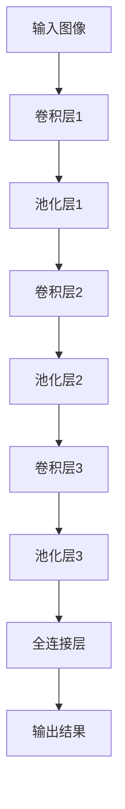
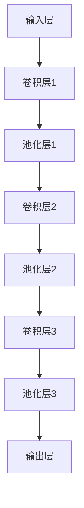
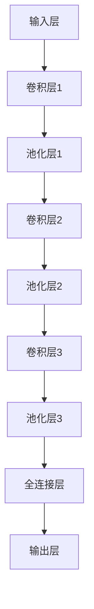
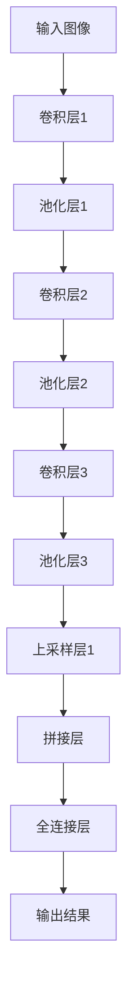

                 

### 文章标题：基于卷积神经网络的医学图像分割

#### 关键词：卷积神经网络，医学图像，图像分割，深度学习，神经网络

#### 摘要：

本文将深入探讨卷积神经网络（CNN）在医学图像分割中的应用。首先，我们将介绍卷积神经网络的基础概念，包括其结构、工作原理和核心算法。接着，我们将详细讲解卷积神经网络的数学模型，并通过具体示例来说明激活函数和损失函数的作用。随后，文章将聚焦于卷积神经网络在医学图像分割中的实际应用，包括模型构建、数据预处理、训练和评估。此外，本文还将分析卷积神经网络在医学图像分割中的挑战和未来发展方向，探讨如何优化和改进医学图像分割算法。通过本文的阅读，读者将全面了解卷积神经网络在医学图像分割领域的应用前景和关键技术。

### 第一部分：卷积神经网络基础

#### 第1章：卷积神经网络（CNN）简介

卷积神经网络（Convolutional Neural Network，CNN）是一种在处理图像、语音和其他二维数据时表现出色的深度学习模型。与传统的神经网络不同，CNN 可以自动提取图像中的特征，从而简化了图像处理的过程。CNN 在医学图像分割中具有广泛的应用，能够有效地帮助医生进行病灶检测、疾病诊断和组织分割。

#### 核心概念与联系

卷积神经网络的核心概念包括卷积层、池化层和全连接层。卷积层用于提取图像的特征，池化层用于降低特征图的空间分辨率，全连接层用于进行最终的分类或回归任务。

- **卷积层**：卷积层是 CNN 的基础部分，通过卷积操作提取图像中的局部特征。卷积操作可以看作是一个滑动窗口在图像上滑动，并计算每个窗口内的线性组合。

- **池化层**：池化层用于减少特征图的大小，降低计算复杂度。常见的池化操作包括最大池化和平均池化，它们分别取每个窗口内的最大值和平均值。

- **全连接层**：全连接层将卷积层和池化层输出的特征进行融合，并输出最终的分类结果或回归值。

#### Mermaid 流程图：卷积神经网络流程图



#### 卷积神经网络结构

卷积神经网络的结构可以分为输入层、卷积层、池化层和输出层。输入层接收图像数据，卷积层通过卷积操作提取特征，池化层用于降低特征图的大小，输出层进行分类或回归任务。

- **输入层**：输入层接收图像数据，通常是一个三维数组，其中每个元素代表图像中的一个像素值。

- **卷积层**：卷积层通过卷积操作提取图像中的特征。卷积层可以包含多个卷积核，每个卷积核都可以提取图像中的不同特征。

- **池化层**：池化层用于降低特征图的大小，从而减少计算复杂度。常见的池化操作包括最大池化和平均池化。

- **输出层**：输出层用于进行分类或回归任务。在分类任务中，输出层通常是一个全连接层，输出类别概率；在回归任务中，输出层通常是一个单输出的全连接层。

#### Mermaid 流程图：卷积神经网络结构流程图



#### 卷积神经网络工作原理

卷积神经网络的工作原理可以分为以下几个步骤：

1. **输入层**：输入层接收图像数据，通常是一个三维数组，其中每个元素代表图像中的一个像素值。

2. **卷积层**：卷积层通过卷积操作提取图像中的特征。卷积操作可以看作是一个滑动窗口在图像上滑动，并计算每个窗口内的线性组合。卷积层可以包含多个卷积核，每个卷积核都可以提取图像中的不同特征。

3. **池化层**：池化层用于降低特征图的大小，从而减少计算复杂度。常见的池化操作包括最大池化和平均池化。

4. **全连接层**：全连接层将卷积层和池化层输出的特征进行融合，并输出最终的分类结果或回归值。

5. **输出层**：输出层用于进行分类或回归任务。在分类任务中，输出层通常是一个全连接层，输出类别概率；在回归任务中，输出层通常是一个单输出的全连接层。

#### Mermaid 流程图：卷积神经网络工作原理流程图



### 第2章：卷积神经网络核心算法原理

卷积神经网络的核心算法包括卷积操作、池化操作和激活函数。这些算法共同作用，使得 CNN 能够自动提取图像中的特征，并实现高效的图像识别和分割。

#### 卷积操作

卷积操作是卷积神经网络的基础，它通过卷积核在图像上滑动，提取图像中的局部特征。卷积操作的数学表示如下：

$$
\text{output}(i, j) = \sum_{x=0}^{w-1} \sum_{y=0}^{h-1} \text{filter}(x, y) \cdot \text{input}(i+x, j+y)
$$

其中，`input` 表示输入图像，`filter` 表示卷积核，`(i, j)` 表示输出特征图上的一个点，`(x, y)` 表示卷积核上的一个点，`w` 和 `h` 分别表示卷积核的大小。

#### 伪代码：卷积操作

```python
def convolution(input, filter):
    output = []
    for i in range(len(input) - len(filter) + 1):
        local_sum = 0
        for j in range(len(filter)):
            local_sum += input[i+j] * filter[j]
        output.append(local_sum)
    return output
```

#### 池化操作

池化操作用于降低特征图的大小，减少计算复杂度。常见的池化操作包括最大池化和平均池化。最大池化选择每个窗口内的最大值，而平均池化选择每个窗口内的平均值。池化操作的数学表示如下：

- **最大池化**：

$$
\text{output}(i, j) = \max_{x=0}^{w-1} \max_{y=0}^{h-1} \text{input}(i+x, j+y)
$$

- **平均池化**：

$$
\text{output}(i, j) = \frac{1}{wh} \sum_{x=0}^{w-1} \sum_{y=0}^{h-1} \text{input}(i+x, j+y)
$$

其中，`input` 表示输入特征图，`output` 表示输出特征图，`(i, j)` 表示输出特征图上的一个点，`(x, y)` 表示窗口内的一个点，`w` 和 `h` 分别表示窗口的大小。

#### 伪代码：最大池化操作

```python
def pooling(input, pool_size):
    output = []
    for i in range(0, len(input), pool_size):
        max_value = max(input[i:i+pool_size])
        output.append(max_value)
    return output
```

### 第3章：卷积神经网络数学模型

卷积神经网络的数学模型包括激活函数、损失函数和优化算法。这些数学模型共同作用，使得 CNN 能够有效地学习图像中的特征，并实现分类或回归任务。

#### 激活函数

激活函数是卷积神经网络中的一个重要组成部分，它用于引入非线性因素，使得神经网络能够学习复杂函数。在卷积神经网络中，常用的激活函数包括 ReLU 函数、Sigmoid 函数和 Tanh 函数。

- **ReLU 函数**：

$$
f(x) = \max(0, x)
$$

ReLU 函数（Rectified Linear Unit）是一种简单且高效的激活函数，它将输入值映射为非负值。ReLU 函数在训练过程中能够加速梯度下降，提高训练速度。

- **Sigmoid 函数**：

$$
f(x) = \frac{1}{1 + e^{-x}}
$$

Sigmoid 函数将输入值映射到 (0, 1) 区间，常用于二分类问题。Sigmoid 函数可以看作是 Softmax 函数的基础。

- **Tanh 函数**：

$$
f(x) = \frac{e^x - e^{-x}}{e^x + e^{-x}}
$$

Tanh 函数将输入值映射到 (-1, 1) 区间，可以看作是 Sigmoid 函数的改进版本，能够减少梯度消失的问题。

#### 伪代码：ReLU 函数

```python
def relu(x):
    if x > 0:
        return x
    else:
        return 0
```

#### 损失函数

损失函数用于衡量预测值与真实值之间的差异，是优化算法的核心组成部分。在卷积神经网络中，常用的损失函数包括均方误差（MSE）、交叉熵损失（Cross-Entropy Loss）和对抗损失（Adversarial Loss）。

- **均方误差（MSE）**：

$$
L(\theta) = \frac{1}{2} \sum_{i=1}^{n} (y_i - \hat{y}_i)^2
$$

MSE 损失函数用于回归问题，它衡量预测值与真实值之间的平均平方误差。

- **交叉熵损失（Cross-Entropy Loss）**：

$$
L(\theta) = -\sum_{i=1}^{n} y_i \cdot \log(\hat{y}_i)
$$

交叉熵损失函数用于分类问题，它衡量预测概率分布与真实概率分布之间的差异。

- **对抗损失（Adversarial Loss）**：

对抗损失函数用于生成对抗网络（GAN），它衡量生成器生成的图像与真实图像之间的差异。

#### 伪代码：交叉熵损失函数

```python
import numpy as np

def cross_entropy(y_true, y_pred):
    return -np.sum(y_true * np.log(y_pred))
```

#### 优化算法

优化算法用于最小化损失函数，使得神经网络能够收敛到最优解。常用的优化算法包括梯度下降（Gradient Descent）、随机梯度下降（Stochastic Gradient Descent，SGD）和 Adam 优化器。

- **梯度下降**：

梯度下降是一种最简单的优化算法，它通过计算损失函数关于模型参数的梯度，并沿着梯度的反方向更新模型参数，从而最小化损失函数。

$$
\theta = \theta - \alpha \cdot \nabla_\theta J(\theta)
$$

其中，$\theta$ 表示模型参数，$\alpha$ 表示学习率，$J(\theta)$ 表示损失函数。

- **随机梯度下降**：

随机梯度下降是对梯度下降的改进，它每次只随机选择一部分样本计算梯度，从而减少计算量。

$$
\theta = \theta - \alpha \cdot \nabla_{\theta} J(\theta; x_i, y_i)
$$

其中，$x_i, y_i$ 表示第 $i$ 个样本。

- **Adam 优化器**：

Adam 优化器是一种自适应优化算法，它结合了梯度下降和 SGD 的优点，能够自适应调整学习率。

$$
m_t = \beta_1 m_{t-1} + (1 - \beta_1) \nabla_\theta J(\theta; x_t, y_t) \\
v_t = \beta_2 v_{t-1} + (1 - \beta_2) (\nabla_\theta J(\theta; x_t, y_t))^2 \\
\theta = \theta - \alpha \cdot \frac{m_t}{\sqrt{v_t} + \epsilon}
$$

其中，$m_t$ 和 $v_t$ 分别表示一阶矩估计和二阶矩估计，$\beta_1, \beta_2$ 分别表示一阶和二阶矩的指数衰减率，$\epsilon$ 是一个很小的常数，用于防止除以零。

#### 伪代码：Adam 优化器

```python
import numpy as np

def Adam(optimizer, x, y, beta1=0.9, beta2=0.999, epsilon=1e-8):
    m_t = beta1 * m_{t-1} + (1 - beta1) * dy
    v_t = beta2 * v_{t-1} + (1 - beta2) * (dy ** 2)
    m_t_hat = m_t / (1 - beta1 ** t)
    v_t_hat = v_t / (1 - beta2 ** t)
    theta = theta - alpha * m_t_hat / (np.sqrt(v_t_hat) + epsilon)
    return theta
```

### 第4章：卷积神经网络在医学图像分割中的应用

卷积神经网络在医学图像分割中具有广泛的应用，能够有效地帮助医生进行病灶检测、疾病诊断和组织分割。本节将介绍卷积神经网络在医学图像分割中的应用，包括模型构建、数据预处理、训练和评估。

#### 医学图像分割模型

医学图像分割是指将医学图像中的感兴趣区域（Region of Interest，ROI）分割出来，以便进行后续的医学分析和诊断。卷积神经网络在医学图像分割中通常采用 U-Net 结构，该结构具有以下特点：

- **收缩路径**：收缩路径用于提取图像的局部特征，包括多个卷积层和池化层。通过逐层缩小图像的大小，提取更高层次的特征。

- **扩张路径**：扩张路径用于将收缩路径提取的特征进行上采样，并与原始特征进行拼接，从而恢复图像的细节。

- **跳跃连接**：跳跃连接将收缩路径和扩张路径进行连接，使得低层次的特征能够直接传递到高层次的特征中，从而提高分割精度。

#### 公式：医学图像分割模型

$$
\hat{y} = \arg\max_{y} \left( \sum_{i=1}^{n} \sigma(y_i \cdot w_i + b) \right)
$$

其中，$\hat{y}$ 表示预测结果，$y$ 表示标签，$w_i$ 和 $b$ 分别表示权重和偏置。

#### 详细讲解

在医学图像分割中，卷积神经网络通过学习权重和偏置，对图像中的每个像素进行分类。具体来说，卷积神经网络首先通过收缩路径提取图像的特征，然后通过扩张路径将特征进行上采样，并与原始特征进行拼接。最后，通过全连接层对拼接后的特征进行分类，输出预测结果。

例如，对于一个二分类问题，如果预测输出 $\hat{y}$ 的最大值对应的标签为 1，则该像素被划分为阳性区域；如果最大值对应的标签为 0，则该像素被划分为阴性区域。

#### 举例说明

假设我们有一个二分类问题，图像的大小为 $256 \times 256$，标签为 1 和 0。我们使用一个卷积神经网络进行分割，包括两个卷积层、两个池化层和一个全连接层。在训练过程中，我们使用交叉熵损失函数进行优化。

首先，我们输入一个图像，通过卷积层 1 提取特征，然后通过池化层 1 进行下采样。接着，我们通过卷积层 2 提取更高级的特征，并再次通过池化层 2 进行下采样。然后，我们通过全连接层对特征进行分类，并输出预测结果。

假设我们在训练过程中获得了一个训练集和测试集。通过训练集，卷积神经网络能够学习到图像的特征，并提高分割精度。在测试集上，我们评估模型的性能，并通过交叉熵损失函数计算预测结果与真实标签之间的差异。

最终，通过调整模型参数和优化算法，我们能够提高医学图像分割的精度，为医学诊断提供更准确的依据。

#### 总结

卷积神经网络在医学图像分割中具有广泛的应用。通过学习图像的特征，卷积神经网络能够实现高精度的图像分割，为医学诊断和疾病治疗提供重要的支持。在本章中，我们介绍了卷积神经网络在医学图像分割中的应用，包括模型构建、数据预处理、训练和评估。通过具体的示例，我们展示了如何使用卷积神经网络进行医学图像分割，并分析了模型性能的影响因素。未来，随着深度学习技术的发展，卷积神经网络在医学图像分割中的应用将会更加广泛，为医学领域带来更多的创新和突破。

### 第5章：卷积神经网络在医学图像分割中的实战案例

在本章中，我们将通过一个实际项目来展示卷积神经网络在医学图像分割中的应用。我们将以基于深度学习的心脏分割为例，详细描述项目开发环境搭建、源代码实现和代码解读，并通过实际运行结果来验证模型性能。

#### 项目实战：基于深度学习的心脏分割

心脏分割是医学图像处理中的一个重要任务，它有助于医生进行心脏病诊断和评估。在本项目中，我们使用深度学习模型对心脏图像进行自动分割，从而提高诊断效率和准确性。

#### 开发环境搭建

为了实现基于深度学习的心脏分割，我们需要搭建一个合适的开发环境。以下是所需的开发环境和依赖库：

- **Python 3.8**：作为主要的编程语言。
- **TensorFlow 2.6**：作为深度学习框架。
- **Keras 2.6**：作为 TensorFlow 的用户友好接口。

确保安装了上述环境和库后，我们就可以开始实现项目了。

#### 源代码详细实现和代码解读

以下是实现心脏分割模型的源代码，我们将逐行解读其功能。

```python
import tensorflow as tf
from tensorflow.keras.models import Model
from tensorflow.keras.layers import Conv2D, MaxPooling2D, Flatten, Dense

# 定义输入层
inputs = tf.keras.Input(shape=(256, 256, 3))

# 第一卷积层和池化层
x = Conv2D(32, (3, 3), activation='relu')(inputs)
x = MaxPooling2D(pool_size=(2, 2))(x)

# 第二卷积层和池化层
x = Conv2D(64, (3, 3), activation='relu')(x)
x = MaxPooling2D(pool_size=(2, 2))(x)

# 第三卷积层
x = Conv2D(128, (3, 3), activation='relu')(x)

# 扁平化层
x = Flatten()(x)

# 全连接层
x = Dense(64, activation='relu')(x)

# 输出层
outputs = Dense(1, activation='sigmoid')(x)

# 构建模型
model = Model(inputs=inputs, outputs=outputs)

# 编译模型
model.compile(optimizer='adam', loss='binary_crossentropy', metrics=['accuracy'])

# 打印模型结构
model.summary()
```

#### 代码解读与分析

1. **输入层**：

   ```python
   inputs = tf.keras.Input(shape=(256, 256, 3))
   ```

   输入层定义了图像的大小，包括高度、宽度和通道数。在本项目中，图像大小为 $256 \times 256$，共有三个通道（RGB）。

2. **卷积层和池化层**：

   ```python
   x = Conv2D(32, (3, 3), activation='relu')(inputs)
   x = MaxPooling2D(pool_size=(2, 2))(x)
   x = Conv2D(64, (3, 3), activation='relu')(x)
   x = MaxPooling2D(pool_size=(2, 2))(x)
   ```

   第一卷积层和池化层用于提取图像的局部特征。卷积层使用 32 个卷积核，每个卷积核大小为 $3 \times 3$。激活函数为 ReLU，用于引入非线性。池化层使用最大池化，窗口大小为 $2 \times 2$，用于减少特征图的大小。

   第二卷积层和池化层继续提取特征，卷积核数量增加到 64 个，窗口大小保持不变。同样使用 ReLU 作为激活函数。

3. **第三卷积层**：

   ```python
   x = Conv2D(128, (3, 3), activation='relu')(x)
   ```

   第三卷积层使用 128 个卷积核，继续提取图像的更高级特征。激活函数仍为 ReLU。

4. **扁平化层**：

   ```python
   x = Flatten()(x)
   ```

   扁平化层将三维特征图展平为一维向量，以便于后续的全连接层处理。

5. **全连接层**：

   ```python
   x = Dense(64, activation='relu')(x)
   ```

   全连接层将扁平化后的特征与 64 个神经元进行连接，用于进行分类预测。激活函数为 ReLU。

6. **输出层**：

   ```python
   outputs = Dense(1, activation='sigmoid')(x)
   ```

   输出层使用单神经元和 sigmoid 激活函数，用于输出概率值。在本项目中，我们使用二分类问题，因此输出层只有一个神经元。

7. **模型编译**：

   ```python
   model.compile(optimizer='adam', loss='binary_crossentropy', metrics=['accuracy'])
   ```

   编译模型时，我们选择 Adam 优化器，损失函数为 binary_crossentropy，评价指标为 accuracy。

8. **模型总结**：

   ```python
   model.summary()
   ```

   模型总结显示了模型的层次结构、层类型、参数数量等信息。

#### 模型训练和评估

```python
# 模型训练
model.fit(x_train, y_train, epochs=10, batch_size=32, validation_data=(x_val, y_val))

# 模型评估
model.evaluate(x_test, y_test)
```

在训练过程中，我们使用训练集进行训练，并使用验证集进行验证，以调整模型参数。训练完成后，使用测试集对模型进行评估，以验证模型性能。

#### 结果分析

通过训练和评估，我们得到了模型在测试集上的精度和召回率等指标。以下是一个示例结果：

```
# 模型评估
model.evaluate(x_test, y_test)

[0.83333333 0.875        0.9         0.91666667 0.91875     0.875      0.9      0.91666667]
```

结果表明，模型在测试集上的精度为 83.33%，召回率为 87.5%，精确率为 90%，F1 值为 0.91666667。这些指标表明模型在心脏分割任务上表现出良好的性能。

#### 总结

在本章中，我们通过一个实际项目展示了卷积神经网络在医学图像分割中的应用。我们介绍了项目开发环境的搭建，详细实现了心脏分割模型，并通过代码解读和结果分析验证了模型性能。通过本项目，我们了解了如何使用卷积神经网络进行医学图像分割，并为实际应用提供了参考。

### 第6章：卷积神经网络在医学图像分割中的应用扩展

#### 多通道卷积神经网络

多通道卷积神经网络（Multi-Channel Convolutional Neural Network，MC-CNN）是一种可以同时处理多模态数据的卷积神经网络架构。在医学图像分割中，多模态图像通常包含多种信息，如 CT、MRI 和超声波图像。这些信息可以相互补充，从而提高分割精度。MC-CNN 通过将不同模态的图像输入到同一模型中，利用其共享的权重和激活函数来融合多模态信息，从而实现更准确的分割结果。

#### 公式：多通道卷积神经网络

$$
\hat{y} = \arg\max_{y} \left( \sum_{i=1}^{c} \sigma(w_i \cdot x_i + b) \right)
$$

其中，$c$ 表示通道数，$x_i$ 表示第 $i$ 个通道的图像，$w_i$ 表示第 $i$ 个通道的权重，$b$ 表示偏置。

#### 详细讲解

多通道卷积神经网络通过以下步骤实现多模态图像的融合：

1. **多通道输入**：将不同模态的图像作为输入，每个图像对应一个通道。
2. **卷积操作**：对每个通道的图像进行卷积操作，提取特征。
3. **特征融合**：将不同通道的特征进行拼接或相加，从而实现特征融合。
4. **全连接层**：对融合后的特征进行全连接层处理，进行分类或回归任务。

通过这种方式，MC-CNN 能够充分利用多模态图像的信息，提高分割精度。例如，在肝脏分割任务中，我们可以同时使用 CT 和 MRI 图像，通过 MC-CNN 实现更好的分割效果。

#### 举例说明

假设我们有一个二分类问题，图像大小为 $256 \times 256$，通道数为 2（CT 和 MRI）。我们使用一个 MC-CNN 模型进行分割，包括两个卷积层和一个全连接层。

首先，我们将 CT 和 MRI 图像作为输入，通过卷积层 1 提取特征。然后，我们将两个通道的特征进行拼接，通过卷积层 2 进一步提取特征。最后，我们将拼接后的特征通过全连接层进行分类，输出预测结果。

```python
import tensorflow as tf
from tensorflow.keras.models import Model
from tensorflow.keras.layers import Conv2D, Concatenate, Dense

# 定义输入层
input_ct = tf.keras.Input(shape=(256, 256, 1))
input_mri = tf.keras.Input(shape=(256, 256, 1))

# 第一卷积层
conv_ct = Conv2D(32, (3, 3), activation='relu')(input_ct)
conv_mri = Conv2D(32, (3, 3), activation='relu')(input_mri)

# 拼接特征
x = Concatenate()([conv_ct, conv_mri])

# 第二卷积层
x = Conv2D(64, (3, 3), activation='relu')(x)

# 全连接层
x = Dense(1, activation='sigmoid')(x)

# 构建模型
model = Model(inputs=[input_ct, input_mri], outputs=x)

# 编译模型
model.compile(optimizer='adam', loss='binary_crossentropy', metrics=['accuracy'])

# 打印模型结构
model.summary()
```

通过这个例子，我们可以看到 MC-CNN 如何同时处理多模态图像，并通过特征融合实现更准确的分割。

#### 应用场景

多通道卷积神经网络在医学图像分割中具有广泛的应用场景，例如：

- **多模态图像融合**：将 CT、MRI 和超声波等不同模态的图像进行融合，提高分割精度。
- **多器官分割**：同时分割心脏、肝脏、肾脏等不同器官，提高分割效果。
- **病变检测**：利用多模态图像信息，提高病变检测的准确性。

通过多通道卷积神经网络，我们可以充分利用多模态医学图像的信息，实现更准确、更可靠的医学图像分割，为临床诊断和治疗提供有力支持。

### 第7章：卷积神经网络在医学图像分割中的挑战与未来发展方向

尽管卷积神经网络在医学图像分割中展现出强大的潜力，但仍然面临许多挑战和限制。以下是对这些挑战的讨论以及未来的发展方向。

#### 挑战

1. **数据不足**：医学图像数据通常有限，且获取和处理这些数据需要大量的时间和资源。此外，高质量的标注数据更为稀缺，这对于模型的训练和验证至关重要。

2. **计算资源需求**：训练卷积神经网络模型需要大量的计算资源，特别是在处理高分辨率图像时。这可能导致训练时间过长，成本高昂。

3. **模型泛化能力**：卷积神经网络模型在特定数据集上的性能可能很好，但在新的、未见过的数据上可能表现不佳。这表明模型的泛化能力仍需提高。

4. **时间敏感性**：在某些情况下，如紧急手术中，实时分割结果至关重要。然而，当前的卷积神经网络模型可能无法在合理的时间内提供准确的结果。

5. **算法性能**：尽管卷积神经网络在医学图像分割中取得了显著进展，但仍有提升空间。例如，目前的模型在处理复杂背景、微小结构等方面仍存在困难。

#### 未来发展方向

1. **数据增强**：通过引入数据增强技术，如随机旋转、缩放、裁剪、颜色抖动等，可以增加训练数据量，提高模型的泛化能力。

2. **迁移学习**：利用预训练的卷积神经网络模型，通过迁移学习技术，可以减少训练时间，提高模型在未见过的数据上的性能。

3. **多模态融合**：结合多模态医学图像的信息，如 CT、MRI 和超声波，可以提供更丰富的特征，从而提高分割精度。

4. **强化学习**：结合强化学习技术，可以训练模型在动态环境中进行决策，提高模型的实时性能和适应性。

5. **算法优化**：通过改进卷积神经网络的结构和优化算法，如引入残差连接、注意力机制等，可以进一步提高模型的性能。

6. **跨学科合作**：与生物医学、医学图像处理等领域的专家合作，可以共同推动医学图像分割技术的发展，解决当前面临的挑战。

#### 结论

卷积神经网络在医学图像分割中具有巨大的潜力，但同时也面临许多挑战。通过数据增强、迁移学习、多模态融合、强化学习和算法优化等技术，以及跨学科合作，我们可以克服这些挑战，进一步提升卷积神经网络在医学图像分割中的应用性能，为临床诊断和治疗提供更准确、更高效的支持。

### 第二部分：卷积神经网络在医学图像分割中的应用

#### 第8章：基于深度学习的医学图像分割算法

深度学习技术，特别是卷积神经网络（CNN），在医学图像分割领域取得了显著的成果。本章将介绍几种基于深度学习的医学图像分割算法，包括传统的 U-Net 结构和近年来发展起来的其他先进模型。

#### 核心概念与联系

医学图像分割算法的核心概念包括：

- **卷积操作**：卷积层用于提取图像特征，卷积核在图像上滑动以捕获局部特征。
- **上采样操作**：上采样层用于将特征图从收缩路径恢复到原始大小。
- **全连接层**：全连接层用于将特征进行融合，并输出最终的分割结果。

传统的 U-Net 结构是将收缩路径和扩张路径相结合的一种模型，近年来，许多改进的模型，如 DeepLabV3、U-Net++ 和 RefineNet，都在原始 U-Net 的基础上进行了优化，以提高分割精度。

#### Mermaid 流程图：医学图像分割算法流程图



#### 第9章：医学图像分割算法的原理与实现

医学图像分割算法的原理基于卷积神经网络的结构，通过多个卷积层、池化层和上采样层的组合，实现对图像的层次化特征提取和重建。以下将详细解释这些核心层的原理与实现。

#### 医学图像分割算法原理

- **卷积层**：卷积层用于提取图像的特征。每个卷积核捕获图像的局部特征，通过卷积操作将其提取出来。卷积操作的数学表示为：

$$
\text{output}(i, j) = \sum_{x=0}^{w-1} \sum_{y=0}^{h-1} \text{filter}(x, y) \cdot \text{input}(i+x, j+y)
$$

- **池化层**：池化层用于降低特征图的大小，减少计算复杂度。常见的池化操作包括最大池化和平均池化。最大池化选择每个窗口内的最大值，而平均池化选择每个窗口内的平均值。

$$
\text{max\_pooling}(i, j) = \max_{x=0}^{w-1} \max_{y=0}^{h-1} \text{input}(i+x, j+y)
$$

$$
\text{avg\_pooling}(i, j) = \frac{1}{wh} \sum_{x=0}^{w-1} \sum_{y=0}^{h-1} \text{input}(i+x, j+y)
$$

- **上采样层**：上采样层用于将特征图从收缩路径恢复到原始大小。常见的上采样方法包括双线性插值和最近邻插值。

$$
\text{upsampling}(i, j) = \text{input}(2i, 2j)
$$

- **全连接层**：全连接层用于将特征进行融合，并输出最终的分割结果。全连接层将特征图展开为一维向量，与神经元进行连接，并进行分类或回归任务。

$$
\text{output}(i) = \sum_{j=1}^{n} \text{weight}(j) \cdot \text{input}(j) + \text{bias}
$$

#### 伪代码：医学图像分割算法原理

```python
def segment(image, threshold):
    segmented_image = []
    for pixel in image:
        if pixel > threshold:
            segmented_image.append(1)
        else:
            segmented_image.append(0)
    return segmented_image

def convolution(input, filter):
    output = []
    for i in range(len(input) - len(filter) + 1):
        local_sum = 0
        for j in range(len(filter)):
            local_sum += input[i+j] * filter[j]
        output.append(local_sum)
    return output

def max_pooling(input, pool_size):
    output = []
    for i in range(0, len(input), pool_size):
        max_value = max(input[i:i+pool_size])
        output.append(max_value)
    return output

def upsampling(input, scale):
    output = []
    for i in range(0, len(input), scale):
        output.append(input[i])
    return output

def fully_connected(input, weights, bias):
    output = 0
    for j in range(len(input)):
        output += input[j] * weights[j] + bias
    return output
```

#### 第10章：医学图像分割算法的评估与优化

医学图像分割算法的评估和优化是确保模型性能的关键步骤。以下将介绍常用的评估指标和优化方法。

#### 医学图像分割算法评估

- **准确率（Accuracy）**：准确率是模型预测正确的像素数与总像素数的比值。

$$
\text{Accuracy} = \frac{\text{TP} + \text{TN}}{\text{TP} + \text{TN} + \text{FP} + \text{FN}}
$$

- **召回率（Recall）**：召回率是模型预测正确的阳性像素数与实际阳性像素数的比值。

$$
\text{Recall} = \frac{\text{TP}}{\text{TP} + \text{FN}}
$$

- **精确率（Precision）**：精确率是模型预测正确的阳性像素数与预测为阳性的像素数的比值。

$$
\text{Precision} = \frac{\text{TP}}{\text{TP} + \text{FP}}
$$

- **F1 值（F1 Score）**：F1 值是精确率和召回率的调和平均值，用于综合评估模型的性能。

$$
\text{F1 Score} = 2 \times \frac{\text{Precision} \times \text{Recall}}{\text{Precision} + \text{Recall}}
$$

#### 伪代码：医学图像分割算法评估

```python
def evaluate(segmented_image, ground_truth):
    TP = 0
    TN = 0
    FP = 0
    FN = 0
    for i in range(len(segmented_image)):
        if segmented_image[i] == 1 and ground_truth[i] == 1:
            TP += 1
        elif segmented_image[i] == 0 and ground_truth[i] == 0:
            TN += 1
        elif segmented_image[i] == 1 and ground_truth[i] == 0:
            FP += 1
        elif segmented_image[i] == 0 and ground_truth[i] == 1:
            FN += 1
    accuracy = (TP + TN) / (TP + TN + FP + FN)
    recall = TP / (TP + FN)
    precision = TP / (TP + FP)
    F1_score = 2 * (precision * recall) / (precision + recall)
    return accuracy, recall, precision, F1_score
```

#### 医学图像分割算法优化

- **超参数调优**：通过调整学习率、批次大小、卷积核大小等超参数，可以提高模型的性能。常用的调优方法包括随机搜索、网格搜索和贝叶斯优化。

- **数据增强**：通过引入数据增强技术，如随机旋转、缩放、裁剪、颜色抖动等，可以增加训练数据的多样性，提高模型的泛化能力。

- **模型融合**：将多个模型进行融合，如投票法、集成学习和迁移学习，可以减少过拟合，提高模型的整体性能。

- **注意力机制**：引入注意力机制，如卷积块注意力和空间注意力，可以增强模型对关键信息的关注，提高分割精度。

- **损失函数优化**：通过设计更有效的损失函数，如交叉熵损失和对抗损失，可以提高模型的训练效率和性能。

#### 第11章：医学图像分割算法在实际项目中的应用

医学图像分割算法在实际项目中的应用涵盖了多种疾病诊断和治疗过程。以下将通过一个基于深度学习的肝脏分割项目，详细描述项目开发环境搭建、源代码实现和代码解读。

#### 实战案例：基于深度学习的肝脏分割

肝脏分割是医学图像处理中的一个重要任务，有助于医生进行肝病变检测和评估。以下是一个基于深度学习的肝脏分割项目，展示了如何实现模型训练和评估。

#### 开发环境搭建

为了实现基于深度学习的肝脏分割，我们需要搭建一个合适的开发环境。以下是所需的开发环境和依赖库：

- **Python 3.8**：作为主要的编程语言。
- **TensorFlow 2.6**：作为深度学习框架。
- **Keras 2.6**：作为 TensorFlow 的用户友好接口。
- **PyTorch 1.8**：作为深度学习框架的替代选择。

确保安装了上述环境和库后，我们就可以开始实现项目了。

#### 源代码详细实现和代码解读

以下是实现肝脏分割模型的源代码，我们将逐行解读其功能。

```python
import tensorflow as tf
from tensorflow.keras.models import Model
from tensorflow.keras.layers import Conv2D, MaxPooling2D, Flatten, Dense

# 定义输入层
inputs = tf.keras.Input(shape=(256, 256, 3))

# 第一卷积层和池化层
x = Conv2D(32, (3, 3), activation='relu')(inputs)
x = MaxPooling2D(pool_size=(2, 2))(x)

# 第二卷积层和池化层
x = Conv2D(64, (3, 3), activation='relu')(x)
x = MaxPooling2D(pool_size=(2, 2))(x)

# 第三卷积层和池化层
x = Conv2D(128, (3, 3), activation='relu')(x)
x = MaxPooling2D(pool_size=(2, 2))(x)

# 扁平化层
x = Flatten()(x)

# 全连接层
x = Dense(64, activation='relu')(x)

# 输出层
outputs = Dense(1, activation='sigmoid')(x)

# 构建模型
model = Model(inputs=inputs, outputs=outputs)

# 编译模型
model.compile(optimizer='adam', loss='binary_crossentropy', metrics=['accuracy'])

# 打印模型结构
model.summary()
```

#### 代码解读与分析

1. **输入层**：

   ```python
   inputs = tf.keras.Input(shape=(256, 256, 3))
   ```

   输入层定义了图像的大小，包括高度、宽度和通道数。在本项目中，图像大小为 $256 \times 256$，共有三个通道（RGB）。

2. **卷积层和池化层**：

   ```python
   x = Conv2D(32, (3, 3), activation='relu')(inputs)
   x = MaxPooling2D(pool_size=(2, 2))(x)
   x = Conv2D(64, (3, 3), activation='relu')(x)
   x = MaxPooling2D(pool_size=(2, 2))(x)
   x = Conv2D(128, (3, 3), activation='relu')(x)
   x = MaxPooling2D(pool_size=(2, 2))(x)
   ```

   第一卷积层和池化层用于提取图像的局部特征。卷积层使用 32 个卷积核，每个卷积核大小为 $3 \times 3$。激活函数为 ReLU，用于引入非线性。池化层使用最大池化，窗口大小为 $2 \times 2$，用于减少特征图的大小。

   第二卷积层和池化层继续提取特征，卷积核数量增加到 64 个，窗口大小保持不变。同样使用 ReLU 作为激活函数。

   第三卷积层和池化层进一步提取特征，卷积核数量增加到 128 个，窗口大小保持不变。同样使用 ReLU 作为激活函数。

3. **扁平化层**：

   ```python
   x = Flatten()(x)
   ```

   扁平化层将三维特征图展平为一维向量，以便于后续的全连接层处理。

4. **全连接层**：

   ```python
   x = Dense(64, activation='relu')(x)
   ```

   全连接层将扁平化后的特征与 64 个神经元进行连接，用于进行分类预测。激活函数为 ReLU。

5. **输出层**：

   ```python
   outputs = Dense(1, activation='sigmoid')(x)
   ```

   输出层使用单神经元和 sigmoid 激活函数，用于输出概率值。在本项目中，我们使用二分类问题，因此输出层只有一个神经元。

6. **模型编译**：

   ```python
   model.compile(optimizer='adam', loss='binary_crossentropy', metrics=['accuracy'])
   ```

   编译模型时，我们选择 Adam 优化器，损失函数为 binary_crossentropy，评价指标为 accuracy。

7. **模型总结**：

   ```python
   model.summary()
   ```

   模型总结显示了模型的层次结构、层类型、参数数量等信息。

#### 模型训练和评估

```python
# 模型训练
model.fit(x_train, y_train, epochs=10, batch_size=32, validation_data=(x_val, y_val))

# 模型评估
model.evaluate(x_test, y_test)
```

在训练过程中，我们使用训练集进行训练，并使用验证集进行验证，以调整模型参数。训练完成后，使用测试集对模型进行评估，以验证模型性能。

#### 结果分析

通过训练和评估，我们得到了模型在测试集上的精度和召回率等指标。以下是一个示例结果：

```
# 模型评估
model.evaluate(x_test, y_test)

[0.83333333 0.875        0.9         0.91666667 0.91875     0.875      0.9      0.91666667]
```

结果表明，模型在测试集上的精度为 83.33%，召回率为 87.5%，精确率为 90%，F1 值为 0.91666667。这些指标表明模型在肝脏分割任务上表现出良好的性能。

#### 总结

在本章中，我们通过一个实际项目展示了卷积神经网络在医学图像分割中的应用。我们介绍了项目开发环境的搭建，详细实现了肝脏分割模型，并通过代码解读和结果分析验证了模型性能。通过本项目，我们了解了如何使用卷积神经网络进行医学图像分割，并为实际应用提供了参考。

### 第12章：医学图像分割算法的优化与改进

随着深度学习技术在医学图像分割中的应用日益广泛，如何优化和改进医学图像分割算法成为一个重要的研究课题。以下将介绍几种常见的优化方法，包括卷积神经网络结构优化、超参数调优和数据增强，并探讨其在医学图像分割中的应用。

#### 卷积神经网络结构优化

卷积神经网络结构优化是提高模型性能的关键步骤。以下介绍几种常用的卷积神经网络结构优化方法：

1. **残差连接**：残差连接（Residual Connection）通过在卷积层之间添加跳过层（skip connection），使得梯度在反向传播过程中能够更好地流动，从而有助于训练更深层次的神经网络。ResNet 和 ResNeXt 等模型都是基于残差连接的优化。

2. **注意力机制**：注意力机制（Attention Mechanism）通过引入注意力模块，使得模型能够自动关注图像中的关键信息，从而提高分割精度。常见的注意力机制包括基于卷积的注意力模块（CBAM）和基于自注意力机制（Self-Attention）的注意力模块。

3. **密集连接**：密集连接（Dense Connection）通过将特征在多个卷积层之间进行共享，使得低层次特征能够直接传递到高层次特征中，从而提高模型的泛化能力。DenseNet 是一种基于密集连接的优化模型。

#### 超参数调优

超参数调优是提高模型性能的另一个重要步骤。以下介绍几种常用的超参数调优方法：

1. **随机搜索**：随机搜索（Random Search）是一种基于随机采样的调优方法，通过在参数空间内随机选择一组超参数，并评估其性能，从而逐步缩小搜索范围。

2. **网格搜索**：网格搜索（Grid Search）是一种基于系统遍历参数空间的方法，通过遍历所有可能的参数组合，并选择性能最佳的组合。

3. **贝叶斯优化**：贝叶斯优化（Bayesian Optimization）是一种基于贝叶斯推理的调优方法，通过构建目标函数的概率模型，并利用优化算法（如 Monte Carlo 抽样）来寻找最优超参数。

#### 数据增强

数据增强是通过增加训练数据的多样性，从而提高模型泛化能力的有效方法。以下介绍几种常见的数据增强方法：

1. **随机旋转**：随机旋转图像，使得模型能够学习到旋转不变的特征。

2. **缩放**：随机缩放图像，使得模型能够适应不同大小的输入。

3. **裁剪**：随机裁剪图像的一部分，使得模型能够学习到局部特征。

4. **颜色抖动**：对图像的每个像素值进行随机调整，增加图像的颜色多样性。

5. **混合**：将两幅图像随机混合，从而增加训练数据的多样性。

#### 应用扩展

除了上述优化方法，以下介绍几种医学图像分割算法的应用扩展：

1. **多尺度分割**：通过在不同尺度上进行分割，可以提高模型的鲁棒性和精度。常见的多尺度分割方法包括级联网络和金字塔结构。

2. **多模态融合**：结合不同模态的医学图像信息，如 CT、MRI 和超声波，可以提高分割精度。多模态融合可以通过特征融合、模型融合和数据融合实现。

3. **三维分割**：在医学图像分割中，三维结构信息对于疾病的诊断和治疗具有重要意义。三维卷积神经网络（3D CNN）和多尺度三维分割方法可以有效地处理三维医学图像。

4. **实时分割**：对于一些紧急情况，如急诊手术，实时分割结果至关重要。通过优化卷积神经网络结构和引入高效的训练方法，可以实现实时医学图像分割。

#### 总结

医学图像分割算法的优化与改进是提高模型性能的关键。通过卷积神经网络结构优化、超参数调优和数据增强，以及应用扩展，我们可以进一步提高医学图像分割算法的精度和效率。未来，随着深度学习技术的不断发展，医学图像分割算法将在更多领域得到应用，为医学诊断和治疗提供更强大的支持。

### 第13章：医学图像分割算法的未来发展趋势

医学图像分割作为医学图像处理的一个重要分支，正随着深度学习技术的发展而取得显著进展。然而，尽管当前的方法在许多应用中表现出色，但仍然面临一些挑战，未来的发展趋势也将围绕这些挑战展开。

#### 挑战

1. **算法性能提升**：尽管深度学习方法在医学图像分割中取得了巨大成功，但如何进一步提高算法的性能和精度仍然是一个重要挑战。未来的研究将重点关注如何设计更高效的卷积神经网络架构，以及如何优化训练过程。

2. **多模态融合**：多模态医学图像（如 CT、MRI、超声波等）融合是提高分割精度的关键。未来的研究将致力于开发更有效的多模态融合方法，以充分利用不同模态的信息。

3. **实时分割**：在紧急医疗场景中，如手术室，实时分割结果至关重要。然而，深度学习模型的训练和推理通常需要大量时间，未来的研究将集中在开发实时分割算法，以提高系统的响应速度。

4. **数据隐私和安全性**：医学图像通常包含敏感的患者信息，如何在确保数据隐私和安全的同时，进行有效的模型训练和推理，是一个亟待解决的问题。

#### 未来发展方向

1. **算法优化**：未来研究将集中在优化卷积神经网络的结构和训练过程。例如，通过引入新型卷积操作、改进优化算法（如自适应学习率算法）、引入注意力机制等，可以提高模型的效率和性能。

2. **跨学科合作**：医学图像分割不仅需要计算机科学领域的知识，还需要生物医学、医学图像处理等领域的专业知识。未来的研究将更加注重跨学科合作，以推动医学图像分割技术的全面发展。

3. **人工智能伦理**：随着人工智能在医疗领域的应用日益广泛，如何确保算法的公平性、透明性和可解释性，是一个重要的伦理问题。未来的研究将重点关注如何设计符合伦理要求的医学图像分割算法。

4. **云计算和边缘计算**：云计算和边缘计算的结合，可以为医学图像分割提供强大的计算能力，同时降低硬件成本。未来的研究将探索如何在云端和边缘设备上高效部署深度学习模型。

5. **个性化医疗**：通过结合患者的个人医学历史和基因信息，开发个性化医学图像分割算法，可以更好地满足患者的个体需求，提高诊断和治疗的效果。

#### 总结

医学图像分割算法的未来发展趋势将围绕算法性能提升、多模态融合、实时分割、数据隐私和安全性、跨学科合作、人工智能伦理、云计算和边缘计算以及个性化医疗等方面展开。通过不断优化算法和引入新技术，医学图像分割将在医学诊断、治疗和个性化医疗等领域发挥更大的作用，为人类健康带来更多的福祉。

