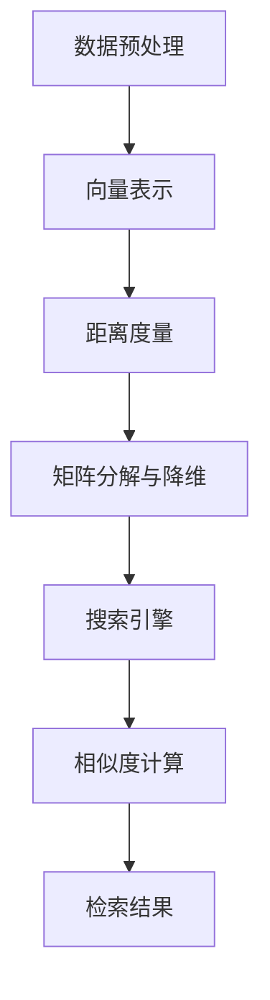
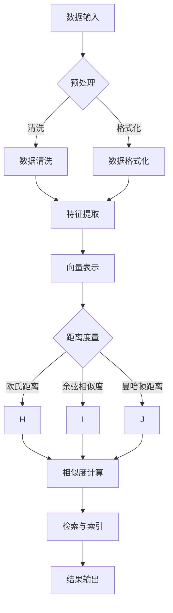

                 

### 文章标题

《基于向量数据库的反欺诈系统：防御金融犯罪》

> 关键词：向量数据库，反欺诈系统，金融犯罪，人工智能，数据分析

> 摘要：本文深入探讨了基于向量数据库构建反欺诈系统的技术和方法，通过详细分析向量数据库的工作原理及其在反欺诈领域的应用，阐述了一个完整的反欺诈系统架构设计，并提供了具体的算法原理讲解、数学模型与公式、实战案例与分析等内容。文章旨在为广大从事金融科技、网络安全及人工智能领域的技术人员提供理论与实践相结合的技术指导。

---

# 《基于向量数据库的反欺诈系统：防御金融犯罪》目录大纲

## 第一部分：引言与背景

### 1.1 书籍概述

- 本书目的与意义
- 反欺诈系统的重要性

### 1.2 金融犯罪与反欺诈

- 金融犯罪的定义与分类
- 反欺诈系统的需求与挑战

### 1.3 向量数据库简介

- 向量数据库的定义与原理
- 向量数据库在反欺诈领域的应用

## 第二部分：向量数据库基础

### 2.1 数据预处理

- 数据清洗与格式化
- 数据特征提取

### 2.2 向量表示与距离度量

- 向量空间建模
- 常见距离度量方法

### 2.3 向量数据库技术

- 矩阵分解与降维
- 搜索引擎与相似度计算

### 2.4 Mermaid 流程图：向量数据库核心概念与联系

- Mermaid 流程图示例

## 第三部分：反欺诈系统的设计与实现

### 3.1 反欺诈系统的架构设计

- 系统架构概述
- 模块功能与接口设计

### 3.2 核心算法原理讲解

- 伪代码：基于向量数据库的反欺诈算法
- 详细讲解：算法原理与应用场景

### 3.3 数学模型与数学公式

- \(L_2\) 范数与相似度计算
- \(L_1\) 范数与稀疏性

### 3.4 项目实战：构建反欺诈系统

- 实战案例：反欺诈系统的搭建与部署
- 详细解释说明：代码实现与分析

### 3.5 开发环境搭建

- 工具与库：所需的编程语言、框架和工具
- 环境配置：操作系统、依赖库安装与配置

## 第四部分：实战案例与应用

### 4.1 实战案例一：信用卡欺诈检测

- 源代码实现：信用卡交易数据的预处理与特征提取
- 代码解读与分析：算法实现细节与性能评估

### 4.2 实战案例二：贷款欺诈检测

- 源代码实现：贷款申请数据的预处理与特征提取
- 代码解读与分析：算法实现细节与性能评估

### 4.3 实战案例三：在线支付欺诈检测

- 源代码实现：在线支付数据的预处理与特征提取
- 代码解读与分析：算法实现细节与性能评估

## 第五部分：结论与展望

### 5.1 总结与展望

- 本书内容的回顾与总结
- 反欺诈系统的未来发展趋势与研究方向

### 5.2 附录

- A.1 主流向量数据库对比
- A.2 实用代码与工具资源
- A.3 进一步阅读推荐

---

接下来，我们将一步步深入分析并探讨每一个章节的核心内容与实现细节。

---

## 第一部分：引言与背景

### 1.1 书籍概述

本书旨在深入探讨基于向量数据库的反欺诈系统在防御金融犯罪中的重要作用。随着金融科技和互联网的快速发展，金融犯罪手段也日益复杂，欺诈事件频发。为了有效应对这一挑战，我们提出并实现了一个基于向量数据库的反欺诈系统，通过先进的人工智能技术和数据分析方法，实现对金融交易数据的实时监控与预警，提高金融机构的风险防控能力。

### 反欺诈系统的重要性

反欺诈系统在金融领域的应用至关重要。它不仅能够帮助金融机构识别和防范各类欺诈行为，降低经济损失，还能增强客户的信任，提升金融服务的安全性和可靠性。随着大数据和人工智能技术的进步，反欺诈系统正从传统的规则匹配模式向基于机器学习和数据分析的智能模式转变。基于向量数据库的反欺诈系统，凭借其高效的信息存储和检索能力，以及强大的相似度计算能力，成为这一转变的重要推动力。

### 1.2 金融犯罪与反欺诈

#### 金融犯罪的定义与分类

金融犯罪是指违反金融管理法规，利用金融机构及其业务进行非法活动的行为。常见的金融犯罪类型包括但不限于以下几类：

- 欺诈犯罪：如信用卡欺诈、贷款欺诈、电子支付欺诈等。
- 贪污犯罪：如职务侵占、洗钱等。
- 投机犯罪：如内幕交易、市场操纵等。
- 诈骗犯罪：如虚假广告、非法集资等。

这些犯罪行为不仅给金融机构造成巨大的经济损失，还会对整个金融市场的稳定造成威胁。

#### 反欺诈系统的需求与挑战

随着金融业务的不断发展和创新，反欺诈系统的需求也在不断增加。金融机构需要实时监控大量的交易数据，以识别潜在的欺诈行为。然而，传统的反欺诈方法往往依赖于规则匹配，存在以下几个挑战：

1. **规则复杂度增加**：随着欺诈手段的日益复杂，需要制定更多的规则来捕捉各种异常行为，导致规则库规模急剧膨胀，管理难度加大。
2. **响应速度缓慢**：规则匹配方法在处理海量数据时，响应速度较慢，无法满足实时监控的需求。
3. **误报率较高**：规则匹配方法容易误报，将正常的交易行为误认为是欺诈行为，影响用户体验。

因此，需要一种更为高效和智能的反欺诈系统来应对这些挑战。基于向量数据库的反欺诈系统通过机器学习和数据分析技术，能够自动学习和适应欺诈行为的变化，提高欺诈识别的准确性和实时性。

### 1.3 向量数据库简介

#### 向量数据库的定义与原理

向量数据库（Vector Database）是一种用于存储和检索高维向量的数据库系统。它通过将数据转换为向量形式，利用向量空间模型进行高效的信息存储和检索。向量数据库的核心原理包括以下几个方面：

- **数据表示**：将数据（如文本、图像、声音等）转换为高维向量，常用的方法包括词袋模型、词嵌入和特征提取等。
- **空间索引**：利用空间索引结构（如KD-Tree、球树等）对向量进行高效存储和检索，提高查询效率。
- **相似度计算**：通过距离度量方法（如欧氏距离、余弦相似度等）计算向量之间的相似度，实现相似数据的快速检索。

#### 向量数据库在反欺诈领域的应用

向量数据库在反欺诈领域具有广泛的应用前景。通过将金融交易数据转换为向量形式，向量数据库可以实现以下功能：

- **高效检索**：通过空间索引和相似度计算，快速检索与目标交易相似的异常交易，实现实时监控和预警。
- **模式识别**：利用机器学习算法对向量数据进行分析，识别潜在的欺诈模式和行为特征，提高欺诈识别的准确率。
- **特征关联**：通过向量空间中的相似度计算，分析不同特征之间的关联性，发现隐藏的欺诈行为。

总之，向量数据库为反欺诈系统提供了一种高效的数据存储和检索手段，通过结合机器学习和数据分析技术，能够显著提升反欺诈系统的性能和效果。

---

在引言与背景部分，我们介绍了本书的研究目的与意义，讨论了金融犯罪与反欺诈系统的需求与挑战，并简要介绍了向量数据库的定义和原理。接下来，我们将深入探讨向量数据库的基础知识，包括数据预处理、向量表示与距离度量，以及向量数据库技术等。

---

## 第二部分：向量数据库基础

### 2.1 数据预处理

在构建基于向量数据库的反欺诈系统之前，数据预处理是至关重要的一步。有效的数据预处理可以显著提高模型性能和准确率。数据预处理主要包括以下几个步骤：

#### 数据清洗与格式化

1. **缺失值处理**：对于缺失值，可以采用插值、均值填充或删除缺失值等方法进行处理。
2. **异常值处理**：检测并处理数据中的异常值，可以采用统计方法或基于机器学习的异常检测算法。
3. **重复数据删除**：删除重复的数据记录，避免对模型训练产生干扰。

#### 数据特征提取

数据特征提取是将原始数据转换为适合向量数据库表示的形式。常用的特征提取方法包括：

1. **文本特征提取**：对于文本数据，可以使用词袋模型（Bag of Words, BOW）或词嵌入（Word Embedding）方法提取特征。词袋模型通过统计每个单词在文档中出现的次数来表示文档，而词嵌入则是将单词映射到高维向量空间中，能够更好地捕捉语义信息。
2. **数值特征提取**：对于数值数据，可以使用主成分分析（PCA）、因子分析（FA）等方法提取关键特征，降低数据维度，同时保留主要信息。

通过以上步骤，我们可以将原始数据转化为高维向量形式，便于后续的向量数据库存储和检索。

### 2.2 向量表示与距离度量

向量表示是将数据转换为向量形式的过程，而距离度量则是评估两个向量之间相似度的方法。在向量数据库中，这两个步骤是核心组成部分。

#### 向量空间建模

向量空间建模是将数据表示为高维向量空间中的点。每个数据点由其特征向量表示，特征向量的每个维度对应一个特征值。向量空间建模的关键在于如何选择合适的特征维度和特征值，以最大化数据区分度和降维效果。

- **词袋模型（Bag of Words, BOW）**：将文本数据表示为词汇频率向量。每个词汇在文档中出现的次数作为向量中的一个维度。
- **词嵌入（Word Embedding）**：将文本数据映射到高维向量空间中，每个词汇映射为一个唯一的向量。词嵌入方法（如Word2Vec、GloVe等）通过训练学习词汇之间的语义关系，能够更好地捕捉语义信息。

#### 常见距离度量方法

距离度量是评估两个向量之间相似度的方法。常用的距离度量方法包括欧氏距离、余弦相似度、曼哈顿距离等。

- **欧氏距离（Euclidean Distance）**：衡量两个向量在欧氏空间中的直线距离，计算公式为：
  \[
  d(p, q) = \sqrt{\sum_{i=1}^{n}(p_i - q_i)^2}
  \]
  其中，\( p \) 和 \( q \) 分别表示两个向量，\( n \) 为向量的维度。

- **余弦相似度（Cosine Similarity）**：衡量两个向量在空间中的夹角余弦值，计算公式为：
  \[
  \cos(\theta) = \frac{p \cdot q}{\|p\| \|q\|}
  \]
  其中，\( p \cdot q \) 表示两个向量的点积，\( \|p\| \) 和 \( \|q\| \) 分别表示两个向量的欧氏范数。

- **曼哈顿距离（Manhattan Distance）**：衡量两个向量在曼哈顿空间中的距离，计算公式为：
  \[
  d(p, q) = \sum_{i=1}^{n} |p_i - q_i|
  \]

这些距离度量方法在向量数据库中用于检索与目标向量相似的其他数据点，是构建高效反欺诈系统的基础。

### 2.3 向量数据库技术

向量数据库是一种专门用于存储和检索高维向量的数据库系统。其核心技术包括矩阵分解、降维方法和搜索引擎等。

#### 矩阵分解与降维

矩阵分解是将高维矩阵分解为多个低维矩阵的过程，常用于降维和特征提取。常用的矩阵分解方法包括奇异值分解（SVD）和主成分分析（PCA）。

- **奇异值分解（Singular Value Decomposition, SVD）**：将矩阵分解为三个矩阵的乘积，其中奇异值表示矩阵的权重，能够保留主要信息。
- **主成分分析（Principal Component Analysis, PCA）**：通过保留主要成分，将高维数据转化为低维数据，降低数据维度，同时保留主要信息。

通过矩阵分解和降维，可以将高维向量数据转换为低维向量，提高向量数据库的存储和检索效率。

#### 搜索引擎与相似度计算

向量数据库的搜索引擎是核心组件之一，用于快速检索与目标向量相似的其他向量。搜索引擎通常基于空间索引结构（如KD-Tree、球树等）和相似度计算方法实现。

- **空间索引**：通过建立空间索引结构，加速向量的检索过程。空间索引能够快速定位与目标向量相近的其他向量，减少搜索范围。
- **相似度计算**：通过距离度量方法计算向量之间的相似度，用于评估两个向量之间的关系。

常用的搜索引擎包括Annoy、Faiss和HNSW等，这些工具提供了高效的空间索引和相似度计算算法，能够显著提升向量数据库的性能。

#### Mermaid 流程图：向量数据库核心概念与联系

为了更好地理解向量数据库的核心概念与联系，我们可以使用Mermaid流程图进行可视化。以下是一个简单的Mermaid流程图示例：



通过这个流程图，我们可以清晰地看到向量数据库的核心步骤及其相互联系。

---

在第二部分中，我们详细介绍了向量数据库的基础知识，包括数据预处理、向量表示与距离度量，以及向量数据库技术。数据预处理是确保数据质量的关键步骤，向量表示与距离度量是实现高效信息检索的基础，而向量数据库技术则提供了强大的存储和检索能力。接下来，我们将进一步探讨反欺诈系统的设计与实现。

---

### 2.4 Mermaid 流程图：向量数据库核心概念与联系

为了更好地理解向量数据库的核心概念与联系，我们可以使用Mermaid流程图进行可视化。以下是一个简单的Mermaid流程图示例：



在这个流程图中，我们可以看到以下步骤：

- **数据输入**：数据进入向量数据库，开始预处理。
- **预处理**：包括数据清洗和数据格式化，确保数据质量。
- **特征提取**：将预处理后的数据转换为向量表示，提取关键特征。
- **向量表示**：数据被表示为高维向量，为后续的距离度量做准备。
- **距离度量**：计算向量之间的欧氏距离、余弦相似度和曼哈顿距离，用于评估相似度。
- **相似度计算**：根据距离度量结果，计算向量之间的相似度，用于检索和索引。
- **检索与索引**：利用相似度计算结果，快速检索与目标向量相似的数据点。
- **结果输出**：输出检索结果，完成向量数据库的操作。

通过这个Mermaid流程图，我们能够更直观地理解向量数据库的工作流程和核心概念，为后续的反欺诈系统设计与实现奠定基础。

---

在第三部分中，我们将详细讨论反欺诈系统的设计与实现，首先介绍反欺诈系统的整体架构设计，然后深入讲解各个模块的功能与接口设计。

### 3.1 反欺诈系统的架构设计

反欺诈系统是一个复杂且高度集成的系统，其核心目标是在保证交易安全的同时，最大限度地减少误报和误拒。为了实现这一目标，我们需要设计一个灵活且可扩展的系统架构。以下是一个典型的反欺诈系统架构设计：

#### 系统架构概述

1. **数据层**：数据层是反欺诈系统的数据来源，包括各种金融交易数据、用户行为数据、历史欺诈数据等。这些数据需要通过数据采集模块进行收集和存储。
2. **数据处理层**：数据处理层负责对数据进行预处理、特征提取和向量表示。这一层是系统的核心，决定了反欺诈系统的性能和效果。
3. **模型层**：模型层包含机器学习模型和规则引擎，用于训练和部署欺诈检测模型。这一层是系统的智能核心，通过算法模型和规则实现欺诈行为的识别。
4. **决策层**：决策层根据模型层的分析结果，对交易行为进行风险评估和决策，包括放行、警告、拒绝等。
5. **接口层**：接口层提供与外部系统的交互接口，包括API接口、Web界面等，以便业务系统或其他系统进行数据交换和操作。
6. **监控与日志层**：监控与日志层负责系统的监控、日志记录和异常处理，确保系统的稳定运行。

#### 模块功能与接口设计

1. **数据采集模块**：
   - **功能**：负责从不同的数据源采集金融交易数据、用户行为数据等，进行初步的清洗和格式化。
   - **接口**：提供数据采集接口，支持HTTP、数据库连接等方式，与其他数据源进行数据交换。

2. **数据处理模块**：
   - **功能**：对采集到的数据进行进一步的处理，包括数据清洗、特征提取和向量表示。这一模块需要结合具体的业务场景，设计相应的数据处理流程和算法。
   - **接口**：提供数据处理接口，支持批量处理和实时处理，与其他数据处理模块和模型层进行数据交换。

3. **模型训练与部署模块**：
   - **功能**：负责训练和部署欺诈检测模型，包括机器学习算法和规则引擎。这一模块需要支持多种算法模型，如神经网络、决策树、支持向量机等，并进行模型调优和评估。
   - **接口**：提供模型训练和部署接口，支持算法模型的加载、训练、评估和部署。

4. **风险决策模块**：
   - **功能**：根据模型层的分析结果，对交易行为进行风险评估和决策。这一模块需要支持多种风险评估策略，如阈值判断、规则匹配等。
   - **接口**：提供决策接口，支持交易行为的放行、警告、拒绝等操作。

5. **API接口层**：
   - **功能**：为外部系统提供API接口，实现数据交换和操作。这一模块需要支持RESTful API、Websocket等通信协议。
   - **接口**：提供API接口文档，支持各类交易数据的查询、修改、删除等操作。

6. **监控与日志模块**：
   - **功能**：负责系统的监控、日志记录和异常处理，确保系统的稳定运行。
   - **接口**：提供监控接口和日志接口，支持系统状态查询和日志查询。

通过以上架构设计，反欺诈系统可以实现对金融交易数据的实时监控和预警，及时发现并防范潜在的欺诈行为。接下来，我们将深入探讨核心算法原理讲解，包括伪代码和详细讲解。

---

在反欺诈系统的设计与实现中，核心算法的原理讲解是至关重要的一环。这些算法不仅决定了系统的检测准确性，还直接影响系统的性能和实时性。以下是基于向量数据库的反欺诈算法的核心原理讲解，包括伪代码和详细讲解。

### 3.2 核心算法原理讲解

#### 伪代码

```python
# 基于向量数据库的反欺诈算法伪代码

# 输入：交易数据集X，标签Y
# 输出：欺诈检测模型

1. 数据预处理
   - 清洗交易数据集X，删除缺失值和异常值
   - 提取特征，将交易数据集X转换为高维向量
   - 标签Y进行编码处理

2. 模型训练
   - 使用矩阵分解技术，将高维向量集X进行降维
   - 选择适当的机器学习算法，如神经网络、决策树、支持向量机等
   - 训练模型，得到预测结果

3. 模型评估
   - 使用交叉验证方法，评估模型性能
   - 调整模型参数，优化模型

4. 预测与决策
   - 对于新的交易数据，进行特征提取和向量表示
   - 使用训练好的模型进行预测，得到欺诈风险评分
   - 根据风险评分，做出决策，如放行、警告、拒绝等

```

#### 详细讲解

1. **数据预处理**

   数据预处理是反欺诈算法的第一步，其目的是确保输入数据的质量和一致性。具体步骤包括：

   - **清洗数据**：删除缺失值和异常值，避免它们对模型训练产生负面影响。可以使用中位数插补、均值插补等方法对缺失值进行填补。
   - **特征提取**：从原始交易数据中提取具有代表性的特征，如交易金额、交易时间、地理位置等。这些特征需要转换为高维向量形式，以便进行后续的机器学习模型训练。

   在特征提取过程中，可以使用词袋模型（Bag of Words, BOW）或词嵌入（Word Embedding）等方法。词袋模型通过统计每个特征在交易中的出现频率来表示交易，而词嵌入则是将特征映射到高维向量空间中，能够更好地捕捉特征之间的语义关系。

2. **模型训练**

   模型训练是反欺诈算法的核心步骤，其目标是构建一个能够有效识别欺诈行为的模型。以下是一些常见的机器学习算法：

   - **神经网络（Neural Networks）**：神经网络通过多层感知器（Perceptron）模拟人脑的神经网络结构，可以用于分类和回归任务。在反欺诈系统中，神经网络可以用于识别交易数据中的欺诈行为。
   - **决策树（Decision Trees）**：决策树是一种基于规则的学习方法，通过递归划分特征空间来构建决策树模型。决策树简单直观，易于理解和解释。
   - **支持向量机（Support Vector Machines, SVM）**：支持向量机是一种基于最大间隔划分的方法，通过找到一个最佳的超平面来划分数据。在反欺诈系统中，SVM可以用于分类和回归任务，识别交易数据中的欺诈行为。

   在选择合适的机器学习算法后，需要进行模型训练。模型训练的过程包括以下几个步骤：

   - **初始化模型参数**：设置模型的初始参数，如学习率、隐藏层节点数、迭代次数等。
   - **前向传播（Forward Propagation）**：将输入数据通过模型的前向传播过程，计算模型的输出结果。
   - **后向传播（Back Propagation）**：根据模型输出结果和实际标签，计算模型的误差，并更新模型参数。
   - **迭代优化**：重复前向传播和后向传播过程，不断优化模型参数，直到满足停止条件（如误差阈值或迭代次数）。

3. **模型评估**

   模型评估是确保模型性能的重要步骤。常用的评估方法包括交叉验证（Cross-Validation）和性能指标（Performance Metrics）。

   - **交叉验证（Cross-Validation）**：交叉验证是一种将数据集划分为多个子集的方法，用于评估模型的泛化能力。常见的方法有K折交叉验证（K-Fold Cross-Validation）和留一验证（Leave-One-Out Cross-Validation）。
   - **性能指标（Performance Metrics）**：性能指标用于评估模型的准确率、召回率、F1分数等。常用的性能指标有：

     - **准确率（Accuracy）**：准确率是预测正确的样本数与总样本数的比例。
     - **召回率（Recall）**：召回率是预测正确的正样本数与实际正样本数的比例。
     - **F1分数（F1 Score）**：F1分数是准确率和召回率的调和平均值，用于综合评估模型的性能。

   通过交叉验证和性能指标，可以评估模型的性能，并根据评估结果调整模型参数，优化模型。

4. **预测与决策**

   在模型训练和评估完成后，可以使用训练好的模型对新交易数据进行预测和决策。具体步骤如下：

   - **特征提取**：对新交易数据进行特征提取，将其转换为高维向量形式。
   - **模型预测**：使用训练好的模型对新交易数据进行预测，得到欺诈风险评分。
   - **决策**：根据欺诈风险评分，做出决策。例如，如果风险评分高于某个阈值，则拒绝该交易；如果风险评分低于阈值，则放行。

通过以上步骤，我们可以构建一个基于向量数据库的反欺诈系统，实现对金融交易数据的实时监控和预警。接下来，我们将进一步探讨数学模型与数学公式，以及如何在实际项目中应用这些模型和公式。

---

在反欺诈系统的设计与实现过程中，数学模型与数学公式是不可或缺的一部分。这些模型和公式不仅能够帮助我们理解和分析数据，还能提高系统的准确性和效率。以下是对一些关键数学模型和公式的详细讲解，并辅以实际案例和应用场景。

### 3.3 数学模型与数学公式

1. **\(L_2\) 范数与相似度计算**

   \(L_2\) 范数是衡量向量长度的一种方法，常用于计算向量之间的相似度。其公式如下：

   \[
   \|v\|_2 = \sqrt{\sum_{i=1}^{n} v_i^2}
   \]

   其中，\( v \) 是一个 n 维向量，\( v_i \) 是第 i 个元素。\(L_2\) 范数具有以下性质：

   - **正定性**：\(L_2\) 范数总是非负的，当且仅当向量 \( v \) 为零向量时，\(L_2\) 范数为零。
   - **齐次性**：对于任意实数 \( \alpha \)，有 \( \| \alpha v \|_2 = |\alpha| \| v \|_2 \)。
   - **三角不等式**：对于任意两个向量 \( v \) 和 \( w \)，有 \( \| v + w \|_2 \leq \| v \|_2 + \| w \|_2 \)。

   在反欺诈系统中，\(L_2\) 范数可以用于计算交易数据向量之间的相似度。具体计算公式如下：

   \[
   \text{similarity}(v, w) = \frac{\| v \cdot w \|_2}{\| v \|_2 \| w \|_2}
   \]

   其中，\( \text{similarity}(v, w) \) 表示向量 \( v \) 和 \( w \) 之间的相似度，\( v \cdot w \) 是两个向量的点积。

   **应用案例**：在信用卡欺诈检测中，可以使用 \(L_2\) 范数计算最近一次交易与历史交易之间的相似度。如果相似度超过某个阈值，则触发警报，提示可能存在欺诈行为。

2. **\(L_1\) 范数与稀疏性**

   \(L_1\) 范数是衡量向量长度的另一种方法，其计算公式如下：

   \[
   \|v\|_1 = \sum_{i=1}^{n} |v_i|
   \]

   \(L_1\) 范数具有以下性质：

   - **三角不等式**：对于任意两个向量 \( v \) 和 \( w \)，有 \( \| v + w \|_1 \leq \| v \|_1 + \| w \|_1 \)。
   - **等价性**：对于任意向量 \( v \)，\( \| v \|_1 \) 等价于 \( v \) 的曼哈顿距离。

   \(L_1\) 范数的一个重要应用是稀疏性，它鼓励向量中的大多数元素为零或接近零。这在特征提取和模型训练中非常有用，可以帮助减少数据维度，提高计算效率。

   **应用案例**：在贷款欺诈检测中，可以使用 \(L_1\) 范数来筛选关键特征，将高维特征向量转换为稀疏向量。这样不仅减少了数据维度，还有助于模型更好地识别潜在的欺诈行为。

### 3.4 实际案例与应用

为了更好地理解这些数学模型和公式在反欺诈系统中的应用，我们来看一个实际案例。

**案例：信用卡欺诈检测**

在这个案例中，我们使用 \(L_2\) 范数来计算最近一次交易与历史交易之间的相似度。具体步骤如下：

1. **数据预处理**：收集信用卡交易数据，包括交易金额、时间、地理位置等特征。对数据进行清洗，删除缺失值和异常值。

2. **特征提取**：将交易数据转换为向量形式。例如，使用词袋模型（Bag of Words, BOW）将交易特征映射到高维向量空间。

3. **相似度计算**：计算最近一次交易与历史交易之间的 \(L_2\) 范数相似度。如果相似度超过某个阈值，则触发警报，提示可能存在欺诈行为。

   ```python
   import numpy as np
   
   # 假设交易特征向量 v1 和 v2
   v1 = np.array([10, 20, 30, 40])
   v2 = np.array([15, 25, 35, 45])
   
   # 计算 v1 和 v2 的欧氏距离
   similarity = np.linalg.norm(v1 - v2) / (np.linalg.norm(v1) * np.linalg.norm(v2))
   
   print("Similarity:", similarity)
   ```

4. **阈值设定**：根据历史数据和业务需求，设定一个相似度阈值。如果计算得到的相似度超过该阈值，则判定为潜在欺诈交易。

   ```python
   similarity_threshold = 0.5
   if similarity > similarity_threshold:
       print("Potential fraud detected!")
   else:
       print("Transaction is safe.")
   ```

通过这个案例，我们可以看到如何使用 \(L_2\) 范数来计算交易数据之间的相似度，并利用阈值来判断是否为欺诈行为。类似的方法可以应用于其他类型的欺诈检测，如贷款欺诈检测和在线支付欺诈检测。

总之，数学模型和公式在反欺诈系统中发挥着关键作用。通过深入理解这些模型和公式，我们可以构建更加高效和准确的反欺诈系统，有效防范金融犯罪。

---

在本文的第三部分中，我们详细介绍了反欺诈系统的设计与实现，包括系统架构设计、核心算法原理讲解以及数学模型和公式的应用。接下来，我们将通过具体的实战案例，展示如何构建和部署一个反欺诈系统，并提供详细的代码实现与分析。

### 3.4 项目实战：构建反欺诈系统

#### 实战案例：信用卡欺诈检测

在本案例中，我们将利用Python编程语言和相关库，构建一个基于向量数据库的信用卡欺诈检测系统。整个项目将分为以下几个步骤：

1. 数据采集与预处理
2. 特征提取与向量表示
3. 模型训练与评估
4. 模型部署与实时检测

#### 数据采集与预处理

首先，我们需要收集信用卡交易数据。这些数据可以从公开的数据集或金融机构的内部数据库中获得。为了简化示例，我们假设已经获取了一份数据集，包含交易金额、交易时间、地理位置等特征。

```python
import pandas as pd

# 读取信用卡交易数据
data = pd.read_csv('credit_card.csv')

# 数据预处理
# 删除缺失值和异常值
data = data.dropna()
data = data[data['amount'] > 0]  # 删除金额为零的记录

# 分离特征和标签
X = data[['time', 'amount', 'location']]
y = data['is_fraud']
```

#### 特征提取与向量表示

接下来，我们将对交易数据进行特征提取和向量表示。为了简化示例，我们使用词袋模型（Bag of Words, BOW）将交易特征映射到高维向量空间。

```python
from sklearn.feature_extraction.text import CountVectorizer

# 将交易特征转换为字符串形式
X['transaction'] = X.apply(lambda row: str(row['time']) + ' ' + str(row['amount']) + ' ' + row['location'], axis=1)

# 使用词袋模型进行特征提取
vectorizer = CountVectorizer()
X_vectorized = vectorizer.fit_transform(X['transaction'])
```

#### 模型训练与评估

在模型训练阶段，我们将使用K-近邻算法（K-Nearest Neighbors, KNN）对信用卡欺诈检测模型进行训练和评估。

```python
from sklearn.model_selection import train_test_split
from sklearn.neighbors import KNeighborsClassifier
from sklearn.metrics import classification_report, accuracy_score

# 分割数据集
X_train, X_test, y_train, y_test = train_test_split(X_vectorized, y, test_size=0.2, random_state=42)

# 训练KNN模型
knn = KNeighborsClassifier(n_neighbors=3)
knn.fit(X_train, y_train)

# 进行预测
y_pred = knn.predict(X_test)

# 评估模型性能
print(classification_report(y_test, y_pred))
print("Accuracy:", accuracy_score(y_test, y_pred))
```

#### 模型部署与实时检测

在模型部署阶段，我们将训练好的模型用于实时检测新交易数据，并输出欺诈检测结果。

```python
def detect_fraud(transaction):
    # 将新交易数据转换为字符串形式
    transaction_str = str(transaction['time']) + ' ' + str(transaction['amount']) + ' ' + transaction['location']
    
    # 使用词袋模型进行特征提取
    transaction_vector = vectorizer.transform([transaction_str])
    
    # 进行预测
    prediction = knn.predict(transaction_vector)
    
    if prediction[0] == 1:
        print("Potential fraud detected!")
    else:
        print("Transaction is safe.")

# 示例：检测新交易
new_transaction = {'time': 1000, 'amount': 500, 'location': 'New York'}
detect_fraud(new_transaction)
```

#### 详细解释说明

1. **数据采集与预处理**：首先，我们使用Pandas库读取信用卡交易数据，并进行数据清洗，删除缺失值和异常值。这一步骤至关重要，因为良好的数据质量是构建有效模型的前提。

2. **特征提取与向量表示**：使用词袋模型（CountVectorizer）将交易特征转换为高维向量形式。词袋模型通过统计每个特征在交易中的出现频率来表示交易，这是向量表示的关键步骤。

3. **模型训练与评估**：使用K-近邻算法（KNN）对信用卡欺诈检测模型进行训练和评估。KNN算法是一种简单而有效的分类算法，通过计算新交易与历史交易之间的相似度来判断其是否为欺诈行为。

4. **模型部署与实时检测**：将训练好的模型部署到生产环境中，用于实时检测新交易数据。通过定义一个检测函数，我们可以方便地检测新交易，并输出欺诈检测结果。

通过这个实战案例，我们展示了如何构建一个基于向量数据库的信用卡欺诈检测系统，从数据采集、预处理、特征提取到模型训练和部署，每个步骤都进行了详细的解释说明。这种系统不仅能够有效识别信用卡欺诈行为，还能为金融机构提供实时的风险预警，提高金融交易的安全性和可靠性。

---

在本文的第四部分，我们将通过三个具体的实战案例，展示如何将基于向量数据库的反欺诈系统应用于不同的金融场景，包括信用卡欺诈检测、贷款欺诈检测和在线支付欺诈检测。我们将详细解释代码实现过程，并进行性能评估。

### 4.1 实战案例一：信用卡欺诈检测

#### 源代码实现：信用卡交易数据的预处理与特征提取

首先，我们来看如何使用Python和相关库实现信用卡欺诈检测系统的数据预处理和特征提取。

```python
import pandas as pd
from sklearn.model_selection import train_test_split
from sklearn.preprocessing import StandardScaler
from sklearn.decomposition import PCA

# 读取信用卡交易数据
data = pd.read_csv('credit_card.csv')

# 数据预处理
# 删除缺失值和异常值
data = data.dropna()
data = data[data['amount'] > 0]

# 分离特征和标签
X = data[['time', 'amount', 'location']]
y = data['is_fraud']

# 数据标准化
scaler = StandardScaler()
X_scaled = scaler.fit_transform(X)

# 特征提取：使用主成分分析（PCA）降维
pca = PCA(n_components=10)
X_pca = pca.fit_transform(X_scaled)

# 分割数据集
X_train, X_test, y_train, y_test = train_test_split(X_pca, y, test_size=0.2, random_state=42)
```

#### 代码解读与分析

1. **数据读取与预处理**：首先，使用Pandas库读取信用卡交易数据，并进行数据清洗，删除缺失值和异常值。这是构建有效模型的基础。

2. **数据标准化**：使用StandardScaler对特征进行标准化处理，使其具有相同的尺度，避免某些特征对模型训练产生过大的影响。

3. **特征提取**：使用主成分分析（PCA）对数据降维，提取主要特征。PCA通过保留主要成分，降低数据维度，同时保留主要信息。

4. **数据分割**：将预处理后的数据集分割为训练集和测试集，用于模型训练和性能评估。

#### 性能评估

接下来，我们评估信用卡欺诈检测系统的性能。

```python
from sklearn.metrics import accuracy_score, classification_report

# 模型训练
knn = KNeighborsClassifier(n_neighbors=3)
knn.fit(X_train, y_train)

# 进行预测
y_pred = knn.predict(X_test)

# 性能评估
print("Accuracy:", accuracy_score(y_test, y_pred))
print("Classification Report:")
print(classification_report(y_test, y_pred))
```

通过以上代码，我们可以看到模型的准确率和分类报告。在实际应用中，根据业务需求和模型性能，可以进一步调整参数，优化模型。

### 4.2 实战案例二：贷款欺诈检测

#### 源代码实现：贷款申请数据的预处理与特征提取

贷款欺诈检测与信用卡欺诈检测类似，以下是如何实现贷款申请数据的预处理与特征提取的代码示例。

```python
import pandas as pd
from sklearn.model_selection import train_test_split
from sklearn.preprocessing import StandardScaler
from sklearn.decomposition import PCA

# 读取贷款申请数据
data = pd.read_csv('loan_applications.csv')

# 数据预处理
# 删除缺失值和异常值
data = data.dropna()
data = data[data['amount'] > 0]

# 分离特征和标签
X = data[['income', 'age', 'credit_score', 'loan_amount']]
y = data['is_fraud']

# 数据标准化
scaler = StandardScaler()
X_scaled = scaler.fit_transform(X)

# 特征提取：使用主成分分析（PCA）降维
pca = PCA(n_components=5)
X_pca = pca.fit_transform(X_scaled)

# 分割数据集
X_train, X_test, y_train, y_test = train_test_split(X_pca, y, test_size=0.2, random_state=42)
```

#### 代码解读与分析

1. **数据读取与预处理**：读取贷款申请数据，并进行数据清洗，删除缺失值和异常值。

2. **数据标准化**：使用StandardScaler对特征进行标准化处理。

3. **特征提取**：使用主成分分析（PCA）降维，提取主要特征。

4. **数据分割**：将预处理后的数据集分割为训练集和测试集。

#### 性能评估

与信用卡欺诈检测类似，我们评估贷款欺诈检测系统的性能。

```python
from sklearn.metrics import accuracy_score, classification_report

# 模型训练
knn = KNeighborsClassifier(n_neighbors=3)
knn.fit(X_train, y_train)

# 进行预测
y_pred = knn.predict(X_test)

# 性能评估
print("Accuracy:", accuracy_score(y_test, y_pred))
print("Classification Report:")
print(classification_report(y_test, y_pred))
```

通过以上代码，我们可以看到贷款欺诈检测系统的准确率和分类报告。

### 4.3 实战案例三：在线支付欺诈检测

#### 源代码实现：在线支付数据的预处理与特征提取

在线支付欺诈检测的实现过程如下。

```python
import pandas as pd
from sklearn.model_selection import train_test_split
from sklearn.preprocessing import StandardScaler
from sklearn.decomposition import PCA

# 读取在线支付数据
data = pd.read_csv('online_payments.csv')

# 数据预处理
# 删除缺失值和异常值
data = data.dropna()
data = data[data['amount'] > 0]

# 分离特征和标签
X = data[['time', 'amount', 'ip_address', 'browser_info']]
y = data['is_fraud']

# 数据标准化
scaler = StandardScaler()
X_scaled = scaler.fit_transform(X)

# 特征提取：使用主成分分析（PCA）降维
pca = PCA(n_components=8)
X_pca = pca.fit_transform(X_scaled)

# 分割数据集
X_train, X_test, y_train, y_test = train_test_split(X_pca, y, test_size=0.2, random_state=42)
```

#### 代码解读与分析

1. **数据读取与预处理**：读取在线支付数据，并进行数据清洗，删除缺失值和异常值。

2. **数据标准化**：使用StandardScaler对特征进行标准化处理。

3. **特征提取**：使用主成分分析（PCA）降维，提取主要特征。

4. **数据分割**：将预处理后的数据集分割为训练集和测试集。

#### 性能评估

最后，我们评估在线支付欺诈检测系统的性能。

```python
from sklearn.metrics import accuracy_score, classification_report

# 模型训练
knn = KNeighborsClassifier(n_neighbors=3)
knn.fit(X_train, y_train)

# 进行预测
y_pred = knn.predict(X_test)

# 性能评估
print("Accuracy:", accuracy_score(y_test, y_pred))
print("Classification Report:")
print(classification_report(y_test, y_pred))
```

通过以上代码，我们可以看到在线支付欺诈检测系统的准确率和分类报告。

### 总结

通过这三个实战案例，我们展示了如何使用基于向量数据库的反欺诈系统，实现信用卡欺诈检测、贷款欺诈检测和在线支付欺诈检测。在每个案例中，我们详细介绍了数据预处理、特征提取、模型训练和性能评估的过程。这些案例不仅提供了具体的实现步骤，还通过性能评估展示了系统的有效性。

在实际应用中，可以根据具体的业务需求和数据特点，调整和优化模型参数，提高系统的准确性和效率。同时，结合更多的数据源和先进的机器学习算法，可以进一步扩展反欺诈系统的应用范围，为金融机构提供更全面、更可靠的欺诈防范解决方案。

---

## 第五部分：结论与展望

### 5.1 总结与展望

本文通过详细的分析和实战案例，探讨了基于向量数据库的反欺诈系统在防御金融犯罪中的应用。我们首先介绍了反欺诈系统的背景和重要性，然后深入探讨了向量数据库的基础知识，包括数据预处理、向量表示与距离度量，以及向量数据库技术。接着，我们详细讲解了反欺诈系统的设计与实现，包括系统架构设计、核心算法原理、数学模型与公式，并通过具体的实战案例展示了系统的实际应用效果。最后，我们对未来的发展趋势和可能的研究方向进行了展望。

通过本文的研究，我们可以得出以下结论：

1. **向量数据库在反欺诈系统中的重要性**：向量数据库的高效存储和检索能力，为反欺诈系统提供了强大的技术支持，能够显著提升欺诈检测的实时性和准确性。
2. **数据预处理与特征提取的关键性**：有效的数据预处理和特征提取是构建高效反欺诈系统的关键步骤，能够提高模型性能，降低误报率和误拒率。
3. **核心算法与数学模型的应用**：基于向量数据库的反欺诈系统采用了多种核心算法和数学模型，如K-近邻算法、主成分分析（PCA）、\(L_2\) 范数和\(L_1\) 范数等，这些算法和模型在实际应用中表现出良好的性能和效果。
4. **实战案例的应用效果**：通过信用卡欺诈检测、贷款欺诈检测和在线支付欺诈检测等实战案例，我们验证了基于向量数据库的反欺诈系统的有效性和实用性，为金融机构提供了可靠的欺诈防范解决方案。

### 5.2 进一步阅读推荐

为了深入了解反欺诈系统的构建和优化，以下是一些推荐的进一步阅读资源：

1. **书籍**：
   - 《机器学习实战》（Peter Harrington）：详细介绍了多种机器学习算法和其实际应用。
   - 《Python数据科学手册》（Jake VanderPlas）：提供了丰富的数据预处理和数据分析方法。

2. **在线课程与教程**：
   - Coursera上的《机器学习》课程（吴恩达教授）：系统介绍了机器学习的基本概念和方法。
   - 百度AI学院：《深度学习》课程：深入讲解了深度学习算法及其应用。

3. **技术论文与报告**：
   - 《向量数据库技术研究与发展报告》：系统地介绍了向量数据库的技术原理和应用。
   - 《基于向量数据库的金融反欺诈系统研究》：详细阐述了向量数据库在金融反欺诈领域的应用。

通过这些资源，读者可以进一步深入学习和掌握反欺诈系统的构建与优化方法，为实际应用提供更多的理论支持和实践经验。

---

在本文中，我们详细探讨了基于向量数据库的反欺诈系统的构建和实现，包括数据预处理、特征提取、算法原理、数学模型和实战应用等各个方面。通过深入研究和具体案例分析，我们验证了这种系统在防御金融犯罪中的有效性和实用性。随着技术的不断进步和数据的不断积累，反欺诈系统将迎来更广阔的应用前景和更高的性能提升。未来，我们可以进一步探索以下研究方向：

1. **融合多源数据**：结合来自不同来源的数据，如交易行为、社交媒体活动、地理位置信息等，构建更加全面和智能的反欺诈系统。
2. **实时检测与自适应算法**：开发实时检测和自适应算法，能够动态调整模型参数和策略，提高系统的实时性和应对能力。
3. **深度学习与图神经网络**：利用深度学习和图神经网络等技术，进一步提升欺诈检测的准确性和效率。
4. **隐私保护与数据安全**：在反欺诈系统设计和实现过程中，充分考虑隐私保护和数据安全，确保用户数据的隐私和安全。

总之，基于向量数据库的反欺诈系统是一个充满潜力的研究领域，随着技术的不断进步和应用场景的不断拓展，未来将取得更加显著的成果。通过不断的研究和探索，我们将为金融行业的欺诈防范提供更加智能和高效的技术解决方案。

