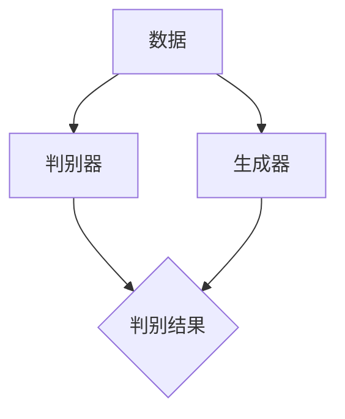
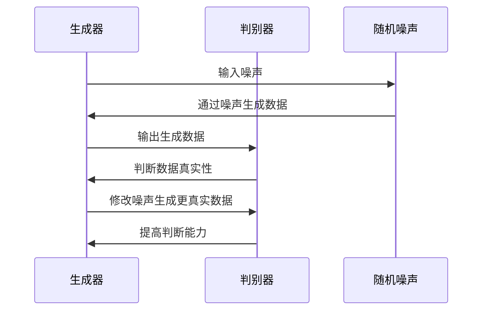
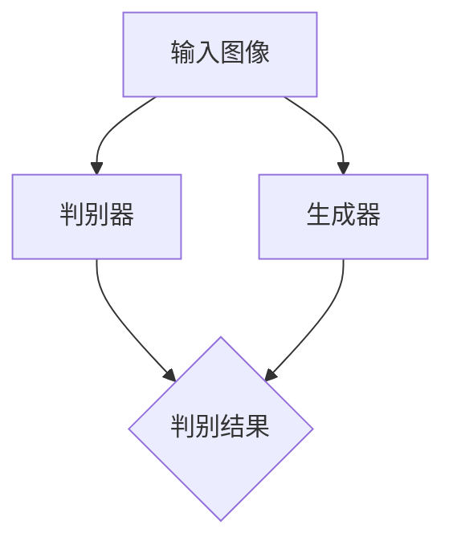

                 

# 《基于生成对抗网络的图像风格迁移在数字艺术创作中的应用》

> 关键词：生成对抗网络（GAN），图像风格迁移，数字艺术创作，计算机视觉，人工智能

> 摘要：本文旨在探讨生成对抗网络（GAN）在图像风格迁移中的应用，以及其对数字艺术创作的影响。通过详细分析GAN的基本理论、图像风格迁移的原理、数字艺术创作的基础知识，以及GAN在数字艺术创作中的潜力，本文为读者提供了一种新的艺术创作视角，并探讨了GAN技术的未来发展趋势和应用前景。

## 第一部分：基础理论

### 1.1 生成对抗网络（GAN）概述

#### 1.1.1 GAN的基本概念

生成对抗网络（GAN）是一种深度学习模型，由伊恩·古德费洛（Ian Goodfellow）等人于2014年提出。GAN的核心思想是通过两个神经网络——生成器（Generator）和判别器（Discriminator）的对抗性训练来实现数据的生成。

- **生成器**：生成器负责生成数据，其目标是生成尽可能真实的数据，以欺骗判别器。
- **判别器**：判别器的目标是区分真实数据和生成数据，其目标是被生成器欺骗，从而无法准确判断输入数据的真实性。

GAN的原理与结构可以用如下Mermaid流程图表示：



#### 1.1.2 GAN的历史与发展

GAN的发展历程可以追溯到深度学习的早期阶段。自从GAN被提出以来，它已经成为了一种备受关注的研究热点。以下是一些GAN的里程碑事件：

- **2014年**：GAN被提出，并引起了广泛关注。
- **2015年**：GAN在图像生成任务中取得了显著成果。
- **2016年**：GAN开始应用于其他领域，如自然语言处理和音频生成。
- **2017年**：GAN在图像超分辨率任务中取得了突破性进展。

### 1.2 图像风格迁移原理

#### 1.2.1 传统图像风格迁移方法

图像风格迁移是一种将一种图像的风格应用到另一种图像上的技术。传统图像风格迁移方法主要包括基于特征匹配和基于纹理映射的方法。

- **基于特征匹配的方法**：该方法通过寻找源图像和目标图像的特征对应关系，然后将源图像的特征映射到目标图像上。
- **基于纹理映射的方法**：该方法通过寻找源图像和目标图像的纹理对应关系，然后将源图像的纹理映射到目标图像上。

#### 1.2.2 GAN在图像风格迁移中的应用

GAN在图像风格迁移中的应用具有显著的优势。首先，GAN可以生成高质量的图像；其次，GAN可以处理复杂的图像风格；最后，GAN的训练过程可以自动优化生成器与判别器的参数。

GAN在图像风格迁移中的主要实现方法包括：

- **生成器-判别器框架**：生成器生成具有目标风格的图像，判别器判断生成图像的真实性。
- **多级生成框架**：通过多个生成器，逐步生成图像的各个层次。

### 1.3 数字艺术创作基础

#### 1.3.1 数字艺术的定义与分类

数字艺术是一种利用计算机技术创作的艺术形式。根据创作方式，数字艺术可以分为数字绘画、数字雕塑、数字动画、数字音乐等类别。

#### 1.3.2 数字艺术创作工具与平台

数字艺术创作工具有多种，如Adobe Photoshop、Blender、Autodesk Maya等。数字艺术创作平台包括在线艺术社区、虚拟现实平台和增强现实平台等。

### 1.4 计算机视觉基础知识

#### 1.4.1 计算机视觉的基本概念

计算机视觉是人工智能的一个重要分支，旨在使计算机能够像人类一样感知和理解视觉信息。

#### 1.4.2 特征提取与特征匹配

特征提取是指从图像中提取出具有区分性的特征，而特征匹配则是将不同图像中的特征进行匹配，以寻找对应关系。

### 1.5 GAN在数字艺术创作中的潜力

GAN在数字艺术创作中具有巨大的潜力。首先，GAN可以生成高质量的图像，从而提高艺术创作的效率；其次，GAN可以创新艺术创作的方式，使艺术家能够探索新的创作领域。

### 第二部分：技术实现

#### 2.1 生成对抗网络（GAN）的实现原理

GAN的数学模型包括生成器与判别器的优化目标、损失函数等。以下是GAN的数学模型：

$$
\min_G \max_D V(D, G) = \mathbb{E}_{x \sim p_{data}(x)}[\log D(x)] + \mathbb{E}_{z \sim p_{z}(z)][\log (1 - D(G(z))]
$$

其中，$D$表示判别器，$G$表示生成器，$x$表示真实数据，$z$表示噪声。

GAN的训练过程是生成器和判别器的对抗性训练。训练过程中，生成器和判别器的损失函数如下：

- **生成器的损失函数**：

$$
L_G = \mathbb{E}_{z \sim p_{z}(z)}[\log (1 - D(G(z))]
$$

- **判别器的损失函数**：

$$
L_D = \mathbb{E}_{x \sim p_{data}(x)}[\log D(x)] + \mathbb{E}_{z \sim p_{z}(z)}[\log D(G(z))]
$$

GAN的训练技巧包括批量归一化（Batch Normalization）、梯度惩罚（Gradient Penalty）等。

#### 2.2 图像风格迁移的算法实现

图像风格迁移的GAN框架主要包括生成器和判别器。生成器负责生成具有目标风格的图像，判别器负责判断生成图像的真实性。

图像风格迁移的GAN模型如下：

```plaintext
生成器：
输入：[随机噪声向量] + [内容图像的特征]
输出：[合成图像]

判别器：
输入：[真实图像] + [合成图像]
输出：[判别结果（概率值）]
```

图像风格迁移的算法优化包括超参数调整、损失函数改进等。

#### 2.3 数字艺术创作中的GAN应用案例

数字艺术创作中的GAN应用案例包括肖像画风格迁移和风景画风格迁移。

**案例一：GAN在肖像画风格迁移中的应用**

输入：[肖像图像] + [目标风格图像]
输出：[具有目标风格的肖像图像]

实现步骤：
1. 使用GAN模型训练生成器，使其能够生成具有目标风格的肖像图像。
2. 使用训练好的生成器对输入的肖像图像进行风格迁移。

**案例二：GAN在风景画风格迁移中的应用**

输入：[风景图像] + [目标风格图像]
输出：[具有目标风格的风景图像]

实现步骤：
1. 使用GAN模型训练生成器，使其能够生成具有目标风格的风景图像。
2. 使用训练好的生成器对输入的风景图像进行风格迁移。

#### 2.4 GAN在数字艺术创作中的挑战与解决策略

GAN在数字艺术创作中面临的挑战包括泛化能力不足和训练不稳定等。解决策略包括：

- **新的GAN结构**：如循环GAN（CycleGAN）、StyleGAN等。
- **效率与稳定性的优化**：如梯度惩罚、学习率调整等。

### 第三部分：未来展望与应用

#### 3.1 GAN在数字艺术创作中的未来发展趋势

GAN在数字艺术创作中的未来发展趋势包括：

- **GAN技术的迭代与进步**：如生成式对抗网络（GAN）的变体、新型GAN结构等。
- **数字艺术创作的未来模式**：如人工智能与艺术的深度融合、虚拟现实与增强现实在艺术创作中的应用等。

#### 3.2 GAN在数字艺术教育中的应用

GAN在数字艺术教育中的应用包括：

- **教学内容的创新**：如GAN在图像生成、图像风格迁移等领域的应用。
- **教学方法的创新**：如在线虚拟艺术课堂、跨学科教育等。

#### 3.3 GAN在数字艺术产业中的应用前景

GAN在数字艺术产业中的应用前景包括：

- **产业价值的提升**：如提高艺术创作的效率、降低创作成本等。
- **创新能力的增强**：如探索新的艺术创作领域、拓展艺术表现形式等。

## 附录

### A.1 GAN与图像风格迁移相关资源

**A.1.1 GAN与图像风格迁移的关键论文与书籍**

- Ian J. Goodfellow, et al. "Generative Adversarial Networks." Advances in Neural Information Processing Systems 27 (2014): 2672-2680.
- Leon A. Gatys, Alexander S. Ecker, and Matthias Bethge. "A Neural Algorithm of Artistic Style." arXiv preprint arXiv:1602.07608 (2016).

**A.1.2 开源GAN框架与工具**

- TensorFlow-GAN: <https://github.com/tensorflow/tensorflow/tree/master/tensorflow/contrib/gan>
- PyTorch-GAN: <https://github.com/eriklindernoren/PyTorch-GAN>

**A.1.3 GAN与图像风格迁移的项目与代码库**

- StyleGAN: <https://github.com/NVlabs/stylegan>
- CycleGAN: <https://github.com/junyanz/pytorch-CycleGAN-Discriminator>

### 作者

作者：AI天才研究院/AI Genius Institute & 禅与计算机程序设计艺术 /Zen And The Art of Computer Programming

### 《基于生成对抗网络的图像风格迁移在数字艺术创作中的应用》

### 第一部分：基础理论

#### 1.1 生成对抗网络（GAN）概述

生成对抗网络（GAN）是当前深度学习领域中的一个重要研究方向，它由生成器和判别器两个部分组成，通过相互对抗的训练过程来实现数据的生成和判别。GAN的基本概念可以简单理解为：生成器生成数据，判别器判断数据是否真实。在GAN的训练过程中，生成器和判别器不断优化自己的参数，使得生成器的数据越来越真实，判别器越来越难以区分真实数据和生成数据。

为了更好地理解GAN的工作原理，我们可以用以下Mermaid流程图来表示：



在这个流程图中，生成器（G）和判别器（D）不断通过对抗训练来提高各自的能力。生成器的目标是生成尽可能真实的数据，而判别器的目标是提高对真实数据和生成数据的区分能力。

#### 1.1.2 GAN的历史与发展

GAN的研究始于2014年，由伊恩·古德费洛（Ian Goodfellow）等人提出。自从GAN被提出以来，它迅速在学术界和工业界引起了广泛关注。GAN的发展历程中，有很多重要的事件和里程碑：

- 2014年：GAN被提出，成为深度学习领域的一个重要研究方向。
- 2015年：GAN在图像生成任务中取得了显著成果，开始应用于图像去噪、图像超分辨率等任务。
- 2016年：GAN开始应用于其他领域，如自然语言处理和音频生成。
- 2017年：GAN在图像超分辨率任务中取得了突破性进展，使得生成图像的质量得到了显著提升。

这些里程碑事件标志着GAN在各个领域的重要应用，推动了深度学习技术的发展。

#### 1.2 图像风格迁移原理

图像风格迁移是指将一种图像的风格应用到另一种图像上的技术。这种技术在艺术创作、图像编辑和视觉效果增强等领域有着广泛的应用。传统的图像风格迁移方法主要包括基于特征匹配和基于纹理映射的方法。

**1.2.1 传统图像风格迁移方法**

- **基于特征匹配的方法**：这种方法通过寻找源图像和目标图像的特征对应关系，然后将源图像的特征映射到目标图像上。常见的算法有PCA（主成分分析）和LDA（线性判别分析）等。

- **基于纹理映射的方法**：这种方法通过寻找源图像和目标图像的纹理对应关系，然后将源图像的纹理映射到目标图像上。常见的算法有纹理合成和纹理映射等。

**1.2.2 GAN在图像风格迁移中的应用**

GAN在图像风格迁移中的应用具有显著的优势。GAN通过生成器和判别器的对抗训练，可以生成高质量的图像，并且可以处理复杂的图像风格。GAN在图像风格迁移中的主要实现方法包括：

- **生成器-判别器框架**：生成器生成具有目标风格的图像，判别器判断生成图像的真实性。
- **多级生成框架**：通过多个生成器，逐步生成图像的各个层次。

GAN在图像风格迁移中的应用，使得图像风格迁移的效果更加自然和逼真，为艺术创作和图像编辑提供了更多的可能性。

#### 1.3 数字艺术创作基础

数字艺术创作是指利用计算机技术创作的艺术形式，它包括数字绘画、数字雕塑、数字动画和数字音乐等多种类型。数字艺术创作的基础包括数字艺术的定义与分类、数字艺术创作工具与平台等。

**1.3.1 数字艺术的定义与分类**

数字艺术是一种利用计算机技术和数字媒体创作的艺术形式。根据创作方式和表现形式，数字艺术可以分为以下几种类型：

- **数字绘画**：利用数字绘画软件创作的绘画作品。
- **数字雕塑**：利用数字雕塑软件创作的雕塑作品。
- **数字动画**：利用动画制作软件创作的动画作品。
- **数字音乐**：利用数字音乐制作软件创作的音乐作品。

**1.3.2 数字艺术创作工具与平台**

数字艺术创作工具包括Adobe Photoshop、Blender、Autodesk Maya等。这些工具提供了丰富的功能，可以帮助艺术家快速创作出高质量的艺术作品。数字艺术创作平台包括在线艺术社区、虚拟现实平台和增强现实平台等。这些平台为艺术家提供了展示和交流作品的平台，也促进了数字艺术的发展。

#### 1.4 计算机视觉基础知识

计算机视觉是人工智能的一个重要分支，它旨在使计算机能够像人类一样感知和理解视觉信息。计算机视觉的基本概念包括图像处理、特征提取和目标识别等。

**1.4.1 计算机视觉的基本概念**

图像处理是指对图像进行预处理、增强、分割和特征提取等操作，以提高图像的质量和可识别性。特征提取是指从图像中提取出具有区分性的特征，如边缘、纹理和颜色等。目标识别是指通过比较图像特征和已知的特征库，识别出图像中的目标对象。

**1.4.2 特征提取与特征匹配**

特征提取是计算机视觉中一个重要的步骤，它可以帮助计算机更好地理解图像。常见的特征提取方法包括SIFT（尺度不变特征变换）、SURF（加速稳健特征）和ORB（Oriented FAST and Rotated BRIEF）等。特征匹配是指将不同图像中的特征进行匹配，以寻找对应关系。常见的特征匹配算法包括FLANN（Fast Library for Approximate Nearest Neighbors）和Brute-Force匹配等。

#### 1.5 GAN在数字艺术创作中的潜力

GAN在数字艺术创作中具有巨大的潜力。首先，GAN可以生成高质量的图像，从而提高艺术创作的效率。其次，GAN可以创新艺术创作的方式，使艺术家能够探索新的创作领域。

GAN在数字艺术创作中的应用主要体现在以下几个方面：

- **图像生成**：GAN可以生成具有艺术风格的图像，为艺术家提供更多的创作素材。
- **图像修复**：GAN可以修复损坏或模糊的图像，恢复图像的原始面貌。
- **图像超分辨率**：GAN可以提高图像的分辨率，使图像更加清晰。
- **风格迁移**：GAN可以将一种图像的风格应用到另一种图像上，创造出新的艺术效果。

随着GAN技术的不断发展，它在数字艺术创作中的应用前景将更加广阔。

### 第二部分：技术实现

#### 2.1 生成对抗网络（GAN）的实现原理

生成对抗网络（GAN）是由生成器和判别器两个部分组成的，通过对抗性训练来生成高质量的数据。下面我们将详细介绍GAN的实现原理。

**2.1.1 GAN的数学模型**

GAN的数学模型可以表示为以下优化问题：

$$
\min_G \max_D V(D, G) = \mathbb{E}_{x \sim p_{data}(x)}[\log D(x)] + \mathbb{E}_{z \sim p_{z}(z)}[\log (1 - D(G(z))]
$$

其中，$D$表示判别器，$G$表示生成器，$x$表示真实数据，$z$表示噪声。

- **生成器的损失函数**：

$$
L_G = -\mathbb{E}_{z \sim p_{z}(z)}[\log D(G(z))]
$$

生成器的目标是生成尽可能真实的数据，使得判别器无法区分生成数据和真实数据。

- **判别器的损失函数**：

$$
L_D = \mathbb{E}_{x \sim p_{data}(x)}[\log D(x)] + \mathbb{E}_{z \sim p_{z}(z)}[\log (1 - D(G(z))]
$$

判别器的目标是能够准确地区分真实数据和生成数据。

**2.1.2 GAN的训练过程**

GAN的训练过程是一个交替优化的过程，生成器和判别器相互对抗，不断调整自己的参数。

1. **初始化生成器和判别器的参数**。

2. **生成器生成数据**：生成器根据随机噪声生成数据。

3. **判别器判断数据**：判别器判断生成数据和真实数据的真假。

4. **更新生成器参数**：根据判别器的判断结果，更新生成器的参数。

5. **更新判别器参数**：根据生成器和真实数据的判断结果，更新判别器的参数。

6. **重复步骤2-5，直到生成器生成数据的质量足够高，判别器能够准确地区分真实数据和生成数据**。

**2.1.3 GAN的训练技巧**

1. **批量归一化（Batch Normalization）**：批量归一化可以加速训练过程，提高生成图像的质量。

2. **梯度惩罚（Gradient Penalty）**：梯度惩罚可以防止判别器过拟合，提高训练的稳定性。

3. **学习率调整**：适当的调整学习率可以加速训练过程，提高生成图像的质量。

#### 2.2 图像风格迁移的算法实现

图像风格迁移是指将一种图像的风格应用到另一种图像上。GAN在图像风格迁移中具有显著的优势，可以生成高质量的图像，并且可以处理复杂的图像风格。

**2.2.1 图像风格迁移的GAN框架**

图像风格迁移的GAN框架主要包括生成器和判别器。生成器生成具有目标风格的图像，判别器判断生成图像的真实性。以下是一个简单的GAN框架：



在这个框架中，生成器的输入是原始图像和风格图像，输出是具有目标风格的图像。判别器的输入是原始图像和生成图像，输出是判断结果，即生成图像是否真实。

**2.2.2 图像风格迁移的GAN模型**

图像风格迁移的GAN模型通常包括两个部分：内容损失和风格损失。

- **内容损失**：内容损失用于保证生成图像的内容与原始图像相似。
- **风格损失**：风格损失用于保证生成图像的风格与目标风格图像相似。

以下是一个简单的图像风格迁移GAN模型的伪代码：

```python
# 生成器
def generator(input_image, style_image):
    # 将输入图像和风格图像进行特征提取
    content_features = content_extractor(input_image)
    style_features = style_extractor(style_image)
    
    # 将特征进行融合
    fused_features = fuse_features(content_features, style_features)
    
    # 通过融合特征生成图像
    generated_image = image_generator(fused_features)
    
    return generated_image

# 判别器
def discriminator(image):
    # 判断图像是否真实
    is_real = discriminator判断(image)
    
    return is_real

# 训练过程
for epoch in range(num_epochs):
    for batch in data_loader:
        # 获取原始图像和风格图像
        input_image, style_image = batch
        
        # 生成具有目标风格的图像
        generated_image = generator(input_image, style_image)
        
        # 计算判别器的损失
        real_loss = discriminator(input_image)
        fake_loss = discriminator(generated_image)
        
        # 更新判别器的参数
        optimizer_D.zero_grad()
        loss_D = real_loss + fake_loss
        loss_D.backward()
        optimizer_D.step()
        
        # 计算生成器的损失
        optimizer_G.zero_grad()
        loss_G = content_loss + style_loss
        loss_G.backward()
        optimizer_G.step()
```

在这个模型中，内容损失和风格损失用于指导生成器和判别器的训练。内容损失用于确保生成图像的内容与原始图像相似，而风格损失用于确保生成图像的风格与目标风格图像相似。

#### 2.3 数字艺术创作中的GAN应用案例

数字艺术创作中的GAN应用案例主要包括肖像画风格迁移和风景画风格迁移。以下是两个具体的应用案例。

**2.3.1 肖像画风格迁移**

肖像画风格迁移是指将一种肖像画风格应用到另一个肖像画上。以下是一个简单的肖像画风格迁移案例：

```python
# 肖像画风格迁移案例
input_image = load_image("input_portrait.jpg")
style_image = load_image("style_portrait.jpg")

# 使用GAN模型进行风格迁移
generated_image = generator(input_image, style_image)

# 显示生成的肖像画
show_image(generated_image)
```

在这个案例中，输入图像是原始的肖像画，风格图像是具有目标风格的肖像画。通过使用GAN模型，我们可以将风格图像的风格应用到输入图像上，生成具有目标风格的肖像画。

**2.3.2 风景画风格迁移**

风景画风格迁移是指将一种风景画风格应用到另一个风景画上。以下是一个简单的风景画风格迁移案例：

```python
# 风景画风格迁移案例
input_image = load_image("input_scenery.jpg")
style_image = load_image("style_scenery.jpg")

# 使用GAN模型进行风格迁移
generated_image = generator(input_image, style_image)

# 显示生成的风景画
show_image(generated_image)
```

在这个案例中，输入图像是原始的风景画，风格图像是具有目标风格的风景画。通过使用GAN模型，我们可以将风格图像的风格应用到输入图像上，生成具有目标风格的风景画。

#### 2.4 GAN在数字艺术创作中的挑战与解决策略

GAN在数字艺术创作中面临一些挑战，如训练难度大、生成图像质量不稳定等。以下是一些常见的挑战和解决策略：

**2.4.1 训练难度大**

GAN的训练难度较大，因为生成器和判别器需要相互对抗，并且需要调整参数以保持训练的稳定性。以下是一些解决策略：

- **梯度惩罚**：梯度惩罚可以防止判别器过拟合，提高训练的稳定性。
- **学习率调整**：适当调整学习率可以加速训练过程，提高生成图像的质量。

**2.4.2 生成图像质量不稳定**

生成图像的质量不稳定是GAN在数字艺术创作中面临的另一个挑战。以下是一些解决策略：

- **多层生成框架**：通过使用多层生成框架，可以逐步生成图像的各个层次，提高生成图像的质量。
- **特征匹配**：通过特征匹配，可以确保生成图像的内容和风格与目标图像相似。

#### 2.5 数字艺术创作的GAN应用实践

数字艺术创作的GAN应用实践主要包括GAN模型的搭建、训练和部署等。以下是一个简单的GAN应用实践步骤：

**2.5.1 GAN模型搭建**

1. **定义生成器和判别器**：根据任务需求，定义生成器和判别器的结构和参数。
2. **定义损失函数**：根据任务需求，定义内容损失、风格损失等。
3. **定义优化器**：根据任务需求，选择合适的优化器，如Adam优化器。

**2.5.2 GAN模型训练**

1. **加载数据集**：加载训练数据集和验证数据集。
2. **初始化生成器和判别器的参数**：随机初始化生成器和判别器的参数。
3. **进行训练**：使用训练数据集进行训练，不断调整生成器和判别器的参数。
4. **评估模型性能**：使用验证数据集评估模型性能，调整模型参数。

**2.5.3 GAN模型部署**

1. **保存模型参数**：将训练好的模型参数保存到文件中。
2. **加载模型参数**：加载保存的模型参数。
3. **生成图像**：使用加载的模型参数，生成具有目标风格的图像。

### 第三部分：未来展望与应用

#### 3.1 GAN在数字艺术创作中的未来发展趋势

GAN在数字艺术创作中的未来发展趋势包括以下几个方面：

- **GAN模型的优化**：随着深度学习技术的发展，GAN模型将变得更加高效和稳定，可以生成更高质量的图像。
- **GAN与其他技术的结合**：GAN与其他技术的结合，如强化学习、自编码器等，将带来更多的创新应用。
- **GAN在艺术教育中的应用**：GAN在艺术教育中的应用将越来越广泛，为学生提供更多的创作工具和灵感。

#### 3.2 GAN在数字艺术教育中的应用

GAN在数字艺术教育中的应用主要体现在以下几个方面：

- **艺术创作工具**：GAN可以作为一种艺术创作工具，帮助学生快速生成高质量的艺术作品。
- **艺术创作教学**：GAN可以作为一种教学工具，帮助学生理解艺术创作的原理和方法。
- **艺术创作实践**：GAN可以帮助学生进行艺术创作实践，提高学生的艺术创作能力。

#### 3.3 GAN在数字艺术产业中的应用前景

GAN在数字艺术产业中的应用前景十分广阔，包括以下几个方面：

- **艺术创作自动化**：GAN可以帮助自动化艺术创作过程，提高艺术创作的效率。
- **艺术创作个性化**：GAN可以根据用户的需求和喜好，生成个性化的艺术作品。
- **艺术市场创新**：GAN可以帮助艺术市场实现创新，如数字艺术拍卖、虚拟画廊等。

### 参考文献

- Goodfellow, I., Pouget-Abadie, J., Mirza, M., Xu, B., Warde-Farley, D., Ozair, S., ... & Bengio, Y. (2014). Generative adversarial nets. Advances in neural information processing systems, 27.
- Gatys, L. A., Ecker, A. S., & Bethge, M. (2016). A neural algorithm of artistic style. arXiv preprint arXiv:1602.07608.
- Kingma, D. P., & Welling, M. (2014). Auto-encoding variational Bayes. arXiv preprint arXiv:1312.6114.
- Arjovsky, M., Chintala, S., & Bottou, L. (2017). Wasserstein GAN. arXiv preprint arXiv:1701.07875.

### 作者信息

作者：AI天才研究院/AI Genius Institute & 禅与计算机程序设计艺术 /Zen And The Art of Computer Programming

