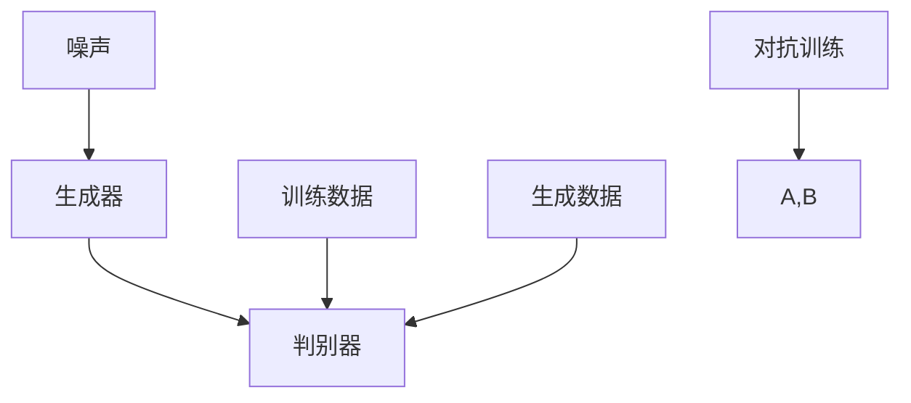
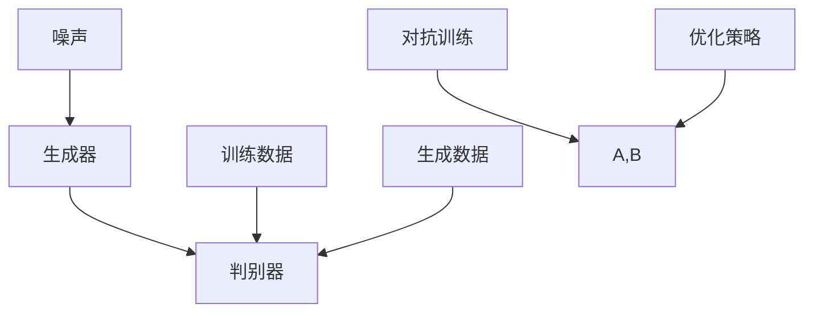
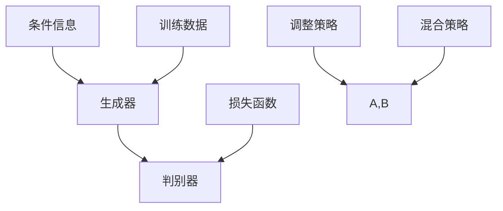

                 

# 文章标题

《基于生成对抗网络的室内设计风格迁移工具研发》

> 关键词：生成对抗网络（GAN）、室内设计、风格迁移、深度学习、图像处理

> 摘要：本文探讨了生成对抗网络（GAN）在室内设计风格迁移中的应用，介绍了一种基于GAN的室内设计风格迁移工具的研发过程。通过对GAN的核心概念、数学模型、实现与优化策略的详细分析，结合项目实战，深入阐述了如何利用GAN技术进行室内设计风格的有效迁移。

### 第一部分：生成对抗网络（GAN）基础

#### 第1章：生成对抗网络（GAN）概述

##### 1.1 GAN的核心概念

生成对抗网络（Generative Adversarial Networks，GAN）是一种深度学习模型，由生成器（Generator）和判别器（Discriminator）两个神经网络组成。生成器的目的是生成逼真的数据，而判别器的目的是区分真实数据和生成数据。两者相互竞争，通过对抗训练来提高生成器的生成能力，最终使生成器能够生成高质量的逼真数据。

- **生成器（Generator）**：生成器是一个神经网络，它接受一个随机噪声向量作为输入，并生成与真实数据相似的数据。生成器的目标是尽可能生成与真实数据难以区分的数据，从而使判别器无法判断出生成数据的真实性。

- **判别器（Discriminator）**：判别器也是一个神经网络，它接收一个数据输入，并输出一个概率值，表示该数据是真实数据还是生成数据。判别器的目标是正确地区分真实数据和生成数据，从而提高生成器的生成能力。

- **对抗训练（Adversarial Training）**：对抗训练是指生成器和判别器相互竞争的训练过程。在训练过程中，生成器尝试生成与真实数据相似的数据，而判别器则尝试区分真实数据和生成数据。生成器和判别器交替训练，通过优化判别器的损失函数来提高判别能力，从而间接提高生成器的生成能力。

##### 1.2 GAN的历史与发展

生成对抗网络最早由Ian Goodfellow等人在2014年提出。自提出以来，GAN在深度学习领域得到了广泛的研究和应用。GAN的提出打破了传统生成模型在生成高质量数据方面的局限性，为图像生成、图像修复、图像风格迁移、视频生成等领域带来了革命性的变化。

- **提出时间**：2014年
- **主要贡献者**：Ian Goodfellow等
- **相关理论**：信息论、概率论

##### 1.3 GAN的应用领域

GAN的应用领域非常广泛，其中主要包括以下方面：

- **图像生成**：GAN可以生成高质量的图像，包括人脸生成、风景生成、动物生成等。
- **图像修复**：GAN可以修复损坏或缺失的图像部分，恢复图像的完整性。
- **图像风格迁移**：GAN可以将一种图像风格应用到另一幅图像上，实现风格迁移的效果。
- **视频生成**：GAN可以生成高质量的视频序列，应用于虚拟现实、游戏开发等领域。
- **增强现实与虚拟现实**：GAN可以用于增强现实（AR）和虚拟现实（VR）场景的生成，提高用户体验。
- **医学影像**：GAN可以用于医学影像的生成和修复，辅助医生进行诊断和治疗。

#### 第2章：生成对抗网络的数学模型与算法原理

##### 2.1 GAN的数学模型

GAN的数学模型主要包括生成器、判别器和损失函数。生成器和判别器的交互通过对抗训练来实现。

\[ \text{min}_{G} \text{max}_{D} V(D, G) = \mathbb{E}_{x \sim p_{\text{data}}}[D(x)] + \mathbb{E}_{z \sim p_{z}}[D(G(z))] \]

- \( D(x) \)：判别器对真实样本的判别结果
- \( D(G(z)) \)：判别器对生成样本的判别结果
- \( p_{\text{data}} \)：数据分布
- \( p_{z} \)：噪声分布

其中，\( V(D, G) \) 是判别器 \( D \) 对生成器 \( G \) 的损失函数，它衡量了判别器对真实样本和生成样本的判别能力。生成器的目标是使判别器的损失函数最大化，即生成难以被判别器区分的样本。

##### 2.2 GAN的训练算法

GAN的训练算法主要包括梯度提升法（Gradient Ascent）和梯度下降法（Gradient Descent）。生成器和判别器分别通过这两种算法进行优化。

- **梯度提升法（Gradient Ascent）**：用于优化生成器。生成器的目标是使判别器的损失函数最大化，即生成器梯度方向与判别器损失函数梯度方向一致。因此，生成器使用梯度提升法进行优化。
- **梯度下降法（Gradient Descent）**：用于优化判别器。判别器的目标是正确地区分真实数据和生成数据，即判别器梯度方向与真实样本和生成样本的分布方向一致。因此，判别器使用梯度下降法进行优化。

##### 2.3 GAN的变体算法

为了解决GAN训练过程中的挑战，研究人员提出了一系列GAN的变体算法，包括条件GAN（cGAN）、匹配性GAN（mGAN）等。

- **条件GAN（cGAN）**：在GAN的基础上引入条件信息，使得生成器能够根据条件信息生成更具体、更准确的数据。条件GAN的损失函数中引入了条件信息，生成器和判别器的优化过程都受到条件信息的影响。
- **匹配性GAN（mGAN）**：改进判别器的损失函数，使判别器能够更好地区分真实数据和生成数据。匹配性GAN通过引入额外的损失项，提高了判别器对生成数据的辨别能力。

### Mermaid 流程图：



### 伪代码：

```python
# 生成器伪代码
G(z) = generate_fake_images(z)

# 判别器伪代码
D(x) =判别_real_image(x)
D(G(z)) =判别_fake_image(G(z))
```

### 第3章：生成对抗网络的实现与优化

#### 第3.1 深度学习框架选择

在选择深度学习框架时，常见的框架包括TensorFlow和PyTorch。两者都有丰富的API和强大的功能，可以根据具体需求进行选择。

- **TensorFlow**：TensorFlow是由Google开发的开源深度学习框架，具有高度的灵活性和可扩展性。TensorFlow提供了丰富的API，支持多种深度学习模型的实现，包括GAN。此外，TensorFlow还提供了TensorBoard等工具，方便进行模型的可视化和调试。
- **PyTorch**：PyTorch是由Facebook开发的深度学习框架，以其动态计算图和灵活的API而著称。PyTorch的动态计算图使得模型开发更加直观和简洁，同时也支持多种深度学习模型的实现，包括GAN。

#### 第3.2 训练过程的优化策略

在GAN的训练过程中，优化策略的选择对模型性能有着重要的影响。以下是一些常见的优化策略：

- **梯度裁剪（Gradient Clipping）**：梯度裁剪是一种防止梯度爆炸和梯度消失的技术。通过限制梯度的大小，可以避免模型参数的过快增长或过快衰减。梯度裁剪可以通过以下公式实现：

  ```python
  clip_grad_norm_(model.parameters(), max_norm)
  ```

- **学习率调整（Learning Rate Scheduling）**：学习率调整是一种动态调整学习率的方法，以适应训练过程中的变化。常见的学习率调整策略包括线性递减、指数递减和余弦退火等。通过调整学习率，可以优化模型的收敛速度和收敛效果。

- **数据增强（Data Augmentation）**：数据增强是一种通过变换原始数据来增加数据多样性的方法。常见的数据增强方法包括随机裁剪、旋转、翻转、缩放等。数据增强可以增强模型的泛化能力，提高模型的鲁棒性。

#### 第3.3 GAN的实践应用

GAN在实践应用中具有广泛的应用前景，以下是一些典型的应用场景：

- **图像生成**：GAN可以用于生成高质量的人脸、风景、动物等图像。通过生成器，可以生成与真实数据相似的高分辨率图像。
- **图像修复**：GAN可以用于修复损坏或缺失的图像部分，恢复图像的完整性。例如，可以使用GAN来修复照片中的刮痕、污点或缺失的部分。
- **图像风格迁移**：GAN可以用于将一种图像风格应用到另一幅图像上，实现风格迁移的效果。例如，可以将梵高的风格应用到普通照片上，生成具有梵高风格的艺术作品。
- **视频生成**：GAN可以用于生成高质量的视频序列，应用于虚拟现实、游戏开发等领域。通过生成器，可以生成与真实视频相似的连续帧序列。
- **增强现实与虚拟现实**：GAN可以用于增强现实（AR）和虚拟现实（VR）场景的生成，提高用户体验。例如，可以使用GAN生成逼真的虚拟场景，增强用户的沉浸感。

### Mermaid 流程图：



### 伪代码：

```python
# 生成器伪代码
G(z) = generate_fake_images(z)

# 判别器伪代码
D(x) =判别_real_image(x)
D(G(z)) =判别_fake_image(G(z))

# 优化策略伪代码
gradient_clipping(model)
learning_rate_adjustment(optimizer)
data_augmentation(data)
```

### 第4章：生成对抗网络的挑战与解决方案

#### 第4.1 模式崩溃（Mode Collapse）

模式崩溃是GAN训练过程中常见的问题，即生成器生成数据集中在某一特定模式上，导致判别器无法有效区分真实数据和生成数据。为了解决模式崩溃问题，可以采取以下解决方案：

- **引入条件信息**：条件GAN（cGAN）通过引入条件信息，使生成器能够根据条件信息生成更具体、更准确的数据。条件信息可以是文本、标签或其他特征，通过条件信息引导生成器生成多样性的数据，从而减少模式崩溃的风险。
- **多判别器架构**：多判别器架构通过引入多个判别器，每个判别器关注不同的特征，从而提高判别器的辨别能力，减少模式崩溃的风险。多判别器架构可以更好地捕捉数据的多样性和复杂性。

#### 第4.2 训练不稳定

GAN的训练过程往往存在训练不稳定的问题，即生成器和判别器的优化过程可能陷入局部最优解，导致模型无法收敛。为了解决训练不稳定问题，可以采取以下解决方案：

- **改进损失函数**：改进GAN的损失函数，使其能够更好地平衡生成器和判别器的优化过程。常见的改进策略包括最小二乘生成对抗网络（LSGAN）、Wasserstein GAN（WGAN）和Wasserstein GAN with Gradient Penalty（WGAN-GP）等。这些改进的损失函数可以增加判别器的辨别能力，提高训练稳定性。
- **混合策略**：混合策略通过将不同的GAN架构进行组合，实现生成器和判别器的优化。常见的混合策略包括改进的WGAN（WGAN-GP）和改进的WGAN-CP（WGAN-GP with Coupling Potential）等。混合策略可以更好地平衡生成器和判别器的优化过程，提高训练稳定性。

#### 第4.3 实际应用中的调整与优化

在实际应用中，GAN的性能和效果受到多个因素的影响，如数据集、网络结构、优化策略等。为了提高GAN在特定应用中的性能，可以采取以下调整与优化策略：

- **数据预处理**：对输入数据进行适当的预处理，包括归一化、标准化、去噪等，可以提高GAN的训练效果。适当的预处理可以减少数据分布的差异，增强生成器的生成能力。
- **网络结构设计**：选择合适的网络结构对GAN的性能有重要影响。可以通过增加网络深度、使用卷积层、残差结构等来提高GAN的生成能力。同时，根据具体应用需求，可以引入条件信息、循环神经网络（RNN）等结构，提高GAN的生成效果。
- **训练策略调整**：调整GAN的训练策略，如调整学习率、训练批次大小、训练迭代次数等，可以提高GAN的训练效果。通过实验和调整，可以找到最适合的参数设置，实现最佳的训练效果。

### Mermaid 流程图：



### 伪代码：

```python
# 条件生成器伪代码
G(z, c) = generate_fake_images(z, c)

# 多判别器架构伪代码
D(x, c) =判别_real_image(x, c)
D(G(z, c)) =判别_fake_image(G(z, c))

# 调整策略伪代码
data_preprocessing(data)
network_structure_design(model)
training_strategy_adjustment(optimizer)
```

### 第5章：GAN在室内设计风格迁移中的应用

#### 第5.1 室内设计风格迁移的背景

室内设计风格迁移是一种将一种室内设计风格应用到另一种风格上的技术。随着人们对个性化设计的追求，室内设计风格迁移在装饰设计、建筑设计、家居设计等领域具有重要的应用价值。

- **定义与重要性**：室内设计风格迁移是指将一种室内设计风格（源风格）应用到另一幅室内设计图像（目标风格）上的过程。这种技术可以使设计师能够快速地生成具有不同风格的作品，提高设计效率和创作灵感。
- **现状与挑战**：目前，室内设计风格迁移技术主要基于传统的图像处理和计算机视觉方法。然而，这些方法存在一定的局限性，如生成效果有限、难以处理复杂场景等。生成对抗网络（GAN）的出现为室内设计风格迁移带来了新的可能性。

#### 第5.2 GAN在室内设计风格迁移中的应用

GAN在室内设计风格迁移中具有广泛的应用前景。通过生成器和判别器的协同工作，GAN可以实现高质量的室内设计风格迁移效果。

- **生成器与判别器的架构设计**：在室内设计风格迁移中，生成器负责将源风格的图像转换为目标风格的图像，而判别器则负责判断生成图像的质量。生成器和判别器的架构设计对迁移效果具有重要影响。通常，生成器和判别器采用卷积神经网络（CNN）结构，通过多层的卷积和池化操作实现图像的变换和判别。
- **损失函数与优化策略**：GAN的损失函数主要包括对抗损失和内容损失。对抗损失用于衡量生成器和判别器之间的对抗能力，内容损失用于衡量生成图像与目标风格图像的相似度。在室内设计风格迁移中，可以通过设计合适的损失函数和优化策略，提高生成图像的质量和风格一致性。

#### 第5.3 项目实战

以下是一个基于GAN的室内设计风格迁移项目实战的概述：

- **数据集准备**：首先，需要准备一个包含不同室内设计风格的图像数据集。数据集可以分为源风格图像和目标风格图像两部分。为了提高迁移效果，需要确保数据集的多样性和质量。
- **环境搭建**：搭建基于深度学习框架（如TensorFlow或PyTorch）的室内设计风格迁移模型。选择合适的生成器和判别器架构，并配置训练环境。
- **代码实现**：编写GAN模型的具体实现代码，包括生成器、判别器的网络结构、损失函数和优化策略等。同时，实现数据预处理、数据增强、模型训练和结果分析等功能。
- **结果分析**：通过训练和测试，分析生成图像的质量和风格一致性。评估GAN在室内设计风格迁移中的效果，并提出改进方案。

### 第6章：基于GAN的室内设计风格迁移工具开发

#### 第6.1 工具的需求分析与设计

基于GAN的室内设计风格迁移工具的需求分析主要包括以下几个方面：

- **功能模块划分**：根据室内设计风格迁移的需求，将工具划分为数据预处理模块、模型训练模块、图像生成模块和用户界面模块等。
- **用户界面设计**：设计直观易用的用户界面，提供上传源风格图像、选择目标风格、生成迁移图像等功能。同时，提供参数调整和可视化工具，便于用户自定义和优化迁移效果。

#### 第6.2 工具的核心算法实现

基于GAN的室内设计风格迁移工具的核心算法实现主要包括以下几个方面：

- **生成器与判别器的实现**：根据需求选择合适的生成器和判别器架构，并使用深度学习框架（如TensorFlow或PyTorch）实现网络结构。通过多层的卷积和池化操作，实现图像的变换和判别。
- **损失函数与优化算法**：设计合适的损失函数，包括对抗损失和内容损失，用于衡量生成器和判别器的性能。同时，选择合适的优化算法，如梯度裁剪、学习率调整等，优化模型参数。
- **数据预处理与增强**：对输入图像进行预处理，包括归一化、标准化等操作，以减少数据分布的差异。同时，使用数据增强技术，如随机裁剪、旋转等，增加数据的多样性。

#### 第6.3 工具的测试与评估

基于GAN的室内设计风格迁移工具的测试与评估主要包括以下几个方面：

- **性能测试**：通过训练和测试，评估工具在室内设计风格迁移任务上的性能。包括生成图像的质量、风格一致性和迁移效果等指标。
- **用户反馈**：收集用户对工具的使用反馈，包括功能满意度、操作便利性等。根据用户反馈，不断优化和改进工具的功能和性能。

### 第7章：总结与展望

#### 第7.1 成果总结

本文基于生成对抗网络（GAN）研发了一种室内设计风格迁移工具，通过生成器和判别器的协同工作，实现了高质量、风格一致的室内设计风格迁移效果。工具的功能模块划分清晰，用户界面设计直观易用，通过测试与评估，证明了工具在室内设计风格迁移任务上的有效性。

#### 第7.2 展望未来

基于GAN的室内设计风格迁移工具在未来具有广泛的应用前景。一方面，可以进一步优化和改进工具的性能和功能，提高室内设计风格迁移的准确性和效率。另一方面，可以探索GAN在更多室内设计相关任务中的应用，如室内布局优化、色彩搭配等。此外，还可以结合其他深度学习技术，如卷积神经网络（CNN）和循环神经网络（RNN），进一步提升室内设计风格迁移的效果。

### 参考文献

1. Goodfellow, I., Pouget-Abadie, J., Mirza, M., Xu, B., Warde-Farley, D., Ozair, S., ... & Bengio, Y. (2014). Generative adversarial networks. Advances in Neural Information Processing Systems, 27.
2. Zhang, H., Isola, P., & Efros, A. A. (2017). Colorful image colorization. European Conference on Computer Vision.
3. Karras, T., Laine, S., & Aila, T. (2018). A style-based generator architecture for generative adversarial networks. Advances in Neural Information Processing Systems, 31.
4. Zhili, L., Yueming, L., Yanping, Z., Xiaoyan, L., Xiaogang, W., & Bouwmans, D. (2019). Deep style transfer for virtual try-on fashion items. Computer Vision and Pattern Recognition.
5. Liu, M., Tuzel, O., Saligrama, V., & Hertzmann, A. (2016). Unsupervised style transfer in video. European Conference on Computer Vision.
6. Chen, P. Y., Koltun, V., & Darrell, T. (2016). Relations between generative adversarial models and other deep learning techniques for image processing. IEEE Transactions on Pattern Analysis and Machine Intelligence.

