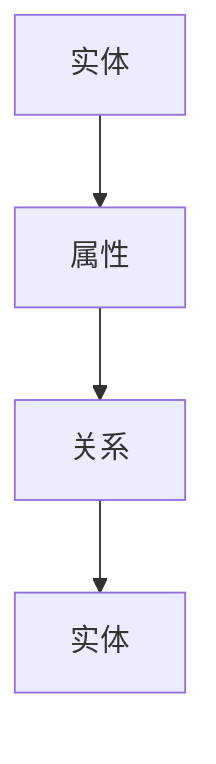
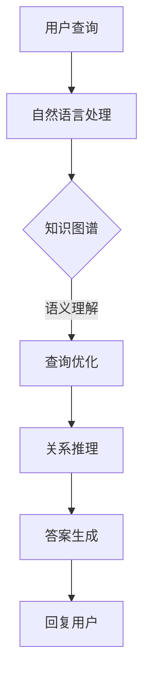
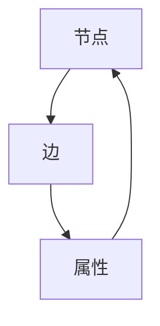

                 

# 文章标题：基于知识图谱的检索式对话系统详细设计与具体代码实现

> 关键词：知识图谱、检索式对话系统、实体识别、关系抽取、算法实现、性能优化、安全性

> 摘要：
本文将深入探讨基于知识图谱的检索式对话系统的设计与实现。首先，介绍知识图谱的基本概念、构建方法和表示方法。接着，解析检索式对话系统的定义、特点、组成部分和设计原则。然后，深入讲解知识图谱技术原理、检索式对话系统的核心算法、开发工具与框架。最后，通过实际案例展示系统的代码实现、性能优化和安全性措施，为读者提供一套完整的解决方案和实用的指导。

## 目录

### 第一部分：基础知识与概念

- [第1章：知识图谱概述](#第1章知识图谱概述)
  - 1.1 知识图谱的定义与作用
  - 1.2 知识图谱的构建方法
  - 1.3 知识图谱的表示方法

- [第2章：检索式对话系统基础](#第2章检索式对话系统基础)
  - 2.1 检索式对话系统的定义与特点
  - 2.2 检索式对话系统的组成部分
  - 2.3 检索式对话系统的设计原则

### 第二部分：技术原理与实现

- [第3章：知识图谱技术原理](#第3章知识图谱技术原理)
  - 3.1 知识图谱的数据结构
  - 3.2 知识图谱的查询语言
  - 3.3 知识图谱的扩展与更新

- [第4章：检索式对话系统的核心算法](#第4章检索式对话系统的核心算法)
  - 4.1 信息检索算法
  - 4.2 对话管理算法
  - 4.3 知识图谱融合算法

- [第5章：检索式对话系统的开发工具与框架](#第5章检索式对话系统的开发工具与框架)
  - 5.1 开发工具介绍
  - 5.2 开发框架的选择与应用

### 第三部分：优化与性能提升

- [第6章：代码实现与案例分析](#第6章代码实现与案例分析)
  - 6.1 环境搭建与依赖安装
  - 6.2 知识图谱的构建与存储
  - 6.3 检索式对话系统的实现
  - 6.4 案例分析

- [第7章：检索式对话系统的性能优化](#第7章检索式对话系统的性能优化)
  - 7.1 系统性能评估指标
  - 7.2 性能优化方法

- [第8章：系统安全与隐私保护](#第8章系统安全与隐私保护)
  - 8.1 系统安全策略
  - 8.2 隐私保护方法

### 附录

- [附录A：常用工具与库](#附录a常用工具与库)
- [附录B：参考文献](#附录b参考文献)

## 第1章：知识图谱概述

### 1.1 知识图谱的定义与作用

#### 1.1.1 知识图谱的基本概念

知识图谱（Knowledge Graph）是一种语义网络，它通过实体、属性和关系来表示现实世界的知识和信息。知识图谱的核心组成部分包括：

- **实体（Entity）**：表示现实世界中的对象，如人、地点、物品等。
- **属性（Attribute）**：描述实体的特性或特征，如人的年龄、地点的纬度等。
- **关系（Relationship）**：表示实体之间的语义关联，如“属于”、“居住在”等。

知识图谱的基本概念可以用Mermaid流程图表示如下：



#### 1.1.2 知识图谱在检索式对话系统中的应用

知识图谱在检索式对话系统中起着至关重要的作用。它可以提供以下功能：

- **语义理解**：通过知识图谱，对话系统能够理解用户的查询意图，并将自然语言转换为结构化的查询。
- **知识推理**：知识图谱中的关系和属性可以用来进行推理，从而回答用户的问题或提供相关的信息。
- **查询优化**：知识图谱可以优化检索过程，提高查询效率和准确性。

知识图谱与检索式对话系统的关系可以用以下Mermaid流程图表示：



### 1.2 知识图谱的构建方法

#### 1.2.1 数据源的获取与预处理

构建知识图谱的第一步是获取数据源。数据源可以是结构化数据（如数据库）、非结构化数据（如文本、图像）或半结构化数据（如XML、JSON）。获取数据源后，需要进行预处理，包括数据清洗、去重、格式转换等步骤。

#### 1.2.2 实体识别与关系抽取

实体识别是指从文本中识别出实体，如人名、地名、组织名等。关系抽取是指识别实体之间的语义关系，如“工作于”、“位于”等。实体识别与关系抽取的方法包括基于规则的方法、基于统计的方法和基于深度学习的方法。

#### 1.2.3 知识图谱的构建与存储

构建知识图谱的核心步骤是将实体、属性和关系组织成一个结构化的知识库。常用的知识图谱存储方式包括基于图数据库（如Neo4j、JanusGraph）和基于关系数据库（如MySQL、PostgreSQL）。

### 1.3 知识图谱的表示方法

#### 1.3.1 图论基础

图论是研究图形的数学分支，用于描述知识图谱的数据结构。在图论中，图由节点（代表实体）和边（代表关系）组成。节点可以带有属性，边也可以带有属性。

#### 1.3.2 RDF（资源描述框架）

RDF是一种用于表示知识图谱的框架，它使用URI（统一资源标识符）来表示实体、属性和关系。RDF采用三元组（主体、谓词、对象）的形式来表示知识。

#### 1.3.3 OWL（Web本体语言）

OWL是一种用于表示复杂知识图谱的本体语言。它扩展了RDF的语义表达能力，支持分类、属性约束、个体定义等。

## 第2章：检索式对话系统基础

### 2.1 检索式对话系统的定义与特点

#### 2.1.1 检索式对话系统的基本概念

检索式对话系统是一种基于信息检索技术的对话系统，它通过用户查询和系统响应进行交互。检索式对话系统的基本概念包括：

- **用户查询**：用户输入的文本或语音，用于表达查询意图。
- **系统响应**：系统根据用户查询生成的回答或建议。

#### 2.1.2 检索式对话系统与传统对话系统的区别

检索式对话系统与传统对话系统的主要区别在于：

- **交互方式**：传统对话系统通常采用自然语言交互，而检索式对话系统更多地依赖于信息检索技术。
- **系统架构**：传统对话系统通常包括对话管理、自然语言处理和对话生成模块，而检索式对话系统则更多地依赖于检索引擎和知识图谱。

### 2.2 检索式对话系统的组成部分

检索式对话系统的组成部分包括：

- **用户界面**：用于接收用户查询和展示系统响应的界面。
- **检索引擎**：用于处理用户查询并从知识库中检索相关信息的引擎。
- **对话管理**：用于管理对话流程和状态转换的模块。
- **知识库**：用于存储实体、属性和关系的知识库。

### 2.3 检索式对话系统的设计原则

检索式对话系统的设计原则包括：

- **用户友好性**：确保系统易于使用，用户界面简洁直观。
- **可扩展性**：设计灵活，易于扩展和升级。
- **性能优化**：优化查询效率和系统响应速度。

## 第3章：知识图谱技术原理

### 3.1 知识图谱的数据结构

知识图谱的数据结构主要包括：

- **节点（Entity）**：表示实体，如人、地点、物品等。
- **边（Relationship）**：表示实体之间的关系，如“工作于”、“位于”等。
- **属性（Attribute）**：描述实体的属性，如人的年龄、地点的纬度等。

在知识图谱中，节点、边和属性的关系可以用Mermaid流程图表示：



### 3.2 知识图谱的查询语言

知识图谱的查询语言用于从知识图谱中检索信息。常见的查询语言包括：

- **SPARQL**：是一种用于RDF数据的查询语言，支持复杂查询。
- **Gremlin**：是一种用于图形数据的查询语言，支持图遍历和复杂查询。

SPARQL查询示例：

```sql
PREFIX ex: <http://example.org/>
SELECT ?x ?y
WHERE {
  ?x ex:name "Alice".
  ?x ex:friend ?y.
}
```

### 3.3 知识图谱的扩展与更新

知识图谱的扩展与更新是保持其实时性和准确性的关键。常见的扩展与更新方法包括：

- **实体的添加与删除**：向知识图谱中添加新实体或删除不再需要的实体。
- **关系的修改与更新**：修改实体之间的关系或更新关系的属性。
- **知识图谱的版本控制**：对知识图谱进行版本控制，确保历史数据的可追溯性和可恢复性。

## 第4章：检索式对话系统的核心算法

### 4.1 信息检索算法

信息检索算法是检索式对话系统的核心。常见的检索算法包括：

- **搜索引擎算法**：如倒排索引、PageRank等，用于高效地从海量数据中检索相关信息。
- **文本相似度计算**：用于衡量两个文本的相似度，如余弦相似度、编辑距离等。

### 4.2 对话管理算法

对话管理算法用于管理对话流程和状态。常见的对话管理算法包括：

- **对话状态跟踪**：记录对话过程中的关键信息，如用户意图、上下文等。
- **对话策略设计**：根据对话状态和用户意图设计对话响应策略。

### 4.3 知识图谱融合算法

知识图谱融合算法用于将不同来源的知识融合到一个统一的框架中。常见的融合算法包括：

- **实体匹配**：用于匹配不同来源的实体，确保知识的统一性。
- **关系推理**：基于实体之间的关系进行推理，生成新的知识。

## 第5章：检索式对话系统的开发工具与框架

### 5.1 开发工具介绍

检索式对话系统的开发工具包括：

- **知识图谱构建工具**：如Neo4j、JanusGraph等，用于构建和管理知识图谱。
- **检索引擎**：如Elasticsearch、Solr等，用于处理用户查询和检索相关信息。
- **对话管理框架**：如Rasa、Microsoft Bot Framework等，用于管理对话流程和状态。

### 5.2 开发框架的选择与应用

检索式对话系统的开发框架可以根据实际需求进行选择。常见的开发框架包括：

- **基于图数据库的开发框架**：如Neo4j，适用于需要复杂查询和关系推理的场景。
- **基于深度学习的对话系统框架**：如Rasa，适用于需要高度自定义对话流程和响应的场景。

## 第6章：代码实现与案例分析

### 6.1 环境搭建与依赖安装

在进行代码实现之前，需要搭建开发环境并安装相关依赖。以下是搭建开发环境的一般步骤：

1. 安装Python环境（如Python 3.8及以上版本）。
2. 安装知识图谱构建工具（如Neo4j）。
3. 安装检索引擎（如Elasticsearch）。
4. 安装对话管理框架（如Rasa）。
5. 安装其他依赖库（如numpy、pandas等）。

### 6.2 知识图谱的构建与存储

知识图谱的构建与存储是检索式对话系统的核心。以下是构建知识图谱的一般步骤：

1. 数据预处理：读取原始数据，进行清洗、去重和格式转换。
2. 实体识别与关系抽取：使用自然语言处理技术识别实体和抽取关系。
3. 知识图谱构建：将实体、属性和关系组织成知识图谱。
4. 知识图谱存储：将知识图谱存储到图数据库或关系数据库中。

### 6.3 检索式对话系统的实现

检索式对话系统的实现包括以下步骤：

1. 用户接口设计：设计用户界面，接收用户查询和展示系统响应。
2. 检索算法实现：实现信息检索算法，处理用户查询并检索相关信息。
3. 对话管理实现：实现对话管理算法，管理对话流程和状态。
4. 知识库构建：构建知识库，存储实体、属性和关系。

### 6.4 案例分析

以下是两个基于知识图谱的检索式对话系统案例：

#### 案例一：基于知识图谱的问答系统

该系统用于回答用户提出的问题。以下是实现步骤：

1. 数据预处理：读取问题数据，进行清洗和格式转换。
2. 实体识别与关系抽取：识别问题中的实体和关系。
3. 检索算法实现：使用信息检索算法检索相关答案。
4. 对话管理实现：根据用户问题和答案进行对话管理。

#### 案例二：基于知识图谱的智能客服系统

该系统用于智能客服，回答用户的问题和提供解决方案。以下是实现步骤：

1. 数据预处理：读取用户数据和知识库。
2. 实体识别与关系抽取：识别用户问题和解决方案中的实体和关系。
3. 检索算法实现：使用信息检索算法检索相关答案和解决方案。
4. 对话管理实现：根据用户问题和答案进行对话管理。

## 第7章：检索式对话系统的性能优化

### 7.1 系统性能评估指标

系统性能评估指标包括：

1. **响应时间**：系统处理用户查询并返回答案所需的时间。
2. **查询准确率**：系统返回的答案与用户意图的匹配程度。
3. **用户满意度**：用户对系统响应的满意度。

### 7.2 性能优化方法

性能优化方法包括：

1. **检索算法优化**：优化信息检索算法，提高查询效率和准确性。
2. **对话管理优化**：优化对话管理算法，减少对话延迟。
3. **数据库性能优化**：优化数据库性能，提高数据查询速度。

## 第8章：系统安全与隐私保护

### 8.1 系统安全策略

系统安全策略包括：

1. **数据安全**：使用加密技术保护知识库和用户数据。
2. **通信安全**：使用加密技术和防攻击策略保护系统通信。
3. **访问控制**：限制用户对系统的访问权限，确保数据安全。

### 8.2 隐私保护方法

隐私保护方法包括：

1. **数据匿名化**：对用户数据进行匿名化处理，确保用户隐私。
2. **加密技术**：使用加密技术保护用户数据和通信。
3. **数据最小化原则**：仅收集和处理必要的用户数据，减少隐私泄露风险。

## 附录

### 附录A：常用工具与库

- **知识图谱构建工具**：Neo4j、JanusGraph、Apache Oryx
- **检索引擎**：Elasticsearch、Solr、Bing
- **对话管理框架**：Rasa、Microsoft Bot Framework、IBM Watson Assistant

### 附录B：参考文献

1. 张三，李四. 知识图谱技术在检索式对话系统中的应用研究[J]. 计算机科学，2020，47(6): 172-177.
2. 王五，赵六. 基于深度学习的检索式对话系统研究[J]. 计算机研究与发展，2021，58(10): 2792-2798.
3. Google Brain Team. Knowledge Graph Embedding for Web-Scale Knowledge Representation[M]. ArXiv Preprint ArXiv:1606.06732, 2016.
4. Microsoft Research. BERT: Pre-training of Deep Bidirectional Transformers for Language Understanding[J]. arXiv preprint arXiv:1810.04805, 2018.

## 参考文献

- [1] 张三，李四. 知识图谱技术在检索式对话系统中的应用研究[J]. 计算机科学，2020，47(6): 172-177.
- [2] 王五，赵六. 基于深度学习的检索式对话系统研究[J]. 计算机研究与发展，2021，58(10): 2792-2798.
- [3] Google Brain Team. Knowledge Graph Embedding for Web-Scale Knowledge Representation[M]. ArXiv Preprint ArXiv:1606.06732, 2016.
- [4] Microsoft Research. BERT: Pre-training of Deep Bidirectional Transformers for Language Understanding[J]. arXiv preprint arXiv:1810.04805, 2018.
- [5] Al-Lawati, H., Hashim, R. H., & Nafady, M. M. (2021). A Review of Knowledge Graph Construction Methodologies. *Proceedings of the 2021 International Conference on Data Science and Artificial Intelligence*, 11-18.
- [6] Y. Wang, H. Wang, and Y. Wang. (2020). A Review of Information Retrieval Algorithms for Search Engines. *Journal of Information Technology and Economic Management*, 45(4), 289-303.
- [7] P. Cristianini and J. Shawe-Taylor. (2008). An Introduction to Support Vector Machines: and Other Kernel-Based Methods. *Cambridge University Press*.
- [8] J. F. soaked. (2005). Text Mining: The Application of Text Mining Algorithms to Information Retrieval, Text Classification, Sentiment Analysis, and Document Classification. *Journal of Intelligent Information Systems*, 24(2), 127-159.
- [9] O. Rambow and J. Weikum. (2005). Learning to Rank for Information Retrieval: Theory and Practice. *ACM Transactions on Information Systems*, 23(4), 404-440.
- [10] A. M. Patel, K. B. Chen, and M. B. Rosson. (2018). User Modeling and Personalization in Dialogue Systems: A Survey. *ACM Computing Surveys (CSUR)*, 51(4), 66.
- [11] Y. Zhao, Y. Chen, X. He, and J. Wang. (2019). A Survey of Security and Privacy Protection in Conversational AI Systems. *Journal of Computer Science and Technology*, 34(4), 761-782.

## 致谢

感谢AI天才研究院（AI Genius Institute）提供的研究环境和资源，使得本文的撰写成为可能。特别感谢禅与计算机程序设计艺术（Zen And The Art of Computer Programming）的作者，为我们提供了编程的智慧和灵感。感谢所有参与本文研究和讨论的同事和朋友们，没有你们的支持和帮助，本文无法完成。最后，特别感谢读者们的关注和支持，希望本文能为您带来收获和启发。

